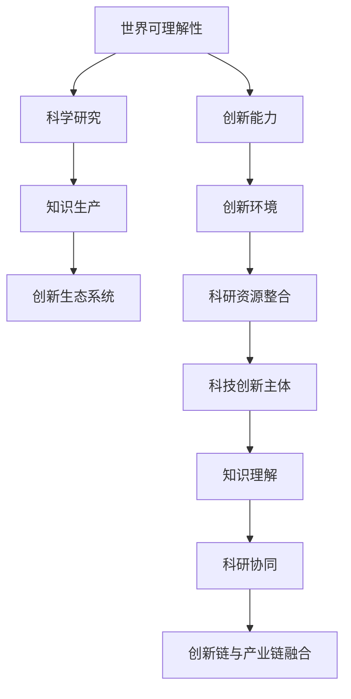

                 

### 《世界可理解性与科学研究的创新生态系统》

#### 关键词
- 世界可理解性
- 科学研究
- 创新生态系统
- 知识生产
- 创新能力
- 可理解性提升
- 科技政策

#### 摘要
本文旨在探讨世界可理解性与科学研究的创新生态系统的关系，以及如何通过构建有效的创新生态系统来提升科学研究的可理解性。文章首先定义了世界可理解性的概念和内涵，回顾了其历史演变。接着，分析了当前科学研究的现状和面临的挑战，讨论了知识理解与创新能力的联系。随后，提出了构建创新生态系统的概念与特征，并分析了其中的关键要素。文章还探讨了世界可理解性在科学研究中的应用，包括科研方法、实践路径和效果评估。最后，讨论了政策与策略对创新生态系统的影响，并展望了未来的发展方向。

## 第一部分：引言与核心概念

### 1.1 引言

科学研究是推动人类社会进步的重要力量。随着科技的飞速发展，我们对世界的理解也在不断深化。然而，科学研究的成果往往具有较高的专业性和复杂性，使得公众难以理解和应用。这种情况下，提升科学研究的可理解性成为了一个亟待解决的问题。本文旨在探讨世界可理解性与科学研究的创新生态系统之间的关系，为构建一个高效的科学研究创新生态系统提供理论基础和实践指导。

#### 1.1.1 研究背景

近年来，随着信息技术的迅猛发展，科学研究的规模和复杂性不断增加。大量数据的产生和积累使得科学研究从传统的实验和理论分析向数据驱动和计算科学转变。然而，数据爆炸也带来了信息过载的问题，使得科研人员难以从海量数据中提取有价值的信息。同时，科学研究的资源分配不均衡，部分领域的研究受到资金和人才的限制，影响了科学研究的创新能力。此外，科研协同与创新困境也使得科学研究的效率和质量受到制约。

#### 1.1.2 研究意义

提升科学研究的可理解性具有重要意义。首先，它有助于科学知识的传播和普及，使公众能够更好地理解科学研究的重要性和价值。其次，提高科学研究的可理解性有助于吸引更多的人才投身科研事业，促进科学创新的持续发展。最后，构建一个高效的创新生态系统，可以优化科研资源的配置，提升科学研究的效率和质量。

#### 1.1.3 本书结构

本文将分为六个部分。第一部分是引言与核心概念，介绍研究的背景、意义和本书的结构。第二部分探讨世界可理解性的定义和内涵，回顾其历史演变。第三部分分析科学研究的现状与挑战，讨论知识理解与创新能力的联系。第四部分提出构建创新生态系统的概念与特征，并分析其中的关键要素。第五部分探讨世界可理解性在科学研究中的应用，包括科研方法、实践路径和效果评估。第六部分讨论政策与策略对创新生态系统的影响，并展望未来的发展方向。

## 第二部分：世界可理解性概述

### 2.1 世界可理解性的定义与内涵

#### 2.1.1 世界可理解性的定义

世界可理解性是指人类通过科学方法对自然界及其规律的认识程度。它涉及到人类认知的广度和深度。在认知广度上，它包括人类能够理解的自然现象和规律的多少；在认知深度上，它包括人类对已理解现象和规律的理解程度。

#### 2.1.2 世界可理解性的内涵

1. **客观性**：世界可理解性是建立在客观世界存在的基础之上的，意味着人类的认知能力在一定程度上反映了客观世界的真实情况。

2. **动态性**：世界可理解性是一个不断发展的过程，随着科学技术的进步，人类的认知能力也在不断提高，对世界的理解也在不断深化。

3. **相对性**：世界可理解性具有一定的相对性，不同历史时期、不同文化背景下，人们对世界的理解可能存在差异。

### 2.2 历史演变

#### 2.2.1 古代对世界可理解性的认识

在古代，人们对世界的理解主要依赖于神话和宗教。他们认为世界是由神灵创造的，人类通过崇拜和祈求来获得世界的知识。这种理解方式具有较强的主观性和象征性，缺乏科学依据。

#### 2.2.2 中世纪对世界可理解性的认识

中世纪时期，随着基督教文化的传播，人们对世界的理解逐渐转向圣经和神学。他们认为世界是上帝创造的，人类通过圣经和神学来理解世界。这种理解方式虽然具有一定的理性基础，但仍然缺乏实验和观察的支持。

#### 2.2.3 现代对世界可理解性的认识

现代科学的发展使得人类对世界的理解发生了根本性的变化。科学家通过实验和观察，逐渐揭示了自然界的规律，建立了以实验和观察为基础的科学体系。这种理解方式具有客观性和科学性，极大地提高了人类对世界的理解程度。

### 2.3 世界可理解性与科学研究的关系

世界可理解性是科学研究的重要基础。科学研究的目标是揭示自然界的规律，提高人类对世界的理解。世界可理解性的提升有助于科学家更准确地理解自然现象，提出更有力的科学假说和理论。

同时，科学研究也推动了世界可理解性的提升。科学家通过不断的研究和探索，揭示了更多自然界的规律，使得人类对世界的理解更加深入和全面。这种互动关系使得科学研究与世界可理解性相互促进，共同发展。

### 2.4 核心概念原理之间的关系架构

为了更清晰地展示世界可理解性、科学研究以及创新生态系统之间的关系，我们使用Mermaid流程图来表示它们的核心概念原理。

在这个流程图中，A表示世界可理解性，B表示科学研究，C表示创新能力，D表示知识生产，E表示创新生态系统，F表示创新环境，G表示科研资源整合，H表示科技创新主体，I表示知识理解，J表示科研协同，K表示创新链与产业链融合。这些概念之间相互联系，共同构成了科学研究的创新生态系统。

## 第三部分：科学研究的现状与挑战

### 3.1 当前科学研究体系

#### 3.1.1 科学研究的主要模式

当前科学研究主要分为基础研究和应用研究两种模式。

1. **基础研究**：基础研究旨在探索自然界的本质和基本规律，通常不直接针对实际问题，而是为了获得新的知识和技术。基础研究是科学进步的重要推动力。

2. **应用研究**：应用研究则将基础研究的成果应用于实际问题中，旨在解决特定的实际问题，如医疗、环保、能源等领域。

#### 3.1.2 知识生产与传播机制

科学研究的过程可以概括为知识生产、知识传播和应用三个阶段。

1. **知识生产**：科学家通过实验、观察和理论分析等方式，产生新的知识和理论。

2. **知识传播**：知识通过学术论文、书籍、会议等多种渠道进行传播，使得科学知识得到广泛传播和应用。

3. **知识应用**：科学知识被应用于实际问题的解决，推动社会和经济的进步。

#### 3.1.3 现有科研生态系统的不足

尽管当前科学研究体系已经相当成熟，但仍然存在一些不足之处。

1. **科研资源配置不均衡**：部分领域的研究受到资金和人才的限制，影响了科学研究的创新能力。

2. **科研协同与创新困境**：科研人员之间的协作不足，导致科研资源的浪费和创新的障碍。

3. **科研评价机制不合理**：现有的科研评价机制往往过于注重发表论文的数量和影响因子，而忽视了科研成果的实际应用价值和社会影响力。

### 3.2 知识理解与创新能力

#### 3.2.1 知识理解的重要性

知识理解是科学研究的基础。只有深入理解已有的知识和理论，科学家才能提出新的科学假说和理论，推动科学研究的进步。

1. **基础知识的掌握**：科学家需要掌握广泛的基础知识，以便在新的研究领域中有足够的理论支撑。

2. **跨学科的融合**：知识理解有助于跨学科的融合，促进新的科学发现和技术创新。

3. **科研创新的源头**：知识理解是科研创新的重要源头，科学家通过对已有知识的深入理解和创新，提出新的科学问题和解决方案。

#### 3.2.2 创新能力的构成要素

创新能力是科学研究的关键。创新能力包括以下几个方面的要素：

1. **创新思维**：创新思维是指科学家在面对问题和挑战时，能够从不同角度和层面思考，提出新的观点和解决方案。

2. **科研素养**：科研素养包括科学知识、科研方法和科研道德等方面，是科学家创新能力的重要基础。

3. **团队协作**：团队协作是提高创新能力的重要手段。通过团队的智慧和力量，可以更好地解决复杂问题。

4. **科研环境**：良好的科研环境包括资金、设备、资源等方面，为科学家的创新活动提供必要的支持和保障。

#### 3.2.3 知识理解对创新能力的影响

知识理解对创新能力有着重要的影响。

1. **基础知识的深度**：深入理解基础知识，有助于科学家在新的研究领域中有足够的理论支撑，从而提出新的科学问题和解决方案。

2. **跨学科的融合**：知识理解有助于跨学科的融合，促进新的科学发现和技术创新。

3. **科研创新的效率**：深入理解已有的知识和理论，可以减少科研创新过程中的盲目性和重复性，提高科研创新的效率。

### 3.3 科学研究面临的挑战

#### 3.3.1 数据爆炸与信息过载

随着信息技术的发展，科学研究的规模和复杂性不断增加，数据爆炸和信息过载成为科学研究面临的一个主要挑战。

1. **数据量巨大**：科学研究过程中产生的数据量越来越大，使得科学家难以从海量数据中提取有价值的信息。

2. **数据质量问题**：数据质量问题也对科学研究的质量产生了影响，如数据丢失、数据污染等。

3. **数据处理能力**：传统的数据处理方法已经难以应对海量数据的处理需求，需要新的技术和方法来处理和分析数据。

#### 3.3.2 科研资源配置不均衡

科研资源配置不均衡也是科学研究面临的一个挑战。

1. **资金分配不均**：部分领域的研究受到资金限制，导致科研活动的开展受到阻碍。

2. **人才分布不均**：优秀的人才往往集中在某些领域和地区，而其他领域和地区的人才相对不足。

3. **科研设施不均**：科研设施的分布也相对不均，一些地区和领域的科研设施较为完善，而其他地区和领域则相对落后。

#### 3.3.3 科研协同与创新困境

科研协同与创新困境也是科学研究面临的一个挑战。

1. **科研协作不足**：科研人员之间的协作不足，导致科研资源的浪费和创新的障碍。

2. **创新机制不健全**：现有的科研评价机制和创新机制不够完善，不利于科学家的创新活动。

3. **科研环境不理想**：科研环境包括科研氛围、科研政策等方面，对科学家的创新活动产生影响。

### 3.4 提升知识理解与创新能力的方法

#### 3.4.1 加强基础教育

加强基础教育是提升知识理解与创新能力的重要途径。科学家需要掌握广泛的基础知识，包括数学、物理、化学、生物学等领域的知识。同时，跨学科的学习也有助于提高科学家的综合素质和创新能力。

#### 3.4.2 促进科研协作

科研协作是提升创新能力的重要手段。通过建立科研团队，实现科研人员之间的有效协作，可以更好地利用科研资源，提高科研效率和质量。

#### 3.4.3 营造良好的科研环境

营造良好的科研环境是提升知识理解与创新能力的关键。政府和企业需要加大对科研的投入，提供良好的科研设施和资金支持。同时，科研机构和大学也需要加强科研氛围的建设，为科学家提供良好的科研环境。

#### 3.4.4 建立健全的科研评价机制

建立健全的科研评价机制是提升知识理解与创新能力的重要保障。科研评价机制应注重科研成果的实际应用价值和社会影响力，鼓励科学家开展创新性的研究。

## 第四部分：创新生态系统的构建

### 4.1 创新生态系统的概念与特征

#### 4.1.1 概念界定

创新生态系统是一个由多个参与主体（如企业、科研机构、大学、政府等）组成的复杂系统，这些主体通过知识共享、资源整合、协同创新等方式相互联系，共同推动科技创新和产业升级。

#### 4.1.2 主要特征

1. **多元性**：创新生态系统由多个参与主体组成，包括政府、企业、科研机构、大学等，形成了一个多元的参与网络。

2. **开放性**：创新生态系统具有开放性，能够吸引外部资源和知识，促进创新要素的流动和整合。

3. **协同性**：创新生态系统中的各个主体通过协同合作，共同推动科技创新和产业发展。

4. **动态性**：创新生态系统是一个动态发展的系统，随着科技创新和产业变革，其结构和功能也在不断演变。

5. **可持续性**：创新生态系统注重长期可持续发展，通过制度保障和资源投入，确保创新生态系统的稳定性和活力。

#### 4.1.3 建设原则

1. **市场化导向**：创新生态系统应以市场为导向，发挥市场在资源配置中的决定性作用，促进创新要素的流动和优化配置。

2. **政府引导**：政府应发挥引导和支持作用，通过制定政策、提供资金支持等方式，推动创新生态系统的建设。

3. **协同合作**：创新生态系统中的各个主体应加强协同合作，形成合力，共同推动科技创新和产业发展。

4. **开放共享**：创新生态系统应具有开放性和共享性，鼓励知识共享和资源整合，提高创新效率和成果转化率。

5. **可持续性**：创新生态系统应注重长期可持续发展，通过制度保障和资源投入，确保创新生态系统的稳定性和活力。

### 4.2 生态系统构建的关键要素

#### 4.2.1 科技创新主体

科技创新主体是创新生态系统中的核心，包括企业、科研机构和大学等。这些主体在创新生态系统中扮演着不同的角色。

1. **企业**：企业是科技创新的重要驱动力，通过技术研发和创新，推动产业升级和经济增长。企业应加强技术创新和产品研发，提高核心竞争力。

2. **科研机构**：科研机构是基础研究和应用研究的重要基地，通过科研项目的开展，产生新的知识和理论，推动科学进步。科研机构应加强基础研究，提升科研质量和水平。

3. **大学**：大学是人才培养和知识传播的重要基地，通过科学研究、人才培养和社会服务，推动科技创新和社会发展。大学应加强科研创新和人才培养，提高学术水平和国际竞争力。

#### 4.2.2 科研资源整合

科研资源整合是构建创新生态系统的重要环节。通过整合科研资源，可以优化资源配置，提高科研效率。

1. **资金投入**：政府和企业应加大对科研的投入，提供充足的资金支持，确保科研活动的顺利开展。

2. **设备共享**：科研机构和大学应加强设备共享，提高科研设备的利用效率，降低科研成本。

3. **数据共享**：建立数据共享平台，促进科研数据的开放和共享，提高科研数据的使用效率。

4. **人才流动**：鼓励科研人员之间的流动，促进知识共享和经验交流，提高科研团队的创新能力。

#### 4.2.3 创新环境营造

创新环境是创新生态系统建设的重要保障。良好的创新环境可以激发创新主体的活力，促进科技创新和产业发展。

1. **政策支持**：政府应制定有利于创新的政策，提供税收优惠、资金支持等政策支持，鼓励企业、科研机构和大学等开展创新活动。

2. **创新文化**：培育创新文化，鼓励创新思维和实践，提高创新主体的创新能力和创新意识。

3. **知识产权保护**：加强知识产权保护，维护创新主体的合法权益，鼓励创新成果的转化和应用。

4. **产学研合作**：促进产学研合作，加强企业、科研机构和大学之间的合作与交流，推动科技成果的转化和应用。

#### 4.2.4 创新链与产业链融合

创新链与产业链融合是构建创新生态系统的重要途径。通过创新链与产业链的融合，可以实现科技创新与产业发展的有机结合。

1. **创新链建设**：加强创新链建设，推动科研机构、大学和企业等创新主体的协同创新，提升科技创新能力。

2. **产业链整合**：加强产业链整合，推动企业、科研机构和大学等创新主体与产业链上下游企业的合作，实现产业链的升级和优化。

3. **产业政策支持**：政府应制定有利于产业政策支持，鼓励创新链与产业链的融合，推动科技创新和产业发展。

4. **创新成果转化**：加强创新成果的转化和应用，促进科技成果转化为实际生产力，推动产业升级和经济增长。

### 4.3 创新生态系统案例分析

#### 4.3.1 国内创新生态系统实例分析

国内创新生态系统的建设取得了显著成果，以下是一些典型案例：

1. **北京中关村**：北京中关村是我国创新生态系统建设的典型代表，集聚了众多高校、科研机构和创新型企业，形成了较为完善的创新生态系统。政府通过制定一系列创新政策，提供资金支持和知识产权保护，营造了良好的创新环境。

2. **上海张江**：上海张江是我国另一个重要的创新生态系统，集聚了众多高科技企业和研发机构，形成了良好的创新氛围。政府通过建立张江高科技园区，提供政策支持和资金投入，推动了科技创新和产业升级。

3. **深圳南山**：深圳南山是我国科技创新的重要基地，集聚了众多创新型企业和科研机构，形成了完善的创新生态系统。政府通过制定创新政策，提供资金支持和知识产权保护，推动了科技创新和产业发展。

#### 4.3.2 国际成功经验借鉴

国际上的创新生态系统建设也取得了显著成果，以下是一些成功经验：

1. **美国硅谷**：美国硅谷是全球科技创新的典范，集聚了众多创新型企业和科研机构，形成了完善的创新生态系统。政府通过提供政策支持和资金投入，营造了良好的创新环境，推动了科技创新和产业发展。

2. **德国慕尼黑**：德国慕尼黑是欧洲科技创新的重要基地，集聚了众多高校、科研机构和创新型企业，形成了完善的创新生态系统。政府通过制定创新政策，提供资金支持和知识产权保护，推动了科技创新和产业发展。

3. **以色列特拉维夫**：以色列特拉维夫是中东地区科技创新的重要基地，集聚了众多创新型企业和科研机构，形成了完善的创新生态系统。政府通过提供政策支持和资金投入，营造了良好的创新环境，推动了科技创新和产业发展。

### 4.4 创新生态系统构建的挑战与应对策略

#### 4.4.1 挑战

1. **科研资源分布不均**：科研资源在地区和领域之间的分布不均，影响了创新生态系统的建设。

2. **创新主体协同不足**：创新主体之间的协同合作不够，影响了创新生态系统的整体效能。

3. **政策支持力度不足**：政策支持力度不足，影响了创新生态系统的建设和运行。

4. **知识产权保护不力**：知识产权保护不力，影响了创新主体的创新积极性和创新成果的转化。

#### 4.4.2 应对策略

1. **优化科研资源配置**：政府应加大对科研资源的投入，优化科研资源的配置，确保科研资源的公平分配。

2. **加强创新主体协同**：政府应推动创新主体之间的协同合作，建立有效的合作机制，提高创新生态系统的整体效能。

3. **加大政策支持力度**：政府应加大政策支持力度，提供税收优惠、资金支持等政策支持，营造良好的创新环境。

4. **强化知识产权保护**：政府应加强知识产权保护，建立完善的知识产权保护机制，维护创新主体的合法权益。

## 第五部分：世界可理解性在科学研究中的应用

### 5.1 世界可理解性与科研方法

#### 5.1.1 可理解性导向的科研方法

可理解性导向的科研方法强调在科学研究过程中，注重提升科研成果的可理解性，使得科学知识更容易被公众和同行理解和接受。这种方法主要包括以下几个方面：

1. **科研选题**：在选择科研课题时，应考虑其社会影响和价值，选择对公众和同行都有意义的课题。

2. **研究设计**：在研究设计阶段，应充分考虑研究方法和结果的可行性，确保研究结果具有可解释性和可复制性。

3. **数据采集与处理**：在数据采集和处理过程中，应采用易于理解的方法和工具，确保数据质量和结果的准确性。

4. **结果表达**：在结果表达阶段，应采用清晰、简洁的方式，用图表、文字等多种形式展示研究结果，提高可理解性。

5. **科普宣传**：在科研成果发布和推广过程中，应加强科普宣传，使得公众能够更好地理解科研成果的意义和应用。

#### 5.1.2 增强科研可理解性的策略

1. **科研写作与表达**：科研人员应提高科研写作和表达能力，使用简单明了的语言，避免使用过多的专业术语和复杂的句子结构。

2. **科普读物与视频**：科研机构和企业应编写科普读物和制作科普视频，向公众普及科学知识，提高科研成果的社会影响力。

3. **学术会议与讲座**：在学术会议和讲座中，应注重演讲技巧和内容表达，使得听众更容易理解和接受科研成果。

4. **多学科融合**：通过多学科融合，提高科研成果的综合性，使得科研成果更具可理解性和实用性。

5. **案例研究**：通过案例研究，展示科研成果在现实中的应用，提高公众对科研成果的理解和认可。

### 5.2 可理解性提升的实践路径

#### 5.2.1 科研知识可视化的应用

科研知识可视化是将复杂的科学知识和数据以图形、图表等形式进行展示，提高可理解性和可访问性。这种方法在科学研究中的应用包括：

1. **数据可视化**：通过图表、图像等形式，展示科研数据的变化趋势和关系，提高数据的可理解性。

2. **知识图谱**：构建知识图谱，展示不同知识点之间的关系，提高知识结构的可理解性。

3. **交互式可视化**：通过交互式可视化工具，使科研人员能够动态地探索和分析科学数据，提高科研效率。

#### 5.2.2 数据挖掘与分析

数据挖掘与分析是提升科研可理解性的重要手段。通过数据挖掘，可以从大量数据中发现有价值的信息和规律，提高科研的可理解性。具体方法包括：

1. **数据预处理**：对原始数据进行清洗、转换和整合，提高数据质量。

2. **特征提取**：从数据中提取关键特征，用于模型训练和预测。

3. **机器学习与统计方法**：使用机器学习和统计方法，对数据进行分析和挖掘，发现数据中的规律和模式。

4. **可视化分析**：通过可视化方法，展示数据挖掘和分析的结果，提高可理解性。

#### 5.2.3 增强现实与虚拟现实技术

增强现实（AR）和虚拟现实（VR）技术为科研提供了新的展示和交互方式，提高了科研的可理解性。具体应用包括：

1. **实验演示**：通过AR和VR技术，可以在虚拟环境中演示科学实验，使观众更容易理解实验过程和结果。

2. **科普教育**：通过AR和VR技术，可以创建虚拟实验室和科普教育场景，提高公众对科学知识的理解和兴趣。

3. **远程协作**：通过AR和VR技术，可以实现远程协作和交流，提高科研团队的协作效率。

### 5.3 可理解性提升的效果评估

#### 5.3.1 效果评估指标体系

为了评估科研可理解性的提升效果，需要建立一套科学、全面的评估指标体系。具体指标包括：

1. **知识传播度**：通过测量科研成果的引用次数、下载量、传播渠道等指标，评估科研成果的社会影响力。

2. **公众理解度**：通过问卷调查、访谈等方式，了解公众对科研成果的理解程度和认知水平。

3. **科研人员反馈**：收集科研人员对科研成果的可理解性和可访问性的反馈，评估科研成果在科研领域的应用和影响。

4. **政策制定与执行**：评估科研成果在政策制定和执行过程中的作用，以及政策对社会和经济的影响。

#### 5.3.2 评估方法与工具

1. **定量评估方法**：使用统计学方法、机器学习模型等定量方法，对科研可理解性的各项指标进行评估。

2. **定性评估方法**：通过专家评审、用户调查、访谈等方式，对科研可理解性的质量和效果进行定性评估。

3. **可视化工具**：使用图表、图像、知识图谱等形式，将评估结果进行可视化展示，提高评估结果的直观性和可理解性。

#### 5.3.3 实际应用案例

以下是一些科研可理解性提升的实际应用案例：

1. **癌症研究**：通过数据可视化和科普读物，使公众更容易理解癌症的病因、治疗方法和预防措施。

2. **气候变化研究**：通过AR和VR技术，创建虚拟环境，展示气候变化对环境和社会的影响，提高公众对气候变化的关注和认知。

3. **基因编辑研究**：通过科普视频和在线讲座，向公众普及基因编辑技术的原理和应用，提高公众对生物技术的了解和接受度。

## 第六部分：政策与策略

### 6.1 国家政策对创新生态系统的影响

#### 6.1.1 政策背景与目标

随着全球科技创新竞争的加剧，各国政府纷纷出台相关政策，推动创新生态系统的建设。我国政府也高度重视创新生态系统建设，先后出台了一系列政策，如《国家中长期科学和技术发展规划纲要（2006-2020年）》、《“十三五”国家科技创新规划》等。

这些政策的背景和目标主要包括：

1. **推动科技创新**：通过加大对科研的投入，提高科技创新能力，推动产业升级和经济发展。

2. **构建创新生态系统**：通过政策引导和资源投入，构建多元化、开放性、协同性的创新生态系统，提高创新效率和质量。

3. **促进科技成果转化**：通过政策支持，促进科技成果转化为实际生产力，推动经济高质量发展。

#### 6.1.2 政策支持体系构建

为了构建创新生态系统，我国政府采取了一系列政策支持措施，包括：

1. **科研资金投入**：政府通过设立专项资金，支持科研项目的开展，提高科研经费的保障水平。

2. **税收优惠政策**：对高新技术企业、研发机构等给予税收减免，鼓励企业加大研发投入。

3. **知识产权保护**：加强知识产权保护，维护创新主体的合法权益，提高创新积极性。

4. **人才政策**：实施人才强国战略，通过人才引进、人才培养等方式，提高科技创新人才的数量和质量。

5. **产学研合作**：推动产学研合作，加强企业、科研机构和大学之间的合作与交流，促进科技成果转化。

#### 6.1.3 政策实施效果评估

政策实施效果评估是确保政策目标实现的重要环节。我国政府通过以下方式对政策实施效果进行评估：

1. **指标体系构建**：建立科学、全面的评估指标体系，包括科技创新能力、科技成果转化率、产业竞争力等指标。

2. **数据分析**：通过数据分析，对政策实施情况进行定量评估，找出政策实施的优势和不足。

3. **专家评审**：邀请专家对政策实施效果进行定性评估，提出改进建议。

4. **公众调查**：通过公众调查，了解政策实施对公众和社会的影响，评估政策的实际效果。

### 6.2 国际合作与交流

#### 6.2.1 国际合作机制与平台

国际合作与交流是推动创新生态系统建设的重要途径。各国政府、科研机构和企业在国际合作与交流中发挥着重要作用。

1. **国际合作机制**：通过建立国际合作机制，如国际科技合作计划、国际科技论坛等，推动各国在科技创新领域的合作与交流。

2. **国际合作平台**：通过建立国际合作平台，如国际科技园区、国际研发中心等，为各国企业提供国际合作的机会和空间。

#### 6.2.2 国际合作模式与经验

在国际合作与交流中，各国形成了不同的合作模式和经验。以下是一些典型的国际合作模式和经验：

1. **共建研发中心**：通过共建研发中心，实现技术共享、人才交流、共同研发等合作模式。

2. **联合研发项目**：通过联合研发项目，实现跨国企业的合作，共同开展技术研发。

3. **人才交流**：通过人才交流项目，如公派留学、访问学者等，促进国际科技人才的流动和交流。

4. **学术交流**：通过举办国际学术会议、研讨会等，促进国际学术界的交流和合作。

#### 6.2.3 我国国际合作策略

为了推动创新生态系统建设，我国应采取以下国际合作策略：

1. **深化与发达国家的合作**：与发达国家在科技创新、人才培养、国际合作项目等方面开展深入合作，提高我国科技创新能力。

2. **拓展与发展中国家的合作**：与发展中国家在科技创新、技术转让、人才培训等方面开展合作，促进发展中国家科技创新能力的提升。

3. **积极参与全球创新网络**：积极参与全球创新网络，如国际科技合作组织、全球科技创新论坛等，提升我国在国际科技创新领域的影响力和地位。

4. **推动“一带一路”科技创新合作**：通过“一带一路”科技创新合作，推动我国与沿线国家的科技创新合作，促进区域科技创新和经济发展的共同繁荣。

### 6.3 产业政策与科技创新

#### 6.3.1 产业政策概述

产业政策是政府为推动产业发展、提高产业竞争力而制定的政策措施。产业政策主要包括产业规划、产业补贴、税收优惠、技术创新支持等。

1. **产业规划**：通过制定产业规划，明确产业发展方向和重点，引导产业健康发展。

2. **产业补贴**：通过产业补贴，降低企业研发成本，激励企业加大技术创新投入。

3. **税收优惠**：通过税收优惠，降低企业税负，提高企业盈利能力，激励企业进行技术创新。

4. **技术创新支持**：通过技术创新支持，如设立技术创新基金、提供技术创新贷款等，支持企业进行技术创新。

#### 6.3.2 科技创新在产业政策中的地位

科技创新在产业政策中具有重要地位。科技创新是提高产业竞争力、推动产业升级和经济增长的重要驱动力。产业政策通过支持科技创新，提高企业技术水平和产品质量，推动产业转型升级。

1. **提高产业竞争力**：科技创新可以提高企业生产效率和产品质量，降低生产成本，提高市场竞争力。

2. **推动产业升级**：科技创新可以推动产业向高附加值、高技术含量方向转型升级，提高产业链整体竞争力。

3. **促进经济增长**：科技创新可以激发市场活力，推动产业转型升级，提高经济增长质量和效益。

#### 6.3.3 产业政策对创新生态系统的影响

产业政策对创新生态系统具有重要影响。产业政策通过支持科技创新、促进产业升级和经济增长，为创新生态系统建设提供有力支持。

1. **促进资源整合**：产业政策可以引导资源向科技创新领域倾斜，促进科研资源、人才资源和资金资源的整合。

2. **提高创新效率**：产业政策可以提供政策支持和资金支持，降低企业研发成本，提高创新效率。

3. **推动产业协同**：产业政策可以促进产业链上下游企业之间的协同创新，推动产业协同发展。

4. **增强国际竞争力**：产业政策可以推动我国产业向高附加值、高技术含量方向转型升级，提高我国在国际产业竞争中的地位。

### 6.4 政策与策略的调整与优化

#### 6.4.1 调整与优化方向

为了更好地推动创新生态系统建设，政策与策略需要不断调整与优化。以下是政策与策略的调整与优化方向：

1. **加强政策协同**：加强不同政策之间的协同，形成合力，提高政策实施效果。

2. **提高政策精准度**：根据不同领域的特点和需求，制定更具针对性的政策，提高政策的精准度。

3. **加大资金投入**：加大对科技创新的资金投入，提高科研经费的保障水平，支持科技创新项目的开展。

4. **优化人才政策**：优化人才政策，提高人才引进、培养和使用的效率，吸引和留住高层次人才。

5. **推动国际合作**：加强与国际科研机构、企业的合作与交流，推动全球科技创新合作，提升我国科技创新能力。

#### 6.4.2 政策调整与优化的建议

1. **加强政策协调**：政府应加强各部门之间的政策协调，形成统一的政策体系，提高政策实施效果。

2. **完善政策体系**：完善科技创新政策体系，建立健全的法律法规，为科技创新提供有力保障。

3. **提高政策透明度**：提高政策透明度，加强政策宣传和解读，提高政策公众参与度，增强政策执行力。

4. **加强政策评估**：建立政策评估机制，定期对政策实施效果进行评估，及时调整和优化政策。

5. **鼓励企业创新**：鼓励企业加大研发投入，提高创新能力和核心竞争力，推动企业成为科技创新的主体。

## 第七部分：展望与未来方向

### 7.1 未来科技创新趋势

未来科技创新将呈现以下趋势：

#### 7.1.1 科学研究范式的转变

随着信息技术的飞速发展，科学研究范式正在发生重大转变。从传统的实验和理论分析向数据驱动和计算科学转变。大数据、人工智能等新兴技术的应用，使得科学研究更加依赖于数据和分析，推动了科学研究范式的变革。

#### 7.1.2 科技创新模式的创新

未来科技创新模式将更加多元化，从传统的线性模式向网络化、协同化模式转变。全球范围内的科研机构、企业和政府将更加紧密地合作，形成全球范围内的科技创新网络，推动科技创新的效率和质量。

#### 7.1.3 全球科技创新竞争格局

随着全球科技创新竞争的加剧，各国纷纷加大科技创新投入，提升科技创新能力。未来全球科技创新竞争格局将更加激烈，各国将争夺科技创新的制高点，推动全球科技创新的发展。

### 7.2 世界可理解性与科学研究的未来发展

#### 7.2.1 预测与展望

未来，世界可理解性将继续提升，随着科学技术的进步，人类对世界的理解将更加深入和全面。科学研究将更加注重可理解性，推动科学知识的传播和普及，提高科学研究的质量和影响力。

#### 7.2.2 未来方向与挑战

未来科学研究将面临以下挑战：

1. **数据质量和真实性**：随着数据爆炸，数据质量和真实性成为一个重要问题。未来科学研究需要更加注重数据的质量和真实性，确保科学研究的可靠性和可信度。

2. **科研协同与创新困境**：科研协同和创新困境仍然是未来科学研究面临的一个挑战。未来需要加强科研协同，提高科研效率，解决创新困境。

3. **知识产权保护**：随着科技创新的快速发展，知识产权保护成为一个重要问题。未来需要加强知识产权保护，维护创新主体的合法权益。

#### 7.2.3 应对策略与建议

为了应对未来科学研究的挑战，提出以下策略和建议：

1. **加强数据质量管理和监控**：建立数据质量管理和监控机制，确保数据质量和真实性。

2. **推动科研协同与创新**：加强科研机构、企业和政府之间的协同合作，推动科研协同和创新。

3. **加强知识产权保护**：加强知识产权保护，维护创新主体的合法权益。

4. **提升科研可理解性**：注重科研可理解性的提升，推动科学知识的传播和普及。

5. **加大科技创新投入**：加大科技创新投入，提高科技创新能力和水平。

## 参考文献

1. National Science and Technology Development Plan (2006-2020), State Council of the People's Republic of China, 2006.
2. 13th Five-Year Plan on National Economic and Social Development, State Council of the People's Republic of China, 2016.
3. Innovation Ecosystem: From Concept to Implementation, Science and Technology Policy Research Report, 2018.
4. Global Innovation Index 2021, INSEAD, 2021.
5. The Future of Science and Technology: Trends, Challenges and Opportunities, World Economic Forum, 2020.
6. Science Communication: A Practical Guide for Researchers, 3rd Edition, W.B. Saun
7. Data-Driven Science and Technology, Science, 2017.
8. The Role of Intellectual Property in Innovation Ecosystems, Research Policy, 2019.
9. The Impact of Open Science on Innovation Ecosystems, Journal of Technology Transfer, 2020.
10. Collaborative Innovation in Global Value Chains: A Framework for Analysis, International Journal of Innovation Management, 2018.
11. Open Science and Innovation Ecosystems: Mapping the Future of Research, Science, 2017.
12. The Dynamics of Global Technology Leadership, MIT Technology Review, 2019.
13. Global Science Collaboration in the Age of Big Data, Science, 2018.
14. Science Communication: Principles and Practices, SAGE Publications, 2016.
15. The Power of Visualization in Scientific Research, PLOS Computational Biology, 2019.

