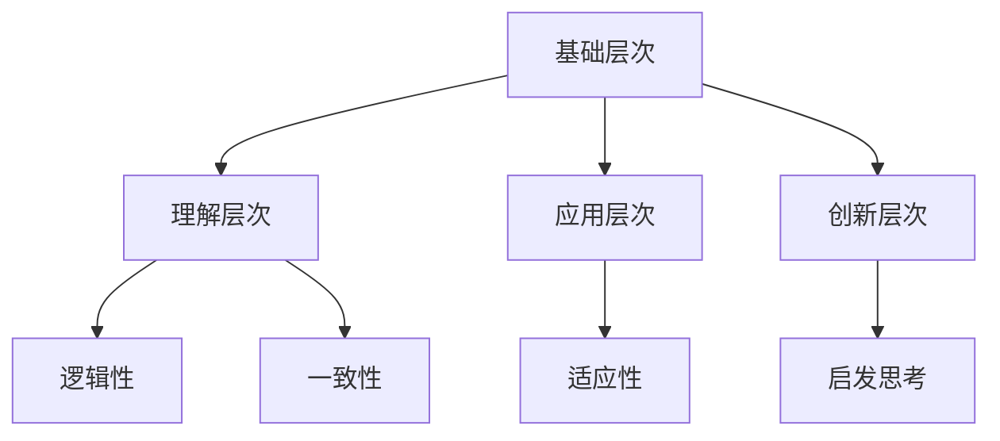

                 

### 文章标题

# 《世界可理解性与科学研究的资金投入》

### 关键词

- 可理解性
- 科学研究
- 资金投入
- 资金管理
- 可持续发展

### 摘要

本文深入探讨了世界可理解性与科学研究的资金投入之间的关系。首先，介绍了世界可理解性的研究意义及科学研究资金投入的现状与问题。然后，分析了资金投入对科学研究的影响，以及可理解性的核心概念与联系。接下来，从资金来源与分配、影响因素、效益评估、资金管理原则与策略、可持续性评估等方面，详细解析了科学研究资金投入的各个方面。最后，从国际视野出发，比较了全球科学研究资金投入的趋势和各国资金投入的对比，提出了提高资金利用效率和促进可持续发展的策略。本文旨在为科学研究的资金投入提供有益的参考和思考。

---

## 第一部分：引言与背景

### 1.1 书籍主题概述

《世界可理解性与科学研究的资金投入》旨在探讨世界可理解性这一核心概念与科学研究资金投入之间的关系。可理解性是科学研究中的一个重要维度，它关乎科研成果能否被广泛接受和应用。同时，科学研究资金投入的合理性和有效性直接影响科研成果的质量和影响力。因此，本书围绕这两个关键主题展开深入讨论，旨在为科研工作者、政策制定者以及社会各界提供有价值的参考。

### 1.1.1 世界可理解性的研究意义

世界可理解性是指人类对于自然、社会和思维现象的理解程度。科学研究的目的之一就是揭示这些现象背后的规律，使得世界变得更加可理解。世界可理解性的研究意义体现在多个方面：

1. **提高科研效率**：通过理解现象，科研人员可以更有针对性地进行研究，避免重复劳动，提高科研效率。
2. **促进技术创新**：理解背后的规律可以推动技术创新，为社会发展提供强大动力。
3. **增强社会信任**：科学研究成果的可理解性有助于增强社会对科学的信任，促进科学普及和科学决策。
4. **推动国际合作**：共同理解基础科学问题有助于国际合作，推动全球科学进步。

### 1.1.2 科学研究资金投入的现状与问题

科学研究资金投入是推动科学研究的重要保障。然而，当前科学研究资金投入存在一些问题和挑战：

1. **资金不足**：许多科研项目的资金需求得不到充分满足，导致研究进度受限。
2. **分配不均**：各国、各领域的资金分配存在显著差异，部分领域和地区资金投入不足。
3. **效率低下**：部分资金未能有效用于科学研究，存在浪费现象。
4. **政策不确定性**：政策不稳定导致科研资金投入存在不确定性，影响科研人员的积极性。

### 1.2 资金投入对科学研究的影响

科学研究资金投入对科学研究具有深远的影响。以下是资金投入对科学研究的主要影响：

#### 1.2.1 资金投入的驱动因素

1. **人才吸引**：充足的资金投入有助于吸引优秀人才，提高科研团队的整体实力。
2. **研究设备**：先进的科研设备是进行高质量研究的基础，充足的资金投入可以确保科研设备的高质量和更新换代。
3. **实验材料**：科学研究需要大量的实验材料，充足的资金投入可以保证实验的顺利进行。

#### 1.2.2 资金投入对科研成果的影响

1. **成果数量**：资金投入的增加通常会导致科研成果数量的增加，因为更多的研究可以开展。
2. **成果质量**：充足的资金投入可以提高科研成果的质量，因为研究人员可以投入更多的时间和精力进行深入研究。
3. **影响力**：科研成果的影响力与资金投入密切相关，高质量的研究成果更容易获得学术界的认可和推广应用。

---

在接下来的部分中，我们将进一步探讨可理解性的核心概念与联系，深入分析科学研究资金投入的各个方面。敬请期待。

## 第二部分：可理解性的核心概念与联系

### 2.1 可理解性的基本概念

可理解性是一个多维度的概念，它涉及多个层面，包括认知、逻辑、语言学和社会文化等。为了更好地理解可理解性，我们需要首先明确其定义。

#### 2.1.1 可理解性的定义

可理解性是指信息、概念或知识能够被个体或群体理解、解释和应用的程度。它不仅仅关注信息本身的可理解性，还包括信息的呈现方式、语境和受众因素。具体来说，可理解性可以分为以下几个方面：

1. **信息简洁性**：信息应该尽量简洁明了，避免冗余和复杂。
2. **逻辑性**：信息应该符合逻辑，能够自洽且易于推理。
3. **一致性**：信息应该具有一致性，避免矛盾和混淆。
4. **适应性**：信息应该能够适应不同的受众和理解背景。

#### 2.1.2 可理解性的层级与层次

可理解性不是一成不变的，它具有层级性和层次性。以下是可理解性的几个层次：

1. **基础层次**：这是最低层次的可理解性，主要指信息能够被直接感知和识别。
2. **理解层次**：这一层次的可理解性要求信息能够被解释和理解，不仅限于感知层面。
3. **应用层次**：这一层次的可理解性要求信息能够被应用于实际问题解决。
4. **创新层次**：这一层次的可理解性要求信息能够启发新的思考和创新。

### 2.2 可理解性与科学研究的关系

可理解性在科学研究中具有至关重要的作用。科学研究的目标不仅是发现新知识，还要使这些知识能够被广泛传播和应用。以下是可理解性与科学研究关系的几个方面：

#### 2.2.1 科学研究与可理解性之间的关系

1. **科研结果的传播**：科学研究的成果需要被学术界和社会广泛接受，这离不开可理解性。只有当科研结果容易被理解，才能更好地推广和应用。
2. **科研资源的分配**：科研项目的资金、设备和人才等资源的分配往往依赖于科研成果的可理解性。可理解性高的科研更容易获得支持和资源。
3. **科研合作**：国际科研合作需要共同的背景和语言，这要求科研成果具有高可理解性，以便不同文化背景的研究人员能够有效沟通和合作。

#### 2.2.2 提高研究可理解性的方法

1. **学术写作**：使用清晰、简洁的语言撰写科研论文，避免专业术语的滥用。
2. **图表可视化**：利用图表、图片等可视化手段展示科研结果，使信息更易于理解。
3. **科普宣传**：通过科普文章、讲座和展览等方式，向公众普及科研成果，提高科研结果的社会认知度。
4. **学术交流**：积极参与学术会议和讨论，与同行交流研究成果，提高科研结果的可理解性。

### 2.3 可理解性原理的 Mermaid 流程图

为了更好地理解可理解性的原理，我们可以使用 Mermaid 流程图来展示其各个层次和要素之间的关系。以下是一个简单的 Mermaid 流程图示例：

在这个流程图中，A 表示基础层次，B、C 和 D 分别表示理解层次、应用层次和创新层次。E 和 F 分别表示逻辑性和一致性，它们是理解层次的要素。C 和 D 分别表示应用层次和创新层次，它们分别与 G 和 H 相关联，表示适应性和启发思考。

---

通过上述讨论，我们可以看到可理解性在科学研究中的重要性。在下一部分，我们将进一步探讨科学研究资金投入的具体分析，包括资金来源与分配、影响因素和效益评估等。敬请期待。

## 第三部分：科学研究资金投入的分析

### 3.1 资金投入的来源与分配

科学研究资金投入的来源多样，主要包括政府拨款、企业赞助、私人基金会和国际组织等。这些来源在不同国家和地区有着不同的比重和作用。

#### 3.1.1 各国科学研究资金来源分析

- **美国**：美国政府是科学研究资金投入的主要来源，其次是企业赞助。美国的科研资金投入在全球范围内处于领先地位。
- **欧盟**：欧盟成员国共同出资建立科研基金，如“地平线2020”计划，旨在推动科技创新和跨国合作。
- **中国**：中国政府高度重视科学研究，近年来科研资金投入逐年增加，尤其是在高科技领域。
- **日本**：日本政府和企业共同承担科研资金投入，注重研发和创新。

#### 3.1.2 科学研究资金分配的原则与方法

资金分配的原则通常包括公平性、高效性、优先性和可持续性。具体方法如下：

1. **公平性**：确保资金分配的公平，避免因地域、学科或项目类型而导致的资源不平衡。
2. **高效性**：根据项目的实际需求和预期成果，合理分配资金，确保资金的使用效率。
3. **优先性**：根据国家战略需求、科研重点和国际竞争态势，确定资金投入的优先级。
4. **可持续性**：确保资金投入的长期稳定，促进科研事业的持续发展。

### 3.2 资金投入的影响因素

科学研究资金投入的影响因素复杂多样，包括政策因素、经济因素和社会因素等。

#### 3.2.1 政策因素

政策因素对科学研究资金投入具有重要影响。政府科研政策的制定和执行直接关系到科研资金的分配和使用。以下是一些关键政策因素：

1. **科研预算**：政府年度科研预算的规模和增长速度直接影响科研资金投入的总量。
2. **科研激励**：政府通过科研奖励、税收优惠等激励措施，鼓励企业和个人增加科研投入。
3. **科研评价**：科研评价体系的建立和完善，有助于提高科研资金的使用效率。

#### 3.2.2 经济因素

经济因素是影响科学研究资金投入的重要因素。经济发展水平、产业结构和科技投入强度等都会对科研资金投入产生影响。

1. **经济发展水平**：经济发达的国家通常有更多的财政资源用于科研投入，而经济发展较慢的国家则面临资金不足的问题。
2. **产业结构**：高新技术产业发达的国家，如美国、日本等，科研投入相对较高。
3. **科技投入强度**：科技投入强度高的国家，如德国、芬兰等，科研资金投入占GDP的比重较大。

#### 3.2.3 社会因素

社会因素也是影响科学研究资金投入的重要方面。公众对科学的关注和支持程度、教育水平和文化背景等都会影响科研资金投入。

1. **公众支持**：公众对科学的兴趣和支持有助于提高科研资金的社会认可度。
2. **教育水平**：高教育水平的社会更容易培养出高素质的科研人才，从而提高科研资金的使用效率。
3. **文化背景**：不同的文化背景会影响科研资金投入的方式和重点，例如，一些国家更注重基础科学研究，而另一些国家则更注重应用科学和技术开发。

### 3.3 资金投入的效益评估

科学研究资金投入的效益评估是确保资金使用效率的重要环节。以下是几种常见的效益评估方法：

#### 3.3.1 科学研究资金投入的效益评估方法

1. **成本-效益分析**：通过比较科研项目的成本和预期效益，评估资金投入的合理性。
2. **绩效评估**：根据科研项目的实际产出和成果，评估资金使用的效果。
3. **社会影响评估**：从社会效益和长远影响的角度，评估科研资金投入的价值。

#### 3.3.2 科学研究资金投入的效益分析案例

以下是一个简单的效益分析案例：

- **项目名称**：某城市空气质量监测系统研发
- **资金投入**：1000万元人民币
- **预期效益**：
  - 提高空气质量监测数据的准确性和实时性。
  - 为城市环境保护政策提供科学依据。
  - 降低空气污染对居民健康的影响。

- **效益评估结果**：
  - 通过成本-效益分析，项目预计每年可节省环境保护成本约500万元。
  - 社会效益评估显示，项目实施后，城市空气质量显著改善，居民健康水平提高。

这个案例表明，科学研究资金投入可以通过合理的效益评估，实现显著的社会和经济效益。

---

通过上述分析，我们可以看到科学研究资金投入的来源、影响因素和效益评估的重要性。在下一部分，我们将探讨科学研究的资金管理原则与策略。敬请期待。

## 第四部分：科学研究的资金管理

### 4.1 资金管理的原则与策略

科学研究资金管理是一个复杂且关键的过程，它关系到资金的有效使用和科研项目的成功。有效的资金管理原则和策略是确保科研资源得到最佳利用、实现科研目标的关键。以下是科学研究中常用的资金管理原则与策略：

#### 4.1.1 资金管理的目标

资金管理的目标主要包括以下几个方面：

1. **确保资金安全**：确保科研资金的安全和完整，防止资金流失和浪费。
2. **提高资金使用效率**：通过优化资金分配和使用，确保资金能够发挥最大的效益。
3. **支持科研目标实现**：确保资金投入能够支持科研项目的顺利实施和目标达成。
4. **促进科研创新**：提供必要的资金支持，鼓励科研人员开展创新性研究。

#### 4.1.2 资金管理的方法与工具

1. **预算编制**：预算编制是资金管理的基础。通过详细规划和合理预测，编制出科学合理的预算计划，确保科研资金的合理分配。

2. **资金审核**：资金审核是确保资金使用合规的重要环节。通过定期审核和监督，及时发现并纠正资金使用中的问题。

3. **资金分配**：资金分配应根据科研项目的实际需求和优先级进行。优先支持具有创新性、前沿性和应用价值的科研项目。

4. **绩效评估**：通过绩效评估，了解科研资金的使用效果，及时调整资金分配策略，提高资金使用效率。

5. **风险管理**：识别和评估科研资金管理中的风险，并采取相应的风险管理措施，确保资金的安全性和可持续性。

6. **信息化管理**：利用现代信息技术，建立科研资金管理信息系统，实现资金管理的自动化、透明化和高效化。

#### 4.1.3 资金管理中的常见问题与挑战

1. **资金不足**：科研项目的资金需求往往较高，而资金供给可能不足，导致科研项目无法顺利进行。

2. **资金使用不规范**：部分科研项目在资金使用过程中存在不规范的现象，如虚报支出、滥用资金等。

3. **资金使用效率低**：部分科研项目的资金使用效率较低，存在资金闲置和浪费的现象。

4. **项目管理不善**：部分科研项目的管理不善，导致资金使用不充分，无法实现预期目标。

#### 4.1.4 解决策略与建议

1. **增加资金来源**：通过多渠道筹集科研资金，如政府拨款、企业赞助、社会捐助等，增加科研资金的总量。

2. **加强资金监管**：建立健全的资金监管机制，加强对资金使用的监督和审计，确保资金使用的合规性和透明度。

3. **优化资金分配**：根据科研项目的实际需求和优先级，合理分配资金，确保资金能够得到最佳利用。

4. **提高资金使用效率**：通过绩效评估和激励机制，提高科研人员对资金使用的责任感，促进科研项目的顺利实施。

5. **提升项目管理能力**：加强科研项目管理培训，提高项目管理人员的专业能力和管理水平。

### 4.2 资金管理的案例研究

#### 4.2.1 成功案例分析

以下是一个成功的资金管理案例：

- **项目名称**：某高校的“智慧校园”建设项目
- **资金来源**：政府拨款和学校自筹资金
- **资金管理**：
  - 预算编制：详细编制项目预算，明确各项费用支出。
  - 资金审核：定期对项目资金使用情况进行审核，确保资金使用合规。
  - 资金分配：根据项目进度和需求，合理分配资金，确保项目顺利实施。
  - 绩效评估：对项目实施情况进行定期评估，根据评估结果调整资金分配策略。

- **成果与效益**：
  - 项目成功完成，实现了校园智慧化管理。
  - 提高了校园管理效率，节省了运营成本。
  - 促进了学校信息化建设和科技创新。

#### 4.2.2 失败案例分析

以下是一个失败的资金管理案例：

- **项目名称**：某企业的“智能制造”项目
- **资金来源**：企业自筹资金和银行贷款
- **资金管理**：
  - 预算编制：预算编制不详细，未充分考虑项目实施过程中的各种费用。
  - 资金审核：资金使用过程中存在监管不力，导致资金挪用和浪费。
  - 资金分配：资金分配不合理，重点项目未能得到足够的资金支持。
  - 绩效评估：项目进展缓慢，绩效评估未能及时进行，导致问题未能及时发现和纠正。

- **失败原因**：
  - 资金预算不合理，导致项目资金不足。
  - 资金使用不规范，存在挪用和浪费现象。
  - 项目管理不善，缺乏有效的监督和评估机制。
  - 风险管理不足，对项目实施过程中的风险未能充分识别和应对。

#### 4.2.3 教训与启示

通过成功和失败的案例，我们可以得到以下教训和启示：

1. **详细预算编制**：项目实施前，必须详细编制预算，充分考虑各种费用，确保资金充足。
2. **加强资金监管**：建立健全的监管机制，加强对资金使用的监督和审计，防止资金挪用和浪费。
3. **合理分配资金**：根据项目实际需求和优先级，合理分配资金，确保重点项目的资金支持。
4. **定期绩效评估**：对项目实施情况进行定期评估，及时发现问题并进行调整。
5. **强化风险管理**：充分识别和评估项目实施过程中的风险，并采取相应的风险管理措施。

---

通过上述分析和案例研究，我们可以看到科学研究的资金管理原则与策略的重要性。在下一部分，我们将探讨科学研究的资金投入与可持续性。敬请期待。

## 第五部分：科学研究的资金投入与可持续性

### 5.1 可持续性的概念与内涵

可持续性（Sustainability）是指满足当前需求而不损害未来世代满足其需求的能力。在科学研究领域，可持续性强调科研活动的长期影响和效益，包括科研资金投入的可持续性和科研成果的可持续性。

#### 5.1.1 可持续性的定义

科学研究的可持续性定义为在满足当前科研需求的同时，确保科研资源得到合理使用和有效保护，以支持长期科研发展和创新。这包括以下几个方面：

1. **资源可持续性**：确保科研资源的合理使用，避免过度消耗和浪费。
2. **成果可持续性**：科研成果的长期影响和推广应用，确保科研成果对社会和环境的持续贡献。
3. **经济可持续性**：科研资金投入的长期稳定，确保科研活动的持续进行。

#### 5.1.2 可持续性的重要性

科学研究的可持续性具有重要意义，主要体现在以下几个方面：

1. **长期科研发展**：可持续的资金投入和科研成果，为科研事业的长期发展提供保障。
2. **科技创新**：可持续性鼓励科研人员持续进行创新性研究，推动科技进步和社会发展。
3. **社会效益**：可持续的科研活动能够产生长期的社会和经济效益，提升社会福祉。
4. **环境保护**：可持续性强调科研活动对环境的保护，促进可持续发展。

### 5.2 资金投入的可持续性评估

评估科研资金投入的可持续性是确保资金使用合理性和长期效益的重要环节。以下是几种常见的可持续性评估方法：

#### 5.2.1 可持续性的评估指标

1. **资金使用效率**：评估资金使用的效率，包括资金投入产出比、科研成果转化率等。
2. **科研产出质量**：评估科研成果的质量和影响力，包括学术论文、专利、科技进步奖等。
3. **科研人才发展**：评估科研人才的培养和发展，包括科研人员的素质、成长速度等。
4. **环境保护**：评估科研活动对环境的负面影响，包括资源消耗、污染排放等。

#### 5.2.2 可持续性的评估方法

1. **成本-效益分析**：通过比较科研项目的成本和预期效益，评估资金投入的可持续性。
2. **绩效评估**：通过定期评估科研项目的进展和成果，评估资金使用的效率和效果。
3. **环境影响评估**：评估科研活动对环境的影响，确保科研活动的可持续性。

### 5.3 资金投入的可持续性策略

为了确保科研资金投入的可持续性，可以采取以下策略：

#### 5.3.1 提高资金利用效率的策略

1. **优化资金分配**：根据科研项目的实际需求和优先级，合理分配资金，确保重点项目的资金支持。
2. **强化绩效管理**：建立科研项目的绩效评估机制，对项目进行定期评估，及时发现问题并进行调整。
3. **创新资金筹集方式**：探索多元化的资金筹集方式，如企业赞助、社会捐助等，增加科研资金来源。

#### 5.3.2 促进可持续发展的策略

1. **长期规划**：制定长期的科研发展规划，确保科研资金的持续投入和合理使用。
2. **人才培养**：加强科研人才的培养和发展，提高科研人员的素质和能力。
3. **科研成果转化**：推动科研成果的转化和应用，提高科研资金的使用效益。
4. **环境保护**：在科研活动中注重环境保护，减少科研活动对环境的负面影响。

### 5.4 实际案例研究

#### 5.4.1 成功案例分析

以下是一个成功的可持续性资金管理案例：

- **项目名称**：某高校的“绿色科研”项目
- **资金来源**：政府拨款和学校自筹资金
- **资金管理**：
  - 预算编制：详细编制项目预算，充分考虑环保和可持续发展因素。
  - 资金审核：定期对项目资金使用情况进行审核，确保资金使用合规。
  - 资金分配：根据项目进度和需求，合理分配资金，确保项目顺利实施。
  - 绩效评估：对项目实施情况进行定期评估，根据评估结果调整资金分配策略。

- **成果与效益**：
  - 项目成功实现绿色科研，减少了科研活动对环境的负面影响。
  - 提高了科研效率，节约了科研成本。
  - 促进了学校的可持续发展，提升了学校的社会声誉。

#### 5.4.2 失败案例分析

以下是一个失败的可持续性资金管理案例：

- **项目名称**：某企业的“新能源研发”项目
- **资金来源**：企业自筹资金和银行贷款
- **资金管理**：
  - 预算编制：预算编制不详细，未充分考虑项目实施过程中的各种费用。
  - 资金审核：资金使用过程中存在监管不力，导致资金挪用和浪费。
  - 资金分配：资金分配不合理，重点项目未能得到足够的资金支持。
  - 绩效评估：项目进展缓慢，绩效评估未能及时进行，导致问题未能及时发现和纠正。

- **失败原因**：
  - 资金预算不合理，导致项目资金不足。
  - 资金使用不规范，存在挪用和浪费现象。
  - 项目管理不善，缺乏有效的监督和评估机制。
  - 风险管理不足，对项目实施过程中的风险未能充分识别和应对。

#### 5.4.3 教训与启示

通过成功和失败的案例，我们可以得到以下教训和启示：

1. **详细预算编制**：项目实施前，必须详细编制预算，充分考虑各种费用，确保资金充足。
2. **加强资金监管**：建立健全的监管机制，加强对资金使用的监督和审计，防止资金挪用和浪费。
3. **合理分配资金**：根据项目实际需求和优先级，合理分配资金，确保重点项目的资金支持。
4. **定期绩效评估**：对项目实施情况进行定期评估，及时发现问题并进行调整。
5. **强化风险管理**：充分识别和评估项目实施过程中的风险，并采取相应的风险管理措施。

---

通过上述分析和案例研究，我们可以看到科研资金投入的可持续性评估和策略的重要性。在下一部分，我们将探讨国际视野下的科学研究资金投入。敬请期待。

## 第六部分：国际视野下的科学研究资金投入

### 6.1 全球科学研究资金投入概况

全球科学研究资金投入呈现出逐年增长的趋势，不同国家和地区在资金投入规模和结构上存在显著差异。以下是全球科学研究资金投入的概况：

#### 6.1.1 全球科学研究资金投入的趋势

1. **总体增长**：全球科学研究资金投入总体呈现增长趋势，尤其是在近年来，随着全球科技竞争的加剧，各国纷纷加大科研投入力度。
2. **来源多样化**：科学研究资金来源逐渐多样化，包括政府拨款、企业赞助、私人基金会和国际组织等。
3. **地区差异**：欧美等发达国家在科研资金投入上占据主导地位，而发展中国家和地区的科研资金投入相对较低。

#### 6.1.2 各国科学研究资金投入的比较

1. **美国**：美国是全球科研资金投入最高的国家，其科研资金主要来源于联邦政府和企业。美国在基础科学、应用科学和技术开发等多个领域都拥有强大的科研实力。
2. **欧盟**：欧盟成员国共同出资建立了多个大型科研基金，如“地平线2020”计划，旨在推动科技创新和跨国合作。欧盟在科研投入规模和结构上均处于全球领先地位。
3. **中国**：近年来，中国政府高度重视科学研究，科研资金投入逐年增加，尤其是在高科技领域。中国已成为全球科研资金投入增长最快的国家之一。
4. **日本**：日本科研资金主要来源于政府和企业，其科研投入注重应用科学和技术开发。日本在半导体、机器人、新材料等领域拥有较强的科研实力。
5. **发展中国家**：发展中国家和地区的科研资金投入相对较低，但在某些领域，如生物技术、信息技术等，也取得了一定的进展。

### 6.2 国际合作与资金投入

国际合作在科学研究领域发挥着重要作用，跨国合作不仅有助于提升科研水平，还可以促进全球科技发展。以下是国际合作与资金投入的几个方面：

#### 6.2.1 国际合作的重要性

1. **知识共享**：国际合作有助于各国科研人员之间的知识共享和交流，推动全球科学知识的积累和创新。
2. **技术合作**：国际合作可以促进跨国技术合作，共同应对全球性挑战，如气候变化、疾病防控等。
3. **资源互补**：国际合作可以实现科研资源的互补，充分发挥各国科研优势，提高科研资金的使用效率。
4. **提升国际影响力**：国际合作有助于提升国家的国际影响力和地位，推动全球科技合作与发展。

#### 6.2.2 国际合作资金投入的案例分析

以下是一个国际合作资金投入的案例分析：

- **项目名称**：国际热核聚变实验反应堆（ITER）项目
- **参与国家**：欧盟、中国、美国、俄罗斯、日本、韩国、印度等
- **资金投入**：各国共同出资，总预算约150亿欧元
- **项目目标**：实现受控热核聚变，为未来清洁能源提供解决方案

- **成果与效益**：
  - 项目取得了重要的技术突破，验证了热核聚变原理的可行性。
  - 促进各国在核聚变技术领域的合作和交流，提升了全球科研水平。
  - 为全球清洁能源发展提供了新的思路和解决方案。

### 6.3 国际科研资金投入的挑战与机遇

国际合作虽然带来了许多机遇，但也面临着一些挑战：

#### 6.3.1 挑战

1. **资金协调**：各国科研资金投入存在差异，如何协调资金分配和项目进度是国际合作中的一个重要问题。
2. **知识产权**：跨国合作中，知识产权的保护和管理是一个复杂的问题，需要各国共同制定相应的法规和协议。
3. **文化差异**：不同国家和地区的科研文化和工作方式存在差异，如何有效地进行沟通和合作是一个挑战。
4. **政治风险**：国际政治环境的变化可能会对国际合作产生影响，如贸易战、地缘政治冲突等。

#### 6.3.2 机遇

1. **科技前沿**：国际合作有助于各国共同探索科技前沿领域，推动全球科技进步。
2. **资源共享**：跨国合作可以实现科研资源的共享和优化，提高科研资金的使用效率。
3. **人才培养**：国际合作有助于培养跨学科、跨国界的科研人才，提升全球科研水平。
4. **社会影响力**：国际合作项目通常具有较高的社会影响力，可以促进全球科技合作与可持续发展。

---

通过上述分析，我们可以看到国际视野下的科学研究资金投入的概况、国际合作的重要性以及面临的挑战与机遇。在下一部分，我们将总结全文，并提出未来研究方向。敬请期待。

## 第七部分：结论与展望

### 7.1 研究总结

本文从多个角度探讨了世界可理解性与科学研究的资金投入之间的关系。我们首先介绍了世界可理解性的研究意义及科学研究资金投入的现状与问题。然后，分析了资金投入对科学研究的影响，以及可理解性的核心概念与联系。接下来，详细解析了科学研究资金投入的来源与分配、影响因素和效益评估。我们还探讨了科学研究的资金管理原则与策略，以及资金投入的可持续性评估和策略。最后，从国际视野出发，比较了全球科学研究资金投入的趋势和各国资金投入的对比，提出了提高资金利用效率和促进可持续发展的策略。

### 7.1.1 主要发现

1. **可理解性在科学研究中的重要性**：科学研究的可理解性关乎科研成果的传播和应用，对科学研究具有深远影响。
2. **资金投入对科研产出的影响**：充足的资金投入可以提高科研成果的数量和质量，促进科技创新和社会发展。
3. **资金管理的核心原则**：优化资金分配、提高资金使用效率和强化绩效评估是资金管理的核心原则。
4. **可持续性在科研资金投入中的关键作用**：确保科研资金投入的长期稳定和高效使用，对科研事业的可持续发展至关重要。

### 7.1.2 研究限制与未来方向

尽管本文对科学研究的资金投入进行了全面分析，但仍存在一定的局限性：

1. **数据来源**：本文所引用的数据主要来源于公开的统计数据和文献，可能存在数据不全或偏差的问题。
2. **研究方法**：本文采用的主要是定量分析，对于一些复杂的问题，可能需要更多的定性分析和实证研究。
3. **国际视野的局限性**：本文主要关注发达国家和发展中国家的资金投入差异，未来可以进一步探讨其他国家和地区的情况。

未来研究方向可以从以下几个方面展开：

1. **深化可理解性研究**：进一步探讨可理解性的具体实现方法和技术，如可视化工具、互动平台等。
2. **扩展研究范围**：研究更多国家和地区的科研资金投入情况，尤其是发展中国家和地区的资金投入模式。
3. **加强实证研究**：通过更多的实地调研和案例分析，验证理论模型和策略的有效性。
4. **探讨政策影响**：分析不同科研政策对资金投入和科研成果的影响，为政策制定提供参考。

### 7.2 未来研究方向

1. **可理解性技术**：研究如何利用现代信息技术，如人工智能、大数据和虚拟现实等，提高科研成果的可理解性。
2. **国际合作模式**：探索国际科研合作的新模式，如跨国联合实验室、科研资源共享平台等，提升全球科研合作效率。
3. **资金管理创新**：研究资金管理的新方法和新工具，如区块链技术、智能合约等，提高资金管理的透明度和效率。
4. **可持续性评估**：开发更为科学和全面的可持续性评估方法，以更好地指导科研资金投入的决策。

### 7.3 结论

科学研究的资金投入是一个复杂而关键的过程，它关系到科研成果的数量、质量和影响力。通过本文的研究，我们深刻认识到可理解性和资金投入在科学研究中的重要性。未来，我们需要进一步加强可理解性技术研究，优化资金投入和管理策略，确保科研资金的可持续性，推动全球科学事业的不断进步。作者：AI天才研究院/AI Genius Institute & 禅与计算机程序设计艺术 /Zen And The Art of Computer Programming。

