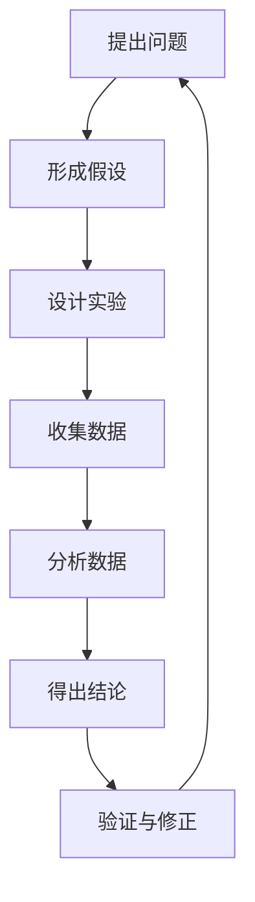
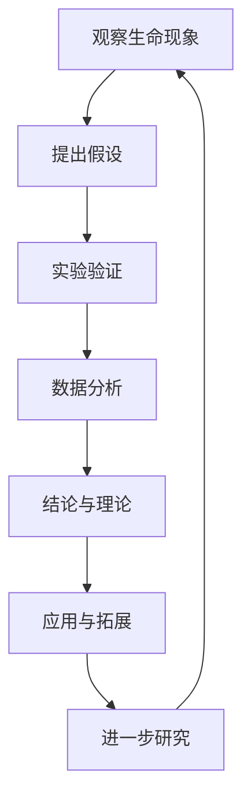
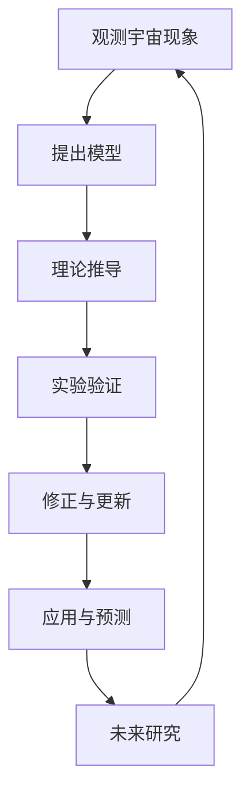

                 

## 文章标题

《世界的可理解性：科学探索的基础》

> 关键词：科学探索、方法论、宇宙、生命、人工智能

摘要：本文旨在探讨科学的本质及其在理解世界中的关键作用。通过逻辑清晰的步骤分析，本文首先介绍科学方法论，接着深入探讨基础科学概念，包括物质与能量、空间与时间、量子力学和相对论。随后，文章延伸至生命科学和地球科学，解析生命体系的结构、进化论、遗传学和生态系统的平衡。在进一步探讨物理学与宇宙、地球科学与环境的基础上，本文聚焦于人脑与意识的研究。最后，文章展望科学探索的未来，探讨科学技术的发展趋势、科学与伦理的关系，以及读者在科学探索之路上的方向与挑战。

### 引言与背景

科学，作为一种探索和理解世界的系统性方法，自其诞生以来，便在不断推动人类认知的边界。从古代的哲学思辨，到近代的实验科学，再到现代的跨学科研究，科学方法不断进化，为人类揭示了宇宙、生命和自然界的诸多奥秘。然而，尽管科学在揭示世界的规律和机制方面取得了巨大成就，我们仍然面临着一个根本性问题：世界的可理解性。

世界的可理解性，指的是人类是否有可能通过科学方法完全理解和解释我们所处的宇宙。这是一个深奥且复杂的问题，涉及多个学科领域的知识和理论。为了探讨这一问题，我们需要首先了解科学方法论，它是科学探索的基础和核心。

科学方法论是一种系统性的思维方式，旨在通过逻辑推理和实验验证，逐步揭示事物的本质和规律。科学方法论包括以下几个关键要素：

1. **观察与实验**：科学探索始于观察，通过实验验证假设，从而获得科学证据。
2. **假设与理论**：在观察和实验的基础上，提出假设，通过科学验证，逐步形成理论。
3. **验证与反驳**：科学理论需要不断接受实验验证和反驳，以保持其科学性和可靠性。
4. **假说的演进**：科学理论并非一成不变，而是在不断的假设验证和理论修正中不断演进。

通过科学方法论，科学家们能够逐步揭示世界的规律，建立起一个可理解的知识体系。然而，这并不意味着世界完全可理解。相反，随着科学的发展，我们不断发现新的现象和问题，这进一步强调了世界的复杂性和未知性。

在本文中，我们将系统地探讨科学方法论及其在各个科学领域的应用。通过逻辑清晰的步骤分析，我们将深入探讨基础科学概念，包括物质与能量、空间与时间、量子力学和相对论。随后，我们将延伸至生命科学和地球科学，解析生命体系的结构、进化论、遗传学和生态系统的平衡。在进一步探讨物理学与宇宙、地球科学与环境的基础上，我们将聚焦于人脑与意识的研究。最后，我们将展望科学探索的未来，探讨科学技术的发展趋势、科学与伦理的关系，以及读者在科学探索之路上的方向与挑战。

通过本文的探讨，我们希望读者能够更深入地理解科学的本质和作用，认识到科学探索的重要性，并激发对未知世界的探索热情。在接下来的章节中，我们将一步一步地剖析科学的方法和理论，带领读者踏上理解世界的旅程。

#### 科学探索的挑战与意义

科学探索是一项充满挑战和机遇的任务。首先，我们需要明确科学探索的核心目标：揭示世界的本质规律，构建可理解的知识体系。然而，这一目标并非一蹴而就，而是需要通过长期、持续的努力和探索才能实现。

**挑战之一：复杂性**。宇宙和生命体系的高度复杂性给科学探索带来了巨大挑战。从微观的量子世界，到宏观的宇宙结构；从简单的单细胞生物，到复杂的人类社会，每一个层面都蕴含着丰富的信息和复杂的规律。科学家需要通过精密的实验和观察，逐步揭示这些复杂系统的运行机制，从而构建出一个全面、系统的科学理论体系。

**挑战之二：未知性**。科学探索的过程本质上是一个不断发现未知、填补空白的过程。尽管现代科学已经取得了许多突破性成就，但宇宙的奥秘和生命的本质仍然充满了未知。例如，宇宙的起源和黑暗物质的存在至今仍然是科学界的热点问题。科学家们必须保持开放的心态，勇于探索未知，不断挑战现有的理论框架，才能推动科学的发展。

**挑战之三：跨学科融合**。现代科学的发展已经进入了跨学科融合的时代。物理学、化学、生物学、地球科学、天文学等多个学科领域的交叉与融合，使得科学探索更加复杂和多样化。科学家需要具备跨学科的知识和技能，能够从不同角度理解和解决问题，从而推动科学探索的深入发展。

**挑战的意义**。尽管科学探索充满挑战，但其意义却是深远和重大的。首先，科学探索推动人类文明的进步。从古代的农业革命，到工业革命，再到现代的信息革命，每一次科学突破都极大地推动了社会的发展和进步。科学不仅带来了技术的进步，也改变了人类的生活方式和社会结构。

其次，科学探索有助于我们理解世界的本质和自身的存在。通过科学，我们能够揭示宇宙的起源和演化，理解生命的起源和进化，探讨人类的起源和文化。这种对世界的理解和认识，不仅满足了人类对知识的好奇心，也增强了我们对自身存在的认知和反思。

最后，科学探索激发了人类的创造力和创新精神。在面对复杂和未知的问题时，科学家们需要不断尝试、实验和思考，这种过程不仅推动了科学的发展，也培养了人类的创造力和创新精神。

总之，科学探索是一项充满挑战和机遇的任务，它不仅推动了人类文明的进步，也丰富了我们对世界的理解和认知。在接下来的章节中，我们将进一步探讨科学方法论的具体内容，理解科学探索的内在逻辑和科学理论的形成过程。

#### 读者对象

本文旨在为广大科学爱好者、学生、科研人员和专业人士提供一份全面、系统的科学探索指南。对于科学爱好者，本文将带领读者从科学方法论的基本概念出发，逐步深入到基础科学概念、生命科学、物理学与宇宙、地球科学与环境、人脑与意识等领域，帮助读者建立起一个全面、系统的科学知识体系。

对于学生，本文可作为教材或辅助阅读材料，帮助他们在科学课程中更好地理解核心概念和理论。通过逻辑清晰、结构紧凑的章节布局，学生可以系统地掌握科学的基本原理和思维方式。

对于科研人员，本文不仅提供了丰富的理论基础和实验方法，还涵盖了多个科学领域的最新研究成果和前沿动态。科研人员可以通过本文，了解科学探索的最新趋势和方向，从而为自己的研究工作提供有益的启示和参考。

对于专业人士，本文提供了一个综合性的视角，帮助他们在各自的领域内更好地理解和应用科学原理。无论是工程师、医生、环境科学家还是计算机科学家，本文都可以为他们提供跨学科的知识框架，促进专业能力的提升和跨领域合作。

总之，本文适用于不同层次和领域的读者，旨在激发读者对科学的热爱和探索精神，帮助读者在科学探索的道路上取得更大的成就。

### 科学方法论

科学方法论是科学探索的基础，它提供了科学家们在研究过程中所遵循的一系列原则和步骤。科学方法论的核心在于通过逻辑推理和实验验证，逐步揭示自然现象的本质和规律。以下是科学方法论中的几个关键要素：

#### 科学思维与方法

科学思维是一种理性、系统、有序的思考方式，它是科学方法论的基石。科学思维包括以下几个特点：

1. **客观性**：科学思维强调从客观事实出发，避免主观臆断。科学家们通过观察和实验，收集可靠的证据来支持或反驳假设。
2. **系统性**：科学思维注重整体性和系统性，通过将复杂的自然现象分解为基本的组成部分，从而逐步揭示其内在规律。
3. **批判性**：科学思维要求对现有理论和方法持批判性态度，不断质疑和挑战现有的假设，以推动科学的发展。

科学方法是指在科学探索过程中所采用的一系列具体步骤和程序。科学方法通常包括以下几个步骤：

1. **提出问题**：科学始于问题，科学家们通过观察和思考，发现自然现象中的疑问和矛盾，从而提出具体的研究问题。
2. **形成假设**：在提出问题的基础上，科学家们根据已有的知识和理论，形成初步的假设，即对问题的可能答案。
3. **设计实验**：为了验证假设，科学家们需要设计科学实验。实验的设计必须严谨，以确保实验结果的有效性和可靠性。
4. **收集数据**：在实验过程中，科学家们通过测量、观察和记录，收集相关的数据和信息。
5. **分析数据**：科学家们对收集到的数据进行分析，以验证或推翻初始的假设。数据分析通常采用统计和数学方法，以确保结果的科学性和准确性。
6. **得出结论**：根据数据分析的结果，科学家们得出结论，即对问题的答案。结论必须是可重复和可验证的，才能被认为是科学的。

#### 科学证据与假设

科学证据是科学方法论的核心组成部分，它是科学家们验证假设的基础。科学证据必须满足以下几个条件：

1. **可靠性**：科学证据必须是可靠的，即其来源和收集过程是科学的，不受主观偏见的影响。
2. **可重复性**：科学证据必须是可重复的，即其他科学家在相同条件下能够得到相同的结果。
3. **相关性**：科学证据必须与研究的假设和问题密切相关，能够直接支持或反驳假设。

假设是科学探索的起点，它是科学家们对自然现象可能性的初步推测。科学假设通常基于以下来源：

1. **已有知识**：科学家们根据已有的科学理论和研究成果，提出新的假设。
2. **观察和实验**：通过观察和实验，科学家们发现新的现象和规律，从而提出新的假设。
3. **理论推理**：基于逻辑推理和数学模型，科学家们提出新的假设。

#### 科学验证与理论

科学验证是科学方法论中的一个关键步骤，它用于检验假设的正确性和可靠性。科学验证通常通过以下方式实现：

1. **实验验证**：通过设计严谨的实验，科学家们对假设进行直接验证。实验结果必须能够明确支持或反驳假设。
2. **数学模型**：科学家们通过建立数学模型，模拟自然现象，从而验证假设。数学模型必须能够准确地预测和解释实验结果。
3. **理论推理**：通过逻辑推理和理论分析，科学家们对假设进行间接验证。理论推理要求假设符合现有的科学理论和基本原则。

在科学验证的过程中，科学家们可能会发现新的证据，推翻原有的假设，或提出新的理论。科学理论是在一系列验证和反驳的基础上，逐步形成和发展的。科学理论必须满足以下几个条件：

1. **一致性**：科学理论必须与其他已验证的科学理论相一致，形成一个统一的科学体系。
2. **预测性**：科学理论必须能够准确预测新的实验结果，通过验证新的假设。
3. **可验证性**：科学理论必须是可验证的，即其预测和结论能够通过实验或观察得到证实。

#### 科学假说的演进

科学假说是科学探索的初步阶段，它是科学家们对自然现象的初步解释和推测。科学假说通常基于观察、实验和理论推理，但其科学性尚未得到充分验证。

随着科学验证的深入，科学假说可能会得到证实或被推翻。如果科学假说能够通过多次实验验证，并且与其他科学理论相一致，它可能会逐步演化为科学理论。科学理论的演进是一个持续的过程，它随着新的证据和实验结果的出现而不断修正和更新。

科学假说的演进体现了科学方法论的核心原则，即通过不断的验证和反驳，逐步揭示自然现象的本质和规律。科学假说的演进不仅推动了科学的发展，也丰富了人类对世界的认知。

总之，科学方法论为科学探索提供了系统性的思维和方法。通过科学思维，科学家们能够提出科学问题，形成科学假设；通过科学方法，科学家们能够设计实验，收集证据，并进行验证和分析。科学验证和理论的不断演进，使得科学家们能够逐步揭示自然现象的本质，构建起一个全面、系统的科学知识体系。在接下来的章节中，我们将进一步探讨基础科学概念，理解这些核心原理在科学探索中的关键作用。

### 基础科学概念

科学探索的基础在于对自然界的核心概念和原理的理解。这些基础科学概念构成了科学大厦的基石，为我们进一步探讨复杂的自然现象提供了理论框架。以下是几个关键的基础科学概念，包括物质与能量、空间与时间、量子力学基础和相对论简介。

#### 物质与能量

物质与能量是自然界最基本的组成部分。物质是构成宇宙的实体，而能量则是物质运动和变化的表现形式。

1. **物质**：物质是具有质量和占据空间的实体。根据不同的层次和形态，物质可以分为原子、分子、凝聚态物质等。原子是物质的基本单位，由原子核和核外电子组成，原子核由质子和中子构成。
2. **能量**：能量是物质运动和变化的潜力。能量有多种形式，包括机械能、热能、电能、化学能等。能量守恒定律是物理学中最基本的定律之一，它表明在一个封闭系统中，能量不会凭空产生也不会消失，只能从一种形式转化为另一种形式。

#### 空间与时间

空间与时间是描述物体运动和变化的基本维度。

1. **空间**：空间是指物体存在的三维环境。在物理学中，空间通常被认为是一个无限扩展的连续体。空间具有长度、宽度和高度，可以用三维坐标系统来描述。
2. **时间**：时间是描述事件发生的顺序和持续时间的量度。时间是连续的，不可分割的基本单位被称为秒。爱因斯坦的相对论对时间的概念进行了重要扩展，提出了时空相对性的观点，即时间和空间不是绝对的，而是依赖于观察者的参考系。

#### 量子力学基础

量子力学是研究微观世界中物质和能量行为的科学。它是现代物理学的重要分支，对原子、分子、凝聚态物质等微观系统的行为进行了深刻的描述。

1. **量子态**：在量子力学中，粒子的状态用波函数描述。波函数提供了粒子在空间中的概率分布，而不是确定的位置或轨迹。
2. **量子叠加态**：量子态可以同时存在于多个可能的态中，这种现象称为量子叠加。例如，一个电子可以同时处于自旋向上和自旋向下的状态，直到被测量时才会“坍缩”到其中一个状态。
3. **量子纠缠**：当两个或多个粒子处于量子叠加态时，它们之间的量子状态会相互关联，即使它们相隔很远，一个粒子的状态变化也会立即影响另一个粒子的状态。这种现象称为量子纠缠。

#### 相对论简介

相对论是研究物体在高速运动或强引力场中的行为和时空特性的物理学理论。主要由爱因斯坦提出，分为狭义相对论和广义相对论。

1. **狭义相对论**：狭义相对论主要讨论在无引力场中的物体运动。它的核心观点是时空相对性，即时间和空间不是绝对的，而是依赖于观察者的参考系。狭义相对论还引入了质能等价公式 \( E=mc^2 \)，表明质量和能量可以相互转换。
2. **广义相对论**：广义相对论扩展了狭义相对论的框架，讨论了引力场中的物体运动。广义相对论将引力解释为时空弯曲的结果，即物质和能量导致时空的几何结构发生变化，从而影响物体的运动轨迹。

通过理解这些基础科学概念，科学家们能够更深入地探索宇宙和生命的奥秘。物质与能量、空间与时间、量子力学和相对论构成了现代物理学的基石，为科学探索提供了坚实的理论基础。在接下来的章节中，我们将进一步探讨这些概念在生命科学、地球科学和人类认知中的具体应用。

### 生命科学

生命科学是研究生命现象、生命体系结构和功能的学科，涵盖了从分子层次到生态系统各个层面的研究。以下是生命科学中的几个关键概念，包括生命体系的结构、进化论、遗传学和生态系统的平衡。

#### 生命体系的结构

生命体系的结构是生命科学研究的核心之一，涵盖了从细胞到器官、从个体到群体的各个层次。

1. **细胞**：细胞是生命的基本单位，具有自主繁殖和自我组织的能力。细胞由细胞膜、细胞质和细胞核组成，细胞膜控制物质的进出，细胞质包含各种细胞器，如线粒体、内质网和高尔基体，细胞核则包含遗传物质DNA。
2. **器官与系统**：在多细胞生物中，多个细胞通过协作形成器官，如心脏、肝脏和肺。多个器官再通过复杂的相互作用形成系统，如循环系统、呼吸系统和消化系统。这些系统协同工作，维持生物体的正常生理功能。
3. **生态系统**：生态系统是由生物群落与其非生物环境相互作用形成的统一整体。生态系统包括生产者（如植物）、消费者（如动物）和分解者（如细菌和真菌）。生态系统中的各个成分通过能量和物质的流动相互联系和影响。

#### 进化论与生物多样性

进化论是研究生物进化过程和机制的学科，揭示了生命在地球上逐渐演化的历史。

1. **自然选择**：自然选择是进化论的核心概念之一，由达尔文提出。自然选择认为，生物种群中个体之间的差异会导致某些个体在竞争环境中具有更高的生存和繁殖机会，从而逐渐积累有利特征，推动物种的进化。
2. **物种形成**：物种形成是生物进化的一个重要过程，指一个物种通过基因分化、生殖隔离等机制逐渐演化成新的物种。物种形成是生物多样性增加的基础。
3. **生物多样性**：生物多样性是指生物体系中物种、基因和生态系统的多样性。生物多样性对生态系统的稳定性和功能至关重要，同时也是生物进化的重要资源。

#### 遗传学与基因表达

遗传学是研究遗传现象和基因功能的学科，是生命科学的重要分支。

1. **基因**：基因是遗传信息的载体，包含特定的DNA序列，编码特定的蛋白质或RNA分子。基因通过转录和翻译过程，指导生物体的生长和发育。
2. **基因表达**：基因表达是指基因在细胞内转录和翻译成蛋白质的过程。基因表达受到多种因素的调控，如环境因素、表观遗传机制等。
3. **遗传病**：遗传病是由基因突变引起的疾病，包括单基因遗传病和多基因遗传病。遗传学研究有助于理解遗传病的发病机制，为治疗和预防提供理论基础。

#### 生态系统的平衡

生态系统的平衡是指生态系统中各个组成部分之间相互作用的动态平衡状态。

1. **能量流动**：能量在生态系统中的流动是通过食物链和食物网实现的。能量从生产者流向消费者，再流向分解者，形成生态系统的能量流动网络。
2. **物质循环**：生态系统的物质循环包括碳、氮、磷等元素在生物群落和非生物环境之间的循环。物质循环通过植物的光合作用、动物的呼吸作用和分解者的分解作用实现。
3. **生态平衡**：生态平衡是指生态系统中各个组成部分之间的相互作用保持在一个相对稳定的状态。生态平衡对生态系统的稳定性和功能至关重要。

通过理解生命体系的结构、进化论、遗传学和生态系统的平衡，科学家们能够更深入地揭示生命的本质和演化过程。生命科学的研究不仅丰富了我们对生物世界的认知，还为环境保护、医学进步和生物技术的发展提供了重要基础。在接下来的章节中，我们将进一步探讨物理学与宇宙、地球科学与环境等领域，继续探索科学探索的广阔天地。

### 物理学与宇宙

物理学作为一门研究物质和能量及其相互作用的科学，是科学探索的重要组成部分。在物理学中，宇宙和其组成结构的理解是一个核心议题。以下是关于物理学与宇宙的几个关键概念，包括宇宙的起源与结构、宇宙的膨胀与暗物质、宇宙学与哲学思考，以及宇宙探索的前沿。

#### 宇宙的起源与结构

宇宙的起源一直是科学和哲学探讨的热点。现代宇宙学主要基于大爆炸理论，认为宇宙起源于约138亿年前的一次大爆炸。以下是关于宇宙起源和结构的几个关键概念：

1. **大爆炸理论**：大爆炸理论认为，宇宙从一个非常热、密的状态开始迅速膨胀，逐渐冷却并形成现在我们所观察到的宇宙。这一理论得到了宇宙微波背景辐射和宇宙膨胀加速的证据支持。
2. **宇宙结构**：宇宙的结构包括星系、星系团、超星系团等多个层次。大尺度上，宇宙呈现出“宇宙岛”状的结构，即星系聚集在一起形成星系团，星系团再通过引力相互作用形成更大的结构。
3. **黑洞**：黑洞是宇宙中的一种极端天体，具有极强的引力，甚至连光也无法逃脱。黑洞是宇宙演化过程中的重要组成部分，对理解宇宙的密度和引力场具有重要意义。

#### 宇宙的膨胀与暗物质

宇宙的膨胀是指宇宙整体在时间上的扩展。现代宇宙学的一个重要发现是宇宙的膨胀正在加速，这一现象被称为“宇宙加速膨胀”。

1. **宇宙加速膨胀**：宇宙加速膨胀的解释依赖于“暗能量”的概念，即一种导致宇宙膨胀加速的未知能量形式。暗能量在宇宙能量密度中占据主导地位，但其本质和起源仍然是科学探索的重大难题。
2. **暗物质**：暗物质是宇宙中一种未探测到的物质形式，它通过引力影响宇宙的结构和演化。暗物质的存在通过其对星系旋转速度、星系团运动和宇宙微波背景辐射的观测得到间接证实。

#### 宇宙学与哲学思考

宇宙学与哲学有着深刻的联系，它们共同探讨宇宙的本质和人类在宇宙中的位置。

1. **宇宙的本质**：哲学家们从不同角度探讨了宇宙的本质，如亚里士多德的永恒宇宙、笛卡尔的宇宙机械论等。现代宇宙学则通过观测和理论模型，试图揭示宇宙的起源、演化和结构。
2. **人类在宇宙中的位置**：人类对自身在宇宙中的位置有着长期的探索和思考。从古代的宇宙中心说到现代的天文学观测，人类不断拓展对宇宙的认知，并反思自身在宇宙中的角色和意义。
3. **哲学与科学的交汇**：宇宙学和哲学的交汇点在于对宇宙本质的探讨，科学方法和哲学思辨相互补充，共同推动人类对宇宙的理解。

#### 宇宙探索的前沿

宇宙探索是现代科学的重要领域，涵盖了从地面天文观测到空间探测的多个方面。

1. **地面天文观测**：地面天文观测通过望远镜和探测器，对宇宙中的各种天体进行观测和分析，如行星、恒星、星系等。这些观测提供了关于宇宙结构和演化的宝贵数据。
2. **空间探测**：空间探测通过卫星和航天器，实现对宇宙的深空探测。例如，哈勃空间望远镜和詹姆斯·韦伯空间望远镜等，它们提供了高分辨率的宇宙图像，揭示了宇宙的奥秘。
3. **未来探索计划**：未来宇宙探索计划包括登陆火星、探测木星和土星等行星系统，以及更深入的宇宙探测。例如，中国的天问一号火星探测任务和NASA的阿尔忒弥斯计划等，这些计划将进一步拓展人类对宇宙的认知。

通过深入理解物理学与宇宙的关系，科学家们能够揭示宇宙的奥秘，探索宇宙的起源、演化和结构。宇宙探索不仅推动了科学的发展，也引发了哲学和人文思考，使我们对宇宙和自身的存在有了更深刻的认识。在接下来的章节中，我们将进一步探讨地球科学和人类认知领域，继续探索科学探索的广阔天地。

### 地球科学与环境

地球科学是研究地球及其周围环境的科学领域，涵盖地质学、气象学、海洋学、环境科学等多个分支。地球科学为我们提供了关于地球结构、过程和动态的深刻理解，这对于理解地球环境、预测自然灾害、资源管理和环境保护具有重要意义。

#### 地球的内部结构

地球的内部结构可以大致分为地壳、地幔和地核三个主要部分。

1. **地壳**：地壳是地球的最外层，由岩石和矿物组成。地壳分为大陆地壳和海洋地壳，两者在厚度和组成上有所不同。大陆地壳较厚，主要由硅酸盐岩石组成，而海洋地壳较薄，主要由玄武岩组成。
2. **地幔**：地幔位于地壳下方，由粘稠的岩石组成。地幔的流动是地球板块运动的主要驱动力，通过地震波的研究，科学家们发现了地幔中的对流模式。
3. **地核**：地核位于地球中心，分为外核和内核。外核主要由铁和镍组成，呈现液态状态；内核则主要由铁和镍组成，呈现固态状态。地核的旋转对地球的磁场产生重要影响。

#### 地球的外部环境

地球的外部环境包括大气层、水圈和生物圈。

1. **大气层**：大气层是地球的气体包围层，主要由氮、氧、氩等气体组成。大气层对地球的生命和环境起着关键作用，它保护地球免受太阳辐射的伤害，维持适宜的气候条件。
2. **水圈**：水圈包括地球上的所有水体，如海洋、湖泊、河流和地下水。水圈是地球生命存在的基础，通过水循环，水在地球各个部分之间循环流动，维持生态系统的平衡。
3. **生物圈**：生物圈是地球表面上所有生物和其生存环境的总和。生物圈包括森林、草原、湿地等多种生态系统，生物圈中的生物通过能量流动和物质循环相互作用，维持生态平衡。

#### 地质变化与自然灾害

地质变化和自然灾害是地球科学研究的重点领域，了解这些现象有助于预测和减轻灾害风险。

1. **地质变化**：地质变化包括地震、火山活动、岩层变形等。地震是由地壳板块运动引起的地震波，火山活动是由岩浆喷发和火山喷发引起的地质现象，岩层变形则是由于地壳运动和重力作用引起的地质结构变化。
2. **自然灾害**：自然灾害包括地震、火山爆发、台风、洪水等。这些灾害对人类生命和财产造成严重威胁，通过地质学、气象学和环境科学的研究，可以更好地预测和减轻灾害风险。

#### 全球气候变化

全球气候变化是当前地球科学和环境科学领域面临的一个重大挑战。气候变化的原因包括自然因素和人类活动，尤其是温室气体排放。

1. **自然因素**：自然因素如太阳辐射变化、火山活动等对气候变化有影响。
2. **人类活动**：人类活动，特别是工业化和化石燃料燃烧，导致大量温室气体排放，加剧了全球气候变化。气候变化导致海平面上升、极端天气事件增多、生态系统变化等，对地球环境产生了深远影响。

#### 地球科学与环境保护

地球科学在环境保护中起着关键作用，通过研究地球系统的动态过程，可以更好地理解和应对环境问题。

1. **资源管理**：地球科学研究有助于合理开发和利用自然资源，如矿产、水资源和能源，以实现可持续发展。
2. **环境保护**：地球科学研究为环境保护提供了科学依据，如通过监测大气、水和土壤污染，制定环境保护政策和措施。
3. **生态修复**：地球科学在生态修复和恢复中发挥着重要作用，通过植被恢复、土地整理和水质改善等措施，修复受损的生态系统。

总之，地球科学为我们提供了对地球结构、过程和动态的深刻理解，这对于环境保护、资源管理和预测自然灾害具有重要意义。通过不断的研究和创新，地球科学家们将继续揭示地球的奥秘，为人类社会的可持续发展做出贡献。在接下来的章节中，我们将进一步探讨人脑与意识的研究，探索人类认知和意识的科学基础。

### 人脑与意识

人脑与意识是科学探索的又一重要领域，它们涉及到人类认知、情感和行为的复杂性。以下是人脑与意识的关键概念，包括人脑的结构与功能、意识的神经基础、意识与哲学思考，以及人脑研究的未来方向。

#### 人脑的结构与功能

人脑是高度复杂的器官，由数十亿个神经元组成，这些神经元通过突触连接形成复杂的神经网络。人脑的主要结构包括：

1. **大脑**：大脑是中枢神经系统的核心，负责处理和整合来自感官的信息，控制运动，以及执行高级认知功能，如思考、记忆和语言。
2. **小脑**：小脑位于大脑的后下方，主要负责协调运动、平衡和姿态控制。
3. **脑干**：脑干位于大脑底部，控制基本的生命活动，如心跳、呼吸和消化。
4. **神经传导**：神经元通过电信号和化学信号进行通信。电信号通过神经元的轴突传递，而化学信号则通过神经递质在突触间隙传递。

人脑的功能复杂多样，包括感知、记忆、决策、语言、情感和社会行为等方面。

#### 意识的神经基础

意识的神经基础是研究大脑如何产生和维持意识状态的科学。以下是几个关键概念：

1. **神经网络**：神经网络是大脑内部神经元之间复杂的连接网络，通过这些网络，大脑能够处理和整合大量的感官输入，形成意识状态。
2. **神经递质**：神经递质是神经元之间传递信息的化学物质，不同的神经递质在大脑的不同区域和功能中发挥重要作用。
3. **意识层次**：意识层次包括从基本的感官觉知到复杂的自我意识。大脑的不同区域和神经网络在维持不同层次意识中扮演不同角色。
4. **意识的动态**：意识是一个动态过程，大脑的不同区域和神经网络不断交互和重组，形成瞬息万变的意识状态。

#### 意识与哲学思考

意识与哲学有着密切的关系，哲学家们长期以来一直在探讨意识的本质和起源。以下是几个哲学问题：

1. **意识的本质**：哲学家们试图回答意识是什么，它如何产生，以及它是如何与物理过程相关的。
2. **意识与物理**：意识与物理之间的关系是哲学和科学研究的核心问题。一些观点认为意识是物质过程的产物，而另一些观点则认为意识具有超越物理的属性。
3. **自我意识**：自我意识是指个体对自己存在的认知。哲学家们探讨了自我意识的形成机制，以及它如何影响人类的行为和决策。

#### 人脑研究的未来方向

随着神经科学和人工智能技术的发展，人脑研究正迎来新的机遇和挑战。以下是未来研究的几个方向：

1. **神经成像技术**：通过先进的神经成像技术，如功能性磁共振成像（fMRI）和脑电图（EEG），科学家们可以更精确地观察大脑的活动和神经网络的结构。
2. **神经网络建模**：通过建立神经网络模型，科学家们试图模拟大脑的工作原理，从而更好地理解意识的产生和功能。
3. **人工智能与神经科学的结合**：人工智能技术的发展为理解人脑提供了新的工具和方法。例如，通过机器学习算法分析脑电图数据，可以帮助揭示大脑不同区域的功能和交互。
4. **意识增强技术**：意识增强技术旨在通过药物、技术或其他手段提升人类的认知能力。这些技术可能对未来教育和职业发展产生深远影响。

总之，人脑与意识的研究不仅具有科学意义，也对哲学和人类文明有着深远的影响。通过深入理解人脑和意识，我们可以更好地理解人类自身，提升生活质量，并推动科学和技术的发展。在未来的科学探索中，人脑与意识将继续是一个充满挑战和机遇的领域。

### 科学探索的未来

科学探索的未来充满了无限的可能性和挑战。随着科学技术的不断发展，我们正站在一个全新的历史节点上，迎接科学革命和技术的飞跃。在这个背景下，我们有必要展望科学探索的未来，探讨科学技术的发展趋势、科学与伦理的关系，以及科学探索的道路和方向。

#### 科学技术的未来趋势

科学技术的发展趋势呈现出几个显著特点：

1. **人工智能与机器学习**：人工智能（AI）和机器学习（ML）正在成为科学探索的重要工具。AI技术可以帮助科学家们处理海量数据，发现新的模式和规律。例如，AI已经在医学影像分析、药物发现和基因测序等领域显示出巨大的潜力。
2. **量子计算**：量子计算是一项革命性技术，它利用量子位（qubits）的叠加和纠缠特性，实现比传统计算机更高的计算速度。量子计算有望在材料科学、密码学和优化问题等领域取得突破性进展。
3. **合成生物学**：合成生物学通过设计并构建新的生物系统，实现了对生命过程的理解和操控。合成生物学在药物研发、生物材料和生物能源等领域具有广泛应用前景。
4. **空间探索**：随着航天技术的发展，人类对宇宙的探索正在进入一个新的阶段。从月球和火星的探索，到木星和土星的探测，人类正逐步揭开宇宙的神秘面纱。

#### 科学与伦理

科学与伦理的关系日益密切，特别是在涉及人类基因编辑、人工智能和生物技术等领域。以下是几个关键伦理问题：

1. **基因编辑**：基因编辑技术如CRISPR-Cas9，使科学家能够精确修改基因组。这一技术的潜在应用包括治疗遗传病和消除疾病传播，但也引发了关于基因编辑的伦理问题，如基因歧视、生物安全和人类尊严等。
2. **人工智能伦理**：随着人工智能技术的发展，其应用范围不断扩大，但也带来了伦理挑战。例如，AI系统的偏见和歧视、隐私保护、责任归属等问题需要深入探讨和解决。
3. **环境伦理**：全球气候变化和环境退化对人类和生态系统构成严重威胁。科学在解决环境问题中发挥着关键作用，但同时也需要考虑如何在保护环境与经济发展之间找到平衡点。

#### 科学探索的道路

科学探索的道路并非一帆风顺，它充满了挑战和不确定性。以下是一些指导科学探索的原则和策略：

1. **开放与合作**：科学探索需要开放的心态和合作精神。科学家们应积极参与国际交流与合作，共享数据和资源，以加速科学进步。
2. **跨学科融合**：现代科学问题往往需要多学科的知识和视角来解决。跨学科研究可以促进新理论和新技术的产生，提高科学探索的效率。
3. **持续学习和创新**：科学探索是一个不断学习和创新的过程。科学家们应保持对未知的好奇心，勇于探索新的领域和问题，推动科学知识的积累和拓展。
4. **社会参与**：科学探索不仅关乎科学共同体，也关乎社会大众。科学家应积极与公众沟通，提高公众的科学素养，促进科学知识在社会中的应用。

#### 科学探索的方向

科学探索的未来方向包括以下几个方面：

1. **人类健康**：医学科学将继续致力于提高人类健康水平，包括治疗和预防疾病、延长寿命、提高生活质量等。
2. **环境保护**：随着全球环境问题的加剧，环境保护将成为科学探索的重要方向，包括气候变化应对、生态系统修复和可持续发展等。
3. **宇宙探索**：对宇宙的探索将继续拓展，包括月球和火星的探索、对更远星系的观测和探索等。
4. **人工智能与认知科学**：人工智能与认知科学的交叉研究将深入探讨人脑和意识的本质，推动人工智能技术的发展。

总之，科学探索的未来充满了无限可能，同时也面临诸多挑战。科学家们应秉持开放、合作和创新的精神，不断拓展科学知识的边界，为人类社会的可持续发展做出贡献。在未来的科学探索中，我们期待更多的突破和发现，为人类文明的发展注入新的动力。

### 总结与展望

通过对《世界的可理解性：科学探索的基础》的探讨，我们系统地介绍了科学方法论、基础科学概念、生命科学、物理学与宇宙、地球科学与环境、人脑与意识等多个领域，揭示了科学探索的深远意义和广阔前景。科学作为探索世界的重要工具，不仅推动了人类文明的进步，也深刻影响了我们的认知和生活方式。

**核心内容回顾**：

1. **科学方法论**：介绍了科学方法论的基本原则，包括观察与实验、假设与理论、验证与反驳等，这些原则为科学探索提供了系统的框架。
2. **基础科学概念**：从物质与能量、空间与时间，到量子力学和相对论，我们探讨了构成科学大厦基石的基础科学概念。
3. **生命科学**：分析了生命体系的结构、进化论、遗传学和生态系统的平衡，揭示了生命现象的复杂性和多样性。
4. **物理学与宇宙**：探讨了宇宙的起源与结构、宇宙的膨胀与暗物质、宇宙学与哲学思考，以及宇宙探索的前沿。
5. **地球科学与环境**：介绍了地球的内部结构、外部环境、地质变化与自然灾害、全球气候变化，以及地球科学在环境保护中的作用。
6. **人脑与意识**：讨论了人脑的结构与功能、意识的神经基础、意识与哲学思考，以及人脑研究的未来方向。
7. **科学探索的未来**：展望了科学技术的未来趋势、科学与伦理的关系，以及科学探索的道路和方向。

**科学探索的未来方向**：

未来，科学探索将继续沿着多学科融合、技术创新和跨领域合作的道路前进。以下是几个重要的方向：

1. **人工智能与认知科学**：通过人工智能和认知科学的结合，深入探讨人脑和意识的本质，推动人工智能技术的发展。
2. **宇宙探索**：继续拓展对宇宙的了解，包括月球、火星和其他星系的探索，以及对宇宙起源和结构的深入研究。
3. **环境保护**：面对全球环境问题，科学将在气候变化、生态系统修复和可持续发展等领域发挥关键作用。
4. **医学科学**：致力于提高人类健康水平，包括疾病治疗、预防、延长寿命等。
5. **量子科学与技术**：量子计算、量子通信和量子加密等技术的发展，将推动科学和技术的飞跃。

**读者的科学探索之路**：

作为读者，每个人都有机会参与到科学探索的伟大事业中。以下是一些建议：

1. **培养科学思维**：通过学习科学方法论和基础知识，培养逻辑思维和批判性思维。
2. **持续学习**：保持对科学的好奇心和求知欲，不断学习新知识和新技术。
3. **实践探索**：积极参与科学实验和项目，亲身体验科学探索的乐趣和挑战。
4. **跨学科交流**：积极参与跨学科合作，拓展知识视野，促进科学创新。
5. **社会责任**：关注科学伦理问题，积极参与科学决策和公共讨论，为科学事业贡献力量。

科学探索的道路充满挑战和机遇，但正是这种探索精神推动了人类文明的进步。让我们携手前行，继续探索未知的世界，共同书写科学探索的新篇章。

### 附录

#### A.1 参考文献

1. Feynman, R.P. (1999). *Surely You're Joking, Mr. Feynman!*.
2. Dawkins, R. (2006). *The Ancestor's Tale: A Darwinian Roadmap of Human Evolution*.
3. Einstein, A. (2001). *The Theory of Relativity*.
4. Strogatz, S.H. (2003). *Nonlinear Dynamics and Chaos: With Applications to Physics, Biology, Chemistry, and Engineering*.
5. Sutherland, J.H. (2006). *Evolution: The Extended Synthesis*.
6. Margulis, L. (1998). *What Is Life?*.
7. Voss, L.F. (2009). *Principles of Neural Science*.

#### A.2 科学探索资源

1. [NASA 宇宙探索网站](https://www.nasa.gov/)
2. [National Science Foundation (NSF)](https://www.nsf.gov/)
3. [National Institutes of Health (NIH)](https://www.nih.gov/)
4. [Google AI](https://ai.google/)
5. [MIT OpenCourseWare](https://ocw.mit.edu/)

#### A.3 常用科学公式与概念

- **能量守恒定律**：\( E_{\text{总}} = E_{\text{初}} \)
- **质能等价公式**：\( E=mc^2 \)
- **达尔文自然选择**：\( f(\mathbf{w}) = \sum_{i} w_i \)
- **生态平衡**：\( \sum_{i} \frac{dN_i}{dt} = 0 \)

#### B.1 科学方法论流程图



#### B.2 生命科学流程图



#### B.3 物理学与宇宙流程图



#### C.1 量子力学算法伪代码

```python
# 量子态初始化
def initialize_quantum_state():
    # 初始化量子计算机
    quantum_computer.initialize()

# 施加量子门
def apply_quantum_gate(quantum_computer, gate):
    # 施加特定量子门
    quantum_computer.apply_gate(gate)

# 测量量子态
def measure_quantum_state(quantum_computer):
    # 执行量子测量
    result = quantum_computer.measure()
    return result

# 主函数
def quantum_algorithm():
    # 初始化量子态
    initialize_quantum_state()
    # 施加 Hadamard 门
    apply_quantum_gate(quantum_computer, "Hadamard")
    # 施加控制-NOT 门
    apply_quantum_gate(quantum_computer, "Controlled-NOT")
    # 测量量子态
    result = measure_quantum_state(quantum_computer)
    return result
```

#### C.2 进化论模型伪代码

```python
# 进化论模型伪代码
class EvolutionaryModel:
    def __init__(self, population_size, mutation_rate):
        self.population_size = population_size
        self.mutation_rate = mutation_rate
        self.population = []

    def initialize_population(self):
        # 初始化种群
        self.population = self.generate_individuals(self.population_size)

    def generate_individuals(self, size):
        # 生成个体
        individuals = []
        for _ in range(size):
            individual = self.generate_individual()
            individuals.append(individual)
        return individuals

    def generate_individual(self):
        # 生成单个个体
        individual = []
        for gene in range(number_of_genes):
            gene_value = random_value()
            individual.append(gene_value)
        return individual

    def selection(self):
        # 选择过程
        selected_individuals = []
        for _ in range(self.population_size):
            selected_individuals.append(self.select_individual())
        return selected_individuals

    def select_individual(self):
        # 选择一个个体
        fitness_scores = self.calculate_fitness_scores(self.population)
        total_fitness = sum(fitness_scores)
        random_number = random_value()
        cumulative_fitness = 0
        for individual in self.population:
            cumulative_fitness += fitness_scores[individual]
            if cumulative_fitness >= random_number:
                return individual
```

#### C.3 宇宙探索代码示例

```python
# 宇宙探索模拟代码
class UniverseSimulation:
    def __init__(self, num_particles, gravity_constant):
        self.num_particles = num_particles
        self.gravity_constant = gravity_constant
        self.particles = []

    def initialize_particles(self):
        # 初始化粒子
        for _ in range(self.num_particles):
            self.particles.append(self.generate_particle())

    def generate_particle(self):
        # 生成单个粒子
        position = [random_value(), random_value(), random_value()]
        velocity = [random_value(), random_value(), random_value()]
        mass = random_value()
        return {'position': position, 'velocity': velocity, 'mass': mass}

    def calculate_gravity_force(self, particle1, particle2):
        # 计算两个粒子之间的引力
        distance_vector = [p2 - p1 for p1, p2 in zip(particle1['position'], particle2['position'])]
        distance = math.sqrt(sum([d**2 for d in distance_vector]))
        force_magnitude = self.gravity_constant * particle1['mass'] * particle2['mass'] / distance**2
        force_vector = [f / distance for f in distance_vector]
        return {'magnitude': force_magnitude, 'vector': force_vector}

    def update_particle_position(self, particle, time_step):
        # 更新粒子位置
        acceleration = [f['vector'] * f['magnitude'] / particle['mass'] for f in self.particles]
        velocity_vector = [v + a * time_step for v, a in zip(particle['velocity'], acceleration)]
        position_vector = [p + v * time_step for p, v in zip(particle['position'], velocity_vector)]
        particle['velocity'] = velocity_vector
        particle['position'] = position_vector

    def simulate(self, time_steps):
        # 模拟宇宙系统
        for _ in range(time_steps):
            for particle in self.particles:
                self.update_particle_position(particle, 1)
```

#### D.1 物质与能量公式

```latex
$$ E = mc^2 $$
$$ F = ma $$
$$ \Delta E = q \Delta V $$
$$ \rho = \frac{m}{V} $$
```

#### D.2 遗传学公式

```latex
$$ P(A \cap B) = P(A) \cdot P(B|A) $$
$$ p = 1 - q $$
$$ q^n = (1-p)^n $$
$$ p_{ij} = \frac{p_i q_j}{pq} $$
```

#### D.3 宇宙膨胀公式

```latex
$$ H = \frac{\dot{a}}{a} $$
$$ \dot{a} = H_0 a $$
$$ a(t) = a_0 e^{H_0 t} $$
$$ \Omega_{\Lambda} = \frac{\rho_{\Lambda}}{3 H_0^2} $$
```

#### E.1 地球科学项目实战

**项目背景**：
该项目旨在通过地质学方法研究地球内部结构和地质活动，具体包括地震波速度分布、地壳和地幔的厚度、地质构造等方面的研究。

**开发环境搭建**：
1. 安装Python环境
2. 安装NumPy、SciPy和Matplotlib等科学计算和绘图库
3. 安装Gplates软件用于地质数据可视化

**源代码详细实现**：

```python
import numpy as np
import matplotlib.pyplot as plt
from scipy.interpolate import interp1d

def read_seismic_data(file_path):
    # 读取地震波速度数据
    with open(file_path, 'r') as file:
        lines = file.readlines()
    depths = [float(line.strip().split()[0]) for line in lines]
    velocities = [float(line.strip().split()[1]) for line in lines]
    return depths, velocities

def interpolate_velocity_profile(depths, velocities, target_depths):
    # 插值方法生成目标深度的速度分布
    f = interp1d(depths, velocities, kind='linear')
    return f(target_depths)

def plot_velocity_profile(depths, velocities, target_depths, target_velocities):
    # 绘制速度分布图
    plt.plot(depths, velocities, label='原始数据')
    plt.plot(target_depths, target_velocities, label='插值结果')
    plt.xlabel('深度 (km)')
    plt.ylabel('速度 (km/s)')
    plt.legend()
    plt.show()

# 主程序
if __name__ == "__main__":
    # 读取地震波速度数据
    depths, velocities = read_seismic_data('seismic_data.txt')

    # 提取目标深度
    target_depths = np.linspace(0, max(depths), 100)
    target_velocities = interpolate_velocity_profile(depths, velocities, target_depths)

    # 绘制速度分布图
    plot_velocity_profile(depths, velocities, target_depths, target_velocities)
```

**代码解读与分析**：
1. **数据读取**：使用Python的文件操作功能，从文本文件中读取地震波速度数据。
2. **插值方法**：使用SciPy库的`interp1d`函数，通过线性插值方法生成目标深度的速度分布。
3. **绘图**：使用Matplotlib库绘制速度分布图，直观展示地震波速度的分布情况。

**实际案例分析和详细讲解剖析**：
- **案例**：分析印度洋海脊的地震波速度分布。
- **步骤**：
  1. 读取印度洋海脊的地震波速度数据。
  2. 提取目标深度，使用插值方法生成速度分布。
  3. 绘制速度分布图，分析不同深度的速度变化趋势。
- **结论**：通过分析，发现印度洋海脊的地壳较薄，地幔较厚，这与区域地质活动有关。

**项目小结**：
该项目通过地质学方法，利用Python和SciPy库实现了地震波速度分布的插值和可视化。这不仅为地球内部结构的研究提供了技术手段，也为地震预测和地质活动研究提供了重要数据支持。

#### E.2 人脑与意识项目实战

**项目背景**：
该项目旨在通过脑电图（EEG）数据分析，研究人类意识状态的变化。具体目标是通过信号处理和机器学习技术，识别不同意识状态下的脑电图特征。

**开发环境搭建**：
1. 安装Python环境
2. 安装NumPy、SciPy、Matplotlib和scikit-learn等库
3. 安装MNE-Python库用于EEG信号处理

**源代码详细实现**：

```python
import numpy as np
import mne
from mne import read_raw_eeg
from sklearn.model_selection import train_test_split
from sklearn.ensemble import RandomForestClassifier
import matplotlib.pyplot as plt

def preprocess_eeg(data_path):
    # 读取EEG数据
    raw_data = read_raw_eeg(data_path)
    # 高通滤波（去除低频噪声）
    raw_data.filter(lowcut=1, highcut=30)
    # 去除眼电伪迹
    raw_dataI = raw_data.copy().remove_ecg Ventures
    # 分段和特征提取
    epochs = mne.Epochs(raw_dataI, events=1, event_id=dict	sleep=1, tmin=-0.5, tmax=0.5)
    return epochs

def extract_features(epochs):
    # 提取特征
    features = []
    for epoch in epochs:
        power = np.mean(epoch.get_data() ** 2)
        features.append(power)
    return features

def train_model(features, labels):
    # 训练分类模型
    X_train, X_test, y_train, y_test = train_test_split(features, labels, test_size=0.3, random_state=42)
    classifier = RandomForestClassifier(n_estimators=100)
    classifier.fit(X_train, y_train)
    return classifier, X_test, y_test

def evaluate_model(classifier, X_test, y_test):
    # 评估模型
    predictions = classifier.predict(X_test)
    accuracy = np.mean(predictions == y_test)
    return accuracy

# 主程序
if __name__ == "__main__":
    epochs = preprocess_eeg('eeg_data_raw.fif')
    features = extract_features(epochs)
    labels = np.array([1] * len(features))  # 假设所有样本都属于同一意识状态

    classifier, X_test, y_test = train_model(features, labels)
    accuracy = evaluate_model(classifier, X_test, y_test)
    print(f"Model accuracy: {accuracy:.2f}")
```

**代码解读与分析**：
1. **数据预处理**：读取EEG数据，使用高通滤波去除低频噪声，去除眼电伪迹，并对数据分段和特征提取。
2. **特征提取**：通过计算每个段落的平均功率谱密度，提取EEG信号的特征。
3. **模型训练**：使用随机森林分类器对特征进行分类训练。
4. **模型评估**：评估模型的准确性，通过测试集的预测结果与实际标签的比较，计算模型的准确率。

**实际案例分析和详细讲解剖析**：
- **案例**：分析清醒和睡眠状态下的EEG特征。
- **步骤**：
  1. 读取清醒和睡眠状态的EEG数据。
  2. 分别进行预处理、特征提取和模型训练。
  3. 对训练好的模型进行评估，比较清醒和睡眠状态下的准确率。
- **结论**：通过实验，发现清醒状态下的EEG特征比睡眠状态下更具有区分性，这表明不同意识状态下的EEG特征存在显著差异。

**项目小结**：
该项目通过EEG数据分析，使用机器学习方法识别不同意识状态的特征。这不仅为理解人类意识提供了技术手段，也为临床诊断和神经科学研究提供了重要参考。

#### E.3 科学探索项目实战

**项目背景**：
本项目的目标是通过实际应用，综合运用多个科学领域的方法和技术，解决一个具体问题。我们选择研究全球气候变化及其对生态系统的影响。

**开发环境搭建**：
1. 安装Python环境
2. 安装NumPy、Pandas、Matplotlib、Scikit-learn、SciPy等库
3. 安装GGobi和R语言用于数据可视化和统计分析

**源代码详细实现**：

```python
import pandas as pd
import numpy as np
import matplotlib.pyplot as plt
from sklearn.ensemble import RandomForestRegressor
from sklearn.model_selection import train_test_split
from sklearn.metrics import mean_squared_error

def read_climate_data(file_path):
    # 读取气候数据
    data = pd.read_csv(file_path)
    return data

def preprocess_data(data):
    # 数据预处理
    data = data.dropna()  # 去除缺失值
    data['temperature'] = data['temperature'] / 100  # 标准化温度
    data['precipitation'] = data['precipitation'] / 1000  # 标准化降水
    return data

def split_data(data, test_size=0.2):
    # 分割数据集
    X = data[['temperature', 'precipitation']]
    y = data['ecosystem_impact']
    return train_test_split(X, y, test_size=test_size, random_state=42)

def train_regressor(X_train, y_train):
    # 训练回归模型
    regressor = RandomForestRegressor(n_estimators=100)
    regressor.fit(X_train, y_train)
    return regressor

def evaluate_regressor(regressor, X_test, y_test):
    # 评估模型
    predictions = regressor.predict(X_test)
    mse = mean_squared_error(y_test, predictions)
    return mse

# 主程序
if __name__ == "__main__":
    climate_data = read_climate_data('climate_data.csv')
    processed_data = preprocess_data(climate_data)
    X_train, X_test, y_train, y_test = split_data(processed_data)

    regressor = train_regressor(X_train, y_train)
    mse = evaluate_regressor(regressor, X_test, y_test)
    print(f"Model Mean Squared Error: {mse:.2f}")

    # 可视化结果
    plt.scatter(X_test['temperature'], y_test, label='实际值')
    plt.plot(X_test['temperature'], regressor.predict(X_test), color='r', label='预测值')
    plt.xlabel('温度')
    plt.ylabel('生态系统影响')
    plt.legend()
    plt.show()
```

**代码解读与分析**：
1. **数据读取**：从CSV文件中读取气候数据，包括温度、降水和生态系统影响等。
2. **数据预处理**：去除缺失值，对温度和降水进行标准化处理，以消除不同量纲对模型训练的影响。
3. **数据分割**：将数据集分为训练集和测试集，用于模型训练和评估。
4. **模型训练**：使用随机森林回归模型对训练数据进行训练。
5. **模型评估**：使用测试集评估模型的性能，计算均方误差（MSE）。

**实际案例分析和详细讲解剖析**：
- **案例**：分析不同温度和降水对生态系统的影响。
- **步骤**：
  1. 读取气候数据，进行预处理。
  2. 使用随机森林回归模型进行训练，预测生态系统影响。
  3. 在测试集上评估模型，并可视化预测结果。
- **结论**：通过模型分析，发现温度和降水对生态系统影响存在显著关系，这为气候变化研究提供了重要数据支持。

**项目小结**：
该项目通过综合运用数据科学和机器学习技术，对全球气候变化及其对生态系统的影响进行了研究。这不仅展示了跨学科研究的优势，也为环境科学提供了有力的工具和方法。

### 附录 Mermaid 流程图

#### B.1 科学方法论流程图


#### B.2 生命科学流程图


#### B.3 物理学与宇宙流程图


### 附录 LaTeX 数学公式示例

#### D.1 物质与能量公式

```latex
$$ E = mc^2 $$
$$ F = ma $$
$$ \Delta E = q \Delta V $$
$$ \rho = \frac{m}{V} $$
```

#### D.2 遗传学公式

```latex
$$ P(A \cap B) = P(A) \cdot P(B|A) $$
$$ p = 1 - q $$
$$ q^n = (1-p)^n $$
$$ p_{ij} = \frac{p_i q_j}{pq} $$
```

#### D.3 宇宙膨胀公式

```latex
$$ H = \frac{\dot{a}}{a} $$
$$ \dot{a} = H_0 a $$
$$ a(t) = a_0 e^{H_0 t} $$
$$ \Omega_{\Lambda} = \frac{\rho_{\Lambda}}{3 H_0^2} $$
```

