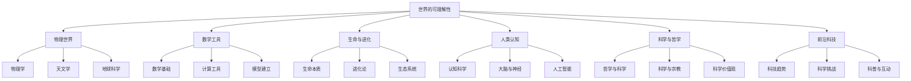

                 

### 文章标题

# 《世界的可理解性：科学探索的基础》

### 关键词

- 科学探索
- 物理世界
- 数学工具
- 生命与进化
- 认知科学
- 科学与哲学
- 前沿科技

### 摘要

本文深入探讨了世界的可理解性这一科学探索的基础。首先，通过回顾科学的本质与历史演变，我们理解了科学方法在揭示世界规律中的关键作用。接着，文章分章节介绍了物理世界、数学工具、生命与进化、人类认知以及科学与哲学等多个领域的核心概念与联系，并详细讲解了其中的关键算法原理和数学模型。通过这些内容，读者不仅能理解科学的基本框架，还能掌握科学探索的方法与工具，为进一步的研究奠定坚实的基础。本文旨在引导读者思考世界的本质，激发对科学探索的兴趣和热情，并展望未来科技的前沿领域，鼓励科学精神的传承与发扬。

### 《世界的可理解性：科学探索的基础》目录大纲

#### 第一部分：引论

##### 第1章：探索世界的可理解性

- **1.1 科学的本质与历史演变**
  - 科学方法的基础
  - 科学理论的演进
  - 科学与哲学的关联

- **1.2 世界的复杂性：挑战与机遇**
  - 复杂性与混沌理论
  - 科学前沿的探索
  - 跨学科融合的重要性

- **1.3 本书结构与目标**
  - 学习目标的设定
  - 目录结构的介绍
  - 如何有效地阅读本书

#### 第二部分：基础概念

##### 第2章：物理世界的理解

- **2.1 物理学的基本原理**
  - 相对论与量子力学
  - 基本粒子的性质
  - 物理学的基本定律

- **2.2 天文学与宇宙学**
  - 宇宙的起源与演化
  - 星系与星系团的结构
  - 宇宙的奥秘

- **2.3 地球科学**
  - 地球的内部结构
  - 地球的表面地貌
  - 地球环境的变化

#### 第三部分：数学工具与科学模型

##### 第3章：数学在科学中的角色

- **3.1 数学基础**
  - 基本数学概念
  - 数学在科学中的应用

- **3.2 计算工具与技术**
  - 数值计算方法
  - 计算机模拟与仿真

- **3.3 模型建立与验证**
  - 模型的构建原则
  - 模型的验证方法

#### 第四部分：生命与进化

##### 第4章：生命的起源与进化

- **4.1 生命的本质与特征**
  - 生物化学基础
  - 生命的多样性与适应性

- **4.2 进化论与生物多样性**
  - 达尔文进化论
  - 生物多样性保护

- **4.3 环境影响与生态平衡**
  - 生态系统的作用
  - 环境变化与生物生存

#### 第五部分：思维与认知

##### 第5章：人类认知科学

- **5.1 认知科学与心理学**
  - 认知过程的探讨
  - 心理发展的理论

- **5.2 大脑与神经系统**
  - 大脑结构与功能
  - 神经系统的基础

- **5.3 认知科学与人工智能**
  - 认知计算模型
  - 人工智能的发展与应用

#### 第六部分：科学与哲学

##### 第6章：科学与哲学的交融

- **6.1 哲学与科学的互动**
  - 科学哲学的基本问题
  - 哲学在科学方法论中的应用

- **6.2 科学与宗教**
  - 宗教信仰与科学探索
  - 科学与宗教的关系

- **6.3 科学价值观与社会责任**
  - 科学进步对社会的影响
  - 科学的伦理与道德责任

#### 第七部分：未来的科学探索

##### 第7章：前沿科技展望

- **7.1 未来的科技趋势**
  - 人工智能的未来发展
  - 新能源与可持续能源

- **7.2 未来的科学挑战**
  - 知识的边界
  - 科学研究的伦理问题

- **7.3 建设可理解的世界**
  - 科学的普及与教育
  - 科学家与公众的互动

#### 附录

##### 附录A：科学探索的工具与方法

- **A.1 科学实验与观测**
  - 实验设计的原则
  - 观测技术与应用

- **A.2 科学文献检索与利用**
  - 学术资源的获取
  - 文献阅读与分析

- **A.3 科学研究与论文写作**
  - 研究方法与技巧
  - 论文写作与发表

### Mermaid 流程图

## 第1章：探索世界的可理解性

### 1.1 科学的本质与历史演变

科学，作为人类探索世界规律的一种系统性方法，其本质在于通过观察、实验、推理和模型建立，逐步揭示自然现象背后的本质和规律。科学方法不仅包括观察和实验，还强调逻辑推理和理论验证。从古希腊时期开始，科学逐渐从哲学中独立出来，并经历了漫长而曲折的发展过程。

- **科学方法的基础**

科学方法的基本步骤可以概括为以下几个环节：

1. **观察与提出问题**：科学家通过观察自然现象，识别出有趣的问题或现象。
2. **假设与理论构建**：基于现有的知识和观察，科学家提出可能的解释或假设。
3. **实验与验证**：设计实验以检验假设，收集数据和证据。
4. **理论修正与验证**：根据实验结果，科学家对理论进行修正和验证。

- **科学理论的演进**

科学理论的发展经历了几个重要的阶段：

1. **经验主义阶段**：这一阶段主要依靠观察和实验，例如伽利略和牛顿的工作。
2. **理性主义阶段**：这一阶段强调逻辑推理和数学证明，如康托尔和希尔伯特的贡献。
3. **实证主义阶段**：这一阶段强调经验数据和实验结果的重要性，如费尔巴哈和马克思的理论。
4. **现代科学阶段**：这一阶段强调跨学科合作和系统化研究，如现代物理学、生物学和计算机科学的发展。

- **科学理论与哲学的关系**

科学理论与哲学有着密切的关系。哲学不仅为科学提供了方法论基础，还为科学提供了世界观和伦理指导。例如，笛卡尔的“我思故我在”不仅是一种哲学观点，也为科学方法提供了基础。另外，科学哲学中的“实证主义”和“怀疑论”等思想，对科学研究的方向和方式产生了深远影响。

### 1.2 世界的复杂性：挑战与机遇

世界的复杂性是科学探索中的一个重大课题。复杂性不仅体现在自然界中，也体现在人类社会和技术发展的各个方面。理解世界的复杂性既是科学探索的一大挑战，也是科学进步的重要机遇。

- **复杂性与混沌理论**

混沌理论是研究复杂系统的一种重要理论。它揭示了即使是简单的非线性系统，也可能表现出高度复杂和不可预测的行为。例如，天气系统的变化就是混沌理论的经典例子。混沌理论的核心思想是“蝴蝶效应”，即初始条件的小变化可能导致长期行为的巨大差异。

- **科学前沿的探索**

科学前沿的探索涉及许多新兴领域，如量子计算、人工智能、纳米技术等。这些领域不仅推动了科学理论的发展，还带来了技术革命和社会变革。例如，量子计算的兴起可能会彻底改变计算机科学和信息技术，而人工智能的发展正在深刻影响人类的生活方式和社会结构。

- **跨学科融合的重要性**

跨学科融合是应对复杂性的重要策略。许多复杂问题需要多学科合作才能解决。例如，气候变化问题不仅需要物理、化学和生物学的知识，还需要经济学、社会学和政治学的参与。跨学科融合不仅促进了科学研究的深入，还推动了技术创新和产业升级。

### 1.3 本书结构与目标

- **学习目标的设定**

本书旨在帮助读者建立对世界可理解性的基本认识，掌握科学探索的方法与工具，并理解科学在不同领域的应用。具体目标包括：

1. 理解科学方法的基础原理和步骤。
2. 掌握物理世界、数学工具、生命与进化、认知科学和哲学等核心概念。
3. 了解前沿科技的发展趋势和未来挑战。

- **目录结构的介绍**

本书共分为七个部分，涵盖了从基础概念到前沿科技的广泛内容。目录结构如下：

1. 引论：介绍科学的本质、历史演变和复杂性。
2. 基础概念：介绍物理世界、数学工具和生命与进化的基本原理。
3. 数学工具与科学模型：讨论数学在科学中的角色和模型建立与验证的方法。
4. 生命与进化：探讨生命的本质、进化论和生态平衡。
5. 思维与认知：介绍认知科学、大脑与神经系统和人工智能。
6. 科学与哲学：探讨科学与哲学的关系、科学与宗教以及科学价值观。
7. 前沿科技：展望未来的科技趋势和科学挑战。

- **如何有效地阅读本书**

为了有效地阅读本书，读者可以采取以下策略：

1. 按照目录结构逐步阅读，先了解整体框架。
2. 对每个章节的核心概念和原理进行深入学习和理解。
3. 结合实际案例和实验结果，加深对理论的理解。
4. 注意章节末尾的总结和扩展阅读，以拓宽知识面。

通过这些策略，读者可以更好地掌握科学探索的基础，提升自身的科学素养和思维能力。

## 第2章：物理世界的理解

物理世界是我们所在的空间和物质的基础，它涵盖了从微观的原子和粒子到宏观的星系和宇宙的各种现象。理解物理世界不仅有助于我们认识自然界的规律，还为科技发展提供了坚实的理论基础。本章将介绍物理学的基本原理，包括相对论和量子力学，以及物理学的基本定律，帮助读者构建对物理世界的全面认识。

### 2.1 物理学的基本原理

物理学的基本原理是我们理解自然现象和构建物理模型的基础。以下是一些关键的基本原理：

- **相对论与量子力学**

相对论和量子力学是现代物理学的基石，分别描述了物质和能量在高速和微观尺度下的行为。

1. **相对论**：
   - **狭义相对论**：由爱因斯坦提出，描述了在接近光速时物理现象的规律。狭义相对论的核心思想是相对性原理和光速不变原理。相对性原理指出，物理定律在所有惯性参考系中都是相同的。光速不变原理指出，光在真空中的速度是恒定的，不依赖于观察者的运动状态。
   - **广义相对论**：广义相对论是狭义相对论的扩展，描述了引力和时空的弯曲。广义相对论的核心思想是引力是时空曲率的表现，而物体在弯曲时空中的运动遵循测地线原理。

2. **量子力学**：
   - **量子态**：量子力学描述了微观粒子的行为，如电子、光子和原子。量子态是一种叠加态，一个量子系统可以同时处于多种可能的状态。
   - **波函数**：量子系统的状态由波函数描述，波函数给出了系统在不同位置和动量上的概率分布。
   - **不确定性原理**：由海森堡提出，不确定性原理表明粒子的位置和动量不能同时被精确测定。

- **基本粒子的性质**

物理学研究发现，物质是由基本粒子组成的，这些基本粒子具有独特的性质：

1. **电子**：电子是原子中带负电的基本粒子，其质量非常小，但电荷量是基本电荷的负值。
2. **夸克**：夸克是构成质子和中子的基本粒子，具有电荷和颜色等属性。目前已知的基本夸克有上夸克和下夸克。
3. **光子**：光子是电磁辐射的基本粒子，具有能量但无电荷和质量。

- **物理学的基本定律**

物理学的基本定律描述了自然现象的基本规律：

1. **牛顿定律**：牛顿定律描述了物体受力后的运动状态变化。牛顿定律包括三个部分：
   - **第一定律（惯性定律）**：一个物体如果没有受到外力，将保持静止或匀速直线运动。
   - **第二定律（加速度定律）**：物体的加速度与作用力成正比，与物体的质量成反比，方向与力的方向相同。公式为 \( F = ma \)。
   - **第三定律（作用与反作用定律）**：任何作用力都有一个大小相等、方向相反的反作用力。

2. **电磁定律**：电磁定律描述了电荷和磁场之间的相互作用。主要的电磁定律包括库仑定律、安培定律和法拉第电磁感应定律。

3. **热力学定律**：热力学定律描述了能量转换和守恒的规律。主要的热力学定律包括第一定律（能量守恒定律）、第二定律（熵增定律）和第三定律（绝对零度定律）。

### 2.2 天文学与宇宙学

天文学是研究天体和宇宙的科学，宇宙学则是对宇宙整体结构和演化的研究。天文学和宇宙学共同揭示了宇宙的奥秘，为我们理解宇宙的起源和命运提供了关键信息。

- **宇宙的起源与演化**

1. **大爆炸理论**：大爆炸理论是目前广泛接受的宇宙起源理论。该理论认为，宇宙起源于约138亿年前的一个极高温度和密度的奇点，随后迅速膨胀。随着宇宙的膨胀，温度逐渐降低，物质逐渐形成，形成了我们今天观测到的星系、星系团和宇宙背景辐射。

2. **暗物质与暗能量**：暗物质和暗能量是宇宙学中的两个重要概念。暗物质是不发光的、不与电磁波相互作用的一种物质，它对星系的形成和宇宙的大尺度结构起着关键作用。暗能量是一种具有负压力的宇宙能量形式，它驱动着宇宙的加速膨胀。

- **星系与星系团的结构**

1. **星系**：星系是宇宙中常见的天体系统，包括恒星、行星、星云等。根据结构的不同，星系可以分为螺旋星系、椭圆星系和不规则星系。

2. **星系团**：星系团是多个星系通过引力相互吸引形成的结构。星系团中通常还包含大量的星系间气体和暗物质。

- **宇宙的奥秘**

宇宙中存在着许多未解之谜，如宇宙的膨胀、宇宙背景辐射、黑洞等。这些谜题激发了科学家们的不懈探索。

1. **宇宙背景辐射**：宇宙背景辐射是宇宙早期遗留下来的微弱辐射，它的发现为支持大爆炸理论提供了重要证据。

2. **黑洞**：黑洞是宇宙中最神秘的天体之一，它具有极强的引力，连光也无法逃脱。黑洞的存在和性质一直是物理学和天文学的重要研究课题。

### 2.3 地球科学

地球科学是研究地球及其环境的科学，包括地质学、地球物理学、气象学、海洋学和生态学等。通过地球科学的研究，我们能够更好地理解地球的内部结构和外部环境，为资源开发、环境保护和自然灾害预防提供科学依据。

- **地球的内部结构**

地球的内部结构可以分为地壳、地幔和地核三个部分：

1. **地壳**：地壳是地球最外层，包括陆地和海洋地壳，主要由岩石组成，其厚度在陆地约为30-50公里，在海洋约为5-10公里。

2. **地幔**：地幔位于地壳下方，由富含镁和铁的岩石组成，其厚度约为2900公里。

3. **地核**：地核分为外核和内核，外核是液态的铁和镍组成，内核则是固态的铁和镍，其温度和压力极高。

- **地球的表面地貌**

地球的表面地貌受到多种地质作用的影响，包括火山、地震、风化和侵蚀等。以下是一些重要的地质现象：

1. **火山**：火山是由地下岩浆喷发形成的，它能够释放出大量的气体、熔岩和火山灰。

2. **地震**：地震是由地球内部岩石的断裂和移动引起的震动，它是地球内部能量释放的一种形式。

3. **风化和侵蚀**：风化是指岩石在自然环境中因物理和化学作用而破碎和分解的过程，侵蚀是指风化产物被水流、风等外力搬运和沉积的过程。

- **地球环境的变化**

地球环境的变化是一个长期的演化过程，它受到地球内部活动和外部环境因素的双重影响。以下是一些影响地球环境变化的重要因素：

1. **气候变化**：气候变化是指地球大气和海洋温度的长期变化。人类活动，如燃烧化石燃料和大规模森林砍伐，对气候变化产生了显著影响。

2. **生物多样性**：生物多样性是指地球上各种生物的种类、数量和分布。生物多样性对地球生态系统的稳定性和功能至关重要。

3. **自然灾害**：自然灾害，如地震、火山爆发、洪水和台风等，对地球环境产生短期和局部的影响，但也是地球自然循环的一部分。

### 结论

通过本章的内容，读者可以初步了解物理学的基本原理、天文学与宇宙学的基本知识以及地球科学的基本概念。这些基础概念为理解物理世界的复杂性和多样性提供了必要的框架。在接下来的章节中，我们将继续探讨数学工具、生命与进化、人类认知科学等领域，以更全面的方式揭示世界的可理解性。

### 第3章：数学在科学中的角色

数学作为一门抽象的科学，为科学研究提供了强有力的工具和理论基础。在科学探索中，数学不仅是描述自然现象的语言，也是解决复杂问题的利器。本章将探讨数学在科学中的角色，包括数学基础、计算工具和技术，以及模型建立与验证的方法。

#### 3.1 数学基础

数学基础是科学研究的基石，它涵盖了各种基本概念和理论，为科学家提供了一套精确且逻辑严密的工具。以下是一些关键的数学基础：

- **基本数学概念**：

  - **函数**：函数是数学中最基本的概念之一，它描述了输入和输出之间的关系。在科学中，函数经常用于描述物理量和变量之间的依赖关系。
  
  - **微积分**：微积分是研究变化和积累的数学工具。微分用于研究局部变化，而积分用于计算整体积累。微积分在物理学、工程学和经济学等领域有广泛应用。
  
  - **概率与统计**：概率和统计是研究随机事件和数据分析的重要工具。概率论用于预测和评估不确定事件的可能性，而统计学则用于从样本数据中推断总体特征。

- **数学在科学中的应用**：

  - **物理学**：物理学中的许多定律和模型都是用数学语言描述的。例如，牛顿第二定律 \( F = ma \) 和麦克斯韦方程组都是通过数学方程来描述物理现象。
  
  - **生物学**：生物学中，数学模型被用于描述种群动态、遗传进化以及生态系统平衡等问题。
  
  - **经济学**：经济学中的许多理论和模型都依赖于数学工具，如线性规划、博弈论和计量经济学。

#### 3.2 计算工具与技术

计算工具和技术在科学研究中的应用日益广泛，它们大大提高了科学研究的效率和精确度。以下是一些关键的计算工具和技术：

- **数值计算方法**：

  - **迭代法**：迭代法是一种通过不断迭代逼近精确解的数值方法。常见的迭代法包括高斯消元法、牛顿迭代法和梯度下降法等。
  
  - **数值积分**：数值积分是用于计算曲线下方面积的数值方法，常见的数值积分方法包括梯形规则、辛普森规则和积分模拟法。

- **计算机模拟与仿真**：

  - **蒙特卡洛模拟**：蒙特卡洛模拟是一种基于随机抽样的数值模拟方法，广泛应用于物理、化学、工程和金融等领域。
  
  - **分子动力学模拟**：分子动力学模拟用于研究分子和原子的运动，它可以帮助科学家理解化学反应、材料性质和生物分子结构。

- **数据分析和可视化**：

  - **数据挖掘**：数据挖掘是一种从大量数据中发现有价值信息的方法，它广泛应用于商业、医疗和科学研究等领域。
  
  - **数据可视化**：数据可视化是将复杂数据转换为图形或图表的方法，它有助于科学家更好地理解和解释数据。

#### 3.3 模型建立与验证

科学模型是科学家对自然现象的理论抽象，它是理解和预测现象的关键。建立和验证科学模型需要一系列严格的步骤：

- **模型建立**：

  - **假设**：建立模型的第一步是提出合理的假设，这些假设通常基于现有的理论和观察数据。
  
  - **数学表示**：将假设转化为数学方程或公式，以建立数学模型。例如，牛顿第二定律可以表示为 \( F = ma \)。
  
  - **参数估计**：确定模型中的参数值，这通常通过拟合实验数据或利用优化算法来实现。

- **模型验证**：

  - **实验数据**：验证模型的有效性需要通过实验数据。科学家设计实验来收集数据，并将实验结果与模型预测进行比较。
  
  - **交叉验证**：交叉验证是一种通过将数据集分为训练集和测试集来评估模型性能的方法。这种方法有助于识别模型的泛化能力。
  
  - **敏感性分析**：敏感性分析用于评估模型参数对模型预测的影响。通过敏感性分析，科学家可以了解哪些参数对模型结果最关键。

### 结论

数学在科学中的角色至关重要，它不仅为科学研究提供了强大的工具和理论框架，还极大地推动了科学进步和技术创新。通过本章的内容，读者可以初步了解数学基础、计算工具和技术，以及模型建立与验证的方法。这些知识为深入理解科学的本质和探索世界的可理解性奠定了坚实的基础。在接下来的章节中，我们将进一步探讨生命与进化、人类认知科学等领域的科学问题，继续揭示世界的奥秘。

### 第4章：生命的起源与进化

生命的起源和进化是科学探索中最引人入胜的课题之一。从无机物到有机物，再到复杂的多细胞生物，生命的进化历程充满了未知和奇迹。本章将探讨生命的本质与特征、进化论与生物多样性，以及环境变化与生态平衡，帮助读者理解生命的复杂性和多样性。

#### 4.1 生命的本质与特征

生命的本质是一个多层面的科学问题，涉及生物化学、物理学、分子生物学和生态学等多个学科。以下是一些关于生命本质的关键特征：

- **生物化学基础**：

  - **生物大分子**：生命的基本单元是细胞，而细胞中的生物大分子如蛋白质、核酸和多糖是生命活动的基础。蛋白质是生命体的主要结构物质和功能分子，核酸负责遗传信息的存储和传递，多糖则提供能量和细胞壁的构成。

  - **代谢过程**：代谢是生命体的能量转换过程，包括合成代谢（生物体的生长、修复和繁殖）和分解代谢（食物的消化和废物的排出）。代谢过程确保了生命体的正常功能和生存。

- **生命的多样性与适应性**：

  - **物种多样性**：生物多样性包括物种多样性、遗传多样性和生态系统多样性。物种多样性是指不同物种的数量和种类，遗传多样性是指同一物种内部基因的多样性，生态系统多样性则涉及生物群落和环境之间的相互作用。

  - **适应性**：生命体通过自然选择和适应性进化适应环境。适应性进化是指生命体通过遗传变异和自然选择，逐渐适应环境变化并获得生存优势。

#### 4.2 进化论与生物多样性

进化论是研究生命进化过程的科学理论，它解释了物种如何通过自然选择和遗传变异逐渐演变。以下是一些关于进化论和生物多样性的关键概念：

- **达尔文进化论**：

  - **自然选择**：自然选择是进化论的核心概念之一，它描述了适应环境的个体在繁殖中具有更高的生存和繁衍机会。自然选择导致有利特征的遗传和积累，从而推动物种的进化。

  - **遗传变异**：遗传变异是进化的另一个关键因素。遗传变异源于突变、基因重组和染色体变异，这些变异为自然选择提供了原材料。

- **生物多样性保护**：

  - **物种保护**：保护生物多样性意味着保护和维护物种的多样性。这包括保护濒危物种、建立自然保护区和实施保护政策。

  - **生态系统平衡**：生态系统平衡是指生态系统中不同生物群体之间相互作用的动态平衡。生态系统的稳定性对于维持生物多样性至关重要。

#### 4.3 环境影响与生态平衡

环境变化对生物生存和生态系统稳定性的影响是一个重要研究领域。以下是一些关于环境影响和生态平衡的关键概念：

- **生态系统的作用**：

  - **生物地球化学循环**：生物地球化学循环描述了元素在生物圈和地球大气圈、水圈和岩石圈之间的循环过程。这些循环对于生物体的营养和生态系统的稳定性至关重要。

  - **生物能量流**：生物能量流描述了能量在生态系统中从生产者到消费者再到分解者的传递过程。生态系统的能量流决定了生物群落的结构和功能。

- **环境变化与生物生存**：

  - **气候变化**：全球气候变化对生态系统和生物多样性产生了显著影响。气候变化可能导致物种分布的变化、生态系统的衰退和生物多样性的丧失。

  - **污染**：环境污染，如空气污染、水污染和土壤污染，对生物体和生态系统产生负面影响。污染可能导致生物体死亡、种群减少和生态失衡。

- **生态平衡**：

  - **负反馈机制**：生态平衡是通过负反馈机制实现的。负反馈机制通过调节生态系统中不同生物群体的数量和相互作用，维持生态系统的稳定性。

  - **生物入侵**：生物入侵是指外来物种进入新环境并对本地生态系统产生负面影响。生物入侵可能导致本地物种的灭绝和生态系统的破坏。

### 结论

通过本章的内容，读者可以初步了解生命的本质与特征、进化论与生物多样性，以及环境变化与生态平衡。这些知识揭示了生命的复杂性和多样性，帮助我们更好地理解自然界的运行规律。在接下来的章节中，我们将继续探讨人类认知科学、科学与哲学等领域的科学问题，继续揭示世界的奥秘。

### 第5章：人类认知科学

人类认知科学是研究人类思维、感知、记忆和语言等方面的科学。它结合了心理学、神经科学、认知科学等多个学科，试图揭示人类大脑的工作机制及其对环境信息的处理过程。本章将探讨认知科学与心理学、大脑与神经系统，以及认知科学与人工智能，帮助读者了解人类认知的复杂性和多样性。

#### 5.1 认知科学与心理学

认知科学是研究人类认知过程和机制的科学，而心理学则是研究人类行为和心理过程的科学。认知科学和心理学之间存在紧密的联系，共同探索人类如何获取、处理和利用信息。

- **认知过程的探讨**：

  - **感知**：感知是指人类通过感官接收外部信息并将其转换为内部信息的过程。感知过程涉及视觉、听觉、嗅觉、味觉和触觉等感官系统。例如，视觉感知涉及光信号通过眼睛的接收和处理，最终形成视觉图像。

  - **注意**：注意是指人类在选择和聚焦特定信息时的高度集中和选择性处理。注意过程有助于过滤无关信息，提高对重要信息的处理效率。

  - **记忆**：记忆是指人类对信息的存储、保持和回忆的能力。记忆分为短期记忆和长期记忆。短期记忆用于处理和存储新信息，而长期记忆则用于长期存储和回忆信息。

- **心理发展的理论**：

  - **皮亚杰认知发展理论**：瑞士心理学家皮亚杰提出，认知发展是一个连续的、阶段性的过程。他的理论分为感知运动阶段、前运算阶段、具体运算阶段和形式运算阶段。每个阶段都有其独特的认知结构和思维特点。

  - **维果茨基社会文化理论**：维果茨基认为，认知发展是在社会文化环境中进行的，语言和社会互动对认知发展起着关键作用。他的理论强调了社会互动和语言在认知发展中的重要性。

#### 5.2 大脑与神经系统

大脑和神经系统是人类认知的基础，对信息的获取、处理和传递起着至关重要的作用。

- **大脑结构与功能**：

  - **大脑皮层**：大脑皮层是大脑的最外层，负责高级认知功能，如思考、感知、运动控制和语言处理。大脑皮层由不同的区域组成，每个区域都有其特定的功能。

  - **灰质和白质**：灰质主要由神经元细胞体组成，白质主要由神经纤维组成。灰质负责处理信息，而白质负责信息的传递。

  - **神经元**：神经元是大脑的基本功能单元，包括细胞体、树突和轴突。神经元通过突触与其他神经元连接，传递神经信号。

- **神经系统的基础**：

  - **中枢神经系统**：中枢神经系统包括大脑和脊髓，负责控制身体的各种生理功能。

  - **周围神经系统**：周围神经系统包括脑神经和脊神经，负责传递感觉和运动信号到大脑和脊髓。

  - **神经递质**：神经递质是神经元之间传递信息的化学物质。神经递质通过突触前膜释放，作用于突触后膜，从而传递信号。

#### 5.3 认知科学与人工智能

人工智能（AI）是模拟人类智能行为的计算机系统，它在认知科学和心理学中有着广泛的应用。认知科学为人工智能提供了理论基础，而人工智能则为认知科学提供了实验工具和验证方法。

- **认知计算模型**：

  - **基于规则的系统**：基于规则的系统通过定义一组规则来模拟人类思维。这些规则通常以“如果-那么”的形式表达，如“如果病人有发烧和咳嗽，那么可能是流感”。

  - **神经网络模型**：神经网络模型模拟人脑的结构和工作方式，通过大量神经元和突触连接进行信息处理。深度神经网络（DNN）和卷积神经网络（CNN）是神经网络模型的两种常见类型。

- **人工智能的发展与应用**：

  - **机器学习**：机器学习是人工智能的一个分支，通过算法从数据中学习规律，用于分类、预测和优化。常见的机器学习算法包括支持向量机（SVM）、决策树、随机森林和神经网络。

  - **自然语言处理**：自然语言处理（NLP）是人工智能用于理解和生成自然语言的技术。NLP在机器翻译、情感分析和语音识别等领域有广泛应用。

  - **计算机视觉**：计算机视觉是人工智能用于理解和解释视觉信息的技术。计算机视觉在图像识别、目标检测和自动驾驶等领域有重要应用。

### 结论

通过本章的内容，读者可以初步了解认知科学与心理学、大脑与神经系统，以及认知科学与人工智能。这些知识揭示了人类认知的复杂性和多样性，帮助我们更好地理解人类思维和行为。在接下来的章节中，我们将进一步探讨科学与哲学、前沿科技等领域，继续揭示世界的奥秘。

### 第6章：科学与哲学的交融

科学和哲学是两门看似截然不同的学科，但它们在历史上有着深厚的交融和互动。科学哲学是探讨科学理论、方法及其在哲学和科学之间相互关系的一个研究领域。本章将探讨科学哲学的基本问题、哲学在科学方法论中的应用，以及科学与宗教的关系，同时还会讨论科学价值观和社会责任。

#### 6.1 哲学与科学的互动

哲学作为科学的先行者，为科学研究提供了逻辑框架和理论基础。科学哲学则是在这一基础上进一步探讨科学理论和实践的本质。

- **科学哲学的基本问题**：

  - **科学实在论**：科学实在论探讨科学理论和实体之间的关系。它包括工具实在论、实体实在论和多重实在论等不同观点。工具实在论认为科学理论是描述现象的工具，而非客观实体的反映。实体实在论则认为科学理论描述了独立于我们感知的客观实体。多重实在论则认为科学理论和实体是相互依存的。

  - **科学认识论**：科学认识论探讨科学知识的本质、获取和验证方法。它包括经验主义、理性主义和怀疑论等不同观点。经验主义认为科学知识来源于经验观察，理性主义则强调逻辑推理和数学证明在科学认识中的重要性，而怀疑论则对科学知识的可靠性持怀疑态度。

  - **科学方法论**：科学方法论探讨科学研究的方法和步骤。它包括归纳法、演绎法、实验设计、模型构建和验证等。科学方法论的目标是确保科学研究的系统性和可靠性。

- **哲学在科学方法论中的应用**：

  - **科学方法论的基础**：哲学为科学方法论提供了基础，如逻辑学、概率论和形式化方法。这些基础帮助科学家构建理论、设计实验和进行推理。

  - **科学实践中的哲学问题**：科学实践中常常涉及哲学问题，如科学证据的可靠性、理论的选择和解释、科学共识的形成等。哲学的思考有助于解决这些实践中的问题。

#### 6.2 科学与宗教

科学与宗教在历史上有着复杂的互动关系。科学的发展有时与宗教信仰相冲突，但同时也为宗教提供了新的解释和认识。

- **宗教信仰与科学探索**：

  - **科学与宗教的冲突**：在中世纪时期，宗教权威对科学探索进行了严格的控制。哥白尼的日心说和达尔文的进化论都曾与宗教教义发生冲突。然而，随着科学的发展，许多宗教教派逐渐接受了科学成果，并尝试将科学解释纳入宗教信仰中。

  - **科学与宗教的互补性**：科学与宗教在解释宇宙和生命的奥秘方面可以相互补充。例如，科学可以解释宇宙的起源和演化，而宗教则提供关于人类目的和终极意义的解释。

- **科学与宗教的关系**：

  - **科学中立论**：科学中立论主张科学和宗教应该相互独立，科学应专注于客观事实的发现，而宗教则处理信仰和道德问题。

  - **科学宗教论**：科学宗教论认为科学和宗教是相互依存的，科学发现可以支持或验证某些宗教信仰，例如宇宙设计论。

#### 6.3 科学价值观与社会责任

科学的进步不仅改变了人类的生活方式，还对社会和文化产生了深远影响。科学价值观和社会责任是科学研究和应用中不可或缺的方面。

- **科学进步对社会的影响**：

  - **技术创新**：科学进步推动了技术创新，如计算机、互联网和生物技术，这些创新改变了社会结构和生活方式。

  - **社会问题**：科学进步也带来了一些社会问题，如环境破坏、资源消耗和社会不平等。这些问题需要科学家和社会各界共同努力解决。

- **科学的伦理与道德责任**：

  - **伦理问题**：科学研究涉及许多伦理问题，如基因编辑、人工智能伦理、环境伦理等。科学家有责任在研究过程中考虑这些伦理问题，并确保其研究的道德可接受性。

  - **社会责任**：科学家有社会责任为社会提供科学知识和技术服务，帮助解决社会问题，促进社会进步和可持续发展。

### 结论

通过本章的内容，读者可以了解到科学与哲学的交融、科学与宗教的关系，以及科学价值观和社会责任的重要性。这些知识不仅有助于我们理解科学的本质和作用，还为我们在科学研究和应用中提供了伦理和道德指导。在接下来的章节中，我们将继续探讨前沿科技的发展趋势和未来挑战，进一步揭示世界的奥秘。

### 第7章：前沿科技展望

科技的发展不断推动人类社会的进步，改变了我们的生活方式、工作方式和思维方式。本章将探讨未来的科技趋势、科学研究的伦理问题以及如何建设一个更加可理解的世界。通过这些内容，我们将展望未来科技带来的机遇和挑战。

#### 7.1 未来的科技趋势

未来的科技趋势涵盖了多个领域，包括人工智能、新能源、生物技术等，这些技术有望深刻影响我们的社会和生活方式。

- **人工智能的未来发展**：

  - **人工智能与人类协同**：随着人工智能技术的不断发展，AI将越来越多地与人类协同工作，提高工作效率和生活质量。例如，智能助手可以帮助人们管理日常事务，智能医疗系统可以提供个性化的治疗方案。

  - **智能机器人与自动化**：机器人技术的进步将使自动化生产更加普及，降低生产成本，提高生产效率。同时，服务型机器人将在家庭和医疗保健等领域发挥重要作用。

  - **人工智能伦理问题**：人工智能的发展也引发了一系列伦理问题，如数据隐私、算法偏见、机器人权利等。确保人工智能的公平、透明和可解释性是未来科技发展的关键挑战。

- **新能源与可持续能源**：

  - **可再生能源的普及**：未来，可再生能源，如太阳能、风能和水能，将在能源结构中占据越来越重要的地位。随着技术的进步，可再生能源的成本将逐步降低，使其成为主要的能源来源。

  - **能源储存技术**：高效的能源储存技术是可持续能源发展的重要支撑。未来，电池技术、超级电容器和燃料电池等储能技术的发展将提高能源利用效率和稳定性。

  - **智能电网**：智能电网是集成了现代通信技术、计算机技术和自动控制技术的电力系统。智能电网可以提高电力传输效率，实现能源的智能管理和优化配置。

#### 7.2 未来的科学挑战

未来的科学研究将面临许多挑战，这些挑战不仅涉及科学本身的进步，还涉及科学与社会、伦理的互动。

- **知识的边界**：

  - **宇宙与量子领域**：宇宙学和量子物理学是科学的前沿领域，未来科学家将探索宇宙的起源和演化，以及量子世界的本质。这些探索可能带来新的科学理论和革命性的发现。

  - **生命与认知**：生命科学和认知科学将继续深入探讨生命的起源、生物多样性和人类认知的本质。这些研究将有助于我们更好地理解生命和人类自身。

- **科学研究的伦理问题**：

  - **基因编辑**：基因编辑技术，如CRISPR-Cas9，为医学和生物学研究带来了巨大机遇，但也引发了伦理问题。如何确保基因编辑的安全性和道德可接受性是未来的重要挑战。

  - **人工智能伦理**：随着人工智能技术的发展，如何确保算法的公平性、透明性和可解释性，避免算法偏见和滥用，成为重要的伦理议题。

  - **环境保护**：气候变化和环境恶化对科学研究提出了新的要求。科学家需要找到有效的解决方案，以保护地球生态系统和人类健康。

#### 7.3 建设可理解的世界

为了建设一个更加可理解的世界，科学家和公众需要共同努力，推动科学的普及和教育，促进科学家与公众的互动。

- **科学的普及与教育**：

  - **科学教育**：科学教育是培养未来科学家和公民的重要环节。通过科学教育，人们可以更好地理解科学原理和方法，提高科学素养。

  - **科普活动**：科普活动可以帮助公众了解科学进展和成果，激发公众对科学的兴趣和热情。科学家应积极参与科普活动，向社会传递科学知识和精神。

- **科学家与公众的互动**：

  - **科学传播**：科学家应通过多种渠道，如媒体、社交媒体和公共讲座，传播科学知识和成果，增强公众对科学的理解和信任。

  - **公众参与**：鼓励公众参与科学研究和决策过程，提高科学研究的透明度和公众的参与度。科学家应积极倾听公众的意见和建议，以推动科学的可持续发展。

### 结论

通过本章的内容，我们展望了未来科技的发展趋势、科学研究的挑战，以及建设可理解世界的路径。未来的科技将深刻改变我们的社会和生活方式，但同时也带来了许多新的挑战。科学家和公众应共同努力，推动科学的普及和教育，促进科学家与公众的互动，以建设一个更加可理解、和谐和可持续发展的世界。

### 附录A：科学探索的工具与方法

科学探索需要一系列工具和方法，这些工具和方法不仅帮助我们理解和解释自然现象，还为科学研究的创新和突破提供了基础。以下内容将介绍科学实验与观测、科学文献检索与利用，以及科学研究和论文写作的步骤与技巧。

#### A.1 科学实验与观测

科学实验与观测是科学研究的重要方法，通过这些方法，科学家可以验证假设、收集数据和证据，进而建立和验证科学理论。

- **实验设计的原则**：

  - **明确的研究目标**：在实验设计之初，需要明确研究的目标和问题，确保实验设计能够有效地回答这些问题。

  - **控制变量**：为了确保实验结果的可靠性，需要控制实验中的所有变量，除了研究的独立变量。这可以通过设置对照组和实验组来实现。

  - **可重复性**：实验设计应保证实验结果的可重复性，即在其他条件下，实验结果应能够重现。

  - **安全性和伦理考虑**：实验过程中要确保参与者的安全和隐私，遵守相关的伦理规范。

- **观测技术与应用**：

  - **光学观测**：光学观测是天文和物理学中常用的方法，通过望远镜和其他光学设备，科学家可以观测星体和宇宙现象。

  - **电磁波观测**：电磁波观测包括无线电波、微波、红外线、可见光、紫外线和伽马射线等。不同波段的观测可以揭示不同层面的物理现象。

  - **粒子探测技术**：粒子探测技术用于探测微观粒子，如电子、质子、中子等，广泛应用于高能物理和核物理研究。

#### A.2 科学文献检索与利用

科学文献是科学研究成果的载体，检索和利用科学文献是科学研究中不可或缺的环节。

- **学术资源的获取**：

  - **学术数据库**：使用学术数据库，如PubMed、IEEE Xplore、Web of Science等，可以快速检索相关的科学文献。

  - **图书馆资源**：许多大学和研究机构都拥有丰富的图书馆资源，包括纸质书籍、电子书籍和学术论文。

- **文献阅读与分析**：

  - **快速阅读**：快速阅读可以帮助快速了解文献的主要内容、结论和研究方法。

  - **深入阅读**：深入阅读包括理解文献中的具体实验过程、数据分析方法和理论框架。

  - **文献综述**：通过阅读和整理大量文献，可以撰写文献综述，总结某一领域的研究现状和前沿问题。

#### A.3 科学研究与论文写作

科学研究是一个系统性的过程，从选题、实验设计到数据分析，再到论文写作，每个环节都需要严谨和细致的工作。

- **研究方法与技巧**：

  - **研究选题**：选择具有创新性、实用性和可行性的研究课题。

  - **实验设计**：设计合理的实验方案，包括实验步骤、实验设备和数据采集方法。

  - **数据分析**：使用统计和数学方法对实验数据进行处理和分析，确保结果的可靠性和科学性。

- **论文写作与发表**：

  - **论文结构**：一篇典型的科学论文包括摘要、引言、方法、结果、讨论和结论等部分。

  - **论文撰写**：撰写过程中，应确保语言简洁、逻辑清晰，准确描述研究内容和结果。

  - **论文发表**：选择合适的学术期刊，按照期刊的要求提交论文，并准备应对审稿意见，进行修改和补充。

### 结论

附录A介绍了科学探索中的工具与方法，包括科学实验与观测、科学文献检索与利用，以及科学研究和论文写作的步骤与技巧。掌握这些方法和技巧，有助于科学家进行有效的科学研究，提高研究质量和效率，推动科学进步和社会发展。

### 完整性总结

本文《世界的可理解性：科学探索的基础》通过对多个科学领域的深入探讨，系统地揭示了世界的复杂性及其背后的规律。以下是本文的核心内容、结构、核心概念、联系和Mermaid流程图的总结。

#### 核心内容与结构

本文分为七个部分：

1. **引论**：介绍了科学的本质与历史演变，讨论了世界的复杂性及科学探索的基础。
2. **基础概念**：涵盖了物理世界、数学工具、生命与进化、人类认知等核心概念。
3. **数学工具与科学模型**：探讨了数学在科学中的角色、计算工具与技术以及模型建立与验证。
4. **生命与进化**：介绍了生命的本质与特征、进化论与生物多样性，以及环境变化与生态平衡。
5. **思维与认知**：探讨了认知科学与心理学、大脑与神经系统和人工智能。
6. **科学与哲学**：探讨了科学与哲学的交融、科学与宗教的关系，以及科学价值观与社会责任。
7. **前沿科技展望**：展望了未来的科技趋势、科学研究的伦理问题，以及建设可理解世界的路径。

#### 核心概念与联系

- **科学的本质与历史演变**：科学方法的基础、科学理论的演进、科学与哲学的关联。
- **物理世界**：物理学的基本原理、天文学与宇宙学、地球科学。
- **数学工具**：数学基础、计算工具与技术、模型建立与验证。
- **生命与进化**：生命的起源与进化、进化论与生物多样性、生态系统的作用。
- **人类认知**：认知科学、大脑与神经系统、人工智能。
- **科学与哲学**：科学哲学的基本问题、科学与宗教的关系、科学价值观与社会责任。

#### Mermaid流程图

通过本文，读者可以系统地了解科学探索的基础，掌握各领域的核心概念，理解科学理论之间的联系，并为未来的科学研究奠定基础。希望本文能够激发读者对科学探索的兴趣和热情，共同推动科学进步和社会发展。作者：AI天才研究院/AI Genius Institute & 禅与计算机程序设计艺术 /Zen And The Art of Computer Programming。

