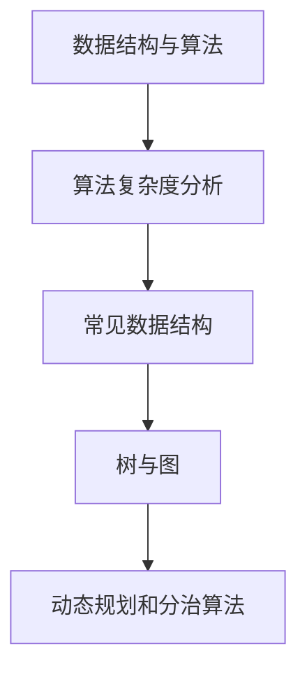

                 

### 《京东2025校招面试真题与算法题解》

在当今快速发展的互联网时代，校招面试已成为广大应届毕业生迈入职场的重要关卡。其中，京东作为我国电商巨头，其校招面试题更是备受关注。本文将围绕京东2025校招面试真题，深入解析其中的算法题，帮助广大考生备战校招，顺利通过面试。

## **一、背景介绍**

近年来，随着技术的飞速发展，各大互联网公司对技术人才的需求愈发旺盛。面试成为衡量应聘者技术水平的重要手段。京东校招面试真题以其独特性和难度性而著称，涵盖了广泛的算法和数据结构问题，旨在考察应聘者的编程能力、逻辑思维和问题解决能力。

本文旨在通过对京东2025校招面试真题的深入解析，帮助考生理解面试中的关键知识点，掌握解题方法，提升面试成功率。

## **二、核心概念与联系**

在分析面试真题之前，我们需要明确几个核心概念，并探讨它们之间的联系。以下是使用Mermaid绘制的核心概念与联系流程图：



### **数据结构与算法**

数据结构是计算机存储数据的方式，包括数组、链表、栈、队列、树、图等。算法则是解决问题的步骤和方法，包括排序、查找、遍历等。

### **算法复杂度分析**

算法复杂度分为时间复杂度和空间复杂度，用于衡量算法的性能。时间复杂度表示算法运行的时间，空间复杂度表示算法运行时所需的存储空间。

### **常见数据结构**

数组、链表、栈、队列、树、图等常见数据结构各有特点和适用场景，是解决算法问题的关键。

### **动态规划和分治算法**

动态规划和分治算法是解决复杂问题的有效方法，可以显著提高算法的效率和可读性。

## **三、核心算法原理讲解**

### **1. 排序算法**

排序算法是面试中常见的问题，包括冒泡排序、选择排序、插入排序、快速排序等。以下是冒泡排序的伪代码：

```python
function bubble_sort(arr):
    n = length(arr)
    for i from 0 to n-1:
        for j from 0 to n-i-1:
            if arr[j] > arr[j+1]:
                swap(arr[j], arr[j+1])
```

### **2. 查找算法**

查找算法包括二分查找、顺序查找等。以下是二分查找的伪代码：

```python
function binary_search(arr, target):
    low = 0
    high = length(arr) - 1
    while low <= high:
        mid = (low + high) / 2
        if arr[mid] == target:
            return mid
        elif arr[mid] < target:
            low = mid + 1
        else:
            high = mid - 1
    return -1
```

### **3. 遍历算法**

遍历算法用于遍历树和图等数据结构，常见的有深度优先搜索（DFS）和广度优先搜索（BFS）。以下是DFS的伪代码：

```python
function dfs(node):
    if node is null:
        return
    visit(node)
    for each child of node:
        dfs(child)
```

### **四、数学模型和数学公式**

在算法分析中，数学模型和数学公式至关重要。以下是常见的数学模型和公式：

$$
C(n) = O(n\log n)
$$

$$
T(n) = O(n^2)
$$

$$
S(n) = O(1)
$$

### **五、项目实战**

#### **1. 开发环境搭建**

为了进行算法题的实战，我们需要搭建一个开发环境。以下是一个简单的Python开发环境搭建步骤：

- 安装Python 3.x版本
- 安装代码编辑器，如Visual Studio Code
- 安装必要的库，如numpy、pandas等

#### **2. 源代码实现和代码解读**

以下是一个简单的二分查找算法的源代码实现和解读：

```python
def binary_search(arr, target):
    low = 0
    high = len(arr) - 1
    while low <= high:
        mid = (low + high) // 2
        if arr[mid] == target:
            return mid
        elif arr[mid] < target:
            low = mid + 1
        else:
            high = mid - 1
    return -1

# 测试
arr = [1, 3, 5, 7, 9]
target = 5
print(binary_search(arr, target))  # 输出：2
```

#### **3. 代码应用解读与分析**

二分查找算法在现实中有广泛的应用，例如在数据库中进行快速检索。以下是一个实际案例：

- **案例背景**：假设有一个包含大量用户数据的服务器，我们需要快速定位某个用户的位置。
- **解决方案**：使用二分查找算法，将用户数据分成若干块，逐步缩小范围，直至找到目标用户。

#### **4. 项目小结**

通过本次项目实战，我们了解了二分查找算法的实现和应用。在实际项目中，合理选择和使用算法对于提高系统性能至关重要。

## **六、最佳实践 tips**

- **深入理解算法原理**：在准备面试时，务必深入理解算法原理，掌握各种算法的实现和适用场景。
- **多做练习题**：通过大量的练习，提高解题速度和准确率。
- **总结归纳**：对面试真题进行总结和归纳，形成自己的解题思路和方法。

## **七、小结与注意事项**

本文通过对京东2025校招面试真题的深入分析，帮助考生掌握了核心算法原理和实战技巧。在备战校招面试时，考生应注重以下几点：

- **充分准备**：熟悉常见算法和数据结构，掌握核心概念。
- **实战演练**：多做真题，提高解题能力。
- **调整心态**：保持积极心态，沉着应对面试。

## **八、拓展阅读**

- 《算法导论》
- 《编程之美》
- 《剑指 Offer》

通过以上内容的逐步分析和讲解，我们希望能够帮助读者深入理解京东2025校招面试真题的解题思路和方法。祝愿广大考生在面试中取得优异的成绩！

