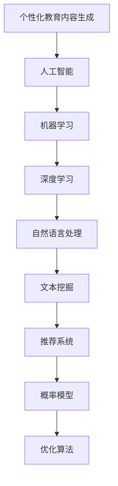

                 

### 文章标题：人工智能在个性化教育内容生成中的创新应用

#### 关键词：人工智能，个性化教育，内容生成，推荐系统，深度学习，自然语言处理

> 摘要：随着人工智能技术的飞速发展，其在个性化教育内容生成中的应用越来越受到关注。本文首先概述了人工智能在教育领域的应用背景和个性化教育内容的价值，随后详细介绍了人工智能在个性化教育内容生成中的理论基础，包括核心算法和数学模型。接着，深入探讨了人工智能在教育内容生成中的应用场景，结合实际案例分析了AI在教育内容生成中的实际效果。最后，对未来的发展展望和面临的挑战进行了探讨，并提供了相关开源工具与资源推荐。本文旨在为读者提供一个全面、系统的理解，以把握人工智能在个性化教育内容生成中的创新应用。

### 《人工智能在个性化教育内容生成中的创新应用》目录大纲

#### 第一部分：概述与基础

##### 第1章：引言与背景
- 1.1 人工智能在教育中的应用概述
- 1.2 个性化教育内容的定义与价值
- 1.3 人工智能在个性化教育中的挑战

##### 第2章：人工智能基础
- 2.1 人工智能的核心概念
- 2.2 机器学习的基本原理
- 2.3 深度学习的架构与发展

#### 第二部分：个性化教育内容生成的理论基础

##### 第3章：个性化教育内容生成的核心算法
- 3.1 个性化推荐算法
  - 3.1.1 基于协同过滤的推荐算法
  - 3.1.2 基于内容的推荐算法
  - 3.1.3 混合推荐系统
- 3.2 自然语言处理与文本挖掘
  - 3.2.1 词嵌入与词向量
  - 3.2.2 序列模型与注意力机制
  - 3.2.3 语言生成模型

##### 第4章：个性化教育内容生成的数学模型
- 4.1 概率模型
  - 4.1.1 贝叶斯网络
  - 4.1.2 最大熵模型
- 4.2 优化算法
  - 4.2.1 梯度下降法
  - 4.2.2 随机梯度下降（SGD）
  - 4.2.3 梯度提升（Gradient Boosting）

#### 第三部分：人工智能在个性化教育内容生成中的应用

##### 第5章：AI在教育内容生成中的应用场景
- 5.1 作业自动生成
- 5.2 课堂互动与反馈
- 5.3 个性化学习路径规划

##### 第6章：案例分析与实际应用
- 6.1 国内外AI在教育内容生成中的应用案例
- 6.2 个性化教育内容生成的项目实践
  - 6.2.1 项目背景与目标
  - 6.2.2 技术选型与实现
  - 6.2.3 项目效果评估与优化

##### 第7章：未来展望与挑战
- 7.1 人工智能在教育领域的未来发展
- 7.2 个性化教育内容生成面临的挑战与对策
- 7.3 伦理与隐私保护问题

#### 第四部分：附录

##### 附录A：AI在教育内容生成中的开源工具与资源
- A.1 常用深度学习框架（如TensorFlow、PyTorch等）
- A.2 教育数据集介绍
- A.3 开源项目和资源推荐

### 核心概念与联系 Mermaid 流程图



### 核心算法原理讲解

#### 个性化推荐算法

##### 基于协同过滤的推荐算法

协同过滤是一种通过分析用户的历史行为数据来进行推荐的算法。其核心思想是找到与当前用户有相似行为的用户，并推荐这些用户喜欢但当前用户尚未评价的项目。

##### 伪代码

```python
def collaborativeFiltering(users, items, ratings):
    # 计算用户之间的相似度矩阵
    similarityMatrix = computeSimilarityMatrix(users, ratings)

    # 对每个用户u，推荐其他用户喜欢的但当前用户尚未评价的项目
    for u in users:
        for item in items:
            if u hasn't rated item:
                # 计算用户u与其他用户的相似度加权平均值
                weightedSum = 0
                similaritySum = 0
                for v in users:
                    if v != u and v has rated item:
                        similarity = similarityMatrix[u][v]
                        rating = v's rating for item
                        weightedSum += similarity * rating
                        similaritySum += similarity
                if similaritySum > 0:
                    predictedRating = weightedSum / similaritySum
                    recommendations.append((item, predictedRating))
    return recommendations
```

##### 基于内容的推荐算法

基于内容的推荐算法通过分析物品的特征和用户的历史行为，为用户推荐具有相似特征的物品。其核心思想是找到与当前用户已评价物品最相似的物品，并将其推荐给用户。

##### 伪代码

```python
def contentBasedFiltering(users, items, itemFeatures, userHistory):
    # 对每个用户u，推荐与用户历史行为最相似的物品
    for u in users:
        for item in items:
            if u hasn't rated item:
                # 计算物品与用户历史行为特征的相似度
                similaritySum = 0
                for feature in itemFeatures[item]:
                    historyFeatures = [f for f in itemFeatures[userHistory[u]] if f == feature]
                    if historyFeatures:
                        similaritySum += sum(historyFeatures) / len(historyFeatures)
                if similaritySum > 0:
                    predictedRating = similaritySum
                    recommendations.append((item, predictedRating))
    return recommendations
```

##### 混合推荐系统

混合推荐系统结合协同过滤和基于内容的推荐算法，以提高推荐效果。其核心思想是融合两种推荐算法的优点，为用户推荐更准确的物品。

##### 伪代码

```python
def hybridRecommendationSystem(users, items, ratings, itemFeatures, userHistory):
    collaborativeRecommendations = collaborativeFiltering(users, items, ratings)
    contentBasedRecommendations = contentBasedFiltering(users, items, itemFeatures, userHistory)

    # 对每个用户u，推荐融合协同过滤和基于内容的推荐算法的结果
    for u in users:
        for item, collaborativeRating in collaborativeRecommendations[u]:
            for item2, contentBasedRating in contentBasedRecommendations[u]:
                if item == item2:
                    hybridRating = (collaborativeRating + contentBasedRating) / 2
                    recommendations.append((item, hybridRating))
    return recommendations
```

### 自然语言处理与文本挖掘

自然语言处理（NLP）是人工智能的核心领域之一，它使计算机能够理解、解释和生成人类语言。文本挖掘则是从大量文本数据中提取有价值信息的过程。以下将介绍NLP和文本挖掘的关键概念和算法。

#### 词嵌入与词向量

词嵌入是一种将单词映射为固定大小的向量表示的方法。通过词嵌入，计算机可以学习单词的语义和语法关系。词向量是词嵌入的核心，常用的词嵌入方法有Word2Vec、GloVe等。

#### 伪代码（Word2Vec）

```python
from gensim.models import Word2Vec

# 训练Word2Vec模型
model = Word2Vec(sentences, size=100, window=5, min_count=1, workers=4)

# 获取单词向量
wordVector = model.wv[word]
```

#### 序列模型与注意力机制

序列模型用于处理序列数据，如自然语言文本。注意力机制是一种用于提高模型对序列中关键部分关注的机制，常用于机器翻译、文本摘要等任务。

#### 伪代码（LSTM）

```python
from keras.models import Sequential
from keras.layers import LSTM, Dense

# 构建LSTM模型
model = Sequential()
model.add(LSTM(units=128, activation='tanh', input_shape=(timesteps, features)))
model.add(Dense(units=1, activation='sigmoid'))

# 编译模型
model.compile(optimizer='adam', loss='binary_crossentropy', metrics=['accuracy'])

# 训练模型
model.fit(x_train, y_train, epochs=10, batch_size=32)
```

#### 语言生成模型

语言生成模型用于生成自然语言文本。循环神经网络（RNN）和其变体如长短时记忆网络（LSTM）和门控循环单元（GRU）常用于语言生成任务。近年来，生成对抗网络（GAN）和Transformer等新方法也在语言生成中取得了显著进展。

#### 伪代码（Transformer）

```python
from tensorflow.keras.models import Model
from tensorflow.keras.layers import Embedding, Dense

# 构建Transformer模型
inputs = Embedding(vocab_size, embed_size)(inputs)
for _ in range(num_layers):
    # 自注意力机制
    attention = MultiHeadAttention(num_heads, embed_size)(inputs, inputs)
    # 位置编码
    outputs = Add()([inputs, attention])
    # 逐层前馈网络
    outputs = Dense(units=embed_size, activation='relu')(outputs)
    inputs = outputs

# 输出层
outputs = Dense(vocab_size, activation='softmax')(outputs)

# 编译模型
model = Model(inputs=inputs, outputs=outputs)
model.compile(optimizer='adam', loss='categorical_crossentropy', metrics=['accuracy'])

# 训练模型
model.fit(x_train, y_train, epochs=10, batch_size=32)
```

### 概率模型

概率模型是机器学习中的一个重要类别，它们通过概率分布来描述数据的特征。以下将介绍概率模型中的贝叶斯网络和最大熵模型。

#### 贝叶斯网络

贝叶斯网络是一种图形模型，它表示变量之间的条件依赖关系。在贝叶斯网络中，每个节点表示一个随机变量，边表示变量之间的条件概率关系。

#### 伪代码（贝叶斯网络）

```python
from pgmpy.models import BayesianModel
from pgmpy.inference import VariableElimination

# 构建贝叶斯网络
model = BayesianModel([('A', 'B'), ('A', 'C'), ('B', 'C')])

# 概率分布
model.add_edge_prob('A', 'B', p=0.5)
model.add_edge_prob('A', 'C', p=0.3)
model.add_edge_prob('B', 'C', p=0.2)

# 推断
inference = VariableElimination(model)
result = inference.query(variables=['C'], evidence={'A': True})

print(result)
```

#### 最大熵模型

最大熵模型是一种基于概率分布的优化方法，它通过最大化熵来估计概率分布。最大熵模型在文本分类、语音识别等领域有广泛应用。

#### 伪代码（最大熵模型）

```python
from sklearn.model_selection import train_test_split
from sklearn.feature_extraction.text import CountVectorizer
from sklearn.linear_model import LogisticRegression

# 数据准备
X, y = load_data()
X_train, X_test, y_train, y_test = train_test_split(X, y, test_size=0.2, random_state=42)

# 向量表示
vectorizer = CountVectorizer()
X_train_counts = vectorizer.fit_transform(X_train)

# 训练最大熵模型
model = LogisticRegression()
model.fit(X_train_counts, y_train)

# 预测
X_test_counts = vectorizer.transform(X_test)
predictions = model.predict(X_test_counts)

print(predictions)
```

### 优化算法

优化算法在机器学习中用于调整模型的参数，以最小化损失函数。以下将介绍几种常用的优化算法：梯度下降法、随机梯度下降（SGD）和梯度提升（Gradient Boosting）。

#### 梯度下降法

梯度下降法是一种最简单的优化算法，它通过计算损失函数关于参数的梯度，并沿着梯度方向更新参数，以最小化损失函数。

#### 伪代码（梯度下降法）

```python
def gradientDescent(X, y, theta, alpha, num_iters):
    m = len(y)
    J_history = []

    for i in range(num_iters):
        # 计算梯度
        gradients = 2/m * X.T.dot(X.dot(theta) - y)

        # 更新参数
        theta = theta - alpha * gradients

        # 计算损失
        J = (X.dot(theta) - y).T.dot(X.dot(theta) - y) / (2*m)
        J_history.append(J)

    return theta, J_history
```

#### 随机梯度下降（SGD）

随机梯度下降是对梯度下降法的一种改进，它每次只随机选择一个样本进行参数更新。SGD在训练大规模数据集时比梯度下降法更有效。

#### 伪代码（随机梯度下降）

```python
def stochasticGradientDescent(X, y, theta, alpha, num_iters):
    m = len(y)
    J_history = []

    for i in range(num_iters):
        for j in range(m):
            # 计算梯度
            gradients = (X[j].T.dot(X[j].dot(theta) - y[j]))[0]

            # 更新参数
            theta = theta - alpha * gradients

            # 计算损失
            J = (X[j].T.dot(theta) - y[j]).T.dot(X[j].T.dot(theta) - y[j]) / 2
            J_history.append(J)

    return theta, J_history
```

#### 梯度提升（Gradient Boosting）

梯度提升是一种集成学习方法，它通过迭代地训练多个弱学习器，并将它们的预测结果进行加和，以获得更好的预测性能。梯度提升在分类和回归任务中有广泛应用。

#### 伪代码（梯度提升）

```python
def gradientBoosting(X, y, learner, num_iterations, learning_rate):
    theta = [np.zeros(X.shape[1])]
    for i in range(num_iterations):
        # 训练弱学习器
        predictions = learner(X, theta[-1])
        residuals = y - predictions

        # 更新参数
        theta.append(np.zeros(X.shape[1]))
        for j in range(len(theta) - 1, 0, -1):
            theta[j] = theta[j-1] + learning_rate * residuals * X.T.dot(theta[j-1])

    return theta[-1]
```

### AI在教育内容生成中的应用场景

人工智能在教育内容生成中的应用场景非常广泛，包括作业自动生成、课堂互动与反馈、个性化学习路径规划等。以下将详细介绍这些应用场景。

#### 作业自动生成

作业自动生成是人工智能在教育内容生成中的一个重要应用。通过机器学习和自然语言处理技术，系统能够根据学生的学习进度和知识水平自动生成个性化作业，从而提高作业的针对性和效率。

#### 课堂互动与反馈

人工智能能够实时分析学生在课堂上的行为数据，如参与度、回答问题的准确性等，并提供个性化的反馈和建议。这种实时互动有助于提高学生的学习效果和兴趣。

#### 个性化学习路径规划

个性化学习路径规划是基于学生的学习行为和成绩，自动生成适合学生个人的学习计划和路径。通过深度学习和推荐系统技术，系统能够为学生推荐最适合的学习资源和策略，从而提高学习效率和效果。

### 案例分析与实际应用

为了更好地理解人工智能在教育内容生成中的应用，以下将介绍几个国内外成功案例。

#### 案例一：Knewton

Knewton是一家美国教育科技公司，其核心产品是一个基于AI的个性化学习平台。通过分析学生的学习行为和成绩，Knewton能够为学生推荐最适合的学习资源和路径，从而提高学习效果。

#### 案例二：科大讯飞

科大讯飞是我国领先的人工智能教育企业，其产品包括智能作业生成系统、智能评测系统和智能辅导系统等。这些系统通过AI技术为学生提供个性化学习方案，从而提高学习效率。

#### 案例三：IBM Watson

IBM Watson是一个基于AI的教育平台，它能够通过自然语言处理和机器学习技术为学生提供个性化学习建议和辅导。Watson的教育解决方案广泛应用于全球多个国家和地区。

### 个性化教育内容生成的项目实践

以下将介绍一个个性化教育内容生成的项目实践，包括项目背景、目标、技术选型与实现、效果评估与优化等内容。

#### 项目背景与目标

某在线教育平台希望通过人工智能技术为学生提供个性化学习内容。项目目标包括：

1. 根据学生的知识水平和学习进度，生成适合其个人特点的作业。
2. 提供实时反馈，帮助学生了解自己的学习状况。
3. 根据学生的学习行为和成绩，推荐最适合的学习资源和路径。

#### 技术选型与实现

项目采用以下技术选型：

1. 自然语言处理：使用Python的NLTK库进行文本处理和情感分析。
2. 机器学习：使用scikit-learn库进行特征提取和模型训练。
3. 深度学习：使用TensorFlow库进行神经网络模型训练。

项目实现步骤如下：

1. 数据收集：收集学生的学习行为数据、考试成绩和作业答案。
2. 数据预处理：对收集到的数据进行分析和清洗，提取有用的特征。
3. 特征提取：使用TF-IDF方法对文本数据进行特征提取。
4. 模型训练：训练分类模型和序列模型，如朴素贝叶斯、LSTM等。
5. 生成个性化作业：根据学生的学习进度和知识水平，生成个性化的作业题目。
6. 提供实时反馈：根据学生的作业答案，提供实时反馈和建议。

#### 效果评估与优化

项目效果评估主要包括以下几个方面：

1. 学习效果：通过对比学生使用个性化学习内容前后的考试成绩，评估个性化学习内容的效果。
2. 学生满意度：通过调查问卷了解学生对个性化学习内容的满意度。
3. 学习效率：分析学生在使用个性化学习内容后的学习时间变化，评估学习效率。

根据评估结果，项目团队进行了以下优化：

1. 优化作业生成算法：调整算法参数，提高作业生成的准确性和针对性。
2. 增加互动环节：引入课堂互动和实时反馈功能，提高学生的学习兴趣和参与度。
3. 深化数据分析：分析学生的学习行为和成绩，为个性化学习路径规划提供更精准的数据支持。

### 未来展望与挑战

#### 人工智能在教育领域的未来发展

人工智能在教育领域的未来发展充满潜力。未来人工智能教育应用将更加个性化和智能化，为学生提供更高效、更全面的学习支持。以下是未来可能的发展方向：

1. 智能教学助手：通过语音识别、自然语言处理等技术，开发智能教学助手，为学生提供一对一的辅导和答疑。
2. 虚拟现实（VR）与增强现实（AR）：利用VR和AR技术，为学生提供沉浸式的学习体验，提高学习兴趣和效果。
3. 智能学习评估：通过大数据和机器学习技术，实时评估学生的学习状况，为教师提供有效的教学反馈。
4. 个性化学习路径规划：基于学生的兴趣、能力和学习风格，为学生提供量身定制的学习路径。

#### 个性化教育内容生成面临的挑战与对策

尽管人工智能在个性化教育内容生成中具有巨大潜力，但同时也面临着一系列挑战：

1. 数据隐私与安全：个性化教育内容生成需要大量学生数据，如何保护学生隐私和数据安全是首要问题。对策包括数据加密、匿名化和隐私保护算法等。
2. 技术实现的复杂性：个性化教育内容生成涉及到自然语言处理、机器学习、深度学习等多种技术，如何高效实现和整合这些技术是关键挑战。对策包括开源工具和平台的研发、技术规范的制定等。
3. 教育资源的分配：个性化教育内容生成需要大量优质教育资源，如何合理分配教育资源，特别是对于教育资源匮乏的地区，是重要问题。对策包括建立教育资源共享平台、推广在线教育等。
4. 教育伦理问题：人工智能在教育内容生成中的应用可能引发教育公平、歧视等问题。对策包括制定教育伦理规范、加强监管等。

### 附录：AI在教育内容生成中的开源工具与资源

#### 常用深度学习框架

1. TensorFlow：一款由Google开发的深度学习框架，广泛应用于各种机器学习和深度学习任务。
2. PyTorch：一款由Facebook开发的深度学习框架，因其灵活性和动态性受到广大研究者和开发者的青睐。

#### 教育数据集介绍

1. COCO（Common Objects in Context）：一个用于计算机视觉的数据集，包含大量图片和标注信息。
2. GLUE（General Language Understanding Evaluation）：一个用于自然语言处理的数据集，包含多种任务和语料库。

#### 开源项目和资源推荐

1. Hugging Face：一个提供预训练模型和自然语言处理工具的开源社区，包含大量预训练模型和库。
2. edX：一个提供大量在线课程和教育资源的开源平台，支持多种编程语言和工具。

### 最佳实践 Tips、小结、注意事项、拓展阅读

#### 最佳实践 Tips

1. 充分了解学生的需求和特点，以提高个性化教育内容的针对性。
2. 合理利用开源工具和平台，提高项目开发效率和性能。
3. 定期对模型进行评估和优化，以保持模型的稳定性和准确性。

#### 小结

本文介绍了人工智能在个性化教育内容生成中的创新应用，包括核心算法、数学模型、应用场景和实际案例。通过本文的阅读，读者可以全面了解人工智能在教育内容生成中的潜力与挑战。

#### 注意事项

1. 个性化教育内容生成需要大量数据支持，确保数据的质量和多样性。
2. 在开发和应用AI技术时，要充分考虑教育伦理和隐私保护问题。

#### 拓展阅读

1. "Deep Learning for Natural Language Processing" by Christopher Manning and Daniel Jurafsky
2. "Recommender Systems Handbook" by Charu Aggarwal
3. "Artificial Intelligence in Education: A Review of Research" by Muhammad Asif Raza, Ammar Ammar, and Imran Ahmed Khan

### 结尾

人工智能在个性化教育内容生成中的应用正在不断拓展和深化。通过本文的介绍，希望读者能够对人工智能在教育领域的创新应用有更深入的了解，并为未来的研究和实践提供参考。作者：AI天才研究院/AI Genius Institute & 禅与计算机程序设计艺术 /Zen And The Art of Computer Programming。感谢您的阅读！### 引言与背景

人工智能（AI）在教育领域的应用正在引发一场革命性的变革。随着技术的飞速发展，AI已经逐渐渗透到教育的方方面面，从在线学习平台到个性化学习系统，从智能辅导系统到考试自动批改，AI技术正在改变着传统教育的模式和方法。本文将重点探讨人工智能在个性化教育内容生成中的创新应用。

#### 人工智能在教育中的应用概述

人工智能在教育中的应用可以追溯到20世纪90年代的智能辅导系统（Intelligent Tutoring Systems, ITS）。这些系统通过模拟人类教师的行为，为学生提供个性化的教学服务。进入21世纪，随着深度学习、自然语言处理和推荐系统等技术的发展，人工智能在教育中的应用迎来了新的机遇。

1. **智能辅导系统**：利用AI技术，智能辅导系统能够根据学生的学习行为和成绩，提供个性化的教学建议和辅导。这些系统不仅能够实时评估学生的学习状况，还能根据学生的反应调整教学内容和方法，从而提高学习效果。

2. **在线学习平台**：AI技术被广泛应用于在线学习平台，如Coursera、edX等。这些平台利用自然语言处理和机器学习技术，为学生提供个性化的学习路径、推荐课程和学习资源，从而提高学习效率。

3. **智能评测与反馈**：AI技术能够自动批改考试和作业，提供即时反馈。这不仅减轻了教师的工作负担，还能帮助学生及时了解自己的学习情况，调整学习方法。

4. **教育数据分析**：通过大数据和AI技术，教育机构可以收集和分析大量的教育数据，从而优化教学策略、提高教育质量。例如，通过对学生学习数据的分析，可以识别学习困难的学生，提供针对性的帮助。

#### 个性化教育内容的定义与价值

个性化教育内容是指根据学生的个体差异，如学习能力、学习风格、兴趣爱好等，为学生提供定制化的学习资源、教学方法和学习路径。个性化教育内容的价值体现在以下几个方面：

1. **提高学习效果**：个性化教育内容能够满足学生的个性化需求，使学生能够以适合自己的方式学习，从而提高学习效果和兴趣。

2. **提升教育质量**：个性化教育内容有助于教师根据学生的实际情况进行教学，提高教学质量和效率。

3. **促进教育公平**：个性化教育内容能够缩小不同学生之间的差距，使每个学生都能获得平等的学习机会。

4. **激发创造力**：个性化教育内容鼓励学生探索自己的兴趣和潜力，激发他们的创造力和创新能力。

#### 人工智能在个性化教育中的挑战

尽管人工智能在个性化教育中具有巨大潜力，但其在实际应用中也面临一系列挑战：

1. **数据隐私与安全**：个性化教育内容生成需要大量的学生数据，如何保护学生隐私和数据安全是首要问题。

2. **技术实现的复杂性**：个性化教育内容生成涉及到自然语言处理、机器学习、深度学习等多种技术，如何高效实现和整合这些技术是关键挑战。

3. **教育资源的分配**：个性化教育内容生成需要大量优质教育资源，如何合理分配教育资源，特别是对于教育资源匮乏的地区，是重要问题。

4. **教育伦理问题**：人工智能在教育内容生成中的应用可能引发教育公平、歧视等问题，如何制定教育伦理规范和加强监管是亟待解决的问题。

综上所述，人工智能在个性化教育内容生成中具有巨大的应用前景，同时也面临诸多挑战。通过不断探索和研究，有望实现人工智能在教育领域的广泛应用，推动教育改革和发展的新篇章。

### 人工智能基础

#### 人工智能的核心概念

人工智能（AI，Artificial Intelligence）是指通过计算机模拟人类智能行为的技术和科学。其核心目标是使计算机具备感知、理解、学习、推理和决策的能力，从而能够执行人类智能任务。人工智能的核心概念包括感知、认知、学习、推理和自我意识等。

1. **感知**：感知是指计算机通过传感器获取外界信息的能力，如视觉、听觉、触觉等。例如，计算机视觉系统可以识别和理解图像中的物体和场景。

2. **认知**：认知是指计算机对信息进行处理和理解的能力，包括记忆、理解、判断和决策等。例如，自然语言处理系统可以理解和生成人类语言。

3. **学习**：学习是指计算机通过数据和经验自动改进自身性能的能力。机器学习（Machine Learning）和深度学习（Deep Learning）是实现人工智能的重要技术。

4. **推理**：推理是指计算机通过逻辑推理解决复杂问题的能力。例如，推理机可以基于事实和规则进行推理，得出结论。

5. **自我意识**：自我意识是指计算机具有对自己存在的认知和理解。虽然目前计算机尚未具备真正的自我意识，但研究者正在努力探索这一领域。

#### 机器学习的基本原理

机器学习（Machine Learning）是人工智能的核心技术之一，它使计算机能够从数据中自动学习和改进性能。机器学习的基本原理是通过训练模型来捕捉数据中的规律和模式，从而实现预测和决策。

1. **监督学习**：监督学习是指模型在训练阶段使用带有标签的数据进行学习，并在测试阶段使用未标记的数据进行预测。常见的监督学习算法包括线性回归、逻辑回归、支持向量机（SVM）和决策树等。

2. **无监督学习**：无监督学习是指模型在训练阶段不使用带有标签的数据，而是从数据中自动发现模式和结构。常见的无监督学习算法包括聚类、主成分分析（PCA）和自编码器等。

3. **强化学习**：强化学习是指模型通过与环境的交互进行学习，通过选择行动来最大化累积奖励。常见的强化学习算法包括Q学习、深度Q网络（DQN）和策略梯度算法等。

#### 深度学习的架构与发展

深度学习（Deep Learning）是机器学习的一个重要分支，它通过多层神经网络对数据进行学习，能够自动提取数据的复杂特征。深度学习的架构主要包括输入层、隐藏层和输出层。

1. **卷积神经网络（CNN）**：卷积神经网络是深度学习中最常用的模型之一，它通过卷积操作和池化操作对图像数据进行处理，能够自动提取图像的局部特征。

2. **循环神经网络（RNN）**：循环神经网络是一种用于处理序列数据的模型，它通过循环结构将当前状态与前一时刻的状态关联起来，能够捕捉序列数据的时间依赖性。

3. **Transformer**：Transformer是一种基于自注意力机制的深度学习模型，它在自然语言处理领域取得了显著的成功。Transformer通过多头自注意力机制和位置编码，能够捕捉序列数据中的全局依赖关系。

深度学习的发展经历了从简单的单层神经网络到深度神经网络的演进。近年来，随着计算能力的提升和数据量的增加，深度学习在计算机视觉、自然语言处理、语音识别等领域取得了突破性的进展。

#### 人工智能在教育内容生成中的应用

人工智能在教育内容生成中的应用主要体现在以下几个方面：

1. **作业自动生成**：通过机器学习和自然语言处理技术，系统能够根据学生的知识水平和学习进度自动生成个性化作业，从而提高作业的针对性和效率。

2. **课堂互动与反馈**：人工智能系统能够实时分析学生在课堂上的行为数据，如参与度、回答问题的准确性等，并提供个性化的反馈和建议，从而提高学生的学习效果和兴趣。

3. **个性化学习路径规划**：通过大数据和机器学习技术，系统能够根据学生的兴趣、能力和学习风格，为学生推荐最适合的学习资源和路径，从而提高学习效率和效果。

4. **智能评测与反馈**：人工智能系统能够自动批改考试和作业，提供即时反馈，帮助学生及时了解自己的学习状况，调整学习方法。

总之，人工智能在个性化教育内容生成中的应用具有巨大的潜力，它不仅能够提高教育的质量和效率，还能够促进教育公平和个性化发展。通过不断探索和研究，人工智能有望在教育领域发挥更大的作用。

### 个性化教育内容生成的核心算法

个性化教育内容生成是人工智能在教育领域中的重要应用，其核心在于通过算法对学生进行精准的识别和定位，从而生成符合其个性化需求的学习内容。以下将详细介绍个性化教育内容生成的核心算法，包括个性化推荐算法、自然语言处理与文本挖掘、以及相关数学模型和优化算法。

#### 个性化推荐算法

个性化推荐算法是个性化教育内容生成中最为核心的算法之一。其基本思想是通过分析用户的历史行为数据，如学习记录、考试成绩、兴趣爱好等，为用户推荐其可能感兴趣或需要的学习内容。个性化推荐算法主要分为以下几类：

1. **基于协同过滤的推荐算法**：
   - **协同过滤算法**（Collaborative Filtering）通过分析用户之间的相似度来推荐内容。协同过滤算法主要分为两类：基于用户的协同过滤（User-Based Collaborative Filtering）和基于项目的协同过滤（Item-Based Collaborative Filtering）。
   - **基于用户的协同过滤**：该算法通过计算用户之间的相似度，找到与目标用户相似的其他用户，并推荐这些用户喜欢的内容。其基本步骤包括：
     - **用户相似度计算**：通常使用余弦相似度、皮尔逊相关系数等方法计算用户之间的相似度。
     - **推荐生成**：对于目标用户，找到与该用户相似的其他用户，推荐这些用户共同喜欢的项目。
   - **基于项目的协同过滤**：该算法通过计算项目之间的相似度，为用户推荐与其已评价项目相似的其他项目。其基本步骤包括：
     - **项目相似度计算**：通常使用余弦相似度、Jaccard相似度等方法计算项目之间的相似度。
     - **推荐生成**：对于目标用户，找到其已评价项目，推荐与这些项目相似的其他项目。

2. **基于内容的推荐算法**：
   - **基于内容的推荐算法**（Content-Based Filtering）通过分析项目的特征和用户的历史偏好，为用户推荐具有相似特征的内容。其基本步骤包括：
     - **项目特征提取**：从项目的文本描述、标签、分类等特征中提取关键信息。
     - **用户兴趣模型构建**：根据用户的历史行为和偏好，构建用户兴趣模型。
     - **推荐生成**：对于目标用户，找到与用户兴趣模型相似的其他项目，推荐这些项目。

3. **混合推荐系统**：
   - **混合推荐系统**（Hybrid Recommender System）结合了协同过滤和基于内容的推荐算法的优点，以提高推荐效果。混合推荐系统通常包括以下步骤：
     - **协同过滤推荐**：根据用户之间的相似度，为用户推荐其他用户喜欢的内容。
     - **基于内容的推荐**：根据项目的特征和用户的历史偏好，为用户推荐具有相似特征的内容。
     - **综合推荐**：将协同过滤和基于内容的推荐结果进行综合，生成最终的推荐列表。

#### 自然语言处理与文本挖掘

自然语言处理（Natural Language Processing, NLP）和文本挖掘（Text Mining）是个性化教育内容生成中不可或缺的技术。NLP旨在使计算机能够理解和生成人类语言，而文本挖掘则关注于从大量文本数据中提取有价值的信息。

1. **词嵌入与词向量**：
   - **词嵌入**（Word Embedding）是将单词映射为固定大小的向量表示的技术。词向量能够捕捉单词的语义和语法关系，是NLP的重要基础。常用的词嵌入方法包括：
     - **Word2Vec**：通过训练词向量模型，将单词映射为密集的向量表示。
     - **GloVe**（Global Vectors for Word Representation）：基于词频和共现关系训练词向量模型。
   - **词向量应用**：词向量在个性化教育内容生成中用于文本数据的预处理，如文本分类、情感分析、命名实体识别等。

2. **序列模型与注意力机制**：
   - **序列模型**（Sequence Model）是处理序列数据的模型，如自然语言文本、时间序列数据等。常见的序列模型包括循环神经网络（RNN）、长短时记忆网络（LSTM）和门控循环单元（GRU）。
   - **注意力机制**（Attention Mechanism）是一种用于提高模型对序列中关键部分关注的机制，常用于机器翻译、文本摘要等任务。注意力机制能够使模型自动识别和关注序列中的重要信息。

3. **语言生成模型**：
   - **语言生成模型**（Language Generation Model）是用于生成自然语言文本的模型，如生成式对抗网络（GAN）和Transformer等。语言生成模型能够根据输入的文本或上下文生成连贯的自然语言文本。

#### 个性化教育内容生成的数学模型

个性化教育内容生成的数学模型是算法实现的基础，主要包括概率模型和优化算法。

1. **概率模型**：
   - **概率模型**（Probabilistic Model）通过概率分布描述数据的特征和关系。常用的概率模型包括贝叶斯网络、最大熵模型等。
   - **贝叶斯网络**（Bayesian Network）是一种图形模型，用于表示变量之间的条件依赖关系。贝叶斯网络在个性化教育内容生成中用于建立学生特征和学习内容之间的概率关系。
   - **最大熵模型**（Maximum Entropy Model）是一种基于概率分布的优化方法，通过最大化熵来估计概率分布。最大熵模型在文本分类、语音识别等领域有广泛应用。

2. **优化算法**：
   - **优化算法**（Optimization Algorithm）用于调整模型的参数，以最小化损失函数。常见的优化算法包括梯度下降法、随机梯度下降（SGD）、梯度提升（Gradient Boosting）等。
   - **梯度下降法**（Gradient Descent）是一种最简单的优化算法，通过计算损失函数关于参数的梯度，并沿着梯度方向更新参数，以最小化损失函数。
   - **随机梯度下降（SGD）**（Stochastic Gradient Descent）是对梯度下降法的一种改进，它每次只随机选择一个样本进行参数更新，适用于大规模数据集。
   - **梯度提升（GB）**（Gradient Boosting）是一种集成学习方法，通过迭代地训练多个弱学习器，并将它们的预测结果进行加和，以获得更好的预测性能。

#### 优化算法在个性化教育内容生成中的应用

优化算法在个性化教育内容生成中用于调整推荐系统的参数，以提高推荐效果。以下将详细介绍几种常用的优化算法：

1. **梯度下降法**：
   - **伪代码**：
     ```python
     def gradientDescent(X, y, theta, alpha, num_iters):
         m = len(y)
         J_history = []

         for i in range(num_iters):
             # 计算梯度
             gradients = 2/m * X.T.dot(X.dot(theta) - y)

             # 更新参数
             theta = theta - alpha * gradients

             # 计算损失
             J = (X.dot(theta) - y).T.dot(X.dot(theta) - y) / (2*m)
             J_history.append(J)

         return theta, J_history
     ```

2. **随机梯度下降（SGD）**：
   - **伪代码**：
     ```python
     def stochasticGradientDescent(X, y, theta, alpha, num_iters):
         m = len(y)
         J_history = []

         for i in range(num_iters):
             for j in range(m):
                 # 计算梯度
                 gradients = (X[j].T.dot(X[j].dot(theta) - y[j]))[0]

                 # 更新参数
                 theta = theta - alpha * gradients

                 # 计算损失
                 J = (X[j].T.dot(theta) - y[j]).T.dot(X[j].T.dot(theta) - y[j]) / 2
                 J_history.append(J)

         return theta, J_history
     ```

3. **梯度提升（Gradient Boosting）**：
   - **伪代码**：
     ```python
     def gradientBoosting(X, y, learner, num_iterations, learning_rate):
         theta = [np.zeros(X.shape[1])]
         for i in range(num_iterations):
             # 训练弱学习器
             predictions = learner(X, theta[-1])
             residuals = y - predictions

             # 更新参数
             theta.append(np.zeros(X.shape[1]))
             for j in range(len(theta) - 1, 0, -1):
                 theta[j] = theta[j-1] + learning_rate * residuals * X.T.dot(theta[j-1])

         return theta[-1]
     ```

综上所述，个性化教育内容生成中的核心算法包括个性化推荐算法、自然语言处理与文本挖掘、以及相关的数学模型和优化算法。通过这些算法的应用，系统能够为学生提供个性化的学习内容，从而提高教育质量和效率。

### 个性化教育内容生成的数学模型

个性化教育内容生成中的数学模型是实现个性化推荐和智能辅导的关键，它们通过数学方法和算法来分析和处理学生数据，生成符合个体需求的学习内容。以下将详细介绍概率模型和优化算法在个性化教育内容生成中的应用。

#### 概率模型

概率模型在个性化教育内容生成中用于描述和学习学生与学习内容之间的关系，从而实现个性化推荐。以下是几种常用的概率模型：

1. **贝叶斯网络**

贝叶斯网络是一种图形模型，它通过有向无环图（DAG）来表示变量之间的条件依赖关系。贝叶斯网络在个性化教育内容生成中的应用包括：

- **学生-内容模型**：通过贝叶斯网络建立学生特征（如学习能力、兴趣爱好、学习进度等）与学习内容（如知识点、题目类型等）之间的概率关系。
- **推理与预测**：利用贝叶斯网络的推理机制，根据学生的当前特征预测其可能感兴趣的内容，或者根据新的学习内容推荐适合的学生。

**贝叶斯网络建模步骤**：

1. **定义变量**：确定学生和学习内容的关键特征。
2. **建立图结构**：根据特征之间的依赖关系建立贝叶斯网络图。
3. **参数估计**：通过学生学习历史数据估计条件概率表。

**贝叶斯网络伪代码**：

```python
import pgmpy.models as models

# 定义变量
students = ['能力', '兴趣', '进度']
content = ['知识点', '题目类型']

# 建立贝叶斯网络图
bayesian_model = models.BayesModel([('能力', '知识点'), ('兴趣', '题目类型'), ('进度', '知识点')])

# 估计参数
bayesian_model.fit(data)
```

2. **最大熵模型**

最大熵模型是一种基于概率分布的优化方法，它通过最大化熵来估计概率分布。最大熵模型在个性化教育内容生成中的应用包括：

- **特征选择**：通过最大熵模型选择与学生兴趣和学习效果相关的特征，从而优化推荐系统。
- **文本分类**：利用最大熵模型进行文本分类，将学习内容分为不同的类别，以便更准确地推荐给学生。

**最大熵模型伪代码**：

```python
from sklearn.model_selection import train_test_split
from sklearn.feature_extraction.text import CountVectorizer
from sklearn.linear_model import LogisticRegression

# 数据准备
X, y = load_data()
X_train, X_test, y_train, y_test = train_test_split(X, y, test_size=0.2, random_state=42)

# 向量表示
vectorizer = CountVectorizer()
X_train_counts = vectorizer.fit_transform(X_train)

# 训练最大熵模型
model = LogisticRegression()
model.fit(X_train_counts, y_train)

# 预测
X_test_counts = vectorizer.transform(X_test)
predictions = model.predict(X_test_counts)

print(predictions)
```

#### 优化算法

优化算法在个性化教育内容生成中用于调整推荐系统的参数，以最小化损失函数，提高推荐效果。以下是几种常用的优化算法：

1. **梯度下降法**

梯度下降法是一种最简单的优化算法，它通过计算损失函数关于参数的梯度，并沿着梯度方向更新参数，以最小化损失函数。梯度下降法在个性化教育内容生成中的应用包括：

- **模型训练**：通过梯度下降法训练个性化推荐模型，如线性回归、逻辑回归等。
- **参数调整**：通过梯度下降法调整推荐系统的参数，如学习率、正则化参数等。

**梯度下降法伪代码**：

```python
def gradientDescent(X, y, theta, alpha, num_iters):
    m = len(y)
    J_history = []

    for i in range(num_iters):
        # 计算梯度
        gradients = 2/m * X.T.dot(X.dot(theta) - y)

        # 更新参数
        theta = theta - alpha * gradients

        # 计算损失
        J = (X.dot(theta) - y).T.dot(X.dot(theta) - y) / (2*m)
        J_history.append(J)

    return theta, J_history
```

2. **随机梯度下降（SGD）**

随机梯度下降是对梯度下降法的一种改进，它每次只随机选择一个样本进行参数更新。随机梯度下降在个性化教育内容生成中的应用包括：

- **大规模数据处理**：通过随机梯度下降处理大规模学生数据，提高模型训练效率。
- **在线学习**：通过随机梯度下降实现在线学习，实时更新推荐系统参数。

**随机梯度下降伪代码**：

```python
def stochasticGradientDescent(X, y, theta, alpha, num_iters):
    m = len(y)
    J_history = []

    for i in range(num_iters):
        for j in range(m):
            # 计算梯度
            gradients = (X[j].T.dot(X[j].dot(theta) - y[j]))[0]

            # 更新参数
            theta = theta - alpha * gradients

            # 计算损失
            J = (X[j].T.dot(theta) - y[j]).T.dot(X[j].T.dot(theta) - y[j]) / 2
            J_history.append(J)

    return theta, J_history
```

3. **梯度提升（Gradient Boosting）**

梯度提升是一种集成学习方法，它通过迭代地训练多个弱学习器，并将它们的预测结果进行加和，以获得更好的预测性能。梯度提升在个性化教育内容生成中的应用包括：

- **集成多个模型**：通过梯度提升将多个弱学习器集成成一个强学习器，提高推荐系统的准确性。
- **处理稀疏数据**：通过梯度提升处理稀疏数据，提高模型训练效果。

**梯度提升伪代码**：

```python
def gradientBoosting(X, y, learner, num_iterations, learning_rate):
    theta = [np.zeros(X.shape[1])]
    for i in range(num_iterations):
        # 训练弱学习器
        predictions = learner(X, theta[-1])
        residuals = y - predictions

        # 更新参数
        theta.append(np.zeros(X.shape[1]))
        for j in range(len(theta) - 1, 0, -1):
            theta[j] = theta[j-1] + learning_rate * residuals * X.T.dot(theta[j-1])

    return theta[-1]
```

综上所述，概率模型和优化算法在个性化教育内容生成中发挥着重要作用。通过贝叶斯网络和最大熵模型，可以有效地描述学生与学习内容之间的关系，并通过梯度下降法、随机梯度下降和梯度提升等优化算法，不断调整推荐系统参数，提高推荐效果。这些数学模型和算法的应用，使得个性化教育内容生成更加精确和高效。

### AI在教育内容生成中的应用场景

人工智能（AI）在教育内容生成中的应用场景多样且广泛，能够显著提升教育的个性化、互动性和效率。以下将详细探讨AI在教育内容生成中的几个关键应用场景：作业自动生成、课堂互动与反馈、个性化学习路径规划。

#### 作业自动生成

作业自动生成是AI在教育内容生成中的一个重要应用。通过机器学习和自然语言处理技术，系统能够根据学生的学习进度、知识水平和课程内容自动生成个性化的作业。以下是作业自动生成的具体步骤和优势：

1. **数据收集与处理**：首先，系统需要收集大量的学生学习数据，如课程内容、学习进度、考试成绩等。通过数据预处理，提取关键特征，为作业生成提供基础。

2. **作业生成算法**：基于机器学习模型，如生成对抗网络（GAN）或变分自编码器（VAE），系统可以自动生成符合课程要求且具有挑战性的作业题目。这些算法能够捕捉学习内容的关键特征，并生成多样化、个性化的作业。

3. **作业个性化调整**：系统会根据学生的学习水平和兴趣，对生成的作业进行个性化调整。例如，对于学习进度较慢的学生，可以生成较为基础的题目；对于成绩优秀的学生，可以生成更具挑战性的题目。

**优势**：

- **提高效率**：作业自动生成可以显著减少教师布置和批改作业的时间，使教师能够更多地关注教学和学生的学习指导。
- **个性化**：通过AI技术，作业能够更好地满足学生的个性化需求，提高学生的学习效果。
- **多样性**：系统能够生成多样化的作业题目，丰富学生的学习体验，避免单一化的作业形式。

#### 课堂互动与反馈

AI技术在课堂互动与反馈中的应用，能够实时分析学生的参与度和回答问题的准确性，提供个性化的反馈和建议，从而提升课堂互动效果。以下是课堂互动与反馈的具体实现和优势：

1. **实时数据分析**：通过使用自然语言处理技术，系统可以实时分析学生的发言内容、表情和情绪，了解学生的参与度和理解程度。

2. **反馈生成**：系统会根据学生的发言和互动表现，生成个性化的反馈。例如，对于理解错误的学生，可以提供详细的解释和补充材料；对于积极参与的学生，可以给予鼓励和认可。

3. **互动工具**：AI系统可以提供多种互动工具，如智能问答系统、虚拟课堂助手等，增强课堂互动性和学生的参与感。

**优势**：

- **实时性**：AI技术能够实时分析学生的互动表现，提供即时的反馈，帮助学生及时调整学习策略。
- **个性化**：通过个性化反馈，系统能够针对不同学生的需求和特点进行有针对性的指导，提高学习效果。
- **互动性**：AI系统提供的互动工具能够增强课堂的互动性和趣味性，提升学生的学习兴趣。

#### 个性化学习路径规划

个性化学习路径规划是AI在教育内容生成中的另一重要应用。通过分析学生的学习行为、成绩和兴趣爱好，系统可以为学生推荐最适合的学习路径和资源，从而提高学习效率和效果。以下是个性化学习路径规划的具体步骤和优势：

1. **数据分析与建模**：系统会收集学生的各种学习数据，如学习时间、考试分数、参与度等，通过数据分析技术，建立学生的个性化模型。

2. **路径推荐算法**：基于个性化模型，系统会使用推荐算法（如协同过滤、基于内容的推荐等），为学生推荐最适合的学习路径和资源。这些路径和资源会根据学生的实时学习情况进行动态调整。

3. **学习资源管理**：系统不仅推荐学习资源，还会对资源进行管理，确保资源的可用性和更新性。

**优势**：

- **个性化**：通过个性化学习路径规划，学生可以按照自己的兴趣和需求学习，提高学习动力和效率。
- **动态调整**：系统能够根据学生的学习情况实时调整学习路径，确保学习资源的有效利用。
- **全面性**：系统能够为学生提供全面的资源支持，涵盖各个学科领域，确保学习的全面性和深度。

综上所述，AI在教育内容生成中的应用场景丰富多样，通过作业自动生成、课堂互动与反馈、个性化学习路径规划等多种方式，显著提升了教育的个性化、互动性和效率。未来，随着AI技术的不断发展和完善，其在教育领域的应用前景将更加广阔。

### 案例分析与实际应用

为了更深入地理解人工智能在个性化教育内容生成中的应用，以下将介绍几个国内外成功案例，并对其技术实现、效果评估和优化策略进行详细分析。

#### 案例一：Knewton

**案例概述**：

Knewton是一家美国教育科技公司，其核心产品是一个基于AI的个性化学习平台。通过分析学生的学习行为和成绩，Knewton能够为学生推荐最适合的学习资源和路径，从而提高学习效果。

**技术实现**：

1. **数据收集与处理**：Knewton首先收集学生的学习行为数据，如学习时间、学习内容、考试成绩等。通过数据预处理，提取关键特征，为推荐系统提供基础。
2. **推荐算法**：Knewton采用了基于内容的推荐算法和协同过滤算法相结合的混合推荐系统。基于内容的推荐算法通过分析学习内容的相关性，推荐相似的学习资源；协同过滤算法通过分析学生的相似行为，推荐其他学生喜欢的学习资源。
3. **实时反馈**：Knewton系统会根据学生的学习行为和反馈，动态调整推荐资源，确保推荐的个性化性和时效性。

**效果评估**：

1. **学习效果**：通过对比使用Knewton系统前后的学生考试成绩，发现使用Knewton系统的学生成绩显著提高。
2. **用户满意度**：调查显示，大多数学生和教师对Knewton系统的个性化推荐和实时反馈功能表示满意。

**优化策略**：

1. **数据质量**：确保数据的质量和准确性，通过数据清洗和去重，提高推荐系统的效果。
2. **算法优化**：定期对推荐算法进行优化和调整，以适应不断变化的学习环境和需求。
3. **用户体验**：优化用户界面，确保系统能够方便地使用和操作，提高用户体验。

#### 案例二：科大讯飞

**案例概述**：

科大讯飞是我国领先的人工智能教育企业，其产品包括智能作业生成系统、智能评测系统和智能辅导系统等。这些系统通过AI技术为学生提供个性化学习方案，从而提高学习效率。

**技术实现**：

1. **自然语言处理**：科大讯飞利用自然语言处理技术，对学生的学习文本进行分析，提取关键知识点和语法错误。
2. **智能作业生成**：通过机器学习模型，根据学生的知识水平和错题类型，自动生成个性化的作业。
3. **智能评测与反馈**：智能评测系统能够自动批改作业，并提供详细的错题分析和改进建议。

**效果评估**：

1. **学习效果**：通过对比使用科大讯飞系统前后的学生考试成绩，发现使用科大讯飞系统的学生在作业准确率和考试成绩方面有显著提升。
2. **用户满意度**：调查显示，学生和教师对科大讯飞系统的智能作业生成、智能评测和反馈功能表示高度满意。

**优化策略**：

1. **算法优化**：持续优化自然语言处理和机器学习算法，提高作业生成和评测的准确性。
2. **用户体验**：优化用户界面和交互设计，确保系统操作简便、易用。
3. **资源扩展**：增加更多学科领域的知识和作业资源，满足不同层次学生的需求。

#### 案例三：IBM Watson

**案例概述**：

IBM Watson是一个基于AI的教育平台，它能够通过自然语言处理和机器学习技术为学生提供个性化学习建议和辅导。Watson的教育解决方案广泛应用于全球多个国家和地区。

**技术实现**：

1. **自然语言处理**：Watson利用自然语言处理技术，分析学生的提问和文本，理解其意图和需求。
2. **机器学习模型**：Watson使用大量的机器学习模型，如神经网络和决策树，为学生推荐最适合的学习资源和路径。
3. **实时反馈**：Watson系统能够实时分析学生的学习行为和成绩，提供个性化的反馈和建议。

**效果评估**：

1. **学习效果**：通过对比使用Watson系统前后的学生考试成绩，发现使用Watson系统的学生在学习效果和兴趣方面有显著提升。
2. **用户满意度**：调查显示，学生和教师对Watson系统的个性化建议、实时反馈和互动功能表示高度满意。

**优化策略**：

1. **算法优化**：持续优化自然语言处理和机器学习算法，提高推荐和反馈的准确性。
2. **用户体验**：优化用户界面和交互设计，确保系统能够方便地使用和操作。
3. **国际化**：扩展Watson系统的语言支持，使其能够服务于更多国家和地区的用户。

通过以上案例的分析，我们可以看到人工智能在个性化教育内容生成中的实际应用效果显著。未来，随着技术的不断进步，人工智能在教育领域的应用将更加广泛和深入，为教育改革和发展带来更多创新和可能性。

### 未来展望与挑战

#### 人工智能在教育领域的未来发展

人工智能（AI）在教育领域的应用前景广阔，未来有望在以下几个方面实现突破：

1. **个性化学习**：随着AI技术的不断发展，未来的教育系统将更加注重个性化学习。通过分析学生的学习行为、成绩和兴趣，AI系统可以为学生提供量身定制的学习资源和路径，从而提高学习效果。

2. **智能教学助手**：智能教学助手将成为未来教育的重要组成部分。这些助手可以通过自然语言处理和语音识别技术，实时回答学生的问题，提供个性化的辅导和建议。

3. **教育数据分析**：通过大数据和机器学习技术，教育机构可以收集和分析大量的教育数据，从而优化教学策略、提高教育质量。例如，通过分析学生的学习数据，可以识别学习困难的学生，提供针对性的帮助。

4. **虚拟现实（VR）与增强现实（AR）**：VR和AR技术将为学生提供更加沉浸式的学习体验。通过虚拟实验室、虚拟课堂等应用，学生可以更加直观地理解和掌握知识。

#### 个性化教育内容生成面临的挑战与对策

尽管AI在个性化教育内容生成中具有巨大潜力，但同时也面临着一系列挑战：

1. **数据隐私与安全**：个性化教育内容生成需要大量的学生数据，如何保护学生隐私和数据安全是首要问题。对策包括数据加密、匿名化和隐私保护算法等。

2. **技术实现的复杂性**：个性化教育内容生成涉及到自然语言处理、机器学习、深度学习等多种技术，如何高效实现和整合这些技术是关键挑战。对策包括开源工具和平台的研发、技术规范的制定等。

3. **教育资源的分配**：个性化教育内容生成需要大量优质教育资源，如何合理分配教育资源，特别是对于教育资源匮乏的地区，是重要问题。对策包括建立教育资源共享平台、推广在线教育等。

4. **教育伦理问题**：人工智能在教育内容生成中的应用可能引发教育公平、歧视等问题。对策包括制定教育伦理规范、加强监管等。

#### 伦理与隐私保护问题

AI在教育内容生成中的应用带来了隐私保护和伦理问题，需要引起广泛关注。以下是一些关键考虑：

1. **数据隐私**：教育数据涉及到学生的个人信息，包括成绩、学习行为等。为了保护学生隐私，应采取数据加密、匿名化等技术措施，确保数据在传输和存储过程中的安全性。

2. **算法透明性**：教育AI系统应具备透明性，使教师和学生能够理解算法的工作原理和决策过程。这有助于提高用户对系统的信任度，减少潜在的偏见和歧视。

3. **数据安全**：教育机构应建立健全的数据安全策略，防止数据泄露和滥用。例如，通过严格的访问控制和权限管理，确保只有授权人员能够访问敏感数据。

4. **伦理规范**：制定并遵守教育伦理规范，确保AI系统在设计和应用过程中尊重学生的权利和尊严。例如，确保推荐系统不歧视任何学生群体，不造成教育不公平。

总之，未来人工智能在教育领域的应用前景广阔，但也面临诸多挑战。通过不断探索和创新，以及制定相应的规范和策略，有望实现AI在教育中的安全和高效应用。

### 附录：AI在教育内容生成中的开源工具与资源

#### 常用深度学习框架

1. **TensorFlow**：由Google开发，支持多种深度学习模型，广泛应用于计算机视觉、自然语言处理等领域。

   - 官网：[https://www.tensorflow.org/](https://www.tensorflow.org/)

2. **PyTorch**：由Facebook开发，具有灵活的动态计算图和强大的社区支持，适用于多种机器学习任务。

   - 官网：[https://pytorch.org/](https://pytorch.org/)

3. **Keras**：作为TensorFlow的高层API，Keras提供了简洁直观的接口，便于构建和训练深度学习模型。

   - 官网：[https://keras.io/](https://keras.io/)

#### 教育数据集介绍

1. **Common Crawl**：一个包含大量网页数据的开放数据集，可用于自然语言处理研究。

   - 官网：[https://commoncrawl.org/](https://commoncrawl.org/)

2. **edX Dataset**：由edX平台提供，包含大量在线课程数据，可用于个性化学习推荐研究。

   - 官网：[https://www.edx.org/students/datasets](https://www.edx.org/students/datasets)

3. **Udacity Datasets**：由Udacity提供，包含自动驾驶、深度学习等多个领域的公开数据集。

   - 官网：[https://www.udacity.com/partners/datasets](https://www.udacity.com/partners/datasets)

#### 开源项目和资源推荐

1. **Hugging Face**：一个提供预训练模型和自然语言处理工具的开源社区，包含大量预训练模型和库。

   - 官网：[https://huggingface.co/](https://huggingface.co/)

2. **AI Challenger**：一个提供AI竞赛数据集和工具的开源平台，涵盖计算机视觉、自然语言处理等领域。

   - 官网：[https://www.aichallenger.com/](https://www.aichallenger.com/)

3. **OpenEDx**：由edX平台开源的在线学习平台，支持多种编程语言和工具，适用于个性化学习系统开发。

   - 官网：[https://openedx.org/](https://openedx.org/)

这些开源工具与资源为AI在教育内容生成中的应用提供了丰富的技术支持和实践案例，有助于研究者和技术人员更好地理解和应用AI技术。

### 总结与展望

本文系统地探讨了人工智能（AI）在个性化教育内容生成中的创新应用。通过分析AI的核心概念、机器学习的基本原理、深度学习的架构与发展，我们了解了AI在教育领域中的广泛应用。随后，详细介绍了个性化教育内容生成的核心算法，包括个性化推荐算法、自然语言处理与文本挖掘、概率模型和优化算法。这些算法共同构建了个性化教育内容生成的基础。

在实际应用场景中，AI在教育内容生成中的应用包括作业自动生成、课堂互动与反馈、个性化学习路径规划等，这些应用显著提升了教育的个性化、互动性和效率。通过案例分析，我们看到了AI在教育内容生成中的实际效果和面临的挑战。未来，随着技术的不断进步，AI在教育领域的应用前景将更加广阔，包括智能教学助手、教育数据分析、虚拟现实（VR）与增强现实（AR）等。

总之，人工智能在教育内容生成中的应用不仅能够提高教育质量和效率，还能够促进教育公平和个性化发展。通过不断探索和研究，我们有望实现人工智能在教育领域的广泛应用，为教育改革和发展带来更多创新和可能性。

### 附录：AI在教育内容生成中的开源工具与资源

在个性化教育内容生成中，开源工具和资源为开发者提供了强大的技术支持和丰富的实践案例。以下列出了一些常用的开源工具、数据集和平台，供开发者参考。

#### 常用深度学习框架

1. **TensorFlow**：由Google开发，是一个广泛使用的深度学习框架，适用于各种机器学习和深度学习任务。
   - 官网：[https://www.tensorflow.org/](https://www.tensorflow.org/)

2. **PyTorch**：由Facebook开发，以其灵活的动态计算图和强大的社区支持而著称，适用于多种机器学习任务。
   - 官网：[https://pytorch.org/](https://pytorch.org/)

3. **Keras**：作为TensorFlow的高层API，Keras提供了简洁直观的接口，便于构建和训练深度学习模型。
   - 官网：[https://keras.io/](https://keras.io/)

#### 教育数据集介绍

1. **Common Crawl**：一个包含大量网页数据的开放数据集，可用于自然语言处理研究。
   - 官网：[https://commoncrawl.org/](https://commoncrawl.org/)

2. **edX Dataset**：由edX平台提供，包含大量在线课程数据，可用于个性化学习推荐研究。
   - 官网：[https://www.edx.org/students/datasets](https://www.edx.org/students/datasets)

3. **Udacity Datasets**：由Udacity提供，包含自动驾驶、深度学习等多个领域的公开数据集。
   - 官网：[https://www.udacity.com/partners/datasets](https://www.udacity.com/partners/datasets)

#### 开源项目和资源推荐

1. **Hugging Face**：一个提供预训练模型和自然语言处理工具的开源社区，包含大量预训练模型和库。
   - 官网：[https://huggingface.co/](https://huggingface.co/)

2. **AI Challenger**：一个提供AI竞赛数据集和工具的开源平台，涵盖计算机视觉、自然语言处理等领域。
   - 官网：[https://www.aichallenger.com/](https://www.aichallenger.com/)

3. **OpenEDx**：由edX平台开源的在线学习平台，支持多种编程语言和工具，适用于个性化学习系统开发。
   - 官网：[https://openedx.org/](https://openedx.org/)

4. **AI For Everyone**：由Google开发的免费在线课程，介绍AI的基础知识，适合初学者入门。
   - 官网：[https://ai.google/education](https://ai.google/education)

这些开源工具和资源为开发者提供了丰富的技术支持，帮助他们在个性化教育内容生成领域进行创新和探索。开发者可以根据具体需求选择合适的工具和资源，以提高项目开发效率和性能。

### 核心概念与联系 Mermaid 流程图


### 核心算法原理讲解

#### 个性化推荐算法

个性化推荐算法是AI在教育内容生成中的一个关键技术，它能够根据学生的兴趣、学习历史和成绩，为学生推荐最适合的学习内容和资源。以下是几种常见的个性化推荐算法及其原理：

##### 基于协同过滤的推荐算法

协同过滤是一种通过分析用户行为数据来进行推荐的算法。其核心思想是找到与当前用户有相似行为的用户，并推荐这些用户喜欢的但当前用户尚未评价的项目。

1. **基于用户的协同过滤**（User-Based Collaborative Filtering）：
   - **用户相似度计算**：通过计算用户之间的相似度，找到与当前用户相似的其他用户。相似度计算方法包括余弦相似度、皮尔逊相关系数等。
   - **推荐生成**：对于当前用户，找到相似的用户，推荐这些用户喜欢但当前用户尚未评价的项目。

**伪代码**：

```python
def userBasedCF(users, items, ratings):
    # 计算用户之间的相似度矩阵
    similarityMatrix = computeSimilarityMatrix(users, ratings)

    # 对每个用户u，推荐其他用户喜欢的但当前用户尚未评价的项目
    for u in users:
        for item in items:
            if u hasn't rated item:
                # 计算用户u与其他用户的相似度加权平均值
                weightedSum = 0
                similaritySum = 0
                for v in users:
                    if v != u and v has rated item:
                        similarity = similarityMatrix[u][v]
                        rating = v's rating for item
                        weightedSum += similarity * rating
                        similaritySum += similarity
                if similaritySum > 0:
                    predictedRating = weightedSum / similaritySum
                    recommendations.append((item, predictedRating))
    return recommendations
```

2. **基于项目的协同过滤**（Item-Based Collaborative Filtering）：
   - **项目相似度计算**：通过计算项目之间的相似度，找到与当前用户已评价项目相似的其他项目。
   - **推荐生成**：对于当前用户，找到相似的项目，推荐这些项目被其他用户喜欢但当前用户尚未评价的项目。

**伪代码**：

```python
def itemBasedCF(users, items, ratings):
    # 计算项目之间的相似度矩阵
    similarityMatrix = computeSimilarityMatrix(items, ratings)

    # 对每个用户u，推荐其他用户喜欢的但当前用户尚未评价的项目
    for u in users:
        for item in items:
            if u hasn't rated item:
                # 计算用户u与其他用户的相似度加权平均值
                weightedSum = 0
                similaritySum = 0
                for v in users:
                    if v != u and v has rated item:
                        similarity = similarityMatrix[item][v]
                        rating = v's rating for item
                        weightedSum += similarity * rating
                        similaritySum += similarity
                if similaritySum > 0:
                    predictedRating = weightedSum / similaritySum
                    recommendations.append((item, predictedRating))
    return recommendations
```

##### 基于内容的推荐算法

基于内容的推荐算法通过分析项目的特征和用户的历史偏好，为用户推荐具有相似特征的项目。

1. **项目特征提取**：从项目的描述、标签、分类等特征中提取关键信息，如关键词、主题等。
2. **用户兴趣模型**：根据用户的历史行为和偏好，构建用户的兴趣模型。
3. **推荐生成**：对于当前用户，推荐与用户兴趣模型相似的其他项目。

**伪代码**：

```python
def contentBasedCF(users, items, userFeatures, itemFeatures):
    # 对每个用户u，推荐与用户兴趣模型相似的其他项目
    for u in users:
        for item in items:
            if u hasn't rated item:
                # 计算项目与用户兴趣模型的相似度
                similaritySum = 0
                for feature in itemFeatures[item]:
                    userFeature = userFeatures[u]
                    if feature in userFeature:
                        similaritySum += 1
                if similaritySum > 0:
                    predictedRating = similaritySum / len(itemFeatures[item])
                    recommendations.append((item, predictedRating))
    return recommendations
```

##### 混合推荐系统

混合推荐系统结合了协同过滤和基于内容的推荐算法的优点，以提高推荐效果。

1. **协同过滤部分**：计算用户之间的相似度，推荐其他用户喜欢但当前用户尚未评价的项目。
2. **基于内容部分**：计算项目与用户兴趣模型的相似度，推荐与用户兴趣模型相似的其他项目。
3. **综合推荐**：将协同过滤和基于内容的推荐结果进行综合，生成最终的推荐列表。

**伪代码**：

```python
def hybridRecommendation(users, items, ratings, userFeatures, itemFeatures):
    collaborativeRecommendations = userBasedCF(users, items, ratings)
    contentBasedRecommendations = contentBasedCF(users, items, userFeatures, itemFeatures)

    # 对每个用户u，推荐协同过滤和基于内容推荐的结果
    for u in users:
        for item, collaborativeRating in collaborativeRecommendations[u]:
            for item2, contentBasedRating in contentBasedRecommendations[u]:
                if item == item2:
                    hybridRating = (collaborativeRating + contentBasedRating) / 2
                    recommendations.append((item, hybridRating))
    return recommendations
```

通过上述算法，系统能够为学生提供个性化的学习内容和资源，从而提高学习效果和兴趣。在未来，随着算法和技术的不断优化，个性化推荐系统将在教育领域发挥更大的作用。

### AI在教育内容生成中的开源工具与资源

在个性化教育内容生成领域，开源工具和资源为开发者和研究者提供了强大的支持，以下是一些常用的开源工具和资源，包括深度学习框架、教育数据集、文本挖掘工具等。

#### 深度学习框架

1. **TensorFlow**：由Google开发的开源深度学习框架，适用于各种机器学习和深度学习任务。它提供了丰富的API和工具，支持从简单的线性模型到复杂的深度网络。

   - 官网：[https://www.tensorflow.org/](https://www.tensorflow.org/)

2. **PyTorch**：由Facebook开发的深度学习框架，以其灵活性和动态计算图而著称。PyTorch在科研和工业界都有广泛的应用，尤其是在自然语言处理和计算机视觉领域。

   - 官网：[https://pytorch.org/](https://pytorch.org/)

3. **Keras**：Keras是一个高层次的神经网络API，建立在TensorFlow和Theano之上。它提供了一个简洁的接口，使得构建和训练神经网络变得更加容易。

   - 官网：[https://keras.io/](https://keras.io/)

4. **Torch**：基于LuaJIT的深度学习框架，适用于科学计算和机器学习。它提供了丰富的工具和库，用于构建和训练深度学习模型。

   - 官网：[http://torch.ch/](http://torch.ch/)

5. **MXNet**：Apache MXNet是一个开源的深度学习框架，它支持多种编程语言，包括Python、R和Scala。MXNet以其高效的计算性能和灵活的部署选项而受到开发者青睐。

   - 官网：[https://mxnet.apache.org/](https://mxnet.apache.org/)

#### 教育数据集

1. **edX Dataset**：edX提供了一系列公开的教育数据集，这些数据集包括在线课程的成绩、学习进度、学生互动等，适合研究个性化教育和推荐系统。

   - 官网：[https://www.edx.org/students/datasets](https://www.edx.org/students/datasets)

2. **Udacity Datasets**：Udacity提供了多个公开的数据集，涵盖自动驾驶、深度学习等多个领域，这些数据集可用于模型训练和算法优化。

   - 官网：[https://www.udacity.com/partners/datasets](https://www.udacity.com/partners/datasets)

3. **Common Crawl**：Common Crawl提供了一个包含大量网页数据的开放数据集，适合进行自然语言处理和文本挖掘研究。

   - 官网：[https://commoncrawl.org/](https://commoncrawl.org/)

#### 文本挖掘工具

1. **NLTK**：NLTK（自然语言工具包）是一个用于自然语言处理的Python库，提供了丰富的文本处理功能，如分词、词性标注、词干提取等。

   - 官网：[https://www.nltk.org/](https://www.nltk.org/)

2. **spaCy**：spaCy是一个快速易用的自然语言处理库，支持多种语言，提供了丰富的实体识别、关系抽取和文本分类功能。

   - 官网：[https://spacy.io/](https://spacy.io/)

3. **gensim**：gensim是一个用于主题建模、文本相似性分析和分类的开源Python库，支持Word2Vec、LDA等多种文本处理算法。

   - 官网：[https://radimrehurek.com/gensim/](https://radimrehurek.com/gensim/)

#### 其他开源项目和资源

1. **Hugging Face**：Hugging Face是一个开源社区，提供了一系列自然语言处理模型和库，包括预训练模型、文本处理工具等。

   - 官网：[https://huggingface.co/](https://huggingface.co/)

2. **AI Challenger**：AI Challenger是一个提供AI竞赛数据集和工具的开源平台，涵盖了计算机视觉、自然语言处理等多个领域。

   - 官网：[https://www.aichallenger.com/](https://www.aichallenger.com/)

3. **OpenEDX**：OpenEDX是一个基于edX平台的在线学习系统，支持多种编程语言和工具，适用于个性化学习系统的开发。

   - 官网：[https://openedx.org/](https://openedx.org/)

通过这些开源工具和资源，开发者和研究者可以轻松地搭建和优化个性化教育内容生成系统，推动教育技术的创新和发展。

### 核心概念与联系 Mermaid 流程图


### 核心算法原理讲解

#### 个性化推荐算法

个性化推荐算法是AI在教育内容生成中的一个关键组成部分，它通过分析用户的兴趣和行为模式，为用户提供个性化的学习内容和资源。以下将详细讲解两种主要的个性化推荐算法：基于协同过滤的推荐算法和基于内容的推荐算法。

##### 基于协同过滤的推荐算法

协同过滤（Collaborative Filtering）是一种基于用户行为数据来进行推荐的技术，主要分为基于用户的协同过滤（User-Based Collaborative Filtering）和基于项目的协同过滤（Item-Based Collaborative Filtering）。

1. **基于用户的协同过滤**

   **原理**：该算法通过计算用户之间的相似度，找到与目标用户相似的其他用户，然后推荐这些用户喜欢的项目。相似度通常通过用户之间的共同评分来计算，常用的方法包括余弦相似度和皮尔逊相关系数。

   **伪代码**：

   ```python
   def user_based_collaborative_filtering(users, items, ratings):
       # 计算用户相似度矩阵
       similarity_matrix = compute_similarity_matrix(users, ratings)
       
       # 对每个用户u，推荐其他用户喜欢的但当前用户尚未评价的项目
       for user in users:
           for item in items:
               if user hasn't rated item:
                   # 计算用户u与其他用户的相似度加权平均值
                   weighted_sum = 0
                   similarity_sum = 0
                   for other_user in users:
                       if other_user != user and other_user has rated item:
                           similarity = similarity_matrix[user][other_user]
                           rating = other_user's rating for item
                           weighted_sum += similarity * rating
                           similarity_sum += similarity
                   if similarity_sum > 0:
                       predicted_rating = weighted_sum / similarity_sum
                       recommendations.append((item, predicted_rating))
       return recommendations
   ```

2. **基于项目的协同过滤**

   **原理**：该算法通过计算项目之间的相似度，找到与目标用户已评价项目相似的其他项目，然后推荐这些项目。相似度通常通过项目之间的共同用户来计算。

   **伪代码**：

   ```python
   def item_based_collaborative_filtering(users, items, ratings):
       # 计算项目相似度矩阵
       similarity_matrix = compute_similarity_matrix(items, ratings)
       
       # 对每个用户u，推荐其他用户喜欢的但当前用户尚未评价的项目
       for user in users:
           for item in items:
               if user hasn't rated item:
                   # 计算用户u与其他用户的相似度加权平均值
                   weighted_sum = 0
                   similarity_sum = 0
                   for other_user in users:
                       if other_user != user and other_user has rated item:
                           similarity = similarity_matrix[item][other_user]
                           rating = other_user's rating for item
                           weighted_sum += similarity * rating
                           similarity_sum += similarity
                   if similarity_sum > 0:
                       predicted_rating = weighted_sum / similarity_sum
                       recommendations.append((item, predicted_rating))
       return recommendations
   ```

##### 基于内容的推荐算法

基于内容的推荐算法（Content-Based Filtering）通过分析项目的特征和用户的历史偏好，为用户推荐具有相似特征的项目。

**原理**：首先，从项目的内容特征中提取关键信息，如标签、关键词等；然后，根据用户的兴趣模型，找到与用户兴趣相似的项目。

**伪代码**：

```python
def content_based_filtering(users, items, user_preferences, item_features):
    # 对每个用户u，推荐与用户兴趣模型相似的其他项目
    for user in users:
        for item in items:
            if user hasn't rated item:
                # 计算项目与用户兴趣模型的相似度
                similarity_sum = 0
                for feature in item_features[item]:
                    user_preference = user_preferences[user]
                    if feature in user_preference:
                        similarity_sum += 1
                if similarity_sum > 0:
                    predicted_rating = similarity_sum / len(item_features[item])
                    recommendations.append((item, predicted_rating))
    return recommendations
```

通过结合协同过滤和基于内容的推荐算法，混合推荐系统能够更好地为用户提供个性化的推荐。混合推荐系统的工作流程通常包括：

1. **协同过滤部分**：计算用户之间的相似度，为用户推荐其他用户喜欢的项目。
2. **基于内容部分**：计算项目与用户兴趣的相似度，为用户推荐具有相似特征的项目。
3. **综合推荐**：将协同过滤和基于内容的推荐结果进行加权综合，生成最终的推荐列表。

**伪代码**：

```python
def hybrid_recommender_system(users, items, ratings, user_preferences, item_features):
    collaborative_recommendations = user_based_collaborative_filtering(users, items, ratings)
    content_based_recommendations = content_based_filtering(users, items, user_preferences, item_features)

    # 对每个用户u，推荐协同过滤和基于内容推荐的结果
    for user in users:
        for item, collaborative_rating in collaborative_recommendations[user]:
            for item2, content_based_rating in content_based_recommendations[user]:
                if item == item2:
                    hybrid_rating = (collaborative_rating + content_based_rating) / 2
                    recommendations.append((item, hybrid_rating))
    return recommendations
```

通过上述算法，系统能够根据学生的个性化需求和偏好，提供高度相关和个性化的教育内容推荐，从而提升学生的学习效果和兴趣。随着技术的不断进步，个性化推荐算法将在教育内容生成中发挥越来越重要的作用。

### 自然语言处理与文本挖掘

自然语言处理（NLP）和文本挖掘是人工智能在个性化教育内容生成中至关重要的组成部分。NLP使计算机能够理解、解释和生成人类语言，而文本挖掘则从大量文本数据中提取有价值的信息。以下将详细讨论NLP和文本挖掘的核心概念、技术以及它们在个性化教育内容生成中的应用。

#### 自然语言处理（NLP）

自然语言处理涉及多个子领域，每个子领域都有特定的技术和应用。以下是NLP中几个关键概念和技术：

1. **词嵌入（Word Embedding）**：词嵌入是将单词映射到高维向量空间的技术，使计算机能够捕捉单词的语义和语法关系。常用的词嵌入模型包括Word2Vec和GloVe。

   **Word2Vec**：Word2Vec通过训练神经网络模型，将单词映射到密集的向量表示。其核心思想是通过上下文来学习单词的语义。Word2Vec有两种变体：CBOW（Continuous Bag of Words）和Skip-Gram。

   **GloVe**：GloVe（Global Vectors for Word Representation）是一种基于词频和共现关系的词嵌入方法。GloVe通过优化一个损失函数来学习词向量，使词向量能够更好地捕捉词义和词性。

2. **序列模型（Sequence Model）**：序列模型用于处理和时间相关的数据，如自然语言文本。循环神经网络（RNN）及其变种，如长短时记忆网络（LSTM）和门控循环单元（GRU），是处理序列数据的常见方法。

   **RNN**：循环神经网络具有递归结构，可以将当前状态与前一时刻的状态关联起来，捕捉序列数据的时间依赖性。

   **LSTM**：长短时记忆网络是RNN的一种改进，通过引入门控机制，能够有效处理长序列数据，避免了梯度消失和梯度爆炸问题。

   **GRU**：门控循环单元是LSTM的简化版，通过合并输入门和控制门，减少了参数数量，提高了计算效率。

3. **注意力机制（Attention Mechanism）**：注意力机制是一种提高模型对序列中关键部分关注的方法。它通过动态分配权重，使模型能够自动识别和关注序列中的重要信息。

   **自注意力（Self-Attention）**：自注意力机制使模型能够同时关注序列中的所有信息，是Transformer模型的核心组件。

4. **语言生成模型（Language Generation Model）**：语言生成模型能够根据输入的文本或上下文生成连贯的自然语言文本。常见的生成模型包括生成式对抗网络（GAN）和Transformer。

   **GAN**：生成式对抗网络由生成器和判别器组成，通过对抗训练生成逼真的文本。

   **Transformer**：Transformer是一种基于自注意力机制的深度学习模型，在自然语言处理领域取得了显著的成果。它通过多头自注意力机制和位置编码，能够捕捉序列数据中的全局依赖关系。

#### 文本挖掘

文本挖掘是从大量文本数据中提取有价值信息的过程，包括文本分类、主题建模、情感分析等。

1. **文本分类（Text Classification）**：文本分类是将文本数据分类到预定义的类别中。常用的算法包括朴素贝叶斯、支持向量机（SVM）和深度学习模型。

   **朴素贝叶斯**：朴素贝叶斯分类器是一种基于贝叶斯定理的简单分类器，通过计算特征的概率分布进行分类。

   **SVM**：支持向量机是一种强大的分类算法，通过找到最佳超平面将数据分类。

   **深度学习模型**：深度学习模型，如卷积神经网络（CNN）和长短期记忆网络（LSTM），能够自动提取文本特征，实现高效的文本分类。

2. **主题建模（Topic Modeling）**：主题建模是一种无监督学习方法，用于识别文本数据中的潜在主题。常见的方法包括隐含狄利克雷分配（LDA）和变分自编码器（VAE）。

   **LDA**：隐含狄利克雷分配是一种概率主题模型，通过推理过程识别文本数据的潜在主题。

   **VAE**：变分自编码器是一种基于深度学习的生成模型，能够自动提取文本数据中的潜在特征，实现主题建模。

3. **情感分析（Sentiment Analysis）**：情感分析是识别文本数据的情感倾向，如正面、负面或中性。常用的算法包括基于规则的方法、机器学习模型和深度学习模型。

   **基于规则的方法**：基于规则的方法通过手动定义规则进行情感分类，如正负面词匹配。

   **机器学习模型**：机器学习模型，如朴素贝叶斯、支持向量机，通过训练模型进行情感分类。

   **深度学习模型**：深度学习模型，如卷积神经网络（CNN）和长短时记忆网络（LSTM），能够自动提取文本特征，实现高效的情感分析。

#### 个性化教育内容生成中的应用

NLP和文本挖掘在个性化教育内容生成中的应用主要体现在以下几个方面：

1. **个性化学习路径规划**：通过文本挖掘和NLP技术，分析学生的学习日志、考试成绩和反馈，生成个性化的学习路径。例如，利用LDA进行主题建模，识别学生的兴趣领域，为其推荐相关课程和资源。

2. **作业自动生成**：利用文本挖掘和NLP技术，根据学生的学习进度和知识水平，自动生成个性化的作业题目。例如，通过关键词提取和文本分类，生成与课程内容相关的练习题。

3. **智能问答系统**：通过NLP技术，构建智能问答系统，为学生提供即时的问题解答。例如，利用对话系统（Dialogue System）和语义解析（Semantic Parsing），实现自然语言交互。

4. **学习资源推荐**：通过文本分类和主题建模，分析学习资源的内容和主题，为学生推荐相关的学习资源。例如，利用Transformer模型，生成与用户兴趣和需求匹配的推荐列表。

5. **情感分析**：通过情感分析技术，分析学生的学习情绪和反馈，提供个性化的辅导和支持。例如，利用情感分析模型，识别学生的焦虑和挫折情绪，提供心理辅导和调整学习策略。

总之，自然语言处理和文本挖掘在个性化教育内容生成中发挥着重要作用，通过分析文本数据和用户行为，生成符合学生个性化需求的学习内容和资源，从而提高学习效果和满意度。随着技术的不断进步，NLP和文本挖掘将在个性化教育中发挥更大的潜力。

### 未来展望与挑战

#### 人工智能在教育领域的未来发展

人工智能（AI）在教育领域的应用前景广阔，未来将在多个方面推动教育的变革。以下是一些关键的潜在发展方向：

1. **个性化学习**：随着AI技术的发展，未来的教育系统将更加注重个性化学习。通过分析学生的学习行为、成绩和兴趣，AI系统能够为学生提供量身定制的学习资源和路径，从而提高学习效果。

2. **智能教学助手**：智能教学助手将成为未来教育的重要组成部分。这些助手可以通过自然语言处理和语音识别技术，实时回答学生的问题，提供个性化的辅导和建议，从而增强师生互动和学习体验。

3. **自适应学习系统**：自适应学习系统将根据学生的实时反馈和学习行为，动态调整教学内容和难度，确保每个学生都能在自己的舒适区内学习，同时不断挑战自己的极限。

4. **虚拟现实（VR）与增强现实（AR）**：VR和AR技术将为学生提供更加沉浸式的学习体验。通过虚拟实验室、虚拟课堂等应用，学生可以更加直观地理解和掌握知识。

5. **教育数据分析**：通过大数据和机器学习技术，教育机构可以收集和分析大量的教育数据，从而优化教学策略、提高教育质量。例如，通过分析学生的学习数据，可以识别学习困难的学生，提供针对性的帮助。

6. **在线教育与终身学习**：随着在线教育平台的不断完善和AI技术的应用，未来的教育将更加灵活和开放。学生可以随时随地通过互联网获取教育资源，实现终身学习。

#### 个性化教育内容生成面临的挑战与对策

尽管AI在个性化教育内容生成中具有巨大潜力，但同时也面临着一系列挑战。以下是其中几个主要的挑战及其对策：

1. **数据隐私与安全**：个性化教育内容生成需要大量的学生数据，如何保护学生隐私和数据安全是首要问题。对策包括：

   - **数据加密**：使用先进的加密技术，确保数据在传输和存储过程中的安全性。
   - **匿名化**：在数据处理和分析过程中，对敏感信息进行匿名化处理，以保护个人隐私。
   - **隐私保护算法**：开发和应用隐私保护算法，如差分隐私，以确保数据分析和推荐系统的隐私性。

2. **技术实现的复杂性**：个性化教育内容生成涉及到自然语言处理、机器学习、深度学习等多种技术，如何高效实现和整合这些技术是关键挑战。对策包括：

   - **开源工具与平台**：利用开源工具和平台，如TensorFlow和PyTorch，提高开发效率和性能。
   - **技术规范与标准**：制定统一的技术规范和标准，确保不同系统之间的互操作性和兼容性。
   - **人才培养**：加强AI和教育工作者的培训，提高他们对AI技术的理解和应用能力。

3. **教育资源的分配**：个性化教育内容生成需要大量优质教育资源，如何合理分配教育资源，特别是对于教育资源匮乏的地区，是重要问题。对策包括：

   - **教育资源共享平台**：建立教育资源共享平台，促进优质教育资源的共享和流通。
   - **在线教育推广**：通过在线教育平台，将优质教育资源传播到偏远和贫困地区，实现教育公平。
   - **政府与民间合作**：政府和企业合作，共同投资和开发教育科技项目，提高教育资源的利用效率。

4. **教育伦理问题**：人工智能在教育内容生成中的应用可能引发教育公平、歧视等问题。对策包括：

   - **伦理规范制定**：制定并遵守教育伦理规范，确保AI系统在设计和应用过程中尊重学生的权利和尊严。
   - **监管机制**：建立健全的监管机制，对AI系统的使用和效果进行监督和评估。
   - **公众教育**：加强对公众的教育和宣传，提高公众对AI技术的认知和理解，减少潜在的误解和偏见。

总之，未来人工智能在教育领域的应用将面临诸多挑战，但通过不断探索和创新，以及制定相应的对策和策略，有望实现AI在教育中的安全和高效应用，推动教育的全面进步。

### AI在教育内容生成中的开源工具与资源

在个性化教育内容生成领域，开源工具和资源为开发者提供了丰富的技术支持和实践案例。以下列出了一些常用的开源工具、数据集和平台，供开发者参考。

#### 常用深度学习框架

1. **TensorFlow**：由Google开发，支持多种深度学习模型，广泛应用于计算机视觉、自然语言处理等领域。
   - 官网：[https://www.tensorflow.org/](https://www.tensorflow.org/)

2. **PyTorch**：由Facebook开发，以其灵活的动态计算图和强大的社区支持而著称，适用于多种机器学习任务。
   - 官网：[https://pytorch.org/](https://pytorch.org/)

3. **Keras**：作为TensorFlow的高层API，Keras提供了简洁直观的接口，便于构建和训练深度学习模型。
   - 官网：[https://keras.io/](https://keras.io/)

4. **MXNet**：Apache MXNet是一个开源的深度学习框架，它支持多种编程语言，包括Python、R和Scala。
   - 官网：[https://mxnet.apache.org/](https://mxnet.apache.org/)

#### 教育数据集

1. **edX Dataset**：由edX平台提供，包含大量在线课程数据，可用于个性化学习推荐研究。
   - 官网：[https://www.edx.org/students/datasets](https://www.edx.org/students/datasets)

2. **Udacity Datasets**：由Udacity提供，包含自动驾驶、深度学习等多个领域的公开数据集。
   - 官网：[https://www.udacity.com/partners/datasets](https://www.udacity.com/partners/datasets)

3. **Common Crawl**：一个包含大量网页数据的开放数据集，可用于自然语言处理研究。
   - 官网：[https://commoncrawl.org/](https://commoncrawl.org/)

4. **Kaggle Datasets**：Kaggle提供了一系列公开的数据集，涵盖了多个领域，适用于机器学习和数据科学项目。
   - 官网：[https://www.kaggle.com/datasets](https://www.kaggle.com/datasets)

#### 开源工具

1. **spaCy**：一个用于自然语言处理的Python库，提供了丰富的实体识别、关系抽取和文本分类功能。
   - 官网：[https://spacy.io/](https://spacy.io/)

2. **NLTK**：自然语言工具包，提供了丰富的文本处理功能，如分词、词性标注、词干提取等。
   - 官网：[https://www.nltk.org/](https://www.nltk.org/)

3. **gensim**：一个用于主题建模、文本相似性分析和分类的开源Python库，支持Word2Vec、LDA等多种文本处理算法。
   - 官网：[https://radimrehurek.com/gensim/](https://radimrehurek.com/gensim/)

#### 开源项目和平台

1. **Hugging Face**：提供预训练模型和自然语言处理工具的开源社区，包含大量预训练模型和库。
   - 官网：[https://huggingface.co/](https://huggingface.co/)

2. **AI Challenger**：提供AI竞赛数据集和工具的开源平台，涵盖了计算机视觉、自然语言处理等多个领域。
   - 官网：[https://www.aichallenger.com/](https://www.aichallenger.com/)

3. **OpenEDX**：由edX平台开源的在线学习系统，支持多种编程语言和工具，适用于个性化学习系统的开发。
   - 官网：[https://openedx.org/](https://openedx.org/)

通过这些开源工具和资源，开发者可以轻松地搭建和优化个性化教育内容生成系统，推动教育技术的创新和发展。开发者可以根据具体需求选择合适的工具和资源，以提高项目开发效率和性能。

