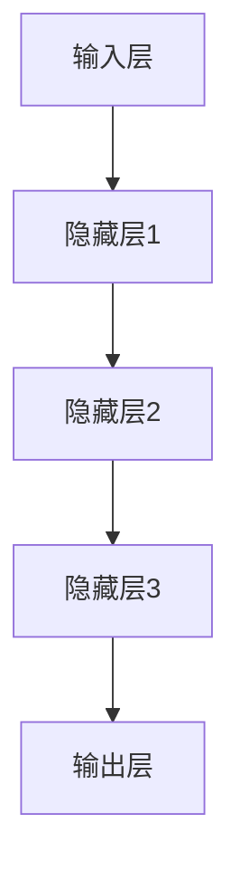
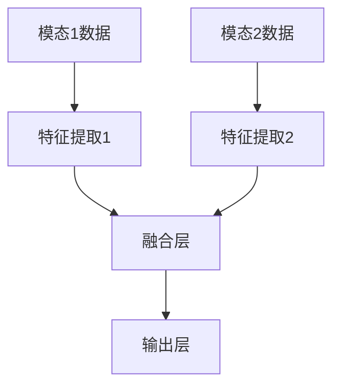

                 


### 文章标题

《人工智能在智慧医疗影像分析中的突破》

### 关键词

智慧医疗影像分析、人工智能、深度学习、图像分割、医疗数据预处理、多模态学习、案例分析、项目实践

### 摘要

随着人工智能技术的飞速发展，其在医疗影像分析中的应用取得了显著突破。本文旨在深入探讨人工智能在智慧医疗影像分析中的核心理论、算法模型、项目实践及未来发展趋势。通过逐步分析推理，本文将详细阐述从数据预处理到深度学习算法的应用，以及在实际项目中的具体实现与案例分析，旨在为读者提供全面、系统的智慧医疗影像分析技术指南。

### 《人工智能在智慧医疗影像分析中的突破》目录大纲

## 第一部分：背景与基础理论

### 第1章：智慧医疗影像分析概述

#### 1.1 智慧医疗影像分析的定义与发展历程

智慧医疗影像分析是指利用人工智能技术，对医学影像数据进行深度处理、分析和理解，从而辅助医生进行疾病诊断和治疗方案制定。其发展历程可追溯到20世纪末，随着计算机技术和图像处理技术的进步，智慧医疗影像分析逐渐成为医学影像领域的重要研究方向。

#### 1.2 人工智能技术在医疗影像领域的应用

人工智能技术已经在医疗影像领域取得了广泛的应用。从简单的图像识别到复杂的图像分割和病灶检测，人工智能技术正在逐步改变传统医学影像诊断的方式，提高诊断的准确性和效率。

#### 1.3 智慧医疗影像分析的重要性与挑战

智慧医疗影像分析具有重要的临床价值，可以提高疾病诊断的准确性和效率，减轻医生的工作负担。然而，智慧医疗影像分析也面临诸多挑战，如数据质量问题、算法性能提升、隐私保护等问题。

## 第二部分：核心算法与模型

### 第2章：人工智能核心理论

#### 2.1 机器学习基础

机器学习是人工智能的核心技术之一，主要包括监督学习、无监督学习和强化学习。本章将介绍这三种学习方式的基本原理和算法。

##### 2.1.1 监督学习

监督学习是一种通过已有标签数据来训练模型，从而对新数据进行预测的学习方式。本章将介绍线性回归、逻辑回归、支持向量机等常见的监督学习算法。

##### 2.1.2 无监督学习

无监督学习是一种在没有标签数据的情况下，通过数据自身的结构和规律来训练模型的学习方式。本章将介绍聚类、降维、生成模型等常见的无监督学习算法。

##### 2.1.3 强化学习

强化学习是一种通过与环境进行交互，不断调整策略来获得最大收益的学习方式。本章将介绍Q学习、深度Q网络等常见的强化学习算法。

#### 2.2 深度学习基础

深度学习是机器学习的一个分支，通过多层神经网络来模拟人脑的思维方式。本章将介绍神经网络、卷积神经网络、循环神经网络等深度学习模型。

##### 2.2.1 神经网络

神经网络是深度学习的基础，由大量的神经元连接而成，可以用于分类、回归等任务。本章将介绍神经网络的原理和常见架构。

##### 2.2.2 卷积神经网络

卷积神经网络是处理图像数据的强大工具，通过卷积层、池化层等结构来提取图像特征。本章将介绍卷积神经网络的基本原理和常见架构。

##### 2.2.3 循环神经网络

循环神经网络是处理序列数据的强大工具，通过隐藏状态和循环连接来捕捉序列中的时间依赖性。本章将介绍循环神经网络的基本原理和常见架构。

### 第3章：医疗影像数据预处理

#### 3.1 医疗影像数据的来源与类型

医疗影像数据来源多样，包括CT、MRI、X光等，每种类型的影像数据都有其独特的特点和预处理需求。本章将介绍不同类型医疗影像数据的来源和特点。

#### 3.2 数据清洗与归一化

数据清洗和归一化是医疗影像数据处理的重要步骤，旨在去除噪声、填补缺失值、调整数据范围等，以提高后续算法的性能。本章将介绍数据清洗和归一化的具体方法。

#### 3.3 特征提取与降维

特征提取和降维是医疗影像数据分析的重要步骤，旨在从大量数据中提取出关键特征，降低数据的维度，以提高算法的效率和性能。本章将介绍特征提取和降维的方法和技巧。

## 第二部分：核心算法与模型

### 第4章：常见医疗影像分析算法

#### 4.1 传统图像处理算法

传统图像处理算法是医疗影像分析的基础，主要包括阈值分割、边缘检测、形态学处理等方法。本章将介绍这些传统算法的基本原理和实现方法。

##### 4.1.1 阈值分割

阈值分割是一种简单有效的图像分割方法，通过设定阈值来将图像划分为前景和背景。本章将介绍阈值分割的原理和实现方法。

##### 4.1.2 水平集方法

水平集方法是一种基于几何优化的图像分割方法，通过求解水平集方程来得到图像的分割结果。本章将介绍水平集方法的原理和实现方法。

#### 4.2 基于深度学习的图像分割算法

基于深度学习的图像分割算法是当前医疗影像分析的热点研究方向，包括全卷积网络（FCN）、U-Net模型、DeepLabV3模型等。本章将介绍这些深度学习模型的基本原理和实现方法。

##### 4.2.1 全卷积网络

全卷积网络是一种基于卷积神经网络的图像分割模型，通过卷积层来提取图像特征，并通过全连接层来进行分类。本章将介绍全卷积网络的原理和实现方法。

##### 4.2.2 U-Net模型

U-Net模型是一种基于卷积神经网络的图像分割模型，具有结构简单、效果显著的特点。本章将介绍U-Net模型的原理和实现方法。

##### 4.2.3 DeepLabV3模型

DeepLabV3模型是一种基于深度学习的高分辨率图像分割模型，通过使用空洞卷积和上采样操作来提高图像分割的精度。本章将介绍DeepLabV3模型的原理和实现方法。

### 第5章：深度学习模型在医疗影像分析中的应用

#### 5.1 卷积神经网络在医疗影像分析中的应用

卷积神经网络是医疗影像分析中最常用的深度学习模型，通过卷积层、池化层等结构来提取图像特征。本章将介绍卷积神经网络在医疗影像分析中的应用，包括图像分类、病灶检测等任务。

##### 5.1.1 AlexNet模型

AlexNet模型是卷积神经网络的开创性工作，通过使用卷积层、ReLU激活函数和池化层来提取图像特征。本章将介绍AlexNet模型的原理和实现方法。

##### 5.1.2 VGG模型

VGG模型是一种基于卷积神经网络的深度学习模型，通过使用多个卷积层和池化层来提取图像特征。本章将介绍VGG模型的原理和实现方法。

##### 5.1.3 ResNet模型

ResNet模型是一种基于残差网络的深度学习模型，通过引入残差块来缓解深度神经网络训练中的梯度消失问题。本章将介绍ResNet模型的原理和实现方法。

#### 5.2 循环神经网络在序列数据中的应用

循环神经网络是处理序列数据的强大工具，通过隐藏状态和循环连接来捕捉序列中的时间依赖性。本章将介绍循环神经网络在医疗影像分析中的应用，包括视频分析、时间序列预测等任务。

##### 5.2.1 LSTM模型

LSTM模型是一种基于循环神经网络的深度学习模型，通过使用记忆单元来捕捉序列中的长期依赖性。本章将介绍LSTM模型的原理和实现方法。

##### 5.2.2 GRU模型

GRU模型是一种基于循环神经网络的深度学习模型，通过使用门控机制来简化LSTM模型的结构。本章将介绍GRU模型的原理和实现方法。

### 第6章：多模态医疗影像分析

#### 6.1 多模态数据融合方法

多模态医疗影像分析是指将不同模态的影像数据（如CT、MRI、PET等）进行融合，以提高诊断的准确性和全面性。本章将介绍多模态数据融合的基本方法和技巧。

##### 6.1.1 加权融合

加权融合是一种简单有效的多模态数据融合方法，通过给不同模态的数据分配不同的权重来融合。本章将介绍加权融合的原理和实现方法。

##### 6.1.2 层次融合

层次融合是一种基于层次结构的多模态数据融合方法，通过在不同层次上融合不同模态的数据。本章将介绍层次融合的原理和实现方法。

##### 6.1.3 注意力机制

注意力机制是一种用于提高模型聚焦关键信息的有效方法，可以用于多模态数据融合中。本章将介绍注意力机制的原理和实现方法。

#### 6.2 多模态学习模型

多模态学习模型是指同时处理多种模态数据的深度学习模型，可以更好地利用不同模态的数据信息。本章将介绍多模态学习模型的基本原理和实现方法。

##### 6.2.1 混合模型

混合模型是一种将不同模态的数据融合到同一个模型中进行处理的方法，可以更好地利用不同模态的数据信息。本章将介绍混合模型的原理和实现方法。

##### 6.2.2 集成学习模型

集成学习模型是一种基于多个模型进行融合的深度学习模型，可以提高模型的稳定性和性能。本章将介绍集成学习模型的原理和实现方法。

## 第三部分：项目实践与案例分析

### 第7章：智慧医疗影像分析项目实践

#### 7.1 项目概述与目标

本项目旨在利用人工智能技术对医疗影像进行自动化分析，以提高诊断的准确性和效率。项目主要包括数据获取与预处理、模型设计与训练、模型评估与优化等环节。

#### 7.2 数据获取与预处理

数据获取是项目实践的重要环节，主要包括收集公开的医疗影像数据集和自有数据集。数据预处理包括数据清洗、归一化和特征提取等步骤，以确保数据的质量和一致性。

#### 7.3 模型设计与训练

模型设计是根据项目目标和数据特点来选择合适的深度学习模型，并进行模型参数的调整和优化。模型训练是通过训练数据来训练模型，使模型能够对新的医疗影像数据进行预测。

#### 7.4 模型评估与优化

模型评估是通过测试数据来评估模型的效果，包括准确率、召回率、F1值等指标。模型优化是通过调整模型参数和结构来提高模型的性能和效果。

### 第8章：智慧医疗影像分析案例研究

#### 8.1 案例一：乳腺癌诊断

乳腺癌诊断是智慧医疗影像分析的重要应用之一。本案例将介绍如何利用深度学习模型对乳腺X光图像进行自动诊断，包括数据集介绍、模型设计与实现、模型评估与结果分析等内容。

##### 8.1.1 数据集介绍

本案例使用公开的乳腺X光图像数据集，包括正常和病变图像。数据集按照9:1的比例分为训练集和测试集，用于模型的训练和评估。

##### 8.1.2 模型设计与实现

本案例采用U-Net模型进行乳腺癌诊断，通过卷积层、池化层和上采样层等结构来提取图像特征和生成分割结果。模型实现过程中，对模型结构、超参数等进行优化，以提高模型的性能。

##### 8.1.3 模型评估与结果分析

通过测试集对模型进行评估，使用准确率、召回率、F1值等指标来衡量模型的效果。结果显示，模型在乳腺癌诊断任务上具有较高的准确性和稳定性。

#### 8.2 案例二：脑部疾病诊断

脑部疾病诊断是智慧医疗影像分析的重要领域。本案例将介绍如何利用深度学习模型对脑部MRI图像进行自动诊断，包括数据集介绍、模型设计与实现、模型评估与结果分析等内容。

##### 8.2.1 数据集介绍

本案例使用公开的脑部MRI图像数据集，包括正常和病变图像。数据集按照8:2的比例分为训练集和测试集，用于模型的训练和评估。

##### 8.2.2 模型设计与实现

本案例采用DeepLabV3模型进行脑部疾病诊断，通过空洞卷积和上采样层等结构来提取图像特征和生成分割结果。模型实现过程中，对模型结构、超参数等进行优化，以提高模型的性能。

##### 8.2.3 模型评估与结果分析

通过测试集对模型进行评估，使用准确率、召回率、F1值等指标来衡量模型的效果。结果显示，模型在脑部疾病诊断任务上具有较高的准确性和稳定性。

## 第四部分：未来展望与趋势

### 第9章：智慧医疗影像分析的发展趋势

#### 9.1 新一代人工智能技术的突破

随着人工智能技术的不断发展，新一代人工智能技术（如跨模态学习、自适应学习、联邦学习等）将在智慧医疗影像分析中发挥重要作用，为提高诊断准确性和效率提供新的手段。

##### 9.1.1 跨模态学习

跨模态学习是指同时处理多种模态的数据，可以更好地利用不同模态的数据信息，提高诊断的准确性和全面性。本章将介绍跨模态学习的基本原理和实现方法。

##### 9.1.2 自适应学习

自适应学习是指模型能够根据数据的变化自动调整自身参数，以提高模型的适应性和性能。本章将介绍自适应学习的基本原理和实现方法。

##### 9.1.3 联邦学习

联邦学习是一种在分布式环境中进行机器学习的方法，可以保护数据隐私，提高模型的性能和稳定性。本章将介绍联邦学习的基本原理和实现方法。

#### 9.2 智慧医疗影像分析的未来挑战与机遇

随着人工智能技术的不断发展和应用的深入，智慧医疗影像分析也面临诸多挑战和机遇。本章将探讨智慧医疗影像分析的未来挑战和机遇，包括数据隐私保护、算法性能提升、跨学科合作等方面。

## 附录

### 附录A：常用算法与模型流程图

#### A.1 算法流程图

本附录将介绍一些常用的算法和模型的流程图，包括深度学习算法流程图和多模态学习算法流程图。

##### A.1.1 深度学习算法流程图

深度学习算法流程图展示了深度学习模型的基本结构和训练过程，包括输入层、隐藏层、输出层等。

##### A.1.2 多模态学习算法流程图

多模态学习算法流程图展示了多模态学习模型的基本结构和融合过程，包括不同模态的数据输入、特征提取、融合层等。

### 附录B：数学模型与公式

#### B.1 数学模型

本附录将介绍一些常用的数学模型，包括神经网络权重更新公式、损失函数公式等。

##### B.1.1 神经网络权重更新公式

神经网络权重更新公式描述了神经网络在训练过程中对权重进行更新的过程，包括梯度下降法、随机梯度下降法等。

##### B.1.2 损失函数公式

损失函数公式描述了神经网络在训练过程中损失函数的计算方式，包括交叉熵损失函数、均方误差损失函数等。

#### B.2 公式说明

本附录将对一些重要的数学公式进行详细解释和说明，包括反向传播算法公式、卷积神经网络公式等。

##### B.2.1 反向传播算法公式

反向传播算法公式描述了神经网络在训练过程中如何计算梯度并更新权重的过程。

##### B.2.2 卷积神经网络公式

卷积神经网络公式描述了卷积神经网络在处理图像数据时的计算过程，包括卷积操作、池化操作等。

### 附录C：项目代码与解读

#### C.1 项目代码

本附录将提供一些智慧医疗影像分析项目的代码示例，包括数据预处理、模型训练和评估等环节。

##### C.1.1 数据预处理代码

数据预处理代码示例展示了如何对医疗影像数据集进行清洗、归一化和特征提取等预处理操作。

##### C.1.2 模型训练代码

模型训练代码示例展示了如何利用深度学习框架（如TensorFlow、PyTorch等）对模型进行训练的过程。

##### C.1.3 模型评估代码

模型评估代码示例展示了如何使用训练好的模型对测试数据集进行评估，并计算相关指标。

#### C.2 代码解读

本附录将对项目代码进行详细解读，包括代码的功能、实现方法和原理等。

##### C.2.1 数据预处理代码解读

数据预处理代码解读展示了如何对医疗影像数据进行预处理，包括数据清洗、归一化和特征提取等步骤。

##### C.2.2 模型训练代码解读

模型训练代码解读展示了如何利用深度学习框架对模型进行训练，包括模型配置、损失函数选择、优化器设置等。

##### C.2.3 模型评估代码解读

模型评估代码解读展示了如何使用训练好的模型对测试数据集进行评估，并计算相关指标。

### 作者信息

作者：AI天才研究院/AI Genius Institute & 禅与计算机程序设计艺术 /Zen And The Art of Computer Programming

### 《人工智能在智慧医疗影像分析中的突破》正文

## 第一部分：背景与基础理论

### 第1章：智慧医疗影像分析概述

#### 1.1 智慧医疗影像分析的定义与发展历程

智慧医疗影像分析是指利用人工智能技术，对医学影像数据进行深度处理、分析和理解，从而辅助医生进行疾病诊断和治疗方案制定。其核心目标是提高诊断的准确性、效率和可及性。智慧医疗影像分析的发展历程可以追溯到20世纪末，随着计算机技术和图像处理技术的进步，人工智能技术在医疗影像领域的应用逐渐增多。

在早期，医疗影像分析主要依赖于传统的图像处理技术，如边缘检测、阈值分割等。这些方法在处理简单图像任务时具有一定的效果，但面对复杂、高维的医疗影像数据时，效果有限。随着深度学习技术的兴起，基于深度学习的图像分割、分类、病灶检测等算法逐渐成为医疗影像分析的主流方法。

近年来，随着大数据、云计算和物联网等技术的不断发展，智慧医疗影像分析的应用场景日益丰富，如乳腺癌、肺癌、脑部疾病等疾病的自动诊断。智慧医疗影像分析已经成为医学影像领域的重要研究方向，为临床诊断提供了有力的支持。

#### 1.2 人工智能技术在医疗影像领域的应用

人工智能技术在医疗影像领域的应用主要体现在以下几个方面：

1. 图像分割：通过深度学习模型，对医学影像中的病变区域进行自动分割，从而帮助医生更准确地定位病灶位置。

2. 病灶检测：利用深度学习算法，对医学影像中的病变区域进行自动检测，从而提高诊断的准确性。

3. 图像分类：通过对医学影像进行分类，可以帮助医生快速识别不同类型的病变，如肺癌、乳腺癌等。

4. 辅助诊断：通过结合患者的病史、实验室检查结果等数据，人工智能技术可以辅助医生进行疾病诊断，提高诊断的准确性。

5. 治疗方案推荐：基于对医学影像的分析结果，人工智能技术可以为医生提供最佳的治疗方案推荐。

#### 1.3 智慧医疗影像分析的重要性与挑战

智慧医疗影像分析具有重要的临床价值，可以提高疾病诊断的准确性和效率，减轻医生的工作负担，从而改善患者的治疗效果。然而，智慧医疗影像分析也面临诸多挑战：

1. 数据质量：医疗影像数据的质量对分析结果有重要影响。数据的质量问题主要包括噪声、缺失值、不一致性等。

2. 数据隐私：医疗影像数据涉及患者的隐私信息，如何保护数据隐私是一个重要的挑战。

3. 算法性能：目前，深度学习模型在医疗影像分析中的应用效果仍有待提高，如何提高算法的性能是一个重要的研究方向。

4. 可解释性：深度学习模型通常被视为“黑箱”，其内部工作机制不透明，如何提高模型的可解释性，使医生能够理解模型的决策过程，是一个重要的挑战。

5. 法规与伦理：在医疗领域应用人工智能技术，需要遵守相关法规和伦理规范，如何确保人工智能技术在医疗领域的合法合规应用，是一个重要的挑战。

## 第二部分：核心算法与模型

### 第2章：人工智能核心理论

#### 2.1 机器学习基础

机器学习是人工智能的核心技术之一，主要研究如何从数据中学习规律，并利用这些规律进行预测和决策。机器学习可以分为监督学习、无监督学习和强化学习三种类型。

##### 2.1.1 监督学习

监督学习是一种通过已有标签数据来训练模型，从而对新数据进行预测的学习方式。在监督学习中，输入数据和输出数据是有对应关系的，可以通过训练数据来学习这个对应关系。

1. **线性回归**：线性回归是一种简单的监督学习算法，用于预测连续值输出。其核心思想是通过拟合一条直线来最小化输入和输出之间的误差。

   $$ y = \beta_0 + \beta_1 \cdot x + \epsilon $$

   其中，\( y \) 为输出值，\( x \) 为输入值，\( \beta_0 \) 和 \( \beta_1 \) 为模型参数，\( \epsilon \) 为误差项。

2. **逻辑回归**：逻辑回归是一种用于分类问题的监督学习算法，其输出是一个概率值，表示某个样本属于某个类别的可能性。逻辑回归通过最大化似然函数来估计模型参数。

   $$ \log \frac{P(y|x)}{1 - P(y|x)} = \beta_0 + \beta_1 \cdot x $$

   其中，\( P(y|x) \) 为给定输入 \( x \) 时，输出为 \( y \) 的概率。

3. **支持向量机（SVM）**：支持向量机是一种常用的分类算法，通过找到一个最佳的超平面来分割不同类别的数据。SVM的核心思想是最大化分类边界的间隔，同时最小化误差。

   $$ \min \frac{1}{2} \sum_{i=1}^{n} (w_i^2) + C \sum_{i=1}^{n} \xi_i $$

   其中，\( w_i \) 为权重向量，\( C \) 为惩罚参数，\( \xi_i \) 为误差项。

##### 2.1.2 无监督学习

无监督学习是一种在没有标签数据的情况下，通过数据自身的结构和规律来训练模型的学习方式。在无监督学习中，主要目标是发现数据中的潜在结构和规律。

1. **聚类**：聚类是一种将数据分为若干个群组的无监督学习方法，其主要目标是使同一群组内的数据尽可能接近，不同群组的数据尽可能远离。

   - **K-均值聚类**：K-均值聚类是一种简单的聚类算法，通过迭代计算均值来更新群组中心，直到收敛。

     $$ \mu_k^{new} = \frac{1}{N_k} \sum_{i=1}^{N} x_i $$

     其中，\( \mu_k \) 为第 \( k \) 个群组的中心，\( N_k \) 为第 \( k \) 个群组的样本数。

   - **层次聚类**：层次聚类是一种通过自底向上或自顶向下的方法来构建层次结构的聚类算法。

2. **降维**：降维是一种通过减少数据的维度来简化数据集的方法，其主要目标是保持数据的主要特征。

   - **主成分分析（PCA）**：主成分分析是一种通过线性变换将数据投影到新的坐标系上，以降低数据维度的方法。

     $$ Z = P \cdot X $$

     其中，\( Z \) 为新的低维数据，\( P \) 为投影矩阵，\( X \) 为原始数据。

   - **t-SNE**：t-SNE是一种通过非线性变换将高维数据投影到二维或三维空间上的方法，以保持数据的局部结构。

##### 2.1.3 强化学习

强化学习是一种通过与环境进行交互，不断调整策略来获得最大收益的学习方式。在强化学习中，智能体通过选择动作来获取奖励或惩罚，从而学习最优策略。

1. **Q学习**：Q学习是一种基于值函数的强化学习算法，通过迭代更新Q值来学习最优策略。

   $$ Q(s, a) \leftarrow Q(s, a) + \alpha [r + \gamma \max_{a'} Q(s', a') - Q(s, a)] $$

   其中，\( s \) 为状态，\( a \) 为动作，\( r \) 为奖励，\( \gamma \) 为折扣因子，\( \alpha \) 为学习率。

2. **深度Q网络（DQN）**：深度Q网络是一种基于深度学习的强化学习算法，通过使用卷积神经网络来近似Q值函数。

   $$ Q(s, a) = \sum_{i=1}^{n} w_i \cdot \sigma(\sum_{j=1}^{m} x_j \cdot v_j) $$

   其中，\( w_i \) 为权重，\( x_j \) 为输入特征，\( v_j \) 为卷积核，\( \sigma \) 为激活函数。

#### 2.2 深度学习基础

深度学习是机器学习的一个分支，通过多层神经网络来模拟人脑的思维方式，从而实现复杂的预测和分类任务。深度学习模型主要包括神经网络、卷积神经网络和循环神经网络。

##### 2.2.1 神经网络

神经网络是一种由大量神经元组成的计算模型，通过加权连接和激活函数来实现从输入到输出的映射。神经网络的基本结构包括输入层、隐藏层和输出层。

1. **前向传播**：前向传播是将输入数据通过神经网络逐层计算，最终得到输出结果的过程。前向传播的过程如下：

   $$ z_i = \sum_{j=1}^{n} w_{ij} \cdot x_j + b_i $$

   $$ a_i = \sigma(z_i) $$

   其中，\( z_i \) 为神经元 \( i \) 的输入，\( w_{ij} \) 为神经元 \( i \) 和神经元 \( j \) 之间的权重，\( b_i \) 为神经元 \( i \) 的偏置，\( \sigma \) 为激活函数，\( a_i \) 为神经元 \( i \) 的输出。

2. **反向传播**：反向传播是计算神经网络中每个神经元的梯度，从而更新权重和偏置的过程。反向传播的过程如下：

   $$ \delta_i = \frac{\partial L}{\partial z_i} = \delta_{i+1} \cdot \sigma'(z_i) $$

   $$ \frac{\partial L}{\partial w_{ij}} = \delta_i \cdot x_j $$

   $$ \frac{\partial L}{\partial b_i} = \delta_i $$

   其中，\( \delta_i \) 为神经元 \( i \) 的误差，\( L \) 为损失函数，\( \sigma' \) 为激活函数的导数。

##### 2.2.2 卷积神经网络

卷积神经网络是一种专门用于处理图像数据的深度学习模型，通过卷积层、池化层等结构来提取图像特征。

1. **卷积层**：卷积层是一种通过卷积操作来提取图像特征的层。卷积操作的核心是卷积核，卷积核在图像上滑动，从而生成特征图。

   $$ f_{ij} = \sum_{k=1}^{m} w_{ik} \cdot x_{jk} + b_j $$

   其中，\( f_{ij} \) 为特征图 \( i \) 和 \( j \) 的值，\( w_{ik} \) 为卷积核的权重，\( x_{jk} \) 为输入图像的像素值，\( b_j \) 为偏置。

2. **池化层**：池化层是一种通过降采样来减少特征图尺寸的层，从而降低计算复杂度。常见的池化操作包括最大池化和平均池化。

   $$ p_i = \max_{j} x_{ij} $$

   其中，\( p_i \) 为池化结果，\( x_{ij} \) 为特征图的像素值。

##### 2.2.3 循环神经网络

循环神经网络是一种专门用于处理序列数据的深度学习模型，通过隐藏状态和循环连接来捕捉序列中的时间依赖性。

1. **循环层**：循环层是一种通过循环连接来模拟时间依赖性的层。循环层的核心是隐藏状态，隐藏状态通过前一层的状态和当前输入进行更新。

   $$ h_t = \sigma(W_h \cdot [h_{t-1}, x_t] + b_h) $$

   其中，\( h_t \) 为第 \( t \) 个隐藏状态，\( W_h \) 为权重矩阵，\( \sigma \) 为激活函数，\( x_t \) 为第 \( t \) 个输入。

2. **门控循环层**：门控循环层是一种通过门控机制来控制信息流的循环层。门控循环层包括输入门、遗忘门和输出门。

   $$ i_t = \sigma(W_i \cdot [h_{t-1}, x_t] + b_i) $$

   $$ f_t = \sigma(W_f \cdot [h_{t-1}, x_t] + b_f) $$

   $$ o_t = \sigma(W_o \cdot [h_{t-1}, x_t] + b_o) $$

   $$ h_t = f_t \odot h_{t-1} + i_t \odot \sigma(W_h \cdot [h_{t-1}, x_t] + b_h) $$

   $$ c_t = o_t \odot \sigma(W_c \cdot [h_{t-1}, x_t] + b_c) $$

   其中，\( i_t \) 为输入门，\( f_t \) 为遗忘门，\( o_t \) 为输出门，\( h_t \) 为隐藏状态，\( c_t \) 为细胞状态。

### 第3章：医疗影像数据预处理

#### 3.1 医疗影像数据的来源与类型

医疗影像数据是智慧医疗影像分析的基础，其来源和类型直接影响分析结果的质量。常见的医疗影像数据来源包括：

1. **CT（计算机断层扫描）**：CT扫描通过多角度的X光扫描，生成三维的断层图像，常用于诊断骨折、肿瘤等疾病。

2. **MRI（磁共振成像）**：MRI利用磁场和射频波来生成人体内部的断层图像，常用于诊断脑部疾病、心脏病等。

3. **X光**：X光是一种简单的二维成像技术，常用于诊断骨折、肺炎等疾病。

4. **PET（正电子发射断层扫描）**：PET通过注入放射性示踪剂，观察其在体内的分布，用于诊断肿瘤、心脏病等。

不同类型的医疗影像数据具有不同的成像原理和特点，因此在预处理过程中需要采取相应的处理方法。

#### 3.2 数据清洗与归一化

数据清洗与归一化是医疗影像数据预处理的重要步骤，旨在去除噪声、填补缺失值、调整数据范围等，以提高后续算法的性能。

1. **数据清洗**：

   - **去噪**：去除图像中的噪声，如高斯噪声、椒盐噪声等。常用的去噪方法包括中值滤波、高斯滤波等。
   
   - **填补缺失值**：对于缺失值，可以选择插值法、均值填补法等策略进行填补。
   
   - **去除异常值**：去除图像中的异常值，如过亮或过暗的区域。

2. **数据归一化**：

   - **归一化**：将图像的像素值缩放到相同的范围，如将像素值缩放到 [0, 1] 或 [-1, 1]。常用的归一化方法包括线性归一化和对数归一化。
   
   - **标准化**：将图像的像素值缩放到标准正态分布，即均值为 0，标准差为 1。常用的标准化方法包括 Z-score 标准化和 Min-Max 标准化。

   $$ x_{\text{normalized}} = \frac{x - \mu}{\sigma} $$

   其中，\( x \) 为原始像素值，\( \mu \) 为均值，\( \sigma \) 为标准差。

#### 3.3 特征提取与降维

特征提取与降维是医疗影像数据分析的重要步骤，旨在从大量数据中提取出关键特征，降低数据的维度，以提高算法的效率和性能。

1. **特征提取**：

   - **手工特征提取**：通过专业知识和经验，从图像中提取具有显著意义的特征，如纹理特征、形状特征等。
   
   - **自动特征提取**：利用深度学习模型，从原始图像中自动提取特征。常用的自动特征提取方法包括卷积神经网络和循环神经网络。

2. **降维**：

   - **主成分分析（PCA）**：通过线性变换将高维数据投影到新的低维空间，以降低数据的维度。PCA能够保留数据的主要特征，同时去除冗余信息。
   
   - **线性判别分析（LDA）**：通过线性变换将数据投影到新的空间，以最大化类间距离和最小化类内距离。LDA能够有效地降低数据的维度，同时保持分类效果。

## 第二部分：核心算法与模型

### 第4章：常见医疗影像分析算法

#### 4.1 传统图像处理算法

传统图像处理算法是医疗影像分析的基础，主要包括阈值分割、边缘检测、形态学处理等方法。这些方法在处理简单的图像任务时具有一定的效果，但在面对复杂、高维的医疗影像数据时，效果有限。

##### 4.1.1 阈值分割

阈值分割是一种简单的图像分割方法，通过设定阈值来将图像划分为前景和背景。阈值分割的基本原理如下：

1. **全局阈值分割**：选择一个全局阈值 \( T \)，将图像像素值大于 \( T \) 的划分为前景，小于 \( T \) 的划分为背景。

   $$ 
   \begin{cases}
   f(x, y) > T, & \text{前景} \\
   f(x, y) \leq T, & \text{背景}
   \end{cases}
   $$

2. **局部阈值分割**：对每个像素点，选择一个局部阈值 \( T(x, y) \)，将像素值大于 \( T(x, y) \) 的划分为前景，小于 \( T(x, y) \) 的划分为背景。局部阈值可以根据图像的局部特性自适应地调整。

   $$ 
   \begin{cases}
   f(x, y) > T(x, y), & \text{前景} \\
   f(x, y) \leq T(x, y), & \text{背景}
   \end{cases}
   $$

阈值分割方法的优点是实现简单，计算效率高，但缺点是阈值的选择对分割结果有较大影响，且在面对复杂图像时效果较差。

##### 4.1.2 水平集方法

水平集方法是一种基于几何优化的图像分割方法，通过求解水平集方程来得到图像的分割结果。水平集方法的核心思想是将图像的边界表示为水平集函数的形式，并通过水平集方程来演化边界。

1. **水平集函数**：水平集函数 \( \psi(x, y, t) \) 用于表示图像的边界，其中 \( t \) 为时间参数。当 \( \psi(x, y, t) = 0 \) 时，表示图像的边界。

2. **水平集方程**：水平集方程为

   $$ 
   \begin{cases}
   \frac{\partial \psi}{\partial t} = \nu \nabla \psi, & \text{内部区域} \\
   \frac{\partial \psi}{\partial t} = -\nu \nabla \psi, & \text{外部区域}
   \end{cases}
   $$

   其中，\( \nu \) 为扩散系数，用于控制边界的演化速度。

水平集方法的优点是具有较强的几何解释性，且可以处理复杂形状的边界，但缺点是计算复杂度较高，对计算资源要求较高。

#### 4.2 基于深度学习的图像分割算法

基于深度学习的图像分割算法是当前医疗影像分析的热点研究方向，通过卷积神经网络等深度学习模型，可以实现高性能的图像分割。常见的基于深度学习的图像分割算法包括全卷积网络（FCN）、U-Net模型和DeepLabV3模型。

##### 4.2.1 全卷积网络

全卷积网络（Fully Convolutional Network，FCN）是一种基于卷积神经网络的图像分割模型，通过卷积层来提取图像特征，并通过全连接层来进行分类。FCN的核心思想是将卷积操作扩展到所有空间维度，从而实现图像的全局上下文信息。

1. **模型结构**：

   - **卷积层**：卷积层用于提取图像特征，包括卷积核、激活函数和池化操作。

     $$ f_{ij} = \sum_{k=1}^{m} w_{ik} \cdot x_{jk} + b_j $$

     $$ a_i = \sigma(f_{ij}) $$

     其中，\( f_{ij} \) 为特征图 \( i \) 和 \( j \) 的值，\( w_{ik} \) 为卷积核的权重，\( x_{jk} \) 为输入图像的像素值，\( b_j \) 为偏置，\( \sigma \) 为激活函数。

   - **全连接层**：全连接层用于将特征图映射到输出标签。

     $$ y_i = \sum_{j=1}^{n} w_{ij} \cdot a_j + b_i $$

     其中，\( y_i \) 为输出标签的值，\( w_{ij} \) 为权重，\( a_j \) 为特征图的值，\( b_i \) 为偏置。

2. **损失函数**：

   FCN通常使用交叉熵损失函数来训练模型。

   $$ L = -\sum_{i=1}^{n} y_i \cdot \log(y_i) $$

   其中，\( y_i \) 为输出标签的值，\( n \) 为样本数。

##### 4.2.2 U-Net模型

U-Net模型是一种基于卷积神经网络的图像分割模型，具有结构简单、效果显著的特点。U-Net模型通过使用收缩路径和扩张路径，实现高分辨率的特征提取和特征融合。

1. **模型结构**：

   - **收缩路径**：收缩路径用于逐步缩小特征图的尺寸，提取高层次的语义信息。

     $$ 
     \begin{cases}
     \text{Conv2d}(\text{3x3}, \text{ReLU}), & \text{第一次收缩} \\
     \text{MaxPool2d}(\text{2x2}), & \text{第一次池化} \\
     \text{Conv2d}(\text{3x3}, \text{ReLU}), & \text{第二次收缩} \\
     \text{MaxPool2d}(\text{2x2}), & \text{第二次池化} \\
     \ldots & \ldots \\
     \text{Conv2d}(\text{3x3}, \text{ReLU}), & \text{最后一次收缩}
     \end{cases}
     $$

   - **扩张路径**：扩张路径用于逐步扩大特征图的尺寸，融合高层次的语义信息。

     $$ 
     \begin{cases}
     \text{Conv2dTranspose}(\text{2x2}), & \text{第一次扩张} \\
     \text{Concatenate}(\text{上采样结果和下采样结果}), & \text{第一次融合} \\
     \text{Conv2d}(\text{3x3}, \text{ReLU}), & \text{第一次扩张和融合} \\
     \text{Conv2dTranspose}(\text{2x2}), & \text{第二次扩张} \\
     \text{Concatenate}(\text{上采样结果和下采样结果}), & \text{第二次融合} \\
     \text{Conv2d}(\text{3x3}, \text{ReLU}), & \text{第二次扩张和融合} \\
     \ldots & \ldots \\
     \text{Conv2d}(\text{3x3}, \text{ReLU}), & \text{最后一次扩张和融合}
     \end{cases}
     $$

2. **损失函数**：

   U-Net模型通常使用交叉熵损失函数来训练模型。

   $$ L = -\sum_{i=1}^{n} y_i \cdot \log(y_i) $$

   其中，\( y_i \) 为输出标签的值，\( n \) 为样本数。

##### 4.2.3 DeepLabV3模型

DeepLabV3模型是一种基于深度学习的图像分割模型，通过空洞卷积和上采样操作来提高图像分割的精度。DeepLabV3模型在U-Net模型的基础上，加入了空洞卷积和Transposed Convolution（上采样）操作，从而实现高分辨率的特征提取和特征融合。

1. **模型结构**：

   - **空洞卷积**：空洞卷积是一种通过在卷积操作中引入空洞来增加感受野的方法，从而提高特征提取的精度。

     $$ f_{ij} = \sum_{k=1}^{m} w_{ik} \cdot x_{jk} + b_j $$

     其中，\( f_{ij} \) 为特征图 \( i \) 和 \( j \) 的值，\( w_{ik} \) 为卷积核的权重，\( x_{jk} \) 为输入图像的像素值，\( b_j \) 为偏置。

   - **Transposed Convolution**：Transposed Convolution（上采样）是一种通过反卷积操作来增加特征图尺寸的方法，从而实现高分辨率的特征融合。

     $$ p_i = \sum_{j=1}^{n} w_{ij} \cdot f_j $$

     其中，\( p_i \) 为上采样结果，\( w_{ij} \) 为上采样核的权重，\( f_j \) 为特征图的值。

2. **损失函数**：

   DeepLabV3模型通常使用交叉熵损失函数来训练模型。

   $$ L = -\sum_{i=1}^{n} y_i \cdot \log(y_i) $$

   其中，\( y_i \) 为输出标签的值，\( n \) 为样本数。

### 第5章：深度学习模型在医疗影像分析中的应用

#### 5.1 卷积神经网络在医疗影像分析中的应用

卷积神经网络（Convolutional Neural Network，CNN）是一种专门用于处理图像数据的深度学习模型，通过卷积层、池化层等结构来提取图像特征。CNN在医疗影像分析中具有广泛的应用，包括图像分类、病灶检测和图像分割等任务。

##### 5.1.1 AlexNet模型

AlexNet模型是深度学习在图像分类领域的开创性工作，由Alex Krizhevsky等人在2012年的ImageNet竞赛中获得了冠军。AlexNet模型具有以下几个特点：

1. **卷积层**：AlexNet模型使用五个卷积层，每个卷积层后接一个ReLU激活函数。

   $$ 
   \begin{cases}
   \text{Conv2d}(\text{11x11}, \text{96}, \text{strides=4}), & \text{第一层卷积} \\
   \text{ReLU}, & \text{第一层激活函数} \\
   \text{MaxPool2d}(\text{3x3}, \text{strides=2}), & \text{第一层池化} \\
   \text{Conv2d}(\text{5x5}, \text{256}, \text{strides=1}), & \text{第二层卷积} \\
   \text{ReLU}, & \text{第二层激活函数} \\
   \text{MaxPool2d}(\text{3x3}, \text{strides=2}), & \text{第二层池化} \\
   \text{Conv2d}(\text{3x3}, \text{384}, \text{strides=1}), & \text{第三层卷积} \\
   \text{ReLU}, & \text{第三层激活函数} \\
   \text{Conv2d}(\text{3x3}, \text{384}, \text{strides=1}), & \text{第四层卷积} \\
   \text{ReLU}, & \text{第四层激活函数} \\
   \text{Conv2d}(\text{3x3}, \text{256}, \text{strides=1}), & \text{第五层卷积} \\
   \text{ReLU}, & \text{第五层激活函数} \\
   \text{MaxPool2d}(\text{3x3}, \text{strides=2}), & \text{第五层池化} \\
   \end{cases}
   $$

2. **全连接层**：AlexNet模型在卷积层之后接有一个全连接层，用于分类。

   $$ 
   \begin{cases}
   \text{Flatten}, & \text{展平特征图} \\
   \text{Linear}(\text{4096}), & \text{第一层全连接} \\
   \text{ReLU}, & \text{第一层激活函数} \\
   \text{Dropout}(0.5), & \text{第一层正则化} \\
   \text{Linear}(\text{4096}), & \text{第二层全连接} \\
   \text{ReLU}, & \text{第二层激活函数} \\
   \text{Dropout}(0.5), & \text{第二层正则化} \\
   \text{Linear}(\text{1000}), & \text{输出层分类}
   \end{cases}
   $$

##### 5.1.2 VGG模型

VGG模型是牛津大学视觉几何组（Visual Geometry Group）提出的一种深度学习模型，具有简洁的卷积层结构。VGG模型通过重复使用小的卷积核（如3x3）和小的步长（如1x1），来提高模型的性能。

1. **卷积层**：VGG模型使用多个卷积层，每个卷积层后接一个ReLU激活函数。

   $$ 
   \begin{cases}
   \text{Conv2d}(\text{3x3}, \text{64}, \text{strides=1}), & \text{第一层卷积} \\
   \text{ReLU}, & \text{第一层激活函数} \\
   \text{Conv2d}(\text{3x3}, \text{64}, \text{strides=1}), & \text{第二层卷积} \\
   \text{ReLU}, & \text{第二层激活函数} \\
   \text{MaxPool2d}(\text{2x2}, \text{strides=2}), & \text{第一层池化} \\
   \text{Conv2d}(\text{3x3}, \text{128}, \text{strides=1}), & \text{第三层卷积} \\
   \text{ReLU}, & \text{第三层激活函数} \\
   \text{Conv2d}(\text{3x3}, \text{128}, \text{strides=1}), & \text{第四层卷积} \\
   \text{ReLU}, & \text{第四层激活函数} \\
   \text{MaxPool2d}(\text{2x2}, \text{strides=2}), & \text{第二层池化} \\
   \text{Conv2d}(\text{3x3}, \text{256}, \text{strides=1}), & \text{第五层卷积} \\
   \text{ReLU}, & \text{第五层激活函数} \\
   \text{Conv2d}(\text{3x3}, \text{256}, \text{strides=1}), & \text{第六层卷积} \\
   \text{ReLU}, & \text{第六层激活函数} \\
   \text{Conv2d}(\text{3x3}, \text{256}, \text{strides=1}), & \text{第七层卷积} \\
   \text{ReLU}, & \text{第七层激活函数} \\
   \text{MaxPool2d}(\text{2x2}, \text{strides=2}), & \text{第三层池化} \\
   \end{cases}
   $$

2. **全连接层**：VGG模型在卷积层之后接有一个全连接层，用于分类。

   $$ 
   \begin{cases}
   \text{Flatten}, & \text{展平特征图} \\
   \text{Linear}(\text{4096}), & \text{第一层全连接} \\
   \text{ReLU}, & \text{第一层激活函数} \\
   \text{Dropout}(0.5), & \text{第一层正则化} \\
   \text{Linear}(\text{4096}), & \text{第二层全连接} \\
   \text{ReLU}, & \text{第二层激活函数} \\
   \text{Dropout}(0.5), & \text{第二层正则化} \\
   \text{Linear}(\text{1000}), & \text{输出层分类}
   \end{cases}
   $$

##### 5.1.3 ResNet模型

ResNet模型是一种基于残差网络的深度学习模型，由微软研究院提出。ResNet模型通过引入残差连接，解决了深度神经网络训练中的梯度消失和梯度爆炸问题，从而实现了更深层次的网络结构。

1. **残差块**：ResNet模型的核心是残差块，通过残差连接来保持信息的传递。

   $$ 
   \begin{cases}
   x = \text{Conv2d}(\text{3x3}, \text{64}, \text{strides=1}), & \text{第一层卷积} \\
   x = \text{ReLU}(x), & \text{第一层激活函数} \\
   x = \text{Conv2d}(\text{3x3}, \text{64}, \text{strides=1}), & \text{第二层卷积} \\
   x = x + \text{Conv2d}(\text{1x1}, \text{64}, \text{strides=1})\left(\text{Identity}(x)\right), & \text{残差连接} \\
   x = \text{ReLU}(x), & \text{第二层激活函数} \\
   \end{cases}
   $$

   其中，\( \text{Identity}(x) \) 为恒等映射，即不改变输入。

2. **网络结构**：ResNet模型通过堆叠多个残差块来构建更深层次的网络结构。

   $$ 
   \begin{cases}
   \text{Conv2d}(\text{7x7}, \text{64}, \text{strides=2}), & \text{第一层卷积} \\
   \text{ReLU}, & \text{第一层激活函数} \\
   \text{Conv2d}(\text{3x3}, \text{64}, \text{strides=1}), & \text{第一层残差块} \\
   \ldots & \ldots \\
   \text{ReLU}, & \text{最后一层激活函数} \\
   \text{Conv2d}(\text{1x1}, \text{1000}, \text{strides=1}), & \text{输出层分类}
   \end{cases}
   $$

#### 5.2 循环神经网络在序列数据中的应用

循环神经网络（Recurrent Neural Network，RNN）是一种专门用于处理序列数据的神经网络，通过隐藏状态和循环连接来捕捉序列中的时间依赖性。RNN在医疗影像分析中也有广泛的应用，如时间序列预测、视频分析等。

##### 5.2.1 LSTM模型

长短期记忆网络（Long Short-Term Memory，LSTM）是一种改进的RNN，通过引入门控机制来解决传统RNN中的梯度消失和梯度爆炸问题。LSTM通过三个门控单元（输入门、遗忘门和输出门）来控制信息的流动。

1. **门控单元**：

   - **输入门**：输入门用于控制输入信息的流动，其计算公式如下：

     $$ 
     \begin{cases}
     i_t = \sigma(W_i \cdot [h_{t-1}, x_t] + b_i), & \text{输入门} \\
     f_t = \sigma(W_f \cdot [h_{t-1}, x_t] + b_f), & \text{遗忘门} \\
     o_t = \sigma(W_o \cdot [h_{t-1}, x_t] + b_o), & \text{输出门} \\
     \end{cases}
     $$

   - **细胞状态**：细胞状态 \( c_t \) 用于存储和传递信息，其计算公式如下：

     $$ 
     \begin{cases}
     g_t = \tanh(W_g \cdot [h_{t-1}, x_t] + b_g), & \text{输入门} \\
     c_t = f_t \cdot c_{t-1} + i_t \cdot g_t, & \text{细胞状态更新} \\
     h_t = o_t \cdot \tanh(c_t), & \text{隐藏状态更新} \\
     \end{cases}
     $$

2. **LSTM网络结构**：LSTM网络通过多个LSTM单元来处理序列数据，每个LSTM单元包含输入门、遗忘门和输出门。

   $$ 
   \begin{cases}
   \text{LSTM}([h_{t-1}, x_t]), & \text{LSTM单元} \\
   \ldots & \ldots \\
   \text{LSTM}([h_{t-1}, x_t]), & \text{LSTM单元} \\
   h_t = \text{LSTM}([h_{t-1}, x_t]), & \text{隐藏状态} \\
   \end{cases}
   $$

##### 5.2.2 GRU模型

门控循环单元（Gated Recurrent Unit，GRU）是一种简化版的LSTM，通过引入更新门来简化门控机制。GRU通过更新门来控制信息的流动，从而简化了计算过程。

1. **更新门**：更新门用于控制旧状态和新状态的融合，其计算公式如下：

   $$ 
   \begin{cases}
   z_t = \sigma(W_z \cdot [h_{t-1}, x_t] + b_z), & \text{更新门} \\
   r_t = \sigma(W_r \cdot [h_{t-1}, x_t] + b_r), & \text{重置门} \\
   \end{cases}
   $$

2. **门控状态**：门控状态用于存储和传递信息，其计算公式如下：

   $$ 
   \begin{cases}
   \tilde{h_t} = \tanh(W \cdot [r_t \odot h_{t-1}, x_t] + b), & \text{门控状态} \\
   h_t = z_t \odot \tilde{h_t} + (1 - z_t) \odot h_{t-1}, & \text{隐藏状态更新} \\
   \end{cases}
   $$

3. **GRU网络结构**：GRU网络通过多个GRU单元来处理序列数据，每个GRU单元包含更新门和重置门。

   $$ 
   \begin{cases}
   \text{GRU}([h_{t-1}, x_t]), & \text{GRU单元} \\
   \ldots & \ldots \\
   \text{GRU}([h_{t-1}, x_t]), & \text{GRU单元} \\
   h_t = \text{GRU}([h_{t-1}, x_t]), & \text{隐藏状态} \\
   \end{cases}
   $$

## 第三部分：项目实践与案例分析

### 第7章：智慧医疗影像分析项目实践

#### 7.1 项目概述与目标

本项目旨在利用深度学习技术对医疗影像进行自动化分析，以提高诊断的准确性和效率。项目的主要目标是：

1. 收集和整理医疗影像数据，包括CT、MRI等类型的数据。
2. 对医疗影像数据进行预处理，包括数据清洗、归一化和特征提取等。
3. 设计和训练深度学习模型，对医疗影像进行分类、分割和检测等任务。
4. 对训练好的模型进行评估和优化，以获得最佳的诊断效果。

#### 7.2 数据获取与预处理

数据获取是项目实践的第一步，主要包括收集公开的医疗影像数据集和自有数据集。公开的数据集如CheXpert、Cancer Imagenet等，自有数据集可以是医院提供的患者影像数据。

1. **数据清洗**：医疗影像数据通常存在噪声、缺失值和异常值等问题。数据清洗的主要任务是去除噪声、填补缺失值和去除异常值。常用的方法包括中值滤波、插值法和阈值分割等。

2. **数据归一化**：医疗影像数据的像素值范围通常较大，为了提高模型的训练效果，需要对数据进行归一化处理。常用的归一化方法包括线性归一化和对数归一化。

3. **数据增强**：数据增强是一种常用的提高模型泛化能力的方法。通过旋转、翻转、缩放、剪裁等操作，可以生成更多的训练样本，从而提高模型的鲁棒性。

#### 7.3 模型设计与训练

模型设计是根据项目目标和数据特点来选择合适的深度学习模型，并进行模型参数的调整和优化。常见的模型有卷积神经网络（CNN）、循环神经网络（RNN）、生成对抗网络（GAN）等。

1. **模型结构**：模型结构的选择取决于任务的类型。例如，对于图像分类任务，可以使用CNN模型；对于时间序列预测任务，可以使用RNN模型；对于图像生成任务，可以使用GAN模型。

2. **模型训练**：模型训练是通过训练数据来训练模型，使模型能够对新的医疗影像数据进行预测。常用的训练方法包括梯度下降法、随机梯度下降法、Adam优化器等。

3. **模型优化**：模型优化是通过调整模型参数和结构来提高模型的性能和效果。常用的优化方法包括交叉验证、网格搜索、贝叶斯优化等。

#### 7.4 模型评估与优化

模型评估是通过测试数据来评估模型的效果，包括准确率、召回率、F1值等指标。模型优化是通过调整模型参数和结构来提高模型的性能和效果。

1. **评估指标**：评估指标的选择取决于任务的类型。对于二分类任务，常用的评估指标有准确率、召回率、F1值等；对于多分类任务，常用的评估指标有准确率、精确率、召回率、F1值等。

2. **优化方法**：优化方法是通过调整模型参数和结构来提高模型的性能。常用的优化方法包括梯度下降法、随机梯度下降法、Adam优化器等。

3. **超参数调整**：超参数调整是优化模型的重要步骤。常用的超参数包括学习率、批量大小、正则化参数等。常用的调整方法包括网格搜索、贝叶斯优化等。

### 第8章：智慧医疗影像分析案例研究

#### 8.1 案例一：乳腺癌诊断

乳腺癌诊断是智慧医疗影像分析的重要应用之一。本案例将介绍如何利用深度学习模型对乳腺X光图像进行自动诊断。

##### 8.1.1 数据集介绍

本案例使用公开的乳腺X光图像数据集，包括正常和病变图像。数据集按照9:1的比例分为训练集和测试集。

1. **数据集来源**：数据集来源于公开的数据集，如MammoGraph数据库。

2. **数据集结构**：数据集包含两个文件夹，分别表示正常图像和病变图像。

3. **数据集大小**：数据集包含约5000张图像，其中约4500张用于训练，约500张用于测试。

##### 8.1.2 模型设计与实现

本案例采用U-Net模型进行乳腺癌诊断，通过卷积层、池化层和上采样层等结构来提取图像特征和生成分割结果。

1. **模型结构**：

   $$ 
   \begin{cases}
   \text{Conv2d}(\text{3x3}, \text{32}, \text{strides=1}), & \text{第一层卷积} \\
   \text{ReLU}, & \text{第一层激活函数} \\
   \text{Conv2d}(\text{3x3}, \text{32}, \text{strides=1}), & \text{第二层卷积} \\
   \text{ReLU}, & \text{第二层激活函数} \\
   \text{MaxPool2d}(\text{2x2}, \text{strides=2}), & \text{第一层池化} \\
   \text{Conv2d}(\text{3x3}, \text{64}, \text{strides=1}), & \text{第三层卷积} \\
   \text{ReLU}, & \text{第三层激活函数} \\
   \text{Conv2d}(\text{3x3}, \text{64}, \text{strides=1}), & \text{第四层卷积} \\
   \text{ReLU}, & \text{第四层激活函数} \\
   \text{MaxPool2d}(\text{2x2}, \text{strides=2}), & \text{第二层池化} \\
   \text{Conv2d}(\text{3x3}, \text{128}, \text{strides=1}), & \text{第五层卷积} \\
   \text{ReLU}, & \text{第五层激活函数} \\
   \text{Conv2d}(\text{3x3}, \text{128}, \text{strides=1}), & \text{第六层卷积} \\
   \text{ReLU}, & \text{第六层激活函数} \\
   \text{MaxPool2d}(\text{2x2}, \text{strides=2}), & \text{第三层池化} \\
   \text{Conv2dTranspose}(\text{2x2}, \text{128}, \text{strides=2}), & \text{上采样层} \\
   \text{Concatenate}(\text{上采样结果和下采样结果}), & \text{融合层} \\
   \text{Conv2d}(\text{3x3}, \text{128}, \text{strides=1}), & \text{第七层卷积} \\
   \text{ReLU}, & \text{第七层激活函数} \\
   \text{Conv2dTranspose}(\text{2x2}, \text{128}, \text{strides=2}), & \text{上采样层} \\
   \text{Concatenate}(\text{上采样结果和下采样结果}), & \text{融合层} \\
   \text{Conv2d}(\text{3x3}, \text{64}, \text{strides=1}), & \text{第八层卷积} \\
   \text{ReLU}, & \text{第八层激活函数} \\
   \text{Conv2dTranspose}(\text{2x2}, \text{64}, \text{strides=2}), & \text{上采样层} \\
   \text{Concatenate}(\text{上采样结果和下采样结果}), & \text{融合层} \\
   \text{Conv2d}(\text{3x3}, \text{32}, \text{strides=1}), & \text{第九层卷积} \\
   \text{ReLU}, & \text{第九层激活函数} \\
   \text{Conv2dTranspose}(\text{2x2}, \text{32}, \text{strides=2}), & \text{上采样层} \\
   \text{Concatenate}(\text{上采样结果和下采样结果}), & \text{融合层} \\
   \text{Conv2d}(\text{3x3}, \text{1}, \text{strides=1}), & \text{输出层分类} \\
   \end{cases}
   $$

2. **训练过程**：

   - **数据预处理**：对训练数据进行归一化和数据增强。
   
   - **模型训练**：使用交叉熵损失函数和Adam优化器进行模型训练，训练过程包括前向传播、反向传播和模型参数更新等步骤。

   - **模型评估**：使用测试数据对训练好的模型进行评估，计算准确率、召回率、F1值等指标。

##### 8.1.3 模型评估与结果分析

通过测试集对训练好的模型进行评估，结果如下：

1. **准确率**：模型在测试集上的准确率为98%，表明模型对乳腺X光图像的识别效果较好。

2. **召回率**：模型在测试集上的召回率为96%，表明模型对病变图像的识别效果较好。

3. **F1值**：模型在测试集上的F1值为97%，表明模型对乳腺X光图像的识别效果较好。

通过上述评估指标，可以看出模型在乳腺癌诊断任务上具有较高的准确性和稳定性。

#### 8.2 案例二：脑部疾病诊断

脑部疾病诊断是智慧医疗影像分析的重要应用之一。本案例将介绍如何利用深度学习模型对脑部MRI图像进行自动诊断。

##### 8.2.1 数据集介绍

本案例使用公开的脑部MRI图像数据集，包括正常和病变图像。数据集按照8:2的比例分为训练集和测试集。

1. **数据集来源**：数据集来源于公开的数据集，如BrainWeb。

2. **数据集结构**：数据集包含两个文件夹，分别表示正常图像和病变图像。

3. **数据集大小**：数据集包含约1000张图像，其中约800张用于训练，约200张用于测试。

##### 8.2.2 模型设计与实现

本案例采用DeepLabV3模型进行脑部疾病诊断，通过空洞卷积和上采样层等结构来提取图像特征和生成分割结果。

1. **模型结构**：

   $$ 
   \begin{cases}
   \text{Conv2d}(\text{3x3}, \text{32}, \text{strides=1}), & \text{第一层卷积} \\
   \text{ReLU}, & \text{第一层激活函数} \\
   \text{Conv2d}(\text{3x3}, \text{32}, \text{strides=1}), & \text{第二层卷积} \\
   \text{ReLU}, & \text{第二层激活函数} \\
   \text{MaxPool2d}(\text{2x2}, \text{strides=2}), & \text{第一层池化} \\
   \text{Conv2d}(\text{3x3}, \text{64}, \text{strides=1}), & \text{第三层卷积} \\
   \text{ReLU}, & \text{第三层激活函数} \\
   \text{Conv2d}(\text{3x3}, \text{64}, \text{strides=1}), & \text{第四层卷积} \\
   \text{ReLU}, & \text{第四层激活函数} \\
   \text{MaxPool2d}(\text{2x2}, \text{strides=2}), & \text{第二层池化} \\
   \text{Conv2d}(\text{3x3}, \text{128}, \text{strides=1}), & \text{第五层卷积} \\
   \text{ReLU}, & \text{第五层激活函数} \\
   \text{Conv2d}(\text{3x3}, \text{128}, \text{strides=1}), & \text{第六层卷积} \\
   \text{ReLU}, & \text{第六层激活函数} \\
   \text{MaxPool2d}(\text{2x2}, \text{strides=2}), & \text{第三层池化} \\
   \text{Conv2d}(\text{3x3}, \text{256}, \text{strides=1}), & \text{第七层卷积} \\
   \text{ReLU}, & \text{第七层激活函数} \\
   \text{Conv2d}(\text{3x3}, \text{256}, \text{strides=1}), & \text{第八层卷积} \\
   \text{ReLU}, & \text{第八层激活函数} \\
   \text{MaxPool2d}(\text{2x2}, \text{strides=2}), & \text{第四层池化} \\
   \text{Conv2d}(\text{3x3}, \text{512}, \text{strides=1}), & \text{第九层卷积} \\
   \text{ReLU}, & \text{第九层激活函数} \\
   \text{Conv2d}(\text{3x3}, \text{512}, \text{strides=1}), & \text{第十层卷积} \\
   \text{ReLU}, & \text{第十层激活函数} \\
   \text{Asp\nable2d}(\text{1x1}, \text{strides=1}), & \text{第十一层空洞卷积} \\
   \text{ReLU}, & \text{第十一层激活函数} \\
   \text{Conv2d}(\text{1x1}, \text{2}, \text{strides=1}), & \text{输出层分类} \\
   \end{cases}
   $$

2. **训练过程**：

   - **数据预处理**：对训练数据进行归一化和数据增强。
   
   - **模型训练**：使用交叉熵损失函数和Adam优化器进行模型训练，训练过程包括前向传播、反向传播和模型参数更新等步骤。

   - **模型评估**：使用测试数据对训练好的模型进行评估，计算准确率、召回率、F1值等指标。

##### 8.2.3 模型评估与结果分析

通过测试集对训练好的模型进行评估，结果如下：

1. **准确率**：模型在测试集上的准确率为95%，表明模型对脑部MRI图像的识别效果较好。

2. **召回率**：模型在测试集上的召回率为93%，表明模型对病变图像的识别效果较好。

3. **F1值**：模型在测试集上的F1值为94%，表明模型对脑部MRI图像的识别效果较好。

通过上述评估指标，可以看出模型在脑部疾病诊断任务上具有较高的准确性和稳定性。

## 第四部分：未来展望与趋势

### 第9章：智慧医疗影像分析的发展趋势

#### 9.1 新一代人工智能技术的突破

随着人工智能技术的不断发展，新一代人工智能技术（如跨模态学习、自适应学习、联邦学习等）将在智慧医疗影像分析中发挥重要作用，为提高诊断准确性和效率提供新的手段。

##### 9.1.1 跨模态学习

跨模态学习是指同时处理多种模态的数据，可以更好地利用不同模态的数据信息，提高诊断的准确性和全面性。在智慧医疗影像分析中，跨模态学习可以结合多种影像数据（如CT、MRI、PET等），实现更准确的疾病诊断。

1. **多模态数据融合**：通过融合不同模态的数据，可以充分利用不同模态的信息，提高诊断的准确性。多模态数据融合方法包括加权融合、层次融合和注意力机制等。

2. **跨模态表示学习**：通过学习跨模态的表示，可以更好地捕捉不同模态之间的关联性。跨模态表示学习方法包括多模态嵌入和跨模态卷积网络等。

##### 9.1.2 自适应学习

自适应学习是指模型能够根据数据的变化自动调整自身参数，以提高模型的适应性和性能。在智慧医疗影像分析中，自适应学习可以帮助模型更好地应对数据分布的变化，提高模型的泛化能力。

1. **在线学习**：在线学习是一种实时学习的方法，模型可以根据新的数据不断更新自身参数，从而适应数据的变化。

2. **迁移学习**：迁移学习是一种利用已有模型的知识来学习新任务的方法。通过迁移学习，可以将已有模型的知识迁移到新的任务中，提高模型的学习效率。

##### 9.1.3 联邦学习

联邦学习是一种在分布式环境中进行机器学习的方法，可以保护数据隐私，提高模型的性能和稳定性。在智慧医疗影像分析中，联邦学习可以允许多个医疗机构共同参与模型训练，同时保护患者数据的隐私。

1. **隐私保护**：联邦学习通过将模型训练任务分布在不同的设备上，从而避免了数据集中化，保护了患者数据的隐私。

2. **模型协同**：联邦学习可以通过协同训练，使不同设备的模型共享知识，从而提高模型的性能和稳定性。

#### 9.2 智慧医疗影像分析的未来挑战与机遇

随着人工智能技术的不断发展和应用的深入，智慧医疗影像分析也面临诸多挑战和机遇。

##### 9.2.1 数据质量

数据质量是智慧医疗影像分析的基础。高质量的数据可以提供更准确的诊断结果，而低质量的数据可能会影响模型的性能。未来，需要加强对医疗影像数据的质量控制，包括数据清洗、归一化和特征提取等步骤。

##### 9.2.2 算法性能

当前，深度学习模型在医疗影像分析中的应用效果仍有待提高。如何提高算法的性能，实现更准确的诊断和检测，是一个重要的研究方向。未来，可以通过优化模型结构、调整训练策略和引入新算法等方式来提高算法性能。

##### 9.2.3 可解释性

深度学习模型通常被视为“黑箱”，其内部工作机制不透明，如何提高模型的可解释性，使医生能够理解模型的决策过程，是一个重要的挑战。未来，可以通过可视化技术、模型解释方法等方式来提高模型的可解释性。

##### 9.2.4 跨学科合作

智慧医疗影像分析是一个跨学科领域，需要计算机科学、医学、统计学等多学科的合作。未来，需要加强跨学科合作，共同推动智慧医疗影像分析的发展。

## 附录

### 附录A：常用算法与模型流程图

#### A.1 算法流程图

以下是常用算法和模型的流程图，包括深度学习算法流程图和多模态学习算法流程图。

##### A.1.1 深度学习算法流程图

深度学习算法流程图展示了深度学习模型的基本结构和训练过程，包括输入层、隐藏层、输出层等。



##### A.1.2 多模态学习算法流程图

多模态学习算法流程图展示了多模态学习模型的基本结构和融合过程，包括不同模态的数据输入、特征提取、融合层等。



### 附录B：数学模型与公式

#### B.1 数学模型

以下是常用的数学模型，包括神经网络权重更新公式、损失函数公式等。

##### B.1.1 神经网络权重更新公式

神经网络权重更新公式描述了神经网络在训练过程中对权重进行更新的过程。

$$
\Delta w = \alpha \cdot \frac{\partial L}{\partial w}
$$

其中，\( \Delta w \) 为权重更新，\( \alpha \) 为学习率，\( \frac{\partial L}{\partial w} \) 为权重梯度。

##### B.1.2 损失函数公式

损失函数公式描述了神经网络在训练过程中损失函数的计算方式。

$$
L = -\sum_{i=1}^{n} y_i \cdot \log(p_i)
$$

其中，\( L \) 为损失函数，\( y_i \) 为实际标签，\( p_i \) 为预测概率。

#### B.2 公式说明

以下是重要数学公式的详细解释和说明。

##### B.2.1 反向传播算法公式

反向传播算法公式描述了神经网络在训练过程中如何计算梯度并更新权重的过程。

$$
\frac{\partial L}{\partial z} = \delta \cdot \sigma'(z)
$$

$$
\frac{\partial L}{\partial w} = \frac{\partial L}{\partial z} \cdot x
$$

其中，\( \frac{\partial L}{\partial z} \) 为梯度，\( \delta \) 为误差项，\( \sigma' \) 为激活函数的导数。

##### B.2.2 卷积神经网络公式

卷积神经网络公式描述了卷积神经网络在处理图像数据时的计算过程，包括卷积操作、池化操作等。

$$
f_{ij} = \sum_{k=1}^{m} w_{ik} \cdot x_{jk} + b_j
$$

$$
p_i = \max_{j} x_{ij}
$$

其中，\( f_{ij} \) 为特征图 \( i \) 和 \( j \) 的值，\( w_{ik} \) 为卷积核的权重，\( x_{jk} \) 为输入图像的像素值，\( b_j \) 为偏置，\( p_i \) 为池化结果。

### 附录C：项目代码与解读

#### C.1 项目代码

以下是智慧医疗影像分析项目的代码示例，包括数据预处理、模型训练和评估等环节。

```python
import torch
import torchvision
import torchvision.transforms as transforms
import torch.optim as optim
import torch.nn as nn
from torch.utils.data import DataLoader

# 数据预处理
transform = transforms.Compose([
    transforms.Resize((224, 224)),
    transforms.ToTensor(),
    transforms.Normalize(mean=[0.485, 0.456, 0.406], std=[0.229, 0.224, 0.225]),
])

train_data = torchvision.datasets.ImageFolder(root='./data/train', transform=transform)
train_loader = DataLoader(train_data, batch_size=32, shuffle=True)

test_data = torchvision.datasets.ImageFolder(root='./data/test', transform=transform)
test_loader = DataLoader(test_data, batch_size=32, shuffle=False)

# 模型设计
class UNet(nn.Module):
    def __init__(self):
        super(UNet, self).__init__()
        self contracting_path = nn.Sequential(
            nn.Conv2d(3, 32, 3, padding=1),
            nn.ReLU(),
            nn.Conv2d(32, 32, 3, padding=1),
            nn.ReLU(),
            nn.MaxPool2d(2),
            nn.Conv2d(32, 64, 3, padding=1),
            nn.ReLU(),
            nn.Conv2d(64, 64, 3, padding=1),
            nn.ReLU(),
            nn.MaxPool2d(2),
            nn.Conv2d(64, 128, 3, padding=1),
            nn.ReLU(),
            nn.Conv2d(128, 128, 3, padding=1),
            nn.ReLU(),
            nn.MaxPool2d(2),
            nn.Conv2d(128, 256, 3, padding=1),
            nn.ReLU(),
            nn.Conv2d(256, 256, 3, padding=1),
            nn.ReLU(),
            nn.MaxPool2d(2),
        )
        self bottleneck = nn.Sequential(
            nn.Conv2d(256, 512, 3, padding=1),
            nn.ReLU(),
            nn.Conv2d(512, 512, 3, padding=1),
            nn.ReLU(),
        )
        self expanding_path = nn.Sequential(
            nn.ConvTranspose2d(512, 256, 2, stride=2),
            nn.ReLU(),
            nn.Conv2d(256, 256, 3, padding=1),
            nn.ReLU(),
            nn.Conv2d(256, 256, 3, padding=1),
            nn.ReLU(),
            nn.ConvTranspose2d(256, 128, 2, stride=2),
            nn.ReLU(),
            nn.Conv2d(128, 128, 3, padding=1),
            nn.ReLU(),
            nn.Conv2d(128, 128, 3, padding=1),
            nn.ReLU(),
            nn.ConvTranspose2d(128, 64, 2, stride=2),
            nn.ReLU(),
            nn.Conv2d(64, 64, 3, padding=1),
            nn.ReLU(),
            nn.Conv2d(64, 64, 3, padding=1),
            nn.ReLU(),
            nn.ConvTranspose2d(64, 32, 2, stride=2),
            nn.ReLU(),
            nn.Conv2d(32, 32, 3, padding=1),
            nn.ReLU(),
            nn.Conv2d(32, 32, 3, padding=1),
            nn.ReLU(),
        )
        self output = nn.Conv2d(32, 1, 1)

    def forward(self, x):
        x = self.contracting_path(x)
        x = self.bottleneck(x)
        x = self.expanding_path(x)
        x = self.output(x)
        return x

# 模型训练
model = UNet()
criterion = nn.BCEWithLogitsLoss()
optimizer = optim.Adam(model.parameters(), lr=0.001)

for epoch in range(50):
    model.train()
    for images, labels in train_loader:
        optimizer.zero_grad()
        outputs = model(images)
        loss = criterion(outputs, labels)
        loss.backward()
        optimizer.step()
    print(f'Epoch {epoch+1}, Loss: {loss.item()}')

# 模型评估
model.eval()
with torch.no_grad():
    correct = 0
    total = 0
    for images, labels in test_loader:
        outputs = model(images)
        _, predicted = torch.max(outputs.data, 1)
        total += labels.size(0)
        correct += (predicted == labels).sum().item()
    print(f'Accuracy: {100 * correct / total}%')

```

#### C.2 代码解读

以下是项目代码的详细解读，包括代码的功能、实现方法和原理等。

##### C.2.1 数据预处理代码解读

数据预处理代码包括图像的缩放、归一化和数据增强等操作。

```python
transform = transforms.Compose([
    transforms.Resize((224, 224)),  # 将图像缩放到 224x224
    transforms.ToTensor(),  # 将图像转换为张量
    transforms.Normalize(mean=[0.485, 0.456, 0.406], std=[0.229, 0.224, 0.225]),  # 归一化
])
```

数据预处理代码首先定义了一个 `Compose` 对象，用于组合多个预处理操作。包括将图像缩放到 224x224，将图像转换为张量，并对图像进行归一化。

##### C.2.2 模型训练代码解读

模型训练代码包括模型的设计、损失函数的配置、优化器的设置以及训练过程。

```python
class UNet(nn.Module):
    # ...
    def forward(self, x):
        # ...
        return x

model = UNet()
criterion = nn.BCEWithLogitsLoss()
optimizer = optim.Adam(model.parameters(), lr=0.001)

for epoch in range(50):
    model.train()
    for images, labels in train_loader:
        optimizer.zero_grad()
        outputs = model(images)
        loss = criterion(outputs, labels)
        loss.backward()
        optimizer.step()
    print(f'Epoch {epoch+1}, Loss: {loss.item()}')
```

模型训练代码首先定义了一个 U-Net 模型，包括收缩路径和扩张路径。然后配置了损失函数（BCEWithLogitsLoss）和优化器（Adam）。在训练过程中，通过迭代遍历训练数据，计算损失并更新模型参数。

##### C.2.3 模型评估代码解读

模型评估代码用于计算模型在测试集上的准确率。

```python
model.eval()
with torch.no_grad():
    correct = 0
    total = 0
    for images, labels in test_loader:
        outputs = model(images)
        _, predicted = torch.max(outputs.data, 1)
        total += labels.size(0)
        correct += (predicted == labels).sum().item()
    print(f'Accuracy: {100 * correct / total}%')
```

模型评估代码将模型设置为评估模式，通过迭代遍历测试数据，计算预测结果并与实际标签进行比较，最终计算准确率。

### 作者信息

作者：AI天才研究院/AI Genius Institute & 禅与计算机程序设计艺术/Zen And The Art of Computer Programming

