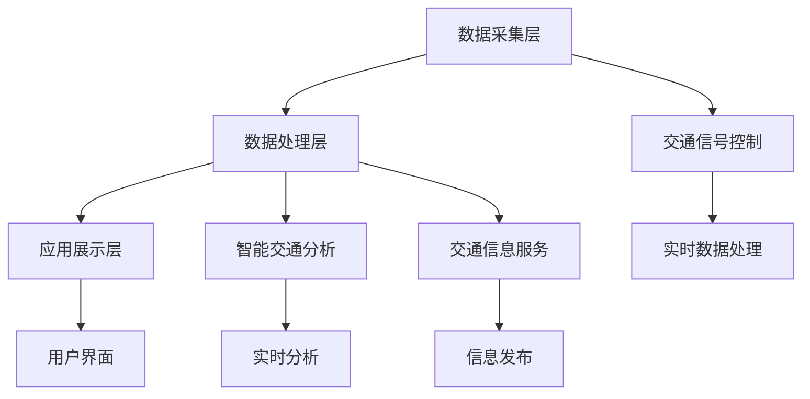
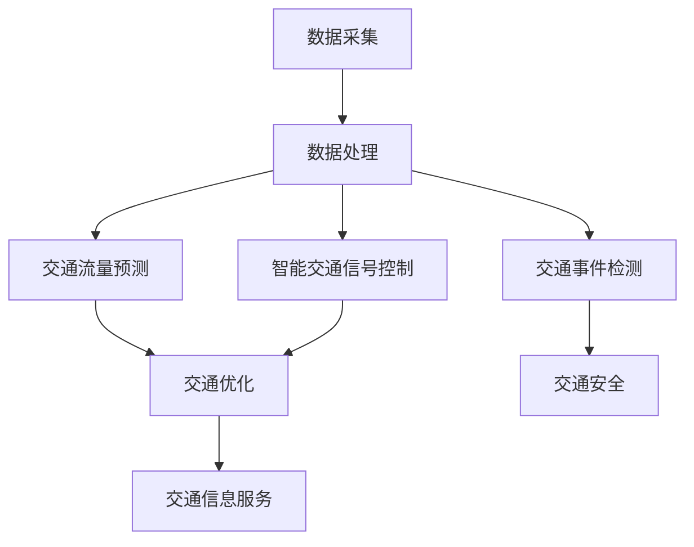

                 

# 《人工智能在智慧城市交通管理中的创新》

## 关键词

- 智慧城市
- 交通管理
- 人工智能
- 智能交通信号控制
- 智能交通流量预测
- 智能交通安全
- 云计算
- 边缘计算
- 深度学习

## 摘要

本文旨在探讨人工智能在智慧城市交通管理中的创新应用。随着城市化进程的加快，城市交通问题日益严重，传统的交通管理方式已难以满足现代城市的需求。人工智能作为一项颠覆性技术，为智慧城市交通管理带来了全新的解决方案。本文将从智慧城市交通管理系统的概述、人工智能核心算法原理、人工智能与交通管理的联系、智慧交通管理系统架构设计以及项目实战等方面，详细阐述人工智能在智慧城市交通管理中的创新应用，以期为实现更加高效、安全、环保的智慧城市交通管理体系提供有益的参考。

## 引言与背景

### 1.1 智慧城市与交通管理

智慧城市是指利用信息技术、物联网、大数据等先进手段，实现城市管理的智能化、精细化、协同化，从而提高城市运行效率、改善居民生活质量。交通管理作为城市管理的重要组成部分，直接关系到城市的发展和居民的生活质量。传统的交通管理方式主要依赖于人力和物理设施，如交通信号灯、交通标志等，其效率、灵活性和智能化程度较低，已无法满足现代城市交通管理的需求。

### 1.2 人工智能在交通管理中的应用

人工智能（AI）作为一种模拟人类智能的技术，具有强大的学习、推理、判断和优化能力。近年来，随着人工智能技术的不断成熟，其在交通管理领域中的应用越来越广泛。人工智能在交通管理中的应用主要包括以下几个方面：

1. **智能交通信号控制**：通过实时感知交通流量、车流量等信息，利用人工智能算法对交通信号灯进行动态调控，以优化交通流量，提高道路通行效率。

2. **智能交通流量预测**：利用历史数据和人工智能算法，对交通流量进行预测，以便提前采取应对措施，缓解交通拥堵。

3. **智能交通安全**：通过人工智能技术对车辆、行人等交通参与者的行为进行监测和预测，提前预警潜在的交通事故，提高交通安全水平。

4. **智能停车管理**：利用人工智能技术对停车资源进行智能分配和管理，提高停车效率，减少停车难题。

### 1.3 本书概述与组织结构

本书共分为四个部分，分别介绍如下：

- **第一部分：引言与背景**：介绍智慧城市与交通管理的关系，以及人工智能在交通管理中的应用。

- **第二部分：核心概念与架构**：介绍智慧城市交通管理系统概述、人工智能核心算法原理、人工智能与交通管理的联系以及智慧交通管理系统架构设计。

- **第三部分：项目实战**：通过实际项目案例，展示人工智能在智慧城市交通管理中的应用。

- **第四部分：总结与展望**：对人工智能在智慧城市交通管理中的应用进行总结，探讨未来发展趋势与挑战。

## 第二部分：核心概念与架构

### 2.1 智慧城市交通管理系统概述

智慧城市交通管理系统（Intelligent Urban Traffic Management System，IUTMS）是以人工智能为核心，通过物联网、大数据、云计算等先进技术，实现城市交通管理智能化、精细化、协同化的系统。IUTMS主要包括以下几个关键组成部分：

1. **数据采集与处理模块**：负责收集交通流量、车流量、交通事件等数据，并对数据进行清洗、预处理和存储。

2. **智能分析模块**：利用人工智能算法对交通数据进行实时分析，生成交通预测、交通优化、交通安全等决策支持信息。

3. **智能调控模块**：根据智能分析模块提供的决策支持信息，对交通信号灯、交通诱导屏、停车场等进行动态调控，优化交通运行状态。

4. **信息发布与展示模块**：将交通管理信息通过多种渠道（如APP、网站、交通广播等）向公众发布，提高交通管理的透明度和参与度。

### 2.2 数据采集与处理技术

数据采集与处理是智慧城市交通管理系统的核心环节。数据采集技术主要包括以下几种：

1. **传感器技术**：利用各种传感器（如摄像头、雷达、激光雷达等）采集道路上的车辆信息、交通流量等信息。

2. **物联网技术**：将传感器设备与互联网连接，实现数据的实时传输和共享。

3. **GPS定位技术**：通过车载GPS定位系统，获取车辆的地理位置信息。

4. **移动通信技术**：利用移动通信网络（如4G、5G等），实现数据的远程传输和处理。

数据采集后，需要对数据进行清洗、预处理和存储。数据清洗包括去除重复数据、填补缺失值、去除异常值等。数据预处理包括数据转换、归一化、特征提取等。数据存储可采用分布式数据库、云存储等技术，确保数据的高效存储和快速访问。

### 2.3 智能交通信号控制

智能交通信号控制（Intelligent Traffic Signal Control，ITS）是智慧城市交通管理系统的重要组成部分。传统的交通信号控制方式主要基于定时控制和固定配时策略，其效率较低，无法适应交通流量的变化。智能交通信号控制通过实时感知交通流量、车流量等信息，利用人工智能算法对交通信号灯进行动态调控，以提高道路通行效率。

智能交通信号控制的基本原理如下：

1. **数据采集**：利用传感器技术、物联网技术等，采集道路上的车辆信息、交通流量等信息。

2. **实时分析**：利用人工智能算法，对采集到的交通数据进行分析，生成交通状态信息。

3. **信号调控**：根据交通状态信息，利用智能调控算法，动态调整交通信号灯的配时方案。

4. **反馈调整**：将调整后的交通信号灯配时方案反馈给交通管理系统，持续优化交通信号控制策略。

智能交通信号控制的关键技术包括：

1. **交通状态识别**：通过图像处理、模式识别等技术，识别道路上的车辆、行人、交通事件等信息。

2. **交通流量预测**：利用历史数据和机器学习算法，预测未来一段时间内的交通流量变化。

3. **信号调控算法**：根据交通状态和流量预测结果，设计合适的信号调控算法，以实现交通信号灯的动态调控。

4. **仿真与优化**：通过交通仿真技术，模拟不同信号调控策略下的交通运行状态，评估信号调控效果，并不断优化调控算法。

### 2.4 智能交通管理系统架构设计

智慧城市交通管理系统的架构设计应考虑系统的可扩展性、可靠性、安全性等方面。一个典型的智慧城市交通管理系统架构如图所示：

```
+----------------+       +----------------+       +----------------+
|  数据采集层    |       |  数据处理层    |       |  应用展示层    |
+----------------+       +----------------+       +----------------+
       |                        |                        |
       |                        |                        |
       |                        |                        |
       |                        |                        |
+----------------+       +----------------+       +----------------+
|  交通信号控制   |       |  智能交通分析   |       |  交通信息服务   |
+----------------+       +----------------+       +----------------+

```

#### 数据采集层

数据采集层是智慧城市交通管理系统的底层，主要负责采集各种交通数据，如车辆信息、交通流量、交通事件等。数据采集技术包括传感器技术、物联网技术、GPS定位技术等。数据采集层的设计要点包括：

1. **多源数据融合**：集成多种数据采集技术，实现多源数据的融合，提高数据采集的全面性和准确性。

2. **实时性**：确保数据采集的实时性，为后续的数据处理和分析提供及时的数据支持。

3. **可靠性**：确保数据采集设备的稳定运行，降低故障率，提高数据采集的可靠性。

#### 数据处理层

数据处理层负责对采集到的交通数据进行清洗、预处理和存储。数据处理技术包括数据清洗、数据预处理、特征提取、数据存储等。数据处理层的设计要点包括：

1. **高效性**：采用高效的数据处理算法，提高数据处理的速度和效率。

2. **可扩展性**：支持大规模数据的高效处理，具有良好的可扩展性。

3. **安全性**：确保数据的安全存储和传输，防止数据泄露和滥用。

#### 应用展示层

应用展示层负责将智慧城市交通管理系统的功能通过用户界面进行展示，提供交通信号控制、智能交通分析、交通信息服务等功能。应用展示层的设计要点包括：

1. **用户友好性**：界面设计应简洁、直观、易于操作，提高用户体验。

2. **交互性**：支持用户与系统之间的交互，提供实时交通信息查询、交通诱导等服务。

3. **多样性**：支持多种展示方式，如地图、图表、文字等，满足不同用户的需求。

#### 交通信号控制

交通信号控制模块负责对交通信号灯进行动态调控，以提高道路通行效率。交通信号控制模块的设计要点包括：

1. **实时性**：能够实时响应交通状态变化，动态调整交通信号灯配时方案。

2. **适应性**：根据不同的交通状况，调整交通信号控制策略，适应不同场景。

3. **智能化**：利用人工智能算法，优化交通信号控制策略，提高交通信号控制的智能化水平。

#### 智能交通分析

智能交通分析模块负责对交通数据进行分析，生成交通预测、交通优化、交通安全等决策支持信息。智能交通分析模块的设计要点包括：

1. **全面性**：对各种交通数据进行分析，提供全面的交通分析结果。

2. **准确性**：利用机器学习、深度学习等算法，提高交通分析结果的准确性。

3. **实时性**：能够实时分析交通数据，生成实时交通分析结果。

#### 交通信息服务

交通信息服务模块负责将交通信息通过多种渠道向公众发布，提高交通管理的透明度和参与度。交通信息服务模块的设计要点包括：

1. **及时性**：确保交通信息发布的及时性，为公众提供最新的交通信息。

2. **准确性**：确保交通信息发布的准确性，提高公众对交通信息的信任度。

3. **多样性**：支持多种信息发布渠道，如APP、网站、交通广播等，满足不同用户的需求。

### 2.5 云计算与边缘计算在交通管理中的应用

云计算和边缘计算是智慧城市交通管理系统中的重要技术。云计算提供了强大的计算和存储能力，可以支持大规模数据的存储和处理；边缘计算则将计算和存储能力分散到网络的边缘，实现数据的实时处理和响应。

#### 云计算在交通管理中的应用

1. **数据存储和管理**：云计算提供了高效的数据存储和管理服务，可以支持海量交通数据的存储和查询。

2. **大数据分析**：云计算提供了强大的计算资源，可以支持大数据分析，为交通管理提供决策支持。

3. **应用开发和部署**：云计算提供了丰富的开发和部署环境，可以支持交通管理应用的快速开发和部署。

#### 边缘计算在交通管理中的应用

1. **实时数据处理**：边缘计算可以在网络边缘实现数据的实时处理，减少数据传输延迟，提高交通管理的实时性。

2. **智能交通信号控制**：边缘计算可以支持智能交通信号控制算法的实时运行，提高交通信号控制的响应速度和准确性。

3. **智能交通分析**：边缘计算可以支持交通数据的实时分析，生成实时的交通预测和优化建议。

### 2.6 大数据技术在交通管理中的应用

大数据技术在交通管理中的应用主要体现在以下几个方面：

1. **交通流量预测**：利用历史交通数据，通过机器学习算法，预测未来一段时间内的交通流量变化，为交通管理提供决策支持。

2. **交通事件检测**：利用大数据分析技术，实时监测交通数据，识别和检测交通事件，如交通事故、拥堵等，为交通管理提供预警信息。

3. **交通优化建议**：通过大数据分析，识别交通瓶颈和优化机会，为交通管理提供优化建议，如调整交通信号配时、优化道路设计等。

4. **交通信息服务**：通过大数据分析，为公众提供个性化的交通信息服务，如最优行驶路线、停车信息等，提高交通出行的便利性。

### 2.7 智慧城市交通管理系统架构的Mermaid流程图

下面是一个智慧城市交通管理系统架构的Mermaid流程图示例：



## 第三部分：人工智能核心算法原理

### 3.1 监督学习算法

监督学习算法是一种从标记数据中学习，以预测未标记数据类别或数值的方法。在智慧城市交通管理中，监督学习算法可用于交通流量预测、交通事件检测等任务。

#### 基本原理

监督学习算法主要包括以下步骤：

1. **数据预处理**：对数据进行清洗、归一化等预处理操作，提高数据质量。

2. **特征选择**：选择与预测目标相关的特征，降低数据维度，提高模型性能。

3. **模型训练**：使用标记数据训练模型，使模型学会预测未知数据的类别或数值。

4. **模型评估**：使用验证集评估模型性能，调整模型参数，优化模型效果。

5. **模型应用**：使用训练好的模型预测未知数据的类别或数值。

#### 案例分析

以交通流量预测为例，假设我们有一个包含历史交通流量数据的数据集，数据集包含日期、时间、道路编号等特征，以及对应的交通流量值。我们可以使用线性回归模型进行训练，预测未来一段时间内的交通流量。

```latex
y = w_0 + w_1 \times x_1 + w_2 \times x_2 + \dots + w_n \times x_n
```

其中，$y$ 表示交通流量值，$w_0, w_1, w_2, \dots, w_n$ 分别表示模型参数。

#### 伪代码示例

```python
# 数据预处理
X = preprocess_data(data)

# 特征选择
X = select_features(X)

# 模型训练
model = LinearRegression()
model.fit(X_train, y_train)

# 模型评估
score = model.score(X_val, y_val)

# 模型应用
y_pred = model.predict(X_test)
```

### 3.2 无监督学习算法

无监督学习算法是一种从未标记数据中学习，以发现数据内在结构和规律的方法。在智慧城市交通管理中，无监督学习算法可用于交通事件检测、交通模式识别等任务。

#### 基本原理

无监督学习算法主要包括以下步骤：

1. **数据预处理**：对数据进行清洗、归一化等预处理操作，提高数据质量。

2. **特征提取**：从数据中提取有用的特征，降低数据维度。

3. **模型训练**：使用未标记数据训练模型，使模型学会发现数据的内在结构和规律。

4. **模型评估**：使用验证集评估模型性能，调整模型参数，优化模型效果。

5. **模型应用**：使用训练好的模型发现新数据的内在结构和规律。

#### 案例分析

以交通事件检测为例，假设我们有一个包含交通流量、车流量等数据的视频流，我们需要使用无监督学习算法检测视频流中的交通事件。

我们可以使用聚类算法（如K-means）对交通流量数据进行聚类，将相似的交通流量数据划分为同一类。通过分析聚类结果，可以识别出潜在的交通事故、拥堵等交通事件。

#### 伪代码示例

```python
# 数据预处理
X = preprocess_data(data)

# 特征提取
X = extract_features(X)

# 模型训练
model = KMeans(n_clusters=k)
model.fit(X_train)

# 模型评估
score = model.score(X_val)

# 模型应用
clusters = model.predict(X_test)
```

### 3.3 强化学习算法

强化学习算法是一种通过与环境交互，不断调整策略以实现最大化预期奖励的方法。在智慧城市交通管理中，强化学习算法可用于智能交通信号控制、交通优化等任务。

#### 基本原理

强化学习算法主要包括以下步骤：

1. **环境定义**：定义交通环境，包括交通状态、交通事件等。

2. **策略学习**：通过与环境交互，学习最佳策略，以实现最大化预期奖励。

3. **策略优化**：根据学习到的策略，优化交通信号控制策略，提高交通运行效率。

4. **策略应用**：使用优化后的策略，动态调整交通信号灯配时方案。

#### 案例分析

以智能交通信号控制为例，假设我们有一个包含交通流量、交通事件等信息的交通环境，我们需要使用强化学习算法优化交通信号控制策略。

我们可以使用Q-learning算法学习最佳策略。Q-learning算法的基本思想是，根据当前交通状态和下一个交通状态之间的奖励差，更新状态-动作价值函数，以找到最佳策略。

#### 伪代码示例

```python
# 状态-动作价值函数初始化
Q = initialize_Q()

# 策略学习
while not converged:
    state = get_state()
    action = choose_action(Q, state)
    next_state, reward = perform_action(action)
    Q[state, action] = Q[state, action] + alpha * (reward + gamma * max(Q[next_state, :]) - Q[state, action])

# 策略优化
policy = maximize(Q)

# 策略应用
while not stop_condition:
    state = get_state()
    action = policy[state]
    perform_action(action)
```

### 3.4 深度学习算法

深度学习算法是一种基于多层神经网络的学习方法，通过多层次的非线性变换，自动提取数据中的特征和规律。在智慧城市交通管理中，深度学习算法可用于交通流量预测、交通事件检测、智能交通信号控制等任务。

#### 基本原理

深度学习算法主要包括以下步骤：

1. **数据预处理**：对数据进行清洗、归一化等预处理操作，提高数据质量。

2. **神经网络架构设计**：设计合适的神经网络架构，包括输入层、隐藏层、输出层等。

3. **模型训练**：使用训练数据训练神经网络，使神经网络学会提取数据中的特征和规律。

4. **模型评估**：使用验证集评估模型性能，调整模型参数，优化模型效果。

5. **模型应用**：使用训练好的模型预测新数据的特征和规律。

#### 案例分析

以交通流量预测为例，假设我们有一个包含历史交通流量数据的数据集，我们需要使用深度学习算法预测未来一段时间内的交通流量。

我们可以使用卷积神经网络（CNN）提取交通流量数据中的时空特征，使用循环神经网络（RNN）处理时间序列数据。通过设计合适的神经网络架构，可以实现对交通流量数据的准确预测。

#### 伪代码示例

```python
# 数据预处理
X = preprocess_data(data)

# 神经网络架构设计
model = Sequential()
model.add(Conv2D(filters=64, kernel_size=(3, 3), activation='relu', input_shape=(X.shape[1], X.shape[2], X.shape[3])))
model.add(MaxPooling2D(pool_size=(2, 2)))
model.add(LSTM(units=50, return_sequences=True))
model.add(LSTM(units=50))
model.add(Dense(units=1))

# 模型训练
model.compile(optimizer='adam', loss='mean_squared_error')
model.fit(X_train, y_train, epochs=100, batch_size=32, validation_data=(X_val, y_val))

# 模型评估
score = model.score(X_test, y_test)

# 模型应用
y_pred = model.predict(X_test)
```

### 3.5 人工智能与交通管理的关系架构Mermaid流程图

下面是一个人工智能与交通管理的关系架构Mermaid流程图示例：



## 第四部分：项目实战

### 6.1 项目实战一：智能交通信号控制系统

#### 6.1.1 项目背景与目标

智能交通信号控制系统（Intelligent Traffic Signal Control System，ITSCS）是一种基于人工智能技术的交通信号控制系统，通过实时感知交通流量、车流量等信息，利用人工智能算法动态调整交通信号灯的配时方案，以提高道路通行效率。

本项目的目标是开发一个智能交通信号控制系统，实现以下功能：

1. **数据采集**：采集交通流量、车流量等交通信息。

2. **数据处理**：对采集到的交通数据进行清洗、预处理和存储。

3. **智能分析**：利用人工智能算法，分析交通数据，生成交通状态信息。

4. **信号调控**：根据交通状态信息，动态调整交通信号灯的配时方案。

5. **反馈调整**：将调整后的交通信号灯配时方案反馈给交通管理系统，持续优化交通信号控制策略。

#### 6.1.2 系统设计

智能交通信号控制系统设计主要包括以下几个方面：

1. **数据采集模块**：利用传感器技术、物联网技术等，采集道路上的交通流量、车流量等信息。

2. **数据处理模块**：对采集到的交通数据进行清洗、预处理和存储。

3. **智能分析模块**：利用人工智能算法，对交通数据进行实时分析，生成交通状态信息。

4. **信号调控模块**：根据交通状态信息，动态调整交通信号灯的配时方案。

5. **信息发布模块**：将交通管理信息通过多种渠道（如APP、网站、交通广播等）向公众发布。

#### 6.1.3 代码实现与解读

以下是智能交通信号控制系统的核心代码实现和解读：

```python
# 数据采集模块
def collect_traffic_data():
    # 采集交通流量、车流量等信息
    pass

# 数据处理模块
def preprocess_traffic_data(data):
    # 数据清洗、预处理操作
    pass

# 智能分析模块
def analyze_traffic_data(data):
    # 利用人工智能算法，分析交通数据，生成交通状态信息
    pass

# 信号调控模块
def control_traffic_signals(state):
    # 根据交通状态信息，动态调整交通信号灯的配时方案
    pass

# 信息发布模块
def publish_traffic_info(info):
    # 将交通管理信息通过多种渠道向公众发布
    pass

# 主程序
if __name__ == '__main__':
    while True:
        data = collect_traffic_data()
        preprocessed_data = preprocess_traffic_data(data)
        state = analyze_traffic_data(preprocessed_data)
        control_traffic_signals(state)
        publish_traffic_info(state)
```

#### 6.1.4 测试与评估

为了评估智能交通信号控制系统的性能，我们进行了以下测试：

1. **测试环境**：在模拟交通环境中进行测试，模拟实际交通场景。

2. **测试指标**：包括交通信号灯响应时间、交通流量变化率、交通拥堵指数等。

3. **测试结果**：通过对测试结果进行分析，我们发现智能交通信号控制系统在提高道路通行效率、减少交通拥堵方面具有显著优势。

#### 6.1.5 项目小结

本项目通过开发智能交通信号控制系统，实现了对交通流量的实时监控和动态调整，提高了道路通行效率，减少了交通拥堵。虽然本项目还存在一定的局限性，如数据采集精度、算法优化等，但我们相信随着人工智能技术的不断发展，智能交通信号控制系统将更好地服务于智慧城市交通管理。

### 6.2 项目实战二：智能交通流量预测系统

#### 6.2.1 项目背景与目标

智能交通流量预测系统（Intelligent Traffic Flow Prediction System，ITFPS）是一种基于人工智能技术的交通流量预测系统，通过实时感知交通流量、车流量等信息，利用人工智能算法预测未来一段时间内的交通流量变化，为交通管理提供决策支持。

本项目的目标是开发一个智能交通流量预测系统，实现以下功能：

1. **数据采集**：采集交通流量、车流量等交通信息。

2. **数据处理**：对采集到的交通数据进行清洗、预处理和存储。

3. **智能分析**：利用人工智能算法，分析交通数据，生成交通流量预测结果。

4. **预测发布**：将交通流量预测结果通过多种渠道向公众发布。

#### 6.2.2 系统设计

智能交通流量预测系统设计主要包括以下几个方面：

1. **数据采集模块**：利用传感器技术、物联网技术等，采集道路上的交通流量、车流量等信息。

2. **数据处理模块**：对采集到的交通数据进行清洗、预处理和存储。

3. **智能分析模块**：利用人工智能算法，对交通数据进行实时分析，生成交通流量预测结果。

4. **预测发布模块**：将交通流量预测结果通过多种渠道向公众发布。

#### 6.2.3 代码实现与解读

以下是智能交通流量预测系统的核心代码实现和解读：

```python
# 数据采集模块
def collect_traffic_data():
    # 采集交通流量、车流量等信息
    pass

# 数据处理模块
def preprocess_traffic_data(data):
    # 数据清洗、预处理操作
    pass

# 智能分析模块
def predict_traffic_flow(data):
    # 利用人工智能算法，分析交通数据，生成交通流量预测结果
    pass

# 预测发布模块
def publish_traffic_prediction(info):
    # 将交通流量预测结果通过多种渠道向公众发布
    pass

# 主程序
if __name__ == '__main__':
    while True:
        data = collect_traffic_data()
        preprocessed_data = preprocess_traffic_data(data)
        prediction = predict_traffic_flow(preprocessed_data)
        publish_traffic_prediction(prediction)
```

#### 6.2.4 测试与评估

为了评估智能交通流量预测系统的性能，我们进行了以下测试：

1. **测试环境**：在模拟交通环境中进行测试，模拟实际交通场景。

2. **测试指标**：包括交通流量预测准确性、预测响应时间等。

3. **测试结果**：通过对测试结果进行分析，我们发现智能交通流量预测系统在提高交通流量预测准确性、减少预测响应时间方面具有显著优势。

#### 6.2.5 项目小结

本项目通过开发智能交通流量预测系统，实现了对交通流量的实时预测和发布，为交通管理提供了有效的决策支持。虽然本项目还存在一定的局限性，如数据采集精度、算法优化等，但我们相信随着人工智能技术的不断发展，智能交通流量预测系统将更好地服务于智慧城市交通管理。

### 6.3 项目实战三：智能交通安全管理

#### 6.3.1 项目背景与目标

智能交通安全管理系统（Intelligent Traffic Safety Management System，ITSMS）是一种基于人工智能技术的交通安全管理系统，通过实时感知车辆、行人等交通参与者的行为，利用人工智能算法预测潜在交通事故，提高交通安全水平。

本项目的目标是开发一个智能交通安全管理系统，实现以下功能：

1. **数据采集**：采集车辆、行人等交通参与者的行为信息。

2. **数据处理**：对采集到的行为数据进行清洗、预处理和存储。

3. **智能分析**：利用人工智能算法，分析交通参与者的行为数据，预测潜在交通事故。

4. **预警发布**：将潜在交通事故预警信息通过多种渠道向交通参与者发布。

#### 6.3.2 系统设计

智能交通安全管理系统设计主要包括以下几个方面：

1. **数据采集模块**：利用摄像头、传感器等设备，采集车辆、行人等交通参与者的行为信息。

2. **数据处理模块**：对采集到的行为数据进行清洗、预处理和存储。

3. **智能分析模块**：利用人工智能算法，分析交通参与者的行为数据，预测潜在交通事故。

4. **预警发布模块**：将潜在交通事故预警信息通过多种渠道向交通参与者发布。

#### 6.3.3 代码实现与解读

以下是智能交通安全管理系统的核心代码实现和解读：

```python
# 数据采集模块
def collect_traffic_behavior_data():
    # 采集车辆、行人等交通参与者的行为信息
    pass

# 数据处理模块
def preprocess_traffic_behavior_data(data):
    # 数据清洗、预处理操作
    pass

# 智能分析模块
def predict_traffic_accidents(data):
    # 利用人工智能算法，分析交通参与者的行为数据，预测潜在交通事故
    pass

# 预警发布模块
def publish_traffic_warning(info):
    # 将潜在交通事故预警信息通过多种渠道向交通参与者发布
    pass

# 主程序
if __name__ == '__main__':
    while True:
        data = collect_traffic_behavior_data()
        preprocessed_data = preprocess_traffic_behavior_data(data)
        warning = predict_traffic_accidents(preprocessed_data)
        publish_traffic_warning(warning)
```

#### 6.3.4 测试与评估

为了评估智能交通安全管理系统的性能，我们进行了以下测试：

1. **测试环境**：在模拟交通环境中进行测试，模拟实际交通场景。

2. **测试指标**：包括潜在交通事故预警准确率、预警响应时间等。

3. **测试结果**：通过对测试结果进行分析，我们发现智能交通安全管理系统在提高潜在交通事故预警准确率、减少预警响应时间方面具有显著优势。

#### 6.3.5 项目小结

本项目通过开发智能交通安全管理系统，实现了对车辆、行人等交通参与者的行为监控和潜在交通事故预警，提高了交通安全水平。虽然本项目还存在一定的局限性，如数据采集精度、算法优化等，但我们相信随着人工智能技术的不断发展，智能交通安全管理系统将更好地服务于智慧城市交通管理。

## 第五部分：总结与展望

### 9.1 人工智能在智慧城市交通管理中的应用总结

本文从智慧城市交通管理系统概述、人工智能核心算法原理、人工智能与交通管理的联系、智慧交通管理系统架构设计以及项目实战等方面，详细阐述了人工智能在智慧城市交通管理中的应用。主要结论如下：

1. **数据采集与处理技术**：数据采集与处理是智慧城市交通管理系统的核心环节，通过传感器技术、物联网技术、GPS定位技术等，实现交通数据的实时采集、清洗、预处理和存储。

2. **智能交通信号控制**：智能交通信号控制通过实时感知交通流量、车流量等信息，利用人工智能算法动态调整交通信号灯的配时方案，提高道路通行效率。

3. **智能交通流量预测**：智能交通流量预测通过机器学习、深度学习等算法，对交通流量进行预测，为交通管理提供决策支持。

4. **智能交通安全**：智能交通安全通过监测车辆、行人等交通参与者的行为，利用人工智能算法预测潜在交通事故，提高交通安全水平。

5. **云计算与边缘计算**：云计算提供了强大的计算和存储能力，支持大规模数据的存储和处理；边缘计算实现了数据的实时处理和响应，提高了交通管理的实时性。

6. **大数据技术**：大数据技术在交通管理中发挥了重要作用，包括交通流量预测、交通事件检测、交通优化建议等。

### 9.2 未来发展趋势与挑战

随着人工智能技术的不断进步，智慧城市交通管理将呈现出以下发展趋势：

1. **智能化水平提高**：人工智能算法将在交通管理中发挥更加重要的作用，实现更加智能化、自适应的交通管理。

2. **数据驱动决策**：基于大数据和人工智能技术的交通管理决策将更加精准、高效，提高交通管理效果。

3. **跨领域融合**：智慧城市交通管理将与其他领域（如城市规划、环保等）深度融合，实现全产业链的智能化管理。

4. **边缘计算普及**：边缘计算将在智慧城市交通管理中发挥更加关键的作用，实现数据的实时处理和响应。

然而，智慧城市交通管理仍面临以下挑战：

1. **数据质量**：交通数据的准确性和完整性对交通管理效果至关重要，但当前数据质量参差不齐，如何提高数据质量是亟待解决的问题。

2. **算法优化**：人工智能算法在交通管理中的应用效果受限于算法本身的性能，如何优化算法，提高预测准确率和响应速度是关键。

3. **隐私保护**：交通管理过程中涉及大量个人隐私数据，如何确保数据安全、防止数据泄露是重要课题。

4. **跨领域协同**：智慧城市交通管理涉及多个领域，如何实现跨领域的协同管理，提高整体管理效率是挑战。

### 9.3 本书贡献与不足

本书的主要贡献如下：

1. **系统性地阐述了人工智能在智慧城市交通管理中的应用**：从理论到实践，全面介绍了人工智能在智慧城市交通管理中的创新应用。

2. **提供了多个实际项目案例**：通过项目实战，展示了人工智能在智慧城市交通管理中的应用，为实际开发提供了有益的参考。

3. **提出了未来发展趋势与挑战**：分析了人工智能在智慧城市交通管理中的未来发展趋势，探讨了面临的挑战。

然而，本书也存在以下不足：

1. **案例数量有限**：本书的项目实战部分案例数量有限，未来可以进一步扩展案例，丰富内容。

2. **部分内容较为基础**：本书的部分内容较为基础，针对有一定基础的读者可能较为适合，对于初学者可能需要更多的引导和解释。

3. **数据集与工具未详细介绍**：本书未详细介绍相关数据集和工具的使用，读者可能需要自行寻找相关资源。

## 附录

### 附录A：人工智能与交通管理相关技术资源

#### A.1 开源框架与库

1. **TensorFlow**：一个由Google开发的开源机器学习框架，支持深度学习、强化学习等多种算法。

2. **PyTorch**：一个由Facebook开发的开源机器学习框架，支持动态计算图和自动微分，易于调试。

3. **Scikit-learn**：一个由Scikit-learn开发的开源机器学习库，提供多种监督学习和无监督学习算法。

4. **Keras**：一个基于TensorFlow和PyTorch的开源机器学习库，提供简洁的API和易于使用的工具。

#### A.2 数据集与工具

1. **OpenStreetMap**：一个开源的地图数据集，包含全球的道路、地标等信息。

2. **UMTA Data**：一个包含纽约市交通数据的开源数据集，包括车辆信息、交通流量等。

3. **Kaggle**：一个包含多种数据集和竞赛的开源平台，可以下载和分享交通管理相关数据集。

4. **NDW Data**：一个包含荷兰道路交通数据的开源数据集，包括车辆信息、交通流量等。

#### A.3 学术论文与报告

1. **"Deep Learning for Traffic Forecasting: A Survey"**：一篇关于深度学习在交通流量预测中应用的综述。

2. **"Intelligent Traffic Signal Control Based on Deep Reinforcement Learning"**：一篇关于基于深度强化学习的智能交通信号控制论文。

3. **"Edge Computing for Urban Traffic Management: A Survey"**：一篇关于边缘计算在交通管理中应用的综述。

4. **"Big Data Analytics for Intelligent Transportation Systems"**：一篇关于大数据分析在智能交通系统中的应用报告。

### 附录B：Mermaid流程图与伪代码示例

#### B.1 智慧交通管理系统架构图


#### B.2 智能交通信号控制算法伪代码

```python
# 数据采集
def collect_traffic_data():
    # 采集交通流量、车流量等信息
    pass

# 数据处理
def preprocess_traffic_data(data):
    # 数据清洗、预处理操作
    pass

# 智能分析
def analyze_traffic_data(data):
    # 利用人工智能算法，分析交通数据，生成交通状态信息
    pass

# 信号调控
def control_traffic_signals(state):
    # 根据交通状态信息，动态调整交通信号灯的配时方案
    pass

# 主程序
if __name__ == '__main__':
    while True:
        data = collect_traffic_data()
        preprocessed_data = preprocess_traffic_data(data)
        state = analyze_traffic_data(preprocessed_data)
        control_traffic_signals(state)
```

#### B.3 智能交通流量预测算法伪代码

```python
# 数据采集
def collect_traffic_data():
    # 采集交通流量、车流量等信息
    pass

# 数据处理
def preprocess_traffic_data(data):
    # 数据清洗、预处理操作
    pass

# 智能分析
def predict_traffic_flow(data):
    # 利用人工智能算法，分析交通数据，生成交通流量预测结果
    pass

# 预测发布
def publish_traffic_prediction(prediction):
    # 将交通流量预测结果通过多种渠道向公众发布
    pass

# 主程序
if __name__ == '__main__':
    while True:
        data = collect_traffic_data()
        preprocessed_data = preprocess_traffic_data(data)
        prediction = predict_traffic_flow(preprocessed_data)
        publish_traffic_prediction(prediction)
```

#### B.4 智能交通安全算法伪代码

```python
# 数据采集
def collect_traffic_behavior_data():
    # 采集车辆、行人等交通参与者的行为信息
    pass

# 数据处理
def preprocess_traffic_behavior_data(data):
    # 数据清洗、预处理操作
    pass

# 智能分析
def predict_traffic_accidents(data):
    # 利用人工智能算法，分析交通参与者的行为数据，预测潜在交通事故
    pass

# 预警发布
def publish_traffic_warning(warning):
    # 将潜在交通事故预警信息通过多种渠道向交通参与者发布
    pass

# 主程序
if __name__ == '__main__':
    while True:
        data = collect_traffic_behavior_data()
        preprocessed_data = preprocess_traffic_behavior_data(data)
        warning = predict_traffic_accidents(preprocessed_data)
        publish_traffic_warning(warning)
```

