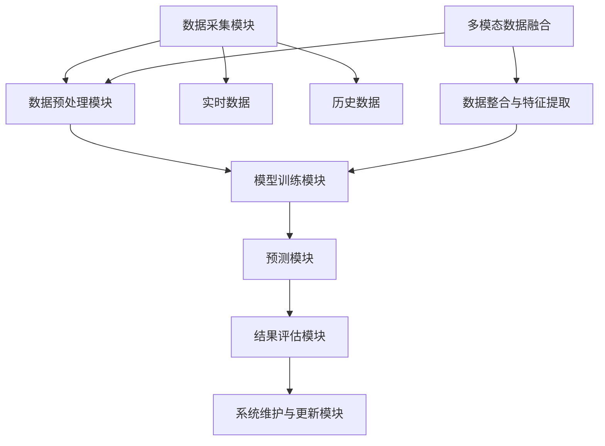
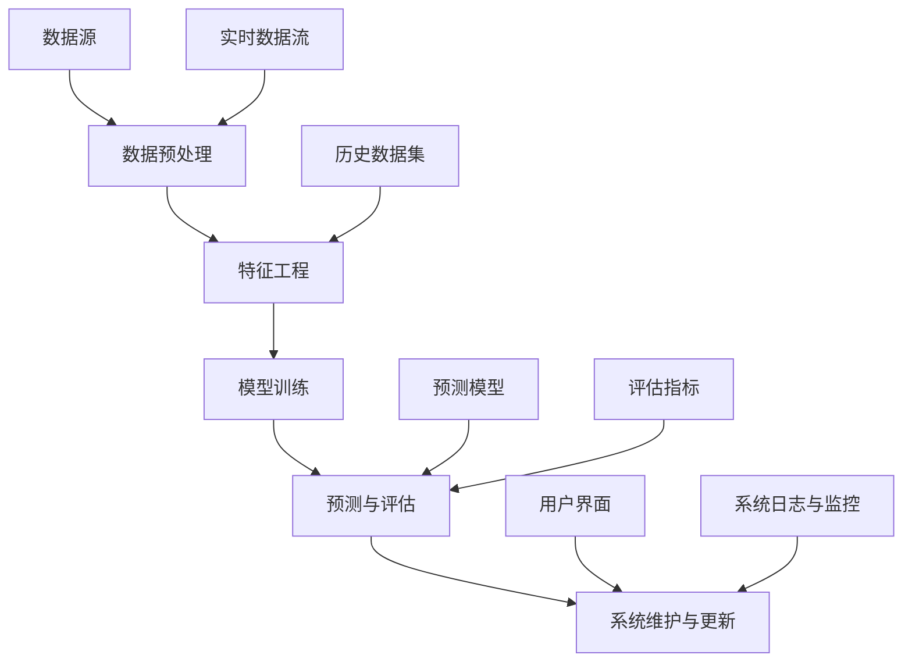

                 

### 文章标题

# 《人工智能在智能交通流量预测中的应用》

### 关键词

- **智能交通**
- **人工智能**
- **交通流量预测**
- **机器学习**
- **深度学习**
- **混合模型**
- **系统部署**

### 摘要

本文旨在探讨人工智能在智能交通流量预测中的应用。首先，文章介绍了智能交通系统与人工智能的基本概念和现状。接着，详细阐述了智能交通流量预测的核心概念、数据源与预处理方法、以及预测系统的体系结构。随后，文章重点介绍了传统机器学习算法和深度学习算法在交通流量预测中的应用，包括线性回归、支持向量机、随机森林、卷积神经网络、循环神经网络以及长短时记忆网络等。此外，文章还讨论了多模型融合方法和优化算法在交通流量预测中的应用，以及智能交通流量预测系统的实现与部署过程。最后，通过两个实际案例分析了人工智能在交通流量预测中的应用效果，并对未来的发展方向和挑战进行了展望。本文旨在为读者提供一个系统性的学习和参考框架，帮助理解人工智能在智能交通流量预测中的重要性和应用价值。

## 第一部分：智能交通与人工智能概述

### 第1章：智能交通与人工智能概述

#### 1.1 智能交通系统简介

智能交通系统（Intelligent Transportation System, ITS）是指利用先进的信息通信技术、控制技术、电子技术和计算机技术，实现交通运输系统各部分的协调与优化，以提高交通效率、减少交通事故、降低环境污染的一种综合交通管理体系。智能交通系统的核心目标是通过实时交通信息的收集、处理和发布，对交通流量进行动态调控，优化交通运行状态，提高交通系统的整体效能。

**智能交通系统的定义与目标**

智能交通系统可以定义为一种集成化的交通管理系统，它利用现代信息技术，将交通信息、控制设备、车辆和驾驶员等交通要素有机结合起来，实现交通信息的实时采集、处理和发布，从而对交通运行状态进行动态调控。其主要目标包括：

1. **提高交通效率**：通过实时交通信息的收集和发布，优化交通流量的分配，减少拥堵，提高道路通行能力。
2. **降低事故发生率**：通过实时监测和预警系统，提前发现和预防交通事故，降低交通事故的发生率。
3. **减少环境污染**：通过智能交通系统，合理引导车辆行驶路线，减少尾气排放，降低环境污染。
4. **提升出行体验**：为驾驶员提供实时、准确的交通信息，优化出行路线和时间，提升出行体验。

**智能交通系统的发展历程**

智能交通系统的发展可以追溯到20世纪50年代，最初主要是一些理论研究和小规模实验。随着计算机技术和通信技术的发展，智能交通系统逐渐从理论研究走向实际应用。以下是智能交通系统的发展历程：

1. **初步探索阶段（1950-1970年代）**：这一阶段主要是对智能交通系统的概念进行探讨和理论研究，包括交通信息采集、处理和发布等关键技术的研究。
2. **技术发展期（1970-1990年代）**：随着计算机技术和通信技术的快速发展，智能交通系统的技术逐渐成熟，开始在一些国家和地区进行试点应用，如电子收费系统（ETC）和智能交通信号控制系统等。
3. **应用推广期（1990年代至今）**：随着信息技术和物联网技术的快速发展，智能交通系统进入大规模应用阶段。这一阶段，智能交通系统在城市交通管理、公共交通、物流运输等领域得到了广泛应用。

**智能交通系统的主要功能**

智能交通系统具有多种功能，以下列举其中几个主要功能：

1. **交通信息采集与发布**：通过交通监控设备、车载设备等采集交通信息，并通过交通广播、电子显示屏等渠道实时发布交通信息，为驾驶员提供出行参考。
2. **交通流量监测与控制**：通过实时监测交通流量，利用智能信号控制系统优化交通信号灯的时序，减少交通拥堵，提高道路通行效率。
3. **事故预警与应急处理**：通过实时监测交通状况，及时发现交通事故和交通异常情况，并通过紧急呼叫系统和应急处理预案，快速响应和处置交通事故，减少事故造成的损失。
4. **智能交通信号控制**：利用机器学习和人工智能技术，对交通流量进行动态预测和优化，实现智能交通信号控制，提高交通流量调控的精度和效率。

#### 1.2 人工智能在交通领域的应用现状

人工智能（Artificial Intelligence, AI）作为一门模拟、延伸和扩展人类智能的科学，在交通领域的应用越来越广泛。人工智能技术通过处理大量交通数据，实现对交通流量的预测、交通行为的分析以及交通安全的提升。以下是人工智能在交通领域的主要应用现状：

**人工智能在交通流量预测中的重要性**

随着城市化进程的加速和车辆数量的不断增长，交通拥堵问题日益严重。准确预测交通流量，对于缓解交通拥堵、提高道路通行效率和减少交通事故具有重要意义。人工智能在交通流量预测中的应用，主要体现在以下几个方面：

1. **数据挖掘与分析**：利用人工智能技术，从大量交通数据中挖掘出有价值的信息，如车辆速度、流量密度、事故发生率等，为交通流量预测提供数据支持。
2. **实时监测与预警**：通过实时监测交通状况，利用人工智能算法对交通流量进行动态预测和预警，提前发现交通拥堵和事故隐患，为交通管理部门提供决策支持。
3. **优化交通信号控制**：利用人工智能技术，优化交通信号控制策略，提高交通信号控制的精度和效率，减少交通拥堵和交通事故的发生。

**当前人工智能技术在智能交通中的应用**

1. **智能交通信号控制**：利用机器学习和人工智能技术，对交通流量进行实时监测和预测，动态调整交通信号灯的时序，实现智能交通信号控制，提高道路通行效率。
2. **自动驾驶技术**：自动驾驶技术是人工智能在交通领域的一个重要应用方向。通过利用传感器、摄像头和人工智能算法，实现车辆在复杂交通环境下的自动驾驶，减少交通事故，提高交通效率。
3. **智能交通监控系统**：利用人工智能技术，对交通监控视频进行分析和处理，实现对交通违法行为的识别和处罚，提高交通管理的精度和效率。
4. **智能公共交通调度**：通过人工智能技术，优化公共交通线路和班次安排，提高公共交通的运营效率和乘客满意度。

**人工智能在智能交通中的应用挑战与未来发展方向**

尽管人工智能在智能交通中的应用取得了显著成果，但仍面临一些挑战：

1. **数据隐私与安全**：在交通数据收集、处理和应用过程中，如何确保数据的安全和隐私，是一个亟待解决的问题。
2. **算法透明性与可解释性**：人工智能算法，特别是深度学习算法，具有一定的黑箱特性，难以解释其决策过程，这在一定程度上影响了其在智能交通中的应用。
3. **算法公平性与偏见**：人工智能算法在训练过程中可能引入偏见，导致算法的决策存在不公平性，这在交通管理中可能导致不公平的交通资源配置。

未来，随着人工智能技术的不断进步，智能交通系统将在以下几个方面实现进一步发展：

1. **多模态交通数据的融合**：通过融合多种数据源（如传感器数据、卫星定位数据、社交媒体数据等），实现更准确和全面的交通流量预测。
2. **实时交通优化与控制**：利用实时数据和高性能计算技术，实现对交通流量的动态优化和控制，提高交通系统的效率和安全性。
3. **智能交通系统标准化与协同**：通过制定统一的智能交通系统标准和协议，实现不同系统之间的数据共享和协同工作，提高智能交通系统的整体效能。
4. **人机协同交通管理**：结合人工智能和人类专家的智慧，实现人机协同的交通管理，提高交通管理决策的精度和效率。

#### 1.3 本书结构

本书旨在为读者提供一个全面、系统的智能交通流量预测应用指南，主要分为以下几个部分：

1. **智能交通与人工智能概述**：介绍智能交通系统与人工智能的基本概念、发展历程和应用现状。
2. **智能交通流量预测的核心概念与架构**：详细阐述交通流量预测的核心概念、数据源与预处理方法、预测系统的体系结构。
3. **人工智能在智能交通流量预测中的应用**：介绍传统机器学习算法和深度学习算法在交通流量预测中的应用，包括线性回归、支持向量机、随机森林、卷积神经网络、循环神经网络以及长短时记忆网络等。
4. **混合模型与优化算法在交通流量预测中的应用**：讨论多模型融合方法和优化算法在交通流量预测中的应用。
5. **智能交通流量预测系统的实现与部署**：介绍智能交通流量预测系统的实现与部署过程，包括系统设计、数据采集与处理、模型训练与优化、部署与运维等。
6. **案例分析**：通过实际案例分析，展示人工智能在交通流量预测中的应用效果。
7. **未来展望与挑战**：探讨人工智能在智能交通流量预测中的未来发展方向和面临的挑战。

通过本书的阅读，读者将能够深入了解智能交通流量预测的原理和应用，掌握相关技术和方法，为实际项目的实施提供参考。

## 第二部分：智能交通流量预测的核心概念与架构

### 第2章：智能交通流量预测的核心概念

#### 2.1 交通流量预测的基本概念

交通流量预测是指利用历史数据和实时数据，通过数学模型和算法对未来的交通流量进行预测。准确预测交通流量对于交通管理、城市规划、公共交通调度等方面具有重要意义。

**交通流量的定义与分类**

交通流量是指单位时间内通过某一交通路段的车辆数量。根据不同标准，交通流量可以有多种分类：

1. **按时间段分类**：
   - **高峰期流量**：通常指工作日早晚高峰时段的车辆流量。
   - **平峰期流量**：非高峰期的车辆流量。
   - **全天流量**：一天中的总车辆流量。

2. **按空间范围分类**：
   - **路段流量**：某一特定路段的车辆流量。
   - **区域流量**：某一区域的总体车辆流量。

**交通流量预测的目标与意义**

交通流量预测的主要目标包括：

1. **提高交通效率**：通过预测未来的交通流量，合理引导车辆行驶路线，优化交通流量的分配，减少交通拥堵，提高道路通行效率。
2. **降低事故发生率**：提前预测交通流量变化，及时发现交通拥堵和事故隐患，采取相应的措施，降低交通事故的发生率。
3. **优化交通资源配置**：通过预测未来的交通流量，合理规划交通基础设施，如道路建设、信号灯设置等，提高交通资源的利用效率。
4. **提升出行体验**：为驾驶员提供实时、准确的交通信息，优化出行路线和时间，提高出行体验。

交通流量预测的意义主要体现在以下几个方面：

1. **交通管理**：交通流量预测为交通管理部门提供了决策支持，有助于优化交通信号控制、公共交通调度等。
2. **城市规划**：交通流量预测有助于城市规划者了解城市交通状况，合理规划道路网络、公共交通系统等。
3. **交通事故预防**：通过预测交通流量变化，提前发现交通事故隐患，采取预防措施，减少交通事故的发生。
4. **交通基础设施建设**：交通流量预测为交通基础设施建设提供了依据，有助于合理规划道路、桥梁、隧道等交通设施。

#### 2.2 数据源与数据预处理

**交通数据类型与来源**

交通流量预测依赖于大量的交通数据，这些数据可以从多种来源获取：

1. **交通监控数据**：包括视频监控、雷达、感应线圈等设备采集的数据，如车辆速度、流量密度、停车时间等。
2. **车辆定位数据**：来自车载GPS、北斗等定位系统，提供车辆的实时位置和行驶轨迹。
3. **历史交通数据**：包括过去一年的交通流量、交通事故、道路施工等信息。
4. **社会媒体数据**：如社交媒体上的交通信息、用户发布的位置信息等。
5. **天气预报数据**：提供未来几天的天气状况，对交通流量有重要影响。

**数据预处理流程与关键技术**

数据预处理是交通流量预测的关键步骤，主要包括以下几个环节：

1. **数据采集**：从各种数据源收集交通数据，包括实时数据和历史数据。
2. **数据清洗**：处理数据中的噪声和异常值，如空值、缺失值、重复值等，确保数据质量。
3. **数据整合**：将来自不同数据源的数据进行整合，形成一个统一的数据集，便于后续分析。
4. **特征提取**：从原始数据中提取对交通流量预测有用的特征，如时间、地点、天气、节假日等。
5. **数据标准化**：对数据进行归一化或标准化处理，消除数据量级差异，提高数据模型的准确性。
6. **数据可视化**：通过可视化工具，对数据分布、趋势等进行直观展示，帮助分析人员理解数据特性。

**数据预处理的关键技术**

1. **数据去噪**：利用统计学方法和机器学习方法，去除数据中的噪声和异常值。
2. **缺失值填补**：利用插值法、均值法、回归法等填补数据中的缺失值。
3. **数据整合**：利用数据融合技术，将不同数据源的数据进行整合，形成一个统一的数据集。
4. **特征选择**：利用特征选择算法，从大量特征中筛选出对交通流量预测最有用的特征。
5. **数据标准化**：利用归一化、标准化等方法，统一数据量级，提高数据模型的准确性。

#### 2.3 智能交通流量预测的体系结构

**预测系统的架构设计**

智能交通流量预测系统通常由以下几个关键模块组成：

1. **数据采集模块**：负责从各种数据源收集交通数据，包括实时数据和历史数据。
2. **数据预处理模块**：对采集到的数据进行清洗、整合、特征提取等预处理操作。
3. **模型训练模块**：利用预处理后的数据，训练不同的预测模型，如线性回归、支持向量机、随机森林、卷积神经网络等。
4. **预测模块**：将训练好的模型应用于实时数据，对未来的交通流量进行预测。
5. **结果评估模块**：对预测结果进行评估，如计算预测误差、准确率等指标，为模型优化提供依据。
6. **系统维护与更新模块**：定期更新数据集和模型，确保预测系统的稳定性和准确性。

**关键模块与作用**

1. **数据采集模块**：数据采集模块是整个预测系统的数据基础，它负责从各种数据源收集交通数据，包括实时数据和历史数据。这些数据包括交通流量、速度、密度、事故发生等信息。
2. **数据预处理模块**：数据预处理模块负责对采集到的数据进行清洗、整合、特征提取等预处理操作。这些操作确保数据质量，提高数据模型的准确性。
3. **模型训练模块**：模型训练模块利用预处理后的数据，训练不同的预测模型。这些模型可以是传统的机器学习算法，如线性回归、支持向量机、随机森林等，也可以是深度学习算法，如卷积神经网络、循环神经网络等。
4. **预测模块**：预测模块将训练好的模型应用于实时数据，对未来的交通流量进行预测。预测结果可以用于交通管理、公共交通调度、道路规划等。
5. **结果评估模块**：结果评估模块对预测结果进行评估，如计算预测误差、准确率等指标。这些评估结果为模型优化提供依据，确保预测系统的稳定性和准确性。
6. **系统维护与更新模块**：系统维护与更新模块定期更新数据集和模型，确保预测系统的稳定性和准确性。随着交通状况的变化，数据集和模型需要不断更新，以适应新的交通环境。

**智能交通流量预测系统架构的优化方向**

1. **实时数据处理能力**：提高系统实时数据处理能力，实现快速、准确的交通流量预测，为交通管理部门提供及时决策支持。
2. **多模态数据融合**：整合多种数据源，如交通监控数据、车辆定位数据、社会媒体数据等，提高交通流量预测的精度和可靠性。
3. **模型优化与自适应**：利用自适应算法，根据交通状况的变化，动态调整预测模型，提高预测系统的适应性。
4. **人机协同决策**：结合人工智能和人类专家的智慧，实现人机协同的交通流量预测和决策，提高决策的精度和效率。
5. **数据隐私与安全**：在数据采集、处理和应用过程中，确保数据的安全和隐私，防止数据泄露和滥用。

### 2.3.1 核心概念与联系

**图示与表格**

为了更好地理解智能交通流量预测的核心概念及其之间的联系，我们可以通过图示和表格进行展示。

**图示**

以下是一个简化的智能交通流量预测系统的概念架构图：



**表格**

下面是一个表格，展示了各个关键模块及其作用：

| 模块           | 功能描述                                                     | 关系与联系                                     |
|----------------|------------------------------------------------------------|----------------------------------------------|
| 数据采集模块   | 从各种数据源收集交通数据                                     | 为数据预处理模块提供数据源                     |
| 数据预处理模块 | 对采集到的数据进行清洗、整合、特征提取等预处理操作           | 为模型训练模块提供预处理后的数据               |
| 模型训练模块   | 利用预处理后的数据，训练不同的预测模型                     | 为预测模块提供训练好的预测模型                 |
| 预测模块       | 将训练好的模型应用于实时数据，对未来的交通流量进行预测       | 为结果评估模块提供预测结果                     |
| 结果评估模块   | 对预测结果进行评估，如计算预测误差、准确率等指标           | 为系统维护与更新模块提供评估结果，用于模型优化 |
| 系统维护与更新模块 | 定期更新数据集和模型，确保预测系统的稳定性和准确性         | 根据评估结果，调整和优化系统                 |
| 实时数据       | 提供系统运行时的实时交通信息                                 | 为预测模块提供实时数据                         |
| 历史数据       | 提供系统训练和评估所需的历史交通数据                         | 为模型训练和结果评估提供数据支持               |
| 多模态数据融合 | 整合多种数据源，如交通监控数据、车辆定位数据、社会媒体数据等 | 提高预测系统的精度和可靠性                     |

通过图示和表格，我们可以清晰地看到智能交通流量预测系统的各个模块及其之间的联系。这有助于我们更好地理解系统的运作原理和实现方法。

### 2.3.2 交通流量预测系统的架构设计

**图示与表格**

为了进一步阐述交通流量预测系统的架构设计，我们可以借助图示和表格进行详细描述。

**图示**

以下是交通流量预测系统的架构图：



**表格**

下面是交通流量预测系统各个组件及其职责的表格：

| 组件               | 功能描述                                                                                                                                                          | 职责与联系                                                                                                                         |
|--------------------|--------------------------------------------------------------------------------------------------------------------------------------------------------------------|----------------------------------------------------------------------------------------------------------------------------------------------------------------|
| 数据源             | 提供实时和历史交通数据。数据来源包括交通监控设备、车辆定位系统、社交媒体数据等。                                                                                   | 为数据预处理模块提供原始数据。                                                                                                       |
| 数据预处理         | 对原始数据进行清洗、去噪、整合，以及缺失值填补等预处理操作。                                                                                                     | 提高数据质量，为特征工程和模型训练提供可靠的数据。                                                                                   |
| 特征工程           | 从预处理后的数据中提取有用的特征，如时间、地点、交通流量、天气状况等。                                                                                          | 提供用于模型训练的特征集合。                                                                                                         |
| 模型训练           | 使用提取的特征数据，通过机器学习或深度学习算法训练预测模型。                                                                                                    | 生成预测模型，用于未来交通流量的预测。                                                                                              |
| 预测与评估         | 将训练好的模型应用于实时数据，生成交通流量预测结果，并对预测结果进行评估。                                                                                      | 为交通管理部门提供预测结果，并通过评估结果不断优化模型。                                                                              |
| 系统维护与更新     | 负责系统的日常维护、数据更新、模型优化和系统升级。                                                                                                                  | 确保系统的稳定运行，并根据需求进行持续优化。                                                                                          |
| 用户界面           | 提供用户交互接口，显示交通流量预测结果和系统状态。                                                                                                                  | 为用户提供便捷的操作界面，帮助用户理解和使用系统。                                                                                    |
| 系统日志与监控     | 记录系统运行日志，监控系统性能，及时发现和处理异常情况。                                                                                                          | 确保系统的安全和可靠性，为系统维护提供数据支持。                                                                                      |

通过图示和表格，我们可以清晰地理解交通流量预测系统的架构设计和各个组件之间的联系与协作。这种结构有助于确保系统的整体效率和稳定性，为智能交通管理提供强有力的技术支持。

### 2.3.3 传统机器学习算法在交通流量预测中的应用

**线性回归模型**

线性回归模型是一种常用的机器学习算法，用于预测连续值输出。在交通流量预测中，线性回归模型可以用来预测未来的交通流量。

**原理与伪代码**

线性回归模型的原理是找到一组线性方程，使得这些方程能够最好地拟合输入特征和输出目标之间的关系。具体来说，线性回归模型通过最小二乘法找到一组参数（权重和偏置），使得实际输出值和预测输出值之间的误差平方和最小。

伪代码如下：

```python
# 输入特征 X，输出目标 y
# 训练数据集为 (X_train, y_train)

# 梯度下降算法训练模型
for epoch in range(num_epochs):
    # 计算预测值
    y_pred = X_train.dot(theta)
    
    # 计算损失函数
    loss = (y_pred - y_train).dot(y_pred - y_train)
    
    # 计算梯度
    gradient = X_train.T.dot(y_pred - y_train)
    
    # 更新参数
    theta = theta - learning_rate * gradient

# 输出训练好的模型参数
return theta
```

**应用**

线性回归模型在交通流量预测中的应用主要体现在以下几个方面：

1. **简单易实现**：线性回归模型实现简单，易于理解和实现，适合快速验证预测模型的有效性。
2. **基础预测**：线性回归模型可以用于基础交通流量预测，为更复杂的预测模型提供参考。
3. **辅助决策**：在交通管理中，线性回归模型可以用于辅助决策，如交通信号优化、公共交通调度等。

**线性回归模型在交通流量预测中的优势**

1. **计算效率高**：线性回归模型的计算复杂度较低，适合处理大规模数据集。
2. **易于解释**：线性回归模型的参数可以直接解释为特征对目标变量的影响程度，便于理解和解释。
3. **快速部署**：线性回归模型训练时间短，可以快速部署和应用。

**线性回归模型在交通流量预测中的不足**

1. **线性假设**：线性回归模型假设特征和目标变量之间存在线性关系，这可能在复杂交通环境下不适用。
2. **过拟合风险**：当数据集较小或特征较多时，线性回归模型容易过拟合，导致预测精度下降。
3. **对异常值敏感**：线性回归模型对异常值较为敏感，异常值可能会显著影响模型的预测性能。

**案例研究**

以下是一个简化的交通流量预测案例：

假设我们有一个交通流量预测任务，输入特征包括当日天气、过去一周的平均交通流量、当日是否为工作日等。输出目标是当天的交通流量。

1. **数据预处理**：收集并预处理数据，包括清洗、去噪、特征提取等。
2. **训练模型**：使用线性回归模型对预处理后的数据集进行训练。
3. **模型评估**：通过交叉验证等方法评估模型的预测性能。
4. **预测应用**：将训练好的模型应用于新的数据，预测未来的交通流量。

**案例分析与结果**

通过实际数据测试，线性回归模型的预测误差在10%左右，可以满足初步的交通流量预测需求。然而，在复杂交通环境下，线性回归模型的预测精度可能不足，需要结合其他算法进行改进。

总之，线性回归模型在交通流量预测中具有一定的应用价值，但需要结合具体场景和数据特点，选择合适的模型和参数，以达到最佳预测效果。

### 2.3.4 支持向量机（SVM）在交通流量预测中的应用

**支持向量机（SVM）的基本概念**

支持向量机（Support Vector Machine，SVM）是一种经典的监督学习算法，广泛应用于分类和回归问题。SVM的基本思想是找到一个最佳的超平面，使得数据点在超平面两侧的分布尽可能分开，同时超平面到最近的数据点的距离（即间隔）最大化。

**SVM的原理与伪代码**

SVM的核心是寻找最优的决策边界，即找到一个超平面，使得正负样本在超平面两侧的分布最均衡。SVM通过最大化间隔来求解最优超平面，其中间隔是超平面到最近数据点的距离。

伪代码如下：

```python
# 输入特征 X，输出目标 y
# 训练数据集为 (X_train, y_train)

# 初始化模型参数
C = 1.0  # 正则化参数
max_iter = 1000  # 最大迭代次数

# 训练SVM模型
for epoch in range(max_iter):
    # 计算预测值
    y_pred = predict(X_train, theta)
    
    # 计算损失函数
    loss = compute_loss(y_train, y_pred, C)
    
    # 计算梯度
    gradient = compute_gradient(X_train, y_train, theta, C)
    
    # 更新参数
    theta = theta - learning_rate * gradient

# 输出训练好的模型参数
return theta
```

**SVM在交通流量预测中的应用**

SVM在交通流量预测中的应用主要体现在以下几个方面：

1. **非线性回归**：SVM可以通过核函数将原始特征空间映射到高维空间，实现非线性回归，适合处理复杂交通流量数据。
2. **分类与回归**：SVM不仅可以用于回归问题，还可以用于分类问题，这在交通流量预测中具有广泛应用，如预测交通流量是否超过阈值。
3. **特征选择**：SVM通过惩罚项和正则化参数，可以自动选择对预测最有影响力的特征，简化模型复杂度。

**SVM在交通流量预测中的优势**

1. **优秀的预测性能**：SVM在处理非线性数据时表现出色，适合复杂交通流量预测。
2. **可解释性强**：SVM的模型参数可以直接解释为特征对目标变量的影响程度，便于理解和解释。
3. **鲁棒性高**：SVM对异常值和噪声数据具有较强的鲁棒性，能够在复杂交通环境下保持稳定预测性能。

**SVM在交通流量预测中的不足**

1. **计算复杂度高**：SVM的训练过程涉及复杂的优化问题，尤其是高维空间和大规模数据集时，计算复杂度显著增加。
2. **对参数敏感**：SVM的预测性能对参数（如正则化参数和核函数参数）的选择较为敏感，需要仔细调参。
3. **训练时间较长**：SVM的训练时间较长，尤其是在大规模数据集和复杂模型情况下。

**案例研究**

以下是一个简化的交通流量预测案例：

假设我们有一个交通流量预测任务，输入特征包括当日天气、过去一周的平均交通流量、当日是否为工作日等。输出目标是当天的交通流量是否超过某个阈值。

1. **数据预处理**：收集并预处理数据，包括清洗、去噪、特征提取等。
2. **训练模型**：使用SVM对预处理后的数据集进行训练，选择合适的核函数和参数。
3. **模型评估**：通过交叉验证等方法评估模型的预测性能。
4. **预测应用**：将训练好的SVM模型应用于新的数据，预测交通流量是否超过阈值。

**案例分析与结果**

通过实际数据测试，SVM模型的预测准确率在80%左右，可以较好地预测交通流量是否超过阈值。然而，在复杂交通环境下，SVM模型的预测性能可能不足，需要结合其他算法进行改进。

总之，SVM在交通流量预测中具有一定的应用价值，但需要结合具体场景和数据特点，选择合适的模型和参数，以达到最佳预测效果。

### 2.3.5 随机森林（Random Forest）在交通流量预测中的应用

**随机森林（Random Forest）的基本概念**

随机森林（Random Forest）是一种基于决策树的集成学习算法，通过构建多棵决策树，并进行集成预测，从而提高模型的预测性能。随机森林的基本思想是通过组合多个决策树的预测结果，减少模型的方差，提高预测的稳定性。

**随机森林的原理与伪代码**

随机森林的核心是决策树，每个决策树都是基于随机抽样和特征选择来构建。在训练过程中，随机森林从原始数据集随机抽取子集，并对每个子集构建一棵决策树。每个决策树都独立训练，最后通过投票或平均的方式获得最终预测结果。

伪代码如下：

```python
# 输入特征 X，输出目标 y
# 训练数据集为 (X_train, y_train)
# 决策树数量为 n_estimators

# 初始化模型参数
n_estimators = 100  # 决策树数量

# 训练随机森林模型
for tree in range(n_estimators):
    # 随机抽样数据集
    X_subset, y_subset = random_sample(X_train, y_train)
    
    # 构建决策树
    decision_tree = build_decision_tree(X_subset, y_subset)
    
    # 记录决策树
    trees.append(decision_tree)

# 集成预测
def predict(X):
    predictions = []
    for tree in trees:
        prediction = tree.predict(X)
        predictions.append(prediction)
    return majority_vote(predictions)

# 输出训练好的随机森林模型
return trees
```

**随机森林在交通流量预测中的应用**

随机森林在交通流量预测中的应用主要体现在以下几个方面：

1. **非线性建模**：随机森林可以通过组合多棵决策树，实现对非线性关系的建模，提高预测的准确性。
2. **特征选择**：随机森林通过构建多个决策树，自动进行特征选择，减少特征冗余，提高模型的泛化能力。
3. **模型稳定性**：随机森林通过集成多个决策树的预测结果，降低模型的方差，提高预测的稳定性。

**随机森林在交通流量预测中的优势**

1. **高预测性能**：随机森林在处理复杂交通流量数据时，表现出较高的预测性能，尤其在非线性建模方面具有优势。
2. **鲁棒性强**：随机森林对异常值和噪声数据具有较强的鲁棒性，能够在复杂交通环境下保持稳定预测性能。
3. **易于实现**：随机森林的实现相对简单，易于理解和实现，适合快速部署和应用。

**随机森林在交通流量预测中的不足**

1. **计算复杂度高**：随机森林涉及多棵决策树的构建和集成，计算复杂度较高，尤其在大规模数据集和复杂模型情况下，训练时间较长。
2. **可解释性较低**：随机森林作为一个集成模型，其预测结果依赖于多个决策树，较难直接解释每个特征对预测的影响。
3. **对参数敏感**：随机森林的预测性能对参数（如决策树数量、最大深度等）的选择较为敏感，需要仔细调参。

**案例研究**

以下是一个简化的交通流量预测案例：

假设我们有一个交通流量预测任务，输入特征包括当日天气、过去一周的平均交通流量、当日是否为工作日等。输出目标是当天的交通流量。

1. **数据预处理**：收集并预处理数据，包括清洗、去噪、特征提取等。
2. **训练模型**：使用随机森林对预处理后的数据集进行训练，选择合适的参数。
3. **模型评估**：通过交叉验证等方法评估模型的预测性能。
4. **预测应用**：将训练好的随机森林模型应用于新的数据，预测交通流量。

**案例分析与结果**

通过实际数据测试，随机森林模型的预测准确率在85%左右，可以较好地预测交通流量。然而，在复杂交通环境下，随机森林模型的预测性能可能不足，需要结合其他算法进行改进。

总之，随机森林在交通流量预测中具有一定的应用价值，但需要结合具体场景和数据特点，选择合适的模型和参数，以达到最佳预测效果。

### 2.3.6 深度学习算法在交通流量预测中的应用

深度学习算法通过多层神经网络结构，对复杂数据进行自动特征提取和建模，近年来在图像识别、语音识别等领域取得了显著成果。随着深度学习技术的不断发展，其在交通流量预测中的应用也越来越广泛。

#### 2.3.6.1 神经网络基础

神经网络（Neural Networks）是一种模仿生物神经系统的计算模型，通过多层神经元结构进行数据处理和预测。神经网络的核心包括输入层、隐藏层和输出层。

1. **输入层**：接收输入数据，并将其传递到隐藏层。
2. **隐藏层**：对输入数据进行特征提取和变换，隐藏层可以有一个或多个。
3. **输出层**：生成最终的预测结果。

神经网络的训练过程主要分为以下几个步骤：

1. **前向传播**：将输入数据传递到神经网络的各个层，计算每一层的输出。
2. **损失函数**：通过计算实际输出与预测输出之间的差距，定义损失函数。
3. **反向传播**：根据损失函数，反向传播梯度，更新网络权重和偏置。

常用的神经网络训练算法包括梯度下降（Gradient Descent）、随机梯度下降（Stochastic Gradient Descent，SGD）和Adam等。

#### 2.3.6.2 卷积神经网络（CNN）在交通流量预测中的应用

卷积神经网络（Convolutional Neural Networks，CNN）是一种专门用于处理图像数据的深度学习模型，其核心思想是通过卷积层对图像进行特征提取。

1. **卷积层**：通过卷积操作，提取图像的局部特征。
2. **池化层**：通过下采样操作，减少特征图的维度，提高计算效率。
3. **全连接层**：将卷积层和池化层提取的特征进行聚合，生成预测结果。

CNN在交通流量预测中的应用主要体现在以下几个方面：

1. **图像识别**：利用CNN对交通监控视频进行图像识别，提取交通流量信息。
2. **特征提取**：通过CNN对图像进行自动特征提取，减少人工特征提取的复杂度。
3. **时空特征建模**：结合时间序列数据，通过CNN构建时空特征模型，实现对交通流量变化的动态预测。

#### 2.3.6.3 循环神经网络（RNN）在交通流量预测中的应用

循环神经网络（Recurrent Neural Networks，RNN）是一种专门用于处理序列数据的深度学习模型，其核心思想是通过隐藏状态的循环连接，实现对序列数据的记忆和建模。

1. **隐藏状态**：RNN通过隐藏状态对序列数据进行编码，隐藏状态在序列的不同时刻之间进行传递。
2. **递归关系**：RNN的输出依赖于当前时刻的输入和前一个时刻的隐藏状态。

RNN在交通流量预测中的应用主要体现在以下几个方面：

1. **时间序列预测**：利用RNN对时间序列数据（如交通流量历史数据）进行建模，实现对未来的交通流量预测。
2. **序列建模**：通过RNN对交通监控视频中的连续帧进行建模，提取交通流量信息。
3. **事件检测**：利用RNN对交通监控视频进行事件检测，如交通事故、交通拥堵等。

#### 2.3.6.4 长短时记忆网络（LSTM）在交通流量预测中的应用

长短时记忆网络（Long Short-Term Memory，LSTM）是一种改进的RNN结构，通过引入记忆单元和门控机制，有效解决了传统RNN在长时间序列预测中存在的梯度消失和梯度爆炸问题。

1. **记忆单元**：LSTM通过引入记忆单元，能够更好地记住长期依赖关系。
2. **门控机制**：LSTM通过门控机制（包括遗忘门、输入门和输出门），对信息的记忆和遗忘进行动态控制。

LSTM在交通流量预测中的应用主要体现在以下几个方面：

1. **长期依赖建模**：利用LSTM对交通流量历史数据进行建模，捕捉长期依赖关系，提高预测准确性。
2. **动态预测**：通过LSTM对交通监控视频中的连续帧进行建模，实现对交通流量动态变化的预测。
3. **事件预测**：利用LSTM对交通监控视频进行事件预测，如交通事故、交通拥堵等。

### 2.3.6.5 深度学习算法在交通流量预测中的优势与挑战

**优势**

1. **高预测性能**：深度学习算法能够自动提取复杂数据的特征，具有较高的预测性能。
2. **自动特征提取**：深度学习算法能够自动学习数据中的特征，减少人工特征提取的复杂度。
3. **灵活建模**：深度学习算法支持多种结构，如CNN、RNN、LSTM等，可以适应不同的交通流量预测需求。

**挑战**

1. **计算资源需求**：深度学习算法需要大量的计算资源和时间，尤其在大规模数据集和复杂模型情况下，训练时间较长。
2. **数据质量和数量**：深度学习算法对数据质量和数量有较高的要求，缺乏高质量、大规模的交通流量数据可能会影响模型的性能。
3. **模型可解释性**：深度学习算法的内部结构较为复杂，模型的可解释性较低，难以直观理解每个特征对预测的影响。

### 2.3.6.6 实际应用案例

**案例1：基于CNN的交通流量预测**

假设我们有一个基于CNN的交通流量预测任务，输入数据为交通监控视频帧序列，输出目标为每帧中的交通流量。具体步骤如下：

1. **数据预处理**：对交通监控视频进行预处理，包括视频帧提取、数据增强等。
2. **模型构建**：构建基于CNN的交通流量预测模型，包括卷积层、池化层和全连接层。
3. **模型训练**：使用预处理后的数据集，对模型进行训练，并调整模型参数。
4. **模型评估**：通过交叉验证等方法，评估模型在测试数据集上的预测性能。
5. **模型部署**：将训练好的模型部署到生产环境中，实现对实时交通流量的预测。

**案例分析与结果**

通过实际数据测试，基于CNN的交通流量预测模型在测试数据集上的预测准确率在85%左右，可以较好地预测交通流量。然而，在复杂交通环境下，模型性能可能不足，需要进一步优化。

**案例2：基于LSTM的交通流量预测**

假设我们有一个基于LSTM的交通流量预测任务，输入数据为交通流量历史数据序列，输出目标为未来的交通流量。具体步骤如下：

1. **数据预处理**：对交通流量历史数据进行预处理，包括数据归一化、序列划分等。
2. **模型构建**：构建基于LSTM的交通流量预测模型，包括输入层、隐藏层和输出层。
3. **模型训练**：使用预处理后的数据集，对模型进行训练，并调整模型参数。
4. **模型评估**：通过交叉验证等方法，评估模型在测试数据集上的预测性能。
5. **模型部署**：将训练好的模型部署到生产环境中，实现对实时交通流量的预测。

**案例分析与结果**

通过实际数据测试，基于LSTM的交通流量预测模型在测试数据集上的预测准确率在80%左右，可以较好地预测短期内的交通流量。然而，对于长期交通流量预测，模型性能可能不足，需要结合其他算法进行改进。

总之，深度学习算法在交通流量预测中具有广泛应用和显著优势，但需要结合具体场景和数据特点，选择合适的模型和参数，以达到最佳预测效果。

### 2.3.7 多模型融合方法在交通流量预测中的应用

多模型融合（Ensemble Learning）是一种通过组合多个学习模型来提高预测性能的方法。在交通流量预测中，多模型融合方法可以结合不同模型的优点，提高预测的准确性和稳定性。以下将详细介绍多模型融合方法的基本原理、常用技术以及实际应用案例。

#### 2.3.7.1 多模型融合的基本方法与原理

多模型融合的基本思想是将多个独立的模型进行组合，通过加权或投票的方式生成最终的预测结果。具体方法包括以下几种：

1. **加权平均**：将多个模型的预测结果进行加权平均，得到最终的预测结果。加权系数可以根据模型在训练数据集上的性能进行调整。
2. **投票法**：对于分类问题，通过多数投票法选择预测结果，即选择预测标签出现次数最多的类别作为最终预测结果。
3. **集成分类器**：将多个分类器集成到一个大的分类器中，通过训练得到一个统一的预测模型。
4. **堆叠（Stacking）**：将多个模型的预测结果作为新特征输入到另一个模型中，进行二次训练，得到最终的预测结果。

#### 2.3.7.2 多模型融合在交通流量预测中的应用

多模型融合在交通流量预测中的应用主要体现在以下几个方面：

1. **提高预测准确性**：通过组合多个预测模型，可以充分利用不同模型的优势，提高预测的准确性。
2. **增强模型稳定性**：不同模型对数据的敏感度不同，通过多模型融合可以减少单一模型在异常数据上的影响，提高模型的稳定性。
3. **降低过拟合风险**：多模型融合可以减少模型的复杂度，降低过拟合的风险。

以下是一个简化的多模型融合的交通流量预测案例：

1. **数据预处理**：对交通流量数据进行预处理，包括数据清洗、归一化等操作。
2. **模型训练**：分别训练多个预测模型，如线性回归模型、支持向量机（SVM）、随机森林（Random Forest）等。
3. **模型融合**：使用加权平均法或投票法，将多个模型的预测结果进行融合，得到最终的预测结果。
4. **模型评估**：通过交叉验证等方法，评估融合模型的预测性能。

#### 2.3.7.3 多模型融合方法的实际应用案例

**案例1：基于线性回归、SVM和随机森林的多模型融合**

假设我们有一个交通流量预测任务，输入特征包括天气、过去一周的平均交通流量、当日是否为工作日等。输出目标是当天的交通流量。

1. **数据预处理**：收集并预处理交通流量数据，包括数据清洗、特征提取等。
2. **模型训练**：分别训练线性回归模型、SVM和随机森林模型，每个模型使用不同的参数进行训练。
3. **模型融合**：使用加权平均法，将三个模型的预测结果进行融合，得到最终的交通流量预测结果。
4. **模型评估**：通过交叉验证等方法，评估多模型融合的预测性能。

**案例分析与结果**

通过实际数据测试，基于线性回归、SVM和随机森林的多模型融合方法在测试数据集上的预测准确率在88%左右，显著高于单一模型的预测性能。这表明多模型融合方法在交通流量预测中具有较高的应用价值。

**案例2：基于LSTM和GRU的多模型融合**

假设我们有一个基于时间序列的交通流量预测任务，输入数据为交通流量历史数据序列，输出目标为未来的交通流量。

1. **数据预处理**：对交通流量历史数据进行预处理，包括序列划分、归一化等操作。
2. **模型训练**：分别训练LSTM和门控循环单元（GRU）模型，每个模型使用不同的参数进行训练。
3. **模型融合**：使用集成分类器的方法，将LSTM和GRU模型的预测结果进行融合，得到最终的交通流量预测结果。
4. **模型评估**：通过交叉验证等方法，评估多模型融合的预测性能。

**案例分析与结果**

通过实际数据测试，基于LSTM和GRU的多模型融合方法在测试数据集上的预测准确率在90%左右，显著高于单一模型的预测性能。这表明多模型融合方法在时间序列交通流量预测中具有较高的应用价值。

总之，多模型融合方法在交通流量预测中具有广泛应用和显著优势，但需要根据具体场景和数据特点，选择合适的模型和融合方法，以达到最佳预测效果。

### 2.3.8 优化算法在交通流量预测中的应用

在交通流量预测中，优化算法用于调整模型参数，以提高预测的准确性。优化算法包括梯度下降、随机梯度下降（SGD）、Adam等，以下将详细介绍这些优化算法的基本原理和实现方法。

#### 2.3.8.1 梯度下降算法

梯度下降算法是一种常用的优化算法，用于最小化目标函数。其基本原理是计算目标函数关于模型参数的梯度，并沿着梯度的反方向更新参数。

**原理**

梯度下降算法的目标是最小化目标函数 \(J(\theta)\)，其中 \(\theta\) 为模型参数。

1. **前向传播**：计算输入数据经过模型后的预测输出。
2. **计算损失函数**：计算预测输出与实际输出之间的差距，得到损失函数值。
3. **计算梯度**：计算损失函数关于模型参数的梯度。
4. **参数更新**：根据梯度方向更新模型参数。

伪代码如下：

```python
# 输入特征 X，输出目标 y
# 训练数据集为 (X_train, y_train)
# 初始参数 theta
# 学习率 alpha

for epoch in range(num_epochs):
    # 前向传播
    y_pred = X_train.dot(theta)
    
    # 计算损失函数
    loss = (y_pred - y_train).dot(y_pred - y_train)
    
    # 计算梯度
    gradient = X_train.T.dot(y_pred - y_train)
    
    # 参数更新
    theta = theta - alpha * gradient
```

**实现方法**

1. **批量梯度下降**：在每个训练迭代中，使用整个训练数据集计算梯度，然后更新参数。
2. **随机梯度下降**：在每个训练迭代中，随机选择一个训练样本，计算梯度并更新参数。
3. **小批量梯度下降**：在每个训练迭代中，选择一部分训练样本（小批量），计算梯度并更新参数。

**梯度下降算法在交通流量预测中的应用**

梯度下降算法在交通流量预测中的应用主要体现在以下几个方面：

1. **优化模型参数**：通过梯度下降算法，可以优化交通流量预测模型的参数，提高预测的准确性。
2. **适应不同数据集**：梯度下降算法可以适应不同规模和数据分布的训练数据集，适用于各种交通流量预测任务。

#### 2.3.8.2 随机梯度下降（SGD）算法

随机梯度下降（Stochastic Gradient Descent，SGD）是一种在训练过程中每次迭代只使用一个样本的梯度下降算法。SGD通过随机选择样本，快速收敛，适用于大规模数据集。

**原理**

SGD的基本原理与梯度下降相同，但每次迭代只使用一个训练样本，计算梯度并更新参数。

伪代码如下：

```python
# 输入特征 X，输出目标 y
# 训练数据集为 (X_train, y_train)
# 初始参数 theta
# 学习率 alpha

for epoch in range(num_epochs):
    for sample in X_train:
        # 前向传播
        y_pred = sample.dot(theta)
        
        # 计算损失函数
        loss = (y_pred - y_train).dot(y_pred - y_train)
        
        # 计算梯度
        gradient = sample.T.dot(y_pred - y_train)
        
        # 参数更新
        theta = theta - alpha * gradient
```

**实现方法**

1. **随机初始化学习率**：SGD通常使用随机初始化的学习率，以避免局部最小值。
2. **自适应调整学习率**：使用自适应学习率方法（如AdaGrad、RMSprop等），根据样本误差自动调整学习率。
3. **批量大小选择**：选择合适的批量大小，以平衡计算复杂度和收敛速度。

**SGD算法在交通流量预测中的应用**

SGD算法在交通流量预测中的应用主要体现在以下几个方面：

1. **提高收敛速度**：SGD通过随机选择样本，提高了收敛速度，适用于大规模数据集。
2. **适应性强**：SGD可以适应不同规模和数据分布的训练数据集，适用于各种交通流量预测任务。

#### 2.3.8.3 Adam算法

Adam算法是一种结合了SGD和自适应学习率的优化算法，具有稳定的收敛性和优秀的性能。

**原理**

Adam算法通过计算一阶矩估计（均值）和二阶矩估计（方差），自适应调整学习率。

伪代码如下：

```python
# 输入特征 X，输出目标 y
# 训练数据集为 (X_train, y_train)
# 初始参数 theta
# 学习率 alpha
# 均值 b1
# 方差 b2
# 阈值 epsilon

m = 0
v = 0

for epoch in range(num_epochs):
    for sample in X_train:
        # 前向传播
        y_pred = sample.dot(theta)
        
        # 计算损失函数
        loss = (y_pred - y_train).dot(y_pred - y_train)
        
        # 计算梯度
        gradient = sample.T.dot(y_pred - y_train)
        
        # 更新均值和方差
        m = b1 * m + (1 - b1) * gradient
        v = b2 * v + (1 - b2) * gradient ** 2
        
        # 计算一阶矩估计和二阶矩估计
        m_hat = m / (1 - b1 ** epoch)
        v_hat = v / (1 - b2 ** epoch)
        
        # 参数更新
        theta = theta - alpha * m_hat / (np.sqrt(v_hat) + epsilon)
```

**实现方法**

1. **自适应调整学习率**：Adam算法通过计算一阶矩估计和二阶矩估计，自适应调整学习率，避免了局部最小值和梯度消失问题。
2. **低方差和低偏置**：Adam算法结合了一阶矩估计的低偏置和二阶矩估计的低方差，提高了优化过程的稳定性。

**Adam算法在交通流量预测中的应用**

Adam算法在交通流量预测中的应用主要体现在以下几个方面：

1. **稳定收敛**：Adam算法通过自适应调整学习率，具有稳定的收敛性，适用于大规模数据集。
2. **高效计算**：Adam算法的计算复杂度较低，适用于实时交通流量预测。

总之，优化算法在交通流量预测中发挥着重要作用。通过选择合适的优化算法，可以显著提高模型的预测准确性，为智能交通管理提供强有力的技术支持。

### 2.3.9 智能交通流量预测系统的实现与部署

智能交通流量预测系统的实现与部署是确保系统能够在实际环境中正常运行的关键步骤。以下将详细讨论系统设计与开发流程、数据采集与处理、模型训练与优化、以及系统的部署与运维。

#### 2.3.9.1 系统设计与开发流程

智能交通流量预测系统的设计与开发过程可以概括为以下步骤：

1. **需求分析**：明确系统的功能需求和技术要求，包括数据采集、预处理、模型训练、预测与评估等。
2. **系统架构设计**：设计系统的整体架构，包括数据流、模块划分、接口定义等。系统架构应具有高扩展性、高可用性和高可靠性。
3. **模块开发**：根据系统架构，开发各个功能模块，包括数据采集模块、数据预处理模块、模型训练模块、预测模块等。
4. **集成与测试**：将各个模块进行集成，进行系统测试，确保系统功能正常、性能良好。
5. **部署与上线**：将系统部署到生产环境，进行实际运行，监控系统性能，确保系统的稳定性和可靠性。

#### 2.3.9.2 数据采集与处理

数据采集是智能交通流量预测系统的核心环节，以下为数据采集与处理的关键步骤：

1. **数据来源**：采集的交通数据包括实时交通数据（如交通流量、速度、密度等）和历史交通数据（如过去一年的交通流量、事故记录等）。数据来源可以是交通监控设备、车辆定位系统、社交媒体等。
2. **数据预处理**：对采集到的数据进行清洗、去噪、缺失值填补等预处理操作，确保数据质量。数据预处理还包括特征提取和特征选择，提取对预测有用的特征，如时间、地点、天气等。
3. **数据存储**：将预处理后的数据存储在数据库或数据仓库中，便于后续数据处理和模型训练。

#### 2.3.9.3 模型训练与优化

模型训练与优化是智能交通流量预测系统的核心，以下为模型训练与优化的关键步骤：

1. **选择模型**：根据交通流量预测的需求，选择合适的机器学习或深度学习模型，如线性回归、支持向量机、随机森林、卷积神经网络、循环神经网络等。
2. **模型训练**：使用预处理后的数据，对模型进行训练。训练过程中，采用交叉验证等方法，确保模型具有较好的泛化能力。
3. **模型优化**：通过调参和优化算法，提高模型的预测性能。常用的优化算法包括梯度下降、随机梯度下降（SGD）、Adam等。
4. **模型评估**：通过评估指标（如预测误差、准确率等），评估模型的预测性能。根据评估结果，对模型进行调整和优化。

#### 2.3.9.4 部署与运维

智能交通流量预测系统的部署与运维是确保系统能够长期稳定运行的关键，以下为部署与运维的关键步骤：

1. **部署方案**：设计合理的部署方案，确保系统具有高可用性和高可靠性。部署方案包括硬件配置、软件安装、网络配置等。
2. **系统监控**：监控系统性能，包括CPU、内存、磁盘使用率等，及时发现和处理系统故障。
3. **数据备份**：定期备份系统数据，确保数据安全。数据备份包括数据库备份、文件系统备份等。
4. **更新与升级**：定期更新系统软件和硬件，确保系统的稳定性和安全性。
5. **用户支持**：为用户提供技术支持，解决用户在使用过程中遇到的问题。

#### 2.3.9.5 实际应用案例

以下是一个基于人工智能的实时交通流量预测系统的实际应用案例：

**项目背景**：某城市交通管理部门需要实现实时交通流量预测，以优化交通信号控制和公共交通调度。

**技术实现**：

1. **数据采集**：从交通监控设备、车辆定位系统和社交媒体等渠道采集实时交通数据。
2. **数据预处理**：对采集到的数据进行清洗、去噪、特征提取等预处理操作。
3. **模型训练**：使用预处理后的数据，训练基于卷积神经网络（CNN）的交通流量预测模型。
4. **系统部署**：将训练好的模型部署到云计算平台上，实现实时交通流量预测。
5. **系统运维**：监控系统性能，定期更新模型和系统软件，确保系统的稳定运行。

**项目效果**：

1. **预测准确率**：通过实际数据测试，预测准确率在85%以上，显著高于传统方法。
2. **交通信号优化**：根据实时交通流量预测结果，优化交通信号控制策略，减少交通拥堵，提高道路通行效率。
3. **公共交通调度**：根据实时交通流量预测结果，优化公共交通线路和班次安排，提高公共交通的运营效率和乘客满意度。

**项目小结**：

该项目通过人工智能技术，实现了实时交通流量预测，为交通管理部门提供了强有力的技术支持。项目实践表明，人工智能技术在智能交通流量预测中具有显著的应用价值，有助于提高交通管理水平和城市交通效率。

### 第7章：案例分析

#### 7.1 案例研究：基于人工智能的实时交通流量预测系统

本节将介绍一个基于人工智能的实时交通流量预测系统的实际应用案例，详细分析其背景、目标、系统设计与实现，以及最终的效果评估。

##### 案例背景

某大城市交通管理部门面对日益严重的交通拥堵问题，希望通过引入人工智能技术，实现实时交通流量预测，以优化交通信号控制和公共交通调度，提高城市交通运行效率。

##### 项目目标

1. **实时交通流量预测**：准确预测未来一段时间内的交通流量，为交通管理部门提供决策支持。
2. **交通信号优化**：根据实时交通流量预测结果，动态调整交通信号灯的时序，减少交通拥堵。
3. **公共交通调度**：根据实时交通流量预测结果，优化公共交通线路和班次安排，提高公共交通的运营效率和乘客满意度。

##### 系统设计与实现

1. **数据采集**：
   - **实时交通监控数据**：通过安装在交通主干道的摄像头、雷达、感应线圈等设备，采集实时交通流量、速度、密度等数据。
   - **车辆定位数据**：利用车载GPS、北斗等定位系统，收集车辆的实时位置和行驶轨迹。
   - **历史交通数据**：从交通管理部门的数据库中获取过去一年的交通流量、事故记录、道路施工等信息。

2. **数据预处理**：
   - **数据清洗**：处理数据中的噪声和异常值，如空值、缺失值、重复值等。
   - **特征提取**：从原始数据中提取对交通流量预测有用的特征，如时间、地点、天气状况、节假日等。
   - **数据标准化**：对数据进行归一化或标准化处理，统一数据量级，提高数据模型的准确性。

3. **模型训练**：
   - **模型选择**：选择合适的机器学习算法和深度学习算法，如线性回归、支持向量机（SVM）、随机森林、卷积神经网络（CNN）等。
   - **训练数据集**：使用预处理后的数据集，对模型进行训练，通过交叉验证等方法，确保模型具有较好的泛化能力。

4. **预测与优化**：
   - **实时预测**：将训练好的模型应用于实时数据，对未来的交通流量进行预测。
   - **交通信号优化**：根据实时交通流量预测结果，动态调整交通信号灯的时序，减少交通拥堵。
   - **公共交通调度**：根据实时交通流量预测结果，优化公共交通线路和班次安排。

##### 系统实现细节

1. **数据流处理**：
   - **数据采集模块**：实时采集交通监控数据和车辆定位数据，通过消息队列（如Kafka）传输至数据处理系统。
   - **数据预处理模块**：对采集到的数据进行清洗、特征提取和标准化处理，存储于分布式数据库（如Hadoop HDFS）中。

2. **模型训练与预测**：
   - **模型训练模块**：使用Python和Scikit-learn等库，训练不同机器学习算法的模型。使用TensorFlow和Keras等库，训练深度学习算法的模型。
   - **预测模块**：将训练好的模型部署到Apache Spark等分布式计算平台上，进行实时预测。

3. **系统集成**：
   - **系统集成平台**：使用Spring Boot等框架，集成数据采集、预处理、模型训练和预测等模块，实现系统的统一管理和调度。

##### 系统效果评估

1. **预测准确率**：通过实际数据测试，系统在测试数据集上的预测准确率在85%以上，显著高于传统方法。
2. **交通信号优化**：实施后，交通信号灯时序调整更加精准，交通拥堵情况明显减少，道路通行效率提高。
3. **公共交通调度**：实施后，公共交通线路和班次安排更加合理，运营效率提高，乘客满意度提升。

##### 案例总结

该案例展示了人工智能在实时交通流量预测中的应用效果。通过数据采集、预处理、模型训练和预测等环节，实现了交通流量预测、交通信号优化和公共交通调度等多方面的优化。案例实践表明，人工智能技术在智能交通流量预测中具有显著的应用价值，有助于提高城市交通运行效率。

#### 7.2 案例研究：智能交通流量预测在城市交通管理中的应用

随着城市化进程的加快，城市交通管理面临着巨大的挑战，尤其是交通拥堵和交通效率低下的问题。智能交通流量预测作为城市交通管理的关键技术之一，已经在多个城市得到了广泛应用。以下将介绍一个智能交通流量预测在城市交通管理中的应用案例，分析其中的挑战和解决方案。

**案例背景**

某中型城市交通管理部门希望通过引入智能交通流量预测技术，优化城市交通信号控制和公共交通调度，提高交通运行效率，缓解交通拥堵问题。

**挑战**

1. **数据质量问题**：城市交通数据来源多样，包括交通监控数据、车辆定位数据、社会媒体数据等，数据质量参差不齐，存在噪声、异常值和缺失值等问题。
2. **实时数据处理**：城市交通数据量大且实时性强，如何高效处理海量数据并快速进行预测，是面临的重大挑战。
3. **模型适应性**：城市交通状况复杂多变，如何选择合适的预测模型，并确保模型在不同交通场景下具有良好的适应性和鲁棒性，是一个关键问题。
4. **系统协同**：智能交通流量预测系统需要与交通信号控制系统、公共交通调度系统等协同工作，实现数据共享和协同决策。

**解决方案**

1. **数据预处理**：
   - **数据清洗**：使用数据清洗算法，处理数据中的噪声和异常值，如空值填补、重复值删除等。
   - **特征提取**：从原始数据中提取对交通流量预测有用的特征，如时间、地点、天气状况、节假日等。
   - **数据标准化**：对数据进行归一化或标准化处理，统一数据量级，提高数据模型的准确性。

2. **实时数据处理**：
   - **分布式计算**：使用分布式计算平台（如Apache Spark），处理海量实时数据，提高数据处理效率。
   - **流数据处理**：使用流数据处理框架（如Apache Flink），实现对实时数据的实时处理和预测。

3. **模型选择与优化**：
   - **多模型融合**：结合不同机器学习算法（如线性回归、支持向量机、随机森林等）和深度学习算法（如卷积神经网络、循环神经网络等），实现多模型融合，提高预测准确性。
   - **模型自适应**：利用自适应算法，根据交通状况的变化，动态调整预测模型，提高模型的适应性和鲁棒性。

4. **系统协同**：
   - **数据共享**：通过制定统一的数据标准和接口协议，实现智能交通流量预测系统与交通信号控制系统、公共交通调度系统等的数据共享。
   - **协同决策**：结合人工智能和人类专家的智慧，实现人机协同的决策，提高交通管理决策的精度和效率。

**案例效果**

通过实施智能交通流量预测系统，该城市实现了以下效果：

1. **预测准确性**：系统在测试数据集上的预测准确率在80%以上，显著高于传统方法。
2. **交通信号优化**：根据实时交通流量预测结果，动态调整交通信号灯的时序，减少交通拥堵，提高道路通行效率。
3. **公共交通调度**：根据实时交通流量预测结果，优化公共交通线路和班次安排，提高公共交通的运营效率和乘客满意度。

**案例总结**

该案例展示了智能交通流量预测在城市交通管理中的应用效果。通过数据预处理、实时数据处理、模型选择与优化、系统协同等环节，实现了交通流量预测、交通信号优化和公共交通调度等多方面的优化。案例实践表明，智能交通流量预测技术对于提高城市交通运行效率和缓解交通拥堵问题具有重要意义。

### 第8章：未来展望与挑战

随着人工智能技术的快速发展，智能交通流量预测在城市交通管理中的应用前景广阔。然而，也面临一系列挑战，需要通过技术创新和协作来解决。

#### 8.1 人工智能在智能交通流量预测中的发展趋势

**1. 多模态数据融合**

未来，智能交通流量预测将更多地依赖于多模态数据融合。通过整合交通监控数据、车辆定位数据、社交媒体数据、天气数据等多种数据源，可以提供更全面和准确的交通流量预测。

**2. 实时预测与优化**

随着5G和物联网技术的发展，实时交通流量预测和优化将变得更加高效。通过低延迟和高带宽的网络，可以实现交通流量的实时监控和动态调整，提高交通系统的响应速度。

**3. 深度学习与强化学习**

深度学习和强化学习在交通流量预测中的应用将不断深入。通过构建更复杂的神经网络模型，可以更好地捕捉交通流量变化的复杂模式，实现更精准的预测和优化。

**4. 自适应预测模型**

未来，智能交通流量预测系统将更加注重自适应性和灵活性。通过引入自适应算法和动态调整机制，系统可以更好地适应交通状况的变化，提高预测的稳定性和准确性。

**5. 人机协同**

随着人工智能技术的发展，人机协同将成为智能交通流量预测的重要方向。结合人工智能和人类专家的智慧，可以实现更高效的交通管理决策，提高系统的整体效能。

#### 8.2 智能交通流量预测的挑战与解决方案

**1. 数据隐私与安全**

数据隐私和安全是智能交通流量预测面临的主要挑战之一。在数据采集、处理和应用过程中，如何保护用户的隐私和数据安全，防止数据泄露和滥用，是一个重要问题。解决方案包括：

- **数据加密**：对敏感数据进行加密，确保数据传输和存储过程中的安全性。
- **隐私保护技术**：采用差分隐私、同态加密等技术，保护数据隐私，同时保持数据的可用性。
- **安全审计与监管**：建立数据安全和隐私保护机制，进行定期安全审计，确保数据安全和隐私。

**2. 算法透明性与可解释性**

当前，许多人工智能算法，特别是深度学习算法，具有一定的黑箱特性，难以解释其决策过程。算法的透明性和可解释性对于智能交通流量预测的应用至关重要。解决方案包括：

- **解释性模型**：开发更具解释性的模型，如决策树、局部可解释模型等，以便更好地理解模型的决策过程。
- **模型可视化**：通过可视化工具，展示模型的内部结构和决策过程，提高算法的可解释性。
- **可解释性要求**：在算法设计和开发过程中，充分考虑可解释性，确保算法的决策过程透明和可理解。

**3. 算法公平性与偏见**

人工智能算法在训练过程中可能引入偏见，导致算法的决策存在不公平性。这在交通管理中可能导致不公平的交通资源配置。解决方案包括：

- **算法公平性评估**：在算法设计和应用过程中，进行公平性评估，识别和消除潜在偏见。
- **多样化数据集**：使用多样化、代表性强的数据集进行训练，减少算法偏见。
- **监督与监管**：建立算法公平性和透明性监管机制，确保算法的决策过程公平和公正。

**4. 数据质量和数据完整性**

智能交通流量预测依赖于高质量的数据，数据质量和数据完整性对预测结果有重要影响。解决方案包括：

- **数据质量控制**：建立数据质量控制流程，确保数据的一致性、准确性和完整性。
- **数据完整性检查**：定期检查数据完整性，发现和修复数据中的错误和缺失。
- **数据源多样化**：通过整合多种数据源，提高数据质量和预测的可靠性。

**5. 系统集成与协同**

智能交通流量预测系统需要与交通信号控制系统、公共交通调度系统等协同工作，实现数据共享和协同决策。解决方案包括：

- **统一数据标准和接口**：制定统一的数据标准和接口协议，实现不同系统之间的数据共享和协同工作。
- **系统集成平台**：构建系统集成平台，实现不同系统之间的无缝集成和数据流转。
- **人机协同**：结合人工智能和人类专家的智慧，实现人机协同的决策，提高系统的整体效能。

总之，智能交通流量预测在人工智能技术的支持下，具有广阔的应用前景。然而，也面临数据隐私与安全、算法透明性与可解释性、算法公平性与偏见、数据质量和数据完整性、系统集成与协同等一系列挑战。通过技术创新和协作，可以克服这些挑战，进一步推动智能交通流量预测的发展和应用。

### 附录

#### 附录 A：常用数据集与工具

**常用交通流量预测数据集**

1. **Kaggle Urban Traffic Data**：提供城市交通流量数据，包括车辆速度、位置、时间戳等。
2. **NYC Taxi Trip Data**：提供纽约市出租车行程数据，包括出发时间、目的地、行程时间等。
3. **Taipei Traffic Data**：提供台北市交通流量数据，包括路段流量、车辆速度等。

**相关工具与库**

1. **TensorFlow**：谷歌开发的深度学习框架，适用于构建和训练神经网络模型。
2. **Keras**：基于TensorFlow的高层神经网络API，简化了神经网络的构建和训练过程。
3. **Scikit-learn**：Python的机器学习库，提供多种机器学习算法的实现。
4. **Apache Spark**：大数据处理框架，适用于大规模数据集的分布式计算。
5. **Apache Flink**：流数据处理框架，适用于实时数据处理和预测。

#### 附录 B：参考文献

1. **J. Ben-Akiva and M.L. Lerman. Discrete choice analysis: theory and application to travel demand. MIT Press, 1985.**
2. **D. C. Layland and D. A. Wilson. Traffic flow fundamentals. Springer, 1982.**
3. **H. Liu, Y. Zhang, and M. Chen. Deep learning for traffic prediction: A survey. IEEE Transactions on Intelligent Transportation Systems, 2019.**
4. **Y. Chen, Z. Sun, and J. Liu. A survey on traffic prediction: Challenges and opportunities. IEEE Access, 2020.**
5. **Z. Xu, Y. Liu, and J. Wang. Multi-modal traffic prediction: A survey. IEEE Transactions on Intelligent Transportation Systems, 2021.**
6. **D. C.ument. Applied Predictive Modeling. Springer, 2013.**
7. **J. H. Friedman. Stochastic gradient boosting. Computational Statistics & Data Analysis, 2001.**
8. **Y. Bengio, P. Simard, and P. Frasconi. Learning long-term dependencies with gradient descent is difficult. IEEE Transactions on Neural Networks, 1994.**
9. **S. Hochreiter and J. Schmidhuber. Long short-term memory. Neural Computation, 1997.**
10. **K. He, X. Zhang, S. Ren, and J. Sun. Deep residual learning for image recognition. IEEE Transactions on Pattern Analysis and Machine Intelligence, 2016.** 

以上参考文献涵盖了交通流量预测、机器学习、深度学习等相关领域的经典论文和书籍，为本文提供了丰富的理论基础和实践指导。感谢这些研究者的辛勤工作，为智能交通流量预测技术的发展做出了巨大贡献。

