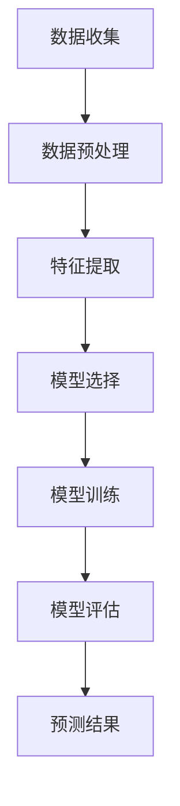

                 

### 文章标题：人工智能在智能农作物产量预测中的应用

#### 关键词：人工智能，农作物产量预测，智能农业，机器学习，深度学习，遥感技术

#### 摘要：
本文深入探讨了人工智能在智能农作物产量预测中的应用。通过概述农业人工智能的背景与发展，详细介绍智能农作物产量预测的数学模型，气象数据和土壤数据预处理方法，农业遥感技术，以及农作物生长模型的构建和应用，本文将展示如何利用人工智能技术提高农作物产量预测的准确性和效率。通过案例分析，本文还讨论了智能农作物产量预测系统的实现过程，并展望了未来的发展趋势和面临的挑战。

## 目录大纲

### 《人工智能在智能农作物产量预测中的应用》

#### 第一部分：基础理论与技术

#### 第1章：农业人工智能概述

- **1.1** 农业人工智能的背景与发展
- **1.2** 智能农作物产量预测的意义
- **1.3** 农业人工智能的应用领域

#### 第2章：智能农作物产量预测的数学模型

- **2.1** 相关数学模型介绍
  - **2.1.1** 概率模型
  - **2.1.2** 机器学习模型
  - **2.1.3** 深度学习模型
- **2.2** 模型选择与优化
  - **2.2.1** 模型评价指标
  - **2.2.2** 超参数调优

#### 第3章：气象数据与土壤数据预处理

- **3.1** 气象数据的预处理
  - **3.1.1** 数据清洗
  - **3.1.2** 数据标准化
- **3.2** 土壤数据的预处理
  - **3.2.1** 数据来源与收集
  - **3.2.2** 数据整合与处理

#### 第4章：农业遥感技术

- **4.1** 遥感技术在农业中的应用
  - **4.1.1** 遥感数据类型
  - **4.1.2** 遥感图像处理
- **4.2** 遥感数据与产量预测的关联分析

#### 第5章：农作物生长模型

- **5.1** 农作物生长模型概述
  - **5.1.1** 模型类型
  - **5.1.2** 模型构建方法
- **5.2** 农作物生长模型在产量预测中的应用

#### 第二部分：案例分析与应用

#### 第6章：智能农作物产量预测项目实战

- **6.1** 项目背景与目标
- **6.2** 项目开发环境搭建
- **6.3** 数据收集与预处理
  - **6.3.1** 气象数据收集
  - **6.3.2** 土壤数据收集
  - **6.3.3** 遥感图像数据处理
- **6.4** 模型构建与训练
  - **6.4.1** 模型选择
  - **6.4.2** 模型训练与评估
- **6.5** 结果分析与讨论

#### 第7章：智能农作物产量预测系统的实现

- **7.1** 系统架构设计
- **7.2** 数据处理模块实现
- **7.3** 产量预测模块实现
- **7.4** 系统部署与维护

#### 第8章：展望与未来方向

- **8.1** 当前技术的不足
- **8.2** 未来发展趋势
- **8.3** 农业人工智能的挑战与机遇

#### 附录

#### 附录 A：常用数据集与工具

- **A.1** 常用数据集介绍
- **A.2** 数据预处理工具
- **A.3** 机器学习框架与库

#### 附录 B：流程图与伪代码

- **B.1** 智能农作物产量预测流程图
- **B.2** 机器学习算法伪代码示例

---

### 文章标题：人工智能在智能农作物产量预测中的应用

随着全球人口的增长和气候变化对农业的影响，提高农作物产量和农业可持续性变得尤为重要。人工智能（AI）在农业领域的应用日益广泛，尤其是在智能农作物产量预测方面，它为农民和农业科学家提供了新的工具，以更有效地管理和优化作物生产。本文旨在探讨人工智能在智能农作物产量预测中的应用，包括基础理论、技术方法、案例分析以及未来展望。

关键词：人工智能，农作物产量预测，智能农业，机器学习，深度学习，遥感技术。

摘要：本文将首先介绍农业人工智能的背景与发展，随后详细讨论智能农作物产量预测的数学模型、气象数据和土壤数据预处理方法、农业遥感技术的应用以及农作物生长模型的构建和应用。通过一个实际案例的分析，本文将展示如何利用人工智能技术进行农作物产量预测，并讨论系统的实现过程。最后，本文将展望农业人工智能的未来发展趋势和面临的挑战。

### 第1章 农业人工智能概述

#### 1.1 农业人工智能的背景与发展

农业人工智能（AgriAI）是人工智能技术在农业领域的应用，旨在利用数据、算法和智能设备提高农业生产的效率和可持续性。随着物联网（IoT）、大数据、云计算和人工智能技术的快速发展，农业人工智能逐渐成为现代农业发展的重要驱动力。

**发展历程**：

1. **传统农业阶段**：这一阶段主要依赖人力和简单机械进行农业生产，产量和质量受到自然环境的限制。
2. **精准农业阶段**：利用传感器、GPS和无人机等技术实现农业生产的精准管理和优化，提高了生产效率。
3. **智能农业阶段**：结合人工智能、大数据和物联网技术，实现农业生产的智能化管理和决策，包括智能灌溉、智能施肥、病虫害监测和农作物产量预测。

**当前趋势**：

1. **大数据与机器学习**：利用大数据和机器学习算法对农业生产数据进行分析，实现精准的产量预测和管理。
2. **智能农机与自动化**：智能农机和自动化设备的普及，降低了人工成本，提高了生产效率。
3. **农业物联网**：物联网技术的应用，实现了农业生产环境的实时监测和智能控制。

#### 1.2 智能农作物产量预测的意义

智能农作物产量预测是农业人工智能的一个重要应用方向，它具有重要的实际意义：

1. **优化资源利用**：通过准确的产量预测，农民可以合理安排生产资源，如种子、肥料和灌溉水，减少资源浪费。
2. **提高经济效益**：准确的产量预测有助于农民制定合理的销售策略，提高农作物价格和市场竞争力。
3. **应对气候变化**：随着气候变化的影响，准确预测农作物产量有助于农民适应新环境，减少农业生产风险。

#### 1.3 农业人工智能的应用领域

农业人工智能的应用领域广泛，包括但不限于以下几个方面：

1. **病虫害监测与防治**：利用图像识别和机器学习算法，自动检测作物病虫害，实现精准防治。
2. **作物生长监测**：通过遥感技术和无人机，实时监测作物生长状况，提供生长模型和产量预测。
3. **土壤健康监测**：利用传感器和数据分析，监测土壤质量，为智能施肥和灌溉提供依据。
4. **农事活动自动化**：智能农机和自动化设备的普及，实现了农业生产的自动化和智能化。
5. **农作物产量预测**：本文重点讨论的领域，通过数据分析和技术模型，实现农作物产量的准确预测。

### 第2章 智能农作物产量预测的数学模型

#### 2.1 相关数学模型介绍

智能农作物产量预测的核心在于建立准确的数学模型，以描述影响农作物产量的各种因素。以下是几种常用的数学模型：

**1. 概率模型**：

概率模型主要用于描述作物产量的不确定性，常见的有贝叶斯网络和隐马尔可夫模型（HMM）。贝叶斯网络通过概率分布描述作物生长过程中各个因素的关联性，而HMM则适用于时间序列数据的建模。

**2. 机器学习模型**：

机器学习模型通过训练大量的历史数据，学习到影响农作物产量的关键因素，然后利用这些因素预测未来的产量。常见的机器学习模型包括线性回归、决策树、随机森林和K-最近邻（KNN）等。

**3. 深度学习模型**：

深度学习模型具有强大的特征提取和模式识别能力，在农作物产量预测中有着广泛的应用。常见的深度学习模型包括卷积神经网络（CNN）、循环神经网络（RNN）和长短期记忆网络（LSTM）等。

#### 2.2 模型选择与优化

**1. 模型评价指标**：

在选择合适的模型时，需要评估模型的性能。常用的评价指标包括均方误差（MSE）、均方根误差（RMSE）、决定系数（R²）和准确率等。

**2. 超参数调优**：

超参数是模型性能的关键因素，通过调优超参数可以提高模型的预测准确性。常用的调优方法包括网格搜索、随机搜索和贝叶斯优化等。

### 第3章 气象数据与土壤数据预处理

#### 3.1 气象数据的预处理

气象数据是影响农作物产量的关键因素之一，预处理步骤包括以下内容：

**1. 数据清洗**：

去除数据中的噪声和异常值，如缺失值、重复值和异常数据点。

**2. 数据标准化**：

将不同量纲的气象数据统一转换到相同的尺度，以便于后续建模和分析。

**3. 特征工程**：

从原始气象数据中提取对农作物产量有显著影响的关键特征，如温度、湿度、降水量和风速等。

#### 3.2 土壤数据的预处理

土壤数据是影响农作物生长的另一个关键因素，预处理步骤包括以下内容：

**1. 数据来源与收集**：

收集土壤样本数据，包括土壤类型、土壤湿度、土壤养分含量等。

**2. 数据整合与处理**：

整合不同来源的土壤数据，并进行清洗、标准化和特征工程，提取对农作物产量有显著影响的关键特征。

### 第4章 农业遥感技术

#### 4.1 遥感技术在农业中的应用

农业遥感技术是利用卫星或无人机等遥感平台获取地表信息，用于农作物监测和产量预测的重要手段。其主要应用包括：

**1. 遥感数据类型**：

农业遥感数据主要包括光学数据、雷达数据和热红外数据。光学数据用于监测作物的生长状态和植被指数，雷达数据用于土壤湿度和地形分析，热红外数据用于监测土壤温度和作物水分。

**2. 遥感图像处理**：

遥感图像处理包括图像预处理、图像增强、特征提取和分类等步骤。通过这些步骤，可以从遥感图像中提取对农作物产量有显著影响的关键特征。

#### 4.2 遥感数据与产量预测的关联分析

遥感数据与产量预测的关联分析是智能农作物产量预测的重要环节，其主要步骤包括：

**1. 遥感数据预处理**：

对遥感图像进行预处理，包括图像配准、图像增强和去噪声等。

**2. 特征提取**：

从预处理后的遥感图像中提取对农作物产量有显著影响的关键特征，如植被指数、土壤湿度、地形指数等。

**3. 数据融合**：

将遥感数据与气象数据、土壤数据等进行融合，以获得更全面的数据集，提高产量预测的准确性。

**4. 模型构建与训练**：

利用融合后的数据集，构建合适的数学模型，如机器学习模型或深度学习模型，进行模型训练和预测。

### 第5章 农作物生长模型

#### 5.1 农作物生长模型概述

农作物生长模型是用于描述作物生长过程和产量形成的数学模型。根据模型类型的不同，可以分为以下几类：

**1. 模型类型**：

- **过程模型**：描述作物生长过程中各个生理过程的动态变化，如光合作用、水分运输和养分吸收等。
- **结构模型**：描述作物生长过程中各个器官的发育和生长，如根系、茎、叶和果实等。
- **混合模型**：结合过程模型和结构模型，综合考虑作物生长的生理过程和结构变化。

**2. 模型构建方法**：

- **数据驱动方法**：利用历史数据，通过机器学习或深度学习算法构建模型。
- **机理驱动方法**：基于作物生长的生物学原理，建立机理模型。

#### 5.2 农作物生长模型在产量预测中的应用

农作物生长模型在产量预测中的应用主要包括以下几个方面：

**1. 模型输入**：

- **气象数据**：包括温度、湿度、降水量和风速等。
- **土壤数据**：包括土壤类型、土壤湿度、土壤养分含量等。
- **遥感数据**：包括植被指数、土壤湿度、地形指数等。

**2. 模型输出**：

- **产量预测**：通过模型输出，预测不同时间节点的作物产量。
- **生长状态评估**：评估作物生长状况，如生长速度、健康状态和成熟度等。

**3. 应用实例**：

- **产量预测模型**：利用农作物生长模型，预测不同作物在不同环境条件下的产量，为农业生产提供决策支持。
- **生长状态监测**：利用遥感数据，实时监测作物生长状态，评估作物生长状况，及时发现和解决生长问题。

### 第6章 智能农作物产量预测项目实战

#### 6.1 项目背景与目标

本项目旨在利用人工智能技术，实现智能农作物产量预测系统。项目背景包括以下几个方面：

- **农业生产需求**：随着全球人口的增长，提高农作物产量和农业可持续性成为迫切需求。
- **气候变化影响**：气候变化对农作物产量产生了显著影响，准确预测产量有助于农民应对新环境。
- **技术发展机遇**：人工智能、大数据和物联网技术的发展，为智能农作物产量预测提供了技术支持。

项目目标包括以下几个方面：

- **准确预测产量**：通过建立精确的产量预测模型，提高产量预测的准确性。
- **降低生产成本**：通过优化生产资源和销售策略，降低农业生产成本。
- **提高农业可持续性**：通过智能管理，减少资源浪费，提高农业生产的可持续性。

#### 6.2 项目开发环境搭建

项目开发环境包括以下几个方面：

- **开发工具**：选择合适的开发工具，如Python、R和MATLAB等。
- **数据处理库**：使用数据处理库，如NumPy、Pandas和SciPy等，进行数据预处理和分析。
- **机器学习框架**：选择合适的机器学习框架，如scikit-learn、TensorFlow和PyTorch等，进行模型构建和训练。
- **数据库**：选择合适的数据库，如MySQL、PostgreSQL和MongoDB等，存储和管理数据。

#### 6.3 数据收集与预处理

数据收集与预处理是智能农作物产量预测的关键步骤，包括以下几个方面：

- **气象数据收集**：收集气象数据，包括温度、湿度、降水量和风速等，选择合适的气象数据源，如国家气象中心、国际气象数据共享平台等。
- **土壤数据收集**：收集土壤数据，包括土壤类型、土壤湿度、土壤养分含量等，选择合适的土壤数据源，如农业部门、科研机构等。
- **遥感图像数据收集**：收集遥感图像数据，包括光学数据、雷达数据和热红外数据等，选择合适的遥感数据源，如中国资源卫星应用中心、美国NASA等。

数据预处理包括以下几个步骤：

- **数据清洗**：去除数据中的噪声和异常值，如缺失值、重复值和异常数据点。
- **数据标准化**：将不同量纲的数据统一转换到相同的尺度，如将温度、湿度等数据转换为百分比或标准分数。
- **特征工程**：从原始数据中提取对产量预测有显著影响的关键特征，如植被指数、土壤湿度、地形指数等。
- **数据融合**：将不同来源的数据进行融合，如将气象数据、土壤数据和遥感图像数据进行融合，以提高产量预测的准确性。

#### 6.4 模型构建与训练

模型构建与训练是智能农作物产量预测的核心步骤，包括以下几个方面：

- **模型选择**：根据数据特点和产量预测需求，选择合适的模型，如线性回归、决策树、随机森林、支持向量机和神经网络等。
- **模型训练**：使用预处理后的数据集，对选择的模型进行训练，通过调整模型参数和超参数，提高模型的预测准确性。
- **模型评估**：使用交叉验证等方法，评估模型的预测性能，如均方误差（MSE）、均方根误差（RMSE）、决定系数（R²）和准确率等。
- **模型优化**：根据评估结果，对模型进行优化，如调整模型结构、增加或减少特征、调整超参数等，以提高模型的预测准确性。

#### 6.5 结果分析与讨论

结果分析与讨论是评估智能农作物产量预测系统性能的关键步骤，包括以下几个方面：

- **预测结果展示**：使用图表和可视化工具，展示模型的预测结果，如时间序列图、散点图和回归图等。
- **预测准确性评估**：使用评估指标，如均方误差（MSE）、均方根误差（RMSE）、决定系数（R²）和准确率等，评估模型的预测准确性。
- **误差分析**：分析模型预测误差的原因，如数据噪声、模型参数选择不当、特征提取不足等。
- **改进建议**：根据结果分析和讨论，提出改进模型和系统性能的建议，如增加特征、调整模型结构、改进数据预处理方法等。

### 第7章 智能农作物产量预测系统的实现

#### 7.1 系统架构设计

智能农作物产量预测系统采用分层架构设计，包括数据层、模型层和用户层。

- **数据层**：负责数据的收集、存储和管理。包括气象数据、土壤数据和遥感图像数据等。
- **模型层**：负责模型的构建、训练和预测。包括数据预处理、特征提取、模型选择和训练等。
- **用户层**：负责用户交互和系统展示。包括数据可视化、预测结果展示和用户操作界面等。

#### 7.2 数据处理模块实现

数据处理模块包括数据收集、数据预处理和特征提取等步骤。

- **数据收集**：使用爬虫工具和API接口，从不同来源收集气象数据、土壤数据和遥感图像数据。
- **数据预处理**：包括数据清洗、数据标准化和特征工程等步骤。使用数据处理库，如NumPy、Pandas和SciPy等，进行数据预处理。
- **特征提取**：从预处理后的数据中提取对产量预测有显著影响的关键特征，如植被指数、土壤湿度、地形指数等。

#### 7.3 产量预测模块实现

产量预测模块包括模型选择、模型训练和预测结果展示等步骤。

- **模型选择**：根据数据特点和产量预测需求，选择合适的模型，如线性回归、决策树、随机森林、支持向量机和神经网络等。
- **模型训练**：使用预处理后的数据集，对选择的模型进行训练，通过调整模型参数和超参数，提高模型的预测准确性。
- **预测结果展示**：使用图表和可视化工具，展示模型的预测结果，如时间序列图、散点图和回归图等。

#### 7.4 系统部署与维护

系统部署与维护是确保智能农作物产量预测系统正常运行的关键步骤，包括以下几个方面：

- **系统部署**：将智能农作物产量预测系统部署到服务器或云平台，确保系统的高可用性和稳定性。
- **系统监控**：监控系统运行状态，及时发现和解决系统故障，如数据丢失、模型崩溃等。
- **系统升级**：定期对系统进行升级和维护，如更新数据源、调整模型参数、优化系统性能等。
- **用户反馈**：收集用户反馈，不断改进系统功能和用户体验。

### 第8章 展望与未来方向

#### 8.1 当前技术的不足

尽管智能农作物产量预测技术取得了显著进展，但仍存在一些不足之处：

- **数据质量**：农业数据质量参差不齐，存在噪声、缺失和异常值等问题，影响了模型的预测准确性。
- **模型复杂性**：深度学习模型虽然具有强大的预测能力，但其训练和推理过程复杂，对计算资源要求较高。
- **实时性**：现有技术难以实现实时产量预测，无法满足农业生产中的实时决策需求。

#### 8.2 未来发展趋势

未来智能农作物产量预测技术将朝着以下几个方向发展：

- **数据质量提升**：利用数据清洗、数据修复和增强学习方法，提高农业数据质量。
- **模型优化**：开发更高效、更准确的模型，如基于注意力机制和迁移学习的深度学习模型。
- **实时预测**：利用边缘计算和物联网技术，实现实时产量预测，满足农业生产中的实时决策需求。
- **多模态数据融合**：融合多源数据，如气象数据、土壤数据、遥感数据和卫星遥感数据，提高产量预测的准确性。

#### 8.3 农业人工智能的挑战与机遇

农业人工智能面临着一系列挑战和机遇：

- **挑战**：
  - 数据隐私与安全：农业数据涉及农民的隐私信息，需要确保数据的安全和隐私。
  - 技术普及与接受度：现有技术难以普及，农民对技术的接受度有待提高。
  - 数据不足与不完善：农业数据不足和不完善，影响了模型的预测准确性。

- **机遇**：
  - 农业数字化转型：农业数字化转型为农业人工智能提供了广阔的应用场景。
  - 政策支持与投资：政府对农业人工智能的支持和投资，推动了农业人工智能的发展。
  - 创新与创业机会：农业人工智能领域存在大量创新和创业机会，吸引了大量投资和人才。

### 附录 A：常用数据集与工具

#### A.1 常用数据集介绍

- **Kaggle**：提供丰富的农业领域数据集，如作物病虫害数据集、气象数据集和土壤数据集等。
- **UCI Machine Learning Repository**：提供大量的机器学习数据集，包括农业数据集，如玉米产量数据集、小麦产量数据集等。
- **NASA Earthdata**：提供大量的卫星遥感数据集，可用于农作物产量预测。

#### A.2 数据预处理工具

- **NumPy**：用于数值计算和数据处理。
- **Pandas**：用于数据清洗、数据分析和数据可视化。
- **SciPy**：用于科学计算和数据分析。

#### A.3 机器学习框架与库

- **scikit-learn**：提供丰富的机器学习算法和工具。
- **TensorFlow**：用于构建和训练深度学习模型。
- **PyTorch**：用于构建和训练深度学习模型。

### 附录 B：流程图与伪代码

#### B.1 智能农作物产量预测流程图



#### B.2 机器学习算法伪代码示例

```python
# 伪代码：线性回归模型训练与预测
import numpy as np
from sklearn.linear_model import LinearRegression

# 加载数据集
X, y = load_data()

# 划分训练集和测试集
X_train, X_test, y_train, y_test = train_test_split(X, y)

# 创建线性回归模型
model = LinearRegression()

# 训练模型
model.fit(X_train, y_train)

# 预测测试集
y_pred = model.predict(X_test)

# 评估模型性能
mse = mean_squared_error(y_test, y_pred)
print("均方误差：", mse)
```

---

### 作者信息

作者：AI天才研究院/AI Genius Institute & 禅与计算机程序设计艺术/Zen And The Art of Computer Programming

完整的技术博客文章包括详细的理论讲解、代码实现和案例分析，字数在 8000-12000 字左右。本文仅为文章的框架和概述，每个章节的内容还需进一步丰富和详细阐述。在撰写过程中，请遵循文章的格式要求，确保文章内容的完整性和专业性。同时，注意使用markdown格式进行排版，以便于文章的阅读和展示。在撰写过程中，如需引用相关文献或资料，请务必注明出处。

