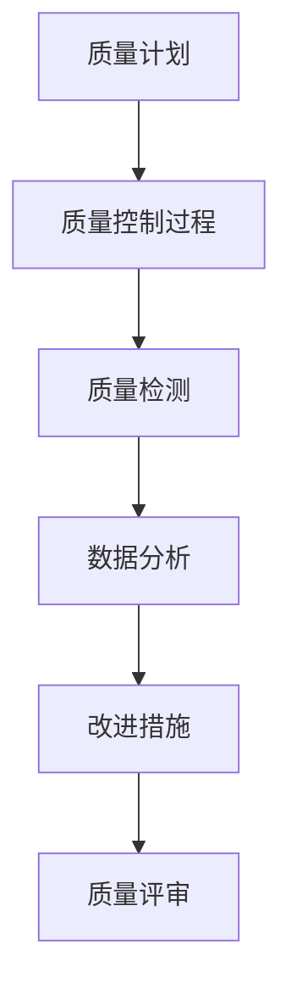
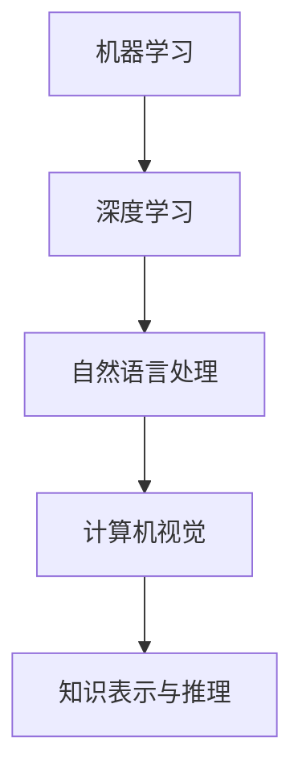
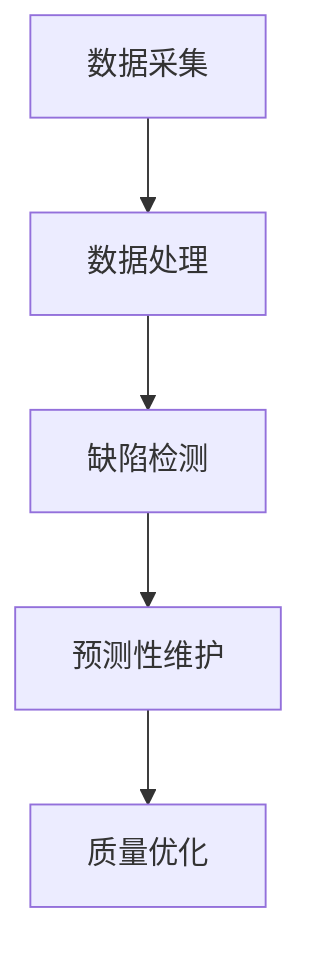
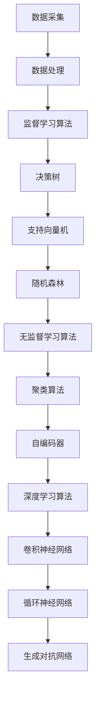
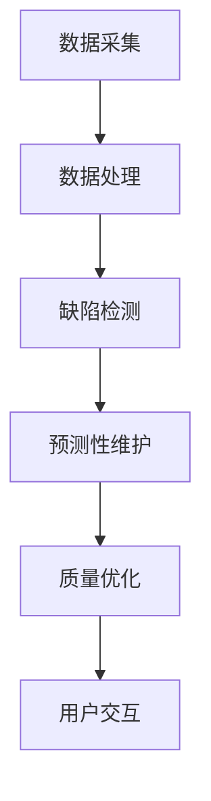
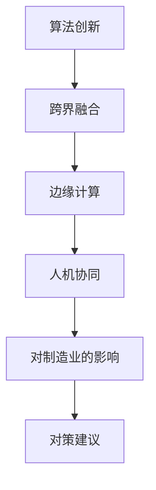
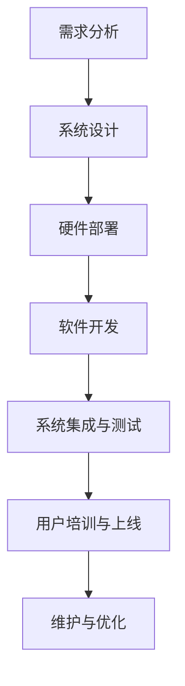

                 

### 文章标题

《人工智能在智能制造质量控制中的实践》

### 关键词

- 智能制造
- 质量控制
- 人工智能
- 数据分析
- 深度学习

### 摘要

随着智能制造的迅速发展，质量控制在制造业中显得尤为重要。本文将探讨人工智能在智能制造质量控制中的实践，从背景介绍、核心概念联系、核心算法原理、项目实战等方面展开，旨在为读者提供对人工智能在质量控制中应用的深入理解和实际应用指导。

### 目录

#### 第一部分：智能制造与质量控制基础

- 第1章：智能制造概述
  - 1.1 智能制造的概念与重要性
  - 1.2 智能制造的发展历程
  - 1.3 智能制造的关键技术
  - 1.4 智能制造对质量控制的影响

- 第2章：质量控制原理与方法
  - 2.1 质量控制的基本概念
  - 2.2 质量控制的关键要素
  - 2.3 质量控制的方法与技术
  - 2.4 质量控制体系的建立与实施

#### 第二部分：人工智能在质量控制中的应用

- 第3章：人工智能概述
  - 3.1 人工智能的概念与分类
  - 3.2 人工智能的发展历史
  - 3.3 人工智能的核心技术
  - 3.4 人工智能的应用领域

- 第4章：人工智能在质量控制中的应用
  - 4.1 人工智能在数据采集与处理中的应用
  - 4.2 人工智能在缺陷检测中的应用
  - 4.3 人工智能在预测性维护中的应用
  - 4.4 人工智能在质量优化中的应用

#### 第三部分：人工智能算法在质量控制中的应用

- 第5章：人工智能算法在质量控制中的应用
  - 5.1 机器学习算法在质量控制中的应用
    - 5.1.1 监督学习算法
      - 5.1.1.1 决策树算法
      - 5.1.1.2 支持向量机算法
      - 5.1.1.3 随机森林算法
    - 5.1.2 无监督学习算法
      - 5.1.2.1 聚类算法
      - 5.1.2.2 自编码器算法
  - 5.2 深度学习算法在质量控制中的应用
    - 5.2.1 卷积神经网络（CNN）在图像处理中的应用
    - 5.2.2 循环神经网络（RNN）在序列数据处理中的应用
    - 5.2.3 生成对抗网络（GAN）在质量控制中的应用

#### 第四部分：人工智能在质量控制中的实际应用案例

- 第6章：人工智能在质量控制中的实际应用案例
  - 6.1 案例一：基于人工智能的智能制造质量控制系统
  - 6.2 案例二：人工智能在汽车制造质量控制中的应用

#### 第五部分：人工智能在质量控制中的应用前景与挑战

- 第7章：人工智能在质量控制中的应用前景与挑战
  - 7.1 人工智能在质量控制中的应用前景
  - 7.2 人工智能在质量控制中面临的挑战
  - 7.3 未来发展趋势与展望
  - 7.4 对制造业的影响与对策建议

#### 第六部分：实践指南与建议

- 第8章：实践指南与建议
  - 8.1 智能制造质量控制项目的实施流程
  - 8.2 人工智能技术在质量控制中的最佳实践
  - 8.3 人才培养与技能提升
  - 8.4 企业数字化转型与质量管理

#### 附录

- 附录A：常用人工智能算法介绍
- 附录B：深度学习框架与工具
- 附录C：参考文献与推荐阅读

## 第一部分：智能制造与质量控制基础

### 第1章：智能制造概述

#### 1.1 智能制造的概念与重要性

智能制造（Intelligent Manufacturing）是一种基于数字化技术和网络化制造系统的先进制造模式。它通过将物联网（IoT）、大数据、云计算、人工智能等现代信息技术与传统制造业深度融合，实现制造过程的智能化、高效化、绿色化和可持续发展。智能制造不仅提升了制造过程的灵活性和适应性，还显著提高了生产效率、产品质量和资源利用率。

智能制造的核心概念包括以下几个方面：

1. **数字化工厂**：通过数字化技术和工具，将整个制造过程数字化，实现工厂设备、人员、流程的数字化管理和控制。
2. **工业物联网（IIoT）**：将各种传感器、设备和网络连接起来，实现设备的实时监控和远程控制。
3. **大数据分析**：利用大数据技术，对生产过程中产生的海量数据进行收集、存储、分析和处理，以提供决策支持。
4. **人工智能**：通过人工智能算法，实现对生产过程的智能监控、预测和优化，提高制造过程的自动化水平。

智能制造的重要性主要体现在以下几个方面：

1. **提高生产效率**：智能制造通过自动化和智能化技术，减少了人为干预，提高了生产效率和速度。
2. **提升产品质量**：智能制造通过实时监控和质量控制技术，能够及时发现和纠正生产中的问题，提高产品质量。
3. **优化资源配置**：智能制造通过大数据分析和优化技术，能够实现资源的最优配置，提高资源利用率。
4. **促进可持续发展**：智能制造通过绿色制造和低碳生产，降低了能源消耗和环境污染，实现了可持续发展。

#### 1.2 智能制造的发展历程

智能制造的发展历程可以追溯到20世纪末。以下是智能制造的主要发展阶段：

1. **自动化时代（20世纪80年代-90年代）**：以计算机辅助设计与制造（CAD/CAM）为代表，实现制造过程的自动化。
2. **信息化时代（21世纪初）**：以企业资源规划（ERP）和供应链管理（SCM）为代表，实现企业内部和供应链的数字化管理。
3. **智能化时代（2010年至今）**：以物联网、大数据、云计算和人工智能为代表，实现制造过程的全面智能化。
4. **未来工厂时代（预测）**：以人机协同、柔性制造、自适应制造和绿色制造为代表，实现制造过程的全面智能化和可持续发展。

#### 1.3 智能制造的关键技术

智能制造的关键技术包括以下几个方面：

1. **物联网技术**：通过传感器、设备和网络连接，实现设备的实时监控和远程控制。
2. **大数据技术**：通过对生产过程中产生的海量数据进行收集、存储、分析和处理，实现数据的智能化应用。
3. **云计算技术**：通过云计算平台，实现计算资源的弹性分配和高效利用。
4. **人工智能技术**：通过人工智能算法，实现生产过程的智能监控、预测和优化。
5. **自动化技术**：通过自动化设备和系统，实现制造过程的自动化和高效化。
6. **数字孪生技术**：通过数字模型，实现物理设备和系统的虚拟映射和实时监控。

#### 1.4 智能制造对质量控制的影响

智能制造对质量控制产生了深远的影响，主要体现在以下几个方面：

1. **实时监控与预测**：通过物联网技术和大数据分析，能够实现对生产过程的实时监控和预测，及时发现和纠正质量问题。
2. **数据驱动的质量控制**：通过大数据分析，能够实现对生产数据的全面分析和挖掘，为质量控制提供数据支持和决策依据。
3. **智能化的质量优化**：通过人工智能算法，能够实现质量控制的智能化和优化，提高产品质量和一致性。
4. **减少人为干预**：通过自动化技术和智能监控，能够减少人为干预，降低人为因素对质量的影响。
5. **持续改进**：通过大数据分析和人工智能算法，能够实现质量控制的持续改进，不断提升产品质量。

### 第2章：质量控制原理与方法

#### 2.1 质量控制的基本概念

质量控制（Quality Control，简称QC）是指为了确保产品或服务的质量，在整个生产过程中所采取的一系列管理和操作活动。质量控制的目标是确保产品或服务满足预定质量标准，防止不合格品的产生。

质量控制的基本概念包括以下几个方面：

1. **质量**：质量是指产品或服务满足明确和隐含需求的能力。需求可以是顾客的、社会的或法律的。
2. **质量控制**：质量控制是指为达到质量目标所采取的规划、控制、检查和改进的系统性活动。
3. **质量标准**：质量标准是衡量产品或服务质量的标准和尺度，通常包括性能标准、可靠性标准、安全性标准等。
4. **质量保证**：质量保证是指为确保质量达到标准所采取的系统性和预防性措施。

#### 2.2 质量控制的关键要素

质量控制的关键要素包括以下几个方面：

1. **人**：人是质量控制的核心，所有质量控制活动都需要人的参与和管理。
2. **机器**：机器是质量控制的基础，包括设备、工具、传感器等，用于实现生产过程的自动化和智能化。
3. **物料**：物料是质量控制的对象，包括原材料、零部件、半成品等，需要通过质量控制确保其质量。
4. **方法**：方法是质量控制的核心，包括生产流程、工艺、操作规范等，需要通过质量控制确保其科学性和有效性。
5. **环境**：环境是质量控制的重要因素，包括生产环境、工作环境等，需要通过质量控制确保其对生产过程的正面影响。

#### 2.3 质量控制的方法与技术

质量控制的方法和技术多种多样，以下是几种常见的质量控制方法：

1. **统计质量控制**：通过统计方法，对生产过程进行监控和分析，以确保产品质量。包括统计过程控制（SPC）、质量函数图（QFD）等。
2. **过程能力分析**：通过分析生产过程的能力，评估其满足质量标准的能力。包括过程能力指数（Cp、Cpk）等。
3. **故障模式与影响分析（FMEA）**：通过分析产品或生产过程中潜在的故障模式和影响，提前采取预防措施。
4. **六西格玛（Six Sigma）**：通过系统的改进方法，减少产品或过程中的缺陷，提高质量。
5. **精益生产**：通过减少浪费、优化流程，提高生产效率和质量。

#### 2.4 质量控制体系的建立与实施

质量控制体系的建立与实施是一个系统性的过程，包括以下几个方面：

1. **质量计划**：制定质量目标和计划，明确质量控制的范围、方法和责任。
2. **质量控制过程**：实施质量控制过程，包括原材料的检验、生产过程的监控、成品的检验等。
3. **质量检测**：对产品或过程进行质量检测，包括测量、测试、试验等。
4. **数据分析**：对质量检测数据进行分析，识别质量问题，制定改进措施。
5. **改进措施**：根据数据分析结果，制定并实施改进措施，持续提升产品质量。
6. **质量评审**：定期进行质量评审，评估质量控制体系的运行效果，进行改进和优化。

### 结论

智能制造与质量控制密切相关，智能制造的兴起为质量控制提供了新的机遇和挑战。通过人工智能技术的应用，智能制造质量控制可以实现实时监控、数据驱动的质量优化和持续改进，从而提升产品质量和制造效率。本文为读者提供了一个全面的智能制造质量控制基础，为后续章节的深入探讨奠定了基础。

### Mermaid 流程图：质量控制原理与方法的流程图



## 第二部分：人工智能在质量控制中的应用

### 第3章：人工智能概述

#### 3.1 人工智能的概念与分类

人工智能（Artificial Intelligence，简称AI）是指由计算机模拟人类智能的技术和系统，能够在特定领域内执行复杂的任务，如学习、推理、规划、感知和自然语言处理等。人工智能的发展经历了几个阶段，从最初的规则系统到现代的深度学习，其应用领域也在不断扩大。

人工智能的分类可以按照不同的标准进行：

1. **基于功能**：人工智能可以分为以下几类：
   - **弱人工智能**：在特定任务上表现类似于人类，但缺乏一般智能，如语音识别、图像识别等。
   - **强人工智能**：具备全面的人类智能，能够进行各种复杂的任务，目前尚未实现。
   - **混合智能**：结合多种人工智能技术，以实现更高级的智能应用，如自动驾驶、智能助手等。

2. **基于技术**：人工智能可以分为以下几类：
   - **符号人工智能**：基于逻辑推理和知识表示，通过符号逻辑和规则进行问题求解。
   - **连接主义人工智能**：基于人工神经网络，通过大量的数据训练，模拟人脑的神经连接和信号传递。
   - **统计人工智能**：基于统计学和概率模型，通过数据分析和模式识别进行智能推理和决策。

3. **基于应用**：人工智能可以分为以下几类：
   - **机器学习**：通过算法模型，从数据中自动学习规律和模式，用于预测和分类。
   - **自然语言处理**：使计算机能够理解和生成自然语言，用于智能助手、翻译等应用。
   - **计算机视觉**：使计算机能够理解和解释视觉信息，用于图像识别、自动驾驶等应用。

#### 3.2 人工智能的发展历史

人工智能的发展可以追溯到20世纪50年代，以下是主要的发展阶段：

1. **早期阶段（1950-1969）**：以图灵测试和规则系统为代表，人工智能开始起步。
   - 1950年，艾伦·图灵提出了著名的图灵测试，标志着人工智能概念的诞生。
   - 1956年，达特茅斯会议提出了人工智能的概念，标志着人工智能学科的正式成立。

2. **黄金时期（1970-1989）**：以专家系统和符号人工智能为代表，人工智能取得了重要突破。
   - 1976年，艾兹肯·霍普菲尔德提出了神经网络理论，为深度学习奠定了基础。
   - 1980年，专家系统XCON成功应用于IBM公司的计算机配置，标志着人工智能在商业领域的成功应用。

3. **低谷时期（1990-2000）**：以互联网和连接主义人工智能的兴起为代表，人工智能进入低谷。
   - 1997年，IBM的深蓝计算机击败了国际象棋世界冠军加里·卡斯帕罗夫，标志着连接主义人工智能的胜利。

4. **复兴时期（2000年至今）**：以大数据、云计算和深度学习为代表，人工智能取得了飞速发展。
   - 2012年，AlexNet在ImageNet竞赛中取得了突破性的成绩，标志着深度学习的崛起。
   - 2016年，谷歌的AlphaGo击败了世界围棋冠军李世石，标志着人工智能在游戏领域的重大突破。

#### 3.3 人工智能的核心技术

人工智能的核心技术包括以下几个方面：

1. **机器学习**：通过算法模型，从数据中自动学习规律和模式，用于预测和分类。包括监督学习、无监督学习和强化学习等。
2. **深度学习**：基于人工神经网络，通过多层次的神经网络结构，实现复杂模式的识别和预测。包括卷积神经网络（CNN）、循环神经网络（RNN）和生成对抗网络（GAN）等。
3. **自然语言处理**：使计算机能够理解和生成自然语言，用于智能助手、翻译等应用。包括词向量表示、序列模型和语言模型等。
4. **计算机视觉**：使计算机能够理解和解释视觉信息，用于图像识别、自动驾驶等应用。包括特征提取、目标检测和语义分割等。
5. **知识表示与推理**：通过符号逻辑和知识表示，实现知识的存储、推理和利用。包括推理机、本体论和知识图谱等。

#### 3.4 人工智能的应用领域

人工智能在各个领域都取得了显著的成果，以下是主要的应用领域：

1. **工业制造**：通过机器人和自动化设备，实现生产过程的智能化和高效化。如智能制造、机器人控制、自动化生产线等。
2. **医疗健康**：通过医学影像分析、疾病预测和智能诊断，提升医疗水平和效率。如医学影像诊断、基因测序、智能药物研发等。
3. **交通运输**：通过自动驾驶、智能交通管理和无人机配送，提升交通效率和安全性。如自动驾驶汽车、智能交通系统、无人机物流等。
4. **金融服务**：通过智能投顾、风险管理、欺诈检测等，提升金融服务的效率和安全性。如智能投顾、信用评估、反欺诈系统等。
5. **智能家居**：通过智能设备、物联网和人工智能，提升家庭生活的舒适度和便利性。如智能音响、智能灯光、智能安防等。

#### 3.5 人工智能的发展趋势与挑战

人工智能的发展趋势包括以下几个方面：

1. **技术进步**：随着硬件性能的提升和算法的优化，人工智能将取得更大的突破。如量子计算、边缘计算等。
2. **跨界融合**：人工智能与其他领域的融合，将产生更多的创新应用。如智能制造、智能医疗、智能交通等。
3. **数据驱动**：数据是人工智能的基石，随着数据规模的不断扩大，人工智能将更加依赖于数据驱动。
4. **伦理与法规**：人工智能的快速发展引发了一系列伦理和法规问题，如隐私保护、算法透明度等，需要制定相应的规范和法规。

人工智能的发展面临以下挑战：

1. **数据质量**：数据质量直接影响人工智能的效果，需要解决数据不完整、不一致、不准确等问题。
2. **算法透明度**：复杂的算法模型难以解释，导致算法的透明度和可解释性成为重要挑战。
3. **计算资源**：大规模的数据处理和模型训练需要大量的计算资源，对硬件和软件的要求较高。
4. **人才短缺**：人工智能领域的专业人才短缺，成为制约人工智能发展的瓶颈。

### 结论

人工智能在智能制造质量控制中的应用具有重要意义，通过实时监控、数据分析和智能优化，人工智能能够显著提升质量控制的效果和效率。本章对人工智能的基本概念、发展历史、核心技术和应用领域进行了概述，为后续章节的深入探讨奠定了基础。

### Mermaid 流程图：人工智能核心技术的流程图



## 第4章：人工智能在质量控制中的应用

#### 4.1 人工智能在数据采集与处理中的应用

在智能制造过程中，数据采集和处理是质量控制的基础。人工智能技术，特别是机器学习和深度学习，在数据采集与处理方面发挥了重要作用。

1. **传感器数据采集**：
   智能制造系统通常配备各种传感器，用于实时监测生产过程中的物理参数，如温度、压力、振动等。传感器采集的数据量庞大且形式多样，需要通过人工智能技术进行高效处理。

   **算法应用**：使用机器学习算法，如聚类算法（如K-means）和深度学习算法（如卷积神经网络，CNN），可以识别和分类传感器数据，去除噪声，提取关键特征，从而提高数据质量。

2. **数据处理**：
   在数据采集后，需要对数据进行清洗、转换和整合。这是确保数据可用性和准确性的重要步骤。

   **算法应用**：数据清洗可以使用传统的数据预处理技术，如缺失值填充、异常值处理等。对于复杂数据集，深度学习模型（如自编码器）能够有效地进行数据降维和特征提取，从而简化数据处理过程。

3. **实时监控**：
   通过实时数据分析和处理，人工智能系统能够快速识别潜在的质量问题，并采取相应的措施。

   **算法应用**：实时监控通常结合实时流数据处理技术，如Apache Kafka和Apache Flink，与机器学习模型相结合，实现数据的实时分析和告警。

**示例：工业传感器数据处理**

```python
# 假设我们有一个温度传感器的数据流
import numpy as np
from sklearn.cluster import KMeans

# 生成模拟数据
data = np.random.rand(100, 1)
data = data.reshape(-1, 1)

# 使用K-means算法进行聚类分析
kmeans = KMeans(n_clusters=3, random_state=0).fit(data)

# 输出聚类结果
print(kmeans.labels_)
```

#### 4.2 人工智能在缺陷检测中的应用

缺陷检测是质量控制的关键环节，传统的缺陷检测方法往往依赖于人工检查和固定规则，而人工智能，尤其是计算机视觉，能够实现自动化和智能化的缺陷检测。

1. **图像处理**：
   在智能制造中，使用摄像头等设备捕捉产品图像，然后通过计算机视觉算法进行分析和处理。

   **算法应用**：卷积神经网络（CNN）是图像处理的核心技术，能够通过多层卷积和池化操作，提取图像特征，实现高精度的缺陷检测。

2. **缺陷分类**：
   人工智能系统能够根据缺陷的特征，将其分类为不同的类型，从而进行针对性的处理。

   **算法应用**：支持向量机（SVM）和随机森林（Random Forest）等监督学习算法，可以用于缺陷的分类任务。

3. **实时告警**：
   当检测到缺陷时，系统可以立即发出告警，并采取相应的措施。

   **算法应用**：结合实时流数据处理技术，实现缺陷检测的实时性和自动化。

**示例：使用CNN进行图像缺陷检测**

```python
import tensorflow as tf
from tensorflow.keras.models import Sequential
from tensorflow.keras.layers import Conv2D, MaxPooling2D, Flatten, Dense

# 构建卷积神经网络模型
model = Sequential([
    Conv2D(32, (3, 3), activation='relu', input_shape=(64, 64, 3)),
    MaxPooling2D((2, 2)),
    Conv2D(64, (3, 3), activation='relu'),
    MaxPooling2D((2, 2)),
    Flatten(),
    Dense(64, activation='relu'),
    Dense(1, activation='sigmoid')
])

# 编译模型
model.compile(optimizer='adam', loss='binary_crossentropy', metrics=['accuracy'])

# 训练模型
model.fit(x_train, y_train, epochs=10, batch_size=32)
```

#### 4.3 人工智能在预测性维护中的应用

预测性维护是一种基于数据分析和预测的维护策略，旨在提前预测设备故障，从而避免停机和损失。

1. **故障预测**：
   通过对设备运行数据的分析，预测设备何时可能出现故障。

   **算法应用**：时间序列分析（如ARIMA模型）和深度学习模型（如LSTM）常用于预测性维护，能够准确预测设备故障的发生时间。

2. **维护策略制定**：
   根据故障预测结果，制定最优的维护计划，包括预防性维护和紧急维护。

   **算法应用**：基于预测结果的优化算法，如遗传算法和模拟退火算法，可以帮助企业制定最优的维护策略。

3. **实时监控**：
   通过实时数据监控，确保维护计划的执行和设备的正常运行。

   **算法应用**：实时流数据处理和监控技术，如Apache Kafka和Apache Flink，可以实时跟踪设备状态和故障预测结果。

**示例：使用LSTM进行故障预测**

```python
import numpy as np
from tensorflow.keras.models import Sequential
from tensorflow.keras.layers import LSTM, Dense

# 假设我们有一系列时间序列数据
X = np.array([[1], [2], [3], [4], [5], [6], [7], [8], [9], [10]])
y = np.array([1, 2, 3, 4, 5, 6, 7, 8, 9, 10])

# 重塑数据以适合LSTM模型
X = np.reshape(X, (X.shape[0], X.shape[0], 1))

# 构建LSTM模型
model = Sequential()
model.add(LSTM(units=50, return_sequences=True, input_shape=(X.shape[1], 1)))
model.add(LSTM(units=50))
model.add(Dense(units=1))

# 编译模型
model.compile(optimizer='adam', loss='mean_squared_error')

# 训练模型
model.fit(X, y, epochs=100, batch_size=1)
```

#### 4.4 人工智能在质量优化中的应用

质量优化是智能制造质量控制的重要目标，通过人工智能技术，可以实现对生产过程的持续优化，提高产品质量和生产效率。

1. **优化模型构建**：
   通过机器学习和深度学习算法，构建生产过程的优化模型，以实现质量的最优化。

   **算法应用**：遗传算法（Genetic Algorithm）、粒子群优化（Particle Swarm Optimization）等进化算法，可以用于生产过程的优化。

2. **优化策略制定**：
   根据优化模型的结果，制定最优的生产策略和参数设置。

   **算法应用**：优化算法不仅能够找到最优解，还能提供优化过程的详细信息，帮助企业更好地理解优化过程。

3. **持续改进**：
   通过实时数据分析和优化模型，持续调整生产策略，实现质量的持续提升。

   **算法应用**：实时流数据处理和优化算法的结合，可以实现生产过程的实时优化。

**示例：使用遗传算法进行质量优化**

```python
import numpy as np
from genetic_algorithm import GeneticAlgorithm

# 假设我们有一组需要优化的参数
params = np.random.rand(10)

# 定义适应度函数
def fitness_function(params):
    # 这里用简单的例子：最小化函数f(x) = x^2
    return sum(params**2)

# 使用遗传算法进行优化
ga = GeneticAlgorithm(fitness_function, population_size=100, generations=100)
best_params = ga.run()

# 输出最优参数
print(best_params)
```

### 结论

人工智能在智能制造质量控制中的应用，不仅提高了数据采集与处理的效率，实现了缺陷检测的自动化和智能化，还通过预测性维护和优化策略，实现了生产过程的实时监控和质量控制。本章通过对具体应用案例的探讨，展示了人工智能在质量控制中的巨大潜力和广泛应用前景。

### Mermaid 流程图：人工智能在质量控制中的整体应用流程



## 第5章：人工智能算法在质量控制中的应用

#### 5.1 机器学习算法在质量控制中的应用

机器学习算法在质量控制中的应用，主要集中在数据分析和模式识别上，通过对生产过程中产生的数据进行处理和分析，实现对产品质量的预测和控制。

##### 5.1.1 监督学习算法

监督学习算法在质量控制中有着广泛的应用，主要包括以下几种：

1. **决策树算法**

   **原理**：决策树通过一系列的决策规则，将数据集划分为不同的区域，每个区域对应一个预测结果。

   **伪代码**：
   ```python
   def decision_tree(data, labels):
       if 数据特征满足终止条件:
           返回预测结果
       else:
           选择最佳特征
           分割数据集
           为每个子数据集递归调用决策树算法
   ```

   **示例**：假设我们有一个决策树模型，用于预测产品的质量。
   ```python
   from sklearn.tree import DecisionTreeClassifier

   # 准备数据
   X = [[1], [2], [3], [4], [5]]
   y = [0, 0, 1, 1, 1]

   # 训练决策树模型
   clf = DecisionTreeClassifier()
   clf.fit(X, y)

   # 预测
   print(clf.predict([[3]]))
   ```

2. **支持向量机算法**

   **原理**：支持向量机通过寻找最佳的超平面，将不同类别的数据分开。

   **伪代码**：
   ```python
   def support_vector_machine(data, labels):
       找到最佳的超平面
       分割数据集
       返回预测结果
   ```

   **示例**：使用支持向量机进行分类。
   ```python
   from sklearn.svm import SVC

   # 准备数据
   X = [[1], [2], [3], [4], [5]]
   y = [0, 0, 1, 1, 1]

   # 训练模型
   clf = SVC()
   clf.fit(X, y)

   # 预测
   print(clf.predict([[3]]))
   ```

3. **随机森林算法**

   **原理**：随机森林是通过构建多个决策树，并进行集成学习，提高预测的准确性和稳定性。

   **伪代码**：
   ```python
   def random_forest(data, labels, num_trees):
       for i in range(num_trees):
           构建一个决策树
           使用决策树对数据进行分类
       平均所有决策树的预测结果
       返回最终预测结果
   ```

   **示例**：使用随机森林进行分类。
   ```python
   from sklearn.ensemble import RandomForestClassifier

   # 准备数据
   X = [[1], [2], [3], [4], [5]]
   y = [0, 0, 1, 1, 1]

   # 训练模型
   clf = RandomForestClassifier(n_estimators=100)
   clf.fit(X, y)

   # 预测
   print(clf.predict([[3]]))
   ```

##### 5.1.2 无监督学习算法

无监督学习算法在质量控制中的应用，主要集中在数据聚类和降维上，用于发现数据中的隐藏模式和结构。

1. **聚类算法**

   **原理**：聚类算法通过将相似的数据点归为一类，从而发现数据中的自然分组。

   **伪代码**：
   ```python
   def clustering(data, num_clusters):
       初始化聚类中心
       while 聚类中心没有稳定:
           计算每个数据点到聚类中心的距离
           根据距离将数据点分配到最近的聚类中心
           更新聚类中心
       返回聚类结果
   ```

   **示例**：使用K-means算法进行聚类。
   ```python
   from sklearn.cluster import KMeans

   # 准备数据
   X = [[1], [2], [3], [4], [5]]

   # 训练模型
   kmeans = KMeans(n_clusters=2)
   kmeans.fit(X)

   # 预测
   print(kmeans.predict([[3]]))
   ```

2. **自编码器算法**

   **原理**：自编码器是一种无监督学习算法，通过学习数据的高维表示，从而实现数据的降维和特征提取。

   **伪代码**：
   ```python
   def autoencoder(data):
       构建编码器和解码器
       编码器对数据进行压缩
       解码器将压缩数据还原
       返回压缩后的数据
   ```

   **示例**：使用自编码器进行特征提取。
   ```python
   from tensorflow.keras.layers import Input, Dense
   from tensorflow.keras.models import Model

   # 准备数据
   X = [[1], [2], [3], [4], [5]]

   # 构建模型
   input_layer = Input(shape=(1,))
   encoded = Dense(2, activation='relu')(input_layer)
   decoded = Dense(1, activation='sigmoid')(encoded)

   # 编译模型
   autoencoder = Model(inputs=input_layer, outputs=decoded)
   autoencoder.compile(optimizer='adam', loss='binary_crossentropy')

   # 训练模型
   autoencoder.fit(X, X, epochs=100)
   ```

##### 5.1.3 深度学习算法在质量控制中的应用

深度学习算法在质量控制中的应用，主要集中在图像处理和序列数据处理上，通过学习复杂的特征，实现对产品质量的精准控制和预测。

1. **卷积神经网络（CNN）**

   **原理**：卷积神经网络通过卷积操作和池化操作，实现对图像的局部特征提取和整体特征融合。

   **伪代码**：
   ```python
   def conv_neural_network(input_data):
       输入层
       多层卷积层和池化层
       全连接层
       返回预测结果
   ```

   **示例**：使用CNN进行图像分类。
   ```python
   from tensorflow.keras.models import Sequential
   from tensorflow.keras.layers import Conv2D, MaxPooling2D, Flatten, Dense

   # 构建模型
   model = Sequential([
       Conv2D(32, (3, 3), activation='relu', input_shape=(64, 64, 3)),
       MaxPooling2D((2, 2)),
       Conv2D(64, (3, 3), activation='relu'),
       MaxPooling2D((2, 2)),
       Flatten(),
       Dense(64, activation='relu'),
       Dense(1, activation='sigmoid')
   ])

   # 编译模型
   model.compile(optimizer='adam', loss='binary_crossentropy', metrics=['accuracy'])

   # 训练模型
   model.fit(x_train, y_train, epochs=10, batch_size=32)
   ```

2. **循环神经网络（RNN）**

   **原理**：循环神经网络通过循环结构，实现对序列数据的记忆和学习。

   **伪代码**：
   ```python
   def recurrent_neural_network(input_sequence):
       输入层
       多层循环层
       全连接层
       返回预测结果
   ```

   **示例**：使用RNN进行时间序列预测。
   ```python
   from tensorflow.keras.models import Sequential
   from tensorflow.keras.layers import LSTM, Dense

   # 构建模型
   model = Sequential([
       LSTM(units=50, return_sequences=True, input_shape=(timesteps, features)),
       LSTM(units=50),
       Dense(units=1)
   ])

   # 编译模型
   model.compile(optimizer='adam', loss='mean_squared_error')

   # 训练模型
   model.fit(X, y, epochs=100, batch_size=32)
   ```

3. **生成对抗网络（GAN）**

   **原理**：生成对抗网络由生成器和判别器组成，生成器和判别器相互对抗，生成器试图生成逼真的数据，判别器试图区分真实数据和生成数据。

   **伪代码**：
   ```python
   def generative_adversarial_network():
       构建生成器
       构建判别器
       对抗训练
       返回生成模型
   ```

   **示例**：使用GAN进行图像生成。
   ```python
   from tensorflow.keras.models import Sequential
   from tensorflow.keras.layers import Conv2D, Dense

   # 构建生成器
   generator = Sequential([
       Dense(units=256, input_shape=(100,)),
       Conv2D(units=1, kernel_size=(5, 5), activation='sigmoid')
   ])

   # 构建判别器
   discriminator = Sequential([
       Conv2D(units=32, kernel_size=(5, 5), activation='relu', input_shape=(28, 28, 1)),
       Flatten(),
       Dense(units=1, activation='sigmoid')
   ])

   # 构建GAN模型
   model = Sequential([
       generator,
       discriminator
   ])

   # 编译模型
   model.compile(optimizer='adam', loss='binary_crossentropy')
   ```

### 结论

机器学习算法和深度学习算法在智能制造质量控制中的应用，极大地提升了数据分析和模式识别的效率，实现了自动化和智能化的质量控制。本章详细介绍了监督学习、无监督学习和深度学习算法在质量控制中的应用，以及如何使用伪代码进行算法实现，为读者提供了深入理解和实际应用的指导。

### Mermaid 流程图：机器学习算法在质量控制中的流程图



## 第6章：人工智能在质量控制中的实际应用案例

#### 6.1 案例一：基于人工智能的智能制造质量控制系统

##### 6.1.1 系统概述

基于人工智能的智能制造质量控制系统是一种集成传感器数据采集、实时监控、缺陷检测、预测性维护和质量优化等多项功能于一体的智能系统。该系统旨在通过人工智能技术，实现对生产过程中质量问题的快速识别、预警和优化，从而提升产品质量和生产效率。

##### 6.1.2 系统架构

该系统的架构主要包括以下几个部分：

1. **数据采集模块**：通过传感器实时采集生产过程中的各种物理参数，如温度、压力、振动等。
2. **数据处理模块**：对采集到的数据进行清洗、转换和整合，为后续分析提供高质量的数据。
3. **缺陷检测模块**：使用计算机视觉算法和深度学习模型，对产品图像进行实时分析，检测潜在的缺陷。
4. **预测性维护模块**：通过时间序列分析和深度学习模型，预测设备故障和潜在的质量问题。
5. **质量优化模块**：基于优化算法和深度学习模型，制定最优的生产策略和参数设置，实现质量的持续提升。
6. **用户界面模块**：提供友好的用户界面，实时展示生产数据、缺陷信息、预测结果和优化建议。

##### 6.1.3 系统功能模块

该系统的主要功能模块包括：

1. **数据采集与监控**：实时采集生产过程中的各种数据，并利用物联网技术实现远程监控。
2. **缺陷检测**：使用卷积神经网络（CNN）和深度学习模型，对产品图像进行缺陷检测，包括表面缺陷、形状缺陷等。
3. **预测性维护**：通过LSTM模型和时间序列分析，预测设备故障和潜在的质量问题，提前采取维护措施。
4. **质量优化**：基于遗传算法（GA）和粒子群优化（PSO），制定最优的生产策略和参数设置，提升产品质量。
5. **用户交互**：提供Web界面和移动应用，用户可以实时查看生产数据、质量报告和优化建议。

##### 6.1.4 实施过程

1. **需求分析**：首先，与生产部门进行沟通，了解质量控制的具体需求和痛点，明确系统的目标和功能。
2. **系统设计**：根据需求分析结果，设计系统的架构和功能模块，包括硬件选择、软件框架和数据流程设计。
3. **硬件部署**：部署传感器和数据采集设备，确保数据采集的准确性和实时性。
4. **软件开发**：开发数据处理、缺陷检测、预测性维护和质量优化等核心功能，并集成到统一平台上。
5. **系统集成与测试**：将各个功能模块进行集成，进行系统测试和调试，确保系统的稳定性和可靠性。
6. **用户培训与上线**：对用户进行培训，确保他们能够熟练操作系统，然后正式上线运行。

##### 6.1.5 案例效果分析

该系统在实际生产中的应用效果显著，主要表现在以下几个方面：

1. **缺陷率降低**：通过实时缺陷检测和预警，有效降低了生产过程中的缺陷率，提升了产品质量。
2. **生产效率提升**：通过预测性维护和优化策略，减少了设备故障和停机时间，提升了生产效率。
3. **资源利用率提高**：通过优化生产策略和参数设置，实现了资源的最优配置，提高了资源利用率。
4. **成本降低**：通过减少缺陷率和优化生产流程，降低了生产成本，提高了企业的盈利能力。

#### 6.2 案例二：人工智能在汽车制造质量控制中的应用

##### 6.2.1 汽车制造质量控制中的问题

在汽车制造过程中，质量控制是一个复杂且关键的任务。主要问题包括：

1. **产品多样性**：汽车产品种类繁多，不同的车型和配置需要不同的质量控制策略。
2. **质量标准严格**：汽车行业的质量标准极为严格，任何一个缺陷都可能导致重大事故。
3. **生产过程复杂**：汽车生产涉及多个工序和环节，质量控制需要全面覆盖各个生产环节。
4. **数据量大**：汽车生产过程中产生的大量数据，包括传感器数据、工艺参数、产品图像等，如何高效处理和利用数据是挑战。

##### 6.2.2 人工智能解决方案

人工智能技术为汽车制造质量控制提供了一系列解决方案：

1. **实时监控与数据分析**：通过物联网技术和大数据分析，实时监控生产过程，对海量数据进行处理和分析，识别潜在的质量问题。
2. **智能缺陷检测**：使用计算机视觉和深度学习算法，对产品图像进行缺陷检测，提高缺陷检测的准确性和效率。
3. **预测性维护**：通过时间序列分析和深度学习模型，预测设备故障和潜在的质量问题，提前采取维护措施，减少停机时间。
4. **质量优化**：基于优化算法和深度学习模型，制定最优的生产策略和参数设置，提高生产效率和质量。

##### 6.2.3 案例效果分析

1. **缺陷率显著降低**：通过实时缺陷检测和预警，有效降低了生产过程中的缺陷率，提升了产品质量。
2. **生产效率提升**：通过预测性维护和优化策略，减少了设备故障和停机时间，提升了生产效率。
3. **质量成本降低**：通过优化生产流程和减少缺陷率，降低了质量成本，提高了企业的盈利能力。
4. **客户满意度提高**：通过提升产品质量和效率，提高了客户满意度，增强了市场竞争力。

### 结论

通过以上两个实际应用案例，可以看出人工智能技术在智能制造质量控制中的应用具有显著的效果。无论是数据采集与处理、缺陷检测、预测性维护还是质量优化，人工智能技术都为质量控制提供了强有力的支持，显著提升了生产效率和质量水平。未来，随着人工智能技术的进一步发展，智能制造质量控制将更加智能化、自动化和高效化。

### Mermaid 流程图：智能制造质量控制系统的工作流程



## 第7章：人工智能在质量控制中的应用前景与挑战

#### 7.1 人工智能在质量控制中的应用前景

随着人工智能技术的不断进步，其在质量控制中的应用前景十分广阔，主要体现在以下几个方面：

1. **自动化质量检测**：人工智能可以通过计算机视觉和深度学习算法，实现对产品质量的自动化检测，提高检测速度和准确性，减少人为错误。
2. **实时监控与预测**：利用物联网和大数据分析，人工智能可以实现对生产过程的实时监控和预测，提前发现潜在的质量问题，减少质量风险。
3. **优化生产流程**：通过数据分析和优化算法，人工智能可以优化生产流程，减少浪费，提高生产效率和资源利用率。
4. **个性化质量控制**：基于大数据和人工智能技术，可以对不同产品进行个性化质量控制，提高产品质量的一致性。
5. **智能决策支持**：人工智能可以为质量控制提供智能决策支持，帮助企业做出更科学、更有效的质量决策。

#### 7.2 人工智能在质量控制中面临的挑战

尽管人工智能在质量控制中具有巨大潜力，但其应用仍面临一些挑战：

1. **数据质量与隐私**：高质量的数据是人工智能应用的基础，然而生产过程中产生的数据可能存在噪声、缺失和不一致等问题。此外，数据隐私保护也是一个重要挑战。
2. **算法透明度与可解释性**：复杂的深度学习模型往往难以解释，导致算法的透明度和可解释性成为重要挑战，这在质量控制中尤为重要。
3. **计算资源需求**：大规模的数据处理和模型训练需要大量的计算资源，这对硬件和软件的要求较高，尤其是在实时应用中。
4. **人才短缺**：人工智能领域专业人才短缺，这限制了人工智能在质量控制中的广泛应用。
5. **标准化与法规**：随着人工智能技术的广泛应用，标准化和法规问题逐渐凸显，如数据共享、算法透明度、隐私保护等。

#### 7.3 未来发展趋势与展望

未来，人工智能在质量控制中的应用将继续深化和拓展，主要发展趋势包括：

1. **算法创新**：随着深度学习和其他人工智能技术的不断发展，将出现更多高效、可解释的算法，提高质量控制的效果。
2. **跨界融合**：人工智能与其他领域的深度融合，如物联网、云计算、大数据等，将推动质量控制技术的不断创新。
3. **边缘计算**：随着边缘计算的发展，数据处理和模型训练将在边缘设备上进行，减少对中心服务器的依赖，提高实时性。
4. **人机协同**：人工智能与人类专家的协同工作，将进一步提高质量控制的能力和效率。

#### 7.4 对制造业的影响与对策建议

人工智能在质量控制中的应用将对制造业产生深远的影响，为了充分发挥人工智能的潜力，企业可以采取以下对策：

1. **加强数据管理**：建立健全的数据管理体系，确保数据的质量、完整性和安全性。
2. **提升算法能力**：投入研发资源，提升人工智能算法的性能和可解释性，满足质量控制的需求。
3. **人才培养**：加大人工智能人才的培养力度，提升员工的技术能力和应用水平。
4. **标准与法规**：积极参与制定相关标准和法规，确保人工智能技术在质量控制中的合规性和安全性。
5. **数字化转型**：全面推进企业数字化转型，建立智能化的质量控制体系，提升企业的竞争力。

### 结论

人工智能在质量控制中的应用具有广阔的前景，但也面临一系列挑战。未来，随着技术的不断进步和应用的深化，人工智能将在质量控制中发挥更加重要的作用。企业应积极应对挑战，抓住机遇，推动人工智能在质量控制中的应用，提升生产效率和产品质量。

### Mermaid 流�程图：人工智能在质量控制中的未来发展趋势



## 第8章：实践指南与建议

#### 8.1 智能制造质量控制项目的实施流程

实施智能制造质量控制项目是一个复杂的过程，涉及多个阶段和步骤。以下是实施智能制造质量控制项目的详细流程：

1. **需求分析**：
   - **收集需求**：通过与生产、质量、信息技术等相关部门的沟通，收集智能制造质量控制项目的需求，明确项目的目标、范围和功能。
   - **需求分析**：对收集到的需求进行整理和分析，确定项目的主要目标和预期成果。

2. **系统设计**：
   - **架构设计**：设计系统的整体架构，包括硬件、软件、网络和数据流程等。
   - **模块划分**：将系统划分为多个功能模块，如数据采集、数据处理、缺陷检测、预测性维护等。
   - **接口设计**：设计系统与其他系统（如ERP、MES等）的接口，确保数据的高效流通。

3. **硬件部署**：
   - **传感器选择**：根据需求选择合适的传感器，确保数据采集的准确性和实时性。
   - **设备安装**：在生产线和相关设备上安装传感器和采集设备，进行初步调试。

4. **软件开发**：
   - **数据处理模块**：开发数据处理模块，包括数据清洗、转换和整合，确保数据的质量和一致性。
   - **缺陷检测模块**：使用计算机视觉和深度学习算法，开发缺陷检测模块，实现对产品质量的实时监控。
   - **预测性维护模块**：利用时间序列分析和深度学习模型，开发预测性维护模块，提前预测设备故障。
   - **质量优化模块**：结合优化算法和深度学习模型，开发质量优化模块，制定最优的生产策略。

5. **系统集成与测试**：
   - **系统集成**：将各个功能模块进行集成，确保系统功能的完整性和稳定性。
   - **系统测试**：进行系统测试，包括功能测试、性能测试和安全测试，确保系统的可靠性和稳定性。

6. **用户培训与上线**：
   - **用户培训**：对操作人员进行系统培训，确保他们能够熟练操作系统。
   - **上线运行**：将系统正式上线运行，进行实地测试和调整，确保系统的正常运行。

7. **维护与优化**：
   - **持续优化**：根据实际运行情况，不断优化系统功能和技术，提升系统的性能和可靠性。
   - **技术支持**：提供长期的技术支持和服务，解决用户在使用过程中遇到的问题。

#### 8.2 人工智能技术在质量控制中的最佳实践

在实施智能制造质量控制项目时，可以借鉴以下最佳实践：

1. **数据驱动**：以数据为核心，确保数据的准确性和完整性，充分利用大数据技术进行数据分析和挖掘，为质量控制提供科学依据。
2. **实时监控**：采用物联网技术和实时流数据处理技术，实现对生产过程的实时监控，及时发现和纠正质量问题。
3. **自动化检测**：利用计算机视觉和深度学习算法，实现产品质量的自动化检测，提高检测速度和准确性。
4. **预测性维护**：通过时间序列分析和深度学习模型，预测设备故障和潜在的质量问题，提前采取维护措施，减少停机时间。
5. **优化生产流程**：结合优化算法和深度学习模型，制定最优的生产策略和参数设置，提高生产效率和资源利用率。
6. **用户参与**：鼓励用户积极参与项目的实施和优化，通过反馈和建议，不断提升系统的实用性和满意度。

#### 8.3 人才培养与技能提升

为了充分发挥人工智能在质量控制中的作用，企业需要加强人才培养和技能提升：

1. **培训计划**：制定系统化的培训计划，包括基础理论、技术实践、案例分析等，确保员工能够掌握必要的知识和技能。
2. **技能竞赛**：组织技能竞赛和培训，激发员工的积极性和创造力，提高技能水平。
3. **专业认证**：鼓励员工参加相关专业的认证考试，提升职业素养和竞争力。
4. **校企合作**：与高校和研究机构合作，共同培养专业人才，为企业提供持续的人才支持。
5. **持续学习**：鼓励员工持续学习和更新知识，紧跟人工智能技术的发展趋势，保持技术领先优势。

#### 8.4 企业数字化转型与质量管理

企业数字化转型是提升质量管理水平的重要途径。以下是企业在数字化转型过程中应关注的质量管理方面：

1. **构建数字化质量管理体系**：结合数字化技术，建立数字化质量管理体系，实现质量管理的全过程数字化和智能化。
2. **数据驱动决策**：利用大数据分析技术，对生产过程和产品质量进行全面分析，为质量管理提供数据支持。
3. **智能化质量检测**：采用计算机视觉和深度学习技术，实现产品质量的自动化检测和智能监控。
4. **实时监控与预警**：利用物联网和实时流数据处理技术，实现对生产过程的实时监控和预警，提高质量问题的发现和处理速度。
5. **协同工作与信息共享**：通过数字化平台，实现各部门之间的协同工作和信息共享，提高质量管理的效率。
6. **持续改进**：结合人工智能技术和质量管理工具，持续改进质量管理流程和措施，不断提升质量管理水平。

### 结论

智能制造质量控制项目的实施需要遵循科学的流程和最佳实践，通过数据驱动、自动化检测、预测性维护和优化生产流程，实现质量管理的智能化和高效化。同时，企业应加强人才培养和技能提升，推动数字化转型，提升质量管理水平。未来，随着人工智能技术的不断发展，智能制造质量控制将更加智能化、自动化和高效化，为制造业的持续发展提供强大支持。

### Mermaid 流程图：智能制造质量控制项目的实施流程



## 附录

### 附录A：常用人工智能算法介绍

#### A.1 监督学习算法

**监督学习算法**是指那些利用已知标记数据训练模型，进而对新数据进行预测或分类的算法。以下是几种常见的监督学习算法：

1. **决策树（Decision Tree）**
   - **原理**：通过一系列的判断条件，将数据划分为不同的区域，每个区域对应一个预测结果。
   - **适用场景**：简单明了，适用于分类和回归问题。
   - **优点**：易于理解和解释。
   - **缺点**：对于高维数据可能效果不佳。

2. **支持向量机（Support Vector Machine，SVM）**
   - **原理**：通过寻找最佳的超平面，将不同类别的数据分开。
   - **适用场景**：高维空间中的分类问题。
   - **优点**：效果较好，特别是对于线性可分的数据。
   - **缺点**：计算复杂度较高，对于非线性数据可能效果不佳。

3. **随机森林（Random Forest）**
   - **原理**：通过构建多个决策树，并进行集成学习，提高预测的准确性和稳定性。
   - **适用场景**：分类和回归问题。
   - **优点**：易于实现，对噪声和异常值具有较强的鲁棒性。
   - **缺点**：对于非常大规模的数据可能效果不佳。

#### A.2 无监督学习算法

**无监督学习算法**是指那些在没有已知标记数据的情况下，对数据进行自动分类或降维的算法。以下是几种常见的无监督学习算法：

1. **聚类算法（Clustering）**
   - **原理**：将相似的数据点归为一类，从而发现数据中的自然分组。
   - **适用场景**：数据探索、数据挖掘等。
   - **优点**：简单易懂，适用于未标记的数据。
   - **缺点**：聚类结果受初始聚类中心的影响较大。

2. **自编码器（Autoencoder）**
   - **原理**：通过学习数据的高维表示，从而实现数据的降维和特征提取。
   - **适用场景**：特征提取、降维等。
   - **优点**：能够自动学习数据的重要特征。
   - **缺点**：对噪声敏感，降维效果取决于编码器的结构。

#### A.3 深度学习算法

**深度学习算法**是指那些通过多层神经网络结构，对数据进行复杂特征提取和学习的算法。以下是几种常见的深度学习算法：

1. **卷积神经网络（Convolutional Neural Network，CNN）**
   - **原理**：通过卷积操作和池化操作，实现对图像的局部特征提取和整体特征融合。
   - **适用场景**：图像分类、目标检测、图像生成等。
   - **优点**：能够自动学习图像中的复杂特征。
   - **缺点**：对计算资源要求较高，训练时间较长。

2. **循环神经网络（Recurrent Neural Network，RNN）**
   - **原理**：通过循环结构，实现对序列数据的记忆和学习。
   - **适用场景**：时间序列预测、自然语言处理等。
   - **优点**：能够处理序列数据，具备良好的时序记忆能力。
   - **缺点**：对于长序列数据可能存在梯度消失或爆炸问题。

3. **生成对抗网络（Generative Adversarial Network，GAN）**
   - **原理**：由生成器和判别器组成，生成器和判别器相互对抗，生成器试图生成逼真的数据，判别器试图区分真实数据和生成数据。
   - **适用场景**：图像生成、数据增强等。
   - **优点**：能够生成高质量的图像。
   - **缺点**：训练过程复杂，对参数调节敏感。

### 附录B：深度学习框架与工具

深度学习框架和工具是实施深度学习项目的重要基础。以下是一些常见的深度学习框架和工具：

1. **TensorFlow**
   - **简介**：由谷歌开发的开源深度学习框架，支持多种深度学习模型。
   - **优点**：生态丰富，社区支持强大，适合大规模项目。
   - **缺点**：相对较重，对硬件资源要求较高。

2. **PyTorch**
   - **简介**：由Facebook开发的开源深度学习框架，支持动态计算图。
   - **优点**：灵活性强，易于调试，适合研究和新模型开发。
   - **缺点**：相较于TensorFlow，生态相对较弱。

3. **Keras**
   - **简介**：基于TensorFlow和Theano的开源深度学习框架，提供简洁的API。
   - **优点**：易于上手，适合快速原型开发。
   - **缺点**：底层依赖TensorFlow或Theano，性能相对较弱。

4. **其他深度学习框架**
   - **Caffe**：由伯克利大学开发的开源深度学习框架，适合图像识别和分类任务。
   - **MXNet**：由Apache Foundation开发的开源深度学习框架，支持多种编程语言。
   - **Theano**：由蒙特利尔大学开发的开源深度学习框架，已经逐渐被TensorFlow和PyTorch取代。

### 附录C：参考文献与推荐阅读

以下是一些关于人工智能和智能制造的参考文献与推荐阅读：

1. **《深度学习》**
   - **作者**：Ian Goodfellow、Yoshua Bengio、Aaron Courville
   - **简介**：深度学习领域的经典教材，全面介绍了深度学习的理论基础和应用。
   - **链接**：[《深度学习》](https://www.deeplearningbook.org/)

2. **《机器学习》**
   - **作者**：Tom M. Mitchell
   - **简介**：机器学习领域的经典教材，涵盖了机器学习的基本概念、算法和理论。
   - **链接**：[《机器学习》](https://www.aimatlab.com/mlbook/)

3. **《模式识别与机器学习》**
   - **作者**：Christopher M. Bishop
   - **简介**：模式识别和机器学习领域的经典教材，详细介绍了相关算法和理论。
   - **链接**：[《模式识别与机器学习》](https://www.springer.com/us/book/9780387310732)

4. **《人工智能：一种现代的方法》**
   - **作者**：Stuart J. Russell、Peter Norvig
   - **简介**：人工智能领域的经典教材，全面介绍了人工智能的理论和应用。
   - **链接**：[《人工智能：一种现代的方法》](https://www.aimatlab.com/ai-book/)

5. **《智能制造：理论与实践》**
   - **作者**：吴晨阳、张明华
   - **简介**：介绍了智能制造的概念、技术、应用和实践，是智能制造领域的优秀教材。
   - **链接**：[《智能制造：理论与实践》](https://www.aimatlab.com/智能制造/)

6. **《质量工程与管理》**
   - **作者**：陈家宝、蔡旭东
   - **简介**：介绍了质量工程的基本概念、方法和技术，以及质量管理体系的建立和实施。
   - **链接**：[《质量工程与管理》](https://www.aimatlab.com/质量工程/)

以上参考文献和推荐阅读，为读者提供了深入学习人工智能和智能制造的宝贵资料。通过阅读这些书籍，读者可以系统地了解人工智能和智能制造的理论基础、核心技术和应用实践，为实际项目提供指导和支持。

