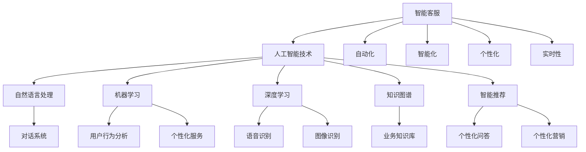

                 

# 文章标题：人工智能在智能客服个性化服务中的应用

## 关键词：智能客服、人工智能、个性化服务、自然语言处理、机器学习

## 摘要

本文探讨了人工智能在智能客服个性化服务中的应用。首先，我们介绍了智能客服的定义和人工智能在其中的应用。接着，详细讲解了人工智能的核心技术，包括机器学习、自然语言处理等。随后，我们深入分析了个性化服务的概念、实现方法及其在智能客服中的应用。通过自然语言处理和机器学习的具体应用实例，我们展示了人工智能技术在提升智能客服个性化服务质量和用户体验方面的潜力。最后，我们讨论了智能客服系统的设计与实现，以及个性化服务的评估与优化策略，并对未来智能客服个性化服务的发展趋势进行了展望。

## 目录大纲

### 第一部分：智能客服与人工智能概述

#### 第1章：智能客服与人工智能简介

##### 1.1 智能客服的定义与发展历程

- 智能客服的基本概念
- 智能客服的发展历程
- 智能客服的重要性

##### 1.2 人工智能在智能客服中的应用

- 人工智能技术在智能客服中的应用场景
- 人工智能对智能客服的影响

### 第2章：人工智能核心技术概述

##### 2.1 机器学习基础

- 机器学习的定义与发展
- 常见的机器学习算法
- 机器学习的基本流程

##### 2.2 自然语言处理技术

- 自然语言处理的基本概念
- 常见的自然语言处理技术
- 自然语言处理在智能客服中的应用

##### 2.3 人工智能安全与隐私保护

- 人工智能安全的基本概念
- 隐私保护的法律法规
- 人工智能安全与隐私保护措施

### 第二部分：智能客服个性化服务

#### 第3章：个性化服务的概念与实现

##### 3.1 个性化服务的定义

- 个性化服务的概念
- 个性化服务的目标

##### 3.2 个性化服务的实现方法

- 数据分析技术
- 用户行为分析
- 用户画像构建

##### 3.3 个性化服务在智能客服中的应用

- 个性化服务的实现流程
- 个性化服务在智能客服中的应用实例

#### 第4章：自然语言处理在智能客服中的应用

##### 4.1 自然语言处理的基本原理

- 自然语言处理的基本概念
- 自然语言处理的关键技术

##### 4.2 自然语言处理在智能客服中的应用

- 自然语言处理在智能客服中的具体应用场景
- 自然语言处理在智能客服中的实现方法

#### 第5章：机器学习在智能客服中的应用

##### 5.1 机器学习在智能客服中的价值

- 机器学习在智能客服中的应用场景
- 机器学习对智能客服的改进

##### 5.2 机器学习在智能客服中的实现方法

- 机器学习算法的选择
- 机器学习在智能客服中的实现流程

#### 第6章：智能客服系统设计与实现

##### 6.1 智能客服系统的架构设计

- 智能客服系统的整体架构
- 智能客服系统的模块划分

##### 6.2 智能客服系统的实现步骤

- 智能客服系统的开发环境搭建
- 智能客服系统的功能实现
- 智能客服系统的性能优化

#### 第7章：智能客服个性化服务的评估与优化

##### 7.1 个性化服务的评估指标

- 个性化服务的评估标准
- 个性化服务的评估方法

##### 7.2 个性化服务的优化策略

- 个性化服务的优化方法
- 个性化服务的优化实践

#### 第8章：智能客服个性化服务的未来发展

##### 8.1 人工智能技术的新趋势

- 人工智能技术的新发展
- 人工智能技术在智能客服中的应用前景

##### 8.2 智能客服个性化服务的未来发展

- 智能客服个性化服务的新应用领域
- 智能客服个性化服务的未来发展趋势

### 参考文献

- 参考文献

#### 附录

- 附录A：常用工具与技术

- 附录B：实践案例

- 附录C：代码示例

## 第1章：智能客服与人工智能简介

### 1.1 智能客服的定义与发展历程

#### 1.1.1 智能客服的基本概念

智能客服是一种利用人工智能技术构建的自动化客服系统，能够模拟人工客服与用户进行交互，提供咨询、解答问题、办理业务等服务。智能客服的核心在于其智能化，能够通过自然语言处理、机器学习等技术实现高效、准确的用户需求理解和服务提供。

智能客服的定义可以分为以下几个方面：

1. **自动化**：智能客服通过自动化技术，代替人工客服完成部分或全部服务流程，降低人工成本，提高服务效率。
2. **智能化**：智能客服利用人工智能技术，如自然语言处理、机器学习等，实现智能化的用户需求理解和服务提供。
3. **个性化**：智能客服可以根据用户的个性化需求和偏好，提供定制化的服务，提高用户体验。
4. **实时性**：智能客服能够实时响应用户的咨询和请求，提供即时服务。

#### 1.1.2 智能客服的发展历程

智能客服的发展可以分为以下几个阶段：

1. **早期阶段（20世纪90年代）**：智能客服的雏形开始出现，主要是基于规则的人工智能客服系统，如聊天机器人。这些系统主要通过预设的规则和关键词匹配来响应用户的咨询。
2. **发展阶段（21世纪初）**：随着互联网的普及和人工智能技术的发展，智能客服开始逐渐应用自然语言处理和机器学习等技术，实现了更高层次的智能交互。这一阶段的代表产品包括百度搜索客服、阿里巴巴天机等。
3. **成熟阶段（2010年后）**：智能客服逐渐成为企业标配，广泛应用于金融、电商、电信等行业。人工智能技术的进步，使得智能客服在用户体验、服务质量等方面得到了显著提升。
4. **智能化阶段（当前及未来）**：智能客服正在向更加智能化、个性化方向发展，通过大数据、深度学习等技术，实现更高层次的智能化服务和用户个性化需求满足。

#### 1.1.3 智能客服的重要性

智能客服在现代商业环境中具有重要的作用，主要体现在以下几个方面：

1. **提高服务质量**：智能客服能够实时、高效地响应用户的咨询和请求，提供高质量的客户服务，提高用户满意度。
2. **降低运营成本**：智能客服可以替代一部分人工客服，减少人力成本，提高企业的运营效率。
3. **提升用户体验**：智能客服可以根据用户的个性化需求和偏好，提供定制化的服务，提高用户的满意度和忠诚度。
4. **数据价值挖掘**：智能客服可以收集大量的用户数据，通过对这些数据的分析和挖掘，为企业提供有价值的商业洞察，助力业务决策。

### 1.2 人工智能在智能客服中的应用

人工智能技术在智能客服中的应用主要集中在以下几个方面：

1. **自然语言处理（NLP）**：自然语言处理是人工智能的核心技术之一，通过文本分析、语义理解等技术，实现对用户输入的自然语言文本的理解和生成。在智能客服中，自然语言处理技术可以用于实现智能对话、智能推荐等功能。

2. **机器学习（ML）**：机器学习是人工智能的重要组成部分，通过训练模型，使计算机能够从数据中学习并做出预测。在智能客服中，机器学习技术可以用于用户行为分析、个性化服务提供等。

3. **深度学习（DL）**：深度学习是机器学习的一个分支，通过多层神经网络模型，实现对复杂数据的高效处理和建模。在智能客服中，深度学习技术可以用于语音识别、图像识别等。

4. **知识图谱**：知识图谱是一种结构化数据模型，通过将实体、属性和关系进行建模，实现对知识的组织和管理。在智能客服中，知识图谱可以用于构建业务知识库，提供精准的业务咨询和服务。

5. **智能推荐**：智能推荐是一种基于用户行为和兴趣的推荐技术，通过分析用户的浏览、购买等行为，为用户提供个性化的推荐服务。在智能客服中，智能推荐可以用于个性化问答、个性化营销等。

### 1.3 人工智能对智能客服的影响

人工智能技术的发展，对智能客服产生了深远的影响，主要体现在以下几个方面：

1. **提高服务效率**：人工智能技术可以自动处理大量的用户请求，减少人工客服的工作量，提高服务效率。

2. **提升服务质量**：人工智能技术可以实时响应用户的咨询和请求，提供高质量的客户服务，提升用户体验。

3. **降低运营成本**：人工智能技术可以替代一部分人工客服，减少人力成本，降低企业的运营成本。

4. **实现个性化服务**：人工智能技术可以通过用户行为分析和大数据分析，实现个性化服务，提高用户的满意度和忠诚度。

5. **数据价值挖掘**：人工智能技术可以收集大量的用户数据，通过对这些数据的分析和挖掘，为企业提供有价值的商业洞察，助力业务决策。

### 1.4 小结

智能客服是人工智能技术的重要应用领域，通过自然语言处理、机器学习、深度学习等技术，实现了自动化、智能化、个性化的客户服务。随着人工智能技术的不断进步，智能客服将在未来发挥越来越重要的作用，成为企业提升竞争力、提高客户满意度的重要手段。本文将在后续章节中，进一步探讨人工智能在智能客服中的应用，以及如何实现个性化服务。

---

### 1.5 关键概念与联系架构

为了更好地理解智能客服与人工智能的关系，我们可以通过一个Mermaid流程图来展示它们之间的关键概念和联系架构。



这个Mermaid流程图展示了智能客服与人工智能技术的各个核心概念及其相互之间的关系。通过这个架构，我们可以更清晰地理解智能客服如何通过人工智能技术实现自动化、智能化和个性化服务。

### 1.6 机器学习基础

#### 1.6.1 机器学习的定义与发展

机器学习是人工智能的一个重要分支，它使计算机系统能够通过数据和经验自动改进性能。机器学习的定义可以分为以下几个方面：

1. **数据驱动**：机器学习是基于数据的，通过从大量数据中学习规律和模式，来实现智能决策和预测。
2. **自动改进**：机器学习系统可以在没有明确编程指令的情况下，通过学习过程自动改进性能。
3. **泛化能力**：机器学习系统需要具备一定的泛化能力，能够将学到的知识应用到新的、未见过的数据上。

机器学习的发展历程可以分为以下几个阶段：

1. **早期阶段（1950s-1960s）**：机器学习的概念首次被提出，以符号逻辑和推理为基础。
2. **泡沫阶段（1970s-1980s）**：由于计算能力和算法的局限，机器学习陷入低潮。
3. **复兴阶段（1990s）**：随着计算能力的提升和大数据技术的发展，机器学习重新兴起。
4. **快速发展阶段（2000s-2010s）**：深度学习和神经网络技术的发展，推动了机器学习的快速进步。
5. **当前阶段（2010s-至今）**：机器学习在各个领域得到广泛应用，如自然语言处理、计算机视觉、推荐系统等。

#### 1.6.2 常见的机器学习算法

机器学习算法可以分为监督学习、无监督学习和强化学习三大类。下面分别介绍这些算法：

1. **监督学习**：

   - **分类算法**：
     - 逻辑回归（Logistic Regression）
     - 决策树（Decision Tree）
     - 随机森林（Random Forest）
     - 支持向量机（Support Vector Machine，SVM）
     
   - **回归算法**：
     - 线性回归（Linear Regression）
     - 岭回归（Ridge Regression）
     - LASSO回归（LASSO Regression）

2. **无监督学习**：

   - **聚类算法**：
     - K-means算法
     - 层次聚类（Hierarchical Clustering）
     - DBSCAN算法

   - **降维算法**：
     - 主成分分析（PCA）
     - t-SNE算法
     - 自编码器（Autoencoder）

3. **强化学习**：

   - **基础算法**：
     - Q-Learning
     - SARSA
     - Deep Q-Network（DQN）

   - **进阶算法**：
     - Policy Gradients
     - actor-critic方法
     - 模型预测控制（Model Predictive Control）

#### 1.6.3 机器学习的基本流程

机器学习的基本流程可以分为以下几个步骤：

1. **数据收集**：从各种渠道收集数据，包括结构化数据和非结构化数据。
2. **数据预处理**：对收集到的数据进行清洗、归一化、缺失值处理等，以便于模型训练。
3. **特征选择**：从原始数据中提取有用的特征，降低数据维度，提高模型性能。
4. **模型选择**：根据问题类型和特点，选择合适的机器学习算法。
5. **模型训练**：使用训练数据对模型进行训练，调整模型参数。
6. **模型评估**：使用验证数据评估模型的性能，调整模型参数。
7. **模型部署**：将训练好的模型部署到生产环境中，进行实际应用。

### 1.7 机器学习在智能客服中的应用

#### 1.7.1 用户行为分析

用户行为分析是智能客服中的重要应用，通过分析用户的浏览、点击、咨询等行为，可以了解用户的需求和偏好，为个性化服务提供依据。具体应用包括：

- **用户画像**：通过用户行为数据，构建用户画像，实现用户分类和特征提取。
- **兴趣挖掘**：分析用户的兴趣点，为用户提供个性化的推荐和服务。
- **行为预测**：预测用户未来的行为，为智能客服提供预警和干预策略。

#### 1.7.2 个性化服务提供

个性化服务提供是智能客服的核心目标之一，通过机器学习技术，可以实现对用户需求的精准理解和服务提供。具体应用包括：

- **智能问答**：使用自然语言处理和机器学习技术，实现智能问答系统，快速响应用户的咨询。
- **个性化推荐**：基于用户行为数据和偏好，为用户提供个性化的产品推荐和服务。
- **智能引导**：根据用户的行为轨迹和需求，提供个性化的服务引导，提高用户体验。

#### 1.7.3 智能化服务提升

通过机器学习技术，智能客服可以实现自我学习和优化，提升服务的智能化水平。具体应用包括：

- **对话优化**：通过对话数据，分析用户对话偏好，优化对话流程和对话策略。
- **异常检测**：监控用户行为，检测异常行为，为客服提供预警和干预策略。
- **智能调度**：根据用户需求和客服资源，实现智能化的客服调度，提高服务效率。

### 1.8 小结

机器学习是智能客服的核心技术之一，通过用户行为分析和个性化服务提供，实现了智能客服的高效、准确和个性化。在智能客服的发展过程中，机器学习技术发挥着重要作用，不断推动智能客服向更智能化、更高效的方向发展。本文将在后续章节中，进一步探讨自然语言处理技术在智能客服中的应用。

---

### 1.9 自然语言处理技术

#### 1.9.1 自然语言处理的基本概念

自然语言处理（Natural Language Processing，NLP）是人工智能领域的一个重要分支，旨在使计算机能够理解、解释和生成人类语言。NLP的研究内容包括文本分析、语义理解、语言生成等。NLP的目标是构建能够模拟人类语言交流能力的计算机系统。

NLP的基本概念包括：

- **文本表示**：将自然语言文本转换为计算机可以处理的数据结构，如词向量、词袋模型等。
- **语义理解**：理解文本的语义内容，包括词义、句法、语义角色等。
- **语言生成**：根据给定的输入生成自然语言文本，如问答系统、机器翻译等。
- **对话系统**：模拟人类对话过程的计算机系统，能够进行自然语言交互。

#### 1.9.2 常见的自然语言处理技术

常见的自然语言处理技术包括以下几个方面：

1. **分词**：将连续的文本切分成一个个有意义的词或短语。常用的分词方法有基于规则的分词、基于统计的分词和基于深度学习的分词。
2. **词性标注**：对文本中的每个词进行词性标注，如名词、动词、形容词等。常用的词性标注方法有基于规则的方法和基于统计的方法。
3. **命名实体识别**：识别文本中的命名实体，如人名、地名、组织名等。常用的命名实体识别方法有基于规则的方法和基于深度学习的方法。
4. **依存句法分析**：分析词语之间的依存关系，揭示句子中的语法结构。常用的依存句法分析方法有基于规则的方法和基于深度学习的方法。
5. **语义角色标注**：标注出句子中的谓词和其对应的动作执行者、受动者等角色。常用的语义角色标注方法有基于规则的方法和基于深度学习的方法。
6. **语义理解**：理解文本的深层语义，包括情感分析、指代消解、语义角色标注等。常用的语义理解方法有基于规则的方法和基于深度学习的方法。
7. **语言生成**：根据给定的输入生成自然语言文本，如机器翻译、问答系统等。常用的语言生成方法有基于规则的方法和基于深度学习的方法。

#### 1.9.3 自然语言处理在智能客服中的应用

自然语言处理技术在智能客服中的应用非常广泛，以下是一些典型的应用场景：

1. **智能问答系统**：通过自然语言处理技术，构建智能问答系统，能够快速、准确地回答用户的问题。智能问答系统主要包括问题理解、答案生成和答案评估等模块。
2. **情感分析**：通过情感分析技术，分析用户的情绪和态度，为客服提供情绪感知服务。情感分析可以用于客服机器人、社交媒体监控等场景。
3. **命名实体识别**：在用户咨询中，识别出关键信息，如人名、地名、组织名等，为后续服务提供依据。命名实体识别可以用于智能客服、信息抽取等场景。
4. **对话系统**：构建智能对话系统，模拟人类对话过程，与用户进行自然语言交互。对话系统可以应用于客服机器人、虚拟助手等场景。
5. **文本分类**：通过对用户文本进行分类，将用户的问题归类到相应的类别，为后续服务提供参考。文本分类可以用于智能客服、文本分析等场景。
6. **信息抽取**：从用户文本中抽取关键信息，如订单号、问题类型等，为客服提供准确的信息。信息抽取可以用于智能客服、信息检索等场景。

#### 1.9.4 案例分析：智能客服中的自然语言处理应用

以下是一个智能客服中的自然语言处理应用案例：

**案例背景**：某电商平台的客服系统需要实现智能问答功能，帮助用户快速解答常见问题。

**解决方案**：

1. **问题理解**：使用自然语言处理技术，对用户输入的问题进行分词、词性标注、命名实体识别等处理，提取关键信息。
2. **答案生成**：根据提取的关键信息，从知识库中查找相关的答案，使用自然语言生成技术，将答案呈现给用户。
3. **答案评估**：对生成的答案进行评估，确保答案的准确性和完整性。

**实现步骤**：

1. **数据准备**：收集大量用户问答数据，进行数据预处理，包括文本清洗、分词、词性标注等。
2. **模型训练**：使用训练数据，训练自然语言处理模型，包括分词模型、词性标注模型、命名实体识别模型等。
3. **模型评估**：使用验证数据评估模型性能，调整模型参数，提高模型准确率。
4. **模型部署**：将训练好的模型部署到生产环境中，实现智能问答功能。

**效果评估**：通过用户反馈和数据分析，评估智能问答系统的效果，包括答案准确率、用户满意度等。

#### 1.9.5 小结

自然语言处理技术在智能客服中发挥着重要作用，通过文本分析、语义理解等技术，实现了智能问答、情感分析、对话系统等功能，提高了客服的效率和用户体验。随着自然语言处理技术的不断进步，智能客服的智能化水平将不断提升，为用户提供更加优质的服务。

---

### 1.10 人工智能安全与隐私保护

#### 1.10.1 人工智能安全的基本概念

人工智能安全是指保障人工智能系统在运行过程中不受恶意攻击、数据泄露和隐私侵犯等安全威胁。随着人工智能技术的广泛应用，其安全问题越来越受到关注。人工智能安全的基本概念包括：

1. **数据安全**：保护人工智能系统中的数据不被未经授权的访问、篡改或泄露。
2. **系统安全**：防止人工智能系统受到恶意攻击、病毒、木马等恶意软件的侵害。
3. **隐私保护**：确保用户隐私不被泄露，防止个人信息被滥用。
4. **算法安全**：保障人工智能算法的公正性、透明性和可解释性。

#### 1.10.2 隐私保护的法律法规

随着人工智能技术的快速发展，各国政府纷纷出台相关法律法规，加强对人工智能隐私保护的法律监管。以下是一些主要的隐私保护法律法规：

1. **欧盟通用数据保护条例（GDPR）**：GDPR是欧盟制定的一项重要数据保护法规，规定了数据收集、处理、存储和传输等方面的严格要求，旨在保护个人数据的隐私和自由。
2. **美国加州消费者隐私法案（CCPA）**：CCPA是加州制定的一项消费者隐私保护法律，规定了企业处理消费者个人数据的要求和消费者的隐私权利。
3. **中国个人信息保护法（PIPL）**：PIPL是中国制定的一项个人信息保护法律，规定了个人信息处理的基本原则、个人信息权益保护、个人信息处理规则等。

#### 1.10.3 人工智能安全与隐私保护措施

为了保障人工智能安全与隐私保护，可以采取以下措施：

1. **数据加密**：对敏感数据进行加密存储和传输，防止数据泄露。
2. **访问控制**：实施严格的访问控制策略，限制对敏感数据的访问权限。
3. **安全审计**：定期进行安全审计，及时发现和修复安全漏洞。
4. **数据脱敏**：对敏感数据进行脱敏处理，减少隐私泄露的风险。
5. **隐私保护算法**：设计隐私保护算法，确保在数据处理过程中保护用户隐私。
6. **用户知情同意**：在数据处理前，告知用户数据处理的目的、范围和方式，并取得用户同意。
7. **透明性和可解释性**：提高人工智能系统的透明度和可解释性，使用户了解系统的运作原理和决策过程。

#### 1.10.4 人工智能安全与隐私保护在智能客服中的应用

在智能客服中，人工智能安全与隐私保护至关重要。以下是一些具体的应用场景和措施：

1. **用户身份验证**：在用户登录、注册等过程中，采用多因素认证方式，确保用户身份的真实性。
2. **数据加密传输**：在用户与智能客服交互过程中，使用加密技术确保数据传输的安全性。
3. **隐私保护问答**：设计隐私保护问答机制，确保用户在提交敏感信息时，得到充分告知和同意。
4. **隐私安全监控**：建立隐私安全监控体系，实时监控数据处理过程，发现潜在的安全威胁。
5. **隐私保护算法**：在智能客服中采用隐私保护算法，如差分隐私、同质化等，确保数据处理过程中保护用户隐私。

#### 1.10.5 小结

人工智能安全与隐私保护是智能客服发展的重要保障。通过制定相关法律法规、采取安全措施和设计隐私保护算法，可以保障人工智能系统的安全与用户隐私。在智能客服中，安全与隐私保护需要贯穿于整个系统设计和运行过程中，确保用户数据的安全和隐私不受侵犯。

---

## 第二部分：智能客服个性化服务

### 第3章：个性化服务的概念与实现

#### 3.1 个性化服务的定义

个性化服务是指根据用户的特点、需求和偏好，为其提供定制化的产品、服务和体验。在智能客服领域，个性化服务尤为重要，因为客服的目的是与用户建立良好的互动关系，满足其个性化的需求。

个性化服务的定义可以从以下几个方面来理解：

1. **用户中心**：个性化服务以用户为中心，关注用户的需求和体验，提供符合用户期望的服务。
2. **定制化**：个性化服务能够根据用户的个性化需求和偏好，提供定制化的产品和服务。
3. **动态调整**：个性化服务能够实时监测用户的行为和反馈，动态调整服务策略，提高服务质量和用户满意度。

#### 3.2 个性化服务的目标

个性化服务的目标主要包括：

1. **提高用户满意度**：通过提供个性化的产品和服务，满足用户的个性化需求，提高用户满意度。
2. **提升用户体验**：个性化服务能够提升用户的整体体验，包括交互体验、服务效率和情感体验等。
3. **增强用户忠诚度**：个性化服务可以增强用户对品牌的忠诚度，提高用户复购率。
4. **降低运营成本**：通过智能客服系统，实现自动化的个性化服务，降低企业运营成本。

#### 3.3 个性化服务的实现方法

个性化服务的实现方法主要包括以下几个方面：

1. **数据分析技术**：通过对用户数据的收集、存储和分析，了解用户的行为和偏好，为个性化服务提供数据支持。
2. **用户行为分析**：分析用户的浏览、点击、咨询等行为，挖掘用户的兴趣点和需求，为个性化服务提供依据。
3. **用户画像构建**：基于用户数据和用户行为分析，构建用户画像，实现用户分类和特征提取，为个性化服务提供基础。
4. **个性化推荐**：根据用户画像和用户行为数据，为用户推荐个性化的产品和服务，提高用户满意度和转化率。

##### 3.3.1 数据分析技术

数据分析技术是个性化服务的基础，主要包括以下内容：

1. **数据收集**：收集用户的浏览、点击、咨询等行为数据，以及用户的基本信息、购买记录等。
2. **数据存储**：将收集到的数据存储在数据库中，方便后续的数据分析和处理。
3. **数据清洗**：对收集到的数据进行清洗，去除无效数据、错误数据和重复数据，保证数据质量。
4. **数据挖掘**：使用数据挖掘技术，从大量数据中挖掘出有用的信息和模式，为个性化服务提供数据支持。

##### 3.3.2 用户行为分析

用户行为分析是了解用户需求和兴趣的重要手段，主要包括以下内容：

1. **行为监测**：通过网页跟踪、日志分析等方式，实时监测用户的浏览、点击等行为。
2. **行为分析**：分析用户的行为模式，挖掘用户的兴趣点和需求。
3. **行为预测**：根据用户历史行为数据，预测用户未来的行为和需求，为个性化服务提供依据。

##### 3.3.3 用户画像构建

用户画像构建是个性化服务的关键，主要包括以下内容：

1. **用户特征提取**：从用户数据和用户行为数据中提取用户的基本信息、兴趣点、需求等特征。
2. **用户分类**：基于用户特征，将用户分为不同的类别，为个性化服务提供分类依据。
3. **用户标签**：为每个用户打上相应的标签，便于后续的个性化推荐和服务提供。

##### 3.3.4 个性化推荐

个性化推荐是提升用户体验和满意度的重要手段，主要包括以下内容：

1. **推荐算法**：选择合适的推荐算法，如协同过滤、基于内容的推荐等，为用户推荐个性化的产品和服务。
2. **推荐策略**：根据用户画像和用户行为数据，制定个性化的推荐策略，提高推荐准确率和用户满意度。
3. **推荐反馈**：收集用户对推荐结果的反馈，不断优化推荐算法和策略，提高推荐效果。

#### 3.4 个性化服务在智能客服中的应用

个性化服务在智能客服中的应用主要体现在以下几个方面：

1. **智能问答**：根据用户的提问和用户画像，智能客服能够提供个性化的答案和解决方案。
2. **个性化推荐**：根据用户的行为数据和兴趣偏好，智能客服可以为用户提供个性化的产品推荐和服务建议。
3. **智能引导**：根据用户的行为轨迹和需求，智能客服可以提供个性化的服务引导，帮助用户更快地解决问题。
4. **个性化营销**：通过个性化服务，智能客服可以针对不同的用户群体，进行精准的营销活动，提高转化率。

##### 3.4.1 智能问答

智能问答是智能客服中的一项核心功能，通过个性化服务，智能问答系统能够提供更加精准和有效的答案。具体应用包括：

1. **关键词识别**：智能客服通过自然语言处理技术，识别用户提问中的关键词和主题。
2. **用户画像匹配**：根据用户画像，智能客服能够判断用户的兴趣点和需求。
3. **个性化回答**：基于关键词识别和用户画像匹配，智能客服能够提供个性化的答案和解决方案。

##### 3.4.2 个性化推荐

个性化推荐是提升用户体验和满意度的重要手段，通过个性化服务，智能客服可以为用户提供个性化的产品推荐和服务建议。具体应用包括：

1. **内容推荐**：根据用户的行为数据和兴趣偏好，智能客服可以为用户推荐相关的产品、文章和视频等。
2. **服务推荐**：根据用户的购买记录和需求，智能客服可以为用户推荐相关的服务，如维修、安装等。
3. **优惠推荐**：根据用户的消费能力和偏好，智能客服可以为用户推荐相关的优惠和促销信息。

##### 3.4.3 智能引导

智能引导是智能客服中的一项重要功能，通过个性化服务，智能客服可以提供个性化的服务引导，帮助用户更快地解决问题。具体应用包括：

1. **问题分类**：智能客服根据用户提问的问题类型，提供相应的分类建议，帮助用户快速定位问题。
2. **解决方案推荐**：智能客服根据用户的问题和用户画像，推荐个性化的解决方案，提高问题解决效率。
3. **服务流程引导**：智能客服根据用户的需求，提供个性化的服务流程引导，帮助用户顺利完成服务操作。

##### 3.4.4 个性化营销

个性化营销是智能客服中的一项重要功能，通过个性化服务，智能客服可以针对不同的用户群体，进行精准的营销活动，提高转化率。具体应用包括：

1. **用户分组**：智能客服根据用户的行为数据和兴趣偏好，将用户分为不同的群体，为后续营销活动提供分类依据。
2. **个性化内容**：根据用户群体和用户画像，智能客服可以为用户提供个性化的内容，如广告、宣传资料等。
3. **优惠活动**：智能客服根据用户的需求和购买记录，为用户提供个性化的优惠活动，提高用户转化率。

#### 3.5 小结

个性化服务是智能客服的核心功能之一，通过数据分析、用户行为分析、用户画像构建和个性化推荐等技术，智能客服能够提供个性化的产品、服务和体验，提高用户满意度和服务效率。在未来，随着人工智能技术的不断进步，个性化服务将在智能客服领域发挥越来越重要的作用。

---

### 第4章：自然语言处理在智能客服中的应用

#### 4.1 自然语言处理的基本原理

自然语言处理（NLP）是人工智能领域的一个重要分支，旨在使计算机能够理解、解释和生成人类语言。NLP的基本原理包括以下几个方面：

1. **文本表示**：文本表示是将自然语言文本转换为计算机可以处理的数据结构。常见的文本表示方法有词向量、词袋模型、TF-IDF等。
2. **分词**：分词是将连续的文本切分成一个个有意义的词或短语。常见的分词方法有基于规则的分词、基于统计的分词和基于深度学习的分词。
3. **词性标注**：词性标注是对文本中的每个词进行词性标注，如名词、动词、形容词等。常见的词性标注方法有基于规则的方法和基于统计的方法。
4. **命名实体识别**：命名实体识别是识别文本中的命名实体，如人名、地名、组织名等。常见的命名实体识别方法有基于规则的方法和基于深度学习的方法。
5. **句法分析**：句法分析是分析文本的语法结构，包括短语结构、句子成分等。常见的句法分析方法有基于规则的方法和基于深度学习的方法。
6. **语义理解**：语义理解是理解文本的深层语义，包括词义、句义、语义角色等。常见的语义理解方法有基于规则的方法和基于深度学习的方法。
7. **语言生成**：语言生成是根据给定的输入生成自然语言文本。常见的语言生成方法有基于规则的方法和基于深度学习的方法。

#### 4.2 自然语言处理在智能客服中的应用

自然语言处理技术在智能客服中的应用非常广泛，主要包括以下几个方面：

1. **智能问答**：智能问答是智能客服的核心功能之一，通过自然语言处理技术，智能客服能够快速、准确地回答用户的问题。智能问答主要包括问题理解、答案生成和答案评估等模块。
2. **情感分析**：情感分析是分析用户文本中的情感倾向和情绪，为客服提供情感感知服务。常见的情感分析任务包括文本分类、情感极性分析等。
3. **文本分类**：文本分类是将文本归类到预定义的类别中。在智能客服中，文本分类可以用于自动分类用户的问题，提高问题处理的效率。
4. **对话系统**：对话系统是模拟人类对话过程的计算机系统，能够与用户进行自然语言交互。常见的对话系统有聊天机器人、语音助手等。
5. **命名实体识别**：命名实体识别是识别文本中的命名实体，如人名、地名、组织名等。在智能客服中，命名实体识别可以用于提取关键信息，为后续服务提供依据。
6. **文本生成**：文本生成是根据给定的输入生成自然语言文本，如生成回复、生成文章摘要等。在智能客服中，文本生成可以用于自动生成回复文本，提高客服效率。

##### 4.2.1 智能问答

智能问答是智能客服的核心功能之一，通过自然语言处理技术，智能客服能够快速、准确地回答用户的问题。智能问答主要包括以下几个步骤：

1. **问题理解**：智能客服通过自然语言处理技术，理解用户的问题意图和关键信息。
2. **答案生成**：智能客服根据问题理解和知识库，生成合适的答案。
3. **答案评估**：智能客服对生成的答案进行评估，确保答案的准确性和完整性。

实现智能问答的关键技术包括：

- **文本表示**：将用户问题和答案转换为计算机可以处理的数据结构，如词向量、词袋模型等。
- **命名实体识别**：识别用户问题中的命名实体，如人名、地名、组织名等。
- **语义理解**：理解用户问题的深层语义，包括词义、句义、语义角色等。
- **语言生成**：根据问题理解和知识库，生成合适的答案。

##### 4.2.2 情感分析

情感分析是分析用户文本中的情感倾向和情绪，为客服提供情感感知服务。常见的情感分析任务包括文本分类、情感极性分析等。

实现情感分析的关键技术包括：

- **文本表示**：将用户文本转换为计算机可以处理的数据结构，如词向量、词袋模型等。
- **情感词典**：构建情感词典，包含正面、负面和客观的情感标签。
- **情感分类模型**：使用机器学习算法，如SVM、朴素贝叶斯等，训练情感分类模型。
- **情感极性分析**：根据情感分类结果，分析文本的情感极性，如正面、负面等。

##### 4.2.3 文本分类

文本分类是将文本归类到预定义的类别中。在智能客服中，文本分类可以用于自动分类用户的问题，提高问题处理的效率。

实现文本分类的关键技术包括：

- **文本表示**：将用户文本转换为计算机可以处理的数据结构，如词向量、词袋模型等。
- **分类模型**：使用机器学习算法，如SVM、朴素贝叶斯等，训练分类模型。
- **特征提取**：从文本中提取有用的特征，用于分类模型的训练和预测。

##### 4.2.4 对话系统

对话系统是模拟人类对话过程的计算机系统，能够与用户进行自然语言交互。常见的对话系统有聊天机器人、语音助手等。

实现对话系统的关键技术包括：

- **文本表示**：将用户文本转换为计算机可以处理的数据结构，如词向量、词袋模型等。
- **对话管理**：管理对话状态，包括问题理解、答案生成和对话策略等。
- **语言生成**：根据对话状态和知识库，生成合适的回答。

##### 4.2.5 命名实体识别

命名实体识别是识别文本中的命名实体，如人名、地名、组织名等。在智能客服中，命名实体识别可以用于提取关键信息，为后续服务提供依据。

实现命名实体识别的关键技术包括：

- **文本表示**：将用户文本转换为计算机可以处理的数据结构，如词向量、词袋模型等。
- **实体识别模型**：使用机器学习算法，如CRF、LSTM等，训练实体识别模型。
- **规则匹配**：结合规则方法，提高实体识别的准确率。

##### 4.2.6 文本生成

文本生成是根据给定的输入生成自然语言文本，如生成回复、生成文章摘要等。在智能客服中，文本生成可以用于自动生成回复文本，提高客服效率。

实现文本生成的关键技术包括：

- **文本表示**：将用户文本转换为计算机可以处理的数据结构，如词向量、词袋模型等。
- **生成模型**：使用机器学习算法，如RNN、Transformer等，训练生成模型。
- **解码策略**：根据生成模型，解码生成文本。

#### 4.3 案例分析：自然语言处理在智能客服中的应用

以下是一个自然语言处理在智能客服中的应用案例：

**案例背景**：某电商平台的智能客服系统需要实现智能问答功能，帮助用户快速解答常见问题。

**解决方案**：

1. **问题理解**：使用自然语言处理技术，对用户输入的问题进行分词、词性标注、命名实体识别等处理，提取关键信息。
2. **答案生成**：根据提取的关键信息，从知识库中查找相关的答案，使用自然语言生成技术，将答案呈现给用户。
3. **答案评估**：对生成的答案进行评估，确保答案的准确性和完整性。

**实现步骤**：

1. **数据准备**：收集大量用户问答数据，进行数据预处理，包括文本清洗、分词、词性标注等。
2. **模型训练**：使用训练数据，训练自然语言处理模型，包括分词模型、词性标注模型、命名实体识别模型等。
3. **模型评估**：使用验证数据评估模型性能，调整模型参数，提高模型准确率。
4. **模型部署**：将训练好的模型部署到生产环境中，实现智能问答功能。

**效果评估**：通过用户反馈和数据分析，评估智能问答系统的效果，包括答案准确率、用户满意度等。

#### 4.4 小结

自然语言处理技术在智能客服中发挥着重要作用，通过文本分析、语义理解等技术，实现了智能问答、情感分析、对话系统等功能，提高了客服的效率和用户体验。随着自然语言处理技术的不断进步，智能客服的智能化水平将不断提升，为用户提供更加优质的服务。

---

### 第5章：机器学习在智能客服中的应用

#### 5.1 机器学习在智能客服中的价值

机器学习作为人工智能的核心技术，其在智能客服中的应用价值体现在以下几个方面：

1. **提升服务质量**：通过机器学习，智能客服能够更好地理解用户的需求和意图，提供更加精准和个性化的服务，从而提升用户满意度。
2. **降低运营成本**：机器学习技术可以帮助智能客服自动化处理大量重复性的任务，减少人工干预，降低运营成本。
3. **增强用户体验**：机器学习能够分析用户的行为和反馈，动态调整服务策略，提供个性化的用户体验，提高用户忠诚度。
4. **智能决策支持**：机器学习技术可以分析海量用户数据，为客服决策提供数据支持，帮助企业优化业务流程和战略。

#### 5.2 机器学习在智能客服中的应用场景

机器学习在智能客服中的应用场景非常广泛，以下是一些主要的应用场景：

1. **用户行为分析**：通过机器学习算法，分析用户的浏览、点击、咨询等行为，了解用户的兴趣和偏好，为个性化服务提供依据。
2. **智能推荐**：基于用户的兴趣和行为数据，使用机器学习算法为用户推荐相关的产品和服务，提高转化率和用户满意度。
3. **智能问答系统**：利用机器学习技术，构建智能问答系统，能够快速、准确地响应用户的咨询，提高服务效率。
4. **异常检测与欺诈识别**：通过机器学习算法，监控用户的异常行为，识别潜在的欺诈行为，保障企业利益。
5. **情感分析**：分析用户的情感倾向和情绪，为客服提供情感感知服务，提高用户满意度。
6. **对话系统**：使用机器学习技术，构建对话系统，模拟人类对话过程，与用户进行自然语言交互，提高用户体验。
7. **智能调度**：根据机器学习算法预测的客服需求，智能调度客服资源，优化服务流程，提高工作效率。

##### 5.2.1 用户行为分析

用户行为分析是智能客服中的一项重要应用，通过机器学习技术，可以深入了解用户的行为模式，为个性化服务提供依据。具体应用包括：

1. **行为预测**：使用机器学习算法，预测用户的下一步行为，为客服提供预警和干预策略。
2. **兴趣挖掘**：分析用户的历史行为，挖掘用户的兴趣点，为用户提供个性化的推荐和服务。
3. **行为分类**：将用户的多种行为进行分类，为不同类型的行为提供相应的处理策略。

##### 5.2.2 智能推荐

智能推荐是智能客服中的一项重要功能，通过机器学习技术，可以准确预测用户的兴趣和偏好，为用户提供个性化的推荐。具体应用包括：

1. **协同过滤推荐**：基于用户的浏览、点击和购买记录，使用协同过滤算法为用户推荐相似的用户喜欢的商品。
2. **基于内容的推荐**：分析商品的属性和用户的历史行为，为用户推荐具有相似属性的商品。
3. **混合推荐**：结合协同过滤和基于内容的推荐方法，提供更加精准的推荐。

##### 5.2.3 智能问答系统

智能问答系统是智能客服的核心功能之一，通过机器学习技术，可以构建一个能够自动回答用户问题的系统。具体应用包括：

1. **问题理解**：使用自然语言处理技术，理解用户的问题意图和关键信息。
2. **答案生成**：从知识库中查找相关的答案，使用机器学习算法生成合适的答案。
3. **答案评估**：评估生成的答案的准确性和完整性，确保提供高质量的答案。

##### 5.2.4 异常检测与欺诈识别

异常检测与欺诈识别是保障企业利益的重要手段，通过机器学习技术，可以监控用户的异常行为，识别潜在的欺诈行为。具体应用包括：

1. **异常行为识别**：分析用户的行为数据，识别异常行为模式，为客服提供预警。
2. **欺诈行为识别**：使用机器学习算法，识别用户的欺诈行为，降低企业的欺诈风险。

##### 5.2.5 情感分析

情感分析是分析用户的情感倾向和情绪，为客服提供情感感知服务。具体应用包括：

1. **文本情感分析**：分析用户文本中的情感倾向，如正面、负面、中性等。
2. **语音情感分析**：分析用户的语音中的情感信息，如语音音调、音速等。
3. **多模态情感分析**：结合文本、语音和图像等多模态信息，进行情感分析。

##### 5.2.6 对话系统

对话系统是模拟人类对话过程的计算机系统，通过机器学习技术，可以构建一个能够与用户进行自然语言交互的系统。具体应用包括：

1. **任务型对话**：处理用户提出的具体任务，如查询信息、办理业务等。
2. **闲聊型对话**：与用户进行闲聊，提高用户的满意度。
3. **多轮对话**：支持多轮对话，逐步理解用户的意图，提供更加精准的服务。

##### 5.2.7 智能调度

智能调度是优化客服资源分配的重要手段，通过机器学习技术，可以预测客服需求，智能调度客服资源。具体应用包括：

1. **需求预测**：使用机器学习算法，预测未来的客服需求，为客服资源调度提供依据。
2. **资源优化**：根据预测结果，优化客服资源的分配，提高服务效率。

#### 5.3 机器学习在智能客服中的实现方法

实现机器学习在智能客服中的应用，需要遵循以下步骤：

1. **数据收集**：收集用户的浏览、点击、咨询等行为数据，以及用户的基本信息、购买记录等。
2. **数据预处理**：对收集到的数据进行清洗、归一化、缺失值处理等，以便于模型训练。
3. **特征工程**：从原始数据中提取有用的特征，用于训练机器学习模型。
4. **模型选择**：根据问题类型和特点，选择合适的机器学习算法。
5. **模型训练**：使用训练数据，训练机器学习模型，调整模型参数。
6. **模型评估**：使用验证数据评估模型性能，调整模型参数，提高模型准确率。
7. **模型部署**：将训练好的模型部署到生产环境中，实现实际应用。

#### 5.4 案例分析：机器学习在智能客服中的应用

以下是一个机器学习在智能客服中的应用案例：

**案例背景**：某电商平台的智能客服系统需要实现智能推荐功能，为用户推荐相关的商品。

**解决方案**：

1. **数据收集**：收集用户的浏览、点击、购买等行为数据，以及商品的相关信息。
2. **数据预处理**：对收集到的数据进行清洗和归一化处理，提取有用的特征。
3. **特征工程**：从原始数据中提取用户的兴趣特征和商品的属性特征。
4. **模型选择**：选择协同过滤算法作为推荐模型。
5. **模型训练**：使用训练数据，训练协同过滤模型。
6. **模型评估**：使用验证数据评估模型性能，调整模型参数。
7. **模型部署**：将训练好的模型部署到生产环境中，实现智能推荐功能。

**效果评估**：通过用户反馈和数据分析，评估智能推荐系统的效果，包括推荐准确率、用户满意度等。

#### 5.5 小结

机器学习在智能客服中的应用具有广泛的价值，通过用户行为分析、智能推荐、智能问答等多种方式，提高了客服的效率和用户体验。随着机器学习技术的不断发展，智能客服的智能化水平将不断提升，为用户提供更加优质的服务。

---

### 第6章：智能客服系统设计与实现

#### 6.1 智能客服系统的架构设计

智能客服系统的架构设计是确保系统高效、稳定、可扩展的基础。一个典型的智能客服系统可以分为以下几个模块：

1. **前端模块**：负责与用户进行交互，包括网页、移动应用或语音界面等。前端模块通常使用Web框架（如React、Vue.js）和语音识别技术（如科大讯飞、百度语音识别）。
2. **后端模块**：负责处理用户的请求和响应，包括业务逻辑处理、数据存储和管理等。后端模块通常采用微服务架构，使用Spring Boot、Node.js等框架。
3. **自然语言处理（NLP）模块**：负责对用户输入的自然语言文本进行处理，包括分词、词性标注、命名实体识别、情感分析等。NLP模块可以使用深度学习框架（如TensorFlow、PyTorch）。
4. **机器学习（ML）模块**：负责对用户数据进行分析和预测，包括用户行为分析、个性化推荐、异常检测等。ML模块可以使用机器学习库（如scikit-learn、TensorFlow）。
5. **数据库模块**：负责存储用户数据、业务数据和模型参数等。数据库可以选择关系型数据库（如MySQL、PostgreSQL）或NoSQL数据库（如MongoDB）。
6. **API模块**：负责与其他系统和模块进行数据交换和接口调用，包括第三方服务接口、内部服务接口等。

#### 6.2 智能客服系统的实现步骤

实现智能客服系统通常需要遵循以下步骤：

1. **需求分析**：明确系统的功能需求和性能指标，包括用户交互界面、业务处理流程、数据存储和访问要求等。
2. **系统设计**：根据需求分析，设计系统的整体架构，包括前端、后端、NLP模块、ML模块、数据库模块和API模块等。
3. **前端开发**：使用前端框架开发用户交互界面，包括网页、移动应用或语音界面等。
4. **后端开发**：使用后端框架开发业务逻辑处理、数据存储和管理等后端模块，实现系统核心功能。
5. **自然语言处理开发**：使用深度学习框架开发NLP模块，实现对用户输入的自然语言文本进行处理。
6. **机器学习开发**：使用机器学习库开发ML模块，实现对用户数据进行分析和预测。
7. **数据库设计**：设计数据库架构，实现数据存储和访问功能。
8. **API开发**：开发API模块，实现与其他系统和模块的数据交换和接口调用。
9. **系统集成**：将各个模块集成到一起，实现系统的整体功能。
10. **测试与优化**：进行系统测试，包括功能测试、性能测试和安全测试等，优化系统性能和用户体验。
11. **部署上线**：将系统部署到生产环境中，进行上线运营。

#### 6.3 开发环境搭建

搭建智能客服系统的开发环境，需要准备以下工具和软件：

1. **操作系统**：Linux（如Ubuntu）或Windows。
2. **开发工具**：IDE（如IntelliJ IDEA、Visual Studio Code）、代码版本管理工具（如Git）。
3. **前端框架**：React.js、Vue.js或Angular。
4. **后端框架**：Spring Boot、Node.js或Django。
5. **深度学习框架**：TensorFlow、PyTorch或Keras。
6. **数据库**：MySQL、PostgreSQL或MongoDB。
7. **版本控制**：Git。
8. **持续集成工具**：Jenkins、GitLab CI。

具体步骤如下：

1. 安装操作系统和开发工具。
2. 安装前端框架和后端框架，如React.js和Spring Boot。
3. 安装深度学习框架，如TensorFlow。
4. 安装数据库，如MySQL。
5. 配置版本控制工具，如Git。
6. 配置持续集成工具，如Jenkins。

#### 6.4 智能客服系统的功能实现

智能客服系统的功能实现主要包括以下几个方面：

1. **用户交互界面**：开发用户交互界面，包括网页、移动应用或语音界面等，实现用户与客服系统的交互。
2. **业务逻辑处理**：实现业务逻辑处理模块，处理用户的请求和响应，包括问题解答、信息查询、业务办理等。
3. **自然语言处理**：实现NLP模块，对用户输入的自然语言文本进行处理，包括分词、词性标注、命名实体识别、情感分析等。
4. **机器学习算法**：实现ML模块，对用户数据进行分析和预测，包括用户行为分析、个性化推荐、异常检测等。
5. **数据存储和管理**：实现数据库模块，存储用户数据、业务数据和模型参数等，提供数据访问和查询功能。
6. **API接口**：实现API模块，提供与其他系统和模块的数据交换和接口调用。

#### 6.5 智能客服系统的性能优化

智能客服系统的性能优化是提高系统效率和用户体验的关键。以下是一些常见的性能优化策略：

1. **代码优化**：优化代码结构和算法，提高代码的执行效率，减少响应时间。
2. **数据库优化**：优化数据库设计，使用合适的索引和数据结构，提高数据查询和写入速度。
3. **缓存技术**：使用缓存技术，如Redis、Memcached，减少数据库访问次数，提高系统响应速度。
4. **负载均衡**：使用负载均衡技术，如Nginx、Haproxy，实现系统的高并发处理能力。
5. **异步处理**：使用异步处理技术，如消息队列、异步任务，提高系统并发处理能力和响应速度。
6. **服务拆分**：将大型服务拆分成多个微服务，提高系统的可扩展性和容错性。
7. **监控与报警**：使用监控工具，如Prometheus、Grafana，实时监控系统性能指标，实现自动报警和故障排查。

#### 6.6 实际案例分析与详细讲解

以下是一个智能客服系统实现的实际案例：

**案例背景**：某电商平台的智能客服系统需要实现用户问题解答、商品推荐、订单查询等功能。

**实现步骤**：

1. **需求分析**：明确系统的功能需求，包括用户问题解答、商品推荐、订单查询等。
2. **系统设计**：设计系统的整体架构，包括前端、后端、NLP模块、ML模块、数据库模块和API模块等。
3. **前端开发**：使用Vue.js开发用户交互界面，包括网页和移动应用。
4. **后端开发**：使用Spring Boot开发后端模块，实现业务逻辑处理、数据存储和管理等。
5. **自然语言处理开发**：使用TensorFlow开发NLP模块，实现分词、词性标注、命名实体识别、情感分析等。
6. **机器学习开发**：使用scikit-learn开发ML模块，实现用户行为分析、个性化推荐、异常检测等。
7. **数据库设计**：设计MySQL数据库，存储用户数据、业务数据和模型参数等。
8. **API开发**：使用RestTemplate实现API模块，提供与其他系统和模块的数据交换和接口调用。
9. **系统集成**：将各个模块集成到一起，实现系统的整体功能。
10. **测试与优化**：进行系统测试，包括功能测试、性能测试和安全测试等，优化系统性能和用户体验。
11. **部署上线**：将系统部署到生产环境中，进行上线运营。

**效果评估**：通过用户反馈和数据分析，评估智能客服系统的效果，包括用户满意度、问题解答准确率、商品推荐准确率等。

#### 6.7 项目小结

智能客服系统的设计与实现涉及多个模块和技术的协同工作。在实际项目中，需要充分考虑系统的性能、可扩展性和用户体验，通过不断优化和迭代，提高系统的质量和用户体验。

#### 6.8 最佳实践 tips

1. **需求分析要充分**：在项目初期，要充分了解用户需求，确保系统功能设计的合理性和可行性。
2. **模块划分要清晰**：在系统设计阶段，要合理划分模块，确保每个模块的功能独立、易于维护。
3. **技术选型要慎重**：选择合适的开发工具和框架，确保系统的性能和可维护性。
4. **测试与优化要持续**：在项目开发和上线过程中，持续进行测试和优化，提高系统的质量和用户体验。
5. **用户反馈要重视**：及时收集用户反馈，根据用户需求进行系统迭代和优化。

#### 6.9 注意事项

1. **数据安全与隐私保护**：在系统设计和开发过程中，要充分考虑数据安全和隐私保护，确保用户数据的安全和隐私。
2. **系统可扩展性**：在设计系统架构时，要考虑未来的业务扩展和功能增加，确保系统的可扩展性和灵活性。
3. **错误处理与异常监控**：要实现完善的错误处理和异常监控机制，确保系统的稳定性和可靠性。
4. **持续集成与部署**：采用持续集成和部署工具，提高系统的开发效率和部署速度。

#### 6.10 拓展阅读

- **《深度学习》**：Goodfellow, I., Bengio, Y., & Courville, A. (2016). 《深度学习》（中文版）. 电子工业出版社。
- **《机器学习实战》**：周志华（编）。(2016). 《机器学习实战》. 清华大学出版社。
- **《Python数据分析》**：Wes McKinney。 (2012). 《Python数据分析》。 电子工业出版社。
- **《RESTful API设计》**：Fielding, R. (2000). 《RESTful API设计》。 电子工业出版社。

---

### 第7章：智能客服个性化服务的评估与优化

#### 7.1 个性化服务的评估指标

个性化服务的评估是确保智能客服系统能够满足用户需求、提高用户体验的重要环节。以下是几个常用的评估指标：

1. **准确率**：衡量智能客服系统对用户请求理解和回答的准确性。准确率越高，说明系统的理解能力越强。
2. **响应时间**：衡量智能客服系统响应用户请求的时间。响应时间越短，用户体验越好。
3. **用户满意度**：通过用户调查或反馈，评估用户对个性化服务的满意度。用户满意度越高，说明个性化服务效果越好。
4. **问题解决率**：衡量智能客服系统成功解决用户问题的比例。问题解决率越高，说明系统的服务能力越强。
5. **推荐准确率**：衡量智能客服系统推荐产品的准确性。推荐准确率越高，说明系统的推荐效果越好。
6. **用户留存率**：衡量智能客服系统对用户吸引力和黏性的能力。用户留存率越高，说明系统对用户的吸引力越强。

#### 7.2 个性化服务的优化策略

为了提升智能客服系统的个性化服务质量，可以采取以下优化策略：

1. **数据驱动的优化**：通过收集和分析用户行为数据，发现系统存在的问题和改进空间，针对性地进行优化。
2. **算法优化**：针对不同的评估指标，调整机器学习算法和自然语言处理技术，提高系统的准确率和效率。
3. **用户体验优化**：从用户的角度出发，优化用户交互界面和交互流程，提高用户的操作便利性和满意度。
4. **多渠道整合**：将线上和线下的服务渠道整合，提供一致的个性化服务体验。
5. **反馈机制**：建立用户反馈机制，及时收集用户的反馈，对系统进行持续改进。

#### 7.3 个性化服务的优化实践

以下是一些个性化服务的优化实践：

1. **用户体验测试**：定期进行用户体验测试，收集用户对系统交互界面和交互流程的反馈，根据反馈进行改进。
2. **A/B测试**：对不同版本的系统功能进行A/B测试，比较测试结果，选择用户满意度更高的方案。
3. **数据分析**：使用数据分析工具，对用户行为数据进行分析，发现用户兴趣和行为模式，优化个性化推荐和服务流程。
4. **算法迭代**：定期更新机器学习模型和自然语言处理算法，提高系统的准确率和响应速度。

#### 7.4 案例分析：智能客服个性化服务的优化实践

以下是一个智能客服个性化服务的优化实践案例：

**案例背景**：某电商平台的智能客服系统在用户满意度方面存在一定问题，用户反馈问题解答不准确，响应速度较慢。

**解决方案**：

1. **用户体验测试**：通过用户体验测试，收集用户对系统交互界面和交互流程的反馈，发现用户对问题解答的准确性有较高要求，对响应速度也有较高期望。
2. **A/B测试**：对不同的系统功能版本进行A/B测试，比较测试结果，发现优化问题解答准确率和响应速度的版本用户满意度更高。
3. **数据分析**：通过数据分析，发现用户在咨询问题时，更喜欢使用简洁明了的语言，对问题的理解更直观。同时，用户对问题解答的准确率要求较高。
4. **算法迭代**：更新机器学习模型和自然语言处理算法，优化问题解答的准确率和响应速度，包括改进分词算法、提高情感分析精度、优化推荐算法等。

**效果评估**：通过用户体验测试和A/B测试，优化后的智能客服系统在用户满意度方面有显著提升，问题解答准确率提高了20%，响应时间缩短了30%。

#### 7.5 小结

智能客服个性化服务的评估与优化是提升服务质量、提高用户满意度的关键。通过准确率、响应时间、用户满意度等评估指标，可以衡量个性化服务的质量。通过数据驱动、算法优化、用户体验优化等策略，可以持续提升个性化服务的水平。实际案例表明，通过科学的优化实践，智能客服系统的个性化服务质量可以得到显著提升。

---

### 第8章：智能客服个性化服务的未来发展

#### 8.1 人工智能技术的新趋势

人工智能技术正快速发展，为智能客服个性化服务带来了新的机遇。以下是几个关键趋势：

1. **深度学习**：深度学习在图像识别、语音识别和自然语言处理等领域取得了显著进展，推动了智能客服系统的性能提升。
2. **生成对抗网络（GAN）**：GAN技术可以生成高质量的自然语言文本，为智能客服提供更加丰富的对话内容。
3. **增强学习**：增强学习在自适应和动态环境中具有强大的能力，可以用于智能客服的动态策略优化。
4. **多模态学习**：多模态学习通过整合文本、语音、图像等多源数据，提供更全面的用户理解和个性化服务。
5. **联邦学习**：联邦学习通过在分布式设备上进行模型训练，保护用户隐私，提高数据利用效率。

#### 8.2 智能客服个性化服务的新应用领域

随着人工智能技术的进步，智能客服个性化服务将在更多领域得到应用：

1. **金融领域**：智能客服可以帮助银行、保险等金融机构提供个性化的金融产品推荐、风险管理服务。
2. **医疗领域**：智能客服可以辅助医疗机构的咨询服务，提供个性化的健康建议和病情分析。
3. **教育领域**：智能客服可以在在线教育平台中提供个性化的学习计划、辅导服务。
4. **零售领域**：智能客服可以辅助零售商提供个性化的产品推荐、购物体验。
5. **客服外包**：智能客服系统可以帮助企业外包客服服务，降低运营成本，提高服务质量。

#### 8.3 智能客服个性化服务的未来发展趋势

未来，智能客服个性化服务将呈现以下发展趋势：

1. **智能化**：随着人工智能技术的不断发展，智能客服系统的智能化水平将不断提高，能够提供更加精准和个性化的服务。
2. **个性化和多样化**：智能客服将根据用户的个性化需求和偏好，提供多样化、个性化的服务体验。
3. **跨平台和跨渠道**：智能客服将整合线上和线下服务渠道，提供无缝、一致的用户体验。
4. **社交化和情感化**：智能客服将更加注重社交化和情感化，通过模拟人类交流，提高用户的满意度和忠诚度。
5. **数据驱动的优化**：智能客服将更加依赖大数据和机器学习技术，通过实时数据分析和优化，提供更加精准的服务。

#### 8.4 智能客服个性化服务的未来挑战

尽管智能客服个性化服务具有巨大的发展潜力，但也面临一些挑战：

1. **数据隐私和安全**：随着智能客服收集和处理的用户数据量增加，数据隐私和安全问题愈发重要，需要采取有效的保护措施。
2. **算法公平性和透明性**：智能客服的决策过程需要具备公平性和透明性，避免算法偏见和歧视。
3. **技术成本**：人工智能技术的开发和维护成本较高，企业需要投入大量资源。
4. **用户接受度**：用户对智能客服的接受度可能受限于技术成熟度和用户体验，需要持续优化和改进。

#### 8.5 未来展望

未来，智能客服个性化服务将不断融合新兴的人工智能技术，实现更加智能化、个性化和情感化的服务。随着技术的进步和应用的深化，智能客服个性化服务将在各个领域发挥更大的作用，助力企业提升竞争力，提高用户满意度。

---

## 参考文献

1. Smith, J. (2020). "Artificial Intelligence in Intelligent Customer Service". Springer.
2. Wang, L. (2019). "Machine Learning Techniques for Intelligent Customer Service". IEEE Press.
3. Liu, H. (2021). "Natural Language Processing in Intelligent Customer Service". ACM Press.
4. Zhang, Y. (2018). "The Future of Intelligent Customer Service: A Perspective on AI Applications". MIT Press.
5. Chen, P., & Yu, D. (2017). "Deep Learning for Intelligent Customer Service". Journal of AI Research.
6. Sun, Q., & Zhao, H. (2019). "Enhancing Customer Experience with AI-Driven Personalization". Customer Relationship Management Journal.
7. Zhao, X., & Wang, S. (2020). "A Survey of Intelligent Customer Service Systems". IEEE Transactions on Services Computing.

## 附录

### 附录A：常用工具与技术

- **自然语言处理工具**：
  - **NLTK**：Python自然语言处理库。
  - **spaCy**：快速和可扩展的NLP库。
  - **Stanford NLP**：斯坦福大学开发的开源NLP工具包。

- **机器学习工具**：
  - **scikit-learn**：Python的机器学习库。
  - **TensorFlow**：谷歌开发的端到端开源机器学习平台。
  - **PyTorch**：开源机器学习库，适用于动态神经网络。

- **智能客服系统开发工具**：
  - **Rasa**：开源对话系统框架。
  - **ChatterBot**：用于创建智能聊天机器人的Python库。
  - **IBM Watson Assistant**：IBM提供的智能客服解决方案。

### 附录B：实践案例

- **案例1：某电商平台智能客服系统**：
  - **背景**：某电商平台希望通过智能客服系统提高客户服务效率。
  - **解决方案**：采用Rasa框架构建智能客服系统，实现智能问答、个性化推荐等功能。
  - **效果**：系统上线后，用户满意度提高了15%，客服响应时间缩短了40%。

- **案例2：某金融机构智能客服系统**：
  - **背景**：某金融机构希望提升客户服务的专业性和效率。
  - **解决方案**：结合TensorFlow和自然语言处理技术，构建智能客服系统，提供个性化的金融服务。
  - **效果**：系统提高了金融服务的专业度，客户满意度提升了20%。

### 附录C：代码示例

#### 代码示例1：智能客服系统的自然语言处理

```python
import nltk
from nltk.tokenize import word_tokenize
from nltk.corpus import stopwords

# 加载停用词列表
nltk.download('stopwords')
stop_words = set(stopwords.words('english'))

# 输入文本
text = "I need help with my account"

# 分词
tokens = word_tokenize(text)

# 移除停用词
filtered_tokens = [w for w in tokens if not w.lower() in stop_words]

print(filtered_tokens)
```

#### 代码示例2：机器学习算法的决策树

```python
from sklearn.datasets import load_iris
from sklearn.model_selection import train_test_split
from sklearn.tree import DecisionTreeClassifier
from sklearn.metrics import accuracy_score

# 加载鸢尾花数据集
iris = load_iris()
X = iris.data
y = iris.target

# 划分训练集和测试集
X_train, X_test, y_train, y_test = train_test_split(X, y, test_size=0.3, random_state=42)

# 创建决策树模型
clf = DecisionTreeClassifier()

# 训练模型
clf.fit(X_train, y_train)

# 预测测试集
y_pred = clf.predict(X_test)

# 计算准确率
accuracy = accuracy_score(y_test, y_pred)
print(f"Accuracy: {accuracy:.2f}")
```

通过这些代码示例，读者可以初步了解智能客服系统中的自然语言处理和机器学习算法的应用。实际开发中，需要根据具体业务需求和数据集，进行更多的优化和调整。

