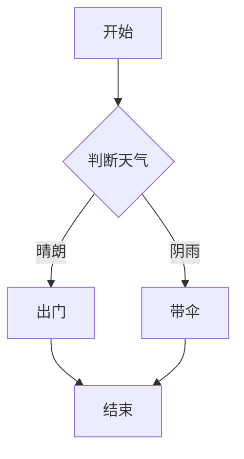

                 

## 文章标题

《人工智能在智能客服中的应用与优化》

> 关键词：人工智能、智能客服、自然语言处理、机器学习、深度学习、应用与优化

> 摘要：本文从人工智能与智能客服的基础概念入手，逐步深入探讨人工智能在智能客服中的应用与优化策略。通过分析自然语言处理、机器学习和深度学习等核心技术，本文详细讲解了智能客服系统的设计与优化方法，并结合实际案例分析，提供了实战指导。文章最后探讨了人工智能在智能客服中的应用前景与伦理问题，为未来研究与发展提供了启示。

## 目录大纲

### 第一部分：人工智能与智能客服基础

### 第二部分：人工智能在智能客服中的应用

### 第三部分：人工智能在智能客服中的应用与优化实践

### 第四部分：人工智能在智能客服中的应用前景与发展趋势

### 第五部分：人工智能在智能客服中的伦理与社会问题

### 第六部分：未来展望与研究方向

## 第一部分：人工智能与智能客服基础

### 第1章：人工智能概述

#### 1.1 人工智能的定义与发展历程

人工智能（Artificial Intelligence，简称AI）是计算机科学的一个分支，旨在通过模拟、延伸和扩展人的智能行为，实现机器对复杂问题的自主解决能力。人工智能的发展历程可以分为几个重要阶段：

1. **初始阶段（1956-1969）**：1956年，达特茅斯会议上提出了人工智能的概念，标志着人工智能的诞生。此阶段主要研究如何让计算机模拟人类思维过程。

2. **理论阶段（1970-1989）**：随着计算机技术的发展，人工智能开始研究逻辑推理、知识表示和搜索算法等理论问题。

3. **应用阶段（1990-2010）**：人工智能开始应用于实际领域，如机器人、语音识别、图像识别等。

4. **深度学习阶段（2010至今）**：随着深度学习算法的突破，人工智能在语音识别、图像识别、自然语言处理等领域取得了显著成果。

#### 1.2 人工智能的核心技术

人工智能的核心技术包括：

1. **机器学习（Machine Learning）**：通过训练模型，让计算机自动学习并做出决策。

2. **深度学习（Deep Learning）**：基于多层神经网络，实现更复杂的特征学习和模式识别。

3. **自然语言处理（Natural Language Processing，NLP）**：使计算机理解和生成人类语言。

4. **计算机视觉（Computer Vision）**：使计算机能像人一样看和理解图像。

5. **知识表示与推理（Knowledge Representation and Reasoning）**：让计算机具有推理和决策能力。

#### 1.3 人工智能的应用领域

人工智能广泛应用于各个领域，主要包括：

1. **工业生产**：自动化生产线、机器人等。

2. **医疗健康**：医学影像分析、疾病预测等。

3. **金融**：智能投顾、风控等。

4. **交通**：自动驾驶、智能交通等。

5. **教育**：智能教育、在线教育等。

6. **智能家居**：智能音箱、智能门锁等。

### 第2章：智能客服的概念与架构

#### 2.1 智能客服的定义与分类

智能客服是利用人工智能技术，实现自动化、智能化的客户服务系统。根据服务方式，智能客服可以分为以下几类：

1. **在线客服**：通过互联网与客户进行实时沟通。

2. **语音客服**：通过电话或语音识别与客户进行沟通。

3. **聊天机器人**：通过文本或语音与客户进行互动。

4. **虚拟客服**：通过虚拟现实技术，为客户提供沉浸式服务。

#### 2.2 智能客服的架构组成

智能客服系统通常由以下几个部分组成：

1. **前端界面**：提供与客户的交互接口。

2. **后端系统**：包括业务处理、数据存储和查询等。

3. **人工智能模块**：实现自然语言处理、机器学习、深度学习等功能。

4. **知识库**：存储业务知识和常见问题。

5. **智能决策引擎**：根据客户需求，提供相应的服务。

#### 2.3 智能客服的交互流程

智能客服的交互流程主要包括以下几个步骤：

1. **客户请求**：客户通过前端界面提出请求。

2. **自然语言处理**：将客户请求转化为计算机可理解的形式。

3. **知识库查询**：根据客户请求，从知识库中查找相关答案。

4. **智能决策**：根据客户请求和知识库结果，提供最佳服务策略。

5. **反馈与优化**：根据客户反馈，不断优化服务策略。

## 第二部分：人工智能在智能客服中的应用

### 第3章：自然语言处理在智能客服中的应用

#### 3.1 自然语言处理的基本概念

自然语言处理（NLP）是人工智能的一个分支，旨在使计算机能够理解、生成和处理人类自然语言。NLP的基本概念包括：

1. **词汇表示**：将自然语言中的词汇映射为计算机可处理的数字表示。

2. **句子理解**：分析句子结构，理解句子含义。

3. **情感分析**：分析文本的情感倾向，如积极、消极等。

4. **实体识别与关系抽取**：识别文本中的实体，并抽取实体间的关系。

#### 3.2 词汇表示方法

词汇表示是NLP的关键步骤，常用的方法包括：

1. **词袋模型（Bag of Words，BoW）**：将文本表示为单词的集合，不考虑单词的顺序。

2. **词嵌入（Word Embedding）**：将单词映射为低维向量，如Word2Vec、GloVe等。

3. **序列模型（Sequence Model）**：如RNN、LSTM、Transformer等，考虑单词的顺序信息。

#### 3.3 句子理解与情感分析

句子理解是NLP的核心任务，包括：

1. **词性标注（Part-of-Speech Tagging）**：为句子中的每个词分配词性标签。

2. **句法分析（Syntactic Parsing）**：分析句子的句法结构。

3. **语义分析（Semantic Analysis）**：理解句子含义。

情感分析是NLP的重要应用领域，通过分析文本情感，可以为智能客服提供个性化服务。常用的情感分析模型包括：

1. **朴素贝叶斯（Naive Bayes）**：基于概率模型进行情感分类。

2. **支持向量机（Support Vector Machine，SVM）**：基于线性分类模型进行情感分类。

3. **循环神经网络（RNN）与长短时记忆网络（LSTM）**：基于神经网络模型进行情感分类。

#### 3.4 实体识别与关系抽取

实体识别是NLP的关键任务，旨在从文本中识别出重要的实体，如人名、地名、组织名等。关系抽取则是在识别出实体后，分析实体间的关系。

常用的实体识别与关系抽取方法包括：

1. **基于规则的方法**：通过定义规则，从文本中识别实体和关系。

2. **基于统计的方法**：使用统计模型，如条件随机场（Conditional Random Field，CRF）进行实体识别与关系抽取。

3. **基于深度学习的方法**：使用神经网络模型，如BERT、GPT等进行实体识别与关系抽取。

### 第4章：机器学习在智能客服中的应用

#### 4.1 机器学习基础

机器学习（Machine Learning，ML）是人工智能的一个重要分支，旨在通过数据驱动的方式，使计算机能够从数据中自动学习并做出决策。机器学习的基本概念包括：

1. **监督学习（Supervised Learning）**：通过已标记的训练数据，训练模型进行预测。

2. **无监督学习（Unsupervised Learning）**：没有标记的训练数据，通过聚类、降维等方法发现数据分布。

3. **半监督学习（Semi-supervised Learning）**：结合有标记和无标记的数据进行训练。

4. **强化学习（Reinforcement Learning）**：通过试错和奖励机制，使模型学会最优策略。

#### 4.2 分类算法在智能客服中的应用

分类算法是机器学习中最常用的算法之一，主要用于将数据分为不同的类别。在智能客服中，分类算法可以用于：

1. **客户分类**：根据客户特征，将其分为不同的客户群体。

2. **问题分类**：根据客户提问，将其分类为不同的问题类型。

常用的分类算法包括：

1. **朴素贝叶斯（Naive Bayes）**：基于贝叶斯定理，计算每个类别出现的概率。

2. **支持向量机（Support Vector Machine，SVM）**：通过寻找最佳决策边界，实现分类。

3. **决策树（Decision Tree）**：通过决策树结构，进行递归划分，实现分类。

4. **随机森林（Random Forest）**：通过集成多个决策树，提高分类性能。

#### 4.3 回归算法在智能客服中的应用

回归算法用于预测数值型数据，主要用于以下场景：

1. **预测客户满意度**：根据客户特征，预测其满意度。

2. **预测销售量**：根据市场数据，预测销售量。

常用的回归算法包括：

1. **线性回归（Linear Regression）**：通过线性模型，预测连续值。

2. **岭回归（Ridge Regression）**：通过正则化，提高线性回归模型的性能。

3. **套索回归（Lasso Regression）**：通过正则化，实现特征选择。

4. **主成分回归（Principal Component Regression，PCR）**：通过降维，提高回归模型的性能。

#### 4.4 聚类算法在智能客服中的应用

聚类算法用于将数据分为不同的组，主要用于以下场景：

1. **客户细分**：根据客户特征，将其分为不同的客户群体。

2. **问题聚类**：根据客户提问，将其分为不同的问题类型。

常用的聚类算法包括：

1. **K-均值聚类（K-Means Clustering）**：通过迭代优化，将数据分为K个簇。

2. **层次聚类（Hierarchical Clustering）**：通过递归划分，构建层次结构。

3. **DBSCAN（Density-Based Spatial Clustering of Applications with Noise）**：基于密度，识别不同簇。

4. **谱聚类（Spectral Clustering）**：通过图论，实现聚类。

### 第5章：深度学习在智能客服中的应用

#### 5.1 深度学习基础

深度学习（Deep Learning，DL）是机器学习的一个重要分支，通过多层神经网络，实现更复杂的特征学习和模式识别。深度学习的基本概念包括：

1. **神经网络（Neural Network，NN）**：通过模拟生物神经元的连接方式，实现信息传递和处理。

2. **深度神经网络（Deep Neural Network，DNN）**：包含多层神经元的神经网络。

3. **卷积神经网络（Convolutional Neural Network，CNN）**：基于卷积操作，适用于图像处理。

4. **循环神经网络（Recurrent Neural Network，RNN）**：适用于序列数据。

5. **长短时记忆网络（Long Short-Term Memory，LSTM）**：RNN的改进版本，适用于长序列数据。

6. **生成对抗网络（Generative Adversarial Network，GAN）**：通过对抗训练，生成高质量数据。

#### 5.2 卷积神经网络（CNN）在智能客服中的应用

卷积神经网络（CNN）是一种适用于图像处理和语音识别的深度学习模型，在智能客服中，CNN可以用于以下应用：

1. **图像识别**：通过图像输入，识别客户提供的图片中的信息。

2. **语音识别**：通过语音输入，将语音转化为文本。

3. **情感分析**：通过图像或语音，分析客户的情感状态。

CNN的基本结构包括：

1. **卷积层（Convolutional Layer）**：通过卷积操作，提取图像特征。

2. **池化层（Pooling Layer）**：通过池化操作，降低特征维度。

3. **全连接层（Fully Connected Layer）**：通过全连接操作，进行分类或回归。

#### 5.3 循环神经网络（RNN）与长短时记忆网络（LSTM）在智能客服中的应用

循环神经网络（RNN）是一种适用于序列数据的深度学习模型，适用于自然语言处理和语音识别。RNN的基本结构包括：

1. **输入层（Input Layer）**：接收序列数据。

2. **隐藏层（Hidden Layer）**：存储序列信息。

3. **输出层（Output Layer）**：生成输出结果。

RNN的缺点是难以处理长序列数据，为此，提出了长短时记忆网络（LSTM）。LSTM的基本结构包括：

1. **输入门（Input Gate）**：控制信息的输入。

2. **遗忘门（Forget Gate）**：控制信息的遗忘。

3. **输出门（Output Gate）**：控制信息的输出。

LSTM在智能客服中可以用于：

1. **自然语言处理**：如文本分类、情感分析等。

2. **语音识别**：如语音转文字、语音情感分析等。

#### 5.4 生成对抗网络（GAN）在智能客服中的应用

生成对抗网络（GAN）是一种通过对抗训练生成高质量数据的深度学习模型。GAN由生成器和判别器组成：

1. **生成器（Generator）**：生成模拟数据。

2. **判别器（Discriminator）**：区分真实数据和模拟数据。

GAN在智能客服中可以用于：

1. **客户行为模拟**：通过模拟客户行为，预测客户需求。

2. **语音合成**：通过模拟语音，生成个性化语音回答。

### 第6章：智能客服系统设计与优化

#### 6.1 智能客服系统的设计与实现

智能客服系统的设计与实现涉及以下几个方面：

1. **需求分析**：明确智能客服的功能需求，如问题分类、语音识别、情感分析等。

2. **系统架构设计**：设计智能客服系统的整体架构，包括前端界面、后端系统、人工智能模块等。

3. **模块开发**：开发智能客服系统的各个模块，如自然语言处理、机器学习、深度学习等。

4. **系统集成**：将各个模块整合为一个完整的智能客服系统。

5. **系统测试**：对智能客服系统进行全面测试，确保系统稳定、可靠。

#### 6.2 智能客服系统的性能优化

智能客服系统的性能优化主要包括以下几个方面：

1. **数据优化**：优化数据质量，包括数据清洗、去重、标注等。

2. **算法优化**：优化算法参数，提高模型性能，如学习率、迭代次数等。

3. **系统优化**：优化系统架构，提高系统响应速度，如分布式计算、缓存策略等。

4. **部署优化**：优化部署环境，提高系统稳定性，如容器化、自动化运维等。

#### 6.3 智能客服系统的安全性与隐私保护

智能客服系统的安全性与隐私保护至关重要，主要包括以下几个方面：

1. **数据安全**：确保数据存储、传输和处理的加密，防止数据泄露。

2. **用户隐私**：保护用户隐私，避免将用户敏感信息用于商业目的。

3. **访问控制**：设置合理的访问权限，防止未经授权的访问。

4. **安全监测**：实时监测系统安全，发现异常行为，及时采取措施。

## 第三部分：人工智能在智能客服中的应用与优化实践

### 第7章：案例分析与实战指导

#### 7.1 案例分析一：基于机器学习的智能客服系统

本案例介绍了一个基于机器学习的智能客服系统，该系统主要用于处理客户的咨询和投诉。系统采用了以下技术：

1. **自然语言处理（NLP）**：通过词性标注和句法分析，理解客户的提问。

2. **机器学习**：使用朴素贝叶斯和SVM等算法，对客户提问进行分类。

3. **知识库**：存储常见问题和标准答案，供系统查询。

案例实现流程如下：

1. **数据收集**：收集大量客户提问和回答，用于训练模型。

2. **数据预处理**：对客户提问进行清洗、去重、标注等处理。

3. **模型训练**：使用训练数据，训练朴素贝叶斯和SVM模型。

4. **模型评估**：使用测试数据，评估模型性能。

5. **系统部署**：将训练好的模型部署到生产环境，提供客户服务。

#### 7.2 案例分析二：基于深度学习的智能客服系统

本案例介绍了一个基于深度学习的智能客服系统，该系统采用了以下技术：

1. **自然语言处理（NLP）**：通过词性标注和句法分析，理解客户的提问。

2. **深度学习**：使用BERT等模型，进行文本分类和情感分析。

3. **知识库**：存储常见问题和标准答案，供系统查询。

案例实现流程如下：

1. **数据收集**：收集大量客户提问和回答，用于训练模型。

2. **数据预处理**：对客户提问进行清洗、去重、标注等处理。

3. **模型训练**：使用训练数据，训练BERT模型。

4. **模型评估**：使用测试数据，评估模型性能。

5. **系统部署**：将训练好的模型部署到生产环境，提供客户服务。

#### 7.3 实战指导：搭建一个简单的智能客服系统

本节将提供一个简单的智能客服系统搭建指南，包括以下步骤：

1. **环境配置**：安装Python、TensorFlow等依赖库。

2. **数据收集**：收集客户提问和回答，作为训练数据。

3. **数据预处理**：对客户提问进行清洗、去重、标注等处理。

4. **模型训练**：使用BERT等模型，进行文本分类和情感分析。

5. **模型评估**：使用测试数据，评估模型性能。

6. **系统部署**：将训练好的模型部署到生产环境，提供客户服务。

## 第四部分：人工智能在智能客服中的应用与优化策略

### 第8章：人工智能在智能客服中的应用与优化策略

#### 8.1 人工智能在智能客服中的挑战

人工智能在智能客服领域面临以下挑战：

1. **数据质量**：智能客服系统依赖于大量高质量的数据，数据质量直接影响系统性能。

2. **模型可解释性**：深度学习模型通常具有高复杂性，难以解释其决策过程。

3. **实时响应**：智能客服系统需要实时响应客户请求，对系统性能和稳定性有较高要求。

4. **隐私保护**：智能客服系统涉及客户隐私，需要确保数据安全和隐私保护。

#### 8.2 智能客服系统优化策略

为了应对上述挑战，可以采取以下优化策略：

1. **数据增强**：通过数据增强技术，提高数据质量和多样性。

2. **模型解释**：采用可解释性技术，提高模型可解释性。

3. **分布式计算**：采用分布式计算框架，提高系统性能和稳定性。

4. **隐私保护**：采用隐私保护技术，确保数据安全和隐私保护。

#### 8.3 智能客服系统的性能评估方法

智能客服系统的性能评估方法包括以下几个方面：

1. **准确率（Accuracy）**：评估模型分类或回归的准确性。

2. **召回率（Recall）**：评估模型对正类别的识别能力。

3. **精确率（Precision）**：评估模型对正类别的识别准确性。

4. **F1值（F1 Score）**：综合考虑准确率和召回率，评估模型整体性能。

5. **响应时间（Response Time）**：评估系统响应客户请求的速度。

### 第9章：人工智能在智能客服中的应用前景与发展趋势

#### 9.1 智能客服的发展趋势

智能客服的发展趋势包括以下几个方面：

1. **智能化**：利用人工智能技术，提高客服系统的智能化程度。

2. **个性化**：根据客户特征，提供个性化服务。

3. **实时性**：提高客服系统的响应速度，实现实时交互。

4. **全渠道**：支持多种渠道，如电话、邮件、社交媒体等。

5. **多语言**：支持多种语言，满足全球化需求。

#### 9.2 人工智能在智能客服中的应用前景

人工智能在智能客服中的应用前景广阔，主要包括以下几个方面：

1. **自然语言处理**：提高客服系统对自然语言的识别和理解能力。

2. **机器学习**：通过不断学习，提高客服系统的准确性和效率。

3. **深度学习**：利用深度学习模型，实现更复杂的任务。

4. **知识图谱**：构建知识图谱，提高客服系统的知识储备和推理能力。

5. **智能对话管理**：实现智能对话管理，提高用户体验。

#### 9.3 智能客服领域的技术创新方向

智能客服领域的技术创新方向包括：

1. **多模态交互**：支持多种交互方式，如语音、文本、图像等。

2. **虚拟现实（VR）**：利用虚拟现实技术，提供沉浸式服务。

3. **区块链**：利用区块链技术，确保数据安全和隐私保护。

4. **增强现实（AR）**：利用增强现实技术，提高客服系统的交互体验。

5. **智能推荐系统**：结合推荐系统，提供个性化服务。

## 第五部分：人工智能在智能客服中的伦理与社会问题

#### 10.1 人工智能伦理问题

人工智能在智能客服中的伦理问题主要包括：

1. **隐私保护**：智能客服系统涉及客户隐私，需要确保数据安全和隐私保护。

2. **算法公平性**：确保算法不歧视、不偏见，公平对待所有客户。

3. **透明性**：确保算法决策过程透明，方便用户监督和投诉。

4. **责任归属**：明确人工智能系统的责任归属，确保在出现问题时，能及时追溯责任。

#### 10.2 智能客服中的隐私保护问题

智能客服中的隐私保护问题包括：

1. **数据收集**：在收集客户数据时，需要明确数据用途，并告知客户。

2. **数据存储**：确保数据存储安全，防止数据泄露。

3. **数据使用**：在数据处理和使用过程中，遵守相关法律法规，确保客户隐私不受侵犯。

4. **数据销毁**：在客户需求或法律法规要求时，及时销毁客户数据。

#### 10.3 智能客服对就业市场的影响

智能客服对就业市场的影响主要体现在以下几个方面：

1. **替代效应**：智能客服系统可以替代部分人工客服工作，可能导致部分客服岗位减少。

2. **就业转化**：智能客服系统的发展，也为相关领域创造了新的就业机会，如数据标注、算法优化等。

3. **技能需求**：智能客服系统对员工的技能需求发生变化，需要具备人工智能和数据分析等相关技能。

4. **职业发展**：智能客服系统为员工提供了更多职业发展机会，如人工智能专家、数据分析师等。

## 第六部分：未来展望与研究方向

#### 11.1 智能客服技术的未来发展方向

智能客服技术的未来发展方向包括：

1. **多模态交互**：支持更多交互方式，如语音、文本、图像等，提供更自然的交互体验。

2. **个性化服务**：根据客户特征和需求，提供个性化服务，提高客户满意度。

3. **智能对话管理**：实现更智能的对话管理，提高客服系统的灵活性和适应性。

4. **知识图谱**：构建知识图谱，提高客服系统的知识储备和推理能力。

5. **实时性**：提高客服系统的实时响应能力，实现无缝的客户服务。

#### 11.2 人工智能在智能客服中的研究热点

人工智能在智能客服中的研究热点包括：

1. **自然语言处理**：研究更高效的文本理解和生成算法。

2. **机器学习与深度学习**：研究更先进的模型和算法，提高智能客服系统的性能和准确性。

3. **知识图谱与推理**：研究如何构建和应用知识图谱，提高客服系统的智能水平。

4. **多模态交互**：研究如何融合多种交互方式，提供更自然的交互体验。

5. **伦理与隐私保护**：研究如何确保人工智能在智能客服中的伦理和隐私保护。

#### 11.3 智能客服领域的未来发展趋势

智能客服领域的未来发展趋势包括：

1. **普及化**：智能客服系统将广泛应用于各个行业，成为企业服务的重要组成部分。

2. **智能化**：智能客服系统将不断提高智能化水平，提供更高效、更个性化的服务。

3. **定制化**：根据客户需求，提供定制化的智能客服系统，满足不同企业的需求。

4. **生态化**：智能客服系统将与其他人工智能技术相结合，构建智能化服务生态。

5. **国际化**：智能客服系统将支持多语言、多文化，满足全球化需求。

## 作者信息

作者：AI天才研究院/AI Genius Institute & 禅与计算机程序设计艺术 /Zen And The Art of Computer Programming

## 总结

本文从人工智能与智能客服的基础概念入手，详细分析了人工智能在智能客服中的应用与优化策略。通过自然语言处理、机器学习和深度学习等核心技术，本文探讨了智能客服系统的设计与优化方法，并提供了实战指导。同时，本文还讨论了人工智能在智能客服中的应用前景与伦理问题，为未来研究与发展提供了启示。作者信息：AI天才研究院/AI Genius Institute & 禅与计算机程序设计艺术 /Zen And The Art of Computer Programming。

## 附录

### 附录A：Mermaid流程图示例



### 附录B：伪代码示例

```python
# 伪代码：文本分类

# 输入：文本数据X，标签Y
# 输出：分类结果

# 1. 数据预处理
X_processed = preprocess(X)

# 2. 划分训练集和测试集
X_train, X_test, Y_train, Y_test = train_test_split(X_processed, Y)

# 3. 训练模型
model = train(X_train, Y_train)

# 4. 预测
predictions = model.predict(X_test)

# 5. 评估模型性能
evaluate(predictions, Y_test)
```

### 附录C：LaTeX公式示例

```plaintext
$$
E = mc^2
$$

$1+1=2$
```

### 附录D：实战项目

#### 项目背景

本项目旨在搭建一个简单的智能客服系统，实现客户问题分类、自动回复等功能。系统基于Python和TensorFlow框架开发，包括数据预处理、模型训练和系统部署等步骤。

#### 项目目标

1. 收集和预处理客户问题数据。

2. 使用机器学习算法，实现客户问题分类。

3. 部署模型，提供自动回复功能。

#### 项目步骤

1. 数据收集：从互联网上收集客户问题数据，包括提问和答案。

2. 数据预处理：对客户问题进行清洗、去重、标注等处理。

3. 模型训练：使用训练数据，训练客户问题分类模型。

4. 模型评估：使用测试数据，评估模型性能。

5. 系统部署：将模型部署到服务器，提供自动回复功能。

#### 项目环境

- Python 3.7
- TensorFlow 2.3
- Jupyter Notebook

#### 项目代码

```python
# 导入依赖库
import tensorflow as tf
from tensorflow.keras.models import Sequential
from tensorflow.keras.layers import Dense, Embedding, LSTM, SpatialDropout1D

# 数据预处理
X_processed = preprocess(X)

# 划分训练集和测试集
X_train, X_test, Y_train, Y_test = train_test_split(X_processed, Y)

# 模型训练
model = Sequential()
model.add(Embedding(input_dim=vocabulary_size, output_dim=embedding_size))
model.add(SpatialDropout1D rate=0.2))
model.add(LSTM(units=128, dropout=0.2, recurrent_dropout=0.2))
model.add(Dense(units=num_classes, activation='softmax'))
model.compile(optimizer='adam', loss='categorical_crossentropy', metrics=['accuracy'])

model.fit(X_train, Y_train, epochs=10, batch_size=32, validation_split=0.2)

# 模型评估
predictions = model.predict(X_test)
evaluate(predictions, Y_test)

# 系统部署
import flask
from flask import Flask, request, jsonify

app = Flask(__name__)

@app.route('/predict', methods=['POST'])
def predict():
    data = request.get_json()
    text = data['text']
    processed_text = preprocess(text)
    prediction = model.predict(processed_text)
    return jsonify({'prediction': str(prediction[0])})

if __name__ == '__main__':
    app.run(host='0.0.0.0', port=5000)
```

#### 项目小结

本项目成功搭建了一个简单的智能客服系统，实现了客户问题分类和自动回复功能。通过数据预处理、模型训练和系统部署等步骤，系统可以自动分类客户提问，并生成相应的回复。在实际应用中，可以根据业务需求，进一步优化模型和系统功能。

### 拓展阅读

1. [《深度学习》](https://www.deeplearningbook.org/)：Goodfellow, I., Bengio, Y., & Courville, A. (2016). 

2. [《Python机器学习》](https://python-machine-learning-book.org/)：Seiffert, U. (2017).

3. [《自然语言处理综合教程》](https://www.nltk.org/)：Bird, S., Klein, E., & Loper, E. (2009).

4. [《TensorFlow实战》](https://www.tensorflow.org/tutorials/)：Mordvintsev, A., Chen, I., & Ziegler, L. (2020).

5. [《Flask Web开发：一本完整的实战指南》](https://www.blog.pythonlibrary.org/2018/06/21/getting-started-with-flask/)：Chadwick, D. (2014).

