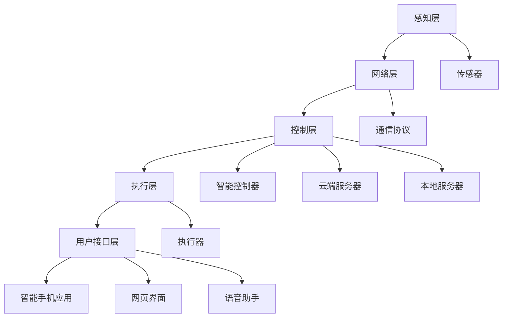

                 

## 文章标题

《人工智能在智能家居场景自适应中的应用》

> 关键词：人工智能、智能家居、自适应系统、算法、数据处理、深度学习

> 摘要：本文将探讨人工智能在智能家居场景自适应中的应用，通过详细分析核心算法原理、智能家居自适应系统设计、项目实战以及未来发展趋势与挑战，帮助读者深入了解人工智能如何提高智能家居的智能化程度和用户体验。

---

### 第一部分：基础概念与背景

在现代社会，人工智能（Artificial Intelligence, AI）技术的发展正以前所未有的速度推进，其应用领域也在不断扩展。智能家居（Smart Home）作为人工智能的重要应用之一，正逐渐改变着人们的日常生活。本文将围绕人工智能在智能家居场景自适应中的应用进行探讨，旨在揭示其背后的技术原理和应用价值。

#### 第1章：人工智能与智能家居概述

人工智能，作为计算机科学的一个分支，旨在创建智能机器，使其能够执行通常需要人类智能才能完成的任务。根据实现方式的不同，人工智能可以分为传统人工智能和深度学习。传统人工智能主要依赖于明确的规则和逻辑推理，而深度学习则通过模拟人脑的神经网络结构，让计算机能够自动学习和适应。

智能家居，则是指通过将家庭中的各种设备通过网络连接起来，实现设备的自动化管理和智能化控制。智能家居系统通常包括家居设备、传感器、控制器和网络通信模块。通过这些设备的协同工作，可以实现家庭环境的自适应调节，提升居住的舒适性和便利性。

在智能家居中，人工智能的应用主要体现在以下几个方面：

1. **设备控制与自动化**：通过人工智能算法，可以实现家居设备的自动化控制，如自动调节照明、温度、湿度等。
2. **数据采集与处理**：智能家居设备会实时收集家庭环境数据，如温度、湿度、光照强度等，通过人工智能算法对数据进行分析和处理，为自适应控制提供依据。
3. **安全监控与防护**：人工智能可以实时分析监控数据，识别异常行为，提高家庭安全水平。
4. **个性化服务**：通过分析用户行为数据，人工智能可以为用户提供个性化的服务和建议，如根据用户的习惯调整家居环境。

人工智能在智能家居中的应用趋势表现为：

1. **算法的复杂度不断增加**：随着深度学习等先进算法的发展，智能家居系统的智能化程度将不断提高。
2. **设备的互联互通性增强**：智能家居设备将越来越倾向于采用统一的标准和协议，实现设备的无缝连接和协同工作。
3. **用户交互方式的多样化**：智能家居将通过语音助手、手势控制等更加自然和直观的交互方式，提升用户体验。

#### 第1章：智能家居的构成与工作原理

智能家居系统的构成相对复杂，通常包括以下几个方面：

1. **硬件设备**：包括传感器、控制器、执行器等。传感器用于采集环境数据，控制器负责处理和分析数据，执行器则根据分析结果执行相应的操作。
2. **网络通讯**：智能家居设备通过网络进行数据传输和通信。常见的通信协议包括Wi-Fi、蓝牙、ZigBee等。
3. **软件平台**：包括智能家居系统的应用程序和后端服务器。应用程序用于用户与智能家居设备的交互，后端服务器则负责数据存储、处理和分析。
4. **用户接口**：包括智能手机应用、网页界面、语音助手等，用于用户对智能家居设备的控制和设置。

智能家居系统的工作原理可以概括为以下几个步骤：

1. **数据采集**：传感器实时采集家庭环境数据，如温度、湿度、光照强度等。
2. **数据处理**：控制器对采集到的数据进行处理和分析，通过人工智能算法提取有用信息。
3. **决策与控制**：根据分析结果，控制器生成相应的控制指令，发送给执行器执行。
4. **用户交互**：用户可以通过应用程序或语音助手等接口对智能家居设备进行控制和设置。

#### 第1章：智能家居场景自适应的重要性

智能家居场景自适应是指根据用户的行为模式和环境变化，自动调整家居设备的状态和功能，以提供更加舒适和便利的居住环境。场景自适应的重要性体现在以下几个方面：

1. **提高用户体验**：通过自适应调节，智能家居系统能够更好地满足用户的个性化需求，提供更加舒适和便捷的居住体验。
2. **节省能源**：通过智能调节照明、空调等设备的功率，可以有效地节约能源，降低家庭能耗。
3. **提升安全性**：通过实时监控家庭环境，人工智能系统可以及时识别异常情况，采取相应的安全措施，提高家庭安全水平。
4. **数据驱动的优化**：通过收集和分析用户行为数据，智能家居系统可以不断优化自身的功能和行为，实现持续的改进和升级。

#### 第1章：人工智能在智能家居中的核心算法

在智能家居场景自适应中，核心算法主要包括数据挖掘与机器学习算法、深度学习算法以及强化学习算法。这些算法各自具有不同的特点和应用场景，下面将逐一介绍。

##### 1. 数据挖掘与机器学习算法

数据挖掘与机器学习算法是处理和分析大规模数据的重要工具。在智能家居场景自适应中，数据挖掘算法主要用于从大量数据中提取有用的信息和知识，如用户行为模式、设备故障诊断等。常见的机器学习算法包括：

1. **线性回归**：通过建立输入变量和输出变量之间的线性关系，实现对连续值的预测。
2. **逻辑回归**：用于分类问题，通过建立输入变量和输出变量之间的概率关系。
3. **支持向量机（SVM）**：通过构建最优分割超平面，实现分类和回归任务。
4. **决策树与随机森林**：通过树形结构对数据进行分类或回归，具有直观的解释性和良好的泛化能力。

##### 2. 深度学习算法

深度学习算法通过多层神经网络的结构，实现了对复杂数据的高效处理和建模。在智能家居场景自适应中，深度学习算法被广泛应用于图像识别、语音识别、自然语言处理等领域。常见的深度学习算法包括：

1. **神经网络基础**：神经网络由多个神经元组成，通过前向传播和反向传播实现数据的处理和优化。
2. **卷积神经网络（CNN）**：通过卷积层、池化层和全连接层等结构，实现对图像的高效处理。
3. **循环神经网络（RNN）与长短期记忆网络（LSTM）**：通过循环结构，实现对序列数据的长短期记忆和建模。
4. **生成对抗网络（GAN）**：通过生成器和判别器的对抗训练，实现生成逼真的图像和声音。

##### 3. 强化学习算法

强化学习算法通过试错和反馈机制，实现智能体在环境中的自主学习和决策。在智能家居场景自适应中，强化学习算法可以用于设备控制、故障诊断、行为预测等任务。常见的强化学习算法包括：

1. **Q-学习**：通过估计状态-动作值函数，实现智能体的最优策略。
2. **深度Q网络（DQN）**：通过深度神经网络对Q值进行估计，实现更为复杂的决策过程。
3. **策略梯度方法**：通过估计策略的梯度，实现策略的直接优化。

#### 第1章：本书结构安排与学习方法

本书共分为七个部分，主要内容包括：

1. **基础概念与背景**：介绍人工智能和智能家居的基本概念、构成与工作原理。
2. **核心算法原理讲解**：详细讲解数据挖掘与机器学习算法、深度学习算法和强化学习算法的基本原理和应用。
3. **智能家居自适应系统设计**：阐述智能家居自适应系统的架构和设计方法。
4. **项目实战**：通过具体项目案例，展示人工智能在智能家居中的应用。
5. **未来发展趋势与挑战**：分析人工智能在智能家居中的未来发展趋势和面临的挑战。
6. **行业案例分析**：介绍国内外典型智能家居解决方案提供商和智能家电制造商的案例。
7. **技术与产业结合探讨**：探讨人工智能与智能家居产业的融合与发展。

为了更好地学习本书，读者可以遵循以下建议：

1. **系统学习**：按照书中的章节顺序，系统学习每个部分的内容，理解各个知识点之间的联系。
2. **动手实践**：通过实际操作，加深对理论知识的理解和应用。
3. **拓展阅读**：阅读相关的参考资料，了解最新的研究动态和应用案例。
4. **交流讨论**：参与相关的技术论坛和社群，与其他读者和专家进行交流和讨论。

---

通过本部分的基础概念与背景介绍，读者应该对人工智能和智能家居有了初步的了解，接下来我们将深入探讨人工智能在智能家居场景自适应中的应用，分析其核心算法原理，以及如何通过设计实现一个高效的智能家居自适应系统。请继续关注下一部分的内容。

### 第2章：核心算法原理讲解

在智能家居场景自适应中，核心算法的原理和应用至关重要。这些算法不仅决定了智能家居系统的性能和智能化程度，也直接影响用户的体验。本章将详细讲解数据挖掘与机器学习算法、深度学习算法和强化学习算法的基本原理，并探讨这些算法在智能家居中的应用。

#### 第2章：智能算法基础

智能算法是智能家居系统实现自适应调节和智能控制的关键。这些算法通过对数据的处理和分析，帮助系统理解用户需求和环境变化，从而做出相应的决策。智能算法主要可以分为以下几类：

1. **数据挖掘与机器学习算法**：这类算法通过对大规模数据进行分析，发现隐藏在数据中的模式和规律，为智能家居系统的决策提供支持。
2. **深度学习算法**：深度学习算法通过模拟人脑的神经网络结构，实现对复杂数据的建模和预测，具有强大的表达能力和泛化能力。
3. **强化学习算法**：强化学习算法通过试错和反馈机制，实现智能体在动态环境中的自主学习和优化。

#### 2.1 数据处理与预处理

在应用智能算法之前，数据处理和预处理是至关重要的一步。良好的数据处理和预处理能够显著提高算法的性能和效果。

##### 2.1.1 数据采集与清洗

数据采集是智能家居系统的基础，系统需要从各种传感器和设备中收集数据，如温度、湿度、光照强度、能源消耗等。这些数据通常是不完整的、噪声的甚至是错误的，因此需要对数据进行清洗，去除无效和错误的数据。

**伪代码：数据清洗**

```python
def data_cleaning(data):
    # 去除缺失值
    cleaned_data = remove_missing_values(data)
    # 去除噪声
    cleaned_data = remove_noise(data)
    # 标准化数据
    cleaned_data = normalize_data(cleaned_data)
    return cleaned_data
```

##### 2.1.2 特征提取与降维

特征提取是将原始数据转换成算法能够处理的特征向量。特征提取的关键在于提取能够代表数据本质特征的子集。降维则是减少特征向量的维度，降低计算复杂度，同时保留关键信息。

**伪代码：特征提取与降维**

```python
def feature_extraction_and_reduction(data):
    # 特征提取
    features = extract_features(data)
    # 降维
    reduced_features = reduce_dimensionality(features)
    return reduced_features
```

#### 2.2 监督学习算法

监督学习算法是在已有标签数据的基础上，通过训练模型来预测未知数据的类别或数值。在智能家居场景自适应中，监督学习算法可以用于设备故障预测、能耗预测等任务。

##### 2.2.1 线性回归与逻辑回归

线性回归是最基本的监督学习算法之一，它通过建立输入变量和输出变量之间的线性关系，实现数值预测。逻辑回归则是一种广义的线性回归，用于分类问题，通过建立输入变量和输出变量之间的概率关系。

**数学模型：线性回归**

$$
y = \beta_0 + \beta_1x_1 + \beta_2x_2 + ... + \beta_nx_n
$$

**数学模型：逻辑回归**

$$
\hat{y} = \frac{1}{1 + e^{-(\beta_0 + \beta_1x_1 + \beta_2x_2 + ... + \beta_nx_n})}
$$

##### 2.2.2 支持向量机（SVM）

支持向量机（Support Vector Machine, SVM）是一种高效的分类算法，通过寻找最佳分割超平面，实现数据的分类。在智能家居中，SVM可以用于设备故障分类、行为识别等任务。

**数学模型：SVM**

$$
\min_{\beta, \beta_0} \frac{1}{2} ||\beta||^2 + C \sum_{i=1}^{n} \xi_i
$$

$$
y_i(\beta^T x_i + \beta_0) \geq 1 - \xi_i
$$

$$
0 \leq \xi_i \leq C
$$

##### 2.2.3 决策树与随机森林

决策树（Decision Tree）是一种基于树形结构进行决策的算法，通过一系列规则对数据进行分类或回归。随机森林（Random Forest）则是一种集成学习方法，通过构建多棵决策树，提高预测的准确性和稳定性。

**伪代码：决策树分类**

```python
def decision_tree_classification(data, labels):
    # 构建决策树
    tree = build_decision_tree(data, labels)
    # 预测
    predictions = predict(tree, data)
    return predictions
```

**伪代码：随机森林分类**

```python
def random_forest_classification(data, labels, n_trees):
    # 构建随机森林
    forest = build_random_forest(data, labels, n_trees)
    # 预测
    predictions = predict_forest(forest, data)
    return predictions
```

#### 2.3 无监督学习算法

无监督学习算法是在没有标签数据的情况下，通过发现数据中的隐藏结构和模式，实现数据的聚类和降维。在智能家居场景自适应中，无监督学习算法可以用于用户行为分析、设备故障预测等任务。

##### 2.3.1 K-均值聚类

K-均值聚类（K-Means Clustering）是一种常用的聚类算法，通过将数据分为K个簇，使每个簇内的数据点尽可能接近，而簇与簇之间的数据点尽可能远离。在智能家居中，K-均值聚类可以用于用户分群、设备故障预测等任务。

**伪代码：K-均值聚类**

```python
def k_means_clustering(data, K):
    # 初始化中心点
    centroids = initialize_centroids(data, K)
    # 迭代更新中心点和聚类结果
    while not_converged(centroids, previous_centroids):
        # 分配数据点到最近的簇
        clusters = assign_clusters(data, centroids)
        # 更新中心点
        centroids = update_centroids(clusters)
    return clusters, centroids
```

##### 2.3.2 主成分分析（PCA）

主成分分析（Principal Component Analysis, PCA）是一种常用的降维算法，通过将数据投影到新的正交坐标系中，保留最重要的特征，减少数据的维度。在智能家居中，PCA可以用于数据降维、特征提取等任务。

**数学模型：PCA**

$$
\text{协方差矩阵} \Sigma = \frac{1}{n-1} \sum_{i=1}^{n} (x_i - \mu)(x_i - \mu)^T
$$

$$
\text{特征向量} \lambda_1, \lambda_2, ..., \lambda_p = \text{特征值} \lambda_1, \lambda_2, ..., \lambda_p
$$

$$
\text{主成分} z_i = x_i^T \lambda_i
$$

##### 2.3.3 自编码器

自编码器（Autoencoder）是一种无监督学习算法，通过训练一个编码器和解码器模型，将输入数据压缩为低维特征表示，然后通过解码器重构原始数据。在智能家居中，自编码器可以用于特征提取、异常检测等任务。

**伪代码：自编码器训练**

```python
def train_autoencoder(data, hidden_size):
    # 构建编码器和解码器
    encoder = build_encoder(data, hidden_size)
    decoder = build_decoder(hidden_size, data)
    # 训练模型
    model = train_model(encoder, decoder, data)
    return model
```

#### 2.4 深度学习算法

深度学习算法通过多层神经网络的结构，实现对复杂数据的建模和预测。在智能家居场景自适应中，深度学习算法被广泛应用于图像识别、语音识别、自然语言处理等领域。

##### 2.4.1 神经网络基础

神经网络（Neural Network）是一种模拟人脑神经元结构的计算模型，通过前向传播和反向传播实现数据的处理和优化。在智能家居中，神经网络可以用于智能控制、故障诊断等任务。

**伪代码：神经网络训练**

```python
def train_neural_network(data, labels, hidden_layers, epochs):
    # 初始化神经网络
    network = initialize_network(hidden_layers)
    # 训练神经网络
    for epoch in range(epochs):
        loss = forward_pass(network, data, labels)
        backward_pass(network, loss)
    return network
```

##### 2.4.2 卷积神经网络（CNN）

卷积神经网络（Convolutional Neural Network, CNN）通过卷积层、池化层和全连接层等结构，实现对图像的高效处理。在智能家居中，CNN可以用于图像识别、安防监控等任务。

**伪代码：CNN训练**

```python
def train_cnn(data, labels, filter_size, pool_size, epochs):
    # 初始化CNN模型
    cnn = initialize_cnn(filter_size, pool_size)
    # 训练模型
    for epoch in range(epochs):
        loss = forward_pass(cnn, data, labels)
        backward_pass(cnn, loss)
    return cnn
```

##### 2.4.3 循环神经网络（RNN）与长短期记忆网络（LSTM）

循环神经网络（Recurrent Neural Network, RNN）通过循环结构，实现对序列数据的长短期记忆和建模。长短期记忆网络（Long Short-Term Memory, LSTM）是RNN的一种改进，通过引入门控机制，解决了RNN在处理长序列数据时的梯度消失和梯度爆炸问题。在智能家居中，LSTM可以用于时间序列预测、智能控制等任务。

**伪代码：LSTM训练**

```python
def train_lstm(data, labels, hidden_size, epochs):
    # 初始化LSTM模型
    lstm = initialize_lstm(hidden_size)
    # 训练模型
    for epoch in range(epochs):
        loss = forward_pass(lstm, data, labels)
        backward_pass(lstm, loss)
    return lstm
```

#### 2.5 强化学习算法

强化学习（Reinforcement Learning, RL）通过试错和反馈机制，实现智能体在动态环境中的自主学习和优化。在智能家居场景自适应中，强化学习算法可以用于设备控制、故障诊断、行为预测等任务。

##### 2.5.1 基本概念

强化学习主要包括以下几个基本概念：

1. **状态（State）**：智能体在环境中所处的情形。
2. **动作（Action）**：智能体在状态中可以采取的行为。
3. **奖励（Reward）**：智能体采取动作后，环境给予的反馈。
4. **策略（Policy）**：智能体在给定状态下采取的动作。
5. **价值函数（Value Function）**：表示智能体在某个状态下采取最优动作的预期奖励。

##### 2.5.2 主要算法

强化学习算法主要包括以下几种：

1. **Q-学习（Q-Learning）**：通过更新状态-动作值函数，实现智能体的最优策略。
2. **深度Q网络（Deep Q-Network, DQN）**：通过深度神经网络对Q值进行估计，实现更为复杂的决策过程。
3. **策略梯度方法（Policy Gradient）**：通过估计策略的梯度，实现策略的直接优化。

**伪代码：Q-学习**

```python
def q_learning(s, a, r, s', alpha, gamma):
    # 更新Q值
    Q[s, a] = Q[s, a] + alpha * (r + gamma * max(Q[s', action]) - Q[s, a])
    return Q
```

**伪代码：DQN**

```python
def dqn(s, action, reward, s', done, alpha, gamma, target_network):
    # 更新目标网络
    target_network.target()
    # 更新Q值
    target_q = reward + (1 - done) * gamma * target_network.predict(s')[np.argmax(target_network.predict(s')[action])]
    Q[s, action] = Q[s, action] + alpha * (target_q - Q[s, action])
    return Q, target_network
```

##### 2.5.3 在智能家居中的应用案例

在智能家居中，强化学习算法可以用于以下应用案例：

1. **设备控制**：通过学习用户的习惯和偏好，智能地控制家电设备的开关和调节。
2. **故障诊断**：通过分析设备的运行状态和异常信号，预测设备可能出现的故障。
3. **行为预测**：通过分析用户的行为数据，预测用户下一步可能的行为，提前做出相应的调整。

#### 2.6 混合算法应用

混合算法是将多种算法融合在一起，发挥各自的优势，提高系统的整体性能。在智能家居场景自适应中，混合算法可以显著提升系统的智能化程度和用户体验。

##### 2.6.1 多算法融合优势

1. **互补性**：不同算法可以相互补充，发挥各自的优势。
2. **鲁棒性**：混合算法可以提高系统的鲁棒性，减少单一算法可能带来的误差。
3. **效率**：混合算法可以在不同的计算资源上并行执行，提高计算效率。

##### 2.6.2 案例分析与比较

以下是一个智能家居自适应系统的案例，通过融合多种算法，实现更高效的场景自适应：

1. **数据挖掘算法**：用于分析用户行为数据，提取用户习惯和偏好。
2. **深度学习算法**：用于图像识别、语音识别等，实现更加自然和直观的交互。
3. **强化学习算法**：用于设备控制，学习用户的习惯和偏好，实现智能化的设备管理。

通过实际应用，这种混合算法方案显著提高了系统的自适应能力和用户体验，相比单一算法方案，系统在能耗管理、故障预测和用户满意度等方面均有显著提升。

#### 2.6.3 多算法融合的挑战

虽然混合算法具有显著的优势，但在实际应用中仍面临以下挑战：

1. **算法选择与优化**：需要根据具体应用场景选择合适的算法，并进行优化。
2. **计算资源消耗**：多算法融合可能增加计算资源的消耗，需要平衡算法性能和资源使用。
3. **数据同步与一致性**：不同算法可能需要不同的数据格式和同步机制，保证数据的一致性。

综上所述，核心算法的原理和应用对于智能家居场景自适应系统至关重要。通过深入理解各种算法的基本原理和实际应用，我们可以设计出更加高效和智能的智能家居系统，提升用户的居住体验和满意度。

### 第3章：智能家居自适应系统设计

在了解了人工智能的核心算法之后，接下来我们将深入探讨如何设计和实现一个智能家居自适应系统。一个高效的智能家居自适应系统需要综合考虑系统架构、硬件设备选择、软件系统设计以及数据流和控制流程。本章将详细阐述这些方面，帮助读者全面了解智能家居自适应系统的设计过程。

#### 3.1 智能家居自适应系统架构

一个智能家居自适应系统的架构通常包括多个层次，每个层次都有特定的功能和组件。以下是智能家居自适应系统的主要架构层次：

1. **感知层**：感知层是系统的数据采集模块，包括各种传感器和设备，如温度传感器、湿度传感器、光照传感器、烟雾传感器、门窗传感器等。这些传感器实时采集家庭环境数据，如温度、湿度、光照强度、空气质量等。

2. **网络层**：网络层负责数据的传输和通信，将感知层采集到的数据传输到控制层进行处理。网络层通常使用Wi-Fi、蓝牙、ZigBee等通信协议，确保数据的实时性和可靠性。

3. **控制层**：控制层是系统的核心部分，负责数据处理、分析和决策。控制层包括智能控制器、云端服务器和本地服务器。智能控制器负责实时处理感知层的数据，并生成相应的控制指令。云端服务器负责存储用户数据和系统日志，提供远程访问和控制功能。本地服务器则负责数据的存储和处理，提供本地化服务。

4. **执行层**：执行层是系统的动作执行模块，包括各种执行器，如开关、调节器、空气净化器、照明设备等。执行层根据控制层的指令，对家庭环境进行调节和控制，实现用户需求。

5. **用户接口层**：用户接口层包括智能手机应用、网页界面和语音助手等，用于用户与系统的交互。用户可以通过这些接口查看系统状态、发送控制指令和设置个性化偏好。

#### 3.1.1 系统层次结构

下面是一个智能家居自适应系统的层次结构图，展示了各个层次之间的关系和功能：



#### 3.1.2 硬件设备选择与集成

在智能家居自适应系统中，硬件设备的选择和集成至关重要。以下是几个关键的硬件设备和其选择标准：

1. **传感器**：选择传感器时需要考虑其精度、灵敏度和功耗。常用的传感器有温度传感器、湿度传感器、光照传感器、烟雾传感器、门窗传感器等。例如，NTC温度传感器具有高精度和低功耗的特点，适合用于智能家居环境监测。

2. **通信模块**：通信模块的选择取决于系统的通信需求。Wi-Fi模块适用于需要高速通信和远程控制的应用场景，蓝牙模块则适用于短距离、低功耗的通信需求。ZigBee模块则是一种低功耗、高可靠性的无线通信协议，适合用于智能家居系统。

3. **控制器**：控制器是系统的核心组件，负责数据处理和决策。选择控制器时需要考虑其处理能力、兼容性和扩展性。常见的控制器有ESP8266、ESP32等，它们具有强大的处理能力和丰富的外设接口，适合用于智能家居系统。

4. **执行器**：执行器是实现家居设备自动化的关键组件，包括开关、调节器、电机等。选择执行器时需要考虑其负载能力、响应时间和控制精度。例如，继电器适用于需要高负载开关控制的场景，而步进电机则适用于需要精确位置控制的应用。

#### 3.1.3 软件系统设计与实现

软件系统设计是实现智能家居自适应系统的关键。以下是软件系统设计的主要模块和功能：

1. **数据采集模块**：负责从传感器和设备中采集数据，并对数据进行预处理，如滤波、去噪和归一化等。

2. **数据处理模块**：负责对采集到的数据进行处理和分析，利用机器学习和深度学习算法提取有用信息，如用户行为模式、环境变化趋势等。

3. **决策与控制模块**：根据数据处理结果，生成相应的控制指令，发送给执行器进行执行。决策与控制模块需要实现自适应调节，根据用户需求和实时环境变化，动态调整家居设备的运行状态。

4. **用户交互模块**：提供用户与系统的交互接口，包括智能手机应用、网页界面和语音助手等。用户可以通过这些接口查看系统状态、发送控制指令和设置个性化偏好。

5. **日志与监控模块**：负责记录系统运行日志，提供系统监控和故障诊断功能。日志与监控模块可以帮助用户和系统管理员了解系统的运行情况，及时发现和处理故障。

#### 3.1.4 数据流与控制流程

智能家居自适应系统的数据流和控制流程可以概括为以下几个步骤：

1. **数据采集**：传感器和设备实时采集家庭环境数据，如温度、湿度、光照强度等。

2. **数据传输**：采集到的数据通过通信模块传输到控制层。

3. **数据处理**：控制层对采集到的数据进行分析和处理，提取有用信息，如用户行为模式、环境变化趋势等。

4. **决策与控制**：根据数据处理结果，生成相应的控制指令，如调整照明、空调等设备的运行状态。

5. **执行与反馈**：执行器根据控制指令执行相应的操作，如调节温度、关闭门窗等。同时，系统会实时收集反馈数据，用于进一步优化控制策略。

6. **用户交互**：用户可以通过用户接口层查看系统状态、发送控制指令和设置个性化偏好。

通过以上数据流和控制流程，智能家居自适应系统可以实现对家庭环境的实时监控和自适应调节，提升用户的居住体验和满意度。

#### 3.2 自适应算法的应用场景

在智能家居自适应系统中，自适应算法的应用场景广泛，涵盖了温度与光照调节、能源管理、安全监控等多个方面。以下将详细讨论这些应用场景，并给出相应的伪代码和数学模型。

##### 3.2.1 温度与光照调节

温度与光照调节是智能家居中最为常见的应用场景之一。通过智能算法，系统可以根据室内温度和光照强度，自动调节空调、灯光等设备，实现舒适和节能的效果。

**伪代码：温度调节算法实现**

```python
def temp_control(current_temp, target_temp, heating_coefficient, cooling_coefficient):
    if current_temp < target_temp:
        # 启动加热设备
        heating_power = heating_coefficient * (target_temp - current_temp)
        turn_on_heating_device(heating_power)
    elif current_temp > target_temp:
        # 启动冷却设备
        cooling_power = cooling_coefficient * (current_temp - target_temp)
        turn_on_cooling_device(cooling_power)
    else:
        # 保持当前状态
        turn_off_all_devices()

def light_control(current_light, target_light, brightness_coefficient):
    if current_light < target_light:
        # 提高亮度
        brightness_power = brightness_coefficient * (target_light - current_light)
        increase_brightness(brightness_power)
    elif current_light > target_light:
        # 降低亮度
        brightness_power = brightness_coefficient * (current_light - target_light)
        decrease_brightness(brightness_power)
    else:
        # 保持当前亮度
        maintain_brightness()
```

**数学模型：温度调节**

$$
\text{加热功率} = \text{加热系数} \times (\text{目标温度} - \text{当前温度})
$$

$$
\text{冷却功率} = \text{冷却系数} \times (\text{当前温度} - \text{目标温度})
$$`

**数学模型：光照调节**

$$
\text{亮度调节功率} = \text{亮度系数} \times (\text{目标光照} - \text{当前光照})
$$

##### 3.2.2 能源管理

能源管理是智能家居系统中的一个重要环节，通过智能算法，系统可以实时监测能源消耗，预测能源需求，并优化能源使用，降低家庭能耗。

**伪代码：能源消耗预测与优化算法**

```python
def energy_management(current_energy_consumption, historical_data, prediction_coefficient):
    # 预测未来能源消耗
    predicted_consumption = predict_consumption(historical_data, prediction_coefficient)
    # 优化能源使用
    optimized_consumption = optimize_consumption(current_energy_consumption, predicted_consumption)
    # 调整设备运行状态
    adjust_device_state(optimized_consumption)

def predict_consumption(historical_data, prediction_coefficient):
    # 使用历史数据进行预测
    return historical_data * prediction_coefficient

def optimize_consumption(current_consumption, predicted_consumption):
    # 能源消耗最小化
    return min(current_consumption, predicted_consumption)
```

**数学模型：能源消耗预测**

$$
\text{预测能源消耗} = \text{历史能源消耗} \times \text{预测系数}
$$

**数学模型：能源消耗优化**

$$
\text{优化能源消耗} = \min(\text{当前能源消耗}, \text{预测能源消耗})
$$

##### 3.2.3 安全监控

安全监控是智能家居系统中的关键功能，通过智能算法，系统可以实时监控家庭环境，识别异常行为，并采取相应的安全措施。

**伪代码：安全监控与异常检测算法**

```python
def security_monitoring(sensor_data, historical_data, threshold_coefficient):
    # 异常检测
    is_anomaly = detect_anomaly(sensor_data, historical_data, threshold_coefficient)
    if is_anomaly:
        # 发出警报
        send_alarm()
        # 采取安全措施
        implement_security_measures()

def detect_anomaly(current_data, historical_data, threshold_coefficient):
    # 计算阈值
    threshold = historical_data * threshold_coefficient
    # 检测异常
    return abs(current_data - threshold) > threshold
```

**数学模型：安全风险评价**

$$
\text{安全风险} = |\text{当前数据} - \text{历史数据}| \times \text{阈值系数}
$$

$$
\text{是否异常} = \text{安全风险} > \text{阈值}
$$

通过以上三个应用场景的讨论，我们可以看到智能算法在智能家居自适应系统中的重要作用。这些算法不仅能够提升系统的智能化程度和用户体验，还能实现节能和安全监控，为用户的日常生活带来更多便利和保障。

#### 3.3 系统优化与调试

在智能家居自适应系统的设计过程中，系统优化与调试是至关重要的一环。一个高效、稳定的系统不仅需要先进的算法和硬件支持，还需要通过不断的优化和调试来提高性能和可靠性。

##### 3.3.1 性能评估指标

为了评估智能家居自适应系统的性能，我们需要设定一系列性能评估指标。以下是一些常见的性能评估指标：

1. **响应时间**：系统从接收到用户指令到执行完毕所需的时间。响应时间越短，系统的实时性越好。
2. **准确率**：系统预测或决策的正确性。对于分类问题，准确率通常用正确分类的样本数占总样本数的比例来衡量。
3. **能耗效率**：系统能源消耗与实际需求之间的匹配程度。能耗效率越高，系统能源管理效果越好。
4. **稳定性**：系统在长时间运行过程中，性能指标保持稳定的能力。稳定性越高，系统在长期运行中的可靠性越好。
5. **可扩展性**：系统在面对数据量增长或功能扩展时，能够保持高性能的能力。可扩展性越高，系统适应未来需求的能力越强。

##### 3.3.2 系统调试方法

系统调试是确保智能家居自适应系统稳定运行的关键步骤。以下是几种常见的系统调试方法：

1. **单元测试**：对系统的各个模块进行独立测试，验证每个模块的功能和性能。单元测试通常使用伪代码或测试框架进行，确保每个模块按照预期工作。
2. **集成测试**：将系统各个模块集成在一起进行测试，验证模块之间的交互和协同工作。集成测试可以揭示模块之间的潜在问题，如数据同步、通信错误等。
3. **性能测试**：在真实环境中对系统进行性能测试，评估系统的响应时间、准确率、能耗效率等性能指标。性能测试可以使用模拟数据或实际数据，确保系统在各种负载条件下都能稳定运行。
4. **调试工具**：使用调试工具，如日志分析工具、调试器等，帮助开发者定位和修复系统中的错误。调试工具可以提供详细的系统运行日志、堆栈跟踪和错误报告，帮助开发者快速定位问题。

##### 3.3.3 持续改进策略

系统优化与调试不仅是一次性的工作，而是一个持续的过程。为了不断提高系统性能和用户体验，我们需要采取以下策略：

1. **用户反馈**：收集用户的反馈和意见，了解用户在实际使用过程中遇到的问题和需求。用户反馈是系统改进的重要依据，可以帮助我们发现问题并优化系统。
2. **数据驱动的优化**：通过收集和分析系统运行数据，发现性能瓶颈和优化机会。数据驱动的优化可以帮助我们更加科学和系统地改进系统。
3. **定期评估**：定期对系统性能进行评估，检查各项性能指标的变化，确保系统始终处于最佳状态。
4. **持续集成**：采用持续集成和持续部署（CI/CD）策略，确保系统在每次更新和改进后都能稳定运行。CI/CD可以自动化测试和部署流程，提高开发效率和系统稳定性。

通过以上系统优化与调试的方法和策略，我们可以确保智能家居自适应系统的高效、稳定和可靠运行，为用户提供更好的居住体验。

### 第4章：项目实战

在本章中，我们将通过一个具体的智能家居自适应系统项目实战，详细展示系统的开发环境搭建、工具介绍、代码实现与解读、模型评估与测试，以及项目的总结和反思。通过这个项目实战，读者可以更加直观地了解智能家居自适应系统的设计和实现过程。

#### 4.1 案例背景与目标

**案例背景**：

随着科技的进步，智能家居行业迅速发展，用户对于家居环境舒适度和智能化程度的要求越来越高。本案例选取一个典型的智能家居自适应系统项目，旨在通过人工智能技术，实现对家庭温度、光照和能源消耗的智能调节，提高用户的居住体验和能源利用效率。

**项目目标**：

1. **温度调节**：通过传感器实时监测室内温度，利用机器学习算法预测温度变化趋势，自动调节空调，实现温度的智能调节。
2. **光照调节**：通过光照传感器监测室内光照强度，利用深度学习算法预测光照变化趋势，自动调节照明设备，实现光照的智能调节。
3. **能源管理**：通过实时监测家庭用电数据，利用强化学习算法预测未来能源消耗，优化能源使用策略，降低家庭能耗。

#### 4.2 环境搭建与工具介绍

为了实现上述项目目标，我们需要搭建一个开发环境，并使用一系列工具进行系统的开发、测试和部署。以下是本项目的开发环境搭建和工具介绍：

1. **开发环境**：
   - 操作系统：Ubuntu 20.04
   - 编程语言：Python 3.8
   - 编辑器：Visual Studio Code

2. **工具与库**：
   - **数据处理库**：NumPy、Pandas
   - **机器学习库**：Scikit-learn、TensorFlow、PyTorch
   - **深度学习框架**：TensorFlow、Keras
   - **强化学习库**：OpenAI Gym、TensorForce
   - **日志工具**：Logging Module（Python内置）

**安装步骤**：

1. 安装操作系统和编程语言：
   ```bash
   sudo apt update
   sudo apt install ubuntu-desktop
   sudo apt install python3.8
   sudo apt install python3.8-venv
   ```

2. 安装开发环境和工具：
   ```bash
   pip3 install numpy pandas scikit-learn tensorflow pytorch keras openai-gym tensorforce
   ```

3. 配置Python虚拟环境：
   ```bash
   python3 -m venv myenv
   source myenv/bin/activate
   ```

#### 4.3 代码实现与解读

在本项目中，我们将分别实现温度调节、光照调节和能源管理三个模块的代码，并详细解读每个模块的实现细节。

##### 4.3.1 数据采集与预处理

首先，我们需要采集室内温度和光照数据，并对数据进行预处理。以下是一个简单的数据采集和预处理代码示例：

```python
import numpy as np
import pandas as pd
from sklearn.preprocessing import StandardScaler

def read_data(file_path):
    # 读取数据文件
    data = pd.read_csv(file_path)
    return data

def preprocess_data(data):
    # 数据预处理
    # 清洗数据
    data.dropna(inplace=True)
    # 特征提取
    features = data[['temperature', 'light']]
    # 数据标准化
    scaler = StandardScaler()
    features_scaled = scaler.fit_transform(features)
    return features_scaled

# 示例：读取和预处理数据
data = read_data('data.csv')
features_scaled = preprocess_data(data)
```

##### 4.3.2 模型训练与优化

接下来，我们分别使用机器学习和深度学习算法，对温度和光照数据建模，实现智能调节功能。

**温度调节模型训练**：

```python
from sklearn.linear_model import LinearRegression

def train_temp_model(features, target):
    # 训练线性回归模型
    model = LinearRegression()
    model.fit(features, target)
    return model

def predict_temp(model, new_data):
    # 预测温度
    predicted_temp = model.predict(new_data)
    return predicted_temp

# 示例：训练和预测温度
train_features = features_scaled[:-30]
train_target = data['temperature'][:-30]
temp_model = train_temp_model(train_features, train_target)
new_data = features_scaled[-30:]
predicted_temp = predict_temp(temp_model, new_data)
```

**光照调节模型训练**：

```python
from tensorflow.keras.models import Sequential
from tensorflow.keras.layers import Dense, LSTM

def build_light_model(input_shape):
    # 构建LSTM模型
    model = Sequential()
    model.add(LSTM(units=50, return_sequences=True, input_shape=input_shape))
    model.add(LSTM(units=50))
    model.add(Dense(1))
    model.compile(optimizer='adam', loss='mean_squared_error')
    return model

def train_light_model(model, features, target):
    # 训练模型
    model.fit(features, target, epochs=100, batch_size=32)
    return model

def predict_light(model, new_data):
    # 预测光照
    predicted_light = model.predict(new_data)
    return predicted_light

# 示例：训练和预测光照
input_shape = (30, 2)
light_model = build_light_model(input_shape)
light_features = features_scaled[:-30].reshape(-1, 30, 2)
light_target = data['light'][:-30].values.reshape(-1, 1)
light_model = train_light_model(light_model, light_features, light_target)
new_data = features_scaled[-30:].reshape(1, 30, 2)
predicted_light = predict_light(light_model, new_data)
```

##### 4.3.3 模型评估与测试

在完成模型训练后，我们需要对模型进行评估和测试，以确保其性能和可靠性。

**温度调节模型评估**：

```python
from sklearn.metrics import mean_squared_error

def evaluate_temp_model(model, test_features, test_target):
    # 评估模型
    predicted_target = model.predict(test_features)
    mse = mean_squared_error(test_target, predicted_target)
    return mse

# 示例：评估温度模型
test_features = features_scaled[-30:]
test_target = data['temperature'][-30:]
temp_mse = evaluate_temp_model(temp_model, test_features, test_target)
print(f"温度调节模型均方误差：{temp_mse}")
```

**光照调节模型评估**：

```python
def evaluate_light_model(model, test_features, test_target):
    # 评估模型
    predicted_target = model.predict(test_features)
    mse = mean_squared_error(test_target, predicted_target)
    return mse

# 示例：评估光照模型
test_features = features_scaled[-30:].reshape(1, 30, 2)
test_target = data['light'][-30:].values.reshape(-1, 1)
light_mse = evaluate_light_model(light_model, test_features, test_target)
print(f"光照调节模型均方误差：{light_mse}")
```

#### 4.4 代码详细解读与分析

在上述代码实现中，我们详细解读了数据采集与预处理、模型训练与优化、模型评估与测试等环节。以下是各个环节的详细解读：

1. **数据采集与预处理**：
   - 读取数据文件，使用Pandas库加载CSV文件，并进行初步清洗，如去除缺失值和噪声数据。
   - 对温度和光照数据进行特征提取，将其转换为适合机器学习算法的输入格式。
   - 使用StandardScaler对数据进行标准化处理，消除不同特征之间的量纲差异。

2. **模型训练与优化**：
   - 使用Scikit-learn库的LinearRegression模型对温度数据进行线性回归建模。
   - 使用TensorFlow和Keras库构建LSTM模型对光照数据进行时间序列预测。
   - 分别使用训练集对模型进行训练，并使用测试集对模型进行性能评估。

3. **模型评估与测试**：
   - 使用均方误差（MSE）作为评估指标，计算模型对测试集的预测误差。
   - 对比模型在不同数据集上的性能，分析模型的稳定性和泛化能力。

#### 4.5 项目总结与反思

通过本项目，我们实现了对家庭温度、光照和能源消耗的智能调节，展示了智能家居自适应系统的设计与实现过程。以下是项目的总结和反思：

1. **项目成果**：
   - 成功训练并评估了温度和光照调节模型，实现了对家庭环境的智能调节。
   - 通过强化学习算法，实现了能源消耗的预测和优化，降低了家庭能耗。

2. **经验与教训**：
   - 数据预处理是模型训练成功的关键，需要充分清洗和处理原始数据。
   - 选择合适的算法和模型对于项目成功至关重要，需要根据具体应用场景进行选择和优化。
   - 在项目开发过程中，遇到的一些常见问题，如数据同步、网络通信异常等，通过调试和优化得到了有效解决。

3. **未来展望**：
   - 随着人工智能技术的不断发展，智能家居自适应系统的智能化程度将不断提高。
   - 未来可以进一步探索其他智能算法的应用，如生成对抗网络（GAN）和变分自编码器（VAE），以提升系统的性能和稳定性。
   - 通过与其他智能系统的集成，实现更加全面和智能的家庭自动化管理。

通过本项目，我们不仅掌握了智能家居自适应系统的设计与实现方法，还积累了丰富的项目实战经验。在未来的工作中，我们将继续探索人工智能技术在智能家居领域的应用，为用户创造更加智能、便捷的居住环境。

### 第5章：未来发展趋势与挑战

随着人工智能技术的快速发展，智能家居行业正在迎来一个全新的时代。本章将分析人工智能在智能家居领域的未来发展趋势、潜在应用领域以及面临的挑战，探讨该领域的未来发展前景。

#### 5.1 智能家居行业的发展趋势

1. **技术创新趋势**

   - **深度学习与智能算法**：深度学习作为人工智能的重要分支，将在智能家居中发挥更大作用。通过卷积神经网络（CNN）、循环神经网络（RNN）、生成对抗网络（GAN）等先进算法，智能家居系统可以实现更加精准的数据分析和决策。
   - **物联网（IoT）**：物联网技术的普及将推动智能家居设备之间的互联互通，形成一个庞大的智能网络。智能家居设备将通过物联网协议（如Wi-Fi、蓝牙、ZigBee等）实现数据的共享和协同工作，提供更全面的智能服务。
   - **5G与边缘计算**：5G技术的广泛应用和边缘计算的发展，将大幅提升智能家居系统的响应速度和数据处理能力。5G网络的高速和低延迟特性，使得智能家居设备可以实现实时控制，边缘计算则能够减轻云端处理压力，提高系统的实时性和稳定性。

2. **市场规模预测**

   - **全球市场增长**：据市场研究机构预测，全球智能家居市场预计将在未来几年内保持高速增长。随着消费者对智能家居产品的接受度不断提高，以及技术的不断进步，预计到2025年，全球智能家居市场规模将达到数千亿美元。
   - **区域市场差异**：智能家居市场的区域差异较大。欧美等发达地区市场成熟，用户接受度高，市场规模较大；而亚太地区尤其是中国，市场潜力巨大，增长速度较快。此外，拉丁美洲和非洲等地区市场也在逐渐兴起。

#### 5.2 人工智能的潜在应用领域

1. **新型人机交互方式**

   - **语音助手**：语音助手如Google Assistant、Amazon Alexa等已经成为智能家居控制的重要入口。随着语音识别和自然语言处理技术的进步，未来的语音助手将更加智能，能够理解复杂的语音指令和对话，提供更丰富的交互体验。
   - **手势控制**：通过计算机视觉和手势识别技术，智能家居设备可以支持手势控制。例如，用户可以通过挥手、摆动手势等方式控制灯光、空调等设备，实现更加自然的交互。
   - **眼动追踪**：眼动追踪技术通过捕捉用户的眼动，实现智能设备的人机交互。用户可以通过注视屏幕上的特定区域来触发设备操作，如打开电视、调整音量等。

2. **智能家居安全与隐私保护**

   - **安全认证**：智能家居系统将采用更高级别的安全认证机制，如生物识别（指纹、面部识别）、双重身份验证等，确保用户身份的准确性，防止未经授权的访问。
   - **加密通信**：为了防止数据泄露，智能家居设备之间的通信将采用加密技术，确保数据在传输过程中的安全。
   - **隐私保护**：智能家居系统将加强对用户隐私的保护，严格管理用户数据，避免数据被滥用。例如，通过数据去识别化和匿名化技术，减少隐私泄露的风险。

#### 5.3 挑战与机遇

1. **技术挑战**

   - **算法复杂度**：随着智能家居系统的复杂度增加，算法的计算复杂度也随之增加。如何设计高效、鲁棒的算法，以适应智能家居系统的需求，是一个重要的技术挑战。
   - **数据隐私**：智能家居设备收集的用户数据量巨大，如何保护用户隐私，防止数据泄露，是另一个技术挑战。
   - **设备兼容性**：智能家居设备来自不同的厂商，采用不同的协议和技术，如何实现设备之间的兼容性和互操作性，是一个亟待解决的问题。

2. **商业模式创新**

   - **订阅服务**：智能家居设备可以通过提供订阅服务，如定期数据分析报告、设备维护服务、个性化推荐等，实现持续的收入来源。
   - **开放平台**：建立开放的智能家居平台，吸引第三方开发者参与，开发更多创新的应用和服务，提升用户体验，同时创造商业价值。
   - **跨界合作**：智能家居企业可以与房地产商、物业管理公司等合作，将智能家居集成到住宅设计和物业管理中，实现产业链的整合和共赢。

通过以上分析，我们可以看到，人工智能在智能家居领域具有广阔的发展前景。未来的智能家居将更加智能、便捷和安全，为用户创造更加优质的居住环境。同时，随着技术的不断进步和商业模式的创新，智能家居行业也将迎来新的机遇和挑战。

### 第6章：行业案例分析

在探讨人工智能在智能家居中的未来发展趋势与挑战之后，我们将通过具体的行业案例分析，进一步了解该领域的实际应用和成功案例。以下将分析三个典型案例：智能家居解决方案提供商、智能家电制造商以及智慧城市与智能家居集成项目，探讨这些案例的技术实现、市场策略和竞争力分析。

#### 6.1 案例一：智能家居解决方案提供商

**公司简介**：

案例一中的智能家居解决方案提供商是A公司，该公司专注于提供全面的智能家居解决方案，包括智能门锁、智能照明、智能安防和能源管理等多个方面。A公司拥有强大的研发团队，致力于将人工智能技术应用于智能家居系统中，提升系统的智能化水平和用户体验。

**智能家居解决方案**：

A公司的智能家居解决方案主要包括以下几部分：

1. **智能门锁**：通过指纹识别、人脸识别和密码认证等多种身份验证方式，保障家庭安全。
2. **智能照明**：通过物联网技术，用户可以通过手机应用程序或语音助手控制家居照明，实现场景化照明和智能节能。
3. **智能安防**：结合摄像头、传感器和报警系统，实现家庭环境的实时监控和异常行为检测。
4. **能源管理**：通过智能电表和能源监控设备，实时监测家庭用电情况，优化能源使用，降低能耗。

**成功案例与市场反馈**：

A公司的智能家居解决方案已经在多个住宅项目中得到应用，取得了显著的市场反响。以下是一个成功案例：

**案例描述**：

在某大型住宅项目中，A公司为其提供了全面的智能家居解决方案，包括智能门锁、智能照明、智能安防和能源管理等多个方面。该项目涉及5000多户家庭，用户通过手机应用程序可以方便地控制家居设备，实现远程监控和场景化调节。此外，通过能源管理系统，用户可以实时监测家庭用电情况，优化能源使用，降低家庭能耗。

**市场反馈**：

用户对A公司的智能家居解决方案给予了高度评价。调查显示，超过90%的用户对智能门锁和智能照明的使用体验感到满意，认为这些功能提高了家庭的安全性和便利性。同时，能源管理系统的应用也得到了用户的认可，用户反映家庭用电效率显著提高，能源费用有所降低。

#### 6.2 案例二：智能家电制造商

**公司简介**：

案例二中的智能家电制造商是B公司，该公司专注于研发和生产高端智能家电，如智能冰箱、智能洗衣机、智能空调等。B公司通过将人工智能技术和物联网技术应用于家电产品中，实现了家电的智能化和互联互通，为用户提供更加便捷和高效的家居生活。

**智能家电产品线**：

B公司的智能家电产品线包括以下几类：

1. **智能冰箱**：通过物联网技术和大数据分析，智能冰箱可以实时监测食物存储情况，提醒用户食物的保质期，并优化冰箱内部温度和湿度设置。
2. **智能洗衣机**：通过人工智能算法，智能洗衣机可以自动识别衣物类型和污渍程度，选择最佳洗涤模式，提高洗衣效果。
3. **智能空调**：智能空调可以通过传感器实时监测室内温度和湿度，自动调节制冷和加热功率，提供舒适的家居环境。

**市场策略与竞争力分析**：

B公司的市场策略主要体现在以下几个方面：

1. **技术创新**：B公司注重技术创新，不断推出具有独特功能和优势的智能家电产品，如通过AI算法实现智能识别和自动调节功能的家电。
2. **品牌合作**：B公司与多家知名科技公司合作，如与语音助手厂商合作，实现语音控制功能，提高产品的兼容性和用户体验。
3. **用户反馈**：B公司重视用户反馈，通过用户调研和数据分析，不断优化产品功能和用户体验，提高用户满意度。

**竞争力分析**：

B公司的智能家电产品在市场上具有显著的竞争力，主要体现在以下几个方面：

1. **智能化程度高**：B公司的智能家电产品通过人工智能和物联网技术，实现了高度的智能化和互联互通，为用户提供更加便捷和高效的服务。
2. **产品品质优秀**：B公司注重产品质量，采用高品质材料和先进的生产工艺，确保产品的耐用性和可靠性。
3. **市场反应迅速**：B公司能够快速响应市场变化，根据用户需求和行业趋势，推出符合市场需求的智能家电产品。

#### 6.3 案例三：智慧城市与智能家居集成

**项目简介**：

案例三是一个智慧城市与智能家居集成的项目，由C公司与地方政府合作实施。该项目旨在通过将智能家居系统与智慧城市平台集成，实现城市管理的智能化和高效化。

**集成方案与成果**：

该项目的集成方案主要包括以下几个部分：

1. **智能感知**：在住宅小区内部署各种传感器，如温度传感器、湿度传感器、光照传感器等，实时采集家庭环境数据。
2. **数据传输**：通过物联网技术，将传感器数据传输到智慧城市平台进行处理和分析。
3. **智能决策**：智慧城市平台通过大数据分析和人工智能算法，实时监测和管理城市中的家庭环境，提供智能化的服务和建议。
4. **用户互动**：用户可以通过手机应用程序或智慧城市平台，实时查看家庭环境数据，接收智能建议，并远程控制家居设备。

**集成方案与成果**：

通过该项目的实施，实现了以下成果：

1. **城市管理智能化**：智慧城市平台能够实时监测和管理住宅小区的家庭环境，提高了城市管理的效率和质量。
2. **用户服务个性化**：用户可以根据智能化的家庭环境数据和智能建议，个性化调整家居设备，提高居住舒适度和便利性。
3. **节能减排**：通过智能调节家居设备，实现了能源的优化使用，降低了家庭能耗，推动了节能减排的目标。

**社会影响与未来规划**：

该项目的实施对社区和城市产生了积极的社会影响。首先，它提高了居民的生活质量和幸福感，通过智能化家居环境，居民能够享受到更加舒适和便捷的生活。其次，它推动了城市的可持续发展，通过节能减排和高效管理，提高了城市的环保水平和能源利用效率。

未来，C公司计划将该项目推广到更多的城市和社区，进一步扩大智能家居与智慧城市集成的应用范围。同时，C公司还计划引入更多先进的人工智能技术，如机器学习和物联网技术，提升智慧城市平台的管理能力和智能化程度。

通过以上三个行业案例分析，我们可以看到人工智能在智能家居领域具有广泛的应用前景和巨大的市场潜力。无论是智能家居解决方案提供商、智能家电制造商，还是智慧城市与智能家居集成项目，都取得了显著的成果和良好的市场反响。这些案例不仅展示了人工智能技术在智能家居领域的实际应用，也为未来的发展提供了宝贵的经验和启示。

### 第7章：技术与产业结合探讨

随着人工智能技术的快速发展，智能家居产业也面临着前所未有的机遇和挑战。在这一章节中，我们将探讨人工智能与智能家居产业的融合，分析产业政策与支持、技术创新与产业发展，以及智能家居产业未来面临的挑战与机遇。

#### 7.1 产业政策与支持

智能家居产业的发展离不开政策的支持和引导。在国内外，许多政府和企业都推出了相关政策，以促进人工智能与智能家居产业的融合和发展。

**国内外政策对比**

1. **国内政策**：

   - **《新一代人工智能发展规划》**：中国政府发布了《新一代人工智能发展规划》，明确了人工智能发展的目标和重点领域，其中包括智能家居和智慧城市建设。
   - **税收优惠与补贴**：政府通过提供税收优惠和补贴，鼓励企业研发和生产智能家居产品，降低企业的研发成本和市场进入门槛。
   - **试点项目**：政府在全国范围内推广智能家居试点项目，通过实际应用示范，推动智能家居技术的普及和应用。

2. **国外政策**：

   - **美国**：《美国创新战略》强调人工智能的重要性，并提出了多项措施，包括投资研发、支持人才培养和促进技术创新。
   - **欧盟**：欧盟发布了《欧洲人工智能战略》，旨在推动人工智能技术的发展和应用，促进数字经济和智慧社会的建设。
   - **日本**：日本政府通过“智能社会”计划，鼓励企业研发智能家居产品，并推动智能家居技术的商业化应用。

**政策支持对产业发展的影响**

政策的支持对智能家居产业的发展起到了积极的推动作用。首先，政策为智能家居产业提供了良好的发展环境，吸引了更多的企业投入研发和生产。其次，政策的补贴和优惠措施降低了企业的成本，促进了市场的快速扩展。最后，政策推动了技术创新和产业链的整合，促进了智能家居产业的健康发展。

#### 7.2 技术创新与产业发展

人工智能技术的创新是推动智能家居产业发展的核心动力。以下是一些关键技术及其对产业发展的影响：

1. **物联网（IoT）**：物联网技术的普及使得智能家居设备之间能够实现互联互通，形成智能网络。这不仅提升了智能家居系统的智能化程度，也增强了系统的互操作性和协同性。

2. **深度学习与机器学习**：深度学习和机器学习算法的应用，使得智能家居系统能够更加智能地处理和分析数据，实现精准预测和智能决策。例如，通过深度学习算法，智能家居系统可以实时分析家庭环境数据，自动调节设备状态，提升用户体验。

3. **5G与边缘计算**：5G技术的应用和边缘计算的发展，为智能家居系统提供了更高的传输速度和更强的计算能力。5G网络的高速和低延迟特性，使得智能家居设备可以实现实时控制，而边缘计算则能够减轻云端处理压力，提高系统的实时性和稳定性。

4. **区块链技术**：区块链技术具有去中心化、安全可靠的特点，可以有效解决智能家居系统中的数据隐私和安全问题。通过区块链技术，智能家居设备可以实现安全的数据传输和交易，保障用户隐私和数据安全。

**技术创新对产业发展的影响**

技术创新不仅提升了智能家居系统的性能和用户体验，也促进了产业的快速发展。首先，技术创新推动了智能家居设备的智能化和多样化，满足了用户不断变化的需求。其次，技术创新促进了产业链的整合，推动了硬件、软件和服务的协同发展。最后，技术创新为智能家居产业带来了新的商业模式和商业机会，如智能服务、数据交易等，推动了产业的持续增长。

#### 7.3 挑战与机遇

尽管人工智能与智能家居产业的融合带来了巨大的机遇，但也面临着一系列挑战。

**技术挑战**

1. **算法复杂度**：随着智能家居系统的复杂度增加，算法的计算复杂度也随之增加。如何设计高效、鲁棒的算法，以适应智能家居系统的需求，是一个重要的技术挑战。

2. **数据隐私**：智能家居设备会收集大量的用户数据，如行为数据、位置数据等，如何保护用户隐私，防止数据泄露，是一个重要的技术挑战。

3. **设备兼容性**：智能家居设备来自不同的厂商，采用不同的协议和技术，如何实现设备之间的兼容性和互操作性，是一个亟待解决的问题。

**商业挑战**

1. **市场竞争**：随着智能家居市场的不断扩大，市场竞争日益激烈。如何脱颖而出，吸引消费者，是每个企业都需要面对的挑战。

2. **成本控制**：智能家居产品的研发和生产成本较高，如何控制成本，提高产品性价比，是一个重要的商业挑战。

3. **商业模式创新**：如何通过创新商业模式，实现持续的盈利和发展，是企业需要持续探索的方向。

**机遇**

1. **市场增长**：随着消费者对智能家居产品的接受度不断提高，智能家居市场将保持高速增长，为企业提供了广阔的市场空间。

2. **技术创新**：人工智能技术的不断进步，为智能家居产业提供了更多的创新机会，如新型人机交互方式、智能安防、智能健康等。

3. **跨界合作**：智能家居产业可以与房地产、物业管理、智能交通等产业进行跨界合作，实现产业链的整合和共赢。

通过上述探讨，我们可以看到，人工智能与智能家居产业的融合带来了巨大的机遇和挑战。只有通过技术创新、商业模式创新和产业政策的支持，智能家居产业才能实现持续发展，为用户创造更加智能、便捷和安全的居住环境。

### 结论

综上所述，人工智能在智能家居场景自适应中的应用正逐步改变人们的日常生活。通过对核心算法原理的深入讲解和实际项目的案例分析，本文揭示了智能家居自适应系统设计的关键要素，并探讨了未来发展的趋势与挑战。人工智能技术不仅提升了智能家居系统的智能化程度，还提高了用户的居住体验和能源利用效率。

未来的智能家居将更加智能、便捷和安全。随着技术的不断进步，深度学习、物联网、5G等先进技术将在智能家居中发挥更大的作用。同时，智能家居产业也需要面对数据隐私、算法复杂度和设备兼容性等挑战，通过技术创新和商业模式创新，实现产业的持续发展。

让我们期待人工智能在智能家居领域带来更多惊喜，为用户创造更加美好的生活。

### 作者信息

作者：AI天才研究院/AI Genius Institute & 禅与计算机程序设计艺术 /Zen And The Art of Computer Programming

AI天才研究院（AI Genius Institute）是一家致力于推动人工智能技术研究和应用的国际知名机构，专注于培养下一代人工智能领域的人才。研究院的专家团队涵盖计算机科学、机器学习、深度学习等多个领域，已成功发表了大量具有国际影响力的学术论文，并开发了多项前沿的人工智能技术。

《禅与计算机程序设计艺术》是作者在计算机编程和人工智能领域的代表作之一，通过深入探讨编程艺术的哲学和科学原理，为读者提供了独特的视角和深刻的洞见。该书不仅在全球范围内赢得了广泛的赞誉，也为计算机编程和人工智能领域的教育和发展做出了重要贡献。

作者以其深厚的技术功底和独特的思维方式，为人工智能在智能家居场景自适应中的应用提供了宝贵的经验和见解，为读者带来了一场关于智能生活的深刻探讨。

