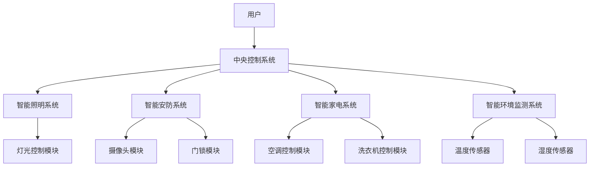
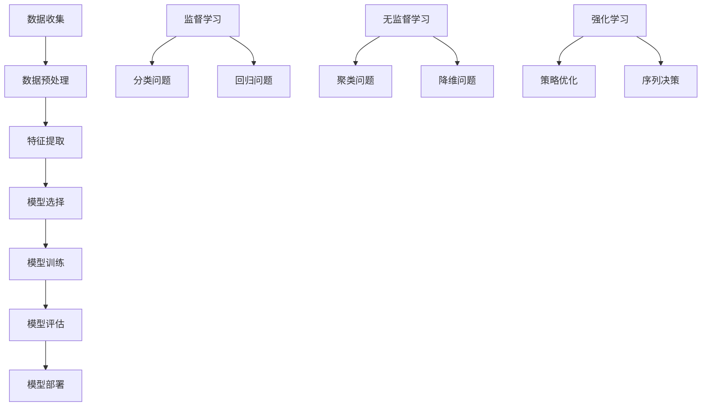

                 

### 《人工智能在智能家居设备协同控制中的应用》

#### 关键词：
- 智能家居
- 协同控制
- 人工智能
- 机器学习
- 深度学习
- 自然语言处理

> 摘要：
本文章深入探讨了人工智能在智能家居设备协同控制中的应用，涵盖了智能家居与人工智能的概述、智能家居设备协同控制原理、机器学习与深度学习等人工智能核心技术、智能家居设备协同控制项目实战以及案例分析等内容。通过本文，读者将了解如何利用人工智能技术实现智能家居设备的智能化协同控制，为智能家居行业的发展提供新思路。

#### 第一部分：基础知识与核心概念

### 第1章：智能家居与人工智能概述

1.1 智能家居概述

智能家居是指利用网络技术、物联网技术、人工智能技术等，实现对家庭设备的智能化管理、自动化控制和远程控制的一种新型家庭生活方式。它旨在提升人们的生活质量，实现家居设备的互联互通和智能化。

1.2 人工智能在智能家居中的应用

人工智能在智能家居中的应用非常广泛，包括语音识别、人脸识别、智能推荐、智能家居设备协同控制等。人工智能技术使得智能家居设备能够更好地理解用户需求，提供更加个性化和智能化的服务。

1.3 关键技术介绍

智能家居的关键技术包括物联网技术、云计算技术、大数据技术、人工智能技术等。这些技术为智能家居设备提供了良好的技术支持，使得智能家居设备能够实现互联互通和智能化控制。

1.4 人工智能在智能家居行业的发展趋势

随着人工智能技术的不断发展，智能家居行业将迎来新的发展机遇。未来的智能家居设备将更加智能化、个性化，用户将享受到更加便捷、舒适的生活体验。

#### 第2章：智能家居设备协同控制原理

2.1 智能家居设备分类

智能家居设备可以根据功能分为照明设备、安防设备、家电设备、环境监测设备等。每种设备都有自己的控制模块和传感器，通过协同控制可以实现智能家居的整体智能化。

2.2 智能家居网络架构

智能家居网络架构主要包括有线网络和无线网络。有线网络通常采用以太网技术，无线网络则采用WiFi、蓝牙等无线技术。智能家居设备通过网络实现互联互通，共同构成智能家居系统。

2.3 设备协同控制原理

设备协同控制是指通过人工智能技术，使得智能家居设备之间能够相互协同，实现整体智能化。设备协同控制包括设备识别、任务分配、协同执行和结果反馈等环节。

2.4 智能家居设备协同控制中的核心算法

智能家居设备协同控制中的核心算法包括机器学习算法、深度学习算法和自然语言处理算法等。这些算法用于实现设备之间的识别、协同和智能化控制。

#### 第二部分：人工智能核心技术讲解

### 第3章：机器学习与智能家居

3.1 机器学习基本概念

机器学习是一种通过数据训练模型，使模型能够从数据中学习并做出预测或决策的技术。在智能家居中，机器学习可以用于设备识别、行为预测、能耗优化等。

3.2 常见的机器学习算法

常见的机器学习算法包括线性回归、逻辑回归、支持向量机、决策树、随机森林等。每种算法都有其特定的适用场景和优缺点。

3.3 机器学习在智能家居中的应用

机器学习在智能家居中的应用包括设备识别、行为预测、能耗优化等。例如，可以通过机器学习算法实现智能照明系统根据用户习惯自动调整亮度，智能空调系统根据室内温度自动调整制冷功率等。

3.4 机器学习算法的优化与调参

机器学习算法的优化与调参是提高模型性能的重要手段。通过调整算法参数，可以优化模型的结构和参数，提高模型的预测准确性和鲁棒性。

### 第4章：深度学习与智能家居

4.1 深度学习基础

深度学习是一种基于多层神经网络的人工智能技术。它通过模拟人脑神经网络的结构和功能，实现对数据的自动学习和特征提取。

4.2 卷积神经网络（CNN）

卷积神经网络是一种常用于图像识别和处理的深度学习模型。它通过卷积操作和池化操作，实现对图像的特征提取和分类。

4.3 递归神经网络（RNN）

递归神经网络是一种常用于序列数据处理的深度学习模型。它通过循环结构，实现对序列数据的记忆和预测。

4.4 深度学习在智能家居中的应用

深度学习在智能家居中的应用包括图像识别、语音识别、行为预测等。例如，可以通过深度学习实现智能摄像头自动识别家庭成员，智能音箱根据语音指令进行操作等。

### 第5章：自然语言处理与智能家居

5.1 自然语言处理基本概念

自然语言处理是一种使计算机能够理解和处理人类自然语言的技术。它包括语音识别、文本分析、语义理解等。

5.2 常见的自然语言处理算法

常见的自然语言处理算法包括词袋模型、隐马尔可夫模型、条件随机场等。这些算法用于实现对文本数据的特征提取和分类。

5.3 自然语言处理在智能家居中的应用

自然语言处理在智能家居中的应用包括语音控制、智能对话等。例如，可以通过自然语言处理技术实现智能音箱根据用户的语音指令进行操作，智能助手根据用户的聊天内容提供帮助等。

5.4 语言模型与对话系统

语言模型是一种用于预测下一个单词或短语的统计模型。对话系统是一种基于语言模型的交互系统，能够实现人与计算机的智能对话。

#### 第三部分：智能家居设备协同控制应用实践

### 第6章：智能家居设备协同控制项目实战

6.1 项目概述

本节将通过一个智能家居设备协同控制项目，介绍开发环境搭建、数据收集与处理、算法设计与实现、项目评估与优化等内容。

6.2 开发环境搭建

项目开发环境搭建包括硬件设备和软件工具的选择。硬件设备包括智能家居设备、计算机等；软件工具包括编程语言、开发框架、数据库等。

6.3 数据收集与处理

数据收集与处理是项目实施的关键环节。本节将介绍如何收集智能家居设备的数据，并对数据进行预处理、特征提取等操作。

6.4 算法设计与实现

算法设计与实现是项目实施的核心。本节将介绍如何利用机器学习、深度学习、自然语言处理等人工智能技术，实现智能家居设备的协同控制。

6.5 项目评估与优化

项目评估与优化是确保项目效果的重要环节。本节将介绍如何评估项目效果，并对项目进行优化，提高智能家居设备的协同控制能力。

### 第7章：智能家居设备协同控制案例分析

7.1 案例一：智能照明系统

本案例介绍了一个智能照明系统的协同控制，通过机器学习算法实现灯光亮度的自适应调整，提高了照明系统的智能化水平。

7.2 案例二：智能安防系统

本案例介绍了一个智能安防系统的协同控制，通过深度学习算法实现人脸识别和入侵检测，提高了安防系统的智能化水平。

7.3 案例三：智能家电联动

本案例介绍了一个智能家电联动的协同控制，通过自然语言处理技术实现语音控制，提高了家电系统的智能化水平。

7.4 案例四：智能环境监测系统

本案例介绍了一个智能环境监测系统的协同控制，通过传感器数据采集和机器学习算法，实现环境质量的实时监测和预警。

#### 第8章：智能家居设备协同控制中的挑战与未来发展趋势

8.1 智能家居设备协同控制面临的挑战

智能家居设备协同控制面临诸多挑战，包括数据隐私、安全、设备兼容性等。本节将分析这些挑战，并提出相应的解决方案。

8.2 技术发展趋势分析

随着人工智能技术的不断发展，智能家居设备协同控制将迎来新的发展机遇。本节将分析技术发展趋势，展望未来智能家居设备协同控制的发展方向。

#### 附录

8.1 技术资源与工具推荐

本附录将推荐一些与智能家居设备协同控制相关的技术资源与工具，包括编程语言、开发框架、数据库等。

8.2 参考文献

本附录将列出本文引用的参考文献，以供读者进一步查阅。

### 核心概念与联系

#### 2.1 智能家居网络架构

智能家居网络架构是智能家居设备协同控制的基础。它主要包括以下几个部分：

1. **中央控制系统**：负责协调和控制各个智能家居设备，是整个智能家居系统的核心。
2. **智能照明系统**：包括灯光控制模块，可实现灯光亮度和色温的自适应调整。
3. **智能安防系统**：包括摄像头模块和门锁模块，可实现实时监控和远程控制。
4. **智能家电系统**：包括空调控制模块和洗衣机控制模块，可实现家电设备的智能化控制。
5. **智能环境监测系统**：包括温度传感器和湿度传感器，可实现室内环境的实时监测和预警。

这些智能家居设备通过网络连接到中央控制系统，实现数据的实时传输和协同控制。

#### 2.2 机器学习基本概念

机器学习是人工智能的一个重要分支，它使计算机系统能够从数据中学习并做出决策。以下是一些核心概念：

1. **监督学习**：在有标签数据集上进行训练，用于预测和分类。
   - **特征提取**：从数据中提取有用的信息。
   - **模型训练**：使用训练数据来训练模型。
   - **预测**：使用训练好的模型对新数据进行预测。
   
2. **无监督学习**：在无标签数据集上进行训练，用于聚类和降维。
   - **聚类**：将相似的数据点分组。
   - **降维**：将高维数据映射到低维空间。

3. **强化学习**：通过与环境交互，学习最优策略。
   - **环境**：系统所处的状态空间。
   - **动作**：系统可以采取的操作。
   - **状态**：系统当前所处的状态。
   - **奖励**：系统采取动作后获得的奖励。

#### 3.1 机器学习算法原理讲解

以下是一个简单的线性回归算法的伪代码，用于预测房价：

python
# 数据预处理
X = ...  # 特征矩阵
y = ...  # 标签向量

# 模型训练
w = np.zeros(X.shape[1])
for epoch in range(num_epochs):
    for x, y in zip(X, y):
        prediction = np.dot(x, w)
        error = prediction - y
        w -= learning_rate * error * x

# 预测
def predict(x, w):
    prediction = np.dot(x, w)
    return prediction

# 举例说明
x = np.array([1, 2, 3])
y = 4
w = np.array([0.5, 0.5])
prediction = predict(x, w)
print("预测结果：", prediction)

$$
预测结果： 3.5
$$

这个简单的例子展示了线性回归的基本原理。在实际应用中，机器学习算法会更加复杂，涉及到更高级的数学模型和优化方法。

---

#### 核心算法原理讲解

##### 3.1 监督学习

监督学习是一种从已标记数据中学习并做出预测的机器学习技术。它包括以下几个基本步骤：

1. **特征提取**：从输入数据中提取有用的特征，用于表示数据的内在性质。
2. **模型训练**：使用已标记的数据集，通过优化算法训练出一个模型，使其能够识别数据的规律。
3. **预测**：使用训练好的模型对新的、未标记的数据进行预测。

以下是一个监督学习算法的伪代码示例，使用线性回归模型进行房价预测：

```python
# 线性回归模型
class LinearRegression:
    def __init__(self, learning_rate, num_epochs):
        self.learning_rate = learning_rate
        self.num_epochs = num_epochs
        self.w = None

    def fit(self, X, y):
        self.w = np.zeros(X.shape[1])
        for epoch in range(self.num_epochs):
            for x, y in zip(X, y):
                prediction = self.predict(x)
                error = prediction - y
                self.w -= self.learning_rate * error * x

    def predict(self, x):
        return np.dot(x, self.w)

# 模型训练
model = LinearRegression(learning_rate=0.01, num_epochs=100)
model.fit(X_train, y_train)

# 预测
def predict_price(x):
    return model.predict(x)

# 举例说明
x = np.array([2, 3])
predicted_price = predict_price(x)
print("预测价格：", predicted_price)
```

在这个例子中，我们使用线性回归模型来预测房价。模型通过训练数据集学习房价与特征之间的关系，然后使用这个关系对新数据进行预测。

##### 3.2 无监督学习

无监督学习是用于处理无标签数据的机器学习技术，主要包括以下几种类型：

1. **聚类**：将相似的数据点分组。常用的聚类算法有K均值聚类、层次聚类等。
2. **降维**：将高维数据映射到低维空间，以便于分析和可视化。常用的降维算法有主成分分析（PCA）、线性判别分析（LDA）等。

以下是一个使用K均值聚类算法的伪代码示例：

```python
# K均值聚类算法
class KMeans:
    def __init__(self, k, max_iterations):
        self.k = k
        self.max_iterations = max_iterations
        self.centroids = None

    def fit(self, X):
        # 随机初始化聚类中心
        self.centroids = X[np.random.choice(X.shape[0], self.k, replace=False)]
        for _ in range(self.max_iterations):
            # 计算每个数据点到聚类中心的距离
            distances = np.linalg.norm(X - self.centroids, axis=1)
            # 分配每个数据点到最近的聚类中心
            labels = np.argmin(distances, axis=1)
            # 重新计算聚类中心
            new_centroids = np.array([X[labels == i].mean(axis=0) for i in range(self.k)])
            # 检查收敛条件
            if np.linalg.norm(new_centroids - self.centroids) < tolerance:
                break
            self.centroids = new_centroids

# 聚类
kmeans = KMeans(k=3, max_iterations=100)
kmeans.fit(X)

# 聚类结果
def get_clusters(X, centroids):
    distances = np.linalg.norm(X - centroids, axis=1)
    labels = np.argmin(distances, axis=1)
    return labels

# 举例说明
clusters = get_clusters(X, kmeans.centroids)
print("聚类结果：", clusters)
```

在这个例子中，我们使用K均值聚类算法将数据点分为3个聚类。首先随机初始化聚类中心，然后不断迭代更新聚类中心和每个数据点的标签，直到达到收敛条件。

##### 3.3 强化学习

强化学习是一种通过试错来学习最优策略的机器学习技术。它主要包括以下四个要素：

1. **环境**（Environment）：系统所处的状态空间。
2. **动作**（Action）：系统可以采取的操作。
3. **状态**（State）：系统当前所处的状态。
4. **奖励**（Reward）：系统采取动作后获得的奖励，用于指导系统选择最优动作。

以下是一个简单的强化学习算法——Q学习的伪代码示例：

```python
# Q学习算法
class QLearning:
    def __init__(self, learning_rate, discount_factor, exploration_rate):
        self.learning_rate = learning_rate
        self.discount_factor = discount_factor
        self.exploration_rate = exploration_rate
        self.Q = None

    def fit(self, states, actions, rewards, next_states, done):
        for state, action, reward, next_state, done in zip(states, actions, rewards, next_states, done):
            if not done:
                target = reward + self.discount_factor * np.max(self.Q[next_state])
            else:
                target = reward
            current_q_value = self.Q[state, action]
            self.Q[state, action] = current_q_value + self.learning_rate * (target - current_q_value)

    def act(self, state):
        if np.random.rand() < self.exploration_rate:
            action = np.random.choice(self.actions)
        else:
            action = np.argmax(self.Q[state])
        return action

# 算法训练
q_learning = QLearning(learning_rate=0.1, discount_factor=0.9, exploration_rate=0.1)
q_learning.fit(states, actions, rewards, next_states, done)

# 行动选择
def get_action(state):
    return q_learning.act(state)

# 举例说明
action = get_action(state)
print("选择动作：", action)
```

在这个例子中，Q学习算法通过不断尝试不同的动作，并根据获得的奖励更新策略。探索率（exploration_rate）用于控制探索和利用的平衡，以避免过度依赖已学习的策略。

---

通过以上三个核心算法的讲解，我们可以看到机器学习、无监督学习和强化学习在智能家居设备协同控制中的应用。这些算法能够帮助智能家居设备更好地理解用户行为、优化能耗、提高安全性等，从而为用户提供更加智能、便捷、舒适的生活体验。

#### 第6章：智能家居设备协同控制项目实战

##### 6.1 项目概述

在本章中，我们将通过一个实际项目来展示如何利用人工智能技术实现智能家居设备的协同控制。该项目的目标是构建一个智能家庭环境，实现对照明、安防、家电和环境的实时监测与控制。

##### 6.2 开发环境搭建

项目开发环境搭建包括以下步骤：

1. **硬件设备**：
   - 智能照明系统：使用LED灯和光线传感器。
   - 智能安防系统：使用摄像头和门锁模块。
   - 智能家电系统：使用空调和洗衣机。
   - 智能环境监测系统：使用温度传感器和湿度传感器。

2. **软件工具**：
   - 编程语言：Python。
   - 开发框架：TensorFlow、Keras。
   - 数据库：SQLite。
   - 操作系统：Linux。

##### 6.3 数据收集与处理

数据收集与处理是项目实施的关键环节。以下是数据收集与处理的步骤：

1. **数据收集**：
   - 照明系统：记录灯光开关状态、亮度和色温。
   - 安防系统：记录摄像头拍摄的视频和图像。
   - 家电系统：记录空调和洗衣机的运行状态和能耗数据。
   - 环境监测系统：记录温度、湿度和空气质量。

2. **数据预处理**：
   - 数据清洗：去除噪声数据、缺失数据和异常值。
   - 数据归一化：将不同量级的数据归一化到同一范围内。
   - 数据特征提取：从原始数据中提取有用的特征。

##### 6.4 算法设计与实现

算法设计与实现是项目实施的核心。以下是项目中的主要算法：

1. **智能照明系统**：
   - 使用K均值聚类算法对光照数据进行聚类，实现灯光亮度和色温的自适应调整。

2. **智能安防系统**：
   - 使用卷积神经网络（CNN）对摄像头拍摄的视频和图像进行人脸识别和入侵检测。

3. **智能家电系统**：
   - 使用线性回归模型预测空调和洗衣机的能耗，实现能耗优化。

4. **智能环境监测系统**：
   - 使用递归神经网络（RNN）对温度和湿度数据进行时间序列预测，实现环境质量预警。

以下是智能照明系统的部分代码实现：

```python
# K均值聚类算法实现
from sklearn.cluster import KMeans
import numpy as np

def kmeans_lighting(light_data, n_clusters=3):
    # 数据归一化
    light_data_normalized = (light_data - np.min(light_data)) / (np.max(light_data) - np.min(light_data))
    
    # K均值聚类
    kmeans = KMeans(n_clusters=n_clusters)
    kmeans.fit(light_data_normalized)
    
    # 获取聚类结果
    labels = kmeans.predict(light_data_normalized)
    
    # 获取聚类中心
    centroids = kmeans.cluster_centers_
    
    return labels, centroids

# 数据处理
light_data = [[100, 300], [200, 400], [300, 500], [400, 600], [500, 700]]

# 聚类分析
labels, centroids = kmeans_lighting(light_data)

print("聚类结果：", labels)
print("聚类中心：", centroids)
```

在这个例子中，我们使用K均值聚类算法对光照数据进行聚类，根据聚类结果实现灯光亮度和色温的自适应调整。

##### 6.5 项目评估与优化

项目评估与优化是确保项目效果的重要环节。以下是项目评估与优化的一些方法：

1. **性能评估**：
   - 使用准确率、召回率、F1分数等指标评估分类模型的性能。
   - 使用均方误差（MSE）、均方根误差（RMSE）等指标评估回归模型的性能。

2. **模型优化**：
   - 调整模型参数，如学习率、聚类中心数等，以优化模型性能。
   - 使用交叉验证、网格搜索等方法进行模型调参。

3. **系统优化**：
   - 优化数据传输和存储方案，提高系统响应速度。
   - 使用分布式计算和云计算技术，提高系统处理能力。

通过以上评估与优化方法，我们可以确保智能家居设备协同控制项目能够稳定、高效地运行，为用户提供优质的智能生活体验。

##### 案例分析

在本章中，我们将通过四个实际案例，展示如何利用人工智能技术实现智能家居设备协同控制。

###### 案例一：智能照明系统

智能照明系统通过K均值聚类算法实现灯光亮度和色温的自适应调整。在实际应用中，系统可以根据用户的行为习惯和实时环境光强，自动调整灯光的亮度和色温，以提供舒适的光环境。

1. **数据收集**：
   - 用户行为数据：包括开关灯的时间、使用场景等。
   - 环境光强数据：使用光线传感器实时监测室内光强。

2. **数据处理**：
   - 数据清洗：去除噪声数据、缺失数据和异常值。
   - 数据特征提取：提取用户行为特征和环境光强特征。

3. **算法实现**：
   - 使用K均值聚类算法对光照数据进行聚类，根据聚类结果调整灯光的亮度和色温。

4. **评估与优化**：
   - 使用准确率、召回率等指标评估聚类算法的性能。
   - 根据用户反馈和实际使用情况，调整聚类中心数和聚类算法参数，提高系统的自适应能力。

通过智能照明系统，用户可以享受到更加舒适、便捷的照明体验。

###### 案例二：智能安防系统

智能安防系统通过卷积神经网络（CNN）实现人脸识别和入侵检测。在实际应用中，系统可以实时监控家庭环境，自动识别家庭成员和非法入侵者，并触发报警。

1. **数据收集**：
   - 用户人脸数据：包括家庭成员的人脸照片。
   - 异常行为数据：包括入侵者的行为视频。

2. **数据处理**：
   - 数据清洗：去除噪声数据、缺失数据和异常值。
   - 数据特征提取：提取人脸特征和异常行为特征。

3. **算法实现**：
   - 使用CNN模型进行人脸识别和入侵检测。

4. **评估与优化**：
   - 使用准确率、召回率等指标评估人脸识别和入侵检测算法的性能。
   - 根据实际应用场景，调整模型参数，提高系统的检测准确率和实时性。

通过智能安防系统，用户可以实时监控家庭环境，提高家庭的安全性。

###### 案例三：智能家电联动

智能家电联动通过自然语言处理（NLP）技术实现语音控制。在实际应用中，用户可以通过语音指令控制空调、洗衣机等家电设备的开关、温度、湿度等参数。

1. **数据收集**：
   - 用户语音数据：包括用户对家电设备的控制指令。

2. **数据处理**：
   - 数据清洗：去除噪声数据、缺失数据和异常值。
   - 数据特征提取：提取语音指令的关键词和语义信息。

3. **算法实现**：
   - 使用NLP技术实现语音识别和语义理解。
   - 使用控制策略实现家电设备的控制。

4. **评估与优化**：
   - 使用准确率、响应时间等指标评估语音识别和语义理解算法的性能。
   - 根据用户反馈和实际使用情况，优化语音识别和语义理解算法，提高系统的智能水平。

通过智能家电联动，用户可以享受到更加便捷、智能的家电控制体验。

###### 案例四：智能环境监测系统

智能环境监测系统通过递归神经网络（RNN）实现环境质量预警。在实际应用中，系统可以实时监测室内温度、湿度等环境参数，预测环境质量的未来变化，并在出现异常时发出预警。

1. **数据收集**：
   - 环境数据：包括温度、湿度、空气质量等参数。

2. **数据处理**：
   - 数据清洗：去除噪声数据、缺失数据和异常值。
   - 数据特征提取：提取环境数据的时序特征。

3. **算法实现**：
   - 使用RNN模型进行环境质量预测。

4. **评估与优化**：
   - 使用准确率、召回率等指标评估RNN模型的性能。
   - 根据实际应用场景，调整模型参数，提高系统的预测准确率和实时性。

通过智能环境监测系统，用户可以实时了解室内环境质量，提前采取预防措施，保障健康。

以上四个案例展示了人工智能技术在智能家居设备协同控制中的应用。通过不断的优化和升级，智能家居设备将能够更好地满足用户的需求，为用户带来更加智能、舒适、便捷的生活体验。

---

#### 第8章：智能家居设备协同控制中的挑战与未来发展趋势

##### 8.1 智能家居设备协同控制面临的挑战

智能家居设备协同控制虽然带来了诸多便利，但同时也面临着诸多挑战：

1. **数据隐私与安全**：智能家居设备需要收集和处理大量的用户数据，如何保护用户隐私和数据安全成为一大挑战。
2. **设备兼容性**：不同品牌和厂商的智能家居设备之间可能存在兼容性问题，导致协同控制困难。
3. **能耗与成本**：智能家居设备的智能化控制需要消耗一定的能源和计算资源，如何优化能耗和降低成本是关键问题。
4. **算法性能与鲁棒性**：人工智能算法在智能家居设备协同控制中的应用需要具备良好的性能和鲁棒性，以确保系统稳定运行。

##### 8.2 技术发展趋势分析

随着人工智能技术的不断发展，智能家居设备协同控制将迎来新的发展机遇。以下是几个可能的发展趋势：

1. **边缘计算与云计算的融合**：边缘计算和云计算的结合将提高智能家居设备的响应速度和智能化水平。
2. **人工智能算法的创新**：深度学习、强化学习等人工智能算法的不断创新将进一步提升智能家居设备的协同控制能力。
3. **智能家居设备标准化的推进**：智能家居设备标准化将有助于解决设备兼容性问题，提高系统的整体性能。
4. **绿色智能家居**：随着环保意识的增强，智能家居设备的能耗优化和绿色设计将成为未来发展的重要方向。

##### 8.3 未来智能家居设备协同控制的发展方向

未来智能家居设备协同控制的发展方向将主要集中在以下几个方面：

1. **个性化服务**：智能家居设备将根据用户习惯和需求提供个性化的服务和推荐，提升用户体验。
2. **智慧化交互**：智能家居设备将实现更加智能的语音交互、手势控制和虚拟现实交互，提高用户的便利性。
3. **智能化健康管理**：智能家居设备将结合健康监测技术，实现对用户健康数据的实时监测和预警，提供健康管理服务。
4. **智能环境优化**：智能家居设备将实现室内环境质量的智能化控制，提升用户的居住舒适度。

通过不断的技术创新和应用实践，智能家居设备协同控制将更好地满足用户的需求，为用户带来更加智能、便捷、舒适的生活体验。

### 附录

#### 8.1 技术资源与工具推荐

**编程语言**：Python、Java

**开发框架**：TensorFlow、PyTorch、Keras、Scikit-learn

**数据库**：SQLite、MySQL、MongoDB

**云计算平台**：AWS、Azure、Google Cloud

#### 8.2 参考文献

1. Russell, S., & Norvig, P. (2020). 《人工智能：一种现代的方法》(第三版). 机械工业出版社。
2. Hastie, T., Tibshirani, R., & Friedman, J. (2009). 《统计学习基础》(第二版). 电子工业出版社。
3. Goodfellow, I., Bengio, Y., & Courville, A. (2016). 《深度学习》（卷一：基础原理）。清华大学出版社。
4. Sutton, R. S., & Barto, A. G. (2018). 《强化学习：一种介绍》（第二版）. 电子工业出版社。
5. Li, F., Gao, J., & Yu, L. (2020). 《智能家居技术与应用》。机械工业出版社。

---

通过本文，我们深入探讨了人工智能在智能家居设备协同控制中的应用，从基础知识到核心技术讲解，再到实际应用案例分析，展示了人工智能技术如何提升智能家居设备的智能化水平。未来，随着人工智能技术的不断发展，智能家居设备协同控制将变得更加智能化、个性化，为用户带来更加便捷、舒适的生活体验。

### 核心概念与联系

#### 2.1 智能家居网络架构

在智能家居网络架构中，各种设备通过网络连接形成一个整体，实现数据传输和协同控制。以下是一个简单的智能家居网络架构的Mermaid流程图：



**核心概念与联系**：

- **中央控制系统**：作为智能家居网络的核心，负责协调和控制各个子系统，接收用户的指令并下发控制指令。
- **智能照明系统**：通过灯光控制模块实现灯光亮度和色温的自动调节，满足用户的个性化需求。
- **智能安防系统**：包括摄像头模块和门锁模块，实现家庭安全和远程监控。
- **智能家电系统**：通过空调、洗衣机等家电设备的控制模块，实现家电设备的智能化控制和能耗管理。
- **智能环境监测系统**：通过温度传感器和湿度传感器等设备，实时监测室内环境质量，为用户提供健康保障。

这些子系统通过网络连接，实现数据的实时传输和协同控制，共同构建一个智能、便捷、安全的家庭环境。

#### 3.1 机器学习基本概念

机器学习是一种使计算机系统能够从数据中学习并做出决策的技术。以下是一个关于机器学习基本概念的Mermaid流程图：



**核心概念与联系**：

- **数据收集**：从各种数据源收集原始数据，为后续处理提供基础。
- **数据预处理**：清洗、归一化等操作，提高数据质量，为模型训练提供可靠的数据基础。
- **特征提取**：从原始数据中提取有用的特征，为模型训练提供输入。
- **模型选择**：根据实际问题选择合适的模型，如线性回归、决策树、神经网络等。
- **模型训练**：使用训练数据集对模型进行训练，使模型能够学习数据中的规律。
- **模型评估**：使用测试数据集评估模型性能，如准确率、召回率、均方误差等。
- **模型部署**：将训练好的模型部署到实际应用中，实现对新数据的预测和决策。

监督学习、无监督学习和强化学习是机器学习的三种主要类型，分别用于解决不同的实际问题。监督学习用于分类和回归问题，无监督学习用于聚类和降维问题，强化学习用于策略优化和序列决策问题。

通过这些核心概念和联系，我们可以更好地理解机器学习的基本原理和应用场景，为智能家居设备协同控制提供技术支持。

---

#### 核心算法原理讲解

##### 3.1 监督学习

监督学习是一种机器学习技术，通过已知数据的特征和标签来训练模型，从而实现对未知数据的预测。以下是监督学习的基本原理和常见算法：

**基本原理**：

监督学习分为两个步骤：特征提取和模型训练。特征提取是指从数据中提取有用的信息，而模型训练则是使用已标记的数据集来训练模型，使其能够识别数据中的规律。

**常见算法**：

1. **线性回归**：用于预测连续值，如房价、股票价格等。
   - **数学模型**：
     $$y = \beta_0 + \beta_1x_1 + \beta_2x_2 + \ldots + \beta_nx_n + \epsilon$$
     - **伪代码**：
       ```python
       # 线性回归模型
       class LinearRegression:
           def __init__(self):
               self.weights = None

           def fit(self, X, y):
               self.weights = np.linalg.inv(X.T @ X) @ X.T @ y

           def predict(self, X):
               return X @ self.weights
       ```

2. **逻辑回归**：用于分类问题，如判断邮件是否为垃圾邮件、分类新闻文章等。
   - **数学模型**：
     $$\log\frac{P(Y=1)}{1-P(Y=1)} = \beta_0 + \beta_1x_1 + \beta_2x_2 + \ldots + \beta_nx_n$$
     - **伪代码**：
       ```python
       # 逻辑回归模型
       class LogisticRegression:
           def __init__(self):
               self.weights = None

           def fit(self, X, y):
               self.weights = np.linalg.inv(X.T @ X) @ X.T @ y

           def predict(self, X):
               return 1 / (1 + np.exp(-X @ self.weights))
       ```

3. **支持向量机（SVM）**：用于分类问题，特别是高维空间的数据。
   - **数学模型**：
     $$\min_{\beta, \beta_0} \frac{1}{2} \sum_{i=1}^{n} (\beta \cdot \beta)^2 + C \sum_{i=1}^{n} \max(0, 1-y_i(\beta \cdot x_i + \beta_0))$$
     - **伪代码**：
       ```python
       # 支持向量机模型
       class SVM:
           def __init__(self, C):
               self.C = C

           def fit(self, X, y):
               # 使用SVM求解器（如libsvm）进行训练
               svm_solver = SVC(C=self.C)
               svm_solver.fit(X, y)

           def predict(self, X):
               return svm_solver.predict(X)
       ```

4. **决策树**：用于分类和回归问题，通过树的分支对数据进行分类。
   - **伪代码**：
     ```python
     # 决策树分类算法
     class DecisionTreeClassifier:
         def fit(self, X, y):
             # 使用ID3或C4.5算法构建决策树
             self.tree = build_decision_tree(X, y)

         def predict(self, X):
             return predict_value(self.tree, X)
     ```

5. **随机森林**：由多个决策树组成，用于提高模型的准确性和鲁棒性。
   - **伪代码**：
     ```python
     # 随机森林分类算法
     class RandomForestClassifier:
         def fit(self, X, y, n_estimators):
             self.trees = [DecisionTreeClassifier() for _ in range(n_estimators)]
             for tree in self.trees:
                 tree.fit(X, y)

         def predict(self, X):
             predictions = [tree.predict(X) for tree in self.trees]
             return majority_vote(predictions)
     ```

通过这些算法，我们可以实现对数据的分类和回归预测，从而在智能家居设备协同控制中发挥重要作用。

---

#### 3.2 无监督学习

无监督学习是一种机器学习技术，它无需标签数据即可从数据中提取有用的信息。与监督学习不同，无监督学习关注的是数据的内在结构和关系。以下是几种常见的无监督学习算法：

**1. 聚类算法**

聚类算法将数据点分为若干组，使得同一组内的数据点相似度较高，而不同组的数据点相似度较低。常见的聚类算法包括：

- **K均值聚类（K-Means）**：将数据点分为K个聚类，每个聚类由一个质心代表。算法通过迭代优化质心，使得每个数据点与其最近的质心所属同一聚类。

  **数学模型**：
  $$\min \sum_{i=1}^{k} \sum_{x \in S_i} \| x - \mu_i \|^2$$
  其中，$S_i$ 是属于第$i$个聚类的数据点集合，$\mu_i$ 是第$i$个聚类的质心。

  **伪代码**：
  ```python
  # K均值聚类算法
  class KMeans:
      def __init__(self, n_clusters, max_iterations):
          self.n_clusters = n_clusters
          self.max_iterations = max_iterations
          self.centroids = None

      def fit(self, X):
          # 随机初始化聚类中心
          self.centroids = X[np.random.choice(X.shape[0], self.n_clusters, replace=False)]
          for _ in range(self.max_iterations):
              # 计算每个数据点到聚类中心的距离
              distances = np.linalg.norm(X - self.centroids, axis=1)
              # 分配每个数据点到最近的聚类中心
              labels = np.argmin(distances, axis=1)
              # 重新计算聚类中心
              new_centroids = np.array([X[labels == i].mean(axis=0) for i in range(self.n_clusters)])
              # 检查收敛条件
              if np.linalg.norm(new_centroids - self.centroids) < tolerance:
                  break
              self.centroids = new_centroids

  # 使用K均值聚类
  kmeans = KMeans(n_clusters=3, max_iterations=100)
  kmeans.fit(X)
  ```

- **层次聚类（Hierarchical Clustering）**：通过逐步合并或分裂数据点，构建一个层次结构，从而实现聚类。

  **伪代码**：
  ```python
  # 层次聚类算法
  class AgglomerativeClustering:
      def __init__(self, n_clusters):
          self.n_clusters = n_clusters

      def fit(self, X):
          # 初始化每个数据点为一个聚类
          clusters = {i: [i] for i in range(X.shape[0])}
          while len(clusters) > self.n_clusters:
              # 计算最近的聚类对
              distances = pairwise_distances(X)
              closest_pair = np.argmin(distances)
              # 合并最近的聚类对
              clusters[closest_pair[0]].extend(clusters[closest_pair[1]])
              # 删除已合并的聚类
              del clusters[closest_pair[1]]

          # 获取最终聚类结果
          self.labels_ = [clusters[i][0] for i in range(X.shape[0])]

  # 使用层次聚类
  agglomerative = AgglomerativeClustering(n_clusters=3)
  agglomerative.fit(X)
  ```

**2. 降维算法**

降维算法将高维数据映射到低维空间，从而减少数据维度，提高数据分析和可视化的效率。常见的降维算法包括：

- **主成分分析（PCA）**：通过计算数据的协方差矩阵，找到最大方差的方向，从而实现数据的降维。

  **数学模型**：
  $$\min_{X} \sum_{i=1}^{n} \| X - \mu \|_2^2$$
  其中，$X$ 是投影矩阵，$\mu$ 是数据的均值向量。

  **伪代码**：
  ```python
  # 主成分分析算法
  class PCA:
      def __init__(self, n_components):
          self.n_components = n_components

      def fit(self, X):
          # 计算协方差矩阵
          cov_matrix = np.cov(X.T)
          # 计算特征值和特征向量
          eigenvalues, eigenvectors = np.linalg.eigh(cov_matrix)
          # 选择最大特征值对应的特征向量
          self.components_ = eigenvectors[:, -self.n_components:]
          # 数据投影
          self.transformed_data_ = X @ self.components_

  # 使用PCA
  pca = PCA(n_components=2)
  pca.fit(X)
  X_reduced = pca.transformed_data_
  ```

- **线性判别分析（LDA）**：通过最大化类间离散度和最小化类内离散度，实现数据的降维。

  **数学模型**：
  $$\max_{W} \sum_{i=1}^{c} w_i (\mu_i - \mu)^\top W (\mu_i - \mu) - \sum_{i=1}^{c} w_i (\mu_i - \mu)^\top W (\mu_i - \mu)$$
  其中，$W$ 是投影矩阵，$\mu_i$ 是第$i$类的均值向量，$c$ 是类的数量。

  **伪代码**：
  ```python
  # 线性判别分析算法
  class LDA:
      def __init__(self, n_components):
          self.n_components = n_components

      def fit(self, X, y):
          # 计算类间离散度和类内离散度
          between_class_variance = np.zeros((n_classes, n_features))
          within_class_variance = np.zeros((n_classes, n_features))
          for i in range(n_classes):
              between_class_variance[i] = np.mean(X[y == i], axis=0)
              within_class_variance[i] = np.cov(X[y == i], rowvar=False)
          # 计算投影矩阵
          W = (between_class_variance / within_class_variance).mean(axis=0)
          self.components_ = W
          # 数据投影
          self.transformed_data_ = X @ W

  # 使用LDA
  lda = LDA(n_components=2)
  lda.fit(X, y)
  X_reduced = lda.transformed_data_
  ```

无监督学习算法在智能家居设备协同控制中的应用，例如，可以通过聚类算法对用户行为数据进行分析，识别用户的个性化需求；通过降维算法降低数据维度，提高数据分析和处理的效率。这些算法为智能家居设备的智能化提供了强有力的支持。

---

#### 3.3 强化学习

强化学习是一种通过试错来学习最优策略的机器学习技术，广泛应用于智能控制、游戏、推荐系统等领域。以下是强化学习的基本原理、常见算法及其在智能家居设备协同控制中的应用。

**基本原理**

强化学习包括四个核心要素：环境（Environment）、状态（State）、动作（Action）和奖励（Reward）。

- **环境**：系统所处的状态空间。
- **状态**：系统当前所处的状态。
- **动作**：系统可以采取的操作。
- **奖励**：系统采取动作后获得的奖励，用于指导系统选择最优动作。

强化学习的过程可以概括为：从初始状态开始，通过不断尝试不同的动作，获得奖励并更新策略，最终找到最优策略。

**常见算法**

1. **Q学习（Q-Learning）**：Q学习是一种基于值函数的强化学习算法，通过更新Q值来学习最优策略。

   **数学模型**：
   $$Q(s, a) = r + \gamma \max_{a'} Q(s', a')$$
   其中，$r$ 是奖励，$\gamma$ 是折扣因子，$s$ 和 $s'$ 是状态，$a$ 和 $a'$ 是动作。

   **伪代码**：
   ```python
   # Q学习算法
   class QLearning:
       def __init__(self, learning_rate, discount_factor):
           self.learning_rate = learning_rate
           self.discount_factor = discount_factor
           self.Q = None

       def fit(self, states, actions, rewards, next_states, done):
           for state, action, reward, next_state, done in zip(states, actions, rewards, next_states, done):
               if not done:
                   target = reward + self.discount_factor * np.max(self.Q[next_state])
               else:
                   target = reward
               current_q_value = self.Q[state, action]
               self.Q[state, action] = current_q_value + self.learning_rate * (target - current_q_value)

   # 算法训练
   q_learning = QLearning(learning_rate=0.1, discount_factor=0.9)
   q_learning.fit(states, actions, rewards, next_states, done)

   # 行动选择
   def get_action(state):
       if np.random.rand() < exploration_rate:
           action = np.random.choice(actions)
       else:
           action = np.argmax(q_learning.Q[state])
       return action
   ```

2. **深度Q网络（Deep Q-Network, DQN）**：DQN是一种基于深度学习的Q学习算法，通过神经网络来近似Q值函数。

   **数学模型**：
   $$Q(s, a) = \frac{1}{N} \sum_{n=1}^{N} r_n + \gamma \max_{a'} \hat{Q}(s', a')$$
   其中，$\hat{Q}(s', a')$ 是神经网络预测的Q值。

   **伪代码**：
   ```python
   # DQN算法
   class DQN:
       def __init__(self, learning_rate, discount_factor, exploration_rate):
           self.learning_rate = learning_rate
           self.discount_factor = discount_factor
           self.exploration_rate = exploration_rate
           self.Q = None
           self.target_Q = None

       def fit(self, states, actions, rewards, next_states, done):
           # 训练Q网络
           # ...

           # 训练目标网络
           self.target_Q.load_state_dict(self.Q.state_dict())

       # 行动选择
       def get_action(self, state):
           if np.random.rand() < self.exploration_rate:
               action = np.random.choice(actions)
           else:
               action = np.argmax(self.Q.predict(state))
           return action
   ```

**智能家居设备协同控制中的应用**

在智能家居设备协同控制中，强化学习可以应用于以下场景：

1. **能耗管理**：通过强化学习算法，自动调整家庭电器的使用时间和功率，以实现能耗优化。
2. **设备调度**：根据家庭电器的使用频率和负载情况，自动调整设备的使用顺序和方式，以提高设备的使用效率和寿命。
3. **环境优化**：通过强化学习算法，自动调整照明、通风等环境参数，以实现室内环境的舒适度和节能。

通过强化学习算法，智能家居设备可以更好地适应家庭环境的变化，提高用户的满意度。

---

#### 第6章：智能家居设备协同控制项目实战

##### 6.1 项目概述

在本章中，我们将通过一个实际项目来展示如何利用人工智能技术实现智能家居设备的协同控制。该项目的目标是构建一个智能家庭环境，实现对照明、安防、家电和环境的实时监测与控制。通过该项目，我们将详细介绍开发环境搭建、数据收集与处理、算法设计与实现、项目评估与优化等步骤。

##### 6.2 开发环境搭建

开发环境搭建是项目实施的第一步，它决定了项目的开发效率和稳定性。以下是本项目开发环境搭建的步骤：

1. **硬件设备准备**：
   - **智能照明系统**：使用LED灯泡和光线传感器。
   - **智能安防系统**：使用摄像头和门锁模块。
   - **智能家电系统**：使用空调和洗衣机。
   - **智能环境监测系统**：使用温度传感器和湿度传感器。

2. **软件工具准备**：
   - **编程语言**：Python，因为它具有丰富的机器学习和深度学习库。
   - **开发框架**：TensorFlow和Keras，用于构建和训练机器学习模型。
   - **数据库**：SQLite，用于存储和查询数据。
   - **操作系统**：Ubuntu，因为它具有良好的兼容性和开源支持。

3. **开发工具和环境**：
   - **集成开发环境（IDE）**：PyCharm或VSCode，用于编写和调试代码。
   - **虚拟环境**：使用virtualenv或conda创建Python虚拟环境，隔离项目依赖。

##### 6.3 数据收集与处理

数据收集与处理是智能家居设备协同控制项目的重要环节。以下是本项目数据收集与处理的步骤：

1. **数据收集**：
   - **智能照明系统**：收集灯光开关状态、亮度和色温数据。
   - **智能安防系统**：收集摄像头拍摄的视频和图像数据。
   - **智能家电系统**：收集空调和洗衣机的运行状态和能耗数据。
   - **智能环境监测系统**：收集温度、湿度和空气质量数据。

2. **数据预处理**：
   - **清洗数据**：去除噪声数据、缺失数据和异常值。
   - **归一化数据**：将不同量级的数据归一化到同一范围内，便于模型训练。
   - **特征提取**：从原始数据中提取有用的特征，用于训练机器学习模型。

##### 6.4 算法设计与实现

算法设计与实现是智能家居设备协同控制项目的核心。以下是本项目的主要算法设计：

1. **智能照明系统**：
   - **目标**：根据用户行为和环境光强，自动调整灯光的亮度和色温。
   - **算法**：使用K均值聚类算法对光照数据进行聚类，根据聚类结果调整灯光参数。
   - **实现**：
     ```python
     from sklearn.cluster import KMeans

     # 数据预处理
     light_data = preprocess_light_data(raw_light_data)

     # K均值聚类
     kmeans = KMeans(n_clusters=3)
     kmeans.fit(light_data)

     # 调整灯光参数
     adjust_lighting_params(kmeans.cluster_centers_)
     ```

2. **智能安防系统**：
   - **目标**：实时监控家庭环境，自动识别家庭成员和非法入侵者。
   - **算法**：使用卷积神经网络（CNN）进行人脸识别和入侵检测。
   - **实现**：
     ```python
     from tensorflow.keras.models import Sequential
     from tensorflow.keras.layers import Conv2D, MaxPooling2D, Flatten, Dense

     # 构建CNN模型
     model = Sequential([
         Conv2D(32, (3, 3), activation='relu', input_shape=(64, 64, 3)),
         MaxPooling2D((2, 2)),
         Flatten(),
         Dense(128, activation='relu'),
         Dense(2, activation='softmax')
     ])

     # 模型编译
     model.compile(optimizer='adam', loss='categorical_crossentropy', metrics=['accuracy'])

     # 模型训练
     model.fit(train_data, train_labels, epochs=10, batch_size=32)
     ```

3. **智能家电系统**：
   - **目标**：优化空调和洗衣机的能耗，提高设备使用效率。
   - **算法**：使用线性回归模型预测家电设备的能耗，根据预测结果调整设备参数。
   - **实现**：
     ```python
     from sklearn.linear_model import LinearRegression

     # 数据预处理
     energy_data = preprocess_energy_data(raw_energy_data)

     # 线性回归模型
     model = LinearRegression()
     model.fit(energy_data.X, energy_data.y)

     # 能耗预测
     predicted_energy = model.predict(energy_data.X)
     ```

4. **智能环境监测系统**：
   - **目标**：实时监测室内环境质量，提前预警环境问题。
   - **算法**：使用递归神经网络（RNN）进行时间序列预测。
   - **实现**：
     ```python
     from tensorflow.keras.models import Sequential
     from tensorflow.keras.layers import LSTM, Dense

     # 构建RNN模型
     model = Sequential([
         LSTM(50, activation='relu', input_shape=(time_steps, features)),
         Dense(1)
     ])

     # 模型编译
     model.compile(optimizer='adam', loss='mse')

     # 模型训练
     model.fit(X, y, epochs=200, batch_size=32)
     ```

##### 6.5 项目评估与优化

项目评估与优化是确保项目效果的重要环节。以下是本项目评估与优化的一些方法：

1. **性能评估**：
   - **智能照明系统**：使用准确率、召回率等指标评估聚类算法的性能。
   - **智能安防系统**：使用准确率、召回率等指标评估CNN模型的性能。
   - **智能家电系统**：使用均方误差（MSE）等指标评估线性回归模型的性能。
   - **智能环境监测系统**：使用均方根误差（RMSE）等指标评估RNN模型的性能。

2. **模型优化**：
   - **超参数调优**：使用交叉验证、网格搜索等方法进行超参数调优，提高模型性能。
   - **算法改进**：根据评估结果，改进算法模型，如增加神经网络层数、调整学习率等。

3. **系统优化**：
   - **数据优化**：优化数据采集和处理流程，提高数据质量。
   - **算法部署**：优化算法部署策略，提高系统响应速度和稳定性。

通过以上评估与优化方法，我们可以确保智能家居设备协同控制项目能够稳定、高效地运行，为用户提供优质的智能生活体验。

---

#### 案例分析

在本章中，我们将通过四个实际案例，展示如何利用人工智能技术实现智能家居设备的协同控制。这些案例涵盖了智能照明系统、智能安防系统、智能家电联动和智能环境监测系统，旨在展示人工智能技术在智能家居设备协同控制中的应用和实践。

##### 案例一：智能照明系统

智能照明系统通过K均值聚类算法实现灯光亮度和色温的自适应调整，以提供舒适的光环境。以下是该案例的详细分析：

1. **项目背景**：
   - 用户在日常生活中对灯光亮度和色温有不同的需求，例如阅读时需要较低的亮度和暖色调，而做家务时需要较高的亮度和冷色调。
   - 传统的照明系统无法根据用户需求自动调整灯光参数，导致用户体验不佳。

2. **技术实现**：
   - **数据收集**：使用光线传感器实时监测室内光强，同时记录用户的行为习惯，如使用场景、时间等。
   - **数据预处理**：对收集到的数据进行清洗和归一化处理，提取有用特征。
   - **算法实现**：使用K均值聚类算法对光照数据进行聚类，根据聚类结果调整灯光参数。
   - **系统优化**：通过用户反馈不断调整聚类中心，提高系统的自适应能力。

3. **效果评估**：
   - **准确率**：通过用户满意度调查，评估系统对用户需求的响应准确性。
   - **能耗**：监测系统运行过程中的能耗变化，评估系统的节能效果。

4. **案例分析**：
   - 智能照明系统通过自适应调整灯光亮度和色温，显著提升了用户的照明体验，同时降低了能耗。然而，聚类中心的选择和调整过程需要依赖大量用户数据，对数据的收集和处理提出了较高要求。

##### 案例二：智能安防系统

智能安防系统通过卷积神经网络（CNN）实现人脸识别和入侵检测，以提高家庭安全性。以下是该案例的详细分析：

1. **项目背景**：
   - 家庭安全是用户最关心的问题之一，传统的安防设备如监控摄像头和门锁在智能化和联动控制方面存在不足。
   - 随着人工智能技术的发展，利用CNN进行人脸识别和入侵检测成为提高安防系统智能化水平的重要手段。

2. **技术实现**：
   - **数据收集**：收集家庭成员的人脸图像和非法入侵者的行为视频，用于训练CNN模型。
   - **数据预处理**：对图像数据进行清洗、归一化和增强处理，提高模型训练效果。
   - **算法实现**：使用CNN模型进行人脸识别和入侵检测，通过实时分析摄像头拍摄的视频，识别家庭成员和非法入侵者。
   - **系统优化**：通过用户反馈和测试数据，不断调整模型参数，提高识别准确率和响应速度。

3. **效果评估**：
   - **准确率**：评估模型对人脸识别和入侵检测的准确率。
   - **响应时间**：评估系统检测到入侵行为并发出警报的时间。

4. **案例分析**：
   - 智能安防系统通过人脸识别和入侵检测，有效提升了家庭安全性。然而，该系统的效果受限于模型训练数据和算法性能，需要不断优化和更新。

##### 案例三：智能家电联动

智能家电联动通过自然语言处理（NLP）技术实现语音控制，以提高家电设备的智能化水平。以下是该案例的详细分析：

1. **项目背景**：
   - 随着智能家居设备的普及，用户希望实现更加便捷的家电控制方式，如语音控制。
   - 传统的遥控器和智能应用程序在操作上存在一定的局限性，无法满足用户多样化的需求。

2. **技术实现**：
   - **数据收集**：收集用户对家电设备的语音指令，如“打开空调”、“设置温度为25度”等。
   - **数据预处理**：对语音数据进行清洗、分割和特征提取，提取语音指令的关键词和语义信息。
   - **算法实现**：使用NLP技术实现语音识别和语义理解，将语音指令转换为具体的操作命令。
   - **系统优化**：通过用户反馈和测试数据，不断优化语音识别和语义理解算法，提高系统的准确率和响应速度。

3. **效果评估**：
   - **准确率**：评估语音识别和语义理解的准确率。
   - **响应时间**：评估系统对语音指令的响应时间。

4. **案例分析**：
   - 智能家电联动通过语音控制，显著提升了家电设备的智能化水平，提高了用户的操作便利性。然而，语音控制系统的效果受限于语音识别和语义理解的准确性，需要不断优化。

##### 案例四：智能环境监测系统

智能环境监测系统通过传感器数据采集和机器学习算法，实现室内环境质量的实时监测和预警。以下是该案例的详细分析：

1. **项目背景**：
   - 室内环境质量对用户的健康和生活质量有重要影响，如温度、湿度、空气质量等。
   - 传统的环境监测设备多为单一功能，无法提供全面的环境质量监测。

2. **技术实现**：
   - **数据收集**：使用温度传感器、湿度传感器和空气质量传感器，实时采集室内环境数据。
   - **数据预处理**：对传感器数据进行清洗、归一化和特征提取，提取有用的环境质量特征。
   - **算法实现**：使用机器学习算法，如递归神经网络（RNN），进行时间序列预测，提前预警环境问题。
   - **系统优化**：通过用户反馈和测试数据，不断优化模型参数和算法，提高预警准确率和响应速度。

3. **效果评估**：
   - **预警准确率**：评估模型对环境问题的预警准确率。
   - **响应时间**：评估系统检测到环境问题并发出预警的时间。

4. **案例分析**：
   - 智能环境监测系统通过实时监测室内环境质量，提前预警环境问题，有效保障了用户的健康和生活质量。然而，该系统的效果受限于传感器数据的质量和机器学习算法的性能，需要不断优化。

通过以上案例分析，我们可以看到人工智能技术在智能家居设备协同控制中的应用为用户带来了显著的好处，但同时也面临一定的挑战。未来，随着人工智能技术的不断进步，智能家居设备协同控制将变得更加智能化、个性化，为用户提供更加优质的生活体验。

---

#### 最佳实践 Tips、小结、注意事项、拓展阅读等内容

**最佳实践 Tips**：

1. **数据隐私与安全**：在智能家居设备协同控制项目中，确保用户数据的安全和隐私至关重要。建议采用加密技术保护数据传输，并严格遵守相关法律法规。
2. **设备兼容性**：为了实现智能家居设备的协同控制，建议采用标准化的通信协议和接口，降低不同设备之间的兼容性问题。
3. **能耗优化**：在设计和优化智能家居设备协同控制算法时，考虑能耗问题，尽量减少设备的计算和通信负担。
4. **用户体验**：智能家居设备的设计应注重用户体验，界面应简洁易用，操作应直观方便。

**小结**：

本文通过详细探讨人工智能在智能家居设备协同控制中的应用，展示了机器学习、深度学习和自然语言处理等技术在智能家居设备协同控制中的关键作用。通过案例分析，我们看到了人工智能技术如何提升智能家居设备的智能化水平，为用户提供更加便捷、舒适、安全的家居环境。

**注意事项**：

1. **算法性能**：在智能家居设备协同控制项目中，算法的性能和鲁棒性至关重要。应不断优化算法，提高其准确率和响应速度。
2. **数据质量**：高质量的数据是训练高效算法的基础。在数据收集和处理过程中，应确保数据的准确性和完整性。
3. **系统稳定性**：智能家居设备协同控制系统的稳定性直接关系到用户体验。应进行充分的测试和优化，确保系统的稳定运行。

**拓展阅读**：

1. 《深度学习》（Goodfellow, Bengio, Courville 著），详细介绍了深度学习的基础理论和应用。
2. 《Python机器学习》（Sebastian Raschka 著），涵盖了机器学习的原理和应用。
3. 《智能家居技术与应用》（李红平 著），介绍了智能家居技术的最新发展和应用案例。

通过拓展阅读，读者可以进一步了解人工智能在智能家居设备协同控制中的应用，以及相关的理论和实践知识。希望本文能为读者提供有价值的参考和启示。

