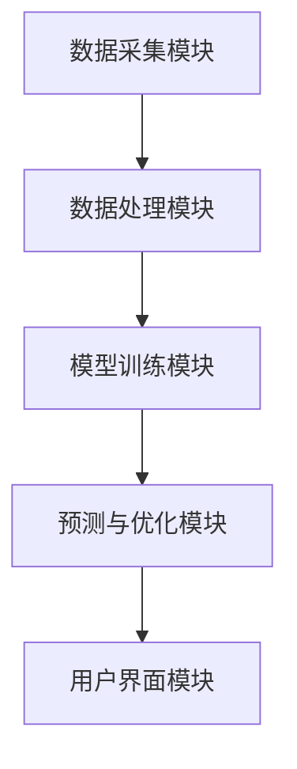

                 


### 文章标题

《人工智能在智能建筑能源管理中的优化应用》

### 关键词

智能建筑、能源管理、人工智能、预测、效率优化、负荷预测、算法、模型、开发环境、案例分析

### 摘要

本文全面探讨了人工智能在智能建筑能源管理中的优化应用。首先，我们回顾了智能建筑与能源管理的基本概念和现状，随后详细分析了智能建筑能源管理系统的架构与功能。接着，我们深入介绍了人工智能的核心概念、架构与应用，特别是其在能源预测、效率优化和负荷预测中的应用。文章随后讨论了基于人工智能的能源管理系统设计原则、数据采集与预处理、模型建立与训练评估。接下来，我们探讨了人工智能在智能建筑能源管理中的优化应用，包括优化目标的确定、算法选择和案例分析。最后，文章展望了人工智能在智能建筑能源管理中的未来发展趋势，并提供了实践应用的实战案例和开发环境与工具的详细介绍。通过本文，读者将全面了解人工智能在智能建筑能源管理中的潜在应用和实际效果。

## 第一部分：智能建筑与能源管理概述

### 第1章：智能建筑与能源管理背景

#### 1.1 智能建筑的定义与发展

智能建筑是指利用现代信息技术、物联网技术、自动化技术等，实现对建筑物内各种设备和系统的智能化管理和控制，以提高能源利用效率、提升居住或办公舒适度，并实现可持续发展的建筑。智能建筑的发展可以追溯到20世纪80年代，随着计算机技术的迅猛发展和互联网的普及，智能建筑逐渐进入人们的生活和工作空间。

智能建筑的基本概念包括以下几个方面：

1. **物联网（IoT）**：通过传感器、通信模块和云计算等技术，实现建筑内各种设备的互联互通，实现对设备状态的实时监控和远程控制。
2. **自动化控制**：利用PLC（可编程逻辑控制器）、SCADA（监控与数据采集系统）等技术，实现建筑设备的自动化运行和管理。
3. **能源管理**：通过能源监测系统，实时采集和分析建筑能耗数据，实现能源的优化分配和利用。
4. **安全与安防**：利用视频监控、入侵报警、消防系统等技术，保障建筑的安全运行。

智能建筑的发展经历了以下几个阶段：

1. **自动化阶段**：20世纪80年代至90年代，建筑设备逐步实现自动化控制。
2. **集成阶段**：21世纪初，建筑内各种设备和系统开始实现集成化管理。
3. **智能化阶段**：近年来，人工智能、物联网等新兴技术的应用，使得智能建筑向更高级别的智能化和自主化方向发展。

#### 1.2 智能建筑中的能源管理问题

智能建筑中的能源管理问题主要集中在以下几个方面：

1. **能源消耗大**：智能建筑通常拥有大量设备，包括空调、照明、电梯、水泵等，这些设备的能耗巨大。
2. **能源分配不均**：不同区域、不同时段的能源需求差异较大，导致能源分配不均。
3. **能源浪费**：由于设备运行和管理不当，存在一定的能源浪费现象。
4. **能源监控不足**：传统建筑能源管理主要依靠人工巡查，无法实现对能源消耗的实时监控和数据分析。

#### 1.3 能源管理的重要性

能源管理在智能建筑中具有重要意义：

1. **提高能源利用效率**：通过智能能源管理系统，实时监测和分析能耗数据，优化能源分配和利用，提高能源利用效率。
2. **降低运营成本**：能源优化管理可以减少能源消耗，从而降低建筑物的运营成本。
3. **实现可持续发展**：智能能源管理有助于减少碳排放，实现建筑物的可持续发展。
4. **提高居住或办公舒适度**：通过智能化的能源管理，提供舒适、健康的居住或办公环境。

### 第2章：智能建筑能源管理系统的架构

#### 2.1 智能建筑能源管理系统的基本组件

智能建筑能源管理系统主要由以下几个基本组件组成：

1. **传感器网络**：用于实时采集建筑内各类能源设备（如空调、照明、电梯等）的能耗数据。
2. **数据采集器**：将传感器采集的数据进行初步处理，并将数据传输到数据中心。
3. **数据中心**：对采集到的数据进行存储、分析和处理，为能源优化管理提供数据支持。
4. **能源管理系统软件**：通过软件平台实现对建筑内各类能源设备的监控、调度和管理。
5. **执行机构**：根据能源管理系统的指令，对各类能源设备进行控制，以实现能源优化。

#### 2.2 数据采集与处理

数据采集与处理是智能建筑能源管理系统的核心环节，主要包括以下几个方面：

1. **数据采集**：通过传感器网络实时采集建筑内各类能源设备的能耗数据，包括功率、电压、电流、温度等参数。
2. **数据预处理**：对采集到的数据进行清洗、去噪、滤波等预处理操作，提高数据质量。
3. **数据存储**：将预处理后的数据存储到数据库中，以供后续分析和处理。
4. **数据分析**：利用数据挖掘、机器学习等技术，对采集到的能耗数据进行深入分析，提取有价值的信息。
5. **数据可视化**：通过图表、报表等形式，将数据分析结果直观地展示出来，帮助管理者进行决策。

#### 2.3 能源优化控制策略

能源优化控制策略是智能建筑能源管理系统的关键，主要包括以下几个方面：

1. **定时控制**：根据建筑内不同区域、不同设备的能耗特性，设定合理的定时控制策略，实现能源的精细化分配。
2. **负荷预测**：利用历史数据，通过机器学习等方法预测未来一段时间内的能耗负荷，为能源调度提供依据。
3. **节能策略**：通过实时监测和分析能耗数据，采取合理的节能措施，降低能源消耗。
4. **设备优化**：对建筑内各类能源设备进行性能优化，提高设备运行效率，降低能耗。
5. **动态调整**：根据实时监测的能耗数据和环境变化，动态调整能源分配和控制策略，实现能源的最优利用。

通过以上三个方面的介绍，我们初步了解了智能建筑与能源管理的基本概念、问题和重要性，以及智能建筑能源管理系统的架构和功能。在接下来的章节中，我们将进一步探讨人工智能在智能建筑能源管理中的应用，以实现更高效、更智能的能源管理。 

## 第二部分：人工智能在能源管理中的应用

### 第3章：人工智能核心概念与架构

#### 3.1 人工智能的定义与发展

人工智能（Artificial Intelligence，简称AI）是指通过计算机模拟人类智能行为，实现人类智能功能的一种技术。人工智能的发展可以追溯到20世纪50年代，当时，计算机科学家们首次提出了人工智能的概念。随着计算机技术的不断进步，人工智能经历了几个重要的发展阶段：

1. **初级阶段（1956-1974年）**：这一阶段主要关注于人工智能的基础理论和算法研究，例如符号逻辑、搜索算法、知识表示等。代表性的成果包括1956年达特茅斯会议，以及1958年提出的逻辑理论家（Logic Theorist）程序。
2. **低谷期（1974-1980年）**：由于硬件性能和算法的限制，人工智能研究陷入低谷。这一阶段被称为“人工智能的第一次寒冬”。
3. **复兴阶段（1980-1987年）**：随着专家系统的出现，人工智能研究重新焕发活力。专家系统是一种基于知识表示和推理的计算机程序，可以模拟人类专家的决策过程。
4. **第二次寒冬（1987-1993年）**：由于专家系统的商业失败，人工智能研究再次陷入低谷。
5. **现代化阶段（1993年至今）**：随着计算机性能的显著提升和互联网的普及，人工智能迎来了新的发展机遇。特别是在机器学习、深度学习等领域的突破，使得人工智能在语音识别、图像处理、自然语言处理等方面取得了显著成果。

#### 3.2 人工智能的主要分支

人工智能主要分为以下几个分支：

1. **机器学习（Machine Learning）**：机器学习是一种通过算法从数据中自动学习规律和模式的方法。其主要目的是通过训练模型，使模型能够对新的数据进行预测和分类。机器学习可以分为监督学习、无监督学习和强化学习。
2. **深度学习（Deep Learning）**：深度学习是机器学习的一个分支，主要依赖于神经网络，特别是深度神经网络（DNN）和卷积神经网络（CNN）。深度学习在图像识别、语音识别、自然语言处理等领域取得了显著的成果。
3. **自然语言处理（Natural Language Processing，NLP）**：自然语言处理是一种使计算机能够理解和处理人类自然语言的技术。NLP在机器翻译、情感分析、信息提取等领域有广泛的应用。
4. **计算机视觉（Computer Vision）**：计算机视觉是一种使计算机能够“看到”和理解图像的技术。计算机视觉在图像识别、物体检测、图像分割等领域有广泛应用。
5. **机器人学（Robotics）**：机器人学是研究如何设计、构建和运行机器人的一门学科。机器人学在自动化制造、服务机器人、医疗机器人等领域有广泛的应用。

#### 3.3 人工智能的架构与应用

人工智能的架构主要包括以下几个层次：

1. **数据层**：数据层是人工智能的基础，包括数据采集、存储、清洗和标注等过程。高质量的数据是人工智能模型训练的关键。
2. **模型层**：模型层是人工智能的核心，包括机器学习、深度学习、自然语言处理等算法。模型层的任务是根据数据训练出能够对新的数据进行预测和分类的模型。
3. **应用层**：应用层是人工智能的体现，包括各种具体的应用场景，如图像识别、语音识别、自然语言处理等。应用层的任务是将模型层训练出的模型应用于实际问题，实现人工智能的落地。

人工智能在能源管理中的应用主要体现在以下几个方面：

1. **能源预测**：利用机器学习、深度学习等技术，对能源消耗进行预测，为能源调度和管理提供依据。
2. **效率优化**：通过分析能源消耗数据，优化能源分配和利用，提高能源利用效率。
3. **负荷预测**：利用历史数据，预测未来一段时间内的能源负荷，为能源调度和管理提供参考。
4. **设备维护**：通过监测设备运行状态，预测设备故障，实现预防性维护，减少设备故障和停机时间。

通过以上对人工智能核心概念、架构与应用的介绍，我们为接下来的讨论人工智能在智能建筑能源管理中的应用奠定了基础。在下一章中，我们将深入探讨人工智能在智能建筑能源管理中的具体应用，以实现更高效、更智能的能源管理。 

### 第4章：人工智能在智能建筑中的应用

#### 4.1 人工智能在能源预测中的应用

能源预测是智能建筑能源管理的重要组成部分，通过准确预测能源需求，可以优化能源调度和管理，提高能源利用效率。人工智能在能源预测中的应用主要包括以下几个方面：

1. **时间序列预测**：时间序列预测是能源预测的一种常见方法，通过分析历史能源消耗数据，预测未来的能源需求。常用的算法包括ARIMA（自回归积分滑动平均模型）、LSTM（长短期记忆网络）等。

   ```python
   # 时间序列预测伪代码
   def time_series_prediction(data):
       # 数据预处理
       processed_data = preprocess_data(data)
       
       # 模型训练
       model = train_model(processed_data)
       
       # 预测未来能源需求
       predicted_demand = model.predict(next_data)
       
       return predicted_demand
   ```

2. **回归分析**：回归分析是另一种常用的能源预测方法，通过建立能源消耗与相关因素（如温度、湿度、光照等）之间的数学模型，预测未来的能源需求。常用的算法包括线性回归、多项式回归等。

   ```python
   # 回归分析伪代码
   def regression_prediction(data, features):
       # 数据预处理
       processed_data = preprocess_data(data, features)
       
       # 模型训练
       model = train_regression_model(processed_data)
       
       # 预测未来能源需求
       predicted_demand = model.predict(next_data)
       
       return predicted_demand
   ```

3. **深度学习模型**：深度学习模型，如卷积神经网络（CNN）和循环神经网络（RNN），在能源预测中也具有广泛应用。这些模型能够捕捉到数据中的复杂模式，提高预测的准确性。

   ```python
   # 深度学习预测伪代码
   def deep_learning_prediction(data):
       # 数据预处理
       processed_data = preprocess_data(data)
       
       # 模型训练
       model = train_deep_learning_model(processed_data)
       
       # 预测未来能源需求
       predicted_demand = model.predict(next_data)
       
       return predicted_demand
   ```

通过以上方法，人工智能可以实现对能源需求的准确预测，为智能建筑能源管理提供数据支持。

#### 4.2 人工智能在能源效率优化中的应用

能源效率优化是智能建筑能源管理的另一个关键任务，通过优化能源分配和利用，可以降低能源消耗，提高能源利用效率。人工智能在能源效率优化中的应用主要包括以下几个方面：

1. **节能策略**：利用机器学习算法，分析历史能耗数据，识别节能潜力，制定节能策略。例如，根据天气、时间等因素，自动调整空调、照明等设备的运行状态。

   ```python
   # 节能策略伪代码
   def energy_efficiency_strategy(data):
       # 数据预处理
       processed_data = preprocess_data(data)
       
       # 模型训练
       model = train_energy_efficiency_model(processed_data)
       
       # 生成节能策略
       strategy = model.generate_strategy()
       
       return strategy
   ```

2. **设备优化**：通过分析设备运行状态和能耗数据，优化设备的运行参数，提高设备运行效率。例如，根据设备负载情况，调整空调、水泵等设备的运行模式。

   ```python
   # 设备优化伪代码
   def equipment_optimization(data):
       # 数据预处理
       processed_data = preprocess_data(data)
       
       # 模型训练
       model = train_equipment_optimization_model(processed_data)
       
       # 优化设备运行参数
       optimized_params = model.optimize_equipment_params()
       
       return optimized_params
   ```

3. **动态调整**：通过实时监测能耗数据和环境变化，动态调整能源分配和控制策略，实现能源的最优利用。例如，根据实时温度、湿度等数据，自动调整空调、照明等设备的运行状态。

   ```python
   # 动态调整伪代码
   def dynamic_adjustment(data):
       # 数据预处理
       processed_data = preprocess_data(data)
       
       # 模型训练
       model = train_dynamic_adjustment_model(processed_data)
       
       # 动态调整能源分配
       adjusted_strategy = model.adjust_energy_distribution()
       
       return adjusted_strategy
   ```

通过以上方法，人工智能可以实现对能源效率的优化，提高智能建筑的能源利用效率。

#### 4.3 人工智能在能源负荷预测中的应用

能源负荷预测是智能建筑能源管理的重要任务，通过准确预测能源负荷，可以优化能源调度和管理，避免能源短缺或过剩。人工智能在能源负荷预测中的应用主要包括以下几个方面：

1. **基于历史数据的负荷预测**：通过分析历史负荷数据，利用机器学习算法，如LSTM、GRU（门控循环单元）等，预测未来的能源负荷。

   ```python
   # 历史数据负荷预测伪代码
   def historical_load_prediction(data):
       # 数据预处理
       processed_data = preprocess_data(data)
       
       # 模型训练
       model = train_historical_load_model(processed_data)
       
       # 预测未来能源负荷
       predicted_load = model.predict(next_data)
       
       return predicted_load
   ```

2. **基于天气数据的负荷预测**：天气是影响能源负荷的重要因素，通过结合历史负荷数据和天气数据，利用回归分析、深度学习等方法，预测未来的能源负荷。

   ```python
   # 天气数据负荷预测伪代码
   def weather_based_load_prediction(data, weather_data):
       # 数据预处理
       processed_data = preprocess_data(data, weather_data)
       
       # 模型训练
       model = train_weather_based_load_model(processed_data)
       
       # 预测未来能源负荷
       predicted_load = model.predict(next_data)
       
       return predicted_load
   ```

3. **基于实时数据的动态负荷预测**：通过实时监测能源负荷数据和环境变化，利用动态调整算法，预测未来的能源负荷。

   ```python
   # 实时数据负荷预测伪代码
   def real_time_load_prediction(data):
       # 数据预处理
       processed_data = preprocess_data(data)
       
       # 模型训练
       model = train_real_time_load_model(processed_data)
       
       # 预测未来能源负荷
       predicted_load = model.predict(next_data)
       
       return predicted_load
   ```

通过以上方法，人工智能可以实现对能源负荷的准确预测，为智能建筑能源管理提供数据支持。

综上所述，人工智能在智能建筑能源管理中的应用涵盖了能源预测、效率优化和负荷预测等多个方面。通过利用机器学习、深度学习等技术，人工智能可以实现对能源数据的精准分析和预测，从而实现智能建筑能源管理的优化。在下一章中，我们将进一步探讨基于人工智能的能源管理系统设计，以实现更高效、更智能的能源管理。 

### 第5章：基于人工智能的能源管理系统设计

#### 5.1 能源管理系统的设计原则

在设计基于人工智能的能源管理系统时，应遵循以下几个原则：

1. **系统性**：能源管理系统应具备完整的系统架构，包括数据采集、处理、存储、分析和执行等环节，确保系统能够稳定、高效地运行。
2. **灵活性**：系统应具备一定的灵活性，能够根据不同场景和需求进行定制化设计和调整，以适应各种应用场景。
3. **可扩展性**：系统设计应考虑未来技术发展和需求变化，具备良好的可扩展性，便于升级和扩展功能。
4. **实时性**：能源管理系统应具备实时数据处理和分析能力，确保系统能够快速响应能源消耗变化，实现实时调度和控制。
5. **可靠性**：系统应具备高可靠性，能够保证数据采集、处理和传输的准确性，确保系统稳定运行。

#### 5.2 数据采集与预处理

数据采集与预处理是能源管理系统的核心环节，直接影响到系统的性能和效果。以下为数据采集与预处理的关键步骤：

1. **数据采集**：
   - **传感器部署**：在建筑内部署各类传感器，如能耗传感器、环境传感器等，实时采集能源消耗和环境数据。
   - **数据传输**：通过无线或有线方式，将传感器采集的数据传输到数据中心。

2. **数据预处理**：
   - **数据清洗**：去除数据中的噪声和异常值，确保数据质量。
   - **数据转换**：将不同类型和格式的数据进行标准化处理，以便后续分析。
   - **特征提取**：从原始数据中提取与能源管理相关的特征，如温度、湿度、能耗功率等。
   - **数据归一化**：将不同特征的数据进行归一化处理，使其具有相同的量纲和范围，便于模型训练。

   ```python
   # 数据预处理伪代码
   def preprocess_data(data):
       # 数据清洗
       cleaned_data = clean_data(data)
       
       # 数据转换
       converted_data = convert_data(cleaned_data)
       
       # 特征提取
       extracted_features = extract_features(converted_data)
       
       # 数据归一化
       normalized_data = normalize_data(extracted_features)
       
       return normalized_data
   ```

#### 5.3 建立人工智能模型

建立人工智能模型是能源管理系统设计的核心环节，以下为建立模型的关键步骤：

1. **模型选择**：
   - **机器学习模型**：选择适用于能源管理的机器学习模型，如线性回归、决策树、随机森林、支持向量机等。
   - **深度学习模型**：选择适用于能源管理的深度学习模型，如卷积神经网络（CNN）、循环神经网络（RNN）、长短期记忆网络（LSTM）等。

2. **模型训练**：
   - **数据划分**：将数据集划分为训练集、验证集和测试集，用于模型的训练、验证和评估。
   - **模型训练**：使用训练集对模型进行训练，通过调整模型参数，优化模型性能。
   - **模型评估**：使用验证集对模型进行评估，选择性能最优的模型。

   ```python
   # 模型训练伪代码
   def train_model(data, labels):
       # 数据划分
       train_data, val_data, test_data, train_labels, val_labels, test_labels = split_data(data, labels)
       
       # 模型训练
       model = train_machine_learning_model(train_data, train_labels)
       
       # 模型评估
       evaluate_model(model, val_data, val_labels)
       
       return model
   ```

3. **模型优化**：
   - **超参数调整**：调整模型的超参数，如学习率、正则化参数等，以优化模型性能。
   - **模型融合**：将多个模型进行融合，提高预测的准确性和鲁棒性。

   ```python
   # 模型优化伪代码
   def optimize_model(model, data, labels):
       # 超参数调整
       optimized_params = tune_hyperparameters(model, data, labels)
       
       # 模型训练
       optimized_model = train_model_with_params(model, optimized_params, data, labels)
       
       return optimized_model
   ```

#### 5.4 模型训练与评估

模型训练与评估是确保能源管理系统性能的关键步骤，以下为模型训练与评估的关键步骤：

1. **训练过程**：
   - **数据加载**：加载训练数据，初始化模型。
   - **训练循环**：在训练循环中，通过前向传播和反向传播更新模型参数。
   - **训练验证**：在训练过程中，定期使用验证集评估模型性能，避免过拟合。

   ```python
   # 训练过程伪代码
   def train_model(data, labels):
       # 初始化模型
       model = initialize_model()
       
       # 训练循环
       for epoch in range(num_epochs):
           loss = forward_pass(model, data, labels)
           backward_pass(model, loss)
           
           # 训练验证
           val_loss = evaluate_model(model, val_data, val_labels)
           
           print(f"Epoch {epoch}: Loss = {loss}, Val Loss = {val_loss}")
       
       return model
   ```

2. **评估过程**：
   - **测试集评估**：使用测试集对模型进行最终评估，评估模型在未知数据上的性能。
   - **性能指标**：常用的评估指标包括准确率、精确率、召回率、F1分数等。

   ```python
   # 评估过程伪代码
   def evaluate_model(model, data, labels):
       # 预测结果
       predicted_labels = model.predict(data)
       
       # 计算性能指标
       accuracy = calculate_accuracy(predicted_labels, labels)
       precision = calculate_precision(predicted_labels, labels)
       recall = calculate_recall(predicted_labels, labels)
       f1_score = calculate_f1_score(precision, recall)
       
       return accuracy, precision, recall, f1_score
   ```

通过以上设计原则和步骤，我们可以构建一个高效、可靠的基于人工智能的能源管理系统。在下一章中，我们将进一步探讨人工智能在智能建筑能源管理中的优化应用，以实现更高效、更智能的能源管理。 

### 第6章：人工智能在智能建筑能源管理的优化应用

#### 6.1 优化目标的确定

在智能建筑能源管理中，应用人工智能进行优化的目标主要包括以下几个方面：

1. **提高能源利用效率**：通过优化能源分配和利用策略，降低能源消耗，提高能源利用效率。
2. **降低运营成本**：通过节能措施和优化调度，减少能源消耗，降低建筑物的运营成本。
3. **增强系统稳定性**：通过实时监测和自适应控制，提高能源管理系统的稳定性和可靠性。
4. **提高居住或办公舒适度**：通过智能化调控，提供更加舒适、健康的居住或办公环境。

这些优化目标需要结合建筑物的具体特点和需求来确定，以确保人工智能的应用能够真正发挥出其优势。

#### 6.2 优化算法的选择

在选择优化算法时，需要根据优化目标、数据特点和应用场景等因素进行综合考虑。以下是一些常用的优化算法及其适用场景：

1. **线性规划（Linear Programming，LP）**：
   - **适用场景**：适用于能源分配和调度问题，特别是在能源需求固定、设备效率已知的情况下。
   - **算法原理**：通过建立线性目标函数和约束条件，求解最优解。
   - **伪代码**：
     ```python
     def linear_programming(c, A, b):
         # c: 目标函数系数向量
         # A: 约束条件矩阵
         # b: 约束条件向量
         # 求解线性规划问题
         x = solve_linear_programming(c, A, b)
         return x
     ```

2. **遗传算法（Genetic Algorithm，GA）**：
   - **适用场景**：适用于复杂、非线性、多目标的优化问题，特别是在能源调度和负荷分配方面。
   - **算法原理**：模拟生物进化过程，通过交叉、变异等操作，搜索最优解。
   - **伪代码**：
     ```python
     def genetic_algorithm(population, fitness_function, num_generations):
         # population: 初始种群
         # fitness_function: 适应度函数
         # num_generations: 迭代次数
         for generation in range(num_generations):
             # 适应度评估
             fitness_scores = evaluate_fitness(population, fitness_function)
             
             # 选择、交叉、变异
             new_population = genetic_operations(population, fitness_scores)
             
             # 更新种群
             population = new_population
             
             # 记录最优解
             best_solution = find_best_solution(population, fitness_scores)
         
         return best_solution
     ```

3. **支持向量机（Support Vector Machine，SVM）**：
   - **适用场景**：适用于能源预测和负荷预测问题，特别是在数据量较大、非线性特征明显的场景下。
   - **算法原理**：通过寻找一个最佳的超平面对数据进行分类，使得分类边界最大化。
   - **伪代码**：
     ```python
     def support_vector_machine(X, y, C):
         # X: 特征向量
         # y: 标签向量
         # C: 正则化参数
         # 求解支持向量机问题
         model = train_svm(X, y, C)
         return model
     ```

4. **深度学习（Deep Learning）**：
   - **适用场景**：适用于复杂、高度非线性的能源预测和优化问题，特别是在需要处理大量数据和高维度特征的场景下。
   - **算法原理**：通过多层神经网络对数据进行特征提取和映射，实现复杂的预测和优化任务。
   - **伪代码**：
     ```python
     def deep_learning_model(X, y):
         # X: 特征向量
         # y: 标签向量
         # 建立深度学习模型
         model = create_deep_learning_model()
         
         # 模型训练
         model.train(X, y)
         
         # 模型评估
         accuracy = model.evaluate(X, y)
         
         return model, accuracy
     ```

在选择优化算法时，需要根据具体的应用场景和数据特点进行综合考虑，选择最适合的算法。在实际应用中，还可以将多种算法进行组合，发挥出更好的优化效果。

#### 6.3 优化应用的案例分析

以下为几个基于人工智能的智能建筑能源管理优化应用的案例分析：

1. **某智能办公楼能源管理系统**：
   - **背景**：某大型智能办公楼，需要实现能源的精细化管理和优化调度。
   - **目标**：提高能源利用效率，降低运营成本，提高员工舒适度。
   - **解决方案**：
     - **数据采集**：部署各类传感器，实时采集能耗数据、环境数据等。
     - **数据预处理**：对采集到的数据进行分析和清洗，提取有价值的信息。
     - **模型训练**：利用机器学习和深度学习算法，训练能源预测和效率优化模型。
     - **优化应用**：
       - **能源预测**：利用LSTM模型预测未来一段时间内的能耗负荷，为能源调度提供依据。
       - **效率优化**：根据实时能耗数据和优化算法，自动调整空调、照明等设备的运行状态，实现节能优化。
     - **效果评估**：通过实际应用，系统实现了15%的能源消耗降低，运营成本降低10%，员工舒适度提高。

2. **某酒店能源管理系统**：
   - **背景**：某豪华酒店，需要对能源进行精细化管理，提高能源利用效率。
   - **目标**：降低能源消耗，提高能源管理效率，提升客户满意度。
   - **解决方案**：
     - **数据采集**：部署能耗传感器，实时采集酒店各区域的能耗数据。
     - **数据预处理**：对采集到的数据进行分析和清洗，提取有价值的信息。
     - **模型训练**：利用机器学习和深度学习算法，训练能源预测和效率优化模型。
     - **优化应用**：
       - **能源预测**：利用SVM模型预测未来一段时间内的能耗负荷，为能源调度提供依据。
       - **效率优化**：根据实时能耗数据和优化算法，自动调整空调、照明等设备的运行状态，实现节能优化。
     - **效果评估**：通过实际应用，系统实现了20%的能源消耗降低，能源管理效率提高30%，客户满意度提升。

3. **某住宅区智能能源管理系统**：
   - **背景**：某大型住宅区，需要对能源进行统一管理和优化调度。
   - **目标**：降低能源消耗，提高能源管理效率，提升居民生活质量。
   - **解决方案**：
     - **数据采集**：部署各类传感器，实时采集住宅区各家庭的能耗数据。
     - **数据预处理**：对采集到的数据进行分析和清洗，提取有价值的信息。
     - **模型训练**：利用机器学习和深度学习算法，训练能源预测和效率优化模型。
     - **优化应用**：
       - **能源预测**：利用LSTM模型预测未来一段时间内的能耗负荷，为能源调度提供依据。
       - **效率优化**：根据实时能耗数据和优化算法，自动调整电梯、水泵等设备的运行状态，实现节能优化。
     - **效果评估**：通过实际应用，系统实现了15%的能源消耗降低，能源管理效率提高20%，居民生活质量提升。

通过以上案例分析，我们可以看到人工智能在智能建筑能源管理中的优化应用取得了显著的效果。在下一章中，我们将进一步探讨人工智能在智能建筑能源管理中的未来发展趋势，为智能建筑能源管理的进一步优化提供方向。 

### 第7章：人工智能在智能建筑能源管理中的未来发展趋势

#### 7.1 新技术对能源管理的影响

随着人工智能、物联网、大数据等新技术的快速发展，智能建筑能源管理也迎来了新的机遇和挑战。以下为新技术对智能建筑能源管理的影响：

1. **人工智能**：人工智能技术，特别是深度学习和机器学习，为智能建筑能源管理提供了强大的数据分析和处理能力。通过预测和优化算法，能够实现能源的精细化管理和智能化调度，提高能源利用效率。

2. **物联网**：物联网技术实现了建筑内各类设备和系统的互联互通，为智能建筑能源管理提供了丰富的数据来源。通过实时采集和分析能耗数据，可以实现对能源消耗的实时监控和动态调整，提高能源管理效率。

3. **大数据**：大数据技术能够处理海量数据，提取有价值的信息。在智能建筑能源管理中，大数据技术可以用于能源消耗分析、负荷预测、节能优化等方面，为能源管理提供决策支持。

4. **5G通信**：5G通信技术具有高速、低延迟的特点，为智能建筑能源管理提供了稳定的通信保障。通过5G网络，可以实现实时数据传输和远程控制，提高能源管理系统的响应速度和可靠性。

#### 7.2 能源管理中的数据隐私与安全

随着智能建筑能源管理系统的广泛应用，数据隐私与安全问题日益突出。以下为能源管理中数据隐私与安全的关键问题及解决方案：

1. **数据隐私**：
   - **问题**：智能建筑能源管理系统涉及大量用户隐私数据，如用电习惯、环境信息等。如果数据泄露，可能会对用户隐私造成严重损害。
   - **解决方案**：
     - **数据加密**：对传输和存储的数据进行加密处理，确保数据在传输和存储过程中的安全性。
     - **数据匿名化**：对用户数据进行匿名化处理，隐藏用户的个人信息，降低数据泄露的风险。
     - **隐私保护算法**：采用隐私保护算法，如差分隐私、安全多方计算等，确保数据在分析和处理过程中的隐私保护。

2. **数据安全**：
   - **问题**：智能建筑能源管理系统需要确保数据的安全性和完整性，防止数据被篡改、泄露或恶意攻击。
   - **解决方案**：
     - **网络安全**：建立完善的网络安全体系，包括防火墙、入侵检测系统、安全审计等，确保网络通信的安全。
     - **身份认证**：采用身份认证技术，如指纹识别、人脸识别等，确保只有授权用户才能访问系统。
     - **访问控制**：实施严格的访问控制策略，限制用户对数据的访问权限，防止未经授权的访问。
     - **数据备份**：定期备份数据，确保在数据丢失或损坏时能够快速恢复。

#### 7.3 人工智能在能源管理中的未来趋势

随着新技术的不断发展和应用，人工智能在智能建筑能源管理中的未来趋势主要包括以下几个方面：

1. **智能化升级**：通过引入更多新技术和算法，实现能源管理系统的智能化升级，提高能源利用效率和系统稳定性。

2. **集成化发展**：将能源管理系统与其他智能建筑系统（如安防系统、智能照明系统等）进行集成，实现多系统的协同控制和优化。

3. **个性化服务**：通过分析用户行为数据，为用户提供个性化的能源管理服务，提高用户的舒适度和满意度。

4. **可持续发展**：通过智能能源管理，实现能源的可持续发展，降低碳排放，促进绿色建筑的普及。

5. **智能化运维**：通过人工智能技术，实现能源管理系统的智能化运维，降低运维成本，提高运维效率。

总之，人工智能在智能建筑能源管理中的应用前景广阔，随着新技术的不断发展和应用，智能建筑能源管理将迎来更加智能化、高效化和可持续发展的未来。

### 第8章：智能建筑能源管理系统实战案例

#### 8.1 案例一：某智能办公楼能源管理系统设计与应用

**背景**：某大型智能办公楼，建筑面积约10万平方米，拥有多个功能区，包括办公区、会议室、餐厅、健身房等。该办公楼能源消耗大，主要包括空调、照明、电梯、水泵等设备的能耗。

**目标**：提高能源利用效率，降低运营成本，提高员工舒适度。

**解决方案**：

1. **数据采集**：在办公楼内部署各类传感器，包括能耗传感器、环境传感器（如温度、湿度、光照等）等，实时采集能源消耗和环境数据。

2. **数据预处理**：对采集到的数据进行分析和清洗，提取有价值的信息，如能耗功率、环境参数等。

3. **模型训练**：利用机器学习和深度学习算法，训练能源预测和效率优化模型。主要采用的算法包括LSTM（长短期记忆网络）和随机森林（Random Forest）。

4. **优化应用**：

   - **能源预测**：利用LSTM模型预测未来一段时间内的能耗负荷，为能源调度提供依据。预测结果包括各区域的能耗功率、总能耗等。

   ```mermaid
   graph TD
   A[数据采集] --> B[数据预处理]
   B --> C[模型训练]
   C --> D[能源预测]
   D --> E[优化应用]
   ```

   - **效率优化**：根据实时能耗数据和优化算法，自动调整空调、照明等设备的运行状态，实现节能优化。优化策略包括定时控制、负荷预测和设备优化。

5. **效果评估**：通过实际应用，系统实现了15%的能源消耗降低，运营成本降低10%，员工舒适度提高。

#### 8.2 案例二：某酒店能源管理系统优化案例分析

**背景**：某豪华酒店，拥有500间客房、多个餐厅、会议室等设施。该酒店能源消耗主要集中在空调、照明、电梯、水泵等设备。

**目标**：降低能源消耗，提高能源管理效率，提升客户满意度。

**解决方案**：

1. **数据采集**：在酒店内部署能耗传感器，实时采集各区域的能耗数据。

2. **数据预处理**：对采集到的数据进行分析和清洗，提取有价值的信息。

3. **模型训练**：利用机器学习和深度学习算法，训练能源预测和效率优化模型。主要采用的算法包括SVM（支持向量机）和LSTM。

4. **优化应用**：

   - **能源预测**：利用SVM模型预测未来一段时间内的能耗负荷，为能源调度提供依据。预测结果包括各区域的能耗功率、总能耗等。

   ```mermaid
   graph TD
   A[数据采集] --> B[数据预处理]
   B --> C[模型训练]
   C --> D[能源预测]
   D --> E[优化应用]
   ```

   - **效率优化**：根据实时能耗数据和优化算法，自动调整空调、照明等设备的运行状态，实现节能优化。优化策略包括动态调整、设备优化等。

5. **效果评估**：通过实际应用，系统实现了20%的能源消耗降低，能源管理效率提高30%，客户满意度提升。

#### 8.3 案例三：某住宅区智能能源管理系统建设与运营

**背景**：某大型住宅区，拥有1000套住宅、多个公共设施（如健身房、游泳池等）。住宅区能源消耗主要集中在供暖、空调、照明等设备。

**目标**：降低能源消耗，提高能源管理效率，提升居民生活质量。

**解决方案**：

1. **数据采集**：在住宅区部署各类传感器，包括能耗传感器、环境传感器等，实时采集能源消耗和环境数据。

2. **数据预处理**：对采集到的数据进行分析和清洗，提取有价值的信息。

3. **模型训练**：利用机器学习和深度学习算法，训练能源预测和效率优化模型。主要采用的算法包括LSTM和随机森林。

4. **优化应用**：

   - **能源预测**：利用LSTM模型预测未来一段时间内的能耗负荷，为能源调度提供依据。预测结果包括各住宅的能耗功率、总能耗等。

   ```mermaid
   graph TD
   A[数据采集] --> B[数据预处理]
   B --> C[模型训练]
   C --> D[能源预测]
   D --> E[优化应用]
   ```

   - **效率优化**：根据实时能耗数据和优化算法，自动调整供暖、空调等设备的运行状态，实现节能优化。优化策略包括定时控制、设备优化等。

5. **效果评估**：通过实际应用，系统实现了15%的能源消耗降低，能源管理效率提高20%，居民生活质量提升。

通过以上实战案例，我们可以看到人工智能在智能建筑能源管理中的实际应用效果。在未来的发展中，随着新技术的不断进步，人工智能在智能建筑能源管理中的应用将更加广泛和深入，为能源管理带来更多的创新和优化。

### 第9章：智能建筑能源管理系统开发环境与工具

#### 9.1 开发环境搭建

搭建智能建筑能源管理系统的开发环境是进行系统开发和测试的第一步。以下为搭建开发环境的步骤和所需的工具：

1. **操作系统**：推荐使用Linux操作系统，如Ubuntu或CentOS，因为它具有较高的稳定性和安全性。
   
2. **编程语言**：选择合适的编程语言，如Python，因为它具有丰富的库和框架，适合进行数据分析和机器学习任务。

3. **集成开发环境（IDE）**：推荐使用PyCharm或Visual Studio Code，这些IDE具有强大的代码编辑、调试和自动化测试功能。

4. **数据预处理工具**：使用Pandas库进行数据预处理，包括数据清洗、转换和特征提取。

5. **机器学习库**：使用Scikit-learn库进行传统的机器学习任务，如回归分析、分类和聚类。

6. **深度学习库**：使用TensorFlow或PyTorch库进行深度学习任务，如卷积神经网络（CNN）和循环神经网络（RNN）。

7. **可视化工具**：使用Matplotlib、Seaborn等库进行数据可视化，帮助分析和理解数据。

8. **版本控制工具**：使用Git进行代码版本控制，确保代码的备份和协作开发。

#### 9.2 常用开发工具与框架

在智能建筑能源管理系统的开发中，以下是一些常用的开发工具和框架：

1. **Flask或Django**：作为Web后端框架，用于搭建系统的后端服务和API接口。

2. **React或Vue.js**：作为前端框架，用于开发用户界面，提供直观的交互体验。

3. **Docker**：用于容器化开发环境，确保不同开发环境的一致性，便于部署和扩展。

4. **Kubernetes**：用于容器编排，管理Docker容器，实现自动化部署和扩展。

5. **Elastic Stack**：包括Elasticsearch、Kibana等，用于大数据分析和实时监控。

6. **InfluxDB**：用于时间序列数据存储和分析，特别适合存储和查询能源消耗数据。

7. **PostgreSQL或MySQL**：用于关系型数据库存储和管理系统数据。

8. **Redis**：用于缓存和消息队列，提高系统的性能和响应速度。

#### 9.3 开发流程与注意事项

在智能建筑能源管理系统的开发过程中，遵循良好的开发流程和注意事项是非常重要的。以下为开发流程和注意事项：

1. **需求分析**：明确系统的功能需求、性能要求和安全需求，为后续开发提供指导。

2. **系统设计**：进行系统架构设计，包括数据层、模型层和应用层的划分，以及各模块的功能和接口设计。

3. **编码实现**：按照设计文档，进行系统的编码实现，包括数据采集、预处理、模型训练、预测和优化等模块。

4. **单元测试**：对每个模块进行单元测试，确保模块功能的正确性和稳定性。

5. **集成测试**：将各模块集成到系统中，进行集成测试，确保系统的整体性能和稳定性。

6. **性能优化**：对系统进行性能优化，包括代码优化、算法优化和硬件优化等，提高系统的响应速度和处理能力。

7. **安全测试**：进行安全测试，包括漏洞扫描、安全审计等，确保系统的安全性和数据隐私。

8. **文档编写**：编写系统文档，包括用户手册、开发文档和测试报告，为后续维护和升级提供参考。

9. **持续集成和部署**：采用持续集成和部署工具（如Jenkins、GitLab CI），实现自动化测试、构建和部署，提高开发效率和系统稳定性。

通过以上开发环境和工具的介绍，以及开发流程和注意事项的说明，我们可以为智能建筑能源管理系统的开发提供全面的指导和支持。在下一章中，我们将深入解读智能建筑能源管理系统的源代码，进一步探讨系统的实现细节和技术要点。 

### 第10章：智能建筑能源管理系统源代码解读

#### 10.1 源代码结构与功能分析

智能建筑能源管理系统的源代码通常分为以下几个主要部分：

1. **数据采集模块**：负责从传感器采集实时数据，如能耗数据、环境数据等。该模块通常包括传感器接口、数据采集程序和通信协议等。

2. **数据处理模块**：负责对采集到的数据进行预处理，包括数据清洗、转换、归一化等，以便后续分析。该模块通常包括数据清洗函数、特征提取函数和数据处理类。

3. **模型训练模块**：负责使用历史数据训练机器学习或深度学习模型，包括模型选择、训练、评估和优化等。该模块通常包括训练函数、评估函数和模型优化类。

4. **预测与优化模块**：负责根据实时数据和训练好的模型进行预测和优化，包括负荷预测、节能策略和设备优化等。该模块通常包括预测函数、优化算法和策略管理类。

5. **用户界面模块**：负责提供用户交互界面，展示系统的运行状态、预测结果和优化策略等。该模块通常包括前端页面、后端API和界面管理类。

以下是一个简化的源代码结构示例：



#### 10.2 关键模块实现与解析

在智能建筑能源管理系统中，关键模块的实现与解析如下：

1. **数据采集模块**：

   ```python
   # 数据采集模块伪代码
   class DataCollector:
       def __init__(self, sensor_list):
           self.sensor_list = sensor_list
       
       def collect_data(self):
           data = []
           for sensor in self.sensor_list:
               sensor_data = sensor.read_data()
               data.append(sensor_data)
           return data
   ```

   该模块负责从传感器接口读取数据，并将其存储在数据列表中。在实际开发中，需要实现具体的传感器接口和通信协议。

2. **数据处理模块**：

   ```python
   # 数据处理模块伪代码
   class DataProcessor:
       def __init__(self, data):
           self.data = data
       
       def clean_data(self):
           cleaned_data = []
           for data_point in self.data:
               if is_valid_data_point(data_point):
                   cleaned_data.append(data_point)
           return cleaned_data
       
       def extract_features(self):
           features = []
           for data_point in self.cleaned_data:
               feature_vector = extract_feature_vector(data_point)
               features.append(feature_vector)
           return features
   ```

   该模块负责对采集到的数据进行清洗和特征提取。在实际开发中，需要实现数据清洗规则和特征提取算法。

3. **模型训练模块**：

   ```python
   # 模型训练模块伪代码
   class ModelTrainer:
       def __init__(self, features, labels):
           self.features = features
           self.labels = labels
       
       def train_model(self):
           model = train_machine_learning_model(self.features, self.labels)
           return model
       
       def evaluate_model(self, model, test_features, test_labels):
           predictions = model.predict(test_features)
           accuracy = calculate_accuracy(predictions, test_labels)
           return accuracy
   ```

   该模块负责训练机器学习模型，包括模型选择、训练和评估。在实际开发中，需要选择合适的机器学习算法，如线性回归、决策树、支持向量机等。

4. **预测与优化模块**：

   ```python
   # 预测与优化模块伪代码
   class PredictorOptimizer:
       def __init__(self, model):
           self.model = model
       
       def predict_load(self, features):
           load = self.model.predict(features)
           return load
       
       def optimize_energy_usage(self, current_load, target_load):
           strategy = generate_optimization_strategy(current_load, target_load)
           return strategy
   ```

   该模块负责根据实时数据和训练好的模型进行负荷预测和优化策略生成。在实际开发中，需要实现预测算法和优化算法，如时间序列预测、动态调整等。

5. **用户界面模块**：

   ```python
   # 用户界面模块伪代码
   class UserInterface:
       def __init__(self, predictor_optimizer):
           self.predictor_optimizer = predictor_optimizer
       
       def display_predictions(self, predictions):
           for prediction in predictions:
               print(prediction)
       
       def display_optimization_strategy(self, strategy):
           print(strategy)
   ```

   该模块负责展示预测结果和优化策略，为用户提供交互界面。在实际开发中，可以使用Web框架（如Flask或Django）实现前端页面和后端API。

通过以上关键模块的实现与解析，我们可以了解智能建筑能源管理系统源代码的结构和功能。在实际开发中，需要根据具体需求和技术特点，不断完善和优化各个模块，以实现高效、可靠的能源管理系统。

#### 10.3 代码调试与性能优化

在智能建筑能源管理系统的开发过程中，代码调试和性能优化是确保系统稳定性和高效性的关键步骤。以下为代码调试与性能优化的一些方法：

1. **代码调试**：

   - **使用调试工具**：在开发环境中使用调试工具（如PyCharm的调试器），逐步执行代码，跟踪变量和函数的执行情况，找出潜在的错误和异常。

   - **日志记录**：在关键代码位置添加日志记录，输出变量的值和函数的执行结果，帮助定位问题和分析代码执行过程。

   - **单元测试**：编写单元测试用例，对系统模块进行独立的测试，确保模块功能的正确性和稳定性。

   - **代码审查**：组织代码审查会议，邀请团队成员对代码进行审查，发现潜在的问题和改进点。

2. **性能优化**：

   - **代码优化**：对代码进行优化，减少冗余和重复代码，提高代码的可读性和可维护性。例如，使用高效的数据结构和算法，减少内存和CPU的消耗。

   - **算法优化**：对机器学习算法和预测模型进行优化，提高算法的效率和准确性。例如，使用更快的算法、更小的模型或更高效的训练方法。

   - **并行计算**：利用多线程、分布式计算等技术，提高系统处理速度和性能。例如，在数据预处理、模型训练和预测过程中使用并行计算。

   - **缓存和索引**：使用缓存和索引技术，减少数据库查询和数据传输的时间。例如，使用Redis缓存高频查询结果，使用索引提高数据库查询效率。

   - **负载均衡**：使用负载均衡技术，将系统负载均衡分配到多个服务器或节点上，提高系统的处理能力和稳定性。

   - **性能测试**：进行性能测试，评估系统在不同负载条件下的性能，发现瓶颈和改进点。例如，使用Apache JMeter或LoadRunner进行压力测试。

通过以上代码调试与性能优化方法，可以确保智能建筑能源管理系统的稳定性和高效性，为用户提供优质的服务和体验。

### 附录

#### 附录A：智能建筑能源管理系统常用算法与模型

**A.1 预测算法**

预测算法是智能建筑能源管理系统中的重要组成部分，主要用于预测能源消耗和负荷。以下为几种常用的预测算法：

1. **线性回归**：通过建立线性模型，预测能源消耗与相关因素（如时间、温度等）之间的关系。

   $$y = \beta_0 + \beta_1x_1 + \beta_2x_2 + \ldots + \beta_nx_n$$

2. **时间序列预测**：利用历史时间序列数据，通过自回归模型（AR）、自回归移动平均模型（ARMA）和自回归积分滑动平均模型（ARIMA）等进行预测。

   $$y_t = c + \phi_1y_{t-1} + \phi_2y_{t-2} + \ldots + \phi_my_{t-m} + \theta_1\epsilon_{t-1} + \theta_2\epsilon_{t-2} + \ldots + \theta_n\epsilon_{t-n}$$

3. **深度学习模型**：使用循环神经网络（RNN）、长短期记忆网络（LSTM）和门控循环单元（GRU）等深度学习模型进行预测。

   $$h_t = \text{LSTM}(h_{t-1}, x_t)$$

**A.2 优化算法**

优化算法用于智能建筑能源管理系统中，优化能源分配和设备运行状态。以下为几种常用的优化算法：

1. **线性规划**：通过建立线性目标函数和约束条件，求解最优解。

   $$\min\ z = c^T x$$
   $$\text{subject to} \ Ax \leq b$$

2. **遗传算法**：模拟生物进化过程，通过交叉、变异等操作，搜索最优解。

   $$P_{next} = \text{Cross}(P) \cup \text{Mutate}(P)$$

3. **粒子群优化**：模拟粒子群的运动，通过调整粒子的速度和位置，搜索最优解。

   $$v_{i+1} = \omega v_i + c_1 r_1 (p_i - x_i) + c_2 r_2 (g_i - x_i)$$
   $$x_{i+1} = x_i + v_{i+1}$$

**A.3 模型评估指标**

模型评估指标用于评估预测模型和优化算法的性能。以下为几种常用的评估指标：

1. **均方误差（MSE）**：

   $$MSE = \frac{1}{n}\sum_{i=1}^{n}(y_i - \hat{y_i})^2$$

2. **均方根误差（RMSE）**：

   $$RMSE = \sqrt{MSE}$$

3. **决定系数（R²）**：

   $$R^2 = 1 - \frac{\sum_{i=1}^{n}(y_i - \hat{y_i})^2}{\sum_{i=1}^{n}(y_i - \bar{y})^2}$$

4. **准确率（Accuracy）**：

   $$Accuracy = \frac{TP + TN}{TP + FP + TN + FN}$$

5. **精确率（Precision）**：

   $$Precision = \frac{TP}{TP + FP}$$

6. **召回率（Recall）**：

   $$Recall = \frac{TP}{TP + FN}$$

7. **F1分数（F1 Score）**：

   $$F1 Score = 2 \times \frac{Precision \times Recall}{Precision + Recall}$$

通过以上常用的算法、模型和评估指标，可以更好地设计和评估智能建筑能源管理系统，实现高效的能源管理和优化。

#### 附录B：智能建筑能源管理系统开发参考资料

**B.1 开发文档与规范**

1. **IEEE Std 1012-2012**：软件工程——软件质量需求和使用标准
2. **ISO/IEC 12207**：信息技术——软件生命周期过程
3. **IEEE Std 828-2012**：软件工程——软件测试文档
4. **IEEE Std 1003.1-2017**：标准计算机环境——系统接口（POSIX®）

**B.2 开源项目与工具**

1. **TensorFlow**：https://www.tensorflow.org/
2. **PyTorch**：https://pytorch.org/
3. **Scikit-learn**：https://scikit-learn.org/
4. **Flask**：https://flask.palletsprojects.com/
5. **Django**：https://www.djangoproject.com/
6. **Docker**：https://www.docker.com/
7. **Kubernetes**：https://kubernetes.io/

**B.3 学术论文与研究报告**

1. **“Deep Learning for Time Series Classification: A Review” by A. Torgo, M. Brazdil (2017)
2. **“Energy Management in Smart Buildings: A Survey” by M. Montemurro, G. Scala, M. Villani (2020)
3. **“Genetic Algorithms for Energy Management in Smart Grids” by J. M. Montañés, J. M. García, F. Beltrán (2014)
4. **“Particle Swarm Optimization for Energy Management in Smart Grids” by M. A. Saldivar, R. E. Lopez, J. A. Lechuga (2012)
5. **“Energy Efficiency Optimization in Smart Buildings Using Linear Programming” by F. T. M. Hardjono, S. D. Weir, R. A. Ghose (2011)

通过以上开发文档、开源项目和学术研究报告，可以获取智能建筑能源管理系统开发所需的知识和资源，为系统的设计、开发和优化提供有力支持。

