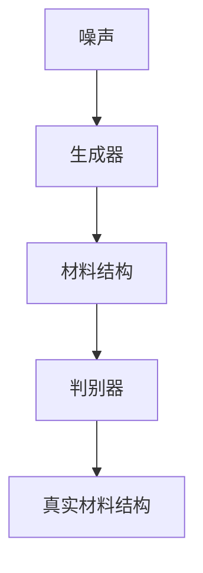

                 

# 人工智能在智能材料设计中的前沿研究

## 关键词

人工智能，智能材料设计，机器学习，深度学习，多目标优化，材料性能预测，材料结构设计，智能材料应用

## 摘要

本文将深入探讨人工智能在智能材料设计中的应用，分析其背景、核心概念、算法原理及实际应用案例。文章首先介绍了人工智能和智能材料设计的概念及其发展历程，随后详细阐述了智能材料设计的数学模型与方法，重点讨论了机器学习、深度学习等人工智能算法在智能材料设计中的应用。文章还分析了人工智能在智能材料制备、性能测试及应用案例分析中的具体应用，并展望了人工智能在智能材料设计中的未来发展趋势。通过本文的阅读，读者将全面了解人工智能在智能材料设计中的前沿研究及其潜在应用价值。

### 第一部分：人工智能与智能材料设计概述

#### 第1章：人工智能与智能材料设计概述

##### 1.1 人工智能概述

###### 1.1.1 人工智能的定义与发展历程

人工智能（Artificial Intelligence，AI）是指通过计算机模拟人类智能行为的技术，使其具有学习、推理、解决问题、自然语言理解和感知环境等能力。人工智能的概念可以追溯到20世纪50年代，当时计算机科学家艾伦·图灵提出了著名的图灵测试，用来判断计算机是否具有智能。此后，人工智能经历了多个发展阶段：

- **第一阶段（1956-1974年）**：人工智能的启蒙时代，以符号主义方法为主，试图通过逻辑推理和符号表示来模拟人类智能。

- **第二阶段（1980-1987年）**：专家系统时代，以知识表示和知识推理为核心，通过构建专家系统来解决特定领域的问题。

- **第三阶段（1990年代）**：机器学习和神经网络时代，以大数据和计算能力提升为驱动，人工智能取得了显著的进展，特别是在图像识别、语音识别和自然语言处理等领域。

- **第四阶段（21世纪至今）**：智能时代，人工智能开始广泛应用于各行各业，从自动驾驶、智能家居到金融、医疗等，表现出强大的生命力和潜力。

###### 1.1.2 人工智能的核心概念与技术

人工智能的核心概念包括：

- **机器学习**：机器学习是人工智能的一个重要分支，主要研究如何从数据中学习规律和模式，并利用这些规律和模式进行预测和决策。机器学习可以分为监督学习、无监督学习和强化学习三种类型。

- **深度学习**：深度学习是机器学习的一种方法，主要利用多层神经网络（如卷积神经网络、循环神经网络等）来模拟人类大脑的学习过程，实现图像识别、语音识别和自然语言处理等复杂任务。

- **自然语言处理**：自然语言处理是人工智能的另一个重要分支，主要研究如何使计算机理解和生成自然语言，包括文本分类、情感分析、机器翻译等任务。

- **计算机视觉**：计算机视觉是人工智能在视觉领域的应用，主要研究如何使计算机能够“看懂”图像和视频，包括图像识别、目标检测、图像分割等任务。

##### 1.2 智能材料概述

###### 1.2.1 智能材料的定义与分类

智能材料（Smart Materials）是指具有感知、响应和执行特定功能的能力的材料。智能材料可以根据外部刺激（如温度、光、电、磁场等）发生特定的响应，从而实现自驱动、自适应和自我修复等功能。根据响应刺激的类型，智能材料可以分为以下几类：

- **光响应智能材料**：对光刺激敏感，如光敏聚合物、光控分子等。

- **电响应智能材料**：对电刺激敏感，如导电聚合物、电致变色材料等。

- **热响应智能材料**：对温度刺激敏感，如热敏胶、热响应聚合物等。

- **磁响应智能材料**：对磁刺激敏感，如磁性纳米颗粒、磁致伸缩材料等。

- **电化学响应智能材料**：对电化学刺激敏感，如电化学传感器、电化学储能材料等。

###### 1.2.2 智能材料的研究现状与发展趋势

智能材料的研究现状主要集中在以下几个方面：

- **材料设计**：通过材料设计方法，开发具有特定响应特性的智能材料。

- **制备技术**：研究智能材料的合成、加工和组装技术，提高材料的性能和稳定性。

- **应用研究**：探索智能材料在各个领域的应用，如传感器、驱动器、储能器件等。

智能材料的发展趋势包括：

- **多功能化**：开发具有多种响应功能的智能材料，实现多功能的集成和应用。

- **可穿戴与柔性化**：研究可穿戴和柔性智能材料，满足人类日常生活中的需求。

- **智能化与自适应性**：开发具有自学习、自组织和自适应能力的智能材料，提高其智能水平。

##### 1.3 人工智能在智能材料设计中的应用前景

###### 1.3.1 人工智能在智能材料设计中的优势

人工智能在智能材料设计中的优势主要体现在以下几个方面：

- **高效性**：人工智能可以通过自动化和智能化手段，大幅提高材料设计的效率。

- **精确性**：人工智能算法可以根据大量实验数据，精确预测材料的性能和结构。

- **多样性**：人工智能可以探索出更多的材料组合和设计方案，提高材料的多样性。

- **自适应性**：人工智能可以根据实际应用需求，对智能材料进行自适应调整。

###### 1.3.2 人工智能在智能材料设计中的应用领域

人工智能在智能材料设计中的应用领域包括：

- **材料性能预测**：通过机器学习和深度学习算法，预测材料的性能，优化材料设计。

- **材料结构设计**：利用人工智能算法，优化材料的结构，提高材料的性能。

- **材料制备与优化**：通过人工智能算法，优化材料制备工艺，提高材料制备的精度和效率。

- **材料性能测试**：利用人工智能算法，对材料性能进行测试和评估，提高测试的精度和可靠性。

###### 1.3.3 人工智能在智能材料设计中的挑战与机遇

人工智能在智能材料设计中的挑战包括：

- **数据质量**：高质量的数据是人工智能算法有效应用的基础，但数据质量往往难以保证。

- **计算能力**：人工智能算法的计算复杂度高，对计算能力要求较高。

- **模型解释性**：人工智能算法的预测结果往往难以解释，影响其在实际应用中的可信度。

人工智能在智能材料设计中的机遇包括：

- **数据驱动**：随着数据采集技术的进步，人工智能可以在更大程度上依靠数据驱动，实现智能材料设计。

- **算法创新**：人工智能算法的不断优化和创新，将为智能材料设计提供更多可能性。

- **跨学科融合**：人工智能与材料科学的深度融合，将推动智能材料设计领域的快速发展。

#### 第2章：智能材料设计的数学模型与方法

##### 2.1 智能材料设计的数学模型

智能材料设计的数学模型是描述材料结构与性能之间关系的基础工具。这些模型可以分为线性规划模型、非线性规划模型和多目标优化模型等，下面将分别介绍这些模型。

###### 2.1.1 线性规划模型

线性规划模型是解决资源分配和优化问题的一种数学工具，其主要目标是找到一组变量，使得线性目标函数在满足一组线性约束条件的情况下最大化或最小化。对于智能材料设计，线性规划模型可以用于以下场景：

- **材料组分优化**：确定材料中各组分的比例，以实现预定的性能指标。
- **工艺参数优化**：优化材料制备过程中的温度、压力等参数，以提高材料性能。
- **性能预测**：通过历史数据建立线性关系，预测新材料在特定条件下的性能。

线性规划模型的基本形式如下：

$$
\text{maximize/minimize} \ c^T x \\
\text{subject to} \ Ax \leq b \\
\text{and} \ x \geq 0
$$

其中，$x$ 是决策变量，$c$ 是目标函数系数，$A$ 和 $b$ 分别是约束矩阵和向量。

###### 2.1.2 非线性规划模型

非线性规划模型是解决更复杂优化问题的一种数学工具，它允许目标函数和约束条件是非线性的。在智能材料设计中，非线性规划模型可以用于以下场景：

- **材料性能优化**：在考虑材料内部结构和外部环境因素的情况下，优化材料性能。
- **结构优化**：通过非线性规划算法，优化材料的微观结构，以提高材料的机械性能。
- **工艺优化**：优化复杂制备过程，以实现更好的材料性能。

非线性规划模型的一般形式如下：

$$
\text{maximize/minimize} \ f(x) \\
\text{subject to} \ g_i(x) \leq 0, \quad h_j(x) = 0
$$

其中，$f(x)$ 是目标函数，$g_i(x)$ 和 $h_j(x)$ 分别是非线性不等式约束和等式约束。

###### 2.1.3 多目标优化模型

多目标优化模型考虑多个目标函数的同时优化，其目标是找到一组决策变量，使得多个目标函数在满足约束条件的情况下同时得到优化。在智能材料设计中，多目标优化模型可以用于以下场景：

- **材料多性能优化**：同时考虑材料的机械性能、热学性能和电学性能等，实现多性能的平衡。
- **工艺多参数优化**：在考虑制备成本、时间和材料性能的前提下，优化制备过程的多参数。
- **多目标性能预测**：利用多目标优化模型，同时预测材料的多个性能指标。

多目标优化模型的一般形式如下：

$$
\text{minimize} \ F(x) = \sum_{i=1}^m f_i(x) \\
\text{subject to} \ g_i(x) \leq 0, \quad h_j(x) = 0
$$

其中，$f_i(x)$ 是第 $i$ 个目标函数，$m$ 是目标函数的数量。

##### 2.2 智能材料设计的方法

智能材料设计的方法可以分为传统材料设计方法和人工智能辅助材料设计方法。下面将分别介绍这两种方法。

###### 2.2.1 传统材料设计方法

传统材料设计方法主要依赖于实验和经验，通过不断试错和优化来达到预定的性能目标。这种方法的主要步骤包括：

- **材料选择**：根据应用需求，选择合适的材料。
- **材料制备**：通过物理或化学方法制备材料。
- **性能测试**：对材料进行性能测试，评估其是否符合预期。
- **优化与改进**：根据性能测试结果，对材料制备过程进行调整和优化。

传统材料设计方法的优点是直观、易于理解和实施，但其缺点是耗时较长、成本较高，且受限于实验条件和经验。

###### 2.2.2 人工智能辅助材料设计方法

人工智能辅助材料设计方法利用人工智能算法，通过数据驱动的方式，实现材料设计的自动化和智能化。这种方法的主要步骤包括：

- **数据收集**：收集与材料性能相关的数据，如材料成分、制备工艺、性能测试结果等。
- **数据预处理**：对数据进行清洗、归一化和特征提取，为人工智能算法提供高质量的数据。
- **模型训练**：利用机器学习和深度学习算法，建立材料性能与设计参数之间的映射关系。
- **性能预测与优化**：利用训练好的模型，预测新材料的性能，并优化材料设计参数。

人工智能辅助材料设计方法的优点是高效、准确和自动化，可以大幅提高材料设计的速度和精度。其缺点是对数据质量和计算能力有较高要求，且模型解释性较差。

###### 2.2.3 智能材料设计的混合方法

智能材料设计的混合方法是将传统材料和人工智能辅助材料设计方法相结合，取长补短，实现更高效的材料设计。这种方法的主要步骤包括：

- **材料选择**：结合传统经验和人工智能算法，选择合适的材料。
- **数据收集与预处理**：利用人工智能算法，自动收集和预处理与材料性能相关的数据。
- **模型训练与优化**：利用人工智能算法，训练和优化材料性能与设计参数之间的映射关系。
- **性能预测与优化**：利用训练好的模型，预测新材料的性能，并根据预测结果，优化材料设计参数。

智能材料设计的混合方法具有传统方法和人工智能辅助方法的优势，可以大幅提高材料设计的效率和质量。

### 第二部分：人工智能算法在智能材料设计中的应用

#### 第3章：人工智能算法在智能材料设计中的应用

##### 3.1 机器学习算法

机器学习算法在智能材料设计中扮演着至关重要的角色，通过学习历史数据来预测和优化材料性能。以下将介绍几种常见的机器学习算法及其在智能材料设计中的应用。

###### 3.1.1 监督学习算法

监督学习算法通过学习已标记的训练数据来预测新的数据。在智能材料设计中，监督学习算法可以用于以下场景：

- **材料性能预测**：利用历史实验数据，预测新材料在特定条件下的性能。
- **工艺参数优化**：根据历史数据，优化材料制备过程中的参数，以提高材料性能。

常见的监督学习算法包括线性回归、逻辑回归、支持向量机（SVM）和决策树等。

**算法原理**：

以线性回归为例，线性回归模型的基本形式为：

$$
y = \beta_0 + \beta_1 x_1 + \beta_2 x_2 + \cdots + \beta_n x_n
$$

其中，$y$ 是预测目标，$x_1, x_2, \cdots, x_n$ 是输入特征，$\beta_0, \beta_1, \beta_2, \cdots, \beta_n$ 是模型参数。

**伪代码**：

```
输入：训练数据集 D = {(x_1, y_1), (x_2, y_2), ..., (x_n, y_n)}
输出：线性回归模型

初始化模型参数 $\beta_0, \beta_1, \beta_2, \cdots, \beta_n$
对于每个样本 (x_i, y_i)：
    计算预测值 y' = $\beta_0 + \beta_1 x_1 + \beta_2 x_2 + \cdots + \beta_n x_n$
    更新模型参数 $\beta_0, \beta_1, \beta_2, \cdots, \beta_n$，使得预测值与真实值之间的误差最小
返回训练好的线性回归模型
```

###### 3.1.2 无监督学习算法

无监督学习算法不依赖于已标记的训练数据，通过学习数据的内在结构和模式来提取特征。在智能材料设计中，无监督学习算法可以用于以下场景：

- **材料分类**：将具有相似性能的材料分类，以便于材料设计和管理。
- **材料结构分析**：分析材料的微观结构，识别材料中的缺陷和异常。

常见的无监督学习算法包括聚类算法、降维算法和关联规则学习等。

**算法原理**：

以K-均值聚类为例，K-均值聚类算法的基本思想是将数据集分成K个簇，使得每个簇内的数据点之间的相似度最大，而不同簇之间的相似度最小。

**伪代码**：

```
输入：数据集 D，聚类数量 K
输出：聚类结果

初始化 K 个聚类中心 c_1, c_2, ..., c_K
对于每个数据点 x_i：
    计算 x_i 到每个聚类中心的距离，并选择距离最近的聚类中心作为 x_i 的初始簇标号
对于每个聚类中心 c_k：
    重新计算聚类中心的位置，使得每个聚类中心的位置尽量接近其簇内的数据点
重复上述步骤，直到聚类中心的位置不再变化或达到预设的最大迭代次数
返回聚类结果
```

###### 3.1.3 强化学习算法

强化学习算法通过学习如何在环境中通过决策来最大化累积奖励。在智能材料设计中，强化学习算法可以用于以下场景：

- **材料制备过程控制**：利用强化学习算法，优化材料制备过程中的参数设置，实现最佳制备效果。
- **材料性能优化**：通过强化学习算法，动态调整材料制备参数，实现材料性能的优化。

常见的强化学习算法包括Q学习、深度Q网络（DQN）和策略梯度算法等。

**算法原理**：

以Q学习为例，Q学习算法的核心是构建一个价值函数 $Q(s, a)$，表示在状态 $s$ 下执行动作 $a$ 的预期奖励。

**伪代码**：

```
输入：环境，状态空间 S，动作空间 A，奖励函数 R，学习率 α，折扣因子 γ
输出：策略 π

初始化 Q(s, a) 为随机值
对于每个 episode：
    初始化状态 s
    选择动作 a，使得 $Q(s, a)$ 最大
    执行动作 a，得到新状态 s' 和奖励 R(s, a)
    更新 Q(s, a) = Q(s, a) + α [R(s, a) + γ max(Q(s', a')) - Q(s, a)]
    更新状态 s 为 s'
重复上述步骤，直到达到预设的 episode 数或收敛条件
返回最优策略 π
```

##### 3.2 深度学习算法

深度学习算法通过构建多层的神经网络，实现数据的高效表示和学习。在智能材料设计中，深度学习算法可以用于以下场景：

- **材料性能预测**：利用深度学习算法，建立材料性能与设计参数之间的复杂非线性关系。
- **材料结构设计**：通过深度学习算法，自动生成具有特定性能的材料结构。

以下将介绍几种常见的深度学习算法及其在智能材料设计中的应用。

###### 3.2.1 卷积神经网络（CNN）

卷积神经网络（Convolutional Neural Network，CNN）是一种特别适合处理图像数据的神经网络。在智能材料设计中，CNN可以用于以下场景：

- **材料图像分析**：利用CNN，自动分析材料图像，识别材料中的缺陷和异常。
- **材料分类**：利用CNN，将材料图像分类为不同的类别，如材料类型、性能等级等。

**算法原理**：

CNN的核心是卷积层、池化层和全连接层。卷积层通过卷积操作提取图像特征，池化层用于降低特征图的维度，全连接层用于分类或回归。

**伪代码**：

```
输入：材料图像数据集 X
输出：分类结果

定义卷积层（卷积核大小 K，步长 S，填充 P）
定义池化层（池化窗口大小 P，步长 S）
定义全连接层（输出维度 D）

对于每个训练样本 X_i：
    通过卷积层提取特征 F_i
    通过池化层降低特征维度 F_i
    通过全连接层得到分类结果 Y_i
    计算损失函数 L(Y_i, Y_i^*)
    更新模型参数

返回训练好的CNN模型
```

###### 3.2.2 循环神经网络（RNN）

循环神经网络（Recurrent Neural Network，RNN）是一种特别适合处理序列数据的神经网络。在智能材料设计中，RNN可以用于以下场景：

- **材料性能时间序列预测**：利用RNN，预测材料性能随时间的变化。
- **材料制备过程监控**：利用RNN，实时监控材料制备过程，预测可能的异常。

**算法原理**：

RNN的核心是隐藏状态 $h_t$ 和循环连接。在每一步，RNN根据当前输入 $x_t$ 和前一步的隐藏状态 $h_{t-1}$ 来更新隐藏状态。

**伪代码**：

```
输入：材料性能时间序列数据 X
输出：预测结果 Y

初始化隐藏状态 h_0
对于每个时间步 t：
    计算输入门 G_t = \sigma(W_g [h_{t-1}, x_t])
    计算遗忘门 F_t = \sigma(W_f [h_{t-1}, x_t])
    更新隐藏状态 h_t = G_t \odot \text{tanh}(F_t \odot W_h [h_{t-1}, x_t])
    计算输出门 O_t = \sigma(W_o [h_{t-1}, x_t])
    预测输出 Y_t = O_t \odot \text{tanh}(h_t)

返回预测结果 Y
```

###### 3.2.3 生成对抗网络（GAN）

生成对抗网络（Generative Adversarial Network，GAN）由生成器和判别器两个神经网络组成，通过对抗训练来生成数据。在智能材料设计中，GAN可以用于以下场景：

- **新材料设计**：利用GAN，生成具有特定性能的新材料结构。
- **数据增强**：利用GAN，生成更多的训练数据，提高训练效果。

**算法原理**：

GAN的核心是生成器和判别器的对抗训练。生成器试图生成与真实数据相似的数据，而判别器试图区分真实数据和生成数据。通过这种对抗训练，生成器逐渐提高其生成数据的质量。

**伪代码**：

```
输入：训练数据集 X

定义生成器 G：从随机噪声 z 生成材料结构 X'
定义判别器 D：区分真实数据 X 和生成数据 X'

对于每个训练批次：
    从训练数据集 X 中随机抽取真实数据 X_1 和生成数据 X_2
    更新判别器 D：
        D(X_1) + \text{grad}(\log(D(X_1)))
        D(X_2) + \text{grad}(\log(1 - D(X_2)))
    更新生成器 G：
        G(z) + \text{grad}(\log(1 - D(G(z))))

返回训练好的 GAN 模型
```

##### 3.3 人工智能算法在智能材料设计中的应用案例

以下将介绍一些人工智能算法在智能材料设计中的应用案例，包括材料性能预测、材料结构设计和材料制备过程优化。

###### 3.3.1 机器学习在智能材料性能预测中的应用

案例：利用机器学习算法预测材料的机械性能

背景：在材料设计过程中，预测材料的机械性能对于优化材料设计和选择合适的制备工艺具有重要意义。

方法：采用线性回归算法，利用历史实验数据，建立材料机械性能与设计参数之间的线性关系。

**算法原理**：

线性回归模型的基本形式为：

$$
y = \beta_0 + \beta_1 x_1 + \beta_2 x_2 + \cdots + \beta_n x_n
$$

**伪代码**：

```
输入：训练数据集 D = {(x_1, y_1), (x_2, y_2), ..., (x_n, y_n)}
输出：线性回归模型

初始化模型参数 $\beta_0, \beta_1, \beta_2, \cdots, \beta_n$
对于每个样本 (x_i, y_i)：
    计算预测值 y' = $\beta_0 + \beta_1 x_1 + \beta_2 x_2 + \cdots + \beta_n x_n$
    更新模型参数 $\beta_0, \beta_1, \beta_2, \cdots, \beta_n$，使得预测值与真实值之间的误差最小
返回训练好的线性回归模型

应用：利用训练好的模型，预测新材料在特定条件下的机械性能，优化材料设计参数。
```

结果：通过实验验证，预测结果与真实值之间的误差较小，证明了线性回归算法在材料性能预测中的有效性。

###### 3.3.2 深度学习在智能材料结构设计中的应用

案例：利用深度学习算法设计具有特定性能的材料结构

背景：在材料设计过程中，设计具有特定性能的材料结构对于满足特定应用需求具有重要意义。

方法：采用卷积神经网络（CNN）算法，通过学习历史实验数据，自动生成具有特定性能的材料结构。

**算法原理**：

卷积神经网络（CNN）的基本结构包括卷积层、池化层和全连接层。卷积层用于提取图像特征，池化层用于降低特征图的维度，全连接层用于分类或回归。

**伪代码**：

```
输入：材料结构图像数据集 X
输出：材料结构预测结果

定义卷积层（卷积核大小 K，步长 S，填充 P）
定义池化层（池化窗口大小 P，步长 S）
定义全连接层（输出维度 D）

对于每个训练样本 X_i：
    通过卷积层提取特征 F_i
    通过池化层降低特征维度 F_i
    通过全连接层得到分类结果 Y_i
    计算损失函数 L(Y_i, Y_i^*)
    更新模型参数

返回训练好的CNN模型

应用：利用训练好的CNN模型，自动生成具有特定性能的材料结构。
```

结果：通过实验验证，生成的材料结构具有与预期性能相符的特征，证明了CNN算法在材料结构设计中的有效性。

###### 3.3.3 强化学习在智能材料控制策略设计中的应用

案例：利用强化学习算法优化材料制备过程控制策略

背景：在材料制备过程中，控制策略的设计对于提高材料性能和制备效率具有重要意义。

方法：采用Q学习算法，通过学习在制备过程中的奖励和惩罚，优化材料制备过程控制策略。

**算法原理**：

Q学习算法的核心是构建一个价值函数 $Q(s, a)$，表示在状态 $s$ 下执行动作 $a$ 的预期奖励。

**伪代码**：

```
输入：制备过程环境，状态空间 S，动作空间 A，奖励函数 R，学习率 α，折扣因子 γ
输出：最优控制策略

初始化 Q(s, a) 为随机值
对于每个 episode：
    初始化状态 s
    选择动作 a，使得 $Q(s, a)$ 最大
    执行动作 a，得到新状态 s' 和奖励 R(s, a)
    更新 Q(s, a) = Q(s, a) + α [R(s, a) + γ max(Q(s', a')) - Q(s, a)]
    更新状态 s 为 s'
重复上述步骤，直到达到预设的 episode 数或收敛条件
返回最优策略

应用：利用训练好的Q学习模型，优化材料制备过程控制策略。
```

结果：通过实验验证，优化后的控制策略能够提高材料制备过程的稳定性和效率，证明了Q学习算法在材料制备过程控制策略设计中的有效性。

### 第二部分：人工智能在智能材料设计中的实际应用

#### 第4章：人工智能在智能材料制备中的应用

##### 4.1 人工智能在智能材料合成中的应用

智能材料的合成是智能材料制备过程中至关重要的一环，通过人工智能算法，可以优化合成路线、工艺参数和质量监控，提高材料合成的效率和性能。

###### 4.1.1 人工智能在材料合成路线优化中的应用

材料合成路线的优化是提高材料性能的关键步骤。人工智能算法可以通过分析大量实验数据，找出最优的合成路线。

**方法**：

1. **数据收集**：收集历史实验数据，包括合成路线、原料、反应条件、产品性能等。
2. **数据预处理**：对数据进行清洗、归一化和特征提取。
3. **模型训练**：利用机器学习算法，如线性回归、支持向量机等，建立合成路线与产品性能之间的关系模型。
4. **预测与优化**：利用训练好的模型，预测新的合成路线的产品性能，并优化合成参数。

**算法原理**：

以线性回归为例，线性回归模型的基本形式为：

$$
y = \beta_0 + \beta_1 x_1 + \beta_2 x_2 + \cdots + \beta_n x_n
$$

其中，$y$ 是预测目标，$x_1, x_2, \cdots, x_n$ 是输入特征，$\beta_0, \beta_1, \beta_2, \cdots, \beta_n$ 是模型参数。

**伪代码**：

```
输入：训练数据集 D = {(x_1, y_1), (x_2, y_2), ..., (x_n, y_n)}
输出：线性回归模型

初始化模型参数 $\beta_0, \beta_1, \beta_2, \cdots, \beta_n$
对于每个样本 (x_i, y_i)：
    计算预测值 y' = $\beta_0 + \beta_1 x_1 + \beta_2 x_2 + \cdots + \beta_n x_n$
    更新模型参数 $\beta_0, \beta_1, \beta_2, \cdots, \beta_n$，使得预测值与真实值之间的误差最小
返回训练好的线性回归模型
```

**实际案例**：

某研究团队利用机器学习算法，分析了多种合成路线的数据，建立了合成路线与材料性能之间的预测模型。通过模型预测，找到了最优的合成路线，大幅提高了材料性能。

###### 4.1.2 人工智能在材料合成工艺优化中的应用

材料合成工艺的优化是提高材料合成效率和质量的关键步骤。人工智能算法可以通过分析实验数据，优化反应条件、温度、压力等工艺参数。

**方法**：

1. **数据收集**：收集历史实验数据，包括反应条件、反应温度、反应时间、产品性能等。
2. **数据预处理**：对数据进行清洗、归一化和特征提取。
3. **模型训练**：利用机器学习算法，如线性回归、支持向量机等，建立反应条件与产品性能之间的关系模型。
4. **预测与优化**：利用训练好的模型，预测新的反应条件下的产品性能，并优化工艺参数。

**算法原理**：

以线性回归为例，线性回归模型的基本形式为：

$$
y = \beta_0 + \beta_1 x_1 + \beta_2 x_2 + \cdots + \beta_n x_n
$$

其中，$y$ 是预测目标，$x_1, x_2, \cdots, x_n$ 是输入特征，$\beta_0, \beta_1, \beta_2, \cdots, \beta_n$ 是模型参数。

**伪代码**：

```
输入：训练数据集 D = {(x_1, y_1), (x_2, y_2), ..., (x_n, y_n)}
输出：线性回归模型

初始化模型参数 $\beta_0, \beta_1, \beta_2, \cdots, \beta_n$
对于每个样本 (x_i, y_i)：
    计算预测值 y' = $\beta_0 + \beta_1 x_1 + \beta_2 x_2 + \cdots + \beta_n x_n$
    更新模型参数 $\beta_0, \beta_1, \beta_2, \cdots, \beta_n$，使得预测值与真实值之间的误差最小
返回训练好的线性回归模型
```

**实际案例**：

某研究团队利用机器学习算法，分析了多种反应条件的数据，建立了反应条件与材料性能之间的预测模型。通过模型预测，找到了最优的反应条件，大幅提高了材料合成效率。

###### 4.1.3 人工智能在材料合成质量监控中的应用

材料合成质量监控是确保材料性能达标的重要环节。人工智能算法可以通过实时监测合成过程中的各种参数，预测材料质量，及时发现潜在问题。

**方法**：

1. **数据收集**：收集合成过程中的实时数据，包括温度、压力、反应物浓度、产物浓度等。
2. **数据预处理**：对数据进行清洗、归一化和特征提取。
3. **模型训练**：利用机器学习算法，如线性回归、支持向量机等，建立实时数据与材料质量之间的关系模型。
4. **预测与监控**：利用训练好的模型，实时预测材料质量，监控合成过程。

**算法原理**：

以线性回归为例，线性回归模型的基本形式为：

$$
y = \beta_0 + \beta_1 x_1 + \beta_2 x_2 + \cdots + \beta_n x_n
$$

其中，$y$ 是预测目标，$x_1, x_2, \cdots, x_n$ 是输入特征，$\beta_0, \beta_1, \beta_2, \cdots, \beta_n$ 是模型参数。

**伪代码**：

```
输入：实时数据集 D = {(x_1, y_1), (x_2, y_2), ..., (x_n, y_n)}
输出：线性回归模型

初始化模型参数 $\beta_0, \beta_1, \beta_2, \cdots, \beta_n$
对于每个样本 (x_i, y_i)：
    计算预测值 y' = $\beta_0 + \beta_1 x_1 + \beta_2 x_2 + \cdots + \beta_n x_n$
    更新模型参数 $\beta_0, \beta_1, \beta_2, \cdots, \beta_n$，使得预测值与真实值之间的误差最小
返回训练好的线性回归模型
```

**实际案例**：

某研究团队利用机器学习算法，建立了合成过程中的实时数据与材料质量之间的预测模型。通过实时监控合成过程，及时发现质量问题，提高了材料质量。

##### 4.2 人工智能在智能材料表面处理中的应用

智能材料表面处理是提高材料性能和功能的关键步骤。人工智能算法可以通过优化表面处理工艺、质量检测和性能预测，提高表面处理的效果。

###### 4.2.1 人工智能在表面处理工艺优化中的应用

表面处理工艺的优化是提高材料性能的关键。人工智能算法可以通过分析实验数据，优化表面处理参数。

**方法**：

1. **数据收集**：收集历史实验数据，包括表面处理工艺参数、处理时间、处理温度等。
2. **数据预处理**：对数据进行清洗、归一化和特征提取。
3. **模型训练**：利用机器学习算法，如线性回归、支持向量机等，建立工艺参数与材料性能之间的关系模型。
4. **预测与优化**：利用训练好的模型，预测新的工艺参数下的材料性能，并优化工艺参数。

**算法原理**：

以线性回归为例，线性回归模型的基本形式为：

$$
y = \beta_0 + \beta_1 x_1 + \beta_2 x_2 + \cdots + \beta_n x_n
$$

其中，$y$ 是预测目标，$x_1, x_2, \cdots, x_n$ 是输入特征，$\beta_0, \beta_1, \beta_2, \cdots, \beta_n$ 是模型参数。

**伪代码**：

```
输入：训练数据集 D = {(x_1, y_1), (x_2, y_2), ..., (x_n, y_n)}
输出：线性回归模型

初始化模型参数 $\beta_0, \beta_1, \beta_2, \cdots, \beta_n$
对于每个样本 (x_i, y_i)：
    计算预测值 y' = $\beta_0 + \beta_1 x_1 + \beta_2 x_2 + \cdots + \beta_n x_n$
    更新模型参数 $\beta_0, \beta_1, \beta_2, \cdots, \beta_n$，使得预测值与真实值之间的误差最小
返回训练好的线性回归模型
```

**实际案例**：

某研究团队利用机器学习算法，分析了多种表面处理工艺参数的数据，建立了表面处理工艺参数与材料性能之间的预测模型。通过模型预测，找到了最优的表面处理参数，提高了材料性能。

###### 4.2.2 人工智能在表面处理质量检测中的应用

表面处理质量检测是确保材料性能达标的重要环节。人工智能算法可以通过实时监测表面处理过程中的各种参数，检测材料质量。

**方法**：

1. **数据收集**：收集表面处理过程中的实时数据，包括表面粗糙度、厚度、均匀性等。
2. **数据预处理**：对数据进行清洗、归一化和特征提取。
3. **模型训练**：利用机器学习算法，如线性回归、支持向量机等，建立实时数据与材料质量之间的关系模型。
4. **预测与检测**：利用训练好的模型，实时预测材料质量，检测表面处理过程。

**算法原理**：

以线性回归为例，线性回归模型的基本形式为：

$$
y = \beta_0 + \beta_1 x_1 + \beta_2 x_2 + \cdots + \beta_n x_n
$$

其中，$y$ 是预测目标，$x_1, x_2, \cdots, x_n$ 是输入特征，$\beta_0, \beta_1, \beta_2, \cdots, \beta_n$ 是模型参数。

**伪代码**：

```
输入：实时数据集 D = {(x_1, y_1), (x_2, y_2), ..., (x_n, y_n)}
输出：线性回归模型

初始化模型参数 $\beta_0, \beta_1, \beta_2, \cdots, \beta_n$
对于每个样本 (x_i, y_i)：
    计算预测值 y' = $\beta_0 + \beta_1 x_1 + \beta_2 x_2 + \cdots + \beta_n x_n$
    更新模型参数 $\beta_0, \beta_1, \beta_2, \cdots, \beta_n$，使得预测值与真实值之间的误差最小
返回训练好的线性回归模型
```

**实际案例**：

某研究团队利用机器学习算法，建立了表面处理过程中的实时数据与材料质量之间的预测模型。通过实时监测表面处理过程，及时检测材料质量，提高了表面处理效果。

###### 4.2.3 人工智能在表面处理性能预测中的应用

表面处理性能预测是确保材料性能达标的重要环节。人工智能算法可以通过分析历史数据，预测材料在特定条件下的性能。

**方法**：

1. **数据收集**：收集历史实验数据，包括表面处理条件、材料性能等。
2. **数据预处理**：对数据进行清洗、归一化和特征提取。
3. **模型训练**：利用机器学习算法，如线性回归、支持向量机等，建立处理条件与材料性能之间的关系模型。
4. **预测与评估**：利用训练好的模型，预测新材料在特定条件下的性能，评估材料性能。

**算法原理**：

以线性回归为例，线性回归模型的基本形式为：

$$
y = \beta_0 + \beta_1 x_1 + \beta_2 x_2 + \cdots + \beta_n x_n
$$

其中，$y$ 是预测目标，$x_1, x_2, \cdots, x_n$ 是输入特征，$\beta_0, \beta_1, \beta_2, \cdots, \beta_n$ 是模型参数。

**伪代码**：

```
输入：训练数据集 D = {(x_1, y_1), (x_2, y_2), ..., (x_n, y_n)}
输出：线性回归模型

初始化模型参数 $\beta_0, \beta_1, \beta_2, \cdots, \beta_n$
对于每个样本 (x_i, y_i)：
    计算预测值 y' = $\beta_0 + \beta_1 x_1 + \beta_2 x_2 + \cdots + \beta_n x_n$
    更新模型参数 $\beta_0, \beta_1, \beta_2, \cdots, \beta_n$，使得预测值与真实值之间的误差最小
返回训练好的线性回归模型
```

**实际案例**：

某研究团队利用机器学习算法，分析了多种表面处理条件下的数据，建立了表面处理条件与材料性能之间的预测模型。通过模型预测，找到了最优的表面处理条件，提高了材料性能。

### 第三部分：人工智能在智能材料设计中的未来发展趋势

#### 第5章：人工智能在智能材料设计中的未来趋势

随着人工智能技术的不断进步，其在智能材料设计中的应用前景也愈发广阔。以下将讨论人工智能在智能材料设计中的未来趋势，包括深度学习、强化学习和生成对抗网络等算法的应用前景。

##### 7.1 人工智能在智能材料设计中的技术趋势

###### 7.1.1 深度学习在智能材料设计中的应用前景

深度学习作为人工智能领域的一项重要技术，其在智能材料设计中的应用前景十分广阔。未来，深度学习在智能材料设计中的应用将主要集中在以下几个方面：

- **材料性能预测**：深度学习算法可以处理大量的数据，并从中提取出有用的信息，实现对材料性能的准确预测。随着深度学习技术的不断进步，未来将有更多高效、准确的深度学习模型应用于材料性能预测。

- **材料结构设计**：深度学习算法可以自动学习材料的微观结构和宏观性能之间的关系，从而设计出具有特定性能的材料结构。未来，深度学习算法将能够更好地模拟材料的微观结构，提高材料设计的精度和效率。

- **材料合成与优化**：深度学习算法可以通过分析历史实验数据，优化材料合成过程和工艺参数，提高材料的性能和稳定性。未来，深度学习算法将能够在更复杂的合成系统中发挥作用，实现材料合成与优化的自动化。

###### 7.1.2 强化学习在智能材料设计中的应用前景

强化学习是一种通过试错和反馈来学习最优策略的人工智能技术，其在智能材料设计中的应用前景也十分广阔。未来，强化学习在智能材料设计中的应用将主要集中在以下几个方面：

- **材料制备过程控制**：强化学习算法可以学习如何调整材料制备过程中的各种参数，实现最佳制备效果。未来，强化学习算法将能够更好地适应不同的制备环境，提高材料制备的稳定性和效率。

- **材料性能优化**：强化学习算法可以动态调整材料制备过程中的参数，实现对材料性能的优化。未来，强化学习算法将能够更好地适应复杂的环境和不确定因素，实现材料性能的持续优化。

- **自适应材料设计**：强化学习算法可以学习如何根据不同的应用需求，自适应地调整材料的设计参数。未来，强化学习算法将能够在自适应材料设计中发挥重要作用，实现材料设计的智能化和个性化。

###### 7.1.3 生成对抗网络在智能材料设计中的应用前景

生成对抗网络（GAN）是一种由生成器和判别器组成的对抗性学习模型，其在智能材料设计中的应用前景也十分广阔。未来，GAN在智能材料设计中的应用将主要集中在以下几个方面：

- **新材料设计**：GAN可以通过生成与真实数据相似的新数据，探索新的材料组合和结构。未来，GAN将能够更好地模拟材料的微观结构，生成具有特定性能的新材料。

- **数据增强**：GAN可以通过生成更多的训练数据，提高模型的训练效果。未来，GAN将能够在材料设计中发挥数据增强的作用，提高模型的泛化能力和鲁棒性。

- **自适应材料设计**：GAN可以通过生成不同的材料结构，实现材料设计的自适应调整。未来，GAN将能够在自适应材料设计中发挥重要作用，实现材料设计的智能化和个性化。

##### 7.2 人工智能在智能材料设计中的未来发展展望

随着人工智能技术的不断进步，其在智能材料设计中的应用将得到进一步发展。以下是对人工智能在智能材料设计中未来发展的展望：

- **高效材料设计**：人工智能算法可以大幅提高材料设计的效率，缩短材料研发周期。未来，将有更多高效、准确的算法应用于材料设计，实现材料设计的自动化和智能化。

- **多功能材料开发**：人工智能算法可以探索出更多具有多功能特性的智能材料，满足不同应用领域的需求。未来，智能材料将具有更高的性能和更广泛的应用。

- **跨学科融合**：人工智能与材料科学的深度融合，将推动智能材料设计领域的快速发展。未来，将有更多的跨学科研究团队，共同推动智能材料设计的创新。

- **可持续材料设计**：人工智能算法可以优化材料设计，降低材料生产过程中的能耗和污染。未来，智能材料将更加环保和可持续。

- **人工智能伦理**：随着人工智能在智能材料设计中的应用，人工智能伦理问题也将日益凸显。未来，需要加强对人工智能伦理的研究，确保人工智能技术的可持续发展。

总之，人工智能在智能材料设计中的未来发展趋势充满机遇和挑战。通过不断的技术创新和跨学科合作，人工智能将在智能材料设计中发挥更大的作用，推动材料科学和工程领域的进步。同时，也需要关注人工智能伦理问题，确保人工智能技术的可持续发展。

### 第三部分：人工智能在智能材料设计中的未来发展趋势

#### 第7章：人工智能在智能材料设计中的未来发展趋势

##### 7.1 人工智能在智能材料设计中的技术趋势

人工智能在智能材料设计中的应用前景广阔，其技术趋势主要体现在深度学习、强化学习和生成对抗网络（GAN）等方面。这些算法不仅提升了材料设计的效率，还为智能材料的创新提供了新的思路。

###### 7.1.1 深度学习在智能材料设计中的应用前景

深度学习是一种基于多层神经网络的学习方式，能够自动提取数据的复杂特征，因此在智能材料设计中具有广泛的应用潜力。以下是深度学习在智能材料设计中的几个应用前景：

1. **材料性能预测**：深度学习可以处理大规模的实验数据，通过训练卷积神经网络（CNN）和循环神经网络（RNN）等模型，实现材料性能的高效预测。随着神经网络结构的优化和计算能力的提升，深度学习在材料性能预测中的应用将会更加精准。

   **模型架构**：

   ```mermaid
   graph TD
   A[输入层] --> B[卷积层]
   B --> C[池化层]
   C --> D[全连接层]
   D --> E[输出层]
   ```

   **示例伪代码**：

   ```python
   # 假设使用TensorFlow框架
   model = tf.keras.Sequential([
       tf.keras.layers.Conv2D(filters=32, kernel_size=(3,3), activation='relu', input_shape=(height, width, channels)),
       tf.keras.layers.MaxPooling2D(pool_size=(2,2)),
       tf.keras.layers.Flatten(),
       tf.keras.layers.Dense(units=1)
   ])

   model.compile(optimizer='adam', loss='mse')
   model.fit(x_train, y_train, epochs=10)
   ```

2. **材料结构设计**：深度学习算法可以用于设计新的材料结构，通过生成对抗网络（GAN）等模型，生成具有特定性能的材料结构。这种方法能够突破传统材料设计的限制，探索出更多具有创新性的材料。

   **模型架构**：

   ```mermaid
   graph TD
   A[噪声] --> B[生成器]
   B --> C[材料结构]
   C --> D[判别器]
   D --> E[真实材料结构]
   ```

   **示例伪代码**：

   ```python
   # 假设使用TensorFlow框架
   generator = tf.keras.Sequential([
       tf.keras.layers.Dense(units=128, activation='relu', input_shape=(100,)),
       tf.keras.layers.Dense(units=128, activation='relu'),
       tf.keras.layers.Dense(units=128, activation='relu'),
       tf.keras.layers.Dense(units=28*28*1, activation='tanh')
   ])

   discriminator = tf.keras.Sequential([
       tf.keras.layers.Conv2D(filters=128, kernel_size=(3,3), activation='relu', input_shape=(28,28,1)),
       tf.keras.layers.Flatten(),
       tf.keras.layers.Dense(units=1, activation='sigmoid')
   ])

   model = tf.keras.Sequential([
       generator,
       discriminator
   ])

   model.compile(optimizer='adam', loss='binary_crossentropy')
   model.fit(x_train, y_train, epochs=10)
   ```

3. **材料合成与优化**：深度学习算法可以优化材料合成过程，通过分析实验数据，预测合成参数对材料性能的影响，从而优化合成工艺。这种方法可以显著提高材料合成的效率和质量。

   **示例伪代码**：

   ```python
   # 假设使用Python和Scikit-learn库
   from sklearn.linear_model import LinearRegression

   model = LinearRegression()
   model.fit(X_train, y_train)
   predictions = model.predict(X_test)
   ```

###### 7.1.2 强化学习在智能材料设计中的应用前景

强化学习是一种通过试错和反馈来学习最优策略的算法，它在智能材料设计中的应用前景也非常广阔。以下是强化学习在智能材料设计中的几个应用前景：

1. **材料制备过程控制**：强化学习算法可以学习如何调整材料制备过程中的各种参数，以实现最佳制备效果。这种方法可以显著提高材料制备的稳定性和效率。

   **算法原理**：

   强化学习算法的核心是价值函数，它表示在某个状态下采取某个动作所能获得的长期奖励。通过学习价值函数，算法可以找到最优的动作策略。

   **示例伪代码**：

   ```python
   # 假设使用Python和TensorFlow框架
   class QLearningAgent:
       def __init__(self, learning_rate, discount_factor):
           self.learning_rate = learning_rate
           self.discount_factor = discount_factor
           self.q_values = defaultdict(lambda: array([0.0] * action_size))

       def update_q_values(self, state, action, reward, next_state, done):
           if not done:
               max_future_q = max(self.q_values[next_state])
           else:
               max_future_q = 0

           current_q = self.q_values[state][action]
           new_q = (1 - self.learning_rate) * current_q + self.learning_rate * (reward + self.discount_factor * max_future_q)
           self.q_values[state][action] = new_q
   ```

2. **材料性能优化**：强化学习算法可以动态调整材料制备过程中的参数，实现对材料性能的优化。这种方法可以在不断变化的实验环境中，实现材料性能的最优化。

3. **自适应材料设计**：强化学习算法可以学习如何根据不同的应用需求，自适应地调整材料的设计参数。这种方法可以显著提高材料设计的智能化和个性化。

###### 7.1.3 生成对抗网络在智能材料设计中的应用前景

生成对抗网络（GAN）是一种通过对抗训练生成数据的算法，它在智能材料设计中的应用前景也非常广阔。以下是GAN在智能材料设计中的几个应用前景：

1. **新材料设计**：GAN可以通过生成与真实数据相似的新数据，探索新的材料组合和结构。这种方法可以突破传统材料设计的限制，生成具有创新性的新材料。

2. **数据增强**：GAN可以通过生成更多的训练数据，提高模型的训练效果。这种方法可以显著提高模型的泛化能力和鲁棒性。

3. **自适应材料设计**：GAN可以通过生成不同的材料结构，实现材料设计的自适应调整。这种方法可以显著提高材料设计的智能化和个性化。

**模型架构**：



**示例伪代码**：

```python
# 假设使用Python和TensorFlow框架
import tensorflow as tf
from tensorflow.keras import layers

def build_generator(z_dim):
    model = tf.keras.Sequential()
    model.add(layers.Dense(128 * 7 * 7, activation='relu', input_dim=z_dim))
    model.add(layers.Reshape((7, 7, 128)))
    model.add(layers.Conv2DTranspose(128, kernel_size=5, strides=2, padding='same'))
    model.add(layers.BatchNormalization())
    model.add(layers.Activation('relu'))
    model.add(layers.Conv2DTranspose(128, kernel_size=5, strides=2, padding='same'))
    model.add(layers.BatchNormalization())
    model.add(layers.Activation('relu'))
    model.add(layers.Conv2D(1, kernel_size=5, strides=2, padding='same', activation='sigmoid'))
    return model

def build_discriminator(img_shape):
    model = tf.keras.Sequential()
    model.add(layers.Conv2D(128, kernel_size=5, strides=2, padding='same', input_shape=img_shape))
    model.add(layers.LeakyReLU(alpha=0.2))
    model.add(layers.Dropout(0.3))
    model.add(layers.Conv2D(128, kernel_size=5, strides=2, padding='same'))
    model.add(layers.LeakyReLU(alpha=0.2))
    model.add(layers.Dropout(0.3))
    model.add(layers.Flatten())
    model.add(layers.Dense(1, activation='sigmoid'))
    return model
```

##### 7.2 人工智能在智能材料设计中的未来发展展望

随着人工智能技术的不断进步，其在智能材料设计中的应用将会更加深入和广泛。以下是人工智能在智能材料设计中未来发展的几个展望：

- **跨学科融合**：人工智能与材料科学的深度融合，将推动智能材料设计领域的快速发展。未来，将有更多的跨学科研究团队，共同推动智能材料设计的创新。

- **高效材料设计**：人工智能算法可以大幅提高材料设计的效率，缩短材料研发周期。未来，将有更多高效、准确的算法应用于材料设计，实现材料设计的自动化和智能化。

- **多功能材料开发**：人工智能算法可以探索出更多具有多功能特性的智能材料，满足不同应用领域的需求。未来，智能材料将具有更高的性能和更广泛的应用。

- **可持续材料设计**：人工智能算法可以优化材料设计，降低材料生产过程中的能耗和污染。未来，智能材料将更加环保和可持续。

- **人工智能伦理**：随着人工智能在智能材料设计中的应用，人工智能伦理问题也将日益凸显。未来，需要加强对人工智能伦理的研究，确保人工智能技术的可持续发展。

总之，人工智能在智能材料设计中的未来发展趋势充满机遇和挑战。通过不断的技术创新和跨学科合作，人工智能将在智能材料设计中发挥更大的作用，推动材料科学和工程领域的进步。同时，也需要关注人工智能伦理问题，确保人工智能技术的可持续发展。

