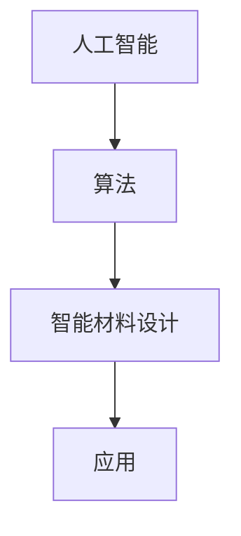

                 


### 文章标题

《人工智能在智能材料设计中的应用前景》

### 关键词

人工智能、智能材料设计、机器学习、神经网络、深度学习、图像识别、语音识别、自然语言处理

### 摘要

本文首先介绍了人工智能和智能材料设计的基本概念、发展历程和应用领域。接着，详细阐述了人工智能在智能材料设计中的应用，包括人工智能算法、工具以及实际应用案例。随后，分析了人工智能在智能材料设计中的应用挑战和未来发展方向。最后，总结了人工智能与智能材料设计相关的工具和资源，为读者提供了进一步学习和探索的方向。

### 目录大纲

#### 第一部分：人工智能与智能材料设计基础

## 第1章：人工智能概述
### 1.1 人工智能的基本概念
### 1.2 人工智能的发展历程
### 1.3 人工智能的应用领域

## 第2章：智能材料概述
### 2.1 智能材料的基本概念
### 2.2 智能材料的发展趋势
### 2.3 智能材料的应用领域

## 第3章：人工智能在智能材料设计中的应用
### 3.1 人工智能在智能材料设计中的重要作用
### 3.2 人工智能在智能材料设计中的应用案例
### 3.3 人工智能在智能材料设计中的挑战与机遇

#### 第二部分：人工智能技术在智能材料设计中的应用

## 第4章：人工智能算法在智能材料设计中的应用
### 4.1 机器学习算法概述
### 4.2 神经网络算法在智能材料设计中的应用
### 4.3 深度学习算法在智能材料设计中的应用

## 第5章：人工智能工具在智能材料设计中的应用
### 5.1 智能材料设计中的常用工具
### 5.2 智能材料设计中的数据预处理方法
### 5.3 智能材料设计中的数据分析方法

## 第6章：人工智能在智能材料设计中的实际应用案例
### 6.1 智能材料设计中的图像识别应用
### 6.2 智能材料设计中的语音识别应用
### 6.3 智能材料设计中的自然语言处理应用

#### 第三部分：人工智能在智能材料设计中的应用前景

## 第7章：人工智能在智能材料设计中的应用挑战
### 7.1 数据隐私和安全问题
### 7.2 智能材料设计的跨学科挑战
### 7.3 人工智能在智能材料设计中的伦理问题

## 第8章：人工智能在智能材料设计中的未来发展方向
### 8.1 人工智能在智能材料设计中的技术创新
### 8.2 人工智能在智能材料设计中的应用场景拓展
### 8.3 人工智能在智能材料设计中的可持续发展

#### 附录

## 附录 A：人工智能与智能材料设计相关工具和资源
### A.1 人工智能常用工具和平台
### A.2 智能材料设计相关数据库和文献资源
### A.3 人工智能与智能材料设计相关的开源代码和项目

### Mermaid 流�程图



### 核心算法原理讲解

#### 机器学习算法概述

机器学习是一种通过数据训练模型来使计算机从数据中学习的技术。常见的机器学习算法包括线性回归、逻辑回归、决策树、支持向量机、神经网络等。

#### 神经网络算法在智能材料设计中的应用

神经网络是一种模拟人脑神经元连接的算法，通过学习输入和输出之间的关系来预测或分类。在智能材料设计中，神经网络可以用于预测材料的物理性质、优化材料结构等。

#### 深度学习算法在智能材料设计中的应用

深度学习是一种基于多层神经网络的学习方法，可以自动提取数据的复杂特征。在智能材料设计中，深度学习可以用于图像识别、自然语言处理等。

### 数学模型和数学公式

#### 机器学习中的损失函数

$$
\text{Loss} = \frac{1}{2} \sum_{i=1}^{n} (y_i - \hat{y}_i)^2
$$

其中，$y_i$为实际值，$\hat{y}_i$为预测值。

### 项目实战

#### 智能材料设计中的图像识别应用

- 开发环境：Python，TensorFlow
- 数据集：CIFAR-10
- 代码实现：

```python
import tensorflow as tf

# 数据预处理
(x_train, y_train), (x_test, y_test) = tf.keras.datasets.cifar10.load_data()
x_train, x_test = x_train / 255.0, x_test / 255.0

# 构建模型
model = tf.keras.Sequential([
  tf.keras.layers.Conv2D(32, (3,3), activation='relu', input_shape=(32, 32, 3)),
  tf.keras.layers.MaxPooling2D(2, 2),
  tf.keras.layers.Conv2D(64, (3,3), activation='relu'),
  tf.keras.layers.MaxPooling2D(2,2),
  tf.keras.layers.Conv2D(64, (3,3), activation='relu'),
  tf.keras.layers.Flatten(),
  tf.keras.layers.Dense(64, activation='relu'),
  tf.keras.layers.Dense(10, activation='softmax')
])

# 训练模型
model.compile(optimizer='adam', loss='sparse_categorical_crossentropy', metrics=['accuracy'])
model.fit(x_train, y_train, epochs=10)

# 评估模型
test_loss, test_acc = model.evaluate(x_test, y_test)
print(f'\nTest accuracy: {test_acc:.4f}')
```

### 最佳实践 tips、小结、注意事项、拓展阅读等内容将在后续章节中详细阐述。

---

现在我们已经完成了文章的标题、关键词、摘要以及目录大纲的设定。接下来，我们将逐步深入到文章的第一部分：人工智能与智能材料设计基础，从人工智能的基本概念、发展历程和应用领域开始介绍。在每一章中，我们将详细讲解核心概念、原理、算法和应用案例，以便读者能够全面了解人工智能在智能材料设计中的应用。请继续关注后续章节的内容。

