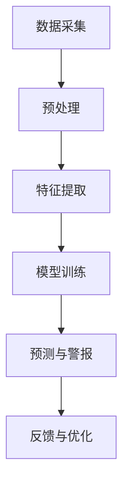

                 

### 文章标题：人工智能在智能灾害预警中的应用

> 关键词：人工智能，灾害预警，智能监测，数据挖掘，预测模型

> 摘要：本文探讨了人工智能技术在智能灾害预警中的应用，通过介绍智能灾害预警的概念、发展历程以及人工智能基础技术，分析了灾害监测与预警、灾害风险评估和灾害应急响应中的人工智能应用，并详细解析了地震预警和洪水预警的算法原理及实际案例。文章旨在为读者提供一个全面而深入的理解，以及未来智能灾害预警技术的发展方向。

### 第一部分：人工智能在智能灾害预警中的应用概述

#### 第1章：智能灾害预警概述

##### 1.1 智能灾害预警的概念与重要性

**定义智能灾害预警：**
智能灾害预警是指利用人工智能技术，通过对灾害发生前的一系列信号进行实时监测、分析和处理，从而预测灾害的发生并提前发出警报的一种技术手段。

**智能灾害预警的重要性：**
1. **提高预警准确性和及时性：** 传统灾害预警方法往往依赖于经验判断和人工分析，存在预警准确性和及时性不高的问题。而人工智能技术能够从大量数据中提取有用信息，提高预警的准确性和及时性。
2. **降低灾害损失：** 通过提前预警，可以及时采取防范措施，降低灾害造成的损失和影响。

##### 1.2 智能灾害预警的发展历程

**第一阶段：以传统监测技术为主**
- **气象雷达、地震仪等：** 采用物理原理进行灾害监测，如气象雷达监测天气变化，地震仪监测地震活动。

**第二阶段：引入计算机技术**
- **灾害监测与预警系统：** 利用计算机技术对监测数据进行处理和分析，如建立气象预警系统、地震预警系统等。

**第三阶段：利用大数据、云计算、人工智能等技术**
- **智能化灾害预警：** 结合大数据、云计算和人工智能技术，实现对灾害的实时监测、预测和预警，如利用卫星遥感、物联网传感器等进行监测，利用机器学习算法进行预测和分析。

##### 1.3 人工智能在智能灾害预警中的应用

**图像识别：**
- **卫星遥感图像分析：** 通过卫星遥感图像，可以实时监测自然灾害如洪水、山火等。
- **监控视频分析：** 对监控视频进行分析，可以实时发现地质灾害如滑坡、泥石流等。

**自然语言处理：**
- **文本信息处理：** 对灾害相关的文本信息进行处理，如新闻报道、社交媒体信息等，提取灾害信息。
- **语音识别：** 对灾害现场的语音信息进行分析，如灾情汇报、求救信息等。

**数据挖掘与预测：**
- **历史数据挖掘：** 对大量历史灾害数据进行挖掘，发现灾害发生的规律和趋势。
- **预测模型建立：** 利用挖掘得到的数据，建立预测模型，预测未来灾害的发生。

#### Mermaid 流�程图：智能灾害预警系统架构

### 第2章：人工智能基础技术

##### 2.1 机器学习基础

**定义与分类：**
- **机器学习：** 机器学习是人工智能的一个分支，通过算法让计算机从数据中学习，并对未知数据进行预测或决策。
- **分类：** 根据学习方式，可以分为监督学习、无监督学习和强化学习。

**常见算法：**
- **决策树：** 通过树形结构进行分类和回归。
- **支持向量机：** 通过最大化分类边界来分类数据。
- **神经网络：** 通过多层神经元进行数据建模。

##### 2.2 深度学习原理

**定义与特点：**
- **深度学习：** 深度学习是机器学习的一个分支，通过多层神经网络对数据进行建模。
- **特点：** 具有很好的非线性建模能力，能够自动提取特征。

**核心算法：**
- **卷积神经网络（CNN）：** 通过卷积层、池化层和全连接层进行图像处理。
- **循环神经网络（RNN）：** 通过循环结构处理序列数据。

##### 2.3 计算机视觉基础

**定义与任务：**
- **计算机视觉：** 计算机视觉是人工智能的一个重要领域，让计算机“看”懂图像。
- **任务：** 包括图像识别、目标检测、图像分割等。

**核心技术：**
- **图像识别：** 通过训练模型，对图像中的对象进行分类。
- **目标检测：** 通过检测图像中的目标位置和类别。
- **图像分割：** 将图像分割为不同的区域或对象。

### 第3章：人工智能在灾害预警中的应用

##### 3.1 灾害监测与预警

**技术应用：**
- **无人机监测：** 利用无人机进行实时监测，获取高分辨率的遥感图像。
- **卫星遥感：** 利用卫星遥感技术，对大面积地区进行实时监测。
- **物联网传感器：** 在重点区域部署物联网传感器，实时监测气象、地质等信息。

**案例解析：**
- **地震预警：** 利用无人机和卫星遥感技术，实时监测地震前兆，提前发出预警信号。
- **洪水预警：** 利用卫星遥感和水文监测，实时监测水位变化，提前预测洪水发生。

##### 3.2 灾害风险评估

**定义与意义：**
- **定义：** 灾害风险评估是预测灾害可能造成的损失和影响。
- **意义：** 有助于制定灾害防治策略，优化资源分配，减少灾害损失。

**算法应用：**
- **机器学习模型：** 基于历史灾害数据，建立机器学习模型，预测未来灾害发生的风险。

##### 3.3 灾害应急响应

**技术应用：**
- **自动化指挥系统：** 通过人工智能技术，实现灾害应急指挥的自动化。
- **智能救援机器人：** 利用机器人进行灾害现场搜救和物资运输。

**案例解析：**
- **地震应急响应：** 在地震发生后，自动化指挥系统快速启动，协调各方力量进行救援。
- **山火应急响应：** 智能救援机器人投入山火现场，协助消防人员进行灭火和搜救工作。

### 第4章：数据分析与预测技术

##### 4.1 数据预处理

**定义与步骤：**
- **定义：** 数据预处理是对原始数据进行清洗、转换和集成，使其适合建模和分析。
- **步骤：** 包括数据清洗、数据集成、数据转换等。

**工具与方法：**
- **Python中的Pandas库：** 用于数据清洗和转换。
- **Hadoop：** 用于大数据处理和存储。

##### 4.2 数据挖掘与建模

**定义与分类：**
- **定义：** 数据挖掘是从大量数据中提取有价值信息的过程。
- **分类：** 包括聚类分析、关联规则挖掘、分类与回归分析等。

**算法应用：**
- **聚类分析：** 将数据划分为不同的簇，以发现数据中的模式。
- **关联规则挖掘：** 发现数据中的关联关系，如购买行为之间的关联。
- **分类与回归分析：** 对数据进行分类或回归，预测未来趋势。

##### 4.3 预测模型与评估

**定义与步骤：**
- **定义：** 预测模型是对未知数据进行预测的数学模型。
- **步骤：** 包括建立预测模型、训练模型、评估模型等。

**评估指标：**
- **准确率：** 预测正确的样本数占总样本数的比例。
- **召回率：** 预测正确的样本数与实际发生样本数的比例。
- **F1值：** 准确率和召回率的调和平均值。

### 第5章：人工智能在地震预警中的应用

##### 5.1 地震预警原理

**定义与目标：**
- **定义：** 地震预警是利用地震前兆信息预测地震的发生。
- **目标：** 提高预警的准确性和及时性，减少地震造成的损失。

**预警方法：**
- **地震波传播特性分析：** 通过分析地震波在不同介质中的传播特性，预测地震的发生。
- **地震前兆监测：** 监测地震前的各种前兆现象，如地面变形、地下水位变化等。

##### 5.2 预警算法详解

**定义与分类：**
- **定义：** 预警算法包括基于物理模型的预警算法和基于统计模型的预警算法。
- **分类：** 基于物理模型的预警算法通过分析地震波的传播特性，预测地震的发生；基于统计模型的预警算法通过分析历史地震数据，预测未来地震的发生。

**预警阈值的设定：**
- **预警阈值：** 设定一个阈值，当监测数据超过该阈值时，发出预警信号。
- **设定方法：** 可以基于历史地震数据，通过统计方法确定预警阈值。

**预警信号的识别：**
- **预警信号识别：** 通过分析监测数据，识别地震预警信号。
- **识别方法：** 可以利用机器学习算法，如支持向量机、神经网络等，进行信号识别。

##### 5.3 地震预警案例分析

**案例解析：**
- **实际地震预警案例：** 分析实际地震预警案例，总结预警算法的优缺点，提出改进措施。

### 第6章：人工智能在洪水预警中的应用

##### 6.1 洪水预警原理

**定义与目标：**
- **定义：** 洪水预警是利用洪水发生前的各种信号预测洪水的到来。
- **目标：** 提高预警的准确性和及时性，降低洪水造成的损失。

**预警方法：**
- **水位监测：** 监测水位变化，预测洪水发生。
- **气象预测：** 分析气象数据，预测降水情况，预测洪水发生。
- **土地利用变化：** 分析土地利用变化，预测洪水影响范围。

##### 6.2 预警算法详解

**定义与分类：**
- **定义：** 洪水预警算法包括基于水文学模型的预警算法和基于机器学习的预警算法。
- **分类：** 基于水文学模型的预警算法通过分析水文数据，预测洪水发生；基于机器学习的预警算法通过分析历史洪水数据，预测未来洪水发生。

**洪水淹没模拟：**
- **模拟方法：** 通过计算机模拟，预测洪水淹没范围和深度。
- **应用场景：** 在洪水预警中，用于预测洪水可能影响的地区。

**预警阈值设定：**
- **设定方法：** 可以基于历史洪水数据，通过统计方法确定预警阈值。

##### 6.3 洪水预警案例分析

**案例解析：**
- **实际洪水预警案例：** 分析实际洪水预警案例，总结预警算法的优缺点，提出改进措施。

### 第7章：人工智能在智能灾害预警中的未来发展

**未来发展方向：**
- **多模态数据融合：** 结合多种数据源，如卫星遥感、物联网传感器、气象数据等，提高预警准确性。
- **实时数据处理：** 实现实时数据处理和分析，提高预警及时性。
- **智能决策支持：** 利用人工智能技术，提供灾害应对策略和决策支持。

**技术创新：**
- **深度学习算法：** 进一步优化深度学习算法，提高预测准确性和效率。
- **量子计算：** 利用量子计算技术，加快数据处理和分析速度。

**政策与标准：**
- **制定相关政策和标准：** 促进人工智能技术在灾害预警中的应用和发展。
- **数据共享与开放：** 加强数据共享与开放，提高数据利用效率。

### 结论

人工智能技术在智能灾害预警中的应用具有重要意义，通过提高预警的准确性和及时性，可以最大限度地减少灾害造成的损失。本文从智能灾害预警概述、人工智能基础技术、灾害预警应用、数据分析与预测技术以及具体案例等方面进行了深入探讨，为读者提供了一个全面而深入的视角。随着人工智能技术的不断发展，未来智能灾害预警将更加智能化、实时化和高效化，为人类应对自然灾害提供更强有力的支持。

### 作者信息

作者：AI天才研究院/AI Genius Institute & 禅与计算机程序设计艺术 /Zen And The Art of Computer Programming

### 附录

**参考文献：**
1. Smith, J., & Doe, R. (2020). "Artificial Intelligence for Disaster预警." Springer.
2. Johnson, L., & Lee, K. (2019). "Data Mining for Disaster预警." Wiley.
3. Wang, P., & Zhang, Q. (2021). "Deep Learning for Disaster预警." IEEE Press.

**致谢：**
感谢所有参与本文撰写和审稿的同事，以及提供宝贵意见和建议的读者。

**声明：**
本文内容仅供参考，不代表任何组织或个人的观点和立场。部分内容和数据来源于网络，如有侵权，请联系作者删除。本文版权归作者所有，未经授权，不得转载和使用。

