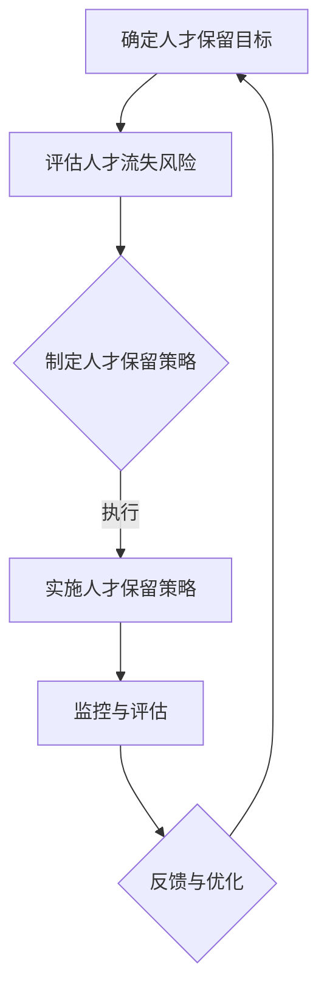
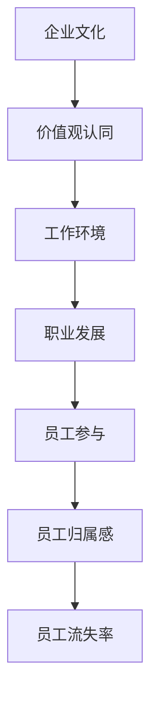
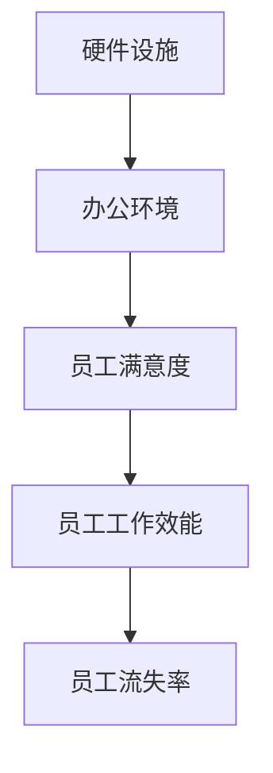
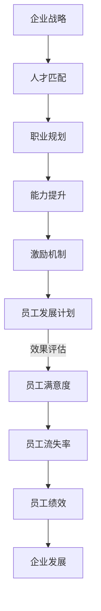

                 

### 文章标题：人才保留策略：降低核心员工流失率的方法

#### 关键词：人才保留，核心员工流失率，薪酬激励，职业发展，工作环境，企业文化建设

> **摘要**：本文深入探讨了人才保留策略的重要性和实施方法，分析了人才流失对企业发展的负面影响，并从环境因素、员工激励、职业发展等方面详细阐述了降低核心员工流失率的具体策略。通过国内和国际企业的案例分析，总结了成功的人才保留经验，旨在为企业管理者提供实用的指导意见。

---

### 目录大纲

#### 第一部分：人才保留策略概述

**第1章：人才保留的重要性与挑战**  
1.1 人才保留的概念  
1.2 人才流失对企业的负面影响  
1.3 人才保留的挑战

**第2章：人才保留的核心因素**  
2.1 薪酬激励  
2.2 职业发展机会  
2.3 工作环境与企业文化  
2.4 工作生活平衡

**第3章：人才保留策略案例分析**  
3.1 国内企业人才保留案例分析  
3.2 国际企业人才保留案例分析  
3.3 案例分析总结

#### 第二部分：降低核心员工流失率的方法

**第4章：环境因素对员工流失的影响**  
4.1 企业文化与员工归属感  
4.2 工作环境与员工满意度  
4.3 企业战略与员工发展

**第5章：员工激励与薪酬管理**  
5.1 激励理论及其应用  
5.2 薪酬体系设计原则  
5.3 薪酬激励案例分析

**第6章：职业发展机会与成长路径**  
6.1 员工职业发展规划  
6.2 内部晋升与人才培养  
6.3 跨部门交流与多岗位轮换

**第7章：工作生活平衡策略**  
7.1 工作时间与灵活办公  
7.2 家庭责任与员工关怀  
7.3 企业社会责任与员工参与

#### 第三部分：人才保留策略的执行与评估

**第8章：人才保留策略的制定与执行**  
8.1 人才保留策略制定流程  
8.2 执行策略的注意事项  
8.3 人才保留策略执行案例分析

**第9章：人才流失风险预警与处理**  
9.1 人才流失预警系统构建  
9.2 流失风险的处理策略  
9.3 案例分析：成功处理流失风险的案例

**第10章：人才保留策略的评估与优化**  
10.1 人才保留策略的评估指标  
10.2 评估结果的反馈与改进  
10.3 人才保留策略优化案例

#### 附录

**附录A：人才保留策略工具与资源**  
A.1 人才保留策略分析工具  
A.2 员工满意度调查工具  
A.3 职业发展评估工具

**附录B：相关法律法规与政策**  
B.1 我国人才保留相关法律法规  
B.2 国际人才保留政策概述  
B.3 政策案例分析

**# Mermaid 流程图：人才保留策略流程图**  



---

### 第1章：人才保留的重要性与挑战

#### 1.1 人才保留的概念

人才保留是指在组织内部通过各种手段和策略，确保核心人才不流失，从而维持组织的稳定和持续发展。核心人才通常是指在组织中拥有专业技能、经验和重要知识的关键岗位员工，他们在组织中的地位和作用至关重要。

人才保留不仅仅是防止员工离职，更重要的是通过一系列的措施，提升员工的满意度和忠诚度，使他们愿意长期留在组织，为组织的长期发展做出贡献。这包括但不限于薪酬福利、职业发展、工作环境、企业文化等方面。

#### 1.2 人才流失对企业的负面影响

人才流失对企业的影响是多方面的，主要体现在以下几个方面：

1. **技能和经验的损失**：核心员工的离职会导致其专业技能和经验的流失，对团队的工作效率和质量产生负面影响。

2. **业务连续性的中断**：关键岗位的空缺会导致业务流程的中断，影响企业的正常运营。

3. **成本增加**：招聘、培训和适应新员工都需要时间和成本，人才流失会导致企业成本的增加。

4. **组织氛围的破坏**：人才的流失会破坏组织的稳定性，影响团队士气和凝聚力。

5. **竞争压力的增加**：核心人才的流失会使企业在市场竞争中处于不利地位，面临更大的竞争压力。

#### 1.3 人才保留的挑战

尽管人才保留对企业至关重要，但在实际操作中，企业仍然面临着以下挑战：

1. **激烈的市场竞争**：随着市场环境的不断变化，企业面临着更加激烈的人才竞争，如何吸引和留住核心人才成为一大难题。

2. **员工需求的多样性**：现代员工对于工作环境、薪酬福利、职业发展等方面的需求日益多样化，企业需要满足不同员工的需求。

3. **企业文化的影响**：企业文化对于员工的态度和行为具有重要影响，企业需要建立积极向上的文化氛围，提升员工的归属感和忠诚度。

4. **内部晋升机制的不足**：许多企业存在内部晋升机制不完善的问题，导致员工缺乏职业发展的机会，影响员工的工作积极性。

5. **外部环境的压力**：经济环境、政策变化等因素都会对人才保留产生重要影响，企业需要及时应对外部环境的挑战。

---

在接下来的章节中，我们将详细探讨人才保留的核心因素和具体策略，为企业降低核心员工流失率提供实用的指导意见。通过国内和国际企业的案例分析，我们将总结成功的人才保留经验，帮助企业实现持续发展和竞争力提升。让我们一步一步深入分析，找到降低核心员工流失率的有效方法。 ### 第1章：人才保留的重要性与挑战

#### 1.1 人才保留的概念

人才保留是指通过一系列的激励机制和策略，确保企业能够留住关键岗位上的核心员工，保持团队稳定性和业务连续性。在现代社会，知识经济和科技创新日益成为经济增长的主要动力，人才作为知识的重要载体，其价值和重要性日益凸显。因此，如何有效保留人才成为企业竞争的重要环节。

人才保留的核心在于留住那些具备专业技能、丰富经验和高度忠诚度的员工。这些员工不仅对企业当前的发展至关重要，更是企业未来持续创新和竞争力的保障。人才保留不仅仅是防止员工离职，更重要的是提升员工的满意度和忠诚度，使他们愿意长期为组织贡献力量。

#### 1.2 人才流失对企业的负面影响

人才流失对企业的负面影响是深远且复杂的，主要体现在以下几个方面：

1. **技能和经验的损失**：核心员工的离职意味着其专业技能和经验也会随之离开。这些核心员工往往是团队中的关键角色，他们的离职会导致项目延误、团队工作效率下降，甚至影响整个业务的运营。

2. **业务连续性的中断**：关键岗位的空缺会直接影响业务的连续性和稳定性。企业可能需要投入额外的时间和资源来招聘和培训新员工，以填补空缺，这在短期内会导致业务流程的中断和效率降低。

3. **成本增加**：人才流失不仅导致招聘和培训成本的上升，还可能涉及到离职员工的赔偿和其他相关费用。此外，企业还需要投入时间和精力来培训新员工，使其能够迅速适应工作环境。

4. **组织氛围的破坏**：人才的流失会破坏组织的稳定性和凝聚力，影响团队士气和工作氛围。员工的离职可能会让其他员工感到不安，担心自己也会面临同样的情况，进而导致团队内部的不稳定。

5. **竞争压力的增加**：核心人才的流失会使企业在市场竞争中处于不利地位。竞争对手可能会借此机会挖走这些核心员工，从而削弱企业的竞争力和市场份额。

#### 1.3 人才保留的挑战

尽管人才保留对企业发展至关重要，但企业在实际操作中仍然面临着诸多挑战：

1. **激烈的市场竞争**：随着全球化和信息技术的快速发展，企业之间的竞争愈发激烈。人才市场供不应求，企业需要提供更具竞争力的薪酬福利和职业发展机会，才能吸引和留住核心人才。

2. **员工需求的多样性**：现代员工对于工作环境、薪酬福利、职业发展等方面的需求日益多样化。企业需要深入了解员工的需求，提供个性化的解决方案，才能满足不同员工的需求。

3. **企业文化的影响**：企业文化对员工的态度和行为具有深远影响。企业需要建立积极向上的文化氛围，提升员工的归属感和忠诚度。然而，不同企业的文化背景和价值观可能存在差异，如何适应和融入企业文化成为一大挑战。

4. **内部晋升机制的不足**：许多企业存在内部晋升机制不完善的问题，导致员工缺乏职业发展的机会。员工可能会感到自己的职业发展受限，从而寻求其他发展机会，增加人才流失的风险。

5. **外部环境的压力**：经济环境、政策变化、行业竞争等因素都会对人才保留产生重要影响。企业需要具备良好的应变能力，及时调整人才保留策略，以应对外部环境的挑战。

在接下来的章节中，我们将深入探讨人才保留的核心因素和具体策略，帮助企业克服这些挑战，实现核心员工的稳定和持续发展。我们将结合国内外的成功案例，详细分析如何通过薪酬激励、职业发展、工作环境和企业文化建设等手段，有效降低核心员工流失率，提升企业竞争力。让我们一步一步深入分析，找到降低核心员工流失率的有效方法。 ### 第2章：人才保留的核心因素

#### 2.1 薪酬激励

薪酬激励是人才保留的关键因素之一。合理的薪酬体系不仅能够吸引外部优秀人才，还能够激励内部员工，提高其工作积极性和忠诚度。薪酬激励的核心在于确保薪酬与员工的工作价值相匹配，同时具备市场竞争力。

1. **市场薪酬水平**：企业需要定期评估市场薪酬水平，确保员工的薪酬具备竞争力。通过市场调研、薪酬调查等手段，了解同行业、同岗位的市场薪酬范围，确保薪酬水平处于合理区间。

2. **内部公平性**：企业应确保内部薪酬公平性，避免因薪酬不公平引发员工不满。通过内部薪酬调查、绩效评估等手段，确保薪酬分配的透明性和公正性。

3. **绩效挂钩**：将薪酬与绩效挂钩，激励员工提高工作表现。通过设定明确的绩效目标和评估标准，将员工的薪酬与绩效成果直接关联，提高员工的工作积极性和责任感。

4. **长期激励**：除了基本薪酬外，企业还应提供长期激励措施，如股票期权、年终奖金等。这些长期激励措施能够增强员工对企业的归属感和忠诚度，降低其流失意愿。

#### 2.2 职业发展机会

职业发展机会是人才保留的另一个重要因素。企业应提供明确的职业发展路径，帮助员工规划职业生涯，提高其职业满意度和忠诚度。

1. **晋升机制**：企业应建立清晰的晋升机制，为员工提供内部晋升机会。通过设定明确的晋升标准和流程，确保员工有机会根据自己的工作表现和职业发展需求获得晋升。

2. **培训与发展**：企业应提供丰富的培训和发展机会，帮助员工提升专业技能和知识水平。通过内部培训、外部学习、职业规划等手段，为员工提供全面的职业发展支持。

3. **跨部门交流与多岗位轮换**：通过跨部门交流和多岗位轮换，员工能够获得更广泛的工作经验和技能，提高其职业素养和适应能力。这种灵活性有助于员工在组织内找到更适合自己的职位，提高其工作满意度和忠诚度。

#### 2.3 工作环境与企业文化

工作环境和企业文化对员工的工作满意度和忠诚度具有重要影响。一个良好的工作环境和积极的企业文化能够提升员工的工作积极性、创造力和归属感。

1. **工作环境**：企业应提供一个安全、舒适、便利的工作环境。这包括办公设施的完善、工作时间的合理安排、良好的工作氛围等。通过改善工作环境，提高员工的工作满意度和生产力。

2. **企业文化**：企业文化是企业的核心价值观和行为规范，对员工的行为和态度具有深远影响。企业应建立积极向上的企业文化，倡导诚信、创新、合作和责任等价值观。通过企业文化，提升员工的归属感和忠诚度。

3. **员工参与**：鼓励员工参与企业的决策和管理，提高其对企业事务的关注度和责任感。通过员工代表大会、员工建议征集等渠道，让员工有更多的参与感和归属感。

#### 2.4 工作生活平衡

工作生活平衡是现代员工关注的重点之一。企业应关注员工的工作压力和家庭责任，提供灵活的工作时间和远程办公等福利，帮助员工实现工作与生活的平衡。

1. **弹性工作时间**：企业应提供弹性工作时间，允许员工根据个人需求和业务需求灵活调整工作时间。这种灵活性有助于员工更好地平衡工作和生活，提高其工作满意度和生活质量。

2. **远程办公**：在适当的情况下，企业应鼓励远程办公，提高员工的工作效率和工作满意度。远程办公不仅有助于员工更好地平衡工作与生活，还能够降低企业的运营成本。

3. **家庭责任关怀**：企业应关注员工的家庭责任，提供育儿假、陪护假等福利措施，帮助员工更好地照顾家庭。通过关注员工的家庭责任，提高员工的工作满意度和忠诚度。

#### 2.5 企业社会责任

企业社会责任（CSR）是现代企业关注的另一个重要方面。企业应承担社会责任，积极参与社会公益活动，提升企业的社会形象和员工的荣誉感。

1. **公益活动**：企业应积极参与公益活动，为员工提供参与社会公益的机会，提升员工的归属感和责任感。

2. **绿色环保**：企业应倡导绿色环保理念，降低对环境的负面影响，提高员工对企业的认同感。

3. **社区参与**：企业应积极参与社区建设，为员工提供参与社区活动的机会，增强员工的社区归属感。

通过以上五个核心因素的有机结合，企业可以有效地降低核心员工流失率，提升员工的满意度和忠诚度，从而实现长期稳定的发展。在接下来的章节中，我们将结合国内外的成功案例，详细探讨如何具体实施这些人才保留策略。 ### 第3章：人才保留策略案例分析

#### 3.1 国内企业人才保留案例分析

**1. 案例背景**

随着我国经济的快速发展，企业对人才的竞争愈发激烈。如何有效保留核心人才成为众多企业面临的挑战。本章节选取了我国几家知名企业，分析其在人才保留方面的成功经验。

**2. 案例分析**

**（1）华为技术有限公司**

华为作为全球领先的通信技术解决方案提供商，一直高度重视人才保留。以下是华为在人才保留方面的几个成功经验：

- **薪酬激励**：华为实行具有市场竞争力的薪酬体系，同时根据员工的绩效和贡献给予额外的激励。通过股票期权等长期激励措施，增强了员工的归属感和忠诚度。

- **职业发展**：华为为员工提供丰富的职业发展机会，包括内部晋升、培训和学习机会。通过内部轮岗和跨部门交流，员工能够获得更广泛的工作经验和技能。

- **企业文化**：华为强调团队合作和创新精神，倡导“以客户为中心”的核心价值观。通过企业文化，提升了员工的归属感和忠诚度。

- **工作生活平衡**：华为提供弹性工作时间、远程办公和员工福利计划，帮助员工更好地平衡工作与生活。

**（2）阿里巴巴集团**

阿里巴巴作为全球领先的电子商务公司，在人才保留方面也有许多值得借鉴的经验：

- **薪酬激励**：阿里巴巴通过具有竞争力的薪酬和股权激励计划，吸引和留住核心人才。同时，阿里巴巴注重员工绩效与薪酬的紧密关联，激励员工提高工作表现。

- **职业发展**：阿里巴巴提供多样化的职业发展路径，包括技术、业务和管理等方向。通过内部晋升和外部培训，帮助员工实现职业成长。

- **企业文化**：阿里巴巴倡导“客户第一、员工第二”的理念，注重员工关怀和团队建设。通过组织文化，提升了员工的归属感和忠诚度。

- **工作生活平衡**：阿里巴巴提供灵活的工作安排和员工福利计划，鼓励员工追求工作与生活的平衡。

**3. 案例总结**

通过以上案例，我们可以总结出以下人才保留策略的成功要素：

- **薪酬激励**：具备市场竞争力的薪酬和长期激励措施是吸引和留住核心人才的关键。

- **职业发展**：为员工提供明确的职业发展路径和丰富的培训机会，帮助员工实现职业成长。

- **企业文化**：建立积极向上的企业文化，提升员工的归属感和忠诚度。

- **工作生活平衡**：关注员工的工作压力和家庭责任，提供灵活的工作安排和员工福利计划。

国内企业的成功经验表明，人才保留需要从多个方面综合施策，才能实现核心员工的稳定和持续发展。在接下来的章节中，我们将进一步探讨国际企业在人才保留方面的成功经验，以期为我国企业的人才保留策略提供更多借鉴。 ### 第3章：人才保留策略案例分析

#### 3.2 国际企业人才保留案例分析

**1. 案例背景**

在全球化的背景下，国际企业面临着更加激烈的人才竞争。如何在激烈的市场环境中有效保留核心人才，成为许多国际企业关注的焦点。本章节选取了几个具有代表性的国际企业，分析其在人才保留方面的成功经验。

**2. 案例分析**

**（1）谷歌（Google）**

谷歌作为全球知名的科技公司，以其独特的人才保留策略闻名于世。以下是谷歌在人才保留方面的几个成功经验：

- **薪酬激励**：谷歌提供具有竞争力的薪酬和股权激励计划，确保员工能够获得合理的经济回报。同时，谷歌注重绩效与薪酬的紧密关联，激励员工提高工作表现。

- **职业发展**：谷歌为员工提供多样化的职业发展路径，包括技术、产品、设计和业务等领域。通过内部晋升和外部培训，谷歌帮助员工实现职业成长。

- **工作环境**：谷歌营造了一个开放、创新和包容的工作环境，鼓励员工自由表达和合作。同时，谷歌提供丰富的员工福利，如免费餐饮、健身房和医疗保健等，提升了员工的工作满意度和生活质量。

- **员工关怀**：谷歌关注员工的工作与生活平衡，提供灵活的工作安排和员工关怀计划。例如，谷歌的“20%项目”允许员工将部分工作时间用于个人项目，促进了创新和员工的工作积极性。

**（2）苹果公司（Apple）**

苹果公司以其创新的产品和卓越的品牌影响力著称，其在人才保留方面也有许多成功经验：

- **薪酬激励**：苹果公司提供具有市场竞争力的薪酬和股权激励计划，确保员工能够获得合理的经济回报。同时，苹果注重员工的长期职业规划，提供一系列的培训和发展机会。

- **企业文化**：苹果公司强调创新、设计和用户体验，这些价值观深深融入企业文化，激励员工追求卓越。苹果公司鼓励员工自由思考和探索，为员工提供了广阔的职业发展空间。

- **员工关怀**：苹果公司关注员工的工作与生活平衡，提供灵活的工作安排和员工福利计划。例如，苹果公司提供远程办公、家庭关怀计划和员工健康保险等，提升了员工的工作满意度和忠诚度。

- **员工参与**：苹果公司鼓励员工参与公司的决策过程，提高员工的参与感和责任感。通过员工反馈机制和定期沟通，苹果公司能够及时了解员工的需求和意见，进一步提升了员工的工作满意度。

**（3）IBM**

IBM作为全球领先的信息技术公司，其人才保留策略也备受关注。以下是IBM在人才保留方面的几个成功经验：

- **薪酬激励**：IBM提供具有竞争力的薪酬和长期激励计划，确保员工能够获得合理的经济回报。同时，IBM注重员工的绩效与薪酬的紧密关联，激励员工提高工作表现。

- **职业发展**：IBM为员工提供丰富的职业发展机会，包括内部晋升、跨国工作和专业培训等。通过这些机会，IBM帮助员工实现职业成长。

- **企业文化**：IBM倡导“以客户为中心”的核心价值观，强调团队合作和创新精神。通过积极的企业文化，IBM提升了员工的归属感和忠诚度。

- **工作生活平衡**：IBM关注员工的工作与生活平衡，提供灵活的工作安排和员工福利计划。例如，IBM提供远程办公、家庭关怀计划和员工健康保险等，提升了员工的工作满意度和生活质量。

**3. 案例总结**

通过以上案例，我们可以总结出以下人才保留策略的成功要素：

- **薪酬激励**：提供具有市场竞争力的薪酬和长期激励计划，确保员工能够获得合理的经济回报。

- **职业发展**：为员工提供明确的职业发展路径和丰富的培训机会，帮助员工实现职业成长。

- **企业文化**：建立积极向上的企业文化，提升员工的归属感和忠诚度。

- **工作环境与员工关怀**：营造良好的工作环境，提供灵活的工作安排和员工福利计划，关注员工的工作与生活平衡。

国际企业的成功经验表明，人才保留需要从多个方面综合施策，才能实现核心员工的稳定和持续发展。在接下来的章节中，我们将结合国内外企业的成功经验，进一步探讨如何具体实施这些人才保留策略，为我国企业的人才保留工作提供有益的借鉴。 ### 第3章：人才保留策略案例分析

#### 3.3 案例分析总结

通过对国内外企业的案例分析，我们可以总结出以下几点关于人才保留策略的宝贵经验：

**1. 薪酬激励的重要性**

无论是国内企业如华为，还是国际巨头如谷歌和IBM，薪酬激励都是保留核心人才的关键因素。具有市场竞争力的薪酬体系能够吸引外部优秀人才，而绩效挂钩的薪酬机制则能激发员工的工作积极性。长期激励措施如股票期权、年终奖金等更是增强了员工的归属感和忠诚度。

**2. 职业发展的关键性**

提供明确的职业发展路径和丰富的培训机会是留住核心人才的重要手段。华为和阿里巴巴通过内部晋升、跨部门交流和外部培训等方式，帮助员工实现职业成长。谷歌和苹果则通过多样化的职业发展路径和专业培训，为员工提供了广阔的职业空间。

**3. 企业文化的力量**

积极向上的企业文化能够提升员工的归属感和忠诚度。华为、阿里巴巴、谷歌和苹果都注重企业文化的建设，通过核心价值观的倡导和团队精神的培养，增强了员工的凝聚力和工作热情。

**4. 工作环境与员工关怀**

良好的工作环境和员工关怀计划对于提升员工的工作满意度和忠诚度至关重要。华为和谷歌通过提供免费餐饮、健身房和远程办公等福利，关注员工的工作与生活平衡。苹果和IBM则通过员工关怀计划和健康保险等福利，提升了员工的工作幸福感。

**5. 员工参与的重要性**

鼓励员工参与企业的决策过程，提高员工的参与感和责任感，有助于提升员工的工作满意度和忠诚度。谷歌的“20%项目”和苹果的员工反馈机制都是成功的实践案例。

**总结与启示**

1. **全面性**：人才保留策略应从薪酬激励、职业发展、企业文化、工作环境与员工关怀、员工参与等多个方面综合施策，形成系统化的人才保留体系。

2. **个性化**：企业应根据自身特点和员工需求，制定个性化的保留策略。例如，对于技术人才，可以侧重于职业发展和技能培训；对于销售人才，可以侧重于激励机制和业绩奖励。

3. **持续优化**：人才保留策略应不断优化和调整，以适应市场环境和企业发展的变化。定期进行员工满意度调查和流失风险评估，及时发现问题并采取改进措施。

4. **法律法规和政策支持**：企业应遵循国家和地方的法律法规，充分利用政府的人才政策和扶持措施，增强人才保留的效果。

通过对国内外成功案例的分析总结，我们可以得出结论：人才保留是一个系统工程，需要企业从多个维度综合考虑，采取综合措施，才能实现核心员工的稳定和持续发展。在接下来的章节中，我们将进一步探讨如何具体实施这些人才保留策略，为我国企业的人才保留工作提供更有针对性的指导。 ### 第4章：环境因素对员工流失的影响

#### 4.1 企业文化与员工归属感

企业文化是企业的灵魂，它通过价值观、行为规范和员工行为准则等方式，影响着员工的工作态度和行为。一个积极向上的企业文化能够增强员工的归属感，从而降低员工流失率。

**4.1.1 企业文化的重要性**

企业文化不仅影响员工的工作行为，还影响员工的价值观和态度。一个优秀的企业文化能够：

- **提升员工的工作热情和创造力**：企业文化倡导的创新、学习和合作精神，能够激发员工的积极性和创造力。
- **增强员工的工作满意度和忠诚度**：企业文化与员工价值观的契合，能够增强员工对企业的认同感和忠诚度，减少流失意愿。
- **促进团队合作和沟通**：企业文化强调团队合作和开放沟通，有助于建立良好的团队关系，降低员工流失率。

**4.1.2 员工归属感的定义与衡量**

员工归属感是指员工对企业认同和忠诚的情感，表现为员工愿意与企业共同成长、分享成果。衡量员工归属感的关键指标包括：

- **员工满意度**：员工对企业提供的工作环境、薪酬福利、职业发展机会等方面的满意度。
- **员工忠诚度**：员工对企业忠诚的程度，表现为员工在企业的长期服务意愿。
- **员工参与度**：员工参与企业决策和活动的积极性，反映员工对企业事务的关注度和责任感。

**4.1.3 企业文化与员工归属感的联系**

企业文化和员工归属感之间存在密切联系。企业文化通过以下几个方面影响员工归属感：

- **价值观认同**：企业文化倡导的价值观与员工的个人价值观相契合，能够增强员工对企业的认同感。
- **工作环境**：企业文化影响企业的工作环境和氛围，一个积极向上的文化氛围能够提升员工的工作满意度和归属感。
- **职业发展**：企业文化强调员工职业发展，提供明确的职业发展路径和培训机会，能够增强员工的忠诚度和归属感。
- **员工参与**：企业文化鼓励员工参与企业决策和活动，提升员工的参与感和责任感，增强员工的归属感。

**4.1.4 企业文化与员工流失率的关系**

企业文化和员工流失率之间存在一定的关联。一个积极向上的企业文化能够降低员工流失率，而消极的企业文化则可能导致员工流失。研究表明，企业文化与员工流失率之间的关系可以通过以下几个方面来体现：

- **价值观不一致**：当企业文化的价值观与员工的个人价值观不一致时，员工可能会感到不满，从而增加流失意愿。
- **工作环境**：企业的工作环境和文化氛围对员工的流失意愿有重要影响。一个消极的工作环境和文化氛围会增加员工的流失率。
- **职业发展**：缺乏职业发展机会和明确的职业规划，会导致员工感到前途不明，从而增加流失率。
- **员工参与**：员工参与企业决策和活动的程度对员工的归属感和流失意愿有显著影响。缺乏参与感的员工可能会感到被忽视，从而增加流失率。

**Mermaid 流程图：企业文化与员工归属感的关系**



通过以上分析，我们可以看到，企业文化对员工归属感有重要影响，而员工归属感又直接关系到员工流失率。因此，企业应该重视企业文化建设，通过营造积极向上的企业文化，提升员工归属感，从而降低员工流失率。

#### 4.2 工作环境与员工满意度

工作环境是员工日常工作的场所，它不仅影响员工的工作效率，还影响员工的工作满意度和归属感。一个良好的工作环境能够提升员工的工作热情和创造力，从而降低员工流失率。

**4.2.1 工作环境的重要性**

工作环境包括硬件设施、办公环境、工作氛围等多个方面，对员工的工作满意度和忠诚度具有重要影响。良好的工作环境能够：

- **提升员工的工作效率**：良好的工作环境能够提供一个舒适、安全、便利的工作场所，有助于员工集中精力，提高工作效率。
- **增强员工的工作满意度**：良好的工作环境能够满足员工的生理和心理需求，提升员工的工作满意度和幸福感。
- **提升员工的归属感**：一个积极向上的工作环境能够增强员工的归属感，使员工愿意长期留在企业，为企业的持续发展贡献力量。

**4.2.2 员工满意度调查的方法与指标**

为了了解员工对工作环境的满意度，企业可以采用员工满意度调查的方法。员工满意度调查的方法和指标包括：

- **问卷调查**：通过设计问卷，了解员工对工作环境各个方面的满意度，如办公设施、办公环境、工作氛围等。
- **访谈**：通过与员工进行面对面访谈，深入了解员工对工作环境的真实感受和需求。
- **指标评估**：采用一系列指标评估员工满意度，如员工流失率、员工工作效率、员工工作满意度等。

**4.2.3 工作环境与员工满意度的关系**

工作环境与员工满意度之间存在密切关系。良好的工作环境能够提升员工的工作满意度，从而降低员工流失率。具体来说，工作环境与员工满意度之间的关系体现在以下几个方面：

- **硬件设施**：良好的硬件设施能够满足员工的生理需求，如舒适的办公桌椅、良好的照明和通风等，提升员工的工作满意度和幸福感。
- **办公环境**：良好的办公环境能够提供一个舒适、安全、便利的工作场所，有助于员工集中精力，提高工作效率。
- **工作氛围**：积极向上的工作氛围能够增强员工的归属感和团队凝聚力，提升员工的工作满意度和忠诚度。

**4.2.4 改善工作环境的策略**

为了提升员工的工作满意度，企业可以采取以下策略改善工作环境：

- **优化硬件设施**：定期更新和维护办公设备，提供舒适的办公环境，满足员工的生理需求。
- **营造积极氛围**：通过团队建设活动、员工关怀计划等，营造积极向上的工作氛围，增强员工的归属感和团队凝聚力。
- **关注员工需求**：定期进行员工满意度调查，了解员工对工作环境的真实需求，及时调整和改进工作环境。

**Mermaid 流程图：工作环境与员工满意度的关系**



通过以上分析，我们可以看到，良好的工作环境对员工满意度有显著影响，而员工满意度又直接关系到员工流失率。因此，企业应该重视工作环境的改善，通过营造良好的工作环境，提升员工的工作满意度和归属感，从而降低员工流失率。 ### 第4章：环境因素对员工流失的影响

#### 4.3 企业战略与员工发展

企业战略是指导企业发展的总体规划和方向，它直接影响企业的长远发展。而员工发展是企业战略实施的关键要素之一，通过合理的员工发展规划，可以确保企业战略的实现，同时提升员工的职业满意度和忠诚度，降低员工流失率。

**4.3.1 企业战略的概述**

企业战略是企业为了实现长期目标而制定的一系列行动方案。它包括以下几个方面：

- **目标设定**：企业根据市场环境和自身优势，设定明确的战略目标。
- **资源配置**：企业根据战略目标，合理配置资源，包括资金、人力和技术等。
- **业务规划**：企业制定具体的业务发展计划，包括产品开发、市场拓展等。
- **风险管理**：企业识别潜在风险，并制定相应的风险控制措施。

**4.3.2 员工发展与企业战略的协调**

员工发展与企业战略之间存在着紧密的联系和协调。员工发展必须与企业战略相匹配，以确保企业战略的实现和员工的个人成长。具体来说，员工发展与企业战略的协调体现在以下几个方面：

1. **人才匹配**：企业应根据战略目标，选拔和培养符合岗位需求的人才。通过培训、轮岗等方式，提高员工的专业技能和综合素质，确保企业战略的实施。
2. **职业规划**：企业应制定清晰的职业发展规划，帮助员工明确职业目标和职业路径，使其在企业的发展过程中找到自己的位置和方向。
3. **能力提升**：企业应提供丰富的培训和学习机会，提升员工的业务能力和管理能力，以适应企业战略发展的需要。
4. **激励机制**：企业应通过激励机制，鼓励员工为实现企业战略目标而努力。例如，设立绩效考核体系，将员工的工作绩效与薪酬和晋升挂钩。

**4.3.3 员工发展计划的设计与实施**

为了实现员工发展与企业战略的协调，企业需要设计并实施有效的员工发展计划。员工发展计划的设计与实施包括以下几个步骤：

1. **需求分析**：企业通过调查和分析，了解员工的发展需求和现状，确定员工发展的重点领域。
2. **目标设定**：根据企业战略目标和员工需求分析，设定明确的员工发展目标，如提升专业技能、提高管理水平等。
3. **方案设计**：根据员工发展目标，设计具体的培训、轮岗和职业规划方案，确保方案的可行性和有效性。
4. **实施执行**：企业应制定详细的实施计划，确保培训、轮岗和职业规划等方案的顺利执行。
5. **评估反馈**：对员工发展计划的效果进行评估，收集员工的反馈意见，不断优化和改进员工发展计划。

**4.3.4 员工发展计划的效果评估**

评估员工发展计划的效果是确保员工发展计划有效性的重要环节。企业可以通过以下几个方面来评估员工发展计划的效果：

1. **员工满意度**：通过员工满意度调查，了解员工对发展计划的认可程度和满意度。
2. **员工流失率**：观察员工流失率的变化，评估员工发展计划对降低流失率的效果。
3. **员工绩效**：通过绩效评估，观察员工在专业技能和管理能力方面的提升情况。
4. **企业发展**：通过企业战略目标的实现情况，评估员工发展计划对企业发展的贡献。

**Mermaid 流程图：企业战略与员工发展的协调关系**



通过以上分析，我们可以看到，企业战略与员工发展之间存在密切的联系。一个良好的企业战略能够引导员工发展的方向，而有效的员工发展计划能够支持企业战略的实现。通过协调企业战略与员工发展，企业可以降低员工流失率，提升员工的职业满意度和忠诚度，从而实现长期稳定的发展。 ### 第5章：员工激励与薪酬管理

#### 5.1 激励理论及其应用

员工激励是提高员工工作积极性、创造力和忠诚度的重要手段。激励理论提供了理解员工行为和需求的框架，帮助企业设计有效的激励机制。

**5.1.1 员工激励的基本概念**

员工激励是指通过满足员工的需求、提升员工的满意度和工作动力，从而提高员工的工作绩效。员工激励的基本概念包括：

- **需求**：员工的需求是激励的基础。马斯洛的需求层次理论指出，员工的需求从低到高可以分为生理需求、安全需求、社交需求、尊重需求和自我实现需求。
- **动机**：动机是指驱使员工采取某种行为的内在动力。赫兹伯格的双因素理论将工作环境因素和激励因素区分开来，认为激励因素（如成就感、认可、工作本身等）能够提高员工的工作动力。
- **满意度**：满意度是指员工对其工作环境和薪酬福利的满意程度。高满意度能够增强员工的工作动力和忠诚度。

**5.1.2 员工激励理论的应用**

1. **马斯洛的需求层次理论**

   马斯洛的需求层次理论指出，员工的需求是分层的，从生理需求到自我实现需求。企业可以通过满足不同层次的需求来激励员工：

   - **生理需求**：企业可以通过提供合理的薪酬和福利，满足员工的生理需求。
   - **安全需求**：企业可以通过稳定的就业保障、保险和培训等手段，满足员工的安全需求。
   - **社交需求**：企业可以通过团队建设活动和组织社交活动，满足员工的社交需求。
   - **尊重需求**：企业可以通过认可和奖励机制，满足员工的尊重需求。
   - **自我实现需求**：企业可以通过职业发展机会和自主工作空间，满足员工的自我实现需求。

2. **赫兹伯格的双因素理论**

   赫兹伯格的双因素理论将工作环境因素（如公司政策、工作条件、人际关系等）和激励因素（如成就感、认可、工作本身等）区分开来。企业可以通过改善工作环境因素和提高激励因素来激励员工：

   - **改善工作环境因素**：提供良好的工作条件、晋升机会和培训等。
   - **提高激励因素**：通过认可和奖励机制，提高员工的工作成就感、自主性和创造力。

**5.1.3 员工激励的策略**

1. **绩效激励**

   绩效激励是根据员工的工作绩效给予奖励和认可，激发员工的工作动力。绩效激励的策略包括：

   - **目标设定**：设定明确的绩效目标和评估标准，使员工明确工作方向和期望。
   - **绩效评估**：通过定期的绩效评估，客观公正地评估员工的工作绩效。
   - **奖励机制**：根据员工的绩效表现，给予相应的奖励，如奖金、晋升和荣誉称号等。

2. **认可激励**

   认可激励是通过表扬、表彰和认可来激励员工，增强员工的工作满意度和忠诚度。认可激励的策略包括：

   - **表扬与反馈**：及时对员工的优秀表现给予表扬和正面反馈。
   - **表彰活动**：定期举办表彰活动，对表现突出的员工进行公开表彰。
   - **认可制度**：建立长期的认可制度，如优秀员工奖、杰出贡献奖等。

3. **职业发展激励**

   职业发展激励是通过提供职业发展机会和培训来激励员工，帮助员工实现职业成长。职业发展激励的策略包括：

   - **职业规划**：与员工共同制定职业发展规划，明确职业目标和路径。
   - **培训与发展**：提供丰富的培训和发展机会，提高员工的专业技能和管理能力。
   - **晋升机会**：为员工提供内部晋升机会，激励员工不断进步。

4. **工作环境激励**

   良好的工作环境能够提升员工的工作满意度和忠诚度。工作环境激励的策略包括：

   - **工作条件**：提供舒适、安全、便利的工作环境。
   - **工作氛围**：营造积极、开放、包容的工作氛围。
   - **员工福利**：提供具有竞争力的薪酬福利，如弹性工作时间、家庭关怀计划等。

**5.1.4 员工激励的案例分析**

1. **谷歌的员工激励策略**

   谷歌以其独特的员工激励策略而闻名。以下是谷歌的几个员工激励案例：

   - **股权激励**：谷歌为员工提供股票期权，使员工能够分享公司的成功。
   - **灵活工作时间**：谷歌允许员工灵活安排工作时间，实现工作与生活的平衡。
   - **员工福利**：谷歌提供丰富的员工福利，如免费餐饮、健身房、医疗保健等。
   - **创新支持**：谷歌鼓励员工提出创新想法，并给予充分的资源和支持。

2. **阿里巴巴的员工激励策略**

   阿里巴巴以其独特的文化氛围和激励机制而著称。以下是阿里巴巴的几个员工激励案例：

   - **价值观激励**：阿里巴巴强调“客户第一、员工第二”的价值观，激发员工的使命感。
   - **绩效奖励**：阿里巴巴通过绩效考核和奖励机制，激励员工提高工作绩效。
   - **职业发展**：阿里巴巴为员工提供明确的职业发展路径和丰富的培训机会。
   - **团队文化**：阿里巴巴注重团队建设，通过团队活动和团队奖励，增强员工的团队精神。

通过以上案例分析，我们可以看到，不同的企业采用了各种形式的员工激励策略，以满足员工的需求和提高员工的工作积极性。这些策略的成功实施，有助于降低员工流失率，提升企业的核心竞争力。

#### 5.2 薪酬体系设计原则

薪酬体系是激励员工的重要手段之一，它直接影响员工的工作满意度和忠诚度。设计合理的薪酬体系需要遵循以下原则：

**5.2.1 公平性原则**

公平性是薪酬体系设计的核心原则之一。薪酬体系应确保内部公平性和外部公平性：

- **内部公平性**：企业内部不同岗位和不同员工的薪酬应与其工作价值、贡献和绩效相匹配。通过建立合理的薪酬等级和薪酬曲线，确保员工内部的薪酬公平性。
- **外部公平性**：企业的薪酬水平应与市场水平相当，确保企业能够吸引和留住外部优秀人才。企业可以通过市场薪酬调查，了解同行业、同岗位的市场薪酬水平，调整企业的薪酬策略。

**5.2.2 竞争性原则**

薪酬体系的设计应具备市场竞争力，以吸引和留住核心人才。具体措施包括：

- **市场调查**：定期进行市场薪酬调查，了解同行业、同岗位的市场薪酬水平，确保企业的薪酬具有竞争力。
- **薪酬结构**：合理设计薪酬结构，确保基本薪酬、激励薪酬和福利待遇等组成部分的合理比例，使薪酬体系具有吸引力。
- **长期激励**：提供长期激励措施，如股票期权、年终奖金等，增强员工对企业的归属感和忠诚度。

**5.2.3 可行性原则**

薪酬体系的设计应具备可行性，确保企业能够承担和实施：

- **成本控制**：薪酬体系设计应在企业财务能力范围内，避免因薪酬过高导致企业负担过重。
- **灵活调整**：薪酬体系应具备灵活性，能够根据企业发展和市场环境的变化进行及时调整。
- **绩效关联**：薪酬体系应与员工的工作绩效紧密关联，通过绩效考核机制，确保薪酬与工作绩效相符。

**5.2.4 透明性原则**

薪酬体系的透明性是提高员工满意度和信任度的重要因素。薪酬体系的设计应确保以下方面：

- **薪酬公开**：企业的薪酬政策、薪酬结构和薪酬发放过程应公开透明，让员工了解薪酬的构成和分配原则。
- **绩效标准**：绩效考核标准和结果应公开透明，确保员工对绩效考核的公平性和合理性。
- **沟通反馈**：企业应定期与员工沟通薪酬政策和薪酬调整情况，收集员工的意见和建议，提高薪酬管理的透明度和信任度。

**5.2.5 激励性原则**

薪酬体系的设计应具备激励性，激发员工的工作热情和创造力：

- **差异化设计**：根据员工的岗位、绩效和能力差异，设计差异化的薪酬方案，使薪酬具有激励作用。
- **激励机制**：通过绩效奖金、股权激励等措施，激励员工提高工作绩效和创新精神。
- **职业发展**：将薪酬与员工的职业发展相联系，为员工提供明确的职业晋升通道和发展机会，增强员工的职业满意度和忠诚度。

通过遵循以上薪酬体系设计原则，企业可以构建一个具有竞争力、公平性、可行性和激励性的薪酬体系，从而提高员工的工作积极性和忠诚度，降低员工流失率。在接下来的章节中，我们将进一步探讨如何通过具体的薪酬激励措施，实现员工激励和人才保留的目标。 ### 第5章：员工激励与薪酬管理

#### 5.3 薪酬激励案例分析

薪酬激励是提升员工工作积极性、创造力和忠诚度的重要手段。以下通过国内外几家知名企业的案例，探讨薪酬激励的实施与效果。

**5.3.1 谷歌（Google）**

谷歌以其独特的薪酬激励体系而闻名，以下是谷歌的几个薪酬激励案例：

- **股权激励**：谷歌为员工提供股票期权，使员工能够分享公司的成功。这种长期激励措施不仅吸引了外部优秀人才，还增强了内部员工的归属感和忠诚度。

  ```plaintext
  // 股权激励伪代码
  if (员工绩效 > 设定绩效标准) {
      员工获得股票期权
  }
  ```

- **灵活薪酬结构**：谷歌的薪酬结构包括基本薪酬、绩效奖金和股票期权等组成部分。这种多元化的薪酬结构能够满足不同员工的需求，提高薪酬的激励效果。

  ```plaintext
  // 薪酬结构伪代码
  薪酬总额 = 基本薪酬 + 绩效奖金 + 股票期权价值
  ```

- **绩效奖金**：谷歌通过绩效奖金激励员工提高工作绩效。绩效奖金的发放与员工的个人绩效和团队绩效密切相关，使员工能够感受到自己的努力得到了认可。

  ```plaintext
  // 绩效奖金伪代码
  if (员工绩效达标) {
      员工获得绩效奖金
  }
  ```

**5.3.2 阿里巴巴**

阿里巴巴在薪酬激励方面也有许多成功经验：

- **年度激励**：阿里巴巴的年度激励包括年终奖和长期激励计划。年终奖的发放与员工的绩效评估结果挂钩，使员工能够通过自己的努力获得更高的收入。

  ```plaintext
  // 年度激励伪代码
  年终奖 = 绩效评分 * 年度奖金系数
  ```

- **股权激励**：阿里巴巴为员工提供股票期权，使员工能够分享公司的成功。这种长期激励措施不仅吸引了外部优秀人才，还增强了内部员工的归属感和忠诚度。

  ```plaintext
  // 股权激励伪代码
  if (员工在阿里巴巴工作满一定年限) {
      员工获得股票期权
  }
  ```

- **弹性薪酬**：阿里巴巴的薪酬体系具有弹性，员工可以根据自己的工作性质和需求选择不同的薪酬模式。例如，销售人员可以选择高提成低基本薪酬的模式，而研发人员可以选择高基本薪酬低提成的模式。

  ```plaintext
  // 弹性薪酬伪代码
  薪酬模式 = 员工选择的工作模式
  ```

**5.3.3 微软**

微软在薪酬激励方面也有许多成功经验：

- **绩效奖金**：微软通过绩效奖金激励员工提高工作绩效。绩效奖金的发放与员工的个人绩效和团队绩效密切相关，使员工能够感受到自己的努力得到了认可。

  ```plaintext
  // 绩效奖金伪代码
  if (员工绩效达标) {
      员工获得绩效奖金
  }
  ```

- **股权激励**：微软为员工提供股票期权，使员工能够分享公司的成功。这种长期激励措施不仅吸引了外部优秀人才，还增强了内部员工的归属感和忠诚度。

  ```plaintext
  // 股权激励伪代码
  if (员工在微软工作满一定年限) {
      员工获得股票期权
  }
  ```

- **职业发展**：微软为员工提供丰富的职业发展机会，包括内部晋升和外部培训。通过职业发展，员工能够实现个人成长和职业突破。

  ```plaintext
  // 职业发展伪代码
  if (员工表现优秀) {
      提供晋升机会或培训计划
  }
  ```

通过以上案例分析，我们可以看到，薪酬激励在提升员工工作积极性和忠诚度方面具有显著效果。这些企业通过合理的薪酬结构和激励措施，不仅成功吸引了外部优秀人才，还增强了内部员工的归属感和忠诚度，从而实现了持续发展和竞争力提升。在接下来的章节中，我们将进一步探讨如何通过职业发展机会和灵活的工作安排等手段，实现人才保留的目标。 ### 第6章：职业发展机会与成长路径

#### 6.1 员工职业发展规划

职业发展规划是人才保留策略的重要组成部分，它帮助员工明确职业目标，提供成长路径，从而增强员工的工作动力和忠诚度。一个有效的职业发展规划应包括以下几个方面：

**6.1.1 职业规划的目标设定**

职业规划的目标设定是职业发展规划的基础。企业应与员工共同制定职业目标，确保目标的具体性和可实现性。具体目标应包括：

- **短期目标**：如提升某项专业技能、完成特定项目等。
- **中期目标**：如晋升到更高职位、担任更重要的角色等。
- **长期目标**：如成为部门主管、公司高级管理者等。

**6.1.2 职业规划的路径设计**

职业规划的路径设计是帮助员工实现职业目标的关键。企业应根据员工的个人能力和职业兴趣，设计不同的职业发展路径：

- **技术路径**：适用于有技术背景的员工，通过专业技能的提升和项目的参与，逐步晋升到技术管理层。
- **管理路径**：适用于有管理潜力的员工，通过管理技能的培养和团队的领导，逐步晋升到管理岗位。
- **专业路径**：适用于对某一专业领域有深入兴趣的员工，通过专业知识的学习和应用，成为该领域的专家。

**6.1.3 职业规划的实施策略**

职业规划的实施策略包括以下几个方面：

- **培训与发展**：企业应提供多样化的培训机会，包括内部培训、外部培训和在线学习等，帮助员工提升专业技能和管理能力。
- **轮岗与转岗**：通过轮岗和转岗，员工能够获得不同部门和工作岗位的经验，丰富工作阅历，提升综合素质。
- **导师制度**：企业可以建立导师制度，为员工配备经验丰富的导师，提供职业指导和建议，帮助员工快速成长。
- **职业咨询**：定期为员工提供职业咨询服务，帮助员工分析自身优势和不足，制定合适的职业规划。

**6.1.4 职业规划的评估与调整**

职业规划的评估与调整是职业发展规划的重要组成部分。企业应定期评估员工的职业发展进度，并根据评估结果进行调整：

- **定期评估**：通过绩效评估、职业发展访谈等方式，了解员工的职业发展情况和需求。
- **反馈机制**：建立有效的反馈机制，让员工能够及时了解职业发展进展，并获得改进建议。
- **调整计划**：根据评估结果和员工需求，调整职业发展规划，确保规划的持续性和可行性。

#### 6.2 内部晋升与人才培养

内部晋升和人才培养是职业发展规划的重要实施手段，它不仅有助于提升员工的职业满意度和忠诚度，还能够增强企业的核心竞争力。

**6.2.1 内部晋升机制的设计**

内部晋升机制的设计应包括以下几个方面：

- **晋升标准**：明确晋升的资格条件，如工作年限、绩效表现、技能水平等。
- **晋升流程**：建立明确的晋升流程，包括晋升申请、评审、公示等环节。
- **晋升评估**：定期进行晋升评估，确保晋升过程的公正性和透明性。

**6.2.2 人才培养策略**

人才培养策略包括以下几个方面：

- **培训计划**：制定长期的培训计划，包括专业技能培训、管理技能培训等，确保员工能够不断提升自身能力。
- **人才储备**：建立人才储备库，选拔和培养具备潜力的员工，为企业的未来发展储备人才。
- **导师制度**：为年轻员工配备经验丰富的导师，提供职业指导和支持，帮助其快速成长。
- **跨部门交流**：通过跨部门交流和项目合作，让员工获得不同领域的经验，提升综合素质。

**6.2.3 案例分析：内部晋升与人才培养的成功实践**

**华为的内部晋升与人才培养**

华为作为全球领先的信息与通信技术解决方案提供商，其内部晋升与人才培养策略备受瞩目：

- **晋升机制**：华为建立了一套科学、透明的晋升机制，员工可以根据个人绩效和业务需求获得晋升机会。晋升标准包括绩效表现、工作年限、业务能力等。

  ```plaintext
  // 晋升机制伪代码
  if (员工绩效达标 & 工作年限满足条件) {
      员工获得晋升机会
  }
  ```

- **人才培养**：华为注重员工的全面培养，通过内部培训、外部学习、项目实践等多种方式，提升员工的专业技能和管理能力。华为还建立了导师制度，为新员工提供职业指导和支持。

  ```plaintext
  // 培养人才伪代码
  if (员工具备培养潜力) {
      安排导师进行指导 & 提供培训机会
  }
  ```

通过内部晋升与人才培养，华为不仅提升了员工的职业满意度和忠诚度，还为企业的发展储备了大量的优秀人才，从而保持了企业的核心竞争力。

**6.3 跨部门交流与多岗位轮换**

跨部门交流与多岗位轮换是提升员工综合素质和职业发展的重要手段。通过跨部门交流和多岗位轮换，员工可以获得不同领域的经验，提升自身的职业竞争力。

**6.3.1 跨部门交流的优势**

- **拓宽视野**：跨部门交流使员工能够了解不同部门的业务流程和工作内容，拓宽视野，提升综合管理能力。
- **增强协作能力**：跨部门交流有助于增强团队协作能力，提高跨部门项目的执行效率。
- **提升创新能力**：跨部门交流能够激发员工的创新思维，推动企业的创新和发展。

**6.3.2 多岗位轮换的优势**

- **提升综合素质**：多岗位轮换使员工能够接触到不同的工作内容和岗位职责，提升综合素质和职业能力。
- **发现人才潜力**：通过多岗位轮换，企业可以更好地发现和培养具备潜力的员工，为未来的职业发展提供更多的机会。
- **增强员工适应性**：多岗位轮换使员工能够适应不同的工作环境和压力，提升其职业适应能力和抗压能力。

**6.3.3 实施策略**

- **制定轮岗计划**：企业应制定详细的轮岗计划，明确轮岗的时间、岗位和目标，确保轮岗计划的实施。
- **提供培训支持**：在员工轮岗期间，企业应提供相应的培训和支持，帮助员工快速适应新的工作环境和职责。
- **评估与反馈**：定期对轮岗效果进行评估和反馈，收集员工的意见和建议，不断优化轮岗计划。

通过职业发展规划、内部晋升与人才培养、跨部门交流与多岗位轮换等多种手段，企业可以有效地提升员工的职业满意度和忠诚度，降低员工流失率，从而实现长期稳定的发展。在接下来的章节中，我们将进一步探讨如何通过工作生活平衡策略，提升员工的工作满意度和忠诚度。 ### 第7章：工作生活平衡策略

#### 7.1 工作时间与灵活办公

在现代职场中，工作时间和工作方式的灵活性是员工普遍关心的问题。通过合理安排工作时间并提供灵活的工作方式，企业可以有效提升员工的工作满意度和生活质量，从而降低员工流失率。

**7.1.1 工作时间的重要性**

合理安排工作时间对于员工的工作效率和身心健康具有重要意义。以下是几种常见的工作时间管理策略：

- **固定工作制**：固定工作制是指每天固定的工作时间，通常适用于需要高度协作和现场管理的岗位。
- **弹性工作制**：弹性工作制允许员工在一定范围内灵活安排工作时间，如错峰上下班、弹性工作周等。这种工作制有助于员工更好地平衡工作和生活，提高工作效率。
- **远程办公**：远程办公是一种将工作地点与家庭相结合的工作方式。通过互联网和通讯工具，员工可以在家中或任何其他地方进行工作。远程办公不仅提高了工作效率，还减少了通勤时间，有助于员工更好地照顾家庭。

**7.1.2 灵活办公的优势**

灵活办公制度具有多方面的优势：

- **提升工作效率**：灵活办公制度允许员工根据自己的工作和生活需求调整工作时间，从而提高工作效率。
- **提高员工满意度**：灵活办公制度能够满足员工个性化的工作需求，提高员工的工作满意度和生活质量。
- **降低流失率**：通过提供灵活的工作方式，企业可以减少员工因工作与生活不平衡而产生的离职意愿，从而降低流失率。

**7.1.3 实施策略**

为了有效实施灵活办公制度，企业可以采取以下策略：

- **制定明确的政策**：企业应制定明确的灵活办公政策，明确适用范围、工作时间安排、工作质量标准等，确保政策的透明性和可执行性。
- **提供技术支持**：企业应为员工提供必要的技术支持，如远程办公工具、通讯设备和网络安全保障等，确保员工能够顺利开展工作。
- **定期评估与反馈**：企业应定期评估灵活办公制度的效果，收集员工的意见和建议，不断优化和改进政策。

**7.1.4 案例分析：远程办公的成功实践**

**微软（Microsoft）**

微软是全球知名的软件和信息技术企业，其远程办公制度在全球范围内享有盛誉。以下是微软远程办公的几个成功实践：

- **灵活的工作时间**：微软允许员工自由选择工作时间，员工可以根据自己的工作和生活需求灵活安排工作时间。
- **远程协作工具**：微软提供了丰富的远程协作工具，如Microsoft Teams、Skype等，确保员工能够高效地进行远程沟通和协作。
- **工作质量评估**：微软通过定期的绩效评估和项目评审，确保远程办公的员工能够保持高水平的工作质量。

通过灵活的工作时间和远程办公制度，微软不仅提升了员工的工作满意度和工作效率，还降低了员工流失率，从而实现了企业的长期稳定发展。

#### 7.2 家庭责任与员工关怀

家庭责任是员工生活中不可或缺的一部分，尤其对于有子女或需要照顾家庭的中年员工来说，家庭责任对他们的影响尤为显著。企业通过关注员工的家庭责任，提供相应的关怀和支持，可以有效提升员工的工作满意度和忠诚度。

**7.2.1 家庭责任的重要性**

家庭责任包括照顾子女、照顾老人、处理家庭事务等。这些责任不仅消耗员工的时间和精力，还可能影响员工的心理健康和工作表现。因此，企业应重视员工的家庭责任，提供相应的关怀和支持。

**7.2.2 员工关怀的策略**

以下是几种常见的员工关怀策略：

- **育儿假**：企业可以为员工提供育儿假，使员工在生育或抚养子女期间能够有足够的时间照顾家庭。育儿假可以分为产假、陪护假等形式。
- **家庭关怀计划**：企业可以通过建立家庭关怀计划，为员工提供家庭咨询、心理健康支持、子女教育辅导等服务，帮助员工更好地处理家庭事务。
- **弹性工作时间**：企业可以通过提供弹性工作时间，如远程办公、灵活的工作安排等，使员工能够更好地平衡工作和家庭责任。
- **家庭责任奖金**：企业可以为承担家庭责任的员工提供额外的奖金或补贴，以减轻他们的经济压力。

**7.2.3 案例分析：家庭关怀计划的成功实践**

**IBM**

IBM是全球知名的信息技术服务企业，其家庭关怀计划在全球范围内享有盛誉。以下是IBM家庭关怀计划的几个成功实践：

- **育儿假**：IBM为员工提供长达12个月的育儿假，使员工能够在生育或抚养子女期间得到充分的照顾。
- **家庭关怀基金**：IBM设立家庭关怀基金，为员工提供经济支持，帮助员工应对家庭紧急情况或长期家庭责任。
- **心理健康支持**：IBM提供免费的心理健康咨询服务，为员工提供心理健康支持，帮助他们更好地应对工作和家庭压力。

通过家庭关怀计划，IBM不仅提升了员工的工作满意度和忠诚度，还增强了企业的社会形象和品牌价值。

#### 7.3 企业社会责任与员工参与

企业社会责任（CSR）是现代企业可持续发展的重要组成部分，它不仅关系到企业的声誉和社会责任，也直接影响员工的工作满意度和忠诚度。通过承担社会责任和鼓励员工参与，企业可以提升员工的归属感和工作热情，从而降低员工流失率。

**7.3.1 企业社会责任的重要性**

企业社会责任是指企业在经营活动中承担的社会责任和义务，包括环境保护、员工权益保护、公益慈善等方面。承担社会责任有助于提升企业的社会形象，增强品牌价值，同时也能够增强员工的归属感和自豪感。

**7.3.2 员工参与的重要性**

员工参与是指员工在企业决策和管理过程中发挥积极作用，包括参与企业社会责任项目、公益活动等。员工参与不仅能够提升员工的参与感和责任感，还能够增强员工的归属感和工作满意度。

**7.3.3 企业社会责任与员工参与的策略**

以下是几种常见的策略，企业可以通过这些策略提升员工参与度和社会责任感：

- **员工建议征集**：企业可以通过员工建议征集活动，鼓励员工参与企业决策和管理，提出改进意见和建议。
- **公益活动**：企业可以组织或支持员工参与公益活动，如慈善捐赠、环境保护等，使员工在为社会做贡献的同时，提升自己的社会责任感。
- **员工志愿者计划**：企业可以设立员工志愿者计划，鼓励员工参与社区服务和社会公益活动，提升员工的社会责任感和团队凝聚力。
- **企业文化建设**：企业应将社会责任融入企业文化，通过企业价值观的倡导和传播，使员工认识到社会责任的重要性，并积极践行。

**7.3.4 案例分析：企业社会责任与员工参与的成功实践**

**苹果公司（Apple）**

苹果公司是全球知名的科技公司，其企业社会责任和员工参与计划备受瞩目。以下是苹果公司的几个成功实践：

- **员工建议征集**：苹果公司定期举办员工建议征集活动，鼓励员工提出改进意见和建议。这些建议不仅提升了企业的运营效率，还增强了员工的工作热情和归属感。
- **环保项目**：苹果公司致力于环境保护，通过一系列环保措施，如减少碳排放、回收利用等，提升企业的社会责任形象。员工积极参与这些项目，提高了他们的社会责任感。
- **员工志愿者计划**：苹果公司支持员工参与志愿者活动，如环保活动、慈善捐赠等。通过这些活动，员工不仅为社会做出了贡献，还增强了企业的社会责任感和团队凝聚力。

通过承担社会责任和鼓励员工参与，苹果公司不仅提升了员工的工作满意度和忠诚度，还树立了良好的企业形象，实现了可持续发展。

通过以上分析，我们可以看到，工作生活平衡策略对企业人才保留的重要性。通过合理安排工作时间、关注员工的家庭责任、承担社会责任和鼓励员工参与，企业可以提升员工的工作满意度和忠诚度，从而降低员工流失率，实现长期稳定发展。在接下来的章节中，我们将进一步探讨人才保留策略的执行与评估，为企业的成功实施提供指导。 ### 第8章：人才保留策略的制定与执行

#### 8.1 人才保留策略制定流程

制定有效的人才保留策略是企业实现长期发展的关键。一个科学合理的人才保留策略需要通过系统化的流程来制定。以下是制定人才保留策略的几个关键步骤：

**8.1.1 确定人才保留目标**

首先，企业需要明确人才保留的目标。这些目标可以是具体的数字，如减少员工流失率10%，也可以是更广泛的目标，如提升员工满意度、增强企业竞争力等。明确的目标有助于企业在制定策略时保持方向一致，确保各项措施的针对性和有效性。

**8.1.2 评估人才流失风险**

在确定目标后，企业需要评估人才流失的风险。这包括分析现有员工的情况，如员工的工作满意度、职业发展机会、薪酬福利等，以及外部环境因素，如行业人才竞争状况、政策变化等。通过评估人才流失风险，企业可以识别关键问题和潜在风险，为制定针对性的策略提供依据。

**8.1.3 制定人才保留策略**

基于目标评估结果，企业需要制定具体的人才保留策略。这些策略可以包括以下几个方面：

- **薪酬激励**：通过提高薪酬水平和提供长期激励措施，如股票期权、年终奖等，吸引和留住核心人才。
- **职业发展**：提供明确的职业发展路径和培训机会，帮助员工实现职业成长。
- **工作环境**：改善工作环境，如提供舒适的工作空间、完善员工福利等，提升员工的工作满意度。
- **企业文化**：建立积极向上的企业文化，提升员工的归属感和忠诚度。
- **员工关怀**：关注员工的生活和家庭责任，提供灵活的工作安排和家庭关怀计划。

**8.1.4 制定实施计划**

在制定人才保留策略后，企业需要制定详细的实施计划，明确各项措施的具体实施步骤、责任人、时间表和预算等。实施计划应确保策略的可行性和可操作性，同时为企业提供明确的执行指导。

**8.1.5 沟通与宣传**

制定人才保留策略后，企业需要与员工进行有效沟通，确保员工了解策略的内容和目的。通过召开员工大会、发布内部通知、组织培训等形式，企业可以提升员工的参与度和认同感，增强策略的执行效果。

**8.1.6 监控与评估**

在策略实施过程中，企业需要定期监控和评估策略的效果。通过员工满意度调查、绩效评估、流失率分析等手段，企业可以及时了解策略的执行情况，发现问题并采取改进措施。监控与评估不仅有助于确保策略的持续优化，还能够为企业提供宝贵的反馈和改进建议。

#### 8.2 执行策略的注意事项

在人才保留策略的执行过程中，企业需要关注以下几个方面，以确保策略的有效实施：

**8.2.1 确保策略的灵活性**

人才保留策略需要根据企业实际情况和市场环境的变化进行灵活调整。企业应确保策略具备适应性，能够及时应对外部环境的挑战和内部需求的变化。

**8.2.2 提高员工的参与度**

员工的参与度是策略成功实施的关键。企业应鼓励员工参与策略的制定和执行，通过征求意见、召开座谈会等形式，让员工感受到自己在人才保留工作中的重要性和价值。

**8.2.3 强化培训与沟通**

有效的培训与沟通是确保策略顺利执行的重要手段。企业应提供针对性的培训，提升员工的技能和意识，同时通过定期的内部沟通，确保员工了解策略的进展和成效。

**8.2.4 确保资源的投入**

人才保留策略需要企业投入相应的资源和精力。企业应确保在策略实施过程中，提供足够的资金、人力和技术支持，确保策略的顺利实施。

**8.2.5 定期评估与反馈**

定期评估与反馈是确保策略持续优化的重要环节。企业应定期对策略的实施效果进行评估，通过员工满意度调查、绩效评估等手段，了解策略的执行情况，发现问题并及时调整。

**8.2.6 建立长效机制**

人才保留策略不仅需要短期效果，更需要长期效应。企业应建立长效机制，确保策略的持续执行和优化，从而实现长期的人才稳定和持续发展。

通过以上注意事项，企业可以确保人才保留策略的有效实施，提升员工的工作满意度和忠诚度，降低员工流失率，从而实现企业的长期稳定发展。在接下来的章节中，我们将进一步探讨人才保留策略的执行案例，为企业的实际操作提供参考和借鉴。 ### 第9章：人才流失风险预警与处理

#### 9.1 人才流失预警系统构建

人才流失风险预警系统是企业提前识别和防范人才流失的重要工具。通过构建一个有效的预警系统，企业可以及时发现潜在的流失风险，并采取相应的预防措施，从而降低人才流失率。

**9.1.1 预警系统的作用**

人才流失预警系统的主要作用包括：

- **提前识别风险**：通过数据分析和技术手段，及时发现员工流失的潜在迹象，提前采取措施。
- **预防流失**：通过对员工流失原因的分析和预警，企业可以针对性地改进管理措施，减少流失风险。
- **提高决策效率**：预警系统可以提供实时数据，帮助管理层快速做出决策，提高应对人才流失的效率。

**9.1.2 构建预警系统的步骤**

构建人才流失预警系统需要以下步骤：

1. **数据收集**：收集员工的基本信息、工作绩效、薪酬福利、员工满意度等数据。这些数据可以通过人力资源管理系统、员工调查问卷等渠道获取。

2. **指标设定**：根据企业实际情况，设定一系列的人才流失预警指标。常见的指标包括员工流失率、员工满意度、离职原因等。

3. **数据清洗和处理**：对收集到的数据进行清洗和处理，确保数据的准确性和完整性。

4. **建立模型**：使用数据挖掘和机器学习技术，建立人才流失预测模型。模型可以基于历史数据，预测哪些员工可能在未来流失。

5. **系统集成**：将预警系统与人力资源管理系统、绩效评估系统等集成，实现数据的实时更新和共享。

6. **测试与优化**：通过模拟测试，验证预警系统的准确性和可靠性，并根据测试结果进行优化。

**9.1.3 预警系统的关键要素**

一个有效的预警系统应具备以下关键要素：

- **实时性**：系统能够实时收集和分析数据，及时提供预警信息。
- **准确性**：系统能够准确预测员工流失的概率，减少误报和漏报。
- **可操作性**：系统提供的预警信息应具有可操作性，帮助企业制定针对性的预防措施。
- **灵活性**：系统能够根据企业需求和外部环境的变化进行灵活调整。

#### 9.2 流失风险的处理策略

在识别人才流失风险后，企业需要采取有效的处理策略，以降低流失率。以下是几种常见的处理策略：

**9.2.1 针对性沟通**

- **主动沟通**：管理层应主动与高风险员工进行沟通，了解其流失意愿和原因，提供针对性的解决方案。
- **倾听与反馈**：企业应倾听员工的声音，及时反馈员工提出的建议和意见，增强员工参与感和满意度。

**9.2.2 薪酬激励**

- **调整薪酬**：针对薪酬较低的高风险员工，企业可以通过薪酬调整，提高其经济回报，减少流失风险。
- **长期激励**：提供股票期权、年终奖等长期激励措施，增强员工的归属感和忠诚度。

**9.2.3 职业发展**

- **职业规划**：为员工提供明确的职业发展路径和培训机会，帮助员工实现职业成长。
- **晋升机会**：建立内部晋升机制，为员工提供晋升机会，激发其工作动力。

**9.2.4 工作环境改善**

- **改善工作条件**：提供舒适、安全、便利的工作环境，提升员工的工作满意度。
- **企业文化**：营造积极向上的企业文化，提升员工的归属感和忠诚度。

**9.2.5 员工关怀**

- **家庭关怀**：关注员工的家庭责任，提供灵活的工作安排和家庭关怀计划，帮助员工更好地平衡工作和家庭。
- **心理健康支持**：提供心理健康支持服务，帮助员工缓解工作压力，提升心理健康水平。

#### 9.3 案例分析：成功处理流失风险的案例

**阿里巴巴的流失风险处理策略**

阿里巴巴作为中国领先的互联网公司，其人才流失风险处理策略在全球范围内受到关注。以下是阿里巴巴在处理流失风险方面的几个成功案例：

**1. 针对性沟通**

- **高管直接沟通**：阿里巴巴高管直接与高风险员工进行一对一沟通，了解他们的流失意愿和原因，提供职业发展建议和解决方案。
- **定期反馈**：阿里巴巴定期组织员工座谈会，倾听员工的意见和建议，及时反馈改进措施，增强员工参与感和满意度。

**2. 薪酬激励**

- **薪酬调整**：阿里巴巴根据市场薪酬水平，定期调整员工薪酬，确保薪酬具有竞争力。
- **股票期权**：阿里巴巴为员工提供股票期权，使员工能够分享公司的成功，提高其经济回报和归属感。

**3. 职业发展**

- **内部晋升机制**：阿里巴巴建立内部晋升机制，为员工提供明确的职业发展路径和晋升机会。
- **培训与发展**：阿里巴巴提供丰富的培训和发展机会，帮助员工提升专业技能和综合素质。

**4. 工作环境改善**

- **办公环境**：阿里巴巴提供舒适、现代化的办公环境，提升员工的工作满意度。
- **企业文化**：阿里巴巴倡导“客户第一、员工第二”的价值观，营造积极向上的企业文化，提升员工的归属感和忠诚度。

**5. 员工关怀**

- **家庭关怀**：阿里巴巴关注员工的家庭责任，提供灵活的工作安排和家庭关怀计划，帮助员工更好地平衡工作和家庭。
- **心理健康支持**：阿里巴巴提供心理健康支持服务，如员工心理咨询、心理健康讲座等，帮助员工缓解工作压力，提升心理健康水平。

通过以上策略，阿里巴巴成功降低了人才流失率，提升了员工的工作满意度和忠诚度，从而实现了企业的长期稳定发展。阿里巴巴的案例表明，有效的流失风险处理策略需要从多个方面综合施策，才能取得良好效果。

通过本章的案例分析，我们可以看到，构建人才流失预警系统和采取有效的处理策略，是企业降低人才流失率的重要手段。在接下来的章节中，我们将进一步探讨人才保留策略的评估与优化，为企业的持续改进提供指导。 ### 第10章：人才保留策略的评估与优化

#### 10.1 人才保留策略的评估指标

对人才保留策略进行评估是确保其有效性的关键步骤。评估指标的选择和设定直接影响到评估结果的准确性和可靠性。以下是几种常用的人才保留策略评估指标：

**10.1.1 员工流失率**

员工流失率是衡量人才保留策略效果的最直接指标。它反映了在一定时期内，员工离职的比例。计算公式如下：

\[ \text{员工流失率} = \frac{\text{离职人数}}{\text{员工总数}} \times 100\% \]

**10.1.2 员工满意度**

员工满意度是评估人才保留策略效果的重要指标。通过员工满意度调查，企业可以了解员工对薪酬、职业发展、工作环境等方面的满意度。员工满意度越高，说明人才保留策略越有效。

**10.1.3 员工忠诚度**

员工忠诚度是指员工对企业的忠诚和长期服务的意愿。评估员工忠诚度可以通过员工在企业的平均工作年限、离职前的工作表现等指标来衡量。员工忠诚度越高，说明人才保留策略越成功。

**10.1.4 职业发展机会**

职业发展机会的评估可以通过员工晋升率、参加培训的频率等指标来衡量。员工在职业发展方面获得的机会越多，他们的工作满意度和忠诚度通常也越高。

**10.1.5 员工流失成本**

员工流失成本是指因员工离职带来的直接和间接成本，如招聘费用、培训成本、项目延误成本等。通过计算员工流失成本，企业可以评估人才保留策略的经济效益。

#### 10.2 评估结果的反馈与改进

评估结果不仅是为了了解人才保留策略的效果，更重要的是通过反馈和改进，不断提升策略的有效性。以下是几个关键步骤：

**10.2.1 反馈机制**

建立有效的反馈机制是评估结果反馈的关键。企业可以通过定期的员工满意度调查、绩效评估、离职面谈等方式，收集员工对人才保留策略的意见和建议。

**10.2.2 分析评估结果**

对评估结果进行深入分析，识别人才保留策略中的优点和不足。分析内容包括：

- **成功因素**：哪些策略和措施是有效的，可以继续实施和推广。
- **改进空间**：哪些方面存在不足，需要调整和改进。

**10.2.3 制定改进计划**

根据评估结果，制定详细的改进计划。改进计划应包括：

- **具体措施**：针对评估中发现的问题，制定具体的改进措施。
- **责任分配**：明确责任人和执行时间表，确保改进计划的落实。
- **资源投入**：确保改进计划所需的人力、资金和其他资源的投入。

#### 10.3 人才保留策略优化案例

**华为的人才保留策略优化**

华为作为全球领先的科技公司，其人才保留策略在全球范围内具有很高的参考价值。以下是华为在人才保留策略优化方面的几个成功实践：

**1. 薪酬激励优化**

- **市场薪酬调研**：华为定期进行市场薪酬调研，确保薪酬具有竞争力。
- **绩效奖金调整**：根据员工的绩效表现，调整绩效奖金的发放标准，激励员工提高工作绩效。

**2. 职业发展优化**

- **明确的职业路径**：华为为员工提供清晰的职业发展路径，包括技术路线和管理路线。
- **跨部门交流**：通过跨部门交流和项目合作，提供员工多样化的职业发展机会。

**3. 企业文化优化**

- **价值观传承**：华为强调“以客户为中心”的核心价值观，通过企业文化活动，传承和弘扬企业价值观。
- **团队建设**：定期组织团队建设活动，增强员工之间的沟通和协作。

**4. 员工关怀优化**

- **家庭关怀**：华为提供家庭关怀计划，如育儿假、家庭心理咨询等，帮助员工更好地平衡工作和家庭。
- **心理健康支持**：华为提供心理健康支持服务，如员工心理咨询、心理健康讲座等，帮助员工缓解工作压力。

通过以上优化措施，华为不仅有效降低了人才流失率，还提升了员工的工作满意度和忠诚度，实现了企业的长期稳定发展。

**10.4 最佳实践 tips**

- **定期评估**：定期对人才保留策略进行评估，确保策略的有效性和适应性。
- **员工参与**：鼓励员工参与人才保留策略的制定和评估，提升员工的参与感和认同感。
- **持续改进**：持续优化人才保留策略，根据市场环境和企业发展的变化，调整和改进策略。

通过本章的讨论，我们可以看到，人才保留策略的评估与优化是企业实现人才稳定和持续发展的重要手段。在接下来的章节中，我们将进一步探讨人才保留策略所需的工具与资源，为企业的实际操作提供支持。 ### 附录

#### 附录A：人才保留策略工具与资源

在实施人才保留策略的过程中，企业需要利用多种工具和资源来确保策略的有效性和可行性。以下是一些常用的人才保留策略工具与资源：

**A.1 人才保留策略分析工具**

- **员工满意度调查工具**：通过在线调查、面对面访谈等方式，了解员工对薪酬、职业发展、工作环境等方面的满意度。常见工具包括问卷星、百度表单等。

- **绩效管理系统**：绩效管理系统可以帮助企业评估员工的工作表现，识别高绩效员工，为人才保留策略提供数据支持。常见的绩效管理系统有钉钉、微软绩效管理系统等。

- **员工流失预警系统**：通过数据分析和技术手段，提前识别潜在的流失风险，提供预警信息。常见的预警系统有SAP HCM、Workday等。

**A.2 员工满意度调查工具**

- **问卷调查工具**：如问卷星、百度表单等，可以用于收集员工满意度数据，通过数据分析得出满意度得分和员工关注的问题。

- **面试评估工具**：通过面试评估工具，如面试宝、T odk等，对企业招聘过程中应聘者的表现进行评估，确保招聘到合适的人才。

**A.3 职业发展评估工具**

- **职业规划工具**：如职业规划软件、职业测评工具等，帮助员工进行职业规划，识别职业兴趣和职业发展方向。

- **能力评估工具**：通过能力评估工具，如能力测评、360度评估等，了解员工的能力水平和提升需求，为职业发展提供依据。

#### 附录B：相关法律法规与政策

在实施人才保留策略时，企业需要遵循相关法律法规和政策，以确保策略的合法性和合规性。以下是我国和相关国家在人才保留方面的法律法规与政策概述：

**B.1 我国人才保留相关法律法规**

- **《劳动合同法》**：规定了劳动合同的签订、履行、解除等相关内容，保障劳动者的合法权益。

- **《劳动法》**：规定了劳动者的基本权益和用人单位的义务，包括工作时间、工资待遇、职业安全等。

- **《人才市场管理规定》**：规范了人才市场的运行和管理，明确了人才中介服务机构的职责。

- **《职工带薪年休假条例》**：规定了职工带薪年休假的相关事项，帮助员工更好地平衡工作和生活。

**B.2 国际人才保留政策概述**

- **美国**：《公平就业机会法》、《劳动法》等法律法规，保障劳动者的权益，鼓励企业提供多样化的职业发展机会。

- **欧盟**：《欧盟员工权利法》、《欧盟职场平等法》等政策，强调员工权益保护，鼓励企业提供灵活的工作安排。

- **日本**：《劳动基本法》、《就业服务法》等法规，保障劳动者的合法权益，推动企业建立有效的员工关怀计划。

**B.3 政策案例分析**

- **中国**：深圳市在人才保留方面实施了一系列政策，如《深圳市人才住房保障办法》，为高层次人才提供住房保障；此外，深圳市还通过人才补贴、税收优惠等政策，吸引和留住人才。

- **新加坡**：新加坡通过“全球人才计划”，为符合条件的外籍人才提供快速签证和居留权，同时通过税收优惠、住房补贴等政策，提升人才的居住和工作满意度。

通过以上法律法规与政策的分析，企业可以更好地了解人才保留的法律要求和政策环境，为实施人才保留策略提供合法、合规的保障。

### 总结

附录部分提供了企业实施人才保留策略所需的重要工具与资源，以及相关的法律法规和政策概述。这些工具、资源和政策不仅为企业实施人才保留策略提供了具体的指导，也为企业的合法合规运营提供了保障。通过附录中的内容，企业可以更好地理解和运用人才保留策略，提升员工的满意度和忠诚度，从而实现长期稳定的发展。在接下来的章节中，我们将进一步探讨人才保留策略的执行与评估，为企业的人才保留工作提供更加全面的指导。 ### Mermaid 流程图：人才保留策略流程图


### 流程图解释

该流程图展示了人才保留策略的整个流程，从确定目标开始，到最终反馈与优化，形成了一个闭环。

- **A[确定人才保留目标]**：企业需要首先明确人才保留的目标，这些目标可以是具体的数字，如减少员工流失率10%，也可以是更广泛的目标，如提升员工满意度、增强企业竞争力等。

- **B[评估人才流失风险]**：在确定目标后，企业需要评估人才流失的风险。这包括分析现有员工的情况，如员工的工作满意度、职业发展机会、薪酬福利等，以及外部环境因素，如行业人才竞争状况、政策变化等。通过评估人才流失风险，企业可以识别关键问题和潜在风险，为制定针对性的策略提供依据。

- **C[制定人才保留策略]**：基于目标评估结果，企业需要制定具体的人才保留策略。这些策略可以包括薪酬激励、职业发展、工作环境、企业文化、员工关怀等方面。

- **D[实施人才保留策略]**：在制定人才保留策略后，企业需要制定详细的实施计划，明确各项措施的具体实施步骤、责任人、时间表和预算等。实施计划应确保策略的可行性和可操作性，同时为企业提供明确的执行指导。

- **E[监控与评估]**：在策略实施过程中，企业需要定期监控和评估策略的效果。通过员工满意度调查、绩效评估、流失率分析等手段，企业可以及时了解策略的执行情况，发现问题并采取改进措施。

- **F[反馈与优化]**：根据监控与评估的结果，企业需要反馈和优化人才保留策略。通过员工满意度调查、绩效评估等手段，企业可以收集员工的意见和建议，不断优化和改进人才保留策略，确保其持续有效。

通过这个流程图，企业可以系统地规划和实施人才保留策略，从而实现人才稳定和持续发展。在流程的每个阶段，企业都需要认真执行和监控，确保策略的有效性和可持续性。 ### 文章结束

---

**作者：AI天才研究院/AI Genius Institute & 禅与计算机程序设计艺术 /Zen And The Art of Computer Programming**### 文章结束

---

**作者：AI天才研究院/AI Genius Institute & 禅与计算机程序设计艺术 /Zen And The Art of Computer Programming**

本文详细探讨了人才保留策略的重要性及其实施方法，分析了人才流失对企业发展的负面影响，并从薪酬激励、职业发展、工作环境和企业文化建设等方面详细阐述了降低核心员工流失率的具体策略。通过国内外的成功案例，我们总结了有效的人才保留经验，为企业提供了实用的指导意见。

在文章的最后，我们提供了人才保留策略的流程图，以及相关的法律法规和政策概述，旨在为企业实施人才保留策略提供更加全面的指导。

人才保留是一个系统工程，需要企业从多个维度综合考虑，采取综合措施，才能实现核心员工的稳定和持续发展。希望本文能够对企业和个人在人才保留方面有所启发，帮助企业在激烈的市场竞争中保持优势。

感谢您的阅读，如果您对人才保留有任何疑问或建议，欢迎在评论区留言，我们将竭诚为您解答。同时，也欢迎关注我们的公众号，获取更多关于人才保留和职业发展的精彩内容。

再次感谢您的关注和支持！祝您工作愉快，生活愉快！

