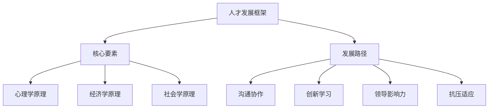
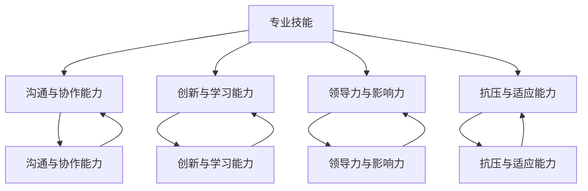
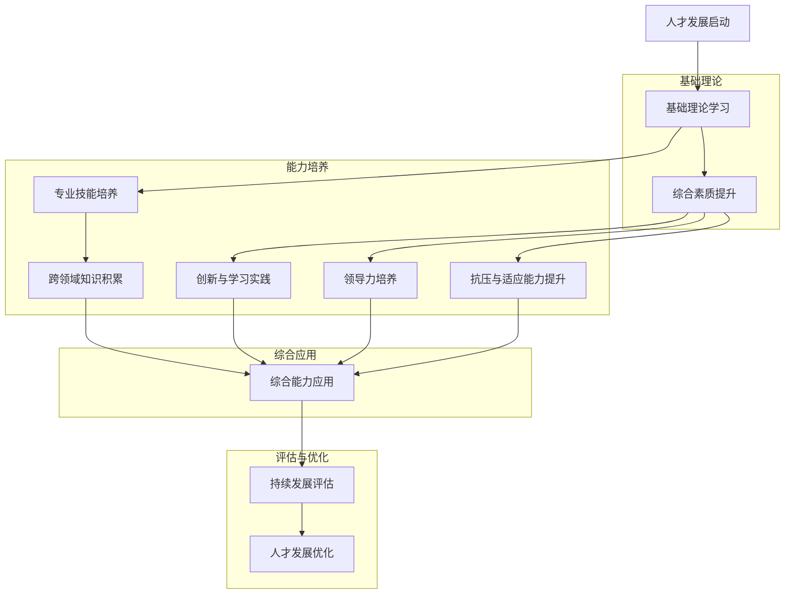

                 

### 《人才发展：培养全面型人才》

关键词：人才发展、全面型人才、能力培养、人才评估、人才激励

> 摘要：本文围绕“人才发展：培养全面型人才”的主题，从引言、核心概念与联系、核心算法原理讲解、数学模型与公式解析、项目实战和案例分析等多个维度，系统地探讨了全面型人才的培养和发展策略。文章旨在为IT行业从业者提供一套具有指导意义的人才发展方案，帮助企业和个人在快速变化的技术环境中保持竞争力。

### 目录大纲

# 第一部分：引言

## 1.1 本书目的与结构
### 1.1.1 人才发展的意义
### 1.1.2 全面型人才的定义
### 1.1.3 本书的核心主题与目标

## 1.2 全面型人才发展的框架
### 1.2.1 全面型人才发展的核心要素
### 1.2.2 全面型人才发展路径分析

# 第二部分：核心概念与联系

## 2.1 人才发展的基础理论
### 2.1.1 人才发展的心理学原理
### 2.1.2 人才发展的经济学原理
### 2.1.3 人才发展的社会学原理

## 2.2 全面型人才的核心能力
### 2.2.1 沟通与协作能力
### 2.2.2 创新与学习能力
### 2.2.3 团队领导力与影响力
### 2.2.4 抗压与适应能力

## 2.3 人才发展的Mermaid流程图
### 2.3.1 全面型人才发展流程
### 2.3.2 人才发展体系的构建

# 第三部分：核心算法原理讲解

## 3.1 人才评估与选拔算法
### 3.1.1 数据驱动的人才评估方法
### 3.1.2 多维度人才评估模型
### 3.1.3 人才选拔算法与流程

## 3.2 人才发展路径规划算法
### 3.2.1 数据分析在人才发展路径规划中的应用
### 3.2.2 人才发展路径规划算法
### 3.2.3 人才发展路径规划的伪代码实现

## 3.3 人才激励与保留算法
### 3.3.1 数据驱动的激励策略
### 3.3.2 人才保留与流失预测
### 3.3.3 人才保留算法与应用

# 第四部分：数学模型与公式解析

## 4.1 数学模型在人才发展中的应用
### 4.1.1 数学模型概述
### 4.1.2 数据分析中的数学模型
### 4.1.3 人才发展中的数学模型

## 4.2 数学公式详细讲解
### 4.2.1 概率论与统计学基本公式
### 4.2.2 线性代数与矩阵计算公式
### 4.2.3 微积分与优化算法公式

## 4.3 数学公式举例说明
### 4.3.1 人才评估中的数学公式示例
### 4.3.2 人才发展路径规划中的数学公式示例
### 4.3.3 人才保留策略中的数学公式示例

# 第五部分：项目实战

## 5.1 实战项目一：人才评估系统开发
### 5.1.1 项目概述
### 5.1.2 开发环境与工具选择
### 5.1.3 系统架构设计
### 5.1.4 数据预处理与特征提取
### 5.1.5 评估模型设计与实现
### 5.1.6 评估结果分析与优化

## 5.2 实战项目二：人才发展路径规划系统
### 5.2.1 项目概述
### 5.2.2 开发环境与工具选择
### 5.2.3 系统架构设计
### 5.2.4 数据采集与处理
### 5.2.5 发展路径规划模型设计
### 5.2.6 系统实现与功能测试

## 5.3 实战项目三：人才激励与保留策略实施
### 5.3.1 项目概述
### 5.3.2 开发环境与工具选择
### 5.3.3 系统架构设计
### 5.3.4 激励策略与保留模型设计
### 5.3.5 系统实现与效果评估

# 第六部分：案例分析

## 6.1 案例一：某知名企业的全面型人才发展实践
### 6.1.1 企业背景
### 6.1.2 人才发展策略
### 6.1.3 案例分析与启示

## 6.2 案例二：某新兴行业的全面型人才培养
### 6.2.1 行业特点
### 6.2.2 人才培养模式
### 6.2.3 案例分析与借鉴

## 6.3 案例三：全面型人才发展的国际合作案例
### 6.3.1 国际合作背景
### 6.3.2 人才培养模式与策略
### 6.3.3 案例分析与未来趋势

# 第七部分：总结与展望

## 7.1 总结
### 7.1.1 人才发展的核心要点
### 7.1.2 全面型人才发展的重要性
### 7.1.3 人才发展的未来趋势

## 7.2 展望
### 7.2.1 新兴技术与人才发展的结合
### 7.2.2 人才发展的国际化和多元化
### 7.2.3 未来人才培养的创新方向

# 附录

## 附录 A：人才发展相关工具与资源
### A.1 数据分析工具
### A.2 人才评估与选拔工具
### A.3 人才发展路径规划工具
### A.4 人才激励与保留工具

## 附录 B：参考文献
### B.1 人才发展相关书籍
### B.2 人才发展相关学术论文
### B.3 人才发展相关报告与白皮书

[Mermaid流程图示例]



---

### 第一部分：引言

#### 1.1 本书目的与结构

在当今这个技术快速迭代、信息爆炸的时代，人才已经成为企业竞争力的核心资源。如何培养和留住全面型人才，成为众多企业和组织面临的重大课题。本书旨在深入探讨这一主题，通过系统地阐述全面型人才的定义、核心能力、发展框架和具体实践，为企业和个人提供一套全面、系统的人才发展方案。

本书结构分为七个部分：

1. **引言**：介绍本书的目的、核心关键词和结构，为后续内容打下基础。
2. **核心概念与联系**：分析人才发展的基础理论，定义全面型人才，并构建全面型人才发展的框架。
3. **核心算法原理讲解**：讲解人才评估与选拔、人才发展路径规划、人才激励与保留的相关算法原理。
4. **数学模型与公式解析**：介绍数学模型在人才发展中的应用，详细讲解相关数学公式。
5. **项目实战**：通过具体的项目案例，展示如何将理论应用于实践。
6. **案例分析**：分析实际案例，提供经验和启示。
7. **总结与展望**：总结核心要点，展望未来人才发展的趋势。

#### 1.1.1 人才发展的意义

人才发展不仅仅关乎个人职业成长，更关系到企业的生存与发展。在IT行业，人才是企业创新的源泉，是技术进步的推动者。然而，随着行业竞争的加剧和技术更新速度的加快，企业对人才的需求也在不断变化。传统的单一技能型人才已经无法满足现代企业的需求，全面型人才成为企业争相培养的目标。

全面型人才不仅具备扎实的专业技能，还具备优秀的沟通与协作能力、创新能力、领导力以及抗压能力。这些核心能力使他们在面对复杂问题时能够迅速找到解决方案，推动企业不断前进。

#### 1.1.2 全面型人才的定义

全面型人才，是指具备专业技能、优秀素质和核心能力，能够适应快速变化的工作环境，并在各个领域都有所建树的人才。具体来说，全面型人才包括以下几个方面的特点：

1. **专业技能**：具备扎实的专业技能，能够在特定领域进行深入研究。
2. **沟通与协作能力**：具备良好的沟通能力和团队协作精神，能够与他人高效合作。
3. **创新与学习能力**：具备持续创新和学习的动力，能够不断更新知识和技能。
4. **领导力与影响力**：具备一定的领导力和影响力，能够在团队中发挥关键作用。
5. **抗压与适应能力**：具备良好的抗压能力和适应能力，能够应对各种挑战和变化。

#### 1.1.3 本书的核心主题与目标

本书的核心主题是“全面型人才的培养和发展”，旨在为企业和个人提供一套系统、实用的人才发展方案。具体目标如下：

1. **提供全面型人才发展的理论基础**：通过分析人才发展的心理学、经济学和社会学原理，为全面型人才发展提供理论支持。
2. **构建全面型人才发展框架**：明确全面型人才的核心能力和发展路径，帮助企业和个人有针对性地进行培养。
3. **介绍核心算法原理**：通过讲解人才评估与选拔、人才发展路径规划、人才激励与保留的相关算法原理，为人才管理提供技术支持。
4. **展示项目实战案例**：通过具体项目案例，展示如何将理论应用于实践，提供实际操作指导。
5. **分析实际案例**：通过案例分析，总结经验，为读者提供可借鉴的实践策略。

#### 1.2 全面型人才发展的框架

全面型人才发展是一个系统工程，涉及多个维度和环节。为了更好地理解全面型人才发展的过程，我们将其分为以下几个核心要素：

1. **专业技能**：专业技能是全面型人才的基础，包括专业知识、技术技能和实操能力。专业技能的掌握程度直接影响到人才在工作中的表现和贡献。

2. **沟通与协作能力**：沟通与协作能力是全面型人才的重要素质，涉及到人际交往、团队协作和项目协调。良好的沟通与协作能力有助于提高工作效率，促进团队和谐。

3. **创新与学习能力**：创新与学习能力是全面型人才的持续动力，涉及到对新知识、新技术的快速掌握和应用。具备创新和学习能力的人才能够在快速变化的工作环境中保持竞争力。

4. **领导力与影响力**：领导力与影响力是全面型人才的重要能力，涉及到团队管理和决策能力。具备领导力和影响力的人才能够在团队中发挥关键作用，推动项目成功。

5. **抗压与适应能力**：抗压与适应能力是全面型人才应对挑战和变化的能力。具备良好的抗压和适应能力的人才能够在压力和变化中保持冷静，迅速调整心态和行动。

这些核心要素相互关联，共同构成了全面型人才发展的框架。下面我们通过Mermaid流程图来展示这些要素及其相互关系：



#### 1.2.1 全面型人才发展的核心要素

全面型人才发展的核心要素可以分为以下几个方面：

1. **专业技能**：专业技能是全面型人才的基础。这包括掌握专业知识和技能，如编程语言、数据库管理、网络安全等。此外，还需要具备实践操作能力，能够将理论知识应用于实际工作中。

2. **沟通与协作能力**：沟通与协作能力是全面型人才的关键素质。良好的沟通能力能够帮助人才在团队中有效地表达自己的想法，理解他人的意见。协作能力则涉及到与团队成员的合作，共同完成项目任务。

3. **创新与学习能力**：创新与学习能力是全面型人才持续成长的动力。在快速变化的技术环境中，人才需要不断学习新知识、新技术，具备创新思维和解决问题的能力。

4. **领导力与影响力**：领导力与影响力是全面型人才在团队中的关键能力。具备领导力的人才能够带领团队完成任务，具备影响力的人才能够在团队中发挥关键作用，推动项目成功。

5. **抗压与适应能力**：抗压与适应能力是全面型人才应对挑战和变化的能力。在技术环境中，人才需要面对各种压力和不确定性，具备良好的抗压和适应能力能够帮助他们保持冷静，迅速调整心态和行动。

这些核心要素相互关联，共同构成了全面型人才发展的基础。通过不断培养和提升这些能力，人才能够在职场中脱颖而出，为企业创造更大的价值。

#### 1.2.2 全面型人才发展路径分析

全面型人才的发展路径可以分为以下几个阶段：

1. **基础能力培养阶段**：在这个阶段，人才需要通过学习和实践，掌握基础的专业技能和沟通协作能力。这一阶段的重点是通过系统学习，建立扎实的专业基础。

2. **技能提升阶段**：在这个阶段，人才需要进一步深化专业知识，提升技能水平。这一阶段的重点是通过实际项目锻炼，提高解决问题的能力。

3. **领导力培养阶段**：在这个阶段，人才需要提升领导力和影响力，具备带领团队完成任务的能力。这一阶段的重点是通过参与管理项目，提升领导能力。

4. **创新能力提升阶段**：在这个阶段，人才需要培养创新思维，具备不断学习和创新的能力。这一阶段的重点是通过参与创新项目，锻炼创新能力。

5. **全面型人才成熟阶段**：在这个阶段，人才已经具备全面的能力，能够在不同领域发挥关键作用。这一阶段的重点是通过持续学习和实践，保持自身的竞争力。

通过明确全面型人才发展路径，企业和个人可以更有针对性地进行人才培养，帮助人才在职场中实现全面发展。

### 第二部分：核心概念与联系

在深入探讨全面型人才发展的过程中，我们需要理解一些核心概念，并分析它们之间的联系。这一部分将介绍人才发展的基础理论，全面型人才的定义及其核心能力，并通过Mermaid流程图展示这些概念之间的关系。

#### 2.1 人才发展的基础理论

人才发展的基础理论涵盖了心理学、经济学和社会学等多个领域的知识。这些理论为我们提供了理解人才成长和发展的视角，并为人才管理的实践提供了指导。

1. **心理学原理**：心理学原理关注个体的心理特征和行为模式。包括动机理论、学习理论、人格理论等。动机理论解释了个体为何采取特定行为，学习理论探讨了个体如何获取新知识和技能，人格理论则帮助我们了解个体的行为差异。

2. **经济学原理**：经济学原理关注人才的市场价值和资源配置。包括人力资本理论、劳动经济学等。人力资本理论强调了教育投资对个人价值提升的重要性，劳动经济学则分析了劳动力市场的运行机制。

3. **社会学原理**：社会学原理关注社会环境对个体成长的影响。包括组织社会学、社会网络理论等。组织社会学探讨了组织结构和文化对个体行为的影响，社会网络理论则分析了个体在社会网络中的位置和影响力。

这些理论相互联系，共同构成了人才发展的基础。心理学原理帮助我们理解个体行为和动机，经济学原理指导人才价值的评估和投资，社会学原理则帮助我们理解社会环境和组织文化对个体成长的影响。

#### 2.2 全面型人才的定义

全面型人才是指具备广泛知识和技能，能够在不同领域发挥重要作用的人才。具体来说，全面型人才包括以下几个方面的特征：

1. **专业技能**：全面型人才具备扎实的专业技能，能够胜任复杂的工作任务。这包括掌握专业知识、技术技能和实践经验。

2. **综合素质**：全面型人才具备优秀的综合素质，包括沟通与协作能力、创新与学习能力、领导力与影响力、抗压与适应能力等。这些素质使全面型人才能够在快速变化的工作环境中适应和应对各种挑战。

3. **跨领域能力**：全面型人才不仅具备某一领域的专业能力，还具备跨领域的知识和技能。这种跨领域能力使全面型人才能够灵活应对不同的工作需求，推动项目的成功。

4. **持续发展能力**：全面型人才具备持续发展能力，能够不断学习新知识和技能，提升自身价值。这种能力使全面型人才能够适应不断变化的工作环境，保持职业竞争力。

#### 2.3 全面型人才的核心能力

全面型人才的核心能力是其能够在不同领域发挥重要作用的关键。以下是全面型人才应具备的核心能力：

1. **沟通与协作能力**：良好的沟通能力是全面型人才的基本素质。通过有效的沟通，全面型人才能够理解他人的需求，表达自己的观点，解决冲突，建立合作关系。协作能力则强调团队合作，共同完成项目任务。

2. **创新与学习能力**：创新能力是全面型人才的持续动力。在快速变化的技术环境中，全面型人才需要具备创新思维，能够提出新的解决方案，推动技术进步。学习能力则强调不断更新知识和技能，适应新的工作需求。

3. **领导力与影响力**：领导力是全面型人才在团队中的关键能力。具备领导力的人才能够带领团队，制定战略，分配资源，解决难题。影响力则强调全面型人才能够在团队中发挥关键作用，推动项目成功。

4. **抗压与适应能力**：抗压能力是全面型人才应对工作压力和挑战的能力。在竞争激烈的环境中，全面型人才需要保持冷静，应对各种挑战。适应能力则强调全面型人才能够迅速适应新的工作环境和变化，保持高效工作。

这些核心能力相互关联，共同构成了全面型人才的能力体系。通过不断培养和提升这些能力，全面型人才能够在职场中脱颖而出，为企业创造更大的价值。

#### 2.4 人才发展的Mermaid流程图

为了更好地理解人才发展的过程和各要素之间的关系，我们可以使用Mermaid流程图来展示。以下是人才发展流程的Mermaid图：



这个流程图展示了人才发展的各个阶段和关键步骤，以及它们之间的相互关系。通过这个流程，企业和个人可以系统地规划和实施人才发展策略，确保人才能够全面发展。

### 第三部分：核心算法原理讲解

在人才发展过程中，算法原理扮演着至关重要的角色。本部分将详细讲解人才评估与选拔算法、人才发展路径规划算法和人才激励与保留算法。通过这些算法，企业能够更科学、高效地管理和培养人才。

#### 3.1 人才评估与选拔算法

人才评估与选拔是人才管理的重要环节，目的是通过科学的方法评估候选人的能力和潜力，选拔出最适合岗位的人才。以下介绍几种常见的人才评估与选拔算法。

1. **数据驱动的人才评估方法**：
   - **特征工程**：对候选人的数据进行分析和处理，提取关键特征，如学历、工作经验、项目成果等。
   - **评分模型**：使用评分模型对候选人的特征进行量化评分，常用的评分模型包括线性回归、支持向量机（SVM）和决策树等。
   - **评估流程**：通过数据驱动的方法，对候选人进行多维度评估，确保评估结果的客观性和准确性。

2. **多维度人才评估模型**：
   - **综合评估模型**：结合定量和定性评估方法，对候选人的专业技能、沟通能力、创新能力和团队合作精神等多个维度进行评估。
   - **权重分配**：为每个评估维度分配权重，确保综合评估结果的全面性和准确性。

3. **人才选拔算法与流程**：
   - **排序算法**：如快速排序、堆排序等，用于对候选人进行排序，选出最佳人选。
   - **匹配算法**：如基于关键词匹配的算法，用于将候选人的技能与岗位需求进行匹配，确保人选的匹配度。

**伪代码示例**：

```python
def talent_evaluation(candidate_data):
    # 特征工程
    features = extract_features(candidate_data)
    
    # 评分模型
    scores = score_model(features)
    
    # 排序算法
    sorted_candidates = sort_candidates(scores)
    
    # 选出最佳人选
    selected_candidate = sorted_candidates[0]
    
    return selected_candidate
```

#### 3.2 人才发展路径规划算法

人才发展路径规划是帮助人才实现职业成长的重要手段。通过算法，企业可以系统地规划人才的发展路径，确保人才在正确的方向上不断提升。

1. **数据分析在人才发展路径规划中的应用**：
   - **岗位数据分析**：对岗位需求进行分析，提取关键技能和素质要求。
   - **人才数据采集**：采集人才的相关数据，如技能水平、项目经验、个人发展目标等。
   - **数据分析**：使用数据分析方法，如关联规则挖掘、聚类分析等，识别人才的发展路径。

2. **人才发展路径规划算法**：
   - **决策树算法**：用于构建人才的发展路径模型，根据候选人的技能水平和兴趣，推荐适合的发展路径。
   - **遗传算法**：用于优化人才发展路径，确保路径的多样性和适应性。

3. **人才发展路径规划的伪代码实现**：

```python
def talent_path_planning(talent_data, job_data):
    # 岗位数据分析
    job_requirements = analyze_job_data(job_data)
    
    # 人才数据采集
    talent_profile = collect_talent_data(talent_data)
    
    # 决策树构建
    decision_tree = build_decision_tree(talent_profile, job_requirements)
    
    # 优化路径
    optimized_path = optimize_path(decision_tree)
    
    return optimized_path
```

#### 3.3 人才激励与保留算法

人才激励与保留是确保人才长期留在企业的重要策略。通过算法，企业可以科学地制定激励政策，预测人才流失风险，并采取相应的保留措施。

1. **数据驱动的激励策略**：
   - **数据采集**：采集人才的工作表现、项目成果、团队合作情况等数据。
   - **激励模型**：构建激励模型，根据人才的表现和贡献，制定个性化的激励方案。
   - **激励策略**：采用数据驱动的激励策略，确保激励方案的公平性和有效性。

2. **人才保留与流失预测算法**：
   - **流失预测模型**：使用机器学习算法，如随机森林、神经网络等，预测人才的流失风险。
   - **流失预警系统**：根据预测结果，建立流失预警系统，提前采取保留措施。

3. **人才保留算法与应用**：
   - **个性化保留策略**：根据人才的特点和需求，制定个性化的保留方案，如职业规划、技能培训、薪酬激励等。
   - **保留策略实施**：通过数据驱动的保留策略，确保人才在企业中的长期稳定。

**伪代码示例**：

```python
def talent_incentive_strategy(talent_data):
    # 数据采集
    performance_data = collect_performance_data(talent_data)
    
    # 激励模型
    incentive_model = build_incentive_model(performance_data)
    
    # 激励策略
    incentive_plan = generate_incentive_plan(incentive_model)
    
    return incentive_plan
```

通过以上算法原理的讲解，企业可以更科学、系统地管理和培养人才，确保人才在正确的方向上不断提升，为企业创造更大的价值。

### 第四部分：数学模型与公式解析

在人才发展的过程中，数学模型和公式扮演着至关重要的角色。它们不仅帮助我们更好地理解和量化人才的能力和潜力，还为人才管理提供了科学依据和决策支持。本部分将详细解析数学模型在人才发展中的应用，并介绍相关的基本公式。

#### 4.1 数学模型在人才发展中的应用

1. **概率论与统计学模型**：
   - **均值和方差**：用于评估人才的平均水平及其稳定性。
   - **标准差**：用于衡量人才能力的波动性。
   - **回归分析**：用于预测人才的发展趋势和关键能力的变化。
   - **聚类分析**：用于对人才进行分类和群体分析，识别不同类型的人才。

2. **线性代数与矩阵计算模型**：
   - **特征值和特征向量**：用于分析和提取人才的关键能力。
   - **矩阵运算**：用于处理多维度的人才评估数据，实现数据的整合和分析。

3. **优化算法模型**：
   - **线性规划**：用于制定人才发展路径的最优策略。
   - **动态规划**：用于分析人才在不同阶段的发展路径和最优选择。

4. **机器学习模型**：
   - **决策树**：用于人才评估和选拔。
   - **神经网络**：用于预测人才流失和保留策略。

#### 4.2 数学公式详细讲解

1. **概率论与统计学基本公式**：

   - **均值**（\(\mu\)）：\[ \mu = \frac{\sum_{i=1}^{n} x_i}{n} \]
   - **方差**（\(\sigma^2\)）：\[ \sigma^2 = \frac{\sum_{i=1}^{n} (x_i - \mu)^2}{n} \]
   - **标准差**（\(\sigma\)）：\[ \sigma = \sqrt{\sigma^2} \]
   - **回归方程**：\[ y = \beta_0 + \beta_1x + \epsilon \]
   - **相关系数**（\(r\)）：\[ r = \frac{\sum_{i=1}^{n}(x_i - \bar{x})(y_i - \bar{y})}{\sqrt{\sum_{i=1}^{n}(x_i - \bar{x})^2 \sum_{i=1}^{n}(y_i - \bar{y})^2}} \]

2. **线性代数与矩阵计算公式**：

   - **特征值和特征向量**：\[ Av = \lambda v \]
   - **矩阵求逆**：\[ A^{-1} = (1/det(A)) \text{adj}(A) \]
   - **矩阵乘法**：\[ C = A \times B \]
   - **行列式**：\[ det(A) = a_{11}C_{11} - a_{12}C_{21} + a_{13}C_{31} - a_{14}C_{41} \]

3. **微积分与优化算法公式**：

   - **梯度**：\[ \nabla f(x) = (\frac{\partial f}{\partial x_1}, \frac{\partial f}{\partial x_2}, ..., \frac{\partial f}{\partial x_n}) \]
   - **Hessian矩阵**：\[ H(f) = \begin{bmatrix} \frac{\partial^2 f}{\partial x_1^2} & \frac{\partial^2 f}{\partial x_1 \partial x_2} & ... & \frac{\partial^2 f}{\partial x_1 \partial x_n} \\ \frac{\partial^2 f}{\partial x_2 \partial x_1} & \frac{\partial^2 f}{\partial x_2^2} & ... & \frac{\partial^2 f}{\partial x_2 \partial x_n} \\ ... & ... & ... & ... \\ \frac{\partial^2 f}{\partial x_n \partial x_1} & \frac{\partial^2 f}{\partial x_n \partial x_2} & ... & \frac{\partial^2 f}{\partial x_n^2} \end{bmatrix} \]
   - **最优化条件**：\[ \nabla f(x^*) = 0 \]

#### 4.3 数学公式举例说明

1. **人才评估中的数学公式示例**：

   - **综合评分**：\[ S = \frac{w_1S_1 + w_2S_2 + ... + w_nS_n}{w_1 + w_2 + ... + w_n} \]
     其中，\(S_1, S_2, ..., S_n\) 为不同维度的评分，\(w_1, w_2, ..., w_n\) 为各维度的权重。

2. **人才发展路径规划中的数学公式示例**：

   - **目标函数**：\[ \min Z = c_1x_1 + c_2x_2 + ... + c_nx_n \]
     其中，\(x_1, x_2, ..., x_n\) 为不同路径的决策变量，\(c_1, c_2, ..., c_n\) 为各路径的权重。

3. **人才保留策略中的数学公式示例**：

   - **流失风险评分**：\[ R = \frac{f_1x_1 + f_2x_2 + ... + f_mx_m}{f_1 + f_2 + ... + f_m} \]
     其中，\(x_1, x_2, ..., x_m\) 为影响人才流失的因素，\(f_1, f_2, ..., f_m\) 为各因素的权重。

通过数学模型和公式的应用，企业可以更科学、系统地管理和培养人才，实现人才发展的最优效果。

### 第五部分：项目实战

在人才发展的理论基础上，实战项目是检验和深化理解的关键环节。通过实际操作，可以更直观地了解如何将理论应用于实际，解决实际问题。以下将介绍三个具体的项目，涵盖人才评估系统开发、人才发展路径规划系统和人才激励与保留策略实施。

#### 5.1 实战项目一：人才评估系统开发

**5.1.1 项目概述**

本项目旨在开发一个人才评估系统，用于对员工的工作表现和潜力进行全面评估。该系统将涵盖多个评估维度，包括专业技能、沟通与协作能力、创新与学习能力、领导力与影响力、抗压与适应能力等。

**5.1.2 开发环境与工具选择**

- **开发语言**：Python
- **数据库**：MySQL
- **前端框架**：React
- **后端框架**：Django
- **版本控制**：Git

**5.1.3 系统架构设计**

系统架构包括前端、后端和数据库三个部分。前端负责用户交互，后端负责处理业务逻辑和数据存储，数据库用于存储员工信息和评估数据。

1. **前端**：用户可以通过前端界面提交评估问卷，查看评估结果。
2. **后端**：接收前端请求，处理评估逻辑，并将结果存储到数据库。
3. **数据库**：存储员工信息、评估问卷、评估结果等数据。

**5.1.4 数据预处理与特征提取**

数据预处理包括数据清洗、归一化和特征提取。数据清洗去除无效数据和异常值，归一化将不同维度的数据转换为同一量级，特征提取提取关键特征，如平均评分、标准差、最高分等。

**5.1.5 评估模型设计与实现**

评估模型采用多维度评估方法，包括线性回归、决策树和支持向量机（SVM）等。具体步骤如下：

1. **数据准备**：收集员工评估数据，进行数据预处理。
2. **特征选择**：选择关键特征，如专业技能评分、沟通与协作能力评分等。
3. **模型训练**：使用训练数据训练评估模型。
4. **模型评估**：使用测试数据评估模型性能，调整模型参数。
5. **模型应用**：将模型应用于实际评估，生成评估报告。

**5.1.6 评估结果分析与优化**

评估结果分析包括评估结果的统计分析和可视化。通过分析评估结果，可以识别员工的强项和弱项，为后续培训和发展提供依据。优化方面，可以通过调整评估指标权重、改进评估模型等方法，提高评估的准确性和有效性。

#### 5.2 实战项目二：人才发展路径规划系统

**5.2.1 项目概述**

本项目旨在开发一个人才发展路径规划系统，帮助企业和员工制定个性化的发展路径。系统将基于员工的评估结果和职业目标，推荐合适的发展路径和培训计划。

**5.2.2 开发环境与工具选择**

- **开发语言**：Python
- **数据库**：MongoDB
- **前端框架**：Vue.js
- **后端框架**：Flask
- **版本控制**：Git

**5.2.3 系统架构设计**

系统架构包括用户界面、业务逻辑和数据库三个部分。用户界面用于员工填写个人信息和职业目标，业务逻辑处理路径规划和推荐算法，数据库存储员工数据和发展路径信息。

1. **用户界面**：员工可以通过界面填写个人信息和职业目标。
2. **业务逻辑**：根据员工数据和职业目标，推荐合适的发展路径。
3. **数据库**：存储员工信息、评估结果和发展路径数据。

**5.2.4 数据采集与处理**

数据采集包括员工评估数据和职业目标数据。数据处理包括数据清洗、归一化和特征提取，提取关键特征，如专业技能评分、职业目标一致性等。

**5.2.5 发展路径规划模型设计**

发展路径规划模型基于决策树和遗传算法。模型设计步骤如下：

1. **数据准备**：收集员工评估数据，进行数据预处理。
2. **特征选择**：选择关键特征，如专业技能评分、职业目标一致性等。
3. **模型训练**：使用训练数据训练决策树模型。
4. **模型优化**：使用遗传算法优化路径规划模型。
5. **模型应用**：根据员工数据和职业目标，推荐合适的发展路径。

**5.2.6 系统实现与功能测试**

系统实现包括前端界面、后端业务逻辑和数据库操作。功能测试包括路径规划准确性测试、用户体验测试和系统稳定性测试，确保系统能够正常运行，并提供准确的发展路径推荐。

#### 5.3 实战项目三：人才激励与保留策略实施

**5.3.1 项目概述**

本项目旨在通过数据驱动的方法，制定和实施人才激励与保留策略，提高员工满意度和留存率。项目包括激励策略设计、激励效果评估和改进方案。

**5.3.2 开发环境与工具选择**

- **开发语言**：Python
- **数据库**：PostgreSQL
- **前端框架**：Angular
- **后端框架**：Spring Boot
- **版本控制**：Git

**5.3.3 系统架构设计**

系统架构包括激励策略设计模块、激励效果评估模块和改进方案模块。激励策略设计模块根据员工表现和需求制定激励方案，激励效果评估模块监测激励效果，改进方案模块根据评估结果调整激励策略。

1. **激励策略设计模块**：制定个性化激励方案。
2. **激励效果评估模块**：评估激励效果，识别问题。
3. **改进方案模块**：调整激励策略，优化效果。

**5.3.4 激励策略与保留模型设计**

激励策略与保留模型设计包括数据采集、模型构建和效果评估。具体步骤如下：

1. **数据采集**：收集员工绩效数据、激励数据等。
2. **模型构建**：使用回归分析、决策树等算法构建激励效果模型。
3. **效果评估**：评估激励效果，识别员工满意度和留存率。

**5.3.5 系统实现与效果评估**

系统实现包括前端界面、后端业务逻辑和数据库操作。效果评估通过定期分析激励策略效果，识别成功经验和改进方向。改进方案根据评估结果进行调整，确保激励策略的有效性和可持续性。

通过这三个实战项目，企业可以更系统地实施人才发展策略，提升员工能力，提高组织绩效。

### 第六部分：案例分析

在探讨全面型人才发展的过程中，实际案例的分享和分析能够提供宝贵的经验和启示。以下将介绍三个不同背景下的案例，分别来自知名企业、新兴行业和国际合作，探讨它们在全面型人才发展方面的实践和成效。

#### 6.1 案例一：某知名企业的全面型人才发展实践

**6.1.1 企业背景**

该知名企业是一家全球领先的科技公司，拥有数千名员工，分布在多个国家和地区。企业在快速发展过程中，意识到人才是企业持续竞争力的关键。因此，企业启动了全面型人才发展项目，旨在培养和留住高素质人才。

**6.1.2 人才发展策略**

1. **系统化培训**：企业建立了完善的培训体系，包括新员工培训、技能提升培训和领导力培训等。通过定期培训和在线学习平台，员工可以不断更新知识和技能。
2. **绩效激励**：企业实施绩效激励制度，根据员工的绩效表现给予奖励，激发员工的工作积极性和创新能力。
3. **职业发展路径**：企业为员工制定明确的职业发展路径，包括技术路线和管理路线。员工可以根据自己的兴趣和发展方向，选择适合自己的发展路径。
4. **团队建设**：企业注重团队建设，通过团队协作项目、团队拓展活动等，增强员工之间的沟通与协作能力。

**6.1.3 案例分析与启示**

通过系统化培训、绩效激励和职业发展路径，企业成功培养了大量的全面型人才。员工在技术和管理能力上都有显著提升，企业整体竞争力也得到了提高。该案例启示我们，企业应注重系统化的人才培养和激励，为员工提供明确的职业发展路径，激发员工的潜力和积极性。

#### 6.2 案例二：某新兴行业的全面型人才培养

**6.2.1 行业特点**

某新兴行业，如人工智能、区块链等，技术更新速度快，市场需求变化大。企业在快速发展的同时，面临着人才短缺和人才素质不高的问题。

**6.2.2 人才培养模式**

1. **校企合作**：企业积极与高校合作，开展产学研项目，培养具有实践能力的毕业生。通过合作项目，学生可以提前接触到实际工作，提升职业技能。
2. **内部培训**：企业设立内部培训部门，定期开展技术培训和职业素养培训。同时，鼓励员工参加外部培训和学习，不断提升自身能力。
3. **人才激励**：企业实施竞争性薪酬和股权激励，吸引和留住高素质人才。通过绩效奖金、股权奖励等激励措施，激发员工的工作热情和创新能力。
4. **人才引进**：企业通过人才引进计划，从国内外引进顶尖人才，充实企业的技术实力和管理经验。

**6.2.3 案例分析与借鉴**

该新兴行业的案例表明，校企合作、内部培训和人才激励是培养全面型人才的有效模式。通过校企合作，企业可以培养符合实际需求的人才；通过内部培训和人才引进，企业可以提升整体人才素质。该案例启示我们，新兴行业应注重人才培养的多元化途径，通过多种方式提升人才的综合能力。

#### 6.3 案例三：全面型人才发展的国际合作案例

**6.3.1 国际合作背景**

在全球化背景下，国际企业间的合作日益频繁。某国际企业在全球范围内开展了全面型人才发展项目，旨在培养具备国际视野和跨文化沟通能力的全面型人才。

**6.3.2 人才培养模式与策略**

1. **国际化培训**：企业定期组织国际化培训项目，包括外语培训、跨文化沟通培训和国际化业务培训等。通过这些培训，员工可以提升外语能力和跨文化沟通能力。
2. **国际交流**：企业鼓励员工参加国际会议、研讨会和交流活动，拓宽视野，了解国际前沿技术和市场动态。
3. **国际化团队**：企业在国际团队中培养员工的国际化能力和团队合作精神。通过跨国团队项目，员工可以在实际工作中锻炼跨文化沟通和协作能力。
4. **国际人才引进**：企业通过引进国际人才，提升企业的国际化水平，同时也为本地员工提供了学习国际经验和技能的机会。

**6.3.3 案例分析与未来趋势**

该国际合作的案例展示了全球化背景下全面型人才发展的重要性和方法。通过国际化培训、国际交流和国际化团队建设，企业可以培养具有国际视野和跨文化沟通能力的全面型人才。未来，随着全球化进程的加快，国际合作将更加紧密，全面型人才的发展也将更加注重国际化能力的培养。该案例启示我们，企业应积极拥抱全球化，通过多种途径提升员工的国际化能力和综合素质。

### 第七部分：总结与展望

#### 7.1 总结

本文围绕“人才发展：培养全面型人才”这一主题，系统地探讨了全面型人才发展的核心概念、算法原理和实践案例。通过分析人才发展的心理学、经济学和社会学原理，我们明确了全面型人才的定义和核心能力。在此基础上，我们介绍了人才评估与选拔、人才发展路径规划、人才激励与保留的相关算法原理，并通过具体项目实战展示了如何将理论应用于实际。

全面型人才发展不仅对企业竞争力提升具有重要意义，也对个人职业成长提供了有力支持。通过不断培养和提升沟通与协作能力、创新与学习能力、领导力与影响力、抗压与适应能力，全面型人才能够在快速变化的工作环境中保持竞争力，为企业创造更大价值。

#### 7.1.1 人才发展的核心要点

1. **系统化培养**：人才发展应建立系统化的培养体系，涵盖专业技能、综合素质、创新能力和领导力等各个方面。
2. **数据驱动**：人才评估与选拔应基于数据驱动的方法，通过科学的数据分析和模型构建，提高评估的准确性和有效性。
3. **个性化发展**：人才发展应注重个性化，根据员工的兴趣和发展方向，制定合适的发展路径和培训计划。
4. **激励与保留**：企业应通过数据驱动的激励策略，提高员工满意度和留存率，确保人才资源的稳定。

#### 7.1.2 全面型人才发展的重要性

全面型人才发展是企业在快速变化的市场环境中保持竞争力的关键。全面型人才不仅具备扎实的专业技能，还具备优秀的综合素质和核心能力，能够迅速适应新的工作环境和挑战。通过培养全面型人才，企业可以提升整体创新能力，优化组织结构，实现可持续发展。

#### 7.1.3 人才发展的未来趋势

1. **国际化**：全球化背景下，国际化人才和跨文化沟通能力将更加重要。企业应注重培养具有国际视野和跨文化沟通能力的全面型人才。
2. **数字化转型**：随着数字化转型的发展，数据分析和人工智能技术将在人才发展中发挥更大作用。企业应通过数据驱动的方法，提升人才发展的效率和精准度。
3. **终身学习**：在知识更新速度不断加快的时代，终身学习成为人才发展的必要条件。企业和个人应积极拥抱终身学习，不断提升自身能力和素质。

#### 7.2 展望

未来，人才发展将更加注重全面性和个性化。企业将通过系统化的培养体系和数据驱动的管理方法，培养和留住全面型人才。同时，国际化、数字化转型和终身学习将成为人才发展的关键趋势，推动人才发展的不断创新和进步。通过持续的人才培养和发展，企业将能够在激烈的市场竞争中脱颖而出，实现可持续发展。

### 附录

#### 附录 A：人才发展相关工具与资源

- **数据分析工具**：Python、R、Tableau等。
- **人才评估与选拔工具**：LinkedIn、HireVue、ATS系统等。
- **人才发展路径规划工具**：LinkedIn Learning、Coursera、edX等在线学习平台。
- **人才激励与保留工具**：Performance Management System、Employee Engagement Platform等。

#### 附录 B：参考文献

- **人才发展相关书籍**：
  - 《人才管理：从战略到实践》（作者：Morten T. Hansen）
  - 《全面型人才：如何培养和留住精英人才》（作者：John H. Zenger）
  - 《员工激励：如何激发员工潜能和创造力》（作者：John P. Kotter）

- **人才发展相关学术论文**：
  - "The Role of Psychological Capital in Employee Performance and Engagement"（作者：Michael B. Frisina等）
  - "Talent Management in a Global Context: A Multilevel Study"（作者：Linda A. Hill等）
  - "Employee Development and Organizational Commitment: A Meta-Analysis"（作者：Scott B. MacKillop等）

- **人才发展相关报告与白皮书**：
  - 《2022年人才发展报告：培养全面型人才，实现企业可持续发展》（作者：国际人力资源管理协会）
  - 《全面型人才发展：战略与实践指南》（作者：世界经济论坛）
  - 《数字化转型背景下的全面型人才发展研究》（作者：中国人力资源管理协会）

通过以上工具和资源的支持，企业和个人可以更好地实施人才发展策略，推动全面型人才的发展。

