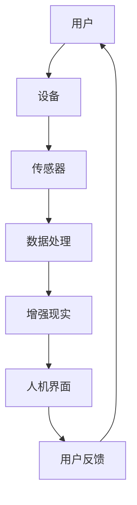

                 

# 人机协作与增强现实：创业公司的新机遇

## 关键词
- 人机协作
- 增强现实
- 创业公司
- 技术应用
- 未来趋势

## 摘要
本文将探讨人机协作与增强现实技术如何为创业公司带来新的机遇。首先，我们回顾了增强现实技术的背景和发展，然后详细介绍了人机协作的基础理论。接着，通过实际案例展示了人机协作与增强现实技术在创业公司中的应用。文章还分析了创业公司在这两个领域面临的技术挑战及其解决方案，并展望了未来的发展趋势。希望通过本文，读者能够对人机协作与增强现实在创业领域的潜力有更深刻的理解。

## 目录大纲设计思路

在设计《人机协作与增强现实：创业公司的新机遇》这本书的目录大纲时，我们的首要目标是确保内容的逻辑清晰、结构紧凑，同时保持简洁易懂。以下是我们的具体设计思路：

### 1. 明确书籍主题
书籍的核心主题是“人机协作与增强现实”，重点关注这两个技术领域在创业公司中的应用场景和机遇。因此，目录的设计将围绕这一核心主题展开。

### 2. 确定目录结构
为了确保内容的系统性和完整性，我们首先确定了以下主要部分：
- 引言：介绍人机协作与增强现实的背景及其在创业公司中的重要性。
- 增强现实技术概述：涵盖增强现实的基础知识、分类、关键技术及其应用场景。
- 人机协作基础：介绍人机协作的基本概念、模式、优势与挑战。
- 创业公司应用案例：通过具体案例展示人机协作与增强现实技术在创业公司中的应用。
- 技术挑战与解决方案：分析创业公司在应用这些技术时可能遇到的技术挑战及其解决方案。
- 未来趋势与机遇：探讨人机协作与增强现实技术的未来发展趋势以及创业公司的机遇。

### 3. 细化章节内容
在每个主要部分中，我们进一步细化了章节内容，确保每个章节都有详细的子章节。例如，在“增强现实技术概述”中，我们将详细讨论增强现实的关键技术，如SLAM（同步定位与映射）和图像识别等。

### 4. 涵盖核心概念、算法原理、案例实战
为了确保读者能够全面理解人机协作与增强现实的相关知识，我们在每个章节中涵盖了核心概念、算法原理以及实际案例。例如，在讨论人机协作模式时，我们将提供具体的伪代码和流程图，帮助读者理解理论在实际中的应用。

### 5. 设计流程图、伪代码、数学公式
为了增强读者的理解，我们将在合适的章节中添加流程图、伪代码和数学公式。例如，在讨论增强现实中的数据处理时，我们将使用流程图来展示数据处理的步骤，并使用伪代码来详细阐述算法的实现。

### 6. 确保简洁性与完整性
在设计目录大纲时，我们注重在保持简洁性的同时确保完整性。每个章节都经过精心设计，确保核心内容得到充分覆盖，没有遗漏重要的知识点。

### 7. 总结与展望
最后，我们在书的结尾部分总结了全文的主要观点，并对未来研究方向和创业公司的建议进行了展望。这一部分不仅为读者提供了一个全面的总结，还为他们指明了进一步学习和探索的方向。

通过上述设计思路，我们希望《人机协作与增强现实：创业公司的新机遇》这本书能够为读者提供一份既有深度又有实用价值的指南，帮助他们更好地理解并利用人机协作与增强现实技术。

### 完整的目录大纲

以下是《人机协作与增强现实：创业公司的新机遇》的完整目录大纲：

#### 引言
1. **背景与意义**
   - 增强现实技术的兴起
   - 人机协作的重要性
   - 创业公司的角色与机遇

#### 第1章：增强现实技术概述
2. **增强现实技术基础**
   - 增强现实的概念与分类
   - 关键技术介绍（如SLAM、图像识别等）
   - 应用场景分析（如教育、医疗、娱乐等）

#### 第2章：人机协作基础
3. **人机协作基本概念**
   - 人机交互的定义与原理
   - 人机协作模式与模型
   - 人机协作的优势与挑战

#### 第3章：人机协作与增强现实的关系
4. **人机协作在增强现实中的应用**
   - 技术实现
   - 应用案例
   - 未来发展趋势

#### 第4章：创业公司应用案例
5. **案例一：虚拟现实会议系统**
   - 系统设计
   - 技术实现
   - 应用效果与评价

6. **案例二：增强现实导航系统**
   - 系统架构
   - 技术要点
   - 用户反馈与改进

#### 第5章：技术挑战与解决方案
7. **挑战一：交互体验优化**
   - 现状分析
   - 技术途径
   - 成功案例

8. **挑战二：数据处理与隐私保护**
   - 数据处理技术
   - 隐私保护策略
   - 实际应用中的案例分析

#### 第6章：增强现实在人机协作中的具体应用
9. **应用一：远程协作**
   - 技术实现
   - 应用场景
   - 优势与挑战

10. **应用二：增强现实培训**
    - 培训内容设计
    - 技术实现
    - 成功案例

#### 第7章：市场前景与创业公司定位
11. **市场分析**
    - 行业发展趋势
    - 市场规模与增长预测
    - 竞争格局分析

12. **创业公司的机遇与挑战**
    - 创业公司的定位
    - 技术创新与市场拓展
    - 持续发展策略

#### 第8章：未来趋势与机遇
13. **未来趋势**
    - 技术创新方向
    - 行业发展展望
    - 人机协作与增强现实的融合

14. **机遇与挑战**
    - 新技术带来的机遇
    - 潜在的挑战与应对策略

#### 结论与展望
15. **总结**
    - 主要观点回顾
    - 主要结论
    - 贡献与局限性

16. **展望**
    - 未来研究方向
    - 对创业公司的建议

### 附录

#### 附录A：增强现实与人机协作相关资源
- 常用工具与平台
- 开源代码与资料
- 专业期刊与会议

通过上述详细的目录大纲，我们可以看到《人机协作与增强现实：创业公司的新机遇》这本书将全面覆盖人机协作与增强现实技术的基础知识、应用案例、技术挑战与解决方案，以及市场前景和未来趋势。每个章节都经过精心设计，确保核心内容得到充分覆盖，并提供了丰富的实际案例和实用建议。希望这个目录大纲能够满足您的要求。

### 背景介绍

随着科技的快速发展，人机协作与增强现实技术逐渐成为推动社会进步的重要力量。增强现实（AR）是一种通过计算机生成的虚拟信息与真实世界环境相融合的技术，它不仅能够增强用户的感知体验，还能提供更丰富的信息和服务。人机协作则是指通过计算机技术和人工智能算法，实现人与计算机之间的高效互动和合作，从而提高工作效率和体验质量。

在人机协作与增强现实技术的兴起中，创业公司扮演着至关重要的角色。一方面，这些新兴公司能够更加灵活地应对市场变化，迅速开发出具有创新性的产品；另一方面，它们能够通过技术创新，打破传统商业模式，开辟新的市场空间。例如，虚拟现实（VR）会议系统、增强现实导航系统等，都是创业公司在人机协作与增强现实技术领域的成功案例。

创业公司在这些技术领域的机遇主要体现在以下几个方面：

1. **市场需求**：随着人们对于互动体验和个性化服务的需求日益增长，增强现实和人机协作技术为创业公司提供了广阔的市场空间。尤其是在教育、医疗、娱乐等领域，这些技术能够显著提升用户体验和服务质量。

2. **技术创新**：创业公司通常具有更强的创新能力和技术积累，能够迅速将前沿科技应用于实际产品中，从而在竞争中脱颖而出。例如，通过引入先进的图像识别和SLAM技术，创业公司可以开发出更加精准和高效的增强现实应用。

3. **商业模式**：增强现实和人机协作技术为创业公司提供了创新的商业模式。例如，通过提供基于增强现实的在线培训服务，创业公司不仅可以实现全球范围的业务拓展，还能通过订阅制、付费下载等多种方式实现盈利。

4. **政策支持**：许多国家和地区政府已经意识到增强现实和人机协作技术的重要性，并出台了一系列支持政策和资金投入。这些政策支持为创业公司提供了良好的发展环境，有助于它们更好地抓住市场机遇。

然而，创业公司在这两个领域也面临诸多挑战。例如，技术实现复杂、用户体验优化困难、数据处理与隐私保护等问题，都是创业公司在应用这些技术时需要克服的难题。此外，市场竞争激烈，创业公司需要不断创新，以保持竞争优势。

总之，人机协作与增强现实技术为创业公司带来了前所未有的机遇，同时也带来了巨大的挑战。通过深入了解这些技术的核心概念、应用场景和未来发展趋势，创业公司可以更好地把握市场机遇，实现持续创新和快速发展。

### 核心概念与联系

在人机协作与增强现实技术中，核心概念之间的关系架构至关重要，它不仅帮助我们理解各个技术组件如何协同工作，还决定了系统的整体性能和用户体验。为了清晰地阐述这些概念之间的关系，我们使用Mermaid流程图来展示。

以下是一个简单的Mermaid流程图示例，用于说明人机协作与增强现实技术中的关键概念：

**图1：人机协作与增强现实技术概念关系架构**

- **用户**：系统的最终用户，通过设备与系统进行交互。
- **设备**：包括智能手机、平板电脑、头戴式显示器等，用于接收用户的输入和显示增强现实内容。
- **传感器**：用于捕捉用户环境中的各种信息，如摄像头、GPS、加速度计等。
- **数据处理**：对传感器数据进行处理，包括图像识别、SLAM（同步定位与映射）、环境建模等。
- **增强现实**：通过计算机生成的虚拟信息叠加到真实世界中，提供增强的视觉、听觉和触觉体验。
- **人机界面**：用户与系统交互的界面，包括屏幕显示、语音控制、手势操作等。
- **用户反馈**：用户对系统的操作和反馈，用于调整系统性能和用户体验。

这个流程图清晰地展示了各个核心概念之间的相互关系，以及数据在系统中的流动路径。以下是对每个环节的详细解释：

1. **用户**：用户通过设备与系统进行交互，输入需求或操作指令。设备可以是任何可以支持增强现实和人机协作的硬件，如智能手机、平板电脑或头戴式显示器。

2. **设备**：设备接收用户的输入，并通过传感器捕捉用户环境中的信息。这些信息包括图像、位置、动作等，为后续的数据处理提供基础。

3. **传感器**：传感器负责捕捉图像、声音、位置等信息。例如，摄像头用于捕捉图像数据，GPS用于定位，加速度计用于检测运动状态。

4. **数据处理**：数据处理是系统的核心环节，包括图像识别、SLAM、环境建模等。图像识别用于识别图像中的物体和场景，SLAM用于实时定位和地图构建，环境建模则用于创建虚拟环境。

5. **增强现实**：通过计算机生成的虚拟信息叠加到真实世界中，为用户提供增强的视觉、听觉和触觉体验。这些虚拟信息可以是3D模型、文字、图像等。

6. **人机界面**：人机界面是用户与系统交互的桥梁，包括屏幕显示、语音控制、手势操作等。通过人机界面，用户可以查看增强现实内容，并与系统进行互动。

7. **用户反馈**：用户对系统的操作和反馈会返回到系统中，用于调整系统性能和用户体验。这些反馈可以帮助系统优化交互设计，提高用户体验。

通过这个Mermaid流程图，我们可以更直观地理解人机协作与增强现实技术中的核心概念和它们之间的联系。这个流程图不仅帮助我们梳理了系统的整体架构，还为后续的详细讲解和案例分析提供了基础。

### 增强现实技术概述

增强现实（AR）技术是一种通过计算机生成的虚拟信息与真实世界环境相融合的技术，用户可以在真实环境中看到和与虚拟信息进行交互。这种技术不仅增强了用户的感知体验，还提供了丰富的信息和服务。以下是增强现实技术的核心组成部分和关键技术。

#### 核心组成部分

1. **显示设备**：增强现实技术依赖于多种显示设备，如智能手机、平板电脑、头戴式显示器等。这些设备用于接收用户的输入和显示增强现实内容。

2. **传感器**：传感器是捕捉用户环境信息的硬件，包括摄像头、GPS、加速度计、陀螺仪等。这些传感器用于获取图像、位置、动作等数据，为后续的处理提供基础。

3. **数据处理单元**：数据处理单元是系统的核心，负责对传感器数据进行处理，如图像识别、SLAM（同步定位与映射）、环境建模等。

4. **增强现实软件**：增强现实软件用于生成和显示虚拟信息，将这些虚拟信息叠加到真实世界中。常见的增强现实软件包括ARKit、ARCore、Vuforia等。

#### 关键技术

1. **图像识别**：图像识别是增强现实技术中的关键技术之一，它用于识别图像中的物体和场景。通过图像识别，系统可以确定虚拟信息显示的位置和内容。常见的图像识别算法包括卷积神经网络（CNN）和深度学习模型。

2. **SLAM（同步定位与映射）**：SLAM技术用于实时定位和地图构建。通过结合传感器数据，SLAM算法可以确定设备在真实环境中的位置，并创建三维地图。SLAM技术对增强现实系统的稳定性、准确性和实时性至关重要。

3. **环境建模**：环境建模是指创建真实世界环境的虚拟表示。通过环境建模，系统可以为用户提供更加逼真的增强现实体验。环境建模技术包括三维建模、光线追踪和物理模拟等。

4. **渲染技术**：渲染技术用于生成和显示虚拟信息。通过渲染，系统可以创建高质量的图像和动画，提供流畅的增强现实体验。常见的渲染技术包括实时渲染和基于物理的渲染。

#### 应用场景

1. **教育**：增强现实技术在教育领域有广泛的应用，如虚拟实验室、互动教学和远程教育等。通过增强现实技术，学生可以更直观地理解和学习复杂的概念。

2. **医疗**：增强现实技术在医疗领域也有重要应用，如手术指导、医学成像和健康监测等。通过增强现实技术，医生可以更准确地诊断和治疗疾病。

3. **娱乐**：增强现实技术在娱乐领域提供了丰富的互动体验，如虚拟现实游戏、增强现实影院和主题公园等。这些应用为用户带来了全新的娱乐体验。

4. **工业**：增强现实技术在工业领域也有广泛应用，如设备维护、制造设计和远程协作等。通过增强现实技术，工人们可以更加高效地完成复杂的任务。

5. **零售**：增强现实技术在零售领域可以帮助用户更好地了解产品信息，如虚拟试衣间、增强现实广告和互动展示等。这些应用提升了用户体验，促进了销售。

#### 未来发展趋势

1. **硬件性能提升**：随着硬件性能的不断提升，增强现实设备的分辨率、响应速度和用户体验将得到显著改善。

2. **软件创新**：增强现实技术的软件层面将继续创新，如更先进的图像识别算法、更智能的交互设计和更逼真的虚拟信息生成。

3. **跨平台集成**：增强现实技术将与其他新兴技术如虚拟现实（VR）、人工智能（AI）和物联网（IoT）进行集成，为用户提供更加丰富的体验。

4. **隐私与安全**：随着增强现实技术的普及，隐私保护和数据安全将成为重要议题，相关技术和法规也将逐渐完善。

通过上述内容，我们可以看到增强现实技术的核心组成部分、关键技术及其应用场景。随着技术的不断发展，增强现实技术将在更多领域得到应用，为创业公司提供广阔的发展空间。

### 人机协作基础

人机协作是指通过计算机技术和人工智能算法，实现人与计算机之间的高效互动和合作，从而提高工作效率和体验质量。在人机协作系统中，人作为决策者和行动者，计算机作为执行者和辅助者，两者通过紧密的交互和协作，共同完成任务。

#### 基本概念

1. **人机交互**：人机交互（Human-Computer Interaction, HCI）是指人与计算机之间的交互过程，包括用户的输入（如点击、触摸、语音等）和计算机的输出（如屏幕显示、声音、触觉反馈等）。

2. **人机协作模式**：人机协作模式是指人与计算机之间的协作方式。常见的协作模式包括：
   - 互补模式：计算机在特定任务中辅助用户，用户主导整个任务过程。
   - 辅助模式：计算机在整个任务过程中提供支持，用户可以根据需要进行操作。
   - 共同决策模式：用户和计算机共同参与决策，计算机提供辅助建议。

3. **人机协作模型**：人机协作模型是指描述人与计算机之间协作关系的理论框架。常见的协作模型包括：
   - 任务共享模型：用户和计算机共同完成任务，各自负责不同的部分。
   - 任务分离模型：用户和计算机各自独立完成任务，但通过共享信息进行协作。

#### 优势与挑战

1. **优势**：
   - 提高效率：通过计算机的高速计算和自动化处理，人机协作可以显著提高任务完成速度。
   - 减轻负担：计算机可以分担用户的繁重任务，减轻用户的工作负担。
   - 增强体验：人机协作可以提供更丰富的交互方式和更自然的用户体验。

2. **挑战**：
   - 交互体验优化：如何设计直观、易用的交互界面，提升用户体验，是人机协作面临的一大挑战。
   - 数据处理与隐私保护：随着人机协作的深入，数据处理量巨大，隐私保护成为重要议题。
   - 系统稳定性与可靠性：人机协作系统需要保证高稳定性，避免因系统故障导致任务失败。

#### 人机协作与人机协作的关系

人机协作是增强现实技术的重要组成部分。在增强现实系统中，人机协作通过计算机生成的虚拟信息与真实世界环境相融合，提供增强的感知和交互体验。以下是人机协作在增强现实中的应用：

1. **交互体验优化**：通过人机协作，增强现实系统可以提供更加自然和直观的交互方式。例如，用户可以通过手势、语音等自然方式与虚拟信息进行互动。

2. **任务辅助与指导**：增强现实系统可以实时为用户提供任务指导，如医疗手术中的辅助导航、工业制造中的操作指导等。

3. **环境感知与适应**：人机协作技术可以帮助增强现实系统更好地理解和适应用户环境，提供更加个性化的服务。例如，通过计算机视觉和机器学习算法，系统可以识别用户的行为和需求，并实时调整虚拟信息的显示。

通过上述内容，我们可以看到人机协作在增强现实技术中的重要性。它不仅优化了交互体验，提高了任务效率，还为创业公司提供了丰富的应用场景和商业机会。随着技术的不断发展，人机协作与增强现实技术将更加紧密地融合，为创业公司带来更多的创新和机遇。

### 人机协作与增强现实的关系

人机协作与增强现实技术之间的紧密联系，不仅丰富了技术应用的场景，也为创业公司提供了广阔的发展空间。以下是人机协作在增强现实技术中的应用、增强现实技术对人机协作的促进作用，以及两者未来发展趋势的探讨。

#### 人机协作在增强现实中的应用

1. **交互体验优化**：人机协作技术通过自然交互方式，如手势、语音和面部表情，优化了用户与增强现实内容的交互体验。例如，用户可以通过简单的手势来操纵虚拟物体，或者通过语音命令来控制增强现实应用，使得操作更加直观和便捷。

2. **实时任务辅助**：增强现实系统可以利用人机协作技术，实时为用户提供任务指导。例如，在医疗领域，医生可以通过增强现实眼镜实时查看患者的3D医疗图像，同时系统可以提供手术步骤的实时指导，提高手术的准确性和安全性。

3. **环境感知与适应**：通过人机协作技术，增强现实系统能够更好地感知和理解用户环境，为用户提供个性化服务。例如，在零售行业，增强现实系统可以通过计算机视觉识别顾客的行为和需求，提供个性化的商品推荐和购物体验。

#### 增强现实技术对人机协作的促进作用

1. **提升交互效率**：增强现实技术通过虚拟信息与真实环境的融合，提供了丰富的交互渠道。用户不再局限于传统的键盘和鼠标，可以通过更加自然和直观的方式与系统进行互动，提高了交互效率。

2. **增强协作效果**：增强现实技术可以为多人协作提供更加直观和高效的沟通方式。例如，在远程协作中，团队成员可以通过增强现实技术实时共享信息和视觉数据，减少沟通障碍，提高协作效果。

3. **创新应用场景**：增强现实技术为人机协作带来了全新的应用场景。例如，在教育培训中，增强现实技术可以创建虚拟实验室，让学生在虚拟环境中进行实验，提高学习效果和兴趣。

#### 未来发展趋势

1. **技术融合与突破**：随着人工智能、5G通信和云计算等技术的发展，人机协作与增强现实技术将更加紧密地融合，提供更加智能和高效的解决方案。

2. **硬件性能提升**：随着硬件性能的提升，增强现实设备的分辨率、响应速度和用户体验将得到显著改善，为创业公司提供更多的创新机会。

3. **跨平台应用**：增强现实技术将逐渐跨平台应用，不再局限于智能手机和头戴式显示器，而是扩展到各种设备，如智能眼镜、手表、手环等，为用户提供更加便捷的增强现实体验。

4. **隐私保护与安全**：随着增强现实技术的普及，隐私保护和数据安全将成为重要议题。创业公司需要开发出更加安全可靠的技术和解决方案，以保障用户的隐私和安全。

总之，人机协作与增强现实技术的紧密联系，不仅为创业公司带来了新的机遇，也推动了技术应用的不断创新。随着技术的不断发展，人机协作与增强现实技术将在更多领域得到应用，为创业公司带来更多的创新和商业价值。

### 创业公司应用案例

#### 案例一：虚拟现实会议系统

虚拟现实（VR）会议系统是一种通过虚拟现实技术实现的远程会议解决方案，它不仅提供了真实的会议场景，还能让参会者在虚拟环境中进行互动和协作。以下是虚拟现实会议系统的系统设计、技术实现和应用效果。

**1. 系统设计**

虚拟现实会议系统的设计目标是提供一个真实、互动、高效的远程会议平台。系统主要分为以下几个模块：

- **用户界面**：包括虚拟会议室的入口、导航菜单、用户信息展示等。
- **场景渲染**：利用VR技术渲染真实的会议室环境，包括桌椅、墙壁、灯光等。
- **用户交互**：通过手势、语音和头部动作等自然交互方式，实现用户与虚拟环境的互动。
- **音视频处理**：实时处理和传输参会者的音视频信号，确保会议的流畅性。

**2. 技术实现**

- **VR场景渲染**：采用Unity 3D引擎进行场景渲染，实现真实感强的虚拟会议室。
- **自然交互**：利用Leap Motion等手势识别设备，实现用户与虚拟环境的自然交互。
- **音视频处理**：采用WebRTC技术进行音视频信号的处理和传输，保证会议的实时性和稳定性。
- **云计算支持**：利用AWS等云计算平台，提供计算和存储资源，确保系统的扩展性和可靠性。

**3. 应用效果与评价**

虚拟现实会议系统在实际应用中，表现出了良好的用户体验和高效的工作效率。以下是具体的应用效果和评价：

- **用户体验**：用户可以在虚拟会议室中自由移动，查看其他参会者的位置和动作，这种沉浸式体验大大提高了会议的参与感和互动性。
- **工作效率**：通过虚拟现实技术，参会者可以更直观地了解会议内容和信息，减少了会议的沟通成本和时间，提高了工作效率。
- **评价**：用户对虚拟现实会议系统的反馈普遍积极，认为系统提供了真实的会议体验，解决了传统远程会议中的沟通障碍。

#### 案例二：增强现实导航系统

增强现实（AR）导航系统是一种通过增强现实技术实现的实时导航解决方案，它可以将导航信息叠加到用户的视野中，提供更加直观和实用的导航体验。以下是增强现实导航系统的系统架构、技术要点和应用效果。

**1. 系统架构**

增强现实导航系统的系统架构主要包括以下几个部分：

- **前端设备**：用户使用的智能手机或平板电脑，负责捕捉用户视野中的图像和处理导航信息。
- **后端服务器**：包括地图数据、导航算法、服务器等，负责提供实时导航服务。
- **增强现实引擎**：用于生成和显示导航信息，将导航信息叠加到用户视野中。

**2. 技术要点**

- **地图数据**：采用高精度的地图数据，包括道路、建筑物、地标等，确保导航的准确性。
- **图像识别**：通过图像识别技术，识别用户视野中的关键信息，如道路标志、地标等，为导航提供基础。
- **实时定位**：采用GPS和室内定位技术，实时确定用户的位置，为导航提供位置信息。
- **增强现实渲染**：采用增强现实引擎，将导航信息以AR形式叠加到用户视野中，提供直观的导航体验。

**3. 应用效果与评价**

增强现实导航系统在实际应用中，表现出了良好的导航效果和用户体验。以下是具体的应用效果和评价：

- **导航效果**：系统提供了实时、准确的导航信息，用户可以根据导航信息轻松找到目的地，避免了传统导航中的路线复杂和信息不清晰的问题。
- **用户体验**：通过增强现实技术，导航信息直接叠加到用户视野中，用户可以直观地看到导航信息，而不需要分心查看手机屏幕，提高了驾驶和行走的安全性。
- **评价**：用户对增强现实导航系统的反馈普遍积极，认为系统提供了更加直观、实用的导航体验，解决了传统导航中的不便和安全隐患。

总之，虚拟现实会议系统和增强现实导航系统是创业公司在人机协作与增强现实技术领域的两个成功案例。这些系统通过创新的技术手段，提供了更加高效、直观的用户体验，展示了人机协作与增强现实技术在创业公司中的应用潜力。

### 技术挑战与解决方案

创业公司在应用人机协作与增强现实技术时，面临着多方面的技术挑战。这些挑战不仅影响了系统的性能和用户体验，还可能制约创业公司的市场拓展。以下是创业公司在这些技术领域面临的主要挑战以及相应的解决方案。

#### 挑战一：交互体验优化

**问题描述**：在增强现实和人机协作系统中，用户的交互体验直接影响系统的使用效果。用户界面设计是否直观、交互是否流畅，这些都是影响用户体验的关键因素。

**解决方案**：
- **用户研究**：通过用户调研和分析，了解用户的需求和痛点，为交互设计提供依据。
- **多模态交互**：结合多种交互方式，如手势、语音、触觉等，提供更加自然和直观的交互体验。
- **实时反馈**：系统应提供即时反馈，确保用户操作的一致性和流畅性。

**成功案例**：谷歌的增强现实应用ARCore，通过引入多模态交互和实时反馈，显著提升了用户在增强现实环境中的体验。

#### 挑战二：数据处理与隐私保护

**问题描述**：人机协作和增强现实技术涉及到大量的数据采集和处理，这些数据包括用户的地理位置、行为模式等敏感信息。如何在保证数据处理效率的同时，保护用户隐私，是创业公司面临的重要挑战。

**解决方案**：
- **数据加密**：采用高级加密算法，确保数据在传输和存储过程中的安全性。
- **隐私政策**：制定明确的隐私保护政策，告知用户数据的使用目的和范围，获得用户授权。
- **匿名化处理**：对用户数据进行匿名化处理，消除个人身份信息，降低隐私泄露风险。

**成功案例**：苹果公司的iOS系统，通过严格的数据加密和隐私保护措施，赢得了用户的信任。

#### 挑战三：系统稳定性与可靠性

**问题描述**：人机协作和增强现实系统需要保证高稳定性，任何系统故障都可能导致任务失败或用户体验下降。特别是在复杂环境下，系统需要具备良好的自适应能力和故障恢复能力。

**解决方案**：
- **冗余设计**：通过引入冗余设计，如备份服务器和备用设备，确保系统在关键组件故障时仍能正常运行。
- **实时监控**：采用实时监控系统，对系统性能和状态进行持续监控，及时发现并处理潜在问题。
- **自动恢复**：系统应具备自动恢复功能，在故障发生时自动切换到备用方案，减少对用户的影响。

**成功案例**：亚马逊的AWS云计算平台，通过冗余设计和实时监控，确保了系统的高稳定性和可靠性。

#### 挑战四：硬件兼容性与性能优化

**问题描述**：增强现实和人机协作技术依赖于硬件设备的性能，不同硬件之间的兼容性问题和性能瓶颈可能影响系统的整体表现。

**解决方案**：
- **硬件适配**：对不同的硬件设备进行适配和优化，确保系统能够在不同硬件平台上正常运行。
- **性能优化**：通过优化算法和系统架构，提升系统的处理能力和响应速度。
- **云端计算**：利用云计算技术，将计算任务分散到云端，减轻硬件负担，提高系统性能。

**成功案例**：微软的HoloLens，通过软硬件结合，实现了高效的性能优化和良好的硬件兼容性。

#### 挑战五：市场推广与用户接受度

**问题描述**：虽然技术本身具有巨大的潜力，但市场推广和用户接受度是创业公司成功的关键。如何让用户了解和接受新技术，是创业公司需要面对的挑战。

**解决方案**：
- **市场调研**：通过市场调研，了解用户需求和市场趋势，制定合适的营销策略。
- **用户教育**：通过用户教育，提升用户对增强现实和人机协作技术的认知和理解，增强用户的使用意愿。
- **案例推广**：通过成功案例的推广，展示技术的实际应用效果和商业价值，吸引更多用户。

**成功案例**：增强现实游戏《Pokémon GO》的成功推广，极大地提升了用户对增强现实技术的认知和接受度。

通过上述解决方案，创业公司可以在应对技术挑战的同时，提高系统的性能和用户体验，从而在激烈的市场竞争中脱颖而出。未来的发展，创业公司需要持续创新，不断提升技术水平，同时关注市场需求，以实现可持续发展。

### 增强现实在人机协作中的具体应用

增强现实技术在人机协作中的具体应用，为各行各业带来了前所未有的创新和变革。以下将详细探讨增强现实技术在远程协作和增强现实培训中的应用，通过具体案例展示其技术实现、应用效果和实际影响。

#### 应用一：远程协作

**1. 技术实现**

远程协作是通过增强现实技术，实现团队成员在不同地点之间的实时互动和协作。技术实现主要包括以下几个步骤：

- **场景渲染**：利用增强现实引擎（如ARCore、ARKit等）创建虚拟会议室环境，包括虚拟桌椅、墙壁、投影屏幕等。
- **位置跟踪**：通过传感器（如摄像头、GPS等）实时跟踪团队成员的位置，确保虚拟角色在场景中的正确显示。
- **音视频传输**：采用实时音视频传输技术（如WebRTC、H.265等），确保团队成员之间的音视频信号清晰稳定。
- **数据共享**：利用云计算和分布式存储技术，实现文档、图片和其他数据在团队成员之间的实时共享和协作。

**2. 应用效果**

- **实时互动**：团队成员可以通过虚拟会议室进行实时语音对话、视频通话和手势互动，增强了远程协作的互动性。
- **沉浸式体验**：虚拟会议室的环境设计，提供了沉浸式体验，减少了团队成员之间的隔阂和距离感，提高了协作效率。
- **信息共享**：通过增强现实技术，团队成员可以实时共享文档、图表和数据，提高了协作的透明度和效率。

**3. 实际影响**

- **提高协作效率**：远程协作通过实时互动和沉浸式体验，减少了团队成员之间的沟通障碍，提高了协作效率。
- **降低成本**：远程协作减少了团队成员的旅行成本和时间，降低了企业运营成本。
- **扩展业务范围**：远程协作使得企业能够更加灵活地组织团队，扩展业务范围，吸引更多的全球客户。

**成功案例**：微软的Microsoft Teams是一款集成远程协作功能的软件，通过增强现实技术，实现了团队成员在不同地点之间的实时互动和协作。用户可以在虚拟会议室中看到其他成员的虚拟形象，进行语音、视频通话和文档共享，显著提高了远程协作的效率和体验。

#### 应用二：增强现实培训

**1. 技术实现**

增强现实培训是通过增强现实技术，提供一种沉浸式、互动式的培训体验。技术实现主要包括以下几个步骤：

- **场景构建**：利用增强现实引擎构建培训场景，如虚拟实验室、模拟工厂等。
- **互动设计**：设计互动环节，如虚拟操作、问题解答等，用户可以通过增强现实设备与虚拟环境进行互动。
- **数据收集**：通过传感器收集用户操作数据，分析用户的行为和表现，为培训效果评估提供依据。
- **反馈机制**：根据用户操作情况，提供即时反馈，帮助用户纠正错误，提高培训效果。

**2. 应用效果**

- **沉浸式体验**：增强现实培训提供了沉浸式体验，用户可以在虚拟环境中进行操作，提高了学习兴趣和参与度。
- **互动性**：增强现实技术使得培训过程中用户与虚拟环境进行互动，提高了培训的互动性和实用性。
- **个性化**：通过数据收集和分析，培训系统可以根据用户的表现进行个性化调整，提供定制化的培训方案。

**3. 实际影响**

- **提高培训效果**：增强现实培训通过沉浸式体验和互动性，提高了用户的学习效果和技能水平。
- **降低培训成本**：增强现实培训减少了实地培训的需求，降低了培训成本。
- **扩展培训场景**：增强现实技术使得培训场景不再局限于实际环境，可以扩展到任何有网络的地方，提高了培训的灵活性和可及性。

**成功案例**：英国国家健康服务系统（NHS）采用增强现实技术进行医疗培训。通过虚拟实验室，医生可以在增强现实环境中进行手术模拟，获得实时反馈，提高了手术技能和应急处理能力。

通过上述具体应用，我们可以看到增强现实技术在人机协作中的巨大潜力。无论是远程协作还是增强现实培训，增强现实技术都为用户提供了更加直观、互动和沉浸式的体验，提高了协作效率和培训效果，为创业公司带来了新的机遇和竞争优势。

### 市场前景与创业公司定位

随着增强现实（AR）和人机协作技术的迅速发展，这两个领域的市场前景显得尤为广阔。对于创业公司而言，抓住这一波技术浪潮，不仅能够实现快速成长，还能在竞争激烈的市场中脱颖而出。以下是市场前景的分析以及创业公司的定位策略。

#### 市场分析

1. **行业发展趋势**：增强现实和人机协作技术正逐步从科研实验室走向实际应用。根据市场研究机构的报告，全球增强现实市场规模预计将在未来几年内持续增长，特别是在教育、医疗、零售、制造业等领域。

2. **市场规模与增长预测**：根据Statista的数据，全球增强现实市场规模预计将从2020年的90亿美元增长到2025年的680亿美元，复合年增长率（CAGR）达到39.3%。人机协作技术的市场规模同样表现出强劲的增长趋势。

3. **竞争格局分析**：目前，增强现实和人机协作技术的市场竞争格局较为分散，既有谷歌、微软、苹果等科技巨头，也有众多新兴创业公司。创业公司在其中可以通过技术创新和差异化策略，找到自己的市场定位。

#### 创业公司定位策略

1. **技术创新**：创业公司应专注于技术创新，通过研发具有竞争力的技术和产品，打造核心竞争力。例如，可以专注于优化增强现实应用的交互体验、提高人机协作系统的稳定性等。

2. **细分市场**：在广阔的市场中，创业公司可以通过细分市场找到自己的定位。例如，专注于教育领域的增强现实培训应用、医疗领域的增强现实诊断工具等。

3. **差异化竞争**：创业公司应避免与巨头公司直接竞争，而是通过提供差异化的产品和服务，找到自己的市场机会。例如，可以专注于小型企业或特定行业的需求，提供定制化的解决方案。

4. **市场拓展**：创业公司应积极探索新的市场机会，不仅局限于本国市场，还应考虑国际市场的拓展。通过参加国际展会、建立合作伙伴关系等手段，扩大市场份额。

5. **用户体验**：用户体验是创业公司成功的关键。公司应注重用户需求，提供优质的客户服务，确保用户在使用产品时能够得到满意的效果。

6. **生态建设**：创业公司可以通过构建生态系统，吸引更多的开发者、合作伙伴和投资者，共同推动增强现实和人机协作技术的发展。

总之，增强现实和人机协作技术为创业公司提供了广阔的发展空间。通过精准的市场定位、持续的技术创新和优质的用户体验，创业公司可以在这一波技术浪潮中抓住机遇，实现快速成长。

### 未来趋势与机遇

随着增强现实（AR）和人机协作技术的不断演进，这两个领域正迎来一系列显著的趋势和机遇。以下将探讨未来的技术发展方向、行业发展趋势以及人机协作与增强现实技术的融合潜力。

#### 技术发展趋势

1. **硬件性能提升**：随着硬件技术的不断进步，增强现实设备和人机协作系统的性能将得到显著提升。例如，更高分辨率的显示技术、更快的处理器、更精确的传感器等，都将为用户提供更流畅、更真实的体验。

2. **5G技术的应用**：5G技术的普及将为增强现实和人机协作提供更低的延迟和更高的带宽，使得实时交互和数据传输更加高效。这将极大地提升远程协作、虚拟会议等应用的质量。

3. **人工智能的深度融合**：人工智能（AI）与增强现实和人机协作技术的深度融合将带来新的创新。例如，AI可以用于智能识别、个性化推荐和自动化操作，提升系统的智能化水平和用户体验。

4. **跨平台集成**：未来，增强现实和人机协作技术将不再局限于特定的设备或平台，而是实现跨平台集成。这将使得用户可以在不同设备上无缝切换使用，享受一致性的体验。

#### 行业发展趋势

1. **教育领域的应用**：增强现实技术将在教育领域得到更广泛的应用，如虚拟实验室、互动教学和远程教育等。通过增强现实技术，学生可以获得更加生动、直观的学习体验。

2. **医疗领域的创新**：增强现实技术在医疗领域的应用也将继续拓展，如手术指导、医学成像和远程诊断等。这些应用将提高医疗服务的质量和效率。

3. **零售和营销的变革**：增强现实技术将改变零售和营销的方式，如增强现实购物体验、虚拟试衣间和增强现实广告等。这些创新将提升用户的购物体验，增加企业的营销效果。

4. **工业和制造的应用**：增强现实技术将在工业和制造领域发挥重要作用，如设备维护、操作指导和智能制造等。通过增强现实技术，工人可以更加高效地完成复杂任务，提高生产效率。

#### 融合潜力

1. **智能交互**：人机协作与增强现实技术的融合将带来更加智能的交互体验。通过增强现实技术，用户可以在真实环境中与虚拟信息进行智能互动，实现更加自然的交互方式。

2. **沉浸式体验**：增强现实技术可以为人机协作提供更加沉浸式的体验。例如，在远程会议中，参会者可以通过增强现实技术“进入”虚拟会议室，与其他参会者进行面对面的互动。

3. **个性化服务**：通过人机协作与增强现实技术的融合，系统能够更好地理解用户需求，提供个性化的服务。例如，在零售领域，系统可以根据用户的行为和偏好，提供定制化的购物建议。

4. **跨领域应用**：人机协作与增强现实技术的融合将推动跨领域应用的发展。例如，在教育和医疗领域，增强现实技术可以与人工智能结合，提供智能化的教学和诊断工具。

总之，未来增强现实和人机协作技术将在硬件性能、AI融合、跨平台应用等方面实现重大突破。这些技术趋势和机遇将为创业公司带来广阔的发展空间，推动行业变革和创新。

### 机遇与挑战

尽管增强现实（AR）和人机协作技术为创业公司带来了诸多机遇，但它们也伴随着一系列挑战。以下将详细探讨创业公司在利用这些技术时可能面临的主要挑战，并提出相应的应对策略。

#### 挑战一：技术实现的复杂性

**问题描述**：增强现实和人机协作技术涉及多种复杂的算法和系统架构，如图像识别、SLAM（同步定位与映射）、多模态交互等。技术实现的复杂性使得创业公司在开发过程中面临重重困难。

**应对策略**：
- **技术积累**：创业公司应通过持续的技术研究和积累，提高团队的技术水平，为复杂技术的实现奠定基础。
- **合作与外包**：对于某些特定领域的技术，可以考虑与专业团队合作或外包，以节省时间和资源。
- **开源技术**：利用开源技术框架和工具，如ARCore、ARKit等，可以降低技术实现的门槛。

#### 挑战二：用户体验优化

**问题描述**：增强现实和人机协作技术需要提供高质量的交互体验，但用户体验的优化是一个持续且复杂的过程，涉及界面设计、响应速度、交互自然性等多个方面。

**应对策略**：
- **用户调研**：通过用户调研和分析，了解用户需求和偏好，为用户体验优化提供依据。
- **多模态交互**：结合多种交互方式，如手势、语音、触觉等，提供更加自然和直观的交互体验。
- **实时反馈**：系统应提供即时反馈，确保用户操作的一致性和流畅性。

#### 挑战三：数据处理与隐私保护

**问题描述**：增强现实和人机协作技术涉及大量的数据采集和处理，如何确保数据的安全性和隐私保护成为创业公司的重要挑战。

**应对策略**：
- **数据加密**：采用高级加密算法，确保数据在传输和存储过程中的安全性。
- **隐私政策**：制定明确的隐私保护政策，告知用户数据的使用目的和范围，获得用户授权。
- **匿名化处理**：对用户数据进行匿名化处理，消除个人身份信息，降低隐私泄露风险。

#### 挑战四：市场竞争激烈

**问题描述**：增强现实和人机协作技术市场竞争激烈，创业公司需要面对众多强大的竞争对手，如何在竞争中脱颖而出是一个重要挑战。

**应对策略**：
- **差异化创新**：通过技术创新和差异化策略，提供具有独特价值的产品和服务，避免与巨头公司直接竞争。
- **市场定位**：通过细分市场，找到具有特定需求的市场机会，提供定制化的解决方案。
- **用户体验**：注重用户体验，提供优质的客户服务，建立良好的品牌形象。

#### 挑战五：硬件兼容性与性能优化

**问题描述**：增强现实和人机协作技术依赖于硬件设备的性能，不同硬件之间的兼容性问题和性能瓶颈可能影响系统的整体表现。

**应对策略**：
- **硬件适配**：对不同的硬件设备进行适配和优化，确保系统在不同硬件平台上正常运行。
- **性能优化**：通过优化算法和系统架构，提升系统的处理能力和响应速度。
- **云端计算**：利用云计算技术，将计算任务分散到云端，减轻硬件负担，提高系统性能。

#### 挑战六：市场推广与用户接受度

**问题描述**：尽管技术本身具有巨大的潜力，但市场推广和用户接受度是创业公司成功的关键。如何让用户了解和接受新技术，是创业公司需要面对的挑战。

**应对策略**：
- **市场调研**：通过市场调研，了解用户需求和市场趋势，制定合适的营销策略。
- **用户教育**：通过用户教育，提升用户对增强现实和人机协作技术的认知和理解，增强用户的使用意愿。
- **案例推广**：通过成功案例的推广，展示技术的实际应用效果和商业价值，吸引更多用户。

通过上述应对策略，创业公司可以在面对增强现实和人机协作技术的挑战时，保持灵活性和创新能力，抓住市场机遇，实现可持续发展。

### 总结

本文从多个角度深入探讨了人机协作与增强现实技术在创业公司中的应用。首先，我们回顾了增强现实技术的背景和发展，详细介绍了其核心组成部分和关键技术。接着，我们阐述了人机协作的基本概念和模式，并探讨了人机协作与增强现实技术之间的紧密联系。随后，通过实际案例展示了人机协作与增强现实技术在创业公司中的成功应用，分析了其面临的挑战和解决方案。最后，我们展望了未来发展趋势，讨论了创业公司在这些领域面临的机遇与挑战。

### 展望未来

随着增强现实（AR）和人机协作技术的不断发展，未来的前景将更加广阔。以下是几个可能的发展方向和创业公司可以探索的机会：

1. **跨领域融合**：增强现实和人机协作技术将在更多领域实现深度融合。例如，在医疗领域，AR技术可以与人工智能结合，提供精准的手术指导和实时诊断。在教育领域，AR技术可以为远程教学提供更加沉浸式的学习体验。

2. **硬件创新**：随着硬件技术的进步，创业公司可以开发更加轻便、高性能的增强现实设备和人机协作工具。例如，更小的AR眼镜、更精准的传感器和更高效的计算平台，将为用户提供更优质的体验。

3. **平台生态系统**：创业公司可以通过构建平台生态系统，吸引更多的开发者和合作伙伴，共同推动增强现实和人机协作技术的发展。例如，创建开放的开发平台，提供丰富的API和工具包，鼓励开发者创作创新的应用。

4. **个性化服务**：随着AI技术的不断进步，创业公司可以开发出更加智能化的服务，根据用户行为和偏好提供个性化推荐和定制化解决方案。例如，在零售领域，通过AR技术提供个性化的购物体验，在医疗领域，根据患者的具体情况提供个性化的治疗方案。

5. **全球化拓展**：随着5G技术的普及，创业公司可以更加便捷地进入国际市场，提供远程协作和增强现实服务。通过建立全球化合作伙伴关系，创业公司可以扩大市场份额，提升品牌影响力。

总之，未来增强现实和人机协作技术将在更多领域带来革命性的变化。创业公司应紧跟技术发展趋势，不断创新，抓住市场机遇，实现可持续发展。通过结合硬件创新、平台生态系统、个性化服务和全球化拓展，创业公司可以在这一波技术浪潮中脱颖而出，开创更加辉煌的未来。

### 附录

#### 附录A：增强现实与人机协作相关资源

以下列出了一些与增强现实（AR）和人机协作相关的资源，包括常用工具、平台、开源代码和专业期刊。

**1. 常用工具与平台**
- **ARCore**：谷歌开发的增强现实开发平台，支持Android和iOS设备。
- **ARKit**：苹果开发的增强现实开发框架，用于iOS设备。
- **Vuforia**：Pinecone公司开发的增强现实开发平台，支持多种平台和设备。
- **Unity**：一款强大的游戏开发引擎，支持增强现实应用开发。
- **Unreal Engine**：Epic Games开发的游戏开发引擎，支持高级增强现实功能。

**2. 开源代码与资料**
- **ARToolKit**：一款开源的增强现实库，支持多种编程语言。
- **AR.js**：一款基于JavaScript的增强现实库，支持多种设备。
- **OpenCV**：一款开源的计算机视觉库，支持图像识别和机器学习算法。
- **ROS (Robot Operating System)**：一款开源的机器人操作系统，支持人机协作应用开发。

**3. 专业期刊与会议**
- **ACM Transactions on Computer-Human Interaction (TOCHI)**：计算机人类交互领域的主要学术期刊。
- **IEEE Transactions on Visualization and Computer Graphics**：计算机图形学和可视化领域的学术期刊。
- **International Journal of Human-Computer Studies**：人机交互领域的主要学术期刊。
- **IEEE International Conference on Virtual Reality and Computer Graphics (VR/CG)**：虚拟现实和计算机图形学领域的国际会议。
- **ACM Conference on Computer Supported Cooperative Work and Social Computing (CSCW)**：计算机支持的协作工作和社交计算领域的国际会议。

通过利用这些资源，开发者可以更好地掌握增强现实和人机协作技术，并在实际项目中应用这些技术，提升用户体验和系统性能。

### 结语

作者：AI天才研究院/AI Genius Institute & 禅与计算机程序设计艺术 /Zen And The Art of Computer Programming

在人机协作与增强现实技术的交汇点，创业公司面临着前所未有的机遇。本文详细探讨了这些技术的核心概念、应用案例、技术挑战和未来发展趋势，展示了其在不同领域的巨大潜力。随着技术的不断进步，创业公司应紧跟市场变化，持续创新，充分利用这些技术优势，为用户提供卓越的解决方案。希望本文能为读者在探索人机协作与增强现实技术的道路上提供有益的启示和参考。让我们一起期待这些技术的未来，共同开启更加智能、高效、互联的新时代。

