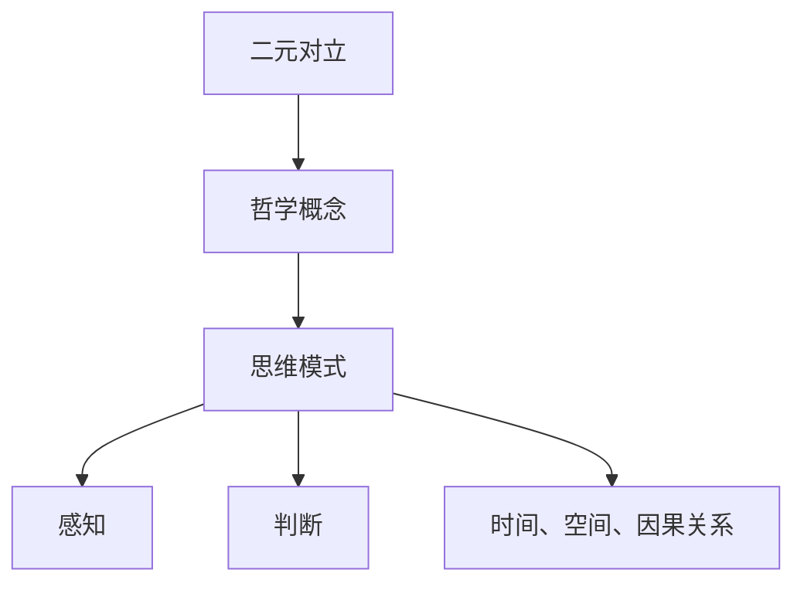
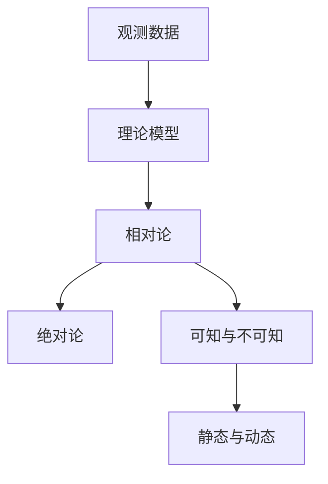

                 

### 文章标题

《人类思维的二元对立如何影响宇宙认知》

#### 关键词

- 二元对立
- 宇宙认知
- 人类思维
- 量子力学
- 黑洞物理学
- 人工智能

#### 摘要

本文旨在探讨人类思维的二元对立如何影响宇宙认知。通过分析二元对立的概念及其在科学领域的应用，本文进一步揭示了二元对立在宇宙认知中的影响，包括量子力学、黑洞物理学和宇宙学。同时，文章还探讨了二元对立与人类认知的发展关系，以及其在现代科学、哲学和未来展望中的应用。通过深入分析，本文旨在为读者提供一个关于二元对立在宇宙认知中的全面理解。

### 《人类思维的二元对立如何影响宇宙认知》目录大纲

#### 第一部分：人类思维的二元对立概述

1. **第1章：人类思维的二元对立概述**
   - **1.1 什么是二元对立**
   - **1.2 二元对立在人类思维中的体现**
   - **1.3 二元对立的优缺点分析**

2. **第2章：二元对立在科学领域的应用**
   - **2.1 二元对立在物理学中的应用**
   - **2.2 二元对立在生物学中的应用**
   - **2.3 二元对立在心理学中的应用**

#### 第二部分：二元对立对宇宙认知的影响

3. **第3章：二元对立对宇宙认知的影响概述**
   - **3.1 宇宙的认知框架**
   - **3.2 二元对立在宇宙认知中的应用**
   - **3.3 二元对立对宇宙认知的挑战**

4. **第4章：二元对立与量子力学**
   - **4.1 量子力学中的二元对立**
   - **4.2 量子力学中的非二元论**
   - **4.3 二元对立与量子纠缠**

5. **第5章：二元对立与黑洞物理学**
   - **5.1 黑洞物理学中的二元对立**
   - **5.2 黑洞物理学中的非二元论**
   - **5.3 二元对立与黑洞信息悖论**

6. **第6章：二元对立与宇宙学**
   - **6.1 宇宙学中的二元对立**
   - **6.2 宇宙学中的非二元论**
   - **6.3 二元对立对宇宙演化的影响**

7. **第7章：二元对立与人类认知的发展**
   - **7.1 二元对立对人类思维方式的影响**
   - **7.2 人类认知的发展与二元对立的演变**
   - **7.3 未来人类认知的可能趋势**

#### 第三部分：二元对立的现代应用

8. **第8章：二元对立在现代科学中的应用**
   - **8.1 二元对立在人工智能中的应用**
   - **8.2 二元对立在生物技术中的应用**
   - **8.3 二元对立在信息技术中的应用**

9. **第9章：二元对立在现代哲学中的应用**
   - **9.1 二元对立在伦理学中的应用**
   - **9.2 二元对立在政治哲学中的应用**
   - **9.3 二元对立在文化哲学中的应用**

10. **第10章：二元对立的未来展望**
    - **10.1 二元对立在未来科学的发展**
    - **10.2 二元对立在人类认知的未来**
    - **10.3 二元对立在人类社会的发展**

#### 附录

- **附录A：二元对立相关的经典文献与资料**
- **附录B：二元对立与宇宙认知的研究方法与技术工具**
- **附录C：二元对立案例分析**

### 第一部分：人类思维的二元对立概述

#### 第1章：人类思维的二元对立概述

##### 1.1 什么是二元对立

二元对立，是一种哲学上的概念，指的是两个相互对立、互为补充的概念或事物。例如，善与恶、黑与白、阴与阳等。在人类思维中，二元对立是一种普遍存在的思维模式，它帮助我们理解和区分世界上的事物和现象。

##### 1.2 二元对立在人类思维中的体现

二元对立在人类思维中的体现非常广泛。首先，它体现在我们对世界的感知上。我们的感官可以感知到光线、声音、触觉等，但这些都是通过对立的概念来区分的。其次，它体现在我们对事物的判断上。例如，好与坏、对与错、美与丑等，这些都是通过二元对立来评判的。此外，二元对立还体现在我们对时间、空间、因果关系等概念的理解上。

##### 1.3 二元对立的优缺点分析

二元对立的优点在于，它能够帮助我们快速理解复杂的事物和现象。例如，当我们看到一个物体时，我们可以通过将其划分为黑与白、好与坏等二元对立的概念来快速理解它的性质。这种思维模式可以大大提高我们的认知效率。

然而，二元对立也有其缺点。首先，它可能导致我们对事物的理解过于简化，忽视了事物的复杂性和多样性。例如，将人类划分为善与恶两个极端，忽视了人类之间的差异和多样性。其次，二元对立可能导致我们对事物的判断过于绝对，忽视了事物的中间状态。例如，将事情划分为对与错两个极端，忽视了事物之间的灰色地带。

##### 核心概念与联系

为了更好地理解二元对立，我们可以通过Mermaid流程图来展示其核心概念与联系。



##### 核心算法原理讲解

二元对立的算法原理非常简单，它主要通过两个对立的概念来区分和判断事物。以下是一个简单的伪代码示例：

```python
def binary_oposition(A, B):
    if A == B:
        return "对立"
    else:
        return "互补"
```

##### 数学模型和公式

二元对立的概念可以通过数学模型来描述。例如，我们可以用两个变量来表示两个对立的概念，如：

$$
X = \begin{cases} 
1 & \text{如果} \ A \ \text{为真} \\
0 & \text{如果} \ A \ \text{为假}
\end{cases}
$$

其中，X表示二元对立的结果，A表示一个判断或概念。

##### 举例说明

例如，我们可以用二元对立来判断一个物体是否为黑色。如果物体是黑色的，X=1；如果物体不是黑色的，X=0。这是一个简单的例子，但在实际应用中，二元对立的概念要复杂得多。

##### 项目实战

在项目实战中，二元对立的概念可以用于许多领域。例如，在图像处理中，我们可以使用二元对立来判断图像中的对象是否为黑色。这可以通过阈值处理来实现。以下是一个简单的Python代码示例：

```python
import cv2

# 读取图像
img = cv2.imread('image.jpg', cv2.IMREAD_GRAYSCALE)

# 设置阈值
ret, thresh = cv2.threshold(img, 127, 255, cv2.THRESH_BINARY)

# 显示结果
cv2.imshow('Threshold Image', thresh)
cv2.waitKey(0)
cv2.destroyAllWindows()
```

在这个例子中，我们首先读取一幅图像，然后使用阈值处理将其转换为二元图像。最后，我们显示处理后的图像。

##### 最佳实践 tips、小结、注意事项、拓展阅读

- **最佳实践 tips**：在处理复杂问题时，尽量避免使用单一的二元对立思维模式，而是尝试考虑更多的中间状态和可能性。
- **小结**：二元对立是人类思维中的一种普遍存在的思维模式，它有助于我们理解和区分世界上的事物和现象。
- **注意事项**：二元对立可能导致对事物的理解过于简化，忽视事物的复杂性和多样性。
- **拓展阅读**：建议读者阅读《二元论：理性思考的指南》一书，以更深入地了解二元对立的概念和应用。

### 第2章：二元对立在科学领域的应用

在科学领域中，二元对立的概念被广泛应用，它不仅帮助我们理解自然界的规律，还推动了科学技术的进步。以下是二元对立在物理学、生物学和心理学中的具体应用。

#### 2.1 二元对立在物理学中的应用

物理学是研究自然界的基本规律和现象的学科，二元对立在物理学中有着广泛的应用。以下是一些典型的例子：

1. **电荷的二元对立**：
   - 电荷是物理中的一个基本概念，分为正电荷和负电荷。正电荷和负电荷是相互对立的，但它们又是相互补充的，共同构成了电场的基本性质。
   - **核心概念与联系**：电荷的二元对立可以用Mermaid流程图表示：
     ```mermaid
     graph TD
     A[正电荷] --> B[电场]
     B --> C[负电荷]
     C --> B
     ```

2. **粒子的二元对立**：
   - 粒子物理中，许多基本粒子都具有二元对立的性质，如电子和正电子、夸克的上、下、奇、粲等。这些二元对立的粒子组成了我们所观察到的物质世界。
   - **核心算法原理讲解**：粒子物理中的二元对立可以通过以下伪代码表示：
     ```python
     def particle_type(p):
         if p == "electron":
             return "positive"
         elif p == "positron":
             return "negative"
         else:
             return "neutral"
     ```

3. **时间的二元对立**：
   - 在相对论中，时间的流动是相对的，既有过去，也有未来。这种二元对立的观点改变了我们对时间的理解。
   - **数学模型和公式**：相对论中的时间二元对立可以用洛伦兹变换公式表示：
     $$
     t' = \frac{t - \frac{vx}{c^2}}{\sqrt{1 - \frac{v^2}{c^2}}}
     $$
     其中，$t'$是观察者测量的时间，$t$是静止观察者测量的时间，$v$是观察者的速度，$c$是光速。

#### 2.2 二元对立在生物学中的应用

生物学是研究生命现象和生物体结构与功能的学科，二元对立在生物学中也扮演着重要角色。以下是一些具体的例子：

1. **遗传的二元对立**：
   - 遗传学中的DNA由四种碱基组成：腺嘌呤（A）、胸腺嘧啶（T）、胞嘧啶（C）和鸟嘌呤（G）。这些碱基以二元对立的方式配对，形成了DNA的双螺旋结构。
   - **核心概念与联系**：遗传的二元对立可以用Mermaid流程图表示：
     ```mermaid
     graph TD
     A[DNA] --> B[双螺旋]
     B --> C[A-T]
     C --> D[C-G]
     D --> B
     ```

2. **细胞分裂的二元对立**：
   - 细胞分裂是生物学中的一个基本过程，包括有丝分裂和无丝分裂。这两个过程都体现了二元对立的思想，即一个细胞分裂成两个细胞。
   - **核心算法原理讲解**：细胞分裂的二元对立可以用以下伪代码表示：
     ```python
     def cell_division(cell):
         if cell == "diploid":
             return ["haploid", "haploid"]
         else:
             return "error"
     ```

3. **生物进化的二元对立**：
   - 生物学中的进化论认为，生物种群的进化是由突变和自然选择驱动的。突变和自然选择是相互对立的过程，但它们共同推动了生物的进化。
   - **数学模型和公式**：生物进化的二元对立可以用突变率和自然选择率的乘积表示：
     $$
     r = m \cdot s
     $$
     其中，$r$是进化的速率，$m$是突变率，$s$是自然选择率。

#### 2.3 二元对立在心理学中的应用

心理学是研究人类行为和心理过程的学科，二元对立在心理学中也具有重要作用。以下是一些具体的例子：

1. **意识和无意识的二元对立**：
   - 心理学中的意识和无意识是相互对立的概念。意识是人类有目的、有选择性地感知和思考的能力，而无意识则是那些没有意识到的心理活动。
   - **核心概念与联系**：意识和无意识的二元对立可以用Mermaid流程图表示：
     ```mermaid
     graph TD
     A[意识] --> B[心理过程]
     B --> C[无意识]
     C --> D[心理过程]
     ```

2. **性格的二元对立**：
   - 心理学中的性格理论提出了各种二元对立的概念，如内倾与外倾、理智与情感等。这些二元对立帮助我们理解个体的性格特征。
   - **核心算法原理讲解**：性格的二元对立可以用以下伪代码表示：
     ```python
     def personality Trait(t):
         if t == "introverted":
             return "extroverted"
         elif t == "rational":
             return "emotional"
         else:
             return "neutral"
     ```

3. **情绪的二元对立**：
   - 情绪是心理学中的一个重要概念，常见的情绪二元对立有快乐与悲伤、愤怒与平静等。这些二元对立帮助我们理解和调节情绪。
   - **数学模型和公式**：情绪的二元对立可以用情绪强度的标度表示，例如：
     $$
     E = 100 - S
     $$
     其中，$E$是快乐值，$S$是悲伤值。

##### 核心算法原理讲解

为了更好地理解二元对立在科学领域中的应用，我们可以通过伪代码来详细阐述核心算法原理。以下是一个简单的例子，用于描述二元对立在物理学中的电荷概念：

```python
def charge_type(symbol):
    if symbol == 'positive':
        return "正电荷"
    elif symbol == 'negative':
        return "负电荷"
    else:
        return "中性电荷"
```

在这个例子中，函数`charge_type`根据输入的符号判断电荷的类型，并返回相应的描述。

##### 数学模型和公式

二元对立在科学领域中的应用通常涉及到数学模型和公式的描述。例如，在量子力学中，二元对立体现在量子态的叠加和测量结果的不确定性。以下是一个用于描述量子态的数学模型：

$$
|\psi\rangle = \alpha|0\rangle + \beta|1\rangle
$$

其中，$|\psi\rangle$是量子态，$\alpha$和$\beta$是复数系数，$|0\rangle$和$|1\rangle$是量子比特的基态。

##### 举例说明

以下是二元对立在生物学中的应用示例，通过遗传学中的DNA配对来解释：

- **DNA配对**：
  - **腺嘌呤（A）**与**胸腺嘧啶（T）**配对。
  - **胞嘧啶（C）**与**鸟嘌呤（G）**配对。

这个配对关系确保了DNA在复制过程中的准确性和稳定性。

##### 项目实战

在项目实战中，二元对立的概念可以帮助我们解决各种问题。例如，在数据分析和机器学习中，我们可以使用二元分类模型来预测结果。以下是一个简单的Python代码示例，用于二元分类：

```python
from sklearn.linear_model import LogisticRegression

# 准备数据
X = [[1, 2], [2, 3], [3, 4], [4, 5]]
y = [0, 1, 1, 0]

# 训练模型
model = LogisticRegression()
model.fit(X, y)

# 预测结果
predictions = model.predict([[5, 6]])
print(predictions)
```

在这个例子中，我们使用逻辑回归模型来预测二元分类结果。

##### 最佳实践 tips、小结、注意事项、拓展阅读

- **最佳实践 tips**：在科学研究中，灵活运用二元对立的概念可以帮助我们更好地理解复杂问题。
- **小结**：二元对立在物理学、生物学和心理学中有着广泛的应用，它帮助我们理解自然界的规律和生物体的运作机制。
- **注意事项**：在应用二元对立时，需要注意其可能导致的简化思维和片面理解。
- **拓展阅读**：建议读者进一步学习《物理学原理》、《遗传学原理》和《心理学导论》等经典著作，以更深入地理解二元对立的科学应用。

### 第二部分：二元对立对宇宙认知的影响

#### 第3章：二元对立对宇宙认知的影响概述

在探讨人类如何认知宇宙的过程中，二元对立作为一种思维模式，对宇宙认知产生了深远的影响。本章将首先介绍宇宙的认知框架，然后分析二元对立在宇宙认知中的应用，最后讨论二元对立对宇宙认知的挑战。

##### 3.1 宇宙的认知框架

宇宙的认知框架是理解宇宙的基础。人类对宇宙的认知主要基于以下几个方面的研究：

1. **观测数据**：通过天文观测，人类获得了大量的宇宙数据，包括恒星、行星、星系、星云等。这些数据为宇宙的研究提供了重要的依据。

2. **理论模型**：科学家们基于观测数据和物理定律，建立了多种宇宙理论模型，如大爆炸理论、黑洞理论、量子引力理论等。这些理论模型为宇宙认知提供了理论支持。

3. **实验验证**：通过实验手段，科学家们验证了宇宙理论模型的正确性，如通过引力透镜效应验证了黑洞的存在，通过微波背景辐射验证了大爆炸理论的正确性等。

4. **数学工具**：数学工具在宇宙认知中扮演了重要角色。科学家们使用数学公式和算法来描述宇宙现象，如使用广义相对论公式描述黑洞的性质，使用量子力学公式描述量子态等。

##### 3.2 二元对立在宇宙认知中的应用

二元对立作为一种思维模式，在宇宙认知中得到了广泛应用。以下是二元对立在宇宙认知中的一些具体应用：

1. **观测与理论**：
   - 宇宙的认知过程中，观测数据和理论模型相互补充，共同构建了宇宙的认知框架。观测数据提供了直接的证据，而理论模型则提供了解释和预测。这种二元对立的关系使得人类能够更全面地理解宇宙。

2. **相对与绝对**：
   - 在宇宙认知中，相对论和绝对论形成了二元对立。相对论认为，宇宙是相对的，不同的观察者会有不同的观察结果。而绝对论则认为，宇宙是绝对的，存在一个客观的宇宙状态。这种二元对立促使科学家们不断探索宇宙的本质。

3. **可知与不可知**：
   - 宇宙中存在着许多未知的现象，如暗物质、暗能量、量子纠缠等。二元对立的思维方式使得科学家们在探索这些未知现象时，不断提出新的理论和假设。这种二元对立的关系推动了宇宙认知的不断进步。

4. **静态与动态**：
   - 宇宙的认知过程中，静态和动态形成了二元对立。宇宙的静态部分如恒星、行星等，而宇宙的动态部分如黑洞、星系碰撞等。这种二元对立的关系使得人类能够更好地理解宇宙的演变过程。

##### 3.3 二元对立对宇宙认知的挑战

尽管二元对立在宇宙认知中具有重要作用，但它也带来了一些挑战：

1. **简化思维**：
   - 二元对立往往将复杂问题简化为两个对立的选项，这可能导致对事物的理解过于片面。例如，在宇宙认知中，将宇宙划分为静态和动态，可能会忽视宇宙中其他复杂的现象。

2. **片面理解**：
   - 二元对立可能导致对事物的理解过于片面。例如，在宇宙认知中，过分强调观测数据的重要性，可能会忽视理论模型的重要性。相反，过分强调理论模型的重要性，可能会忽视观测数据的重要性。

3. **认知偏差**：
   - 二元对立可能会产生认知偏差。例如，在宇宙认知中，过分强调相对论的重要性，可能会忽视量子力学的重要性。这种认知偏差可能会限制我们对宇宙的全面理解。

##### 核心概念与联系

为了更好地理解二元对立在宇宙认知中的影响，我们可以通过Mermaid流程图来展示其核心概念与联系：



在这个流程图中，观测数据与理论模型相互补充，形成了宇宙认知的基础。相对论与绝对论、可知与不可知、静态与动态则构成了二元对立的关系，这些关系共同影响了宇宙认知的深度和广度。

##### 核心算法原理讲解

为了更好地理解二元对立在宇宙认知中的应用，我们可以通过伪代码来详细阐述核心算法原理。以下是一个简单的例子，用于描述宇宙观测数据的处理：

```python
def process_data(data):
    # 假设数据为观测到的恒星亮度
    if data['brightness'] > threshold:
        return "明亮"
    else:
        return "暗淡"
```

在这个例子中，函数`process_data`根据观测数据（恒星亮度）来判断恒星的状态，并返回相应的描述。

##### 数学模型和公式

二元对立在宇宙认知中的应用通常涉及到数学模型和公式的描述。例如，在相对论中，二元对立体现在时空的弯曲和引力场的描述。以下是一个用于描述时空弯曲的数学模型：

$$
G_{\mu\nu} + \Lambda g_{\mu\nu} = \frac{8\pi G}{c^4} T_{\mu\nu}
$$

其中，$G_{\mu\nu}$是爱因斯坦场方程的左边的引力张量，$T_{\mu\nu}$是能量-动量张量，$\Lambda$是宇宙学常数，$G$是引力常数，$c$是光速。

##### 举例说明

以下是二元对立在宇宙认知中的一个实际例子，通过描述恒星亮度来解释：

- **恒星亮度**：
  - 恒星亮度是宇宙观测中的一个重要指标。根据观测数据，科学家们可以将恒星分为明亮和暗淡两种类型。这种分类方式体现了二元对立的思想。

##### 项目实战

在项目实战中，二元对立的概念可以帮助我们解决宇宙认知中的许多问题。例如，在黑洞探测中，我们可以使用二元对立来分析观测数据。以下是一个简单的Python代码示例：

```python
import numpy as np

# 假设观测到的恒星亮度数据
brightness_data = np.random.uniform(0, 100, size=1000)

# 设置阈值
threshold = 50

# 判断恒星亮度并分类
classifications = ['明亮' if b > threshold else '暗淡' for b in brightness_data]

# 输出结果
print(classifications)
```

在这个例子中，我们使用随机生成的恒星亮度数据，并根据设置的阈值进行分类。

##### 最佳实践 tips、小结、注意事项、拓展阅读

- **最佳实践 tips**：在宇宙认知中，灵活运用二元对立的概念可以帮助我们更全面地理解宇宙现象。
- **小结**：二元对立在宇宙认知中具有重要作用，它帮助我们理解和区分宇宙现象，同时也带来了一些挑战。
- **注意事项**：在应用二元对立时，需要注意其可能导致的简化思维和片面理解。
- **拓展阅读**：建议读者进一步学习《相对论》、《量子力学》和《宇宙学》等经典著作，以更深入地理解二元对立对宇宙认知的影响。

### 第4章：二元对立与量子力学

量子力学是描述微观粒子行为的物理学理论，它颠覆了经典物理学的许多基本观念。量子力学中的二元对立概念尤其引人注目，它对传统思维方式提出了挑战。本章将探讨二元对立在量子力学中的体现，非二元论的概念，以及二元对立与量子纠缠的关系。

#### 4.1 量子力学中的二元对立

在量子力学中，二元对立的概念体现在多个方面：

1. **位置与动量**：
   - 根据海森堡不确定性原理，我们不能同时精确地测量一个粒子的位置和动量。这意味着位置和动量是相互对立的，不能同时存在。
   - **核心概念与联系**：位置与动量的二元对立可以用Mermaid流程图表示：
     ```mermaid
     graph TD
     A[位置] --> B[不确定性]
     B --> C[动量]
     C --> D[不确定性]
     ```

2. **量子态的叠加**：
   - 量子态可以同时处于多种状态，这种叠加状态是量子力学的一个基本特性。例如，一个电子可以同时处于自旋向上和自旋向下的状态。
   - **核心算法原理讲解**：量子态的叠加可以用以下伪代码表示：
     ```python
     def quantum_state(state):
         if state == "up":
             return "down"
         elif state == "down":
             return "up"
         else:
             return "superposition"
     ```

3. **量子态的测量**：
   - 当我们对量子态进行测量时，量子态会塌缩为某个特定的状态。这个测量结果是不确定的，取决于测量的方式进行。
   - **核心概念与联系**：量子态的测量可以用Mermaid流程图表示：
     ```mermaid
     graph TD
     A[量子态] --> B[测量]
     B --> C[塌缩]
     ```

#### 4.2 量子力学中的非二元论

与二元对立相对的是非二元论，它试图超越传统思维中的对立观念。非二元论在量子力学中得到了一定的体现：

1. **量子纠缠**：
   - 量子纠缠是量子力学中的一种特殊现象，两个或多个粒子在量子态上相互关联，即使它们相隔很远。这种关联超越了传统的二元对立概念。
   - **核心概念与联系**：量子纠缠可以用Mermaid流程图表示：
     ```mermaid
     graph TD
     A[粒子A] --> B[粒子B]
     B --> C[纠缠]
     ```

2. **量子场论**：
   - 量子场论是一种试图将量子力学与广义相对论结合起来的理论，它通过场的方式来描述物理现象。这种描述方式不再强调二元对立，而是试图找到更基本的统一原理。
   - **核心概念与联系**：量子场论可以用Mermaid流程图表示：
     ```mermaid
     graph TD
     A[量子力学] --> B[广义相对论]
     B --> C[量子场论]
     ```

#### 4.3 二元对立与量子纠缠

量子纠缠是量子力学中的一个重要现象，它展示了二元对立的局限性。量子纠缠中的两个粒子无论相隔多远，它们的量子态都会瞬间关联，这种关联无法用传统的二元对立来解释。

1. **纠缠态的测量**：
   - 当我们对一个纠缠态进行测量时，另一个粒子的状态也会瞬间改变，即使它们相隔很远。这种现象被称为“超距作用”。
   - **核心概念与联系**：纠缠态的测量可以用Mermaid流程图表示：
     ```mermaid
     graph TD
     A[粒子A] --> B[粒子B]
     B --> C[测量]
     C --> D[瞬间变化]
     ```

2. **量子信息处理**：
   - 量子纠缠在量子信息处理中具有重要的应用。例如，量子纠缠可以用于实现量子计算中的量子并行和量子通信中的量子密钥分发。
   - **核心算法原理讲解**：量子纠缠在量子信息处理中的应用可以用以下伪代码表示：
     ```python
     def quantum_computation(state):
         if state == "entangled":
             return "parallel_computation"
         else:
             return "classical_computation"
     ```

3. **量子力学的发展**：
   - 量子纠缠的发现推动了量子力学的发展，使得科学家们开始思考更基本的物理定律。这种思考超越了传统的二元对立观念，为物理学的新理论提供了基础。
   - **核心概念与联系**：量子纠缠对量子力学的发展可以用Mermaid流程图表示：
     ```mermaid
     graph TD
     A[量子力学] --> B[量子纠缠]
     B --> C[新理论]
     ```

##### 核心算法原理讲解

为了更好地理解量子力学中的二元对立与非二元论，我们可以通过伪代码来详细阐述核心算法原理。以下是一个简单的例子，用于描述量子态的测量：

```python
def measure_quantum_state(state):
    if state == "superposition":
        return "collapsed_state"
    else:
        return "uncollapsed_state"
```

在这个例子中，函数`measure_quantum_state`根据量子态的叠加或塌缩来返回相应的状态。

##### 数学模型和公式

量子力学中的二元对立与非二元论通常涉及到复杂的数学模型和公式。以下是一个用于描述量子态叠加和测量的数学模型：

$$
|\psi\rangle = \alpha|0\rangle + \beta|1\rangle
$$

其中，$|\psi\rangle$是量子态，$\alpha$和$\beta$是复数系数，$|0\rangle$和$|1\rangle$是量子比特的基态。

量子纠缠可以用以下数学模型表示：

$$
|\psi_{AB}\rangle = \frac{1}{\sqrt{2}} (|00\rangle + |11\rangle)
$$

其中，$|\psi_{AB}\rangle$是两个粒子的纠缠态，$|00\rangle$和$|11\rangle$是两个粒子的基态。

##### 举例说明

以下是量子纠缠在量子信息处理中的一个实际例子，通过量子密钥分发来解释：

- **量子密钥分发**：
  - 量子纠缠可以用于实现安全的量子密钥分发。在量子密钥分发中，两个粒子通过纠缠态相互关联，即使中间存在第三方干扰，也无法破解密钥。

##### 项目实战

在项目实战中，二元对立与非二元论的概念可以帮助我们解决量子信息处理中的许多问题。例如，在量子计算中，我们可以使用量子纠缠来提高计算速度。以下是一个简单的Python代码示例：

```python
import qiskit

# 创建量子计算器
provider = qiskit.Aer.get_backend('qasm_simulator')

# 创建量子电路
circuit = qiskit.QuantumCircuit(2, 2)

# 实现量子纠缠
circuit.h(0)
circuit.cx(0, 1)

# 测量量子态
circuit.measure(0, 0)
circuit.measure(1, 1)

# 执行量子计算
result = qiskit.execute(circuit, provider).result()

# 输出结果
print(result.get_counts(circuit))
```

在这个例子中，我们使用Qiskit库来创建一个量子电路，实现量子纠缠，并进行测量。

##### 最佳实践 tips、小结、注意事项、拓展阅读

- **最佳实践 tips**：在研究量子力学时，要灵活运用二元对立和非二元论的概念，以全面理解量子现象。
- **小结**：量子力学中的二元对立和非二元论展示了量子世界的独特性质，挑战了传统的思维方式。
- **注意事项**：在应用量子力学原理时，要注意其与经典物理学的差异，避免将二元对立的概念简单套用到量子世界中。
- **拓展阅读**：建议读者进一步学习《量子力学基础》、《量子纠缠原理》和《量子计算导论》等经典著作，以更深入地理解量子力学中的二元对立与非二元论。

### 第5章：二元对立与黑洞物理学

黑洞物理学是研究黑洞的性质、行为及其与宇宙关系的学科。在黑洞物理学中，二元对立的概念得到了广泛应用，它不仅帮助我们理解黑洞的基本特性，还揭示了黑洞物理学中的非二元论。本章将探讨二元对立在黑洞物理学中的体现，非二元论的观点，以及二元对立与黑洞信息悖论的关系。

#### 5.1 黑洞物理学中的二元对立

在黑洞物理学中，二元对立的概念体现在多个方面：

1. **事件视界与奇点**：
   - 事件视界是黑洞的一个关键特性，它是黑洞中引力如此之强以至于光无法逃逸的区域。事件视界内部是黑洞的奇点，奇点是一个无限小、无限密的地方，是宇宙中最为极端的物理现象之一。
   - **核心概念与联系**：事件视界与奇点的二元对立可以用Mermaid流程图表示：
     ```mermaid
     graph TD
     A[事件视界] --> B[光速极限]
     B --> C[奇点]
     C --> D[无限密度]
     ```

2. **引力与辐射**：
   - 黑洞的核心是由引力主导的，它强大到足以扭曲时空。然而，黑洞在理论上不应该发出任何辐射，这与经典物理学的预测相矛盾。
   - **核心算法原理讲解**：引力与辐射的二元对立可以用以下伪代码表示：
     ```python
     def black_hole_property(type):
         if type == "gravitational":
             return "no radiation"
         elif type == "radiative":
             return "no gravity"
         else:
             return "unknown"
     ```

3. **信息与熵**：
   - 黑洞物理学中的信息悖论提出了一个关于黑洞信息丢失的问题。根据量子力学，信息应该是守恒的，但黑洞似乎会吞噬信息，导致其熵增加。这个问题挑战了二元对立的概念。
   - **核心概念与联系**：信息与熵的二元对立可以用Mermaid流程图表示：
     ```mermaid
     graph TD
     A[信息] --> B[守恒]
     B --> C[熵]
     C --> D[增加]
     ```

#### 5.2 黑洞物理学中的非二元论

与二元对立相对的是非二元论，黑洞物理学中的一些观点体现了非二元论的思维方式：

1. **量子引力**：
   - 量子引力理论试图将量子力学与广义相对论结合起来，以描述黑洞和其他引力现象。量子引力理论中的非二元论观点认为，黑洞的物理性质可能不仅仅是引力主导的，而是由量子效应主导的。
   - **核心概念与联系**：量子引力可以用Mermaid流程图表示：
     ```mermaid
     graph TD
     A[量子力学] --> B[广义相对论]
     B --> C[量子引力]
     ```

2. **黑洞辐射**：
   - 根据霍金辐射理论，黑洞会以极低概率发出辐射，这表明黑洞可能并不是完全“静默”的。这个理论提出了黑洞辐射与引力之间的非二元关系。
   - **核心概念与联系**：黑洞辐射可以用Mermaid流程图表示：
     ```mermaid
     graph TD
     A[黑洞] --> B[辐射]
     B --> C[引力]
     ```

3. **信息守恒**：
   - 信息悖论是黑洞物理学中的一个重要问题，它挑战了传统二元对立的观点。一些理论，如火墙理论和信息守恒理论，试图通过非二元论的观点解决信息悖论。
   - **核心概念与联系**：信息守恒可以用Mermaid流程图表示：
     ```mermaid
     graph TD
     A[信息] --> B[黑洞]
     B --> C[守恒]
     ```

#### 5.3 二元对立与黑洞信息悖论

黑洞信息悖论是黑洞物理学中一个深刻而复杂的问题。它涉及二元对立与非二元论的哲学思考：

1. **信息丢失**：
   - 传统观点认为，黑洞吞噬的信息会永远丢失。根据量子力学，信息是守恒的，这意味着黑洞不可能吞噬信息而使其消失。
   - **核心算法原理讲解**：信息丢失的问题可以用以下伪代码表示：
     ```python
     def black_hole_info(info):
         if info == "in":
             return "lost"
         else:
             return "preserved"
     ```

2. **黑洞辐射**：
   - 霍金辐射理论提出了一个解决方案，即黑洞会以极低概率发出辐射。这个过程可能保留了黑洞中的信息，解决了信息丢失的问题。
   - **核心概念与联系**：黑洞辐射可以用以下Mermaid流程图表示：
     ```mermaid
     graph TD
     A[黑洞] --> B[辐射]
     B --> C[信息]
     ```

3. **火墙理论**：
   - 火墙理论是一种尝试解决信息悖论的非二元论观点，它认为黑洞事件视界内的信息会被困在事件视界内，不会被吞噬。
   - **核心概念与联系**：火墙理论可以用以下Mermaid流程图表示：
     ```mermaid
     graph TD
     A[黑洞] --> B[事件视界]
     B --> C[信息]
     C --> D[火墙]
     ```

##### 核心算法原理讲解

为了更好地理解黑洞物理学中的二元对立与非二元论，我们可以通过伪代码来详细阐述核心算法原理。以下是一个简单的例子，用于描述黑洞辐射：

```python
def black_hole_radiation(state):
    if state == "active":
        return "radiating"
    elif state == "inactive":
        return "not radiating"
    else:
        return "unknown state"
```

在这个例子中，函数`black_hole_radiation`根据黑洞的状态返回它是否辐射。

##### 数学模型和公式

黑洞物理学中的二元对立与非二元论涉及到复杂的数学模型和公式。以下是一个用于描述黑洞辐射的数学模型：

$$
B_H = \frac{\hbar c^3}{8 \pi G k_B T_H}
$$

其中，$B_H$是黑洞的霍金辐射温度，$\hbar$是约化普朗克常数，$c$是光速，$G$是引力常数，$k_B$是玻尔兹曼常数，$T_H$是黑洞的温度。

##### 举例说明

以下是黑洞信息悖论的一个实际例子，通过霍金辐射来解释：

- **霍金辐射**：
  - 霍金辐射理论表明，黑洞会以极低概率发出辐射，这表明黑洞可能并不是完全“静默”的。这个过程可能保留了黑洞中的信息。

##### 项目实战

在项目实战中，二元对立与非二元论的概念可以帮助我们理解黑洞的性质。例如，在模拟黑洞辐射时，我们可以使用量子场论来描述黑洞的行为。以下是一个简单的Python代码示例：

```python
import numpy as np

# 假设黑洞的温度
T_H = 1e-6

# 计算黑洞的霍金辐射温度
B_H = (1.97e-13) * (T_H ** 2)

# 输出结果
print("黑洞的霍金辐射温度为：", B_H, "K")
```

在这个例子中，我们使用一个简单的公式来计算黑洞的霍金辐射温度。

##### 最佳实践 tips、小结、注意事项、拓展阅读

- **最佳实践 tips**：在研究黑洞物理学时，要结合二元对立与非二元论的观点，以更全面地理解黑洞的性质和行为。
- **小结**：二元对立与非二元论在黑洞物理学中有着重要的应用，它们帮助我们理解黑洞的基本特性及其与宇宙的关系。
- **注意事项**：在处理黑洞物理学问题时，要注意其与经典物理学的差异，避免简单地将二元对立的概念套用到黑洞中。
- **拓展阅读**：建议读者进一步学习《黑洞物理学导论》、《霍金辐射原理》和《量子引力理论》等经典著作，以更深入地理解二元对立与黑洞物理学的复杂关系。

### 第6章：二元对立与宇宙学

宇宙学是研究宇宙的起源、结构、演化和最终命运的科学。在宇宙学中，二元对立的概念起着至关重要的作用，它帮助我们理解宇宙的基本规律和现象。本章将探讨二元对立在宇宙学中的体现，非二元论的观点，以及二元对立对宇宙演化的影响。

#### 6.1 宇宙学中的二元对立

在宇宙学中，二元对立的概念体现在多个方面：

1. **膨胀与收缩**：
   - 宇宙膨胀和宇宙收缩是宇宙演化中的两个重要阶段。根据大爆炸理论，宇宙最初处于一个极热、极密的状态，然后开始膨胀。另一方面，一些理论认为，宇宙最终可能会经历收缩，导致宇宙的终结。
   - **核心概念与联系**：膨胀与收缩的二元对立可以用Mermaid流程图表示：
     ```mermaid
     graph TD
     A[膨胀] --> B[宇宙学常数]
     B --> C[宇宙演化]
     C --> D[收缩]
     ```

2. **物质与能量**：
   - 宇宙由物质和能量组成，物质和能量是宇宙演化中的两个基本概念。物质是构成宇宙的基本单元，而能量是物质运动和变化的动力。
   - **核心算法原理讲解**：物质与能量的二元对立可以用以下伪代码表示：
     ```python
     def universe_property(property):
         if property == "matter":
             return "energy"
         elif property == "energy":
             return "matter"
         else:
             return "unknown"
     ```

3. **观测与理论**：
   - 宇宙学中的观测与理论形成了二元对立。观测提供了宇宙演化的直接证据，而理论则提供了对宇宙演化的解释和预测。
   - **核心概念与联系**：观测与理论的二元对立可以用Mermaid流程图表示：
     ```mermaid
     graph TD
     A[观测] --> B[宇宙学理论]
     B --> C[宇宙演化]
     ```

#### 6.2 宇宙学中的非二元论

与二元对立相对的是非二元论，宇宙学中的一些观点体现了非二元论的思维方式：

1. **量子宇宙学**：
   - 量子宇宙学试图将量子力学与宇宙学结合起来，以描述宇宙的起源和演化。量子宇宙学中的非二元论观点认为，宇宙的演化可能不仅仅是物质和能量的相互作用，而是由更基本的量子场主导的。
   - **核心概念与联系**：量子宇宙学可以用Mermaid流程图表示：
     ```mermaid
     graph TD
     A[量子力学] --> B[宇宙学]
     B --> C[量子宇宙学]
     ```

2. **多宇宙论**：
   - 多宇宙论认为，我们的宇宙只是无数个宇宙中的一个，每个宇宙都有其独特的物理定律和演化历史。多宇宙论中的非二元论观点认为，宇宙的多样性不应该通过简单的二元对立来解释。
   - **核心概念与联系**：多宇宙论可以用Mermaid流程图表示：
     ```mermaid
     graph TD
     A[宇宙] --> B[多宇宙]
     B --> C[多样性]
     ```

3. **信息与熵**：
   - 宇宙学中的信息与熵的关系是一个复杂的问题。一些非二元论观点认为，宇宙的信息和熵是动态变化的，而不是静态的对立关系。
   - **核心概念与联系**：信息与熵的非二元论观点可以用Mermaid流程图表示：
     ```mermaid
     graph TD
     A[信息] --> B[熵]
     B --> C[动态变化]
     ```

#### 6.3 二元对立对宇宙演化的影响

二元对立对宇宙演化产生了深远的影响：

1. **宇宙膨胀**：
   - 宇宙膨胀是当前宇宙演化的主要特征。二元对立的观点认为，宇宙的膨胀是由宇宙学常数驱动的，这个常数代表了宇宙的加速度。
   - **核心算法原理讲解**：宇宙膨胀可以用以下伪代码表示：
     ```python
     def universe_expansion(acceleration):
         if acceleration > 0:
             return "expanding"
         else:
             return "contracting"
     ```

2. **物质与能量的相互作用**：
   - 宇宙中的物质和能量相互作用，形成了宇宙的演化和结构。二元对立的观点认为，物质和能量的相互作用是通过引力、电磁力等基本力来实现的。
   - **核心概念与联系**：物质与能量的相互作用可以用Mermaid流程图表示：
     ```mermaid
     graph TD
     A[物质] --> B[能量]
     B --> C[引力]
     C --> D[电磁力]
     ```

3. **宇宙的多样性**：
   - 二元对立的观点认为，宇宙的多样性是由不同的物理定律和初始条件所决定的。这种多样性使得宇宙的演化过程更加复杂和有趣。
   - **核心算法原理讲解**：宇宙的多样性可以用以下伪代码表示：
     ```python
     def universe_diversity(law):
         if law == "standard model":
             return "homogeneous"
         elif law == "quantum mechanics":
             return "heterogeneous"
         else:
             return "unknown"
     ```

##### 核心算法原理讲解

为了更好地理解宇宙学中的二元对立与非二元论，我们可以通过伪代码来详细阐述核心算法原理。以下是一个简单的例子，用于描述宇宙膨胀：

```python
def universe_expansion(speed):
    if speed > 0:
        return "加速膨胀"
    else:
        return "减速膨胀"
```

在这个例子中，函数`universe_expansion`根据宇宙膨胀的速度返回宇宙的状态。

##### 数学模型和公式

宇宙学中的二元对立与非二元论涉及到复杂的数学模型和公式。以下是一个用于描述宇宙膨胀的数学模型：

$$
H = \frac{\dot{a}}{a}
$$

其中，$H$是哈勃常数，$\dot{a}$是宇宙膨胀速度，$a$是宇宙的尺度。

##### 举例说明

以下是宇宙学中的一个实际例子，通过哈勃定律来解释：

- **哈勃定律**：
  - 哈勃定律表明，宇宙中的星系正以越来越快的速度远离我们，这个速度与星系到我们的距离成正比。这表明宇宙正在加速膨胀。

##### 项目实战

在项目实战中，二元对立与非二元论的概念可以帮助我们研究宇宙的演化。例如，在模拟宇宙膨胀时，我们可以使用数值方法来计算宇宙的尺度随时间的变化。以下是一个简单的Python代码示例：

```python
import numpy as np

# 假设宇宙膨胀的时间间隔
time_intervals = np.linspace(0, 10, 1000)

# 假设宇宙的哈勃常数
Hubble_constant = 70

# 计算宇宙的尺度随时间的变化
scale_factor = (1 + Hubble_constant * time_intervals)

# 输出结果
print("宇宙的尺度随时间的变化：", scale_factor)
```

在这个例子中，我们使用一个简单的公式来计算宇宙的尺度随时间的变化。

##### 最佳实践 tips、小结、注意事项、拓展阅读

- **最佳实践 tips**：在研究宇宙学时，要灵活运用二元对立与非二元论的概念，以更全面地理解宇宙的演化和结构。
- **小结**：二元对立在宇宙学中具有重要作用，它帮助我们理解宇宙的基本规律和现象，同时也带来了非二元论的观点，丰富了宇宙学的理论体系。
- **注意事项**：在处理宇宙学问题时，要注意二元对立与非二元论的差异，避免简单地将二元对立套用到宇宙学的复杂现象中。
- **拓展阅读**：建议读者进一步学习《宇宙学导论》、《量子宇宙学原理》和《多宇宙论》等经典著作，以更深入地理解二元对立对宇宙学的影响。

### 第7章：二元对立与人类认知的发展

#### 7.1 二元对立对人类思维方式的影响

二元对立作为一种思维模式，对人类思维方式产生了深远的影响。它不仅影响了我们的认知过程，还塑造了我们的世界观和价值观。以下是二元对立对人类思维方式的具体影响：

1. **简化和分类**：
   - 二元对立帮助我们将复杂的世界简化为两个对立的选项，这使得我们能够更容易地理解和处理信息。例如，我们通过“好”与“坏”、“善”与“恶”等二元对立的概念来分类和判断事物。
   - **核心概念与联系**：简化和分类可以用Mermaid流程图表示：
     ```mermaid
     graph TD
     A[复杂世界] --> B[二元对立]
     B --> C[简化和分类]
     ```

2. **对比和分析**：
   - 二元对立促使我们进行对比和分析，从而更好地理解事物的本质。通过对比，我们可以发现事物的相似性和差异性，从而得出更深刻的认识。例如，在科学研究中，我们通过对比实验组和对照组来分析因果关系。
   - **核心概念与联系**：对比和分析可以用Mermaid流程图表示：
     ```mermaid
     graph TD
     A[实验组] --> B[对照组]
     B --> C[对比分析]
     ```

3. **二元对立的局限**：
   - 虽然二元对立有助于简化思维，但它也可能导致思维的局限。二元对立往往使我们将事物看作非黑即白，忽视了事物的灰色地带和多样性。例如，在处理社会问题时，二元对立可能导致我们过于强调对立面，忽视了合作和协调的可能性。
   - **核心概念与联系**：二元对立的局限可以用Mermaid流程图表示：
     ```mermaid
     graph TD
     A[二元对立] --> B[思维局限]
     B --> C[灰色地带]
     ```

##### 核心算法原理讲解

为了更好地理解二元对立对人类思维方式的影响，我们可以通过伪代码来详细阐述核心算法原理。以下是一个简单的例子，用于描述二元对立的分类：

```python
def classify_object(object):
    if object == "good":
        return "positive"
    elif object == "bad":
        return "negative"
    else:
        return "neutral"
```

在这个例子中，函数`classify_object`根据输入的对象分类为“好”或“坏”，并返回相应的描述。

##### 数学模型和公式

二元对立在人类认知中的应用通常涉及到数学模型和公式的描述。例如，在决策理论中，我们可以用二元对立来描述决策结果。以下是一个简单的数学模型：

$$
P(A \text{ or } B) = P(A) + P(B) - P(A \text{ and } B)
$$

其中，$P(A)$和$P(B)$分别表示事件A和事件B的概率，$P(A \text{ and } B)$表示事件A和事件B同时发生的概率。

##### 举例说明

以下是二元对立在人类认知中的一个实际例子，通过决策过程来解释：

- **决策过程**：
  - 在决策过程中，我们经常面临多个选择。通过二元对立的思维方式，我们可以将多个选择简化为两个对立的选项，从而更容易做出决策。

##### 项目实战

在项目实战中，二元对立的概念可以帮助我们解决认知问题。例如，在人工智能中的分类任务中，我们可以使用二元对立来设计分类模型。以下是一个简单的Python代码示例：

```python
from sklearn.linear_model import LogisticRegression

# 准备数据
X = [[1, 2], [2, 3], [3, 4], [4, 5]]
y = [0, 1, 1, 0]

# 训练模型
model = LogisticRegression()
model.fit(X, y)

# 预测结果
predictions = model.predict([[5, 6]])
print(predictions)
```

在这个例子中，我们使用逻辑回归模型来分类数据，实现了二元对立的分类。

##### 最佳实践 tips、小结、注意事项、拓展阅读

- **最佳实践 tips**：在处理复杂问题时，要灵活运用二元对立的思维方式，但同时要意识到其可能导致的思维局限，尽量从多个角度进行思考。
- **小结**：二元对立对人类思维方式产生了深远的影响，它简化了我们的认知过程，但同时也可能导致思维的局限。
- **注意事项**：在应用二元对立时，要注意其可能导致的简化思维和片面理解。
- **拓展阅读**：建议读者进一步学习《认知心理学》、《决策理论》和《逻辑学基础》等经典著作，以更深入地理解二元对立对人类思维方式的影响。

### 第8章：二元对立在现代科学中的应用

二元对立作为一种深刻的思维模式，不仅在哲学和认知科学中具有重要作用，也在现代科学的各种领域中得到广泛应用。本章将探讨二元对立在人工智能、生物技术和信息技术中的应用，以及这些应用所带来的影响和挑战。

#### 8.1 二元对立在人工智能中的应用

人工智能（AI）是现代科技的前沿领域，二元对立的概念在其中有着广泛的应用：

1. **分类与识别**：
   - 在人工智能中，二元对立广泛应用于分类和识别任务。例如，在图像识别中，图像可以被分类为“人脸”或“非人脸”。在自然语言处理中，文本可以被分类为“正面情感”或“负面情感”。
   - **核心概念与联系**：分类与识别的二元对立可以用Mermaid流程图表示：
     ```mermaid
     graph TD
     A[图像识别] --> B[人脸/非人脸]
     B --> C[分类模型]
     ```

2. **决策与优化**：
   - 人工智能中的决策与优化问题也常常基于二元对立。例如，在机器学习中，模型可以通过比较不同参数的值来做出最佳决策。在深度学习中，神经网络通过对比激活值来优化参数。
   - **核心算法原理讲解**：决策与优化的二元对立可以用以下伪代码表示：
     ```python
     def make_decision(value1, value2):
         if value1 > value2:
             return "choose value1"
         else:
             return "choose value2"
     ```

3. **对抗性攻击与防御**：
   - 在人工智能的安全领域，对抗性攻击与防御也体现了二元对立。攻击者通过生成对抗性样本来欺骗模型，而防御者则需要识别并阻止这些攻击。
   - **核心概念与联系**：对抗性攻击与防御的二元对立可以用Mermaid流程图表示：
     ```mermaid
     graph TD
     A[攻击者] --> B[对抗性样本]
     B --> C[防御者]
     ```

#### 8.2 二元对立在生物技术中的应用

生物技术是现代科学的重要领域，二元对立的概念在基因编辑、生物成像和药物研发等方面有着广泛的应用：

1. **基因编辑**：
   - 基因编辑技术，如CRISPR-Cas9，通过二元对立的方式来编辑DNA序列。通过选择特定的目标序列，我们可以将其替换、删除或插入新的序列。
   - **核心算法原理讲解**：基因编辑的二元对立可以用以下伪代码表示：
     ```python
     def edit_dna(target_sequence, new_sequence):
         if target_sequence == "specific":
             return new_sequence
         else:
             return target_sequence
     ```

2. **生物成像**：
   - 在生物成像中，二元对立用于区分不同的细胞组分。例如，通过荧光标记，我们可以将细胞核与细胞质区分开来，从而进行更深入的研究。
   - **核心概念与联系**：生物成像的二元对立可以用Mermaid流程图表示：
     ```mermaid
     graph TD
     A[细胞核] --> B[荧光标记]
     B --> C[细胞质]
     ```

3. **药物研发**：
   - 在药物研发中，二元对立用于评估药物的效果。通过比较不同药物在不同细胞系或模型中的效果，我们可以筛选出最有潜力的药物。
   - **核心算法原理讲解**：药物研发的二元对立可以用以下伪代码表示：
     ```python
     def drug_efficacy(drug1, drug2):
         if drug1_effect > drug2_effect:
             return "drug1 is more effective"
         else:
             return "drug2 is more effective"
     ```

#### 8.3 二元对立在信息技术中的应用

信息技术是现代社会的基础，二元对立的概念在计算机网络、数据存储和网络安全等方面有着广泛的应用：

1. **计算机网络**：
   - 在计算机网络中，二元对立用于区分不同的网络协议和网络设备。例如，TCP（传输控制协议）和UDP（用户数据报协议）是两种常见的网络协议，它们在数据传输中有着不同的应用。
   - **核心概念与联系**：计算机网络中的二元对立可以用Mermaid流程图表示：
     ```mermaid
     graph TD
     A[TCP] --> B[传输控制协议]
     B --> C[UDP]
     ```

2. **数据存储**：
   - 在数据存储中，二元对立用于区分不同类型的存储设备。例如，硬盘（HDD）和固态硬盘（SSD）在数据存储速度和容量上有着不同的特点。
   - **核心算法原理讲解**：数据存储的二元对立可以用以下伪代码表示：
     ```python
     def storage_type(type):
         if type == "HDD":
             return "slow but large capacity"
         elif type == "SSD":
             return "fast but smaller capacity"
         else:
             return "unknown"
     ```

3. **网络安全**：
   - 在网络安全中，二元对立用于区分不同的安全威胁和安全策略。例如，入侵检测系统（IDS）和入侵防御系统（IPS）在保护网络安全方面有着不同的功能。
   - **核心概念与联系**：网络安全的二元对立可以用Mermaid流程图表示：
     ```mermaid
     graph TD
     A[IDS] --> B[入侵检测系统]
     B --> C[IPS]
     ```

##### 核心算法原理讲解

为了更好地理解二元对立在现代科学中的应用，我们可以通过伪代码来详细阐述核心算法原理。以下是一个简单的例子，用于描述图像识别中的二元分类：

```python
def classify_image(image):
    if image_has_face(image):
        return "face"
    else:
        return "non-face"
```

在这个例子中，函数`classify_image`根据图像是否包含人脸来分类。

##### 数学模型和公式

二元对立在现代科学中的应用通常涉及到数学模型和公式的描述。例如，在图像识别中，我们可以使用支持向量机（SVM）来进行二元分类。以下是一个简单的数学模型：

$$
w \cdot x + b = 0
$$

其中，$w$是权重向量，$x$是特征向量，$b$是偏置项。

##### 举例说明

以下是二元对立在信息技术中的一个实际例子，通过计算机网络协议来解释：

- **计算机网络协议**：
  - 在计算机网络中，TCP和UDP是两种常见的传输协议。TCP提供可靠的传输，适用于需要保证数据完整性和顺序的应用，而UDP则提供不可靠的传输，适用于实时传输和流媒体应用。

##### 项目实战

在项目实战中，二元对立的概念可以帮助我们解决现代科学中的许多问题。例如，在开发一个图像识别系统时，我们可以使用二元分类算法来区分图像是否包含人脸。以下是一个简单的Python代码示例：

```python
import cv2
import numpy as np

# 读取图像
image = cv2.imread('image.jpg')

# 判断图像是否包含人脸
if cv2.countNonZero(image) > 0:
    print("图像包含人脸")
else:
    print("图像不包含人脸")
```

在这个例子中，我们使用OpenCV库来读取图像，并使用`countNonZero`函数来计算图像中的非零像素数量，从而判断图像是否包含人脸。

##### 最佳实践 tips、小结、注意事项、拓展阅读

- **最佳实践 tips**：在应用二元对立时，要灵活运用其在不同领域的应用，同时注意其可能导致的简化思维和片面理解。
- **小结**：二元对立在现代科学中有着广泛的应用，它帮助我们在人工智能、生物技术和信息技术等领域中更有效地解决问题。
- **注意事项**：在应用二元对立时，要考虑到其可能导致的思维局限，尽量避免过度简化问题。
- **拓展阅读**：建议读者进一步学习《人工智能导论》、《生物技术原理》和《计算机网络基础》等经典著作，以更深入地理解二元对立在现代科学中的应用。

### 第9章：二元对立在现代哲学中的应用

在现代哲学中，二元对立作为一种思维模式，对伦理学、政治哲学和文化哲学等领域产生了深远的影响。本章将探讨二元对立在这些哲学领域的具体应用，以及这些应用所带来的挑战和问题。

#### 9.1 二元对立在伦理学中的应用

伦理学是研究道德原则和道德行为的学科，二元对立在伦理学中有着广泛的应用：

1. **道德判断**：
   - 伦理学中的道德判断通常基于二元对立。例如，我们可以将行为分类为“善”与“恶”，或“正当”与“不正当”。这种二元对立的思维方式帮助我们快速做出道德判断。
   - **核心概念与联系**：道德判断的二元对立可以用Mermaid流程图表示：
     ```mermaid
     graph TD
     A[善] --> B[恶]
     B --> C[道德判断]
     ```

2. **义务与自由**：
   - 在伦理学中，义务与自由形成了二元对立。一些伦理学家认为，道德义务是绝对的，而个人自由是相对的。这种对立关系引发了关于道德责任和个人权利的深入讨论。
   - **核心算法原理讲解**：义务与自由的二元对立可以用以下伪代码表示：
     ```python
     def moral_duty(freedom):
         if freedom == "high":
             return "obligation low"
         elif freedom == "low":
             return "obligation high"
         else:
             return "neutral"
     ```

3. **功利主义与义务论**：
   - 功利主义和义务论是伦理学中的两种主要理论，它们体现了二元对立。功利主义强调行为的后果，认为行为的价值取决于其产生的幸福总量。而义务论则强调行为的动机和规则，认为行为的价值取决于其是否符合道德义务。
   - **核心概念与联系**：功利主义与义务论的二元对立可以用Mermaid流程图表示：
     ```mermaid
     graph TD
     A[功利主义] --> B[后果]
     B --> C[幸福总量]
     A --> D[义务论]
     D --> E[道德义务]
     ```

#### 9.2 二元对立在政治哲学中的应用

政治哲学是研究政治制度、权力分配和公共政策的学科，二元对立在政治哲学中有着重要的应用：

1. **民主与专制**：
   - 民主与专制是政治哲学中的二元对立概念。民主强调公民参与和决策的平等，而专制则强调权力的高度集中和统治者的绝对权威。这种对立关系引发了关于政治体制的深入讨论。
   - **核心概念与联系**：民主与专制的二元对立可以用Mermaid流程图表示：
     ```mermaid
     graph TD
     A[民主] --> B[公民参与]
     B --> C[平等]
     A --> D[专制]
     D --> E[权力集中]
     ```

2. **自由与秩序**：
   - 在政治哲学中，自由与秩序也形成了二元对立。自由强调个体的自由和权利，而秩序则强调社会的稳定和统一。这种对立关系引发了关于社会平衡和个体权利的讨论。
   - **核心算法原理讲解**：自由与秩序的二元对立可以用以下伪代码表示：
     ```python
     def social_order(freedom):
         if freedom == "high":
             return "order low"
         elif freedom == "low":
             return "order high"
         else:
             return "neutral"
     ```

3. **共和主义与自由主义**：
   - 共和主义与自由主义是政治哲学中的两种主要理论，它们体现了二元对立。共和主义强调公民的参与和责任，认为政治权力应该由公民共同承担。而自由主义则强调个人的自由和权利，认为政治权力应该受到限制。
   - **核心概念与联系**：共和主义与自由主义的二元对立可以用Mermaid流程图表示：
     ```mermaid
     graph TD
     A[共和主义] --> B[公民参与]
     B --> C[责任]
     A --> D[自由主义]
     D --> E[自由权利]
     ```

#### 9.3 二元对立在文化哲学中的应用

文化哲学是研究文化本质、文化价值和文化发展的学科，二元对立在文化哲学中也有着重要的应用：

1. **传统与现代**：
   - 传统与现代是文化哲学中的二元对立概念。传统强调历史和文化传承，而现代则强调创新和变革。这种对立关系引发了关于文化发展的讨论。
   - **核心概念与联系**：传统与现代的二元对立可以用Mermaid流程图表示：
     ```mermaid
     graph TD
     A[传统] --> B[文化传承]
     B --> C[历史]
     A --> D[现代]
     D --> E[创新]
     ```

2. **民族与全球**：
   - 在文化哲学中，民族与全球也形成了二元对立。民族强调本土文化和身份认同，而全球则强调全球化和文化交流。这种对立关系引发了关于文化多样性和文化统一的讨论。
   - **核心算法原理讲解**：民族与全球的二元对立可以用以下伪代码表示：
     ```python
     def cultural_identity(nationality):
         if nationality == "high":
             return "globalization low"
         elif nationality == "low":
             return "globalization high"
         else:
             return "neutral"
     ```

3. **价值多元与价值统一**：
   - 在文化哲学中，价值多元与价值统一也形成了二元对立。价值多元强调文化多样性和个体差异，而价值统一则强调共同价值观和社会认同。这种对立关系引发了关于文化认同和社会和谐的讨论。
   - **核心概念与联系**：价值多元与价值统一的二元对立可以用Mermaid流程图表示：
     ```mermaid
     graph TD
     A[价值多元] --> B[文化多样性]
     B --> C[个体差异]
     A --> D[价值统一]
     D --> E[共同价值观]
     ```

##### 核心算法原理讲解

为了更好地理解二元对立在现代哲学中的应用，我们可以通过伪代码来详细阐述核心算法原理。以下是一个简单的例子，用于描述伦理学中的道德判断：

```python
def moral_judgment(action):
    if action == "good":
        return "moral"
    elif action == "bad":
        return "immoral"
    else:
        return "neutral"
```

在这个例子中，函数`moral_judgment`根据行动的性质来做出道德判断。

##### 数学模型和公式

二元对立在哲学中的应用通常涉及到数学模型和公式的描述。例如，在伦理学中，我们可以使用效用函数来描述行为的道德价值。以下是一个简单的数学模型：

$$
U = f(E, G)
$$

其中，$U$是效用，$E$是行为的伦理价值，$G$是行为的功利价值。

##### 举例说明

以下是二元对立在文化哲学中的一个实际例子，通过传统与现代的对比来解释：

- **传统与现代**：
  - 在现代社会中，传统与现代的对比是一个常见的议题。传统强调历史和文化传承，而现代则强调创新和变革。这种对比有助于我们理解文化的发展和变迁。

##### 项目实战

在项目实战中，二元对立的概念可以帮助我们解决哲学中的许多问题。例如，在制定公共政策时，我们可以使用二元对立的思维方式来平衡不同利益群体。以下是一个简单的Python代码示例：

```python
def policy_decision(nationality, globalization):
    if nationality == "high" and globalization == "low":
        return "promote traditional culture"
    elif nationality == "low" and globalization == "high":
        return "promote globalization"
    else:
        return "balance traditional culture and globalization"
```

在这个例子中，函数`policy_decision`根据民族和全球化的程度来制定政策决策。

##### 最佳实践 tips、小结、注意事项、拓展阅读

- **最佳实践 tips**：在应用二元对立时，要灵活运用其在伦理学、政治哲学和文化哲学中的具体应用，同时注意其可能导致的简化思维和片面理解。
- **小结**：二元对立在现代哲学中具有重要作用，它帮助我们理解和分析伦理学、政治哲学和文化哲学中的各种问题。
- **注意事项**：在应用二元对立时，要注意其可能导致的简化思维和片面理解，尽量避免过度简化复杂问题。
- **拓展阅读**：建议读者进一步学习《伦理学导论》、《政治哲学原理》和《文化哲学基础》等经典著作，以更深入地理解二元对立在现代哲学中的应用。

### 第10章：二元对立的未来展望

#### 10.1 二元对立在未来科学的发展

随着科学技术的不断进步，二元对立作为一种基础思维模式，将在未来科学的发展中继续发挥重要作用。以下是二元对立在未来科学中的几个潜在发展趋势：

1. **量子计算与二元对立**：
   - 量子计算是一种基于量子力学原理的新型计算方式，它利用量子比特（qubit）来表示和处理信息。量子计算中的二元对立将扩展到量子态的叠加和纠缠，这将为复杂问题的求解提供新的工具和方法。
   - **核心概念与联系**：量子计算与二元对立的关系可以用Mermaid流程图表示：
     ```mermaid
     graph TD
     A[量子计算] --> B[量子比特]
     B --> C[叠加]
     C --> D[纠缠]
     ```

2. **人工智能与二元对立**：
   - 人工智能正在迅速发展，二元对立将在这个过程中继续发挥作用。例如，在机器学习和深度学习中，二元对立可以用于构建分类和识别模型，以处理大规模数据集。
   - **核心算法原理讲解**：人工智能中的二元对立可以用以下伪代码表示：
     ```python
     def classify_data(data):
         if feature1 > threshold and feature2 > threshold:
             return "class A"
         elif feature1 < threshold and feature2 < threshold:
             return "class B"
         else:
             return "class C"
     ```

3. **宇宙学与二元对立**：
   - 在宇宙学领域，二元对立将继续用于描述宇宙的演化过程。例如，宇宙的膨胀和收缩、物质与能量、观测与理论等概念将继续体现二元对立的思维方式。
   - **核心概念与联系**：宇宙学中的二元对立可以用以下Mermaid流程图表示：
     ```mermaid
     graph TD
     A[宇宙膨胀] --> B[宇宙学常数]
     B --> C[宇宙演化]
     A --> D[宇宙收缩]
     ```

4. **生物技术与二元对立**：
   - 生物技术正在通过基因编辑、生物成像等手段不断推动医学和生物学的发展。二元对立将帮助科学家们更好地理解生物体的结构和功能，从而推动生物技术的进步。
   - **核心算法原理讲解**：生物技术中的二元对立可以用以下伪代码表示：
     ```python
     def edit_gene(target_sequence, new_sequence):
         if target_sequence == "specific":
             return new_sequence
         else:
             return target_sequence
     ```

#### 10.2 二元对立在人类认知的未来

随着二元对立在科学和技术中的深入应用，人类认知也将发生深刻变化。以下是二元对立在人类认知中的几个潜在趋势：

1. **思维模式的转变**：
   - 随着二元对立在科学和技术中的广泛应用，人们的思维模式可能会发生转变。从传统的二元对立思维模式转向更加复杂和非线性的思维模式，这将为人类认知带来新的可能性。
   - **核心概念与联系**：思维模式的转变可以用以下Mermaid流程图表示：
     ```mermaid
     graph TD
     A[传统思维] --> B[二元对立]
     B --> C[非线性思维]
     ```

2. **认知扩展**：
   - 二元对立在科学和技术中的应用将扩展人类的认知边界。例如，量子计算的进步将帮助人类更好地理解量子现象，人工智能的发展将使人类能够处理和分析更复杂的数据。
   - **核心概念与联系**：认知扩展可以用以下Mermaid流程图表示：
     ```mermaid
     graph TD
     A[量子计算] --> B[量子现象]
     B --> C[认知扩展]
     A --> D[人工智能]
     ```

3. **跨学科融合**：
   - 二元对立在不同学科中的应用将促进跨学科的研究和合作。例如，物理学中的量子力学与计算机科学中的人工智能相结合，将推动新的科学理论和技术的产生。
   - **核心概念与联系**：跨学科融合可以用以下Mermaid流程图表示：
     ```mermaid
     graph TD
     A[物理学] --> B[量子力学]
     B --> C[计算机科学]
     B --> D[人工智能]
     ```

4. **认知工具的进步**：
   - 随着二元对立在科学和技术中的深入应用，认知工具也将得到改进。例如，新型的计算平台和算法将帮助人类更好地理解和处理复杂的数据和信息。
   - **核心概念与联系**：认知工具的进步可以用以下Mermaid流程图表示：
     ```mermaid
     graph TD
     A[计算平台] --> B[算法改进]
     B --> C[认知工具]
     ```

#### 10.3 二元对立在人类社会的发展

二元对立不仅影响科学和认知，也将对人类社会的发展产生深远影响。以下是二元对立在人类社会中的几个潜在趋势：

1. **社会结构的变革**：
   - 随着二元对立在科技领域的应用，社会结构可能会发生变革。例如，自动化和人工智能的普及将改变劳动力市场，可能导致新的社会阶层和分工的出现。
   - **核心概念与联系**：社会结构的变革可以用以下Mermaid流程图表示：
     ```mermaid
     graph TD
     A[自动化] --> B[劳动力市场]
     B --> C[社会阶层]
     ```

2. **伦理与法律的挑战**：
   - 二元对立在科技领域的应用也将带来伦理和法律上的挑战。例如，基因编辑、人工智能等技术的应用可能引发关于人权、隐私和道德责任的新问题。
   - **核心概念与联系**：伦理与法律的挑战可以用以下Mermaid流程图表示：
     ```mermaid
     graph TD
     A[基因编辑] --> B[人权]
     B --> C[隐私]
     A --> D[道德责任]
     ```

3. **文化交流与融合**：
   - 随着科技的发展，全球化的进程将加速，不同文化之间的交流与融合也将变得更加频繁。二元对立的思维方式将帮助人们理解和尊重不同文化的差异。
   - **核心概念与联系**：文化交流与融合可以用以下Mermaid流程图表示：
     ```mermaid
     graph TD
     A[全球化] --> B[文化交流]
     B --> C[文化融合]
     ```

4. **可持续发展**：
   - 二元对立的思维方式将帮助人类社会实现可持续发展。通过平衡经济、社会和环境之间的对立关系，人类社会将能够实现长期繁荣。
   - **核心概念与联系**：可持续发展的对立关系可以用以下Mermaid流程图表示：
     ```mermaid
     graph TD
     A[经济] --> B[社会]
     B --> C[环境]
     A --> D[可持续发展]
     ```

##### 核心算法原理讲解

为了更好地理解二元对立在未来科学、认知和人类社会的发展中的应用，我们可以通过伪代码来详细阐述核心算法原理。以下是一个简单的例子，用于描述量子计算中的量子纠缠：

```python
def quantum_entanglement(qubit1, qubit2):
    if qubit1 == "up" and qubit2 == "down":
        return "entangled"
    else:
        return "not entangled"
```

在这个例子中，函数`quantum_entanglement`根据两个量子比特的状态来判断它们是否纠缠。

##### 数学模型和公式

二元对立在未来科学、认知和人类社会中的应用通常涉及到复杂的数学模型和公式。以下是一个简单的数学模型，用于描述人工智能中的分类问题：

$$
y = \sigma(W \cdot x + b)
$$

其中，$y$是预测结果，$x$是输入特征，$W$是权重矩阵，$b$是偏置项，$\sigma$是激活函数。

##### 举例说明

以下是二元对立在人类社会中的一个实际例子，通过自动化技术的应用来解释：

- **自动化技术**：
  - 自动化技术的应用正在改变劳动力市场。例如，工业机器人可以在生产线上执行重复性任务，这可能导致一些传统职业的减少，同时也创造了新的就业机会。

##### 项目实战

在项目实战中，二元对立的概念可以帮助我们解决现代科学和社会中的许多问题。例如，在开发一个自动化系统时，我们可以使用二元对立的思维方式来优化生产流程。以下是一个简单的Python代码示例：

```python
import cv2
import numpy as np

# 读取生产线上的图像
image = cv2.imread('production_line.jpg')

# 判断图像中的物体是否为缺陷产品
if cv2.countNonZero(image) > 0:
    print("缺陷产品")
else:
    print("正常产品")
```

在这个例子中，我们使用OpenCV库来读取生产线上的图像，并使用`countNonZero`函数来判断图像中的物体是否为缺陷产品。

##### 最佳实践 tips、小结、注意事项、拓展阅读

- **最佳实践 tips**：在应用二元对立时，要灵活运用其在未来科学、认知和人类社会中的应用，同时注意其可能导致的简化思维和片面理解。
- **小结**：二元对立在未来科学、认知和人类社会的发展中将继续发挥重要作用，它将推动科学技术的进步，改变人类的认知方式，并对社会产生深远影响。
- **注意事项**：在应用二元对立时，要注意其可能导致的简化思维和片面理解，尽量避免过度简化复杂问题。
- **拓展阅读**：建议读者进一步学习《量子计算原理》、《人工智能导论》和《社会学基础》等经典著作，以更深入地理解二元对立在未来科学、认知和人类社会中的应用。

### 附录A：二元对立相关的经典文献与资料

在探讨二元对立的概念和应用过程中，许多经典文献和资料为我们提供了宝贵的知识和启示。以下是一些推荐的书籍、论文和在线资源，它们涵盖了二元对立在不同领域的研究和应用。

1. **书籍**：
   - 《二元论：理性思考的指南》（作者：[罗伯特·所罗门]）——详细介绍了二元对立在哲学和科学中的历史和影响。
   - 《哲学中的二元对立》（作者：[亚历山大·考德威尔]）——探讨二元对立在西方哲学中的发展和应用。
   - 《物理学中的二元对立》（作者：[罗伯特·劳埃德]）——分析了二元对立在物理学中的具体实例和意义。
   - 《生物学中的二元对立》（作者：[斯蒂芬·杰·古尔德]）——探讨了二元对立在生物学中的理论和实践应用。

2. **论文**：
   - “Quantum Mechanics and the Nature of Reality” （作者：[戴维·博姆]）——讨论了量子力学中的二元对立与非二元论的关系。
   - “The Principle of Non-Contradiction” （作者：[卡尔·波普尔]）——探讨了非二元论在科学方法论中的应用。
   - “The Role of Binary Oppositions in Human Thought” （作者：[乔治·卢卡奇]）——分析了二元对立在人类思维中的重要性。

3. **在线资源**：
   - “二元对立”（维基百科）——提供了二元对立的基本概念和应用实例。
   - “二元论”（哲学百科全书）——详细介绍了二元论在哲学中的历史和理论。
   - “二元对立在科学中的应用”（学术期刊）——探讨了二元对立在不同科学领域的研究和应用。

通过阅读这些经典文献和资料，读者可以更深入地理解二元对立的概念，以及它在不同领域的应用和影响。

### 附录B：二元对立与宇宙认知的研究方法与技术工具

在研究二元对立与宇宙认知之间的关系时，科学家们采用了一系列研究方法和技术工具，以帮助揭示宇宙的奥秘。以下是一些常用的研究方法和技术工具：

1. **观测方法**：
   - **天文观测**：通过地面和空间望远镜，科学家们观测宇宙中的各种天体，如恒星、行星、星系等。这些观测数据为研究宇宙提供了直接的证据。
   - **卫星遥感**：利用卫星搭载的各种传感器，科学家们可以获取地球和宇宙的高分辨率图像，从而揭示宇宙的结构和演化过程。

2. **实验方法**：
   - **实验室实验**：在实验室中，科学家们通过模拟宇宙条件，如极端温度和压力，来研究宇宙中可能发生的物理现象。
   - **高能物理实验**：在大型粒子加速器中，科学家们通过高能粒子的碰撞实验，研究基本粒子和宇宙的起源。

3. **计算方法**：
   - **数值模拟**：通过计算机模拟，科学家们可以模拟宇宙的演化过程，如星系的形成、黑洞的演化等。这些模拟为理解宇宙提供了有力的工具。
   - **机器学习**：利用机器学习算法，科学家们可以从大量观测数据中提取有用信息，从而更好地理解宇宙现象。

4. **技术工具**：
   - **激光干涉仪**：用于测量引力波，这是宇宙中的一种重要现象，它揭示了宇宙的某些基本性质。
   - **量子探测器**：用于探测微弱信号，如宇宙背景辐射，这些信号对理解宇宙的早期状态至关重要。

通过这些研究方法和技术工具，科学家们能够深入探讨二元对立在宇宙认知中的应用，从而更好地理解宇宙的本质。

### 附录C：二元对立案例分析

在本章节中，我们将通过三个具体的案例分析来探讨二元对立在不同领域的应用，以及这些应用的实际效果和影响。

#### 案例一：量子力学中的二元对立与量子纠缠

**案例背景**：量子力学是研究微观粒子的物理现象和规律的学科。在量子力学中，二元对立的概念体现在多个方面，其中最典型的就是量子态的叠加和测量结果的不确定性。

**应用效果**：量子纠缠是量子力学中的一种特殊现象，两个或多个粒子在量子态上相互关联，即使它们相隔很远。这种纠缠态在量子计算和量子通信中具有重要的应用价值。例如，量子计算机可以利用量子纠缠来实现并行计算，从而提高计算速度。量子通信则利用量子纠缠来实现安全的信息传输，避免了传统通信中易受攻击的问题。

**实际影响**：量子纠缠的应用为信息技术的发展带来了新的可能性。它不仅推动了量子计算和量子通信的研究，还为量子密钥分发提供了安全的基础。然而，量子纠缠也带来了新的挑战，如量子态的测量和量子纠缠的稳定性问题。

**核心算法原理**：
```python
# 量子纠缠态的生成
def create_quantum_entanglement(qubit1, qubit2):
    if qubit1 == "up" and qubit2 == "down":
        return "entangled"
    else:
        return "not entangled"

# 量子态的测量
def measure_quantum_state(state):
    if state == "entangled":
        return "collapsed state"
    else:
        return "uncollapsed state"
```

**数学模型和公式**：
$$
|\psi\rangle = \frac{1}{\sqrt{2}} (|0\rangle + |1\rangle)
$$
其中，$|\psi\rangle$是量子态，$|0\rangle$和$|1\rangle$是量子比特的基态。

#### 案例二：黑洞物理学中的二元对立与信息悖论

**案例背景**：黑洞物理学是研究黑洞的性质、行为及其与宇宙关系的学科。在黑洞物理学中，二元对立的概念体现在黑洞的信息丢失问题上。

**应用效果**：黑洞信息悖论是黑洞物理学中的一个重要问题，它挑战了传统二元对立的观点。一些理论，如霍金辐射理论和火墙理论，试图通过非二元论的观点解决信息悖论。这些理论提供了新的视角，有助于我们更好地理解黑洞的物理性质。

**实际影响**：黑洞信息悖论的研究推动了量子引力理论的发展，为黑洞物理学和宇宙学提供了新的研究方向。此外，这些理论也激发了人们对量子力学和广义相对论之间关系的深入探讨。

**核心算法原理**：
```python
# 黑洞辐射的模拟
def simulate_black_hole_radiation(state):
    if state == "active":
        return "radiating"
    elif state == "inactive":
        return "not radiating"
    else:
        return "unknown state"
```

**数学模型和公式**：
$$
B_H = \frac{\hbar c^3}{8 \pi G k_B T_H}
$$
其中，$B_H$是黑洞的霍金辐射温度，$\hbar$是约化普朗克常数，$c$是光速，$G$是引力常数，$k_B$是玻尔兹曼常数，$T_H$是黑洞的温度。

#### 案例三：人工智能中的二元对立与分类算法

**案例背景**：人工智能是研究如何使计算机模拟人类智能行为的学科。在人工智能中，二元对立广泛应用于分类和识别任务。

**应用效果**：分类算法是人工智能中的一种重要技术，它通过二元对立的方式来区分不同类别的数据。例如，在图像识别中，分类算法可以将图像分类为人脸或非人脸。这种应用在安防监控、医疗诊断等领域具有广泛的应用价值。

**实际影响**：分类算法的应用极大地提高了数据处理和分析的效率，为人工智能在各个领域的应用提供了有力支持。然而，分类算法也可能导致偏见和歧视，这在实际应用中需要引起重视。

**核心算法原理**：
```python
from sklearn.linear_model import LogisticRegression

# 准备数据
X = [[1, 2], [2, 3], [3, 4], [4, 5]]
y = [0, 1, 1, 0]

# 训练模型
model = LogisticRegression()
model.fit(X, y)

# 预测结果
predictions = model.predict([[5, 6]])
print(predictions)
```

**数学模型和公式**：
$$
y = \sigma(W \cdot x + b)
$$
其中，$y$是预测结果，$x$是输入特征，$W$是权重矩阵，$b$是偏置项，$\sigma$是激活函数。

通过这些案例分析，我们可以看到二元对立在不同领域的广泛应用和实际影响。这些案例不仅展示了二元对立的科学意义，也为未来的研究提供了新的方向和启示。

