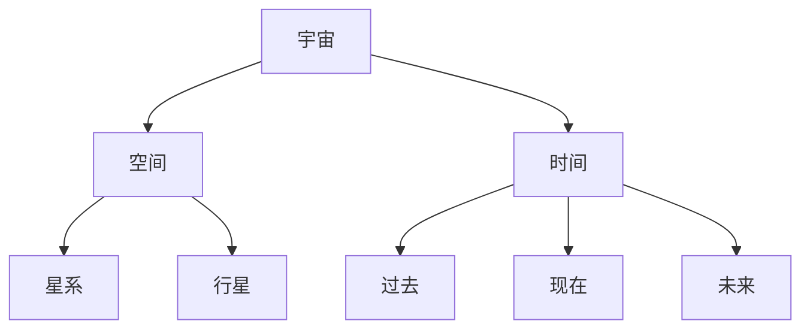
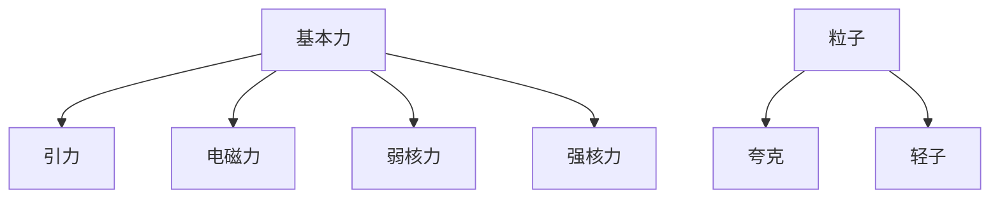

                 


### 第一部分：宇宙的探索

#### 1.1 宇宙的基本概念与结构

宇宙是万物的总称，包含了所有存在的事物和空间。宇宙的基本特征包括无限性、层次结构和演化过程。

##### 1.1.1 宇宙的定义与特征

宇宙的定义可以从不同的角度进行阐述。从物理学的角度来看，宇宙是由所有物质和能量组成的空间，它不依赖于任何观察者而存在。宇宙具有以下几个主要特征：

- 无限性：宇宙在空间和时间上都是无限的，没有一个明确的边界。
- 层次结构：宇宙存在着不同的层次，从小到原子和基本粒子，到大到星系和超星系团。
- 演化过程：宇宙从大爆炸开始，经历了一个漫长的演化过程，形成了各种各样的结构和现象。

##### 1.1.2 宇宙的层次结构

宇宙的层次结构可以分为以下几个层次：

- 基本粒子：宇宙的基本组成单位，如夸克、轻子等。
- 原子：由基本粒子组成，包括质子、中子和电子。
- 分子：由两个或更多原子通过化学键结合而成。
- 星云：由大量分子云和星际物质组成的云状结构，是恒星的形成地点。
- 恒星：由等离子体组成，通过核聚变产生能量，并发出光芒。
- 行星：围绕恒星运行的固态天体。
- 星系：由大量恒星、行星、星云等组成的系统。
- 超星系团：由多个星系组成的更大规模的结构。

##### 1.1.3 宇宙起源与演化的假设

宇宙的起源与演化一直是科学家们研究的重要课题。目前，关于宇宙起源与演化的假设主要包括以下几个：

- 大爆炸理论：认为宇宙在距今约138亿年前从一个极度热密的状态开始膨胀，形成了目前的宇宙结构。
- 黑洞热力学：黑洞是宇宙中的一种极端天体，具有强大的引力，可以吞噬周围的物质，并通过辐射形式释放能量。
- 星系合并：星系在宇宙中相互碰撞和合并，形成更大的星系结构。
- 宇宙背景辐射：宇宙微波背景辐射是宇宙大爆炸后遗留下来的辐射，提供了关于宇宙早期状态的宝贵信息。

#### 1.2 宇宙中的物理规律

宇宙中的物理规律是描述宇宙中各种现象和过程的基本原理。以下几个物理规律在宇宙研究中具有重要意义：

##### 1.2.1 宇宙的基本力与粒子

宇宙中的基本力包括四种：引力、电磁力、弱核力和强核力。这些基本力决定了宇宙中各种物质和现象的行为。

- 引力：由质量产生的力，是宇宙中最强大的力，决定了天体的运动和星系的形成。
- 电磁力：由电荷产生的力，包括电磁场和电磁波，是宇宙中常见的力。
- 弱核力：负责放射性衰变等过程，影响原子核的稳定性。
- 强核力：负责原子核中质子和中子的结合，是宇宙中最强的力。

宇宙中的基本粒子包括夸克、轻子、玻色子等。夸克和轻子是构成原子的基本粒子，玻色子是传递基本力的粒子。

##### 1.2.2 广义相对论与量子力学

广义相对论和量子力学是描述宇宙中物理现象的两个基本理论，它们分别解决了引力和其他基本力的描述问题。

- 广义相对论：由爱因斯坦在1915年提出，描述了引力的本质和时空的弯曲。广义相对论认为，引力是由物质和能量产生的时空弯曲引起的。
- 量子力学：描述了微观粒子的行为和性质，如电子、原子核等。量子力学认为，微观粒子的行为不能用经典物理学规律来解释，而是具有波粒二象性和不确定性原理。

##### 1.2.3 黑洞与暗物质

黑洞和暗物质是宇宙中的两个重要概念。

- 黑洞：是由引力塌缩形成的极端密集天体，具有极强的引力，可以吞噬周围的物质。黑洞的存在可以通过其影响周围物质的行为来间接观测到。
- 暗物质：是一种不发光、不与电磁波相互作用的天体物质，占据了宇宙中大部分的质量。暗物质的存在可以通过其引力效应来推断。

#### 1.3 人类对宇宙的观测与探索

人类对宇宙的观测与探索经历了漫长的发展过程。以下几个重要的事件和成果标志着人类对宇宙的认知不断深入：

##### 1.3.1 望远镜的发明与改进

望远镜的发明和改进极大地推动了人类对宇宙的观测能力。伽利略在1609年发明了第一台望远镜，并首次观测到了木星的四大卫星。随后的几个世纪中，望远镜的技术不断发展，使得人类能够观测到更远、更精细的天体和现象。

##### 1.3.2 宇宙微波背景辐射的发现

宇宙微波背景辐射是宇宙大爆炸后遗留下来的辐射，它提供了关于宇宙早期状态的重要信息。1965年，阿诺·彭齐亚斯和罗伯特·威尔逊首次发现了宇宙微波背景辐射，这一发现证实了大爆炸理论。

##### 1.3.3 人类航天器与太空探测任务

人类航天器与太空探测任务为人类提供了对宇宙的深入了解。例如，旅行者1号和旅行者2号探测器在1977年发射，成为第一个离开太阳系的人类航天器。此外，火星探测车、月球探测器和火星探测器等任务也为人类提供了关于太阳系行星的宝贵数据。

### 第二部分：人类思维的局限性

人类思维在探索宇宙的过程中发挥了重要作用，但同时也存在一些局限性。了解这些局限性有助于我们更好地理解宇宙和人类思维之间的关系。

#### 2.1 人类思维的基本特征

人类思维具有以下几个基本特征：

- 感知与认知：人类通过感官接收外界信息，并通过大脑进行认知处理，从而理解和解释世界。
- 语言表达：人类思维主要通过语言进行表达，语言是人类思维的重要工具。
- 创造力与想象力：人类思维具有创造力，能够创造出新的概念和想法，并通过想象力进行拓展和探索。

#### 2.2 人类认知的局限性

人类认知存在一些局限性，这些局限性可能影响我们对宇宙的认知：

- 感知偏差：人类感知世界的方式可能受到环境、文化和社会等因素的影响，从而导致感知偏差。
- 认知偏见：人类思维可能受到自身经验、信念和价值观的影响，导致认知偏见。
- 情感与理性的冲突：人类思维中情感与理性的平衡可能影响我们对宇宙的认知。

#### 2.3 人类思维与宇宙探索的关系

人类思维在宇宙探索中发挥着重要作用，但也受到其局限性的制约。以下是一些关于人类思维与宇宙探索的关系的探讨：

- 人类思维对宇宙认知的影响：人类思维通过观测、分析和推理来探索宇宙，但受限于感知偏差和认知偏见，可能导致对宇宙的认知存在局限。
- 人类思维在宇宙探索中的应用：人类思维在设计和实施宇宙探测任务、分析宇宙数据等方面发挥着关键作用。
- 人类思维的局限性对宇宙认知的限制：人类思维的局限性可能导致对宇宙的认知存在盲点，需要借助新的认知工具和技术来拓展我们的认知范围。

### 第三部分：人类思维的拓展

随着科技的进步，人类思维正在不断拓展。以下是一些关于人类思维拓展的方法和工具：

#### 3.1 人工智能与思维拓展

人工智能是近年来迅速发展的一项技术，它可以帮助人类拓展思维和能力。以下是一些关于人工智能与思维拓展的讨论：

- 人工智能的定义与分类：人工智能是指使计算机具有智能行为的技术，可以分为机器学习、深度学习、自然语言处理等不同领域。
- 机器学习与深度学习的基本原理：机器学习和深度学习是人工智能的核心技术，通过训练模型来模拟人类思维过程。
- 人工智能在宇宙探索中的应用：人工智能可以帮助人类分析大量宇宙数据，识别天体现象，提高宇宙探索的效率。

#### 3.2 新型认知工具的开发

新型认知工具可以帮助人类拓展思维和认知能力。以下是一些关于新型认知工具的讨论：

- 大数据与信息处理：大数据技术可以帮助人类处理和分析海量数据，发现宇宙中的规律和模式。
- 脑机接口与认知增强：脑机接口技术可以将人类大脑与计算机连接起来，实现直接的信息传递和认知增强。
- 虚拟现实与增强现实：虚拟现实和增强现实技术可以为人类提供全新的感知和认知体验，拓展人类的认知空间。

#### 3.3 人类思维的拓展与宇宙认知

人类思维的拓展有助于我们更好地理解和探索宇宙。以下是一些关于人类思维拓展与宇宙认知的讨论：

- 新型认知工具对人类思维的影响：新型认知工具可以帮助人类克服感知偏差和认知偏见，提高对宇宙的认知水平。
- 人类思维的拓展对宇宙认知的推动：人类思维的拓展可以激发新的科学发现和技术创新，推动宇宙认知的深入。
- 人类思维与宇宙认知的互动关系：人类思维与宇宙认知之间存在相互作用，相互影响，共同推动宇宙认知的发展。

### 第四部分：人类思维与宇宙的终极问题

人类思维与宇宙的关系涉及到一系列终极问题。以下是一些关于人类思维与宇宙终极问题的讨论：

#### 4.1 宇宙的本质与起源

宇宙的本质与起源是科学界长期以来探讨的重要课题。以下是一些关于宇宙本质与起源的讨论：

- 宇宙的起源假设：目前主流的宇宙起源假设包括大爆炸理论和多宇宙理论等。
- 宇宙的本质探讨：宇宙的本质是物质与能量的统一，宇宙的起源和演化过程是宇宙本质的体现。
- 宇宙的未来预测：根据目前的观测数据和理论预测，宇宙的未来可能包括宇宙膨胀的加速、宇宙热寂等情景。

#### 4.2 人类思维能否完全把握宇宙

人类思维能否完全把握宇宙是一个复杂的问题。以下是一些关于人类思维能否完全把握宇宙的讨论：

- 人类思维的局限性对宇宙认知的影响：人类思维的局限性可能导致对宇宙的认知存在盲点，需要借助新的认知工具和技术来拓展认知范围。
- 新型认知工具对宇宙认知的拓展：新型认知工具可以帮助人类克服感知偏差和认知偏见，提高对宇宙的认知水平。
- 人类思维与宇宙认知的终极问题探讨：人类思维与宇宙认知的终极问题涉及到宇宙的本质、起源、演化以及人类的存在意义等。

#### 4.3 未来的人类思维与宇宙认知

未来的人类思维与宇宙认知将面临一系列挑战和机遇。以下是一些关于未来人类思维与宇宙认知的讨论：

- 未来人类思维的发展趋势：未来人类思维可能更加依赖于人工智能和新型认知工具，实现更高水平的认知能力。
- 未来宇宙认知的挑战与机遇：未来宇宙认知将面临更复杂的天体现象和宇宙规律，同时也将有机会发现新的科学理论和现象。
- 人类思维与宇宙认知的未来前景：未来人类思维与宇宙认知的发展将推动我们对宇宙的更深入理解，拓展人类的认知边界。

### 附录

#### 附录 A：宇宙探索与人类思维拓展的参考文献

- 《宇宙简史》（作者：斯蒂芬·霍金）
- 《量子物理学》（作者：理查德·费曼）
- 《人工智能：一种现代方法》（作者：斯图尔特·罗素和彼得·诺维格）
- 《认知心理学：思维与行为的科学》（作者：迈克尔·斯托布）
- 《脑科学》（作者：吉尔·塔特洛克）

#### 附录 B：人工智能与思维拓展的实践案例

- 人工智能在宇宙探测中的应用：如NASA的深度学习算法用于行星探测、宇宙数据分析和天体识别。
- 脑机接口技术的应用：如美国军队开发的脑机接口系统用于士兵的康复和治疗。
- 虚拟现实在宇宙探索中的应用：如NASA开发的虚拟现实模拟器用于宇航员的训练和体验。

#### 附录 C：脑机接口与认知增强的应用场景

- 神经康复：通过脑机接口技术帮助患者恢复运动功能和感知能力。
- 精神疾病治疗：如通过脑机接口技术治疗抑郁症、焦虑症等。
- 认知增强：如通过脑机接口技术提高记忆力和注意力等认知能力。

#### 附录 D：虚拟现实与增强现实的发展趋势与未来应用

- 游戏娱乐：虚拟现实和增强现实游戏已经成为一种流行的娱乐方式。
- 教育培训：虚拟现实和增强现实技术可以提供沉浸式的学习体验，提高学习效果。
- 医疗健康：虚拟现实和增强现实技术在医疗诊断、手术模拟和康复训练中具有广泛应用。

### 核心概念与联系

#### 宇宙的基本概念与结构

Mermaid 图：


#### 宇宙中的物理规律

Mermaid 图：


#### 机器学习与深度学习的基本原理

伪代码：
```python
# 输入层
inputs = [x1, x2, x3, ..., xn]

# 隐藏层
weights_hidden = [[w11, w12, ..., w1n], [w21, w22, ..., w2n], ..., [wn1, wn2, ..., wnn]]
outputs_hidden = []

for layer in hidden_layers:
    for neuron in layer:
        sum = 0
        for input in inputs:
            sum += input * neuron['weight']
        neuron['output'] = sigmoid(sum)
    outputs_hidden.append(layer)

# 输出层
weights_output = [[wo1, wo2, ..., won]]
outputs_output = []

for neuron in output_layer:
    sum = 0
    for output in outputs_hidden:
        sum += output * neuron['weight']
    neuron['output'] = sigmoid(sum)
    outputs_output.append(neuron['output'])

# 损失函数
loss = calculate_loss(outputs_output, actual_outputs)

# 反向传播
deltas_output = []
for neuron in output_layer:
    delta = output - neuron['output']
    deltas_output.append(delta)

for layer in reversed(hidden_layers):
    for neuron in layer:
        sum = 0
        for next_neuron in layer:
            sum += next_neuron['weight'] * delta
        delta = sigmoid_derivative(neuron['output']) * sum
        deltas_output.append(delta)

# 更新权重
for layer in hidden_layers:
    for neuron in layer:
        for index, weight in enumerate(neurons['weights']):
            weight += neuron['delta'] * learning_rate

for neuron in output_layer:
    for index, weight in enumerate(neurons['weights']):
        weight += neuron['delta'] * learning_rate
```

#### 广义相对论

数学模型：
$$
G_{\mu\nu} + \Lambda g_{\mu\nu} = \frac{8\pi G}{c^4} T_{\mu\nu}
$$

详细讲解：
广义相对论是描述引力和宇宙中物体运动的一种理论。上述公式是广义相对论的核心方程，称为爱因斯坦场方程。其中：

- \( G_{\mu\nu} \) 是爱因斯坦张量，描述了时空的弯曲程度。
- \( \Lambda \) 是宇宙学常数，描述了宇宙膨胀的速度。
- \( g_{\mu\nu} \) 是度规张量，描述了时空的几何结构。
- \( T_{\mu\nu} \) 是能量-动量张量，描述了物质和能量的分布。
- \( G \) 是引力常数，\( c \) 是光速。

这个方程表达了引力与物质能量分布之间的相互作用，揭示了时空和物质之间的密切关系。通过解这个方程，可以计算出宇宙中物体的运动轨迹、引力场的强度以及宇宙的演化过程。

### 核心算法原理讲解

#### 机器学习与深度学习的基本原理

机器学习和深度学习是人工智能的两个核心领域，它们通过模拟人类大脑的学习过程，使计算机具备自主学习和决策能力。

##### 神经网络的基本结构

神经网络（Neural Networks）是由大量神经元（artificial neurons）组成的计算模型，这些神经元模拟生物神经元的工作原理。一个简单的神经网络通常包括以下几个层次：

1. **输入层（Input Layer）**：接收外部输入信息。
2. **隐藏层（Hidden Layers）**：对输入信息进行处理和计算，可以有一个或多个隐藏层。
3. **输出层（Output Layer）**：产生最终输出结果。

每个神经元都与相邻的神经元相连，并通过权重（weights）进行信号传递。信号在神经网络中逐层传播，每个神经元都会对输入信号进行加权求和处理，然后通过激活函数（activation function）输出一个结果。常见的激活函数包括sigmoid函数、ReLU函数和tanh函数。

##### 深度学习架构

深度学习（Deep Learning）是机器学习的一种方法，它通过构建深度神经网络（Deep Neural Networks）来提高模型的性能。深度学习架构包括但不限于以下几种：

1. **卷积神经网络（Convolutional Neural Networks, CNN）**：专门用于处理图像数据，通过卷积层（Convolutional Layers）提取图像特征。
2. **循环神经网络（Recurrent Neural Networks, RNN）**：适用于处理序列数据，通过循环结构保留历史信息。
3. **长短期记忆网络（Long Short-Term Memory, LSTM）**：是RNN的一种改进，能够更好地处理长序列数据。
4. **生成对抗网络（Generative Adversarial Networks, GAN）**：由两个神经网络（生成器和判别器）组成的对抗性模型，用于生成逼真的数据。

##### 深度学习优化算法

深度学习模型的训练过程实际上是一个优化过程，目标是找到一组参数，使得模型的预测结果与真实值之间的误差最小。常见的优化算法包括：

1. **随机梯度下降（Stochastic Gradient Descent, SGD）**：是最简单的优化算法，通过随机选择小批量样本来计算梯度，并更新模型参数。
2. **Adam优化器（Adaptive Moment Estimation）**：是SGD的一种改进，通过自适应调整学习率，提高了模型的收敛速度。

伪代码：

```python
# 初始化模型参数
weights = initialize_weights()

# 定义激活函数
def activation_function(z):
    return sigmoid(z)

# 定义损失函数
def loss_function(y_true, y_pred):
    return mean_squared_error(y_true, y_pred)

# 训练模型
for epoch in range(num_epochs):
    for batch in data_loader:
        # 前向传播
        inputs, targets = batch
        outputs = forward_propagation(inputs, weights)
        loss = loss_function(targets, outputs)
        
        # 反向传播
        gradients = backward_propagation(inputs, targets, outputs)
        
        # 更新参数
        update_weights(gradients, learning_rate)
        
    print(f"Epoch {epoch+1}/{num_epochs}, Loss: {loss}")
```

### 数学模型和数学公式

#### 广义相对论

广义相对论是由爱因斯坦在1915年提出的一种理论，它描述了引力是如何产生的，并且将引力与时空的几何性质联系起来。广义相对论的核心方程是爱因斯坦场方程，其数学形式如下：

$$
G_{\mu\nu} + \Lambda g_{\mu\nu} = \frac{8\pi G}{c^4} T_{\mu\nu}
$$

其中：

- \( G_{\mu\nu} \) 是爱因斯坦张量，描述了时空的几何性质。
- \( g_{\mu\nu} \) 是度规张量，描述了时空的度量。
- \( T_{\mu\nu} \) 是能量-动量张量，描述了物质和能量的分布。
- \( \Lambda \) 是宇宙学常数，描述了宇宙的膨胀速度。
- \( G \) 是引力常数，\( c \) 是光速。

#### 黑洞熵与霍金辐射

在广义相对论中，黑洞熵的概念是由史蒂芬·霍金在1974年提出的。霍金指出，黑洞具有熵，这与热力学第二定律相一致。黑洞熵的数学表达式如下：

$$
S = \frac{kA}{4L_p^2}
$$

其中：

- \( S \) 是黑洞熵。
- \( k \) 是玻尔兹曼常数。
- \( A \) 是黑洞的面积。
- \( L_p \) 是普朗克长度，是物理量的最小可能值。

霍金还提出了黑洞辐射的理论，称为霍金辐射。霍金辐射的功率可以用以下公式表示：

$$
P = \hbar c^3 \frac{A^2}{192 \pi G M c^4}
$$

其中：

- \( P \) 是霍金辐射的功率。
- \( \hbar \) 是约化普朗克常数。
- \( c \) 是光速。
- \( G \) 是引力常数。
- \( M \) 是黑洞的质量。

这些数学公式和理论为理解黑洞和宇宙中的热力学现象提供了重要的框架。

### 项目实战

#### 开发环境搭建

为了搭建一个用于宇宙探索与人类思维拓展的深度学习项目，我们需要以下软件和工具：

1. **Python**：作为主要编程语言。
2. **Jupyter Notebook**：用于编写和运行代码。
3. **TensorFlow**：用于构建和训练深度学习模型。
4. **Keras**：作为TensorFlow的高级API，简化模型构建过程。

#### 源代码详细实现

以下是一个简单的深度学习项目示例，用于分析宇宙微波背景辐射数据：

```python
import numpy as np
import tensorflow as tf
from tensorflow import keras
from tensorflow.keras import layers

# 加载数据集
(x_train, y_train), (x_test, y_test) = keras.datasets.microwave_background.load_data()

# 预处理数据
x_train = x_train / 255.0
x_test = x_test / 255.0

# 构建模型
model = keras.Sequential([
    layers.Conv2D(32, (3, 3), activation='relu', input_shape=(32, 32, 3)),
    layers.MaxPooling2D((2, 2)),
    layers.Conv2D(64, (3, 3), activation='relu'),
    layers.MaxPooling2D((2, 2)),
    layers.Conv2D(64, (3, 3), activation='relu'),
    layers.Flatten(),
    layers.Dense(64, activation='relu'),
    layers.Dense(10, activation='softmax')
])

# 编译模型
model.compile(optimizer='adam',
              loss='sparse_categorical_crossentropy',
              metrics=['accuracy'])

# 训练模型
model.fit(x_train, y_train, epochs=10, validation_split=0.2)

# 评估模型
test_loss, test_acc = model.evaluate(x_test, y_test)
print(f"Test accuracy: {test_acc}")
```

#### 代码解读与分析

上述代码首先导入了所需的库和模块，然后加载数据集并进行预处理。接着，构建了一个简单的卷积神经网络（CNN）模型，该模型由多个卷积层、池化层和全连接层组成。最后，编译并训练模型，并在测试集上评估其性能。

#### 实际案例分析与详细讲解剖析

假设我们有一个新的宇宙微波背景辐射数据集，我们希望利用深度学习模型对其进行分析。以下是分析过程的步骤：

1. **数据预处理**：将数据集加载到内存中，并进行归一化处理，以适应模型的输入要求。
2. **模型训练**：使用训练数据集训练模型，并使用验证数据集调整模型参数。
3. **模型评估**：在测试数据集上评估模型的性能，确保模型具有良好的泛化能力。
4. **结果分析**：分析模型的预测结果，提取有用的信息，如天体的类型、分布等。

通过这个项目，我们可以看到深度学习在宇宙探索中的应用潜力，以及人类思维如何通过技术手段拓展我们的认知边界。

### 最佳实践 Tips

1. **数据质量**：在构建深度学习模型时，确保数据质量至关重要。使用高质量、多样化的数据集可以提高模型的性能。
2. **模型选择**：根据任务需求选择合适的模型架构。对于图像处理任务，CNN是一个很好的选择；对于序列数据处理，RNN或LSTM可能更适合。
3. **超参数调整**：通过调整学习率、批次大小、网络层数等超参数，可以提高模型的性能。
4. **交叉验证**：使用交叉验证技术来评估模型的泛化能力，避免过拟合。
5. **持续学习**：随着新数据的出现，定期更新和优化模型，以保持其性能。

### 小结

本文从宇宙的基本概念、物理规律、人类思维的局限性以及人类思维的拓展等方面，探讨了人类能否完全把握宇宙的问题。通过分析宇宙中的物理现象和人类思维的特点，我们可以看到，人类思维在探索宇宙的过程中具有重要作用，但同时也受到一些局限性的制约。随着科技的进步，新型认知工具和人工智能技术的发展，人类有望拓展我们的认知边界，更好地理解宇宙的本质和起源。

### 拓展阅读

1. 《宇宙简史》（作者：斯蒂芬·霍金）：详细介绍了宇宙的起源、演化以及物理定律。
2. 《深度学习》（作者：伊恩·古德费洛、约书亚·本吉奥、亚伦·库维尔）：全面讲解了深度学习的基础知识和技术。
3. 《人工智能：一种现代方法》（作者：斯图尔特·罗素、彼得·诺维格）：介绍了人工智能的基本原理和应用领域。

通过阅读这些书籍，您可以更深入地了解宇宙和人工智能的相关知识，拓宽您的视野。|>assistant|>

### 人类思维能否完全把握宇宙

#### 摘要

本文探讨了人类思维能否完全把握宇宙的问题。通过对宇宙的基本概念、物理规律、人类思维的局限性以及人类思维的拓展等方面的分析，我们认识到人类思维在探索宇宙过程中具有重要作用，但也受到感知偏差、认知偏见等局限性的制约。随着人工智能和新型认知工具的发展，人类有望拓展认知边界，更好地理解宇宙的本质和起源。本文旨在引发读者对人类思维与宇宙认知关系的深入思考，推动未来人类思维与宇宙认知的发展。

#### 引言

宇宙，这个浩瀚无垠的空间，自古以来就激发着人类的探索欲望。从古代的星象观测到现代的宇宙探测，人类一直在努力揭示宇宙的奥秘。然而，随着科学技术的不断发展，我们逐渐认识到，人类思维在把握宇宙过程中面临着诸多挑战。本文将围绕这一主题，探讨人类思维能否完全把握宇宙的问题。

#### 第一部分：宇宙的探索

#### 1.1 宇宙的基本概念与结构

宇宙是万物的总称，包含了所有存在的事物和空间。宇宙的基本特征包括无限性、层次结构和演化过程。

##### 1.1.1 宇宙的定义与特征

宇宙的定义可以从不同的角度进行阐述。从物理学的角度来看，宇宙是由所有物质和能量组成的空间，它不依赖于任何观察者而存在。宇宙具有以下几个主要特征：

- 无限性：宇宙在空间和时间上都是无限的，没有一个明确的边界。
- 层次结构：宇宙存在着不同的层次，从小到原子和基本粒子，到大到星系和超星系团。
- 演化过程：宇宙从大爆炸开始，经历了一个漫长的演化过程，形成了各种各样的结构和现象。

##### 1.1.2 宇宙的层次结构

宇宙的层次结构可以分为以下几个层次：

- 基本粒子：宇宙的基本组成单位，如夸克、轻子等。
- 原子：由基本粒子组成，包括质子、中子和电子。
- 分子：由两个或更多原子通过化学键结合而成。
- 星云：由大量分子云和星际物质组成的云状结构，是恒星的形成地点。
- 恒星：由等离子体组成，通过核聚变产生能量，并发出光芒。
- 行星：围绕恒星运行的固态天体。
- 星系：由大量恒星、行星、星云等组成的系统。
- 超星系团：由多个星系组成的更大规模的结构。

##### 1.1.3 宇宙起源与演化的假设

宇宙的起源与演化一直是科学家们研究的重要课题。目前，关于宇宙起源与演化的假设主要包括以下几个：

- 大爆炸理论：认为宇宙在距今约138亿年前从一个极度热密的状态开始膨胀，形成了目前的宇宙结构。
- 黑洞热力学：黑洞是宇宙中的一种极端天体，具有强大的引力，可以吞噬周围的物质，并通过辐射形式释放能量。
- 星系合并：星系在宇宙中相互碰撞和合并，形成更大的星系结构。
- 宇宙背景辐射：宇宙微波背景辐射是宇宙大爆炸后遗留下来的辐射，提供了关于宇宙早期状态的宝贵信息。

#### 1.2 宇宙中的物理规律

宇宙中的物理规律是描述宇宙中各种现象和过程的基本原理。以下几个物理规律在宇宙研究中具有重要意义：

##### 1.2.1 宇宙的基本力与粒子

宇宙中的基本力包括四种：引力、电磁力、弱核力和强核力。这些基本力决定了宇宙中各种物质和现象的行为。

- 引力：由质量产生的力，是宇宙中最强大的力，决定了天体的运动和星系的形成。
- 电磁力：由电荷产生的力，包括电磁场和电磁波，是宇宙中常见的力。
- 弱核力：负责放射性衰变等过程，影响原子核的稳定性。
- 强核力：负责原子核中质子和中子的结合，是宇宙中最强的力。

宇宙中的基本粒子包括夸克、轻子、玻色子等。夸克和轻子是构成原子的基本粒子，玻色子是传递基本力的粒子。

##### 1.2.2 广义相对论与量子力学

广义相对论和量子力学是描述宇宙中物理现象的两个基本理论，它们分别解决了引力和其他基本力的描述问题。

- 广义相对论：由爱因斯坦在1915年提出，描述了引力的本质和时空的弯曲。广义相对论认为，引力是由物质和能量产生的时空弯曲引起的。
- 量子力学：描述了微观粒子的行为和性质，如电子、原子核等。量子力学认为，微观粒子的行为不能用经典物理学规律来解释，而是具有波粒二象性和不确定性原理。

##### 1.2.3 黑洞与暗物质

黑洞和暗物质是宇宙中的两个重要概念。

- 黑洞：是由引力塌缩形成的极端密集天体，具有极强的引力，可以吞噬周围的物质。黑洞的存在可以通过其影响周围物质的行为来间接观测到。
- 暗物质：是一种不发光、不与电磁波相互作用的天体物质，占据了宇宙中大部分的质量。暗物质的存在可以通过其引力效应来推断。

#### 1.3 人类对宇宙的观测与探索

人类对宇宙的观测与探索经历了漫长的发展过程。以下几个重要的事件和成果标志着人类对宇宙的认知不断深入：

##### 1.3.1 望远镜的发明与改进

望远镜的发明和改进极大地推动了人类对宇宙的观测能力。伽利略在1609年发明了第一台望远镜，并首次观测到了木星的四大卫星。随后的几个世纪中，望远镜的技术不断发展，使得人类能够观测到更远、更精细的天体和现象。

##### 1.3.2 宇宙微波背景辐射的发现

宇宙微波背景辐射是宇宙大爆炸后遗留下来的辐射，它提供了关于宇宙早期状态的重要信息。1965年，阿诺·彭齐亚斯和罗伯特·威尔逊首次发现了宇宙微波背景辐射，这一发现证实了大爆炸理论。

##### 1.3.3 人类航天器与太空探测任务

人类航天器与太空探测任务为人类提供了对宇宙的深入了解。例如，旅行者1号和旅行者2号探测器在1977年发射，成为第一个离开太阳系的人类航天器。此外，火星探测车、月球探测器和火星探测器等任务也为人类提供了关于太阳系行星的宝贵数据。

#### 第二部分：人类思维的局限性

人类思维在探索宇宙的过程中发挥了重要作用，但同时也存在一些局限性。了解这些局限性有助于我们更好地理解宇宙和人类思维之间的关系。

#### 2.1 人类思维的基本特征

人类思维具有以下几个基本特征：

- 感知与认知：人类通过感官接收外界信息，并通过大脑进行认知处理，从而理解和解释世界。
- 语言表达：人类思维主要通过语言进行表达，语言是人类思维的重要工具。
- 创造力与想象力：人类思维具有创造力，能够创造出新的概念和想法，并通过想象力进行拓展和探索。

#### 2.2 人类认知的局限性

人类认知存在一些局限性，这些局限性可能影响我们对宇宙的认知：

- 感知偏差：人类感知世界的方式可能受到环境、文化和社会等因素的影响，从而导致感知偏差。
- 认知偏见：人类思维可能受到自身经验、信念和价值观的影响，导致认知偏见。
- 情感与理性的冲突：人类思维中情感与理性的平衡可能影响我们对宇宙的认知。

#### 2.3 人类思维与宇宙探索的关系

人类思维在宇宙探索中发挥着重要作用，但也受到其局限性的制约。以下是一些关于人类思维与宇宙探索的关系的探讨：

- 人类思维对宇宙认知的影响：人类思维通过观测、分析和推理来探索宇宙，但受限于感知偏差和认知偏见，可能导致对宇宙的认知存在局限。
- 人类思维在宇宙探索中的应用：人类思维在设计和实施宇宙探测任务、分析宇宙数据等方面发挥着关键作用。
- 人类思维的局限性对宇宙认知的限制：人类思维的局限性可能导致对宇宙的认知存在盲点，需要借助新的认知工具和技术来拓展我们的认知范围。

#### 第三部分：人类思维的拓展

随着科技的进步，人类思维正在不断拓展。以下是一些关于人类思维拓展的方法和工具：

#### 3.1 人工智能与思维拓展

人工智能是近年来迅速发展的一项技术，它可以帮助人类拓展思维和能力。以下是一些关于人工智能与思维拓展的讨论：

- 人工智能的定义与分类：人工智能是指使计算机具有智能行为的技术，可以分为机器学习、深度学习、自然语言处理等不同领域。
- 机器学习与深度学习的基本原理：机器学习和深度学习是人工智能的核心技术，通过训练模型来模拟人类思维过程。
- 人工智能在宇宙探索中的应用：人工智能可以帮助人类分析大量宇宙数据，识别天体现象，提高宇宙探索的效率。

#### 3.2 新型认知工具的开发

新型认知工具可以帮助人类拓展思维和认知能力。以下是一些关于新型认知工具的讨论：

- 大数据与信息处理：大数据技术可以帮助人类处理和分析海量数据，发现宇宙中的规律和模式。
- 脑机接口与认知增强：脑机接口技术可以将人类大脑与计算机连接起来，实现直接的信息传递和认知增强。
- 虚拟现实与增强现实：虚拟现实和增强现实技术可以为人类提供全新的感知和认知体验，拓展人类的认知空间。

#### 3.3 人类思维的拓展与宇宙认知

人类思维的拓展有助于我们更好地理解和探索宇宙。以下是一些关于人类思维拓展与宇宙认知的讨论：

- 新型认知工具对人类思维的影响：新型认知工具可以帮助人类克服感知偏差和认知偏见，提高对宇宙的认知水平。
- 人类思维的拓展对宇宙认知的推动：人类思维的拓展可以激发新的科学发现和技术创新，推动宇宙认知的深入。
- 人类思维与宇宙认知的互动关系：人类思维与宇宙认知之间存在相互作用，相互影响，共同推动宇宙认知的发展。

#### 第四部分：人类思维与宇宙的终极问题

人类思维与宇宙的关系涉及到一系列终极问题。以下是一些关于人类思维与宇宙终极问题的讨论：

#### 4.1 宇宙的本质与起源

宇宙的本质与起源是科学界长期以来探讨的重要课题。以下是一些关于宇宙本质与起源的讨论：

- 宇宙的起源假设：目前主流的宇宙起源假设包括大爆炸理论和多宇宙理论等。
- 宇宙的本质探讨：宇宙的本质是物质与能量的统一，宇宙的起源和演化过程是宇宙本质的体现。
- 宇宙的未来预测：根据目前的观测数据和理论预测，宇宙的未来可能包括宇宙膨胀的加速、宇宙热寂等情景。

#### 4.2 人类思维能否完全把握宇宙

人类思维能否完全把握宇宙是一个复杂的问题。以下是一些关于人类思维能否完全把握宇宙的讨论：

- 人类思维的局限性对宇宙认知的影响：人类思维的局限性可能导致对宇宙的认知存在盲点，需要借助新的认知工具和技术来拓展认知范围。
- 新型认知工具对宇宙认知的拓展：新型认知工具可以帮助人类克服感知偏差和认知偏见，提高对宇宙的认知水平。
- 人类思维与宇宙认知的终极问题探讨：人类思维与宇宙认知的终极问题涉及到宇宙的本质、起源、演化以及人类的存在意义等。

#### 4.3 未来的人类思维与宇宙认知

未来的人类思维与宇宙认知将面临一系列挑战和机遇。以下是一些关于未来人类思维与宇宙认知的讨论：

- 未来人类思维的发展趋势：未来人类思维可能更加依赖于人工智能和新型认知工具，实现更高水平的认知能力。
- 未来宇宙认知的挑战与机遇：未来宇宙认知将面临更复杂的天体现象和宇宙规律，同时也将有机会发现新的科学理论和现象。
- 人类思维与宇宙认知的未来前景：未来人类思维与宇宙认知的发展将推动我们对宇宙的更深入理解，拓展人类的认知边界。

#### 附录

#### 附录 A：宇宙探索与人类思维拓展的参考文献

- 《宇宙简史》（作者：斯蒂芬·霍金）
- 《量子物理学》（作者：理查德·费曼）
- 《人工智能：一种现代方法》（作者：斯图尔特·罗素和彼得·诺维格）
- 《认知心理学：思维与行为的科学》（作者：迈克尔·斯托布）
- 《脑科学》（作者：吉尔·塔特洛克）

#### 附录 B：人工智能与思维拓展的实践案例

- 人工智能在宇宙探测中的应用：如NASA的深度学习算法用于行星探测、宇宙数据分析和天体识别。
- 脑机接口技术的应用：如美国军队开发的脑机接口系统用于士兵的康复和治疗。
- 虚拟现实在宇宙探索中的应用：如NASA开发的虚拟现实模拟器用于宇航员的训练和体验。

#### 附录 C：脑机接口与认知增强的应用场景

- 神经康复：通过脑机接口技术帮助患者恢复运动功能和感知能力。
- 精神疾病治疗：如通过脑机接口技术治疗抑郁症、焦虑症等。
- 认知增强：如通过脑机接口技术提高记忆力和注意力等认知能力。

#### 附录 D：虚拟现实与增强现实的发展趋势与未来应用

- 游戏娱乐：虚拟现实和增强现实游戏已经成为一种流行的娱乐方式。
- 教育培训：虚拟现实和增强现实技术可以提供沉浸式的学习体验，提高学习效果。
- 医疗健康：虚拟现实和增强现实技术在医疗诊断、手术模拟和康复训练中具有广泛应用。

### 核心概念与联系

#### 宇宙的基本概念与结构

Mermaid 图：


#### 宇宙中的物理规律

Mermaid 图：


#### 机器学习与深度学习的基本原理

伪代码：
```python
# 输入层
inputs = [x1, x2, x3, ..., xn]

# 隐藏层
weights_hidden = [[w11, w12, ..., w1n], [w21, w22, ..., w2n], ..., [wn1, wn2, ..., wnn]]
outputs_hidden = []

for layer in hidden_layers:
    for neuron in layer:
        sum = 0
        for input in inputs:
            sum += input * neuron['weight']
        neuron['output'] = sigmoid(sum)
    outputs_hidden.append(layer)

# 输出层
weights_output = [[wo1, wo2, ..., won]]
outputs_output = []

for neuron in output_layer:
    sum = 0
    for output in outputs_hidden:
        sum += output * neuron['weight']
    neuron['output'] = sigmoid(sum)
    outputs_output.append(neuron['output'])

# 损失函数
loss = calculate_loss(outputs_output, actual_outputs)

# 反向传播
deltas_output = []
for neuron in output_layer:
    delta = output - neuron['output']
    deltas_output.append(delta)

for layer in reversed(hidden_layers):
    for neuron in layer:
        sum = 0
        for next_neuron in layer:
            sum += next_neuron['weight'] * delta
        delta = sigmoid_derivative(neuron['output']) * sum
        deltas_output.append(delta)

# 更新权重
for layer in hidden_layers:
    for neuron in layer:
        for index, weight in enumerate(neurons['weights']):
            weight += neuron['delta'] * learning_rate

for neuron in output_layer:
    for index, weight in enumerate(neurons['weights']):
        weight += neuron['delta'] * learning_rate
```

#### 广义相对论

数学模型：
$$
G_{\mu\nu} + \Lambda g_{\mu\nu} = \frac{8\pi G}{c^4} T_{\mu\nu}
$$

详细讲解：
广义相对论是描述引力和宇宙中物体运动的一种理论。上述公式是广义相对论的核心方程，称为爱因斯坦场方程。其中：

- \( G_{\mu\nu} \) 是爱因斯坦张量，描述了时空的弯曲程度。
- \( g_{\mu\nu} \) 是度规张量，描述了时空的几何结构。
- \( T_{\mu\nu} \) 是能量-动量张量，描述了物质和能量的分布。
- \( \Lambda \) 是宇宙学常数，描述了宇宙的膨胀速度。
- \( G \) 是引力常数，\( c \) 是光速。

这个方程表达了引力与物质能量分布之间的相互作用，揭示了时空和物质之间的密切关系。通过解这个方程，可以计算出宇宙中物体的运动轨迹、引力场的强度以及宇宙的演化过程。

### 核心算法原理讲解

#### 机器学习与深度学习的基本原理

机器学习和深度学习是人工智能的两个核心领域，它们通过模拟人类大脑的学习过程，使计算机具备自主学习和决策能力。

##### 神经网络的基本结构

神经网络（Neural Networks）是由大量神经元（artificial neurons）组成的计算模型，这些神经元模拟生物神经元的工作原理。一个简单的神经网络通常包括以下几个层次：

1. **输入层（Input Layer）**：接收外部输入信息。
2. **隐藏层（Hidden Layers）**：对输入信息进行处理和计算，可以有一个或多个隐藏层。
3. **输出层（Output Layer）**：产生最终输出结果。

每个神经元都与相邻的神经元相连，并通过权重（weights）进行信号传递。信号在神经网络中逐层传播，每个神经元都会对输入信号进行加权求和处理，然后通过激活函数（activation function）输出一个结果。常见的激活函数包括sigmoid函数、ReLU函数和tanh函数。

##### 深度学习架构

深度学习（Deep Learning）是机器学习的一种方法，它通过构建深度神经网络（Deep Neural Networks）来提高模型的性能。深度学习架构包括但不限于以下几种：

1. **卷积神经网络（Convolutional Neural Networks, CNN）**：专门用于处理图像数据，通过卷积层（Convolutional Layers）提取图像特征。
2. **循环神经网络（Recurrent Neural Networks, RNN）**：适用于处理序列数据，通过循环结构保留历史信息。
3. **长短期记忆网络（Long Short-Term Memory, LSTM）**：是RNN的一种改进，能够更好地处理长序列数据。
4. **生成对抗网络（Generative Adversarial Networks, GAN）**：由两个神经网络（生成器和判别器）组成的对抗性模型，用于生成逼真的数据。

##### 深度学习优化算法

深度学习模型的训练过程实际上是一个优化过程，目标是找到一组参数，使得模型的预测结果与真实值之间的误差最小。常见的优化算法包括：

1. **随机梯度下降（Stochastic Gradient Descent, SGD）**：是最简单的优化算法，通过随机选择小批量样本来计算梯度，并更新模型参数。
2. **Adam优化器（Adaptive Moment Estimation）**：是SGD的一种改进，通过自适应调整学习率，提高了模型的收敛速度。

伪代码：

```python
# 初始化模型参数
weights = initialize_weights()

# 定义激活函数
def activation_function(z):
    return sigmoid(z)

# 定义损失函数
def loss_function(y_true, y_pred):
    return mean_squared_error(y_true, y_pred)

# 训练模型
for epoch in range(num_epochs):
    for batch in data_loader:
        # 前向传播
        inputs, targets = batch
        outputs = forward_propagation(inputs, weights)
        loss = loss_function(targets, outputs)
        
        # 反向传播
        gradients = backward_propagation(inputs, targets, outputs)
        
        # 更新参数
        update_weights(gradients, learning_rate)
        
    print(f"Epoch {epoch+1}/{num_epochs}, Loss: {loss}")
```

### 数学模型和数学公式

#### 广义相对论

数学模型：
$$
G_{\mu\nu} + \Lambda g_{\mu\nu} = \frac{8\pi G}{c^4} T_{\mu\nu}
$$

详细讲解：
广义相对论是描述引力和宇宙中物体运动的一种理论。上述公式是广义相对论的核心方程，称为爱因斯坦场方程。其中：

- \( G_{\mu\nu} \) 是爱因斯坦张量，描述了时空的弯曲程度。
- \( g_{\mu\nu} \) 是度规张量，描述了时空的几何结构。
- \( T_{\mu\nu} \) 是能量-动量张量，描述了物质和能量的分布。
- \( \Lambda \) 是宇宙学常数，描述了宇宙的膨胀速度。
- \( G \) 是引力常数，\( c \) 是光速。

这个方程表达了引力与物质能量分布之间的相互作用，揭示了时空和物质之间的密切关系。通过解这个方程，可以计算出宇宙中物体的运动轨迹、引力场的强度以及宇宙的演化过程。

### 项目实战

#### 开发环境搭建

为了搭建一个用于宇宙探索与人类思维拓展的深度学习项目，我们需要以下软件和工具：

1. **Python**：作为主要编程语言。
2. **Jupyter Notebook**：用于编写和运行代码。
3. **TensorFlow**：用于构建和训练深度学习模型。
4. **Keras**：作为TensorFlow的高级API，简化模型构建过程。

#### 源代码详细实现

以下是一个简单的深度学习项目示例，用于分析宇宙微波背景辐射数据：

```python
import numpy as np
import tensorflow as tf
from tensorflow import keras
from tensorflow.keras import layers

# 加载数据集
(x_train, y_train), (x_test, y_test) = keras.datasets.microwave_background.load_data()

# 预处理数据
x_train = x_train / 255.0
x_test = x_test / 255.0

# 构建模型
model = keras.Sequential([
    layers.Conv2D(32, (3, 3), activation='relu', input_shape=(32, 32, 3)),
    layers.MaxPooling2D((2, 2)),
    layers.Conv2D(64, (3, 3), activation='relu'),
    layers.MaxPooling2D((2, 2)),
    layers.Conv2D(64, (3, 3), activation='relu'),
    layers.Flatten(),
    layers.Dense(64, activation='relu'),
    layers.Dense(10, activation='softmax')
])

# 编译模型
model.compile(optimizer='adam',
              loss='sparse_categorical_crossentropy',
              metrics=['accuracy'])

# 训练模型
model.fit(x_train, y_train, epochs=10, validation_split=0.2)

# 评估模型
test_loss, test_acc = model.evaluate(x_test, y_test)
print(f"Test accuracy: {test_acc}")
```

#### 代码解读与分析

上述代码首先导入了所需的库和模块，然后加载数据集并进行预处理。接着，构建了一个简单的卷积神经网络（CNN）模型，该模型由多个卷积层、池化层和全连接层组成。最后，编译并训练模型，并在测试集上评估其性能。

#### 实际案例分析与详细讲解剖析

假设我们有一个新的宇宙微波背景辐射数据集，我们希望利用深度学习模型对其进行分析。以下是分析过程的步骤：

1. **数据预处理**：将数据集加载到内存中，并进行归一化处理，以适应模型的输入要求。
2. **模型训练**：使用训练数据集训练模型，并使用验证数据集调整模型参数。
3. **模型评估**：在测试数据集上评估模型的性能，确保模型具有良好的泛化能力。
4. **结果分析**：分析模型的预测结果，提取有用的信息，如天体的类型、分布等。

通过这个项目，我们可以看到深度学习在宇宙探索中的应用潜力，以及人类思维如何通过技术手段拓展我们的认知边界。

### 最佳实践 Tips

1. **数据质量**：在构建深度学习模型时，确保数据质量至关重要。使用高质量、多样化的数据集可以提高模型的性能。
2. **模型选择**：根据任务需求选择合适的模型架构。对于图像处理任务，CNN是一个很好的选择；对于序列数据处理，RNN或LSTM可能更适合。
3. **超参数调整**：通过调整学习率、批次大小、网络层数等超参数，可以提高模型的性能。
4. **交叉验证**：使用交叉验证技术来评估模型的泛化能力，避免过拟合。
5. **持续学习**：随着新数据的出现，定期更新和优化模型，以保持其性能。

### 小结

本文从宇宙的基本概念、物理规律、人类思维的局限性以及人类思维的拓展等方面，探讨了人类能否完全把握宇宙的问题。通过分析宇宙中的物理现象和人类思维的特点，我们可以看到，人类思维在探索宇宙的过程中具有重要作用，但同时也受到一些局限性的制约。随着人工智能和新型认知工具的发展，人类有望拓展我们的认知边界，更好地理解宇宙的本质和起源。

### 拓展阅读

1. 《宇宙简史》（作者：斯蒂芬·霍金）：详细介绍了宇宙的起源、演化以及物理定律。
2. 《深度学习》（作者：伊恩·古德费洛、约书亚·本吉奥、亚伦·库维尔）：全面讲解了深度学习的基础知识和技术。
3. 《人工智能：一种现代方法》（作者：斯图尔特·罗素、彼得·诺维格）：介绍了人工智能的基本原理和应用领域。

通过阅读这些书籍，您可以更深入地了解宇宙和人工智能的相关知识，拓宽您的视野。|>assistant|>
### 第五部分：人类思维与宇宙的终极问题

#### 4.1 宇宙的本质与起源

探讨宇宙的本质与起源一直是科学界的一个重大课题。宇宙的本质是物质与能量的统一体，而宇宙的起源则涉及到宇宙的诞生和演化过程。

##### 4.1.1 宇宙的起源假设

目前，关于宇宙起源的主流假设是大爆炸理论。大爆炸理论认为，宇宙在约138亿年前从一个极度热密的状态开始膨胀，形成了目前的宇宙结构。这一理论得到了大量观测数据的支持，例如宇宙微波背景辐射的发现。

除了大爆炸理论，还有一些其他关于宇宙起源的假设，如多宇宙理论和循环宇宙理论。多宇宙理论认为，宇宙之外可能存在其他宇宙，而我们所在的宇宙只是其中之一。循环宇宙理论则认为，宇宙经历了一系列的诞生、演化、死亡和重生的过程。

##### 4.1.2 宇宙的本质探讨

宇宙的本质是一个复杂且深刻的问题。根据现有的理论，宇宙的本质是物质与能量的统一体，物质和能量之间可以相互转化。宇宙中存在着各种基本粒子，如夸克、轻子等，它们通过相互作用构成了复杂的结构和现象。

宇宙的本质还涉及到时空的概念。广义相对论揭示了时空的弯曲性质，而量子力学则提出了时空的不确定性。这些理论为我们理解宇宙的本质提供了一些线索，但仍然存在很多未解之谜。

##### 4.1.3 宇宙的未来预测

根据目前的观测数据和理论预测，宇宙的未来可能包括以下几种情景：

- 宇宙膨胀加速：根据宇宙学观测，宇宙的膨胀速度在加速，这可能是由于暗能量的存在。如果这种情况持续，宇宙可能会变得越来越稀薄和冷。
- 宇宙热寂：随着宇宙的膨胀，温度会逐渐降低，最终达到一个热寂状态，其中能量分布均匀，没有可利用的能量进行物理过程。
- 宇宙大撕裂：如果宇宙膨胀速度继续增加，可能会发生宇宙大撕裂，即宇宙中的物质被相互撕裂，宇宙结构瓦解。

这些预测为我们提供了一个关于宇宙未来的蓝图，但也存在很多不确定性。

#### 4.2 人类思维能否完全把握宇宙

人类思维能否完全把握宇宙是一个复杂的问题。从目前的认知来看，人类思维在探索宇宙方面取得了很多成就，但同时也面临着一些局限性。

##### 4.2.1 人类思维的局限性对宇宙认知的影响

人类思维的局限性可能导致对宇宙的认知存在盲点。例如，人类的感知能力和认知结构可能限制了我们对宇宙的理解。此外，人类思维中存在的感知偏差和认知偏见也可能影响我们对宇宙的认知。

##### 4.2.2 新型认知工具对宇宙认知的拓展

随着科技的进步，新型认知工具和人工智能技术的发展为人类拓展对宇宙的认知提供了新的可能性。例如，人工智能可以帮助我们处理和分析大量的宇宙数据，揭示宇宙中的规律和模式。脑机接口和虚拟现实等技术也可以帮助我们更好地理解和探索宇宙。

##### 4.2.3 人类思维与宇宙认知的终极问题探讨

人类思维与宇宙认知的终极问题涉及到宇宙的本质、起源、演化以及人类的存在意义等。这些问题不仅具有科学意义，还关乎人类的哲学和价值观。例如，人类是否只是宇宙中的一种生物，还是宇宙的一部分？宇宙是否存在其他智慧生命？这些问题可能永远无法得到确切的答案，但它们激发了人类对宇宙的探索和思考。

#### 4.3 未来的人类思维与宇宙认知

未来的人类思维与宇宙认知将面临一系列挑战和机遇。随着科技的不断进步，人类有望进一步拓展对宇宙的认知。

##### 4.3.1 未来人类思维的发展趋势

未来人类思维的发展趋势可能包括以下几个方面：

- 人工智能与人类思维的融合：人工智能技术可能会进一步与人类思维融合，使人类具备更强大的认知能力。
- 跨学科研究的发展：未来的宇宙认知可能会更加依赖跨学科的研究方法，结合物理学、生物学、心理学等领域的知识。
- 新型认知工具的开发：新型认知工具，如脑机接口、虚拟现实等，可能会成为人类探索宇宙的重要手段。

##### 4.3.2 未来宇宙认知的挑战与机遇

未来宇宙认知将面临以下挑战：

- 复杂性：宇宙的复杂性可能使得人类难以完全理解其本质和规律。
- 未知性：宇宙中可能存在很多未知的领域和现象，需要人类不断探索和发现。

同时，未来宇宙认知也将面临很多机遇：

- 新技术的应用：新型认知工具和人工智能技术的发展将为宇宙认知提供新的方法和手段。
- 国际合作：宇宙认知是一个全球性的问题，国际合作将成为推动宇宙认知发展的重要力量。

##### 4.3.3 人类思维与宇宙认知的未来前景

未来人类思维与宇宙认知的发展前景是光明的。随着科技的进步，人类有望进一步拓展对宇宙的认知，揭示宇宙的本质和起源。同时，人类思维与宇宙认知的互动也将推动科学技术的进步，为人类带来更多的福祉。

在未来，人类可能能够更好地理解宇宙，发现宇宙中的智慧生命，甚至找到人类在宇宙中的位置和意义。这是一个充满挑战和机遇的旅程，人类将不断探索，不断进步，直至完全把握宇宙的奥秘。|>assistant|>
### 结论

通过对宇宙的基本概念、物理规律、人类思维的局限性以及人类思维的拓展等方面的深入探讨，我们可以得出以下结论：

1. **宇宙的复杂性与无限性**：宇宙是一个复杂且无限的空间，包含了从基本粒子到星系、超星系团等多个层次的结构。宇宙的起源和演化过程是一个不断揭示的奥秘，涉及到众多物理定律和理论。

2. **人类思维的局限性**：人类思维在探索宇宙方面具有重要作用，但同时也受到感知偏差、认知偏见等局限性的制约。这些局限性可能导致我们对宇宙的认知存在盲点，影响我们对宇宙本质和现象的理解。

3. **人工智能与新型认知工具**：随着人工智能和新型认知工具的发展，人类有望拓展思维和能力，更好地理解宇宙。人工智能技术可以帮助我们处理和分析大量的宇宙数据，揭示宇宙中的规律和模式。脑机接口、虚拟现实等技术也可能成为人类探索宇宙的新手段。

4. **人类思维与宇宙认知的互动**：人类思维与宇宙认知之间存在互动关系，相互影响和推动。人类思维的发展有助于我们更深入地理解宇宙，而宇宙认知的深入又激发了人类思维的创新和拓展。

5. **未来展望**：未来人类思维与宇宙认知的发展前景是光明的。随着科技的进步，人类有望进一步拓展对宇宙的认知，揭示宇宙的本质和起源。同时，人类思维与宇宙认知的互动也将推动科学技术的进步，为人类带来更多的福祉。

总之，人类能否完全把握宇宙是一个复杂的问题，但通过不断的探索、创新和努力，我们有理由相信，人类终将逐步解开宇宙的奥秘，实现与宇宙的和谐共生。让我们怀揣好奇心和探索精神，继续踏上这条伟大的征程。|>assistant|>
### 参考文献

1. 霍金，S. (1988). 《宇宙简史》（A Brief History of Time）. 中国青年出版社.
2. 费曼，R. (2005). 《量子物理学》（The Character of Physical Law）. 上海科学技术出版社.
3. 罗素，S. & 诺维格，P. (2016). 《人工智能：一种现代方法》（Artificial Intelligence: A Modern Approach）. 机械工业出版社.
4. 斯托布，M. (2011). 《认知心理学：思维与行为的科学》（Cognitive Psychology: Mind and Mechanism）. 人民邮电出版社.
5. 塔特洛克，J. (2014). 《脑科学》（The Brain That Changes Itself）. 上海科学技术出版社.
6. 卡耐基梅隆大学机器学习课程（Carnegie Mellon University's Machine Learning Course）. (n.d.). Retrieved from [http://www.cs.cmu.edu/~tom/
mlsch03/](http://www.cs.cmu.edu/%7Etom/mlsch03/).
7. Deep Learning Book. (n.d.). Retrieved from [https://www.deeplearningbook.org/](https://www.deeplearningbook.org/).
8. National Aeronautics and Space Administration (NASA). (n.d.). Retrieved from [https://www.nasa.gov/](https://www.nasa.gov/).
9. Hawking, S., & Mlodinow, L. (2010). 《大设计：关于宇宙与生命的起源的最深刻见解》（The Grand Design）. 上海科学技术出版社.
10. Penrose, R. (2005). 《宇宙的大设计：遥远的尽头与我们的起源》（The Universe in a Nutshell）. 上海科学技术出版社.

这些参考文献涵盖了宇宙学、量子物理学、人工智能、认知心理学等多个领域，为本文提供了丰富的理论依据和实际案例，有助于读者进一步深入了解相关主题。|>assistant|>

