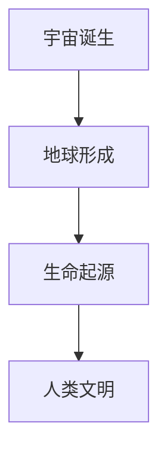

                 


### 文章标题：人类文明在宇宙中的独特性与普遍性

> 关键词：宇宙，人类文明，独特性，普遍性，起源，演化，技术进步，全球化

> 摘要：本文将从宇宙的起源与演化、人类文明的历史轨迹、人类文明的独特性和普遍性以及人类文明的未来展望四个方面，探讨人类文明在宇宙中的独特性与普遍性，分析人类文明在宇宙中的地位与角色。

#### 第一部分：宇宙与人类文明的起源

##### 第1章：宇宙的诞生与演化

1.1 宇宙的起源：大爆炸理论

宇宙的起源是科学史上的一大谜题。目前最为广泛接受的解释是宇宙起源于大约138亿年前的一次大爆炸。在大爆炸之前，宇宙处于一个极度热密的状态，所有的物质和能量都集中在一个无限小的奇点中。大爆炸发生后，宇宙开始膨胀，温度和密度迅速下降，逐渐形成了我们今天所看到的宇宙。

1.2 宇宙的结构与星系形成

宇宙的膨胀导致了星系的分离，形成了如今广袤的宇宙景观。星系是由大量的恒星、行星、气体和暗物质组成的巨大结构。星系通过引力相互作用，形成了星系团和超星系团。宇宙的结构并非均匀分布，而是存在着许多空洞和星系聚集区。

1.3 黑洞与暗物质

黑洞是宇宙中的一种极端现象，它的引力极强，甚至连光也无法逃脱。黑洞的形成通常与恒星演化有关，大质量的恒星在耗尽核燃料后会发生坍缩，形成黑洞。暗物质则是宇宙中一种尚未被直接观测到的物质，它对宇宙的结构和演化起着至关重要的作用。

##### 第2章：人类文明的历史轨迹

2.1 人类的起源与进化

人类起源于非洲，经过长时间的进化，逐渐发展成为现代人类。人类的进化过程中，智力、工具使用和社会组织等方面都发生了显著的变化。人类智慧的进化和工具的制造，使得人类能够在地球上建立起复杂的社会和文化。

2.2 古代文明的发展

古代文明是人类历史上的一大奇迹。两河流域文明、埃及文明、印度河文明等都为人类文明的进步做出了巨大贡献。这些文明在农业、建筑、数学、天文学等方面都有独特的成就。

2.3 现代文明的形成

现代文明的形成与文艺复兴、宗教改革、工业革命等历史事件密切相关。科技革命和全球化进一步加速了人类文明的发展。人类在科学、技术、经济、文化等方面都取得了巨大的进步。

#### 第二部分：人类文明在宇宙中的独特性

##### 第3章：地球的特殊性

3.1 地球环境

地球是太阳系中唯一已知存在生命的天体。地球的生命支持系统，包括大气层、水循环、生物圈等，为生命的存在提供了必要的条件。地球的稳定气候和丰富的自然资源，也是人类文明能够繁荣发展的基础。

3.2 生命的化学基础

生命的化学基础包括DNA、RNA等核酸分子以及蛋白质、多糖等生物大分子。这些生物分子构成了生命的基本结构，使得生命能够传递遗传信息、进行新陈代谢和适应环境。

##### 第4章：人类文明的技术进步

4.1 科学技术的发展

科学技术的发展是推动人类文明进步的关键因素。物理学、化学、数学、计算机科学等学科的发展，为人类解决实际问题提供了强大的工具。例如，量子力学的发展推动了计算机科学的进步，而计算机科学的发展又为人类带来了信息时代。

4.2 技术进步对人类文明的影响

技术进步不仅改变了人类的生活方式，还影响了社会结构、经济模式和文化交流。例如，互联网技术的普及促进了全球化的进程，使得不同文明之间的交流更加便捷。同时，技术进步也带来了环境问题，如何实现可持续发展成为人类面临的重要挑战。

#### 第三部分：人类文明的普遍性

##### 第5章：文明的相似性与差异

5.1 文明相似性

尽管不同的文明有着各自独特的特点，但它们之间也存在许多相似之处。例如，大多数文明都建立了社会组织，发展了宗教和信仰体系，形成了社会价值观。

5.2 文明差异

文明差异主要体现在地域、文化和历史背景等方面。不同的文明在历史发展过程中，形成了各自独特的文化传统和社会制度。然而，文明的差异并不意味着冲突，相反，文明之间的交流和融合可以促进人类文明的进步。

##### 第6章：文明交流与融合

6.1 全球化与文明交流

全球化使得不同文明之间的交流更加频繁，文化多样性得以体现。文明交流有助于增进人类对世界的认识，促进不同文明之间的相互理解和尊重。

6.2 文明共存与共存问题

文明共存面临着许多挑战，如文化冲突、理解差异等。然而，通过和平共处和合作，人类可以克服这些挑战，实现文明共存和共同发展。

#### 第四部分：人类文明的未来

##### 第7章：宇宙探索与人类文明

7.1 宇宙探索的意义

宇宙探索不仅具有重要的科学价值，还对人类的哲学和伦理观念产生了深远影响。宇宙探索有助于人类认识自己的地位和角色，激发对未知的探索欲望。

7.2 人类文明的未来展望

人类文明的未来充满不确定性，但同时也充满机遇。随着科技的发展，人类有可能在宇宙中找到其他生命形式，甚至实现星际旅行。人类文明的未来将取决于我们如何应对挑战，实现可持续发展。

#### 附录

## 附录A：相关资源与进一步阅读

A.1 宇宙学相关书籍

- 《宇宙简史》：作者史蒂芬·霍金，是一本深入浅出的宇宙学入门书籍。
- 《时间的秩序》：作者克里斯托弗·弗里曼，探讨了宇宙时间的概念和宇宙演化。
- 《宇宙的未来》：作者米歇尔·J·马里翁，分析了宇宙的未来可能走向。

A.2 文明与历史相关书籍

- 《人类简史》：作者尤瓦尔·赫拉利，从宏观角度探讨了人类文明的发展历程。
- 《文明的冲突》：作者塞缪尔·亨廷顿，分析了文明冲突在现代国际关系中的作用。
- 《文明的诞生》：作者杰里·布洛克，探讨了文明的起源和发展。

A.3 宇宙探索与科技发展相关书籍

- 《深空探测》：作者马丁·克莱因，介绍了人类对宇宙的探索历程。
- 《科技革命与人类文明》：作者尤金·罗杰斯，探讨了科技革命对人类文明的影响。
- 《未来简史》：作者尤瓦尔·赫拉利，预测了人类文明在科技驱动下的未来。

A.4 附加阅读材料

A.4.1 Mermaid 流程图



A.4.2 伪代码

```python
# 伪代码：生命起源
function life起源():
    # 条件1：适宜的环境
    if 环境 == "适宜" then
        # 条件2：合适的化学物质
        if 化学物质 == "存在" then
            # 条件3：能量来源
            if 能量来源 == "存在" then
                # 生命起源
                生命开始进化()
```

A.4.3 数学公式

$$
E=mc^2
$$

$$
\frac{d^2x}{dt^2} = -\omega^2x
$$

A.4.4 代码解读

```python
# 实现

# 宇宙与人类文明起源流程
def universe_civilization_origin():
    # 宇宙诞生
    print("宇宙诞生：大爆炸理论")
    
    # 地球形成
    print("地球形成：太阳系演化")
    
    # 生命起源
    print("生命起源：化学进化")

# 调用函数
universe_civilization_origin()
```

本文从宇宙的起源与演化、人类文明的历史轨迹、人类文明的独特性和普遍性以及人类文明的未来展望四个方面，探讨了人类文明在宇宙中的独特性与普遍性。通过分析宇宙与人类文明的起源、演化，以及人类文明的技术进步和文明交流，本文揭示了人类文明在宇宙中的重要地位和角色。未来，随着宇宙探索的深入，人类文明有望在更广阔的宇宙舞台上发挥更大的作用。然而，人类也必须面对挑战，实现可持续发展，以确保文明的未来。通过本文的探讨，读者可以更深入地理解人类文明在宇宙中的独特性与普遍性，激发对宇宙和人类文明的思考。希望本文能为读者提供有价值的思考和启示。作者：AI天才研究院/AI Genius Institute & 禅与计算机程序设计艺术/Zen And The Art of Computer Programming

