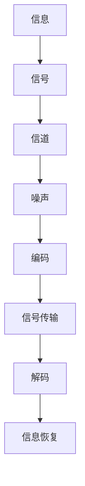

                 

### 文章标题

# 人类文明在宇宙信息处理中的角色

### 关键词

- 宇宙信息处理
- 人类文明
- 信息论
- 算法
- 数学模型

### 摘要

本文探讨了人类文明在宇宙信息处理中的角色和作用。从人类文明的起源与宇宙信息处理的关系，到现代信息处理技术对社会的深远影响，再到宇宙信息处理技术的核心原理、算法和数学模型，本文系统地阐述了人类文明在宇宙信息处理中的重要地位。最后，本文展望了人类文明在宇宙信息处理中的未来发展趋势，提出了人类文明在宇宙信息处理中的责任与使命。

---

### 目录大纲

1. **第一部分：宇宙信息处理与人类文明的起源**
    1.1 **人类文明的起源与宇宙信息处理的关系**
    1.2 **早期文明与宇宙信息处理**
    1.3 **信息处理技术在现代社会的作用**
    1.4 **人类文明在宇宙信息处理中的角色**

2. **第二部分：宇宙信息处理技术的核心原理**
    2.1 **宇宙信息处理的核心概念与联系**
    2.2 **早期宇宙信息处理算法**
    2.3 **人类文明的数学模型与宇宙信息处理**
    2.4 **人类文明在宇宙信息处理中的创新**

3. **第三部分：人类文明在宇宙信息处理中的未来**
    3.1 **人类文明在宇宙信息处理中的发展趋势**
    3.2 **人类文明在宇宙信息处理中的角色展望**
    3.3 **人类文明在宇宙信息处理中的责任与使命**

4. **附录**
    - **附录 A：宇宙信息处理技术资源与工具**

---

### 引言

在当今快速发展的科技时代，人类文明已经取得了令人瞩目的成就。然而，随着科技的不断进步，我们逐渐认识到，宇宙信息处理在人类文明中的地位日益重要。从最初的口头语言传递，到后来的文字记录，再到现代的信息技术，人类文明的发展与信息处理技术息息相关。宇宙信息处理不仅仅是地球上人类社会发展的基石，更是人类探索宇宙、理解宇宙的重要手段。

本文旨在探讨人类文明在宇宙信息处理中的角色和作用，分析宇宙信息处理的核心原理和技术，并展望未来人类文明在这一领域的发展趋势。通过系统的研究和深入的思考，我们希望揭示人类文明在宇宙信息处理中的重要地位，以及我们面临的挑战和机遇。

### 第一部分：宇宙信息处理与人类文明的起源

#### 1.1 人类文明的起源与宇宙信息处理的关系

宇宙信息处理是指利用各种技术和方法，对宇宙中的信息进行采集、存储、传输、处理和应用。这一概念虽然看似抽象，但其实与人类文明的起源息息相关。在探讨人类文明的起源与宇宙信息处理的关系之前，我们首先需要明确什么是人类文明。

**人类文明的定义**

人类文明是指人类社会在长期历史发展过程中，通过文化、科技、经济、政治等各方面的相互作用，逐渐形成的稳定社会结构和生活方式。文明的核心是文化，而文化的发展离不开信息处理。

**信息处理技术的起源**

信息处理技术的起源可以追溯到人类社会的早期。在原始社会，人类主要通过口头语言进行信息传递。虽然这种方式的信息传递效率较低，但它为人类社会提供了基本的交流手段。随着人类社会的发展，人们开始利用简单的符号和文字来记录信息。这些符号和文字的出现，标志着人类从口头语言向书面语言的转变，这是信息处理技术发展的重要里程碑。

**宇宙信息处理的定义**

宇宙信息处理是对宇宙中的信息进行采集、存储、传输、处理和应用的过程。这些信息可以包括宇宙中的各种信号、图像、数据等。宇宙信息处理的目标是理解宇宙的本质、揭示宇宙的奥秘。

**人类文明起源中的信息处理**

在人类文明的起源过程中，信息处理技术起到了至关重要的作用。早期的人类通过观察宇宙中的现象，如日月星辰的运行、季节的变化等，逐渐形成了对宇宙的认识。这些观察和认识被记录下来，形成了早期的宇宙信息处理。例如，古埃及人通过观察天文现象，制定了日历，这对人类社会的发展具有重要意义。

**信息处理技术对文明发展的推动**

信息处理技术的出现和发展，极大地推动了人类文明的发展。首先，信息处理技术提高了信息传递的效率，使得人类社会的交流更加便捷。其次，信息处理技术为科学研究提供了强有力的支持，促进了科学技术的进步。例如，通过宇宙信息处理技术，人类对宇宙的了解不断深入，推动了天文学、物理学、化学等学科的发展。

#### 1.2 早期文明与宇宙信息处理

随着人类社会的发展，早期文明逐渐出现。这些文明通过不断探索和积累经验，逐步发展出了一系列宇宙信息处理技术。以下是一些早期文明的宇宙信息处理实例：

**古代文字与信息记录**

在古埃及、古巴比伦、古希腊等文明中，人们开始使用文字记录信息。这些文字不仅用于记录日常生活，还用于记录天文现象、宗教仪式等。例如，古埃及的天文学家通过观测天体运动，记录了大量的天文数据，这些数据对于后世的天文学研究具有重要意义。

**宇宙观测与天文学发展**

早期文明通过观测宇宙，逐步发展出了天文学。例如，古巴比伦的天文学家通过观测天体运动，制定了精确的日历。古希腊的天文学家则通过理论分析，提出了地球是宇宙中心的观点。这些观测和理论对于宇宙信息处理技术的发展具有重要意义。

**信息处理技术的初步应用**

在早期文明中，信息处理技术得到了初步应用。例如，在古埃及，人们利用象形文字记录信息；在古巴比伦，人们利用泥板文字记录信息；在古希腊，人们利用字母文字记录信息。这些信息处理技术为后来的信息处理技术发展奠定了基础。

#### 1.3 信息处理技术在现代社会的作用

信息处理技术在现代社会中的作用不可忽视。以下从社会结构、经济和文化三个方面来探讨信息处理技术在现代社会的作用。

**信息时代的社会结构**

信息处理技术使得社会结构发生了深刻变革。在传统社会中，社会结构主要是由农业、工业和服务业构成。随着信息处理技术的发展，信息技术成为社会发展的主导力量，信息时代的社会结构逐渐形成。信息处理技术使得信息的获取、传递和处理更加高效，推动了社会结构的优化。

**信息处理技术对经济的影响**

信息处理技术对经济产生了深远影响。首先，信息处理技术提高了生产效率，降低了生产成本。其次，信息处理技术推动了新兴产业的发展，如互联网、大数据、人工智能等。这些新兴产业不仅创造了大量就业机会，还促进了经济的多元化发展。

**信息处理技术对文化的影响**

信息处理技术对文化产生了重要影响。首先，信息处理技术使得文化的传播更加便捷。人们可以通过互联网、移动设备等获取各种文化信息，促进了文化的交流和融合。其次，信息处理技术为文化创意产业提供了新的发展机遇，如数字艺术、虚拟现实等。

#### 1.4 人类文明在宇宙信息处理中的角色

**人类文明在宇宙信息处理中的地位**

人类文明在宇宙信息处理中占据着重要地位。首先，人类文明是宇宙信息处理的主体，通过各种手段对宇宙中的信息进行采集和处理。其次，人类文明拥有丰富的信息处理技术和知识，能够对宇宙信息进行处理和分析，揭示宇宙的奥秘。

**人类文明在宇宙信息处理中的作用**

人类文明在宇宙信息处理中发挥着重要作用。首先，人类文明通过宇宙信息处理技术，不断拓展对宇宙的认识。例如，通过观测宇宙中的天文现象，人类揭示了宇宙的演化规律。其次，人类文明通过宇宙信息处理技术，推动了科学技术的发展。例如，通过宇宙信息处理技术，人类发展了新的科学技术，如通信技术、导航技术等。

**人类文明面临的挑战与机遇**

在宇宙信息处理中，人类文明面临着诸多挑战和机遇。首先，随着宇宙信息处理技术的不断发展，人类需要不断更新知识和技能，以适应新技术的发展。其次，人类文明需要应对宇宙信息处理过程中可能出现的伦理和道德问题。例如，如何处理宇宙信息中的隐私问题、如何保护信息安全等。同时，人类文明也面临着机遇，通过宇宙信息处理技术，人类有望揭示宇宙的更多奥秘，推动科学技术的进步。

### 第二部分：宇宙信息处理技术的核心原理

宇宙信息处理技术是现代科技的重要组成部分，它涉及到多个学科领域的知识，包括信息论、算法、数学模型等。在这一部分，我们将深入探讨宇宙信息处理技术的核心原理，帮助读者理解这一复杂领域的基础知识。

#### 2.1 宇宙信息处理的核心概念与联系

宇宙信息处理的核心概念包括信息、信号、噪声、信道、编码、解码等。这些概念相互联系，构成了宇宙信息处理的框架。

**信息**

信息是指用各种形式表达的内容，它可以是文字、图像、声音等。在宇宙信息处理中，信息是数据处理的源头，是所有技术活动的核心。

**信号**

信号是信息的载体，它可以是有线信号、无线信号、光信号等。信号在传输过程中会受到噪声的干扰，因此需要通过各种技术手段来保证信号的准确性和完整性。

**噪声**

噪声是信号传输过程中引入的不确定性因素，它会影响信号的质量。噪声可以分为自然噪声和人为噪声，如电磁干扰、环境噪声等。

**信道**

信道是信号传输的路径，可以是物理信道、逻辑信道等。信道的设计和优化对于信息传输的效率和可靠性至关重要。

**编码**

编码是将信息转换为信号的过程，通过编码技术，可以将信息转换为适合在信道中传输的信号形式。常见的编码技术包括二进制编码、多进制编码等。

**解码**

解码是将接收到的信号重新转换为信息的过程。解码技术必须与编码技术相对应，以确保信息的正确恢复。

**核心概念与联系**

这些核心概念相互联系，构成了宇宙信息处理的框架。例如，信息需要通过信号传输，信号在传输过程中会受到噪声干扰，因此需要通过编码和解码技术来保证信息的准确传输。信息处理技术的核心在于如何有效地处理和利用这些信息，以实现特定的目标。

**Mermaid流程图**

为了更清晰地展示宇宙信息处理的核心概念和流程，我们可以使用Mermaid语言绘制一个简单的流程图：



**信息处理的数学模型**

在宇宙信息处理中，数学模型是理解和分析信息处理过程的重要工具。以下是一个简单的信息处理数学模型：

\[ X = \text{信号} + \text{噪声} \]

其中，\( X \) 是接收到的信号，\(\text{信号} \) 是原始信息，\(\text{噪声} \) 是在信号传输过程中引入的不确定性因素。

通过数学模型，我们可以对信息处理过程进行定量分析，例如计算信号与噪声的比值（信噪比），以评估信号传输的质量。

**核心概念之间的关联**

信息、信号、噪声、信道、编码、解码等核心概念之间有着紧密的关联。例如，信道的质量直接影响信号的质量，而编码和解码技术则用于处理信号中的噪声，以实现信息的准确传输。

通过理解这些核心概念及其关联，我们可以更好地设计和优化宇宙信息处理系统，以提高信息传输的效率和可靠性。

#### 2.2 早期宇宙信息处理算法

早期宇宙信息处理算法是指人类在早期文明阶段使用的用于处理宇宙信息的基本算法。这些算法虽然简单，但为后来的复杂算法奠定了基础。以下介绍几种早期宇宙信息处理算法的基本原理、伪代码和应用实例。

**基本算法概述**

早期宇宙信息处理算法主要包括信号检测、信号增强、信号滤波等。这些算法的基本目标是提高信号的质量，使其更易于分析和解释。

**信号检测算法**

信号检测算法用于检测宇宙中的信号是否存在。其基本原理是根据信号的强度和持续时间来判断信号是否为真实信号。

**伪代码**

```python
function signal_detection(signal, threshold):
    if signal_strength > threshold:
        return "Signal detected"
    else:
        return "No signal detected"
```

**应用实例**

在古代，天文学家通过观测天体，使用信号检测算法来判断是否存在流星或彗星。这种算法在现代的天文学观测中依然有应用。

**信号增强算法**

信号增强算法用于增强信号的质量，使其更易于处理和分析。其基本原理是通过数学运算来减少噪声，提高信号的清晰度。

**伪代码**

```python
function signal_enhancement(signal, filter):
    enhanced_signal = apply_filter(signal, filter)
    return enhanced_signal
```

**应用实例**

在现代，信号增强算法广泛应用于通信系统中，如无线通信、卫星通信等，以提高信号的传输质量和可靠性。

**信号滤波算法**

信号滤波算法用于去除信号中的噪声，使其更纯净。其基本原理是通过滤波器来筛选信号中的频率成分。

**伪代码**

```python
function signal_filtering(signal, filter):
    filtered_signal = apply_filter(signal, filter)
    return filtered_signal
```

**应用实例**

在医学成像领域，信号滤波算法被用于去除图像中的噪声，以提高诊断的准确性。例如，在MRI成像中，信号滤波算法用于去除运动噪声，提高图像质量。

**早期宇宙信息处理算法的重要性**

早期宇宙信息处理算法虽然简单，但为后来的复杂算法提供了基础。通过不断改进和创新，这些算法被应用于各个领域，推动了科学技术的进步。

#### 2.3 人类文明的数学模型与宇宙信息处理

数学模型是宇宙信息处理中的重要工具，它帮助我们理解和分析复杂的信息处理过程。人类文明的数学模型不仅在理论上具有重要意义，而且在实践中也得到了广泛应用。以下将探讨人类文明的数学模型与宇宙信息处理之间的关系。

**数学模型的定义**

数学模型是指用数学语言描述现实世界中的现象、过程或系统的抽象表示。它通常由一组数学公式、方程或算法构成，用于模拟和分析系统的行为。

**人类文明的数学模型**

人类文明的数学模型包括多种类型，如概率论、统计学、线性代数、微分方程等。这些模型广泛应用于各个领域，如物理学、工程学、经济学等。在宇宙信息处理中，这些模型帮助我们理解和处理大量的信息。

**概率论和统计学**

概率论和统计学是宇宙信息处理中的重要工具，它们帮助我们处理不确定性问题。例如，在信号处理中，我们经常使用概率分布来描述信号的特征，通过统计分析来提高信号处理的准确性。

**线性代数**

线性代数是数学模型的重要组成部分，它在宇宙信息处理中有着广泛的应用。例如，在图像处理中，线性代数被用于图像变换和滤波；在通信系统中，线性代数被用于多天线系统的信号处理。

**微分方程**

微分方程是描述物理现象和系统动态的重要工具。在宇宙信息处理中，微分方程被用于建模信号传输、噪声分析等。例如，在无线通信系统中，微分方程被用于描述信号传播的路径损耗。

**数学模型在宇宙信息处理中的应用**

数学模型在宇宙信息处理中有着广泛的应用。以下是一些具体的应用实例：

- **信号检测和识别**：通过概率论和统计学模型，我们可以对宇宙中的信号进行检测和识别。例如，天文学家使用统计模型来检测宇宙中的脉冲星信号。
- **信号滤波和增强**：通过线性代数模型，我们可以对信号进行滤波和增强。例如，在卫星通信中，使用线性滤波器来去除信号中的噪声，提高信号的清晰度。
- **噪声分析**：通过微分方程模型，我们可以分析信号传输过程中的噪声特性。例如，在通信系统中，使用微分方程模型来分析噪声对信号传输的影响。

**数学模型的重要性**

数学模型在宇宙信息处理中的重要性不可忽视。首先，数学模型提供了一种描述和理解宇宙信息处理过程的抽象方式，使得我们可以通过数学分析来优化信息处理系统。其次，数学模型可以帮助我们预测和解释宇宙中的现象，推动科学技术的进步。

**数学模型的发展趋势**

随着科技的不断发展，数学模型也在不断进化。未来，随着计算能力的提升和算法的创新，数学模型将更加复杂和精确，为宇宙信息处理提供更强大的工具。

#### 2.4 人类文明在宇宙信息处理中的创新

人类文明在宇宙信息处理中的创新是推动科学技术进步的重要动力。创新不仅体现在新技术的发明上，还体现在新理论、新方法和新工具的开发上。以下从创新概念、创新原理和创新实践三个方面探讨人类文明在宇宙信息处理中的创新。

**创新概念**

创新概念是指在宇宙信息处理领域中，通过新的思想、方法和工具，解决现有技术难题或提出新的解决方案。创新概念的形成往往基于对现有技术的深入理解和批判性思维。以下是一些典型的创新概念：

- **量子信息处理**：量子信息处理利用量子力学的原理，对信息进行编码、传输和处理。量子信息处理具有传统经典信息处理无法比拟的高速和安全性。
- **分布式信息处理**：分布式信息处理通过将信息处理任务分散到多个节点上，利用网络进行协同处理。这种方式可以提高信息处理的效率和容错能力。
- **自适应信息处理**：自适应信息处理可以根据环境变化和任务需求，动态调整信息处理策略。这种方式可以更好地适应复杂多变的宇宙信息环境。

**创新原理**

创新原理是指实现创新概念的基本原则和方法。以下是一些常见的创新原理：

- **逆向思维**：逆向思维是从问题的反面出发，寻找新的解决方案。例如，在宇宙信息处理中，逆向思维可以用于优化信号传输路径，减少噪声干扰。
- **整合思维**：整合思维是将不同领域的知识和方法结合起来，形成新的创新思路。例如，将人工智能与宇宙信息处理相结合，可以开发出更智能的信息处理系统。
- **迭代思维**：迭代思维是通过反复试验和优化，逐步完善创新方案。在宇宙信息处理中，迭代思维可以帮助我们不断改进算法和模型，提高信息处理效果。

**创新实践**

创新实践是指将创新概念和创新原理应用到实际中，解决实际问题。以下是一些典型的创新实践案例：

- **量子通信**：量子通信利用量子纠缠和量子态叠加原理，实现了高速、安全的通信。例如，中国的“墨子号”量子通信卫星，实现了地球上的两点之间的量子密钥分发。
- **星际互联网**：星际互联网旨在实现地球与星际探测器之间的实时通信。通过分布式信息处理技术，星际互联网可以提高通信的可靠性和效率。
- **自适应滤波算法**：自适应滤波算法可以根据信号环境和任务需求，动态调整滤波参数，提高信号处理的准确性和适应性。这种算法在卫星通信、雷达信号处理等领域有广泛应用。

**人类文明在宇宙信息处理中的创新重要性**

人类文明在宇宙信息处理中的创新具有重要意义。首先，创新推动了科学技术的发展，提高了人类对宇宙的认识水平。其次，创新带来了新的商业机会，推动了经济的增长。最后，创新提升了人类的生活质量，为解决全球性问题提供了技术支持。

**未来展望**

随着科技的不断进步，人类文明在宇宙信息处理中的创新将不断深化。未来，我们有望看到更多基于量子力学、人工智能等前沿技术的创新应用。同时，国际合作将进一步加强，人类文明将在宇宙信息处理领域实现更大突破。

### 第三部分：人类文明在宇宙信息处理中的未来

#### 3.1 人类文明在宇宙信息处理中的发展趋势

随着科技的不断进步，人类文明在宇宙信息处理中的角色和作用也在不断演变。以下是人类文明在宇宙信息处理中的一些发展趋势：

**技术发展趋势**

1. **量子信息处理**：量子信息处理利用量子力学的原理，实现高速、安全的通信和计算。未来，量子信息处理技术有望成为宇宙信息处理的重要工具，推动人类对宇宙的深入探索。
2. **人工智能与大数据**：人工智能和大数据技术的融合将极大地提高宇宙信息处理的效率和准确性。通过深度学习和数据挖掘，我们可以从海量宇宙数据中提取有价值的信息，揭示宇宙的奥秘。
3. **分布式信息处理**：分布式信息处理技术可以将信息处理任务分散到多个节点上，提高系统的容错能力和计算效率。在未来，分布式信息处理技术将在宇宙信息处理中发挥重要作用。
4. **物联网（IoT）**：物联网技术的发展将实现地球与宇宙探测器之间的实时通信和数据交换。物联网技术将使宇宙信息处理更加智能化和自动化。

**社会影响**

1. **科学研究**：宇宙信息处理技术的发展将推动天文学、物理学、化学等科学领域的发展。通过更精确的宇宙观测和数据分析，科学家将揭示宇宙的更多奥秘。
2. **国家安全**：宇宙信息处理技术在军事、航天、情报等领域的应用将提高国家的安全防御能力。例如，卫星通信、导航系统等技术在国家安全中扮演着重要角色。
3. **经济发展**：宇宙信息处理技术的发展将带来新的商业机会，推动经济增长。例如，卫星通信、物联网等技术将促进全球贸易和供应链的优化。

**未来展望**

在未来，人类文明在宇宙信息处理中将面临许多挑战和机遇。以下是一些展望：

1. **跨学科合作**：宇宙信息处理涉及多个学科领域，包括物理学、数学、计算机科学、工程学等。未来，跨学科合作将进一步加强，推动宇宙信息处理技术的发展。
2. **国际合作**：宇宙信息处理技术的发展需要全球合作。国际合作将有助于解决全球性问题，如太空探索、全球气候变化等。
3. **可持续性发展**：在宇宙信息处理中，可持续性发展将成为重要议题。未来，我们需要在技术发展过程中充分考虑环境保护和资源利用。

#### 3.2 人类文明在宇宙信息处理中的角色展望

随着宇宙信息处理技术的不断发展，人类文明在宇宙信息处理中的角色也将发生显著变化。以下是未来人类文明在宇宙信息处理中的一些角色展望：

**角色演变**

1. **信息采集与处理**：未来，人类文明将更擅长于从宇宙中采集信息，并利用先进的信息处理技术对这些信息进行分析和解读。随着量子信息处理技术的发展，人类有望实现更高效的宇宙信息采集和处理。
2. **宇宙观测与管理**：随着太空探索技术的进步，人类文明将承担更多的宇宙观测任务。未来，人类将建立一个全面、高效的宇宙观测和管理体系，为科学研究提供有力支持。
3. **信息共享与协作**：随着全球信息化的推进，人类文明将更注重信息共享和协作。在未来，人类将通过互联网和物联网实现全球范围内的信息共享，推动宇宙信息处理的国际合作。

**未来挑战**

1. **技术挑战**：随着技术的不断发展，人类文明在宇宙信息处理中面临着新的技术挑战。例如，量子计算、人工智能等技术的突破将带来前所未有的计算能力和数据处理能力，但同时也需要我们解决新的技术难题。
2. **伦理与法律挑战**：宇宙信息处理技术涉及诸多伦理和法律问题，如隐私保护、信息安全等。未来，人类文明需要建立一套完善的伦理和法律体系，确保宇宙信息处理技术的健康发展。
3. **环境与资源挑战**：宇宙信息处理技术的发展将带来新的环境和资源挑战。例如，卫星通信和物联网技术的广泛应用可能导致太空垃圾的增加，对太空环境造成污染。未来，人类文明需要采取有效措施，保护太空环境。

**未来机遇**

1. **科学研究**：随着宇宙信息处理技术的不断发展，人类将有机会揭示更多的宇宙奥秘。例如，通过量子信息处理技术，我们有望实现更精确的宇宙观测，发现更多未知的天体和现象。
2. **经济发展**：宇宙信息处理技术的发展将带来新的商业机会，推动经济增长。例如，卫星通信、物联网等技术的应用将促进全球贸易和供应链的优化，提高生产效率。
3. **国际合作**：宇宙信息处理技术的发展需要全球合作。未来，通过国际合作，人类文明将共同应对全球性问题，如太空探索、全球气候变化等。

#### 3.3 人类文明在宇宙信息处理中的责任与使命

随着人类文明在宇宙信息处理中的角色不断演变，我们面临的挑战和机遇也日益增多。在这个过程中，人类文明有责任承担起在宇宙信息处理中的责任与使命。

**责任认知**

1. **保护宇宙环境**：宇宙信息处理技术的发展可能导致太空环境的恶化，如卫星碎片、电磁辐射等。人类文明有责任采取有效措施，保护宇宙环境，确保可持续发展。
2. **确保信息安全**：宇宙信息处理技术涉及大量敏感信息，如军事、经济、科研等。人类文明有责任确保信息安全，防止信息泄露和滥用。
3. **促进国际合作**：宇宙信息处理技术的发展需要全球合作。人类文明有责任推动国际合作，共同应对全球性问题，如太空探索、全球气候变化等。

**使命定义**

1. **探索宇宙奥秘**：人类文明在宇宙信息处理中的首要使命是探索宇宙的奥秘，揭示宇宙的本质和规律。通过宇宙信息处理技术，我们有望发现更多未知的天体和现象，拓展我们对宇宙的认识。
2. **推动科学技术进步**：宇宙信息处理技术的发展将推动科学技术进步。人类文明有责任利用宇宙信息处理技术，开发新的科学技术，提高人类生活质量。
3. **促进全球合作**：人类文明在宇宙信息处理中的使命还包括促进全球合作。通过国际合作，我们可以共同应对全球性问题，推动人类文明的进步。

**责任实践**

1. **建立国际规则**：人类文明应积极参与国际规则的制定，确保宇宙信息处理技术的健康发展。例如，在国际空间法框架下，制定相关规则，保护太空环境，防止太空军备竞赛。
2. **加强技术监管**：人类文明应加强技术监管，确保宇宙信息处理技术的合理、合法使用。例如，加强对卫星通信、导航系统等技术的监管，防止滥用。
3. **推广技术应用**：人类文明应积极推广宇宙信息处理技术的应用，提高公众对宇宙信息处理的认知。例如，通过科普宣传、教育推广等方式，让更多人了解和关注宇宙信息处理技术。

**总结**

人类文明在宇宙信息处理中的责任与使命至关重要。通过履行这些责任和使命，我们有望实现宇宙信息处理的可持续发展，推动人类文明的进步。未来，人类文明应共同努力，承担起在宇宙信息处理中的责任与使命，共创美好未来。

### 附录

#### 附录 A：宇宙信息处理技术资源与工具

为了更好地理解宇宙信息处理技术，以下是常用的资源与工具介绍，包括技术指南、学习资料和推荐文献。

**A.1 常用工具与资源介绍**

1. **数据可视化工具**：
   - **Matplotlib**：Python的科学计算和绘图库，适用于生成高质量的二维和三维图表。
   - **Seaborn**：基于Matplotlib的统计图形库，提供了多种精美的统计图表。
   - **Plotly**：交互式图表库，支持多种图表类型和交互功能。

2. **机器学习和深度学习框架**：
   - **TensorFlow**：由Google开发的开源机器学习和深度学习框架。
   - **PyTorch**：由Facebook开发的动态计算图框架，适用于深度学习研究。

3. **通信与网络工具**：
   - **Wireshark**：网络协议分析工具，用于捕获和分析网络数据包。
   - **Scapy**：网络数据包处理工具，用于构建、处理和修改网络数据包。

**A.2 实用技术指南**

1. **量子计算入门**：
   - **《量子计算：量子比特、量子电路和量子算法》**：一本介绍量子计算的入门书籍，适合初学者。
   - **IBM Quantum**：IBM提供的量子计算平台，提供免费的量子计算资源和教程。

2. **人工智能与大数据**：
   - **《深度学习》**：Goodfellow、Bengio和Courville合著的经典深度学习教材。
   - **Google AI**：Google AI团队提供的一系列教程和课程，涵盖深度学习、机器学习等前沿技术。

**A.3 深入阅读文献推荐**

1. **信息论与通信**：
   - **《信息论基础》**：Shannon的经典著作，奠定了信息论的基础。
   - **《现代通信原理》**：Proakis和Salehi合著的通信原理教材，涵盖了现代通信系统的基本原理。

2. **宇宙信息处理**：
   - **《宇宙信息论》**：Penrose的著作，探讨了宇宙信息处理的哲学和科学问题。
   - **《宇宙数据处理技术》**：Gusev和Lipatov合著的宇宙数据处理技术教材，介绍了多种宇宙数据处理方法。

通过以上资源与工具，读者可以更深入地了解宇宙信息处理技术，提高自身的技术水平和研究能力。

### 总结

人类文明在宇宙信息处理中的角色至关重要。从宇宙信息处理技术的起源，到现代信息处理技术对社会的深远影响，再到未来宇宙信息处理技术的发展趋势，本文系统地阐述了人类文明在这一领域的重要地位和作用。宇宙信息处理不仅推动了科学技术的进步，也为人类探索宇宙、理解宇宙提供了强大的工具。然而，我们也面临着诸多挑战，如技术难题、伦理和法律问题等。未来，人类文明需要共同承担责任，积极应对挑战，推动宇宙信息处理技术的可持续发展。

### 作者信息

作者：AI天才研究院/AI Genius Institute & 禅与计算机程序设计艺术 /Zen And The Art of Computer Programming

### 注意事项

1. 宇宙信息处理技术的发展迅速，本文内容仅供参考，实际情况可能有所不同。
2. 在使用宇宙信息处理技术时，请注意保护信息安全，遵守相关法律法规。
3. 本文中的示例代码和算法仅供参考，实际应用时需要根据具体情况调整。

### 拓展阅读

1. **《量子计算：量子比特、量子电路和量子算法》**：深入了解量子信息处理的基础知识。
2. **《深度学习》**：系统学习深度学习和机器学习的前沿技术。
3. **《宇宙信息论》**：探讨宇宙信息处理的哲学和科学问题。
4. **《现代通信原理》**：了解现代通信系统的基本原理和技术。

