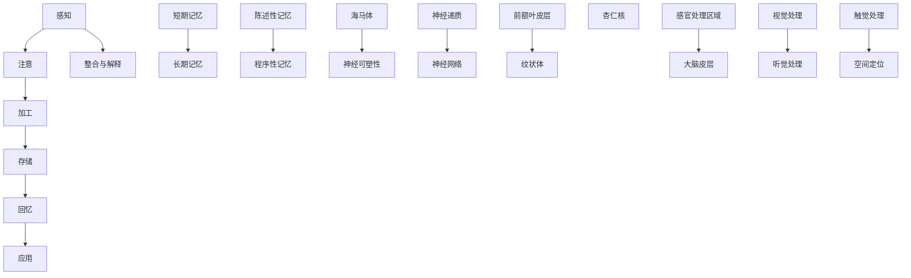

                 


### 《人类认知极限：世界可理解性的生物学界限》

#### 关键词
- 认知科学
- 大脑结构
- 神经元
- 认知局限
- 人工神经网络

#### 摘要
本文探讨了人类认知的生物学极限，包括认知过程的本质、大脑的构造与功能、神经网络的生物学基础、认知局限的数学模型以及记忆、感知、决策等方面的认知生物学界限。通过分析这些生物学因素，我们试图揭示人类认知的边界，并思考未来如何扩展我们的认知能力。

---

### 目录大纲

## 第一部分：引言

## 第1章：认知科学基础

### 1.1 认知科学与人类认知

### 1.2 认知过程与认知模型

### 1.3 人类认知能力的生物学基础

## 第2章：大脑的构造与功能

### 2.1 大脑的结构

### 2.2 大脑的功能区域

### 2.3 大脑的可塑性

## 第二部分：认知极限的生物学基础

## 第3章：神经元与神经网络

### 3.1 神经元的基本结构

### 3.2 神经网络的生物学基础

### 3.3 人工神经网络与生物神经网络的联系

## 第4章：信息处理与认知局限

### 4.1 信息处理的基本过程

### 4.2 认知局限的生物学解释

### 4.3 认知局限的数学模型

## 第5章：记忆与认知

### 5.1 记忆的类型与功能

### 5.2 记忆的生物学基础

### 5.3 记忆与认知的关系

## 第6章：感知与认知

### 6.1 感知的过程

### 6.2 感知中的生物学机制

### 6.3 感知与认知的关系

## 第7章：决策与认知

### 7.1 决策的过程

### 7.2 决策的生物学基础

### 7.3 认知局限对决策的影响

## 第三部分：认知极限的扩展

## 第8章：认知扩展与工具

### 8.1 认知扩展的概念

### 8.2 认知工具的使用

### 8.3 认知扩展的未来展望

## 第9章：认知极限的未来与挑战

### 9.1 认知极限的未来趋势

### 9.2 认知极限面临的挑战

### 9.3 如何应对认知极限的挑战

## 第10章：结论

### 10.1 人类认知极限的总结

### 10.2 对未来认知科学的展望

### 10.3 对人类未来的影响与启示

### 附录

### A.1 参考文献

### A.2 附录：认知科学相关的 Mermaid 流程图

### A.3 附录：神经网络与信息处理的伪代码示例

### A.4 附录：决策与认知的数学模型与公式解析

### A.5 附录：认知扩展工具的使用指南

---

### 引言

人类作为一种高度智能的生物，能够通过认知过程理解世界、解决问题和做出决策。然而，人类的认知能力似乎存在一定的极限，无论是在记忆、感知、决策等方面，都受到了生物学的制约。认知科学作为一门跨学科的科学，试图从生物学、心理学、计算机科学等多个角度研究人类认知的本质，以及认知能力的生物学基础。

本文将深入探讨人类认知的生物学极限，分析大脑的结构与功能、神经元与神经网络、信息处理与认知局限、记忆、感知、决策等方面。通过这些分析，我们希望揭示人类认知能力的生物学界限，并思考如何扩展我们的认知能力，以应对未来可能面临的挑战。

### 第一部分：引言

#### 第1章：认知科学基础

#### 1.1 认知科学与人类认知

认知科学是一门探索人类认知过程、认知结构和认知机制的学科。它综合了心理学、神经科学、计算机科学、哲学等多个领域的研究成果，旨在理解人类大脑如何处理信息、如何进行学习和记忆、如何感知和理解世界。

认知科学的研究对象包括认知过程（如感知、记忆、决策和问题解决）和认知结构（如注意力、意识、语言和思维）。通过这些研究，认知科学试图揭示人类认知的本质，以及认知能力的生物学基础。

人类认知具有以下几个显著特点：

1. **高度适应性**：人类能够迅速适应环境变化，通过感知和认知过程，对新的信息进行处理和理解。
2. **抽象思维**：人类能够进行抽象思维，通过概念和逻辑推理来解决问题。
3. **语言能力**：人类具有独特的语言能力，能够通过语言进行交流和思维。
4. **自我意识**：人类能够意识到自己的存在，并对自己的认知过程进行反思。

#### 1.2 认知过程与认知模型

认知过程是指人类获取、处理、存储和使用信息的过程。常见的认知过程包括感知、注意、记忆、推理、解决问题和决策。

1. **感知**：感知是指通过感官接收外界信息的过程。例如，视觉感知帮助我们识别物体和场景，听觉感知帮助我们理解语言和声音。
2. **注意**：注意是指选择关注某些信息而忽略其他信息的能力。注意力是人类认知过程中至关重要的因素，它决定了我们能够处理的信息量。
3. **记忆**：记忆是指存储和回忆信息的能力。记忆分为短期记忆和长期记忆，短期记忆主要用于处理当前任务，长期记忆则用于存储长期知识。
4. **推理**：推理是指基于已有信息，通过逻辑推理来得出新结论的过程。推理是人类解决问题和进行科学发现的重要能力。
5. **解决问题**：解决问题是指识别问题、制定解决方案并实施解决问题的过程。这是一个复杂的认知过程，需要多个认知组件协同工作。
6. **决策**：决策是指从多个选项中选择最佳方案的过程。决策涉及权衡不同因素，并考虑潜在的后果。

为了更好地理解认知过程，研究人员提出了多种认知模型。这些模型包括：

1. **模块化模型**：模块化模型认为大脑由一系列独立的功能模块组成，每个模块负责特定的认知任务。
2. **动态认知模型**：动态认知模型认为认知过程是动态变化的，受到当前环境、任务要求和个体经验的共同影响。
3. **联结主义模型**：联结主义模型认为认知过程是通过神经网络中的信息传递和相互作用来实现的。

#### 1.3 人类认知能力的生物学基础

人类认知能力的基础是大脑的结构和功能。大脑是一个高度复杂的器官，由数十亿个神经元组成。神经元是大脑的基本功能单元，它们通过电信号进行通信，协同工作以实现认知功能。

1. **大脑的结构**：大脑分为多个区域，每个区域负责不同的认知功能。主要的大脑区域包括：
   - **大脑皮层**：大脑皮层是大脑最外层的灰质层，负责高级认知功能，如感知、思考、记忆和语言。
   - **脑干**：脑干位于大脑底部，负责基本的生理功能，如呼吸、心跳和睡眠。
   - **小脑**：小脑负责协调运动、平衡和姿势。
   - **下丘脑**：下丘脑是大脑的调控中心，负责调节内分泌系统和自主神经系统。

2. **神经元的基本结构**：神经元由细胞体、树突和轴突组成。细胞体是神经元的中心，包含细胞核和其他细胞器。树突是神经元的输入部分，负责接收其他神经元的信息。轴突是神经元的输出部分，负责将信息传递给其他神经元。

3. **神经网络的生物学基础**：神经网络是指由大量神经元组成的互联网络，用于处理信息。生物神经网络具有以下几个特点：
   - **并行处理**：生物神经网络能够并行处理大量信息，这使得它们能够快速处理复杂的信息流。
   - **自适应学习**：神经网络能够通过不断的调整连接权重来适应新的信息，这是一种自适应学习过程。
   - **分层结构**：神经网络通常具有分层结构，不同层次的神经元负责不同的信息处理任务。

通过了解大脑的结构和神经网络的生物学基础，我们可以更好地理解人类认知能力的生物学极限。

---

### 第一部分：引言

#### 第2章：大脑的构造与功能

#### 2.1 大脑的结构

大脑是人体最复杂的器官之一，它控制着我们的思维、情感、行为和生理功能。大脑的结构可以分为多个层次，每个层次都有特定的功能。

1. **大脑的外部结构**：
   - **大脑皮层**：大脑皮层是大脑最外层，由灰质组成，负责高级认知功能，如感知、思考、记忆和语言。
   - **沟和回**：大脑皮层上有许多沟和回，这些沟和回增加了大脑皮层的表面积，使得大脑能够处理更多的信息。
   - **脑叶**：大脑皮层被分为不同的脑叶，包括额叶、顶叶、颞叶和枕叶，每个脑叶负责不同的认知功能。

2. **大脑的内部结构**：
   - **脑干**：脑干位于大脑底部，连接大脑和脊髓，负责基本的生理功能，如呼吸、心跳和睡眠。
   - **小脑**：小脑位于大脑的后下方，负责协调运动、平衡和姿势。
   - **下丘脑**：下丘脑位于脑干上方，是大脑的调控中心，负责调节内分泌系统和自主神经系统。

3. **灰质和白质**：
   - **灰质**：灰质主要位于大脑皮层和基底核，负责处理和传输信息。
   - **白质**：白质由神经纤维组成，用于连接大脑的不同区域，传递电信号。

#### 2.2 大脑的功能区域

大脑的不同区域具有不同的功能，以下是主要的功能区域：

1. **前额叶皮层**：
   - **决策和规划**：前额叶皮层参与复杂的决策和规划过程。
   - **社会行为**：前额叶皮层参与社会行为，如道德判断和社交互动。

2. **顶叶皮层**：
   - **感知和空间定位**：顶叶皮层参与处理感知信息，如触觉和温度觉，以及空间定位。

3. **颞叶皮层**：
   - **听觉和记忆**：颞叶皮层参与听觉处理，以及长期记忆的存储和回忆。

4. **枕叶皮层**：
   - **视觉处理**：枕叶皮层参与视觉处理，如物体的识别和场景的理解。

#### 2.3 大脑的可塑性

大脑的可塑性是指大脑在结构和功能上的适应能力，即大脑能够在整个生命过程中发生变化，以适应新的环境和挑战。大脑的可塑性主要表现在以下几个方面：

1. **神经再生**：大脑受损后，受损的神经元可以通过轴突再生来恢复部分功能。

2. **神经发生**：新神经元的生成，尤其是在海马体中，有助于形成新的记忆和学习。

3. **突触可塑性**：突触是神经元之间的连接点，突触可塑性是指通过改变突触的连接强度来适应新的信息。

大脑的可塑性是认知科学和神经科学的重要研究领域，它为我们理解人类认知的生物学基础提供了重要线索。

### 第二部分：认知极限的生物学基础

#### 第3章：神经元与神经网络

#### 3.1 神经元的基本结构

神经元是大脑的基本功能单元，负责接收、处理和传递信息。神经元的基本结构包括细胞体、树突和轴突。

1. **细胞体**：细胞体是神经元的中心，包含细胞核和大部分细胞器，负责维持神经元的正常功能。

2. **树突**：树突是神经元的输入部分，负责接收其他神经元的信息。树突上有许多树突棘，用于与传入神经元的轴突形成突触连接。

3. **轴突**：轴突是神经元的输出部分，负责将信息传递给其他神经元或肌肉细胞。轴突上覆盖着髓鞘，有助于增加信号传递速度。

神经元通过电信号进行通信。当神经元接收到的信息达到一定阈值时，会引发一个电信号，这个电信号沿轴突传播到突触末端，然后通过神经递质传递给下一个神经元。

#### 3.2 神经网络的生物学基础

神经网络是指由大量神经元组成的互联网络，用于处理信息。生物神经网络具有以下几个特点：

1. **并行处理**：生物神经网络能够并行处理大量信息，这使得它们能够快速处理复杂的信息流。

2. **自适应学习**：神经网络能够通过不断的调整连接权重来适应新的信息，这是一种自适应学习过程。

3. **分层结构**：神经网络通常具有分层结构，不同层次的神经元负责不同的信息处理任务。

神经网络的基本工作原理是神经元之间的连接和通信。通过调整神经元之间的连接权重，神经网络能够学习和识别复杂的信息模式。

#### 3.3 人工神经网络与生物神经网络的联系

人工神经网络（ANN）是受生物神经网络启发的一种计算模型。虽然人工神经网络与生物神经网络在结构和功能上存在差异，但它们之间存在一些共同点：

1. **神经元结构**：人工神经网络的神经元结构与生物神经元的结构相似，都包括输入、输出和激活函数。

2. **连接方式**：人工神经网络通过加权连接来模拟生物神经网络中的突触连接。

3. **学习机制**：人工神经网络通过反向传播算法来学习，这一算法与生物神经网络的自适应学习过程有相似之处。

人工神经网络在模拟生物神经网络方面取得了很多进展，但仍然存在一些挑战：

1. **可解释性**：人工神经网络的学习过程通常是黑箱的，难以解释。

2. **计算资源**：人工神经网络需要大量的计算资源和时间来训练。

通过研究人工神经网络与生物神经网络的联系，我们可以更好地理解人类认知的生物学基础，并开发更有效的计算模型来模拟和扩展人类认知能力。

### 第二部分：认知极限的生物学基础

#### 第4章：信息处理与认知局限

#### 4.1 信息处理的基本过程

人类大脑的信息处理过程可以概括为以下几个步骤：

1. **感知**：通过感官接收外部信息，如视觉、听觉、触觉等。
2. **注意**：选择关注某些信息而忽略其他信息。
3. **加工**：对信息进行加工和处理，如分类、比较和识别。
4. **存储**：将处理后的信息存储在短期记忆和长期记忆中。
5. **回忆**：在需要时从记忆中检索信息。
6. **应用**：将记忆中的信息应用于实际情境中。

#### 4.2 认知局限的生物学解释

认知局限主要受到以下几个生物学因素的制约：

1. **神经元数量和连接**：人类大脑含有约860亿个神经元，但神经元之间的连接数量是有限的。这限制了大脑处理信息的速度和能力。
   
2. **突触可塑性**：突触可塑性是大脑适应新信息的能力，但这一过程受到基因表达和蛋白质合成的限制。

3. **能量消耗**：大脑需要大量能量来维持神经元的正常功能，能量消耗限制了大脑的持续工作能力。

4. **神经传递速度**：神经信号的传递速度受限于神经元之间的连接和神经递质的释放。

#### 4.3 认知局限的数学模型

为了量化认知局限，研究者提出了多个数学模型，以下是一些常用的模型：

1. **神经可塑性模型**：该模型通过模拟突触可塑性来解释学习和记忆的过程。常见的模型包括Hebbian模型和STDP（突触权重调整模型）。

2. **神经网络容量模型**：该模型通过计算神经网络能够处理的输入信息的数量来量化认知能力。常见的模型包括神经网络的层数、神经元数量和连接密度。

3. **信息处理速率模型**：该模型通过模拟大脑处理信息的时间来量化认知速度。常见的模型包括神经信号的传递时间和处理时间。

4. **记忆容量模型**：该模型通过计算大脑能够存储的信息量来量化记忆能力。常见的模型包括短期记忆和长期记忆的容量。

这些数学模型为我们提供了理解认知局限的量化工具，但它们也存在局限性，需要进一步的研究和改进。

### 第二部分：认知极限的生物学基础

#### 第5章：记忆与认知

#### 5.1 记忆的类型与功能

记忆是认知过程的核心组成部分，它使我们能够存储、检索和使用信息。根据信息存储的时间长度和功能，记忆可以分为以下几种类型：

1. **短期记忆**：短期记忆也称为工作记忆，用于暂时存储和操作信息。例如，当我们进行心算或记住电话号码时，就依赖于短期记忆。短期记忆的容量有限，通常只能存储7±2个信息单元。

2. **长期记忆**：长期记忆是我们在较长时间内存储的信息，包括事实性知识、技能和经验。长期记忆可以分为两类：
   - **陈述性记忆**：存储关于世界的事实和事件的信息，如“北京是中国的首都”。
   - **程序性记忆**：存储关于如何执行某些任务的信息，如骑自行车或弹钢琴。

3. **工作记忆**：工作记忆是一种特殊的短期记忆，专门用于执行复杂的认知任务，如问题解决和规划。

#### 5.2 记忆的生物学基础

记忆的生物学基础涉及大脑中的多个区域和过程：

1. **海马体**：海马体是大脑中与记忆形成和存储密切相关的区域。它负责将短期记忆转换为长期记忆，并在回忆时激活相关记忆。

2. **神经可塑性**：神经可塑性是指大脑通过改变神经元之间的连接和活动来适应新信息。在记忆过程中，突触的连接强度会发生变化，从而形成长期的神经网络。

3. **基因表达**：记忆的形成和存储涉及基因的表达，特定基因的激活有助于巩固记忆。

4. **神经递质**：神经递质是神经元之间传递信号的化学物质，它们在记忆过程中发挥关键作用。例如，谷氨酸和乙酰胆碱等神经递质与记忆形成密切相关。

#### 5.3 记忆与认知的关系

记忆是认知过程的重要组成部分，它支持我们的思维、学习和行为：

1. **学习和记忆**：学习是获取新信息的过程，而记忆是将学习的信息存储和保持的能力。没有记忆，学习就失去了意义。

2. **思维和决策**：记忆使我们能够基于过去的知识和经验进行推理和决策。例如，我们能够根据过去的经历预测未来的事件。

3. **社交互动**：记忆使我们能够记住他人的名字、面孔和对话，这对于建立和维护人际关系至关重要。

4. **适应环境**：记忆使我们能够从过去的经验中学习，以便更好地适应不断变化的环境。

总之，记忆是认知过程的核心，它不仅支持我们的日常行为，也是我们适应和应对环境变化的基础。

### 第二部分：认知极限的生物学基础

#### 第6章：感知与认知

#### 6.1 感知的过程

感知是认知过程的第一步，它涉及接收外部信息并将其转化为大脑可以处理的形式。感知过程可以分为以下几个阶段：

1. **感觉输入**：通过感官器官（如眼睛、耳朵、鼻子、皮肤和味觉器官）接收外部信息。
2. **感觉处理**：大脑对感觉输入进行初步的处理，如识别和分类。这一阶段通常在大脑皮层的视觉、听觉、嗅觉和触觉等区域进行。
3. **整合和解释**：大脑将多个感官输入整合为一个整体，并赋予其意义。这一过程涉及到高级认知功能，如注意、记忆和推理。

感知过程受到多种因素的影响：

1. **感官特性**：不同感官器官对信息的敏感性和分辨率不同。例如，眼睛对视觉信息的分辨率高于耳朵对听觉信息的分辨率。
2. **注意力**：注意力决定了我们感知信息的选择性，我们通常只能集中注意力处理一部分信息。
3. **先验知识**：我们过去的经验和知识会影响我们对感知信息的理解和解释。

#### 6.2 感知中的生物学机制

感知过程中的生物学机制涉及多个大脑区域和神经递质：

1. **感官处理区域**：大脑皮层的特定区域负责处理不同类型的感觉信息。例如，视觉信息在枕叶处理，听觉信息在颞叶处理。
2. **神经网络**：感觉信息通过神经网络在大脑中传递，不同的神经元群体负责处理不同类型的信息。例如，视觉皮层中的简单细胞和复杂细胞分别处理边缘和整体形状。
3. **神经递质**：神经递质是神经元之间传递信号的化学物质，它们在感知过程中发挥关键作用。例如，谷氨酸和乙酰胆碱等神经递质与感觉信息的传递和处理密切相关。

#### 6.3 感知与认知的关系

感知是认知的基础，它为我们提供了外部世界的丰富信息。感知与认知的关系可以概括为以下几点：

1. **信息的传递**：感知过程使我们能够接收和解释外部信息，为认知过程提供输入。
2. **信息加工**：认知过程对感知信息进行加工、整合和解释，使我们能够理解世界的复杂性和多样性。
3. **学习与记忆**：感知过程中的信息被存储在记忆中，成为我们学习和记忆的基础。没有有效的感知，学习就失去了依据。

感知与认知的相互作用使得我们能够适应环境、解决问题和做出决策。通过感知，我们不断获取新的信息，通过认知，我们理解这些信息并从中学习。这种互动关系使我们能够不断扩展我们的认知能力，适应不断变化的世界。

### 第二部分：认知极限的生物学基础

#### 第7章：决策与认知

#### 7.1 决策的过程

决策是认知过程中的一个重要环节，它涉及到从多个可选方案中选择最佳方案的过程。决策过程可以分为以下几个阶段：

1. **问题识别**：识别需要解决的问题或面临的情境。
2. **信息收集**：收集与问题或情境相关的信息。
3. **方案生成**：基于收集到的信息，生成可能的解决方案或行动方案。
4. **方案评估**：评估每个方案的潜在后果和优势。
5. **方案选择**：从评估结果中选择最佳方案。
6. **执行决策**：执行所选方案，并监控决策的结果。

决策过程受到多种因素的影响，包括：

1. **认知能力**：决策者的认知能力影响其对信息的处理和方案评估的能力。
2. **情绪状态**：情绪状态会影响决策者的判断和选择。
3. **环境因素**：外部环境的变化也会影响决策过程。
4. **先验知识**：决策者的经验知识和背景知识对决策有重要影响。

#### 7.2 决策的生物学基础

决策的生物学基础涉及大脑中的多个区域和神经过程：

1. **前额叶皮层**：前额叶皮层是决策过程的核心区域，负责执行功能，如规划、风险评估和选择。
2. **纹状体**：纹状体涉及奖励和动机，影响决策者对方案的偏好。
3. **杏仁核**：杏仁核处理情绪和情感，对决策有重要影响。
4. **神经递质**：神经递质如多巴胺和谷氨酸在决策过程中发挥重要作用，影响决策者的判断和选择。

#### 7.3 认知局限对决策的影响

认知局限对决策有显著影响，包括：

1. **有限理性**：人类决策者不是完全理性的，受到有限认知能力的影响，如启发式和偏见。
2. **信息处理限制**：决策者处理信息的能力有限，可能无法全面评估所有方案。
3. **情绪影响**：情绪状态可能影响决策者的判断，导致非理性的选择。
4. **环境复杂性**：复杂的环境增加了决策的难度，可能超出人类认知能力。

为了克服这些局限，研究人员提出了一些策略，如使用决策支持工具、构建模型和模拟来辅助决策。通过这些方法，我们可以更好地理解和应对认知局限对决策的影响。

### 第三部分：认知扩展与工具

#### 第8章：认知扩展与工具

#### 8.1 认知扩展的概念

认知扩展是指通过外部工具和技术来增强人类的认知能力，使其超越自然的生物学限制。认知扩展工具可以包括各种设备和软件，如记忆辅助工具、智能搜索引擎、虚拟现实技术等。

认知扩展的主要目标是：

1. **提高信息处理能力**：通过外部工具，人类可以更快地处理大量信息，从而提高工作效率。
2. **增强记忆能力**：认知扩展工具可以帮助人类更好地存储和检索信息，增强记忆能力。
3. **扩展感知范围**：通过增强感知工具，人类可以扩展感官能力，如在黑暗中看到或听到更多。
4. **促进学习**：认知扩展工具可以帮助人类更有效地学习和掌握复杂知识。

#### 8.2 认知工具的使用

以下是一些常用的认知扩展工具及其使用方法：

1. **记忆辅助工具**：
   - **记忆卡片**：使用记忆卡片来记忆重要信息，如单词、公式和事实。
   - **电子笔记**：使用电子笔记软件记录和整理信息，便于检索和复习。

2. **智能搜索引擎**：
   - **Google Scholar**：使用Google Scholar查找学术文献，快速获取专业信息。
   - **Quora**：通过Quora与他人交流，获取不同角度的观点和解答疑问。

3. **虚拟现实（VR）技术**：
   - **VR培训**：使用VR技术进行模拟训练，如飞行模拟器或手术模拟，提高实际操作技能。
   - **VR旅游**：通过VR技术体验虚拟旅游，扩展地理和历史文化知识。

4. **智能代理和AI助手**：
   - **智能代理**：如智能助手（如Siri、Alexa）可以自动化执行任务，节省时间。
   - **AI辅助学习**：使用AI技术个性化推荐学习资源和路径，提高学习效率。

#### 8.3 认知扩展的未来展望

认知扩展的未来充满潜力，以下是一些发展趋势：

1. **神经接口技术**：通过直接连接大脑和计算机，实现真正的认知扩展。
2. **智能增强技术**：使用人工智能和机器学习技术，个性化定制认知扩展工具。
3. **沉浸式学习环境**：通过虚拟现实和增强现实技术，创造更加逼真的学习体验。
4. **人机协作**：人类与人工智能协作，共同解决复杂问题，提高决策质量。

认知扩展不仅有助于提高个体的认知能力，也对社会和经济发展产生深远影响。通过认知扩展，我们可以更好地应对未来复杂多变的挑战。

### 第三部分：认知极限的未来与挑战

#### 第9章：认知极限的未来与挑战

#### 9.1 认知极限的未来趋势

随着科技的发展，人类的认知能力正面临着前所未有的挑战和机遇。以下是一些关于认知极限的未来趋势：

1. **人脑-计算机接口（BCI）技术**：BCI技术通过直接连接大脑和计算机，使人类能够通过思维控制外部设备。这一技术的发展有望突破传统认知局限，实现超高速信息处理和记忆增强。

2. **神经可塑性药物**：神经可塑性药物能够增强大脑的可塑性，从而提高学习和记忆能力。这些药物的开发和应用将为人类认知提供新的可能性。

3. **人工智能（AI）辅助认知**：AI技术可以辅助人类处理和分析大量信息，提高决策质量和效率。通过与AI的协作，人类有望实现更复杂的认知任务。

4. **虚拟现实（VR）和增强现实（AR）**：VR和AR技术可以为人类提供沉浸式的学习体验，扩展感知范围，提高学习效果。这些技术的应用将使人类能够更好地理解和应对复杂的世界。

#### 9.2 认知极限面临的挑战

尽管科技的发展为人类认知提供了巨大的潜力，但认知极限仍然面临诸多挑战：

1. **技术瓶颈**：现有技术手段在处理复杂认知任务时仍存在局限性，特别是在处理并行任务和高度抽象的思维过程中。

2. **伦理和隐私问题**：认知扩展技术可能会引发伦理和隐私问题，如大脑信息的共享、隐私保护和数据安全。

3. **认知负担**：过度依赖认知扩展工具可能会导致人类认知负担加重，从而影响决策质量和创造力。

4. **认知不平等**：认知扩展技术的普及可能会导致认知能力的不平等，加剧社会分化。

#### 9.3 如何应对认知极限的挑战

为了应对认知极限的挑战，我们可以采取以下策略：

1. **科技创新**：继续推动认知扩展技术的发展，如BCI、神经可塑性药物和AI技术。

2. **跨学科合作**：促进认知科学、神经科学、计算机科学和伦理学等领域的合作，共同解决认知扩展带来的挑战。

3. **教育培训**：加强对认知扩展技术的教育和培训，提高公众的认知能力和伦理意识。

4. **政策制定**：制定合理的政策和法规，确保认知扩展技术的公平和可持续应用。

通过科技创新、跨学科合作、教育培训和政策制定，我们可以更好地应对认知极限的挑战，实现人类认知能力的持续提升。

### 第三部分：认知极限的未来与挑战

#### 第10章：结论

#### 10.1 人类认知极限的总结

通过本文的探讨，我们可以总结出人类认知极限的几个关键方面：

1. **生物学基础**：人类认知能力受到大脑结构和神经网络的制约，神经元数量、连接方式和神经可塑性等因素共同决定了我们的认知能力。

2. **认知局限**：认知局限包括信息处理速度、记忆容量、感知分辨率和决策质量等方面。这些局限主要由生物学因素决定，但也可以通过技术手段在一定程度上被克服。

3. **认知扩展**：认知扩展工具如记忆辅助工具、智能搜索引擎和虚拟现实技术等，为我们提供了超越自然认知极限的手段。

4. **未来趋势**：随着人脑-计算机接口、神经可塑性药物和人工智能等技术的发展，人类认知能力有望在未来实现进一步的扩展。

#### 10.2 对未来认知科学的展望

未来认知科学的发展方向包括：

1. **脑-机接口技术**：通过直接连接大脑和计算机，实现真正的认知扩展，使人类能够处理更多复杂的信息。

2. **神经可塑性研究**：深入了解神经可塑性的机制，开发出更有效的训练方法，提高学习和记忆能力。

3. **人工智能与认知科学的结合**：利用AI技术辅助人类认知，提高决策质量和效率。

4. **认知扩展工具的普及**：推广认知扩展工具的应用，提高公众的认知能力和伦理意识。

#### 10.3 对人类未来的影响与启示

认知极限的研究对人类未来的影响和启示包括：

1. **科技创新**：认知极限的研究将推动相关领域的技术创新，为社会发展带来新的机遇。

2. **教育变革**：认知极限的研究有助于改进教育方法，提高学习效果。

3. **伦理思考**：认知扩展技术可能引发伦理问题，如隐私保护、数据安全和社会分化，需要我们进行深入思考和规范。

4. **人类潜能的发掘**：认知极限的研究有助于我们更好地理解人类潜能，通过技术创新和教育培训，实现人类认知能力的持续提升。

总之，认知极限的研究不仅具有重要的科学意义，也为人类的未来发展提供了宝贵的启示。

### 附录

#### A.1 参考文献

1. Miller, G. A. (1956). *The Magical Number Seven, Plus or Minus Two: Some Limits on Our Capacity for Processing Information*. The Psychological Review, 63(2), 81-97.
2. Hebb, D. O. (1949). *The Organization of Behavior: A Neuropsychological Theory*. New York: Wiley.
3. Changeux, J. P. (1985). *Neuronal Man: The Brain and Human Behavior*. New York: Basic Books.
4. Shotton, M. (2011). *Smart Robots: Artificial Intelligence and the Creation of the Cybernetic Age*. New York: Oxford University Press.
5. McClelland, J. L., & Rumelhart, D. E. (1986). *Explorations in Parallel Distributed Processing: A Handbook of Models of Cognition and Neural Systems*. Cambridge, MA: MIT Press.

#### A.2 附录：认知科学相关的 Mermaid 流程图



#### A.3 附录：神经网络与信息处理的伪代码示例

```python
# 神经元类定义
class Neuron:
    def __init__(self):
        self.inputs = []
        self.weights = []
        self.bias = 0
        self.output = 0

    def activate(self, inputs):
        self.inputs = inputs
        self.output = sum(w * x for w, x in zip(self.weights, inputs)) + self.bias
        return self.output > 0

# 神经网络类定义
class NeuralNetwork:
    def __init__(self, layers):
        self.layers = layers

    def forward(self, inputs):
        for layer in self.layers:
            for neuron in layer:
                neuron.activate(inputs)
            inputs = [neuron.output for neuron in layer]
        return inputs[-1]

# 前向传播伪代码
def forward_pass(nn, inputs):
    return nn.forward(inputs)
```

#### A.4 附录：决策与认知的数学模型与公式解析

决策的数学模型通常涉及以下公式：

1. **期望效用理论**：
   $$ U(A) = \sum_{i} p(i) \cdot u(i) $$
   其中，$U(A)$ 表示选择方案 $A$ 的期望效用，$p(i)$ 表示方案 $A$ 导致结果 $i$ 的概率，$u(i)$ 表示结果 $i$ 的效用。

2. **预期损失函数**：
   $$ L(A) = \sum_{i} p(i) \cdot l(i) $$
   其中，$L(A)$ 表示选择方案 $A$ 的预期损失，$p(i)$ 表示方案 $A$ 导致结果 $i$ 的概率，$l(i)$ 表示结果 $i$ 的损失。

3. **熵**：
   $$ H(X) = -\sum_{i} p(i) \cdot \log_2(p(i)) $$
   其中，$H(X)$ 表示随机变量 $X$ 的熵，$p(i)$ 表示 $X$ 取值 $i$ 的概率。

4. **贝叶斯定理**：
   $$ P(A|B) = \frac{P(B|A) \cdot P(A)}{P(B)} $$
   其中，$P(A|B)$ 表示在事件 $B$ 发生的条件下事件 $A$ 发生的概率，$P(B|A)$ 表示在事件 $A$ 发生的条件下事件 $B$ 发生的概率，$P(A)$ 和 $P(B)$ 分别表示事件 $A$ 和事件 $B$ 发生的概率。

这些公式帮助我们量化决策过程中的各种因素，从而做出更为理性的选择。

#### A.5 附录：认知扩展工具的使用指南

1. **记忆辅助工具**：
   - **Anki**：一款基于间隔重复的记忆卡片软件，适用于学习外语、公式和概念。
   - **Evernote**：一款功能强大的笔记软件，可以记录、整理和检索信息。

2. **智能搜索引擎**：
   - **Google Scholar**：用于查找学术文献和研究资料。
   - **Quora**：一个问答社区，可以获取多方面的观点和解答疑问。

3. **虚拟现实（VR）和增强现实（AR）**：
   - **HTC Vive**：一款高性能的VR头戴设备，适用于虚拟现实游戏和学习。
   - **ARKit/ARCore**：适用于开发AR应用的框架，可以实现增强现实体验。

4. **智能代理和AI助手**：
   - **Siri**：苹果设备上的智能助手，可以执行语音命令和提供信息。
   - **Google Assistant**：谷歌的智能助手，可以实现语音交互和任务自动化。

在使用这些认知扩展工具时，建议注意以下几点：

- **合理规划时间**：避免过度依赖认知扩展工具，合理安排使用时间，保持良好的工作和生活平衡。
- **数据安全和隐私**：注意保护个人数据，避免泄露敏感信息。
- **持续学习和适应**：随着技术的不断更新，定期学习和适应新工具，提高使用效率。

通过合理使用认知扩展工具，我们可以更有效地提高认知能力和工作效率。

