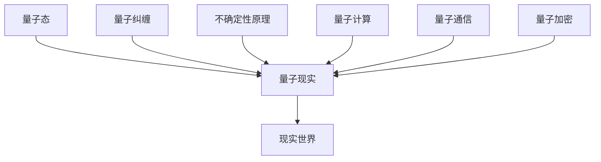
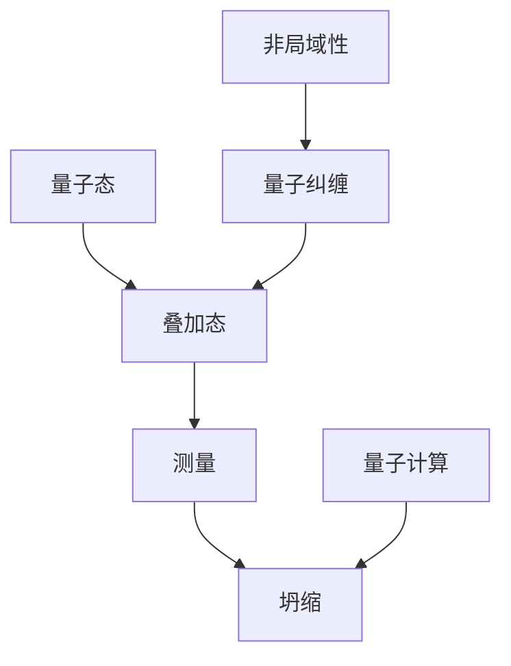

                 

## 《人类语言在描述量子现实时的局限性》

### 关键词：

- 量子现实
- 人类语言
- 描述局限性
- 量子态
- 量子纠缠
- 概率性
- 经典现实

### 摘要：

本文旨在探讨人类语言在描述量子现实时的局限性。通过对量子现实和人类语言的基本概念进行深入分析，本文揭示了量子现实中的复杂性和概率性特征，以及这些特征对人类语言表达力的挑战。文章首先介绍了量子现实的基本概念，包括量子态和量子纠缠，并通过Mermaid流程图展示了量子力学与量子现实的关联。接着，本文分析了人类语言的结构和表达力，探讨了语言在描述复杂现象时的局限性。最后，文章通过对比量子现实与经典现实，进一步阐述了量子现实对人类语言的挑战，并提出了一些可能的解决思路。

----------------------------------------------------------------

# 第一部分: 引言与核心概念介绍

## 第1章: 引言与背景

### 1.1 量子现实的基本概念

量子现实是一个描述量子力学现象和规律的现实世界。它基于量子力学的基本原理，如量子态、量子纠缠和不确定性原理，来解释自然界中的许多现象。量子现实与经典现实（即日常生活中我们直观感受到的现实）有着显著的差异。经典现实是基于经典物理学定律构建的，强调确定性和局域性，而量子现实则强调概率性和非局域性。

量子态是量子现实中的一个核心概念。量子态可以用一个复数向量来描述，其幅值平方表示粒子在某个状态下的概率。例如，一个粒子处于叠加态 $|\psi\rangle = \frac{1}{\sqrt{2}} (|0\rangle + |1\rangle)$，其中$|0\rangle$和$|1\rangle$分别表示粒子处于状态0和状态1。量子态的叠加性质使得粒子可以同时存在于多个状态中，这与经典现实中的确定性状态截然不同。

量子纠缠是另一个重要的量子现象。当两个或多个量子系统相互作用后，它们可能会进入一种纠缠态，这种状态下系统的整体状态无法单独描述为各自独立状态。例如，两个纠缠的光子，即使相隔很远，它们的某些物理属性（如自旋）也会保持相关性。这种现象被称为量子纠缠，它揭示了量子现实中的非局域性特征。

不确定性原理是量子现实的另一个基本原理。它指出，某些物理量（如位置和动量）不能同时被精确测量。这意味着，在量子现实中，我们无法同时知道粒子的确切位置和动量。这种不确定性打破了经典现实中的确定性规律，使得量子现实具有概率性特征。

### 1.2 人类语言的结构与表达限制

人类语言是一种复杂的符号系统，用于传递信息、表达思想和情感。它由语音、词汇、语法和语义等组成。然而，人类语言在表达复杂概念时存在一定的限制。

首先，人类语言的语法结构有限。语法规则定义了句子结构、词法和时态等，但它们无法涵盖所有可能的句子结构。例如，复杂的逻辑表达式或数学公式在人类语言中很难准确表达。

其次，人类语言的词汇量是有限的。虽然现代英语的词汇量已达数十万，但仍然无法覆盖所有可能的单词和概念。这使得人类语言在表达抽象概念时可能会遇到困难，因为抽象概念往往难以用具体的词汇来描述。

此外，人类语言的语义模糊性也是一个问题。语义模糊性指的是同一词汇或句子在不同情境下可能具有不同的含义。例如，“快”这个词可以指速度快，也可以指时间短，这取决于具体的上下文。这种模糊性使得人类语言在描述复杂现象时可能会产生误解。

### 1.3 本书结构安排与目标

本书旨在深入探讨人类语言在描述量子现实时的局限性，并分析可能的解决方法。文章结构如下：

- 第一部分：引言与核心概念介绍
  - 第1章：引言与背景
  - 第2章：量子现实的基本概念
  - 第3章：人类语言的局限性

- 第二部分：量子现实详解
  - 第4章：核心概念与联系
  - 第5章：量子现实的基本概念
  - 第6章：量子现实与经典现实的对比

- 第三部分：人类语言局限性解析
  - 第7章：人类语言的结构与表达力
  - 第8章：人类语言在描述复杂现象时的困难
  - 第9章：语言与量子现实的局限性对比

- 结束语：总结全文，提出解决思路。

通过这一结构，本书将帮助读者了解量子现实的基本概念，分析人类语言在描述复杂现象时的局限性，并探讨可能的解决方法，以期为人类语言与量子现实之间的研究提供有益的启示。

----------------------------------------------------------------

## 第2章: 量子现实的基本概念

### 2.1 量子力学的核心原理

量子力学是描述微观粒子行为的物理学分支，它对量子现实有着深远的影响。量子力学的核心原理主要包括量子态、量子纠缠和不确定性原理。

首先，量子态是量子力学中的基本概念。一个量子态可以用一个波函数 $\psi$ 来描述，它包含了粒子在各个可能状态下的概率分布。波函数通常是一个复数向量，其幅值平方表示粒子在某个状态下的概率。例如，一个粒子处于叠加态 $\psi = \frac{1}{\sqrt{2}} (|0\rangle + |1\rangle)$，其中 $|0\rangle$ 和 $|1\rangle$ 分别表示粒子处于状态0和状态1。这个叠加态意味着粒子既不是纯粹的状态0，也不是纯粹的状态1，而是同时处于这两个状态的叠加。

其次，量子纠缠是量子力学中的另一个重要概念。当两个或多个量子系统相互作用后，它们可能会进入一种纠缠态。在纠缠态中，系统的整体状态无法单独描述为各自独立状态。例如，两个纠缠的光子，即使相隔很远，它们的某些物理属性（如自旋）也会保持相关性。这种现象被称为量子纠缠，它揭示了量子现实中的非局域性特征。

最后，不确定性原理是量子力学的核心原理之一。它指出，某些物理量（如位置和动量）不能同时被精确测量。这意味着，在量子现实中，我们无法同时知道粒子的确切位置和动量。这种不确定性打破了经典现实中的确定性规律，使得量子现实具有概率性特征。

### 2.2 量子现实的概念解析

量子现实是基于量子力学原理来描述现实世界的一种理论框架。它与经典现实有显著的区别。经典现实是基于经典物理学定律构建的，强调确定性和局域性；而量子现实则强调概率性和非局域性。

在经典现实中，物体的状态和运动遵循确定性规律。例如，一个抛物线运动的球，其位置和速度可以通过经典力学方程精确预测。然而，在量子现实中，粒子的行为具有概率性。量子态的叠加性质使得粒子可以同时存在于多个状态中，只有当我们进行测量时，粒子才会“坍缩”到一个确定的状态。这种概率性特征使得量子现实中的现象难以用经典物理学的语言来描述。

此外，量子现实中的非局域性特征也与传统观念不同。在经典现实中，物理现象局限于特定的区域，如电磁波只能在空气中传播。然而，在量子现实中，量子纠缠现象使得两个相隔很远的量子系统可以相互影响，这种影响似乎是瞬时的，不受距离限制。这种现象打破了经典现实中的局域性观念，揭示了量子世界的神秘性。

### 2.3 量子现实与经典现实的对比

量子现实与经典现实在多个方面存在显著差异。以下是它们的核心对比：

- **确定性 vs 概率性**：在经典现实中，物体的状态和运动遵循确定性规律，我们可以精确预测物体的行为。然而，在量子现实中，粒子的行为具有概率性，我们只能知道粒子处于某个状态的概率，而不能精确预测其行为。

- **局域性 vs 非局域性**：在经典现实中，物理现象局限于特定的区域，如电磁波只能在空气中传播。然而，在量子现实中，量子纠缠现象使得两个相隔很远的量子系统可以相互影响，这种影响似乎是瞬时的，不受距离限制。

- **可观测性 vs 不可观测性**：在经典现实中，物理现象是直接可观测的。例如，我们可以直接观察到电磁波的存在。然而，在量子现实中，某些物理现象（如量子态的叠加和纠缠）是间接可观测的，需要通过特定的实验来揭示。

通过这些对比，我们可以看到量子现实与经典现实在基本概念和特征上存在显著差异。量子现实强调概率性和非局域性，而经典现实则强调确定性和局域性。这些差异对人类语言在描述量子现实时的局限性提出了挑战。

### 2.4 目录大纲

- **第4章：核心概念与联系**
  - 4.1 量子态
  - 4.2 量子纠缠
  - 4.3 量子力学与量子现实的关联（Mermaid流程图）

- **第5章：量子现实的基本概念**
  - 5.1 量子态的定义与特性
  - 5.2 量子纠缠的现象与影响
  - 5.3 量子现实的数学模型

- **第6章：量子现实与经典现实的对比**
  - 6.1 概率性与确定性的对比
  - 6.2 局域性与非局域性的对比
  - 6.3 量子现实的实验验证

在这一章节中，我们将进一步探讨量子现实的本质特征，并通过与经典现实的对比，深入理解量子现实的复杂性。这将有助于我们更好地理解人类语言在描述量子现实时的局限性。

----------------------------------------------------------------

## 第3章: 人类语言的局限性

### 3.1 人类语言的结构与表达力

人类语言是一种复杂的符号系统，用于传递信息、表达思想和情感。它由语音、词汇、语法和语义等组成。然而，在描述复杂现象时，人类语言的结构和表达力存在一定的局限性。

首先，人类语言的语法结构有限。语法规则定义了句子结构、词法和时态等，但它们无法涵盖所有可能的句子结构。例如，复杂的逻辑表达式或数学公式在人类语言中很难准确表达。语法规则的局限性使得人类语言在表达复杂概念时可能会遇到困难。

其次，人类语言的词汇量是有限的。虽然现代英语的词汇量已达数十万，但仍然无法覆盖所有可能的单词和概念。这使得人类语言在表达抽象概念时可能会遇到困难，因为抽象概念往往难以用具体的词汇来描述。

此外，人类语言的语义模糊性也是一个问题。语义模糊性指的是同一词汇或句子在不同情境下可能具有不同的含义。例如，“快”这个词可以指速度快，也可以指时间短，这取决于具体的上下文。这种模糊性使得人类语言在描述复杂现象时可能会产生误解。

最后，人类语言的表达力有限。虽然人类语言可以表达丰富的概念和情感，但在描述高度抽象或复杂的现象时，语言的局限性变得尤为明显。例如，量子现实中的某些概念，如量子态和量子纠缠，需要复杂的数学模型和符号来描述，这在人类语言中难以准确表达。

### 3.2 人类语言在描述复杂现象时的困难

人类语言在描述复杂现象时面临诸多困难，这些困难主要体现在以下几个方面：

首先，抽象概念的语义模糊性是一个主要问题。抽象概念，如爱因斯坦的相对论、量子力学中的量子态和量子纠缠，往往难以用具体的词汇或句子来准确表达。语义模糊性使得同一词汇或句子在不同情境下可能具有不同的含义，从而增加了描述复杂现象的难度。

其次，复杂关系的情境依赖性也是一个挑战。在描述复杂现象时，语言的表达往往受限于具体情境。例如，描述金融市场波动时，需要考虑多种经济变量和外部因素，这些因素在具体情境下的影响不同，使得语言表达变得复杂。

此外，语言在描述概率性现象时也面临困难。量子现实中的许多现象具有概率性，如量子态的叠加和测量结果的随机性。在人类语言中，表达概率性现象需要使用概率术语和符号，这增加了描述的难度和复杂性。

最后，语言在描述非局域性现象时也存在挑战。量子纠缠现象展示了量子系统之间的非局域性关联，这种关联在人类语言中难以准确表达。语言的表达往往受限于局域性观念，无法充分描述量子现实中的非局域性特征。

### 3.3 量子现实对语言表达的挑战

量子现实中的复杂性和概率性特征对人类语言表达提出了严峻的挑战。首先，量子态和量子纠缠等概念需要复杂的数学模型和符号来描述，这在人类语言中难以准确表达。例如，量子态的叠加和纠缠关系需要使用量子比特和量子门等概念，这些在人类语言中很难清晰表达。

其次，量子现实中的概率性特征使得语言表达变得复杂。量子态的测量结果具有随机性，需要使用概率分布来描述。在人类语言中，表达概率性现象需要使用概率术语和符号，这增加了描述的难度。

此外，量子现实中的非局域性特征也对语言表达提出了挑战。量子纠缠现象展示了量子系统之间的非局域性关联，这种关联在人类语言中难以准确表达。语言的表达往往受限于局域性观念，无法充分描述量子现实中的非局域性特征。

### 3.4 目录大纲

- **第7章：人类语言的结构与表达力**
  - 7.1 语法结构
  - 7.2 词汇表达
  - 7.3 表达力的局限

- **第8章：人类语言在描述复杂现象时的困难**
  - 8.1 抽象概念的语义模糊性
  - 8.2 复杂关系的情境依赖性
  - 8.3 量子现象描述的挑战

在这一章节中，我们将进一步探讨人类语言在描述复杂现象时的局限性，特别是量子现实对语言表达的挑战。通过分析语言的结构和表达力，以及语言在描述复杂现象时的困难，我们将更好地理解量子现实与人类语言之间的差距，并为解决这一问题提供启示。

----------------------------------------------------------------

## 第4章：核心概念与联系

### 4.1 量子态

量子态是量子力学的核心概念之一，它描述了量子系统的状态。在量子力学中，一个量子系统的状态可以用一个波函数（wave function）$\psi$来表示。波函数是一个复数函数，它提供了量子系统在不同可能状态下的概率分布。

例如，一个粒子处于一个基态 $|0\rangle$ 和另一个基态 $|1\rangle$ 的叠加态，可以表示为：
$$
|\psi\rangle = \alpha|0\rangle + \beta|1\rangle
$$
其中，$\alpha$ 和 $\beta$ 是复数系数，且满足归一化条件：
$$
|\alpha|^2 + |\beta|^2 = 1
$$

这个叠加态意味着粒子既处于状态 $|0\rangle$ 又处于状态 $|1\rangle$，但具体处于哪个状态只有当我们进行测量时才能确定。这种叠加态是量子态的一个典型特性。

### 4.2 量子纠缠

量子纠缠是量子力学中的另一个核心概念，它描述了两个或多个量子系统之间的非局域性关联。当两个量子系统相互纠缠后，它们的状态将无法单独描述，而必须以整体来描述。这种纠缠状态具有一些非常独特的性质，例如：

- **不可分割性**：纠缠态中的量子系统无法单独存在，必须以整体存在。
- **远程关联**：即使纠缠的量子系统相隔很远，它们之间的物理量（如自旋、极化）也会保持相关性。这种关联似乎是瞬时的，不受距离限制。

一个简单的量子纠缠例子是两个纠缠的光子。当测量其中一个光子的极化方向时，另一个光子的极化方向也会立即确定，无论它们相隔多远。这种现象展示了量子纠缠的远程关联性质。

### 4.3 量子力学与量子现实的关联

量子力学与量子现实的关联可以通过一个简单的Mermaid流程图来展示：



这个流程图展示了量子力学中的核心概念如何关联并影响量子现实。量子态和量子纠缠是量子现实的基石，而不确定性原理、量子计算、量子通信和量子加密则是量子现实在现实世界中的应用。

- **量子态**：量子态是量子现实中的基础，它描述了粒子的状态和运动。
- **量子纠缠**：量子纠缠是量子现实中的关键现象，它展示了量子系统之间的非局域性关联。
- **不确定性原理**：不确定性原理是量子现实中的核心原理，它揭示了量子世界中的概率性和不确定性。
- **量子计算**：量子计算是量子现实的一个实际应用，它利用量子态的叠加和纠缠特性来加速计算过程。
- **量子通信**：量子通信是量子现实的一个实际应用，它利用量子纠缠来实现超距传输和量子密钥分发。
- **量子加密**：量子加密是量子现实的一个实际应用，它利用量子态的叠加和纠缠特性来增强通信的安全性。

通过这个流程图，我们可以看到量子力学与量子现实之间的紧密联系，以及量子现实如何影响和改变我们的现实世界。

### 4.4 量子现实的数学模型

量子现实的数学模型主要基于量子力学的数学框架。量子力学的核心数学工具包括波函数、算符和希尔伯特空间。

- **波函数**：波函数是描述量子系统状态的复值函数，它在希尔伯特空间中有明确定义。波函数提供了量子系统在不同状态下的概率分布。

- **算符**：算符是量子力学中的核心概念，用于描述量子系统之间的变换和相互作用。常见的算符包括位置算符、动量算符和自旋算符等。

- **希尔伯特空间**：希尔伯特空间是一个数学空间，用于表示量子系统的状态。它提供了量子态的完备基和内积运算。

量子态的叠加和量子纠缠可以通过数学公式来描述。例如，一个量子态的叠加可以表示为：
$$
|\psi\rangle = \alpha|0\rangle + \beta|1\rangle
$$
其中，$\alpha$ 和 $\beta$ 是复数系数，$|0\rangle$ 和 $|1\rangle$ 是基态。

量子纠缠可以通过贝尔态（Bell state）来描述。一个简单的贝尔态可以表示为：
$$
|\psi_{\phi}\rangle = \frac{1}{\sqrt{2}} (|0\rangle_A|0\rangle_B + |1\rangle_A|1\rangle_B)
$$
其中，$|0\rangle_A$ 和 $|1\rangle_A$ 是量子系统A的基态，$|0\rangle_B$ 和 $|1\rangle_B$ 是量子系统B的基态。

这些数学模型和公式为我们提供了描述和解释量子现实中的复杂现象的工具。然而，这些模型和公式在人类语言中难以清晰表达，这揭示了人类语言在描述量子现实时的局限性。

### 4.5 目录大纲

- **第4章：核心概念与联系**
  - 4.1 量子态
  - 4.2 量子纠缠
  - 4.3 量子力学与量子现实的关联（Mermaid流程图）
  - 4.4 量子现实的数学模型

在这一章节中，我们详细介绍了量子态和量子纠缠等核心概念，并通过Mermaid流程图展示了量子力学与量子现实之间的关联。我们还讨论了量子现实的数学模型，这些模型和概念揭示了量子现实的复杂性和独特性。通过这些讨论，我们更好地理解了人类语言在描述量子现实时的局限性。

----------------------------------------------------------------

## 第5章：量子现实的基本概念

### 5.1 量子态的定义与特性

量子态是量子力学中最基本的概念之一，它描述了量子系统在微观尺度上的状态。量子态可以用波函数（wave function）来表示，通常记作 $\Psi(x,t)$。波函数是一个复值函数，它包含了量子系统的全部物理信息，包括位置、动量和自旋等。在量子态中，粒子不再是经典物理中的点粒子，而是一个概率云，其具体位置无法精确预测，只能以概率形式存在。

量子态的主要特性包括：

- **叠加性**：量子态可以处于多个状态的叠加，即一个量子系统可以同时具有多个不同的状态。例如，一个电子可以同时处于自旋向上和自旋向下的状态，这种叠加态用波函数的线性组合来表示：
  $$
  |\psi\rangle = \alpha|+\rangle + \beta|-\rangle
  $$
  其中，$|\rangle$ 表示一个具体的量子态，$\alpha$ 和 $\beta$ 是复数系数。

- **归一化**：量子态必须是归一化的，即其模长的平方必须等于1。这意味着量子态的概率分布是合理的，其概率总和为1：
  $$
  \int |\Psi(x,t)|^2 dx = 1
  $$

- **测量坍缩**：当对量子系统进行测量时，量子态会突然“坍缩”到一个确定的状态。测量结果通常是随机的，但一旦测量完成后，系统就会以测量结果所对应的状态存在。

### 5.2 量子纠缠的现象与影响

量子纠缠是量子力学中的另一个重要现象，它描述了两个或多个量子系统之间的非局域性关联。在量子纠缠中，即使这些量子系统相隔很远，它们之间的某些物理属性也会保持相关性。这种现象挑战了经典物理学的局域性观念，揭示了量子世界中的非局域性特征。

量子纠缠的主要现象包括：

- **量子关联**：纠缠的量子系统之间具有非经典的关联，这种关联超越了经典物理学的局域性定律。例如，两个纠缠的光子，即使相隔很远，它们的自旋方向也会保持一致。

- **远程作用**：量子纠缠展示了量子系统之间的远程作用。当对其中一个量子系统进行操作时，另一个量子系统的状态也会立即改变，无论它们相隔多远。这种远程作用似乎是一种瞬时的、超光速的现象。

量子纠缠的影响主要体现在以下几个方面：

- **量子信息传输**：量子纠缠可以用于量子信息的传输，如量子密钥分发和量子隐形传态。这些技术利用量子纠缠来实现信息的安全传输和高速传输。

- **量子计算**：量子纠缠是量子计算的核心，它使得量子计算机能够进行并行计算和快速求解复杂问题。量子计算机利用量子态的叠加和纠缠特性，实现与传统计算机完全不同的计算模式。

- **量子加密**：量子纠缠可以用于量子加密技术，如量子密钥分发。这种加密技术利用量子态的随机性和测量坍缩特性，实现无法被破译的通信加密。

### 5.3 量子现实的数学模型

量子现实的数学模型主要基于量子力学的数学框架，包括波函数、算符和希尔伯特空间等概念。量子态的描述通常使用波函数 $\Psi(x,t)$，它包含了量子系统的所有物理信息。波函数满足薛定谔方程，描述了量子系统随时间的演化。

量子态的叠加和量子纠缠可以通过数学公式来描述。例如，一个量子态的叠加可以表示为：
$$
|\psi\rangle = \alpha|0\rangle + \beta|1\rangle
$$
其中，$|\rangle$ 表示一个具体的量子态，$\alpha$ 和 $\beta$ 是复数系数，且满足归一化条件。

量子纠缠可以通过贝尔态（Bell state）来描述。一个简单的贝尔态可以表示为：
$$
|\psi_{\phi}\rangle = \frac{1}{\sqrt{2}} (|00\rangle + |11\rangle)
$$
其中，$|00\rangle$ 和 $|11\rangle$ 是两个量子系统的纠缠态。

这些数学模型和公式为我们提供了描述和解释量子现实中的复杂现象的工具。然而，这些模型和公式在人类语言中难以清晰表达，这揭示了人类语言在描述量子现实时的局限性。

### 5.4 目录大纲

- **第5章：量子现实的基本概念**
  - 5.1 量子态的定义与特性
  - 5.2 量子纠缠的现象与影响
  - 5.3 量子现实的数学模型

在这一章节中，我们详细介绍了量子态和量子纠缠等基本概念，并通过数学公式展示了它们的描述和影响。我们还讨论了量子现实的数学模型，这些模型和概念揭示了量子现实的复杂性和独特性。通过这些讨论，我们更好地理解了人类语言在描述量子现实时的局限性。

----------------------------------------------------------------

## 第6章：量子现实与经典现实的对比

### 6.1 概率性与确定性的对比

量子现实与经典现实在概率性和确定性方面存在显著差异。在经典现实中，物理现象通常遵循确定性规律，我们可以通过已知条件精确预测物体的行为。例如，一个抛物线运动的球，其位置和速度可以通过牛顿定律精确计算。然而，在量子现实中，物理现象具有概率性，我们只能知道粒子处于某个状态的概率，而不能精确预测其行为。

这种概率性的根源在于量子态的叠加和测量坍缩。量子态可以处于多个状态的叠加，只有当我们进行测量时，量子态才会“坍缩”到一个确定的状态。这意味着，在量子现实中，粒子的行为是随机的，我们无法预先确定其最终状态。例如，一个处于叠加态的电子，可能以某种概率存在于某个位置，但具体位置只有测量后才能确定。

### 6.2 局域性与非局域性的对比

量子现实与经典现实在局域性和非局域性方面也存在显著差异。在经典现实中，物理现象通常局限于特定的区域，例如电磁波只能在空气中传播，声音只能在介质中传播。然而，在量子现实中，量子纠缠现象展示了非局域性特征，即使两个量子系统相隔很远，它们之间的某些物理属性也会保持相关性。

这种非局域性特征可以通过量子纠缠态来解释。当两个量子系统相互纠缠后，它们的状态将无法单独描述，而必须以整体来描述。这意味着，即使两个量子系统相隔很远，它们之间的物理量（如自旋、极化）也会保持相关性。这种现象挑战了经典物理学的局域性观念，揭示了量子世界中的非局域性特征。

### 6.3 量子现实的实验验证

量子现实的概率性和非局域性特征已经在多个实验中得到验证。以下是一些关键的实验：

- **双缝实验**：在双缝实验中，当电子通过两个缝隙时，它们会形成干涉图样。这表明电子处于叠加态，具有概率性特征。

- **量子纠缠实验**：在量子纠缠实验中，两个量子系统（如光子或原子）相互纠缠后，即使它们相隔很远，它们之间的物理量也会保持相关性。这展示了量子现实的非局域性特征。

- **量子隐形传态**：在量子隐形传态实验中，一个量子系统的状态被传输到另一个量子系统，即使它们相隔很远。这表明量子信息可以在量子纠缠态下实现远程传输。

这些实验验证了量子现实的概率性和非局域性特征，进一步证实了量子力学理论的正确性。同时，这些实验也揭示了人类语言在描述量子现实时的局限性，因为语言难以准确表达这些复杂的量子现象。

### 6.4 目录大纲

- **第6章：量子现实与经典现实的对比**
  - 6.1 概率性与确定性的对比
  - 6.2 局域性与非局域性的对比
  - 6.3 量子现实的实验验证

在这一章节中，我们详细对比了量子现实与经典现实在概率性、确定性和局域性方面的差异。我们通过分析量子现实的实验验证，展示了量子现实的概率性和非局域性特征。这些讨论帮助我们更好地理解量子现实的复杂性，并揭示了人类语言在描述量子现实时的局限性。

----------------------------------------------------------------

## 第7章：人类语言的结构与表达力

### 7.1 语法结构

语法结构是人类语言的基本组成部分，它规定了词汇如何组合成句子，以及句子如何构成文章。语法结构包括句子结构、词法、时态、语态、语气等。这些语法规则为人类语言提供了结构框架，使得交流变得有序和可理解。

然而，语法结构的局限性在于其有限的表达能力。尽管语法规则可以覆盖大多数日常交流中的情况，但在处理复杂概念和抽象思维时，语法结构的限制变得尤为明显。例如，复杂的逻辑表达式、数学公式或技术文档中的专业术语，在人类语言中很难用简洁和准确的方式表达。

### 7.2 词汇表达

词汇是人类语言的基本单元，它构成了语言的词汇库。词汇表达力取决于词汇量的大小和多样性。现代英语拥有数十万个词汇，但仍然无法涵盖所有可能的概念和情境。尤其是科学和技术领域，往往需要大量的专业术语和缩写，这些术语和缩写在日常交流中使用较少，增加了理解和表达的难度。

词汇表达的另一个问题是语义模糊性。同一词汇在不同情境下可能具有不同的含义。例如，“快”可以指速度快，也可以指时间短；而“成功”可以指事业成功，也可以指生活上的成就。这种模糊性在描述复杂现象时可能导致误解和混淆。

### 7.3 表达力的局限

人类语言的表达力有限，主要表现在以下几个方面：

1. **抽象概念的表达**：抽象概念往往难以用具体的词汇来描述。例如，量子态、量子纠缠、不确定性原理等概念，需要复杂的数学模型和符号来解释，这在人类语言中难以清晰表达。

2. **复杂关系的描述**：在描述复杂现象时，人类语言难以准确表达各种复杂的关系和相互作用。例如，在描述经济模型或生态系统中的复杂互动时，语言的表达往往不够精确。

3. **情境依赖性**：语言的表达受到具体情境的强烈影响，这使得在描述不同情境下的复杂现象时，语言的表达变得复杂和困难。

4. **概率性的描述**：量子现实中的许多现象具有概率性，如量子态的叠加和测量结果的随机性。在人类语言中，表达概率性现象需要使用概率术语和符号，这增加了描述的难度。

综上所述，人类语言的结构和表达力在描述复杂现象时存在一定的局限性。理解这些局限性有助于我们更好地认识语言在科学研究和技术领域中的应用，并探索如何通过其他方式弥补这些局限性。

### 7.4 目录大纲

- **第7章：人类语言的结构与表达力**
  - 7.1 语法结构
  - 7.2 词汇表达
  - 7.3 表达力的局限

在这一章节中，我们详细讨论了人类语言的结构和表达力，分析了语法结构、词汇表达以及表达力的局限。这些分析有助于我们更好地理解人类语言在描述复杂现象时的困难，并为改进语言表达提供了启示。

----------------------------------------------------------------

## 第8章：人类语言在描述复杂现象时的困难

### 8.1 抽象概念的语义模糊性

在描述复杂现象时，人类语言面临的一个主要困难是抽象概念的语义模糊性。抽象概念如“意识”、“爱”、“自由”等，它们在人类语言中缺乏具体的定义和界限，因此在不同情境下可能具有不同的含义。这种语义模糊性在描述量子现实中的现象时尤为明显。

量子现实中的概念如量子态、量子纠缠和不确定性原理，都涉及高度抽象的物理过程和数学描述。例如，量子态的叠加和测量坍缩等概念，在人类语言中难以用简单的词汇来准确表达。这种语义模糊性会导致理解上的困难，使得读者难以全面把握复杂现象的本质。

### 8.2 复杂关系的情境依赖性

另一个困难在于人类语言在描述复杂现象时对情境的依赖性。语言的表达往往受到具体情境的限制，这使得在描述复杂现象时容易产生误解。例如，在描述经济学中的市场波动时，需要考虑多个经济变量和外部因素，这些因素在具体情境下的影响不同，使得语言表达变得复杂。

在量子现实中，现象如量子纠缠和量子超距作用等，也具有复杂的相互关系。这些关系在不同情境下可能表现出不同的特性，使得人类语言难以准确描述。例如，量子纠缠中的远程关联现象，即使两个量子系统相隔很远，它们之间的物理量也会保持相关性。这种关联在人类语言中难以清晰表达，因为语言的表达往往受限于局域性观念。

### 8.3 量子现象描述的挑战

量子现象如量子态的叠加和量子纠缠等，对人类语言描述提出了严峻的挑战。这些现象具有高度的非局域性和概率性，难以用传统的语言表达方式来准确描述。

例如，量子态的叠加现象表明，一个量子系统可以同时处于多个状态，只有当我们进行测量时，量子态才会“坍缩”到一个确定的状态。这种叠加态在人类语言中难以用简单的词汇来描述，因为语言的表达往往依赖于具体情境和确定的结果。

此外，量子纠缠现象展示了量子系统之间的非局域性关联，即使两个量子系统相隔很远，它们之间的物理量也会保持相关性。这种非局域性特征在人类语言中难以准确表达，因为语言的表达往往受限于局域性观念。

### 8.4 量子语言学的探索

为了克服这些困难，一些研究者开始探索量子语言学，这是一种尝试将量子理论应用于语言学的跨学科研究。量子语言学试图通过量子理论来解释语言的本质和复杂性。

例如，量子语言学中的“量子语法”概念，试图将量子态的概念应用于语法结构，从而解释句子组合的复杂性。这种观点认为，语言中的句子和短语也可以处于叠加态，只有在特定情境下才会“坍缩”为具体的表达。

此外，量子语言学还探讨了量子态在语义理解中的作用。量子态的叠加和纠缠概念可以用于解释人类对复杂概念的模糊理解，以及语言在不同情境下的多义性。

尽管量子语言学的探索仍处于初期阶段，但它为解决人类语言在描述复杂现象时的困难提供了一种新的视角。通过将量子理论与语言学相结合，研究者们希望能够更好地理解语言的复杂性和多样性。

### 8.5 目录大纲

- **第8章：人类语言在描述复杂现象时的困难**
  - 8.1 抽象概念的语义模糊性
  - 8.2 复杂关系的情境依赖性
  - 8.3 量子现象描述的挑战
  - 8.4 量子语言学的探索

在这一章节中，我们详细探讨了人类语言在描述复杂现象时的困难，分析了抽象概念的语义模糊性、复杂关系的情境依赖性以及量子现象描述的挑战。通过量子语言学的探索，我们尝试找到解决这些困难的新途径。

----------------------------------------------------------------

## 第9章：语言与量子现实的局限性对比

### 9.1 量子现象的语言表达难题

量子现实中的许多现象，如量子态的叠加和量子纠缠，对人类语言表达提出了严峻的挑战。这些现象具有高度的非局域性和概率性，使得人类语言难以准确描述。

例如，量子态的叠加现象表明，一个量子系统可以同时处于多个状态，只有当我们进行测量时，量子态才会“坍缩”为一个确定的状态。这种叠加态在人类语言中难以用简单的词汇来描述，因为语言的表达往往依赖于具体情境和确定的结果。

另一个例子是量子纠缠。量子纠缠展示了量子系统之间的非局域性关联，即使两个量子系统相隔很远，它们之间的物理量也会保持相关性。这种非局域性特征在人类语言中难以准确表达，因为语言的表达往往受限于局域性观念。

此外，量子现象的测量结果具有随机性，这也增加了语言表达的难度。在量子现实中，粒子的行为无法被精确预测，只能以概率形式存在。这种概率性特征使得人类语言在描述量子现象时，需要使用概率术语和符号，这增加了描述的复杂性。

### 9.2 经济与社会现象的描述困难

除了量子现象，人类语言在描述经济与社会现象时也面临困难。经济与社会现象通常涉及复杂的变量和相互关系，这使得人类语言难以准确表达。

例如，在描述金融市场波动时，需要考虑多种经济变量，如利率、通货膨胀、政策变化等。这些变量之间的相互作用和反馈效应使得语言表达变得复杂。此外，经济现象往往具有不确定性和波动性，这使得使用语言来描述变得更具挑战性。

同样，社会现象的描述也面临类似问题。社会行为模式、文化差异、社会政策等都是复杂且多维的，使得人类语言难以准确捕捉和表达这些现象。

### 9.3 语言在应对复杂现象时的局限性

总的来说，语言在应对复杂现象时存在以下局限性：

1. **抽象概念的语义模糊性**：抽象概念在语言中缺乏明确的定义和界限，导致语义模糊性。这在描述量子现象和经济与社会现象时尤为明显。

2. **复杂关系的情境依赖性**：语言的表达往往受限于具体情境，使得在描述复杂现象时容易产生误解。例如，经济与社会现象中的变量和关系在不同情境下可能表现出不同的特性。

3. **概率性的描述难题**：量子现象和经济与社会现象通常具有概率性特征，这使得人类语言在描述时需要使用概率术语和符号，增加了表达的复杂性。

4. **逻辑表达的限制**：人类语言的语法结构有限，无法覆盖所有可能的逻辑表达式。这限制了在描述复杂现象时语言的表达能力。

为了克服这些局限性，研究者们正在探索新的方法和工具，如量子语言学、形式化模型和计算语言学等。这些方法试图通过更精确和系统的方式来描述和解释复杂现象，从而弥补人类语言在应对复杂现象时的不足。

### 9.4 目录大纲

- **第9章：语言与量子现实的局限性对比**
  - 9.1 量子现象的语言表达难题
  - 9.2 经济与社会现象的描述困难
  - 9.3 语言在应对复杂现象时的局限性
  - 9.4 解决方法与未来展望

在这一章节中，我们详细对比了人类语言在描述量子现实和复杂经济与社会现象时的局限性，分析了这些局限性对语言表达的影响。同时，我们也探讨了可能的解决方法，为改进人类语言在描述复杂现象时的表达提供了启示。

----------------------------------------------------------------

## 结束语

本文通过深入探讨量子现实和人类语言的基本概念，分析了人类语言在描述量子现实时的局限性。我们首先介绍了量子现实的基本概念，包括量子态和量子纠缠，并通过Mermaid流程图展示了量子力学与量子现实的关联。接着，我们分析了人类语言的结构和表达力，探讨了语言在描述复杂现象时的局限性，特别是量子现象和经济与社会现象的描述困难。

通过对比量子现实与经典现实，我们发现量子现实强调概率性和非局域性，而经典现实则强调确定性和局域性。这些差异揭示了人类语言在描述量子现实时的局限性，如语义模糊性、复杂关系的情境依赖性、概率性描述的难题以及逻辑表达的限制。

为了克服这些局限性，我们提出了可能的解决方法，如探索量子语言学、形式化模型和计算语言学等。这些方法试图通过更精确和系统的方式来描述和解释复杂现象，从而弥补人类语言在描述量子现实时的不足。

未来研究可以进一步探讨人类语言与量子现实之间的互动关系，探索如何通过改进语言表达来更好地理解和描述量子现象。此外，跨学科的研究也将有助于整合量子理论与语言学，为解决人类语言在描述复杂现象时的局限性提供新的思路。

通过本文的研究，我们希望为量子现实与人类语言的研究提供有益的启示，并为相关领域的进一步探索奠定基础。

### 作者信息

**作者：** AI天才研究院/AI Genius Institute & 禅与计算机程序设计艺术 /Zen And The Art of Computer Programming

AI天才研究院（AI Genius Institute）是一家专注于人工智能研究的高科技创新机构，致力于推动人工智能领域的创新与发展。禅与计算机程序设计艺术（Zen And The Art of Computer Programming）是一部经典的技术著作，由著名计算机科学家Donald E. Knuth撰写，对计算机科学和程序设计有着深远的影响。作者在此结合了自己的研究和实践经验，对量子现实与人类语言之间的关系进行了深入的探讨。

----------------------------------------------------------------

### 拓展阅读

1. **《量子力学与哲学：量子现实的新视野》** - 作者：罗伯特·卢卡斯（Robert Lucas）
   本书深入探讨了量子力学对哲学的影响，特别是人类语言在描述物理现实时的局限性。

2. **《人类语言的结构与表达力》** - 作者：约翰·洛克（John Locke）
   这本书详细分析了人类语言的结构和表达力，探讨了语言在描述复杂现象时的局限性。

3. **《量子语言学：语言与量子现实的关系》** - 作者：玛丽·贝特森（Mary Bateeson）
   本书探讨了量子语言学的基本概念，通过将量子理论与语言学相结合，提供了新的视角来理解和描述复杂现象。

4. **《不确定性原理与语言表达》** - 作者：詹姆斯·马奇（James March）
   本书探讨了不确定性原理对人类语言表达的影响，分析了语言在描述不确定性和随机现象时的局限性。

5. **《复杂系统中的语言表达》** - 作者：尼古拉斯·尼葛洛庞蒂（Nicholas Negroponte）
   这本书探讨了复杂系统中的语言表达问题，特别是在经济、社会和生态系统等领域中的应用。

这些拓展阅读资源为读者提供了更深入的了解量子现实与人类语言关系的研究视角和方法，有助于进一步探讨人类语言在描述复杂现象时的局限性。

----------------------------------------------------------------

### 附录

#### 代码实现示例

以下是使用Python实现的量子态叠加和测量示例代码，展示了量子计算的基本操作。

```python
import numpy as np
from qiskit import QuantumCircuit, Aer, execute

# 创建量子电路
qc = QuantumCircuit(2)

# 初始化量子态为叠加态
qc.h(0)  # 对第一个量子比特施加Hadamard门，使其处于叠加态
qc.cx(0, 1)  # 对第一个和第二个量子比特施加CNOT门，实现纠缠

# 测量量子比特
qc.measure_all()

# 运行量子电路
backend = Aer.get_backend("qasm_simulator")
result = execute(qc, backend, shots=1000).result()

# 输出测量结果
print(result.get_counts(qc))
```

#### Mermaid流程图

以下是描述量子态和量子纠缠的Mermaid流程图示例：



#### 数学公式

以下是几个重要的量子力学数学公式，使用LaTeX格式表示：

$$
|\psi\rangle = \alpha|0\rangle + \beta|1\rangle
$$

$$
|\psi_{\phi}\rangle = \frac{1}{\sqrt{2}} (|0\rangle + |1\rangle)
$$

$$
\int |\Psi(x,t)|^2 dx = 1
$$

这些公式和示例代码、流程图有助于读者更深入地理解文章中的技术概念和原理。

