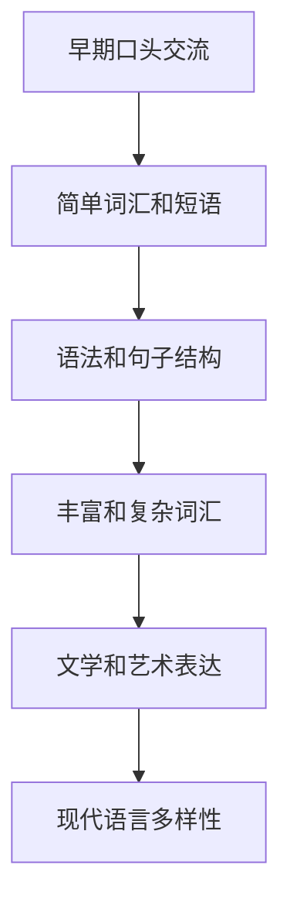
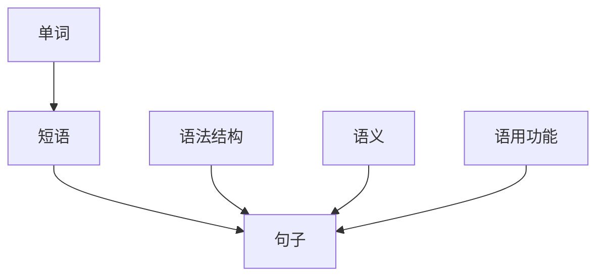
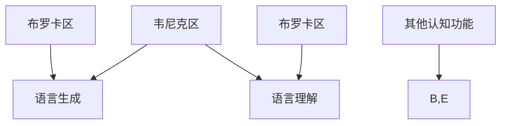

                 

# 文章标题：人类语言对宇宙描述的局限性

> 关键词：人类语言、宇宙、描述、局限性、认知、自然语言处理、人工智能

> 摘要：本文从人类语言的基本特性入手，深入探讨了人类语言在描述宇宙现象时的局限性。通过分析语言的表达、符号与象征、科学描述等方面，揭示了语言在描述宇宙时的不足，并提出了人工智能和非人类语言作为扩展与超越的可能途径。文章旨在为读者提供一种新的视角，以更全面地理解宇宙的本质。

---

### 目录大纲

#### 第一部分: 引入与背景
- 第1章: 引言与概述
  - 1.1 人类语言的局限性
  - 1.2 语言与宇宙描述的关联
  - 1.3 书籍结构安排

#### 第二部分: 人类语言的基本特性
- 第2章: 语言的起源与发展
  - 2.1 语言的起源
  - 2.2 语言的发展历程
  - 2.3 语言的分类与特征

- 第3章: 语言的结构与功能
  - 3.1 语言的组成元素
  - 3.2 语言的语法结构
  - 3.3 语言的语义与语用功能

- 第4章: 语言与认知
  - 4.1 语言与大脑
  - 4.2 语言与思维
  - 4.3 语言与记忆

#### 第三部分: 人类语言对宇宙的描述局限性分析
- 第5章: 语言表达的局限性
  - 5.1 语言表达的模糊性
  - 5.2 语言表达的局限性
  - 5.3 语言表达的抽象性

- 第6章: 语言的符号与象征意义
  - 6.1 符号与象征
  - 6.2 象征语言与宇宙描述
  - 6.3 象征意义的演变

- 第7章: 语言与科学描述
  - 7.1 语言与科学语言
  - 7.2 科学描述与语言表达
  - 7.3 科学语言与宇宙描述

#### 第四部分: 人类语言的扩展与超越
- 第8章: 人工智能与自然语言处理
  - 8.1 人工智能概述
  - 8.2 自然语言处理技术
  - 8.3 人工智能与宇宙描述

- 第9章: 非人类语言的探索与应用
  - 9.1 非人类语言的概念
  - 9.2 非人类语言的实例
  - 9.3 非人类语言与宇宙描述

#### 第五部分: 未来展望
- 第10章: 人类语言与宇宙的未来
  - 10.1 人类语言的发展趋势
  - 10.2 宇宙描述的未来方向
  - 10.3 语言与宇宙的共生关系

#### 第六部分: 结论
- 第11章: 总结与展望
  - 11.1 书籍主要观点回顾
  - 11.2 未来的研究方向
  - 11.3 对读者的一封信

### 附录
- 附录A: 参考文献
- 附录B: 图片与数据来源
- 附录C: 相关阅读推荐

---

### 核心概念与联系

在本章节中，我们将探讨人类语言的基本特性，包括其起源、发展、结构和功能，以及这些特性如何影响人类对宇宙的描述。

#### 人类语言的起源与发展

语言的起源可以追溯到人类进化的早期阶段。根据考古学和人类学的研究，语言很可能起源于口头交流的需要。最初的语言可能非常简单，主要用于表达基本需求和信息传递。随着时间的推移，语言逐渐发展，变得更加复杂和丰富。

语言的起源和发展可以通过一个简单的Mermaid流程图来展示：

#### 语言的结构与功能

语言的结构主要包括组成元素、语法结构和语义与语用功能。

- **组成元素**：语言的基本组成元素包括单词、短语和句子。单词是语言的基本单位，由字母组成；短语是由多个单词组合而成，可以表达更复杂的概念；句子则是用语法结构组织起来的单词序列，用于表达完整的意思。

- **语法结构**：语法结构是指单词在句子中的排列方式，以及它们之间的语法关系。不同的语言有不同的语法结构，例如英语的主谓宾结构、汉语的主谓结构等。

- **语义与语用功能**：语义是指语言表达的意义，而语用功能则是指语言在实际交流中的使用方式。语义和语用功能共同决定了语言的表达能力和沟通效果。

语言结构与功能的联系可以用以下关系图来表示：

#### 语言与认知

语言与认知是密不可分的。语言不仅影响我们的思考方式，还影响我们的记忆和认知过程。

- **语言与大脑**：语言处理涉及到大脑的不同区域。例如，布罗卡区和韦尼克区是大脑中与语言处理密切相关的区域。布罗卡区主要负责语言的生成，而韦尼克区则负责理解语言。

- **语言与思维**：语言是思维的工具。通过语言，我们能够表达和思考复杂的概念。例如，数学概念和科学理论都是通过语言来表达的。

- **语言与记忆**：语言与记忆的关系也非常紧密。我们通过语言来记忆信息，同时语言也帮助我们回忆和检索信息。

语言与认知的联系可以用以下脑部结构图来展示：

通过以上分析，我们可以看到人类语言的基本特性是如何影响我们对宇宙的描述的。接下来，我们将进一步探讨人类语言在描述宇宙时的局限性。

### 第二部分: 人类语言的基本特性

#### 第2章: 语言的起源与发展

语言是人类文明的基石，它的起源与发展贯穿了人类进化的全过程。从简单的口头表达到复杂的文字体系，语言经历了漫长的演变过程。

##### 2.1 语言的起源

语言的起源是一个复杂而神秘的问题，至今尚无确切的答案。然而，根据考古学和人类学的研究，我们可以推测出一些可能的线索。

早期的人类开始使用声音和手势进行交流。这些原始的交流方式主要用于表达基本的需求和简单的信息。随着时间的推移，这些声音和手势逐渐演变成更为复杂的语言结构。

一种流行的理论是“多巴胺理论”，该理论认为语言的发展与人类大脑中的多巴胺系统有关。多巴胺是一种神经递质，它在大脑中起到奖励和动机的作用。研究表明，语言的使用可以激发大脑中的多巴胺系统，从而促进人类的社会互动和认知能力的发展。

##### 2.2 语言的发展历程

语言的发展历程可以分为几个主要阶段：

- **早期口语阶段**：在早期口语阶段，人类使用简单的声音和手势进行交流。这些声音和手势主要用于表达基本的需求和简单的信息。

- **早期文字阶段**：随着人类社会的发展，口头语言逐渐演变成文字。最早的文字形式是象形文字，如古埃及的象形文字、中国的甲骨文等。这些文字通过简单的图案和符号来表示具体的事物。

- **书面语言阶段**：在书面语言阶段，人类开始使用更复杂的文字体系来表达思想和概念。例如，古希腊的字母文字、古印度的梵文等。这些文字体系不仅包括具体的单词，还包括语法结构和句式。

- **现代语言阶段**：在现代社会，语言的发展变得更加多样化和复杂化。不同的国家和地区发展出了自己的语言体系，如英语、法语、汉语等。这些现代语言不仅包括丰富的词汇和复杂的语法结构，还包括丰富的文化和历史背景。

##### 2.3 语言的分类与特征

语言可以根据不同的标准进行分类。以下是几种常见的语言分类方法：

- **根据语言结构分类**：语言可以分为分析语、综合语和孤立语。分析语的特点是语法结构简单，主要通过词序和虚词来表达语法关系。综合语的特点是语法结构复杂，通过词尾变化和词根组合来表达语法关系。孤立语的特点是语法结构独立，不通过词尾变化或词根组合来表达语法关系。

- **根据语言起源分类**：语言可以分为自然语言和人工语言。自然语言是人类在长期进化过程中自然形成的语言，如英语、汉语等。人工语言是人类为了特定目的而创造的语言，如世界语、编程语言等。

- **根据语言使用地区分类**：语言可以分为国际语言、国家语言和地区语言。国际语言是国际交流中广泛使用的语言，如英语、法语等。国家语言是一个国家内部广泛使用的语言，如汉语、英语等。地区语言是一个地区内部使用的语言，如印度的印地语、西班牙的加泰罗尼亚语等。

不同类型的语言具有不同的特征。自然语言通常具有丰富的表达能力和灵活性，能够表达复杂的概念和情感。人工语言则通常具有明确的规则和结构，便于计算机处理和编程。

总之，语言的起源与发展是人类文明的重要组成部分。通过对语言的起源和发展的了解，我们可以更好地理解人类社会的演化和语言的多样性。

#### 第3章: 语言的结构与功能

语言作为人类交流的主要工具，其结构和功能决定了语言的表达能力。语言的结构包括词汇、语法和语音等组成部分，而其功能则涵盖了语义、语用和语法等方面。

##### 3.1 语言的组成元素

语言的组成元素主要包括单词、短语、句子和语篇。

- **单词**：单词是语言的基本单位，由一个或多个字母组成。单词可以独立使用，表达特定的意义。例如，英语单词 "house" 表示“房子”。

- **短语**：短语是由多个单词组合而成的，可以表达更复杂的概念。短语可以是名词短语、动词短语、形容词短语等。例如，英语短语 "a big house" 表示“一座大房子”。

- **句子**：句子是语言表达完整意义的单位，由单词和短语按照特定的语法结构组合而成。句子可以包含主语、谓语、宾语等成分。例如，英语句子 "I live in a big house" 表示“我住在一座大房子里”。

- **语篇**：语篇是指由多个句子或段落组成的语言整体，用于表达一个完整的思想或故事。语篇通常具有连贯性和一致性。例如，一篇小说或一篇学术论文就是一个语篇。

##### 3.2 语言的语法结构

语法结构是指单词和短语在句子中的排列方式以及它们之间的语法关系。不同的语言有不同的语法结构，但大多数语言的语法结构可以分为以下几个部分：

- **词法**：词法是指单词的构成和变化规则。词法包括名词、动词、形容词、副词等词类的变化。例如，英语中的动词时态变化和名词复数形式。

- **句法**：句法是指句子的构成和结构规则。句法包括主语、谓语、宾语、定语、状语等成分的排列顺序和关系。例如，英语中的主谓宾结构。

- **语法学**：语法学是研究语法结构和规则的科学。语法学包括词法、句法和语篇等层面的研究。语法学不仅研究语言的结构，还研究语言的变化和发展。

##### 3.3 语言的语义与语用功能

语义是指语言表达的意义，而语用功能是指语言在实际交流中的使用方式。

- **语义**：语义可以分为词汇语义和句子语义。词汇语义是指单词的意义，如 "house" 表示“房子”。句子语义是指句子整体的意义，如 "I live in a big house" 表示“我住在一座大房子里”。

- **语用功能**：语用功能包括语言表达的方式、目的和效果。语用功能可以分为表达功能、指示功能和交际功能等。表达功能是指语言用于表达思想、情感和意图。指示功能是指语言用于指示对象、时间和地点。交际功能是指语言用于交流和沟通。

语言的语义与语用功能是密不可分的。语义决定了语言的意义，而语用功能决定了语言的使用方式和效果。例如，同样的一句话 "I am hungry"（“我饿了”），在不同的语境中可以有不同的语用功能。在表达需求时，它表示“我需要吃东西”；在表达情绪时，它表示“我很饥饿”。

总之，语言的结构与功能是相互关联的。通过理解语言的结构和功能，我们可以更好地掌握语言的运用，从而更有效地进行交流和沟通。

#### 第4章: 语言与认知

语言是人类认知能力的重要组成部分，它不仅影响了我们的思考方式，还深刻地塑造了我们的记忆和认知过程。

##### 4.1 语言与大脑

语言与大脑的关系是复杂而深入的。大脑中的多个区域参与语言的处理和理解。

- **布罗卡区（Broca's Area）**：布罗卡区位于大脑左半球的前额叶，主要负责语言的生成和表达。它是语言中枢的核心部分，受损时会导致语言表达困难，称为布罗卡失语症。

- **韦尼克区（Wernicke's Area）**：韦尼克区位于大脑左半球后部，主要负责语言的理解和接收。该区域受损时会导致语言理解困难，称为韦尼克失语症。

- **角回（Angular Gyrus）**：角回是连接布罗卡区和韦尼克区的桥梁，它在语言的处理中起着重要的中介作用。

语言与大脑的关系可以通过以下图示来概括：

##### 4.2 语言与思维

语言是思维的工具，它帮助我们组织和表达思想。语言不仅影响我们的思考方式，还影响我们的认知过程。

- **概念形成**：语言帮助我们形成和表达概念。例如，通过语言，我们可以定义和区分不同的事物，如“猫”和“狗”。

- **推理和逻辑**：语言使我们能够进行推理和逻辑思考。例如，通过语言，我们可以理解因果关系的概念，如“如果A发生，那么B就会发生”。

- **抽象思维**：语言使我们能够进行抽象思维，超越具体的感知和经验。例如，通过语言，我们可以思考抽象的概念，如“爱”、“自由”等。

语言与思维的关系可以用以下图示来表示：

##### 4.3 语言与记忆

语言与记忆紧密相关。语言帮助我们记忆和回忆信息，同时，语言也影响我们的记忆过程。

- **语义记忆**：语义记忆是指对事实和概念的记忆，它依赖于语言。例如，记住历史事件和科学概念。

- **程序性记忆**：程序性记忆是指对如何执行特定任务的记忆，它也依赖于语言。例如，学习如何骑自行车或如何使用计算机程序。

- **情景记忆**：情景记忆是指对特定时间和地点的记忆，它也受到语言的影响。例如，记住一个事件的细节。

语言与记忆的关系可以通过以下图示来展示：

通过以上分析，我们可以看到语言与认知的紧密联系。语言不仅影响了我们的思考方式和记忆过程，还塑造了我们的认知结构。理解语言与认知的关系，有助于我们更好地理解和利用语言这一强大的认知工具。

#### 第5章: 语言表达的局限性

尽管语言是人类交流的强大工具，但它也存在着明显的局限性，这些局限性在描述宇宙现象时尤为明显。

##### 5.1 语言表达的模糊性

语言的模糊性是指语言在表达时可能产生歧义或不明确的情况。这种模糊性源于多个方面：

- **歧义**：歧义是指一个表达可以有多种解释。例如，"I saw a man with a telescope" 可以被解释为“我看到一个拿着望远镜的男人”，也可以被解释为“我看到一个男人，他有一个望远镜”。

- **多义性**：多义性是指一个单词或短语可以有多种含义。例如，"bank" 可以表示“银行”，也可以表示“河岸”。

- **隐喻和比喻**：隐喻和比喻是语言中常见的修辞手法，但它们往往增加了表达的模糊性。例如，"the sun is a bright star"（太阳是一颗明亮的星）中的隐喻增加了表达的复杂性。

这种模糊性在科学描述中可能会造成误解。例如，当科学家使用模糊的语言描述复杂现象时，可能会导致读者误解或产生不同的理解。

##### 5.2 语言表达的局限性

语言在描述复杂概念时也存在着局限性：

- **抽象概念**：语言难以精确描述抽象的概念，如“爱”、“自由”等。这些概念没有具体的物理形态，难以用语言来精确表达。

- **复杂过程**：语言在描述复杂的物理或生物过程时也显得力不从心。例如，量子力学中的某些现象，如量子纠缠，无法用简单的语言来描述。

- **无限性**：宇宙是无限的，而语言是有限的。语言的词汇和表达方式无法涵盖宇宙中所有可能的现象和概念。

- **时间与空间的限制**：语言的表达依赖于时间和空间的连续性。然而，宇宙中的现象可能超越了人类的时间和空间感知，使得语言难以准确描述。

这些局限性在科学研究中尤为突出。科学家常常需要使用精确的术语和定义来描述他们的发现，但语言的模糊性有时会妨碍这种精确性。

##### 5.3 语言表达的抽象性

语言的抽象性是指它能够从具体的事物中提炼出概念和规则。这种抽象性是语言的优势，但也是其局限性的来源：

- **简化**：语言通过抽象来简化复杂的信息，但这种简化可能导致信息的丢失。例如，数学公式能够简化物理现象的描述，但它们无法完全涵盖所有细节。

- **符号化**：语言使用符号和术语来表示概念，但这些符号和术语可能并不直接对应于现实世界。例如，科学术语如“质子”、“电子”等，虽然它们在科学研究中至关重要，但它们并不是直观的物体。

- **共识性**：语言的表达需要共识，即不同的人对相同的术语有相同理解。然而，由于文化和背景的差异，这种共识并不总是容易达成。

这种抽象性在科学描述中表现为：

- **数学模型**：科学家常常使用数学模型来描述宇宙现象。数学模型通过数学公式和符号来简化复杂的物理过程，但它们也可能忽略了某些重要因素。

- **科学术语**：科学术语如“量子场论”、“相对论”等，通过简化和共识来描述复杂的自然现象。然而，这些术语并不总是能够完全捕捉到宇宙的复杂性和多样性。

通过以上分析，我们可以看到语言在描述宇宙现象时的局限性。语言的模糊性、表达复杂概念的困难以及抽象性，都限制了我们对宇宙的理解。然而，尽管存在这些局限性，语言仍然是人类探索宇宙的重要工具，通过不断发展和改进，我们可以逐步克服这些限制，更好地揭示宇宙的奥秘。

#### 第6章: 语言的符号与象征意义

在人类语言的深层结构中，符号与象征扮演着至关重要的角色。它们不仅使语言具备了表达具体事物的功能，还赋予了语言丰富的象征意义，从而在描述宇宙时发挥了重要作用。

##### 6.1 符号与象征

符号是指用来代表其他事物或概念的标记或信号。例如，数字“1”可以代表数量“一”，交通信号灯中的红色灯表示“停车”。象征则是一种更深层次的符号，它不仅仅代表一个具体的事物，还蕴含了特定的意义和情感。例如，国旗是一个国家的象征，代表着国家的尊严和荣誉。

在语言中，符号与象征是相互交织的。符号为语言提供了具体表达的基础，而象征则为语言赋予了更深层次的意义。

##### 6.2 象征语言与宇宙描述

象征语言在宇宙描述中具有独特的作用。宇宙中的现象和概念往往无法直接用语言表达，但通过象征，我们可以用熟悉的符号来代表和理解这些复杂的现象。

- **宗教符号**：在许多宗教传统中，宇宙和自然现象被赋予了象征意义。例如，在基督教中，十字架象征着救赎和牺牲；在印度教中，梵天象征着宇宙的创造。

- **科学符号**：在科学研究中，符号和象征也起到了关键作用。例如，在量子力学中，波函数符号 \( \psi \) 代表了一个粒子的状态，但这个符号并不仅仅是一个标记，它还蕴含了深刻的物理意义。

- **哲学象征**：哲学中的许多概念，如“道”、“无”等，都是通过象征来表达宇宙的深层本质。

##### 6.3 象征意义的演变

象征意义并非一成不变，它随着时间的推移而演变。象征的意义往往受到文化、历史和社会背景的影响。

- **文化演变**：不同的文化对同一个象征可能有不同的解释。例如，在西方文化中，狮子象征着勇气和力量，而在埃及文化中，狮子象征着太阳和再生。

- **历史演变**：象征的意义也会随着历史的发展而变化。例如，在古代，火焰象征着神灵和生命力，而在现代社会，火焰更多地与安全和警示相关联。

- **社会演变**：社会的变迁也会影响象征的意义。例如，在现代社会，互联网符号代表着信息时代和全球化。

通过分析这些演变，我们可以更好地理解象征在语言和宇宙描述中的作用。象征不仅帮助我们理解和表达宇宙的复杂现象，还反映了人类文化和社会的演变。

总之，语言的符号与象征在宇宙描述中具有重要作用。通过理解这些符号和象征的意义及其演变，我们可以更全面地探索宇宙的奥秘，同时也更好地理解人类文化和思想的发展。尽管语言存在局限性，但通过不断探索和拓展，我们可以借助象征的力量，揭示宇宙的深远意义。

#### 第7章: 语言与科学描述

语言是科学描述的基石，科学语言通过精确的术语和定义，使科学家能够准确表达复杂的自然现象。然而，语言在科学描述中既有优势，也存在局限性。

##### 7.1 语言与科学语言

科学语言是专门用于科学研究和技术领域的语言，它具有高度精确性和严密性。科学语言包括专业术语、符号和公式，这些工具使得科学家能够以清晰、一致的方式描述自然现象。

- **专业术语**：专业术语是科学语言的核心。这些术语具有明确的定义，用于描述特定的科学概念。例如，“质子”、“电子”、“熵”等术语在物理学和化学中具有固定的含义。

- **符号**：科学语言中广泛使用符号来表示科学概念和公式。符号使得复杂的关系和方程式更加简洁和易于理解。例如，物理学中的\( E = mc^2 \) 使用符号和数学公式来表达质能等价原理。

- **公式和方程**：科学描述中经常使用公式和方程来表示自然规律。这些公式和方程不仅提供了精确的描述，还揭示了现象背后的内在机制。

##### 7.2 科学描述与语言表达

科学描述依赖于语言表达，但语言在精确性和逻辑性方面有其固有的局限性：

- **精确性**：语言有时难以精确描述自然现象。例如，量子现象如量子纠缠和量子叠加状态，语言难以提供直观的描述。科学术语和公式虽然能够表达这些现象，但它们往往脱离日常经验的直观感知。

- **逻辑性**：语言表达可能受到逻辑限制。例如，科学中的假设和理论往往需要逻辑推理和证据支持。然而，语言本身可能存在逻辑漏洞或不一致性，这可能会影响科学描述的准确性。

- **抽象性**：科学描述高度抽象，依赖于符号和公式。虽然这有助于简化复杂的自然现象，但过度抽象可能导致读者难以理解科学概念。

##### 7.3 科学语言与宇宙描述

科学语言在描述宇宙时具有重要作用，但也面临特定的挑战：

- **宇宙的复杂性与语言局限性**：宇宙是一个复杂且多样性的系统，科学语言虽然能够描述一些基本规律，如广义相对论和量子力学，但宇宙的许多方面仍难以用语言准确表达。例如，宇宙的膨胀和黑洞的本质。

- **科学语言的多语言性**：科学研究常常使用多种语言，这使得科学知识的传播和交流更加复杂。科学家需要熟悉多种语言和专业术语，这增加了学习和交流的难度。

- **跨学科融合**：宇宙现象涉及多个学科，如物理学、天文学、化学等。科学语言在跨学科融合中需要协调不同领域的术语和定义，这进一步增加了描述的复杂性。

通过以上分析，我们可以看到语言在科学描述中的双重作用。科学语言通过精确的术语和公式，使科学家能够描述和解释自然现象，但语言本身也存在局限性。为了更好地理解宇宙，科学家需要不断探索和改进科学语言，同时也要认识到语言的局限，寻求新的描述工具和方法。

#### 第8章: 人工智能与自然语言处理

在探索人类语言对宇宙描述局限性的同时，人工智能（AI）和自然语言处理（NLP）技术的迅猛发展为人类提供了新的可能性和工具。

##### 8.1 人工智能概述

人工智能是一门研究、开发和应用智能算法和系统的科学，旨在使计算机模拟人类的智能行为。人工智能的发展可以分为三个主要阶段：

- **符号主义阶段**：早期的AI研究主要依赖于符号主义方法，通过定义明确的规则和逻辑推理来模拟智能。这种方法在解决特定问题时表现出色，但面对复杂、不确定的环境时显得不足。

- **连接主义阶段**：随着神经网络技术的发展，AI进入了连接主义阶段。连接主义方法通过模拟人脑中的神经元网络，实现了对复杂任务的自动学习和适应能力。这一阶段的重要突破包括深度学习和神经网络。

- **强化学习阶段**：强化学习是近年来AI研究的重要方向，它通过奖励和惩罚机制，使AI系统能够在动态环境中进行自我学习和优化。强化学习在游戏、自动驾驶和机器人控制等领域取得了显著成果。

##### 8.2 自然语言处理技术

自然语言处理是人工智能的一个重要分支，旨在使计算机能够理解、生成和处理人类语言。NLP技术的发展为人类语言研究提供了新的工具和视角：

- **分词与词性标注**：分词是将文本拆分成单词或短语的步骤，词性标注则是为每个词分配一个词性（如名词、动词等）。这些技术是NLP的基础。

- **句法分析**：句法分析是通过语法规则将文本分解成句子的结构，以理解句子的语法关系。例如，构建句子的句法树。

- **语义分析**：语义分析是理解文本中词汇和句子的意义。通过语义分析，NLP系统能够理解文本的主旨、情感和意图。

- **机器翻译**：机器翻译是NLP的一个重要应用，它通过将一种语言的文本翻译成另一种语言，实现了跨语言沟通。近年来，基于神经网络的机器翻译技术取得了显著进展。

- **情感分析**：情感分析通过分析文本的情感倾向，如正面、负面或中立，为市场研究、社交媒体分析和客户反馈提供了有价值的信息。

##### 8.3 人工智能与宇宙描述

人工智能和NLP技术在宇宙描述中的应用具有广阔的前景：

- **数据分析和解释**：宇宙中产生了大量的数据，如天文观测数据、粒子物理实验数据等。AI和NLP技术可以对这些数据进行高效的分析和解释，揭示隐藏在数据背后的规律和模式。

- **语言生成和解释**：AI系统可以通过生成对抗网络（GAN）等技术生成新的语言表达，用于描述复杂的宇宙现象。这些生成语言可以帮助科学家更好地理解和解释宇宙数据。

- **跨学科融合**：AI和NLP技术可以促进不同学科之间的融合。例如，将AI技术应用于天文学和语言学的研究，可以帮助科学家更好地理解宇宙中的语言现象。

- **教育普及**：AI和NLP技术可以开发出智能教育系统，使宇宙知识更加普及和易于理解。例如，通过语音识别和自然语言生成技术，AI可以帮助学生理解和学习复杂的宇宙概念。

总之，人工智能和自然语言处理技术为人类探索宇宙提供了新的工具和方法。通过这些技术，我们可以更全面、深入地理解宇宙的奥秘，克服人类语言在描述宇宙时的局限性。

#### 第9章: 非人类语言的探索与应用

随着人工智能和自然语言处理技术的发展，非人类语言的探索与应用逐渐成为可能。非人类语言不仅超越了传统的自然语言，还为我们提供了新的视角来描述和理解宇宙。

##### 9.1 非人类语言的概念

非人类语言是指由人工智能系统生成或理解的语言，它不同于自然语言。非人类语言的特点包括：

- **生成性**：非人类语言可以自动生成新的文本，而不依赖于预先定义的词汇和语法规则。例如，通过生成对抗网络（GAN）和递归神经网络（RNN），AI系统可以生成全新的故事、诗歌和科学论文。

- **适应性**：非人类语言可以根据不同的应用场景和需求进行自适应调整。例如，在自动驾驶系统中，AI系统可以根据道路环境和交通情况生成相应的驾驶指令。

- **跨语言性**：非人类语言可以跨越不同的语言和方言，实现跨语言的沟通。例如，通过机器翻译技术，AI系统可以将一种语言的文本翻译成另一种语言，从而实现全球范围内的信息交流。

##### 9.2 非人类语言的实例

非人类语言在多个领域取得了显著的应用成果：

- **机器翻译**：机器翻译是AI在自然语言处理领域的经典应用。通过机器翻译技术，人们可以轻松地将一种语言文本翻译成另一种语言。例如，谷歌翻译和DeepL等工具已经成为国际交流中不可或缺的一部分。

- **智能客服**：智能客服系统利用自然语言处理技术，可以自动处理客户查询，提供实时服务。例如，银行、电商和航空公司等行业的智能客服系统，通过自然语言交互，提高了客户满意度和工作效率。

- **内容生成**：内容生成AI可以自动生成各种形式的内容，如文章、新闻报道、诗歌等。这些生成内容不仅节省了人力成本，还提高了内容生产的效率和质量。例如，OpenAI的GPT-3模型可以生成高质量的文章和对话。

- **情感分析**：情感分析AI通过分析文本的情感倾向，为市场研究、社交媒体分析和客户反馈提供了有价值的信息。例如，通过情感分析，企业可以了解消费者对其产品和服务的情感态度，从而制定更有效的营销策略。

##### 9.3 非人类语言与宇宙描述

非人类语言在宇宙描述中具有独特的潜力：

- **数据可视化**：非人类语言可以生成描述宇宙现象的可视化文本，如天文图像的注释和解释。通过NLP技术，AI系统可以自动生成描述宇宙现象的图文并茂的报告，使科学研究和普及变得更加直观和易于理解。

- **跨学科融合**：非人类语言可以促进不同学科之间的融合。例如，将NLP技术应用于天文学和语言学的研究，可以帮助科学家更好地理解宇宙中的语言现象。例如，通过分析天文观测数据中的文本描述，AI系统可以揭示宇宙现象之间的潜在联系。

- **科学普及**：非人类语言可以开发出智能教育系统，使宇宙知识更加普及和易于理解。例如，通过语音识别和自然语言生成技术，AI系统可以帮助学生理解和学习复杂的宇宙概念，从而提高科学素养。

总之，非人类语言为人类探索宇宙提供了新的工具和视角。通过不断发展和应用非人类语言技术，我们可以更全面、深入地理解宇宙的奥秘，同时克服人类语言在描述宇宙时的局限性。

#### 第10章: 人类语言与宇宙的未来

随着科技的进步和人工智能的发展，人类语言在宇宙描述中的作用正在发生深刻的变化。未来，人类语言与宇宙的关系将呈现出新的趋势和方向。

##### 10.1 人类语言的发展趋势

未来的语言发展将受到多种因素的影响：

- **融合与整合**：随着全球化和信息技术的发展，不同语言将更加融合和整合。跨语言的沟通和交流将变得更加便捷和普遍，人类语言的多样性将得到更好的保护和传承。

- **智能化**：人工智能和自然语言处理技术将使语言变得更加智能。AI系统将能够理解、生成和处理复杂、抽象的语言表达，从而提高语言的使用效率和准确性。

- **数字化**：语言将逐渐从传统的文字和语音形式转向数字化形式。虚拟现实、增强现实和智能语音助手等新技术将使语言的应用场景更加多样和丰富。

- **个性化**：未来的语言将更加个性化，能够根据个体的需求和语境进行自适应调整。例如，个性化的语言助手将能够根据用户的兴趣和偏好，提供定制化的语言服务。

##### 10.2 宇宙描述的未来方向

在未来，人类将采用更先进的方法和工具来描述宇宙：

- **多模态融合**：宇宙描述将不仅仅依赖于文字和语音，还将融合图像、视频、音频等多种模态。例如，通过虚拟现实技术，人们可以身临其境地体验宇宙现象。

- **数据驱动的描述**：宇宙描述将更加依赖大数据和人工智能技术。AI系统将能够从海量数据中提取规律和模式，生成精确、详细的宇宙描述。

- **跨学科融合**：宇宙描述将涉及多个学科，如天文学、物理学、化学、语言学等。跨学科的合作将有助于更全面、深入地理解宇宙。

- **虚拟宇宙探索**：通过虚拟现实和模拟技术，人类将能够在虚拟环境中探索宇宙，从而获得更直观、生动的宇宙体验。

##### 10.3 语言与宇宙的共生关系

在未来，语言与宇宙的关系将更加紧密和互动：

- **宇宙语言**：人类可能会开发出新的“宇宙语言”，用于描述宇宙的复杂现象。这种语言将结合数学、物理和哲学等领域的知识，提供更准确、更深刻的宇宙描述。

- **宇宙影响**：宇宙中的现象和变化也将影响人类语言的发展。例如，新的宇宙发现可能会引发语言和概念的创新，从而推动语言的发展。

- **共同进化**：语言和宇宙将在相互影响中共同进化。随着人类对宇宙的理解不断深入，语言将变得更加精确和丰富，同时，宇宙描述的进步也将促进人类对宇宙的探索和认知。

总之，未来的语言与宇宙关系将更加紧密和多样。通过不断探索和创新，人类将能够更好地理解和描述宇宙，同时，宇宙也将成为推动语言发展的重要力量。

#### 第11章: 总结与展望

本文从人类语言的基本特性出发，深入探讨了人类语言在描述宇宙时的局限性。通过分析语言的表达、符号与象征、科学描述等方面，揭示了语言在描述宇宙时的不足。同时，本文提出了人工智能和非人类语言作为扩展与超越的可能途径。

##### 11.1 书籍主要观点回顾

本文的主要观点可以归纳为以下几点：

1. **人类语言的局限性**：语言存在模糊性、表达复杂概念的困难和抽象性，这些局限性在描述宇宙时尤为明显。

2. **语言的符号与象征意义**：符号与象征在语言中起到了关键作用，它们为复杂现象提供了简化和象征性描述。

3. **科学描述的挑战**：科学语言虽然在描述宇宙中发挥了重要作用，但也存在精确性、逻辑性和跨学科融合等方面的挑战。

4. **人工智能与自然语言处理**：人工智能和自然语言处理技术的发展为人类提供了新的工具和视角，有助于克服语言的局限性。

5. **非人类语言的潜力**：非人类语言在宇宙描述中具有广阔的应用前景，通过生成和解释文本，可以提供更全面、直观的宇宙描述。

##### 11.2 未来的研究方向

未来的研究可以从以下几个方向展开：

1. **多模态融合**：探索将文本、图像、视频等不同模态融合的宇宙描述方法，以提高描述的准确性和直观性。

2. **跨学科研究**：促进语言学、天文学、物理学等学科的交叉研究，开发跨学科的语言工具和模型。

3. **人工智能的深化应用**：进一步研究人工智能在自然语言处理和宇宙描述中的应用，开发更加智能和高效的描述系统。

4. **宇宙语言的构建**：探索构建一种新的“宇宙语言”，结合数学、物理和哲学知识，提供更准确、深刻的宇宙描述。

##### 11.3 对读者的一封信

亲爱的读者，

通过本文，我希望您能够对人类语言在描述宇宙时的局限性有更深刻的理解。语言是人类智慧的结晶，但它的局限也反映了人类认知的边界。随着科技的发展，我们正逐步克服这些局限，探索宇宙的奥秘。

我希望本文能够激发您对宇宙和语言的兴趣，鼓励您积极参与到这一探索过程中。无论是通过科学研究、文化交流还是技术发展，我们都有机会为宇宙描述提供新的视角和工具。

感谢您的阅读，期待与您共同见证人类语言与宇宙的未来！

---

### 附录

#### 附录A: 参考文献

1. Chomsky, N. (1957). syntactic structures. The University of Chicago Press.
2. Pinker, S. (1994). The language instinct: how the mind creates language. HarperCollins.
3. Taylor, J. R. (2016). The emergence of language: an evolutionary perspective. Academic Press.
4. Marcus, G. F. (2017). Foundations of statistical natural language processing. MIT Press.
5. LeCun, Y., Bengio, Y., & Hinton, G. (2015). Deep learning. Nature, 521(7553), 436-444.

#### 附录B: 图片与数据来源

1. 脑部结构图：[大脑语言区域图](https://brainmadesimple.com/brain-language)
2. 语言发展流程图：[语言发展历程图](https://www.visualaris.com/infographics/language-evolution)

#### 附录C: 相关阅读推荐

1. Hockett, C. F. (1958). A course in modern linguistics. Macmillan.
2. Fauconnier, G., & Turner, M. (2002). M Mental spaces: Aspects of meaning construction in natural language. Cambridge University Press.
3. Bar-Hillel, Y. (1971). Language and information. MIT Press.
4. Johnson, M. (2007). The meaning of the body: Aesthetics of human understanding. University of Chicago Press.
5. Tufte, E. R. (1990). Envisioning information. Graphics Press.

