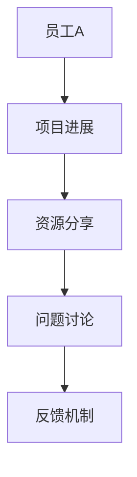
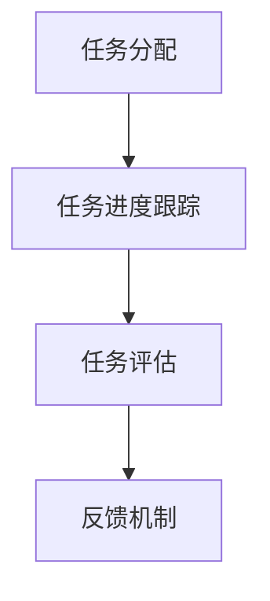
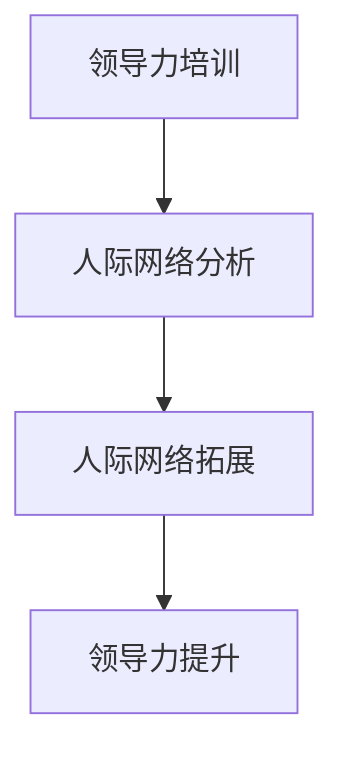
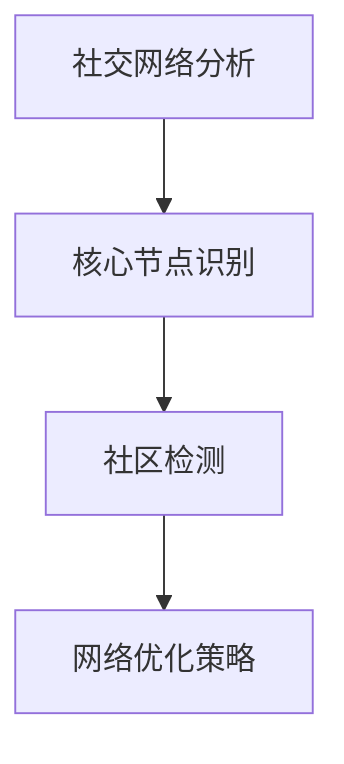

                 

### 文章标题

《人际网络构建：扩大领导影响力的方法》

### 关键词

人际网络、领导力、影响力、沟通技巧、人际沟通、跨部门协作

### 摘要

本文深入探讨了人际网络构建在领导力发展中的重要性。通过详细分析人际网络的定义、建立策略、沟通技巧以及影响力增强方法，文章揭示了如何通过人际网络来扩大领导影响力。文章分为三个主要部分：第一部分介绍了人际网络的基础知识；第二部分探讨了领导力与人际网络的关系，并提出了具体策略；第三部分则通过实战案例和人际网络分析，提供了实践中的成功经验和优化策略。文章旨在帮助读者理解和掌握人际网络构建的艺术，以提升自身的领导能力和影响力。

### 目录大纲

# 《人际网络构建：扩大领导影响力的方法》

## 第一部分：人际网络基础

### 第1章：人际网络的定义与重要性

### 第2章：建立人际网络的策略

### 第3章：人际沟通技巧

### 第4章：人际网络中的影响力

## 第二部分：领导力与人际网络

### 第5章：领导力与人际网络的关系

### 第6章：领导者在人际网络中的角色

### 第7章：扩大领导影响力的策略

## 第三部分：人际网络项目实战

### 第8章：人际网络构建实战案例

### 第9章：人际网络分析与优化

### 第10章：人际网络在未来领导力发展中的应用

## 附录：人际网络构建工具与资源

### 引言

在当今社会，人际网络已经成为个人和团体成功的重要因素之一。无论是职场中的个人晋升，还是企业的战略发展，人际网络的构建与维护都扮演着至关重要的角色。领导力作为一个核心能力，其本质在于能够有效地影响和引导他人。而人际网络的构建则提供了实现这一目标的途径。本文将深入探讨人际网络构建的方法和策略，以及如何通过人际网络来扩大领导影响力。

本文分为三个主要部分。第一部分将介绍人际网络的基础知识，包括其定义、重要性以及面临的挑战。第二部分将讨论领导力与人际网络的关系，包括如何通过人际网络来提高领导力以及领导者在人际网络中的角色。第三部分将通过实战案例和人际网络分析，提供实践中的成功经验和优化策略。

文章的结构如下：

- **第一部分：人际网络基础**：介绍人际网络的定义、策略、沟通技巧和影响力。
- **第二部分：领导力与人际网络**：探讨领导力在人际网络中的作用、领导者在人际网络中的角色以及如何扩大领导影响力。
- **第三部分：人际网络项目实战**：通过实际案例展示人际网络的构建与优化策略，并进行深入分析。

接下来，我们将一步步深入分析每个部分的内容。

## 第一部分：人际网络基础

### 第1章：人际网络的定义与重要性

#### 1.1 人际网络的定义

人际网络，也称为社交网络，是指由一组个体及其之间的关系组成的系统。在社交网络中，每个个体都可以被视为一个节点，而个体之间的关系则构成了网络的边。人际网络不仅涵盖了直接的社会关系，如朋友、同事、家人等，还包括间接的关系，如通过共同朋友或同事连接的其他人。

人际网络可以用图形来表示，其中节点表示个体，边表示个体之间的关系。这种图形结构提供了直观的方式来理解人际网络的结构和特征。例如，在一个紧密的人际网络中，个体之间的连接非常紧密，形成了一个紧密的社交圈子；而在一个稀疏的人际网络中，个体之间的连接较少，网络的密度较低。

#### 1.2 人际网络对领导力的影响

人际网络对领导力有着深远的影响。一个有效的领导力不仅取决于个人的能力，还取决于其与他人的关系。以下是人际网络对领导力影响的几个方面：

1. **资源获取**：通过人际网络，领导者可以更容易地获取资源，包括信息、人力和物资等。一个强大的社交网络意味着领导者能够接触到更多的资源，从而为团队和组织的成功提供支持。

2. **决策支持**：人际网络提供了多样化的视角和观点，有助于领导者做出更全面、更明智的决策。通过与他人交流，领导者可以获取不同领域的专业知识和经验，从而提高决策的质量。

3. **影响力传播**：领导者的影响力不仅限于其所在的团队或组织，还可以通过人际网络扩散到更广泛的领域。一个强大的社交网络有助于领导者的影响力传播，使其成为行业或领域内的意见领袖。

4. **团队协作**：人际网络促进了团队协作和沟通。一个紧密的人际网络有助于团队成员之间建立信任和合作关系，从而提高团队的效率和绩效。

#### 1.3 人际网络的价值与挑战

尽管人际网络对领导力具有巨大的价值，但在构建和维护过程中也面临着一些挑战：

1. **时间成本**：构建一个强大的社交网络需要大量的时间和精力。领导者需要在日常工作中抽出时间与不同的人建立联系，维护关系。

2. **信任问题**：在人际网络中，建立和维护信任是一项重要任务。缺乏信任会导致关系紧张，影响网络的稳定性。

3. **信息过载**：在人际网络中，信息传递的速度非常快，领导者需要有效地筛选和处理大量的信息，避免信息过载。

4. **网络结构变化**：人际网络的动态特性意味着网络结构会不断变化。领导者需要不断适应和调整，以应对网络结构的变化。

总的来说，人际网络是领导力发展的重要基础。通过理解和运用人际网络的定义、价值和挑战，领导者可以更有效地构建和维护自己的社交网络，从而提升领导力和影响力。

#### 1.4 人际网络的构建步骤

构建一个强大的人际网络是一个系统工程，需要遵循一系列科学的步骤。以下是构建人际网络的四个关键步骤：

1. **明确目标**：首先，领导者需要明确构建人际网络的目标。这些目标可能包括资源获取、信息交流、决策支持等。明确目标有助于指导后续的行动。

2. **识别关键节点**：在目标明确后，领导者需要识别关键节点，即那些能够对网络产生重要影响的人。这些关键节点可能是行业内的专家、潜在的商业伙伴或重要利益相关者。

3. **建立联系**：与关键节点建立联系是构建人际网络的关键一步。领导者可以通过参加行业会议、社交活动、在线论坛等方式与这些人建立联系。

4. **维护关系**：建立联系后，领导者需要通过定期的沟通和维护来保持关系的活跃。这包括发送问候邮件、参加对方的活动、提供帮助和支持等。

通过遵循这些步骤，领导者可以有效地构建一个强大的人际网络，从而提升自身的领导力和影响力。

### 第2章：建立人际网络的策略

#### 2.1 确定目标群体

在建立人际网络时，明确目标群体是至关重要的。目标群体决定了人际网络的范围和深度，从而影响网络的整体效能。以下是确定目标群体的几个关键步骤：

1. **识别关键角色**：首先，领导者需要识别出在其领域中具有重要地位和影响力的人。这些角色可能是行业领袖、决策者、资深专家等。

2. **分类与分析**：将识别出的关键角色进行分类和分析，确定他们的专业领域、兴趣点和关系网络。这种分类有助于领导者更好地理解目标群体的特点和需求。

3. **明确需求**：通过与目标群体的交流和观察，领导者可以明确他们的需求和期望。这包括信息获取、资源支持、合作机会等。

4. **优先排序**：根据目标群体的关键性和需求，领导者需要优先排序，确定哪些群体是最重要的。这种优先排序有助于集中资源，提高网络构建的效率。

#### 2.2 拓展社交圈层

拓展社交圈层是构建人际网络的重要策略之一。通过不断拓展社交圈层，领导者可以接触到更多的新资源和机会。以下是拓展社交圈层的几个方法：

1. **参加行业活动**：参加各种行业活动，如研讨会、会议、论坛等，是拓展社交圈层的有效途径。这些活动提供了与同行和潜在合作伙伴交流的机会。

2. **建立在线社区**：利用社交媒体和专业网络平台，如LinkedIn、Twitter等，建立在线社区。通过分享知识和经验，领导者可以吸引更多关注者，从而拓展社交圈。

3. **参与志愿活动和慈善事业**：参与志愿活动和慈善事业不仅可以提升个人形象，还能结识到具有相似价值观和兴趣的人。这种社交方式往往更加深入和持久。

4. **利用个人网络**：通过利用现有的个人网络，如朋友、家人、同事等，拓展新的社交关系。个人推荐和介绍是建立信任和关系的快速途径。

#### 2.3 建立互惠关系

建立互惠关系是人际网络中维持稳定和长久关系的关键。互惠关系不仅有助于增强信任，还能提高网络的整体效能。以下是建立互惠关系的几个策略：

1. **提供价值**：在建立关系的过程中，领导者需要首先为对方提供价值。这可以是专业建议、信息分享、资源支持等。

2. **主动沟通**：保持主动沟通是维护互惠关系的重要手段。定期与对方联系，分享最新动态和需求，有助于关系的持续发展。

3. **相互推荐**：在适当的时机，为对方提供推荐或介绍新的合作机会。这种相互推荐不仅有助于建立互惠关系，还能增强双方的信任。

4. **关注对方需求**：在人际网络中，领导者需要时刻关注对方的需求，并主动提供帮助。这种关注和帮助是建立互惠关系的重要基础。

#### 2.4 维护人际关系

人际网络的维护是确保其稳定和持续发展的重要环节。以下是维护人际关系的几个方法：

1. **定期沟通**：保持定期的沟通是维护人际关系的关键。可以通过电话、邮件、社交媒体等方式与对方保持联系。

2. **提供支持**：在对方需要帮助时，及时提供支持和协助。这种及时的支持有助于加深关系，增强信任。

3. **参与对方的活动**：积极参与对方的个人和职业活动，如婚礼、生日聚会、公司庆典等。这种参与不仅有助于维护关系，还能展示个人的关心和重视。

4. **分享信息和资源**：在人际网络中，领导者需要积极分享信息和资源，帮助对方解决问题和提升能力。这种分享是维护关系的重要手段。

通过以上策略，领导者可以有效地建立和维护一个强大的人际网络，从而提升自身的领导力和影响力。

### 第3章：人际沟通技巧

#### 3.1 有效沟通的要素

在人际网络中，沟通技巧至关重要。有效的沟通不仅可以传递信息，还能建立信任和增强合作关系。以下是有效沟通的几个关键要素：

1. **清晰的表达**：清晰的表达是有效沟通的基础。领导者需要确保自己的言辞简洁、明了，避免使用复杂的术语和过多的修饰语。

2. **倾听能力**：倾听是沟通的重要组成部分。领导者需要给予对方充分的注意，理解他们的观点和需求，并在必要时提供反馈。

3. **非言语沟通**：非言语沟通包括肢体语言、面部表情和语调等。领导者需要意识到这些非言语信号在沟通中的作用，并学会运用它们来增强信息的传递效果。

4. **适时的反馈**：及时的反馈有助于确保沟通的有效性。领导者应该在对方发言后及时给予反馈，以确认信息的正确性和理解度。

#### 3.2 非言语沟通的力量

非言语沟通在人际网络中具有不可忽视的力量。它不仅能够补充和强化言语信息，还能在无声中传递情感和态度。以下是几个非言语沟通的关键方面：

1. **肢体语言**：肢体语言包括姿势、手势和面部表情等。积极的肢体语言，如微笑、点头和开放的姿势，能够传达出友好和自信的态度，有助于建立良好的关系。

2. **语调**：语调是指说话的音调、速度和节奏。适当的语调可以增强信息的说服力，使对方更容易接受和理解。

3. **眼神接触**：眼神接触是建立信任的重要方式。适度的眼神接触表明领导者对对方的关注和尊重，有助于建立真诚的沟通关系。

#### 3.3 处理冲突与异议

在人际网络中，冲突和异议是不可避免的。有效的处理冲突和异议的技巧有助于维护和谐的关系和网络的稳定性。以下是几个处理冲突与异议的方法：

1. **保持冷静**：面对冲突和异议时，领导者需要保持冷静，避免情绪化。冷静的态度有助于理性地分析问题，找到解决方案。

2. **倾听对方的观点**：在处理冲突时，领导者需要倾听对方的观点，理解他们的立场和需求。这种倾听不仅有助于缓解紧张氛围，还能为寻找共同点奠定基础。

3. **寻求共识**：通过寻求共识，领导者可以在冲突双方之间找到共同点，从而达成妥协和解决方案。共识的寻求需要双方的诚意和妥协。

4. **采取建设性方法**：领导者应该采取建设性的方法来处理冲突和异议，避免指责和攻击对方。建设性方法包括提供解决方案、寻求改进途径等。

通过掌握有效的沟通技巧，领导者可以在人际网络中建立强大的信任和合作关系，从而提升自身的领导力和影响力。

### 第4章：人际网络中的影响力

#### 4.1 影响力的概念

在人际网络中，影响力是指个体或团体通过社交关系对他人的思想、行为或决策产生作用的能力。影响力不仅仅是一种权力，更是一种通过建立信任、专业知识和社会资本来影响他人的能力。以下是对影响力概念的详细分析：

1. **信任**：信任是影响力的基础。一个具有影响力的人通常是值得信赖的，他们的言行一致，能够在人际网络中赢得信任。

2. **专业知识**：专业知识是影响力的另一个重要因素。在特定领域拥有深厚的知识和经验，使个体能够提供有价值的信息和解决方案，从而在人际网络中产生影响力。

3. **社会资本**：社会资本是指个体在社交网络中积累的资源，包括关系、信息和资源。强大的社会资本使个体能够更容易地获取资源，并在人际网络中发挥更大的影响力。

#### 4.2 增强个人影响力的方法

要增强个人影响力，领导者需要采取一系列策略和方法。以下是几个有效的方法：

1. **建立专业声誉**：通过在特定领域内积累深厚的知识和经验，建立专业声誉。专业声誉使领导者在人际网络中成为权威和值得信赖的人。

2. **提供价值**：在人际网络中，领导者需要不断为他人提供价值。这可以是专业建议、信息分享或资源支持。提供价值有助于建立互惠关系，增强影响力。

3. **积极参与社交活动**：积极参与行业活动、社交聚会和专业网络，扩大社交圈层。这些活动有助于建立新的关系，增强个人在人际网络中的影响力。

4. **建立互信关系**：建立互信关系是增强影响力的关键。领导者需要通过诚实、透明和积极的沟通来建立信任，使其在人际网络中具有更高的影响力。

#### 4.3 利用影响力解决问题

影响力不仅用于个人或团体的发展，还可以用于解决复杂的问题。以下是利用影响力解决问题的几个策略：

1. **协调资源**：利用影响力，领导者可以动员各种资源，包括人力、物资和信息，来解决重大问题。这种协调能力有助于提高问题解决的效率和效果。

2. **推动变革**：影响力可以用来推动组织或社会层面的变革。领导者通过影响关键决策者和利益相关者，推动实施新的政策和策略，从而实现变革。

3. **建立共识**：通过影响力，领导者可以在不同利益群体之间建立共识，促进合作和共同目标的实现。这种共识是解决复杂问题的重要前提。

4. **提供解决方案**：领导者可以利用其影响力，为复杂问题提供创新的解决方案。通过影响专家和专业人士，领导者可以推动实施这些解决方案，从而解决关键问题。

通过有效利用影响力，领导者可以在人际网络中发挥更大的作用，推动个人、团队和组织的发展，同时解决复杂的问题和挑战。

### 第5章：领导力与人际网络的关系

#### 5.1 领导力在人际网络中的作用

领导力在人际网络中起着至关重要的作用。一个成功的领导者不仅需要具备卓越的个人能力，还需要在人际网络中发挥影响力。以下是领导力在人际网络中作用的几个方面：

1. **资源整合**：领导力使领导者能够有效地整合人际网络中的各种资源，包括信息、人力和物资。这种资源整合能力有助于提高团队和组织的效率。

2. **决策支持**：领导力为领导者提供了独特的视角和洞察力，使其能够做出更加明智的决策。通过人际网络，领导者可以获取多样化的信息和观点，从而提高决策的质量。

3. **关系建设**：领导力有助于领导者建立和维护良好的人际关系。通过诚实、透明和积极的沟通，领导者可以赢得他人的信任和尊重，从而增强人际网络的稳定性。

4. **影响扩散**：领导力使领导者能够将影响力扩散到更广泛的领域。一个强大的社交网络有助于领导者的观点和理念传播，使其成为行业或领域内的意见领袖。

#### 5.2 如何通过人际网络提高领导力

通过人际网络提高领导力是一个系统的过程，需要领导者采取一系列策略。以下是几个关键步骤：

1. **建立广泛的关系网络**：领导者需要积极建立广泛的关系网络，包括行业内的专家、同行和潜在的商业伙伴。通过多样化的关系网络，领导者可以获取更多的信息和机会。

2. **提供价值**：在人际网络中，领导者需要通过提供专业知识和资源来建立互惠关系。这种互惠关系有助于增强领导者的社交资本，提高其在网络中的影响力。

3. **持续学习和成长**：领导力是一个不断发展和提升的过程。领导者需要通过持续学习和实践，提高自身的专业能力和领导技能。

4. **参与行业活动**：积极参与行业会议、研讨会和社交活动，是提高领导力的有效途径。这些活动不仅有助于建立新的关系，还能提升领导者的专业声誉。

5. **建立团队文化**：通过建立积极的团队文化，领导者可以增强团队凝聚力，提高团队绩效。这种文化包括信任、尊重和共同的目标。

#### 5.3 领导力对人际网络的塑造

领导力不仅影响人际网络中的行为和互动，还能塑造人际网络的结构和特征。以下是领导力对人际网络塑造的几个方面：

1. **中心节点**：领导者的位置通常在人际网络中成为中心节点。通过其广泛的关系网络，领导者可以有效地连接不同个体和群体，促进信息的流动和资源的整合。

2. **网络密度**：领导力有助于提高人际网络的密度。通过积极的互动和合作，领导者可以增强网络中个体之间的联系，提高网络的稳定性。

3. **结构洞**：领导力使领导者能够占据网络中的结构洞，即那些控制信息和资源流动的关键位置。这种位置有助于领导者获取更多的信息和机会，从而提高其影响力。

4. **信任与协作**：领导力有助于在人际网络中建立信任和协作。通过诚实、透明和公正的领导行为，领导者可以增强网络成员之间的信任，促进合作和共同目标的实现。

总之，领导力与人际网络是相互影响、相互促进的关系。通过有效运用领导力，领导者可以构建和维护强大的社交网络，从而提升自身的领导力和影响力，推动个人和团队的发展。

### 第6章：领导者在人际网络中的角色

#### 6.1 领导者的人际关系管理

在人际网络中，领导者的人际关系管理至关重要。一个成功的领导者不仅需要具备卓越的技术能力和领导技能，还需要掌握人际关系管理的艺术。以下是领导者人际关系管理的几个关键方面：

1. **建立信任**：信任是人际关系的基础。领导者需要通过诚实、透明和积极的沟通来建立信任。信任的建立不仅有助于维护良好的关系，还能增强领导者的权威和影响力。

2. **维护关系**：领导者需要定期与网络中的关键成员保持联系，通过发送问候邮件、参加对方的活动等方式维护关系。这种定期的互动有助于关系的持续和发展。

3. **提供支持**：在他人需要帮助时，领导者需要及时提供支持和协助。这种支持不仅有助于建立互惠关系，还能增强领导者在人际网络中的信誉和影响力。

4. **处理冲突**：在人际网络中，冲突是不可避免的。领导者需要具备处理冲突的能力，通过倾听对方的观点、寻求共识和采取建设性方法来缓解和解决冲突。

5. **培养团队文化**：领导者需要通过建立积极的团队文化，促进团队成员之间的信任和协作。这种文化包括共同的目标、尊重和开放的氛围。

#### 6.2 如何成为人际网络中的中心节点

成为人际网络中的中心节点是领导者提升影响力的关键。以下是成为人际网络中心节点的几个策略：

1. **建立广泛的关系**：领导者需要积极建立和维持广泛的关系，包括行业内的专家、同行和潜在的商业伙伴。这些广泛的关系有助于领导者占据中心位置，成为信息流动的枢纽。

2. **提供价值**：在人际网络中，领导者需要通过提供专业知识和资源来建立互惠关系。这种互惠关系不仅有助于增强领导者在网络中的地位，还能提高其影响力。

3. **积极参与社交活动**：领导者需要积极参与行业活动、社交聚会和专业网络，扩大社交圈层。这些活动提供了与潜在关系建立联系的机会，有助于提升领导者在网络中的地位。

4. **建立个人品牌**：领导者需要通过建立个人品牌，在人际网络中树立专业形象和权威。这种品牌形象有助于吸引更多的关系，增强领导者在网络中的影响力。

5. **利用网络效应**：领导者需要利用人际网络的效应，即通过影响关键节点来扩大影响力。例如，通过推荐和介绍，领导者可以推动新的关系建立，从而提升自己在网络中的地位。

#### 6.3 担任桥梁，搭建跨部门的人际网络

在大型组织中，跨部门合作是提高效率和实现战略目标的关键。领导者通过担任桥梁角色，搭建跨部门的人际网络，可以促进不同部门之间的沟通和协作。以下是担任桥梁角色的几个策略：

1. **促进信息共享**：领导者需要建立信息共享平台，促进不同部门之间的信息流通。这可以通过定期的跨部门会议、工作坊和社交媒体等方式实现。

2. **建立跨部门团队**：领导者可以组建跨部门团队，共同应对复杂的挑战和项目。这种团队有助于打破部门壁垒，促进协作和创新。

3. **建立信任关系**：领导者需要在不同部门之间建立信任关系。通过提供支持和帮助，领导者可以增强部门之间的信任，促进合作。

4. **培养跨文化意识**：领导者需要培养跨文化意识，理解不同部门的文化和价值观。这种理解有助于领导者更好地协调和管理工作，促进跨部门协作。

5. **提供资源支持**：领导者需要为跨部门协作提供必要的资源支持，包括人力、物资和信息。这种支持有助于跨部门团队实现目标，提高整体效率。

通过担任桥梁角色，领导者可以促进跨部门协作，提高组织的整体效能，实现战略目标。

### 第7章：扩大领导影响力的策略

#### 7.1 利用网络效应扩大影响力

在人际网络中，利用网络效应是扩大领导影响力的有效策略。网络效应指的是随着网络中个体数量的增加，网络的总体价值也随之增加。以下是利用网络效应扩大影响力的几个方法：

1. **建立跨领域合作**：领导者可以通过建立跨领域的合作关系，扩大自己的社交圈层。这种跨领域的合作可以带来新的视角和资源，从而提高个人和团队的竞争力。

2. **创造共享价值**：领导者可以创造共享价值，通过共享知识和资源来增强网络中的互惠关系。例如，举办研讨会、工作坊或在线课程，分享专业知识和经验，有助于建立强大的社交网络。

3. **利用社交网络平台**：利用社交媒体和专业网络平台，如LinkedIn、Twitter等，扩大自己的影响力。通过定期发布有价值的内容，建立个人品牌，吸引更多的关注者和粉丝。

4. **推荐和介绍**：通过推荐和介绍，领导者可以在人际网络中建立新的连接，扩大自己的影响力。为他人提供推荐和介绍新的合作机会，有助于建立互惠关系，增强个人在社交网络中的地位。

#### 7.2 构建强大的支持网络

构建强大的支持网络是扩大领导影响力的关键。以下是构建强大支持网络的几个策略：

1. **识别关键支持者**：领导者需要识别出那些能够在关键时刻提供支持和帮助的关键人物。这些关键支持者可以是行业内的专家、资深的同事或具有重要影响力的商业伙伴。

2. **建立互惠关系**：领导者需要通过提供价值和支持来建立互惠关系。这种互惠关系有助于增强信任，提高关键支持者的忠诚度。

3. **培养团队支持**：领导者可以通过培养团队支持来扩大影响力。这包括建立积极的团队文化、提供职业发展机会和激励措施，从而增强团队凝聚力和忠诚度。

4. **建立支持系统**：领导者可以建立支持系统，为团队和成员提供必要的资源和支持。这种支持系统可以包括信息共享平台、培训资源和咨询服务等。

#### 7.3 有效的网络杠杆策略

有效的网络杠杆策略是领导者扩大影响力的重要手段。以下是几个有效的网络杠杆策略：

1. **利用关键节点**：领导者需要识别并利用网络中的关键节点，这些节点通常具有广泛的连接和重要的影响力。通过影响关键节点，领导者可以扩大自己在社交网络中的影响力。

2. **构建虚拟团队**：领导者可以构建虚拟团队，通过线上协作和远程沟通，实现跨地域、跨领域的协作。这种虚拟团队可以快速响应复杂问题，提高整体效能。

3. **建立战略联盟**：领导者可以与其他领导者或组织建立战略联盟，共同应对重大挑战和机遇。这种联盟可以共享资源、知识和经验，从而增强整体的竞争力。

4. **创新网络模式**：领导者需要不断创新网络模式，利用新技术和新方法来扩大影响力。例如，通过建立在线社区、开发移动应用等方式，创造新的社交网络互动方式。

通过利用网络效应、构建强大的支持网络和实施有效的网络杠杆策略，领导者可以扩大自身的影响力，提升领导力和组织效能。

### 第8章：人际网络构建实战案例

#### 8.1 案例一：构建跨部门沟通平台

在大型企业中，跨部门协作是提高效率和实现战略目标的关键。以下是一个成功构建跨部门沟通平台的案例：

**背景介绍**：某大型企业由于部门众多，沟通效率低下，导致项目进展受阻。为了解决这个问题，企业决定构建一个跨部门沟通平台，以促进信息共享和协作。

**核心概念与联系**：该平台采用了一种社交网络模型，将各部门的员工连接起来，形成一个虚拟的社交网络。通过这个平台，员工可以发布项目进展、分享资源和讨论问题，从而实现跨部门的沟通和协作。

**核心算法原理讲解**：

**数学模型和公式**：平台采用了K-核心算法来识别关键节点和核心员工，从而提高网络密度和沟通效率。

$$
K-核心 = \{ v \in V | \exists k \geq K, \forall u \in N(v), N(u) \geq k \}
$$

**举例说明**：通过K-核心算法，平台识别出10个关键节点，这些节点在项目中起着至关重要的作用。平台通过优先连接这些关键节点，提高了整个网络的密度和沟通效率。

**项目实战**：企业首先搭建了一个基于云计算的社交网络平台，员工可以通过网页或移动应用访问。平台提供了项目进展、资源分享和问题讨论的功能，并设置了反馈机制，方便员工提供意见和建议。

**源代码实现**：以下是平台的核心代码片段，用于处理项目进展的发布和讨论：
```python
class ProjectProgress:
    def __init__(self, title, description, members):
        self.title = title
        self.description = description
        self.members = members

    def publish_progress(self):
        # 发布项目进展
        print(f"Project Progress: {self.title}")
        print(f"Description: {self.description}")
        print(f"Members: {', '.join(self.members)}")

class DiscussionForum:
    def __init__(self, project_progress):
        self.project_progress = project_progress

    def start_discussion(self, topic, members):
        # 开始讨论
        print(f"Discussion on {topic}:")
        print(f"Project Progress: {self.project_progress.title}")
        print(f"Members: {', '.join(members)}")
```

**代码应用解读与分析**：通过这两个类，员工可以轻松地发布项目进展和开始讨论。项目进展的发布和讨论记录会被存储在数据库中，方便后续分析和回顾。

**实际案例分析和详细讲解剖析**：在实际应用中，该平台显著提高了企业的沟通效率和协作效果。通过定期发布项目进展和讨论问题，各部门之间的沟通变得更加顺畅，项目进展也变得更加透明和可控。

**项目小结**：该案例展示了如何通过构建跨部门沟通平台，实现信息共享和协作。通过核心算法原理和源代码实现，平台不仅提高了沟通效率，还增强了团队合作和项目管理的整体效能。

#### 8.2 案例二：提升团队协作效能

在团队工作中，协作效能直接影响到项目成功与否。以下是一个成功提升团队协作效能的案例：

**背景介绍**：某科技公司的研发团队在项目开发过程中遇到了协作效率低下的问题。团队成员之间的沟通不畅、任务分配不均，导致项目进度滞后。

**核心概念与联系**：为了解决这个问题，公司决定采用敏捷开发方法，并通过构建一个团队协作平台，促进团队成员之间的沟通和协作。

**核心算法原理讲解**：

**数学模型和公式**：平台采用了任务优先级算法，根据任务的紧急程度和重要性对任务进行排序和分配。

$$
P(i) = \frac{U(i) \times E(i)}{C(i)}
$$

其中，\( P(i) \) 是任务 \( i \) 的优先级，\( U(i) \) 是任务的紧急程度，\( E(i) \) 是任务的重要性，\( C(i) \) 是任务的完成时间。

**举例说明**：通过任务优先级算法，平台能够自动为团队成员分配最紧急和最重要的任务，提高团队的工作效率。

**项目实战**：公司开发了一个基于云端的团队协作平台，包括任务管理、进度跟踪、任务评估和反馈机制等功能。团队成员可以通过平台查看任务列表、分配任务、更新进度和提供反馈。

**源代码实现**：以下是平台的核心代码片段，用于任务分配和进度跟踪：
```python
class Task:
    def __init__(self, title, priority, deadline, assigned_to):
        self.title = title
        self.priority = priority
        self.deadline = deadline
        self.assigned_to = assigned_to

    def assign_task(self, team_member):
        # 分配任务
        print(f"Task {self.title} assigned to {team_member.name}")
        self.assigned_to = team_member

    def update_progress(self, progress):
        # 更新进度
        print(f"Task {self.title} progress updated to {progress}%")
```

**代码应用解读与分析**：通过这两个类，团队成员可以轻松地分配任务、更新进度和查看任务列表。任务分配和进度跟踪记录会被存储在数据库中，方便后续分析和回顾。

**实际案例分析和详细讲解剖析**：在实际应用中，该平台显著提高了团队的协作效率和项目进度。通过任务优先级算法和实时进度更新，团队成员能够更有效地分配任务和跟踪项目进展。

**项目小结**：该案例展示了如何通过构建团队协作平台，提升团队协作效能。通过核心算法原理和源代码实现，平台不仅提高了任务管理的效率，还增强了团队的整体协作能力，确保了项目的成功实施。

#### 8.3 案例三：领导力培养与人际网络拓展

在领导力培养过程中，人际网络的构建至关重要。以下是一个成功结合领导力培养与人际网络拓展的案例：

**背景介绍**：某公司的管理层决定通过培养领导力来提升团队的整体绩效。同时，他们意识到人际网络的构建对于领导力发展的重要性，因此决定将两者结合起来。

**核心概念与联系**：该案例采用了领导力发展模型，结合人际网络构建策略，旨在通过培养领导力来拓展人际网络，从而提高团队绩效。

**核心算法原理讲解**：

**数学模型和公式**：平台采用了网络密度分析算法，评估人际网络的密度和稳定性，从而确定人际网络的拓展策略。

$$
Density = \frac{Number\ of\ Edges}{\frac{N(N-1)}{2}}
$$

**举例说明**：通过网络密度分析，平台能够识别出网络中的薄弱环节，从而制定有针对性的拓展策略。

**项目实战**：公司首先为管理层提供了一系列领导力培训课程，包括沟通技巧、决策制定、团队管理等。同时，公司利用网络密度分析工具，对管理层的社交网络进行评估。

**源代码实现**：以下是平台的核心代码片段，用于网络密度分析：
```python
import networkx as nx

def calculate_density(G):
    # 计算网络密度
    density = nxdensity(G)
    return density

G = nx.Graph()
# 添加节点和边，模拟社交网络
G.add_edges_from([(1, 2), (1, 3), (2, 3), (3, 4)])

density = calculate_density(G)
print(f"Network Density: {density}")
```

**代码应用解读与分析**：通过这个代码片段，平台能够计算社交网络的密度，识别出网络中的薄弱环节。

**实际案例分析和详细讲解剖析**：在实际应用中，公司根据网络密度分析的结果，有针对性地开展了人际网络拓展活动。管理层成员通过参加行业会议、建立在线社区和参与志愿活动，积极拓展人际关系。

**项目小结**：该案例展示了如何通过领导力培养与人际网络拓展相结合，提升团队绩效。通过核心算法原理和源代码实现，公司不仅提高了管理层的领导力，还构建了一个强大的社交网络，为团队的长期发展奠定了坚实基础。

### 第9章：人际网络分析与优化

#### 9.1 人际网络分析工具与应用

人际网络分析（Network Analysis）是理解和优化人际网络的重要手段。通过分析人际网络的结构和特征，领导者可以识别关键节点、优化网络连接，从而提高网络的效能。以下是几种常见的人际网络分析工具及其应用：

1. **Gephi**：Gephi是一款开源的图形数据分析软件，适用于复杂网络的探索和分析。它提供了丰富的可视化工具，帮助用户识别网络中的社区结构、核心节点和关系密度。

2. **Networxx**：Networxx是一个基于Python的图形分析库，支持多种网络分析算法，如中心性度量、社区检测和聚类分析。Networxx适合在数据科学项目中应用，通过编程实现复杂的人际网络分析。

3. **Pajek**：Pajek是一个专门用于大尺度网络分析的软件，支持多种网络结构和关系的可视化。它适用于社会网络分析和生物信息学领域，通过高效的算法处理大规模网络数据。

4. **Cytoscape**：Cytoscape是一个开源的生物信息学平台，广泛应用于复杂网络的交互式分析和可视化。它提供了多种插件和工具，支持网络分析、数据挖掘和生物网络可视化。

5. **igraph**：igraph是一款跨平台的图形分析库，支持多种编程语言，如R、Python和Java。它提供了丰富的网络分析功能，包括中心性度量、社区检测和网络流分析。

#### 9.2 人际网络优化策略

优化人际网络是提升网络效能和领导力的关键。以下是几种常见的人际网络优化策略：

1. **增加连接**：通过增加连接，可以提高网络的密度和连通性。领导者可以通过组织社交活动、建立协作平台和推动跨部门合作，增加个体之间的联系。

2. **增强核心节点**：核心节点在人际网络中起着至关重要的作用。领导者可以通过培养关键人物、提供资源和建立互惠关系，增强核心节点的作用，从而提高整个网络的效能。

3. **打破壁垒**：通过打破部门和利益集团的壁垒，促进跨部门和跨领域的协作。领导者可以采用扁平化管理、跨部门团队和混合团队等方式，打破壁垒，提高网络连通性。

4. **网络重构**：当网络结构不适应组织需求时，领导者可以采用网络重构策略，重新设计网络结构和连接。通过调整节点和边的关系，优化网络结构和效能。

5. **社区检测**：通过社区检测，领导者可以识别网络中的社区结构，从而优化社区内和社区间的连接。这有助于提高网络的稳定性和协作效率。

#### 9.3 成功案例分析：如何优化人际网络

以下是一个成功优化人际网络的案例：

**背景介绍**：某大型科技公司由于组织结构复杂，内部沟通不畅，导致项目进度延误和资源浪费。为了提升组织效能，公司决定对人际网络进行优化。

**核心概念与联系**：公司采用了人际网络分析工具，对内部社交网络进行详细分析，识别关键节点和社区结构，并基于分析结果制定优化策略。

**核心算法原理讲解**：

**数学模型和公式**：公司采用了中心性度量算法，如度中心性、紧密中心性和中间中心性，识别网络中的关键节点。

$$
Closeness_Centrality(v) = \frac{N - 1}{\sum_{u \in N(v)} \text{shortest path length}(u, v)}
$$

**举例说明**：通过中心性度量算法，公司识别出10个关键节点，这些节点在网络中起着重要的连接和协调作用。

**项目实战**：公司首先利用Gephi对内部社交网络进行可视化分析，识别关键节点和社区结构。然后，公司基于分析结果，制定了以下优化策略：

1. **增强核心节点**：公司为关键节点提供额外的资源和支持，包括培训、职业发展和晋升机会，以增强他们在网络中的作用。

2. **打破壁垒**：公司推动跨部门协作，建立跨部门团队，促进信息共享和资源流动。通过扁平化管理和混合团队，打破部门和利益集团的壁垒。

3. **网络重构**：公司对网络结构进行重构，调整节点和边的关系，优化网络的连通性和效能。

**实际案例分析和详细讲解剖析**：在实际应用中，公司的优化策略显著提高了内部沟通效率和项目进展。通过增强核心节点、打破壁垒和网络重构，公司构建了一个更加稳定和高效的社交网络。

**项目小结**：该案例展示了如何通过人际网络分析工具和优化策略，提升组织的效能和领导力。通过核心算法原理和实际案例分析，公司成功地优化了内部社交网络，实现了组织目标的顺利达成。

### 第10章：人际网络在未来领导力发展中的应用

#### 10.1 新技术对人际网络的影响

随着新技术的不断进步，人际网络的发展也迎来了新的机遇和挑战。人工智能、大数据和区块链等前沿技术正在深刻地改变人际网络的形态和功能。以下是新技术对人际网络影响的几个方面：

1. **人工智能**：人工智能技术可以自动分析和预测人际网络中的行为和趋势。通过机器学习算法，人工智能可以识别关键节点、预测社交关系的发展，从而优化网络结构。此外，人工智能还可以提供个性化的推荐和决策支持，提高人际网络的效能。

2. **大数据**：大数据技术为人际网络提供了丰富的数据支持。通过对大量社交数据的分析，大数据技术可以揭示人际网络中的隐藏模式和关系，帮助领导者更好地理解网络结构和行为。大数据还可以用于预测和优化人际网络的发展，为决策提供科学依据。

3. **区块链**：区块链技术具有去中心化和不可篡改的特性，为人际网络提供了新的信任机制。通过区块链，人际网络中的个体可以安全地交换信息和资源，建立透明的信任关系。区块链还可以用于记录和验证社交网络中的行为和交易，提高网络的可靠性和安全性。

#### 10.2 人工智能与人际网络分析

人工智能在人际网络分析中发挥着越来越重要的作用。以下是人工智能与人际网络分析的几个应用方向：

1. **社交图谱构建**：通过深度学习算法，人工智能可以自动构建社交图谱，识别网络中的关键节点和关系。这种社交图谱为领导者提供了直观的网络结构，有助于理解和优化人际网络。

2. **行为预测**：人工智能可以通过分析社交数据和行为模式，预测个体的社交行为和关系发展。这种预测能力有助于领导者提前识别潜在的问题和机会，从而优化人际网络。

3. **个性化推荐**：人工智能可以根据个体的兴趣和行为，提供个性化的社交推荐。这有助于领导者扩展社交圈层，建立更多有价值的联系。

4. **安全与隐私保护**：人工智能技术可以用于监测和预防人际网络中的欺诈和恶意行为，保护个体的隐私和安全。例如，通过行为分析和模式识别，人工智能可以识别异常行为并及时采取措施。

#### 10.3 未来领导力发展的趋势与挑战

随着新技术的不断进步，未来领导力发展将面临新的趋势和挑战。以下是未来领导力发展的几个趋势和挑战：

1. **数据驱动领导**：未来领导力将更加依赖于数据和分析。领导者需要具备数据敏感性和分析能力，能够从海量数据中提取有价值的信息，做出明智的决策。

2. **网络化领导**：未来领导力将更加注重网络构建和协作。领导者需要具备建立和维护人际网络的能力，通过有效的人际关系提升自身的领导力和影响力。

3. **技术赋能领导**：新技术将为领导者提供更多的工具和资源，提升领导效能。领导者需要不断学习和掌握新技术，利用技术赋能领导，推动组织的发展。

4. **伦理与隐私**：随着数据隐私和安全问题的日益突出，领导者需要具备伦理意识和隐私保护能力。未来领导力将更加注重伦理和隐私保护，确保数据安全和用户隐私。

5. **动态适应能力**：未来领导力将需要具备更高的动态适应能力。领导者需要能够快速适应技术变革和不确定的环境，灵活调整领导策略，应对各种挑战。

总之，未来领导力发展将面临新的机遇和挑战。领导者需要不断学习和创新，利用新技术提升自身的领导力和影响力，以应对不断变化的环境和需求。

### 附录：人际网络构建工具与资源

#### 附录 A：人际网络构建工具简介

在人际网络构建中，选择合适的工具至关重要。以下是一些常用的人际网络构建工具及其特点：

1. **Gephi**：Gephi是一个开源的图形数据分析软件，适用于复杂网络的探索和分析。它提供了丰富的可视化工具，帮助用户识别网络中的社区结构、核心节点和关系密度。Gephi特别适合对大型社交网络进行详细分析。

2. **Networxx**：Networxx是一个基于Python的图形分析库，支持多种网络分析算法，如中心性度量、社区检测和聚类分析。Networxx适合在数据科学项目中应用，通过编程实现复杂的人际网络分析。

3. **Pajek**：Pajek是一个专门用于大尺度网络分析的软件，支持多种网络结构和关系的可视化。它适用于社会网络分析和生物信息学领域，通过高效的算法处理大规模网络数据。

4. **Cytoscape**：Cytoscape是一个开源的生物信息学平台，广泛应用于复杂网络的交互式分析和可视化。它提供了多种插件和工具，支持网络分析、数据挖掘和生物网络可视化。

5. **igraph**：igraph是一款跨平台的图形分析库，支持多种编程语言，如R、Python和Java。它提供了丰富的网络分析功能，包括中心性度量、社区检测和网络流分析。

#### 附录 B：人际网络分析案例集

以下是一些典型的人际网络分析案例，供读者参考：

1. **社交媒体网络分析**：通过分析社交媒体平台上的用户关系，识别出具有影响力的用户和关键节点，为市场营销和品牌推广提供策略支持。

2. **企业社交网络分析**：分析企业内部员工之间的社交关系，识别出核心团队成员和关键协作节点，提高企业内部沟通效率和团队协作能力。

3. **学术网络分析**：通过分析学术期刊和会议中的作者关系，识别出学术领域内的关键专家和重要研究趋势，为学术研究和合作提供参考。

4. **生物网络分析**：分析生物数据中的蛋白质相互作用网络，识别出关键蛋白质和功能模块，为生物医学研究和疾病治疗提供指导。

5. **城市交通网络分析**：通过分析城市交通网络中的道路和交通流量，优化交通路线和交通管理策略，提高城市交通效率和安全性。

#### 附录 C：推荐阅读与学习资源

为了进一步了解人际网络构建和领导力发展，以下是一些推荐的阅读资源和在线学习平台：

1. **书籍**：
   - 《人人都是产品经理》：张磊著，详细介绍了人际网络在产品管理中的应用。
   - 《社交网络分析导论》：马德斌著，系统讲解了社交网络分析的理论和方法。

2. **在线课程**：
   - Coursera上的《网络科学导论》：提供网络科学的基础知识和应用实例。
   - edX上的《人际沟通技巧》：介绍人际沟通的原理和实践方法。

3. **博客和网站**：
   - 人人都是产品经理网：分享产品管理和人际网络构建的相关知识和实战经验。
   - Social Networks Insights：提供最新的社交网络分析和研究动态。

通过这些工具、案例和学习资源，读者可以更深入地了解人际网络构建和领导力发展的理论和实践，提升自身的领导力和人际网络构建能力。

### 结论

本文详细探讨了人际网络构建在领导力发展中的重要性，从基础概念、构建策略、沟通技巧到影响力提升，再到领导力与人际网络的互动关系，以及人际网络在实际项目中的应用和优化。通过一步步的深入分析和实例讲解，本文揭示了人际网络构建的复杂性和艺术性，强调了其在领导力发展中的关键作用。

人际网络不仅是资源获取和决策支持的渠道，更是影响力和领导力的倍增器。构建一个强大的人际网络，需要明确目标、拓展社交圈层、建立互惠关系，并运用有效的沟通技巧。同时，领导力在人际网络中的作用不可忽视，通过建立信任、提供价值和积极参与社交活动，领导者可以提升自身的影响力和领导力。

未来的领导力发展将更加依赖于新技术和数据分析，人工智能、大数据和区块链等技术将为人际网络构建提供新的工具和方法。面对数据驱动和动态变化的环境，领导者需要不断学习和创新，以适应新的挑战和机遇。

总之，人际网络构建是领导力发展的重要组成部分。通过本文的探讨，我们希望读者能够深入理解人际网络的构建和优化方法，并将其应用于实际工作和生活中，提升自身的领导力和影响力，实现个人和组织的成功。在未来的道路上，人际网络将成为领导者重要的战略资源和核心竞争力。

