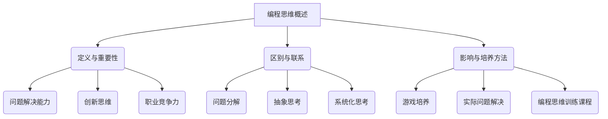

                 


# 从代码到提示：编程思维的转变

> 关键词：编程思维，算法思维，软件开发，项目管理，持续提升

> 摘要：本文旨在探讨编程思维的重要性和转变过程，包括编程思维的定义与培养方法，编程思维在实战中的应用，以及编程思维的拓展和持续提升。通过逐步分析推理，本文将帮助读者理解编程思维的本质，并掌握其在不同领域中的实际应用。

## 第一部分：编程思维的转变

### 第1章：编程思维概述

#### 1.1 编程思维的定义与重要性

编程思维是一种解决问题的方式，它强调逻辑推理、抽象思考和系统化思考。编程思维不仅仅是编写代码的能力，更是一种思维方式，它可以帮助我们更好地理解问题、分析问题和解决问题。

编程思维的重要性体现在以下几个方面：

1. **提高问题解决能力**：编程思维可以帮助我们更快地找到问题的根源，从而提高问题解决的能力。
2. **促进创新思维**：编程思维鼓励我们不断尝试新的方法和思路，从而激发创新思维。
3. **提升职业竞争力**：在当今信息时代，编程思维已经成为许多职业的核心技能，具备编程思维的人具有更强的竞争力。

#### 1.2 编程思维与传统编程的区别

传统编程侧重于代码的编写和实现，而编程思维则更注重于解决问题的过程和方法。编程思维强调以下几个方面：

1. **问题分解**：将复杂的问题分解为简单的子问题，从而降低问题解决的难度。
2. **抽象思考**：从具体的问题中提取出通用的解决方案，从而提高问题解决的可复用性。
3. **系统化思考**：将各个子问题有机地结合起来，形成一个完整的解决方案。

#### 1.3 编程思维对职业发展的影响

编程思维对职业发展有着重要的影响。具备编程思维的员工能够更快地适应新的工作环境，更好地解决复杂的问题，从而提高工作效率和质量。同时，编程思维还能够帮助我们更好地进行团队协作和项目管理，提升整体团队的能力。

### 第2章：编程思维的培养方法

#### 2.1 通过游戏培养编程思维

游戏是培养编程思维的有效途径之一。通过玩游戏，我们可以锻炼逻辑思维、空间想象力和问题解决能力。以下是一些适合培养编程思维的经典游戏：

1. **数独**：通过填数字来满足特定的规则，锻炼逻辑推理能力。
2. **解谜游戏**：通过解决谜题来锻炼抽象思考和问题解决能力。
3. **策略游戏**：通过制定策略来战胜对手，锻炼系统化思考和决策能力。

#### 2.2 通过实际问题解决培养编程思维

实际问题的解决是培养编程思维的另一个重要途径。通过解决实际问题，我们可以锻炼编程思维的各个方面。以下是一些适合培养编程思维的实际问题：

1. **排序算法**：通过比较和交换元素来对数据进行排序，锻炼逻辑思维和抽象思考能力。
2. **路径规划**：通过寻找最短路径来解决问题，锻炼系统化思考和问题解决能力。
3. **网络编程**：通过构建网络应用程序来解决问题，锻炼编程思维的综合能力。

#### 2.3 编程思维训练课程推荐

为了系统地培养编程思维，我们可以参加一些专门的编程思维训练课程。以下是一些推荐的编程思维训练课程：

1. **算法思维训练课程**：通过讲解算法的核心概念和方法，锻炼编程思维的能力。
2. **编程思维实战课程**：通过实际项目练习，培养编程思维的实际应用能力。
3. **编程思维在线课程**：通过在线学习，灵活安排学习时间和进度。

## 第二部分：编程思维的实战应用

### 第3章：编程思维在算法中的应用

#### 3.1 算法思维的核心概念

算法思维是编程思维的重要组成部分。算法思维强调以下几个方面：

1. **问题抽象**：将具体问题抽象为数学模型或算法模型，从而简化问题解决的难度。
2. **逻辑推理**：通过逻辑推理来推导算法的正确性和效率。
3. **优化策略**：通过优化算法的复杂度和性能，提高问题解决的效率。

#### 3.2 算法思维的案例分析

以下是一个经典的算法思维案例：寻找数组中的最大值。

```python
def find_max(arr):
    max_val = arr[0]
    for i in range(1, len(arr)):
        if arr[i] > max_val:
            max_val = arr[i]
    return max_val
```

在这个案例中，我们通过循环遍历数组，比较每个元素和当前最大值的大小，从而找到最大值。这个算法的核心是逻辑推理，通过简单的比较操作，我们可以得出正确的结果。

#### 3.3 编程思维在算法设计中的实践

在算法设计中，编程思维可以帮助我们更好地理解问题，并提出有效的解决方案。以下是一些常用的编程思维在算法设计中的实践方法：

1. **问题分解**：将复杂的问题分解为简单的子问题，从而简化问题解决的难度。
2. **抽象建模**：通过建立数学模型或算法模型，将问题转化为更易于求解的形式。
3. **优化策略**：通过分析算法的复杂度，寻找优化算法性能的方法。

### 第4章：编程思维在软件开发中的应用

#### 4.1 软件开发中的编程思维

在软件开发中，编程思维可以帮助我们更好地理解需求、设计和实现软件系统。以下是一些编程思维在软件开发中的应用：

1. **需求分析**：通过抽象思考和逻辑推理，将用户需求转化为具体的软件功能。
2. **系统设计**：通过系统化思考和抽象建模，设计出高效的软件系统架构。
3. **代码编写**：通过编程思维，编写出结构清晰、易于维护的代码。

#### 4.2 编程思维在需求分析中的应用

在需求分析中，编程思维可以帮助我们更好地理解用户需求，并提出合理的解决方案。以下是一些编程思维在需求分析中的应用方法：

1. **问题抽象**：通过抽象思考，将具体的用户需求转化为通用的功能需求。
2. **需求建模**：通过建立数学模型或算法模型，对需求进行分析和验证。
3. **需求验证**：通过逻辑推理和测试，验证需求是否满足用户要求。

#### 4.3 编程思维在代码编写中的应用

在代码编写中，编程思维可以帮助我们编写出结构清晰、易于维护的代码。以下是一些编程思维在代码编写中的应用方法：

1. **模块化设计**：通过模块化设计，将复杂的功能分解为简单的子功能，从而提高代码的可读性和可维护性。
2. **抽象数据类型**：通过使用抽象数据类型，将具体的数据处理转化为通用的数据处理方法。
3. **代码复用**：通过编写通用函数和模块，实现代码的复用，从而提高开发效率。

### 第5章：编程思维在项目管理中的应用

#### 5.1 项目管理中的编程思维

在项目管理中，编程思维可以帮助我们更好地规划项目、管理和执行项目任务。以下是一些编程思维在项目管理中的应用：

1. **任务分解**：通过问题分解，将复杂的项目任务分解为简单的子任务，从而简化项目管理的难度。
2. **进度控制**：通过进度控制，确保项目按计划进行，并及时调整计划。
3. **风险控制**：通过风险分析和管理，识别和应对项目风险。

#### 5.2 编程思维在任务规划中的应用

在任务规划中，编程思维可以帮助我们更好地制定任务计划，并提高任务执行的效率。以下是一些编程思维在任务规划中的应用方法：

1. **问题建模**：通过建立数学模型或算法模型，对任务进行分析和优化。
2. **任务分配**：通过任务分配，合理分配资源，确保任务按计划完成。
3. **时间管理**：通过时间管理，确保任务在规定的时间内完成。

#### 5.3 编程思维在团队协作中的应用

在团队协作中，编程思维可以帮助我们更好地进行沟通和协作，提高团队的工作效率。以下是一些编程思维在团队协作中的应用方法：

1. **需求沟通**：通过抽象思考和逻辑推理，确保团队对需求的理解一致。
2. **代码评审**：通过代码评审，发现代码中的问题，并提高代码的质量。
3. **任务协作**：通过任务协作，实现任务的高效完成，并提高团队的凝聚力。

## 第三部分：编程思维的拓展

### 第6章：编程思维在其他领域的应用

#### 6.1 编程思维在教育中的应用

编程思维在教育中具有重要的应用价值。通过编程思维，学生可以更好地理解和掌握计算机科学知识，提高问题解决能力和创新思维。以下是一些编程思维在教育中的应用方法：

1. **课程设计**：通过设计编程课程，将编程思维融入课程中，培养学生的编程思维。
2. **教学策略**：通过采用编程思维的教学策略，提高教学效果，培养学生的编程思维。
3. **课外活动**：通过组织编程竞赛和实践活动，激发学生的编程兴趣，培养编程思维。

#### 6.2 编程思维在产品设计中的应用

编程思维在产品设计中具有重要的作用。通过编程思维，设计师可以更好地理解用户需求，提出创新的解决方案，并提高产品的用户体验。以下是一些编程思维在产品设计中的应用方法：

1. **需求分析**：通过抽象思考和逻辑推理，准确理解用户需求，提出合理的解决方案。
2. **交互设计**：通过交互设计，优化产品界面和交互流程，提高用户的体验。
3. **系统优化**：通过系统优化，提高产品的性能和稳定性，提升用户体验。

#### 6.3 编程思维在创新创业中的应用

编程思维在创新创业中具有重要的应用价值。通过编程思维，创业者可以更好地发现商业机会，提出创新的解决方案，并提高创业项目的成功率。以下是一些编程思维在创新创业中的应用方法：

1. **市场调研**：通过市场调研，准确把握市场需求，发现商业机会。
2. **产品原型**：通过快速开发产品原型，验证商业想法，降低创业风险。
3. **团队协作**：通过团队协作，实现创业项目的顺利推进，提高创业成功率。

### 第7章：编程思维的持续提升

#### 7.1 编程思维的学习资源推荐

为了持续提升编程思维，我们可以利用各种学习资源进行学习和实践。以下是一些推荐的编程思维学习资源：

1. **书籍推荐**：如《算法导论》、《编程珠玑》等经典书籍，可以帮助我们深入了解编程思维的核心概念和原理。
2. **在线课程推荐**：如《算法与数据结构》、《软件工程导论》等在线课程，可以帮助我们系统地学习编程思维的相关知识。
3. **编程社区推荐**：如GitHub、Stack Overflow等编程社区，可以帮助我们交流编程思维的经验和技巧。

#### 7.2 编程思维的自我评估与改进

为了持续提升编程思维，我们需要进行自我评估和改进。以下是一些自我评估和改进的方法：

1. **定期总结**：定期总结自己在编程思维方面的收获和不足，找出需要改进的地方。
2. **实践反思**：通过实践编程项目，反思自己的编程思维，不断提高自己的编程能力。
3. **请教他人**：向经验丰富的程序员请教编程思维方面的经验，借鉴他人的优秀做法。

#### 7.3 编程思维的未来发展趋势

随着人工智能和大数据等技术的快速发展，编程思维在未来的应用前景将更加广泛。以下是一些编程思维的未来发展趋势：

1. **智能化编程**：通过智能化工具和平台，实现编程思维的自动化和智能化。
2. **跨学科融合**：编程思维与其他学科的融合，如心理学、设计学等，将产生更多的创新应用。
3. **编程思维普及化**：随着编程思维的普及，更多的人将掌握编程思维，从而提高整个社会的创新能力。

## 附录

### 附录A：编程思维学习资源汇总

#### A.1 编程思维书籍推荐

1. 《算法导论》
2. 《编程珠玑》
3. 《设计模式：可复用面向对象软件的基础》
4. 《代码大全》

#### A.2 编程思维在线课程推荐

1. 《算法与数据结构》
2. 《软件工程导论》
3. 《人工智能基础》

#### A.3 编程思维相关网站与社区推荐

1. GitHub
2. Stack Overflow
3. HackerRank

### 附录B：编程思维 Mermaid 流程图

以下是一个编程思维流程图的示例：



### 附录C：编程思维算法原理讲解

以下是一个算法思维案例的伪代码示例：

```python
def find_max(arr):
    max_val = arr[0]
    for i in range(1, len(arr)):
        if arr[i] > max_val:
            max_val = arr[i]
    return max_val
```

在这个例子中，我们通过遍历数组，比较每个元素和当前最大值的大小，从而找到最大值。

### 附录D：编程思维数学模型讲解

以下是一个简单的数学模型示例：

```latex
$$
f(x) = ax^2 + bx + c
$$
```

在这个例子中，我们定义了一个二次函数，它描述了一个抛物线的形状。这个数学模型可以用来解决各种问题，如抛物线的顶点、焦点和准线等。

### 附录E：编程思维项目实战

#### E.1 项目实战案例概述

在这个项目实战中，我们将实现一个简单的搜索引擎，用于搜索文本中的关键词。该搜索引擎将支持基本的关键词搜索、模糊搜索和正则表达式搜索等功能。

#### E.2 项目实战环境搭建

1. 安装 Python 解释器
2. 安装 required libraries，如 requests、beautifulsoup4 等
3. 创建项目目录和源代码文件

#### E.3 源代码详细实现与分析

以下是一个简单的搜索引擎的实现：

```python
import requests
from bs4 import BeautifulSoup

def search(query):
    url = f'https://www.google.com/search?q={query}'
    response = requests.get(url)
    soup = BeautifulSoup(response.text, 'html.parser')
    results = soup.find_all('div', class_='g')
    for result in results:
        title = result.find('h3').text
        link = result.find('a')['href']
        print(f'Title: {title}\nLink: {link}\n')

search('编程思维')
```

在这个例子中，我们使用 requests 库发送 HTTP GET 请求，获取 Google 搜索结果页面。然后，我们使用 BeautifulSoup 解析 HTML 文档，提取标题和链接信息。最后，我们打印出搜索结果。

#### E.4 项目实战代码解读与分析

在这个项目中，我们使用了以下关键技术和概念：

1. **HTTP 请求**：使用 requests 库发送 HTTP GET 请求，获取搜索结果页面。
2. **HTML 解析**：使用 BeautifulSoup 解析 HTML 文档，提取有用的信息。
3. **字符串处理**：使用字符串处理函数，如 find_all、find 等，提取标题和链接信息。
4. **搜索算法**：使用简单的搜索算法，根据关键词搜索文本，提取相关结果。

这个项目实战展示了编程思维在软件开发中的应用，通过分解问题、建立模型和实现算法，我们实现了功能丰富的搜索引擎。

### 项目小结

通过这个项目实战，我们掌握了编程思维在软件开发中的基本方法。在项目中，我们学习了如何分解问题、建立模型和实现算法。通过这个项目，我们提高了自己的编程能力和问题解决能力，为未来的软件开发奠定了基础。

### 最佳实践 tips

1. 在编写代码时，注意代码的可读性和可维护性。
2. 在解决问题时，尽量使用已有的工具和库，以提高开发效率。
3. 在团队合作中，注重沟通和协作，确保项目的顺利进行。

### 小结

通过本文的逐步分析推理，我们了解了编程思维的定义、培养方法、实战应用和拓展。编程思维是一种重要的思维方式，它在软件开发、算法设计、项目管理等领域具有重要的应用价值。通过持续学习和实践，我们可以不断提升编程思维，为职业发展打下坚实的基础。

### 拓展阅读

1. 《编程思维：从入门到精通》
2. 《算法思维：实战与应用》
3. 《软件工程：理论与实践》

作者：AI天才研究院/AI Genius Institute & 禅与计算机程序设计艺术 /Zen And The Art of Computer Programming

