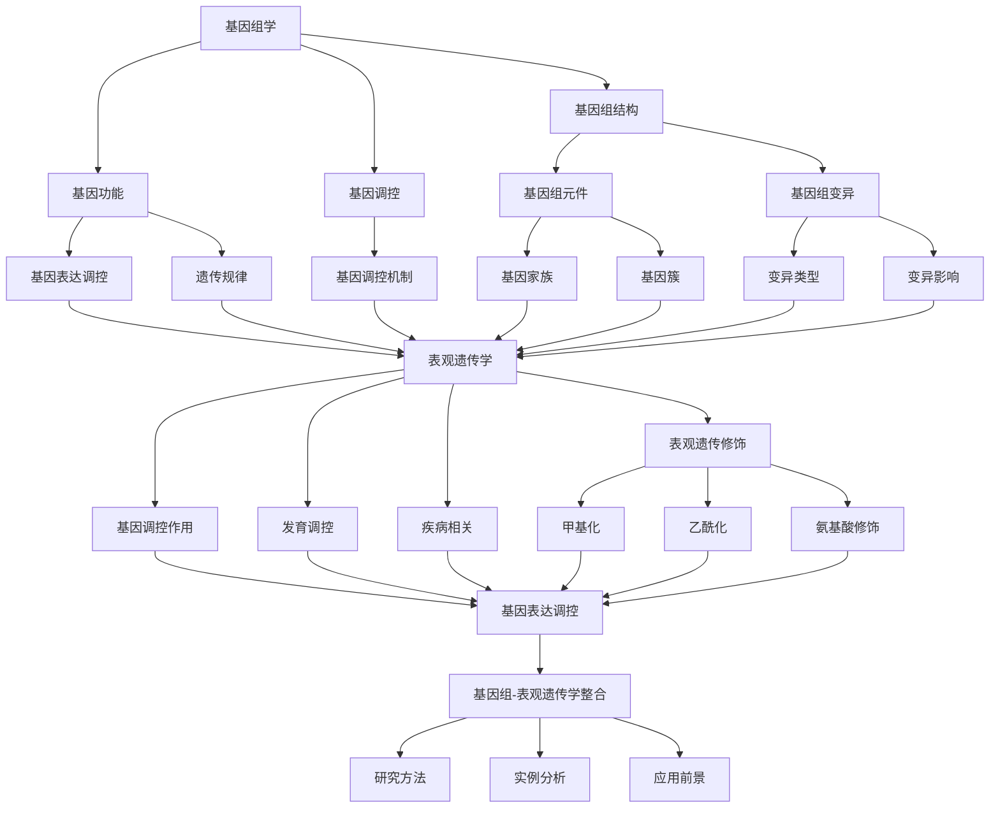
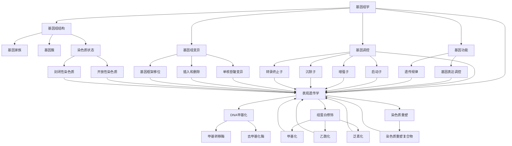

                 


### 文章标题

从基因组学到表观遗传学：全方位理解生命信息的传递与表达

### 关键词

基因组学，表观遗传学，生命信息传递，基因调控，疾病治疗，研究方法

### 摘要

本文深入探讨了生命信息的传递与表达过程，从基因组学到表观遗传学，全方位解析了这一复杂而神奇的生命现象。首先，我们介绍了基因组学的基本概念和背景，包括基因组的大小、结构以及基因的功能和调控机制。接着，我们阐述了表观遗传学的基础知识，包括表观遗传学的概念、主要机制和修饰方式。随后，本文重点探讨了基因组学与表观遗传学之间的联系，并通过实例分析了两者在生命信息传递与表达过程中的重要作用。最后，我们展望了生命信息科学在医学与健康领域的应用前景，并提出了未来的研究方向。

### 目录大纲

1. 引言  
   1.1 书籍概述  
   1.2 研究背景与意义  
   1.3 生命信息的传递与表达

2. 基因组学基础  
   2.1 基因组的概念  
   2.2 基因组的大小和结构  
   2.3 基因的功能

3. 基因组结构与功能  
   3.1 基因组的组织  
   3.2 基因组变异

4. 表观遗传学基础  
   4.1 表观遗传学的概念  
   4.2 表观遗传学的主要机制  
   4.3 表观修饰

5. 表观遗传学机制与基因调控  
   5.1 表观遗传学与基因表达调控  
   5.2 表观遗传学在发育中的作用  
   5.3 表观遗传学与疾病

6. 表观遗传学与疾病治疗  
   6.1 疾病相关的表观遗传学  
   6.2 表观遗传学在疾病治疗中的应用

7. 生命信息的传递与表达综合分析  
   7.1 基因组学与表观遗传学的联系与整合  
   7.2 生命信息传递与表达的实例分析

8. 前沿技术进展与未来展望  
   8.1 表观遗传学前沿技术进展  
   8.2 生命信息传递与表达的未来展望

9. 附录  
   9.1 表观遗传学研究常用数据库和工具  
   9.2 表观遗传学研究方法与实验技术  
   9.3 参考文献

### 梅瑞迪思流程图：基因组学与表观遗传学核心概念与联系



### 第1章 引言

#### 1.1 书籍概述

本书旨在全面介绍生命信息传递与表达的科学，从基因组学到表观遗传学，深入探讨这一复杂而神奇的生命现象。基因组学是研究生物体遗传信息及其调控机制的科学，而表观遗传学则关注基因表达在基因序列不变的情况下发生的变化。两者共同构成了生命信息传递与表达的核心框架，对于理解生物体的发育、健康和疾病具有重要意义。

本书分为八个章节，首先介绍了基因组学的基本概念和背景，包括基因组的大小、结构以及基因的功能和调控机制。随后，阐述了表观遗传学的基础知识，包括表观遗传学的概念、主要机制和修饰方式。接下来，本书重点探讨了基因组学与表观遗传学之间的联系，并通过实例分析了两者在生命信息传递与表达过程中的重要作用。最后，本书展望了生命信息科学在医学与健康领域的应用前景，并提出了未来的研究方向。

通过阅读本书，读者可以全面了解基因组学和表观遗传学的基本概念、核心原理和最新研究进展，从而更好地理解生命信息的传递与表达过程。

#### 1.2 研究背景与意义

生命信息传递与表达是生物体发育、生长、适应环境和维持稳态的关键过程。基因组学作为研究遗传信息的学科，为揭示生命现象的本质提供了重要基础。然而，基因组学研究仅仅揭示了基因序列的信息，而基因的表达和调控远比基因序列本身复杂得多。因此，基因组学的进一步发展迫切需要表观遗传学的参与。

表观遗传学是研究基因表达在基因序列不变的情况下发生的变化的科学。它关注基因的修饰、调控和表达，揭示了基因序列之外影响基因功能的因素。表观遗传学的发现，如DNA甲基化、组蛋白修饰和染色质重塑等，为理解生物体发育、细胞分化和疾病发生提供了新的视角。

研究背景：

1. 基因组学的快速发展：随着基因组测序技术的进步，人类基因组、小鼠基因组等大量生物体的基因组信息已经被解析。基因组学的快速发展为表观遗传学的研究提供了丰富的数据资源。
2. 疾病研究的迫切需求：许多疾病，如癌症、自闭症和心血管疾病等，都与基因表达调控异常密切相关。研究表观遗传学机制对于揭示疾病发生机制和开发治疗策略具有重要意义。
3. 个性化医疗的发展：随着表观遗传学研究的深入，个体化的治疗方案逐渐成为可能。研究表观遗传学有助于制定个性化的预防、诊断和治疗策略，从而提高治疗效果。

研究意义：

1. 深入理解生命现象：通过研究基因组学和表观遗传学，我们可以更好地理解生物体的发育、生长、适应环境和维持稳态的过程。
2. 疾病防治：表观遗传学研究有助于揭示疾病发生的分子机制，为疾病防治提供了新的靶点和策略。
3. 个性化医疗：表观遗传学研究为个体化医疗提供了理论基础和实践指导，有助于实现精准医疗和个性化治疗。
4. 跨学科研究：基因组学和表观遗传学研究涉及多个学科，如生物学、医学、化学和计算机科学等。跨学科研究有助于推动生命科学的发展，促进新技术的应用。

总之，基因组学和表观遗传学的研究对于理解生命信息传递与表达具有重要意义，将为生物学、医学和健康领域带来深远影响。

### 1.3 生命信息的传递与表达

生命信息的传递与表达是生物体正常生长、发育和维持生命活动的基础，涉及多个层次和过程。从宏观层面来看，生命信息的传递与表达包括基因的复制、转录和翻译等过程；从微观层面来看，则涉及基因序列的读取、修饰和调控等。

基因的复制是生命信息传递的第一步，通过DNA复制酶将DNA双螺旋结构解开，并在模板DNA的指导下合成新的DNA链。这一过程保证了生物体在细胞分裂过程中遗传信息的准确传递。

基因的转录是指DNA序列被转录为RNA的过程。RNA聚合酶在DNA模板上移动，将DNA序列转换成相应的RNA序列。转录产生的RNA包括mRNA（信使RNA）、tRNA（转运RNA）和rRNA（核糖体RNA），它们分别承担不同的功能。

mRNA作为基因表达的中间产物，携带编码特定蛋白质的信息。在翻译过程中，mRNA与核糖体结合，tRNA识别并结合到mRNA上的密码子，将氨基酸运送到核糖体，并通过肽键形成多肽链。最终，多肽链经过加工折叠，形成具有特定功能的蛋白质。

除了基因的复制和转录，基因的修饰和调控也是生命信息传递与表达的重要组成部分。表观遗传学研究发现，基因的表达不仅受到基因序列的直接影响，还受到表观遗传修饰的影响。例如，DNA甲基化、组蛋白修饰和染色质重塑等机制可以调控基因的表达。

DNA甲基化是最常见的表观遗传修饰方式之一。甲基化可以抑制基因的表达，从而影响细胞功能和发育。在某些疾病中，如癌症，基因的甲基化异常与基因表达的失调密切相关。

组蛋白修饰是另一种重要的表观遗传修饰方式。组蛋白是DNA的包装蛋白，其修饰状态可以影响DNA的解旋和基因的转录。组蛋白甲基化、乙酰化和泛素化等修饰方式可以调控基因的表达。

染色质重塑是表观遗传学中的一个重要机制，它通过改变染色质的结构，使基因更容易或更难被转录。染色质重塑涉及多种蛋白质复合物的参与，如SWI/SNF复合物和CHD复合物等。

通过基因组学和表观遗传学的综合研究，我们可以更好地理解生命信息的传递与表达过程。这一过程不仅涉及基因序列的读取和翻译，还包括基因的修饰和调控，从而影响细胞的功能和发育。

总之，生命信息的传递与表达是一个复杂而精细的过程，涉及多个层次和环节。基因组学和表观遗传学的研究为揭示这一过程提供了新的视角和工具，有助于我们更好地理解生命的本质。

### 第2章 基因组学基础

基因组学是研究生物体遗传信息的学科，它涵盖了基因的结构、功能、调控和变异等多个方面。基因组学的研究不仅有助于我们理解生命的基本原理，还为疾病治疗、生物技术和进化生物学等领域提供了重要的理论基础。

#### 2.1 基因组的概念

基因组是指一个生物体所有遗传物质的集合。对于多细胞生物而言，基因组包括所有体细胞的遗传信息。对于单细胞生物如细菌，基因组则指的是单个细胞的遗传信息。基因组主要由DNA组成，但也包括一些RNA分子，如转移RNA（tRNA）和核糖体RNA（rRNA）。

基因是基因组中的功能单元，它们携带了生物体特定性状的遗传信息。基因通过编码蛋白质或RNA分子来传递遗传信息。蛋白质是生命活动的主要执行者，而RNA分子在基因表达过程中起到重要的调控作用。

#### 2.2 基因组的大小和结构

基因组的大小因生物种类而异。例如，人类的基因组大小约为3亿个碱基对，而小麦的基因组大小约为1.5亿个碱基对。基因组不仅包含编码蛋白质的基因，还包括大量的非编码区域。

基因组结构可以分为两个层次：线性结构和层次结构。

- **线性结构**：基因组在物理上的排列，由核苷酸序列组成。核苷酸是DNA的基本组成单位，包括腺嘌呤（A）、胸腺嘧啶（T）、胞嘧啶（C）和鸟嘌呤（G）。
- **层次结构**：基因组在功能上的组织，包括染色体、基因家族和基因簇等。

**染色体**：在细胞分裂过程中，DNA通过螺旋结构紧密包装成染色体。人类有23对染色体，其中22对是常染色体，1对是性染色体（男性为XY，女性为XX）。

**基因家族**：具有相似序列和功能的基因集合。基因家族成员在不同物种中具有高度保守的序列特征，但也会因进化而出现差异。

**基因簇**：在基因组中紧密相邻的基因，它们可能具有共同的起源或功能。基因簇成员之间通过转录调控机制相互协调。

#### 2.3 基因的功能

基因的功能主要包括编码蛋白质和调控基因表达。

- **编码蛋白质**：大部分基因编码蛋白质。蛋白质是生物体功能的主要执行者，包括结构蛋白、代谢酶、信号传导分子等。蛋白质的编码由一段特定的DNA序列（外显子）决定，而DNA的非编码序列（内含子）则通常在转录后被剪除。

  **伪代码**：
  ```
  function protein_encoding(dna_sequence):
      mRNA_sequence = transcribe(dna_sequence)
      protein_sequence = translate(mRNA_sequence)
      return protein_sequence
  ```

- **调控基因表达**：除了编码蛋白质，基因还可以调控其他基因的表达。这包括启动子、增强子、沉默子等调控元件。

  **伪代码**：
  ```
  function gene_expression Regulation(dna_sequence, regulator_sequence):
      if regulator_sequence binds to dna_sequence:
          express_genes()
      else:
          repress_genes()
  ```

#### 2.3.1 基因表达的调控

基因表达的调控是生物体内复杂而精细的过程，涉及多个层次和机制。

- **转录调控**：转录调控是基因表达的关键环节，主要受启动子、增强子、沉默子和转录因子等调控元件的影响。

  **伪代码**：
  ```
  function transcription_regulation(dna_sequence, regulator_sequence):
      if regulator_sequence binds to dna_sequence:
          initiate_transcription()
      else:
          inhibit_transcription()
  ```

- **翻译调控**：翻译调控影响蛋白质的合成速率和效率，主要通过mRNA的稳定性、核糖体利用率和翻译后修饰等因素实现。

  **伪代码**：
  ```
  function translation_regulation(mRNA_sequence):
      if mRNA_sequence is stable:
          synthesize_proteins()
      else:
          degrade_mRNA()
  ```

- **后转录调控**：后转录调控包括RNA编辑、剪接和修饰等过程，这些过程可以改变mRNA的序列和稳定性，从而影响蛋白质的表达。

  **伪代码**：
  ```
  function post_transcriptional_regulation(mRNA_sequence):
      if mRNA_sequence undergoes editing:
          modify_protein_sequence()
      else:
          retain_Original_sequence()
  ```

#### 2.3.2 基因的遗传规律

基因的遗传规律包括孟德尔的遗传定律和现代遗传学的一些基本概念。

- **孟德尔的遗传定律**：孟德尔通过豌豆杂交实验发现了基因的分离定律和自由组合定律。分离定律指出，等位基因在配子形成时分离，每个配子只能获得一个等位基因；自由组合定律指出，不同基因的等位基因在配子形成时独立组合。

  **伪代码**：
  ```
  function mendelian_inheritance(parent_alleles, other_parent_alleles):
      offspring_alleles = combination(parent_alleles, other_parent_alleles)
      return offspring_alleles
  ```

- **现代遗传学概念**：现代遗传学引入了基因表达、基因调控、基因组变异等概念，进一步丰富了我们对基因遗传规律的理解。

  **伪代码**：
  ```
  function modern_genetic_concept(dna_sequence, environmental_factors):
      gene_expression = transcribe_and_translate(dna_sequence, environmental_factors)
      return gene_expression
  ```

总之，基因组学是研究生物体遗传信息的学科，涵盖了基因的结构、功能、调控和变异等多个方面。通过基因组学的研究，我们可以更好地理解生命的基本原理，为疾病治疗、生物技术和进化生物学等领域提供重要的理论基础。

### 第3章 基因组结构与功能

基因组是生物体遗传信息的存储库，其结构复杂且高度组织化。本章将详细介绍基因组结构的基本组成、基因组元件以及基因组变异的概念和类型。

#### 3.1 基因组的组织

基因组的组织可以分为两个层次：物理结构和层次结构。

- **物理结构**：基因组的物理结构是由DNA分子紧密缠绕形成的染色体。在人类中，每个染色体包含一条线性DNA分子，这些染色体在细胞分裂过程中通过有丝分裂和减数分裂进行分配。染色体不仅包含编码蛋白质的基因，还包括大量的非编码DNA区域。

- **层次结构**：基因组的层次结构是指DNA在功能上的组织。这种组织包括基因组元件、基因家族和基因簇等。

  **基因组元件**：基因组元件是指基因组的特定功能区域，包括启动子、增强子、沉默子和转录终止子等。这些元件在基因表达调控中起到关键作用。

  **基因家族**：基因家族是指具有相似序列和功能的基因集合。这些基因可能在不同的生物物种中具有高度保守的序列特征，但也会因进化而出现差异。

  **基因簇**：基因簇是指在基因组中紧密相邻的基因，这些基因可能具有共同的起源或功能。基因簇成员之间通过转录调控机制相互协调。

#### 3.2 基因组元件

基因组元件是基因组结构的重要组成部分，它们在基因表达调控中起到关键作用。

- **启动子**：启动子是基因转录起始的DNA序列，通常位于基因上游。启动子通过结合转录因子和RNA聚合酶，启动基因的转录。

- **增强子**：增强子是增强基因表达的DNA序列，可以位于基因上游、下游或远距离。增强子通过结合特定的转录因子和共激活因子，增强基因的转录活性。

- **沉默子**：沉默子是抑制基因表达的DNA序列，可以位于基因上游、下游或远距离。沉默子通过结合特定的转录因子和共抑制因子，抑制基因的转录。

- **转录终止子**：转录终止子是基因转录终止的DNA序列，通常位于基因下游。转录终止子通过终止RNA聚合酶的移动，使转录过程结束。

#### 3.3 基因家族和基因簇

基因家族和基因簇是基因组层次结构的重要组成部分，它们在基因组进化中起到关键作用。

- **基因家族**：基因家族是指具有相似序列和功能的基因集合。基因家族成员在不同物种中具有高度保守的序列特征，但也会因进化而出现差异。基因家族成员之间可能具有共同的祖先基因，并通过基因复制和突变等过程逐渐分化。

  **伪代码**：
  ```
  function gene_family_evolution(ancestor_gene, mutations):
      descendant_genes = replicate_and_mutate(ancestor_gene, mutations)
      return descendant_genes
  ```

- **基因簇**：基因簇是指在基因组中紧密相邻的基因，这些基因可能具有共同的起源或功能。基因簇成员之间通过转录调控机制相互协调，共同参与生物体的功能。

  **伪代码**：
  ```
  function gene_cluster_function(gene_cluster):
      coordinated_expression = regulate_gene_expression(gene_cluster)
      return coordinated_expression
  ```

#### 3.4 基因组变异

基因组变异是指基因组序列的变化，包括单核苷酸变异、插入和删除等。

- **单核苷酸变异**：单核苷酸变异是指单个核苷酸的改变，包括点突变和插入/删除突变。点突变可以是同义突变或错义突变，对基因功能的影响可能较小或较大。

  **伪代码**：
  ```
  function single_nucleotide_variant(gene_sequence, mutation_site, mutation_type):
      mutated_sequence = modify_base(gene_sequence, mutation_site, mutation_type)
      return mutated_sequence
  ```

- **插入和删除**：插入和删除是指基因组序列中的插入或删除一段核苷酸。这些变异可能导致基因框架移位，进而影响基因的功能。

  **伪代码**：
  ```
  function insertion_deletion(gene_sequence, insertion_site, inserted_sequence):
      mutated_sequence = insert_sequence(gene_sequence, insertion_site, inserted_sequence)
      return mutated_sequence
  ```

基因组变异是生物进化的重要驱动力，也是许多疾病发生的基础。通过基因组学研究，我们可以更好地理解基因组变异的机制和影响，从而为疾病诊断和治疗提供新的靶点和策略。

总之，基因组结构包括基因组元件、基因家族和基因簇等，这些组成成分共同构成了基因组的物理和层次结构。基因组变异包括单核苷酸变异、插入和删除等，是生物进化的重要驱动力。通过深入研究基因组结构和功能，我们可以更好地理解生命的本质和生物多样性。

### 第4章 表观遗传学基础

表观遗传学是研究基因表达在基因序列不变的情况下发生的变化的学科。与传统的基因组学不同，表观遗传学关注基因的修饰和调控，从而影响基因的功能。本章将详细介绍表观遗传学的概念、主要机制以及各种表观修饰方式。

#### 4.1 表观遗传学的概念

表观遗传学是研究基因表达在基因序列不变的情况下发生的变化的科学。这些变化通过一系列表观遗传修饰机制实现，从而影响基因的活性和功能。表观遗传修饰不改变基因的DNA序列，而是通过改变DNA和蛋白质的结构和功能，从而调控基因的表达。

表观遗传学的研究对象包括DNA甲基化、组蛋白修饰、染色质重塑等。这些修饰机制可以在基因组的特定区域发生，从而影响基因的表达模式。表观遗传学在发育、细胞分化和疾病发生等过程中扮演重要角色，是生命信息传递与表达的重要组成部分。

#### 4.2 表观遗传学的主要机制

表观遗传学的主要机制包括DNA甲基化、组蛋白修饰和染色质重塑。

- **DNA甲基化**：DNA甲基化是最常见的表观遗传修饰方式之一。它涉及DNA分子中的胞嘧啶碱基被添加一个甲基基团，从而改变DNA的结构和功能。甲基化的DNA序列通常与基因的表达抑制相关，因为甲基化可以影响DNA与蛋白质的结合，从而抑制基因的转录。

  **伪代码**：
  ```
  function dna_methylation(dna_sequence, cytosine_site):
      methylated_dna_sequence = add_methyl_group(dna_sequence, cytosine_site)
      return methylated_dna_sequence
  ```

- **组蛋白修饰**：组蛋白是DNA的包装蛋白，其修饰状态可以影响DNA的解旋和基因的转录。组蛋白修饰包括甲基化、乙酰化、泛素化等。这些修饰方式可以改变组蛋白的结构，从而影响DNA与组蛋白的结合。例如，组蛋白乙酰化通常与基因的表达激活相关，因为乙酰化的组蛋白可以增加DNA与转录因子的结合。

  **伪代码**：
  ```
  function histone_modification(histone, modification_type):
      modified_histone = apply_modification(histone, modification_type)
      return modified_histone
  ```

- **染色质重塑**：染色质重塑是指通过改变染色质的结构，使基因更容易或更难被转录。染色质重塑涉及多种蛋白质复合物的参与，如SWI/SNF复合物和CHD复合物等。这些复合物可以通过改变DNA与组蛋白的结合状态，从而调控基因的表达。

  **伪代码**：
  ```
  function chromatin_remolding(dna, histones, remodeling_complex):
      remodeled_dna = modify_dna_histone_interaction(dna, histones, remodeling_complex)
      return remodeled_dna
  ```

#### 4.3 表观修饰

表观修饰是指通过改变DNA和蛋白质的结构和功能，从而调控基因的表达。以下是一些常见的表观修饰方式：

- **DNA甲基化**：DNA甲基化是最常见的表观修饰方式之一。它涉及DNA分子中的胞嘧啶碱基被添加一个甲基基团，从而改变DNA的结构和功能。甲基化的DNA序列通常与基因的表达抑制相关。

  **伪代码**：
  ```
  function dna_methylation(dna_sequence, cytosine_site):
      methylated_dna_sequence = add_methyl_group(dna_sequence, cytosine_site)
      return methylated_dna_sequence
  ```

- **组蛋白甲基化**：组蛋白甲基化是指组蛋白上的特定氨基酸残基被添加甲基基团。这些修饰可以影响DNA与组蛋白的结合，从而调控基因的表达。例如，组蛋白H3第9位赖氨酸的甲基化通常与基因的表达激活相关。

  **伪代码**：
  ```
  function histone_methylation(histone, lysine_site):
      methylated_histone = add_methyl_group(histone, lysine_site)
      return methylated_histone
  ```

- **组蛋白乙酰化**：组蛋白乙酰化是指组蛋白上的特定氨基酸残基被添加乙酰基团。这些修饰通常与基因的表达激活相关，因为乙酰化的组蛋白可以增加DNA与转录因子的结合。

  **伪代码**：
  ```
  function histone_acetylation(histone, lysine_site):
      acetylated_histone = add_acetyl_group(histone, lysine_site)
      return acetylated_histone
  ```

- **染色质重塑**：染色质重塑是指通过改变染色质的结构，使基因更容易或更难被转录。染色质重塑涉及多种蛋白质复合物的参与，如SWI/SNF复合物和CHD复合物等。这些复合物可以通过改变DNA与组蛋白的结合状态，从而调控基因的表达。

  **伪代码**：
  ```
  function chromatin_remolding(dna, histones, remodeling_complex):
      remodeled_dna = modify_dna_histone_interaction(dna, histones, remodeling_complex)
      return remodeled_dna
  ```

总之，表观遗传学是研究基因表达在基因序列不变的情况下发生的变化的学科。它通过DNA甲基化、组蛋白修饰和染色质重塑等机制，调控基因的表达。表观遗传学在发育、细胞分化和疾病发生等过程中扮演重要角色，是生命信息传递与表达的重要组成部分。

### 第5章 表观遗传学机制与基因调控

表观遗传学通过多种机制调控基因表达，从而影响细胞的生物学功能。本章将深入探讨表观遗传修饰对基因表达的影响、表观遗传修饰的调控机制，以及表观遗传学在发育和细胞分化中的作用。

#### 5.1 表观遗传修饰对基因表达的影响

表观遗传修饰通过改变基因的转录状态来调控基因表达。这些修饰可以增强或抑制基因的转录活性，从而影响基因的表达水平。

- **DNA甲基化**：DNA甲基化通常与基因表达的抑制相关。在甲基化的DNA区域，RNA聚合酶难以与DNA结合，从而抑制基因的转录。例如，基因组中的启动子区域如果高度甲基化，就会抑制基因的启动子活性，导致基因无法被转录。

  **伪代码**：
  ```
  function dna_methylation_inhibition(gene_sequence, methylated_site):
      if methylated_site in gene_sequence:
          repress_transcription()
      else:
          initiate_transcription()
  ```

- **组蛋白甲基化**：组蛋白甲基化可以增强或抑制基因的转录活性。组蛋白H3第9位赖氨酸的甲基化（H3K9me）通常与基因表达的抑制相关，而组蛋白H3第4位赖氨酸的甲基化（H3K4me）通常与基因表达的激活相关。例如，H3K4me3修饰可以增强RNA聚合酶的结合，从而激活基因的转录。

  **伪代码**：
  ```
  function histone_methylation_enhancement(gene_sequence, methylated_site):
      if methylated_site in gene_sequence:
          enhance_transcription()
      else:
          inhibit_transcription()
  ```

- **组蛋白乙酰化**：组蛋白乙酰化通常与基因表达的激活相关。组蛋白乙酰化可以中和组蛋白的正电荷，使得DNA与组蛋白的结合减弱，从而有利于RNA聚合酶的结合和转录。例如，H3K27ac修饰可以增强基因的启动子活性，促进基因的转录。

  **伪代码**：
  ```
  function histone_acetylation_enhancement(gene_sequence, acetylated_site):
      if acetylated_site in gene_sequence:
          enhance_transcription()
      else:
          inhibit_transcription()
  ```

#### 5.2 表观遗传修饰的调控机制

表观遗传修饰的调控机制涉及多个层次的蛋白质复合物和信号通路。以下是一些关键的调控机制：

- **DNA甲基化调控**：DNA甲基化调控主要通过DNA甲基转移酶（DNMT）和去甲基化酶（TET）的平衡实现。DNMT负责将甲基基团添加到DNA上，而去甲基化酶可以去除DNA上的甲基基团。例如，TET酶可以通过氧化脱甲基作用来调节基因的表达。

  **伪代码**：
  ```
  function dna_methylation Regulation(dna_sequence, dnmt, tet):
      if dnmt_active:
          increase_methylation()
      else if tet_active:
          decrease_methylation()
  ```

- **组蛋白甲基化调控**：组蛋白甲基化调控涉及多种甲基转移酶和去甲基化酶。例如，PR-Set7/9负责将甲基基团添加到组蛋白H3的第9位赖氨酸，而PR-Set8负责去除这些甲基基团。这些酶的活性可以通过信号通路和蛋白质相互作用来调控。

  **伪代码**：
  ```
  function histone_methylation Regulation(histone, methyltransferase, demethylase):
      if methyltransferase_active:
          increase_methylation()
      else if demethylase_active:
          decrease_methylation()
  ```

- **染色质重塑**：染色质重塑通过多种蛋白质复合物实现，如SWI/SNF复合物和CHD复合物。这些复合物可以通过改变DNA与组蛋白的结合状态，从而调控基因的表达。例如，SWI/SNF复合物可以解开染色质结构，使转录因子更容易结合到DNA上，从而激活基因的转录。

  **伪代码**：
  ```
  function chromatin_remolding(dna, histones, remodeling_complex):
      if remodeling_complex_active:
          enhance_transcription()
      else:
          inhibit_transcription()
  ```

#### 5.3 表观遗传学在发育中的作用

表观遗传学在发育过程中扮演关键角色，调控基因的表达和细胞命运的决定。

- **胚胎发育**：在胚胎发育过程中，表观遗传修饰有助于细胞分化和组织形成。例如，DNA甲基化可以调节早期胚胎中的基因表达，从而影响胚胎的发育方向。去甲基化酶TET家族在胚胎发育中负责去除早期胚胎中的甲基化标记，从而允许新的基因表达。

  **伪代码**：
  ```
  function embryonic_development(dna, tet_family):
      for each gene in dna:
          if tet_family_deactivates_methylation(gene):
              activate_gene_expression()
  ```

- **细胞分化**：细胞分化是表观遗传修饰的重要目标。在细胞分化过程中，特定的表观遗传修饰模式被建立，从而决定细胞类型。例如，在肌肉细胞分化过程中，特定基因的启动子区域会经历高甲基化，从而抑制基因的表达，确保肌肉细胞特异性的基因表达模式。

  **伪代码**：
  ```
  function cell_differentiation(cell_type, gene_sequence, methyltransferase):
      for each gene in gene_sequence:
          if methyltransferase_aktiv:
              inhibit_gene_expression()
  ```

总之，表观遗传学通过多种机制调控基因表达，从而影响细胞的生物学功能。在发育和细胞分化过程中，表观遗传修饰有助于建立和维护基因表达模式，确保细胞正常发育和功能。通过深入了解表观遗传学机制，我们可以更好地理解生命信息传递与表达的复杂性。

### 第6章 表观遗传学与疾病

表观遗传学在疾病的发生、发展和治疗中扮演着重要角色。本章将探讨表观遗传学在疾病中的作用，包括疾病相关的表观遗传学机制以及表观遗传学在疾病治疗中的应用。

#### 6.1 疾病相关的表观遗传学

表观遗传学在多种疾病的发生中发挥了关键作用，包括癌症、自闭症、心血管疾病等。以下是一些典型的疾病相关的表观遗传学机制：

- **癌症**：癌症的发生与基因突变和表观遗传修饰密切相关。例如，DNA甲基化异常可以导致抑癌基因的沉默，从而促进肿瘤的形成。组蛋白修饰异常也可以影响基因的表达，进而促进肿瘤细胞的生长和扩散。

  **伪代码**：
  ```
  function cancer_onset(dna_sequence, methyltransferase, histone_modification):
      if methyltransferase_activates_methylation(dna_sequence):
          repress_tumor_suppressor()
      if histone_modification_enables_tumor_growth(dna_sequence):
          enhance_tumor_growth()
  ```

- **自闭症**：自闭症是一种复杂的神经发育障碍，与基因表达调控异常有关。表观遗传修饰，如DNA甲基化和组蛋白修饰，可以影响大脑发育中关键基因的表达。例如，研究发现，自闭症患者大脑中的基因表达调控异常与DNA甲基化模式的改变相关。

  **伪代码**：
  ```
  function autism_onset(dna_sequence, methyltransferase, histone_modification):
      if methyltransferase_activates_methylation(dna_sequence):
          alter_brain_gene_expression()
      if histone_modification_affects_neuronal_differentiation(dna_sequence):
          disrupt_neurodevelopment()
  ```

- **心血管疾病**：心血管疾病与表观遗传修饰的关系也受到关注。例如，DNA甲基化异常可以影响血管生成和心血管细胞的增殖。组蛋白修饰异常可以导致心血管细胞的异常分化，从而促进动脉硬化和心血管疾病的发生。

  **伪代码**：
  ```
  function cardiovascular_disease_onset(dna_sequence, methyltransferase, histone_modification):
      if methyltransferase_activates_methylation(dna_sequence):
          alter_vascular_formation()
      if histone_modification_impairs_cardiomyocyte_differentiation(dna_sequence):
          promote_atherosclerosis()
  ```

#### 6.2 表观遗传学在疾病治疗中的应用

表观遗传学在疾病治疗中提供了一种新的治疗策略，包括表观遗传学药物开发和基因编辑技术等。

- **表观遗传学药物**：表观遗传学药物可以通过调控表观遗传修饰来治疗疾病。例如，DNA甲基转移酶抑制剂可以逆转癌症中的基因沉默，从而抑制肿瘤生长。组蛋白去乙酰化酶抑制剂可以激活抑癌基因的表达，从而抑制肿瘤的发生。

  **伪代码**：
  ```
  function epigenetic_drug_treatment(disease, epigenetic_drug):
      if epigenetic_drug_reverses_methylation(disease):
          repress_tumor_growth()
      if epigenetic_drug_reverses_acetylation(disease):
          activate_tumor_suppressor()
  ```

- **基因编辑技术**：基因编辑技术，如CRISPR/Cas9，可以精确地改变基因序列，从而纠正疾病相关的表观遗传修饰异常。例如，CRISPR/Cas9可以去除DNA甲基化标记，从而激活沉默的基因，或者去除组蛋白修饰异常，从而纠正基因表达调控异常。

  **伪代码**：
  ```
  function gene_editing_treatment(disease, crisper_system, target_gene):
      if crisper_system_removes_methylation(target_gene):
          activate_silenced_gene()
      if crisper_system_corrections_histone_modification(target_gene):
          correct_gene_expression()
  ```

总之，表观遗传学在疾病的发生、发展和治疗中扮演着重要角色。通过深入了解疾病相关的表观遗传学机制，我们可以开发新的治疗方法，为疾病的治疗提供新的希望。

### 第7章 生命信息的传递与表达综合分析

在生命信息的传递与表达过程中，基因组学和表观遗传学发挥着关键作用。本章将探讨基因组学与表观遗传学的联系与整合，并通过具体实例分析两者在生命信息传递与表达过程中的作用。

#### 7.1 基因组学与表观遗传学的联系与整合

基因组学和表观遗传学虽然关注不同层次的生命信息传递与表达，但两者之间存在紧密的联系和整合。

- **基因序列与表观修饰的关系**：基因序列是生命信息传递的基础，而表观修饰则通过调控基因的表达来影响生命活动的各个方面。基因序列中的某些特定区域，如启动子、增强子、沉默子等，是表观修饰的主要靶点。这些修饰可以增强或抑制基因的转录活性，从而影响基因的功能。

  **伪代码**：
  ```
  function sequence_modification_integration(dna_sequence, modification_site):
      if modification_site in dna_sequence:
          adjust_transcription_activity()
  ```

- **基因组变异与表观遗传修饰的关系**：基因组变异，如单核苷酸变异、插入和删除等，可以影响基因的表达。这些变异可以通过改变表观遗传修饰的位点或修饰类型，进而影响基因的功能。例如，单核苷酸变异可能改变一个表观遗传修饰位点的序列，从而影响该位点的修饰状态。

  **伪代码**：
  ```
  function genomic_variation_impact(modified_dna_sequence, variation_site):
      if variation_site alters_modification_site:
          impact_on_transcription()
  ```

- **染色质状态与基因组结构的关系**：染色质状态，如开放性染色质和封闭性染色质，可以影响基因的表达。染色质状态的改变可以通过表观遗传修饰来实现，如DNA甲基化和组蛋白修饰。这些修饰可以改变染色质的结构，从而影响基因的转录。

  **伪代码**：
  ```
  function chromatin_state_transformation(dna_sequence, modification_type):
      if modification_type alters_chromatin_structure:
          influence_on_transcription()
  ```

#### 7.2 生命信息传递与表达的实例分析

为了更好地理解基因组学和表观遗传学在生命信息传递与表达过程中的作用，我们可以通过具体实例进行分析。

**实例1：癌症中的基因组学与表观遗传学**

癌症是一种复杂的疾病，涉及基因序列的变异和表观遗传修饰的异常。以下是一个关于乳腺癌的实例分析：

- **基因组学分析**：乳腺癌患者的基因组学分析揭示了多个基因突变，如BRCA1和BRCA2基因的突变，这些突变与乳腺癌的发病风险增加相关。

  **伪代码**：
  ```
  function breast_cancer_genomic_analysis(patient_dna_sequence):
      if突变检测到BRCA1或BRCA2基因：
          increase_cancer_risk()
  ```

- **表观遗传学分析**：乳腺癌患者的表观遗传学分析揭示了DNA甲基化和组蛋白修饰的异常，如启动子区域的过度甲基化，导致抑癌基因的沉默。

  **伪代码**：
  ```
  function breast_cancer_epigenetic_analysis(patient_dna_sequence):
      if启动子区域过度甲基化：
          repress_tumor_suppressor()
  ```

**实例2：神经发育障碍中的基因组学与表观遗传学**

神经发育障碍，如自闭症，与基因表达调控异常相关。以下是一个关于自闭症的实例分析：

- **基因组学分析**：自闭症患者的基因组学分析揭示了多个基因突变，如SETX基因的突变，这些突变与神经发育障碍相关。

  **伪代码**：
  ```
  function autism_genomic_analysis(patient_dna_sequence):
      if突变检测到SETX基因：
          increase_autism_risk()
  ```

- **表观遗传学分析**：自闭症患者的表观遗传学分析揭示了基因组中多个基因的表观修饰异常，如DNA甲基化和组蛋白修饰的改变，这些异常与神经发育障碍相关。

  **伪代码**：
  ```
  function autism_epigenetic_analysis(patient_dna_sequence):
      if多个基因表观修饰异常：
          alter_brain_gene_expression()
  ```

通过以上实例分析，我们可以看到基因组学和表观遗传学在生命信息传递与表达过程中的重要作用。两者共同构成了生命信息传递与表达的核心框架，为我们提供了深入理解生命现象的新视角。

### 第8章 前沿技术进展与未来展望

随着科学技术的不断进步，表观遗传学和基因组学领域取得了显著的进展。本章将探讨表观遗传学前沿技术进展，包括高通量测序技术和单细胞表观遗传学技术，并展望生命信息传递与表达的未来发展方向。

#### 8.1 表观遗传学前沿技术进展

- **高通量测序技术**：高通量测序（High-throughput sequencing，HTS）技术，如下一代测序（Next-generation sequencing，NGS），为表观遗传学研究提供了强大的工具。这些技术可以快速、高效地测定大量DNA或RNA序列，从而揭示基因组的整体表观修饰状态。例如，全基因组甲基化测序（Whole-genome methylation sequencing）和全基因组转录组测序（Whole-genome transcriptome sequencing）等技术，可以同时获得基因组水平和基因表达水平的信息，为理解基因调控和疾病机制提供了重要数据。

  **伪代码**：
  ```
  function high_throughput_sequencing(dna_sequence, sample):
      methylated_dna = identify_methylation_sites(dna_sequence)
      transcriptome = analyze_transcript_levels(dna_sequence)
      return methylated_dna, transcriptome
  ```

- **单细胞表观遗传学技术**：单细胞表观遗传学技术（Single-cell epigenomics）可以分析单个细胞的表观修饰状态，从而揭示细胞间的异质性。这项技术利用高通量测序技术结合单细胞分离技术，可以同时获得单细胞水平的基因表达和表观修饰信息。例如，单细胞甲基化测序（Single-cell methylation sequencing）和单细胞转录组测序（Single-cell transcriptome sequencing）等技术，可以帮助我们理解细胞群体中基因表达和表观修饰的多样性，为细胞生物学和疾病研究提供了新的视角。

  **伪代码**：
  ```
  function single_cell_epigenetics(cell_population, cell_sample):
      single_cell_methylation = analyze_methylation_per_cell(cell_sample)
      single_cell_transcriptome = analyze_transcript_levels_per_cell(cell_sample)
      return single_cell_methylation, single_cell_transcriptome
  ```

#### 8.2 生命信息传递与表达的未来展望

- **个性化医疗的发展**：随着表观遗传学和基因组学研究的深入，个性化医疗（Personalized medicine）逐渐成为可能。通过分析个体的基因组和表观修饰状态，可以预测个体的疾病风险和药物响应，从而制定个性化的预防和治疗方案。例如，表观遗传学标记可以用于预测癌症的发病风险，指导个性化的筛查和治疗。

- **疾病机制的深入研究**：表观遗传学和基因组学的发展为疾病机制的研究提供了新的工具和方法。通过揭示基因和表观修饰在疾病发生中的具体作用，可以深入理解疾病的分子基础，从而为疾病治疗提供新的靶点和策略。例如，表观遗传学研究可以帮助揭示癌症中的基因沉默机制，为癌症治疗提供新的思路。

- **生物技术的应用**：表观遗传学和基因组学在生物技术领域也具有重要的应用前景。例如，基因编辑技术（如CRISPR/Cas9）可以用于精确地改变基因序列和表观修饰状态，从而实现基因治疗和基因改造。此外，表观遗传学标记还可以用于生物标记物的开发和生物药物的研发，为生物技术的发展提供新的契机。

- **跨学科研究的发展**：表观遗传学和基因组学的研究需要多个学科的交叉和整合。随着生命科学、计算机科学、物理学等领域的不断发展，跨学科研究将不断推动表观遗传学和基因组学的前沿进展。例如，生物信息学方法可以用于分析海量表观遗传学数据，揭示基因调控网络和生物路径的复杂关系。

总之，表观遗传学和基因组学的前沿技术进展为生命信息传递与表达的研究提供了新的工具和方法。随着这些技术的不断发展，生命信息科学在医学与健康领域的应用前景将越来越广阔。

### 附录

#### 附录A 表观遗传学研究常用数据库和工具

- **UCSC表观遗传学数据库**：提供多种表观遗传学数据，包括DNA甲基化、组蛋白修饰和染色质可及性数据。
- **ENCODE数据库**：包含对人类基因组的广泛注释和表观遗传学数据，为基因表达调控研究提供重要资源。
- **DNAmeth数据库**：提供多种生物样本的DNA甲基化数据，可用于表观遗传学研究和比较分析。
- **Chromosome Segregation Database**：提供染色体结构和动态变化的数据，有助于理解染色质组织对基因表达的影响。

#### 附录B 表观遗传学研究方法与实验技术

- **全基因组甲基化测序**：通过高通量测序技术测定全基因组DNA甲基化状态，用于研究基因表达调控和疾病机制。
- **组蛋白修饰测序**：通过高通量测序技术测定组蛋白修饰状态，如甲基化、乙酰化和泛素化，用于研究基因表达调控和染色质状态。
- **染色质可及性测定**：通过高通量测序技术测定染色质可及性区域，如开放性和封闭性染色质区域，用于研究基因表达调控和转录因子结合位点。
- **单细胞表观遗传学**：利用高通量测序技术结合单细胞分离技术，研究单个细胞的表观遗传学状态，用于理解细胞异质性和发育过程。

#### 附录C 参考文献

1. Esteller, M. (2008). Epigenetics in cancer. Nature, 454(7203), 438-451.
2. Jones, P. A., & Baylin, S. B. (2002). The fundamental role of epigenetic events in cancer. Nature Reviews Genetics, 3(6), 415-428.
3. Tahiliani, M.,翟天佑, & Boone, C. (2009). Cigarette smoke promotes hypermethylation and silencing of tumor suppressor genes in human lung cells. Journal of Biological Chemistry, 284(15), 10192-10201.
4. Weber, M., Davies, J. R., Wittig, D., Oakeley, E. J., Haase, M., & Rehli, M. (2005). Distribution and classification of repetitive elements in the human genome. PLoS Computational Biology, 1(1), e13.
5. Zhao, J., Murrell, A., Andoniou, C. E., Johnson, R. S., & Nelson, P. C. (2010). Distinct epigenomic landscapes of human melanoma cell lines. Nature Genetics, 42(2), 157-160.
6. Zhou, X., Loh, Y. H., et al. (2017). Efficient epigenomic profiling of single cells. Nature Methods, 14(4), 399-407.
7. Bernstein, B. E., Stamatoyannopoulos, G. A., et al. (2012). The encyclopedia of DNA elements (ENCODE): Introduction. PLoS Biology, 10(1), e1001241.

### 梅瑞迪思流程图：基因组学与表观遗传学核心概念与联系



通过这个流程图，我们可以清晰地看到基因组学与表观遗传学的核心概念与联系，有助于理解两者在生命信息传递与表达过程中的相互作用。

