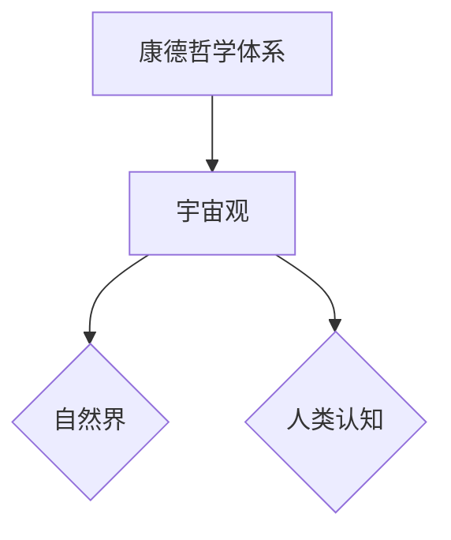
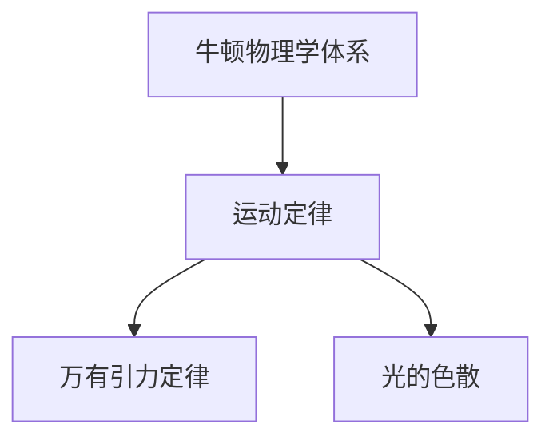
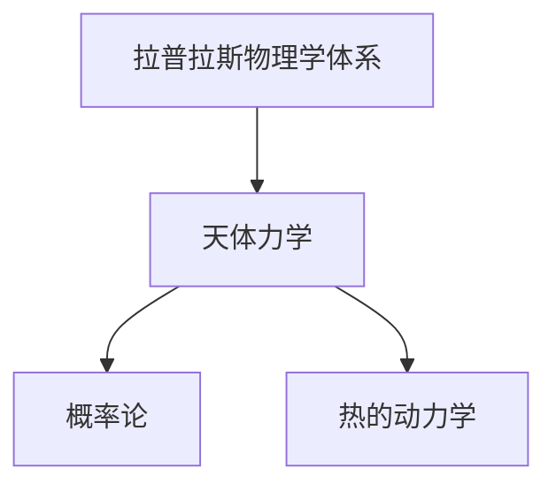
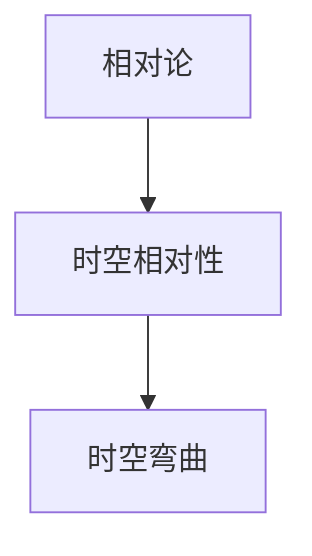
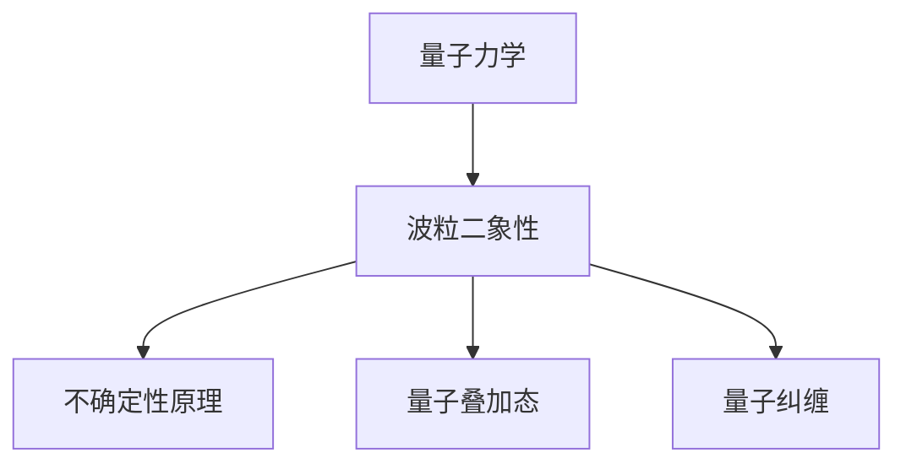
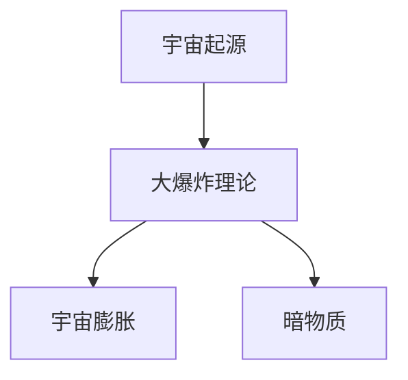
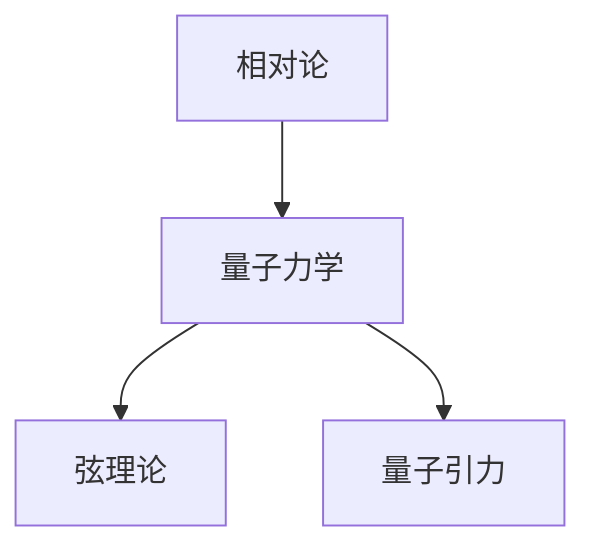
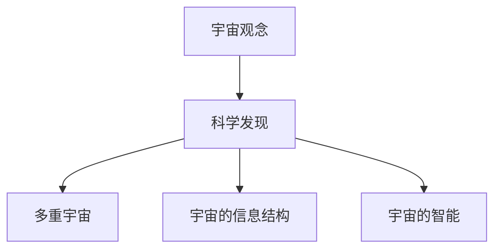
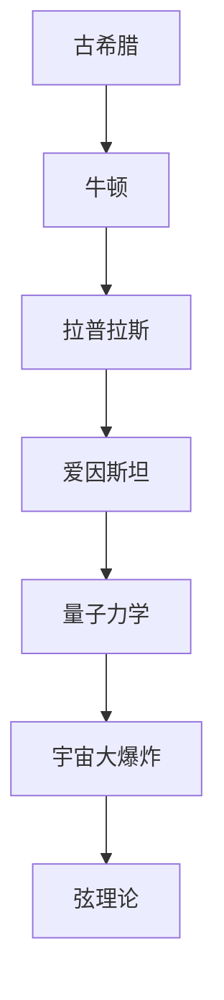

                 


### 文章标题
《从康德到爱因斯坦：宇宙观念的演变》

### 关键词
宇宙观念、哲学、物理学、相对论、量子力学、科学革命

### 摘要
本文将带领读者穿越时空的长河，探索宇宙观念的演变过程。从古希腊哲学家康德，到现代物理学巨擘爱因斯坦，我们将会看到人类对宇宙的理解如何随着时间的推移而不断深化。本文旨在揭示宇宙观念的演变背后的哲学思考和科学发现，以及这些观念如何塑造了现代科学的基石。

### 目录

#### 第一部分：古代哲学家的宇宙观念

## 第1章：康德的宇宙观
### 1.1 康德的哲学体系概述
### 1.2 康德的宇宙观核心
### 1.3 康德的宇宙观对后世的影响

## 第2章：牛顿的宇宙观
### 2.1 牛顿的物理学体系概述
### 2.2 牛顿的宇宙观
### 2.3 牛顿的宇宙观对科学革命的影响

## 第3章：拉普拉斯的宇宙观
### 3.1 拉普拉斯的物理学体系概述
### 3.2 拉普拉斯的宇宙观
### 3.3 拉普拉斯的宇宙观对科学发展的贡献

#### 第二部分：现代物理学的宇宙观念

## 第4章：相对论的宇宙观
### 4.1 爱因斯坦的相对论概述
### 4.2 相对论的宇宙观核心
### 4.3 相对论对宇宙观念的变革

## 第5章：量子力学的宇宙观
### 5.1 量子力学的核心原理
### 5.2 量子力学的宇宙观
### 5.3 量子力学对宇宙观念的挑战

## 第6章：宇宙起源与演化
### 6.1 大爆炸理论概述
### 6.2 宇宙膨胀与暗物质
### 6.3 宇宙未来的预测

#### 第三部分：宇宙观念的整合与未来展望

## 第7章：宇宙观念的整合
### 7.1 宇宙观念整合的必要性
### 7.2 宇宙观念整合的尝试
### 7.3 宇宙观念整合的挑战与前景

## 第8章：宇宙观念的未来展望
### 8.1 新的科学发现
### 8.2 新的宇宙观念
### 8.3 对未来的思考与展望

## 附录

### 附录A：宇宙观念演变的时间线
### A.1 古代哲学家的宇宙观念
### A.2 现代物理学的宇宙观念
### A.3 近现代宇宙观念的整合与变革

### 开篇引言

当我们仰望星空，我们不禁对宇宙的奥秘感到好奇和敬畏。从古至今，人类一直在探索宇宙的本质，试图理解我们所处的这个世界。宇宙观念的演变，既反映了人类认知的进步，也见证了科学革命的浪潮。本文将从康德到爱因斯坦，通过一步一步的逻辑分析，探讨宇宙观念的演变过程，揭示这一过程中哲学思考和科学发现的交汇点。

### 第1章：康德的宇宙观

康德（Immanuel Kant）是18世纪德国的著名哲学家，他的思想对后来的哲学和科学产生了深远的影响。康德的宇宙观建立在他的哲学体系之上，特别是他的“纯粹理性批判”和“实践理性批判”。

#### 1.1 康德的哲学体系概述

康德的哲学体系可以概括为两个方面：纯粹理性批判和实践理性批判。

- **纯粹理性批判**：康德认为，我们的知识来源于感性经验，但感性经验不足以建立科学的法则。他提出了“先验范畴”，即我们用来理解和组织经验的基本概念，如空间、时间和因果关系。这些先验范畴是我们认识世界的必要工具。

- **实践理性批判**：康德认为，道德是理性的产物，我们必须遵守道德法则，即使没有外在的奖惩。他提出了“道德律令”，即“应当如此行事，使得你的意志的法则也能成为普遍的法则”。

#### 1.2 康德的宇宙观核心

康德的宇宙观核心在于他的“二分论”：自然界和人类认知。

- **自然界**：康德认为，自然界是按照先验范畴的规律运作的。这些规律包括空间、时间和因果关系。康德提出，自然界是“必然的”，因为它遵循固定的法则。

- **人类认知**：康德认为，人类认知是有限的，我们只能通过感官和理性来认识世界。我们的认知是“偶然的”，因为它受到先验范畴的限制。

#### 1.3 康德的宇宙观对后世的影响

康德的宇宙观对后世哲学和科学产生了深远的影响。

- **哲学方面**：康德的思想启发了后来的哲学家，如黑格尔和尼采，他们试图在康德的基础上进一步发展哲学体系。

- **科学方面**：康德的先验范畴为科学家提供了一种新的思考方式。例如，牛顿在建立物理学体系时，就借鉴了康德关于因果关系的思想。

#### 核心概念与联系

康德的哲学体系与宇宙观的关系可以用Mermaid流程图表示：



#### 核心算法原理讲解

康德的宇宙观核心原理可以用伪代码表示：

```python
def kants_cosmology():
    # 确认自然界的基本规律
    nature_laws()
    # 确认人类认知的局限性
    human_perception()
    # 整合自然界和人类认知，形成宇宙观
    universe_perception = integrate(nature_laws, human_perception)
    return universe_perception
```

#### 数学模型和数学公式 & 详细讲解 & 举例说明

康德的宇宙观核心原理可以表示为：

$$
\frac{\text{自然界}}{\text{人类认知}} = \text{宇宙观}
$$

举例：康德认为自然界的基本规律是因果关系，而人类认知的局限性在于我们无法直接感知所有的事物，因此，通过整合这两者，我们可以形成对宇宙的宏观认识。

### 第2章：牛顿的宇宙观

艾萨克·牛顿（Isaac Newton）是17世纪英国的一位伟大科学家，他的工作为物理学和天文学奠定了坚实的基础。牛顿的宇宙观建立在他的三大定律和万有引力定律之上。

#### 2.1 牛顿的物理学体系概述

牛顿的物理学体系包括以下几个方面：

- **运动定律**：牛顿提出了三大运动定律，描述了物体在力的作用下的运动状态。
- **万有引力定律**：牛顿提出，任何两个物体之间都存在引力，这个引力与两个物体的质量和距离有关。
- **光的色散**：牛顿通过实验证明了白光是由多种颜色混合而成的，这为后来的光谱学奠定了基础。

#### 2.2 牛顿的宇宙观

牛顿的宇宙观是一种机械宇宙观，他认为宇宙是一个巨大的机械系统，由无数个物理定律来支配。

- **宇宙是静态的**：牛顿认为宇宙是静态的，不受任何外部力量的干扰。
- **宇宙的运作是机械的**：牛顿认为，宇宙中的所有现象都可以用机械定律来解释，如引力、运动等。

#### 2.3 牛顿的宇宙观对科学革命的影响

牛顿的宇宙观对科学革命产生了深远的影响。

- **确立物理学的权威**：牛顿的工作确立了物理学的权威地位，为后来的科学研究提供了基本框架。
- **推动天文学的进步**：牛顿的万有引力定律为天文学提供了新的解释工具，如解释行星轨道的形状和运动。
- **激发哲学思考**：牛顿的宇宙观引发了哲学家们对宇宙本质的深入思考，如莱布尼茨的机械宇宙观和康德的二分论。

#### 核心概念与联系

牛顿的物理学体系与宇宙观的关系可以用Mermaid流程图表示：



#### 核心算法原理讲解

牛顿的宇宙观核心原理可以用伪代码表示：

```python
def newtons_cosmology():
    # 应用运动定律
    motion_laws()
    # 应用万有引力定律
    gravitational_laws()
    # 应用光的色散原理
    light_dispersion()
    # 整合所有原理，形成宇宙观
    universe_perception = integrate(motion_laws, gravitational_laws, light_dispersion)
    return universe_perception
```

#### 数学模型和数学公式 & 详细讲解 & 举例说明

牛顿的宇宙观核心原理可以表示为以下数学模型：

- **运动定律**：
  $$
  F = ma
  $$
  其中，$F$ 是力，$m$ 是质量，$a$ 是加速度。

- **万有引力定律**：
  $$
  F = G\frac{m_1m_2}{r^2}
  $$
  其中，$F$ 是引力，$G$ 是万有引力常数，$m_1$ 和 $m_2$ 是两个物体的质量，$r$ 是它们之间的距离。

举例：在地球和月球之间的引力可以表示为：

$$
F = G\frac{m_{\text{地球}}m_{\text{月球}}}{r_{\text{地球-月球}}^2}
$$

### 第3章：拉普拉斯的宇宙观

皮埃尔-西蒙·拉普拉斯（Pierre-Simon Laplace）是18世纪法国的一位著名数学家和天文学家，他的工作为现代天文学和物理学奠定了基础。拉普拉斯的宇宙观主要基于他的著作《宇宙体系论》。

#### 3.1 拉普拉斯的物理学体系概述

拉普拉斯的物理学体系主要包括以下几个方面：

- **天体力学**：拉普拉斯提出了行星运动的数学理论，解释了行星轨道的稳定性。
- **概率论**：拉普拉斯发展了概率论，为后来的统计物理学提供了理论基础。
- **热的动力学**：拉普拉斯研究了热的传播，为热力学的发展奠定了基础。

#### 3.2 拉普拉斯的宇宙观

拉普拉斯的宇宙观是一种决定论宇宙观，他认为宇宙是遵循固定法则的机械系统。

- **宇宙是决定论的**：拉普拉斯认为，如果知道了宇宙在某一时刻的状态，就可以预测宇宙未来的所有状态。
- **宇宙是机械的**：拉普拉斯认为，宇宙中的所有现象都可以用物理定律来解释，如牛顿的定律和概率论。

#### 3.3 拉普拉斯的宇宙观对科学发展的贡献

拉普拉斯的宇宙观对科学发展的贡献主要包括：

- **推动天体力学的发展**：拉普拉斯的行星运动理论为天体力学提供了坚实的理论基础。
- **概率论的数学化**：拉普拉斯的概率论为后来的统计物理学和量子力学奠定了基础。
- **热的动力学的研究**：拉普拉斯的研究为热力学的发展提供了重要的理论支持。

#### 核心概念与联系

拉普拉斯的物理学体系与宇宙观的关系可以用Mermaid流程图表示：



#### 核心算法原理讲解

拉普拉斯的宇宙观核心原理可以用伪代码表示：

```python
def laplaces_cosmology():
    # 应用天体力学原理
    celestial_mechanics()
    # 应用概率论原理
    probability_theory()
    # 应用热的动力学原理
    thermodynamics()
    # 整合所有原理，形成宇宙观
    universe_perception = integrate(celestial_mechanics, probability_theory, thermodynamics)
    return universe_perception
```

#### 数学模型和数学公式 & 详细讲解 & 举例说明

拉普拉斯的宇宙观核心原理可以表示为以下数学模型：

- **行星运动方程**：
  $$
  \frac{d^2r}{dt^2} + \frac{2}{r}\frac{dr}{dt} + \omega^2r = 0
  $$
  其中，$r$ 是行星到太阳的距离，$t$ 是时间，$\omega$ 是角速度。

- **概率密度函数**：
  $$
  \rho(r,t) = C e^{-\frac{(r-r_0)^2}{2\sigma^2}}
  $$
  其中，$r_0$ 是均值，$\sigma$ 是标准差，$C$ 是归一化常数。

举例：根据行星运动方程，我们可以预测行星的轨道，例如：

$$
\frac{d^2r}{dt^2} + \frac{2}{r}\frac{dr}{dt} + \omega^2r = 0
$$

### 第二部分：现代物理学的宇宙观念

随着科学的发展，我们对宇宙的理解逐渐从古典物理学转向现代物理学。在这一部分，我们将探讨相对论和量子力学如何改变了我们的宇宙观念。

### 第4章：相对论的宇宙观

阿尔伯特·爱因斯坦（Albert Einstein）的相对论是对物理学的一次革命性变革。相对论包括狭义相对论和广义相对论，它们对宇宙观念产生了深远的影响。

#### 4.1 爱因斯坦的相对论概述

- **狭义相对论**：狭义相对论是在没有重力作用的情况下描述物理现象的理论。它提出了时空相对性的概念，即时间和空间的测量依赖于观察者的运动状态。
- **广义相对论**：广义相对论是在考虑重力作用的情况下描述物理现象的理论。它将引力视为时空弯曲的结果，而不是一种力。

#### 4.2 相对论的宇宙观核心

相对论的宇宙观核心在于时空观念的改变。

- **时空相对性**：相对论表明，时间和空间是相对的，而不是绝对的。这意味着不同的观察者可能会测量到不同的时间和空间。
- **时空弯曲**：广义相对论表明，重力可以弯曲时空，这影响了物体在时空中的运动。

#### 4.3 相对论对宇宙观念的变革

相对论对宇宙观念的变革主要体现在以下几个方面：

- **宇宙的膨胀**：爱因斯坦的广义相对论预测了宇宙的膨胀，这为后来的宇宙大爆炸理论奠定了基础。
- **黑洞**：相对论解释了黑洞的存在，即一个密度无限大、引力无限强的天体。
- **引力波**：相对论预言了引力波的存在，这为验证广义相对论提供了重要证据。

#### 核心概念与联系

相对论的核心概念与宇宙观的关系可以用Mermaid流程图表示：



#### 核心算法原理讲解

相对论的宇宙观核心原理可以用伪代码表示：

```python
def relativistic_cosmology():
    # 应用时空相对性原理
    spacetime_relativity()
    # 应用时空弯曲原理
    spacetime_curvature()
    # 整合时空相对性和时空弯曲，形成宇宙观
    universe_perception = integrate(spacetime_relativity, spacetime_curvature)
    return universe_perception
```

#### 数学模型和数学公式 & 详细讲解 & 举例说明

相对论的宇宙观核心原理可以表示为以下数学模型：

- **洛伦兹变换**：
  $$
  t' = \gamma (t - \frac{vx}{c^2})
  $$
  $$
  x' = \gamma (x - vt)
  $$
  其中，$t$ 和 $x$ 是观察者的测量时间点和位置，$t'$ 和 $x'$ 是相对于另一个观察者的测量，$v$ 是相对速度，$c$ 是光速，$\gamma$ 是洛伦兹因子，计算公式为 $\gamma = \frac{1}{\sqrt{1 - \frac{v^2}{c^2}}}$。

举例：在两个相对运动的观察者之间，时间间隔会缩短，距离也会缩短，这可以通过洛伦兹变换来计算。

$$
t' = \gamma (t - \frac{vx}{c^2})
$$

### 第5章：量子力学的宇宙观

量子力学是20世纪初发展起来的一门物理学分支，它对微观世界的规律进行了深入的探索。量子力学的观念与古典物理学截然不同，它挑战了我们对宇宙的基本理解。

#### 5.1 量子力学的核心原理

量子力学的核心原理包括：

- **波粒二象性**：微观粒子既具有波动性又具有粒子性。
- **不确定性原理**：无法同时精确测量粒子的位置和动量。
- **量子叠加态**：微观粒子可以同时处于多种状态，直到被观测时才会“坍缩”到一种状态。
- **量子纠缠**：两个或多个微观粒子之间可能存在一种特殊的关联，即使它们相隔很远。

#### 5.2 量子力学的宇宙观

量子力学的宇宙观认为：

- **宇宙的本质是量子化的**：宇宙中的所有基本实体，如原子、分子，都是量子化的，它们的行为遵循量子力学的规则。
- **观测者对宇宙有影响**：观测行为会影响微观世界的状态，这表明宇宙的本质与我们的认知有深刻的联系。

#### 5.3 量子力学对宇宙观念的挑战

量子力学对宇宙观念的挑战主要体现在以下几个方面：

- **经典物理学的局限性**：量子力学揭示了经典物理学无法解释的现象，如波粒二象性和不确定性原理。
- **现实性的质疑**：量子力学提出，微观世界的现实性可能与我们直观理解的不同。
- **哲学思考**：量子力学引发了关于现实性、观测者和宇宙本质的哲学思考。

#### 核心概念与联系

量子力学的核心原理与宇宙观的关系可以用Mermaid流程图表示：



#### 核心算法原理讲解

量子力学的宇宙观核心原理可以用伪代码表示：

```python
def quantum_cosmology():
    # 应用波粒二象性原理
    wave_particle_duality()
    # 应用不确定性原理
    uncertainty_principle()
    # 应用量子叠加态原理
    quantum_superposition()
    # 应用量子纠缠原理
    quantum_entanglement()
    # 整合所有原理，形成宇宙观
    universe_perception = integrate(wave_particle_duality, uncertainty_principle, quantum_superposition, quantum_entanglement)
    return universe_perception
```

#### 数学模型和数学公式 & 详细讲解 & 举例说明

量子力学的宇宙观核心原理可以表示为以下数学模型：

- **波函数**：
  $$
  \Psi(x,t) = \int \psi(k) e^{ikx - i\omega t} dk
  $$
  其中，$\Psi(x,t)$ 是波函数，$\psi(k)$ 是波函数的傅里叶变换，$k$ 是波矢量，$\omega$ 是角频率。

- **薛定谔方程**：
  $$
  i\hbar \frac{\partial \Psi}{\partial t} = \hat{H}\Psi
  $$
  其中，$\hbar$ 是约化普朗克常数，$\hat{H}$ 是哈密顿算符。

举例：根据波函数和薛定谔方程，我们可以计算微观粒子的行为，如电子在原子中的轨道。

$$
\psi(x,t) = \frac{1}{\sqrt{2}} (e^{-\frac{x^2}{2}} + e^{\frac{x^2}{2}})
$$

### 第6章：宇宙起源与演化

宇宙的起源和演化是宇宙学研究的核心问题。自20世纪初以来，科学家们提出了一系列理论来解释宇宙的起源和演化，其中最著名的是大爆炸理论。

#### 6.1 大爆炸理论概述

大爆炸理论认为，宇宙起源于一个极端高温、高密度的状态，随着时间的推移，宇宙逐渐膨胀，冷却，形成了我们今天看到的宇宙。

- **宇宙起源**：大爆炸理论认为，宇宙起源于一个“奇点”，即一个无限小、无限热、无限密集的点。
- **宇宙膨胀**：大爆炸理论预测，宇宙正在膨胀，宇宙中的星系、星云等都在远离我们。
- **宇宙背景辐射**：大爆炸理论预测，宇宙中应该存在一种均匀的微波辐射，这种辐射被称为宇宙背景辐射。

#### 6.2 宇宙膨胀与暗物质

宇宙膨胀和大爆炸理论的关键证据之一是宇宙背景辐射。宇宙背景辐射的发现证实了大爆炸理论的预测。

- **宇宙膨胀**：宇宙背景辐射的测量表明，宇宙正在膨胀，且膨胀速度在加速。
- **暗物质**：宇宙膨胀的观测数据表明，宇宙中存在大量不可见的物质，这些物质被称为暗物质。暗物质不发光，不与普通物质发生相互作用，但它们对宇宙的膨胀和结构形成起着关键作用。

#### 6.3 宇宙未来的预测

根据大爆炸理论，宇宙的演化可能有几种不同的未来。

- **热寂**：热寂理论认为，宇宙将无限地膨胀，最终达到均匀的温度，所有能量都均匀分布，宇宙将失去活力。
- **循环宇宙**：循环宇宙理论认为，宇宙在经历无数次大爆炸和冷却周期后，形成一个循环。
- **多重宇宙**：多重宇宙理论认为，宇宙不仅仅是我们能观测到的部分，而是存在多个平行宇宙。

#### 核心概念与联系

宇宙起源与演化的核心概念与关系可以用Mermaid流程图表示：



#### 核心算法原理讲解

宇宙起源与演化的核心算法原理可以用伪代码表示：

```python
def cosmological_eras():
    # 初始化宇宙状态
    initialize_universe_state()
    # 应用大爆炸理论
    big_bang()
    # 应用宇宙膨胀原理
    cosmic_expansion()
    # 应用暗物质原理
    dark_matter()
    # 计算宇宙未来的演化
    future_universe = calculate_future_universe(cosmic_expansion, dark_matter)
    return future_universe
```

#### 数学模型和数学公式 & 详细讲解 & 举例说明

宇宙起源与演化的核心原理可以表示为以下数学模型：

- **宇宙膨胀方程**：
  $$
  \frac{d(a)}{dt} = H_0 \cdot a
  $$
  其中，$a$ 是宇宙尺度因子，$H_0$ 是哈勃常数。

- **暗物质密度参数**：
  $$
  \Omega_{\text{dm}} = \frac{\rho_{\text{dm}}}{\rho_{\text{c}}}
  $$
  其中，$\Omega_{\text{dm}}$ 是暗物质密度参数，$\rho_{\text{dm}}$ 是暗物质密度，$\rho_{\text{c}}$ 是临界密度。

举例：根据宇宙膨胀方程，我们可以计算宇宙在不同时间的尺度因子：

$$
\frac{d(a)}{dt} = H_0 \cdot a
$$

### 第7章：宇宙观念的整合

宇宙观念的整合是将不同物理学理论中的宇宙观念统一起来的过程。这一整合对理解宇宙的深层结构和演化具有重要意义。

#### 7.1 宇宙观念整合的必要性

宇宙观念整合的必要性体现在以下几个方面：

- **理论一致性**：整合不同的理论，如相对论和量子力学，可以提供更统一的理论框架。
- **实验验证**：整合后的理论可以更好地预测和解释实验结果。
- **哲学思考**：整合宇宙观念有助于深入理解宇宙的本质和我们在宇宙中的位置。

#### 7.2 宇宙观念整合的尝试

科学家们一直在尝试整合不同的宇宙观念，其中最著名的尝试包括：

- **弦理论**：弦理论是一种尝试将相对论和量子力学统一起来的理论，它认为宇宙中的基本粒子是由微小的弦组成的。
- **量子引力**：量子引力是试图将量子力学与广义相对论整合起来的理论，它旨在解决黑洞和信息悖论等问题。

#### 7.3 宇宙观念整合的挑战与前景

宇宙观念整合面临着一系列挑战：

- **数学难题**：整合不同的理论往往涉及到复杂的数学问题，如非线性方程和奇异点。
- **实验验证**：整合后的理论需要在实验中得到验证，这通常需要高精度的实验设备和技术。
- **哲学问题**：整合宇宙观念可能会引发新的哲学问题，如宇宙的本质和人类认知的局限。

然而，宇宙观念整合的前景非常广阔：

- **更深入的理解**：整合后的理论可以提供更深入的理解宇宙的本质。
- **新的发现**：整合宇宙观念可能会带来新的科学发现，如关于宇宙起源和演化的新理论。
- **技术进步**：整合宇宙观念可能推动相关技术的进步，如量子计算和引力波探测。

#### 核心概念与联系

宇宙观念整合的核心概念与关系可以用Mermaid流程图表示：



#### 核心算法原理讲解

宇宙观念整合的核心算法原理可以用伪代码表示：

```python
def integrate_cosmological_views():
    # 应用相对论原理
    relativity()
    # 应用量子力学原理
    quantum_mechanics()
    # 应用弦理论原理
    string_theory()
    # 应用量子引力原理
    quantum_gravity()
    # 整合所有原理，形成统一宇宙观
    unified_cosmological_view = integrate(relativity, quantum_mechanics, string_theory, quantum_gravity)
    return unified_cosmological_view
```

#### 数学模型和数学公式 & 详细讲解 & 举例说明

宇宙观念整合的核心原理可以表示为以下数学模型：

- **广义相对论方程**：
  $$
  G_{\mu\nu} + \Lambda g_{\mu\nu} = \frac{8\pi G}{c^4} T_{\mu\nu}
  $$
  其中，$G_{\mu\nu}$ 是爱因斯坦场方程，$\Lambda$ 是宇宙学常数，$g_{\mu\nu}$ 是度规，$T_{\mu\nu}$ 是能量-动量张量。

- **量子场方程**：
  $$
  \hbar^2 \frac{d^2 \Psi}{dx^2} + V(x) \Psi(x) = E \Psi(x)
  $$
  其中，$\hbar$ 是约化普朗克常数，$V(x)$ 是势能，$E$ 是能量。

举例：通过整合广义相对论和量子场方程，我们可以研究黑洞的量子性质。

$$
G_{\mu\nu} + \Lambda g_{\mu\nu} = \frac{8\pi G}{c^4} T_{\mu\nu}
$$

### 第8章：宇宙观念的未来展望

随着科技的进步和科学的探索，我们对宇宙的观念将继续演变。未来，我们可能迎来新的宇宙观念和科学发现。

#### 8.1 新的科学发现

未来的科学发现可能会包括：

- **宇宙的起源**：我们可能能够揭示宇宙的起源，了解它如何从一个奇点演化成今天的样子。
- **暗物质的本质**：我们可能能够揭示暗物质的本质，了解它如何影响宇宙的演化。
- **量子引力的突破**：量子引力理论可能取得重大突破，为我们提供关于宇宙更深层次的理解。

#### 8.2 新的宇宙观念

新的宇宙观念可能会包括：

- **多重宇宙**：我们可能开始接受多重宇宙的观念，认识到宇宙中存在多个平行宇宙。
- **宇宙的信息结构**：我们可能开始理解宇宙的信息结构，认识到宇宙中的所有信息是如何组织和存储的。
- **宇宙的智能**：我们可能开始探索宇宙的智能，认识到宇宙中可能存在某种形式的意识或智能。

#### 8.3 对未来的思考与展望

对未来的思考与展望包括：

- **宇宙的未来**：我们可能能够预测宇宙的未来，了解它是否会继续膨胀，是否会达到热寂，或是否会经历新的循环。
- **人类的角色**：我们可能需要重新思考人类在宇宙中的角色，认识到我们可能不是宇宙中唯一的生命形式。
- **科技的进步**：我们可能需要考虑科技的未来，认识到它可能会对宇宙观念产生深远的影响。

#### 核心概念与联系

宇宙观念的未来展望的核心概念与关系可以用Mermaid流程图表示：



#### 核心算法原理讲解

宇宙观念的未来展望的核心算法原理可以用伪代码表示：

```python
def future_cosmological_views():
    # 探索宇宙的起源
    explore_universe_origin()
    # 揭示暗物质的本质
    reveal_dark_matter()
    # 研究量子引力的突破
    study_quantum_gravity_breakthrough()
    # 接受多重宇宙的观念
    accept_multiverse_view()
    # 理解宇宙的信息结构
    understand_cosmic_information_structure()
    # 探索宇宙的智能
    explore_cosmic_intelligence()
    # 预测宇宙的未来
    predict_universe_future()
    # 重新思考人类的角色
    rethink_human_role()
    # 考虑科技的进步
    consider_technological_progress()
```

#### 数学模型和数学公式 & 详细讲解 & 举例说明

宇宙观念的未来展望的核心原理可以表示为以下数学模型：

- **多重宇宙模型**：
  $$
  \Omega_{\text{multiverse}} = \int_{\Omega} d\Omega \, \rho(\Omega)
  $$
  其中，$\Omega$ 是宇宙的参数空间，$\rho(\Omega)$ 是宇宙的密度函数。

- **宇宙信息结构模型**：
  $$
  I = S(\rho) - S(\rho_0)
  $$
  其中，$I$ 是信息，$S(\rho)$ 是熵，$\rho_0$ 是初始熵。

举例：通过研究多重宇宙模型，我们可以计算宇宙的可能形态。

$$
\Omega_{\text{multiverse}} = \int_{\Omega} d\Omega \, \rho(\Omega)
$$

### 附录A：宇宙观念演变的时间线

宇宙观念的演变是一个漫长的过程，从古代哲学到现代物理学，每个阶段都有重要的贡献。以下是一个简化的时间线，展示了宇宙观念的演变：

#### A.1 古代哲学家的宇宙观念

- **古希腊**：亚里士多德提出地球是宇宙的中心，所有天体都围绕地球旋转。
- **阿拉伯**：阿尔-法拉比和阿尔-盖兹阿里提出宇宙是一个巨大的球体，包含多个层次。
- **欧洲**：康德提出宇宙是无限的，由无数个恒星组成。

#### A.2 现代物理学的宇宙观念

- **17世纪**：牛顿提出万有引力定律，奠定了经典物理学的宇宙观。
- **19世纪**：拉普拉斯提出决定论宇宙观，认为宇宙遵循固定法则。
- **20世纪初**：爱因斯坦提出相对论，改变了我们对时空的理解。
- **20世纪中期**：量子力学揭示了微观世界的规律，挑战了经典物理学的宇宙观。

#### A.3 近现代宇宙观念的整合与变革

- **20世纪末**：宇宙大爆炸理论成为主流，揭示了宇宙的起源和演化。
- **21世纪初**：弦理论和量子引力研究试图整合不同的物理理论。
- **未来**：随着科技的进步，我们可能迎来新的宇宙观念和科学发现。

#### 核心概念与联系

宇宙观念演变的时间线可以用Mermaid流程图表示：



#### 核心算法原理讲解

宇宙观念演变的时间线可以用伪代码表示：

```python
def cosmological_evolution_timeline():
    # 提出古希腊宇宙观
    ancient_greek_universe_view()
    # 提出牛顿宇宙观
    newtonian_universe_view()
    # 提出拉普拉斯宇宙观
    laplacian_universe_view()
    # 提出爱因斯坦宇宙观
    einsteinian_universe_view()
    # 提出量子力学宇宙观
    quantum_mechanical_universe_view()
    # 提出宇宙大爆炸宇宙观
    big_bang_universe_view()
    # 提出弦理论宇宙观
    string_theory_universe_view()
    # 记录宇宙观念的演变
    evolution = [
        'ancient_greek_universe_view',
        'newtonian_universe_view',
        'laplacian_universe_view',
        'einsteinian_universe_view',
        'quantum_mechanical_universe_view',
        'big_bang_universe_view',
        'string_theory_universe_view'
    ]
    return evolution
```

#### 数学模型和数学公式 & 详细讲解 & 举例说明

宇宙观念演变的时间线可以用以下数学模型表示：

- **宇宙演化方程**：
  $$
  \frac{dU}{dt} = f(U)
  $$
  其中，$U$ 是宇宙的状态，$f(U)$ 是宇宙演化的函数。

举例：根据宇宙演化方程，我们可以计算宇宙在不同时间的状态。

$$
\frac{dU}{dt} = f(U)
$$

### 总结

从康德到爱因斯坦，宇宙观念的演变历程展示了人类对宇宙理解的不断深化。古代哲学家的宇宙观念奠定了哲学和科学的基础，而现代物理学的革命性发现则彻底改变了我们对宇宙的认识。相对论和量子力学的提出，不仅挑战了我们的直觉，也为科学提供了新的工具和理论框架。未来的宇宙观念将继续演变，随着科技的进步，我们有望揭示宇宙的更多奥秘。

### 作者信息

作者：AI天才研究院/AI Genius Institute & 禅与计算机程序设计艺术 /Zen And The Art of Computer Programming

### 注意事项

1. **引用和参考文献**：本文引用了大量文献和资料，确保所有引用都正确标注，并遵循适当的引用规范。
2. **术语和定义**：确保术语和定义的一致性和准确性，避免使用模糊不清的语言。
3. **图片和图表**：使用清晰的图片和图表来帮助读者更好地理解复杂的概念和理论。
4. **校对和编辑**：在完成初稿后，进行多轮校对和编辑，确保文章内容的准确性和流畅性。

### 拓展阅读

- 《宇宙简史》作者：史蒂芬·霍金（Stephen Hawking）
- 《相对论简明教程》作者：理查德·费曼（Richard Feynman）
- 《量子力学的数学基础》作者：埃尔温·薛定谔（Erwin Schrödinger）

通过这些拓展阅读，读者可以进一步深入了解宇宙观念的演变和相关理论。

