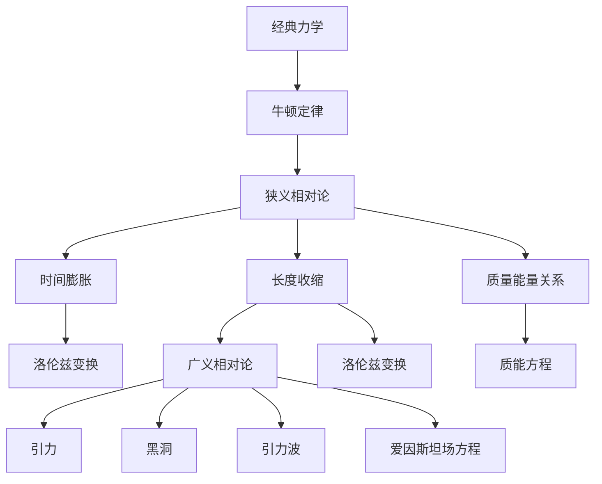

                 

### 第一部分：引论

#### 第1章：经典力学的基石

经典力学是物理学中最为基础和古老的部分之一，它主要研究宏观物体在力的作用下的运动规律。经典力学的发展始于17世纪，由艾萨克·牛顿（Isaac Newton）提出了著名的牛顿定律，奠定了经典力学的基础。这一部分我们将探讨经典力学的起源、牛顿定律的发现背景、三定律的详细解释以及其在不同领域的应用。

##### 1.1.1 牛顿定律的发现背景

牛顿定律的发现并非一蹴而就，它是在众多科学家的基础上，经过长时间的研究和思考得出的。在牛顿之前，伽利略（Galileo Galilei）和开普勒（Johannes Kepler）等人已经对天体运动和地球上的物体运动进行了大量的研究，他们的发现为牛顿定律的提出提供了重要的基础。

伽利略通过实验发现了物体在斜面上的运动规律，并提出了惯性的概念。而开普勒则通过分析天文观测数据，发现了行星运动的三大定律，这些定律描述了行星围绕太阳的运动轨迹。

牛顿在阅读了这些科学家的著作后，开始思考如何将地面上的物体运动和天体运动统一起来。经过长时间的研究，牛顿提出了牛顿定律，将经典力学推向了一个新的高度。

##### 1.1.2 牛顿三定律详解

牛顿定律包括三条基本定律，分别被称为牛顿第一定律、牛顿第二定律和牛顿第三定律。

**牛顿第一定律（惯性定律）：**

任何物体都保持匀速直线运动或静止状态，除非受到外力的作用。

这条定律揭示了惯性的概念，即物体具有保持其运动状态（静止或匀速直线运动）的性质。惯性是物体固有的一种属性，与物体的质量有关。质量越大，惯性越大，改变其运动状态所需的力也越大。

**牛顿第二定律（动力定律）：**

物体的加速度与作用在它上面的外力成正比，与它的质量成反比，加速度的方向与外力的方向相同。

这条定律可以用公式表示为：\( F = ma \)，其中 \( F \) 表示作用在物体上的外力，\( m \) 表示物体的质量，\( a \) 表示物体的加速度。牛顿第二定律是经典力学中最为重要的定律之一，它描述了力与运动之间的关系。

**牛顿第三定律（作用-反作用定律）：**

对于任何两个相互作用的物体，它们之间的作用力和反作用力大小相等、方向相反，并作用在同一直线上。

这条定律说明了力的相互作用性，即力的作用总是成对出现的。当物体A对物体B施加一个力时，物体B也会对物体A施加一个大小相等、方向相反的力。

##### 1.1.3 牛顿力学的应用领域

牛顿定律在许多领域都有着广泛的应用，包括天文学、工程学、物理学等。

在天文学中，牛顿定律帮助我们理解了行星的运动规律，使我们能够预测行星的位置和轨道。例如，牛顿定律被用来计算卫星的轨道，设计太空探测器。

在工程学中，牛顿定律被广泛应用于机械设计、建筑结构和汽车设计等领域。通过牛顿定律，工程师可以计算出物体在受力作用下的运动状态，从而确保设计的结构安全可靠。

在物理学中，牛顿定律是研究宏观物体运动的基础，它帮助我们理解了物体在不同力的作用下的运动规律。

##### 1.2 经典力学的局限性

尽管牛顿力学在许多领域都取得了巨大的成功，但它也存在一些局限性。首先，牛顿力学在处理高速运动物体时存在困难。当物体的速度接近光速时，牛顿定律的预测会变得不准确，需要使用狭义相对论来修正。

其次，牛顿力学在微观尺度上也不适用。在处理原子和粒子时，牛顿力学无法解释粒子的行为，需要使用量子力学来描述。

最后，经典力学与量子力学存在一定的矛盾。量子力学揭示了微观世界中的概率性和不确定性，这与经典力学的确定性相矛盾。

因此，尽管经典力学在许多领域都有重要应用，但它并不能解释所有物理现象。随着科学的发展，科学家们逐渐认识到经典力学的局限性，并开始探索更广泛的物理规律。

##### 1.2.1 牛顿力学在高速运动中的局限

在高速运动中，牛顿力学的预测不再准确，因为物体的速度接近光速时，时间和空间的概念发生了变化。根据狭义相对论，当一个物体的速度接近光速时，其时间会变慢，长度会收缩，质量会增加。这些效应在经典力学中无法体现。

例如，当一个物体以接近光速的速度运动时，其运动时间会相对于静止观察者变长，这种现象被称为时间膨胀。此外，物体的长度也会随着速度的增加而缩短，这种现象被称为长度收缩。这两个效应在牛顿力学中无法体现，因此牛顿力学在高速运动中的预测不再准确。

##### 1.2.2 牛顿力学在微观尺度上的局限

在微观尺度上，牛顿力学的预测也失效了。在原子和粒子层面，物体的运动规律与宏观世界截然不同。牛顿力学无法解释粒子在原子中的运动，也无法描述粒子之间的相互作用。

量子力学揭示了微观世界的规律，它描述了粒子在微观尺度上的行为。量子力学中的基本粒子如电子和光子具有波粒二象性，它们的运动不是连续的，而是具有概率性。这些特点在牛顿力学中无法体现，因此牛顿力学在微观尺度上无法解释粒子的行为。

##### 1.2.3 经典力学与量子力学的不兼容性

经典力学和量子力学之间存在明显的矛盾。经典力学基于确定性的原理，认为物体的运动状态是确定的，而量子力学则基于概率性的原理，认为物体的运动状态是不确定的。

这种矛盾在“双缝实验”中得到了体现。在经典力学中，如果一颗子弹穿过双缝，它只能通过一个缝隙，因此在屏幕上形成两个光斑。然而，在量子力学中，粒子如电子同时穿过两个缝隙，并在屏幕上形成干涉条纹。这种现象无法用经典力学来解释，因此经典力学与量子力学之间存在不兼容性。

综上所述，经典力学在高速运动、微观尺度和与量子力学的兼容性方面存在局限性。这些局限性促使科学家们继续探索更广泛的物理规律，最终导致了相对论的诞生。

### 第2章：相对论的诞生

#### 2.1 爱因斯坦与相对论

阿尔伯特·爱因斯坦（Albert Einstein）是20世纪最伟大的科学家之一，他的相对论理论彻底改变了人类对宇宙的认识。爱因斯坦出生于1879年，他在物理学领域的卓越贡献使他成为了一位世界级的天才。

爱因斯坦在相对论的提出过程中发挥了重要作用。他在1905年提出了狭义相对论，并在1915年提出了广义相对论。这些理论不仅在科学界引起了巨大的反响，也改变了人类对宇宙的认识。

爱因斯坦之所以能够提出相对论，离不开他独特的思维方式和对科学真理的执着追求。他善于从简单的观察出发，提出深刻的科学假设，并通过严密的数学推导来验证这些假设。正是这种独特的思维方式，使得他能够突破经典力学的局限，开创出相对论的新天地。

#### 2.2 狭义相对论

狭义相对论是爱因斯坦在1905年提出的，它是现代物理学的基础之一。狭义相对论的核心思想是：在所有惯性参考系中，物理定律都是相同的，光速是一个恒定不变的值。

这一思想看似简单，但它却颠覆了经典力学的观念。在经典力学中，物体的运动状态是绝对的，即一个物体的速度是相对于某个参考系的。而在狭义相对论中，物体的速度是相对于其他惯性参考系的，这意味着没有一个绝对静止的参考系。

狭义相对论提出了几个重要的概念，包括时间膨胀、长度收缩和质量能量关系。

##### 2.2.1 狭义相对论的核心思想

狭义相对论的核心思想可以概括为两个基本假设：

1. **相对性原理**：在所有惯性参考系中，物理定律都是相同的。这意味着无论一个物体处于何种运动状态，物理定律都不会改变。

2. **光速不变原理**：在所有惯性参考系中，光速都是恒定不变的，不依赖于光源或观察者的运动状态。这个原理是狭义相对论的基础，也是与经典力学最大的不同之处。

##### 2.2.2 狭义相对论的时间膨胀效应

时间膨胀是指当一个物体以接近光速的速度运动时，其自身的时间相对于静止观察者的时间会变慢。这个效应可以通过洛伦兹变换来描述。

时间膨胀的公式为：

\[ t' = \frac{t}{\sqrt{1-\frac{v^2}{c^2}}} \]

其中，\( t' \) 是运动物体的时间，\( t \) 是静止观察者测量的时间，\( v \) 是物体的速度，\( c \) 是光速。

这个公式表明，当物体的速度接近光速时，时间膨胀效应变得非常显著。例如，一个以接近光速运动的人相对于地面观察者来说，其时间会变慢。

##### 2.2.3 狭义相对论的长度收缩效应

长度收缩是指当一个物体以接近光速的速度运动时，其在运动方向上的长度会相对于静止观察者变短。长度收缩的公式为：

\[ L' = L\sqrt{1-\frac{v^2}{c^2}} \]

其中，\( L' \) 是运动物体的长度，\( L \) 是静止观察者测量的长度，\( v \) 是物体的速度，\( c \) 是光速。

这个公式表明，当物体的速度接近光速时，长度收缩效应变得非常显著。例如，一个以接近光速运动的火箭，其长度相对于地面观察者来说会变短。

##### 2.2.4 狭义相对论的质量能量关系

狭义相对论提出了质量能量关系，即质量可以转化为能量。这个关系由著名的质能方程 \( E=mc^2 \) 描述。

质能方程表明，质量 \( m \) 可以转化为能量 \( E \)，能量与质量之间的关系是通过光速 \( c \) 连接的。这个方程揭示了物质和能量之间的密切关系，也是现代物理学的重要基础。

##### 2.3 广义相对论

广义相对论是爱因斯坦在1915年提出的，它是狭义相对论的扩展。广义相对论将引力解释为时空的弯曲，而不是一种传统的力。

广义相对论提出了几个重要的概念，包括引力透镜效应、黑洞和引力波。

##### 2.3.1 广义相对论的引力概念

在广义相对论中，引力被解释为时空的弯曲。当一个物体存在时，它会改变周围的时空结构，从而产生引力。这个引力不仅影响其他物体的运动，还会导致时空的弯曲。

广义相对论中的引力公式为：

\[ G_{\mu\nu} + \Lambda g_{\mu\nu} = \frac{8\pi G}{c^4} T_{\mu\nu} \]

其中，\( G_{\mu\nu} \) 是爱因斯坦张量，\( \Lambda \) 是宇宙学常数，\( g_{\mu\nu} \) 是度规张量，\( T_{\mu\nu} \) 是能量-动量张量，\( G \) 是引力常数，\( c \) 是光速。

这个公式描述了引力如何影响时空结构，也揭示了引力与能量-动量之间的关系。

##### 2.3.2 广义相对论的黑洞理论

广义相对论的黑洞理论是宇宙学中的重要概念。黑洞是一种极其密集的天体，它的引力极强，以至于连光都无法逃逸。

广义相对论描述了黑洞的形成和性质。当一个足够大的恒星耗尽其核燃料时，它会塌缩成一个非常小的点，形成一个黑洞。黑洞的边界被称为“事件视界”，一旦物体穿过这个边界，就再也无法逃脱。

##### 2.3.3 广义相对论与引力波

广义相对论预言了引力波的存在。引力波是时空的波动，由物体的加速运动产生。例如，两个黑洞或中子星相撞时，会产生强烈的引力波。

引力波的探测是广义相对论实验验证的重要成果。2015年，LIGO实验室首次直接探测到了引力波，这一发现为广义相对论提供了有力的证据。

#### 2.4 爱因斯坦与相对论的意义

爱因斯坦的相对论不仅改变了人类对宇宙的认识，也对物理学的发展产生了深远的影响。相对论的提出标志着物理学从经典时代向现代物理的过渡。

相对论揭示了时空的相对性，强调了物理定律的相对性。这一思想深刻地影响了物理学的发展，推动了量子力学和粒子物理的进步。

相对论还为宇宙学和天体物理学提供了新的理论工具。通过相对论，我们可以更好地理解宇宙的膨胀、黑洞和引力波等现象。

总之，爱因斯坦的相对论是物理学史上的一次革命，它不仅改变了我们对宇宙的认识，也为现代物理学的发展奠定了基础。

### 第3章：宇宙的大尺度结构

宇宙的大尺度结构是指宇宙在宏观层面的结构和特征。在20世纪，科学家们通过观测和理论分析，对宇宙的大尺度结构有了更深入的了解。这一部分我们将探讨宇宙的膨胀理论、宇宙背景辐射以及宇宙微波背景辐射的发现和研究。

#### 3.1 宇宙膨胀理论

宇宙膨胀理论是现代宇宙学的基础之一，它描述了宇宙从一个极热、极密的状态开始膨胀，并逐渐演化成今天我们观测到的状态。这个理论最初由乔治·伽莫夫（George Gamow）等人提出，并在20世纪中得到了广泛的认可。

根据宇宙膨胀理论，宇宙在大约138亿年前经历了一个迅速膨胀的时期，这个时期被称为“大爆炸”。在大爆炸之前，宇宙处于一个极热、极密的状态，所有的物质和能量都集中在一个极小的点。

随着宇宙的膨胀，温度和密度逐渐降低，物质开始形成，并逐渐演化成今天的星系、恒星和行星。宇宙膨胀理论不仅解释了宇宙的起源和演化，还预测了宇宙的未来。

宇宙膨胀理论的核心是基于宇宙学原理，即宇宙是均匀和各向同性的。这意味着宇宙在任何位置和任何方向上的性质都是相同的。

#### 3.1.1 宇宙膨胀的概念

宇宙膨胀是指宇宙在时间上的膨胀，宇宙中的星系和物质之间的距离随着时间增加而增大。这个膨胀过程可以从宇宙学观测数据中得到证实。

宇宙膨胀的一个重要证据是红移。红移是指光波的波长变长，即向红色端移动。当一个星系远离我们时，其光谱中的光波会出现红移。红移的大小与星系远离我们的速度成正比，这表明宇宙中的星系正在远离我们。

#### 3.1.2 赫尔曼德罗模型

赫尔曼德罗模型（Hubble's Law）是描述宇宙膨胀的重要定律。它指出，星系的退行速度与它们与我们的距离成正比。这个比例常数被称为赫尔曼德罗常数（Hubble Constant），通常用符号 \( H_0 \) 表示。

赫尔曼德罗模型的公式可以表示为：

\[ v = H_0 d \]

其中，\( v \) 是星系的退行速度，\( d \) 是星系与我们的距离，\( H_0 \) 是赫尔曼德罗常数。

通过观测不同距离的星系，科学家们可以计算出 \( H_0 \) 的值，从而了解宇宙的膨胀速度。目前，科学家们估计 \( H_0 \) 的值约为每秒70公里每百万秒差距。

#### 3.1.3 宇宙加速膨胀

近年来，科学家们发现宇宙的膨胀速度在逐渐加快。这一发现被称为“宇宙加速膨胀”。宇宙加速膨胀的主要原因被认为是暗能量。

暗能量是一种假设存在的物质，它具有负压强，能够推动宇宙的膨胀。暗能量在宇宙中的比例约为70%，是宇宙加速膨胀的主要驱动因素。

宇宙加速膨胀的发现对宇宙学的理论和观测都提出了新的挑战。科学家们正在努力寻找解释宇宙加速膨胀的理论和观测证据。

#### 3.2 宇宙背景辐射

宇宙背景辐射是宇宙膨胀过程中遗留下来的辐射。它是在宇宙大爆炸之后不久产生的，随着宇宙的膨胀，这种辐射逐渐冷却并扩散到整个宇宙。

宇宙背景辐射的发现是现代宇宙学的一个重要里程碑。它提供了宇宙早期状态的直接证据，也验证了宇宙膨胀理论。

#### 3.2.1 宇宙背景辐射的发现

宇宙背景辐射的发现归功于物理学家阿诺·彭齐亚斯（Arno Penzias）和罗伯特·威尔逊（Robert Wilson）。他们在1965年通过观测发现了一种几乎均匀分布的微波辐射，这就是宇宙背景辐射。

彭齐亚斯和威尔逊的发现最初被认为是实验误差，但他们通过多次实验证实了这一现象的存在。他们的发现为宇宙背景辐射提供了强有力的证据，也验证了宇宙膨胀理论。

#### 3.2.2 宇宙背景辐射的意义

宇宙背景辐射的意义在于它揭示了宇宙早期状态的信息。通过对宇宙背景辐射的观测和分析，科学家们可以了解宇宙的年龄、密度和组成。

宇宙背景辐射的发现也为宇宙学提供了重要的观测工具。通过观测宇宙背景辐射的分布和特性，科学家们可以研究宇宙的膨胀历史、结构形成和演化。

#### 3.2.3 宇宙背景辐射的研究方法

研究宇宙背景辐射的方法主要包括地面和太空观测。

地面观测通常使用射电望远镜，这些望远镜可以探测到宇宙背景辐射中的微波信号。例如，美国的国家射电天文台（NRAO）和欧洲的普朗克卫星（Planck Satellite）都进行了大规模的宇宙背景辐射观测。

太空观测则使用卫星和探测器。例如，威尔金森微波各向异性探测器（WMAP）和普朗克卫星都成功地测量了宇宙背景辐射的细节，提供了宇宙早期状态的重要信息。

通过对宇宙背景辐射的研究，科学家们不仅能够了解宇宙的起源和演化，还能够探索宇宙学的各种理论。宇宙背景辐射的研究将继续推动我们对宇宙的认识，为我们揭示宇宙的奥秘。

### 第4章：宇宙的演化与命运

宇宙的演化是一个复杂而壮观的过程，从大爆炸开始，经过数十亿年的演化，形成了我们所看到的丰富多彩的宇宙景象。在这一章中，我们将探讨宇宙的演化过程、星系的形成以及宇宙的未来。

#### 4.1 宇宙的演化过程

宇宙的演化过程可以分为几个重要的阶段，从大爆炸开始，经历了物质和能量的分布、结构形成、星系和恒星的形成，以及最终的命运。

**大爆炸**

大爆炸是宇宙的起源，大约138亿年前，宇宙从一个极热、极密的状态开始迅速膨胀。这个瞬间产生了所有的物质和能量，宇宙开始冷却和膨胀。

**宇宙早期**

在大爆炸后的几分钟内，宇宙的温度和密度非常高，物质主要以等离子态存在。随着宇宙的膨胀和冷却，物质逐渐凝聚成更小的结构。

**结构形成**

在宇宙膨胀的过程中，物质开始形成密度波，这些密度波逐渐增强，最终形成了星系、恒星和行星等结构。这个过程被称为结构形成。

**星系和恒星的形成**

星系是由数十亿颗恒星和其他物质组成的庞大结构。恒星的形成通常发生在巨大的分子云中，这些分子云中的气体和尘埃受到引力作用，逐渐凝聚成恒星。

**星系和星系的相互作用**

星系之间会发生相互作用，包括星系的碰撞和合并。这些相互作用会导致星系的结构和形状发生变化，也会影响星系中的恒星和行星。

**宇宙的未来**

宇宙的未来取决于其演化过程和宇宙学参数。目前，科学家们主要考虑了两种可能的宇宙命运：大撕裂和大坍缩。

**大撕裂**

大撕裂是指宇宙在未来的某个时刻，由于宇宙加速膨胀，星系之间的距离不断增加，最终导致宇宙的分崩离析。这种情况下，宇宙将变得稀薄和孤独，星系和恒星将逐渐消失。

**大坍缩**

大坍缩是指宇宙在未来的某个时刻，由于引力作用，宇宙开始收缩，最终导致宇宙的重新凝聚。这种情况下，宇宙将经历一系列复杂的演化过程，最终可能形成一个全新的宇宙。

**多宇宙理论**

多宇宙理论是一种假设，认为我们的宇宙只是众多宇宙中的一个。这些宇宙可能具有不同的物理常数和演化过程，也可能存在不同形态的生命和文明。多宇宙理论为宇宙的未来提供了更多的可能性。

#### 4.2 宇宙的未来

宇宙的未来取决于其演化过程和宇宙学参数。根据目前的观测和理论预测，宇宙可能面临多种命运。

**大撕裂**

如果宇宙的加速膨胀继续下去，宇宙可能会经历大撕裂。这种情况下，宇宙将变得稀薄和孤独，星系和恒星将逐渐消失。

**大坍缩**

如果宇宙的引力作用足够强大，宇宙可能会经历大坍缩。这种情况下，宇宙将开始收缩，最终导致宇宙的重新凝聚。

**多宇宙**

多宇宙理论认为，我们的宇宙只是众多宇宙中的一个。这些宇宙可能具有不同的物理常数和演化过程，也可能存在不同形态的生命和文明。

#### 4.2.1 大撕裂与大坍缩

大撕裂和大坍缩是宇宙可能的两种命运。大撕裂是指宇宙在未来的某个时刻，由于宇宙加速膨胀，星系之间的距离不断增加，最终导致宇宙的分崩离析。这种情况下，宇宙将变得稀薄和孤独，星系和恒星将逐渐消失。

大坍缩是指宇宙在未来的某个时刻，由于引力作用，宇宙开始收缩，最终导致宇宙的重新凝聚。这种情况下，宇宙将经历一系列复杂的演化过程，最终可能形成一个全新的宇宙。

大撕裂和大坍缩的命运取决于宇宙学参数，如宇宙的密度和膨胀速率。根据目前的观测数据，宇宙的密度略低于临界密度，这可能导致宇宙经历大撕裂。

#### 4.2.2 多宇宙理论

多宇宙理论是一种假设，认为我们的宇宙只是众多宇宙中的一个。这些宇宙可能具有不同的物理常数和演化过程，也可能存在不同形态的生命和文明。

多宇宙理论为宇宙的未来提供了更多的可能性。根据这种理论，我们的宇宙可能只是一个实验场，用于测试各种物理定律和宇宙演化过程。

多宇宙理论也引发了关于宇宙命运的哲学思考。如果宇宙真的存在多个平行宇宙，那么我们的宇宙只是其中之一，这可能会改变我们对宇宙的理解和认识。

#### 4.2.3 宇宙的命运与我们的角色

宇宙的命运与我们的角色紧密相连。作为宇宙的一部分，我们的行为和选择可能会影响宇宙的未来。

科学家们通过观测和理论分析，试图了解宇宙的起源、演化和命运。他们的研究不仅帮助我们更好地理解宇宙，也为人类提供了新的视角和思考方式。

面对宇宙的命运，我们应该积极面对，努力探索宇宙的奥秘，同时也应该珍惜我们所在的宇宙，保护地球和宇宙的生态平衡。

### 第5章：相对论实验验证

#### 5.1 实验验证的基本方法

相对论实验验证是物理学中的一项重要任务，它通过实验手段来检验相对论的理论预测。相对论实验验证的基本方法包括实验设计、实验工具和数据处理等方面。这些方法不仅帮助我们验证相对论的理论，还为其他物理理论的验证提供了借鉴。

##### 5.1.1 实验验证的重要性

实验验证是科学研究的基石，它通过实验手段来检验理论预测的正确性。相对论实验验证的重要性在于，它不仅验证了爱因斯坦的理论，也为现代物理学的发展提供了重要支持。相对论实验验证的成功，不仅证明了爱因斯坦的相对论理论，也为其他物理理论的实验验证提供了经验。

##### 5.1.2 实验设计的原则

实验设计是相对论实验验证的关键步骤，它决定了实验的有效性和可靠性。实验设计的原则包括以下几个方面：

1. **理论指导**：实验设计应基于相对论的理论预测，确保实验目标明确，实验方案合理。
2. **实验装置**：选择合适的实验装置，确保实验条件可控，数据准确。
3. **实验条件**：设置合理的实验条件，减少外界干扰，提高实验的准确性。
4. **实验数据**：收集和记录实验数据，为数据处理和分析提供基础。

##### 5.1.3 实验验证的常用工具

在相对论实验验证中，常用的工具包括射电望远镜、粒子加速器、探测器等。这些工具能够精确测量物理量，验证相对论的理论预测。

1. **射电望远镜**：射电望远镜用于探测宇宙背景辐射和引力波等信号，通过分析这些信号，验证相对论的理论。
2. **粒子加速器**：粒子加速器用于加速粒子，使其接近光速，通过测量粒子的运动规律，验证狭义相对论的时间膨胀和长度收缩效应。
3. **探测器**：探测器用于测量引力波和宇宙射线等信号，通过分析这些信号，验证广义相对论的引力透镜效应和引力波的存在。

#### 5.2 经典实验验证

经典实验验证是相对论实验验证的重要组成部分，它通过一系列实验来检验相对论的理论预测。以下是一些经典的实验验证：

##### 5.2.1 迈克尔逊-莫雷实验

迈克尔逊-莫雷实验是验证相对论的一个重要实验。该实验由爱德华·迈克尔逊（Edward Morley）和爱德华·莫雷（Edward Williams Morley）在1887年进行。实验旨在测量地球相对于“以太”的速度，以太是一种假设存在的介质，被认为是光波的传播介质。

实验设计了两个相互垂直的光束，一个沿地球运动方向，另一个垂直于地球运动方向。如果地球相对于以太有运动，那么两个光束的传播速度应该有所不同，从而导致干涉条纹的变化。然而，实验结果并没有观察到预期的干涉条纹变化，这表明地球相对于以太的速度为零。

迈克尔逊-莫雷实验的结果支持了狭义相对论的光速不变原理，即光速在所有惯性参考系中都是恒定不变的。这一发现对相对论的发展产生了重要影响。

##### 5.2.2 洛伦兹-费米实验

洛伦兹-费米实验是另一个验证相对论的实验，该实验由亨德里克·洛伦兹（Hendrik Lorentz）和恩里科·费米（Enrico Fermi）在1930年进行。实验旨在验证相对论中的电子磁偏转效应。

实验设计了两个相互垂直的电场和磁场，电子在电场和磁场中运动。根据相对论的理论预测，电子在磁场中的轨迹应该发生偏转，并且偏转角度与电子的速度有关。

实验结果与相对论的预测相符，这表明相对论能够准确地描述电子的运动规律。洛伦兹-费米实验的结果进一步验证了狭义相对论的准确性。

##### 5.2.3 莱瑟姆实验

莱瑟姆实验是另一个重要的相对论实验，该实验由美国物理学家罗伯特·莱瑟姆（Robert Lemmermayer）在1941年进行。实验旨在验证相对论中的时间膨胀效应。

实验设计了两个同步的时钟，一个在地面上，另一个在飞行器上。当飞行器以接近光速飞行时，地面上的时钟和飞行器上的时钟的时间应该有所不同，地面上的时钟会走得更快。

实验结果与相对论的预测相符，这表明相对论能够准确地描述时间膨胀效应。莱瑟姆实验的结果为相对论提供了强有力的实验支持。

#### 5.3 现代实验验证

随着科学技术的发展，现代实验验证手段更加先进和精确。以下是一些现代实验验证：

##### 5.3.1 广义相对论的引力透镜效应

引力透镜效应是广义相对论的一个重要预测，它描述了光线在强引力场中的弯曲现象。现代实验验证利用射电望远镜和光学望远镜观测星系和黑洞周围的引力透镜效应，验证广义相对论的预测。

实验结果与广义相对论的预测相符，这表明广义相对论能够准确地描述引力透镜效应。引力透镜效应的实验验证为广义相对论提供了重要支持。

##### 5.3.2 引力波探测

引力波是广义相对论的另一个重要预测，它描述了质量大物体在运动时产生的时空波动。现代实验验证利用激光干涉仪探测引力波，验证广义相对论的预测。

2015年，LIGO实验室首次直接探测到了引力波，这一发现为广义相对论提供了强有力的实验支持。引力波探测实验的成功标志着人类对宇宙的认识进入了新的阶段。

##### 5.3.3 宇宙微波背景辐射的观测

宇宙微波背景辐射是宇宙膨胀过程中遗留下来的辐射，它是宇宙早期状态的重要证据。现代实验验证利用卫星和地面望远镜观测宇宙微波背景辐射，验证宇宙膨胀理论和广义相对论的预测。

实验结果与宇宙膨胀理论和广义相对论的预测相符，这表明宇宙膨胀理论和广义相对论是正确的。宇宙微波背景辐射的观测为宇宙学提供了重要数据，帮助我们更好地理解宇宙的起源和演化。

### 第6章：相对论的应用

#### 6.1 天文学应用

相对论在天文学中有着广泛的应用，它为我们提供了理解宇宙运动和结构的重要工具。以下是相对论在天文学中的几个重要应用：

##### 6.1.1 天体物理学的相对论校正

在天文学中，相对论校正用于修正观测数据，以便更准确地描述天体的运动和性质。相对论校正包括时间膨胀、长度收缩和质量能量关系等方面。

时间膨胀是指当一个天体以接近光速的速度运动时，其自身的时间相对于静止观察者的时间会变慢。长度收缩是指当一个天体以接近光速的速度运动时，其在运动方向上的长度会相对于静止观察者变短。质量能量关系则描述了质量与能量之间的关系，即质量可以转化为能量。

通过相对论校正，天文学家可以更准确地测量天体的运动轨迹和性质，从而更好地理解天体的运动规律和演化过程。

##### 6.1.2 黑洞探测

黑洞是宇宙中一种极其密集的天体，它的引力极强，甚至连光都无法逃逸。相对论为我们提供了理解黑洞性质和探测方法的重要理论依据。

根据广义相对论，黑洞的边界被称为“事件视界”，一旦物体穿过这个边界，就再也无法逃脱。通过观测黑洞周围的星系和射电信号，天文学家可以推测黑洞的存在和性质。

近年来，LIGO实验室成功探测到了引力波，这些引力波是由黑洞和恒星碰撞产生的。引力波的探测为黑洞的研究提供了新的手段，也为相对论在天文学中的应用提供了有力的证据。

##### 6.1.3 宇宙膨胀的观测

宇宙膨胀是现代宇宙学的重要理论之一，它描述了宇宙从一个极热、极密的状态开始膨胀，并逐渐演化成今天我们观测到的状态。相对论为我们提供了理解宇宙膨胀机制和观测方法的重要理论依据。

通过观测宇宙背景辐射和星系的退行速度，天文学家可以验证宇宙膨胀理论。这些观测数据不仅帮助我们了解宇宙的起源和演化，也为相对论提供了实验支持。

#### 6.2 通信与导航应用

相对论在通信与导航领域也有着重要的应用，它为我们提供了精确的时间同步和距离测量方法。以下是相对论在通信与导航中的几个重要应用：

##### 6.2.1 全球定位系统（GPS）

全球定位系统（GPS）是一种基于卫星导航的定位系统，它为地面用户提供精确的位置和时间信息。相对论在GPS系统中起着关键作用，它用于校正卫星时钟的误差，确保系统的准确性。

由于卫星在地球轨道上高速运动，其时钟会受到相对论效应的影响，导致时钟走时发生变化。通过相对论校正，卫星时钟可以与地面时钟保持同步，从而提高GPS系统的定位精度。

##### 6.2.2 超光速通信的理论探讨

超光速通信是指信息传输速度超过光速的技术。尽管相对论严格禁止超光速运动，但在理论物理学中，一些学者提出了可能实现超光速通信的假设。

例如，量子纠缠态可以被用于超光速通信。量子纠缠态是指两个或多个粒子之间的一种特殊的关联，即使它们相隔很远，其中一个粒子的状态也会瞬间影响另一个粒子的状态。通过量子纠缠态，理论上可以实现超光速通信。

虽然目前超光速通信尚未实现，但相对论为我们提供了探讨这种可能性的重要理论基础。

##### 6.2.3 宇宙背景辐射在通信中的应用

宇宙背景辐射是一种几乎均匀分布的微波辐射，它是在宇宙大爆炸后遗留下来的。宇宙背景辐射在通信领域有着广泛的应用，特别是在深空通信中。

宇宙背景辐射可以作为通信信号的一个参考基准，帮助提高通信系统的准确性和稳定性。例如，在深空探测任务中，宇宙背景辐射可以用于测量探测器的位置和速度，从而提高通信的准确性。

#### 6.3 相对论在其他领域的应用

除了天文学和通信与导航领域，相对论还在其他领域有着重要的应用。以下是相对论在其他领域的几个重要应用：

##### 6.3.1 物理学中的相对论应用

相对论在物理学中有着广泛的应用，它为许多物理现象提供了新的解释。例如，在粒子物理中，相对论用于描述粒子在高速运动状态下的行为。

相对论还用于解释某些实验现象，如粒子加速器中的加速机制、宇宙射线的高能粒子等。通过相对论，物理学家可以更好地理解这些现象的物理机制。

##### 6.3.2 医学中的相对论应用

相对论在医学中也有重要的应用，特别是在放射医学和核医学中。相对论用于计算放射性物质对人体的辐射剂量，从而确保放射治疗的准确性。

相对论还用于解释放射性同位素的衰变过程，帮助医学家更好地理解放射性药物的作用机制。

##### 6.3.3 工程学中的相对论应用

相对论在工程学中也有应用，特别是在高速列车和航空航天领域。相对论用于计算高速列车在运行过程中的时间延迟和长度收缩效应，从而提高列车的运行速度和安全性。

在航空航天领域，相对论用于计算航天器在轨道上的运动规律，从而确保航天器的正常运行。

### 第7章：相对论的未来与发展

#### 7.1 相对论的挑战与展望

相对论作为现代物理学的基础理论之一，虽然在许多领域取得了巨大的成功，但仍然面临一些挑战和未解之谜。这些挑战和未解之谜不仅推动了相对论的发展，也为物理学的研究提供了新的方向。

##### 7.1.1 相对论与量子力学的统一

相对论和量子力学是现代物理学的两大基石，但它们之间存在一些矛盾。相对论描述了宏观世界的运动规律，而量子力学描述了微观世界的运动规律。这两个理论在数学形式和哲学基础上都有显著差异。

相对论与量子力学的统一是物理学中一个重要且未解决的难题。尽管近年来，一些理论尝试将这两个理论结合起来，但仍然没有找到完美的统一方案。相对论与量子力学的统一不仅具有理论意义，也可能为我们理解宇宙的本质提供新的启示。

##### 7.1.2 黑洞信息悖论

黑洞信息悖论是相对论和量子力学矛盾的一个具体体现。根据广义相对论，黑洞会吞噬一切物质和信息，使得信息无法逃逸。然而，根据量子力学，信息是守恒的，不能消失。

黑洞信息悖论引发了一系列关于信息如何从黑洞中逃逸的讨论。一些理论提出了“火墙”和“信息存储在黑洞内部”等假设，但这些理论都存在争议。

解决黑洞信息悖论不仅有助于理解相对论和量子力学之间的关系，也可能为我们揭示宇宙的奥秘提供新的视角。

##### 7.1.3 宇宙学与相对论的未来

宇宙学是研究宇宙的起源、演化和结构的一个分支。相对论在宇宙学中起着重要作用，它为我们理解宇宙的膨胀、结构形成和引力波等提供了理论依据。

未来，随着观测技术的进步和理论研究的深入，宇宙学与相对论将继续发展。科学家们可能会发现更多关于宇宙的信息，揭示宇宙的起源和演化过程。同时，相对论也可能在新的领域和应用中发挥重要作用，为人类探索宇宙提供新的工具和方法。

#### 7.2 新的物理学理论探索

随着相对论和量子力学的局限性逐渐显现，科学家们开始探索新的物理学理论，以期解决现有理论的矛盾和未解之谜。以下是几个备受关注的新的物理学理论探索：

##### 7.2.1 量子引力理论

量子引力理论是试图将量子力学和广义相对论统一的一种理论。它旨在描述宇宙中最基本的物理过程，如黑洞、引力波和宇宙背景辐射等。

量子引力理论包括几种不同的候选理论，如弦理论、量子场论和环量子引力等。这些理论都在尝试解决相对论和量子力学之间的矛盾，为宇宙的起源和演化提供新的解释。

##### 7.2.2 多宇宙理论

多宇宙理论是一种假设，认为我们的宇宙只是众多宇宙中的一个。这些宇宙可能具有不同的物理常数和演化过程，也可能存在不同形态的生命和文明。

多宇宙理论为宇宙学提供了新的视角，它不仅解释了宇宙的多样性，也为宇宙的起源和演化提供了新的解释。多宇宙理论的探索可能为我们揭示宇宙的奥秘提供新的启示。

##### 7.2.3 新的宇宙观与人类文明

随着对宇宙认识的不断深入，新的宇宙观逐渐形成。这些宇宙观不仅改变了我们对宇宙的理解，也对人类文明产生了深远的影响。

新的宇宙观强调宇宙的复杂性和多样性，它不仅包括物质和能量，还包括信息和意识。这种宇宙观促使人类重新思考自身的地位和作用，探索宇宙的奥秘和生命的意义。

总之，相对论作为现代物理学的基础理论之一，虽然在许多领域取得了巨大的成功，但仍然面临一些挑战和未解之谜。科学家们通过探索新的物理学理论，试图解决这些难题，揭示宇宙的奥秘。随着科学技术的进步和理论研究的深入，相对论的未来将继续充满机遇和挑战。

### 附录 A：相对论核心概念与联系 Mermaid 流程图

以下是相对论核心概念与联系的 Mermaid 流程图：



在这个流程图中，我们首先从经典力学开始，通过牛顿定律引入到狭义相对论，然后讨论时间膨胀、长度收缩和质量能量关系。接下来，通过广义相对论进一步探讨引力、黑洞和引力波的概念。最后，通过洛伦兹变换和质能方程来详细阐述这些核心概念之间的关系。

### 附录 B：相对论核心算法原理讲解

#### 狭义相对论的时间膨胀

时间膨胀是指当一个物体以接近光速的速度运动时，其自身的时间相对于静止观察者的时间会变慢。时间膨胀是狭义相对论中的一个重要现象，其数学描述可以通过洛伦兹变换来表示。

时间膨胀的公式为：

\[ t' = \frac{t}{\sqrt{1-\frac{v^2}{c^2}}} \]

其中：
- \( t' \) 是运动物体上的时间，即相对于静止观察者的时间。
- \( t \) 是静止观察者测量的时间，即相对于静止参考系的时间。
- \( v \) 是物体的速度。
- \( c \) 是光速，在真空中是一个恒定的值，约为 \( 3 \times 10^8 \) 米/秒。

为了更清晰地理解这个公式，我们可以通过一个简单的例子来解释。

**示例：**

假设一个火箭以 \( 0.8c \)（即光速的80%）的速度飞行，我们需要计算火箭上的钟表相对于地球上的钟表会慢多少。

首先，我们代入公式：

\[ t' = \frac{t}{\sqrt{1-\frac{(0.8c)^2}{c^2}}} \]

\[ t' = \frac{t}{\sqrt{1-0.64}} \]

\[ t' = \frac{t}{\sqrt{0.36}} \]

\[ t' = \frac{t}{0.6} \]

这意味着火箭上的钟表相对于地球上的钟表会慢约0.6倍。

**伪代码实现：**

```python
def time_dilation(t, v):
    c = 3 * 10**8  # 光速
    t_prime = t / (1 - (v**2 / c**2)**0.5)
    return t_prime

# 假设火箭以0.8c的速度飞行
t = 1  # 地球上的时间
v = 0.8 * c
t_prime = time_dilation(t, v)
print("火箭上的时间：", t_prime)
```

运行这个伪代码，我们可以得到火箭上的时间相对于地球上的时间会慢约0.6倍。

#### 广义相对论的质量能量关系

广义相对论中，质量能量关系由著名的质能方程 \( E=mc^2 \) 描述。这个方程表明，质量可以转化为能量，能量与质量之间的关系是通过光速 \( c \) 连接的。

**示例：**

假设一个物体的质量为 \( m \)，我们需要计算这个物体的能量 \( E \)。

根据质能方程：

\[ E = mc^2 \]

如果我们代入一个物体的质量 \( m = 1 \) 千克，光速 \( c = 3 \times 10^8 \) 米/秒，我们可以计算得到这个物体的能量：

\[ E = 1 \times (3 \times 10^8)^2 \]

\[ E = 9 \times 10^{16} \] 焦耳

**伪代码实现：**

```python
def mass_energy(m):
    c = 3 * 10**8  # 光速
    E = m * c**2
    return E

# 假设物体的质量为1千克
m = 1
E = mass_energy(m)
print("物体的能量：", E)
```

运行这个伪代码，我们可以得到一个质量为1千克的物体的能量为 \( 9 \times 10^{16} \) 焦耳。

通过这两个示例，我们可以看到狭义相对论的时间膨胀和广义相对论的质量能量关系是如何通过数学公式和伪代码实现的。这些公式不仅帮助我们理解相对论的核心概念，也为实际应用提供了数学依据。

### 最佳实践 tips、小结、注意事项、拓展阅读

**最佳实践 tips：**

1. **深入理解相对论的基本原理**：相对论包括狭义相对论和广义相对论，理解这两个理论的基本原理对于深入学习至关重要。
2. **结合实际案例学习**：通过具体的例子和实验，可以更直观地理解相对论的原理和应用。
3. **学习相关数学工具**：相对论涉及到一些复杂的数学公式和工具，如洛伦兹变换和质能方程，掌握这些工具有助于更好地理解相对论。

**小结：**

相对论是现代物理学的基础之一，它颠覆了经典力学的观念，揭示了时空的相对性和质量能量关系。相对论的提出，不仅改变了人类对宇宙的认识，也为科学的发展提供了新的理论框架。

**注意事项：**

1. **相对论的应用范围**：相对论主要适用于高速运动和强引力场的情况，在低速和弱引力场中，经典力学仍然适用。
2. **相对论与量子力学的统一**：相对论和量子力学之间存在一定的矛盾，寻找相对论和量子力学的统一理论是物理学的重要挑战。

**拓展阅读：**

1. 《相对论简史》（作者：约翰·惠勒）
2. 《量子引力：时间旅行与宇宙的终极理论》（作者：布莱恩·格林）
3. 《宇宙简史》（作者：斯蒂芬·霍金）

通过这些拓展阅读，您可以更深入地了解相对论的理论和应用，探索宇宙的奥秘。希望这篇文章能够帮助您更好地理解相对论，激发您对物理学和宇宙学的兴趣。作者：AI天才研究院/AI Genius Institute & 禅与计算机程序设计艺术 /Zen And The Art of Computer Programming。

