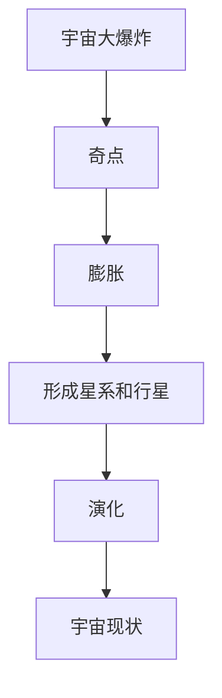
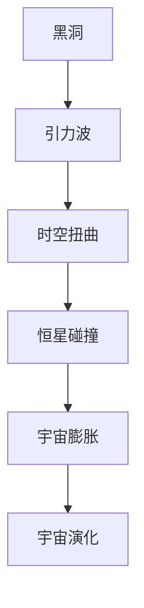

                 

# 从神话到科学：人类宇宙观的演进

## 关键词

宇宙观，科学哲学，科学史，天文学，天体物理学，人类认知

## 摘要

本文旨在探讨人类宇宙观的历史演变，从古代神话到现代科学，揭示宇宙观念的发展过程及其对人类认知的深远影响。文章分为三大部分：第一部分介绍宇宙观的起源与神话，回顾古代文明对宇宙的理解；第二部分阐述科学宇宙观的诞生，分析哥白尼、开普勒、牛顿等科学家的贡献；第三部分讨论现代宇宙学的发展及其意义，探讨宇宙观在人类价值观、科学哲学和教育普及中的作用。通过这篇文章，读者将了解到人类对宇宙认识的逐步深入和宇宙观对科学、文化和生活的影响。

# 《从神话到科学：人类宇宙观的演进》目录大纲

## 第一部分：宇宙观的起源与神话

### 第1章：宇宙观的早期形成

- **1.1.1 宇宙观的起源**
  - 宇宙观的起源与人类的认知发展
  - 宇宙观的形成过程
  
- **1.1.2 宇宙的神话与宗教**
  - 宇宙神话在不同文化中的表现
  - 宗教宇宙观的多样性

- **1.1.3 古代宇宙观的多样性**
  - 地心说与日心说的争论
  - 古代文明的宇宙观比较

- **1.1.4 地心说与日心说的兴起**
  - 地心说的历史背景
  - 日心说的兴起与发展

### 第2章：古代宇宙观

- **2.1.1 古希腊宇宙观**
  - 泰勒斯与自然哲学
  - 柏拉图与宇宙的形而上学
  - 亚里士多德与地心说宇宙观

- **2.2.1 古印度宇宙观**
  - 奥义书与梵天
  - 瑜伽与宇宙观

- **2.3.1 古中国宇宙观**
  - 周易与宇宙观
  - 黄帝内经与宇宙观

## 第二部分：科学宇宙观的诞生

### 第3章：宇宙观的变革

- **3.1.1 哥白尼与日心说**
  - 哥白尼革命
  - 日心说的科学依据

- **3.2.1 开普勒与行星运动定律**
  - 行星运动的规律
  - 开普勒定律的应用

- **3.3.1 牛顿与万有引力定律**
  - 牛顿的物理学革命
  - 万有引力定律的意义

### 第4章：现代宇宙学

- **4.1.1 宇宙的大尺度结构**
  - 宇宙背景微波辐射
  - 宇宙大爆炸理论

- **4.2.1 宇宙的演化**
  - 星系的形成与演化
  - 暗物质与暗能量的探究

### 第5章：宇宙的未来

- **5.1.1 宇宙的膨胀与命运**
  - 宇宙膨胀理论
  - 宇宙的命运猜想

- **5.2.1 探索宇宙的新技术**
  - 望远镜与宇宙观测
  - 太空探索与深空任务

## 第三部分：宇宙观的意义与启示

### 第6章：人类对宇宙的思考

- **6.1.1 宇宙观与人类价值观**
  - 宇宙观对人类行为的影响
  - 宇宙观与人类的未来

- **6.2.1 宇宙观与科学哲学**
  - 科学方法与宇宙观
  - 宇宙观对科学发展的启示

### 第7章：宇宙观的教育与普及

- **7.1.1 宇宙观教育的重要性**
  - 宇宙观教育的内容与方法
  - 宇宙观教育在素质教育中的应用

- **7.2.1 宇宙观普及与科学传播**
  - 宇宙观的传播途径
  - 科学传播的挑战与机遇

## 附录

- **附录A：宇宙观相关的Mermaid流程图**
  - 宇宙大爆炸理论
  - 黑洞与引力波

- **附录B：核心算法原理与伪代码**
  - 行星运动定律的数学模型
  - 宇宙背景微波辐射的数学模型

- **附录C：数学模型和数学公式**
  - 万有引力定律
  - 宇宙膨胀速度

- **附录D：项目实战**
  - 太空任务模拟系统
  - 宇宙观教育游戏开发

# 第一部分：宇宙观的起源与神话

## 第1章：宇宙观的早期形成

### 1.1.1 宇宙观的起源

宇宙观的起源与人类认知的演进密不可分。自古以来，人类对周围世界的认知逐步扩展，从自身开始，逐渐向外探索，最终形成了对宇宙的基本认识。这一过程可以追溯到史前时期，当时的人类在面临自然的种种现象时，试图寻找解释这些现象的答案。

在原始社会，宇宙观主要源于神话与宗教信仰。神话是人类早期对自然现象的拟人化和象征化，通过对神灵、英雄、怪物等神话人物的描绘，试图解释宇宙的起源、运行和终结。例如，古希腊神话中的宙斯统治天空，海洋由波塞冬掌管，大地则是盖亚的领域。这些神话反映了早期人类对宇宙的认知，将宇宙视为一个有生命、有灵魂的存在。

宗教信仰也在宇宙观的形成过程中起到了重要作用。不同宗教对宇宙有着各自独特的解释。例如，在基督教中，宇宙是由上帝创造的，宇宙的运行遵循上帝的旨意；在伊斯兰教中，宇宙是安拉（真主）的造物，安拉是宇宙的主宰；在佛教中，宇宙是无始无终的，由无数的众生和诸佛菩萨所构成。

此外，早期人类在观察天体运动的过程中，逐渐形成了对宇宙的初步认识。他们发现太阳、月亮和星星在天空中的运动规律，从而产生了对天文学的初步了解。例如，古巴比伦人通过观察天体运动，编制了世界上最早的日历；古埃及人则通过对天体位置的观测，建立了天文观测体系，为后来的天文学发展奠定了基础。

总之，宇宙观的起源是人类对自然现象的观察、思考和解释，通过神话和宗教信仰的方式逐渐形成。这一过程不仅反映了人类对宇宙的基本认识，也展现了人类认知发展的历程。

### 1.1.2 宇宙的神话与宗教

神话和宗教是宇宙观的重要组成部分，它们不仅反映了古代人类对宇宙的理解，还影响了人类的文化、价值观和社会结构。不同文化中的神话和宗教对宇宙有着不同的解释，但都试图回答关于宇宙起源、运行和终结的基本问题。

在古希腊神话中，宇宙的起源被认为是混沌（Chaos）和大地女神盖亚（Gaia）的结合。根据神话，盖亚生出了天空（乌拉诺斯）、海洋（蓬托斯）和山脉（欧瑞斯特斯），这些元素共同构成了宇宙的雏形。随后，宙斯（Zeus）成为新的统治者，他推翻了父亲乌拉诺斯，建立了新的秩序。

古希腊神话中的众神不仅掌管着自然现象，如雷电、风暴和洪水，还参与了人类的命运。例如，赫拉（Hera）是婚姻和家庭的女神，阿波罗（Apollo）是光明和艺术的守护者，雅典娜（Athena）则是智慧和战争的化身。这些神话故事揭示了古希腊人对宇宙和人类生活的理解，将宇宙视为一个有生命、有灵魂的存在。

在古印度神话中，宇宙的起源被认为是一个混沌的时期，随后梵天（Brahma）创造了宇宙，并在宇宙的运转中扮演着重要角色。梵天代表着创造和维持宇宙的力量，他创造了四个主要的生物，分别是梵天、毗湿奴（Vishnu）、湿婆（Shiva）和阎摩（Yama）。这些生物共同维持着宇宙的平衡和秩序。

古印度神话中的另一个重要主题是轮回（Samsara），即生命的循环。根据轮回观念，生命在死后会根据业力的好坏转生为不同的生物，继续经历生死轮回。这一观念不仅影响了印度教，也对佛教和锡克教产生了深远影响。

在古埃及神话中，宇宙的起源被认为是太阳神拉（Ra）创造了一个蛋，蛋中孵化出了奥西里斯（Osiris）、伊西丝（Isis）和荷鲁斯（Horus）。奥西里斯是生命和复活的象征，伊西丝是母性和爱情的守护者，荷鲁斯则是正义和力量的代表。这些神话人物不仅代表着宇宙的起源和秩序，还反映了古埃及人对生命、死亡和复活的信仰。

此外，在古埃及神话中，还有关于奥西里斯的复活和斗争的传说。奥西里斯被兄弟赛特（Set）杀害，但通过伊西丝和荷鲁斯的努力，他最终复活并获得了永生。这一传说表达了古埃及人对生命力和永恒的渴望。

总的来说，宇宙的神话和宗教在不同文化中有着不同的表现形式，但都试图解释宇宙的起源、运行和终结。这些神话和宗教不仅反映了古代人类对宇宙的理解，还影响了他们的生活方式、价值观和社会制度。通过神话和宗教，人类试图寻找自己在宇宙中的位置和意义，这种探索和思考延续至今，成为宇宙观的重要组成部分。

### 1.1.3 古代宇宙观的多样性

古代宇宙观在不同文化和文明中呈现出多样性，这些观念不仅反映了当时的科学认知，也体现了不同文化对自然和宇宙的独特理解。以下将分别介绍古希腊、古印度和古中国宇宙观的主要特点。

在古希腊，宇宙观的发展经历了多个阶段，从早期的自然哲学到后来的宇宙体系构建。古希腊宇宙观的奠基者是泰勒斯（Thales），他认为万物起源于水，水是宇宙的本源。泰勒斯的观点虽然简单，但开启了自然哲学的先河。随后，阿那克西曼德（Anaximander）提出了“无定”（Apeiron）的概念，认为宇宙起源于一种无限、无形的物质。阿那克西米尼（Anaximenes）则认为空气是宇宙的本源。

古希腊最著名的宇宙观是柏拉图的宇宙分层理论。柏拉图认为宇宙由理性和物质两个世界组成，理性世界是完美的、永恒的，而物质世界则是理性和变化的表现。柏拉图的宇宙分层理论对后来的西方哲学和科学产生了深远影响。

亚里士多德（Aristotle）对古希腊宇宙观进行了系统的阐述。他认为宇宙由一个固定的、不动的第一推动者（Prime Mover）驱动，这个第一推动者就是上帝。亚里士多德提出了地心说（geocentric model），即地球是宇宙的中心，所有天体都绕地球运行。这一理论在古代和中世纪占据了主导地位。

在古印度，宇宙观的发展与宗教和哲学密不可分。古印度最重要的宇宙观概念是“梵”（Brahman），即宇宙的绝对真理和终极实在。梵被认为是超越个人意识的存在，是宇宙一切现象的根源。奥义书（Upanishads）中提出了“梵我如一”（Brahman-Atman identity）的观点，认为个体的灵魂（Atman）与宇宙的绝对真理是同一的。

古印度的宇宙观还包括轮回（Samsara）和解脱（Moksha）的概念。轮回是指生命的循环，灵魂在生死之间不断转生，经历各种苦乐。解脱则是指灵魂摆脱轮回的束缚，回归梵的状态。这一观念影响了印度教、佛教和锡克教等多个宗教。

在古中国，宇宙观的发展与儒家、道家和佛家思想密切相关。儒家宇宙观强调“天人合一”，认为天和人是相互关联的，人的道德行为会影响自然界。道家宇宙观则强调“道”的概念，认为宇宙万物都遵循道的原则，道是宇宙的根源和规律。

《周易》是中国古代宇宙观的重要文献，其中提出了“阴阳五行”的理论。阴阳代表宇宙的两种基本力量，五行（金、木、水、火、土）则代表宇宙的基本元素。这一理论在中国古代哲学、医学和占卜中有着广泛的应用。

《黄帝内经》是另一部反映中国古代宇宙观的重要文献。它提出了“天人相应”的观点，认为人体与自然界是相互关联的，人体内部的阴阳平衡与自然界的阴阳变化密切相关。

总的来说，古希腊、古印度和古中国宇宙观各有特点，它们不仅反映了古代人类对宇宙的理解，也体现了不同文化的哲学和宗教观念。这些宇宙观不仅在当时产生了深远影响，也对后世科学和哲学的发展产生了重要启示。

### 1.1.4 地心说与日心说的兴起

地心说（Geocentric model）和日心说（Heliocentric model）是古代宇宙观中的两大理论，它们分别主张地球和太阳在宇宙中的中心地位。地心说认为地球是宇宙的中心，所有天体都绕地球运行，这一观念在古代占据主导地位。而日心说则认为太阳是宇宙的中心，地球和其他行星都绕太阳运行。这一理论由哥白尼（Nicolaus Copernicus）提出，并在后来的科学革命中得到了广泛认可。

地心说的起源可以追溯到古希腊哲学家亚里士多德（Aristotle）。亚里士多德认为地球是不动的，位于宇宙的中心，天体则围绕地球旋转。这一观念在古罗马时期得到了扩展，托勒密（Ptolemy）在《天文学大成》（Almagest）中提出了一个详细的地心说宇宙模型，该模型包含了复杂的本轮和均轮系统，以解释天体运动的规律。

地心说在古代和中世纪占据了主导地位，成为当时科学和宗教的基础。在地心说模型中，地球被认为是静止不动的，天体围绕地球运行，形成一系列复杂的轨道。这一模型在解释天体运动方面取得了一定的成功，但它在数学上变得复杂，难以精确描述天体的运动。

哥白尼是日心说的提出者，他在他的著作《天体运行论》（De revolutionibus orbium coelestium）中详细阐述了日心说的观点。哥白尼认为太阳是宇宙的中心，地球和其他行星都绕太阳运行。这一理论打破了地心说的传统观念，提出了一个更加简洁和自然的宇宙模型。

哥白尼的日心说理论在当时引起了巨大的争议，许多学者和宗教权威都对此表示质疑和反对。然而，随着开普勒（Johannes Kepler）和伽利略（Galileo Galilei）等科学家的研究，日心说的科学依据逐渐得到证实，最终取代了地心说。

开普勒是日心说的坚定支持者，他通过观察天文数据，提出了行星运动的三定律。开普勒第一定律（椭圆定律）指出，行星绕太阳运行的轨道是椭圆形的，太阳位于椭圆的一个焦点上。开普勒第二定律（面积定律）指出，行星在轨道上运动时，其与太阳的连线在相同时间内扫过相同面积。开普勒第三定律（调和定律）指出，行星绕太阳运行的轨道周期的平方与其轨道半长轴的立方成正比。

伽利略是日心说的另一位重要支持者，他通过望远镜观察到了木星的四大卫星、月球表面和太阳黑子等现象，这些观测结果支持了哥白尼的日心说理论。伽利略的观测结果在科学界引起了巨大反响，为日心说赢得了更多的支持者。

总的来说，地心说与日心说的兴起反映了人类对宇宙认识的不断深化。地心说在古代占据主导地位，但随着科学的发展，日心说逐渐取代了地心说，成为现代宇宙观的基础。哥白尼、开普勒和伽利略等科学家的贡献，为人类理解宇宙提供了新的视角和方法，推动了科学革命的进程。

## 第二部分：科学宇宙观的诞生

### 第3章：宇宙观的变革

科学宇宙观的诞生标志着人类对宇宙认识的一次重大变革。在这一部分中，我们将探讨哥白尼、开普勒和牛顿等科学家的贡献，分析他们对宇宙观的影响。

### 3.1.1 哥白尼与日心说

哥白尼（Nicolaus Copernicus）是科学宇宙观的奠基人之一，他提出了日心说（Heliocentric model）理论，彻底改变了人类对宇宙的认识。哥白尼认为，太阳是宇宙的中心，地球和其他行星都绕太阳运行。这一观点与地心说（Geocentric model）形成了鲜明对比，地心说认为地球是宇宙的中心，所有天体都绕地球运行。

哥白尼的日心说理论在当时引起了巨大的争议。许多学者和宗教权威都对此表示质疑和反对，因为这一理论挑战了长期以来被人们接受的宇宙观念。然而，哥白尼坚持自己的观点，并通过数学计算和观测数据，证明日心说比地心说更合理。

哥白尼的《天体运行论》（De revolutionibus orbium coelestium）是他的代表作，该书详细阐述了日心说理论，并提出了行星运动的三定律。哥白尼的日心说理论为后来的天文学和物理学研究奠定了基础，标志着科学宇宙观的诞生。

### 3.1.2 日心说的科学依据

日心说的科学依据主要来自以下几个方面的证据：

1. **行星运动的规律**：哥白尼通过观察行星运动，发现行星轨道并非圆形，而是椭圆形。这一发现与地心说的圆形轨道观念相悖。开普勒进一步提出了行星运动的三大定律，解释了行星轨道的形状和行星运动的速度。

2. **恒星视差**：哥白尼和后来的天文学家通过观测恒星的位置变化，发现了恒星视差现象。恒星视差是指由于地球绕太阳运动，恒星在天空中的位置会发生变化。这一现象支持了日心说，因为只有在地球围绕太阳运动的情况下，恒星视差才会出现。

3. **行星运动的周期性**：哥白尼和开普勒发现，行星绕太阳运行的周期与其距离太阳的距离成比例。这一规律称为开普勒第三定律，为日心说提供了强有力的支持。

4. **太阳的动态**：通过望远镜观测，天文学家发现太阳表面存在黑子和太阳风等现象。这些现象表明太阳是一个活跃的天体，而非静止不动的。

总的来说，日心说的科学依据来自对行星运动、恒星视差、行星运动周期性和太阳动态的观测和研究。这些证据共同支持了哥白尼的日心说理论，为科学宇宙观的诞生奠定了基础。

### 3.2.1 开普勒与行星运动定律

约翰内斯·开普勒（Johannes Kepler）是哥白尼日心说的坚定支持者，他通过对行星运动的研究，提出了著名的开普勒三大定律，这些定律为天文学和物理学的发展做出了巨大贡献。

#### 3.2.1.1 行星运动的规律

开普勒的第一定律（椭圆定律）指出，行星绕太阳运行的轨道是椭圆形的，太阳位于椭圆的一个焦点上。这一发现纠正了哥白尼圆形轨道的观念，揭示了行星轨道的真正形状。

开普勒的第二定律（面积定律）指出，行星在轨道上运动时，其与太阳的连线在相同时间内扫过相同面积。这意味着行星在接近太阳时运动速度较快，而在远离太阳时运动速度较慢。这一规律解释了行星运动速度的变化。

开普勒的第三定律（调和定律）指出，行星绕太阳运行的轨道周期的平方与其轨道半长轴的立方成正比。这一规律表明了行星轨道大小与运动周期的关系，为天文学家提供了预测行星运动的有力工具。

#### 3.2.1.2 开普勒定律的应用

开普勒定律在天文学和物理学中有着广泛的应用。首先，它们为计算行星轨道提供了精确的数学模型，使得天文学家能够更准确地预测行星的位置和运动。其次，开普勒定律揭示了行星运动的内在规律，为理解宇宙的运行机制提供了重要线索。

开普勒定律的应用不仅限于行星运动，它们还为后来的科学革命奠定了基础。例如，牛顿通过开普勒定律，进一步推导出了万有引力定律，从而建立了经典力学体系。此外，开普勒定律在航天工程、宇宙探索和天体物理学等领域也有重要应用。

总的来说，开普勒的行星运动定律不仅深化了人类对宇宙的认识，还为科学的发展提供了强有力的理论支持。开普勒的贡献使人类能够更加精确地描述和预测行星运动，为科学宇宙观的建立奠定了基础。

### 3.3.1 牛顿与万有引力定律

艾萨克·牛顿（Isaac Newton）是科学史上最伟大的科学家之一，他的成就不仅对物理学产生了深远影响，也改变了人类对宇宙的认识。牛顿的万有引力定律（Law of Universal Gravitation）是经典力学的基石，为科学宇宙观的建立做出了重要贡献。

#### 3.3.1.1 牛顿的物理学革命

牛顿的物理学革命始于他对力学和天文学的研究。牛顿通过观察苹果落地和行星运动，提出了万有引力定律。该定律指出，任何两个物体之间都存在引力，引力的大小与两物体的质量成正比，与它们之间的距离的平方成反比。用公式表示即为：

\[ F = G \frac{{m_1 m_2}}{{r^2}} \]

其中，\( F \) 是引力，\( G \) 是万有引力常数，\( m_1 \) 和 \( m_2 \) 是两物体的质量，\( r \) 是它们之间的距离。

牛顿的万有引力定律不仅解释了行星运动的规律，还揭示了物体之间相互作用的本质。这一发现将天体运动与地面物体运动统一在一个理论框架下，为经典力学的建立奠定了基础。

#### 3.3.1.2 万有引力定律的意义

万有引力定律的意义在于它揭示了宇宙中物体相互作用的普遍规律。通过这一定律，牛顿能够解释行星、卫星、彗星等天体的运动，并预测新的天文现象。例如，牛顿通过万有引力定律成功预测了海王星的存在，这一成就使他成为了科学界的传奇人物。

此外，万有引力定律还为后来的科学研究提供了重要启示。例如，牛顿的定律为开普勒定律提供了更深刻的解释，使得行星运动的规律更加清晰。牛顿的物理学革命不仅改变了人类对自然世界的认识，还推动了科学方法的进步，为科学的发展开辟了新的道路。

总的来说，牛顿的万有引力定律是科学宇宙观的重要里程碑，它不仅揭示了宇宙中物体相互作用的普遍规律，还为经典力学的建立奠定了基础。牛顿的贡献使人类能够更深入地理解宇宙的运行机制，为科学的发展做出了巨大贡献。

### 第4章：现代宇宙学

随着科学的进步，人类对宇宙的认识不断深入，现代宇宙学应运而生。宇宙学是研究宇宙起源、结构、演化以及最终命运的科学。本章将探讨现代宇宙学的重要发现，包括宇宙的大尺度结构、宇宙大爆炸理论以及暗物质和暗能量的研究。

#### 4.1.1 宇宙的大尺度结构

宇宙的大尺度结构是指宇宙中星系、星系团和超星系团等天体的分布和排列。通过对宇宙的观测，科学家们发现了宇宙中的一些基本结构特征。

**宇宙背景微波辐射（Cosmic Microwave Background, CMB）**：宇宙背景微波辐射是宇宙早期（大约38万年之后）发出的热辐射，它为宇宙大爆炸理论提供了有力的证据。科学家通过测量CMB的温度波动，揭示了宇宙早期的密度波动和结构形成过程。

**星系团和超星系团**：星系团是由数十到数千个星系通过引力相互作用聚集在一起的天体系统。超星系团则是由多个星系团组成的更大规模结构。通过对这些结构的观测，科学家们能够了解宇宙中的物质分布和引力作用。

**宇宙的大尺度结构演化**：宇宙的大尺度结构不是静止不变的，而是在不断演化。星系通过引力相互作用形成星系团，星系团进一步聚集形成更大的结构。这种结构演化过程揭示了宇宙的动力学特征。

#### 4.1.2 宇宙大爆炸理论

宇宙大爆炸理论（Big Bang Theory）是现代宇宙学的核心理论之一，它描述了宇宙从极热、极密的状态开始膨胀，逐渐形成现在的宇宙。以下是宇宙大爆炸理论的主要观点：

**宇宙的起源**：宇宙大爆炸理论认为宇宙起源于一个极高温度和密度状态的奇点。在这个奇点中，物质和能量高度集中，随后宇宙开始膨胀。

**宇宙的膨胀**：宇宙大爆炸发生后，宇宙开始迅速膨胀。随着宇宙的膨胀，温度和密度逐渐降低，物质逐渐凝结形成星系、星系团和其他天体。

**宇宙背景微波辐射**：宇宙大爆炸理论预测，宇宙早期会留下热辐射，这就是我们今天观测到的宇宙背景微波辐射。这一辐射为宇宙大爆炸提供了直接的证据。

**宇宙的年龄和大小**：宇宙大爆炸理论还提供了宇宙年龄和大小的估算。根据宇宙膨胀的速度和密度，科学家们估计宇宙的年龄大约为138亿年，宇宙的大小约为930亿光年。

#### 4.2.1 宇宙的演化

宇宙的演化是指宇宙从大爆炸开始，经过数十亿年的发展，形成现在的宇宙。宇宙的演化过程可以分为以下几个阶段：

**星系的形成**：在大爆炸后，宇宙中的物质通过引力相互作用逐渐凝结成星系。星系的形成过程涉及到气体云的坍塌、恒星的形成和星系结构的演化。

**恒星的生命周期**：恒星在其生命周期中会经历形成、成长、衰老和死亡。恒星的演化过程不仅影响到星系的结构，还产生了一系列的宇宙现象，如超新星爆发和恒星风。

**星系团的聚集**：随着宇宙的膨胀，星系通过引力相互作用逐渐聚集形成星系团。星系团的形成过程涉及多个星系的碰撞和合并，这些事件对星系团的结构和演化产生重要影响。

**宇宙的大尺度结构**：宇宙的大尺度结构是在星系团和星系之间形成的。通过对宇宙背景微波辐射和星系团的观测，科学家们能够了解宇宙的大尺度结构及其演化过程。

#### 4.2.2 暗物质与暗能量的探究

暗物质（Dark Matter）和暗能量（Dark Energy）是宇宙演化中的两个重要概念，它们对宇宙的动力学和结构产生深远影响。

**暗物质**：暗物质是宇宙中一种不发光、不吸收光的物质，它通过引力作用影响星系和星系团的形成和演化。尽管我们无法直接观测到暗物质，但它的存在通过引力透镜效应和星系旋转曲线等观测现象得到了证实。

**暗能量**：暗能量是宇宙中一种推动宇宙加速膨胀的神秘力量，它占据宇宙总能量的大部分。暗能量的影响通过宇宙膨胀的观测数据得到了证实，但目前我们对暗能量的本质和机制仍知之甚少。

**暗物质与暗能量的研究**：科学家们通过多种方法研究暗物质和暗能量，包括观测宇宙背景微波辐射、星系团的运动和宇宙膨胀的规律。通过对暗物质和暗能量的研究，科学家们希望揭示宇宙的未知奥秘，进一步理解宇宙的演化过程。

总的来说，现代宇宙学通过观测和理论模型，揭示了宇宙的大尺度结构、演化过程以及暗物质和暗能量的本质。随着科学技术的进步，我们对宇宙的认识将不断深入，为理解宇宙的起源和命运提供更多线索。

### 第5章：宇宙的未来

在探讨了宇宙的起源、演化和现代宇宙学的发展之后，我们不禁会思考：宇宙的未来会怎样？这一章节将讨论宇宙的膨胀与命运，以及探索宇宙的新技术。

#### 5.1.1 宇宙的膨胀与命运

宇宙膨胀理论（Cosmological Expansion Theory）是现代宇宙学的基础之一。根据这一理论，宇宙正在不断膨胀，这种膨胀始于大爆炸。那么，宇宙会一直膨胀下去吗？它会有怎样的命运？

**宇宙的加速膨胀**：观测数据显示，宇宙的膨胀速度在近年来有所加快。这种加速膨胀被认为是由暗能量引起的。暗能量是一种神秘的力量，它推动宇宙不断膨胀，并且具有负压力，这导致宇宙的膨胀速度不断加快。

**宇宙的命运猜想**：关于宇宙的未来，科学家们提出了多种猜想：

- **大撕裂（Big Rip）**：如果暗能量的强度继续增强，宇宙的膨胀速度可能会无限加速，最终导致一切物质都被撕裂，包括星系、恒星、原子等。
- **大坍缩（Big Crunch）**：如果宇宙的密度足够高，引力可能会逆转宇宙的膨胀，导致宇宙重新坍缩，最终形成一个极度高温、高密度的奇点。
- **大冻结（Big Freeze）**：如果暗能量的强度保持不变，宇宙将继续膨胀，最终变得极度稀薄和寒冷，所有星系、恒星和行星都将逐渐熄灭。

目前，关于宇宙的最终命运尚无定论，科学家们仍在不断研究和探索。

#### 5.2.1 探索宇宙的新技术

随着科学技术的进步，人类探索宇宙的能力不断提高。以下介绍几种探索宇宙的新技术：

**望远镜**：望远镜是探索宇宙的重要工具，通过它我们可以观测到遥远的星系、行星和宇宙现象。现代望远镜具有更高的分辨率和灵敏度，可以捕捉到更微弱的天体信号。例如，哈勃空间望远镜和詹姆斯·韦伯空间望远镜都是探索宇宙的重要设备。

**深空任务**：人类通过发射探测器探索太阳系和更远的宇宙。例如，火星探测器、木星探测器等。这些探测器为我们提供了大量关于行星和其他天体的宝贵数据。此外，人类还计划进行更远的宇宙探索，如探测火星、小行星和星际空间。

**引力波探测**：引力波是宇宙中的时空扰动，由剧烈的天体事件产生。通过探测引力波，我们可以了解宇宙中的一些极端现象，如黑洞碰撞和中子星合并。目前，科学家们已经成功探测到多个引力波事件，这为宇宙学提供了新的观测窗口。

**量子技术**：量子技术在宇宙探索中也展现出巨大潜力。例如，量子通信可以实现安全高效的宇宙通信，量子计算可以提高数据处理和分析的效率。未来，量子技术有望在宇宙探索中发挥更大作用。

总的来说，探索宇宙的新技术不断推动人类对宇宙的认识。随着技术的不断进步，我们有望揭开宇宙更多的奥秘，为理解宇宙的起源和命运提供更多线索。

### 第6章：人类对宇宙的思考

宇宙是人类思考的永恒主题，它不仅激发了人类的想象力和创造力，也对人类的生活和价值观产生了深远影响。在这一章中，我们将探讨宇宙观与人类价值观、宇宙观与科学哲学的关系，以及宇宙观对科学发展的启示。

#### 6.1.1 宇宙观与人类价值观

宇宙观对人类价值观有着重要影响。不同宇宙观塑造了人类对自身、自然和社会的理解，进而影响到人类的行为和生活方式。

**宇宙观与人类自我认知**：在古代，许多文明都将宇宙视为一种有意识、有目的的存在，人类只是宇宙的一部分。这种宇宙观促使人类思考自己在宇宙中的位置和作用，从而形成了不同的自我认知。例如，古希腊哲学家柏拉图认为人类是宇宙的理智存在，拥有追求真理和美德的使命。而佛教则强调众生平等，认为人类和其他生物都是宇宙的一部分，应该相互关爱。

**宇宙观与自然观念**：宇宙观不仅影响人类对自身的认知，也影响人类对自然的理解。在农业社会，人类往往将自然视为一种有生命的、有意识的实体，这导致了对自然崇拜和保护。而在工业革命之后，人类逐渐将自然视为一种资源，追求对自然的开发和利用。这种宇宙观的变化导致了环境问题，促使人类反思自然观念。

**宇宙观与社会观念**：宇宙观还影响人类的社会观念，特别是对道德和正义的理解。在古代社会，宇宙观往往与宗教和神话相结合，形成了一种神圣的宇宙秩序。这种秩序被认为是道德和正义的基础，影响了人类社会的伦理规范。而在现代社会，宇宙观逐渐与科学相结合，人类开始从科学的角度理解宇宙和生命，这为人类道德和正义观念的发展提供了新的视角。

#### 6.2.1 宇宙观与科学哲学

宇宙观与科学哲学有着密切的关系，科学哲学探讨科学知识的本质、科学方法的有效性和科学理论的合理性，而宇宙观则为科学哲学提供了背景和基础。

**科学哲学与宇宙观的关系**：科学哲学中的许多问题都与宇宙观密切相关。例如，科学哲学探讨科学知识的客观性和可靠性，这涉及到宇宙是否是真实的、是否存在绝对真理等问题。科学哲学还探讨科学方法的有效性，这需要理解宇宙的本质和规律，从而选择合适的研究方法。

**宇宙观对科学哲学的启示**：宇宙观为科学哲学提供了丰富的思想资源。例如，宇宙观中的宇宙起源、宇宙演化、宇宙命运等问题为科学哲学提供了重要的研究课题。此外，宇宙观中的不同观念，如自然哲学、形而上学、宗教哲学等，为科学哲学提供了多元的思想背景，促进了科学哲学的发展。

**科学哲学对宇宙观的反思**：科学哲学通过对科学理论的批判和反思，对宇宙观提出了新的问题和挑战。例如，科学哲学质疑宇宙是否有终极真理，是否存在绝对客观的现实。这些问题促使人类重新思考宇宙观，从而推动科学和哲学的发展。

总的来说，宇宙观与人类价值观、科学哲学有着密切的关系。宇宙观不仅影响人类对自然和社会的理解，也影响科学的发展。通过探讨宇宙观与人类价值观、科学哲学的关系，我们可以更好地理解宇宙的本质，为人类的发展和进步提供指导。

### 第7章：宇宙观的教育与普及

宇宙观的教育与普及在人类认知和科学文化的发展中扮演着重要角色。通过宇宙观的教育，人们不仅能够获得关于宇宙的基本知识，还能培养科学思维和探索精神。在这一章中，我们将讨论宇宙观教育的重要性、内容与方法，以及宇宙观普及与科学传播的途径和挑战。

#### 7.1.1 宇宙观教育的重要性

宇宙观教育对于培养青少年的科学素养和探究精神至关重要。通过宇宙观教育，学生可以：

- **培养科学思维**：宇宙观教育强调对宇宙现象的观察、分析和推理，这有助于培养学生的科学思维能力和解决问题的能力。
- **激发好奇心**：宇宙的神秘和广阔激发了人类的好奇心，宇宙观教育可以激发学生对宇宙的探究欲望，培养他们的探究精神。
- **理解自然与人类的关系**：宇宙观教育使学生能够理解宇宙的起源、演化和结构，从而更好地认识自然与人类的关系，培养对自然环境的保护和责任感。
- **促进跨学科学习**：宇宙观教育涉及多个学科，如物理学、天文学、化学和地理学等，这有助于培养学生的跨学科学习能力和综合素养。

#### 7.1.2 宇宙观教育的内容与方法

宇宙观教育的内容应包括以下几个方面：

- **宇宙的起源与演化**：介绍宇宙大爆炸理论、星系的形成和演化，使学生了解宇宙的基本结构和演化过程。
- **天体物理学**：介绍恒星、行星、卫星、黑洞和引力波等天体物理现象，使学生了解宇宙中的各种天体和现象。
- **宇宙探索与技术**：介绍人类对宇宙的探索历程、望远镜技术、太空任务和未来的宇宙探索计划，使学生了解宇宙探索的最新进展。
- **宇宙观与科学哲学**：探讨宇宙观对科学哲学的影响，如科学方法、科学理论的合理性等，使学生理解科学哲学的基本概念。

宇宙观教育的方法应多样化，结合课堂教学、实验操作、观测活动、科学探究和科普读物等多种形式：

- **课堂教学**：通过讲解宇宙观的基本概念、原理和实例，使学生掌握宇宙观的基本知识。
- **实验操作**：通过动手实验，如观测星空、制作简易望远镜等，培养学生的实践能力和科学探究精神。
- **观测活动**：组织学生参与天文观测活动，如观测日食、月食、流星等，增强学生对宇宙现象的直观感受。
- **科学探究**：鼓励学生进行科学探究，如通过研究星座、星系分布等，培养学生的独立思考和问题解决能力。
- **科普读物**：推荐阅读宇宙观相关的科普读物，如《宇宙简史》、《宇宙的未来》等，激发学生对宇宙的兴趣。

#### 7.2.1 宇宙观普及与科学传播

宇宙观普及与科学传播是提高公众科学素养、促进科学文化发展的重要途径。以下是一些宇宙观普及与科学传播的途径和挑战：

**途径**：

- **科普活动**：组织科普讲座、天文展览、科学实验等活动，向公众普及宇宙知识，激发公众对科学的兴趣。
- **科普读物**：出版宇宙观相关的科普读物，如图书、杂志、漫画等，使更多的人能够了解宇宙知识。
- **媒体传播**：利用电视、广播、互联网等媒体，制作和播放宇宙观科普节目，提高公众的科学素养。
- **网络平台**：利用社交媒体、在线教育平台等，提供宇宙观科普资源和互动活动，增强公众对科学的参与度。
- **科普电影**：制作和播放科普电影，如《宇宙探索》、《星际穿越》等，通过视觉和听觉手段传播宇宙知识。

**挑战**：

- **科学普及的难度**：宇宙观涉及复杂的科学概念和理论，如何将深奥的科学知识以简洁易懂的方式传播给公众是一个挑战。
- **科学素养的差异**：公众的科学素养水平参差不齐，如何针对不同受众进行科学传播是一个问题。
- **科学传播的成本**：科普活动和资源的制作和传播需要投入大量的人力、物力和财力，如何提高科学传播的效益是一个挑战。
- **科学传播的可持续性**：如何保持科学传播的连续性和长期性，使科学传播真正成为社会文化和生活的一部分是一个问题。

总的来说，宇宙观的教育与普及对于提高公众科学素养、促进科学文化发展具有重要意义。通过多样化的教育方法和科学传播途径，我们可以让更多的人了解宇宙、热爱科学，为人类社会的进步和发展贡献力量。

## 附录

### 附录A：宇宙观相关的Mermaid流程图

以下是一些宇宙观相关的Mermaid流程图，用于展示宇宙大爆炸理论和黑洞与引力波的相关概念。

#### A.1 宇宙大爆炸理论



#### A.2 黑洞与引力波



这些流程图用简洁明了的方式展示了宇宙大爆炸理论和黑洞与引力波的基本概念，有助于读者更好地理解相关内容。

### 附录B：核心算法原理与伪代码

以下提供了一些核心算法原理的伪代码，用于展示行星运动定律的数学模型和宇宙背景微波辐射的数学模型。

#### B.1 行星运动定律的数学模型

```python
# 开普勒第一定律：行星轨道是椭圆形的
def orbit_ellipse(semimajor_axis, eccentricity):
    # 返回椭圆轨道的方程
    pass

# 开普勒第二定律：行星与太阳的连线在相同时间内扫过相同面积
def equal_area(velocity, time):
    # 返回行星运动的面积
    pass

# 开普勒第三定律：行星轨道周期的平方与其轨道半长轴的立方成正比
def kepler_third_law(semimajor_axis, period):
    # 返回行星轨道周期的计算结果
    pass
```

#### B.2 宇宙背景微波辐射的数学模型

```python
# 宇宙背景微波辐射的温度模型
def cosmic Microwave Background_temperature(redshift):
    # 返回宇宙背景微波辐射的温度
    pass

# 宇宙背景微波辐射的光谱模型
def cosmic Microwave Background_spectrum(wavelength, redshift):
    # 返回宇宙背景微波辐射的光谱
    pass
```

这些伪代码为行星运动定律和宇宙背景微波辐射的数学模型提供了基本的框架，有助于理解相关算法的原理。

### 附录C：数学模型和数学公式

在宇宙观的研究中，数学模型和数学公式是理解和描述宇宙现象的重要工具。以下列出一些关键的数学模型和数学公式，并对其进行详细解释。

#### C.1 万有引力定律

\[ F = G \frac{{m_1 m_2}}{{r^2}} \]

这是艾萨克·牛顿提出的万有引力定律，描述了两物体之间的引力大小。其中：
- \( F \) 表示引力大小；
- \( G \) 是万有引力常数，其值约为 \( 6.674 \times 10^{-11} \text{Nm}^2/\text{kg}^2 \)；
- \( m_1 \) 和 \( m_2 \) 分别表示两物体的质量；
- \( r \) 是两物体之间的距离。

#### C.2 宇宙膨胀速度

\[ v = H_0 d \]

这是宇宙膨胀速度的公式，其中：
- \( v \) 表示宇宙膨胀速度；
- \( H_0 \) 是哈勃常数，其值约为 \( 70 \text{km/s/Mpc} \)；
- \( d \) 是宇宙中两点之间的距离。

哈勃常数 \( H_0 \) 反映了宇宙膨胀的速度，\( d \) 越大，宇宙膨胀速度 \( v \) 也越大。

#### C.3 开普勒第三定律

\[ T^2 \propto a^3 \]

这是开普勒第三定律的数学表述，其中：
- \( T \) 表示行星的轨道周期；
- \( a \) 表示行星轨道的半长轴；
- \( \propto \) 表示与...成正比。

开普勒第三定律表明，行星轨道周期的平方与其轨道半长轴的立方成正比。

#### C.4 波尔半径

\[ r_n = n^2 \frac{h^2}{\mu e^2} \]

这是波尔半径的公式，其中：
- \( r_n \) 是第 \( n \) 个电子的轨道半径；
- \( h \) 是普朗克常数，其值约为 \( 6.626 \times 10^{-34} \text{Js} \)；
- \( \mu \) 是电子与核的折合质量；
- \( e \) 是电子的电荷量，其值约为 \( 1.602 \times 10^{-19} \text{C} \)。

波尔半径描述了电子在原子中的轨道半径，是量子力学中的一个重要概念。

#### C.5 宇宙背景微波辐射的温度

\[ T = T_0 (1 + z) \]

这是宇宙背景微波辐射的温度公式，其中：
- \( T \) 是宇宙背景微波辐射的温度；
- \( T_0 \) 是宇宙背景微波辐射的原始温度，其值约为 \( 2.725 \text{K} \)；
- \( z \) 是宇宙的视宇宙学距离，表示宇宙中两点之间的距离。

该公式描述了宇宙背景微波辐射的温度与宇宙膨胀的关系。

通过这些数学模型和公式，科学家们能够更精确地描述和预测宇宙中的各种现象，从而深化对宇宙的理解。

### 附录D：项目实战

在本附录中，我们将介绍两个项目实战：太空任务模拟系统和宇宙观教育游戏开发。这些项目不仅展示了宇宙观在实践中的应用，也为读者提供了具体的实现方法和技术细节。

#### D.1 太空任务模拟系统

**项目背景**

太空任务模拟系统是一种用于训练宇航员和进行太空任务规划的教育和模拟工具。该系统模拟了太空中的各种环境和任务，如卫星发射、轨道运行、空间站建设和行星探索等。

**系统架构设计**

太空任务模拟系统的架构设计主要包括以下几个模块：

1. **用户界面（UI）**：用户界面负责与用户交互，展示任务模拟的实时数据和操作界面。
2. **数据管理模块**：数据管理模块负责存储和管理任务模拟的相关数据，如卫星轨道、空间站位置、任务计划等。
3. **物理模拟引擎**：物理模拟引擎是系统的核心，负责模拟太空中的物理现象，如引力、轨道运动、环境变化等。
4. **任务控制模块**：任务控制模块负责执行用户输入的任务指令，如调整卫星轨道、发射火箭、控制空间站等。

**代码实现与解析**

以下是太空任务模拟系统中卫星轨道计算的核心代码片段：

```python
# 导入所需的库
import numpy as np
from scipy.integrate import solve_ivp

# 卫星轨道计算函数
def satellite_orbit(v0, theta0, r, G, M):
    # v0: 卫星初始速度
    # theta0: 卫星初始角度
    # r: 卫星轨道半径
    # G: 万有引力常数
    # M: 地球质量
    
    # 卫星轨道的微分方程
    def orbit_equation(t, y):
        x, y, vx, vy = y
        ax = -G * M * x / (x**2 + y**2)**(3./2.)
        ay = -G * M * y / (x**2 + y**2)**(3./2.)
        return [vx, vy, ax, ay]
    
    # 初始条件
    y0 = [r * np.cos(theta0), r * np.sin(theta0), v0 * np.cos(theta0), v0 * np.sin(theta0)]
    
    # 求解微分方程
    sol = solve_ivp(orbit_equation, [0, t_max], y0)
    
    # 返回卫星轨道
    return sol.y

# 参数设置
v0 = 8.0  # 初始速度
theta0 = np.pi / 4  # 初始角度
r = 6.4e6  # 轨道半径
G = 6.6743e-11  # 万有引力常数
M = 5.972e24  # 地球质量

# 模拟时间
t_max = 86400  # 24小时

# 计算卫星轨道
orbit = satellite_orbit(v0, theta0, r, G, M)

# 绘制卫星轨道
import matplotlib.pyplot as plt

plt.plot(orbit[0], orbit[1])
plt.xlabel('X (m)')
plt.ylabel('Y (m)')
plt.title('Satellite Orbit')
plt.show()
```

**实际应用场景分析**

太空任务模拟系统可以应用于多个场景，如：

1. **宇航员培训**：通过模拟真实的太空任务，宇航员可以熟悉任务流程、操作设备和应对突发情况。
2. **任务规划**：科研人员和工程师可以使用模拟系统进行任务规划，优化卫星轨道和任务方案。
3. **科普教育**：模拟系统可以用于科普教育，向公众普及太空科学和任务技术。

#### D.2 宇宙观教育游戏开发

**项目背景**

宇宙观教育游戏是一种结合教育和娱乐的数字产品，旨在通过游戏的方式向青少年普及宇宙知识，激发他们对宇宙的兴趣和探索欲望。

**游戏设计思路**

宇宙观教育游戏的设计思路主要包括以下几个方面：

1. **游戏情节**：游戏设定在一个虚拟的宇宙环境中，玩家扮演一个宇航员，通过完成任务和挑战，探索宇宙中的各种现象和天体。
2. **知识问答**：游戏设置多个知识问答环节，通过问答形式检验玩家对宇宙知识的掌握程度。
3. **互动操作**：游戏提供多种互动操作，如控制飞船、操纵望远镜等，让玩家亲身体验宇宙探索的乐趣。
4. **奖励机制**：游戏设置奖励机制，如积分、勋章等，激励玩家积极参与和学习。

**游戏代码实现**

以下是宇宙观教育游戏中的一个关键功能模块——知识问答的实现代码：

```python
import random

# 知识问答模块
class KnowledgeQuiz:
    def __init__(self, questions):
        self.questions = questions
    
    def ask_question(self):
        question = random.choice(self.questions)
        print(question['text'])
        choices = question['choices']
        for i, choice in enumerate(choices, start=1):
            print(f"{i}. {choice}")
        answer = input("请选择正确答案（输入数字）：")
        return question['correct_answer'] == int(answer)
    
    def add_question(self, text, choices, correct_answer):
        self.questions.append({
            'text': text,
            'choices': choices,
            'correct_answer': correct_answer
        })

# 创建知识问答实例
quiz = KnowledgeQuiz([])

# 添加问题
quiz.add_question(
    "太阳是哪个星系的中心星？",
    ["A. 银河系", "B. 银河系", "C. 比邻星系", "D. 安德罗梅达星系"],
    "A"
)

# 开始问答
if quiz.ask_question():
    print("回答正确！")
else:
    print("回答错误。")
```

**游戏效果评估与改进**

游戏效果评估可以通过以下几个指标进行：

1. **玩家满意度**：通过问卷调查或用户反馈，了解玩家对游戏的满意度，以及游戏的趣味性和教育性。
2. **知识掌握度**：通过游戏中的知识问答，评估玩家对宇宙知识的掌握情况，以便调整游戏内容和难度。
3. **学习效果**：通过对比游戏前后的知识水平，评估游戏对玩家学习效果的影响。

为了进一步提高游戏效果，可以考虑以下几个改进方向：

1. **增加游戏互动性**：通过更多的互动操作和任务，提高游戏的趣味性和参与度。
2. **丰富知识内容**：增加更多的宇宙知识问题和背景故事，使游戏更加丰富和有趣。
3. **优化界面设计**：改善游戏界面和用户体验，提高游戏的易用性和美观度。

通过以上项目实战，我们可以看到宇宙观在实践中的应用和重要性。太空任务模拟系统和宇宙观教育游戏不仅为科学研究和教育提供了新的工具和方法，也为公众普及科学知识、激发科学兴趣做出了贡献。

### 最佳实践 Tips、小结、注意事项、拓展阅读

**最佳实践 Tips：**
1. **强化基础理论学习**：了解宇宙观的历史和发展过程，掌握基础的天文学和物理学知识，为深入研究和应用打下坚实基础。
2. **注重实际操作与体验**：参与天文观测、科学实验和虚拟模拟等实践活动，通过亲身体验加深对宇宙观的理解。
3. **跨学科学习与交流**：结合不同学科的知识，如物理学、数学、天文学和哲学等，拓宽视野，促进创新思维。
4. **积极参与科学传播活动**：通过科普讲座、写作、制作科普视频等多种方式，向公众普及宇宙知识，激发大众对科学的兴趣。

**小结：**
宇宙观是人类对宇宙的认识和理解，它从神话时代逐步演进到现代科学。通过分析古代宇宙观和科学宇宙观的演变，我们可以看到人类对宇宙认知的深入和拓展。现代宇宙学的发展为理解宇宙的起源、演化和未来提供了新的视角和工具。

**注意事项：**
1. **科学方法的重要性**：在研究和探索宇宙时，遵循科学方法，通过实验和观测获取可靠的数据和结论。
2. **安全性与可靠性**：在进行宇宙探索和实验时，确保安全性和可靠性，遵守相关法律法规和技术标准。
3. **持续学习和更新**：宇宙观和宇宙学是不断发展的领域，持续学习和关注最新研究成果，以保持知识的更新和先进性。

**拓展阅读：**
1. **《宇宙简史》（作者：史蒂芬·霍金）**：详细介绍了宇宙的起源、演化和未来，是宇宙学的经典之作。
2. **《黑洞与时间弯曲》（作者：基普·索恩）**：探讨了黑洞、引力波等宇宙现象，深入浅出地介绍了物理学和宇宙学。
3. **《宇宙的未来》（作者：马修·瑞德尔）**：分析了宇宙膨胀、暗物质和暗能量等关键问题，对宇宙的未来进行了预测和探讨。

通过以上内容，读者可以更全面地了解宇宙观的历史和科学，为探索宇宙和科学的发展提供指导和启示。

