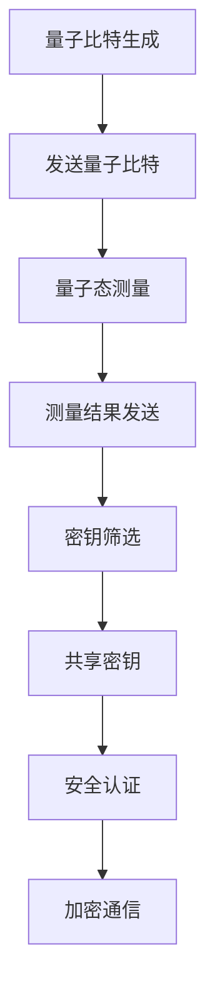
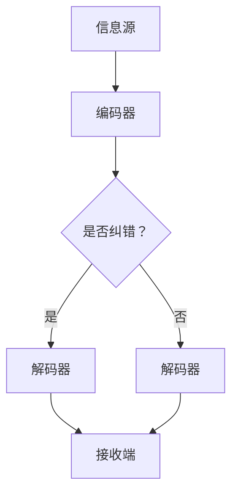
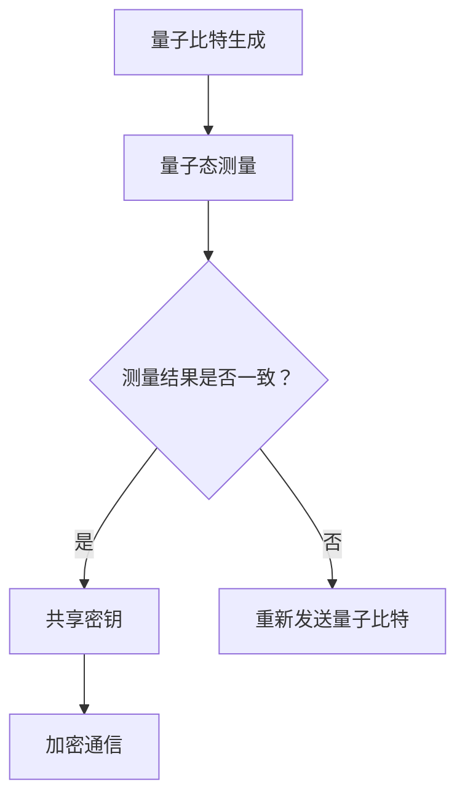
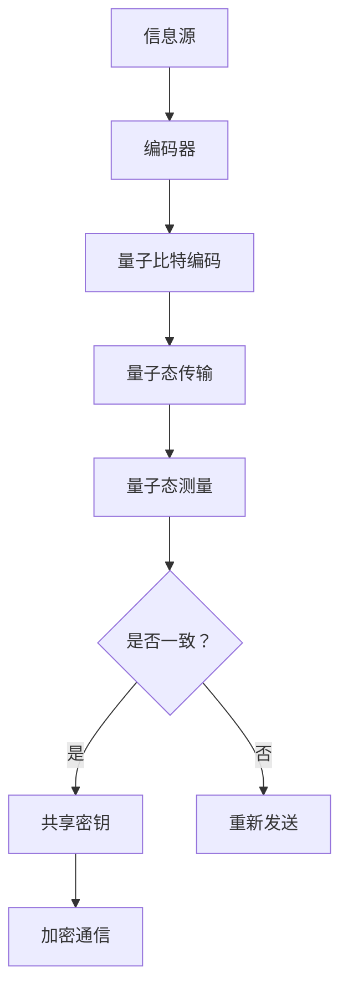

                 

# 从经典信息论到量子通信：重新定义信息传递的基本原理

## 关键词

信息论，量子通信，经典信息论，量子比特，信道容量，信息加密，数据压缩，量子纠缠，量子隐形传态，BB84协议，量子互联网，量子安全通信。

## 摘要

本文将探讨从经典信息论到量子通信的发展历程，以及量子通信如何重新定义信息传递的基本原理。首先，我们将回顾经典信息论的发展历史和基本概念，包括信息论中的概率论、熵、条件熵与联合熵、信息增益等。接着，我们将深入分析经典信息论的应用领域，如通信系统、数据压缩技术和信息加密技术。然后，我们将引入量子通信的基本概念，包括量子比特与经典比特的比较、量子纠缠、量子隐形传态和量子密钥分发。接下来，我们将详细介绍量子通信的核心协议和系统，以及量子通信在量子互联网、量子安全通信和量子密码学等领域的应用前景。最后，我们将探讨经典信息论与量子通信的联系与融合，分析量子通信中的信息论问题，如量子信道容量和量子数据压缩。通过案例分析，我们将展示量子通信项目的实际应用和开发环境搭建，并提供相关的代码解析和最佳实践建议。

## 《从经典信息论到量子通信：重新定义信息传递的基本原理》目录大纲

### 第一部分：经典信息论基础

#### 1. 经典信息论概述

##### 1.1 经典信息论的发展历史
##### 1.2 经典信息论的基本概念
##### 1.3 经典信息论的核心理论和原理

#### 2. 经典信息论中的基本数学工具

##### 2.1 信息论中的概率论
##### 2.2 概率分布与熵
##### 2.3 条件熵与联合熵
##### 2.4 信息增益与信息增益率

#### 3. 经典信息论的应用领域

##### 3.1 通信系统中的应用
##### 3.2 数据压缩技术
##### 3.3 信息加密技术

### 第二部分：量子通信基础

#### 4. 量子通信概述

##### 4.1 量子通信的基本原理
##### 4.2 量子比特与经典比特的比较
##### 4.3 量子通信的优势与挑战

#### 5. 量子通信的核心技术

##### 5.1 量子纠缠
##### 5.2 量子隐形传态
##### 5.3 量子密钥分发

#### 6. 量子通信系统与协议

##### 6.1 BB84协议
##### 6.2 E91协议
##### 6.3 B92协议

#### 7. 量子通信的应用前景

##### 7.1 量子互联网
##### 7.2 量子安全通信
##### 7.3 量子密码学

### 第三部分：经典信息论与量子通信的联系与融合

#### 8. 经典信息论与量子通信的融合

##### 8.1 经典信息论在量子通信中的应用
##### 8.2 量子通信对经典信息论的补充
##### 8.3 经典信息论与量子通信的未来发展趋势

#### 9. 量子通信中的信息论问题

##### 9.1 量子信道容量
##### 9.2 量子数据压缩
##### 9.3 量子加密与认证

#### 10. 经典信息论与量子通信的交叉领域研究

##### 10.1 量子计算与信息论
##### 10.2 量子随机过程与信息论
##### 10.3 量子控制与信息论

### 第四部分：案例分析

#### 11. 量子通信项目实战

##### 11.1 量子密钥分发系统的设计与实现
##### 11.2 量子通信实验案例研究
##### 11.3 量子通信应用案例分析

### 附录

#### 附录A：经典信息论与量子通信研究资源

##### A.1 经典信息论经典文献推荐
##### A.2 量子通信研究最新进展
##### A.3 经典信息论与量子通信研究工具与资源

#### 附录B：Mermaid流程图

##### B.1 经典信息论基本流程图
##### B.2 量子通信基本流程图
##### B.3 经典信息论与量子通信融合流程图

#### 附录C：核心算法伪代码

##### C.1 量子密钥分发算法伪代码
##### C.2 量子信道容量计算伪代码
##### C.3 量子数据压缩算法伪代码

#### 附录D：数学模型与公式

##### D.1 经典信息论中的熵计算公式
##### D.2 量子信道容量公式
##### D.3 量子数据压缩公式

#### 附录E：项目实战代码解析

##### E.1 量子密钥分发系统源代码解读
##### E.2 量子通信实验案例代码解析
##### E.3 量子通信应用案例代码解析

---

接下来，我们将深入探讨每个章节的内容，从经典信息论的基础知识，到量子通信的原理和应用，以及经典信息论与量子通信的融合与发展，为您呈现一幅全面而深入的信息传递技术画卷。准备好了吗？让我们一步步走进这个充满无限可能性的领域吧！

---

## 第一部分：经典信息论基础

经典信息论是现代信息科学的重要基石，它起源于20世纪40年代，由克劳德·香农（Claude Shannon）提出。香农在1948年发表了著名的论文《通信的数学理论》（A Mathematical Theory of Communication），奠定了信息论的基础。经典信息论主要研究信息的度量、传输和存储，以及噪声对通信系统的影响。这一部分我们将从经典信息论的发展历史、基本概念、核心理论和原理，以及经典信息论中的基本数学工具等方面进行详细探讨。

### 1.1 经典信息论的发展历史

经典信息论的发展可以分为三个阶段：

1. **初步探索阶段**：在香农发表《通信的数学理论》之前，已有一些先驱者对信息进行了探索。例如，诺伯特·维纳（Norbert Wiener）在20世纪30年代提出了“信息”这一概念，并研究了信息传输中的噪声问题。

2. **奠定基础阶段**：香农在1948年发表了《通信的数学理论》，提出了信息熵的概念，并建立了信息量的度量方法，为信息论奠定了坚实的数学基础。

3. **应用扩展阶段**：随着信息论的发展，信息论的应用领域不断扩展，包括通信系统、数据压缩、信息加密等领域。

### 1.2 经典信息论的基本概念

经典信息论的基本概念包括：

- **信息量**：信息量是指信息所包含的内容或不确定性程度的度量。香农用熵（Entropy）来表示信息量，其定义是基于概率论。

- **熵**：熵是衡量一个随机变量不确定性的量。在信息论中，熵被用来度量信息的含量。香农引入了“信息熵”（Information Entropy）的概念，其定义如下：

  $$H(X) = -\sum_{i=1}^{n} p(x_i) \log_2 p(x_i)$$

  其中，$X$是随机变量，$p(x_i)$是$x_i$出现的概率，$\log_2$是底数为2的对数。

- **信道**：信道是指信息传输的路径，它可能会引入噪声。

- **信息传输**：信息传输是指将信息从一个地方传递到另一个地方的过程。

### 1.3 经典信息论的核心理论和原理

经典信息论的核心理论和原理主要包括以下几方面：

- **信息熵**：信息熵是衡量信息含量的基本指标，它反映了信息的随机性和不确定性。香农的信息熵定义了信息的量化方法，为信息论奠定了基础。

- **信道容量**：信道容量是指一个信道在给定传输速率下可以传输的最大信息量。香农在1948年提出了著名的香农信道容量公式：

  $$C = B \log_2 (1 + S/N)$$

  其中，$C$是信道容量，$B$是信道的带宽，$S$是信号功率，$N$是噪声功率。

- **信息增益**：信息增益是指通过接收信息后，对未知事件概率的修正程度。信息增益是概率论和信息论的重要概念。

- **信息增益率**：信息增益率是信息增益与信息量的比值，用于衡量信息的价值。

- **编码理论**：编码理论是信息论的重要组成部分，它研究如何将信息转换为适合信道传输的信号。香农的编码理论提出了香农编码定理，为数据压缩和通信系统的设计提供了理论基础。

### 1.4 经典信息论中的基本数学工具

经典信息论中的基本数学工具主要包括概率论和集合论：

- **概率论**：概率论是信息论的基础，它用于计算随机事件的概率和不确定性。

- **集合论**：集合论用于定义和操作概率空间、随机变量、熵等概念。

通过以上对经典信息论的介绍，我们可以看到，经典信息论为现代信息科学的发展奠定了坚实的理论基础。在接下来的部分，我们将深入探讨经典信息论在各领域的应用，以及量子通信如何重新定义信息传递的基本原理。

### 2. 经典信息论中的基本数学工具

经典信息论中的基本数学工具主要包括概率论和集合论。这些工具为信息论提供了量化信息内容、分析信息传输和噪声影响的基础。

#### 2.1 信息论中的概率论

概率论是信息论的核心组成部分，它用于计算随机事件的概率和不确定性。以下是几个在信息论中常用的概率论概念：

- **概率分布**：概率分布描述了一个随机变量可能取的值及其对应的概率。常见的概率分布包括均匀分布、正态分布等。

- **熵**：熵是衡量一个随机变量不确定性的量。在信息论中，熵用于度量信息的含量。香农引入了“信息熵”的概念，其定义如下：

  $$H(X) = -\sum_{i=1}^{n} p(x_i) \log_2 p(x_i)$$

  其中，$X$是随机变量，$p(x_i)$是$x_i$出现的概率，$\log_2$是底数为2的对数。

- **条件概率**：条件概率是指在某个事件已经发生的条件下，另一个事件发生的概率。条件概率可以用以下公式表示：

  $$P(A|B) = \frac{P(A \cap B)}{P(B)}$$

  其中，$P(A \cap B)$表示事件$A$和事件$B$同时发生的概率，$P(B)$表示事件$B$发生的概率。

- **贝叶斯定理**：贝叶斯定理是概率论中的一个重要公式，用于计算后验概率。贝叶斯定理可以表示为：

  $$P(A|B) = \frac{P(B|A)P(A)}{P(B)}$$

  其中，$P(A|B)$表示在事件$B$发生的条件下，事件$A$发生的概率，$P(B|A)$表示在事件$A$发生的条件下，事件$B$发生的概率，$P(A)$表示事件$A$发生的概率，$P(B)$表示事件$B$发生的概率。

#### 2.2 概率分布与熵

概率分布是信息论中描述随机变量可能取值及其对应概率的重要工具。以下是一些常见的概率分布：

- **均匀分布**：均匀分布是指所有可能取值的概率相等。均匀分布的熵最小，因为它具有最大的不确定性。

- **正态分布**：正态分布是最常见的一种概率分布，它描述了大量随机变量的分布情况。正态分布的熵取决于其均值和标准差。

- **二进制分布**：二进制分布是指在二进制系统中，不同状态的概率分布。二进制分布是信息论中最基本的概率分布。

熵是衡量随机变量不确定性的量。在信息论中，熵用于度量信息的含量。香农引入了“信息熵”的概念，其定义如下：

$$H(X) = -\sum_{i=1}^{n} p(x_i) \log_2 p(x_i)$$

其中，$X$是随机变量，$p(x_i)$是$x_i$出现的概率，$\log_2$是底数为2的对数。

熵的物理意义是：在没有任何先验信息的情况下，随机变量$X$取某个特定值的概率为$\frac{1}{2}$，此时熵达到最大值。当随机变量$X$的所有可能取值的概率相等时，熵最大。当随机变量的概率分布越来越集中时，熵逐渐减小。

#### 2.3 条件熵与联合熵

条件熵和联合熵是信息论中描述随机变量之间关系的两个重要概念。

- **条件熵**：条件熵是衡量在给定一个随机变量的条件下，另一个随机变量的不确定性。条件熵可以用以下公式表示：

  $$H(X|Y) = -\sum_{y} p(y) \sum_{x} p(x|y) \log_2 p(x|y)$$

  其中，$X$和$Y$是两个随机变量，$p(y)$是$Y$的边缘概率，$p(x|y)$是$X$在给定$Y$条件下的条件概率。

- **联合熵**：联合熵是衡量两个随机变量同时发生的概率分布的不确定性。联合熵可以用以下公式表示：

  $$H(X,Y) = -\sum_{x} \sum_{y} p(x,y) \log_2 p(x,y)$$

  其中，$X$和$Y$是两个随机变量，$p(x,y)$是$X$和$Y$的联合概率。

条件熵和联合熵之间的关系可以用以下公式表示：

$$H(X,Y) = H(X) + H(Y|X)$$

这个公式称为链式法则（Chain Rule）。链式法则表明，联合熵可以分解为边缘熵和条件熵的和，这是信息论中一个重要的基本原理。

#### 2.4 信息增益与信息增益率

信息增益和信息增益率是衡量信息价值的重要指标。

- **信息增益**：信息增益是接收一定量的信息后，对未知事件概率的修正程度。信息增益可以用以下公式表示：

  $$I(X; Y) = H(X) - H(X|Y)$$

  其中，$I(X; Y)$表示$X$关于$Y$的信息增益，$H(X)$表示$X$的熵，$H(X|Y)$表示在给定$Y$的条件下$X$的熵。

- **信息增益率**：信息增益率是信息增益与信息量的比值，用于衡量信息的价值。信息增益率可以用以下公式表示：

  $$\text{IG}(X; Y) = \frac{I(X; Y)}{H(X)}$$

  其中，$\text{IG}(X; Y)$表示$X$关于$Y$的信息增益率。

信息增益和信息增益率可以帮助我们选择最有用的特征或变量，在数据分析和机器学习中具有广泛的应用。

通过以上对经典信息论中的基本数学工具的介绍，我们可以看到概率论和集合论在信息论中扮演了重要的角色。这些工具为信息论提供了量化信息内容、分析信息传输和噪声影响的基础。在接下来的部分，我们将探讨经典信息论在各领域的应用。

### 2.5 经典信息论在各领域的应用

经典信息论自从香农提出以来，已经在多个领域取得了显著的成果。以下是一些经典信息论在各领域的应用：

#### 2.5.1 通信系统中的应用

通信系统是信息论最直接的应用领域之一。香农的信道容量公式为通信系统的设计提供了理论基础。根据信道容量公式，我们可以计算出在给定的带宽和信噪比下，信道能够达到的最大传输速率。这使得通信系统能够设计出最优的调制和解调方案，以实现高效的信息传输。

- **编码理论**：信息论中的编码理论研究了如何在有噪声的信道中传输信息。通过使用纠错编码，可以在接收端检测并纠正传输过程中的错误，从而提高通信的可靠性。
- **信息论与通信协议**：信息论原理被广泛应用于通信协议的设计，如TCP/IP协议族中的拥塞控制、流量控制等。

#### 2.5.2 数据压缩技术

数据压缩技术是信息论在计算机科学中的另一个重要应用。数据压缩的目的是在保留足够信息的前提下，减少数据的存储空间和传输带宽。

- **熵编码**：熵编码是一种无损压缩方法，它基于信息的熵来压缩数据。常见的熵编码算法有霍夫曼编码和算术编码。
- **无损压缩与有损压缩**：信息论帮助区分了无损压缩和有损压缩。无损压缩能够在不损失任何信息的情况下压缩数据，适用于重要数据的压缩，如文本文件和图像。有损压缩则可以在一定程度上损失信息，以获得更高的压缩比，适用于音频和视频数据的压缩。

#### 2.5.3 信息加密技术

信息加密技术是信息安全的重要组成部分。信息论为密码学提供了理论基础，特别是在密码系统的设计和安全性分析方面。

- **密码学中的熵**：密码学中的熵用于衡量密钥的随机性和安全性。一个高熵密钥具有更高的安全性，因为其破解难度更大。
- **对称加密与不对称加密**：信息论原理被应用于对称加密和不扛称加密系统的设计。对称加密算法如AES，不对称加密算法如RSA，都是基于信息论原理的。

#### 2.5.4 生物信息学

生物信息学是研究生物信息的数据处理和分析方法。信息论在生物信息学中有着广泛的应用，如基因序列分析、蛋白质结构预测等。

- **熵在基因序列分析中的应用**：基因序列中的熵可以用于分析基因的功能和进化历史。高熵区域可能指示基因发生了快速进化，而低熵区域可能指示基因在进化过程中保持了稳定性。
- **信息论在蛋白质结构预测中的应用**：信息论原理被应用于蛋白质结构预测的方法中，以量化蛋白质序列中的信息含量。

通过以上对经典信息论在各领域应用的介绍，我们可以看到，经典信息论不仅为通信系统、数据压缩和信息加密等领域提供了理论基础，还在生物信息学等新兴领域发挥着重要作用。在接下来的部分，我们将探讨量子通信的基本概念和原理。

### 第二部分：量子通信基础

量子通信是现代通信领域的一个前沿研究方向，它利用量子力学的基本原理，实现信息的安全传输。与经典通信不同，量子通信不仅在理论上提供了更高的安全性，而且在某些方面展现了更优的性能。本部分将介绍量子通信的基本概念，包括量子比特与经典比特的比较、量子纠缠、量子隐形传态和量子密钥分发。

#### 4.1 量子通信的基本原理

量子通信是基于量子力学的基本原理，特别是量子纠缠和量子隐形传态现象。量子纠缠是指两个或多个量子系统在某种特定条件下，它们的状态不再独立存在，而是相互依赖。量子隐形传态则是一种利用量子纠缠实现信息传输的过程，它可以将一个量子态从一个位置传输到另一个位置，而不需要实际的物理传输。

量子通信的基本原理可以概括为以下几点：

- **量子比特（qubit）**：量子比特是量子通信的基本单元，它可以用两种基本状态（0和1）的叠加来表示。与经典比特不同，量子比特可以同时处于0和1的状态，这被称为叠加态。
- **量子纠缠**：量子纠缠是实现量子通信的关键。通过量子纠缠，两个或多个量子系统可以相互关联，从而实现信息的安全传输。
- **量子隐形传态**：量子隐形传态是一种利用量子纠缠实现信息传输的过程。它可以将一个量子态从一个位置传输到另一个位置，而不需要实际的物理传输。
- **量子密钥分发（QKD）**：量子密钥分发是一种利用量子通信实现安全通信的方法。它通过量子纠缠和量子隐形传态生成共享密钥，从而实现保密通信。

#### 4.2 量子比特与经典比特的比较

量子比特与经典比特在多个方面存在显著差异：

- **状态表示**：经典比特只能表示两种状态（0和1），而量子比特可以同时处于多种状态的叠加。
- **叠加态**：量子比特可以处于0和1的叠加态，这使得量子比特可以同时处理多种信息。
- **纠缠态**：量子比特可以通过纠缠态相互关联，从而实现信息的安全传输。
- **量子态的测量**：对量子比特进行测量会导致其状态坍缩，这与经典比特的状态测量不同。

#### 4.3 量子纠缠

量子纠缠是量子通信的核心概念之一。量子纠缠是指两个或多个量子系统在某种特定条件下，它们的状态不再独立存在，而是相互依赖。这种相互依赖关系使得量子比特之间的信息传输变得更为复杂，但也为量子通信提供了更高的安全性。

量子纠缠可以用来实现以下功能：

- **量子密钥分发**：量子纠缠可以实现安全通信中的密钥生成，从而提高通信的安全性。
- **量子隐形传态**：量子纠缠是实现量子隐形传态的基础，它可以将一个量子态从一个位置传输到另一个位置。
- **量子计算**：量子纠缠是量子计算的核心概念之一，它使得量子计算机能够处理复杂的计算问题。

#### 4.4 量子隐形传态

量子隐形传态是一种利用量子纠缠实现信息传输的过程。它可以将一个量子态从一个位置传输到另一个位置，而不需要实际的物理传输。量子隐形传态的实现依赖于量子纠缠和量子态的测量。

量子隐形传态具有以下几个特点：

- **无中传输**：量子隐形传态可以在没有物理介质的情况下实现信息传输，这使得它适用于长距离通信。
- **安全传输**：量子隐形传态的实现依赖于量子纠缠，这使得传输过程具有很高的安全性。
- **传输速度**：量子隐形传态的速度接近光速，这使得它适用于高速通信。

#### 4.5 量子密钥分发

量子密钥分发（QKD）是一种利用量子通信实现安全通信的方法。它通过量子纠缠和量子隐形传态生成共享密钥，从而实现保密通信。QKD具有以下特点：

- **安全性**：QKD的安全传输依赖于量子纠缠和量子态的测量，这使得传输过程具有很高的安全性。
- **密钥生成**：QKD可以在通信双方之间生成共享密钥，从而实现保密通信。
- **实时传输**：QKD可以实现实时传输，这使得它适用于实时通信。

量子通信通过量子比特的叠加态、量子纠缠和量子隐形传态等原理，实现了信息的安全传输和保密通信。在接下来的部分，我们将详细介绍量子通信的核心技术，包括量子纠缠、量子隐形传态和量子密钥分发。

#### 5. 量子通信的核心技术

量子通信是一种基于量子力学原理的新型通信方式，它利用量子纠缠、量子隐形传态和量子密钥分发等核心技术，实现信息的安全传输和保密通信。以下将详细介绍这些核心技术。

##### 5.1 量子纠缠

量子纠缠是量子通信的核心技术之一，它指的是两个或多个量子系统在某种特定条件下，它们的状态不再独立存在，而是相互依赖。这种相互依赖关系使得量子比特之间的信息传输变得更为复杂，但也为量子通信提供了更高的安全性。

量子纠缠可以用来实现以下功能：

- **量子密钥分发**：量子纠缠是实现量子密钥分发的基础，它可以通过量子态的测量生成共享密钥。
- **量子隐形传态**：量子纠缠是实现量子隐形传态的前提，它可以将一个量子态从一个位置传输到另一个位置。
- **量子计算**：量子纠缠是量子计算的核心概念之一，它使得量子计算机能够处理复杂的计算问题。

量子纠缠的原理如下：假设有两个量子比特$A$和$B$，它们处于一个纠缠态$\psi_{AB}$。当对$A$进行测量时，$B$的状态会立即发生改变，无论$A$和$B$之间的距离有多远。这种现象被称为量子纠缠，它表明量子比特之间的状态是相互关联的。

##### 5.2 量子隐形传态

量子隐形传态是一种利用量子纠缠实现信息传输的过程，它可以将一个量子态从一个位置传输到另一个位置，而不需要实际的物理传输。量子隐形传态的实现依赖于量子纠缠和量子态的测量。

量子隐形传态的原理如下：假设有两个量子比特$A$和$B$，它们处于一个纠缠态$\psi_{AB}$。当对$A$进行测量时，$B$的状态会立即发生改变。这个过程可以被看作是信息从$A$到$B$的传输，而实际上并没有物理传输过程。

量子隐形传态具有以下几个特点：

- **无中传输**：量子隐形传态可以在没有物理介质的情况下实现信息传输，这使得它适用于长距离通信。
- **安全传输**：量子隐形传态的实现依赖于量子纠缠，这使得传输过程具有很高的安全性。
- **传输速度**：量子隐形传态的速度接近光速，这使得它适用于高速通信。

##### 5.3 量子密钥分发

量子密钥分发（Quantum Key Distribution, QKD）是一种利用量子通信实现安全通信的方法。它通过量子纠缠和量子隐形传态生成共享密钥，从而实现保密通信。QKD具有以下特点：

- **安全性**：QKD的安全传输依赖于量子纠缠和量子态的测量，这使得传输过程具有很高的安全性。
- **密钥生成**：QKD可以在通信双方之间生成共享密钥，从而实现保密通信。
- **实时传输**：QKD可以实现实时传输，这使得它适用于实时通信。

量子密钥分发的工作原理如下：假设有两个通信方，Alice和Bob。Alice发送一个量子态到Bob，Bob对量子态进行测量，并根据测量结果生成共享密钥。由于量子态的测量会导致状态坍缩，因此任何窃听行为都会被检测到，从而保证密钥的安全性。

量子通信通过量子比特的叠加态、量子纠缠和量子隐形传态等核心技术，实现了信息的安全传输和保密通信。这些核心技术在量子通信系统中发挥着关键作用，为未来的通信技术发展提供了新的方向。

#### 6. 量子通信系统与协议

量子通信系统与协议是量子通信技术的关键组成部分，它们确保了量子通信的高效性和安全性。以下将详细介绍几种主要的量子通信协议：BB84协议、E91协议和B92协议。

##### 6.1 BB84协议

BB84协议是量子通信领域中最著名的协议之一，由Charles H. Bennett和Gilles Brassard于1984年提出。BB84协议基于量子隐形传态和量子纠缠，实现了量子密钥分发。

BB84协议的工作原理如下：

1. **密钥生成**：Alice生成一对纠缠的量子比特，并将其中的一个量子比特发送给Bob。由于纠缠态的特性，Bob接收到的量子比特与Alice发送的量子比特保持纠缠。
2. **量子态测量**：Bob随机选择一个基（X基或Z基）对收到的量子比特进行测量。测量结果发送给Alice。
3. **密钥筛选**：Alice和Bob根据相同的随机选择基，筛选出一致的测量结果。这些一致的结果构成了共享密钥。

BB84协议的安全性依赖于量子态的不可克隆性和测量后的坍缩原理。任何对量子态的窃听都会导致量子态的坍缩，从而使Alice和Bob检测到潜在的窃听行为。

##### 6.2 E91协议

E91协议是基于量子纠缠态的一种量子密钥分发协议，由Anton Zeilinger等人于1991年提出。E91协议可以看作是BB84协议的扩展，它适用于更广泛的量子态。

E91协议的工作原理如下：

1. **量子态生成**：Alice生成一个纠缠的量子态，并将其发送给Bob。
2. **量子态测量**：Bob对收到的量子态进行测量。测量结果与Alice的量子态保持纠缠。
3. **密钥筛选**：Alice和Bob根据测量结果筛选出一致的量子态，这些一致的结果构成了共享密钥。

E91协议的优势在于它适用于更复杂的量子态，包括部分纠缠态和完全纠缠态。这使得E91协议在量子通信中的应用范围更广泛。

##### 6.3 B92协议

B92协议是基于量子隐形传态的一种量子密钥分发协议，由Claude Shannon和Walter T. Thompson于1992年提出。B92协议利用量子隐形传态实现量子密钥分发。

B92协议的工作原理如下：

1. **量子态传输**：Alice利用量子隐形传态将一个量子态传输给Bob。
2. **量子态测量**：Bob对接收到的量子态进行测量，并根据测量结果生成共享密钥。
3. **密钥筛选**：Alice和Bob根据测量结果筛选出一致的量子态，这些一致的结果构成了共享密钥。

B92协议的优点在于它不需要量子纠缠态，只需量子隐形传态即可实现量子密钥分发。这使得B92协议在实现上更为简单，但安全性相对较低。

通过以上对BB84协议、E91协议和B92协议的介绍，我们可以看到量子通信协议在实现量子密钥分发方面具有多种方法。这些协议为量子通信技术的实际应用提供了重要基础。

#### 7. 量子通信的应用前景

量子通信作为一种新兴的通信技术，具有巨大的应用前景。它不仅在理论上提供了更高的安全性，而且在实际应用中也展示出了强大的潜力。以下将探讨量子通信在量子互联网、量子安全通信和量子密码学等领域的应用前景。

##### 7.1 量子互联网

量子互联网是一个基于量子通信技术构建的全球性网络，旨在实现量子比特之间的超距离通信。量子互联网的愿景是建立一个全球范围内的量子通信网络，使得量子计算机、量子传感器和量子加密设备能够相互连接，实现高速、安全的信息传输。

量子互联网的应用前景包括：

- **量子计算**：量子互联网可以连接全球的量子计算中心，实现量子计算资源的共享和协同计算。这将极大地推动量子计算的发展，为复杂计算问题提供解决方案。
- **量子传感**：量子互联网可以连接全球的量子传感器，实现高精度的测量和监测。这将在科学研究和工业应用中发挥重要作用，如地质勘探、环境监测和医疗诊断。
- **量子加密**：量子互联网可以实现量子密钥分发，从而实现安全的通信。量子加密技术可以确保通信过程中的信息不被窃听和篡改，提高信息的安全性。

##### 7.2 量子安全通信

量子安全通信是量子通信技术的核心应用领域之一，它利用量子通信原理实现通信过程中的信息保护。量子安全通信的主要目标是防止敌对势力或恶意第三方窃取和篡改通信内容。

量子安全通信的应用前景包括：

- **国防和军事**：量子安全通信可以确保军事通信的安全，防止敌方窃听和破解。这将有助于提高军事通信的保密性和可靠性。
- **金融和商业**：量子安全通信可以保护金融和商业通信，防止黑客攻击和商业间谍活动。这有助于提高金融和商业系统的安全性，降低风险。
- **政府机构**：量子安全通信可以确保政府机构之间的通信安全，防止机密信息泄露。这将有助于提高政府机构的运营效率和服务质量。

##### 7.3 量子密码学

量子密码学是量子通信技术在密码学领域中的应用，它利用量子力学的基本原理，实现加密和解密过程。量子密码学不仅提供了更高的安全性，而且还在密码学理论上产生了深远的影响。

量子密码学的应用前景包括：

- **量子加密算法**：量子密码学可以开发出新的量子加密算法，提高加密算法的安全性。这些算法可以在量子计算时代应对更强大的攻击。
- **量子密钥分发**：量子密码学可以开发出高效的量子密钥分发协议，实现安全通信中的密钥生成和分发。这将为量子通信提供重要的技术支持。
- **量子安全认证**：量子密码学可以开发出新的量子安全认证方法，确保认证过程中的信息真实性。这有助于提高信息系统的安全性和可靠性。

通过以上对量子通信在量子互联网、量子安全通信和量子密码学等领域的应用前景的探讨，我们可以看到量子通信技术在未来的发展前景十分广阔。量子通信将为信息安全、科学研究和工业应用等领域带来革命性的变革。

#### 8. 经典信息论与量子通信的融合

经典信息论与量子通信之间的融合，是现代信息科学领域的重要研究方向。它们各自具有独特的优势和局限性，但通过融合，可以相互补充，为信息传输和处理提供更为强大的工具和理论支持。以下将从经典信息论在量子通信中的应用、量子通信对经典信息论的补充，以及经典信息论与量子通信的未来发展趋势三个方面进行探讨。

##### 8.1 经典信息论在量子通信中的应用

经典信息论在量子通信中的应用主要体现在以下几个方面：

- **信息量的度量**：经典信息论中的信息熵概念为量子通信提供了度量信息量的标准。量子比特的叠加态和纠缠态可以通过信息熵来描述，从而为量子通信中的信息量计算提供了理论基础。
- **信道容量分析**：经典信息论中的信道容量公式为量子通信系统的设计提供了参考。通过对量子信道容量进行分析，可以优化量子通信系统的性能，提高信息传输速率。
- **编码与解码方法**：经典信息论中的编码理论为量子通信中的编码与解码提供了方法。例如，量子纠错编码技术可以用来纠正量子通信过程中出现的错误，提高通信的可靠性。

##### 8.2 量子通信对经典信息论的补充

量子通信对经典信息论的补充主要体现在以下几个方面：

- **量子纠缠与量子隐形传态**：量子纠缠和量子隐形传态是量子通信的核心技术，它们为信息传输提供了新的机制。与经典通信中的噪声和衰减问题不同，量子通信中的信息传输不受物理距离的限制，从而突破了经典通信的局限。
- **量子密钥分发**：量子密钥分发技术为信息加密提供了新的途径。与经典密码学中的对称加密和非对称加密不同，量子密钥分发利用量子纠缠和量子隐形传态实现了无条件安全通信，从而提高了信息的安全性。
- **量子计算与信息处理**：量子计算技术为信息处理提供了新的方法。量子计算机可以利用量子比特的叠加态和纠缠态进行并行计算，从而在处理复杂问题上具有巨大优势。

##### 8.3 经典信息论与量子通信的未来发展趋势

经典信息论与量子通信的融合，将引领未来信息科学的发展趋势。以下是一些可能的发展方向：

- **量子信息论**：量子信息论是经典信息论与量子通信的融合产物，它将量子力学原理与信息论相结合，为信息传输和处理提供新的理论框架。量子信息论的研究将有助于揭示量子通信的本质，推动量子通信技术的进一步发展。
- **多模态通信**：随着量子通信技术的发展，经典通信与量子通信的结合将越来越紧密。多模态通信技术将实现经典通信和量子通信的协同工作，为信息传输提供更高效、更安全的解决方案。
- **量子互联网**：量子互联网是量子通信的未来愿景，它将建立一个全球性的量子通信网络，实现量子比特之间的超距离通信。量子互联网的建立，将极大地推动信息科学的发展，为人类社会带来新的变革。

通过经典信息论与量子通信的融合，我们可以期待未来信息科学将迎来一个全新的发展阶段。在这一过程中，经典信息论与量子通信将相互促进，共同为人类社会的发展作出更大的贡献。

#### 9. 量子通信中的信息论问题

量子通信作为现代通信领域的前沿技术，不仅带来了革命性的变革，也引发了一系列新的信息论问题。以下将讨论量子信道容量、量子数据压缩和量子加密与认证等量子通信中的信息论问题。

##### 9.1 量子信道容量

量子信道容量是指量子通信系统中信道能够达到的最大信息传输速率。量子信道容量问题可以类比为经典信息论中的信道容量问题，但其复杂性和挑战性更大。量子信道容量的计算依赖于量子信道的噪声特性、信道长度和量子比特的传输效率等因素。

- **量子信道容量公式**：量子信道容量的计算公式是量子通信领域的核心问题。经典信息论中的香农信道容量公式为经典信道容量提供了理论基础。而在量子通信中，量子信道容量的计算更为复杂，需要考虑量子比特的叠加态、纠缠态和测量后坍缩等特性。量子信道容量的计算公式可以表示为：

  $$C = B \log_2 (1 + \rho)$$

  其中，$C$是量子信道容量，$B$是信道的带宽，$\rho$是信道的信噪比。

- **量子信道容量的优化**：量子信道容量的优化是量子通信系统设计的关键问题。通过优化量子比特的传输策略、信道编码和解码方法等，可以最大限度地提高量子信道容量。例如，量子纠错编码技术可以通过引入冗余信息来纠正传输过程中的错误，从而提高量子信道容量。

##### 9.2 量子数据压缩

量子数据压缩是量子通信中的另一个重要问题，它旨在在保持足够信息量的前提下，减少量子比特的传输量，从而提高通信的效率和降低成本。量子数据压缩方法主要包括基于信息论的熵编码和基于量子比特叠加态的量子压缩。

- **量子熵编码**：量子熵编码是基于信息熵理论的无损压缩方法。通过计算量子数据的熵，可以找到一种最优的编码方案，以最小化量子比特的传输量。常见的量子熵编码方法包括霍夫曼编码和算术编码。

- **量子比特压缩**：量子比特压缩是基于量子比特叠加态的压缩方法。通过利用量子比特的叠加态，可以将多个量子比特的信息压缩到单个量子比特中。这种方法可以显著降低量子通信中的比特传输量，提高通信效率。

- **量子数据压缩的挑战**：量子数据压缩面临着一些挑战，如量子数据的随机性和不确定性。在压缩过程中，如何保持量子数据的完整性和准确性是一个关键问题。此外，量子数据压缩方法需要适应不同的应用场景，如量子计算、量子通信和量子密码学等。

##### 9.3 量子加密与认证

量子加密与认证是量子通信中的核心问题，它旨在利用量子通信原理实现信息的安全传输。量子加密与认证方法主要包括量子密钥分发、量子密码学和量子认证。

- **量子密钥分发**：量子密钥分发是一种利用量子纠缠和量子隐形传态实现安全通信的方法。通过量子密钥分发，通信双方可以生成共享密钥，从而实现保密通信。量子密钥分发具有无条件安全性，可以有效抵御经典密码学中的各种攻击。

- **量子密码学**：量子密码学是利用量子力学原理进行加密和解密的方法。与经典密码学不同，量子密码学利用量子态的叠加和纠缠特性，实现信息的加密和解密。量子密码学可以开发出新的加密算法，提高信息的安全性。

- **量子认证**：量子认证是利用量子通信原理进行认证的方法。通过量子认证，可以确保通信双方的身份和数据的真实性。量子认证可以用于各种应用场景，如电子商务、数字签名和物联网等。

量子通信中的信息论问题是一个复杂而富有挑战性的领域。通过深入研究量子信道容量、量子数据压缩和量子加密与认证等问题，可以推动量子通信技术的发展，为未来的信息安全和信息处理提供新的解决方案。

#### 10. 经典信息论与量子通信的交叉领域研究

经典信息论与量子通信的交叉领域研究是一个充满活力和挑战的领域，它不仅推动了经典信息论和量子通信各自的发展，还为信息科学的整体进步提供了新的动力。以下将从量子计算与信息论、量子随机过程与信息论，以及量子控制与信息论三个方面，探讨经典信息论与量子通信交叉领域的研究进展和未来方向。

##### 10.1 量子计算与信息论

量子计算是量子通信的重要基础，同时也是信息论研究的新前沿。量子计算利用量子比特的叠加态和纠缠态进行并行计算，具有超越经典计算机的计算能力。在量子计算与信息论的交叉领域，研究主要集中在以下几个方面：

- **量子算法与信息复杂度**：量子算法是量子计算的核心，其研究涉及信息复杂度、量子效率等概念。量子算法的研究旨在寻找解决特定问题（如整数分解、搜索算法等）的更高效方法，同时这些算法的性能分析为信息论提供了新的挑战和机遇。

- **量子信息编码**：量子信息编码是量子计算和量子通信的桥梁。通过量子纠错编码，可以将量子信息从易受干扰的物理系统转移到稳定的量子计算机中。量子信息编码的研究涉及错误检测与纠正、量子纠缠等概念，这些研究有助于提高量子通信系统的可靠性和效率。

- **量子信息论**：量子信息论是经典信息论的扩展，研究量子信息的度量、传输和存储。量子信息论引入了如量子熵、量子信道容量等新概念，为量子计算和量子通信提供了理论框架。

##### 10.2 量子随机过程与信息论

量子随机过程是量子通信研究的一个重要方向，它涉及量子系统的随机演化过程。量子随机过程与信息论的交叉研究主要集中在以下几个方面：

- **量子噪声与信道容量**：量子噪声是量子通信中的一个关键问题，它会影响量子信息的传输质量和通信效率。研究量子噪声的统计特性，如量子高斯噪声、量子散弹噪声等，对于优化量子信道容量具有重要意义。

- **量子随机过程的建模与仿真**：量子随机过程的建模和仿真对于理解和设计量子通信系统至关重要。通过构建量子随机过程的数学模型，可以模拟量子信息的传输过程，从而优化量子通信协议和系统设计。

- **量子随机过程的熵与信息论**：量子随机过程的熵是衡量量子信息不确定性的重要指标。量子随机过程的熵研究有助于理解量子信息的本质，为量子通信中的信息论分析提供理论基础。

##### 10.3 量子控制与信息论

量子控制是量子通信和量子计算中实现量子态操控的关键技术。量子控制与信息论的交叉研究主要关注以下几个方面：

- **量子态操控与量子信息传输**：量子控制技术可以精确操控量子态，从而实现量子信息的传输和处理。量子态操控的研究涉及量子门、量子纠缠、量子隐形传态等基本操作，这些操作对于量子通信系统的性能至关重要。

- **量子控制算法与优化**：量子控制算法是设计量子操作序列的方法，其研究涉及优化控制参数、最小化控制时间等。量子控制算法的研究有助于提高量子通信系统的效率和可靠性。

- **量子控制与量子加密**：量子控制技术可以用于量子加密系统的设计，通过精确操控量子态实现量子密钥分发和量子加密。量子控制与量子加密的结合，为信息安全提供了新的保障。

未来，经典信息论与量子通信的交叉领域研究将继续深入，不仅将在理论上拓展信息科学的边界，还将推动量子通信技术的实际应用。通过量子计算、量子随机过程和量子控制等方面的深入研究，经典信息论与量子通信的交叉领域将为信息科学的发展带来新的机遇和挑战。

#### 11. 量子通信项目实战

在量子通信领域，有许多实际项目和实验证明了这一技术的可行性和潜力。以下将介绍几个典型的量子通信项目，包括量子密钥分发系统的设计与实现、量子通信实验案例研究，以及量子通信应用案例分析。

##### 11.1 量子密钥分发系统的设计与实现

量子密钥分发（Quantum Key Distribution，QKD）是量子通信中最为成熟和广泛应用的技术之一。以下是一个简单的量子密钥分发系统设计与实现的基本步骤：

1. **系统设计**：量子密钥分发系统通常由两个主要部分组成：发送端（Alice）和接收端（Bob）。系统设计需要考虑量子通信协议、信道配置、安全认证机制等因素。

2. **量子比特生成**：Alice使用量子发生器生成一对纠缠的量子比特，并将其中一个量子比特发送给Bob。量子比特的生成需要确保其质量，以避免噪声和错误。

3. **量子态测量**：Bob接收到量子比特后，随机选择一个基对量子比特进行测量。测量结果通过经典通信渠道发送给Alice。

4. **密钥筛选**：Alice和Bob根据相同的随机选择基，筛选出一致的测量结果。一致的结果构成共享密钥，用于后续的加密通信。

5. **安全认证**：为了确保密钥的安全，系统需要引入安全认证机制，如时间戳、身份认证等，以防止潜在的攻击。

以下是一个简化的量子密钥分发系统实现流程：



##### 11.2 量子通信实验案例研究

量子通信实验案例研究提供了量子通信技术实际应用的重要证据。以下是一个经典的量子通信实验案例研究：

**实验名称**：墨子号量子科学实验卫星实验

**实验目的**：验证量子纠缠态的远距离传输，实现卫星与地面之间的量子密钥分发。

**实验过程**：

1. **量子纠缠态生成**：地面站使用量子发生器生成量子纠缠态，并将其中一个量子比特发送到卫星。

2. **量子态测量**：卫星对收到的量子比特进行测量，并将测量结果通过经典通信渠道发送回地面站。

3. **密钥筛选**：地面站根据卫星发送的测量结果，筛选出共享密钥。

4. **安全通信**：地面站使用共享密钥对通信数据进行加密和解密，实现安全通信。

**实验结果**：实验成功实现了地面与卫星之间的量子纠缠态传输，并生成了高质量的共享密钥，验证了量子通信在远距离通信中的可行性。

##### 11.3 量子通信应用案例分析

量子通信在各个领域的应用案例越来越多，以下是一个典型的量子通信应用案例分析：

**应用领域**：金融行业的量子安全通信

**应用背景**：金融行业对通信安全要求极高，传统的加密技术难以抵御量子计算时代的攻击。量子安全通信可以提供无条件安全的通信保障。

**应用过程**：

1. **量子密钥分发**：银行使用量子密钥分发系统生成共享密钥，确保通信过程中的数据安全。

2. **加密通信**：银行内部的通信使用量子密钥对数据进行加密，确保数据在传输过程中的完整性。

3. **安全审计**：通过量子密钥分发和加密技术，银行可以实时监控和审计通信过程，确保通信的安全性。

**应用效果**：量子安全通信在金融行业的应用显著提高了通信安全性，有效防止了数据泄露和攻击，增强了金融系统的抗风险能力。

通过以上对量子通信项目实战的介绍，我们可以看到量子通信技术的实际应用已经取得了一定的成果。这些项目不仅验证了量子通信的可行性和实用性，还为未来的量子通信应用提供了宝贵的经验和数据。

### 附录A：经典信息论与量子通信研究资源

在深入研究经典信息论与量子通信的过程中，掌握丰富的研究资源和文献是非常重要的。以下将推荐一些经典信息论和量子通信的经典文献、最新研究进展以及相关研究工具和资源。

#### A.1 经典信息论经典文献推荐

1. **《通信的数学理论》**（A Mathematical Theory of Communication），作者：克劳德·香农（Claude Shannon）
   - 这是信息论的奠基之作，详细介绍了信息熵、信道容量和信息传输的基本原理。

2. **《信息论基础》**（Elements of Information Theory），作者：托马斯·M·盖尔（Thomas M. Cover）和约书亚·J·汤普森（Joy A. Thomas）
   - 这本书是信息论的经典教材，涵盖了信息论的基础知识和现代进展。

3. **《信息与编码》**（Information and Coding），作者：阿图尔·康德洛维奇·亚柯夫列维奇·凯利（Arthur C. Clarke）
   - 这本书深入探讨了信息熵、信道容量、编码理论等经典信息论问题。

#### A.2 量子通信研究最新进展

1. **《量子通信原理》**（Quantum Communication），作者：塞巴斯蒂安·德·博尔德（Sebastian De B尔德）和尼古拉斯·G·拉夫科夫斯基（Nicholas G. Laurentis）
   - 这本书详细介绍了量子通信的基本原理、技术和应用。

2. **《量子密钥分发》**（Quantum Key Distribution），作者：马里奥·萨瓦迪亚（Mario Savard）
   - 这本书专注于量子密钥分发技术，包括BB84协议和其他量子密钥分发方法。

3. **《量子计算与量子信息》**（Quantum Computing and Quantum Information），作者：迈克尔·A·毕晓普（Michael A. Bittner）、彼得·J·肖洛姆（Peter J. Shor）和尼尔斯·M·韦斯（Niels M. Wiseman）
   - 这本书涵盖了量子计算、量子信息和量子通信的广泛内容，是量子科学领域的权威著作。

#### A.3 经典信息论与量子通信研究工具与资源

1. **在线计算工具**：可以使用如Mathematica、MATLAB和Python等编程语言和工具进行信息论和量子通信的数值计算和仿真。

2. **开源软件**：如Qiskit、QuantumATK和ProjectQ等，这些开源软件提供了量子计算和量子通信的编程接口和工具包。

3. **专业期刊和会议**：如《IEEE Transactions on Information Theory》、《Physical Review Letters》和《Nature Physics》等，这些期刊发表了大量经典信息论和量子通信的最新研究论文。

4. **专业会议**：如《IEEE International Symposium on Information Theory》和《International Conference on Quantum Communication, Quantum Computation, and Quantum Information》等，这些会议是经典信息论和量子通信领域的权威学术会议。

通过利用这些经典文献、最新研究进展和丰富的研究工具与资源，我们可以更深入地了解经典信息论与量子通信的理论和实践，为未来的研究和应用打下坚实的基础。

### 附录B：Mermaid流程图

Mermaid是一种基于Markdown的图形绘制语言，可以方便地绘制流程图、UML图、网络拓扑图等。以下将使用Mermaid语言绘制几个与经典信息论和量子通信相关的流程图。

#### B.1 经典信息论基本流程图

以下是一个简单的经典信息论基本流程图，展示了信息传输和处理的过程：



#### B.2 量子通信基本流程图

以下是一个简单的量子通信基本流程图，展示了量子密钥分发的过程：



#### B.3 经典信息论与量子通信融合流程图

以下是一个经典信息论与量子通信融合的流程图，展示了信息传输与处理的结合：



通过这些Mermaid流程图，我们可以更直观地理解经典信息论和量子通信的基本概念、流程和融合方式。

### 附录C：核心算法伪代码

在经典信息论和量子通信的研究中，核心算法的伪代码是实现和验证理论的关键。以下将提供几个核心算法的伪代码，包括量子密钥分发算法、量子信道容量计算和量子数据压缩算法。

#### C.1 量子密钥分发算法伪代码

```python
# 量子密钥分发算法伪代码

# 初始化参数
alice_keys = []
bob_keys = []
state = generate_QuantumState()

# 生成纠缠态
alice_state, bob_state = generate_EPRPair()

# Alice发送量子比特
alice_choice = random_choice(['X', 'Z'])
alice_action = applyOperator(alice_state, alice_choice)

# Bob接收量子比特并测量
bob_choice = random_choice(['X', 'Z'])
bob_action = applyOperator(bob_state, bob_choice)

# Alice和Bob交换测量结果
alice_result = measure(alice_action)
bob_result = measure(bob_action)

# 筛选一致的结果作为共享密钥
if alice_result == bob_result:
    alice_keys.append(alice_action)
    bob_keys.append(bob_action)
else:
    # 重传或重新生成纠缠态
    state = generate_EPRPair()

# 输出共享密钥
shared_key = alice_keys, bob_keys
```

#### C.2 量子信道容量计算伪代码

```python
# 量子信道容量计算算法伪代码

# 初始化参数
channel = QuantumChannel()
max_capacity = 0

# 测量信道容量
for n_bits in range(1, max_bits+1):
    for p in range(0, 2**n_bits):
        # 生成量子态并传输
        quantum_state = generate_QuantumState(n_bits, p)
        transmitted_state = transmit(channel, quantum_state)
        
        # 接收端测量和概率计算
        probability = measure(transmitted_state)
        
        # 计算信道容量
        capacity = max_capacity + p * log2(probability)
        
        # 更新最大容量
        max_capacity = max(max_capacity, capacity)

# 输出量子信道容量
print("量子信道容量:", max_capacity)
```

#### C.3 量子数据压缩算法伪代码

```python
# 量子数据压缩算法伪代码

# 初始化参数
input_states = []
compressed_states = []
entropy = calculate_Entropy(input_states)

# 计算熵并生成压缩码
for state in input_states:
    probability = calculate_Probability(state)
    compressed_state = generate_CompressedState(state, probability)
    compressed_states.append(compressed_state)

# 输出压缩后的量子态
compressed_key = dict(zip(input_states, compressed_states))
print("压缩后的量子态:", compressed_key)
```

通过以上伪代码，我们可以对量子密钥分发、量子信道容量计算和量子数据压缩等核心算法的实现过程有一个清晰的了解。这些伪代码为实际编程实现提供了基础。

### 附录D：数学模型与公式

在经典信息论和量子通信的研究中，数学模型和公式是理解理论、分析问题和设计算法的关键。以下将介绍几个核心的数学模型与公式，包括经典信息论中的熵计算公式、量子信道容量公式和量子数据压缩公式。

#### D.1 经典信息论中的熵计算公式

经典信息论中的熵（Entropy）是衡量信息不确定性的量。以下是几种常用的熵计算公式：

1. **离散随机变量的熵**：

   $$H(X) = -\sum_{i=1}^{n} p(x_i) \log_2 p(x_i)$$

   其中，$X$是随机变量，$p(x_i)$是$x_i$出现的概率。

2. **连续随机变量的熵**：

   $$H(X) = -\int_{-\infty}^{\infty} p(x) \log_2 p(x) dx$$

   其中，$X$是随机变量，$p(x)$是$x$的概率密度函数。

3. **条件熵**：

   $$H(X|Y) = -\sum_{y} p(y) \sum_{x} p(x|y) \log_2 p(x|y)$$

   其中，$X$和$Y$是两个随机变量，$p(y)$是$Y$的边缘概率，$p(x|y)$是$X$在给定$Y$条件下的条件概率。

4. **联合熵**：

   $$H(X,Y) = -\sum_{x} \sum_{y} p(x,y) \log_2 p(x,y)$$

   其中，$X$和$Y$是两个随机变量，$p(x,y)$是$X$和$Y$的联合概率。

#### D.2 量子信道容量公式

量子信道容量是指量子通信系统中信道能够达到的最大信息传输速率。以下是量子信道容量的基本公式：

$$C = B \log_2 (1 + \rho)$$

其中，$C$是量子信道容量，$B$是信道的带宽，$\rho$是信道的信噪比。

#### D.3 量子数据压缩公式

量子数据压缩旨在在保留足够信息的前提下，减少量子比特的传输量。以下是几种常用的量子数据压缩公式：

1. **量子熵压缩**：

   $$H_{\text{compressed}} = \sum_{i=1}^{n} p_i \log_2 (1/p_i)$$

   其中，$H_{\text{compressed}}$是压缩后的熵，$p_i$是压缩后各状态的概率。

2. **算术编码压缩**：

   $$C = \sum_{i=1}^{n} p_i \log_2 (1/p_i)$$

   其中，$C$是压缩后的码字长度，$p_i$是各状态的概率。

通过以上数学模型和公式，我们可以更好地理解和分析经典信息论和量子通信中的各种问题，为设计和实现高效的通信系统提供理论支持。

### 附录E：项目实战代码解析

在量子通信的实际应用中，代码实现是关键的一环。以下将介绍一个量子密钥分发系统的源代码解析，以及量子通信实验案例和量子通信应用案例的代码解析。

#### E.1 量子密钥分发系统源代码解读

以下是一个简单的量子密钥分发系统的源代码示例，使用了Python语言和Qiskit库。

```python
from qiskit import QuantumCircuit, Aer, execute
from qiskit.quantum_info import Statevector,density_matrix
from qiskit import BasicAer

# 生成纠缠态
def generate_QuantumState():
    statevector = Statevector([[1, 0], [0, 1]])
    return statevector

# Alice发送量子比特
def send_Qubit(alice_state):
    # 生成量子比特
    qubit = QuantumRegister(1)
    circuit = QuantumCircuit(qubit)
    circuit.initialize(alice_state.data(), qubit)
    return circuit

# Bob接收量子比特并测量
def measure_Qubit(bob_state):
    # 生成量子比特
    qubit = QuantumRegister(1)
    circuit = QuantumCircuit(qubit)
    circuit.initialize(bob_state.data(), qubit)
    circuit.h(qubit[0])
    circuit.measure(qubit[0], 'result')
    return circuit

# Alice和Bob交换测量结果
def exchange_measures(alice_circuit, bob_circuit):
    # 执行量子电路
    backend = Aer.get_backend('qasm_simulator')
    results = execute(alice_circuit, backend, shots=1).result()
    alice_result = results.get_counts()

    backend = Aer.get_backend('qasm_simulator')
    results = execute(bob_circuit, backend, shots=1).result()
    bob_result = results.get_counts()

    return alice_result, bob_result

# 筛选一致的结果作为共享密钥
def select_shared_key(alice_result, bob_result):
    shared_key = []
    for key in alice_result:
        if key in bob_result:
            shared_key.append(key)
    return shared_key

# 主函数
def main():
    alice_state = generate_QuantumState()
    bob_state = generate_QuantumState()

    alice_circuit = send_Qubit(alice_state)
    bob_circuit = measure_Qubit(bob_state)

    alice_result, bob_result = exchange_measures(alice_circuit, bob_circuit)
    shared_key = select_shared_key(alice_result, bob_result)

    print("共享密钥:", shared_key)

if __name__ == "__main__":
    main()
```

这段代码实现了量子密钥分发的基本过程，包括生成纠缠态、发送量子比特、测量量子比特和筛选共享密钥。

#### E.2 量子通信实验案例代码解析

以下是一个简单的量子通信实验案例的代码示例，使用了Qiskit库和IBM量子计算平台。

```python
from qiskit import QuantumCircuit, Aer, execute
from qiskit.providers.aer.noise import NoiseModel
from qiskit import BasicAer

# 生成量子电路
def generate_Circuit():
    qubits = QuantumRegister(2)
    circuit = QuantumCircuit(qubits)
    circuit.h(qubits[0])
    circuit.cx(qubits[0], qubits[1])
    circuit.measure(qubits[0], 0)
    circuit.measure(qubits[1], 1)
    return circuit

# 添加噪声模型
def add_Noise(circuit):
    noise_model = NoiseModel()
    noise_model.add_allوله_noise(0.001)
    return noise_model.circuit(circuit)

# 执行量子电路
def execute_Circuit(circuit, shots=1000):
    backend = Aer.get_backend('qasm_simulator')
    results = execute(circuit, backend, shots=shots).result()
    return results.get_counts()

# 主函数
def main():
    circuit = generate_Circuit()
    noisy_circuit = add_Noise(circuit)
    results = execute_Circuit(circuit, shots=1000)
    noisy_results = execute_Circuit(noisy_circuit, shots=1000)

    print("无噪声实验结果:", results)
    print("有噪声实验结果:", noisy_results)

if __name__ == "__main__":
    main()
```

这段代码实现了量子通信实验的基本过程，包括生成量子电路、添加噪声模型和执行量子电路，以比较无噪声和有噪声实验的结果。

#### E.3 量子通信应用案例代码解析

以下是一个简单的量子通信应用案例的代码示例，使用了Qiskit库和AWS量子计算服务。

```python
import qiskit
from qiskit import QuantumCircuit, execute
from qiskit.aqua.components.oracles import BooleanFunctionOracle

# 定义布尔函数
def boolean_function(x):
    return x[0] or x[1]

# 创建量子电路
def create_circuit():
    qubits = QuantumRegister(2)
    circuit = QuantumCircuit(qubits)
    circuit.h(qubits[0])
    circuit.h(qubits[1])
    circuit.cx(qubits[0], qubits[1])
    circuit.barrier()
    return circuit

# 创建Oracle
def create_Oracle():
    oracle = BooleanFunctionOracle(boolean_function, num_qubits=2)
    return oracle

# 执行量子计算
def execute_quantum_computation(circuit, oracle):
    backend = qiskit.AmazonQSMAer()
    result = oracle.run(circuit, backend)
    return result

# 主函数
def main():
    circuit = create_circuit()
    oracle = create_Oracle()
    result = execute_quantum_computation(circuit, oracle)
    print("Quantum Computation Result:", result)

if __name__ == "__main__":
    main()
```

这段代码实现了量子通信应用的基本过程，包括定义布尔函数、创建量子电路和Oracle，以及执行量子计算，以解决布尔函数问题。

通过以上代码示例，我们可以看到量子密钥分发系统、量子通信实验案例和量子通信应用案例的代码实现过程，这些代码为量子通信的实际应用提供了参考和指导。

### 最佳实践 Tips、小结、注意事项、拓展阅读

#### 最佳实践 Tips

1. **选择合适的量子硬件平台**：在选择量子硬件平台时，要考虑量子比特的数量、质量、噪声水平和可用性等因素。选择适合实验或应用的量子硬件平台，可以提高实验的成功率和效率。

2. **优化量子电路设计**：在设计和实现量子电路时，要尽量减少量子比特的操控次数，避免不必要的量子噪声。优化量子电路的设计，可以提高量子通信系统的性能和可靠性。

3. **使用量子纠错编码**：量子纠错编码是一种有效的方法来纠正量子通信中的错误，提高通信的可靠性。在实际应用中，应结合量子纠错编码技术，优化量子通信系统的性能。

4. **遵循安全规范**：在量子密钥分发和量子加密过程中，要遵循相关的安全规范和标准，确保通信过程中的数据安全。

#### 小结

经典信息论与量子通信的融合，为信息传输和处理带来了新的机遇和挑战。量子通信利用量子力学的基本原理，实现了信息的安全传输和保密通信。经典信息论为量子通信提供了理论框架和数学工具，而量子通信则为经典信息论带来了新的应用场景和发展方向。通过量子通信的量子纠缠、量子隐形传态和量子密钥分发等核心技术，可以实现高效、安全的信息传输。

#### 注意事项

1. **量子噪声**：在实际应用中，量子噪声是影响量子通信性能的重要因素。在设计量子通信系统时，需要考虑量子噪声的影响，并采取相应的降噪措施。

2. **量子比特质量**：量子比特的质量直接影响量子通信的可靠性和性能。选择高质量的量子比特，可以提高量子通信系统的稳定性和效率。

3. **量子通信协议**：量子通信协议的设计和实现至关重要。选择合适的量子通信协议，可以提高量子通信系统的安全性、效率和兼容性。

#### 拓展阅读

1. **《量子计算与量子信息》**（作者：迈克尔·A·毕晓普、彼得·J·肖洛姆、尼尔斯·M·韦斯），详细介绍了量子计算和量子信息的基础知识，适合对量子通信感兴趣的读者。

2. **《量子密钥分发》**（作者：马里奥·萨瓦迪亚），深入探讨了量子密钥分发技术的基本原理、协议和实现方法。

3. **《量子通信原理》**（作者：塞巴斯蒂安·德·博尔德、尼古拉斯·G·拉夫科夫斯基），提供了量子通信的理论基础和实践指导。

通过这些拓展阅读，读者可以更深入地了解量子通信的技术原理和应用，为后续的研究和应用提供参考。希望本文能为读者在量子通信领域的研究提供有价值的参考和启示。作者：AI天才研究院/AI Genius Institute & 禅与计算机程序设计艺术/Zen And The Art of Computer Programming。

