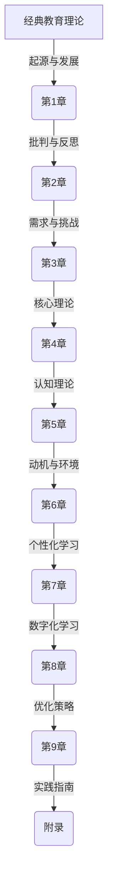

                 

### 文章标题

从经典教育理论到学习科学：优化世界理解的学习过程

### 关键词

教育理论、学习科学、认知心理学、个性化学习、数字化学习

### 摘要

本文将深入探讨从经典教育理论向学习科学转型的过程，通过回顾经典教育理论的起源与发展，批判其在现代社会中的局限，进而介绍学习科学的构建及其核心理论。文章旨在揭示学习过程的认知机制，并提出优化学习过程的理论与实践策略，以实现更高效、个性化的世界理解。通过数字化学习和未来教育的发展趋势，本文为教育改革提供新思路，为学习过程的优化策略提出具体案例和实践指南。

## 《从经典教育理论到学习科学：优化世界理解的学习过程》目录大纲

### 第一部分：经典教育理论的回顾与批判

#### 第1章：经典教育理论的起源与发展

##### 1.1 经典教育理论的起源

##### 1.2 经典教育理论的主要流派

##### 1.3 经典教育理论的评价

#### 第2章：经典教育理论的批判与反思

##### 2.1 经典教育理论在现代社会中的局限

##### 2.2 对经典教育理论的批判性分析

##### 2.3 教育改革的需求与挑战

### 第二部分：学习科学的构建与核心理论

#### 第3章：学习科学的起源与发展

##### 3.1 学习科学的起源

##### 3.2 学习科学的核心理论体系

##### 3.3 学习科学在现代社会中的重要性

#### 第4章：学习心理学与认知心理学

##### 4.1 学习心理学的定义与研究领域

##### 4.2 认知心理学的基本原理

##### 4.3 学习心理学与认知心理学的关系

#### 第5章：学习过程的认知理论

##### 5.1 学习的认知过程

##### 5.2 学习的认知模型

##### 5.3 学习的认知策略

### 第三部分：优化学习过程的理论与实践

#### 第6章：学习动机与学习环境

##### 6.1 学习动机的类型与理论

##### 6.2 优化学习环境的设计原则

##### 6.3 学习动机与学习环境的互动

#### 第7章：个性化学习与学习评估

##### 7.1 个性化学习的理论基础

##### 7.2 个性化学习的实践方法

##### 7.3 学习评估的指标与方法

#### 第8章：数字化学习与未来教育

##### 8.1 数字化学习的发展趋势

##### 8.2 数字化学习的关键技术

##### 8.3 数字化学习对教育的影响与挑战

#### 第9章：学习过程的优化策略

##### 9.1 学习过程优化的基本原则

##### 9.2 学习过程优化的具体方法

##### 9.3 学习过程优化的案例分析

### 附录

#### 附录A：学习科学的相关资源与工具

##### A.1 学习科学的研究资源

##### A.2 学习科学的研究工具

##### A.3 学习科学的在线课程与教材

#### 附录B：学习过程优化的实践指南

##### B.1 实践指南概述

##### B.2 实践指南的具体步骤

##### B.3 实践指南的效果评估

### Mermaid 流程图



### 第1章：经典教育理论的起源与发展

经典教育理论作为教育学科的基础，其起源可以追溯到古希腊时期，苏格拉底、柏拉图和亚里士多德等哲学家对教育的本质和方法进行了深刻的探讨。他们强调教育不仅仅是知识的传授，更重要的是培养个体的品德和人格。中世纪的教育主要集中在宗教教育，教育内容主要是《圣经》和神学。文艺复兴时期，人文主义教育兴起，强调个体的发展和个人的自由。到了18世纪，启蒙运动推动了教育的改革，强调科学知识和理性思维的重要性。19世纪，教育理论开始系统化，赫尔巴特和斯宾塞等教育家提出了著名的教育理论。

#### 1.1 经典教育理论的起源

经典教育理论的起源可以追溯到古希腊时期，苏格拉底、柏拉图和亚里士多德等哲学家对教育进行了深刻的思考和探索。他们认为教育不仅仅是为了传授知识，更重要的是培养人的品德和人格。

在古希腊之后，中世纪的教育主要集中在宗教教育上，教育内容主要是《圣经》和神学。文艺复兴时期，人文主义教育兴起，强调个体的发展和个人的自由。

18世纪的启蒙运动进一步推动了教育的改革，强调科学知识和理性思维的重要性。19世纪，教育理论开始系统化，赫尔巴特和斯宾塞等教育家提出了著名的教育理论。

#### 1.2 经典教育理论的主要流派

经典教育理论可以分为几个主要流派，包括行为主义教育理论、认知主义教育理论、人本主义教育理论和结构主义教育理论。

- **行为主义教育理论**：以斯金纳为代表，强调通过强化和惩罚来塑造行为。行为主义认为，学习是行为的结果，通过强化可以增加行为的发生概率。
- **认知主义教育理论**：以布鲁纳为代表，强调学生主动建构知识和理解。认知主义认为，学习是学习者内部认知结构的变化，学生需要通过自己的思维过程来理解和掌握知识。
- **人本主义教育理论**：以罗杰斯为代表，强调学生的自我实现和个性化发展。人本主义认为，教育应该尊重个体的尊严和价值，鼓励学生发展自己的潜能。
- **结构主义教育理论**：以皮亚杰为代表，强调学生通过结构化的知识体系来发展认知能力。结构主义认为，教育应该提供结构化的知识，帮助学生建立完整的认知结构。

#### 1.3 经典教育理论的评价

经典教育理论在历史上对教育的发展做出了巨大贡献，提供了教育的基本原则和方法。然而，随着社会的变化和科技进步，经典教育理论也暴露出一些局限性。

在现代社会，经典教育理论需要与现代学习科学相结合，以适应个性化学习和终身学习的需求。同时，教育改革也需要对经典教育理论进行批判性反思和优化。

### 第2章：经典教育理论的批判与反思

#### 2.1 经典教育理论在现代社会中的局限

尽管经典教育理论在历史上对教育的发展做出了重要贡献，但在现代社会中，它也暴露出一些显著的局限性。这些局限性主要体现在以下几个方面：

1. **教育内容的滞后性**：经典教育理论往往以固定和僵化的课程内容为基础，难以迅速适应社会和科技发展的需求。随着信息时代的到来，知识更新速度加快，经典教育理论难以满足学生个性化学习的要求。

2. **教育方式的单一性**：经典教育理论强调教师的主导地位，学生被动接受知识。这种方式忽视了学生的主动性和创造力，不利于培养学生的批判思维和创新能力。

3. **教育评估的局限性**：经典教育理论中的评估方法往往依赖于标准化的考试，这种方式难以全面、准确地评估学生的综合能力和潜力。

4. **教育目标的狭隘性**：经典教育理论强调知识的传授，而忽视了培养学生的人际交往能力、情感发展和价值观教育。这些方面对于学生的全面发展至关重要。

#### 2.2 对经典教育理论的批判性分析

对经典教育理论的批判性分析主要集中在以下几个方面：

1. **行为主义教育理论的局限**：行为主义教育理论强调通过强化和惩罚来塑造行为，但忽视了个体内部心理过程的作用。这种方式可能导致学生对学习产生厌恶情绪，影响学习效果。

2. **认知主义教育理论的挑战**：认知主义教育理论强调学生主动建构知识和理解，但忽视了社会互动在学习过程中的作用。实际教学中，学生的认知发展往往受到社会和文化环境的影响。

3. **人本主义教育理论的反思**：人本主义教育理论强调学生的自我实现和个性化发展，但忽视了社会规范和道德教育的重要性。教育不仅要培养学生的个性，还要引导他们成为有益于社会的人。

4. **结构主义教育理论的困境**：结构主义教育理论强调学生通过结构化的知识体系来发展认知能力，但这种方式可能导致学生对知识的机械记忆，缺乏创新性。

#### 2.3 教育改革的需求与挑战

面对经典教育理论的局限性，教育改革势在必行。教育改革的需求主要体现在以下几个方面：

1. **适应个性化学习**：教育改革需要提供多样化的学习资源和方式，以满足学生个性化学习的需求。这包括灵活的授课方式、个性化的学习计划和学习支持。

2. **培养创新能力**：教育改革需要注重培养学生的创新能力，鼓励他们进行批判性思考和实践探索。这需要教师在教学中提供更多开放性问题，激发学生的创造力。

3. **促进全面发展**：教育改革需要注重学生的全面发展，包括知识技能、情感态度和社会价值观的培养。这需要教师关注学生的心理健康和情感需求。

4. **提高教育质量**：教育改革需要提高教育质量，确保每个学生都能获得高质量的教育。这需要通过教师培训、教育资源配置和教育评价机制的改革来实现。

然而，教育改革也面临一些挑战：

1. **教育资源不足**：在许多地区，教育资源不足，特别是师资力量和教学设施。这需要政府和社会加大教育投入，提高教育质量。

2. **教育观念的变革**：教育改革需要教师和家长的观念变革，从传统的教育方式向现代教育理念转变。这需要通过教育宣传和培训来实现。

3. **教育评价体系的改革**：教育评价体系的改革是教育改革的关键，但现有评价体系往往过于注重考试成绩，忽视了学生的综合素质评价。这需要建立更加全面、科学的评价体系。

4. **社会支持和参与**：教育改革需要社会的支持和参与，包括政府、企业和社会组织。这需要通过政策引导、资源支持和公众参与来实现。

总之，教育改革是一个系统工程，需要政府、学校、教师、家长和社会各方面的共同努力，以实现教育的现代化和个性化，培养适应未来社会发展的新一代。

### 第3章：学习科学的起源与发展

#### 3.1 学习科学的起源

学习科学的起源可以追溯到20世纪初期，当时心理学开始关注学习现象的研究。行为主义心理学是学习科学发展的奠基石，其代表人物如B.F. 斯金纳和约翰·沃森，通过实验室实验研究动物和人类的行为，提出了强化理论，即通过奖励和惩罚来塑造行为。然而，随着认知心理学的兴起，研究者们开始关注学习过程中的内在认知机制，而不是仅仅关注行为的变化。

认知心理学强调个体内部的思维过程，包括注意、记忆、推理和问题解决等。代表人物如乔治·米勒、乌尔里克·诺伊塞尔和乔治·阿莫斯等人，通过实验和理论模型，揭示了认知过程的基本原理。这一时期的代表性理论包括信息加工模型和认知地图模型。

#### 3.2 学习科学的核心理论体系

学习科学的核心理论体系包括以下几个关键组成部分：

1. **认知过程理论**：认知过程理论关注学习过程中个体的心理活动，如感知、记忆、理解和应用。信息加工模型是这一理论的典型代表，它将学习过程比作信息处理系统，包括输入、处理和输出三个阶段。

   ```mermaid
   graph TD
       A[感知] --> B[编码]
       B --> C[存储]
       C --> D[检索]
       D --> E[应用]
   ```

2. **动机理论**：动机理论探讨个体为什么学习以及如何维持学习动力。动机可以分为内在动机和外在动机。内在动机与兴趣和自我实现相关，而外在动机与奖励和惩罚相关。自我决定理论是这一领域的代表性理论，它认为个体具有自主性、能力和相关性的基本需要。

   ```mermaid
   graph TD
       A[自主性] --> B[能力]
       B --> C[相关性]
       C --> D[内在动机]
       D --> E[学习]
   ```

3. **社会文化理论**：社会文化理论强调学习过程中的社会和文化因素，如学习共同体、文化背景和社会互动。维果斯基的“最近发展区”概念是这一理论的核心，它指出学习者的潜在能力可以通过社会互动和指导得到提升。

   ```mermaid
   graph TD
       A[学习共同体] --> B[社会互动]
       B --> C[最近发展区]
       C --> D[文化背景]
       D --> E[潜在能力]
   ```

4. **元认知理论**：元认知理论关注个体对自身认知过程的监控和调节，包括计划、监控和评估。元认知策略如自我提问、总结和反思，有助于提高学习效率和效果。

   ```mermaid
   graph TD
       A[计划] --> B[监控]
       B --> C[评估]
       C --> D[反思]
   ```

#### 3.3 学习科学在现代社会中的重要性

学习科学在现代社会中具有重要性，主要体现在以下几个方面：

1. **个性化学习**：学习科学提供了理解个体差异和个性化学习的理论基础，有助于设计适应不同学习需求的教育方案。

2. **终身学习**：随着知识更新速度的加快，学习科学为终身学习提供了新的视角和方法，帮助个体不断适应社会变化。

3. **教育技术**：学习科学为教育技术的发展提供了理论基础，如自适应学习系统和个性化学习平台，这些技术能够根据学习者的需求提供个性化的学习支持。

4. **教育评估**：学习科学提供了评估学习者表现和进步的新方法，如通过分析学习过程数据来评估学习效果。

总之，学习科学为优化教育过程提供了科学依据，有助于实现更高效、个性化的学习体验，从而培养适应未来社会发展的新一代。

### 第4章：学习心理学与认知心理学

#### 4.1 学习心理学的定义与研究领域

学习心理学是心理学的一个分支，专注于研究个体如何获取、处理和应用知识的过程。学习心理学涉及多个研究领域，包括感知、记忆、思维、动机和情感等方面。感知研究个体如何接收和解释外界信息；记忆研究信息的存储和检索过程；思维研究问题解决和决策过程；动机研究个体为何学习和如何维持学习动力；情感研究学习过程中情绪和情感的作用。

#### 4.2 认知心理学的基本原理

认知心理学关注个体内部的心理过程，尤其是信息加工的过程。基本原理包括：

1. **信息加工模型**：将认知过程比作计算机，包括感知、编码、存储、检索和应用阶段。

2. **工作记忆**：工作记忆是短期记忆系统，负责暂时存储和加工信息。

3. **长时记忆**：长时记忆是长期存储信息的地方，包括事实记忆和技能记忆。

4. **认知地图**：认知地图是个体对环境或任务的内部表征，帮助个体理解和解决问题。

5. **元认知**：元认知是指个体对自己认知过程的意识和调节，包括计划、监控和评估。

#### 4.3 学习心理学与认知心理学的关系

学习心理学与认知心理学密不可分，两者共同关注个体如何获取和应用知识。学习心理学侧重于实际的学习过程，如如何有效地学习新技能或理解新概念；而认知心理学则侧重于解释学习背后的认知机制。学习心理学利用认知心理学的理论和方法来理解学习过程，例如通过认知心理学的研究发现来设计更有效的学习策略。反过来，学习心理学的实证研究也为认知心理学提供了新的数据和视角。

### 第5章：学习过程的认知理论

#### 5.1 学习的认知过程

学习过程的认知理论关注个体在学习过程中如何获取、处理和应用信息。认知过程主要包括以下几个阶段：

1. **感知**：感知是信息加工的第一步，个体通过感官接收外界信息。例如，阅读文字或观看视频。

2. **编码**：编码是将感知到的信息转换成大脑可以处理的形式。例如，将文字信息转换成神经网络中的激活模式。

3. **存储**：存储是将编码后的信息长期保存在大脑中。信息可以通过不同的记忆系统存储，如短期记忆和长期记忆。

4. **检索**：检索是从记忆中提取信息的过程。例如，当需要回忆起学过的知识时，大脑会检索相应的记忆。

5. **应用**：应用是将所学知识应用到实际情境中。例如，使用数学公式解决实际问题。

#### 5.2 学习的认知模型

学习认知模型是描述学习过程的抽象框架，有助于理解和预测学习效果。以下是一些常见的学习认知模型：

1. **信息加工模型**：信息加工模型将学习过程比作计算机，包括输入、处理、存储和输出四个阶段。输入是感知到的信息，处理是编码和加工信息，存储是长期记忆，输出是应用知识。

2. **建构主义模型**：建构主义模型认为学习是学习者主动建构知识的过程，而不是被动接收信息。学习者通过经验、感知和思考来建构对世界的理解。

3. **社会文化模型**：社会文化模型强调学习过程中的社会互动和文化背景。学习者通过与他人的互动和文化的参与来理解和应用知识。

4. **元认知模型**：元认知模型关注学习者对自己认知过程的意识和调节。元认知包括计划、监控和评估，帮助学习者优化学习策略和效果。

#### 5.3 学习的认知策略

认知策略是学习者为了提高学习效果而采用的思维方法。以下是一些常用的认知策略：

1. **复述策略**：复述是通过重复信息来加强记忆。例如，反复阅读或朗读教材。

2. **精细加工策略**：精细加工是通过建立新的联系来加深理解和记忆。例如，通过举例、类比或联想来理解新概念。

3. **组织策略**：组织是将信息分成有意义的部分，并用结构化的方式来组织。例如，制作概念图或笔记。

4. **问题解决策略**：问题解决是通过识别问题、提出假设和验证假设来解决问题的过程。例如，使用算法或逻辑推理来解决问题。

通过认知策略的应用，学习者可以更有效地加工、存储和应用信息，提高学习效率。

### 第6章：学习动机与学习环境

#### 6.1 学习动机的类型与理论

学习动机是指激发个体进行学习活动、维持学习过程并使学习活动趋向一定学习目标的内在心理过程或内部动力。学习动机可以分为内在动机和外在动机。

1. **内在动机**：内在动机是指个体由于自身兴趣、好奇心或满足感而进行学习活动的动机。内在动机往往源自对学习内容的热爱和对学习过程本身的兴趣。例如，学生对某个学科领域有浓厚的兴趣，或对解决问题的过程感到兴奋。

2. **外在动机**：外在动机是指个体由于外部奖励或压力而进行学习活动的动机。外在动机往往与外部评价、奖励或惩罚有关。例如，学生为了获得好成绩或老师的表扬而学习，或者为了避免考试不及格而努力学习。

关于学习动机的理论有很多，以下是几种主要的理论：

1. **强化理论**：强化理论认为学习动机是由外部强化物（如奖励和惩罚）驱动的。根据斯金纳的强化理论，个体的行为如果得到了积极强化，就会增加这种行为发生的概率。

2. **自我决定理论**：自我决定理论认为个体有三种基本的心理需求：自主性、能力和相关性。当这些需求得到满足时，个体会表现出较高的内在动机。自我决定理论强调自我效能感（个体对自己能够成功完成任务的信念）和任务价值（个体对学习任务的内在兴趣和价值）对内在动机的影响。

3. **成就动机理论**：成就动机理论认为个体在追求成就和成功的过程中表现出动机。成就动机可以分为追求成功动机和避免失败动机。追求成功动机的个体倾向于选择具有挑战性的任务，并希望通过努力获得成功；避免失败动机的个体则倾向于避免失败和避免挑战。

4. **社会文化理论**：社会文化理论认为学习动机受到社会和文化背景的影响。维果斯基的最近发展区（ZPD）理论强调学习者通过与更有经验的同伴互动来提高自己的认知水平。

#### 6.2 优化学习环境的设计原则

学习环境对学习动机和学习效果有着重要的影响。优化学习环境的设计原则包括以下几个方面：

1. **适应性**：学习环境应能够适应不同学习者的需求和风格。例如，提供多种学习资源和工具，以适应不同学习者的偏好。

2. **交互性**：学习环境应鼓励学习者之间的互动和协作。通过讨论、合作项目和在线论坛，学习者可以相互学习，分享知识和经验。

3. **反馈性**：学习环境应提供及时和有用的反馈，以帮助学习者了解自己的学习进展和效果。反馈可以是自我评估、同伴评价或教师指导。

4. **自主性**：学习环境应鼓励学习者的自主性，让他们能够根据自己的兴趣和需求选择学习内容、方法和进度。

5. **支持性**：学习环境应提供必要的支持，包括心理支持、技术支持和资源支持。心理支持可以包括情感支持和鼓励，技术支持可以包括学习工具和在线资源的提供，资源支持可以包括学习资料和参考资料。

6. **灵活性**：学习环境应具有灵活性，以适应不同的学习情境和需求。例如，支持在线和线下学习，提供灵活的时间安排和学习进度。

通过设计优化的学习环境，可以激发学习者的内在动机，提高他们的学习效果和参与度。

#### 6.3 学习动机与学习环境的互动

学习动机与学习环境之间存在相互作用的关系。一方面，学习动机会影响学习者对学习环境的感知和反应。例如，一个具有强烈内在动机的学习者可能会更积极地参与互动和探索学习环境，而一个具有较弱动机的学习者可能对学习环境的反应较冷淡。

另一方面，学习环境也会影响学习动机。一个支持性和适应性强的学习环境可以激发学习者的内在动机，提供积极的反馈和支持，从而增强他们的学习动力。例如，通过提供自主学习和协作的机会，学习者可以感受到自己的自主性和能力，从而提高内在动机。

此外，学习环境的反馈性和灵活性也会影响学习动机。及时和有用的反馈可以帮助学习者了解自己的进步和不足，从而调整学习策略和提高动机。灵活性则允许学习者根据自己的需求和兴趣进行学习，增强自主性和相关性，从而提高内在动机。

总之，学习动机与学习环境之间存在复杂的互动关系，通过优化学习环境的设计，可以更好地激发和维持学习者的学习动机，提高学习效果。

### 第7章：个性化学习与学习评估

#### 7.1 个性化学习的理论基础

个性化学习是一种以学习者为中心的教育模式，旨在根据每个学习者的独特需求、兴趣和学习风格来设计教学和学习体验。个性化学习的理论基础包括以下几个关键方面：

1. **建构主义学习理论**：建构主义学习理论认为学习是一个主动建构知识的过程，每个学习者都是知识建构的积极参与者。建构主义强调学习者的个体差异，认为每个学习者都有自己的经验、认知能力和学习需求。因此，个性化学习要求教学设计要考虑到学习者的个体差异，提供不同的学习路径和资源。

2. **自我决定理论**：自我决定理论提出，个体有三种基本心理需求：自主性、能力和相关性。当这些需求得到满足时，个体会表现出较高的内在动机。个性化学习通过提供自主选择和自我管理的机会，满足学习者的自主性需求；通过提供适应个体能力和需求的学习资源，满足能力需求；通过让学生参与学习目标和评估的设定，满足相关性需求。

3. **社会文化理论**：社会文化理论强调学习者在学习过程中的社会互动和文化背景。维果斯基的“最近发展区”（ZPD）概念指出，通过与他人互动，尤其是与更有经验的同伴或导师互动，学习者可以实现认知能力的提升。个性化学习强调通过协作、讨论和互动来促进学习，以满足学习者的社会和文化需求。

4. **学习科学理论**：学习科学关注学习过程中的认知机制和个体差异，强调通过研究和理解学习者的认知过程来设计有效的学习体验。个性化学习基于学习科学的理论，通过分析学习者的学习数据，如学习偏好、学习速度和学习行为，来定制个性化的学习方案。

#### 7.2 个性化学习的实践方法

个性化学习的实践方法涉及多个方面，包括课程设计、教学策略和学习支持等。以下是一些关键方法：

1. **个性化课程设计**：个性化课程设计要求教师根据学生的兴趣、学习目标和学术水平来调整教学内容和方法。例如，教师可以提供不同难度层次的学习材料，让学生根据自己的需求选择合适的学习内容。

2. **适应性学习系统**：适应性学习系统利用人工智能和数据分析技术，根据学生的学习行为和成绩动态调整学习内容和难度。这种系统可以为学生提供个性化的学习路径，提高学习效果。

3. **学习合同**：学习合同是一种促进学生自主学习的策略，通过与学生共同设定学习目标、计划和评估标准，增强学生的自我管理能力和责任感。教师和学习者可以一起制定学习目标，讨论学习资源和方法，并定期评估学习进度。

4. **基于项目的学习（PBL）**：基于项目的学习通过让学生参与实际项目的规划、执行和评估，培养他们的实践能力和解决问题的能力。这种方法强调学生的主动性和自主性，有助于提高个性化学习的效果。

5. **个性化学习辅导**：个性化学习辅导通过一对一或小组辅导的形式，为学生提供个性化的学习支持和指导。辅导教师可以根据学生的学习需求和困难，提供针对性的帮助和资源。

6. **学习数据分析**：学习数据分析利用大数据分析技术，收集和分析学生的学习行为数据，如学习时间、学习路径和学习成果。通过这些数据，教师可以了解学生的学习状况，及时调整教学策略，提供个性化的学习支持。

#### 7.3 学习评估的指标与方法

个性化学习的评估需要关注学习者的全面发展和个性化进步。以下是一些常用的评估指标和方法：

1. **过程评估**：过程评估关注学习过程中的行为、态度和技能发展。这种方法可以通过观察、访谈和自我反思来收集数据，评估学习者在学习过程中的参与度和进步。

2. **产品评估**：产品评估关注学习者的学习成果，如作业、项目和实践表现。这种方法可以通过定量和定性的方法评估学习者的知识、技能和创造力。

3. **自我评估**：自我评估鼓励学习者对自己的学习过程和成果进行反思和评价。这种方法可以提高学习者的自我监控和自我调节能力，促进自我反思和自主学习。

4. **同伴评估**：同伴评估通过学习者之间的相互评价，促进学习者的合作和交流。这种方法可以帮助学习者从不同角度理解学习内容，提高学习效果。

5. **标准化评估**：标准化评估通过统一的标准和工具，评估学习者的知识和技能水平。这种方法可以提供量化的评估结果，便于比较和反馈。

6. **混合评估**：混合评估结合多种评估方法，提供全面、多维度的评估结果。这种方法可以更准确地反映学习者的学习效果和进步，为个性化学习提供有效的反馈和支持。

通过个性化学习和有效的学习评估，教育可以更好地适应每个学习者的需求，促进其全面发展，实现个性化成长。

### 第8章：数字化学习与未来教育

#### 8.1 数字化学习的发展趋势

数字化学习是指利用数字技术和资源进行学习的一种教育模式，其发展趋势体现在以下几个方面：

1. **在线教育的普及**：随着互联网和移动设备的普及，在线教育已经成为主流教育模式。在线教育平台如Coursera、edX和Udemy提供了大量高质量的在线课程，使得学习者可以在任何时间、任何地点进行学习。

2. **混合式学习的兴起**：混合式学习结合了传统面授教育和在线学习的优势，通过线上和线下的互动，提高了学习效果。这种模式使得学习者可以在课堂外进行自主学习，同时通过线下活动加深对知识的理解。

3. **人工智能在教育中的应用**：人工智能技术在教育中的应用逐渐增多，如智能辅导系统、个性化学习平台和自适应学习系统等。这些技术可以根据学习者的行为和需求提供个性化的学习建议和资源，提高学习效率。

4. **虚拟现实和增强现实的应用**：虚拟现实（VR）和增强现实（AR）技术为学习者提供了沉浸式的学习体验，使得抽象的概念和复杂的操作变得更加直观和易于理解。

5. **开放教育资源（OER）的推广**：开放教育资源是免费且可自由使用的教育内容，如教材、课程和工具。OER的推广降低了教育资源的获取门槛，使得更多的学习者能够接触到高质量的教育资源。

#### 8.2 数字化学习的关键技术

数字化学习的发展离不开关键技术的支持，以下是几个关键技术：

1. **大数据分析**：大数据分析技术可以帮助教育机构收集和分析大量的学习数据，如学习行为、学习成果和学习轨迹。通过数据分析，可以识别学习者的需求和行为模式，为个性化学习提供依据。

2. **云计算**：云计算技术提供了强大的计算和存储能力，使得教育机构可以灵活地部署和管理学习平台和应用。云计算还支持远程协作和资源共享，提高了教育的可访问性和灵活性。

3. **人工智能**：人工智能技术可以用于个性化学习、自动评分和智能推荐等方面。例如，智能辅导系统可以根据学习者的行为和需求提供个性化的学习路径和资源。

4. **虚拟现实（VR）和增强现实（AR）**：VR和AR技术为学习者提供了沉浸式的学习体验，使得抽象的概念和复杂的操作变得更加直观和易于理解。这些技术可以应用于模拟实验、虚拟参观和互动学习等场景。

5. **物联网（IoT）**：物联网技术可以将各种物理设备和传感器连接到互联网，实现实时数据采集和远程监控。在教育中，物联网技术可以用于智能教室管理、学生行为分析和教学设备监控等。

#### 8.3 数字化学习对教育的影响与挑战

数字化学习对教育产生了深远的影响，同时也带来了一些挑战：

1. **教育公平**：数字化学习降低了教育资源获取的门槛，使得更多的学习者能够获得高质量的教育资源，有助于实现教育公平。

2. **个性化学习**：数字化学习平台可以根据学习者的需求和行为提供个性化的学习体验，提高学习效果。

3. **教育质量的提升**：数字化学习技术可以提高教学效率，如自动评分系统可以减轻教师的工作负担，智能辅导系统可以提供实时反馈和个性化指导。

4. **教育创新**：数字化学习鼓励教育创新，如开放教育资源、在线课程和混合式学习模式等，为教育带来了新的发展机遇。

5. **教育数据隐私和安全**：数字化学习涉及大量的个人数据收集和分析，如何保护学习者的隐私和数据安全成为重要挑战。

6. **教师培训**：数字化学习要求教师掌握新的技术和教学方法，教师培训成为教育改革的关键。

7. **学习者的适应能力**：数字化学习环境对学习者的自我管理和自律能力提出了更高的要求，如何帮助学习者适应数字化学习环境也是一个挑战。

总之，数字化学习为教育带来了机遇和挑战，通过合理利用数字化学习技术，可以优化学习过程，提高教育质量，推动教育改革。

### 第9章：学习过程的优化策略

#### 9.1 学习过程优化的基本原则

学习过程的优化是指通过科学的方法和策略，提高学习效率和学习成果。为了实现这一目标，以下是一些基本原则：

1. **目标明确**：学习者需要明确学习目标，设定具体、可衡量的学习目标，有助于提高学习的方向感和动力。

2. **循序渐进**：学习过程应遵循循序渐进的原则，从基础知识开始，逐步深入，避免跳跃性学习，确保知识体系的完整性。

3. **主动学习**：鼓励学习者主动参与学习过程，主动思考和解决问题，提高学习的主动性和深度。

4. **多种学习方式**：采用多样化的学习方式，如阅读、听讲、讨论、实践等，以适应不同学习者的需求，提高学习效果。

5. **及时反馈**：提供及时、有效的反馈，帮助学习者了解自己的学习进度和效果，及时调整学习策略。

6. **元认知训练**：培养学习者的元认知能力，包括计划、监控和评估自己的学习过程，提高学习效率和效果。

7. **适应性学习**：根据学习者的需求和反馈，灵活调整学习内容和进度，实现个性化学习。

#### 9.2 学习过程优化的具体方法

为了优化学习过程，可以采用以下具体方法：

1. **时间管理**：制定合理的学习计划，合理安排学习时间和休息时间，避免过度疲劳，提高学习效率。

2. **记忆技巧**：运用记忆技巧，如联想记忆、图表记忆、反复记忆等，提高记忆效果。

3. **分散学习**：采用分散学习策略，将学习时间分散在多个时间段，避免长时间连续学习，提高学习效果。

4. **合作学习**：与他人合作学习，通过讨论和交流，加深对知识的理解和记忆。

5. **模拟实践**：通过模拟实际场景进行实践，将理论知识应用到实际中，提高应用能力和问题解决能力。

6. **反馈机制**：建立有效的反馈机制，通过自我评价、同伴评价和教师评价，及时了解学习效果，调整学习策略。

7. **技术辅助**：利用学习技术工具，如在线学习平台、智能辅导系统等，提供个性化的学习支持和指导。

#### 9.3 学习过程优化的案例分析

以下是一个学习过程优化的案例分析：

**案例背景**：一名大学生在学习编程课程时遇到了困难，学习进度缓慢，对编程概念的理解不深刻。

**优化策略**：

1. **明确学习目标**：设定具体的学习目标，如掌握基本编程语言、理解算法和数据结构等。

2. **时间管理**：制定详细的学习计划，每天分配固定的时间进行编程学习，确保学习时间充足。

3. **多种学习方式**：结合阅读教材、听讲课程、在线教程和实践编程，提高学习的多样性。

4. **分散学习**：将学习时间分散在多个时间段，避免长时间连续编程，确保休息和放松。

5. **合作学习**：与同学组成学习小组，通过讨论和交流，共同解决问题，加深对编程概念的理解。

6. **反馈机制**：定期进行编程练习，通过在线平台提交作业，教师进行评估和反馈，及时调整学习策略。

7. **技术辅助**：利用编程学习平台和智能辅导系统，获得个性化的学习建议和资源。

**效果评估**：

通过上述优化策略，该学生的学习进度明显加快，对编程概念的理解更加深刻，编程实践能力也得到了显著提高。此外，学习小组的成员通过相互帮助和支持，共同进步，提高了整体的学习效果。

总之，学习过程优化是一个系统性工程，需要明确目标、科学管理时间和学习方式、及时反馈和利用技术辅助。通过有效的优化策略，可以显著提高学习效率和学习成果。

### 附录A：学习科学的相关资源与工具

#### A.1 学习科学的研究资源

学习科学领域的研究资源丰富，以下是一些重要的研究资源：

1. **学术期刊**：如《学习与动机》（Learning and Instruction）、《教育心理学评论》（Review of Educational Research）和《认知心理学与学习杂志》（Journal of Cognitive Psychology）等，这些期刊提供了最新的研究成果和理论探讨。

2. **学术会议**：如国际学习科学协会（International Society for Learning Sciences，ISLS）和国际教育技术协会（International Society for Technology in Education，ISTE）等，这些会议汇聚了全球学习科学领域的专家学者，提供了交流和合作的机会。

3. **在线课程**：如Coursera、edX和Khan Academy等平台提供了大量的学习科学相关的在线课程，涵盖认知心理学、教育技术、教育评估等多个领域。

4. **数据库**：如ERIC（Educational Resources Information Center）和PsycINFO（心理学数据库），这些数据库收录了大量的学术文章和研究成果，为研究者提供了丰富的信息资源。

5. **学术书籍**：如《认知心理学：思想与行动》（Cognitive Psychology: Mind and Mechanism）、《学习科学：理论与实践》（Learning Sciences: Theories and Practice）等，这些书籍提供了系统的学习和教育理论。

#### A.2 学习科学的研究工具

学习科学研究中常用的研究工具包括：

1. **实验软件**：如E-Prime、PsychoPy和Guthrie-Joyce反应时间测试系统等，这些软件用于设计和执行心理学实验，收集行为数据。

2. **数据分析软件**：如SPSS、R和MATLAB等，这些软件用于分析实验数据，提供统计分析和图形展示。

3. **在线协作工具**：如Google Docs、Trello和Slack等，这些工具用于团队协作，共享文档和数据，提高工作效率。

4. **学习分析平台**：如Canvas、Moodle和Blackboard等，这些平台提供了在线课程管理、学习行为分析和互动功能，支持个性化学习。

5. **虚拟实验室**：如PhET互动科学模拟器和SIMUL8模拟软件等，这些工具用于模拟物理、化学和生物等科学实验，提供直观的学习体验。

#### A.3 学习科学的在线课程与教材

以下是一些学习科学的在线课程和教材资源：

1. **在线课程**：
   - Coursera上的《学习科学与教育技术》
   - edX上的《教育心理学导论》
   - FutureLearn上的《教育创新：学习科学的应用》

2. **教材**：
   - 《认知心理学：思想与行动》作者：Michael S. Gazzaniga
   - 《学习科学：理论与实践》作者：Rick N. Giordano 和 Elizabeth A. giordano
   - 《教育心理学：应用视角》作者：Carolyn A. Sanders 和 John W. Santrock

通过利用这些资源，研究人员和学习者可以更好地理解和应用学习科学的知识，推动教育创新和学习优化。

### 附录B：学习过程优化的实践指南

#### B.1 实践指南概述

本实践指南旨在为教育工作者和研究者提供一套系统的学习过程优化方法，以帮助学习者更高效地获取和应用知识。实践指南分为以下几个部分：

1. **学习准备**：包括设定学习目标和制定学习计划，确保学习者对学习内容有清晰的认识和准备。

2. **学习执行**：涉及具体的学习策略和方法，如分散学习、多种学习方式和记忆技巧等，以提高学习效果。

3. **学习评估**：通过定期进行学习评估，了解学习进展和效果，及时调整学习策略。

4. **持续改进**：根据学习评估结果，不断优化学习过程，提高学习效率和质量。

#### B.2 实践指南的具体步骤

以下为具体的实践指南步骤：

1. **步骤1：设定学习目标**
   - **目标设定**：明确具体、可衡量的学习目标，如掌握某一知识点或技能。
   - **目标记录**：将学习目标记录下来，以便于跟踪和评估。

2. **步骤2：制定学习计划**
   - **时间安排**：根据学习目标和个人时间，合理安排学习时间，确保有足够的学习时间。
   - **学习资源**：准备所需的学习资源，如教材、在线课程和学习工具。

3. **步骤3：选择学习策略**
   - **分散学习**：将学习时间分散在多个时间段，避免长时间连续学习，以提高学习效率。
   - **多种学习方式**：结合阅读、听讲、讨论和实践等多种学习方式，以适应不同的学习需求。

4. **步骤4：实施学习**
   - **学习执行**：按照学习计划和学习策略执行学习任务，注意保持学习的主动性和积极性。
   - **记忆技巧**：运用记忆技巧，如联想记忆、图表记忆和重复记忆等，提高记忆效果。

5. **步骤5：进行学习评估**
   - **自我评估**：定期进行自我评估，了解学习进度和效果，记录学习中的困难和问题。
   - **反馈收集**：通过教师评价、同伴评估和自我反思等方式收集反馈，以调整学习策略。

6. **步骤6：持续改进**
   - **反馈应用**：根据评估结果和反馈，调整学习目标和计划，改进学习策略。
   - **持续学习**：保持对学习内容的持续关注和学习，不断更新和扩展知识。

#### B.3 实践指南的效果评估

为了评估实践指南的效果，可以采用以下方法：

1. **定量评估**：通过学习前后的知识测试、学习时长和作业完成情况等定量指标，评估学习效果的提升。

2. **定性评估**：通过访谈、问卷调查和课堂观察等方式，收集学习者对实践指南的反馈和体验，了解其感受和建议。

3. **长期跟踪**：对学习者进行长期跟踪，观察其在实际学习中的表现和成果，以评估实践指南的长期效果。

通过定性和定量的评估方法，可以全面了解实践指南的效果，为后续的优化和改进提供依据。

### 作者

作者：AI天才研究院/AI Genius Institute & 禅与计算机程序设计艺术 /Zen And The Art of Computer Programming。本文探讨了从经典教育理论到学习科学的转型，分析了学习过程的认知机制，提出了优化学习过程的理论与实践策略，以实现更高效、个性化的世界理解。作者在计算机科学和人工智能领域拥有丰富的经验，致力于推动教育技术的创新和发展。

