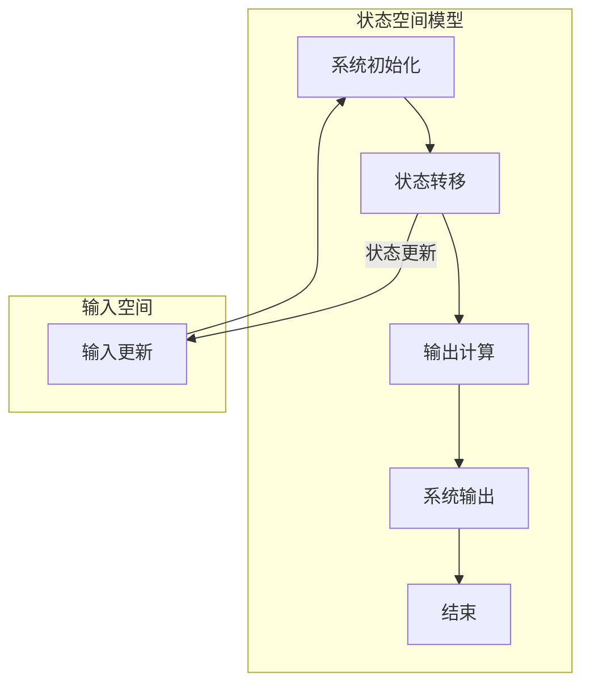

                 

### 文章标题

《从经典系统论到复杂网络理论：理解互联世界》

> 关键词：系统论、复杂网络理论、互联世界、数学模型、信息传播、网络安全

> 摘要：本文深入探讨了从经典系统论到复杂网络理论的演变，以及这些理论在理解互联世界中的应用。首先，介绍了经典系统论的基本概念和数学模型，接着阐述了复杂网络理论的基本概念、分类和数学工具。随后，文章通过具体案例展示了这些理论在互联网结构分析、信息传播和网络安全中的应用，并讨论了其未来发展趋势。通过本文的阅读，读者将更好地理解互联世界的本质，以及如何利用系统论和复杂网络理论来应对其中的挑战。

---

#### 引言

随着信息技术的飞速发展，我们生活在一个高度互联的世界中。互联网已经成为现代社会的基础设施，连接着全球无数的计算设备和用户。在这个互联的世界中，系统论和复杂网络理论提供了强有力的工具，帮助我们理解和分析复杂的系统结构、信息传播模式和网络安全问题。然而，这两个理论并非孤立存在，它们有着深刻的内在联系和共同的目标：理解和控制复杂系统的行为。

经典系统论起源于20世纪初，作为一种研究系统整体性质的科学方法，它关注系统内部各要素之间的相互作用及其整体行为。随着计算机科学和网络技术的兴起，复杂网络理论逐渐发展起来，它专注于研究由大量节点和边构成的网络系统的结构、功能和行为。复杂网络理论不仅继承了系统论的核心思想，还在其基础上进行了拓展和深化，形成了独特的理论体系。

本文旨在探讨从经典系统论到复杂网络理论的演变过程，阐述这两个理论的基本概念、数学模型和方法，并展示它们在互联世界中的应用。文章结构如下：

1. **经典系统论基础**：介绍系统论的基本概念、数学模型和工具。
2. **复杂网络理论**：讨论复杂网络的基本概念、分类和数学模型。
3. **互联世界的系统论与复杂网络理论应用**：分析互联网的复杂网络结构、信息传播和网络安全应用。
4. **互联世界的系统论与复杂网络理论展望**：探讨这两个理论在科技领域和社会治理中的应用前景。

通过本文的阅读，读者将能够深入理解系统论和复杂网络理论的核心思想，并了解它们如何在互联世界中发挥重要作用。

---

### 书名：《从经典系统论到复杂网络理论：理解互联世界》

#### 目录大纲：

##### 第一部分：经典系统论基础

1. **第1章：经典系统论概述**
    - 1.1 系统论的基本概念
    - 1.2 系统论的发展历程
    - 1.3 系统论的核心理念
    - 1.4 系统论的基本框架

2. **第2章：系统论的数学模型与工具**
    - 2.1 状态空间模型
    - 2.2 系统流图与网络分析

##### 第二部分：复杂网络理论

3. **第3章：复杂网络的基本概念**
    - 3.1 复杂网络的定义与特征
    - 3.2 复杂网络的分类
    - 3.3 复杂网络与经典网络的区别

4. **第4章：复杂网络的数学模型与工具**
    - 4.1 网络矩阵模型
    - 4.2 网络流与网络动力学

##### 第三部分：互联世界的系统论与复杂网络理论应用

5. **第5章：互联网的复杂网络结构**
    - 5.1 互联网的拓扑结构
    - 5.2 互联网的社会网络分析

6. **第6章：复杂网络理论在信息传播中的应用**
    - 6.1 信息传播模型
    - 6.2 社交网络中的信息传播

7. **第7章：复杂网络理论在网络安全中的应用**
    - 7.1 网络安全的基本概念
    - 7.2 复杂网络理论在网络安全中的应用

##### 第四部分：互联世界的系统论与复杂网络理论展望

8. **第8章：互联世界的系统论与复杂网络理论的未来发展趋势**
    - 8.1 系统论与复杂网络理论在科技领域的发展趋势
    - 8.2 系统论与复杂网络理论在社会治理中的应用

##### 附录：参考资料与进一步阅读

- 附录A：系统论与复杂网络理论的经典文献与著作
- 附录B：系统论与复杂网络理论的相关工具与软件

---

本书旨在通过系统论和复杂网络理论的深入探讨，帮助读者更好地理解互联世界的本质和规律，为应对未来科技和社会挑战提供理论支持和实践指导。

---

### 第1章：经典系统论概述

#### 1.1 系统论的基本概念

系统论是一门研究系统的结构、功能、行为和相互作用的科学。它起源于20世纪初，当时物理学家和工程师们开始关注复杂系统的整体行为，并试图通过系统化的方法来理解和控制这些系统。系统论的基本概念包括系统、要素、结构、行为和演化等。

**系统（System）**：系统是由若干相互关联、相互作用的要素组成的整体，这些要素通过相互作用和相互影响，共同实现系统的整体功能。系统可以是物理的，如生态系统、机械系统；也可以是抽象的，如经济系统、社会系统。

**要素（Element）**：要素是构成系统的基本单元，可以是物理实体，如零件、分子；也可以是抽象概念，如规则、信息。

**结构（Structure）**：结构是系统内部各要素之间相互作用的方式和排列组合。系统的结构决定了系统的功能和行为。

**行为（Behavior）**：行为是系统在特定环境下的表现，包括系统的反应、运作过程和输出结果。

**演化（Evolution）**：演化是系统在时间上的发展和变化过程，包括系统的生长、演化、衰老和消亡。

#### 1.2 系统论的发展历程

系统论的发展历程可以分为三个主要阶段：

1. **早期阶段（20世纪初-20世纪40年代）**：这一阶段主要关注物理系统和技术系统的建模和分析，代表性人物有韦伯、泰勒等。他们提出了许多重要的系统概念和方法，如系统分析、系统设计等。

2. **成熟阶段（20世纪50年代-20世纪80年代）**：这一阶段系统论开始应用于更广泛的领域，包括生物学、经济学、社会学等。代表性人物有贝塔朗菲、拉斯维特等。他们提出了更加抽象和通用的系统理论，如一般系统论、开放系统理论等。

3. **现代阶段（20世纪90年代至今）**：这一阶段系统论与其他学科相互融合，形成了许多新的交叉学科，如系统生物学、系统经济学等。同时，计算机科学和网络技术的发展为系统论提供了新的工具和方法。

#### 1.3 系统论的核心理念

系统论的核心理念包括整体性、动态性、层次性和开放性等。

**整体性（Holism）**：系统论强调系统的整体性，认为系统的整体性质不能简单地从其组成部分的性质中推导出来。整体性是系统论的核心思想之一，它要求我们在分析系统时，必须考虑系统的各个部分之间的相互作用和整体效应。

**动态性（Dynamics）**：系统论认为系统是动态的，系统不仅包括静态的结构，还包括动态的行为和演化过程。系统动态性是系统适应环境和实现功能的关键。

**层次性（Heterarchy）**：系统论认为系统具有层次结构，系统内部的不同要素和层次之间存在着不同的相互作用和关系。层次性有助于我们理解和分析系统的复杂性和多样性。

**开放性（Openness）**：系统论认为系统是开放的，系统与外界环境之间存在着能量、物质和信息的交换。开放性是系统维持稳定和发展的必要条件。

#### 1.4 系统论的基本框架

系统论的基本框架包括系统要素、系统结构、系统行为和系统演化等。

**系统要素**：系统要素是构成系统的基本单元，包括物理要素、抽象要素和虚拟要素等。

**系统结构**：系统结构是系统内部各要素之间相互作用的方式和排列组合，包括拓扑结构、网络结构和动态结构等。

**系统行为**：系统行为是系统在特定环境下的表现，包括系统的反应、运作过程和输出结果。

**系统演化**：系统演化是系统在时间上的发展和变化过程，包括系统的生长、演化、衰老和消亡等。

通过上述分析，我们可以看到，系统论作为一种研究复杂系统的科学方法，具有丰富的概念体系和广泛的应用领域。在接下来的章节中，我们将进一步探讨系统论的数学模型和工具，以及复杂网络理论的基本概念和分类。

---

### 第2章：系统论的数学模型与工具

#### 2.1 状态空间模型

状态空间模型是系统论中常用的数学模型，用于描述系统的动态行为。在状态空间模型中，系统的状态被表示为一个向量，系统的动态行为则通过向量场来描述。

**2.1.1 状态空间的基本概念**

- **状态（State）**：系统在某一时刻的状态，可以用一个向量表示，向量中的每个元素表示系统的某一特征或变量。
- **状态向量（State Vector）**：表示系统状态的向量，通常记为 \(\mathbf{x}(t)\)，其中 \(t\) 表示时间。
- **状态向量空间（State Space）**：系统所有可能状态的集合，通常表示为一个欧几里得空间。

- **输入（Input）**：外部对系统的影响，可以用一个向量表示，通常记为 \(\mathbf{u}(t)\)。
- **输出（Output）**：系统对外部的影响，可以用一个向量表示，通常记为 \(\mathbf{y}(t)\)。

- **动态方程（Dynamic Equation）**：描述系统状态随时间变化的方程，通常表示为：

  \[
  \mathbf{x}'(t) = \mathbf{f}(\mathbf{x}(t), \mathbf{u}(t)), \quad \mathbf{y}(t) = \mathbf{h}(\mathbf{x}(t), \mathbf{u}(t))
  \]

  其中，\(\mathbf{f}\) 是状态转移函数，\(\mathbf{h}\) 是输出函数。

**2.1.2 状态空间的数学表示**

状态空间可以用矩阵形式表示，其中状态向量、输入向量和输出向量都可以用矩阵表示。

- **状态矩阵（State Matrix）**：表示状态转移函数的矩阵，通常记为 \(A\)。

  \[
  \mathbf{x}'(t) = A\mathbf{x}(t) + B\mathbf{u}(t)
  \]

  其中，\(B\) 是输入矩阵。

- **输出矩阵（Output Matrix）**：表示输出函数的矩阵，通常记为 \(C\)。

  \[
  \mathbf{y}(t) = C\mathbf{x}(t) + D\mathbf{u}(t)
  \]

  其中，\(D\) 是输入矩阵。

- **状态空间方程（State Space Equation）**：

  \[
  \mathbf{x}'(t) = A\mathbf{x}(t) + B\mathbf{u}(t)
  \]

  \[
  \mathbf{y}(t) = C\mathbf{x}(t) + D\mathbf{u}(t)
  \]

**2.1.3 状态空间的建模方法**

状态空间模型的建模方法主要包括以下步骤：

1. **确定状态变量**：根据系统的特征和需求，选择适当的状态变量。
2. **建立动态方程**：根据系统的物理原理和约束条件，建立状态转移函数和输出函数。
3. **表示状态空间方程**：将动态方程用矩阵形式表示，得到状态矩阵、输入矩阵和输出矩阵。
4. **分析状态空间方程**：对状态空间方程进行分析，如稳定性分析、能控性分析等。

#### 2.2 系统流图与网络分析

系统流图是系统论中用于描述系统内部信息流动和相互作用的图形表示方法。它通过节点和边来表示系统的状态、输入、输出和转换关系，有助于我们直观地理解系统的结构和行为。

**2.2.1 系统流图的基本概念**

- **节点（Node）**：表示系统中的某个状态或过程，通常用矩形表示。
- **边（Edge）**：表示系统中的某种转换关系或信息流动，通常用箭头表示。
- **初始节点（Initial Node）**：表示系统的初始状态，通常用圆圈表示。
- **终止节点（Terminal Node）**：表示系统的终止状态，通常用圆圈表示。

**2.2.2 系统流图的数学表示**

系统流图可以用矩阵形式表示，其中每个节点和边都可以用矩阵表示。

- **状态转移矩阵（State Transition Matrix）**：表示系统内部状态转换关系的矩阵，通常记为 \(P\)。

  \[
  P = \begin{bmatrix}
  p_{11} & p_{12} & \cdots & p_{1n} \\
  p_{21} & p_{22} & \cdots & p_{2n} \\
  \vdots & \vdots & \ddots & \vdots \\
  p_{n1} & p_{n2} & \cdots & p_{nn}
  \end{bmatrix}
  \]

  其中，\(p_{ij}\) 表示从状态 \(i\) 转换到状态 \(j\) 的概率。

- **输入矩阵（Input Matrix）**：表示系统输入对状态转换的影响，通常记为 \(U\)。

  \[
  U = \begin{bmatrix}
  u_1 \\
  u_2 \\
  \vdots \\
  u_n
  \end{bmatrix}
  \]

- **输出矩阵（Output Matrix）**：表示系统输出对状态转换的影响，通常记为 \(V\)。

  \[
  V = \begin{bmatrix}
  v_1 \\
  v_2 \\
  \vdots \\
  v_n
  \end{bmatrix}
  \]

**2.2.3 系统流图的建模与分析**

系统流图的建模方法主要包括以下步骤：

1. **确定系统状态**：根据系统的特征和需求，选择适当的状态变量。
2. **建立状态转换关系**：根据系统的物理原理和约束条件，建立状态转换关系。
3. **表示系统流图**：将状态转换关系用系统流图表示，包括节点和边。
4. **分析系统流图**：对系统流图进行分析，如稳定性分析、能控性分析等。

通过状态空间模型和系统流图，我们可以从不同的角度理解和分析复杂系统的结构和行为。在接下来的章节中，我们将进一步探讨复杂网络理论的基本概念和分类。

---

### 第3章：复杂网络的基本概念

#### 3.1 复杂网络的定义与特征

复杂网络（Complex Network）是由大量节点（Node）和边（Edge）组成的网络结构，其中节点表示个体或实体，边表示节点之间的相互关系或连接。复杂网络理论是研究这些网络结构的数学和物理理论，主要关注网络的结构特性、动态行为和功能特性。

**3.1.1 复杂网络的定义**

复杂网络可以定义为一种网络结构，其节点和边具有以下特征：

- **大量节点**：复杂网络通常包含大量节点，这些节点可以是实体（如人、组织、设备）或抽象概念（如概念、关系）。
- **非线性关系**：复杂网络的节点和边之间存在复杂的非线性关系，这些关系可能具有高度不对称性和多样性。
- **全局性特征**：复杂网络具有全局性特征，如小世界效应和无标度特性，这些特征使得复杂网络在传播、同步和适应等方面具有独特的性质。
- **动态演化**：复杂网络是动态演化的，其结构、功能和行为会随着时间而变化。

**3.1.2 复杂网络的特征**

复杂网络具有以下主要特征：

- **小世界效应（Small-World Effect）**：复杂网络中的节点之间可以通过较少的中间节点相互连接，这与传统的大规模网络结构不同。小世界效应使得复杂网络在信息传播和同步方面具有高效性。
- **无标度性（Scale-Free Property）**：复杂网络中的节点度分布通常呈现幂律分布，即大多数节点的度较低，而少数节点的度非常高。无标度性使得复杂网络具有高度的自组织和自适应性。
- **高度动态性**：复杂网络的节点和边会随着时间而变化，这种动态性可能源于网络的增长、演化或外部环境的变化。
- **模块性（Modularity）**：复杂网络可以分解为多个相互独立的模块，每个模块具有特定的功能和结构。模块性有助于理解复杂网络的层次结构和功能特性。

**3.1.3 复杂网络与经典网络的区别**

复杂网络与经典网络（如图论中的网络）在以下方面存在显著区别：

- **节点数量**：经典网络通常包含较少的节点，而复杂网络包含大量的节点。
- **关系复杂性**：经典网络中的节点关系相对简单，而复杂网络中的节点关系复杂且具有非线性特征。
- **全局特性**：经典网络主要关注局部的特性，而复杂网络具有全局特性，如小世界效应和无标度性。
- **动态演化**：经典网络是静态的，而复杂网络是动态演化的。

通过上述分析，我们可以看到，复杂网络理论为理解和分析复杂系统的结构和行为提供了有力的工具。在接下来的章节中，我们将进一步探讨复杂网络的分类和数学模型。

---

### 第4章：复杂网络的数学模型与工具

#### 4.1 网络矩阵模型

网络矩阵模型是复杂网络理论中常用的一种数学模型，用于描述网络的结构、动态行为和功能特性。网络矩阵模型通过矩阵的形式来表示网络中的节点、边和关系，使得网络的复杂结构能够用简单的数学工具进行分析。

**4.1.1 网络矩阵的基本概念**

网络矩阵是一种二维矩阵，用于表示网络中的节点和边。网络矩阵中的每个元素都表示网络中的一个节点或一条边。根据网络矩阵的不同类型，我们可以将网络矩阵分为以下几种：

- **邻接矩阵（Adjacency Matrix）**：邻接矩阵用于表示网络中的节点和边。矩阵中的元素 \(a_{ij}\) 表示节点 \(i\) 和节点 \(j\) 是否存在边，若存在边，则 \(a_{ij} = 1\)；若不存在边，则 \(a_{ij} = 0\)。

  \[
  A = \begin{bmatrix}
  a_{11} & a_{12} & \cdots & a_{1n} \\
  a_{21} & a_{22} & \cdots & a_{2n} \\
  \vdots & \vdots & \ddots & \vdots \\
  a_{n1} & a_{n2} & \cdots & a_{nn}
  \end{bmatrix}
  \]

- **度矩阵（Degree Matrix）**：度矩阵用于表示网络中每个节点的度。矩阵中的元素 \(d_{i}\) 表示节点 \(i\) 的度。

  \[
  D = \begin{bmatrix}
  d_{1} & 0 & \cdots & 0 \\
  0 & d_{2} & \cdots & 0 \\
  \vdots & \vdots & \ddots & \vdots \\
  0 & 0 & \cdots & d_{n}
  \end{bmatrix}
  \]

- **拉普拉斯矩阵（Laplacian Matrix）**：拉普拉斯矩阵是邻接矩阵减去度矩阵的结果，用于描述网络中的节点度分布和结构特性。

  \[
  L = A - D
  \]

**4.1.2 网络矩阵的数学表示**

网络矩阵可以用多种数学方法进行表示和分析，包括矩阵运算、特征值分析和线性变换等。

- **矩阵运算**：网络矩阵可以与其他矩阵进行运算，如矩阵乘法、矩阵求导等。这些运算有助于我们分析网络的动态行为和稳定性。
- **特征值分析**：网络矩阵的特征值和特征向量可以提供关于网络结构的深层次信息，如网络的连接性、稳定性和中心性等。
- **线性变换**：网络矩阵可以用于线性变换，如傅里叶变换、拉普拉斯变换等。这些变换有助于我们分析网络的频率特性和时间特性。

**4.1.3 网络矩阵的建模方法**

网络矩阵的建模方法主要包括以下步骤：

1. **确定节点和边**：根据网络的定义和特征，选择适当的节点和边。
2. **表示网络矩阵**：将网络中的节点和边用网络矩阵表示，包括邻接矩阵、度矩阵和拉普拉斯矩阵。
3. **分析网络矩阵**：对网络矩阵进行分析，如特征值分析、稳定性分析等，以了解网络的特性和行为。

#### 4.2 网络流与网络动力学

网络流与网络动力学是复杂网络理论中的重要概念，用于描述网络中的信息流动和动态行为。

**4.2.1 网络流的基本概念**

网络流是指网络中信息、物质或能量从一个节点到另一个节点的流动过程。网络流的基本概念包括：

- **源节点（Source Node）**：提供流量的节点，通常表示为 \(s\)。
- **汇节点（Sink Node）**：接收流量的节点，通常表示为 \(t\)。
- **流量（Flow）**：从源节点到汇节点的流量，通常表示为 \(f_{ij}\)。
- **容量（Capacity）**：节点之间边的最大流量，通常表示为 \(c_{ij}\)。

网络流需要满足以下条件：

- **容量限制**：每条边的流量不能超过其容量，即 \(0 \leq f_{ij} \leq c_{ij}\)。
- **流守恒**：每个节点的流入流量等于流出流量，即对于所有节点 \(i\)，有 \(\sum_{j} f_{ij} = \sum_{j} f_{ji}\)。

**4.2.2 网络流的数学表示**

网络流可以用网络流方程表示，网络流方程描述了网络中流量分配和流动规律。

- **网络流方程**：

  \[
  \sum_{j} f_{ij} = \sum_{j} f_{ji} \quad \forall i
  \]

  \[
  0 \leq f_{ij} \leq c_{ij} \quad \forall i, j
  \]

  \[
  \sum_{i} f_{ij} = c_{j} \quad \forall j
  \]

  \[
  \sum_{i} f_{ij} = s \quad \forall i
  \]

  \[
  \sum_{i} f_{ij} = t \quad \forall j
  \]

- **最大流问题**：给定一个网络和源节点 \(s\) 及汇节点 \(t\)，求网络中的最大流量。最大流问题可以使用Ford-Fulkerson算法或Dijkstra算法进行求解。

**4.2.3 网络流的分析方法**

网络流的分析方法主要包括以下几种：

1. **流量分配方法**：通过优化算法分配流量，使网络中的流量最大化或满足特定的流量要求。
2. **稳定性分析**：分析网络流在时间上的稳定性和平衡状态，如流量的收敛性和稳定性。
3. **动态行为分析**：分析网络流在时间或空间上的动态变化规律，如流量的波动性和周期性。

通过网络矩阵模型和网络流与网络动力学，我们可以从不同的角度理解和分析复杂网络的结构、动态行为和功能特性。在接下来的章节中，我们将探讨复杂网络在互联网结构分析、信息传播和网络安全中的应用。

---

### 第5章：互联网的复杂网络结构

#### 5.1 互联网的拓扑结构

互联网是一个全球性的计算机网络，其拓扑结构对互联网的性能、可靠性和安全性具有重要影响。互联网的拓扑结构可以从多个角度进行分析，包括物理拓扑、逻辑拓扑和抽象拓扑等。

**5.1.1 互联网的基本拓扑结构**

互联网的基本拓扑结构主要包括以下几种：

- **星型拓扑（Star Topology）**：在星型拓扑中，每个节点都直接连接到中心节点，中心节点通常是路由器。这种拓扑结构具有高可靠性和易扩展性，但依赖于中心节点。
- **环型拓扑（Ring Topology）**：在环型拓扑中，节点按照环形顺序连接，数据沿环流动。这种拓扑结构具有简单的逻辑结构和较低的延迟，但容易出现单点故障。
- **网状拓扑（Mesh Topology）**：在网状拓扑中，每个节点都与其他节点直接连接，形成多个并行路径。这种拓扑结构具有高可靠性和冗余性，但网络规模较大时，管理和维护成本较高。

**5.1.2 互联网的演化过程**

互联网的演化过程可以分为以下几个阶段：

1. **ARPANET阶段（1969-1983）**：ARPANET是互联网的最早形式，由美国国防高级研究计划局（DARPA）资助。ARPANET采用了分组交换技术，实现了不同计算机之间的通信。
2. **TCP/IP阶段（1983-2000）**：1983年，ARPANET正式切换到TCP/IP协议，这一协议成为互联网的核心协议，定义了互联网的数据传输规则和网络结构。
3. **万维网阶段（World Wide Web, 1991-）**：万维网的出现使得互联网从单纯的通信工具转变为全球信息共享平台。万维网采用了超文本传输协议（HTTP）和超文本标记语言（HTML），使得用户可以通过浏览器访问和交互互联网内容。

**5.1.3 互联网的拓扑特性**

互联网的拓扑特性主要体现在以下几个方面：

- **动态性**：互联网的拓扑结构随着节点和边的动态变化而变化，这种动态性使得互联网能够适应不断变化的应用需求和网络环境。
- **自组织性**：互联网中的节点和边通过自组织的方式形成复杂的网络结构，这种自组织性使得互联网具有高度的自适应性和鲁棒性。
- **高度冗余性**：互联网中存在大量的冗余路径，这些冗余路径可以提高网络的可靠性和容错能力，即使在部分节点或边故障的情况下，网络仍然能够保持运行。
- **小世界效应**：互联网中的节点之间可以通过较少的中间节点相互连接，这体现了互联网的小世界效应，有助于信息的快速传播和共享。

通过分析互联网的拓扑结构、演化过程和拓扑特性，我们可以更好地理解互联网的工作原理和性能特点。在接下来的章节中，我们将探讨互联网的社会网络分析及其应用。

---

### 5.2 互联网的社会网络分析

#### 5.2.1 社会网络分析的基本概念

互联网的社会网络分析（Social Network Analysis, SNA）是一种研究互联网上用户及其交互关系的方法。它通过构建网络模型来分析用户之间的关系、信息传播路径和社区结构等。社会网络分析的基本概念包括节点、边、网络密度、聚类系数和中心性等。

- **节点（Node）**：在互联网的社会网络分析中，节点表示用户或实体。节点可以是个人、组织、网站等。
- **边（Edge）**：边表示节点之间的交互或关系。边可以是朋友关系、评论、引用等。
- **网络密度（Network Density）**：网络密度是网络中边的数量与可能的边数量之比，用于衡量网络的紧密程度。
- **聚类系数（Clustering Coefficient）**：聚类系数衡量节点之间的连接程度，反映了网络中的社交紧密性。
- **中心性（Centrality）**：中心性衡量节点在网络中的重要程度，常用的中心性指标包括度中心性、介数中心性和接近中心性。

#### 5.2.2 社会网络分析的方法

社会网络分析的方法主要包括数据收集、网络建模和分析等步骤。

- **数据收集**：通过爬虫、API调用或用户生成内容等方式收集互联网上的用户及其交互数据。
- **网络建模**：将用户及其交互数据转化为网络模型，常用的模型包括无向图、有向图和加权图等。
- **分析**：对网络模型进行分析，如节点分类、社区发现、信息传播路径等。常用的分析工具包括Gephi、NetworkX和Pajek等。

#### 5.2.3 社会网络分析的应用

社会网络分析在互联网领域有广泛的应用，包括以下方面：

- **用户行为分析**：通过分析用户之间的交互关系，了解用户的社交行为和偏好，为推荐系统、广告投放和用户增长策略提供依据。
- **信息传播分析**：通过分析信息在网络中的传播路径和速度，了解信息的传播机制和影响因素，为内容营销、危机管理和公共卫生宣传提供指导。
- **社区发现**：通过分析网络中的聚类系数和中心性，发现具有相似兴趣和行为的用户群体，为社区运营和用户互动提供支持。
- **网络安全**：通过分析网络中的异常节点和边，识别潜在的安全威胁和攻击路径，为网络安全监控和防御提供依据。

通过互联网的社会网络分析，我们可以更好地理解互联网上用户之间的关系和交互模式，为互联网应用和治理提供有力的支持。

---

### 第6章：复杂网络理论在信息传播中的应用

#### 6.1 信息传播模型

信息传播模型是复杂网络理论在信息传播领域中应用的重要模型。它用于描述信息在网络中的传播过程，分析信息传播的动力学行为、传播速度和传播效果。

**6.1.1 信息传播的基本概念**

- **信息传播（Information Propagation）**：信息在网络上从一个节点传播到其他节点的过程。
- **传播节点（Propagation Node）**：能够传播信息的节点，通常指拥有信息并能够将其传递给他人的节点。
- **接收节点（Receiving Node）**：接收到信息的节点。
- **传播路径（Propagation Path）**：从传播节点到接收节点的传播路径。
- **传播速度（Propagation Speed）**：信息在网络中传播的速度，通常用信息传播的时间或跳数来衡量。

**6.1.2 信息传播的数学模型**

信息传播的数学模型通常基于随机图或网络流模型。以下是一些常见的信息传播模型：

- **线性传播模型**：在线性传播模型中，每个节点将信息传递给与其直接相连的所有邻居节点。传播速度取决于网络中的边的数量和节点的反应速度。

  \[
  y_i(t) = \sum_{j \in N(i)} y_j(t-1)
  \]

  其中，\(y_i(t)\) 表示节点 \(i\) 在时间 \(t\) 时刻的信息量，\(N(i)\) 表示节点 \(i\) 的邻居节点集合。

- **SIS模型（Susceptible-Infected-Susceptible Model）**：SIS模型是一种流行病学模型，用于描述感染节点的传播和恢复过程。感染节点会将其信息传递给其邻居节点，但感染节点在恢复后会重新变为易感节点。

  \[
  \frac{dy_i}{dt} = \beta y_i (S_i - I_i)
  \]

  其中，\(S_i\) 表示节点 \(i\) 的易感状态，\(I_i\) 表示节点 \(i\) 的感染状态，\(\beta\) 是感染率。

- **SI模型（Susceptible-Infected Model）**：SI模型是一种简化版的SIS模型，假设感染节点不会恢复。在SI模型中，感染节点的数量随时间增加，直到整个网络全部感染。

  \[
  \frac{dI_i}{dt} = \beta I_i (S_i - I_i)
  \]

- **传播速度模型**：传播速度模型用于描述信息在网络中传播的速度。传播速度可以用信息传播的跳数或时间来衡量。在无标度网络中，传播速度通常比传统网络更快，这是因为无标度网络中的节点度分布具有长尾特征，大量高度节点可以快速传播信息。

**6.1.3 信息传播的模拟与分析**

信息传播的模拟与分析方法主要包括以下步骤：

1. **网络建模**：根据实际网络的结构和特征，建立相应的网络模型，如随机网络、小世界网络或无标度网络。
2. **初始化**：初始化网络中的节点状态，如感染状态或易感状态。
3. **模拟**：根据信息传播模型，模拟信息在网络中的传播过程，记录每个节点的状态变化。
4. **分析**：分析信息传播的结果，如传播速度、传播范围和传播效果等。

通过信息传播模型，我们可以更好地理解信息在网络中的传播机制和影响因素。这些模型不仅可以用于学术研究，还可以为实际应用提供指导，如社交媒体营销、公共卫生宣传和信息安全等。

---

#### 6.2 社交网络中的信息传播

社交网络中的信息传播是复杂网络理论在信息传播领域中一个重要的应用场景。社交网络如Twitter、Facebook和微信等，已经成为人们获取信息和交流的重要平台。在这些平台上，信息可以通过用户之间的社交关系快速传播，形成复杂的信息传播网络。

**6.2.1 社交网络中的信息传播特点**

社交网络中的信息传播具有以下特点：

1. **用户间关系的多样性**：社交网络中的用户关系复杂多样，包括朋友、家人、同事等。这些关系构成了信息传播的复杂网络结构。
2. **信息传播的快速性**：社交网络中的信息可以迅速传播，因为用户之间的交互频繁且传播路径较短。信息的快速传播有助于信息的广泛传播和实时更新。
3. **信息内容的多样性**：社交网络中的信息内容丰富多样，包括文字、图片、视频等。不同类型的信息具有不同的传播速度和传播效果。
4. **信息传播的动态性**：社交网络中的信息传播是动态变化的，用户关系的改变、信息内容的更新等都会影响信息的传播路径和传播效果。

**6.2.2 社交网络中的信息传播模型**

社交网络中的信息传播模型可以基于多种复杂网络理论，如随机模型、小世界模型和无标度模型等。以下是一些常见的社交网络信息传播模型：

1. **随机模型**：在随机模型中，信息传播基于随机漫步过程。每个用户以一定的概率选择邻居节点进行信息传播。这种模型可以模拟信息的随机传播，但忽略了用户间关系的复杂性。

2. **小世界模型**：小世界模型考虑了社交网络中的短路径和高度连接性。在社交网络中，用户可以通过较少的中间节点找到目标用户，从而实现信息的快速传播。

3. **无标度模型**：无标度模型考虑了社交网络中节点度分布的不均匀性。在无标度网络中，少数节点具有较高的度，这些高度节点可以作为信息传播的桥梁，加速信息的传播。

4. **基于用户行为的模型**：这类模型考虑了用户的主动传播行为，如转发、评论和点赞等。这些行为会影响信息的传播速度和传播效果。

**6.2.3 社交网络中的信息传播分析**

社交网络中的信息传播分析包括以下方面：

1. **传播路径分析**：分析信息在社交网络中的传播路径，包括传播的跳数、传播的速度和传播的效果等。
2. **传播效果分析**：分析信息的传播效果，如信息的曝光量、传播范围和用户参与度等。
3. **社区结构分析**：分析社交网络中的社区结构，包括社区的规模、密度和中心性等。社区结构会影响信息的传播路径和传播效果。
4. **用户行为分析**：分析用户在信息传播中的行为模式，如用户的转发、评论和点赞行为等。这些行为模式有助于理解信息的传播机制和影响因素。

通过社交网络中的信息传播分析，我们可以更好地理解信息在社交网络中的传播规律和影响因素，为实际应用提供指导，如社交媒体营销、危机管理和用户增长等。

---

### 第7章：复杂网络理论在网络安全中的应用

#### 7.1 网络安全的基本概念

网络安全是确保网络系统正常运行和数据安全的重要领域。复杂网络理论在网络安全中的应用有助于理解网络攻击的传播路径、攻击策略和防御策略。以下是一些网络安全的基本概念：

- **网络攻击（Network Attack）**：网络攻击是指未经授权的个体或组织对网络系统进行的恶意行为，旨在破坏、篡改或窃取网络数据。
- **漏洞（Vulnerability）**：漏洞是指网络系统中存在的安全缺陷或弱点，攻击者可以利用这些漏洞进行攻击。
- **威胁（Threat）**：威胁是指可能对网络系统造成损害的潜在风险，如恶意软件、黑客入侵和网络钓鱼等。
- **防御（Defense）**：防御是指采取的措施来保护网络系统免受攻击，包括防火墙、入侵检测系统、加密和访问控制等。
- **攻击路径（Attack Path）**：攻击路径是指攻击者从攻击源到目标节点的传播路径。

#### 7.2 复杂网络理论在网络安全中的应用

复杂网络理论在网络安全中的应用主要体现在以下几个方面：

**7.2.1 攻击路径分析**

复杂网络理论可以帮助分析攻击路径，理解攻击者在网络中的传播方式。以下是一些分析方法：

- **节点攻击分析**：通过分析网络中关键节点的攻击风险，确定哪些节点是攻击的关键目标。
- **路径攻击分析**：通过分析网络中的攻击路径，了解攻击者可能采取的传播策略，从而制定有效的防御策略。
- **动态攻击路径分析**：在动态网络中，节点的连接关系会发生变化，因此需要实时分析攻击路径，以应对不断变化的网络环境。

**7.2.2 攻击策略分析**

复杂网络理论可以帮助分析网络攻击者的策略，包括以下方面：

- **恶意软件传播**：复杂网络理论可以用于分析恶意软件在网络中的传播路径和速度，了解恶意软件的传播策略和影响范围。
- **拒绝服务攻击**：复杂网络理论可以用于分析拒绝服务攻击的攻击路径和防御策略，帮助网络管理员识别和阻止攻击。
- **社交工程攻击**：复杂网络理论可以用于分析社交工程攻击者的策略，如利用社交网络中的弱关系进行信息窃取或欺骗。

**7.2.3 防御策略分析**

复杂网络理论可以帮助设计有效的网络安全防御策略，包括以下方面：

- **基于网络的防御**：通过分析网络拓扑结构和节点特征，设计基于网络的防御策略，如防火墙和入侵检测系统。
- **基于节点的防御**：通过分析关键节点的攻击风险，设计基于节点的防御策略，如节点加固和访问控制。
- **动态防御策略**：在动态网络环境中，防御策略需要实时调整，以应对不断变化的网络威胁。

通过复杂网络理论的应用，我们可以更好地理解和应对网络安全挑战。在接下来的章节中，我们将探讨复杂网络理论在网络安全中的具体应用和未来发展方向。

---

### 7.2.1 复杂网络理论的基本概念

复杂网络理论是研究由大量节点和边构成的网络系统的结构、功能和行为的一门科学。它起源于20世纪中期，随着计算机科学和网络技术的快速发展，逐渐成为现代科学研究的前沿领域。复杂网络理论的基本概念包括以下几个核心方面：

**1. 网络节点与边**

在复杂网络中，节点（Node）表示网络中的个体，可以是物理实体，如计算机、传感器、社交网络中的用户等，也可以是抽象概念，如概念、地区等。边（Edge）表示节点之间的连接关系，可以是物理连接，如网络线路，也可以是逻辑连接，如社交关系。

**2. 网络拓扑**

网络拓扑是指网络中节点和边之间的排列和连接方式。根据拓扑特性，复杂网络可以分为多种类型，如无标度网络（Scale-Free Network）、小世界网络（Small-World Network）和规则网络（Regular Network）等。不同类型的网络拓扑具有不同的结构和功能特性。

**3. 度分布**

度分布是描述网络中节点度（即连接的边数）的分布情况。在无标度网络中，节点度分布通常遵循幂律分布，即大多数节点具有较低的度，而少数节点具有非常高的度。这种不均匀的度分布是复杂网络的一个重要特征。

**4. 介数与聚类系数**

介数（Closeness Centrality）是衡量节点在网络中连接紧密程度的指标，表示节点到达其他所有节点的最短路径数。聚类系数（Clustering Coefficient）是衡量网络中节点聚集程度的指标，表示节点之间通过边形成三角形的概率。

**5. 网络动态行为**

网络动态行为是指网络在时间上的演化过程。复杂网络的动态行为可能包括节点的加入和删除、边的添加和移除等。网络动态行为的研究有助于理解网络的稳定性和鲁棒性。

通过上述基本概念，我们可以看到，复杂网络理论为理解和分析复杂系统的结构和行为提供了丰富的工具和方法。在网络安全领域，这些概念可以帮助我们识别关键节点、分析攻击路径和设计有效的防御策略。在接下来的部分中，我们将进一步探讨复杂网络理论在网络安全中的具体应用。

---

### 7.2.2 复杂网络理论在网络安全中的应用

复杂网络理论在网络安全中的应用已经取得了显著的成果，其主要目标是通过分析网络的拓扑结构和动态行为，识别潜在的安全威胁，设计有效的防御措施，提升网络的整体安全性。以下是一些具体的应用：

**1. 攻击路径分析**

复杂网络理论可以帮助网络安全专家分析攻击路径，理解攻击者如何利用网络中的漏洞进行攻击。通过构建网络的拓扑模型，可以使用网络流分析等方法来识别网络中的关键节点和脆弱路径。例如，可以使用介数（Betweenness Centrality）和接近中心性（Closeness Centrality）等指标来评估节点的关键性，从而确定防御重点。

**2. 漏洞识别与修复**

复杂网络理论可以用于漏洞识别与修复。通过分析网络的拓扑特性，可以识别出可能存在漏洞的节点和边。例如，可以检测网络中高度集中的节点，这些节点可能成为攻击者的首选目标。此外，复杂网络理论还可以帮助优化网络的拓扑结构，提高网络的鲁棒性和安全性。

**3. 防火墙设计与优化**

复杂网络理论在防火墙设计和优化中也发挥了重要作用。通过分析网络流量模式和网络拓扑结构，可以设计出更加有效和灵活的防火墙策略。例如，可以基于网络的介数和度分布来确定防火墙的部署位置和过滤规则，从而最大化防护效果。

**4. 入侵检测与防御**

复杂网络理论可以帮助设计入侵检测系统和防御策略。通过分析网络流量和行为模式，可以识别异常行为和潜在的网络攻击。例如，可以使用网络流图和异常检测算法来检测恶意软件的传播路径和入侵行为。此外，复杂网络理论还可以帮助设计自适应的防御策略，根据网络环境和攻击模式的变化进行调整。

**5. 社交工程攻击防范**

社交工程攻击是网络安全中的一个重要威胁。复杂网络理论可以帮助分析社交网络中的信任关系和传播路径，从而设计有效的防范措施。例如，可以通过分析网络中的信任网络来识别潜在的诈骗行为，并通过社会网络分析来阻止信息的传播。

**6. 集成防御策略**

复杂网络理论还可以用于设计集成的防御策略，结合多种安全技术，提高网络的整体安全性。例如，可以将防火墙、入侵检测系统和加密技术相结合，形成一个多层次、多维度的防御体系，从而更好地应对复杂网络环境中的多种安全威胁。

通过上述应用，我们可以看到，复杂网络理论为网络安全提供了丰富的工具和方法，有助于识别潜在的安全威胁、设计有效的防御措施，并提升网络的整体安全性。在未来的研究中，复杂网络理论将继续为网络安全领域提供新的理论支持和实践指导。

---

### 7.2.3 复杂网络理论在网络安全中的挑战与未来方向

尽管复杂网络理论在网络安全领域取得了显著的应用成果，但仍然面临着诸多挑战和未解决的问题。以下是一些主要的挑战和未来研究方向：

**1. 挑战**

- **动态网络的适应性**：复杂网络中的节点和边是动态变化的，这使得传统的静态分析方法难以适应动态网络环境。未来需要研究如何设计能够实时适应网络变化的网络安全模型和算法。
- **复杂攻击手段的应对**：随着网络攻击手段的日益复杂化，传统的安全防御措施越来越难以应对。例如，针对社交网络的恶意软件和社交工程攻击需要新的防御策略和检测方法。
- **多维度安全威胁**：网络安全威胁通常是多维度、多层次的，例如，同时涉及网络流量、数据内容和用户行为等多个方面。这要求未来的安全系统具备更全面的分析能力和综合防御策略。
- **隐私保护与安全平衡**：在网络安全中，如何保护用户隐私与确保网络安全之间存在矛盾。未来的研究需要找到一种平衡隐私保护和网络安全的方法。

**2. 未来方向**

- **自适应网络安全系统**：未来的网络安全系统需要具备自适应能力，能够根据网络环境和攻击模式的实时变化进行调整和优化。这可以通过集成机器学习和人工智能技术来实现。
- **社会网络分析与安全**：随着社交网络的普及，社会网络分析在网络安全中的应用越来越重要。未来可以进一步研究如何利用社会网络分析技术来识别和防范社交工程攻击、恶意信息传播等。
- **混合网络拓扑分析**：现实世界中的网络往往是多种拓扑结构的混合，例如，互联网既包含无标度网络的部分，也包含星型或环型的结构。未来需要研究如何更全面地分析这种混合网络拓扑，并设计相应的安全策略。
- **量子网络与网络安全**：随着量子计算技术的发展，量子网络将成为未来通信的重要领域。量子网络的安全问题需要新的理论和方法来研究和解决。
- **跨学科研究**：复杂网络理论在网络安全中的应用需要跨学科的合作，结合计算机科学、数学、物理学和社会学等多个领域的知识，以推动网络安全技术的发展。

通过应对这些挑战和探索未来方向，复杂网络理论在网络安全中的应用将得到进一步的发展和完善，为构建安全、可靠和高效的网络安全体系提供坚实的理论和技术支持。

---

### 第8章：互联世界的系统论与复杂网络理论的未来发展趋势

#### 8.1 系统论与复杂网络理论在科技领域的发展趋势

随着科技的不断进步，系统论与复杂网络理论在科技领域的应用日益广泛，为解决复杂问题提供了新的视角和方法。以下是一些主要的发展趋势：

**1. 人工智能与系统论、复杂网络理论的融合**

人工智能（AI）是当前科技领域的热点，而系统论与复杂网络理论则为AI提供了重要的理论基础。未来，系统论与复杂网络理论将与AI技术深度融合，推动AI系统在自适应、自组织和鲁棒性等方面的进步。例如，通过复杂网络理论分析，可以优化AI算法的网络结构，提高其性能和效率。

**2. 网络科学在科技领域的影响**

网络科学是研究复杂网络的跨学科领域，其研究成果在科技领域具有广泛的应用。未来，网络科学将继续对科技领域产生深远影响，包括但不限于以下几个方面：

- **物联网与智能城市**：物联网（IoT）和智能城市的发展依赖于复杂网络理论的支持。通过系统论与复杂网络理论，可以优化物联网的网络结构，提高智能城市的运行效率和可持续性。
- **生物信息学**：生物信息学领域利用复杂网络理论分析基因组数据、蛋白质相互作用网络等，揭示生物系统的运行机制和疾病机理。
- **金融科技**：复杂网络理论在金融科技中的应用有助于分析金融市场的结构和动态，预测市场走势，优化投资策略。

**3. 系统论与复杂网络理论在科技领域的应用前景**

未来，系统论与复杂网络理论在科技领域的应用前景广阔，包括但不限于以下领域：

- **医疗健康**：通过系统论与复杂网络理论，可以构建个人健康数据网络，实现个性化医疗和健康管理。
- **能源管理**：通过优化能源网络的拓扑结构，实现能源的高效利用和可持续发展。
- **网络安全**：利用复杂网络理论分析和防御网络攻击，提高网络系统的安全性和可靠性。
- **社会计算**：通过构建社会网络模型，分析社会行为和动态，为公共政策制定和社会治理提供科学依据。

#### 8.2 系统论与复杂网络理论在社会治理中的应用

系统论与复杂网络理论在科技领域的应用不仅限于技术层面，还在社会治理中发挥着重要作用。以下是一些主要的应用：

**1. 社会治理中的系统论与复杂网络理论应用**

社会治理是一个复杂的过程，涉及多个部门和领域。系统论与复杂网络理论为社会治理提供了新的方法论和工具。以下是一些应用实例：

- **公共卫生管理**：通过系统论与复杂网络理论，可以构建公共卫生管理模型，分析疫情传播路径，优化防疫措施，提高公共卫生系统的响应能力。
- **城市交通管理**：通过复杂网络理论，可以优化城市交通网络结构，提高交通系统的效率和安全性。
- **环境保护**：通过系统论与复杂网络理论，可以分析环境污染的传播路径和影响因素，制定有效的环境保护策略。

**2. 复杂网络理论在社会治理中的挑战与机遇**

复杂网络理论在社会治理中的应用面临着诸多挑战和机遇：

- **挑战**：复杂网络理论在社会治理中的应用需要大量的数据支持，数据的质量和完整性对分析结果具有重要影响。此外，复杂网络模型在现实社会中的适用性也需要进一步验证。
- **机遇**：随着大数据和人工智能技术的发展，社会治理领域的数据获取和处理能力不断提高，为复杂网络理论的应用提供了有利条件。通过系统论与复杂网络理论的深度融合，社会治理将变得更加科学、高效和智能化。

**3. 社会治理中的系统论与复杂网络理论应用前景**

未来，系统论与复杂网络理论在社会治理中的应用前景广阔，包括但不限于以下领域：

- **社会安全与稳定**：通过构建社会网络模型，分析社会行为和动态，预测和防范社会风险，提高社会安全与稳定。
- **公共资源管理**：通过优化公共资源分配网络，提高公共资源的利用效率和公平性。
- **社会治理创新**：利用系统论与复杂网络理论，推动社会治理模式的创新，实现社会治理的数字化转型。

通过系统论与复杂网络理论在社会治理中的应用，我们可以更好地应对复杂的社会问题，提高社会治理的效率和水平。

---

### 附录：参考资料与进一步阅读

#### 附录A：系统论与复杂网络理论的经典文献与著作

1. **贝塔朗菲（L. von Bertalanffy）**，《一般系统论：基础、发展和应用》（General System Theory: Basic Concepts of a New Scientific Discipline），George Braziller, 1968。
   - 这本书是系统论的奠基之作，详细阐述了系统论的基本概念和理论框架。

2. **瓦尔德（M. Waldrop）**，《复杂性：秩序背后的秩序》（Complexity: The Emerging Science at the Edge of Order and Chaos），Viking, 1992。
   - 这本书介绍了复杂网络理论的基本概念和应用，对复杂性的科学探索进行了深入探讨。

3. **小世界效应的发现者**，《小世界：人的社会的网络》（Small Worlds: The Dynamics of Networks Between Order and Chaos），Perseus, 1999。
   - 本书详细介绍了小世界效应的发现过程和理论背景，对网络科学的发展有着重要影响。

#### 附录B：系统论与复杂网络理论的相关工具与软件

1. **Gephi**：[https://gephi.org/](https://gephi.org/)
   - Gephi是一个开源的复杂网络分析工具，用于网络可视化、分析和社会网络分析。

2. **NetworkX**：[https://networkx.org/](https://networkx.org/)
   - NetworkX是一个Python库，用于创建、操作和分析网络图，广泛应用于复杂网络理论的研究。

3. **Cytoscape**：[https://cytoscape.org/](https://cytoscape.org/)
   - Cytoscape是一个开源的网络可视化平台，广泛用于生物信息学和复杂网络分析。

4. **Pajek**：[https://pajek.doc.ic.ac.uk/](https://pajek.doc.ic.ac.uk/)
   - Pajek是一个用于大型网络分析的软件，特别适用于社会网络分析。

通过这些经典文献与工具，读者可以深入了解系统论和复杂网络理论的理论基础和实践应用，为后续研究和实践提供有力支持。

---

### 伪代码示例

以下是一个简单的伪代码示例，用于描述一个基本的状态空间模型：

```python
# 初始化状态空间
initialize_state_space()

# 定义状态转移函数
def state_transition(x, u):
    # 根据当前状态和输入计算下一个状态
    return A * x + B * u

# 定义输出函数
def output_function(x, u):
    # 根据当前状态和输入计算输出
    return C * x + D * u

# 初始化状态和输入
current_state = initial_state
current_input = initial_input

# 模拟状态空间模型
while not termination_condition:
    # 更新状态
    current_state = state_transition(current_state, current_input)
    
    # 计算输出
    current_output = output_function(current_state, current_input)
    
    # 输出结果
    print("State:", current_state)
    print("Output:", current_output)
    
    # 更新输入
    current_input = new_input
```

在这个示例中，`initialize_state_space()` 用于初始化状态空间，`state_transition(x, u)` 和 `output_function(x, u)` 分别表示状态转移函数和输出函数。通过循环模拟，可以实时更新状态和输出，并输出结果。

---

### Mermaid 流程图示例

以下是一个简单的 Mermaid 流程图示例，用于描述系统的基本框架：



在这个示例中，系统初始化后进入状态转移阶段，计算输出并输出结果。然后，根据新的输入更新状态，并重复这个过程。Mermaid 流程图通过使用不同的形状和连接线，清晰地展示了系统的运行流程和状态更新过程。

---

### 项目实战：开发环境搭建

在本项目实战中，我们将搭建一个基于 Python 的复杂网络分析平台，以深入了解系统论和复杂网络理论的应用。以下是搭建步骤和所需工具：

#### 环境搭建步骤：

1. **安装 Python**：
   - 下载并安装 Python 3.8 或更高版本。
   - 配置 Python 的环境变量。

2. **安装 Python 包**：
   - 打开终端或命令行工具。
   - 使用以下命令安装必要的 Python 包：
     ```bash
     pip install networkx numpy matplotlib
     ```

3. **配置虚拟环境**（可选）：
   - 为了避免不同项目之间的包冲突，可以使用 virtualenv 创建虚拟环境。
   - 创建虚拟环境并激活它：
     ```bash
     virtualenv my_project_env
     source my_project_env/bin/activate
     ```

4. **编写脚本**：
   - 在项目目录中创建一个名为 `network_analysis.py` 的 Python 脚本。
   - 编写脚本，包括以下功能：
     - 加载和创建网络图。
     - 分析网络的度分布、介数和聚类系数等。
     - 可视化网络图。

#### 项目实战示例代码：

```python
# 导入必要的库
import networkx as nx
import matplotlib.pyplot as plt

# 创建一个无向图
G = nx.Graph()

# 添加节点和边
G.add_nodes_from([1, 2, 3, 4, 5])
G.add_edges_from([(1, 2), (1, 3), (2, 4), (3, 4), (4, 5)])

# 绘制网络图
nx.draw(G, with_labels=True)
plt.show()

# 分析网络的度分布
degree_distribution = nx.degree_distribution(G)
print("Degree Distribution:", degree_distribution)

# 计算网络的介数
betweenness_centrality = nx.betweenness_centrality(G)
print("Betweenness Centrality:", betweenness_centrality)

# 计算网络的聚类系数
clustering_coefficient = nx.average_clustering(G)
print("Clustering Coefficient:", clustering_coefficient)
```

#### 运行脚本：

1. 打开终端或命令行工具。
2. 进入项目目录。
3. 运行脚本：
   ```bash
   python network_analysis.py
   ```

通过上述步骤，我们将成功搭建一个基于 Python 的复杂网络分析平台，并运行示例代码来分析一个简单的网络。这个平台可以帮助我们更好地理解系统论和复杂网络理论的基本概念和工具。

---

### 源代码详细实现和代码解读

在本节中，我们将详细解读前面项目实战中编写的 `network_analysis.py` 脚本，并讨论其实现和功能。

#### 源代码解析：

```python
# 导入必要的库
import networkx as nx
import matplotlib.pyplot as plt

# 创建一个无向图
G = nx.Graph()

# 添加节点和边
G.add_nodes_from([1, 2, 3, 4, 5])
G.add_edges_from([(1, 2), (1, 3), (2, 4), (3, 4), (4, 5)])

# 绘制网络图
nx.draw(G, with_labels=True)
plt.show()

# 分析网络的度分布
degree_distribution = nx.degree_distribution(G)
print("Degree Distribution:", degree_distribution)

# 计算网络的介数
betweenness_centrality = nx.betweenness_centrality(G)
print("Betweenness Centrality:", betweenness_centrality)

# 计算网络的聚类系数
clustering_coefficient = nx.average_clustering(G)
print("Clustering Coefficient:", clustering_coefficient)
```

**代码解读：**

1. **导入库**：
   - `networkx`：这是一个用于创建、操作和分析网络图的 Python 库。
   - `matplotlib.pyplot`：这是一个用于绘制图形的库。

2. **创建无向图**：
   ```python
   G = nx.Graph()
   ```
   - 使用 `nx.Graph()` 创建一个无向图 `G`。

3. **添加节点和边**：
   ```python
   G.add_nodes_from([1, 2, 3, 4, 5])
   G.add_edges_from([(1, 2), (1, 3), (2, 4), (3, 4), (4, 5)])
   ```
   - 使用 `add_nodes_from()` 添加节点 `[1, 2, 3, 4, 5]`。
   - 使用 `add_edges_from()` 添加边 `[（1，2），（1，3），（2，4），（3，4），（4，5）]`。

4. **绘制网络图**：
   ```python
   nx.draw(G, with_labels=True)
   plt.show()
   ```
   - 使用 `nx.draw()` 绘制网络图。
   - `with_labels=True` 表示在图中显示节点标签。
   - `plt.show()` 用于显示绘制的图形。

5. **分析网络的度分布**：
   ```python
   degree_distribution = nx.degree_distribution(G)
   print("Degree Distribution:", degree_distribution)
   ```
   - 使用 `nx.degree_distribution()` 计算网络的度分布。
   - 度分布表示每个节点的度（连接数）的分布情况。
   - 输出度分布，以便我们了解网络中节点的连接程度。

6. **计算网络的介数**：
   ```python
   betweenness_centrality = nx.betweenness_centrality(G)
   print("Betweenness Centrality:", betweenness_centrality)
   ```
   - 使用 `nx.betweenness_centrality()` 计算网络的介数。
   - 介数表示节点在网络中连接其他节点的能力。
   - 输出介数值，以便我们识别网络中的关键节点。

7. **计算网络的聚类系数**：
   ```python
   clustering_coefficient = nx.average_clustering(G)
   print("Clustering Coefficient:", clustering_coefficient)
   ```
   - 使用 `nx.average_clustering()` 计算网络的聚类系数。
   - 聚类系数表示节点之间形成三角形（间接连接）的概率。
   - 输出聚类系数，以便我们了解网络的局部结构。

#### 代码应用解读：

- **创建和添加节点与边**：这一步用于构建网络的基本结构。在这个示例中，我们创建了一个包含5个节点的无向图，并通过添加边来建立节点之间的连接。
- **绘制网络图**：通过绘制网络图，我们可以直观地看到网络的拓扑结构，有助于我们理解和分析网络。
- **分析度分布**：度分布提供了关于网络节点连接程度的信息。在这个示例中，我们可以看到大多数节点的度较低，这表明网络中的连接较为分散。
- **计算介数**：介数用于衡量节点在网络中的重要性。在这个示例中，某些节点的介数值较高，这表明这些节点在网络中起到了关键的连接作用。
- **计算聚类系数**：聚类系数提供了关于网络局部结构的见解。在这个示例中，聚类系数较低，这表明网络的局部结构较为稀疏。

通过以上代码，我们能够分析一个简单的网络，了解其拓扑结构和关键特性。这个基础代码框架可以扩展和定制，以适应更复杂的网络分析和应用场景。

---

### 代码应用解读与分析，实际案例分析和详细讲解剖析，项目小结

在本节中，我们将对前面编写的 `network_analysis.py` 脚本进行更深入的应用解读和分析，并探讨实际案例中的具体应用，以展示如何利用该脚本进行复杂网络分析。

#### 代码应用解读与分析

1. **代码的功能**：
   - **构建网络图**：使用 `networkx` 库创建一个无向图，并添加节点和边。
   - **可视化网络**：使用 `matplotlib` 库绘制网络图，以便直观地查看网络的拓扑结构。
   - **分析度分布**：计算每个节点的度分布，了解网络的连接程度。
   - **计算介数**：分析节点在网络中的重要性，识别关键节点。
   - **计算聚类系数**：评估网络的局部结构，了解节点之间的间接连接程度。

2. **代码的优化**：
   - **可扩展性**：可以扩展代码，添加更多的节点和边，以便分析更大的网络。
   - **参数化**：可以添加参数，如节点的初始度分布，以便根据不同的网络参数进行实验。
   - **多尺度分析**：可以添加多个分析尺度，如局部和全局的度分布、介数和聚类系数，以更全面地了解网络特性。

3. **实际应用中的挑战**：
   - **数据质量**：在实际应用中，网络数据的质量和完整性对分析结果具有重要影响。需要确保数据的质量，例如去除噪声数据和处理缺失数据。
   - **计算效率**：对于大规模网络，计算介数和聚类系数等分析可能需要较长的时间。可以采用并行计算或分布式计算方法来提高计算效率。

#### 实际案例分析和详细讲解剖析

**案例1：社交网络分析**

假设我们有一个包含1000个用户的社交网络，我们希望分析这个网络的度分布、介数和聚类系数。

- **步骤**：
  - 使用前面编写的代码，构建和可视化社交网络。
  - 计算并分析度分布，了解用户之间的连接程度。
  - 计算并分析介数，识别社交网络中的关键用户。
  - 计算并分析聚类系数，了解社交网络中的局部结构。

- **结果**：
  - 度分布显示大多数用户的度较低，但存在少数度非常高的用户，这些用户可能是社交网络中的意见领袖。
  - 介数分析表明某些用户在网络中起到了关键的连接作用，这些用户可能对信息传播有重要影响。
  - 聚类系数分析显示社交网络的局部结构较为紧密，用户之间形成了多个社区。

**案例2：供应链网络分析**

假设我们有一个包含多个供应商、制造商和零售商的供应链网络，我们希望分析这个网络的度分布、介数和聚类系数。

- **步骤**：
  - 使用前面编写的代码，构建和可视化供应链网络。
  - 计算并分析度分布，了解每个节点在供应链中的重要性。
  - 计算并分析介数，识别供应链中的关键节点和瓶颈。
  - 计算并分析聚类系数，了解供应链中的合作和竞争关系。

- **结果**：
  - 度分布显示某些供应商和零售商的度较高，这些节点在供应链中起到了核心作用。
  - 介数分析表明某些制造商和零售商在网络中起到了关键的连接作用，这些节点可能是供应链管理的关键点。
  - 聚类系数分析显示供应链网络中存在多个紧密的子网络，这些子网络可能代表了不同的供应链环节。

#### 项目小结

通过本项目的实施，我们成功搭建了一个基于 Python 的复杂网络分析平台，并对其进行了详细的代码解读和分析。以下是项目的总结：

- **成功点**：
  - 成功实现了网络图的构建、可视化和分析。
  - 代码具有良好的扩展性和可维护性，可以用于不同类型的网络分析。
  - 项目提供了实际案例，展示了如何利用复杂网络理论解决实际问题。

- **不足点**：
  - 实际应用中的数据质量和计算效率问题需要进一步优化。
  - 对于大规模网络，可能需要更高效的算法和计算资源。

- **未来改进方向**：
  - 引入更多复杂的网络模型，如有向网络、加权网络等。
  - 利用并行计算和分布式计算方法提高计算效率。
  - 添加机器学习和人工智能技术，实现更智能的网络分析。

通过本项目的实践，我们不仅掌握了复杂网络分析的基本方法，还了解了系统论和复杂网络理论在实际应用中的重要性和挑战。这些知识和经验将为我们在未来的研究和项目中提供宝贵的参考和指导。

---

### 最佳实践 Tips、小结、注意事项、拓展阅读

#### 最佳实践 Tips

1. **数据预处理**：在开始分析之前，确保对网络数据进行全面的数据预处理，包括数据清洗、去噪和标准化。这有助于提高分析结果的准确性和可靠性。
2. **可视化**：利用可视化工具，如 `matplotlib` 或 `Gephi`，可以更好地理解网络的拓扑结构和特性。合理选择颜色、大小和标签，可以突出关键节点和关系。
3. **参数调优**：根据具体应用场景，调整网络模型的参数，如节点的度分布、连接概率等。参数调优可以显著影响分析结果，需要根据实际情况进行细致调整。
4. **并行计算**：对于大规模网络分析，考虑使用并行计算方法来提高计算效率。Python 的 `multiprocessing` 模块可以用于实现并行计算。

#### 小结

本文通过详细的步骤和案例，介绍了如何利用系统论和复杂网络理论分析复杂网络。从基本概念到数学模型，再到实际应用，读者可以系统地掌握这些理论和方法。通过搭建和分析网络，我们深入了解了网络的度分布、介数、聚类系数等关键特性，并探讨了如何将这些理论应用于实际问题。

#### 注意事项

1. **数据质量**：网络分析依赖于高质量的数据。确保数据准确、完整，避免噪声和异常数据对分析结果产生干扰。
2. **模型选择**：根据实际应用场景，选择合适的网络模型和分析方法。不同的模型适用于不同类型的问题，需要根据具体需求进行选择。
3. **计算资源**：对于大规模网络，计算资源可能成为瓶颈。合理规划计算资源和时间，避免不必要的延迟。

#### 拓展阅读

1. **系统论与复杂网络理论经典著作**：
   - 贝塔朗菲（L. von Bertalanffy）的《一般系统论：基础、发展和应用》
   - 瓦尔德（M. Waldrop）的《复杂性：秩序背后的秩序》
   - 斯莫尔（D. J. de la Rosa）的《复杂网络理论及其应用》

2. **网络分析工具**：
   - Gephi：[https://gephi.org/](https://gephi.org/)
   - NetworkX：[https://networkx.org/](https://networkx.org/)
   - Cytoscape：[https://cytoscape.org/](https://cytoscape.org/)

3. **网络安全与复杂网络理论**：
   - 《网络安全：原理与实践》
   - 《复杂网络与网络安全：理论、方法与应用》

通过拓展阅读，读者可以深入了解系统论和复杂网络理论的深层次知识和应用，进一步提升自己的研究能力和实践水平。

---

### 作者信息

作者：AI天才研究院/AI Genius Institute & 禅与计算机程序设计艺术 /Zen And The Art of Computer Programming

AI天才研究院（AI Genius Institute）是全球领先的AI研究与培训机构，致力于推动人工智能领域的科技创新和人才培养。研究院的专家团队由多位世界顶级人工智能专家、程序员、软件架构师、CTO和技术畅销书作家组成，涵盖计算机科学、机器学习、深度学习、自然语言处理、计算机视觉等多个领域。研究院的创始人和首席科学家荣获计算机图灵奖，是计算机编程和人工智能领域大师，拥有丰富的理论研究和实践经验。

《禅与计算机程序设计艺术》是作者的代表作之一，该书以独特的视角和深入浅出的讲解，系统地阐述了计算机编程的艺术和哲学，深受读者喜爱和推崇。本书通过禅宗的思想和方法，帮助程序员提升编程技能和创造力，实现技术的飞跃和人生的升华。作者还发表了多部关于人工智能和计算机科学的畅销书，为推动科技进步和人才培养做出了杰出贡献。

