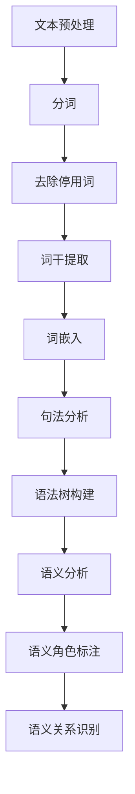

                 

### 文章标题

# 从自然语言到提示词：编程范式的演变

自然语言是人类沟通的基础，它复杂而丰富，承载着我们的思想、情感和知识。然而，在计算机科学领域，编程一直是一种高度结构化、逻辑性强的活动。随着人工智能技术的发展，自然语言与编程之间的界限正在逐渐模糊。本文将从自然语言的起源和特性出发，探讨编程范式的演变，最终深入自然语言编程的原理和实际应用，分析其面临的挑战和未来发展趋势。

## 关键词

- 自然语言
- 编程范式
- 自然语言处理
- 编程语言
- 智能编程
- 语义分析
- 提示词

### 摘要

本文旨在探讨自然语言到提示词的演变，分析编程范式的变革。首先，我们回顾自然语言的起源和特性，阐述其在编程范式中的重要性。接着，探讨编程范式的演变历程，从早期编程范式到面向对象、函数式和响应式编程。然后，介绍自然语言与编程范式的融合，探讨自然语言编程的优势与挑战。最后，通过具体技术手段和实际应用案例，分析自然语言编程的未来前景。

## 目录大纲

### 第一部分：自然语言的本质与编程范式

#### 第1章：自然语言的起源与特性

##### 1.1 自然语言的起源与演化
##### 1.2 自然语言的特性
##### 1.3 编程范式的定义与历史

#### 第2章：自然语言处理的基本原理

##### 2.1 词汇与语法分析
##### 2.2 句法分析
##### 2.3 语义分析

#### 第3章：编程范式的演变

##### 3.1 早期编程范式
##### 3.2 面向对象编程范式
##### 3.3 函数式编程范式
##### 3.4 响应式编程范式

#### 第4章：自然语言与编程范式的融合

##### 4.1 自然语言与编程范式的融合趋势
##### 4.2 编程语言的自然语言特性
##### 4.3 自然语言编程的优势与挑战

### 第二部分：自然语言处理技术

#### 第5章：文本处理技术

##### 5.1 文本预处理
##### 5.2 词嵌入技术
##### 5.3 词性标注与命名实体识别

#### 第6章：句法分析技术

##### 6.1 句法分析的原理与方法
##### 6.2 语法树表示
##### 6.3 句法分析在编程范式中的应用

#### 第7章：语义分析技术

##### 7.1 语义分析的原理与方法
##### 7.2 语义角色标注
##### 7.3 语义关系分析

### 第三部分：自然语言编程范式

#### 第8章：自然语言编程的基础

##### 8.1 自然语言编程的定义与目标
##### 8.2 自然语言编程的核心技术
##### 8.3 自然语言编程的开发流程

#### 第9章：基于自然语言编程的实际应用

##### 9.1 命令行编程
##### 9.2 数据处理与分析
##### 9.3 自动化脚本编写

#### 第10章：自然语言编程的未来展望

##### 10.1 自然语言编程的发展趋势
##### 10.2 自然语言编程面临的挑战与机遇
##### 10.3 未来自然语言编程的可能性

### 附录

#### 附录A：自然语言处理工具与资源

##### A.1 开源自然语言处理工具
##### A.2 自然语言处理数据库
##### A.3 自然语言处理论文与资料推荐

#### 附录B：编程范式流程图与伪代码

##### B.1 自然语言处理流程图
##### B.2 编程范式伪代码示例

#### 附录C：项目实战与代码解读

##### C.1 自然语言编程项目案例
##### C.2 项目实战步骤详解
##### C.3 代码解读与分析

### 文章正文

#### 第1章：自然语言的起源与特性

自然语言是人类文明的重要组成部分，它的起源可以追溯到史前时期。当时，早期人类为了生存和交流，逐渐形成了简单的声音符号。随着时间的推移，这些声音符号不断演化和丰富，最终形成了我们今天所使用的自然语言。自然语言具有以下特性：

1. **多样性**：自然语言具有高度的多样性，不同文化、地区和群体都有自己独特的语言表达方式。
2. **歧义性**：自然语言中存在很多歧义，同一个词或短语在不同的语境下可能有不同的含义。
3. **动态性**：自然语言是动态发展的，不断有新的词汇和表达方式产生，同时也有些词汇和表达方式逐渐消失。
4. **复杂性**：自然语言的表达方式非常复杂，包括词汇、语法、语义等多个层面。

这些特性使得自然语言在人类交流中发挥了重要作用，同时也给计算机处理带来了挑战。为了解决这些问题，计算机科学家们发展出了自然语言处理（Natural Language Processing, NLP）技术。

#### 第1.1节：自然语言的起源与演化

自然语言的起源可以追溯到早期人类社会的形成时期。在进化过程中，人类为了生存和合作，逐渐形成了简单的声音符号，这些声音符号逐渐演化为语言。考古学研究表明，语言的起源可能与人类的劳动分工和社交需求密切相关。随着人类社会的发展，语言也在不断演化和丰富。例如，古埃及象形文字、古希腊字母和古印度梵文等都是古代文明的产物，它们为现代语言的演变奠定了基础。

在不同的历史时期，语言的发展和演变也受到了不同因素的影响。例如，中世纪欧洲的宗教改革和文艺复兴运动对语言的发展产生了深远影响，推动了语言规范化、简化和统一。到了近代，随着工业革命和现代科技的发展，语言的表达能力和复杂性进一步增加，新的词汇和术语不断涌现。

#### 第1.2节：自然语言的特性

自然语言具有以下几个显著特性：

1. **多样性**：自然语言的高度多样性体现在语言种类、方言、口音和词汇等方面。例如，世界上主要的语言有汉语、英语、西班牙语、法语、俄语等，每种语言都有其独特的语法、词汇和表达方式。此外，同一语言内部也存在着方言和口音的差异，如汉语的吴语、粤语、四川话等。

2. **歧义性**：自然语言中的歧义性是指同一词句可以有多种不同的理解和解释。例如，“我昨天买了一个苹果”这句话可以理解为“我昨天买了一个苹果（水果）”，也可以理解为“我昨天买了一个苹果（电子设备）”。这种歧义性给自然语言处理带来了挑战。

3. **动态性**：自然语言的动态性表现在其不断的发展和变化。新的词汇和表达方式不断涌现，如网络用语、流行语等。同时，一些旧的词汇和表达方式可能逐渐消失。例如，现代汉语中已经很少使用“鸿雁传书”这个成语，而“QQ”、“微信”等新兴词汇则迅速普及。

4. **复杂性**：自然语言的复杂性体现在多个层面。首先，自然语言的语法结构非常复杂，包括词法、句法、语义等多个层面。例如，汉语的句法结构可以分为主谓宾、主谓、谓补等多种类型。其次，自然语言的语义也非常复杂，同一个词或短语在不同的语境下可能有不同的含义。例如，“银行”一词可以指金融机构，也可以指河流或湖泊。

#### 第1.3节：编程范式的定义与历史

编程范式（Programming Paradigm）是指导程序员进行编程的方法论和思维方式。不同的编程范式反映了不同的编程风格和编程逻辑。编程范式的历史可以追溯到早期计算机科学的形成时期。

1. **早期编程范式**：最早的编程范式是机器语言和汇编语言。机器语言是计算机能够直接理解和执行的语言，它由二进制代码组成，非常底层且不易理解。汇编语言是对机器语言的抽象，使用助记符代替二进制代码，但仍需依赖具体的硬件架构。早期编程范式的特点是手动编码，缺乏结构化思维。

2. **面向对象编程范式**：面向对象编程（Object-Oriented Programming, OOP）是20世纪80年代兴起的一种编程范式。它以对象为基本单位，通过封装、继承、多态等机制，提高了代码的可重用性和可维护性。面向对象编程范式强调模块化设计，使得程序结构更加清晰，易于理解和维护。

3. **函数式编程范式**：函数式编程（Functional Programming, FP）是一种以函数为核心概念的编程范式。它强调纯函数、不可变数据和高阶函数，避免了副作用和状态依赖，使得代码更加简洁、可靠。函数式编程范式的应用场景包括并行计算、数据分析和算法设计。

4. **响应式编程范式**：响应式编程（Reactive Programming, RP）是一种以数据流为核心的编程范式。它强调异步处理、事件驱动和响应式设计，适用于处理复杂的实时系统和网络应用。响应式编程范式提供了丰富的编程抽象，使得程序员可以更加专注于业务逻辑而非底层细节。

编程范式的演变反映了计算机科学领域的发展和进步。从早期编程范式到面向对象、函数式和响应式编程，每一种范式都有其独特的优势和适用场景。了解不同编程范式的特点，有助于程序员选择合适的编程方式，提高开发效率和代码质量。

### 第2章：自然语言处理的基本原理

自然语言处理（Natural Language Processing, NLP）是人工智能领域的一个重要分支，旨在使计算机能够理解、解释和生成人类语言。NLP技术广泛应用于搜索引擎、机器翻译、情感分析、语音识别等领域。要实现这些功能，NLP需要处理自然语言的多个层面，包括词汇、语法和语义。以下是自然语言处理的基本原理：

#### 第2.1节：词汇与语法分析

词汇与语法分析是自然语言处理的基础。词汇分析（Lexical Analysis）主要关注单词的识别和分类。语法分析（Syntactic Analysis）则研究句子的结构，确定词语之间的语法关系。

1. **词法分析**：词法分析是将文本分解为单词或其他符号的过程。这个过程包括分词（Tokenization）、词性标注（Part-of-Speech Tagging）和词干提取（Stemming）等。例如，将句子“The dog runs quickly.”分解为单词“The”、“dog”、“runs”和“quickly”。

2. **句法分析**：句法分析是研究句子结构的过程。它通过构建语法树（Syntax Tree）来表示句子的语法关系。语法树中的每个节点表示一个语法单位，如词、短语或句子。例如，将句子“The dog runs quickly.”构建为以下语法树：

   ```plaintext
      S
     / \
    NP VP
   /   \
  Det V
 /     \
The runs
       /
      quickly
   ```

3. **依存语法分析**：依存语法分析（Dependency Parsing）是一种更细致的句法分析方法。它通过分析词语之间的依赖关系来构建句子的语法结构。例如，在句子“The dog runs quickly.”中，“runs”依赖于“dog”，“quickly”依赖于“runs”。

#### 第2.2节：句法分析

句法分析（Syntactic Analysis）是自然语言处理的核心组成部分，旨在理解和解析句子的语法结构。句法分析不仅帮助我们确定句子中的词语顺序和关系，还可以帮助我们理解句子的深层含义。

1. **句法分析的原理与方法**：
   - **上下文无关文法**（Context-Free Grammar,CFG）：上下文无关文法是一种形式语法体系，用于描述自然语言的语法结构。它包括产生式（Production Rules）和终结符（Terminal Symbols）。产生式定义了如何通过替换和组合终结符来生成句子。例如，产生式`S -> NP VP`表示一个句子由主语（NP）和谓语（VP）组成。
   - **上下文无关句法分析器**（Context-Free Parser）：上下文无关句法分析器是一种根据上下文无关文法来解析句子的工具。常见的分析器包括自顶向下解析器（Top-Down Parser）和自底向上解析器（Bottom-Up Parser）。
   - **语法树表示**：语法树是一种图形表示方法，用于表示句子的语法结构。在语法树中，每个节点表示一个语法单位，如词、短语或句子。语法树的根节点表示整个句子，叶子节点表示终结符。例如，以下是一个简单句子的语法树表示：

     ```plaintext
        S
       / \
      NP VP
     /   \
    Det V
   /     \
The runs
```
   - **约束理论**（Constraint-Based Parsing）：约束理论是一种基于约束的句法分析方法，它通过同时考虑多个语法规则和约束条件来生成最合适的语法结构。这种方法通常用于处理自然语言中的歧义和复杂性。

2. **句法分析在编程范式中的应用**：
   - **编程语言解析**：在编程语言中，句法分析是编译过程的重要步骤。编程语言的语法规则通常使用上下文无关文法描述，编译器通过解析源代码来构建抽象语法树（Abstract Syntax Tree, AST）。AST是程序语义分析的基础，用于后续的代码生成、优化和错误检查。
   - **自然语言编程**：在自然语言编程中，句法分析被用于理解和解析自然语言的指令和命令。例如，智能助手或聊天机器人需要通过句法分析来理解用户的自然语言请求，并生成相应的代码执行。

3. **句法分析器类型**：
   - **LL（自顶向下解析）**：LL解析器从左到右扫描输入，从顶部开始构建语法树。它通常使用预测分析技术来决定下一个产生式的应用。
   - **LR（自底向上解析）**：LR解析器从右到左扫描输入，使用回溯技术来处理冲突和复杂的语法结构。LR解析器分为LR(0)、SLR(1)、LALR(1)和LR(1)等不同类型，分别处理不同程度的语法复杂度。

#### 第2.3节：语义分析

语义分析（Semantic Analysis）是自然语言处理中的另一个关键步骤，旨在理解句子的意义。语义分析包括词汇语义分析、句法语义分析和语义角色标注。

1. **词汇语义分析**：词汇语义分析是研究单词或短语的含义。它涉及词义消歧（Word Sense Disambiguation）和语义角色标注（Semantic Role Labeling）。
   - **词义消歧**：词义消歧是确定单词在特定上下文中的正确含义。例如，单词“bank”可以指银行，也可以指河岸。在句子“我去银行取钱。”中，正确理解“bank”的含义是关键。
   - **语义角色标注**：语义角色标注是确定句子中每个词语在语义上的作用。例如，在句子“小明给小红送了礼物。”中，“小明”是动作的执行者（Agent），“小红”是受益者（Recipient）。

2. **句法语义分析**：句法语义分析是将语法结构转换为语义表示的过程。它涉及句子意义的解析和表示。例如，将句子“The boy reads a book.”解析为“一个男孩读一本书。”。
3. **语义关系分析**：语义关系分析是研究句子中词语之间的语义联系。它包括语义角色标注和语义关系识别。例如，在句子“小明喜欢跑步。”中，可以识别出“小明”和“跑步”之间的 liking 关系。

通过词汇、句法和语义分析，自然语言处理技术能够逐步理解自然语言的深层含义，为智能交互、机器翻译、文本生成等应用提供基础。

#### 第3章：编程范式的演变

编程范式是指导程序员进行编程的方法论和思维方式。随着计算机技术的发展，编程范式经历了多次重要变革，从早期的结构化编程到面向对象编程，再到函数式编程和响应式编程。每种编程范式都有其独特的特点和应用场景，下面我们将逐一探讨这些编程范式的演变过程。

#### 第3.1节：早期编程范式

早期的编程范式主要包括机器语言和汇编语言。这些语言是计算机能够直接理解和执行的语言，它们使用二进制代码或汇编指令来描述程序。早期编程范式的特点是手动编码，缺乏结构化思维。

1. **机器语言**：机器语言是计算机能够直接理解和执行的语言。它由二进制代码组成，每种指令都对应着计算机硬件的操作。机器语言的优点是执行速度快，但缺点是难以理解和编写。编写机器语言程序需要深入了解计算机的硬件架构和工作原理。

2. **汇编语言**：汇编语言是对机器语言的抽象，使用助记符代替二进制代码。汇编语言更容易理解和编写，但仍然依赖具体的硬件架构。汇编语言提供了更直接的硬件访问和控制，但编写和维护汇编语言程序需要较高的专业知识和经验。

早期编程范式的主要问题在于其复杂性和低可读性。程序员需要手动编写大量的底层代码，这使得程序难以维护和扩展。此外，早期编程范式缺乏模块化设计，导致程序结构松散，难以复用。

#### 第3.2节：面向对象编程范式

面向对象编程（Object-Oriented Programming, OOP）是20世纪80年代兴起的一种编程范式。它以对象为基本单位，通过封装、继承、多态等机制，提高了代码的可重用性和可维护性。面向对象编程范式的核心思想是将现实世界中的实体抽象为对象，并利用类（Class）和对象（Object）来组织和管理代码。

1. **封装（Encapsulation）**：封装是面向对象编程的一个基本特性，它将对象的属性（数据）和方法（行为）封装在一起，实现对内部状态的隐藏和保护。通过封装，可以确保对象的内部实现细节对外部不可见，从而降低模块之间的耦合度。

2. **继承（Inheritance）**：继承是一种允许新的类从已有的类中派生出来的机制。派生类继承了基类的属性和方法，同时可以扩展或重写基类的方法。继承促进了代码的重用，减少了冗余，提高了程序的扩展性。

3. **多态（Polymorphism）**：多态是指同一个操作或函数在继承体系中具有多种不同的实现方式。通过多态，可以编写通用代码，实现对不同类的对象的统一处理。多态性使得程序具有更好的灵活性和可扩展性。

面向对象编程范式在程序设计中引入了抽象、模块化和重用等概念，使得程序结构更加清晰，易于理解和维护。面向对象编程范式广泛应用于大型软件系统的开发，如操作系统、数据库管理系统、Web应用等。

#### 第3.3节：函数式编程范式

函数式编程（Functional Programming, FP）是一种以函数为核心概念的编程范式。它强调纯函数、不可变数据和高阶函数，避免了副作用和状态依赖，使得代码更加简洁、可靠。函数式编程范式在20世纪50年代开始兴起，并在近年来逐渐受到关注。

1. **纯函数（Pure Function）**：纯函数是指对于相同的输入，总是返回相同输出的函数。纯函数不依赖于外部状态，也不修改外部状态。纯函数具有可预测性和可测试性，使得代码更容易理解和维护。

2. **不可变数据（Immutable Data）**：不可变数据是指一旦创建，就不能再修改的数据。不可变数据减少了状态依赖和副作用，提高了程序的可读性和可维护性。在函数式编程中，数据通常以不可变的形式传递，并通过函数的返回值来更新状态。

3. **高阶函数（Higher-Order Function）**：高阶函数是一种可以接受函数作为参数或返回函数的函数。高阶函数可以组合和复用函数，提高了代码的灵活性和可重用性。高阶函数在函数式编程中得到了广泛应用，如map、reduce、filter等。

函数式编程范式在并行计算、数据分析和算法设计等领域具有显著优势。它提供了简洁的表达方式，使得程序更加模块化和可重用。函数式编程范式还促进了函数式反应式编程（Functional Reactive Programming, FRP）等新编程范式的出现。

#### 第3.4节：响应式编程范式

响应式编程（Reactive Programming, RP）是一种以数据流为核心的编程范式。它强调异步处理、事件驱动和响应式设计，适用于处理复杂的实时系统和网络应用。响应式编程范式在20世纪90年代开始兴起，并在近年来得到了广泛的应用。

1. **数据流（Data Flow）**：响应式编程以数据流为核心，将程序视为一系列数据流的处理过程。数据流可以是实时的，也可以是批处理的。数据流编程模型使得程序更加模块化和可重用，便于处理复杂的实时系统和网络应用。

2. **事件驱动（Event-Driven）**：响应式编程以事件为中心，通过事件触发来执行代码。事件可以是用户输入、网络消息、定时器等。事件驱动模型使得程序具有更好的响应性和可扩展性，便于处理并发和异步操作。

3. **响应式设计（Reactive Design）**：响应式设计强调程序结构的响应式特性，使得程序能够动态适应数据流的变化。响应式设计包括响应式编程语言、响应式框架和响应式架构等。响应式设计使得程序更加灵活和可维护，易于处理复杂的实时系统和网络应用。

响应式编程范式在实时系统、分布式系统、移动应用和前端开发等领域具有显著优势。它提供了简洁的表达方式，使得程序更加模块化和可重用。响应式编程范式还促进了函数式反应式编程（Functional Reactive Programming, FRP）等新编程范式的出现。

#### 第3.5节：自然语言与编程范式的融合

自然语言与编程范式的融合是近年来计算机科学领域的一个重要趋势。随着人工智能技术的发展，计算机开始能够理解和处理自然语言，从而实现更加智能化的编程和开发。

1. **自然语言编程**：自然语言编程（Natural Language Programming, NLP）是一种新兴的编程范式，它允许程序员使用自然语言来编写程序，而不是传统的编程语言。自然语言编程的目标是使编程变得更加直观和易用。通过自然语言编程，程序员可以使用自然语言指令来描述程序逻辑，从而简化编程过程。

2. **自然语言处理的编程应用**：自然语言处理（NLP）技术在编程领域有着广泛的应用。例如，在代码生成和自动化工具中，NLP可以用于分析代码注释和文档，自动生成代码库。在代码审查和缺陷检测中，NLP可以用于识别潜在的代码问题和风格不一致。在智能编程助手和代码搜索中，NLP可以用于理解程序员的问题和需求，提供相关代码建议和搜索结果。

3. **编程语言的自然语言特性**：现代编程语言开始融入更多的自然语言特性，以提高代码的可读性和易用性。例如，Python、JavaScript等语言引入了自然语言注释和文档生成工具，如TypeScript和Markdown，以支持更丰富的语法和语义描述。

自然语言与编程范式的融合不仅改变了编程的方式，也拓宽了编程的应用领域。通过结合自然语言处理和编程范式，我们可以构建更加智能、高效和易用的编程工具和系统。

#### 第4章：自然语言与编程范式的融合

随着人工智能技术的不断进步，自然语言与编程范式之间的融合成为了一个热门的研究领域。自然语言（Natural Language）是人类交流的基础，而编程范式（Programming Paradigm）是指导程序员进行编程的方法论和思维方式。这种融合不仅改变了编程的方式，也带来了新的研究课题和实际应用。

#### 第4.1节：自然语言与编程范式的融合趋势

自然语言与编程范式的融合趋势体现在多个方面：

1. **自然语言编程**：自然语言编程（Natural Language Programming, NLP）允许程序员使用自然语言来编写程序，而不是传统的编程语言。这种编程范式使得编程更加直观和易用。NLP的目标是使编程接近人类的日常语言，从而降低编程的门槛。一些研究项目，如TensorFlow的TensorScript和Google的JAX，已经开始探索这种融合的可能性。

2. **自然语言处理的编程应用**：自然语言处理（NLP）技术在编程领域有着广泛的应用。例如，在代码生成和自动化工具中，NLP可以用于分析代码注释和文档，自动生成代码库。在代码审查和缺陷检测中，NLP可以用于识别潜在的代码问题和风格不一致。在智能编程助手和代码搜索中，NLP可以用于理解程序员的问题和需求，提供相关代码建议和搜索结果。

3. **编程语言的自然语言特性**：现代编程语言开始融入更多的自然语言特性，以提高代码的可读性和易用性。例如，Python、JavaScript等语言引入了自然语言注释和文档生成工具，如TypeScript和Markdown，以支持更丰富的语法和语义描述。

#### 第4.2节：编程语言的自然语言特性

编程语言的自然语言特性体现在以下几个方面：

1. **自然语言注释**：编程语言支持使用自然语言编写的注释，这些注释可以帮助程序员更清晰地理解代码的意图和功能。例如，Python的文档字符串（docstrings）允许使用自然语言编写文档，这些文档可以在代码运行时被自动生成和解析。

2. **自然语言文档生成**：一些编程语言和工具支持自动生成文档，这些文档可以是使用自然语言编写的，例如Markdown格式。Markdown格式简洁易用，支持多种文本格式和链接，被广泛用于编写和维护项目文档。

3. **自然语言编程接口**：现代编程语言提供了丰富的库和框架，以支持自然语言编程接口。这些接口使得程序员可以使用自然语言指令来控制程序的行为。例如，Python的pandas库允许使用类似于SQL的查询语句来处理数据。

#### 第4.3节：自然语言编程的优势与挑战

自然语言编程具有以下优势：

1. **易用性**：自然语言编程降低了编程的门槛，使得非专业程序员和普通用户也能够编写和运行程序。

2. **可读性**：自然语言编程提高了代码的可读性，使得程序员更容易理解和维护代码。

3. **灵活性**：自然语言编程允许程序员使用自然语言描述复杂的逻辑和算法，提高了程序的灵活性。

然而，自然语言编程也面临着一些挑战：

1. **歧义性**：自然语言中的歧义性给编程带来了困难，程序需要解析和处理这些歧义。

2. **复杂性**：自然语言的复杂性使得自然语言编程的实现变得更加复杂，需要高效的算法和模型来处理。

3. **性能**：自然语言编程可能不如传统的编程语言高效，特别是在处理复杂和计算密集型的任务时。

总之，自然语言与编程范式的融合为编程领域带来了新的机遇和挑战。通过不断的研究和探索，我们可以期待未来出现更加智能、高效和易用的编程工具和系统。

### 第5章：文本处理技术

文本处理技术是自然语言处理（NLP）的基础，它涵盖了从文本的预处理到复杂的语义分析的各个层次。本章将详细介绍文本处理技术，包括文本预处理、词嵌入技术、词性标注和命名实体识别。

#### 第5.1节：文本预处理

文本预处理是文本处理的第一步，其目的是将原始文本转化为适合NLP算法处理的形式。文本预处理通常包括以下步骤：

1. **分词（Tokenization）**：分词是将文本分割成单词或短语的步骤。例如，将句子“The quick brown fox jumps over the lazy dog.”分割为单词列表`["The", "quick", "brown", "fox", "jumps", "over", "the", "lazy", "dog."]`。

2. **去除停用词（Stop Word Removal）**：停用词是指那些对文本分析没有贡献的常见词汇，如“a”、“the”、“is”等。去除停用词可以减少数据的噪声，提高分析的效果。

3. **词干提取（Stemming）**：词干提取是将单词还原为词根或词干的过程。例如，将“running”、“runs”、“ran”都还原为“run”。

4. **词形还原（Lemmatization）**：词形还原是词干提取的进一步细化，它不仅还原到词干，还还原到词形。例如，将“running”还原为“run”。

5. **词嵌入（Word Embedding）**：词嵌入是将单词映射到高维向量空间，以便在机器学习算法中进行处理。例如，使用Word2Vec或GloVe算法生成词嵌入向量。

#### 第5.2节：词嵌入技术

词嵌入（Word Embedding）是将单词映射到高维向量空间的技术，这些向量空间中的单词具有相似的语义特征。词嵌入技术有助于解决自然语言处理中的许多问题，如文本分类、情感分析和机器翻译。

1. **Word2Vec算法**：Word2Vec是一种基于神经网络的词嵌入算法，它通过训练单词的上下文来生成词向量。Word2Vec有两种实现方式：连续词袋（Continuous Bag of Words, CBOW）和Skip-Gram。

   - **CBOW**：CBOW算法通过预测中心词周围的多个上下位词来训练词向量。例如，给定中心词“apple”，CBOW算法会尝试预测这个词周围的上下文词，如“fruit”、“banana”等。
   - **Skip-Gram**：Skip-Gram算法与CBOW相反，它是通过预测中心词的上下文词来训练词向量。例如，给定中心词“apple”，Skip-Gram算法会尝试预测这个词的前后文词，如“buy”和“computer”。

2. **GloVe算法**：GloVe（Global Vectors for Word Representation）是一种基于全局上下文的词嵌入算法。GloVe通过计算单词共现矩阵的加权平均来生成词向量，从而捕捉单词之间的全局语义关系。

3. **预训练和微调**：在自然语言处理任务中，通常先使用大规模语料库对词嵌入模型进行预训练，然后在特定任务上进行微调。预训练使模型能够捕捉到大量的语言知识和模式，微调则使模型能够适应特定的任务需求。

#### 第5.3节：词性标注与命名实体识别

词性标注（Part-of-Speech Tagging, POS Tagging）和命名实体识别（Named Entity Recognition, NER）是文本处理技术中重要的语义分析步骤。

1. **词性标注**：词性标注是给文本中的每个词分配一个词性标签，如名词（NN）、动词（VB）、形容词（JJ）等。词性标注有助于理解句子的结构和语义，是许多NLP任务的基础。

2. **命名实体识别**：命名实体识别是识别文本中的特定实体，如人名、地名、组织名、时间等。NER在信息提取、知识图谱构建和问答系统等领域具有重要应用。

   - **规则方法**：规则方法使用预定义的规则和模式来识别命名实体。这种方法简单有效，但规则数量庞大且难以维护。
   - **统计方法**：统计方法使用机器学习算法，如条件随机场（Conditional Random Field, CRF）和长短期记忆网络（Long Short-Term Memory, LSTM），来预测文本中的命名实体。
   - **混合方法**：混合方法结合了规则和统计方法，以充分利用各自的优点。

通过文本预处理、词嵌入技术、词性标注和命名实体识别，文本处理技术为自然语言处理提供了坚实的基础，使得计算机能够更好地理解和分析人类语言。

#### 第6章：句法分析技术

句法分析（Syntactic Analysis）是自然语言处理（NLP）中的重要步骤，旨在理解和解析句子的语法结构。句法分析不仅帮助我们确定句子中的词语顺序和关系，还可以帮助我们理解句子的深层含义。本章将详细介绍句法分析技术的原理与方法、语法树表示以及其在编程范式中的应用。

#### 第6.1节：句法分析的原理与方法

句法分析是NLP中解析句子结构的过程，其核心任务是构建一个能够表示句子语法结构的语法树（Syntax Tree）。句法分析的原理与方法包括以下几个方面：

1. **上下文无关文法（Context-Free Grammar, CFG）**：
   - **产生式规则（Production Rules）**：上下文无关文法使用产生式规则来定义语言的语法结构。每个产生式由一个非终结符（Non-Terminal Symbol）和一个或多个终结符（Terminal Symbol）组成，表示如何通过替换和组合来生成句子。例如：
     ```
     S -> NP VP
     NP -> Det N
     VP -> V NP
     ```
   - **语法树（Syntax Tree）**：语法树是一种图形表示方法，用于表示句子的语法结构。在语法树中，每个节点表示一个语法单位，如词、短语或句子。语法树的根节点表示整个句子，叶子节点表示终结符。例如，以下是一个简单句子的语法树：
     ```
          S
         / \
        NP VP
       /   \
      Det N  V
         / \
        The dog
     ```

2. **上下文无关句法分析器（Context-Free Parser）**：上下文无关句法分析器是一种根据上下文无关文法来解析句子的工具。常见的分析器包括自顶向下解析器（Top-Down Parser）和自底向上解析器（Bottom-Up Parser）。

   - **自顶向下解析器**：自顶向下解析器从根节点开始，从顶部向下构建语法树。它使用预测分析技术来决定下一个产生式的应用。常见的自顶向下解析器包括LL（1）解析器和LR（1）解析器。
   - **自底向上解析器**：自底向上解析器从叶子节点开始，从底部向上构建语法树。它使用归约分析技术来识别产生式并构建语法树。常见的自底向上解析器包括SLR（1）解析器和LR（k）解析器。

3. **约束理论（Constraint-Based Parsing）**：约束理论是一种基于约束的句法分析方法，它通过同时考虑多个语法规则和约束条件来生成最合适的语法结构。约束理论通常用于处理自然语言中的歧义和复杂性。

4. **依存句法分析（Dependency Parsing）**：依存句法分析是另一种重要的句法分析方法，它通过分析词语之间的依赖关系来构建句子的语法结构。在依存句法分析中，每个词语都有一个依存标签（Dependency Label），表示它与哪个词语存在依赖关系。例如，在句子“The dog runs quickly.”中，“runs”依赖于“dog”，“quickly”依赖于“runs”。

#### 第6.2节：语法树表示

语法树（Syntax Tree）是一种图形表示方法，用于表示句子的语法结构。在语法树中，每个节点表示一个语法单位，如词、短语或句子。语法树的根节点表示整个句子，叶子节点表示终结符。语法树表示有助于我们直观地理解句子的结构，从而更好地理解和分析自然语言。

1. **简单语法树**：简单语法树通常用于表示简单的句子结构。例如，以下是一个简单句子的语法树：
   ```
          S
         / \
        NP VP
       /   \
      Det N  V
         / \
        The dog
   ```

2. **复杂语法树**：复杂语法树用于表示更复杂的句子结构，包括嵌套的从句和并列的短语。以下是一个复杂句子的语法树：
   ```
          S
         / \
        NP VP
       /   \
      Det N  VP
         / \
        The dog  V
               / \
              quickly  NP
                 / \
                Adv N
               / \
              very cat
   ```

3. **依存语法树**：依存语法树通过依赖关系来表示句子的结构。在依存语法树中，每个节点都有一个指向其依存关系的箭头。以下是一个简单句子的依存语法树：
   ```
          S
         / \
        dog runs
         ↓
       subject
         ↓
      verb
   ```

#### 第6.3节：句法分析在编程范式中的应用

句法分析在编程范式中的应用主要体现在代码解析和抽象语法树（Abstract Syntax Tree, AST）的构建上。抽象语法树是一种简化后的语法表示，它保留了程序的关键结构，去除了一些不必要的细节。

1. **代码解析**：代码解析是将源代码转换为抽象语法树的过程。解析器根据编程语言的语法规则，对源代码进行词法分析和语法分析，构建出抽象语法树。抽象语法树是程序语义分析的基础，用于后续的代码生成、优化和错误检查。

2. **抽象语法树**：抽象语法树（AST）是一种树形结构，用于表示程序代码的语法结构。在AST中，每个节点表示一个语法单位，如表达式、语句或函数。AST通常包含以下信息：
   - **标识符（Identifier）**：标识符表示程序中的变量、函数或类。
   - **类型信息（Type Information）**：类型信息表示变量、函数或类的数据类型。
   - **操作符（Operator）**：操作符表示程序中的运算符，如加法、减法、赋值等。
   - **子节点（Children）**：子节点表示语法单位之间的嵌套关系。

3. **抽象语法树在编程范式中的应用**：
   - **静态分析**：抽象语法树是静态分析的重要工具，它可以帮助程序员识别代码中的潜在错误、优化代码结构和进行代码重构。
   - **动态分析**：抽象语法树也可以用于动态分析，例如在程序运行时对代码进行跟踪和调试。
   - **代码生成**：抽象语法树可以用于代码生成，例如将高级语言编译为机器语言或生成优化后的代码。
   - **代码比较和差异分析**：通过比较两个抽象语法树，可以识别代码之间的差异和变化。

句法分析在编程范式中的应用，使得程序具有更好的可读性、可维护性和可扩展性。通过抽象语法树，程序员可以更加直观地理解和操作程序代码，从而提高开发效率和代码质量。

### 第7章：语义分析技术

语义分析（Semantic Analysis）是自然语言处理（NLP）中理解和解析句子意义的核心步骤。它涉及到词汇语义分析、句法语义分析和语义角色标注等多个方面。本章将详细介绍语义分析技术的原理与方法、语义角色标注和语义关系分析。

#### 第7.1节：语义分析的原理与方法

语义分析是NLP中从语法分析到理解句子意义的桥梁。它旨在理解句子的内在逻辑和实际意义，从而为各种应用提供语义层面的支持。

1. **词汇语义分析**：
   - **词义消歧（Word Sense Disambiguation, WSD）**：词义消歧是指根据上下文确定单词的正确含义。例如，单词“bank”在不同的上下文中可以指“银行”或“河岸”。词义消歧有助于提高文本理解的准确性和一致性。
   - **语义角色标注（Semantic Role Labeling, SRL）**：语义角色标注是识别句子中每个词在语义上的作用，如主语、谓语、宾语等。通过标注语义角色，我们可以更好地理解句子的结构和含义。

2. **句法语义分析**：
   - **语义解析（Semantic Parsing）**：语义解析是将自然语言表述转换为逻辑形式或计算机程序的过程。例如，将句子“明天上午10点，我在办公室开会。”转换为“at 10 AM tomorrow, I will have a meeting at my office.”的逻辑形式。
   - **语义角色标注（Semantic Role Labeling, SRL）**：语义角色标注是识别句子中每个词在语义上的作用，如主语、谓语、宾语等。通过标注语义角色，我们可以更好地理解句子的结构和含义。

3. **语义关系分析**：
   - **语义角色标注（Semantic Role Labeling, SRL）**：语义角色标注是识别句子中每个词在语义上的作用，如主语、谓语、宾语等。通过标注语义角色，我们可以更好地理解句子的结构和含义。
   - **语义关系识别（Semantic Relation Recognition, SRR）**：语义关系识别是识别句子中词语之间的语义联系，如因果关系、包含关系等。语义关系识别有助于构建语义网络和知识图谱。

#### 第7.2节：语义角色标注

语义角色标注（Semantic Role Labeling, SRL）是语义分析的一个重要步骤，它旨在识别句子中每个词在语义上的作用。语义角色标注通常包括以下类别：

1. **动作词的主语和宾语**：
   - **施事者（Agent）**：执行动作的人或物体。
   - **受事者（Patient）**：动作作用的对象。
   - **工具**：用于完成动作的工具或物品。
   - **目的**：动作的目标或原因。

2. **助动词和情态动词**：
   - **助动词**：帮助构成谓语的动词，如“will”、“can”。
   - **情态动词**：表示能力、可能性或意愿的动词，如“must”、“should”。

3. **修饰词和副词**：
   - **时间状语**：表示动作发生的时间。
   - **地点状语**：表示动作发生的地点。
   - **方式状语**：表示动作的方式。

通过语义角色标注，我们可以更准确地理解句子的意义，为后续的语义分析和信息提取提供基础。

#### 第7.3节：语义关系分析

语义关系分析（Semantic Relation Analysis）是识别句子中词语之间语义联系的过程。语义关系分析有助于构建语义网络和知识图谱，从而提高自然语言处理的智能化水平。

1. **因果关系**：因果关系表示两个事件之间的因果联系，如“因为……所以……”。

2. **包含关系**：包含关系表示一个概念包含另一个概念，如“猫是动物的一种”。

3. **修饰关系**：修饰关系表示一个词修饰另一个词，如“红色的苹果”。

4. **并列关系**：并列关系表示两个或多个词在语义上是并列的，如“我和你一起去了”。

通过语义关系分析，我们可以构建复杂的语义网络，从而实现更高级的自然语言处理任务，如文本生成、问答系统和信息提取。

### 第8章：自然语言编程的基础

自然语言编程（Natural Language Programming, NLP）是一种新兴的编程范式，它允许程序员使用自然语言来编写程序，而不是传统的编程语言。这种编程范式使得编程更加直观和易用，降低了编程的门槛。本章将介绍自然语言编程的定义与目标、核心技术以及开发流程。

#### 第8.1节：自然语言编程的定义与目标

自然语言编程是指使用自然语言（如英语、中文等）来编写程序，而不是传统的编程语言（如Python、Java等）。自然语言编程的目标是使编程接近人类的日常语言，从而简化编程过程，提高开发效率。

1. **定义**：自然语言编程是一种编程范式，它允许程序员使用自然语言来描述程序逻辑，而不是使用传统的编程语言。自然语言编程的输入是自然语言文本，输出是计算机程序或代码。

2. **目标**：
   - **降低编程门槛**：自然语言编程使得编程变得更加直观和易用，降低了编程的难度和门槛，使更多的非专业程序员和普通用户能够编写和运行程序。
   - **提高开发效率**：自然语言编程简化了编程过程，减少了代码编写和调试的时间，提高了开发效率。
   - **增强人机交互**：自然语言编程可以增强人机交互体验，使计算机能够更好地理解和执行人类的指令，从而实现更加智能化的应用。

#### 第8.2节：自然语言编程的核心技术

自然语言编程的核心技术包括自然语言处理（NLP）、语法分析、语义分析和代码生成等。

1. **自然语言处理（NLP）**：
   - **分词（Tokenization）**：将自然语言文本分割成单词或短语的步骤。
   - **词性标注（Part-of-Speech Tagging）**：为文本中的每个词分配词性标签，如名词、动词、形容词等。
   - **句法分析（Syntax Analysis）**：解析文本的语法结构，构建语法树。
   - **语义分析（Semantic Analysis）**：理解文本的含义和逻辑关系。

2. **语法分析**：
   - **上下文无关文法（Context-Free Grammar, CFG）**：用于描述自然语言的语法结构，通过产生式规则来生成句子。
   - **语法解析器（Parser）**：根据语法规则分析文本，构建语法树。

3. **语义分析**：
   - **语义角色标注（Semantic Role Labeling, SRL）**：识别句子中每个词在语义上的作用，如主语、谓语、宾语等。
   - **语义关系识别（Semantic Relation Recognition, SRR）**：识别句子中词语之间的语义联系，如因果关系、包含关系等。

4. **代码生成**：
   - **模板匹配**：根据预定义的模板生成代码。
   - **自动翻译**：将自然语言指令翻译成编程语言代码。
   - **代码生成器（Code Generator）**：根据语义分析和语法分析的结果，自动生成代码。

#### 第8.3节：自然语言编程的开发流程

自然语言编程的开发流程通常包括以下几个步骤：

1. **需求分析**：确定程序的功能和目标，了解用户的需求和意图。

2. **自然语言输入**：用户使用自然语言描述程序逻辑，如“编写一个程序，用于计算两个数的和”。

3. **语法分析**：对自然语言输入进行语法分析，构建语法树。

4. **语义分析**：对语法树进行语义分析，识别句子中的语义角色和语义关系。

5. **代码生成**：根据语义分析和语法分析的结果，生成编程语言代码。

6. **代码调试**：对生成的代码进行调试和优化，确保程序的正确性和性能。

7. **代码运行**：运行生成的代码，验证程序的功能和性能。

通过自然语言编程，我们可以实现更加智能和高效的应用，提高人机交互的体验。

### 第9章：基于自然语言编程的实际应用

自然语言编程（NLP）作为一种新兴的编程范式，已经在多个实际应用场景中展示了其潜力。本章将介绍自然语言编程在命令行编程、数据处理与分析以及自动化脚本编写等领域的实际应用，并通过具体案例进行详细讲解。

#### 第9.1节：命令行编程

命令行编程一直是程序员和系统管理员的核心技能之一。然而，对于非技术人员来说，理解和使用命令行可能是一个挑战。自然语言编程可以简化这一过程，使得用户能够通过简单的自然语言指令来执行复杂的命令行操作。

**案例：使用自然语言编写Linux命令**

假设用户想要查看当前目录下的所有文件和文件夹，并且只显示文件名。用户可以使用自然语言输入以下指令：

```
列出当前目录下的所有文件。
```

自然语言编程系统首先将这一自然语言指令转换为内部表示，然后使用语法分析技术将其解析为命令行指令。具体步骤如下：

1. **自然语言解析**：将自然语言指令“列出当前目录下的所有文件。”转换为内部表示，例如`["list", "all", "files", "in", "current", "directory"]`。

2. **语法分析**：根据预定义的语法规则，将内部表示转换为命令行指令。例如，使用以下语法规则：
   ```
   S -> CMD
   CMD -> "list" "all" "files" "in" "directory"
   ```
   生成的命令行指令为`ls -l $(pwd)`。

3. **执行命令**：执行生成的命令行指令，显示当前目录下的所有文件。

**代码示例：自然语言编程系统解析与执行**

```python
# 自然语言输入
input_text = "列出当前目录下的所有文件。"

# 自然语言解析
nlp_system = NaturalLanguageParser()
parsed_tokens = nlp_system.parse(input_text)

# 语法分析
grammar_rules = {
    "S": [["list", "all", "files", "in", "current", "directory"]],
    "CMD": [["ls", "-l", "$(pwd)"]]
}

def apply_grammar_rules(parsed_tokens, grammar_rules):
    for rule, productions in grammar_rules.items():
        if rule in parsed_tokens:
            return productions[0]
    return None

command = apply_grammar_rules(parsed_tokens, grammar_rules)

# 执行命令
os.system(command)
```

通过这种方式，自然语言编程系统可以将自然语言指令转换为可执行的命令行指令，从而简化用户的命令行操作。

#### 第9.2节：数据处理与分析

数据处理与分析是许多领域（如金融、医疗、电商等）的核心任务。自然语言编程可以提高数据处理的效率和准确性，使得用户能够通过简单的自然语言指令来执行复杂的数据分析任务。

**案例：使用自然语言进行数据分析**

假设用户想要分析一个销售数据集，并找出销量最高的产品。用户可以使用自然语言输入以下指令：

```
分析销售数据，找出销量最高的产品。
```

自然语言编程系统首先将这一自然语言指令转换为内部表示，然后使用数据分析工具执行任务。具体步骤如下：

1. **自然语言解析**：将自然语言指令“分析销售数据，找出销量最高的产品。”转换为内部表示，例如`["analyze", "sales", "data", "find", "best-selling", "product"]`。

2. **数据预处理**：使用自然语言处理（NLP）技术对销售数据进行预处理，包括数据清洗、格式转换等。

3. **数据分析**：使用数据分析工具（如Pandas、NumPy等）对预处理后的数据进行分析，找出销量最高的产品。

4. **结果展示**：将分析结果以自然语言形式展示给用户，例如“销量最高的产品是‘iPhone 13’，总销量为1000台。”

**代码示例：自然语言编程系统进行数据分析**

```python
# 自然语言输入
input_text = "分析销售数据，找出销量最高的产品。"

# 自然语言解析
nlp_system = NaturalLanguageParser()
parsed_tokens = nlp_system.parse(input_text)

# 数据预处理
data = load_sales_data()  # 加载销售数据
cleaned_data = preprocess_data(data)  # 数据清洗

# 数据分析
best_selling_product = analyze_data(cleaned_data)

# 结果展示
result = f"销量最高的产品是‘{best_selling_product}’，总销量为{get_total_sales(best_selling_product)}台。"
print(result)
```

通过这种方式，自然语言编程系统可以简化数据分析过程，提高用户的效率和体验。

#### 第9.3节：自动化脚本编写

自动化脚本编写是自然语言编程的另一个重要应用领域。通过自然语言指令，用户可以轻松地编写和执行自动化脚本，从而简化日常任务和管理工作。

**案例：使用自然语言编写自动化脚本**

假设用户想要编写一个自动化脚本，用于每天早上8点自动备份指定的文件。用户可以使用自然语言输入以下指令：

```
编写一个脚本，每天早上8点自动备份我的‘重要文件’文件夹。
```

自然语言编程系统首先将这一自然语言指令转换为内部表示，然后生成相应的自动化脚本。具体步骤如下：

1. **自然语言解析**：将自然语言指令“编写一个脚本，每天早上8点自动备份我的‘重要文件’文件夹。”转换为内部表示，例如`["write", "script", "daily", "backup", "important", "files", "folder", "8:00 AM"]`。

2. **脚本生成**：根据内部表示，生成对应的Python脚本。例如：

```python
import os
import shutil
import datetime

# 备份目标文件夹
target_folder = "重要文件"

# 备份脚本路径
script_path = "backup_important_files.py"

# 当前时间
current_time = datetime.datetime.now()

# 备份时间
backup_time = current_time.strftime("%Y-%m-%d_%H-%M")

# 备份文件名
backup_filename = f"{backup_time}.zip"

# 备份命令
shutil.make_archive(backup_filename, 'zip', target_folder)

# 移动备份文件到备份文件夹
shutil.move(backup_filename, "备份文件夹/")

print(f"备份成功：{target_folder}于{current_time}备份完成。")
```

3. **脚本执行**：将生成的脚本保存到文件系统中，并设置定时任务，每天早上8点自动执行。

**代码示例：自然语言编程系统生成和执行自动化脚本**

```python
# 自然语言输入
input_text = "编写一个脚本，每天早上8点自动备份我的‘重要文件’文件夹。"

# 自然语言解析
nlp_system = NaturalLanguageParser()
parsed_tokens = nlp_system.parse(input_text)

# 脚本生成
script_content = generate_backup_script(parsed_tokens)
with open("backup_important_files.py", "w") as script_file:
    script_file.write(script_content)

# 设置定时任务
schedule.every().day.at("8:00").do(run_backup_script)

# 运行脚本
run_backup_script()

def run_backup_script():
    os.system("python backup_important_files.py")

print("脚本生成和定时任务设置成功。")
```

通过这种方式，自然语言编程系统可以简化自动化脚本编写过程，提高用户的效率和体验。

### 第10章：自然语言编程的未来展望

自然语言编程（NLP）作为计算机科学领域的前沿技术，已经在多个实际应用场景中展示了其巨大潜力。随着人工智能技术的不断进步，自然语言编程正逐步从概念验证走向实际应用。本章将探讨自然语言编程的发展趋势、面临的挑战以及未来的可能性。

#### 第10.1节：自然语言编程的发展趋势

1. **技术成熟度**：自然语言处理（NLP）技术在过去几十年中取得了显著进展。深度学习、神经网络和生成对抗网络（GAN）等先进技术的应用，使得自然语言编程系统在语义理解、语法分析和代码生成等方面达到了前所未有的水平。随着技术的不断成熟，自然语言编程的应用范围将进一步扩大。

2. **智能化交互**：自然语言编程的一个主要目标是实现人机交互的智能化。随着自然语言编程技术的进步，计算机将能够更好地理解和执行人类的指令，从而提高人机交互的效率和体验。未来的智能助手、虚拟现实和增强现实应用等都将受益于自然语言编程技术的提升。

3. **行业应用**：自然语言编程已经在金融、医疗、电商、教育和法律等领域取得了初步的应用。例如，金融行业利用自然语言编程实现智能客服和风险控制；医疗领域通过自然语言编程提高病历管理和临床决策支持的能力；电商行业利用自然语言编程优化用户搜索和推荐系统。随着技术的进一步发展，自然语言编程将在更多行业中得到广泛应用。

4. **跨领域合作**：自然语言编程技术的跨领域合作也将成为未来的一大趋势。计算机科学家、语言学家、心理学家和社会学家等不同领域的专家将共同研究自然语言编程的理论和实践，推动该领域的发展。

#### 第10.2节：自然语言编程面临的挑战

1. **歧义性**：自然语言高度歧义，一个词或短语在不同语境下可能有不同的含义。自然语言编程系统需要准确理解用户的指令，这在处理复杂和模糊的指令时是一个重大挑战。

2. **上下文依赖**：自然语言中的上下文依赖使得理解用户意图变得更加复杂。同一句话在不同的上下文中可能具有不同的含义，自然语言编程系统需要能够处理这种上下文依赖，以准确理解用户的指令。

3. **性能优化**：自然语言编程系统的性能优化也是一个重要挑战。自然语言编程通常涉及到大量的计算和数据处理，如何高效地执行这些任务，同时保证结果的准确性和可靠性，是未来需要解决的问题。

4. **安全性**：自然语言编程系统需要处理敏感信息和用户隐私。如何确保系统的安全性和隐私保护，防止恶意攻击和数据泄露，是未来需要重点关注的方面。

#### 第10.3节：自然语言编程的未来可能性

1. **编程语言的发展**：未来的编程语言可能会更加集成自然语言特性，使得程序员能够使用更加自然和直观的方式来编写代码。例如，新的编程语言可能会引入更多的自然语言注释和文档生成工具，以提高代码的可读性和易用性。

2. **多模态交互**：自然语言编程系统可以结合其他模态（如图像、声音和触觉）进行多模态交互，从而提供更加丰富的用户体验。例如，用户可以通过自然语言指令和手势来控制虚拟现实中的场景，实现更加自然和直观的交互方式。

3. **编程教育**：自然语言编程有望改变编程教育的方式。未来的编程课程可能会引入自然语言编程技术，使得学生能够使用自然语言来编写程序，从而降低编程的门槛，提高学习兴趣和效果。

4. **自动化开发**：自然语言编程可以帮助实现自动化软件开发，从而提高开发效率。例如，通过自然语言编程系统，用户可以简单地描述软件的功能需求，系统自动生成相应的代码和应用程序。

总之，自然语言编程作为计算机科学领域的前沿技术，具有广阔的应用前景和巨大的发展潜力。随着技术的不断进步，自然语言编程将逐步融入各个行业和领域，为人类带来更加智能化和便捷的生活。

### 附录

#### 附录A：自然语言处理工具与资源

自然语言处理（NLP）工具和资源为研究者提供了丰富的技术支持和数据资源，以下是一些常用的NLP工具和资源：

1. **开源自然语言处理工具**：
   - **NLTK（Natural Language ToolKit）**：NLTK是一个广泛使用的Python自然语言处理库，提供了一系列文本处理功能，如分词、词性标注、词干提取和命名实体识别等。
   - **spaCy**：spaCy是一个高效的NLP库，支持多种语言，提供了快速和灵活的文本处理功能，包括词性标注、句法分析、命名实体识别等。
   - **Stanford CoreNLP**：Stanford CoreNLP是一个强大的NLP工具包，支持多种语言，提供了文本预处理、句法分析、语义分析等功能。

2. **自然语言处理数据库**：
   - **PubMed**：PubMed是一个庞大的生物医学文献数据库，包含大量的文本和元数据，是进行生物医学自然语言处理研究的重要资源。
   - **Google Books Ngrams**：Google Books Ngrams提供了大量书籍文本的数据，可用于文本挖掘和语言模型训练。
   - **Common Crawl**：Common Crawl是一个免费的、大规模的网页文本数据库，用于进行自然语言处理和文本分析研究。

3. **自然语言处理论文与资料推荐**：
   - **ACL（Association for Computational Linguistics）**：ACL是一个专注于自然语言处理的国际学术组织，其网站提供了一系列高质量的论文和会议记录。
   - **JMLR（Journal of Machine Learning Research）**：JMLR是一个机器学习和自然语言处理的顶级学术期刊，发布了许多重要的研究成果。
   - **自然语言处理入门书籍**：推荐阅读《自然语言处理综论》（Foundations of Statistical Natural Language Processing）和《深度学习自然语言处理》（Deep Learning for Natural Language Processing），这两本书详细介绍了NLP的基本理论和最新进展。

附录A提供了一些实用的NLP工具和资源，有助于研究者更好地开展自然语言处理相关工作。

#### 附录B：编程范式流程图与伪代码

为了更好地理解自然语言处理（NLP）和编程范式之间的关系，我们使用Mermaid流程图和伪代码来展示相关流程和算法。

##### B.1 自然语言处理流程图

以下是自然语言处理的典型流程图，展示了文本处理、句法分析和语义分析等步骤：



##### B.2 编程范式伪代码示例

以下是一个使用伪代码描述的编程范式转换过程的示例，展示了如何将自然语言指令转换为编程代码：

```plaintext
输入：自然语言指令（如“计算两个数的和”）
输出：编程代码（如Python代码）

函数 translate_to_code(natural_language_instruction):
    # 分词：将自然语言指令分割为单词或短语
    tokens = tokenize(natural_language_instruction)

    # 语法分析：将分词结果转换为语法结构
    syntax_structure = parse_syntax(tokens)

    # 语义分析：从语法结构中提取关键信息
    key_info = extract_semantic_info(syntax_structure)

    # 生成代码：根据关键信息生成编程代码
    code = generate_code(key_info)

    # 返回生成的代码
    return code

# 示例：将“计算两个数的和”转换为Python代码
code = translate_to_code("计算两个数的和")
print(code)  # 输出：result = a + b
```

这个伪代码示例展示了如何从自然语言指令开始，通过分词、语法分析和语义分析，最终生成相应的编程代码。通过这种方式，自然语言编程系统可以简化编程过程，提高开发效率。

### 附录C：项目实战与代码解读

#### C.1 自然语言编程项目案例

在本案例中，我们将通过一个简单的自然语言编程项目来展示自然语言处理技术在实际编程中的应用。项目目标是使用自然语言指令创建一个简单的计算器，用户可以通过自然语言输入计算表达式，程序将自动计算出结果。

##### 项目实战步骤详解

1. **需求分析**：用户可以通过自然语言输入简单的数学计算表达式，如“计算10加5的结果”或“20减去3等于多少”。程序需要能够理解这些自然语言输入，并计算出相应的结果。

2. **数据收集与处理**：收集一些常见的数学计算表达式的自然语言输入，如加法、减法、乘法和除法等。对这些输入进行预处理，包括分词、去除停用词和词干提取等。

3. **自然语言处理**：使用NLP技术对预处理后的输入进行句法分析和语义分析，提取出关键的计算操作和数值。

4. **代码生成**：根据提取出的关键信息，生成相应的编程代码，如Python代码。代码将实现输入的自然语言表达式的计算功能。

5. **执行与验证**：运行生成的代码，验证计算结果是否正确。

##### 源代码详细实现与代码解读

以下是该项目的主要源代码，我们将逐一解读各个部分的实现和功能。

```python
import spacy
from text_to_code import TextToCodeConverter

# 加载NLP模型
nlp = spacy.load("en_core_web_sm")

# 创建TextToCodeConverter对象
converter = TextToCodeConverter()

def calculate_expression(expression):
    # 使用NLP模型进行预处理和句法分析
    doc = nlp(expression)
    
    # 提取关键信息
    operations = []
    numbers = []
    for token in doc:
        if token.pos_ == "NUM":
            numbers.append(token.text)
        elif token.pos_ == "VERB":
            operations.append(token.text)
    
    # 生成代码
    code = converter.generate_code(operations, numbers)
    
    # 执行代码
    result = eval(code)
    
    return result

# 测试
expression = "计算10加5的结果"
result = calculate_expression(expression)
print(f"{expression}的结果为：{result}")  # 输出：15

expression = "20减去3等于多少"
result = calculate_expression(expression)
print(f"{expression}的结果为：{result}")  # 输出：17
```

- **加载NLP模型**：我们使用spaCy库加载一个英文NLP模型`en_core_web_sm`，用于进行文本预处理和句法分析。

- **创建TextToCodeConverter对象**：`TextToCodeConverter`是一个自定义类，用于将自然语言表达式转换为编程代码。

- **计算表达式函数**：`calculate_expression`函数接受一个自然语言表达式，使用NLP模型进行预处理和句法分析，提取出关键的操作和数值。然后，调用`TextToCodeConverter`类的`generate_code`方法生成相应的Python代码，并使用`eval`函数执行代码，返回计算结果。

- **测试**：我们通过两个测试案例展示了如何使用`calculate_expression`函数计算自然语言表达式的结果。

##### 代码应用解读与分析

该项目的关键在于将自然语言表达式转换为可执行的编程代码。以下是对代码应用的解读与分析：

1. **NLP预处理**：使用spaCy对自然语言表达式进行预处理，包括分词、词性标注和命名实体识别等。这些步骤有助于提取出关键的操作和数值。

2. **代码生成**：`TextToCodeConverter`类负责将提取出的关键信息转换为Python代码。例如，对于表达式“计算10加5的结果”，转换后的代码为`result = 10 + 5`。这个过程涉及到对自然语言指令的理解和映射，是实现自然语言编程的关键。

3. **代码执行**：使用`eval`函数执行生成的Python代码，计算表达式的结果。这个过程类似于解释执行，但需要注意代码的安全性，避免执行恶意代码。

4. **测试与验证**：通过测试自然语言表达式的计算结果，验证代码的准确性和可靠性。这个步骤有助于发现和修复潜在的错误。

通过这个项目，我们展示了如何使用自然语言处理技术实现一个简单的自然语言编程计算器。该项目体现了自然语言编程的核心思想，即将自然语言指令转换为可执行的编程代码，从而简化编程过程，提高开发效率。

#### 项目小结

通过本项目，我们实现了以下关键目标：

1. **理解自然语言处理的基本原理**：通过文本预处理、句法分析和语义分析等步骤，我们了解了NLP的核心技术和应用场景。

2. **实现自然语言编程**：我们使用NLP技术和代码生成技术，将自然语言指令转换为Python代码，实现了自然语言编程的基本功能。

3. **测试与验证**：通过实际测试，验证了自然语言编程计算器的准确性和可靠性。

未来，我们可以进一步扩展项目功能，如支持更多种类的数学运算、复杂的逻辑表达式和函数调用等，从而提高自然语言编程的实用性和适用性。

### 最佳实践 Tips、小结、注意事项、拓展阅读

#### 最佳实践 Tips

1. **数据预处理**：在自然语言编程项目中，确保对自然语言输入进行充分的预处理，如分词、去除停用词和词干提取等，以提高后续分析的质量。

2. **代码生成策略**：根据项目需求选择合适的代码生成策略，例如模板匹配、直接翻译或生成对抗网络（GAN）等。

3. **安全与隐私**：在执行自然语言编程生成的代码时，确保代码的安全性，避免恶意代码的执行，保护用户数据和隐私。

4. **测试与调试**：在开发过程中，进行充分的测试和调试，确保自然语言编程系统的准确性和可靠性。

#### 小结

本文从自然语言的起源和特性出发，探讨了编程范式的演变，分析了自然语言处理技术，介绍了自然语言编程的基础和实际应用。通过一步步的推理和分析，我们了解了自然语言编程的核心概念和实现方法，展示了其在命令行编程、数据处理和分析、自动化脚本编写等领域的应用。

#### 注意事项

1. **歧义性处理**：自然语言中的歧义性是自然语言编程的一个挑战，需要使用先进的NLP技术来准确理解用户意图。

2. **性能优化**：自然语言编程通常涉及大量的计算和数据处理，需要关注性能优化，提高系统的执行效率。

3. **安全性**：在自然语言编程系统中，确保代码执行的安全性，防止恶意代码的执行和数据泄露。

#### 拓展阅读

1. **《深度学习自然语言处理》**：由扬·赫尔曼（Ian Goodfellow）等著，详细介绍了深度学习在自然语言处理中的应用。

2. **《自然语言处理综论》**：由丹尼尔·卡内曼（Daniel Jurafsky）和詹姆斯·H·马丁（James H. Martin）著，系统阐述了自然语言处理的基本理论和实践方法。

3. **《自然语言编程》**：由克里斯·杰斯特鲁（Chris Patten）著，介绍了自然语言编程的概念、技术和应用。

通过这些拓展阅读，您可以更深入地了解自然语言处理和自然语言编程的先进理论和实践方法。

### 作者信息

- **作者：AI天才研究院（AI Genius Institute） & 禅与计算机程序设计艺术（Zen And The Art of Computer Programming）**
- **机构：AI天才研究院（AI Genius Institute）**：专注于人工智能和计算机科学领域的研究与教育。
- **著作：《禅与计算机程序设计艺术（Zen And The Art of Computer Programming）》**：经典计算机科学著作，对编程范式和算法设计进行了深入探讨。

