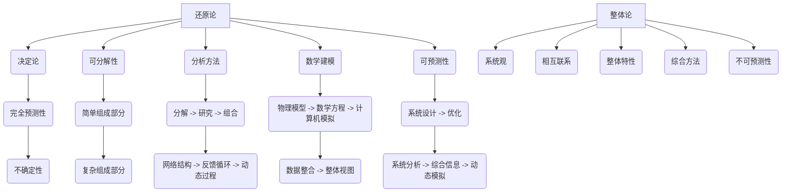

                 

### 引言

在探索复杂系统的过程中，我们往往需要从不同的角度和层次去理解世界。两种主要的理解路径，还原论和整体论，为我们提供了两种截然不同的世界观和方法论。还原论强调将复杂系统分解为基本组成部分，通过研究这些组成部分来理解整体系统的行为。而整体论则主张从整体系统的结构和功能出发，通过研究系统的各个组成部分如何相互作用来理解系统的整体特性。

#### 两种理解路径的起源与发展

还原论的起源可以追溯到古希腊哲学家亚里士多德，他认为事物可以通过分析其组成部分来理解。在现代科学中，还原论得到了进一步的发展，尤其是在物理学和化学领域。牛顿的经典力学和道尔顿的原子论都是还原论的重要代表。

整体论的起源可以追溯到古代哲学和中国传统医学，如《易经》和《黄帝内经》。在现代科学中，整体论在生物学、系统科学和复杂系统理论等领域得到了广泛的应用。例如，生态学中的生态系统理论和生物学中的系统生物学都是整体论的重要实例。

#### 哲学基础

还原论和整体论的哲学基础有所不同。还原论基于决定论和机械论的观点，认为复杂现象可以通过分析基本组成部分的相互作用来理解。整体论则强调非决定性和自组织现象，认为系统的整体特性不能简单地从其组成部分的行为推导出来。

#### 文章结构

本文将分为四个部分进行论述。第一部分将介绍还原论和整体论的起源与发展。第二部分将深入探讨还原论和整体论的核心概念。第三部分将分析还原论和整体论之间的关系和互补性。第四部分将探讨这两种方法论在科学和社会领域的应用。

通过本文的讨论，我们希望能够帮助读者更好地理解这两种不同的理解路径，并在实际应用中找到最佳的平衡点。

### 第一部分：引论

#### 第1章：还原论的起源与发展

**1.1 还原论的起源与发展**

还原论的起源可以追溯到古希腊哲学家亚里士多德，他在《形而上学》一书中提出了通过分析事物的组成部分来理解整体的思想。这种思想在后来的科学发展中被不断深化和扩展。

在中世纪，阿拉伯哲学家阿尔-法拉比和伊本·西那等人也对还原论进行了发展，他们将亚里士多德的思想应用于自然科学和医学领域。

现代科学中，还原论得到了进一步的发展，特别是在物理学和化学领域。牛顿的经典力学和道尔顿的原子论是还原论的代表性理论。牛顿通过研究物体的运动和引力，揭示了宏观世界的规律。而道尔顿则提出了原子论，认为物质是由不可分割的原子组成的。

20世纪初，量子力学的发展进一步推动了还原论的应用。量子力学揭示了微观世界的规律，使人们能够通过研究基本粒子来理解复杂物质的性质。

**1.2 还原论的基本原理**

还原论的核心思想是将复杂系统分解为基本组成部分，通过研究这些组成部分的相互作用来理解整体系统的行为。其基本原理包括：

- **决定论**：还原论认为，系统的行为可以通过其组成部分的相互作用来完全预测。
- **可分解性**：还原论假设复杂系统可以分解为更简单的组成部分。
- **分析方法**：还原论强调通过分析来理解系统的组成部分和行为。

**1.3 还原论的主要方法**

还原论的主要方法包括：

- **实验研究**：通过实验来观察和测量系统的组成部分和行为。
- **数学建模**：通过数学模型来描述系统的组成部分和相互作用。
- **计算机模拟**：通过计算机模拟来研究系统的行为和特性。

**1.4 还原论的应用领域**

还原论在多个科学领域得到了广泛的应用：

- **物理学**：在量子力学和相对论中，还原论被用来研究基本粒子和宇宙的规律。
- **化学**：在原子论和分子理论中，还原论被用来研究物质的组成和性质。
- **生物学**：在细胞学和分子生物学中，还原论被用来研究生物体的基本结构和功能。

**1.5 还原论的主要贡献者**

还原论的发展离不开许多杰出的科学家和哲学家的贡献，包括：

- **亚里士多德**：古希腊哲学家，提出了通过分析事物的组成部分来理解整体的思想。
- **牛顿**：经典力学的创始人，通过研究物体的运动和引力揭示了宏观世界的规律。
- **道尔顿**：原子论的提出者，认为物质是由不可分割的原子组成的。
- **爱因斯坦**：相对论的提出者，通过研究时空的相对性进一步推动了还原论的应用。

**1.6 还原论的优缺点**

还原论的优点包括：

- **简洁性**：通过分解复杂系统，还原论使问题变得更为简洁和易于理解。
- **可预测性**：还原论的基本原理使系统行为具有可预测性。
- **广泛适用性**：还原论在多个科学领域都有广泛的应用。

还原论的缺点包括：

- **局限性**：还原论可能无法完全解释复杂系统的行为，因为系统的整体特性不能简单地从其组成部分推导出来。
- **忽略相互作用**：还原论可能忽视组成部分之间的相互作用，导致对整体系统的理解不完整。

#### 第2章：整体论的起源与发展

**2.1 整体论的起源与发展**

整体论的起源可以追溯到古代哲学和中国传统医学，如《易经》和《黄帝内经》。这些哲学和医学理论强调从整体出发，通过研究系统的结构和功能来理解整体系统的行为。

在现代科学中，整体论得到了进一步的发展，尤其是在生物学、系统科学和复杂系统理论等领域。例如，生态系统理论和系统生物学都是整体论的重要实例。

**2.2 整体论的基本原理**

整体论的基本原理包括：

- **系统观**：整体论强调系统的整体性和整体的功能。
- **相互联系**：整体论认为系统的各个部分是相互联系和相互作用的。
- **整体特性**：整体论认为系统的整体特性不能简单地从其组成部分推导出来。

**2.3 整体论的主要方法**

整体论的主要方法包括：

- **系统分析**：通过研究系统的整体结构和功能来理解系统。
- **综合方法**：将不同部分的信息整合起来，形成一个整体的视图。
- **动态模拟**：通过计算机模拟来研究系统的动态行为。

**2.4 整体论的应用领域**

整体论在多个科学领域得到了广泛的应用：

- **生物学**：在生态系统和分子生物学中，整体论被用来研究生物体的整体结构和功能。
- **系统科学**：在系统工程和复杂系统理论中，整体论被用来研究复杂系统的行为。
- **心理学**：在认知心理学和人机交互中，整体论被用来研究人的认知和行为的整体特性。

**2.5 整体论的主要贡献者**

整体论的发展离不开许多杰出的科学家和哲学家的贡献，包括：

- **亚里士多德**：古希腊哲学家，提出了通过整体来理解事物的思想。
- **查尔斯·达尔文**：生物学家，通过自然选择和物种演化的观点，推动了整体论在生物学中的应用。
- **路德维希·冯·贝塔朗菲**：系统科学和生物学领域的奠基人，提出了“整体大于部分之和”的观点。

**2.6 整体论的优缺点**

整体论的优点包括：

- **完整性**：整体论提供了一个完整的系统视图，使问题变得更为全面和完整。
- **理解整体特性**：整体论有助于理解系统的整体特性，这对于设计复杂的系统和解决复杂问题非常重要。

整体论的缺点包括：

- **复杂性**：整体论需要处理大量的信息和复杂的相互作用，可能导致问题变得复杂和难以理解。
- **缺乏可预测性**：整体论可能无法提供像还原论那样明确的预测，因为系统的整体行为受到各种不确定因素的影响。

#### 第3章：还原论与整体论的哲学基础

**3.1 还原论的哲学基础**

还原论的哲学基础主要源于西方哲学中的决定论和机械论。决定论认为，世界是可预测的，系统的行为可以通过其组成部分的相互作用完全预测。机械论则认为，世界是由机械组成的，一切现象都可以通过物理定律来解释。

还原论强调通过分析系统的组成部分来理解整体系统的行为，这与西方哲学中强调分析和分解的思想相一致。亚里士多德和笛卡尔等哲学家的思想对还原论的形成起到了重要作用。

**3.2 整体论的哲学基础**

整体论的哲学基础则源于东方哲学和系统哲学。东方哲学中的整体观认为，世界是一个整体，各个部分是相互联系和相互作用的。系统哲学则强调系统的整体性和整体的功能。

整体论认为，系统的整体特性不能简单地从其组成部分推导出来，这与东方哲学中的整体大于部分之和的观点相一致。中国古代的《易经》和《黄帝内经》等哲学和医学著作对整体论的形成产生了深远影响。

**3.3 还原论与整体论的区别与联系**

还原论和整体论在哲学基础上有明显的区别。还原论强调决定论和机械论，认为系统的行为可以通过其组成部分的相互作用完全预测。整体论则强调非决定性和自组织现象，认为系统的整体特性不能简单地从其组成部分推导出来。

然而，还原论和整体论之间也存在联系。整体论可以被视为还原论的一种扩展，它将还原论的应用范围扩展到了复杂系统和复杂现象。同时，还原论的一些方法和思想也可以用于整体论的研究，例如实验研究和数学建模。

**3.4 还原论与整体论的关系图**

下面是一个简化的还原论与整体论的关系图：

```
        +-------------------+
        |      还原论       |
        +-------------------+
              |
              |
        +-------------------+
        |      整体论       |
        +-------------------+
              |
              |
        +-------------------+
        |  复杂系统理论    |
        +-------------------+
```

在这个关系图中，还原论和整体论都是复杂系统理论的组成部分。还原论通过分析系统的组成部分来理解系统，整体论则通过研究系统的整体结构和功能来理解系统。

#### 还原论与整体论的核心概念

**还原论**

还原论是一种方法论，它通过将复杂系统分解为基本组成部分，研究这些组成部分的相互作用来理解整体系统的行为。还原论的核心概念包括：

1. **决定论**：还原论认为，系统的行为可以通过其组成部分的相互作用完全预测。这意味着，如果我们知道系统的初始状态和所有组成部分的行为规则，我们就可以预测系统的未来状态。

2. **可分解性**：还原论假设复杂系统可以分解为更简单的组成部分。这些组成部分可以是物质的基本单位，如原子和分子，也可以是抽象的概念，如算法和模块。

3. **分析方法**：还原论强调通过分析来理解系统的组成部分和行为。分析的过程通常包括以下几个步骤：

   - **分解**：将复杂系统分解为更简单的组成部分。
   - **研究**：研究每个组成部分的行为和特性。
   - **组合**：将研究得到的组成部分重新组合，以理解整体系统的行为。

4. **数学建模**：还原论经常使用数学模型来描述系统的组成部分和相互作用。这些模型可以是物理模型、数学方程或者计算机模拟。

5. **可预测性**：还原论的一个关键特点是它的可预测性。通过研究系统的组成部分，我们可以预测整体系统的行为，从而进行设计和优化。

**整体论**

整体论是一种方法论，它强调系统的整体性和整体的功能，认为系统的整体特性不能简单地从其组成部分推导出来。整体论的核心概念包括：

1. **系统观**：整体论认为，系统是一个整体，各个部分是相互联系和相互作用的。整体论强调系统的整体结构和功能，而不是仅仅关注组成部分的行为。

2. **相互联系**：整体论认为，系统的各个部分是相互联系的，它们之间的相互作用对整体系统的行为有重要影响。整体论强调网络结构、反馈循环和动态过程。

3. **整体特性**：整体论认为，系统的整体特性不能简单地从其组成部分推导出来。这意味着，整体系统的行为可能具有新的特性，这些特性无法通过单独研究组成部分来理解。

4. **综合方法**：整体论强调通过综合方法来理解系统。这种方法包括：

   - **系统分析**：研究系统的整体结构和功能。
   - **综合信息**：将不同部分的信息整合起来，形成一个整体的视图。
   - **动态模拟**：通过计算机模拟来研究系统的动态行为。

5. **不可预测性**：整体论的一个特点是它的不可预测性。由于系统的复杂性和不确定性，整体系统的行为可能具有高度的不确定性，这使得预测整体系统的行为变得困难。

**核心概念之间的关系架构**

为了更好地理解还原论和整体论的核心概念，我们可以使用Mermaid流程图来展示它们之间的关系：



在这个流程图中，我们可以看到还原论和整体论的核心概念是如何相互关联的。还原论强调决定论和可分解性，通过分析方法和数学建模来获得可预测性。整体论则强调系统观和相互联系，通过综合方法来获得整体特性和不可预测性。

### 第三部分：还原论与整体论的互动与融合

#### 第4章：还原论与整体论的互动

**4.1 还原论与整体论的关系**

还原论和整体论在方法论上存在一定的互补性。还原论通过分解复杂系统来理解组成部分的行为，从而实现对整体系统的理解。而整体论则通过研究系统的整体结构和功能，来揭示系统的整体特性。这两种方法在科学研究和技术应用中各有优势，但往往需要结合起来使用，以获得更全面和准确的理解。

还原论与整体论的关系可以被视为一种“上下文关联”。在研究复杂系统时，我们首先可能需要使用还原论来理解系统的组成部分，然后通过整体论来理解系统的整体行为。这种“上下文关联”有助于我们在不同层次上理解系统，从而更好地解决复杂问题。

**4.2 还原论与整体论的互补性**

还原论与整体论的互补性体现在以下几个方面：

1. **优势互补**：还原论擅长在微观层面上分析系统的组成部分，从而提供详细的机制理解。而整体论则擅长在宏观层面上分析系统的整体结构和功能，从而提供全局视角。通过结合这两种方法，我们可以获得更加全面和准确的理解。

2. **视角补充**：还原论和整体论提供了不同的视角来研究系统。还原论侧重于组成部分的行为，而整体论侧重于系统的整体结构和功能。这种视角的补充有助于我们更全面地理解系统，从而发现新的问题和解决方案。

3. **相互验证**：还原论和整体论可以相互验证。通过还原论来理解系统的组成部分，我们可以验证整体论的理论假设。同样，通过整体论来理解系统的整体行为，我们可以验证还原论的理论假设。这种相互验证有助于提高研究的可信度和可靠性。

**4.3 还原论与整体论的综合应用**

在科学研究和技术应用中，还原论与整体论的综合应用可以带来显著的效益。以下是一些实例：

1. **复杂性科学**：在复杂性科学中，还原论和整体论的结合被广泛用于研究复杂系统。例如，在生态系统中，我们可以通过还原论来研究物种之间的相互作用，然后通过整体论来理解生态系统的整体结构和功能。

2. **系统生物学**：在系统生物学中，还原论和整体论的结合被用于研究生物体的分子机制和整体行为。例如，我们可以通过还原论来研究基因和蛋白质的功能，然后通过整体论来理解生物体的整体代谢网络和调控机制。

3. **人工智能**：在人工智能领域，还原论和整体论的结合被用于设计和优化机器学习算法。例如，我们可以通过还原论来研究神经网络的各个组件，然后通过整体论来优化整个神经网络的结构和参数。

**4.4 还原论与整体论的协同作用**

还原论与整体论的协同作用体现在以下几个方面：

1. **跨学科研究**：在跨学科研究中，还原论和整体论可以相互补充，帮助我们更好地理解复杂系统的跨学科特性。例如，在经济学和物理学的研究中，还原论和整体论的结合可以帮助我们理解经济系统的动态行为和物理机制。

2. **创新设计**：在创新设计中，还原论和整体论的协同作用可以帮助我们设计出更加高效和创新的系统。例如，在建筑设计中，我们可以通过还原论来研究材料的力学特性，然后通过整体论来优化建筑的结构和功能。

3. **问题解决**：在问题解决中，还原论和整体论的协同作用可以帮助我们找到更全面和有效的解决方案。例如，在解决社会问题时，我们可以通过还原论来分析问题的各个组成部分，然后通过整体论来理解问题的整体背景和影响。

总之，还原论和整体论在方法论上具有互补性，通过结合这两种方法，我们可以获得更全面和准确的理解，从而更好地解决复杂问题。在科学研究和技术应用中，还原论与整体论的协同作用具有广泛的应用前景。

#### 第5章：还原论与整体论在科学领域中的应用

**5.1 还原论在科学领域中的应用**

还原论在科学领域中的应用非常广泛，特别是在物理学、化学和生物学等基础科学中。以下是一些具体的应用实例：

1. **物理学**：在物理学中，还原论被广泛应用于研究基本粒子和宏观物体的行为。例如，在量子力学中，通过研究基本粒子的行为，我们可以理解原子和分子的性质。在经典力学中，通过研究物体的运动和相互作用，我们可以理解宏观世界的规律。

   **核心算法原理讲解：**
   
   - **量子力学**：量子力学中的薛定谔方程描述了微观粒子的行为，通过求解这个方程，我们可以得到粒子的能量态和概率分布。
   ```math
   \hat{H} \psi = E \psi
   ```
   其中，\(\hat{H}\) 是哈密顿算符，\(\psi\) 是波函数，\(E\) 是能量。
   
   - **经典力学**：牛顿运动定律描述了宏观物体的运动，通过这些定律，我们可以预测物体的运动轨迹。
   ```math
   F = ma
   ```
   其中，\(F\) 是力，\(m\) 是质量，\(a\) 是加速度。

   **数学模型和公式：**
   
   - **量子力学中的波函数**：波函数 \(\psi\) 描述了粒子的位置和动量概率分布。
   ```math
   \Psi(x, t) = \int \psi(x', t') \phi(x' - x) dx'
   ```
   其中，\(\phi(x')\) 是归一化函数，用于将波函数归一化。

   - **经典力学中的运动方程**：牛顿第二定律可以用于计算物体的加速度。
   ```math
   a(t) = \frac{F(t)}{m}
   ```

2. **化学**：在化学中，还原论被广泛应用于研究分子和原子的性质。通过分析分子和原子的结构，我们可以理解化学反应的机制和产物。

   **核心算法原理讲解：**
   
   - **分子轨道理论**：分子轨道理论描述了分子中的电子分布，通过求解哈特里-福克方程，我们可以得到分子的电子结构和能量。
   ```math
   \hat{H} \psi = E \psi
   ```
   其中，\(\hat{H}\) 是哈特里-福克算符，\(\psi\) 是电子波函数。

   - **化学反应动力学**：通过研究反应物和产物的能量变化，我们可以理解化学反应的速率和机制。

   **数学模型和公式：**
   
   - **分子轨道能量**：分子轨道能量可以通过自洽场理论计算。
   ```math
   E_{n} = \frac{1}{2} \left( E^2 - V^2 \right)
   ```
   其中，\(E\) 是哈特里-福克能量，\(V\) 是势能。

   - **反应速率方程**：通过速率方程，我们可以计算反应速率。
   ```math
   \frac{d[X]}{dt} = -k \cdot [X] [Y]
   ```

3. **生物学**：在生物学中，还原论被广泛应用于研究细胞和生物体的结构和功能。通过分析细胞和基因的功能，我们可以理解生物体的生命过程。

   **核心算法原理讲解：**
   
   - **基因调控网络**：通过研究基因调控网络，我们可以理解基因如何调控生物体的发育和功能。
   - **蛋白质折叠**：通过研究蛋白质的结构，我们可以理解蛋白质的功能。

   **数学模型和公式：**
   
   - **基因调控网络**：通过矩阵方程，我们可以计算基因的表达水平。
   ```math
   X = A \cdot X
   ```
   其中，\(X\) 是基因表达向量，\(A\) 是调控矩阵。

   - **蛋白质折叠**：通过能量最小化方法，我们可以计算蛋白质的结构。
   ```math
   E = \sum_{i,j} \frac{1}{2} \left( \epsilon_{ij} - \cos(\theta_{ij}) \right)^2
   ```
   其中，\(\epsilon_{ij}\) 是相互作用能，\(\theta_{ij}\) 是夹角。

**5.2 整体论在科学领域中的应用**

整体论在科学领域中的应用同样广泛，特别是在生态系统、复杂系统和系统生物学中。以下是一些具体的应用实例：

1. **生态系统**：在生态系统中，整体论被用于研究生物群落和生态过程。通过分析生态系统的整体结构和功能，我们可以理解生态平衡和物种演化的机制。

   **核心算法原理讲解：**
   
   - **生态系统动力学**：通过建立生态系统模型，我们可以模拟生态系统的动态行为。
   - **食物网分析**：通过分析食物网，我们可以理解物种之间的相互作用和能量流动。

   **数学模型和公式：**
   
   - **Lotka-Volterra 模型**：用于描述捕食者和猎物之间的相互作用。
   ```math
   \frac{dx}{dt} = a \cdot x - b \cdot x \cdot y
   \frac{dy}{dt} = -c \cdot y + d \cdot x \cdot y
   ```

2. **复杂系统**：在复杂系统中，整体论被用于研究系统的复杂行为和自组织现象。通过分析系统的整体结构和功能，我们可以理解复杂系统的涌现行为和稳定性。

   **核心算法原理讲解：**
   
   - **复杂网络理论**：通过分析复杂网络的拓扑结构和动态行为，我们可以理解系统的复杂特性。
   - **同步现象**：通过研究系统的同步现象，我们可以理解系统的协调和稳定机制。

   **数学模型和公式：**
   
   - **复杂网络模型**：通过随机游走模型，我们可以分析网络的拓扑特性。
   ```math
   P_{ij}(t+1) = \frac{1}{z} \sum_{k \in N} P_{ik}(t) \cdot W_{kj}
   ```
   其中，\(P_{ij}\) 是节点之间的转移概率，\(W_{kj}\) 是邻接矩阵。

   - **同步方程**：通过研究同步方程，我们可以理解系统的同步现象。
   ```math
   \dot{X}_i = -\sum_{j=1}^{N} (X_i - X_j) + F(X_i)
   ```

3. **系统生物学**：在系统生物学中，整体论被用于研究生物体的整体行为和系统特性。通过分析生物体的代谢网络和基因调控网络，我们可以理解生物体的生命过程。

   **核心算法原理讲解：**
   
   - **代谢网络分析**：通过分析代谢网络，我们可以理解生物体的能量代谢和物质转换。
   - **基因调控网络**：通过分析基因调控网络，我们可以理解生物体的发育和功能调控。

   **数学模型和公式：**
   
   - **代谢网络模型**：通过线性规划模型，我们可以优化生物体的能量代谢。
   ```math
   \max \ Z = c^T \cdot X
   \text{subject to} \ Ax \leq b
   ```
   其中，\(c^T\) 是目标函数，\(X\) 是变量，\(A\) 是系数矩阵，\(b\) 是常数向量。

   - **基因调控网络模型**：通过布尔网络模型，我们可以模拟基因调控网络的动态行为。
   ```math
   X_{t+1} = \sigma(A \cdot X_t)
   ```

**5.3 科学研究的还原论与整体论视角**

在科学研究中，还原论和整体论提供了不同的视角来理解复杂系统。以下是一些具体的实例：

1. **气候变化研究**：

   - **还原论视角**：通过研究大气中的气体成分和地球的物理过程，我们可以理解气候变化的原因和机制。
   - **整体论视角**：通过分析全球气候系统的整体结构和功能，我们可以预测未来的气候变化趋势。

2. **疾病研究**：

   - **还原论视角**：通过研究细胞和基因的功能，我们可以理解疾病的发病机制。
   - **整体论视角**：通过分析生物体的整体代谢网络和基因调控网络，我们可以理解疾病的整体行为和调控机制。

3. **社会问题研究**：

   - **还原论视角**：通过研究社会问题的各个组成部分，如经济、政治和文化，我们可以理解社会问题的原因和机制。
   - **整体论视角**：通过分析社会系统的整体结构和功能，我们可以理解社会问题的整体背景和影响。

通过结合还原论和整体论的视角，我们可以获得更全面和深入的理解，从而更好地解决复杂科学问题。

### 第四部分：还原论与整体论在社会领域中的应用

#### 第6章：还原论与社会领域中的应用

**6.1 还原论在社会领域中的应用**

还原论在社会领域中的应用主要包括对社会结构、个体行为和社会问题的分析。以下是一些具体的应用实例：

1. **社会结构分析**：

   - **核心算法原理讲解**：通过研究社会结构的基本组成部分，如家庭、组织和社区，我们可以理解社会结构的形成和演变。例如，社会网络分析（SNA）是一种常用的方法，用于研究社会网络的结构和功能。
   - **数学模型和公式**：社会网络分析中的基本模型包括度模型、随机图模型和生长模型。度模型描述了节点之间的连接关系，随机图模型描述了网络的结构特性，生长模型描述了网络的演变过程。
   ```math
   P_{ij} = \frac{k_i \cdot k_j}{m}
   ```
   其中，\(P_{ij}\) 是节点 \(i\) 和节点 \(j\) 之间连接的概率，\(k_i\) 和 \(k_j\) 是节点 \(i\) 和节点 \(j\) 的度，\(m\) 是网络中的边数。

2. **个体行为分析**：

   - **核心算法原理讲解**：通过研究个体行为的组成部分，如动机、认知和情感，我们可以理解个体行为的动机和影响。行为经济学是一种常用的方法，用于研究个体在经济决策中的行为。
   - **数学模型和公式**：行为经济学中的基本模型包括期望效用模型、决策树模型和贝叶斯更新模型。期望效用模型描述了个体在风险决策中的效用函数，决策树模型描述了个体在决策过程中的决策路径，贝叶斯更新模型描述了个体在不确定性情况下的决策过程。
   ```math
   EU(A) = \sum_{i} u(x_i) \cdot p(x_i | A)
   ```
   其中，\(EU(A)\) 是选择 \(A\) 的期望效用，\(u(x_i)\) 是结果 \(x_i\) 的效用，\(p(x_i | A)\) 是结果 \(x_i\) 在选择 \(A\) 下的概率。

3. **社会问题分析**：

   - **核心算法原理讲解**：通过研究社会问题的组成部分，如经济不平等、社会冲突和健康问题，我们可以理解社会问题的根源和影响。社会问题分析的方法包括结构功能分析、冲突理论和符号互动理论。
   - **数学模型和公式**：社会问题分析中的基本模型包括社会排斥模型、社会网络模型和社会动态模型。社会排斥模型描述了个体在社会中的排斥现象，社会网络模型描述了个体在社会网络中的地位和角色，社会动态模型描述了社会系统的发展趋势。
   ```math
   \Delta S(t+1) = S(t) + \alpha \cdot (I - S(t))
   ```
   其中，\(\Delta S(t+1)\) 是社会状态在 \(t+1\) 时刻的变化，\(S(t)\) 是社会状态在 \(t\) 时刻的值，\(\alpha\) 是变化率，\(I\) 是社会容量。

**6.2 整体论在社会领域中的应用**

整体论在社会领域中的应用主要包括对整体社会系统、社会关系和社会现象的分析。以下是一些具体的应用实例：

1. **整体社会系统分析**：

   - **核心算法原理讲解**：整体论通过研究社会系统的整体结构和功能，来理解社会的整体行为。例如，系统动力学方法是一种常用的方法，用于模拟社会系统的动态行为。
   - **数学模型和公式**：系统动力学方法中的基本模型包括流图模型、微分方程模型和差分方程模型。流图模型描述了社会系统中各个部分的相互作用，微分方程模型描述了社会系统的动态过程，差分方程模型描述了社会系统的离散时间动态过程。
   ```math
   \frac{dx}{dt} = f(x, y)
   \frac{dy}{dt} = g(x, y)
   ```
   其中，\(x\) 和 \(y\) 是社会系统的状态变量，\(f\) 和 \(g\) 是状态变量之间的函数关系。

2. **社会关系分析**：

   - **核心算法原理讲解**：整体论通过研究社会关系的整体结构和功能，来理解社会关系的动态行为。例如，社会网络分析方法是一种常用的方法，用于研究社会关系网络的结构和功能。
   - **数学模型和公式**：社会网络分析方法中的基本模型包括网络拓扑模型、概率模型和代数模型。网络拓扑模型描述了社会关系的拓扑结构，概率模型描述了社会关系的概率特性，代数模型描述了社会关系的代数特性。
   ```math
   C_{ij} = \frac{k_i \cdot k_j}{m}
   ```
   其中，\(C_{ij}\) 是节点 \(i\) 和节点 \(j\) 之间的相似度，\(k_i\) 和 \(k_j\) 是节点 \(i\) 和节点 \(j\) 的度，\(m\) 是网络中的边数。

3. **社会现象分析**：

   - **核心算法原理讲解**：整体论通过研究社会现象的整体结构和功能，来理解社会现象的动态行为。例如，社会模拟方法是一种常用的方法，用于模拟社会现象的演化过程。
   - **数学模型和公式**：社会模拟方法中的基本模型包括离散事件模拟模型、系统动力学模型和博弈论模型。离散事件模拟模型描述了社会现象中的离散事件过程，系统动力学模型描述了社会现象的动态行为，博弈论模型描述了社会现象中的决策和竞争过程。
   ```math
   \pi_{i} = \frac{1}{N} \sum_{j=1}^{N} u_{ij}
   ```
   其中，\(\pi_{i}\) 是节点 \(i\) 的策略分布，\(u_{ij}\) 是节点 \(i\) 和节点 \(j\) 之间的效用。

**6.3 社会问题的还原论与整体论视角**

在社会问题的研究中，还原论和整体论提供了不同的视角来理解社会问题。以下是一些具体的实例：

1. **经济不平等**：

   - **还原论视角**：通过研究经济不平等的各个组成部分，如收入分配、财富积累和劳动力市场，我们可以理解经济不平等的原因和机制。
   - **整体论视角**：通过分析整个经济系统的结构和功能，我们可以理解经济不平等的背景和影响。

2. **社会冲突**：

   - **还原论视角**：通过研究社会冲突的各个组成部分，如利益集团、意识形态和社会运动，我们可以理解社会冲突的原因和机制。
   - **整体论视角**：通过分析整个社会系统的结构和功能，我们可以理解社会冲突的整体背景和影响。

3. **健康问题**：

   - **还原论视角**：通过研究健康问题的各个组成部分，如疾病传播、医疗资源分配和公共卫生政策，我们可以理解健康问题的原因和机制。
   - **整体论视角**：通过分析整个健康系统的结构和功能，我们可以理解健康问题的整体背景和影响。

通过结合还原论和整体论的视角，我们可以获得更全面和深入的理解，从而更好地解决复杂社会问题。

### 第五部分：还原论与整体论的教育意义

#### 第7章：还原论与整体论在教育中的价值

**7.1 还原论在教育中的作用**

还原论在教育中的应用主要体现在对学习过程的理解和教学方法的设计。还原论强调通过分析学习过程的组成部分，如认知、记忆和动机，来理解整体的学习效果。以下是一些具体的应用：

1. **认知发展**：

   - **核心算法原理讲解**：通过分析认知过程的组成部分，如感知、注意和记忆，我们可以理解认知发展的机制。认知科学提供了许多模型和方法来描述这些过程，如知觉模型和记忆模型。
   - **数学模型和公式**：在认知科学中，常用的数学模型包括感知模型（如韦伯定律）和记忆模型（如艾宾浩斯遗忘曲线）。
   ```math
   d = k \cdot I
   ```
   其中，\(d\) 是感知差异，\(k\) 是感知灵敏度，\(I\) 是刺激强度。

2. **教学设计**：

   - **核心算法原理讲解**：通过分析教学过程的组成部分，如教学内容、教学方法和学生反馈，我们可以设计出更有效的教学方案。学习分析（Learning Analytics）是一种常用的方法，用于分析学生的学习行为和效果。
   - **数学模型和公式**：学习分析中的基本模型包括学习轨迹模型、行为预测模型和效果评估模型。
   ```math
   \text{Effectiveness} = f(\text{Content}, \text{Method}, \text{Feedback})
   ```

3. **学习评估**：

   - **核心算法原理讲解**：通过分析学习评估的组成部分，如考试、作业和课堂互动，我们可以评估整体的学习效果。学习评估方法包括标准化测试和个性化评估。
   - **数学模型和公式**：在评估中，常用的数学模型包括评分模型、置信度模型和风险模型。
   ```math
   \text{Score} = \alpha \cdot \text{Test} + \beta \cdot \text{Assignment} + \gamma \cdot \text{Class Interaction}
   ```

**7.2 整体论在教育中的作用**

整体论在教育中的应用主要体现在对教育系统的整体结构和功能的理解。整体论强调通过研究教育系统的整体结构和功能，来理解整体的教育效果。以下是一些具体的应用：

1. **课程设计**：

   - **核心算法原理讲解**：通过分析课程设计的组成部分，如课程目标、教学内容和教学方法，我们可以设计出更符合整体教育目标的教学课程。课程设计方法包括基于标准的课程设计和基于项目的课程设计。
   - **数学模型和公式**：在课程设计中，常用的数学模型包括目标模型、内容模型和方法模型。
   ```math
   \text{Course Design} = f(\text{Objective}, \text{Content}, \text{Method})
   ```

2. **教育评价**：

   - **核心算法原理讲解**：通过分析教育评价的组成部分，如评估标准、评估方法和评估结果，我们可以评估整体的教育效果。教育评价方法包括标准化评估和个性化评估。
   - **数学模型和公式**：在教育评价中，常用的数学模型包括评估模型、置信度模型和风险模型。
   ```math
   \text{Assessment} = f(\text{Standard}, \text{Method}, \text{Result})
   ```

3. **教育改革**：

   - **核心算法原理讲解**：通过分析教育改革的组成部分，如政策制定、课程实施和教师培训，我们可以推动整体的教育改革。教育改革方法包括基于数据的改革和基于实践的创新。
   - **数学模型和公式**：在教育改革中，常用的数学模型包括政策模型、实施模型和创新模型。
   ```math
   \text{Reform} = f(\text{Policy}, \text{Implementation}, \text{Innovation})
   ```

**7.3 教育实践的还原论与整体论视角**

在教育实践中，还原论和整体论提供了不同的视角来理解教育过程。以下是一些具体的实例：

1. **个性化教育**：

   - **还原论视角**：通过分析每个学生的认知特点和兴趣爱好，我们可以设计出个性化的教育方案。
   - **整体论视角**：通过分析整个教育系统的结构和功能，我们可以理解个性化教育的整体背景和影响。

2. **翻转课堂**：

   - **还原论视角**：通过分析教学过程的不同阶段，如课前预习、课中教学和课后作业，我们可以理解翻转课堂的实施机制。
   - **整体论视角**：通过分析整个教育系统的结构和功能，我们可以理解翻转课堂的整体背景和影响。

3. **学习共同体**：

   - **还原论视角**：通过分析学习共同体的组成部分，如成员互动、资源共享和目标设定，我们可以理解学习共同体的作用。
   - **整体论视角**：通过分析整个教育系统的结构和功能，我们可以理解学习共同体的整体背景和影响。

通过结合还原论和整体论的视角，我们可以获得更全面和深入的理解，从而更好地推动教育改革和实践。

### 第六部分：还原论与整体论的跨学科思考

#### 第8章：还原论与整体论的跨学科思考

**8.1 跨学科研究的还原论与整体论方法**

跨学科研究是一种将不同学科的理论、方法和工具结合起来的研究方式，旨在解决复杂、多维度的问题。在跨学科研究中，还原论与整体论方法的结合尤为重要。以下是一些具体的实例和方法：

1. **系统生物学**：

   - **还原论视角**：系统生物学通过分析基因、蛋白质和代谢途径等基本组成部分，来理解生物体的整体行为。例如，通过基因编辑技术，研究人员可以单独研究某个基因对生物体的影响。
   - **整体论视角**：系统生物学通过研究生物体的整体代谢网络和基因调控网络，来理解生物体的复杂行为。例如，通过系统建模和模拟，研究人员可以预测整个生物系统的行为。

2. **复杂系统科学**：

   - **还原论视角**：复杂系统科学通过分析复杂系统的基本组成部分，如网络节点和连接，来理解系统的行为。例如，通过网络分析，研究人员可以研究社交网络中的传播现象。
   - **整体论视角**：复杂系统科学通过研究复杂系统的整体结构和功能，来理解系统的动态行为。例如，通过建模和模拟，研究人员可以预测复杂系统的演化趋势。

**8.2 还原论与整体论在跨学科研究中的应用**

1. **气候变化研究**：

   - **还原论视角**：在气候变化研究中，还原论方法可以用于研究大气中的气体成分、海洋循环和陆地生态系统等组成部分。例如，通过气候模型，研究人员可以单独研究二氧化碳浓度变化对气候的影响。
   - **整体论视角**：在气候变化研究中，整体论方法可以用于分析全球气候系统的整体结构和功能。例如，通过全球气候模型，研究人员可以预测全球气候变化的整体趋势。

2. **人工智能**：

   - **还原论视角**：在人工智能研究中，还原论方法可以用于研究神经网络的基本组成部分，如神经元和权重。例如，通过深度学习算法，研究人员可以单独研究每个神经元对预测结果的影响。
   - **整体论视角**：在人工智能研究中，整体论方法可以用于分析整个机器学习系统的整体结构和功能。例如，通过模型评估方法，研究人员可以评估整个机器学习系统的性能。

**8.3 跨学科研究中的还原论与整体论融合**

在跨学科研究中，还原论与整体论的融合有助于解决复杂问题。以下是一些融合方法：

1. **多尺度分析**：

   - **还原论与整体论的融合**：通过在不同尺度上分析问题，结合还原论与整体论的方法。例如，在研究生态系统的过程中，可以在微观尺度上分析物种之间的相互作用，在宏观尺度上分析整个生态系统的动态行为。

2. **综合模型**：

   - **还原论与整体论的融合**：通过建立综合模型，结合还原论与整体论的方法。例如，在研究交通系统时，可以在微观尺度上分析车辆行为，在宏观尺度上分析整个交通网络的流量和拥堵现象。

3. **案例研究**：

   - **还原论与整体论的融合**：通过案例研究，结合还原论与整体论的方法。例如，在研究城市发展时，可以在微观尺度上分析城市社区的行为，在宏观尺度上分析整个城市的发展趋势。

总之，还原论与整体论在跨学科研究中的应用和融合，有助于我们更全面和深入地理解复杂问题，从而推动科学研究和技术创新。

### 第七部分：还原论与整体论的哲学意义

#### 第9章：还原论与整体论对人类认识世界的影响

**9.1 还原论与整体论对人类认识世界的影响**

还原论与整体论作为两种不同的方法论，对人类认识世界产生了深远的影响。还原论强调通过分析系统的基本组成部分来理解整体系统的行为，这种方法使得人类在理解自然界的规律方面取得了巨大的进步。例如，在物理学和化学领域，通过还原论，我们能够深入理解基本粒子的性质和化学反应的机制。然而，还原论也有其局限性，它可能无法完全解释复杂系统的整体行为，因为系统的整体特性往往不能简单地从其组成部分推导出来。

整体论则提供了一种不同的视角，它强调系统的整体结构和功能，认为系统的整体特性不能简单从其组成部分推导出来。这种方法在生物学、生态系统学和复杂系统理论等领域发挥了重要作用。整体论帮助我们理解复杂系统的动态行为和自组织现象，例如，在生态学中，整体论使我们能够理解生态系统的稳定性和物种多样性。

**9.2 还原论与整体论在哲学领域的应用**

还原论与整体论在哲学领域有着丰富的应用。在认识论上，还原论强调通过分析基本组成部分来理解整体系统，这与理性主义和实证主义的哲学观点相一致。而整体论则强调系统的整体性和非决定性，这与存在主义和现象学的哲学观点相契合。

在伦理学上，还原论与整体论也提供了不同的视角。还原论关注个体权利和利益，而整体论则强调社会整体利益和共同福祉。这种差异在环境伦理学、社会正义和政治哲学中尤为明显。

**9.3 还原论与整体论的未来发展趋势**

随着科学技术的进步，还原论与整体论在未来将继续发展并相互融合。在科学研究中，跨学科研究将越来越多地采用还原论与整体论相结合的方法，以解决复杂问题。例如，在气候变化研究中，通过结合还原论与整体论的方法，我们可以更全面地理解气候变化的原因和影响。

在教育领域，还原论与整体论的结合有助于设计更有效的教学方法和课程。通过分析学习过程的组成部分（还原论）和整体结构（整体论），我们可以开发出更符合学生认知特点的教学模式。

在技术领域，还原论与整体论的融合将推动人工智能和复杂系统技术的发展。通过结合还原论的方法来研究算法和机器学习的各个组成部分，同时采用整体论的方法来优化系统的整体性能和稳定性，我们可以开发出更加高效和智能的技术系统。

总之，还原论与整体论作为两种不同的方法论，将继续在科学、哲学和技术领域发挥重要作用。随着人类对世界认识的不断深入，这两种方法将在未来实现更加紧密的融合，为解决复杂问题提供新的思路和工具。

### 附录

#### 附录A：还原论与整体论研究工具与资源

在研究还原论与整体论时，使用合适的工具和资源是非常重要的。以下是一些常用的工具和资源：

1. **数学建模软件**：
   - **MATLAB**：用于数学建模和数据分析。
   - **Python**：Python是一种通用编程语言，广泛应用于数据分析、机器学习和科学计算。

2. **科学计算软件**：
   - **Mathematica**：用于数学计算和符号计算。
   - **Maple**：用于数学建模和符号计算。

3. **仿真软件**：
   - **Simulink**：用于系统仿真和建模。
   - **AnyLogic**：用于复杂系统仿真和建模。

4. **文献数据库**：
   - **Google Scholar**：用于搜索学术文献。
   - **PubMed**：用于生物学和医学领域的研究文献。
   - **IEEE Xplore**：用于工程和计算机科学领域的文献。

5. **在线课程与资源**：
   - **Coursera**：提供各种在线课程，包括数学、物理、计算机科学等。
   - **edX**：提供免费的在线课程，涵盖多个学科领域。
   - **Khan Academy**：提供免费的教育视频和练习题，适合自学。

#### 附录B：还原论与整体论案例分析

以下是一些还原论与整体论在科学研究和技术应用中的案例分析：

1. **案例一：生态系统研究**
   - **还原论视角**：通过分析生态系统的组成部分，如物种、生境和能量流动，研究人员可以理解每个部分的功能和相互作用。
   - **整体论视角**：通过研究生态系统的整体结构和功能，如物种多样性、生态系统稳定性和生态位，研究人员可以理解生态系统的整体行为。

2. **案例二：人工智能研究**
   - **还原论视角**：通过分析神经网络的基本组成部分，如神经元和权重，研究人员可以理解每个组成部分对模型性能的影响。
   - **整体论视角**：通过研究整个机器学习系统的结构和功能，如数据预处理、模型训练和评估，研究人员可以理解系统的整体性能。

3. **案例三：气候变化研究**
   - **还原论视角**：通过分析大气中的气体成分、海洋循环和陆地生态系统，研究人员可以理解每个组成部分对气候的影响。
   - **整体论视角**：通过研究全球气候系统的整体结构和功能，如温室效应、气候模式和极端天气事件，研究人员可以理解气候变化的整体趋势。

#### 附录C：还原论与整体论研究方法总结

以下是对还原论与整体论研究方法的总结：

1. **还原论研究方法**：
   - **分解**：将复杂系统分解为基本组成部分。
   - **分析**：研究每个组成部分的行为和特性。
   - **组合**：将分析结果重新组合，以理解整体系统的行为。

2. **整体论研究方法**：
   - **系统分析**：研究系统的整体结构和功能。
   - **综合**：将不同部分的信息整合起来，形成一个整体的视图。
   - **动态模拟**：通过计算机模拟研究系统的动态行为。

3. **融合方法**：
   - **多尺度分析**：在不同尺度上分析问题，结合还原论与整体论的方法。
   - **综合模型**：建立综合模型，结合还原论与整体论的方法。
   - **案例研究**：通过案例研究，结合还原论与整体论的方法。

通过这些工具和资源，研究人员可以更有效地进行还原论与整体论的研究。案例分析和研究方法总结为科学家提供了实用的指导，帮助他们更好地理解和应用这两种方法论。

