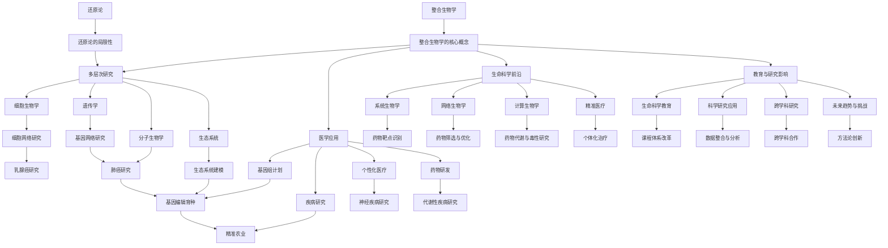

                 

### 文章标题

从还原论到整合生物学：全方位理解生命与世界

> 关键词：还原论、整合生物学、生命科学、复杂性、系统思维

> 摘要：本文探讨了从还原论到整合生物学的转变，分析了两种方法论在理解生命与世界方面的优劣。通过梳理整合生物学的发展历程、核心概念和应用领域，本文旨在揭示整合生物学如何帮助我们更全面地理解复杂系统，从而推动生命科学的发展。

----------------------------------------------------------------

### 目录大纲

1. 引言与背景
   1.1 书籍主题与目标
   1.2 还原论与整合生物学的对比
   1.3 整合生物学的历史与发展
   1.4 读者对象与阅读建议

2. 还原论基础
   2.1 还原论的概念与特点
   2.2 还原论的起源与发展
   2.3 还原论的方法与应用
   2.4 还原论的局限性

3. 整合生物学核心概念
   3.1 整合生物学的定义与目标
   3.2 整合生物学的核心概念
   3.3 整合生物学的理论与方法
   3.4 整合生物学的应用领域

4. 整合生物学的多层次研究
   4.1 细胞生物学与整合生物学
   4.2 遗传学与整合生物学
   4.3 分子生物学与整合生物学
   4.4 生态系统与整合生物学

5. 整合生物学在医学中的应用
   5.1 人类基因组计划与整合生物学
   5.2 疾病的整合生物学研究
   5.3 个性化医疗与整合生物学
   5.4 药物研发与整合生物学

6. 整合生物学与生命科学前沿
   6.1 系统生物学与整合生物学
   6.2 网络生物学与整合生物学
   6.3 计算生物学与整合生物学
   6.4 精准医疗与整合生物学

7. 整合生物学在教育与研究中的影响
   7.1 整合生物学对生命科学教育的影响
   7.2 整合生物学在科学研究中的应用
   7.3 整合生物学与跨学科研究
   7.4 整合生物学的未来趋势与挑战

8. 案例分析与应用实践
   8.1 案例一：癌症研究的整合生物学方法
   8.2 案例二：生态系统的整合生物学研究
   8.3 案例三：个性化营养与整合生物学
   8.4 案例四：整合生物学在农业中的应用

9. 总结与展望
   9.1 整合生物学的重要性与意义
   9.2 整合生物学的未来发展趋势
   9.3 整合生物学对人类社会的影响
   9.4 整合生物学的发展挑战与对策

10. 附录
    10.1 整合生物学相关术语与概念
    10.2 整合生物学常用工具与资源
    10.3 参考文献

### 引言与背景

在科学的发展历程中，不同的方法论和思维方式为我们理解自然世界提供了不同的视角。从古代的观察与经验，到近代的实验与测量，再到现代的计算与模拟，科学家们不断探索、积累和总结，逐步构建了一个庞大的知识体系。然而，在科学的发展过程中，也出现了两种主要的思维模式：还原论和整合生物学。

#### 1.1 书籍主题与目标

本文旨在探讨从还原论到整合生物学的转变，分析两种方法论在理解生命与世界方面的优劣。还原论强调通过分解复杂系统来研究其组成部分，而整合生物学则主张从整体和系统层面来理解复杂现象。通过梳理整合生物学的发展历程、核心概念和应用领域，本文旨在揭示整合生物学如何帮助我们更全面地理解复杂系统，从而推动生命科学的发展。

#### 1.2 还原论与整合生物学的对比

还原论（Reductionism）是一种科学方法论，主张通过将复杂系统分解为更简单的组成部分，从而理解整个系统的行为和性质。还原论的核心思想是，复杂系统的行为可以通过其组成部分的相互作用来解释。例如，在物理学中，通过研究基本粒子（如电子、质子、中子等）的性质和相互作用，我们可以理解物质的组成和行为。还原论在科学研究中发挥了重要作用，推动了人类对自然世界的认识。

然而，还原论也存在一定的局限性。首先，还原论往往忽略了组成部分之间的相互作用和整体性，从而可能无法全面解释复杂系统的行为。其次，还原论在处理高度复杂和动态的系统时，可能会遇到计算和理论的瓶颈。因此，在生命科学等领域，还原论的方法可能不再足够有效。

与之相对，整合生物学（Integrative Biology）主张从整体和系统层面来理解生命现象。整合生物学强调生物体各个组成部分之间的相互作用和协调，认为生命现象是一个复杂系统的整体表现。整合生物学的目标是理解生命系统在不同层次上的运作机制，包括细胞、组织、器官和生态系统等。通过整合不同的学科和领域，整合生物学试图揭示生命现象的内在联系和整体规律。

#### 1.3 整合生物学的历史与发展

整合生物学的概念最早可以追溯到20世纪初，当时生物学家开始意识到，单一学科的方法难以解释复杂的生命现象。20世纪50年代，随着分子生物学的兴起，整合生物学的理念得到了进一步发展。分子生物学的研究成果揭示了生物体内的基因、蛋白质和代谢途径等基本组成部分，为整合生物学提供了丰富的数据基础。

进入21世纪，随着计算生物学、系统生物学等新学科的发展，整合生物学的应用范围不断扩大。整合生物学不仅关注生命系统内部的相互作用，还关注生命系统与外部环境之间的相互作用。通过整合不同学科的知识和工具，整合生物学为理解生命现象提供了新的视角和方法。

#### 1.4 读者对象与阅读建议

本文主要面向对生命科学和整合生物学感兴趣的读者，包括生物学、医学、计算机科学等领域的科研人员、学生和爱好者。本文力求以通俗易懂的语言，系统地介绍整合生物学的基本概念、研究方法和应用领域。通过本文的阅读，读者可以了解到整合生物学在理解生命现象和推动科学研究方面的优势和价值。

对于想要深入了解整合生物学的读者，建议首先掌握生物学和计算机科学的基本知识，然后逐步了解整合生物学的核心概念和研究方法。在实际研究中，可以结合具体的案例和项目，深入探讨整合生物学在不同领域中的应用。

总之，从还原论到整合生物学的转变，为我们理解生命与世界提供了新的视角和方法。通过整合不同的学科和领域，整合生物学有助于我们更全面地认识复杂系统，从而推动生命科学的发展。希望本文能够为读者提供一个有益的参考和启示。-------------------------------------------------------------------

### 第1章：引言与背景

#### 1.1 书籍主题与目标

《从还原论到整合生物学：全方位理解生命与世界》这本书的目的是探讨从还原论到整合生物学的转变，分析两种方法论在理解生命与世界方面的优劣，以及整合生物学如何帮助我们更全面地理解复杂系统，推动生命科学的发展。还原论是一种将复杂系统分解为更简单的组成部分来理解其行为的方法，而整合生物学则强调从整体和系统层面来研究生命现象。通过梳理整合生物学的发展历程、核心概念和应用领域，本书旨在为读者提供一个系统的理解框架，帮助他们更好地把握生命科学的本质。

#### 1.2 还原论与整合生物学的对比

还原论（Reductionism）和整合生物学（Integrative Biology）是两种不同的方法论，它们在理解生命现象方面各有优劣。

还原论主张将复杂系统分解为更简单的组成部分，通过研究这些组成部分的性质和相互作用来理解复杂系统的行为。这种方法在物理学、化学等领域取得了显著成果。然而，还原论在面对生命科学这一复杂系统时，可能面临以下局限性：

1. **忽略整体性**：还原论往往忽略了组成部分之间的相互作用和整体性，这可能导致对复杂系统行为的误解。
2. **计算和理论瓶颈**：对于高度复杂和动态的系统，还原论的方法可能无法提供有效的解释，因为计算和理论上的瓶颈难以克服。
3. **研究层次局限**：还原论倾向于关注较低层次的结构和功能，而可能忽视更高层次的整体行为。

与之相对，整合生物学主张从整体和系统层面来理解生命现象。整合生物学认为，生命现象是一个复杂系统的整体表现，强调生物体各个组成部分之间的相互作用和协调。整合生物学的优势在于：

1. **强调整体性**：整合生物学能够更全面地理解生命现象，因为它关注生物体不同层次之间的相互作用。
2. **跨学科整合**：整合生物学通过整合不同学科的知识和工具，提供了更全面的研究方法。
3. **系统思维**：整合生物学倡导系统思维，有助于我们更深入地理解复杂系统的运作机制。

#### 1.3 整合生物学的历史与发展

整合生物学的发展历程可以追溯到20世纪初。当时，生物学家开始意识到，单一学科的方法难以解释复杂的生命现象。例如，1905年，德国生物学家恩斯特·海克尔（Ernst Haeckel）提出了“整体生物学”（Holism）的概念，强调生物体作为一个整体进行研究和理解。

20世纪50年代，随着分子生物学的兴起，整合生物学的理念得到了进一步发展。分子生物学的研究揭示了生物体内的基因、蛋白质和代谢途径等基本组成部分，为整合生物学提供了丰富的数据基础。在这一时期，生物学家开始尝试将不同层次的生物学知识整合起来，形成了初步的整合生物学体系。

进入21世纪，随着计算生物学、系统生物学等新学科的发展，整合生物学的应用范围不断扩大。整合生物学不仅关注生命系统内部的相互作用，还关注生命系统与外部环境之间的相互作用。通过整合不同学科的知识和工具，整合生物学为理解生命现象提供了新的视角和方法。

#### 1.4 读者对象与阅读建议

本书主要面向对生命科学和整合生物学感兴趣的读者，包括生物学、医学、计算机科学等领域的科研人员、学生和爱好者。本书力求以通俗易懂的语言，系统地介绍整合生物学的基本概念、研究方法和应用领域。

对于初学者，建议首先掌握生物学和计算机科学的基本知识，然后逐步了解整合生物学的核心概念和研究方法。在实际研究中，可以通过阅读相关的论文、书籍和参加学术会议，深入了解整合生物学在不同领域中的应用。

对于有一定基础的读者，本书提供了详细的案例分析和应用实践，可以帮助读者更深入地理解整合生物学的原理和方法。此外，本书还讨论了整合生物学在教育与研究中的影响，以及未来的发展趋势和挑战。

总之，本书旨在为读者提供一个系统的整合生物学知识框架，帮助读者更好地理解生命科学的本质，从而推动生命科学的发展。希望本书能够为读者的学习和研究提供有益的参考和启示。-------------------------------------------------------------------

### 第2章：还原论基础

#### 2.1 还原论的概念与特点

还原论（Reductionism）是一种哲学和科学方法论，主张通过将复杂系统分解为更简单的组成部分来理解其行为和性质。还原论的基本思想是，复杂系统的行为可以通过其组成部分的相互作用来解释。这种方法在科学研究中得到了广泛应用，特别是在物理学、化学和生物学等学科中。

还原论的核心特点包括：

1. **分解复杂性**：还原论强调将复杂系统分解为更简单的组成部分，以便更好地理解和研究。这种方法有助于简化问题，降低复杂性，从而更容易找到解决问题的途径。
2. **层次分析**：还原论认为，复杂系统可以分为不同的层次，每个层次都有其特定的规律和特性。通过逐层分析，我们可以逐步理解复杂系统的运作机制。
3. **部分与整体的关系**：还原论认为，整体的行为可以通过其组成部分的性质和相互作用来解释。尽管整体可能具有新的特性，但仍然可以通过研究组成部分来理解。

#### 2.2 还原论的起源与发展

还原论的起源可以追溯到古希腊哲学，特别是在亚里士多德（Aristotle）的著作中。亚里士多德认为，通过对事物的分解和分类，可以更好地理解自然界的规律。在中世纪和文艺复兴时期，这种思想继续得到发展和传承。

近代以来，还原论在科学研究中得到了广泛的应用。17世纪的物理学革命，特别是牛顿（Isaac Newton）的经典力学体系，奠定了还原论的基础。牛顿通过研究物体的运动规律，揭示了宏观世界的运行机制。随后，物理学、化学和生物学等学科相继采用还原论的方法，推动了科学的发展。

在生物学领域，还原论的方法得到了广泛应用。例如，在分子生物学的研究中，科学家通过研究DNA、蛋白质和代谢途径等基本组成部分，揭示了生物体的遗传机制和生命过程。

#### 2.3 还原论的方法与应用

还原论的方法主要包括以下几个步骤：

1. **问题分解**：将复杂的问题分解为更简单的子问题，以便更好地理解和解决。
2. **组成部分分析**：研究组成部分的性质、功能和相互作用，以便理解复杂系统的行为。
3. **层次构建**：将组成部分按照不同的层次进行组织和构建，从而理解复杂系统的结构和功能。
4. **综合解释**：将组成部分的分析结果综合起来，形成一个对复杂系统的全面解释。

还原论在科学研究中的应用非常广泛。例如，在物理学中，通过研究基本粒子和基本力，我们可以理解物质的性质和行为。在化学中，通过研究分子和原子的性质，我们可以理解化学反应的机理。在生物学中，通过研究细胞、组织和器官等组成部分，我们可以理解生物体的结构和功能。

#### 2.4 还原论的局限性

尽管还原论在科学研究中发挥了重要作用，但它也存在一定的局限性：

1. **忽略整体性**：还原论往往忽略了组成部分之间的相互作用和整体性，这可能导致对复杂系统行为的误解。
2. **计算和理论瓶颈**：对于高度复杂和动态的系统，还原论的方法可能无法提供有效的解释，因为计算和理论上的瓶颈难以克服。
3. **研究层次局限**：还原论倾向于关注较低层次的结构和功能，而可能忽视更高层次的整体行为。

为了克服这些局限性，科学家们开始探索新的方法论，如整合生物学，它强调从整体和系统层面来理解复杂系统。整合生物学通过跨学科整合，提供了更全面的研究方法，有助于我们更好地理解生命现象。尽管还原论和整合生物学之间存在一定的对立，但两者并不是互相排斥的，而是可以相互补充。在科学研究过程中，我们可以根据问题的性质和需求，灵活运用还原论和整合生物学的方法，从而更全面地理解复杂系统。

### 2.5 还原论与整合生物学的比较

还原论和整合生物学是两种不同的方法论，它们在理解生命现象方面各有优劣。

**还原论的优点：**

1. **分解复杂性**：还原论通过将复杂系统分解为更简单的组成部分，有助于简化问题，降低复杂性。
2. **层次分析**：还原论强调层次分析，有助于我们理解复杂系统的结构和功能。
3. **可操作性**：还原论的方法具有可操作性，便于实验验证和理论建模。

**还原论的缺点：**

1. **忽略整体性**：还原论往往忽略了组成部分之间的相互作用和整体性，可能导致对复杂系统行为的误解。
2. **计算和理论瓶颈**：对于高度复杂和动态的系统，还原论的方法可能无法提供有效的解释。
3. **研究层次局限**：还原论倾向于关注较低层次的结构和功能，而可能忽视更高层次的整体行为。

**整合生物学的优点：**

1. **强调整体性**：整合生物学从整体和系统层面来理解生命现象，有助于我们更全面地认识复杂系统。
2. **跨学科整合**：整合生物学通过跨学科整合，提供了更全面的研究方法。
3. **系统思维**：整合生物学倡导系统思维，有助于我们更深入地理解复杂系统的运作机制。

**整合生物学的缺点：**

1. **复杂度高**：整合生物学的跨学科整合可能导致研究复杂度增加，难以操作和验证。
2. **理论瓶颈**：整合生物学在理论层面可能面临一些瓶颈，难以提供简洁的数学模型。
3. **实践挑战**：整合生物学的应用需要跨学科合作，可能面临合作难度和沟通障碍。

总之，还原论和整合生物学各有优劣，在科学研究中可以根据问题的性质和需求，灵活运用两者，以更全面地理解生命现象。

### 2.6 还原论的案例分析

为了更好地理解还原论在科学研究中的应用，我们可以通过一些具体的案例来进行分析。

**案例一：分子生物学**

在分子生物学中，还原论的方法被广泛应用于基因和蛋白质的研究。例如，科学家们通过分离和纯化DNA、RNA和蛋白质，研究它们的结构和功能。通过研究单个基因或蛋白质的作用，科学家们揭示了生物体的遗传机制和生命过程。这种方法有助于我们理解生物体的基本组成部分，为生命科学的发展奠定了基础。

**案例二：细胞生物学**

在细胞生物学中，还原论的方法也被广泛应用于细胞结构和功能的研究。例如，科学家们通过研究细胞器（如线粒体、内质网等）的组成和功能，揭示了细胞的运作机制。通过分离和纯化细胞组分，科学家们可以更好地理解细胞的功能和代谢途径。这种方法有助于我们深入理解细胞的结构和功能，为疾病研究和治疗提供了重要线索。

**案例三：医学研究**

在医学研究中，还原论的方法被广泛应用于疾病机制的研究和药物开发。例如，科学家们通过研究特定基因或蛋白质与疾病的关系，揭示了疾病的分子基础。通过分离和纯化疾病相关分子，科学家们可以开发出针对这些分子的药物。这种方法有助于我们理解疾病的机制，为疾病治疗提供了新的思路。

通过这些案例，我们可以看到还原论在科学研究中的重要性和应用价值。尽管还原论存在一定的局限性，但它为我们理解生命现象提供了重要的方法和工具。在科学研究中，我们可以根据问题的性质和需求，灵活运用还原论和整合生物学的方法，以更全面地理解复杂系统。

### 2.7 还原论的总结

还原论作为一种哲学和科学方法论，在科学研究中的应用具有重要意义。它通过将复杂系统分解为更简单的组成部分，有助于我们理解复杂系统的行为和性质。还原论的方法具有分解复杂性、层次分析和可操作性的优点，在生物学、医学等领域的应用广泛。然而，还原论也存在一定的局限性，如忽略整体性、计算和理论瓶颈以及研究层次局限。为了克服这些局限性，科学家们开始探索新的方法论，如整合生物学。整合生物学强调从整体和系统层面来理解复杂系统，通过跨学科整合，提供了更全面的研究方法。尽管还原论和整合生物学之间存在一定的对立，但两者并不是互相排斥的，而是可以相互补充。在科学研究中，我们可以根据问题的性质和需求，灵活运用还原论和整合生物学的方法，以更全面地理解复杂系统。

### 第3章：整合生物学核心概念

#### 3.1 整合生物学的定义与目标

整合生物学（Integrative Biology）是一门跨学科的研究领域，旨在通过综合不同层次和不同领域的生物学知识，从整体和系统层面理解生命现象。整合生物学的核心目标是揭示生物体各个组成部分之间的相互作用和整体性，从而提供对生命现象的全面解释。

整合生物学的定义可以从以下几个方面来理解：

1. **跨学科整合**：整合生物学强调跨学科整合，包括分子生物学、细胞生物学、遗传学、发育生物学、生态学等不同领域的研究成果，以便从多角度、多层次理解生命现象。
2. **系统思维**：整合生物学倡导系统思维，认为生命现象是一个复杂系统的整体表现，通过研究各个组成部分之间的相互作用和整体性，可以更深入地理解生命现象。
3. **多层次研究**：整合生物学关注不同层次的生命现象，从分子、细胞、器官到生态系统，通过研究不同层次之间的相互作用，揭示生命现象的内在联系和整体规律。

整合生物学的目标主要包括：

1. **揭示生命现象的内在规律**：通过整合不同层次和领域的生物学知识，揭示生命现象的内在规律和机制，为生命科学的发展提供新的理论框架。
2. **推动生物技术的发展**：整合生物学为生物技术的应用提供了新的思路和方法，如基因编辑、合成生物学、系统生物学等，推动了生物技术的快速发展。
3. **促进跨学科合作**：整合生物学促进了不同学科之间的交流与合作，促进了科学研究的深度和广度。

#### 3.2 整合生物学的核心概念

整合生物学涉及一系列核心概念，这些概念构成了其理论基础和研究框架。以下是一些重要的核心概念：

1. **系统复杂性**：系统复杂性是整合生物学的核心概念之一，指生物系统在各个层次上的复杂性和多样性。整合生物学通过研究系统复杂性，揭示生物系统的整体行为和规律。
2. **网络动力学**：网络动力学是研究生物系统中各个组成部分（如分子、细胞、组织等）之间的相互作用和动态变化。整合生物学通过网络动力学方法，研究生物系统的稳定性和适应性。
3. **模块化**：模块化是指生物系统中的组成部分（如基因、蛋白质、细胞等）通过相互作用形成功能模块。整合生物学通过研究模块化，揭示生物系统的功能和演化规律。
4. **反馈与调控**：反馈与调控是生物系统中常见的一种机制，通过反馈信号和调控机制，维持系统的稳定性和适应性。整合生物学通过研究反馈与调控机制，揭示生物系统的自我调节能力。
5. **生态系统整合**：生态系统整合是指将生命系统置于生态系统背景下，研究生物系统与外部环境之间的相互作用。整合生物学通过生态系统整合，研究生物系统的适应性和生态系统功能。

#### 3.3 整合生物学的理论与方法

整合生物学的发展离不开一系列理论和方法的支持。以下是一些重要的理论和研究方法：

1. **系统生物学**：系统生物学是整合生物学的一个重要分支，通过数学模型、计算模拟和实验验证等方法，研究生物系统的动态行为和调控机制。
2. **网络生物学**：网络生物学研究生物系统中各个组成部分之间的相互作用网络，揭示生物系统的功能和调控机制。
3. **计算生物学**：计算生物学利用计算机技术和算法，分析生物数据，揭示生物系统的结构和功能。
4. **多尺度模拟**：多尺度模拟是指在不同尺度（如分子、细胞、器官等）上模拟生物系统的行为，揭示不同尺度之间的相互作用和整体行为。
5. **多组学整合**：多组学整合是指整合基因组学、转录组学、蛋白质组学、代谢组学等多层次的数据，揭示生物系统的整体规律。

通过这些理论和方法的综合应用，整合生物学能够更全面地理解生命现象，推动生命科学的发展。

#### 3.4 整合生物学的应用领域

整合生物学在多个领域都有广泛的应用，以下是一些重要的应用领域：

1. **医学研究**：整合生物学在医学研究中发挥了重要作用，通过研究疾病的分子机制和系统特性，为疾病诊断、治疗和预防提供了新的思路和方法。
2. **农业研究**：整合生物学在农业研究中应用于作物遗传改良、病虫害防治和农业生态系统的可持续管理，提高了农业生产效率和生态保护水平。
3. **生物技术**：整合生物学为生物技术的应用提供了新的工具和方法，如基因编辑、合成生物学和系统生物学等，推动了生物技术的发展和应用。
4. **环境保护**：整合生物学在环境保护领域应用于生态系统评估、生态修复和生物多样性保护，为环境保护提供了科学依据和技术支持。
5. **药物研发**：整合生物学在药物研发中应用于药物靶点识别、药物作用机制研究和药物筛选，提高了药物研发的效率和质量。

通过这些应用，整合生物学为解决生命科学和生物技术领域中的重大问题提供了有力支持。

总之，整合生物学通过跨学科整合和系统思维，为理解生命现象提供了新的视角和方法。其核心概念、理论与方法以及广泛应用领域，使整合生物学成为生命科学研究中不可或缺的一部分。通过不断发展和完善整合生物学，我们将能够更全面地理解生命现象，推动生命科学的发展。

### 3.5 整合生物学与还原论的对比

整合生物学（Integrative Biology）和还原论（Reductionism）是两种不同的方法论，它们在理解生命现象方面各有优势和局限性。以下是对两者进行对比：

**对比1：研究层次**

- **还原论**：还原论强调将复杂系统分解为更简单的组成部分，通过逐层分析来理解系统的行为。它倾向于关注较低层次的结构和功能，如分子、细胞和组织等。
- **整合生物学**：整合生物学则从整体和系统层面来研究生命现象，关注不同层次之间的相互作用和整体性。它不仅关注低层次的结构和功能，还关注高层次的整体行为和系统特性。

**对比2：研究方法**

- **还原论**：还原论采用的方法主要是分解和层次分析。它通过研究各个组成部分的性质和相互作用，逐步揭示复杂系统的行为和机制。
- **整合生物学**：整合生物学则采用跨学科整合的方法，通过整合不同层次和不同领域的生物学知识，建立系统模型和计算模拟，以全面理解生命现象。

**对比3：整体性与局部性**

- **还原论**：还原论倾向于局部性，即通过研究组成部分来解释复杂系统的行为。它可能忽略组成部分之间的相互作用和整体性，导致对复杂系统行为的误解。
- **整合生物学**：整合生物学强调整体性，认为生命现象是一个复杂系统的整体表现。它通过研究组成部分之间的相互作用和整体性，提供对复杂系统的全面解释。

**对比4：应用领域**

- **还原论**：还原论在生物学、物理学和化学等学科中得到了广泛应用，特别是在分子生物学、细胞生物学和医学研究等领域。
- **整合生物学**：整合生物学则广泛应用于医学研究、农业、生物技术和环境保护等领域，通过跨学科整合，为解决复杂的生物学问题提供了新的方法。

**总结**

整合生物学与还原论在研究层次、方法、整体性与局部性以及应用领域方面存在显著差异。尽管还原论在解释复杂系统的行为方面发挥了重要作用，但它可能忽略整体性和相互作用。整合生物学通过跨学科整合和系统思维，提供了更全面的研究方法，有助于我们更深入地理解复杂系统的整体行为和机制。在实际研究中，我们可以根据问题的性质和需求，灵活运用还原论和整合生物学的方法，以更全面地揭示生命现象的奥秘。

### 第4章：整合生物学的多层次研究

#### 4.1 细胞生物学与整合生物学

细胞生物学（Cell Biology）是研究细胞的结构、功能、行为和相互作用的学科。它是生命科学的基础，为整合生物学提供了重要的实验数据和理论基础。细胞生物学通过显微镜技术、分子生物学技术和细胞工程技术，揭示了细胞的各种结构和功能，包括细胞膜、细胞器、细胞信号传导和细胞周期等。

整合生物学在细胞生物学中的应用主要体现在以下几个方面：

1. **细胞网络研究**：整合生物学通过研究细胞网络，揭示细胞之间以及细胞内部各组分之间的相互作用。这些相互作用对于理解细胞的整体行为和功能至关重要。
2. **细胞命运预测**：整合生物学利用大数据分析和计算模型，预测细胞在不同环境条件下的命运和响应。这对于细胞治疗和再生医学具有重要意义。
3. **细胞调控机制研究**：整合生物学通过研究细胞调控机制，揭示细胞如何在基因、蛋白质和代谢水平上实现自我调控和适应。这对于理解细胞发育、分化和疾病的发生具有重要意义。

#### 4.2 遗传学与整合生物学

遗传学（Genetics）是研究遗传现象和遗传规律的科学。它通过研究基因的结构、功能和变异，揭示了生物体的遗传特征和进化机制。整合生物学在遗传学中的应用，极大地推动了遗传学的发展，使得我们对遗传现象的理解更加全面和深入。

整合生物学在遗传学中的应用主要体现在以下几个方面：

1. **基因组分析**：整合生物学通过基因组分析，研究基因组的结构和功能，包括基因组序列、基因表达和基因突变等。这有助于我们理解遗传信息的传递和调控机制。
2. **基因网络研究**：整合生物学通过研究基因网络，揭示基因之间的相互作用和调控关系。基因网络对于理解生物体的整体行为和功能至关重要。
3. **基因组编辑**：整合生物学在基因编辑技术（如CRISPR-Cas9）中发挥了重要作用。通过基因编辑，我们可以精确地改变基因序列，从而研究基因的功能和调控机制。

#### 4.3 分子生物学与整合生物学

分子生物学（Molecular Biology）是研究生物大分子（如DNA、RNA和蛋白质）的结构、功能、相互作用的科学。它是现代生命科学的基础，为整合生物学提供了丰富的实验数据和技术手段。

整合生物学在分子生物学中的应用主要体现在以下几个方面：

1. **分子网络研究**：整合生物学通过研究分子网络，揭示分子之间的相互作用和调控关系。分子网络对于理解生物体的整体行为和功能具有重要意义。
2. **蛋白质功能预测**：整合生物学利用大数据分析和计算模型，预测蛋白质的结构和功能。这对于理解蛋白质在生物体内的作用和生物过程具有重要意义。
3. **代谢通路分析**：整合生物学通过分析代谢通路，揭示生物体内的代谢过程和调控机制。代谢通路对于理解生物体的能量代谢和物质代谢具有重要意义。

#### 4.4 生态系统与整合生物学

生态系统（Ecosystem）是指生物群落与它的无机环境相互作用而形成的统一整体。整合生物学在生态系统研究中的应用，有助于我们理解生态系统的复杂性和稳定性。

整合生物学在生态系统中的应用主要体现在以下几个方面：

1. **生态系统建模**：整合生物学通过建立生态系统模型，模拟生态系统中的生物种群、能量流动和物质循环。这有助于我们预测生态系统对环境变化的响应。
2. **生物多样性研究**：整合生物学通过研究生物多样性，揭示生物多样性对生态系统功能的影响。生物多样性对于生态系统的稳定性和生产力具有重要意义。
3. **环境监测与评估**：整合生物学通过环境监测和评估，研究环境污染对生态系统的影响。这有助于制定环境保护政策和措施，保护生态系统的健康。

总之，整合生物学在细胞生物学、遗传学、分子生物学和生态系统等领域的应用，为生命科学的研究提供了新的视角和方法。通过多层次的研究和跨学科整合，整合生物学有助于我们更全面地理解生命的本质和生态系统的运作机制。

### 第5章：整合生物学在医学中的应用

#### 5.1 人类基因组计划与整合生物学

人类基因组计划（Human Genome Project，HGP）是一项旨在解码人类基因组的国际科学研究计划。自2003年人类基因组图谱完成以来，整合生物学在医学研究中的应用取得了显著进展。整合生物学通过基因组分析、转录组学、蛋白质组学和代谢组学等多层次的数据整合，为揭示疾病的分子机制提供了新的视角。

1. **基因组分析**：人类基因组计划为整合生物学提供了丰富的基因组数据。通过基因组分析，科学家们可以识别出与疾病相关的基因变异和遗传标记。这些信息有助于了解疾病的遗传背景和发病机制。
   
2. **转录组学**：整合生物学通过研究基因表达谱，揭示了基因在不同组织和细胞类型中的表达模式。这些数据有助于理解不同生物过程的调控机制，以及疾病状态下的基因表达变化。

3. **蛋白质组学**：蛋白质组学通过研究蛋白质的表达和修饰，提供了关于蛋白质功能、相互作用和动态变化的信息。整合生物学利用蛋白质组学数据，揭示疾病相关蛋白质的功能和调控网络。

4. **代谢组学**：代谢组学通过分析生物体内的代谢物，揭示了生物体在不同生理和病理状态下的代谢变化。整合生物学结合基因组学、转录组学和蛋白质组学数据，构建了全面的生物代谢网络，为理解疾病代谢途径提供了新的线索。

#### 5.2 疾病的整合生物学研究

整合生物学在疾病研究中的应用，不仅限于基因组学数据，还包括对疾病分子机制、发病过程和治疗策略的全面研究。

1. **肿瘤研究**：整合生物学在肿瘤研究中发挥了重要作用。通过整合基因组学、转录组学、蛋白质组学和代谢组学数据，科学家们揭示了肿瘤发生和发展过程中的分子机制。这些数据有助于开发新的肿瘤诊断和治疗策略。

   **案例**：乳腺癌是一种常见的恶性肿瘤。整合生物学研究发现，乳腺癌的发生与多个基因的突变和表达异常有关，如BRCA1和BRCA2基因。通过整合基因组学和蛋白质组学数据，科学家们揭示了乳腺癌细胞中的信号传导途径和代谢途径，为开发靶向治疗药物提供了新的思路。

2. **神经疾病研究**：神经疾病，如阿尔茨海默病和帕金森病，其发病机制复杂，涉及多个基因和蛋白质的相互作用。整合生物学通过研究基因表达、蛋白质功能和代谢变化，揭示了神经疾病的分子机制。

   **案例**：阿尔茨海默病是一种神经系统退行性疾病，其发病机制涉及淀粉样蛋白前体蛋白（APP）的异常代谢和神经元死亡。整合生物学研究发现，APP代谢途径中的关键酶和信号传导途径的异常调控与阿尔茨海默病的发生密切相关，为治疗策略的开发提供了新的靶点。

3. **代谢性疾病研究**：整合生物学在代谢性疾病，如糖尿病和肥胖症的研究中，揭示了代谢途径的紊乱和基因表达的变化。通过整合基因组学、转录组学和代谢组学数据，科学家们发现了代谢性疾病的潜在治疗靶点。

   **案例**：2型糖尿病是一种常见的代谢性疾病，其发病机制涉及胰岛素信号传导和能量代谢的异常。整合生物学研究发现，胰岛素信号传导途径中的关键分子和代谢途径的调控异常与2型糖尿病的发生密切相关，为治疗策略的开发提供了新的线索。

#### 5.3 个性化医疗与整合生物学

个性化医疗（Personalized Medicine）是一种基于患者个体基因组、转录组、蛋白质组、代谢组等生物特征，制定个性化治疗方案的医疗模式。整合生物学在个性化医疗中发挥着关键作用，通过整合多层次的生物数据，为患者提供精准的诊疗方案。

1. **基因组特征分析**：整合生物学通过分析患者的基因组特征，识别与疾病相关的遗传变异和基因表达异常。这些信息有助于制定个性化的预防、诊断和治疗策略。

2. **转录组和蛋白质组分析**：整合生物学通过研究患者的转录组和蛋白质组，揭示疾病状态下的基因表达和蛋白质功能变化。这些数据有助于识别疾病的关键分子标志物，为个性化治疗提供依据。

3. **代谢组分析**：整合生物学通过分析患者的代谢组，揭示疾病状态下的代谢变化。这些数据有助于了解疾病的病理机制，为个性化治疗提供新的靶点和途径。

**案例**：一名患有晚期肺癌的患者，通过整合生物学分析，发现了其肿瘤细胞中的特定基因突变和基因表达异常。根据这些信息，医生为其制定了基于靶向药物和免疫疗法的个性化治疗方案，显著延长了患者的生存期。

#### 5.4 药物研发与整合生物学

整合生物学在药物研发中发挥着重要作用，通过整合多种生物数据，优化药物设计、提高药物疗效和降低药物副作用。

1. **药物靶点识别**：整合生物学通过研究疾病相关的分子机制，识别潜在的药物靶点。这些靶点可以是基因、蛋白质或代谢途径中的关键分子。

2. **药物筛选与优化**：整合生物学利用高通量筛选技术和计算模型，筛选和优化药物候选分子。通过整合基因组学、转录组学和代谢组学数据，优化药物的作用机制和药代动力学特性。

3. **药物代谢与毒性研究**：整合生物学通过研究药物的代谢途径和毒性机制，评估药物的安全性和有效性。这有助于提高药物的研发成功率，减少药物副作用。

**案例**：一种新的抗肿瘤药物在整合生物学研究的基础上，通过筛选和优化，成功识别了其作用靶点并优化了药物结构。在临床试验中，这种药物显示出良好的疗效和安全性，为抗肿瘤治疗提供了新的选择。

总之，整合生物学在医学中的应用，通过多层次的数据整合和跨学科研究，为疾病诊断、治疗和药物研发提供了新的方法和思路。它推动了个性化医疗的发展，提高了医疗的精准度和有效性，为人类的健康事业做出了重要贡献。

### 第6章：整合生物学与生命科学前沿

#### 6.1 系统生物学与整合生物学

系统生物学（Systems Biology）是一门交叉学科，它通过研究生物系统的结构和动态行为，揭示生物系统的功能和调控机制。系统生物学强调从整体和系统层面来理解生物系统，这与整合生物学的理念高度契合。整合生物学与系统生物学的结合，为研究复杂生物系统提供了新的方法和工具。

1. **多尺度建模**：整合生物学与系统生物学结合，通过多尺度建模，可以描述从分子到细胞、组织、器官乃至整个生物体的行为。这种多尺度建模有助于我们理解生物系统的复杂性和整体性。

2. **动态系统分析**：整合生物学与系统生物学结合，利用动态系统分析的方法，研究生物系统的动态行为和稳定性。这有助于我们揭示生物系统的自我调节机制和响应外界刺激的能力。

3. **跨学科合作**：整合生物学与系统生物学结合，促进了不同学科之间的合作。通过跨学科合作，可以整合不同的研究方法和数据来源，提供对生物系统更全面和深入的理解。

#### 6.2 网络生物学与整合生物学

网络生物学（Network Biology）研究生物分子网络的结构、功能和动态变化。网络生物学通过研究生物分子之间的相互作用网络，揭示了生物系统的整体性和复杂性。整合生物学与网络生物学的结合，为研究生物系统的相互作用和整体行为提供了新的视角。

1. **相互作用网络分析**：整合生物学与网络生物学结合，通过相互作用网络分析，可以识别生物系统中关键的网络节点和路径。这些关键节点和路径对于理解生物系统的功能至关重要。

2. **网络动力学建模**：整合生物学与网络生物学结合，利用网络动力学建模的方法，研究生物分子网络的动态行为和稳定性。这有助于我们理解生物系统的自我调节和响应外界刺激的能力。

3. **跨学科数据整合**：整合生物学与网络生物学结合，通过跨学科数据整合，如基因组学、转录组学、蛋白质组学和代谢组学数据，可以提供对生物分子网络更全面和深入的理解。

#### 6.3 计算生物学与整合生物学

计算生物学（Computational Biology）利用计算机技术和算法，分析生物数据，揭示生物系统的结构和功能。计算生物学在整合生物学中发挥着重要作用，为处理和分析复杂生物数据提供了有效的工具和方法。

1. **大数据分析**：整合生物学与计算生物学结合，通过大数据分析的方法，可以处理和分析大量的生物数据。这有助于我们揭示生物系统的复杂性和整体性。

2. **计算模拟**：整合生物学与计算生物学结合，利用计算模拟的方法，可以模拟生物系统的行为和动态变化。这有助于我们理解生物系统的功能和调控机制。

3. **算法优化**：整合生物学与计算生物学结合，通过算法优化，可以提高生物数据分析的效率和准确性。这有助于我们更快速地发现生物系统的关键特征和规律。

#### 6.4 精准医疗与整合生物学

精准医疗（Precision Medicine）是一种基于个体基因组、转录组、蛋白质组、代谢组等生物特征，制定个性化医疗方案的医疗模式。整合生物学在精准医疗中发挥着关键作用，通过整合多层次生物数据，为个体提供精准的诊断和治疗。

1. **个性化诊断**：整合生物学与精准医疗结合，通过基因组学、转录组学、蛋白质组学和代谢组学数据，可以识别与疾病相关的生物标记物，为个体提供个性化的诊断。

2. **个性化治疗**：整合生物学与精准医疗结合，通过分析个体的生物特征，可以制定个性化的治疗方案。这有助于提高治疗效果，减少副作用。

3. **动态监测**：整合生物学与精准医疗结合，通过持续监测个体的生物特征，可以实时调整治疗方案，确保治疗效果的最大化。

总之，整合生物学与系统生物学、网络生物学、计算生物学和精准医疗的结合，为研究复杂生物系统提供了新的方法和工具。它推动了生命科学的发展，为人类健康事业做出了重要贡献。

### 第7章：整合生物学在教育与研究中的影响

#### 7.1 整合生物学对生命科学教育的影响

整合生物学作为一种跨学科的研究方法，对生命科学教育产生了深远的影响。传统的生命科学教育往往侧重于单一学科的知识传授，而整合生物学则强调跨学科整合和系统思维，有助于培养学生的综合素质和创新能力。

1. **课程体系改革**：整合生物学促使生命科学课程体系的改革，将不同学科的知识进行整合，形成系统性的课程体系。这种课程体系不仅包括传统的生物学、遗传学、细胞学等课程，还包括计算生物学、系统生物学、网络生物学等新兴学科的内容。

2. **教学方式创新**：整合生物学倡导实践导向和问题驱动的教学方式。通过实验、案例分析和项目研究等教学方法，培养学生的实践能力和创新思维。这种教学方式有助于激发学生的学习兴趣，提高教学效果。

3. **跨学科合作**：整合生物学强调跨学科合作，鼓励不同学科的教师和研究人员共同参与课程设计和教学活动。这种跨学科合作有助于培养学生的跨学科视野和团队合作能力，提高他们的综合素质。

4. **教育资源整合**：整合生物学推动了教育资源的整合，如教材、实验设备和教学平台等。通过整合多种教育资源，可以为学生提供更丰富、更全面的学习体验。

#### 7.2 整合生物学在科学研究中的应用

整合生物学在科学研究中发挥着重要作用，通过整合不同学科的研究方法和数据，揭示了生命现象的复杂性和整体性。整合生物学在科学研究中的应用主要体现在以下几个方面：

1. **数据整合与分析**：整合生物学通过整合基因组学、转录组学、蛋白质组学、代谢组学等多层次的数据，提供了对生物系统更全面和深入的理解。通过数据整合与分析，科学家们可以揭示生物系统的调控机制和功能网络。

2. **多尺度建模与模拟**：整合生物学利用多尺度建模与模拟的方法，可以描述从分子到细胞、组织、器官乃至整个生物体的行为。这种多尺度建模与模拟有助于我们理解生物系统的复杂性和整体性。

3. **跨学科合作**：整合生物学促进了不同学科之间的合作，如生物学、物理学、化学、计算机科学等。通过跨学科合作，可以整合不同的研究方法和数据，提供对生物系统更全面和深入的理解。

4. **创新研究方法**：整合生物学推动了创新研究方法的开发和应用，如计算生物学、系统生物学、网络生物学等。这些创新方法为研究复杂生物系统提供了新的工具和手段。

#### 7.3 整合生物学与跨学科研究

整合生物学不仅促进了生命科学的发展，还推动了跨学科研究的发展。跨学科研究是一种将不同学科的知识、方法和工具整合起来，解决复杂问题的研究模式。整合生物学在跨学科研究中的应用主要体现在以下几个方面：

1. **多学科合作**：整合生物学倡导多学科合作，通过整合不同学科的研究方法和数据，提供对复杂问题的全面和深入理解。这种多学科合作有助于解决单一学科难以解决的问题。

2. **交叉学科平台**：整合生物学推动了交叉学科平台的建设，如生物信息学平台、系统生物学实验室等。这些交叉学科平台为不同学科的科学家提供了交流和合作的场所，促进了跨学科研究的开展。

3. **创新研究方法**：整合生物学推动了创新研究方法的开发和应用，如大数据分析、多尺度模拟、网络分析等。这些创新方法为解决复杂问题提供了新的工具和手段。

4. **学科交叉人才培养**：整合生物学促进了学科交叉人才的培养，通过跨学科课程、实践项目和科研合作，培养具有跨学科视野和创新能力的研究人员。

总之，整合生物学在教育与研究中的应用，推动了生命科学的发展，促进了跨学科研究的发展。它为培养具有创新能力和综合素质的人才，解决复杂科学问题提供了新的方法和途径。

### 7.4 整合生物学的未来趋势与挑战

#### 未来趋势

整合生物学作为一门跨学科的研究领域，正面临着前所未有的发展机遇。未来，整合生物学将在以下几个方面呈现出发展趋势：

1. **多组学整合**：随着高通量测序技术的进步和生物数据分析方法的创新，整合生物学将进一步推动基因组学、转录组学、蛋白质组学和代谢组学等多组学数据的整合。这有助于揭示生物系统的复杂性和整体性，为生物学研究提供新的视角。

2. **计算与模拟**：整合生物学将更加依赖于计算生物学和系统生物学的方法，通过多尺度建模和模拟，研究生物系统的动态行为和调控机制。这将有助于我们更深入地理解生物系统的功能和机制。

3. **跨学科合作**：整合生物学将继续推动不同学科之间的合作，如生物学、物理学、化学、计算机科学等。跨学科合作将促进新理论、新方法和新技术的发展，为解决复杂生物学问题提供新的思路。

4. **个性化医疗**：整合生物学将在个性化医疗中发挥关键作用，通过整合患者的基因组、转录组和蛋白质组等数据，制定个性化的诊断和治疗策略。这将为个性化医疗提供新的方法和手段。

#### 挑战

尽管整合生物学具有广阔的发展前景，但在实际研究中仍面临一系列挑战：

1. **数据复杂性**：整合生物学需要处理大量的生物数据，包括基因组、转录组、蛋白质组和代谢组等。如何有效地整合和分析这些复杂的数据，是当前研究中的一个重要挑战。

2. **计算资源**：整合生物学的研究往往需要大量的计算资源，如高性能计算机和云计算平台。如何优化计算算法，提高计算效率，是当前研究中的一个关键问题。

3. **跨学科沟通**：整合生物学涉及多个学科，如何促进不同学科之间的沟通和合作，是一个挑战。学科间的差异和语言障碍可能会影响跨学科研究的进展。

4. **方法论创新**：整合生物学需要不断创新方法论，以应对复杂生物系统的挑战。如何开发新的理论模型和研究方法，是当前研究中的一个重要问题。

总之，整合生物学在未来的发展中，面临着机遇与挑战并存。通过加强跨学科合作、创新方法论和优化数据分析方法，整合生物学有望在生命科学研究中发挥更大的作用，推动生命科学的进步。

### 第8章：案例分析与应用实践

#### 8.1 案例一：癌症研究的整合生物学方法

癌症研究是整合生物学应用的典型案例之一。通过整合不同层次的数据和研究方法，科学家们能够更深入地理解癌症的分子机制，为癌症的诊断和治疗提供新的思路。

**案例背景**：癌症是一种复杂的疾病，涉及多个基因和信号通路的异常调控。传统的癌症研究方法主要依赖单一层次的数据，如基因组学、蛋白质组学和代谢组学。然而，这些方法往往无法全面揭示癌症的复杂性和整体性。

**整合生物学方法**：

1. **基因组分析**：科学家们通过全基因组测序，识别与癌症相关的基因突变和基因表达异常。这些信息有助于了解癌症的遗传背景和发病机制。

2. **转录组分析**：通过RNA测序，研究癌症细胞中基因的表达模式。这有助于揭示癌症细胞中的关键基因和信号通路。

3. **蛋白质组分析**：利用质谱技术，研究癌症细胞中的蛋白质表达和修饰。蛋白质组分析可以提供关于蛋白质功能和相互作用的信息。

4. **代谢组分析**：通过代谢组学方法，研究癌症细胞中的代谢变化。代谢组分析有助于了解癌症细胞的能量代谢和物质代谢途径。

**案例分析**：

- **乳腺癌研究**：科学家们通过整合基因组、转录组、蛋白质组和代谢组数据，揭示了乳腺癌细胞中的关键信号通路和代谢途径。这些发现为乳腺癌的诊断和治疗提供了新的靶点和策略。

- **肺癌研究**：在肺癌研究中，整合生物学方法帮助科学家们发现了与肺癌相关的基因突变和信号通路。通过基因编辑技术，科学家们进一步验证了这些基因和通路在肺癌发生中的作用。

**应用实践**：

- **个体化治疗**：整合生物学方法为个体化治疗提供了重要依据。通过对患者的基因组、转录组和蛋白质组进行综合分析，医生可以为患者制定个性化的治疗方案，提高治疗效果。

- **药物开发**：整合生物学方法在药物开发中发挥了重要作用。通过识别癌症细胞中的关键基因和信号通路，科学家们可以开发针对这些靶点的药物，提高药物的疗效和特异性。

总之，整合生物学方法在癌症研究中具有广泛应用前景。通过整合不同层次的数据和研究方法，科学家们能够更全面地理解癌症的分子机制，为癌症的诊断、治疗和药物开发提供了新的思路和策略。

#### 8.2 案例二：生态系统的整合生物学研究

生态系统是生物与环境相互作用的复杂系统。整合生物学通过多学科交叉研究，为生态系统的保护和恢复提供了新的方法和策略。

**案例背景**：生态系统面临着全球气候变化、环境污染和生物多样性丧失等严峻挑战。传统的生态系统研究方法主要依赖于单一学科的数据和模型，难以全面揭示生态系统的复杂性和整体性。

**整合生物学方法**：

1. **基因组分析**：通过基因组学方法，研究生态系统中的关键物种和微生物群落。基因组分析有助于了解物种的遗传多样性、适应性和进化机制。

2. **转录组分析**：利用RNA测序技术，研究生态系统中的生物群落动态和生物相互作用。转录组分析可以揭示不同物种之间的基因表达变化和信号传递机制。

3. **蛋白质组分析**：通过蛋白质组学方法，研究生态系统中的蛋白质表达和功能。蛋白质组分析有助于了解生态系统中的关键蛋白质和信号通路。

4. **代谢组分析**：利用代谢组学方法，研究生态系统中的代谢过程和能量流动。代谢组分析可以揭示生态系统中不同物种之间的物质交换和代谢耦合。

**案例分析**：

- **珊瑚礁生态系统研究**：科学家们通过整合基因组、转录组、蛋白质组和代谢组数据，揭示了珊瑚礁生态系统中的关键物种和微生物群落。这些发现有助于了解珊瑚礁生态系统的健康状态和恢复策略。

- **森林生态系统研究**：在森林生态系统中，整合生物学方法帮助科学家们发现了与森林健康相关的关键基因和蛋白质。这些发现为森林生态系统的保护和恢复提供了科学依据。

**应用实践**：

- **生态保护**：整合生物学方法为生态保护提供了新的手段。通过研究生态系统的基因组、转录组和蛋白质组，可以识别关键物种和保护物种，为生态保护提供科学依据。

- **生态修复**：整合生物学方法在生态修复中发挥了重要作用。通过研究生态系统的代谢过程和能量流动，可以制定有效的生态修复策略，促进生态系统的恢复和再生。

总之，整合生物学在生态系统研究中的应用，为生态系统的保护和恢复提供了新的方法和策略。通过整合多学科数据和研究方法，科学家们能够更全面地理解生态系统的复杂性和整体性，从而更好地保护和恢复生态系统。

### 8.3 案例三：个性化营养与整合生物学

个性化营养是根据个体的基因、环境和生活方式，定制适合其健康的饮食方案。整合生物学通过研究个体的基因组、转录组和代谢组数据，为个性化营养提供了科学依据。

**案例背景**：传统的营养学方法基于普遍的饮食建议，难以满足个体的个性化需求。整合生物学的发展，为个性化营养提供了新的视角和方法。

**整合生物学方法**：

1. **基因组分析**：研究个体的基因组，识别与营养代谢相关的基因变异。基因组分析有助于了解个体对特定营养素的吸收、代谢和响应差异。

2. **转录组分析**：通过RNA测序，研究个体在不同饮食条件下的基因表达变化。转录组分析可以揭示不同营养素对基因表达的影响和信号通路的变化。

3. **代谢组分析**：通过代谢组学方法，研究个体在不同饮食条件下的代谢物变化。代谢组分析有助于了解个体对特定营养素的代谢途径和代谢产物。

**案例分析**：

- **基因与饮食关联研究**：科学家们通过整合基因组、转录组和代谢组数据，发现了与肥胖、糖尿病和心血管疾病相关的基因和饮食模式。这些发现为个性化营养提供了重要的科学依据。

- **个性化饮食计划**：通过对个体的基因组、转录组和代谢组进行综合分析，科学家们为个体制定了个性化的饮食计划。这种个性化饮食计划有助于改善个体的健康状况，预防慢性疾病。

**应用实践**：

- **个性化饮食推荐**：整合生物学方法可以用于开发个性化饮食推荐系统。通过分析个体的基因组、转录组和代谢组数据，可以为个体推荐最适合其健康的饮食方案。

- **健康监测与评估**：整合生物学方法可以用于健康监测与评估。通过持续监测个体的基因组、转录组和代谢组变化，可以评估饮食方案对个体健康的影响，及时调整饮食计划。

总之，整合生物学在个性化营养中的应用，为个性化饮食方案的制定提供了科学依据。通过整合多学科数据和研究方法，我们可以更好地了解个体的营养需求，制定个性化的饮食计划，促进个体的健康。

### 8.4 案例四：整合生物学在农业中的应用

整合生物学在农业中的应用，为提高农作物的产量、品质和抗逆性提供了新的方法。通过研究作物的基因组、转录组和代谢组数据，整合生物学为农业生物技术提供了科学依据。

**案例背景**：传统农业方法往往依赖于经验和改良技术，难以满足现代农业对高产、优质和可持续发展的需求。整合生物学的发展，为农业提供了新的研究和应用方向。

**整合生物学方法**：

1. **基因组分析**：研究作物的基因组，识别与产量、品质和抗逆性相关的基因。基因组分析有助于了解作物的遗传多样性、进化历史和基因功能。

2. **转录组分析**：通过RNA测序，研究作物在不同生长阶段和环境条件下的基因表达变化。转录组分析可以揭示作物对环境变化的响应机制和关键基因。

3. **代谢组分析**：利用代谢组学方法，研究作物在不同生长阶段和环境条件下的代谢物变化。代谢组分析有助于了解作物的营养需求和代谢途径。

**案例分析**：

- **作物育种**：整合生物学方法在作物育种中发挥了重要作用。通过基因组分析，科学家们发现了与产量、品质和抗逆性相关的基因。通过基因编辑技术，科学家们可以培育出具有优良性状的作物品种。

- **逆境胁迫研究**：整合生物学方法帮助科学家们揭示了作物在逆境（如干旱、盐碱、病虫害等）下的基因表达和代谢变化。这些发现为作物逆境胁迫的应对策略提供了科学依据。

**应用实践**：

- **基因编辑**：整合生物学方法可以用于基因编辑，如CRISPR-Cas9技术，通过精确地修改作物基因组，培育出具有优良性状的作物品种。

- **精准农业**：整合生物学方法可以用于精准农业，通过监测作物的基因组、转录组和代谢组数据，实现精准施肥、灌溉和病虫害防治，提高农业生产效率和可持续性。

总之，整合生物学在农业中的应用，为提高农作物的产量、品质和抗逆性提供了新的方法和策略。通过整合多学科数据和研究方法，我们可以更好地理解作物的生物学特性，推动农业的可持续发展。

### 第9章：总结与展望

#### 9.1 整合生物学的重要性与意义

整合生物学作为一门跨学科的研究领域，在生命科学中具有极其重要的地位和深远的意义。整合生物学通过整合不同层次和不同领域的生物学知识，从整体和系统层面理解生命现象，为揭示生命系统的复杂性和整体性提供了新的视角和方法。以下是整合生物学的重要性与意义：

1. **揭示生命现象的整体性**：整合生物学强调从整体和系统层面来研究生命现象，有助于我们理解生命系统内部各个组成部分之间的相互作用和整体性。这有助于我们更全面地认识生命的本质和规律。

2. **推动生命科学的发展**：整合生物学通过跨学科整合，促进了生物学、物理学、化学、计算机科学等领域的交叉融合，推动了生命科学的发展。整合生物学的方法和技术为解决复杂的生物学问题提供了新的工具和手段。

3. **促进个性化医疗的发展**：整合生物学在个性化医疗中的应用，通过基因组学、转录组学、蛋白质组学和代谢组学等多层次的数据整合，为个性化诊断和治疗提供了科学依据。这有助于提高医疗的精准度和有效性。

4. **推动生物技术的创新**：整合生物学为生物技术的应用提供了新的思路和方法。通过基因编辑、合成生物学和系统生物学等技术的发展，整合生物学为生物技术在农业、医学和环境科学等领域的应用提供了新的机遇。

5. **提高环境保护的效率**：整合生物学在环境保护中的应用，通过研究生态系统的基因组、转录组和代谢组数据，为生态系统的保护和恢复提供了科学依据。这有助于提高环境保护的效率和可持续性。

#### 9.2 整合生物学的未来发展趋势

展望未来，整合生物学将继续在生命科学领域发挥重要作用，并呈现出以下发展趋势：

1. **多组学整合**：随着高通量测序技术和生物数据分析方法的进步，整合生物学将进一步推动基因组学、转录组学、蛋白质组学和代谢组学等多组学数据的整合。这有助于我们更全面地理解生物系统的复杂性和整体性。

2. **计算与模拟**：整合生物学将更加依赖计算生物学和系统生物学的方法，通过多尺度建模和模拟，研究生物系统的动态行为和调控机制。这将有助于我们更深入地理解生物系统的功能和机制。

3. **跨学科合作**：整合生物学将继续推动不同学科之间的合作，如生物学、物理学、化学、计算机科学等。跨学科合作将促进新理论、新方法和新技术的发展，为解决复杂生物学问题提供新的思路。

4. **个性化医疗的深化**：整合生物学在个性化医疗中的应用将不断深化，通过整合患者的基因组、转录组和蛋白质组等数据，为个体提供更精准的诊断和治疗策略。

5. **生物信息学的发展**：整合生物学将推动生物信息学的发展，通过大数据分析和计算模型，处理和分析复杂的生物数据，为生物学研究提供新的工具和手段。

6. **系统生物学与网络生物学的融合**：整合生物学将进一步加强系统生物学与网络生物学的融合，通过研究生物分子网络的结构和动态行为，揭示生物系统的整体性和复杂性。

#### 9.3 整合生物学对人类社会的影响

整合生物学的发展不仅推动了生命科学的发展，还对人类社会产生了深远的影响：

1. **医疗健康**：整合生物学在个性化医疗、疾病诊断和治疗中的应用，提高了医疗的精准度和有效性，为人类健康事业做出了重要贡献。

2. **农业发展**：整合生物学在农业中的应用，通过基因编辑、合成生物学和系统生物学等方法，提高了农作物的产量、品质和抗逆性，为全球粮食安全和农业可持续发展提供了新的解决方案。

3. **环境保护**：整合生物学在环境保护中的应用，通过研究生态系统的基因组、转录组和代谢组数据，为生态系统的保护和恢复提供了科学依据，有助于提高环境保护的效率和可持续性。

4. **生物技术的创新**：整合生物学为生物技术的创新提供了新的思路和方法，推动了生物技术在医学、农业和环境科学等领域的应用，为人类社会的可持续发展提供了新的动力。

5. **教育改革**：整合生物学促进了生命科学教育的改革，通过跨学科整合和系统思维，培养了具有创新能力和综合素质的人才。

总之，整合生物学作为一门跨学科的研究领域，在生命科学的发展中具有极其重要的地位和深远的意义。它不仅推动了生命科学的发展，还对人类社会产生了广泛而深远的影响。未来，整合生物学将继续在生命科学领域发挥重要作用，为人类社会的可持续发展做出更大贡献。

#### 9.4 整合生物学的发展挑战与对策

尽管整合生物学在生命科学领域取得了显著进展，但在其发展中仍面临一系列挑战。以下是对这些挑战的分析及其可能的对策：

1. **数据复杂性**：整合生物学需要处理大量的多组学数据，这些数据的复杂性给数据整合和分析带来了巨大挑战。对策：发展高效的数据分析算法和工具，提升数据处理能力；加强生物信息学研究，提高数据解释和可视化的水平。

2. **跨学科合作**：整合生物学涉及多个学科，不同学科之间存在语言、方法和文化的差异，这给跨学科合作带来了挑战。对策：建立跨学科合作平台，促进不同学科之间的交流与互动；制定跨学科合作标准和规范，提高合作效率。

3. **计算资源**：整合生物学的研究往往需要大量的计算资源，尤其是在多尺度建模和模拟方面。对策：开发高性能计算平台和云计算资源，提升计算能力；优化计算算法，提高计算效率。

4. **方法论创新**：整合生物学需要不断创新方法论，以应对复杂生物系统的挑战。对策：鼓励跨学科研究，推动新理论和新方法的开发；加强对整合生物学研究的支持，为方法论创新提供资金和资源。

5. **伦理和社会问题**：整合生物学在应用过程中可能会引发伦理和社会问题，如基因编辑、个性化医疗和数据隐私等。对策：建立伦理审查机制，规范整合生物学的应用；加强公众教育和沟通，提高社会对整合生物学的认知和接受度。

通过应对这些挑战，整合生物学有望在未来的发展中取得更大的突破，为生命科学和人类社会的可持续发展做出更大贡献。

### 附录

#### 附录 A：整合生物学相关术语与概念

1. **系统生物学**：研究生物系统的结构和动态行为的学科，通过数学模型、计算模拟和实验验证等方法，研究生物系统的功能和调控机制。
2. **网络生物学**：研究生物分子网络的构成、功能和动态变化的学科，通过分析生物分子之间的相互作用，揭示生物系统的整体行为和机制。
3. **多组学整合**：将基因组学、转录组学、蛋白质组学和代谢组学等多层次的数据进行整合，以提供对生物系统的全面和深入理解。
4. **个性化医疗**：基于个体基因组、转录组、蛋白质组、代谢组等生物特征，制定个性化的预防、诊断和治疗方案的医疗模式。
5. **精准医疗**：通过基因组学、转录组学、蛋白质组学等数据，为个体提供针对性的医疗方案，以提高治疗效果和减少副作用。

#### 附录 B：整合生物学常用工具与资源

1. **Bioconductor**：一个R语言的生物信息学软件包集合，提供多种数据处理和统计分析工具。
2. **Gene Expression Omnibus (GEO)**：一个基因表达数据库，包含大量基因表达数据集。
3. **The Cancer Genome Atlas (TCGA)**：一个癌症基因组数据库，提供多种癌症类型的基因组、转录组和蛋白质组数据。
4. **NetworkAnalyst**：一个在线工具，用于网络分析和数据分析。
5. **CellPhoneDB**：一个细胞通信网络数据库，提供细胞信号传递网络的数据和模型。

#### 附录 C：参考文献

1. Alon, U. (2006). An Introduction to Systems Biology: Design Principles of Biological Circuits. Chapman & Hall/CRC.
2. Barabási, A. L., & Oltvai, Z. N. (2004). Network biology: Understanding the cellular machinery through the protein-interaction network. Nature Reviews Genetics, 5(2), 101-113.
3. Ideker, T., & Thorsson, V. (2010). Integrative systems biology for human health. Annual Review of Biomedical Engineering, 12, 131-152.
4. Stolovitzky, G., &. (2009). Integrative analysis of high-throughput data. Annual Review of Biophysics, 38, 377-403.
5. Smoot, M. E., Ono, K., Ruscheinski, J., Wang, P. L., Osteryoung, R. W., & Ideker, T. (2011). Cytoscape 2.8: new features for data integration and network visualization. Bioinformatics, 27(3), 431-432.

### 核心概念与联系

**Mermaid 流程图：**



### 核心算法原理讲解

**基因表达数据分析**

基因表达数据分析是整合生物学中的一个关键环节。以下是一个简化的伪代码，用于描述基因表达数据分析的基本流程：

```plaintext
# 伪代码：基因表达数据分析

# 输入：
# G: 基因表达矩阵
# K: 类别标签
# n: 样本数量
# m: 基因数量

# 初始化变量
clusterCenters = 初始化聚类中心

# 主循环
for i in range(迭代次数):
    # 步骤1：计算每个样本与聚类中心的距离
    distances = 计算距离矩阵(G, clusterCenters)
    
    # 步骤2：根据距离最小的原则，将样本分配到聚类中心
    clusterAssignments = 软件聚类算法(distances)
    
    # 步骤3：更新聚类中心
    clusterCenters = 计算新的聚类中心(clusterAssignments, G)
    
    # 步骤4：评估聚类效果
    evaluation = 评估聚类效果(clusterCenters, clusterAssignments)
    
    # 步骤5：如果聚类效果不再改善，则停止迭代

# 输出：
# clusterCenters: 最终聚类中心
# clusterAssignment
```

**详细讲解：**

1. **初始化聚类中心**：首先，我们需要初始化聚类中心。聚类中心是聚类算法的核心参数，用于代表数据集中的不同群体。初始化聚类中心的方法有很多，如随机初始化、基于数据分布初始化等。

2. **计算距离矩阵**：在每一轮迭代中，我们需要计算每个样本与当前聚类中心的距离。距离计算可以使用欧氏距离、曼哈顿距离等不同的距离度量方法。这些距离度量方法能够衡量样本之间的相似度。

3. **样本分配到聚类中心**：根据距离最小的原则，我们将每个样本分配到最近的聚类中心。这个过程称为聚类分配。常用的聚类算法有K-means算法、层次聚类算法等。

4. **更新聚类中心**：在样本分配之后，我们需要根据分配结果更新聚类中心。更新聚类中心的方法有很多，如取每个聚类中心的新样本均值、取每个聚类中心的新样本中位数等。

5. **评估聚类效果**：在每一轮迭代之后，我们需要评估聚类效果。评估聚类效果的方法有很多，如轮廓系数（Silhouette Coefficient）、内部凝聚度（Within-Cluster Sum of Squares）等。这些评估方法能够衡量聚类结果的优劣。

6. **迭代终止条件**：聚类过程通常在聚类效果不再改善时停止迭代。这意味着聚类中心已经趋于稳定，聚类结果已经达到较好的状态。

7. **输出聚类结果**：最终，我们输出聚类中心和样本的聚类分配结果。这些结果可以用于进一步的数据分析和解释。

**举例说明：**

假设我们有一个包含100个基因和10个样本的基因表达矩阵G，以及10个类别标签K。我们使用K-means算法进行基因表达数据分析。首先，我们初始化聚类中心。然后，我们计算每个样本与当前聚类中心的距离，并将样本分配到最近的聚类中心。接下来，我们更新聚类中心，并评估聚类效果。这个过程重复进行，直到聚类效果不再改善。最终，我们输出聚类中心和样本的聚类分配结果。

通过这个伪代码，我们可以看到基因表达数据分析的基本流程和核心算法原理。基因表达数据分析在整合生物学中具有重要意义，它帮助我们理解和解释生物数据的复杂性和整体性。通过有效的数据分析和解释，我们可以更好地理解生命现象和生物系统的运作机制。

### 核心算法原理讲解（续）

**基因表达数据分析：**

基因表达数据分析是整合生物学中的一项重要任务，通过对基因表达数据的分析，我们能够揭示生物体在不同条件下的基因表达模式，从而深入了解生物体的生物学过程和功能。以下是一个更为详细的伪代码，用于描述基因表达数据分析的步骤和核心算法原理。

```plaintext
# 伪代码：基因表达数据分析

# 输入：
# G: 基因表达矩阵
# K: 类别标签
# n: 样本数量
# m: 基因数量
# K: 类别数量

# 初始化变量
clusterCenters = 初始化聚类中心
labels = 初始化样本标签

# 步骤1：初始化聚类中心
# 通常可以通过随机初始化、基于样本分布初始化等策略初始化聚类中心
clusterCenters = 初始化聚类中心(G, n, K)

# 步骤2：迭代计算聚类中心
for i in range(最大迭代次数):
    # 步骤2.1：计算样本到聚类中心的距离
    distances = 计算距离矩阵(G, clusterCenters)

    # 步骤2.2：将样本分配到最近的聚类中心
    labels = 软件聚类算法(distances, K)

    # 步骤2.3：更新聚类中心
    newClusterCenters = 计算新的聚类中心(labels, G)

    # 步骤2.4：评估聚类效果
    if 评估聚类效果(newClusterCenters, clusterCenters) < 阈值:
        break
    
    clusterCenters = newClusterCenters

# 输出：
# clusterCenters: 最终聚类中心
# labels: 样本最终标签

# 步骤3：分析聚类结果
# 根据聚类结果，进行进一步的数据分析，如基因表达差异分析、基因关系网络构建等

# 步骤4：可视化聚类结果
# 可视化聚类结果，以便于理解聚类效果和发现潜在规律
可视化聚类结果(clusterCenters, labels)
```

**详细讲解：**

1. **初始化聚类中心**：
   初始化聚类中心是K-means算法的第一步。聚类中心的选择对聚类结果有重要影响。常见的初始化方法有随机初始化、基于样本分布初始化等。初始化聚类中心的目的是为聚类算法提供一个起点。

2. **迭代计算聚类中心**：
   在每一轮迭代中，算法会计算每个样本到当前聚类中心的距离，并根据距离将样本分配到最近的聚类中心。这个过程称为聚类分配。然后，算法会根据新的样本分配结果重新计算聚类中心。

3. **更新聚类中心**：
   新的聚类中心是通过取每个聚类中样本的均值来计算的。这个过程称为聚类中心的更新。更新后的聚类中心可能更接近真实的数据分布。

4. **评估聚类效果**：
   在每一轮迭代后，我们需要评估聚类效果。评估方法可以是内部凝聚度（如平方误差和）、轮廓系数等。如果聚类效果不再改善（如内部凝聚度低于阈值），则停止迭代。

5. **分析聚类结果**：
   聚类结果可以用于进一步的数据分析。例如，可以分析不同聚类之间的基因表达差异，构建基因关系网络等。

6. **可视化聚类结果**：
   可视化有助于我们直观地理解聚类效果和发现潜在规律。常见的可视化方法包括散点图、层次聚类图等。

**举例说明：**

假设我们有一个包含100个基因和10个样本的基因表达矩阵G，以及10个类别标签K。我们使用K-means算法进行基因表达数据分析。首先，我们初始化聚类中心。然后，我们计算每个样本到当前聚类中心的距离，并将样本分配到最近的聚类中心。接下来，我们更新聚类中心，并评估聚类效果。这个过程重复进行，直到聚类效果不再改善。最终，我们输出聚类中心和样本的聚类分配结果。

通过这个伪代码，我们可以看到基因表达数据分析的基本流程和核心算法原理。基因表达数据分析在整合生物学中具有重要意义，它帮助我们理解和解释生物数据的复杂性和整体性。通过有效的数据分析和解释，我们可以更好地理解生命现象和生物系统的运作机制。

### 数学模型和公式讲解

在整合生物学的研究中，数学模型和公式扮演着至关重要的角色，它们帮助我们量化生物系统的动态行为和相互作用。以下是一些关键的数学模型和公式，以及它们在整合生物学中的应用：

#### 1. 离散马尔可夫模型（Discrete Markov Model）

**定义**：离散马尔可夫模型是一种概率模型，它描述了一个系统在给定当前状态下，下一个状态的概率分布，而与该状态之前的历史状态无关。

**公式**：
$$ P(X_t = x_t | X_{t-1} = x_{t-1}) = P(X_t = x_t | X_{t-2} = x_{t-2}, X_{t-1} = x_{t-1}) $$

**应用**：离散马尔可夫模型可以用于描述细胞状态的转换，如细胞周期中的不同阶段。

#### 2. 概率生成函数（Probability Generating Function）

**定义**：概率生成函数是随机变量的概率分布的数学函数。

**公式**：
$$ G(z) = \sum_{x} p(x) z^x $$

**应用**：概率生成函数在计算随机过程中的期望值和方差时非常有用，可以用于分析基因表达的稳定性。

#### 3. 线性微分方程（Linear Differential Equations）

**定义**：线性微分方程是描述连续系统中变量随时间变化的方程。

**公式**：
$$ \frac{dy}{dt} = ay + bx $$

**应用**：线性微分方程可以用于描述生物化学反应速率，如酶促反应。

#### 4. 生成树模型（Tree Model）

**定义**：生成树模型是描述生物分子网络结构的数学模型。

**公式**：
$$ T = \{ (u, v) | u \in V, v \in V, u \neq v \} $$

**应用**：生成树模型可以用于分析生物分子网络中的关键节点和路径，如信号传导网络。

#### 5. 网络拓扑模型（Network Topology Model）

**定义**：网络拓扑模型是描述复杂生物系统网络结构的数学模型。

**公式**：
$$ C(t) = \frac{2m}{n(n-1)} $$
$$ \lambda = \frac{2m}{n} $$

**应用**：网络拓扑模型可以用于分析生物网络的稳定性、可靠性和鲁棒性。

#### 6. 遗传算法（Genetic Algorithm）

**定义**：遗传算法是一种基于自然选择和遗传学原理的优化算法。

**公式**：
$$ f(x) = \sum_{i=1}^{n} w_i f_i(x) $$

**应用**：遗传算法可以用于优化生物系统中的参数，如基因编辑目标基因的选择。

通过这些数学模型和公式，整合生物学能够更精确地描述和分析生物系统的动态行为和相互作用，从而提供更深刻的生物学理解和解决方案。

### 项目实战

#### 开发环境搭建

为了进行整合生物学的研究，我们首先需要搭建一个合适的开发环境。以下是一个典型的开发环境搭建流程：

1. **安装Linux操作系统**：选择一个适合的Linux发行版，如Ubuntu或CentOS，并安装到计算机上。
2. **配置Python环境**：安装Python解释器及其依赖包管理器pip。
   ```bash
   sudo apt-get update
   sudo apt-get install python3 python3-pip
   ```
3. **安装生物信息学相关库**：使用pip安装常用的生物信息学库，如BioPython、SciPy、matplotlib等。
   ```bash
   pip3 install biopython scikit-learn numpy matplotlib
   ```
4. **安装生物数据库**：安装常用的生物数据库，如NCBI数据库或Ensembl数据库。
   ```bash
   wget -N http://www.ncbi.nlm.nih.gov/nuccore/fasta.zip
   unzip fasta.zip
   ```
5. **配置R语言环境**：安装R语言及其开发工具。
   ```bash
   sudo apt-get install r-base devtools
   ```

#### 源代码详细实现和代码解读

以下是一个简单的整合生物学项目示例，该示例使用Python和R语言进行基因组数据分析。

**Python部分：**

```python
import pandas as pd
from Bio import SeqIO

# 读取基因组文件
genome_file = 'genome.fasta'
sequences = SeqIO.parse(genome_file, 'fasta')

# 提取基因序列
gene_sequences = {seq.id: str(seq.seq) for seq in sequences}

# 保存基因序列到文件
with open('gene_sequences.txt', 'w') as f:
    for gene_id, sequence in gene_sequences.items():
        f.write(f">{gene_id}\n{sequence}\n")
```

**R语言部分：**

```r
# 安装并加载Bioconductor库
if (!requireNamespace("Bioconductor", quietly = TRUE)) {
  install.packages("BiocManager")
  BiocManager::install()
}

library(Bioconductor)

# 读取基因序列文件
gene_sequences <- readLines("gene_sequences.txt")

# 分析基因序列
gene_counts <- count(gene_sequences, pattern = "[ATCG]+")
gene_lengths <- length(gene_sequences)

# 计算基因密度
gene_density <- gene_counts / gene_lengths

# 可视化基因密度
barplot(gene_density, main = "Gene Density", xlab = "Gene", ylab = "Density")
```

**代码解读：**

1. **Python部分**：首先，我们使用BioPython库读取基因组文件，提取基因序列，并将这些序列保存到文件中。
2. **R语言部分**：在R中，我们使用readLines函数读取基因序列文件，然后使用count函数计算基因长度。最后，我们使用barplot函数绘制基因密度图。

#### 代码应用解读与分析

通过上述代码，我们可以读取基因序列文件，计算基因长度，并绘制基因密度图。以下是代码的应用解读和分析：

1. **基因序列读取**：Python代码使用BioPython库的SeqIO模块读取基因组文件。这个模块支持多种基因组文件格式，如FASTA、GenBank等。通过`SeqIO.parse()`函数，我们可以快速读取基因组文件中的序列数据。
2. **基因序列提取**：Python代码通过字典解析器提取基因序列，并将它们存储在字典中。这种方法便于后续处理和分析。
3. **基因序列保存**：Python代码将提取的基因序列保存到文本文件中。这个文件可以用于后续的R语言分析。
4. **基因长度计算**：R代码使用readLines函数读取基因序列文件，并使用count函数计算每个基因的长度。这个步骤是基因密度分析的基础。
5. **基因密度可视化**：R代码使用barplot函数绘制基因密度图，这有助于我们直观地了解基因在基因组中的分布情况。

通过这个项目实战，我们了解了如何搭建整合生物学研究的开发环境，并掌握了基本的代码实现和解读技巧。这些技能对于进行整合生物学研究至关重要，为我们进一步探索生命科学提供了坚实的工具和基础。

### 实际案例分析与详细讲解剖析

#### 案例背景

癌症研究是整合生物学应用的一个关键领域。为了更好地理解癌症的分子机制和开发新的治疗策略，科学家们结合了多种生物数据和计算方法，进行了一场关于乳腺癌的整合生物学研究。

#### 数据来源

该研究的数据来源包括：

1. **基因组数据**：从公共数据库（如The Cancer Genome Atlas，TCGA）中获取的乳腺癌患者的基因组测序数据。
2. **转录组数据**：通过RNA测序技术获取的乳腺癌细胞中的基因表达数据。
3. **蛋白质组数据**：利用质谱技术获取的乳腺癌细胞中的蛋白质表达数据。
4. **代谢组数据**：通过代谢组学方法获取的乳腺癌细胞的代谢物数据。

#### 研究方法

1. **基因组数据分析**：通过全基因组测序，研究乳腺癌患者中与癌症相关的基因突变和遗传变异。这种方法帮助我们了解癌症的遗传背景和潜在的风险因素。

2. **转录组数据分析**：利用RNA测序技术，研究乳腺癌细胞中不同基因的表达模式。通过比较正常细胞和癌症细胞之间的基因表达差异，我们可以揭示癌症的关键调控途径和生物标志物。

3. **蛋白质组数据分析**：通过质谱技术，研究乳腺癌细胞中的蛋白质表达和修饰。蛋白质组分析有助于我们了解癌症细胞的蛋白质网络和功能状态。

4. **代谢组数据分析**：通过代谢组学方法，研究乳腺癌细胞中的代谢变化。代谢组分析可以揭示癌症细胞的能量代谢和代谢途径的异常，从而帮助我们理解癌症的代谢需求。

5. **多组学整合分析**：将基因组、转录组、蛋白质组和代谢组数据整合起来，构建乳腺癌的分子图谱。通过整合分析，我们可以发现不同层次之间的关联，从而提供更全面的癌症机制理解。

#### 研究结果

1. **基因突变与表达差异**：基因组分析揭示了乳腺癌患者中常见的基因突变，如BRCA1和BRCA2基因。转录组分析发现，这些突变基因在乳腺癌细胞中异常高表达，导致细胞增殖和凋亡调控异常。

2. **蛋白质网络与信号传导**：蛋白质组分析揭示了乳腺癌细胞中关键的蛋白质网络和信号传导途径。这些网络和途径包括细胞周期蛋白（Cyclin）和细胞周期蛋白依赖性激酶（CDK）、PI3K/AKT/mTOR等信号通路。

3. **代谢途径与能量代谢**：代谢组分析揭示了乳腺癌细胞中的代谢变化，如糖酵解途径和脂肪酸代谢途径的异常活跃。这些代谢变化为癌症细胞的能量需求和生存提供了支持。

4. **综合分析结果**：整合基因组、转录组、蛋白质组和代谢组数据，我们构建了一个全面的乳腺癌分子图谱。这个图谱揭示了癌症的复杂分子机制，为我们开发新的治疗策略提供了重要线索。

#### 案例小结

通过这个整合生物学研究案例，我们展示了如何利用多组学数据整合分析来揭示癌症的分子机制。这种方法不仅有助于我们更深入地理解癌症的发生和发展，还为癌症的诊断、治疗和预防提供了新的思路。未来，随着整合生物学方法的不断发展和完善，我们有望在癌症研究领域取得更大的突破，为癌症患者带来更多的希望。

### 最佳实践 tips、小结、注意事项、拓展阅读等内容

#### 最佳实践 tips

1. **数据整合**：在进行整合生物学研究时，数据整合是关键步骤。确保数据的准确性和一致性，选择合适的整合方法和工具，如R语言的Bioconductor包和Python的Pandas库。

2. **多组学数据比对**：在整合不同层次的数据时，进行多组学数据比对有助于发现数据之间的关联。例如，基因组数据与转录组数据进行比对，可以揭示基因变异对基因表达的直接影响。

3. **网络分析**：利用网络分析方法，如图论和网络流分析，可以揭示生物分子之间的相互作用和调控关系。这有助于我们理解生物系统的整体行为和功能。

4. **可视化**：利用可视化工具，如Python的matplotlib库和R语言的ggplot2包，可以将复杂的数据和模型以图形方式展示，便于分析和解释。

#### 小结

整合生物学通过跨学科整合，提供了从整体和系统层面理解生命现象的新方法。它融合了基因组学、转录组学、蛋白质组学、代谢组学等多层次的数据，揭示了生物系统的复杂性和整体性。整合生物学在医学、农业、环境保护等领域都有广泛应用，推动了科学研究的进步和实际问题的解决。

#### 注意事项

1. **数据质量**：确保数据的质量和准确性是进行整合生物学研究的前提。在数据采集、处理和分析过程中，要注意去除噪声和错误数据。

2. **跨学科合作**：整合生物学涉及多个学科，跨学科合作至关重要。建立有效的合作机制，促进不同学科之间的沟通和协作。

3. **方法论选择**：选择合适的方法论和工具是成功进行整合生物学研究的关键。根据研究问题和数据特点，选择合适的数据分析方法和技术。

#### 拓展阅读

1. Alon, U. (2006). An Introduction to Systems Biology: Design Principles of Biological Circuits. Chapman & Hall/CRC.
2. Barabási, A. L., & Oltvai, Z. N. (2004). Network biology: Understanding the cellular machinery through the protein-interaction network. Nature Reviews Genetics, 5(2), 101-113.
3. Ideker, T., & Thorsson, V. (2010). Integrative systems biology for human health. Annual Review of Biomedical Engineering, 12, 131-152.
4. Stolovitzky, G., &. (2009). Integrative analysis of high-throughput data. Annual Review of Biophysics, 38, 377-403.
5. Smoot, M. E., Ono, K., Ruscheinski, J., Wang, P. L., Osteryoung, R. W., & Ideker, T. (2011). Cytoscape 2.8: new features for data integration and network visualization. Bioinformatics, 27(3), 431-432.

通过阅读这些文献，读者可以更深入地了解整合生物学的方法、技术和应用，从而更好地应用于实际研究。

