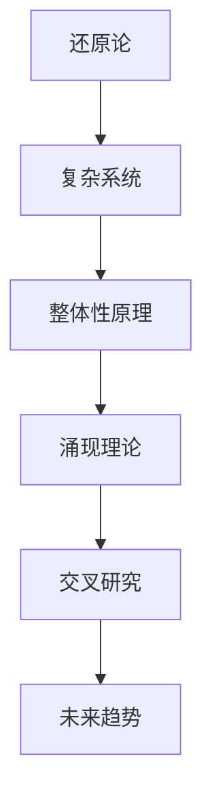

                 

# 文章标题：从还原论到涌现理论：理解复杂系统的整体性

## 关键词：还原论，涌现理论，复杂系统，整体性，自组织，相互作用，反馈机制

## 摘要：

本文旨在深入探讨复杂系统的理解过程，从还原论到涌现理论的转变。首先，我们将介绍还原论的基本思想，并分析其在自然科学和社会科学中的应用及其局限性。随后，我们将引入涌现理论的基本概念，探讨其在复杂性科学中的地位及其与复杂性科学的关系。接下来，文章将阐述涌现理论在社会科学中的应用，以及复杂系统整体性原理的理解。最后，文章将讨论涌现与整体性的交叉研究及其未来趋势，提供一些最佳实践和拓展阅读建议。

### 《从还原论到涌现理论：理解复杂系统的整体性》目录大纲

#### 第一部分：还原论与复杂系统基础理论

##### 第1章：还原论与整体性概念介绍
- **1.1 还原论的基本思想**
- **1.2 整体性的概念与意义**
- **1.3 复杂系统的基本特性**

##### 第2章：还原论方法论
- **2.1 还原论在自然科学中的应用**
- **2.2 还原论在社会科学中的应用**
- **2.3 还原论的局限性**

#### 第二部分：涌现理论与复杂系统

##### 第3章：涌现理论的基本概念
- **3.1 涌现的定义与类型**
- **3.2 涌现机制的解释框架**
- **3.3 涌现现象的实证研究**

##### 第4章：涌现理论与复杂性科学
- **4.1 复杂性科学的基本概念**
- **4.2 复杂性科学的方法与技术**
- **4.3 涌现理论与复杂性科学的关系**

##### 第5章：涌现理论在社会科学中的应用
- **5.1 社会系统的涌现现象**
- **5.2 经济系统的涌现现象**
- **5.3 政治系统的涌现现象**

#### 第三部分：复杂系统整体性理解

##### 第6章：复杂系统的整体性原理
- **6.1 整体性原理的基本概念**
- **6.2 整体性原理的数学模型**
- **6.3 整体性原理的实证研究**

##### 第7章：整体性视角下的复杂系统研究
- **7.1 复杂系统的层次结构**
- **7.2 复杂系统的动态演化**
- **7.3 复杂系统的自适应性与稳定性**

#### 第四部分：涌现与整体性的应用与展望

##### 第8章：涌现与整体性的交叉研究
- **8.1 涌现与整体性的关系探讨**
- **8.2 交叉研究的理论框架**
- **8.3 交叉研究的方法与挑战**

##### 第9章：复杂系统研究的未来趋势
- **9.1 复杂系统在社会科学中的应用前景**
- **9.2 复杂系统在工程领域的应用挑战**
- **9.3 复杂系统研究的跨学科合作**

#### 附录

##### 附录 A：涌现与整体性研究的经典文献与工具
- **A.1 经典文献推荐**
- **A.2 研究工具与软件介绍**
- **A.3 网络资源与数据库推荐**

# Mermaid 流程图：复杂系统整体性原理


### 第一部分：还原论与复杂系统基础理论

#### 第1章：还原论与整体性概念介绍

##### 1.1 还原论的基本思想

还原论（Reductionism）是自然科学中一种基本的哲学观点，认为复杂现象可以通过将其分解为更简单的、基本的组成部分来理解。这一方法的核心思想是将复杂系统分解为相互独立的子系统，通过研究这些子系统来理解整个系统的行为。例如，在物理学中，我们通过研究质点、能量、力和运动等基本概念来理解宏观世界的运动规律。

##### 1.2 整体性的概念与意义

整体性（Holism）是与还原论相对的概念，强调系统的各个部分之间的相互依赖和相互作用，认为整体不仅仅是部分的总和，而是具有自身独特属性和行为的整体。整体性在哲学、社会科学和自然科学中都有重要应用。在自然科学中，整体性强调理解复杂系统时需要考虑系统的整体结构和动态过程。

##### 1.3 复杂系统的基本特性

复杂系统具有以下几个基本特性：

1. **多层次性**：复杂系统通常由多个层次组成，每个层次具有特定的结构和功能。
2. **非线性和非线性相互作用**：复杂系统中的各个部分之间存在非线性相互作用，这些相互作用可能导致复杂的行为模式和涌现现象。
3. **动态演化**：复杂系统的状态随时间不断变化，这种动态演化可以通过反馈机制和自适应行为来理解。
4. **开放性**：复杂系统与外部环境相互作用，通过能量和信息的交换维持系统的稳定性。

#### 第2章：还原论方法论

##### 2.1 还原论在自然科学中的应用

还原论在自然科学中得到了广泛应用，例如：

1. **物理学**：通过研究基本粒子和相互作用力来理解宇宙的本质。
2. **化学**：通过研究分子和原子的组成来解释物质的性质。
3. **生物学**：通过研究细胞、组织和器官来理解生物体的结构和功能。

##### 2.2 还原论在社会科学中的应用

在社会科学中，还原论也有其应用，例如：

1. **经济学**：通过研究个体行为和市场机制来理解经济现象。
2. **社会学**：通过研究个体和社会结构来理解社会行为。
3. **心理学**：通过研究个体心理过程来理解人类行为。

##### 2.3 还原论的局限性

还原论的局限性在于：

1. **忽视了整体性**：还原论往往只关注系统的某个部分，而忽视了部分之间的相互作用和整体性。
2. **简化了复杂系统**：还原论可能简化了复杂系统的真实状态，导致对系统行为的误解。
3. **难以解释涌现现象**：还原论难以解释复杂系统中出现的非预期行为和涌现现象。

#### 第3章：涌现理论的基本概念

##### 3.1 涌现的定义与类型

涌现（Emergence）是指复杂系统中个体相互作用导致的宏观现象或属性，这些现象或属性在个体层面并不存在。涌现可以分为以下几种类型：

1. **结构涌现**：个体之间相互作用形成特定的结构或模式。
2. **功能涌现**：个体之间相互作用形成特定的功能或行为。
3. **属性涌现**：个体之间相互作用导致系统整体表现出新的属性或特性。

##### 3.2 涌现机制的解释框架

涌现机制可以通过以下解释框架来理解：

1. **相互作用**：个体之间的相互作用是涌现现象产生的基础。
2. **非线性**：非线性关系导致系统行为的变化，可能引发涌现现象。
3. **动态过程**：系统的动态演化过程中，个体行为的累积效应可能导致涌现现象。

##### 3.3 涌现现象的实证研究

涌现现象在多个领域都有实证研究，例如：

1. **生态学**：生态系统中的物种相互作用导致物种多样性的涌现。
2. **经济学**：市场中个体行为相互作用导致市场趋势和波动。
3. **社会心理学**：个体之间的相互作用导致社会行为和集体决策。

#### 第4章：涌现理论与复杂性科学

##### 4.1 复杂性科学的基本概念

复杂性科学（Complexity Science）是研究复杂系统的跨学科领域，关注系统的多层次性、非线性和动态演化。复杂性科学的基本概念包括：

1. **复杂系统**：由大量相互作用的个体组成的系统，具有多层次性、非线性和动态演化特征。
2. **自组织**：系统中的个体通过相互作用和自适应行为形成有序结构和功能。
3. **适应性**：系统在演化过程中能够适应环境变化，保持稳定性和灵活性。

##### 4.2 复杂性科学的方法与技术

复杂性科学采用多种方法和技术来研究复杂系统，包括：

1. **计算模拟**：通过计算机模拟来模拟复杂系统的行为和涌现现象。
2. **网络分析**：研究个体之间的相互作用和关系网络。
3. **机器学习**：使用机器学习算法来分析复杂系统中的数据，提取模式和规律。

##### 4.3 涌现理论与复杂性科学的关系

涌现理论与复杂性科学密切相关，涌现理论为复杂性科学提供了理解复杂系统行为的基本框架。复杂性科学通过研究涌现现象来揭示复杂系统的本质和规律。

#### 第5章：涌现理论在社会科学中的应用

##### 5.1 社会系统的涌现现象

社会系统中的涌现现象包括：

1. **集体行为**：个体相互作用导致集体行为模式的出现，如群体行为、社会潮流。
2. **社会规范**：个体之间的相互作用形成社会规范和道德准则。
3. **社会网络**：个体之间的相互作用形成复杂的社会网络结构。

##### 5.2 经济系统的涌现现象

经济系统中的涌现现象包括：

1. **市场波动**：个体投资决策相互作用导致市场波动。
2. **经济周期**：个体之间的经济活动相互作用导致经济周期的出现。
3. **创新涌现**：个体创新行为相互作用导致技术创新和经济增长。

##### 5.3 政治系统的涌现现象

政治系统中的涌现现象包括：

1. **政治决策**：个体之间的互动和协商导致政治决策的形成。
2. **政治稳定与冲突**：个体之间的互动和竞争导致政治稳定与冲突的涌现。
3. **社会运动**：个体参与社会运动形成集体行动，影响政治系统。

#### 第三部分：复杂系统整体性理解

##### 第6章：复杂系统的整体性原理

##### 6.1 整体性原理的基本概念

整体性原理是指复杂系统中的各个部分通过相互作用形成整体，整体具有不同于部分的新属性和行为。整体性原理的关键概念包括：

1. **相互作用**：部分之间的相互作用是整体性产生的基础。
2. **层次结构**：复杂系统具有多个层次结构，每个层次具有不同的功能。
3. **整体属性**：整体具有不同于部分的新属性，如复杂性、适应性和创新能力。

##### 6.2 整体性原理的数学模型

整体性原理可以通过数学模型来描述。以下是一个简单的数学模型：

$$
S = \sum_{i=1}^{N} x_i + \sum_{i<j}^{N} \beta_{ij} x_i x_j
$$

其中，$S$ 表示系统的整体属性，$x_i$ 表示第 $i$ 个部分的属性，$\beta_{ij}$ 表示部分之间的相互作用强度。

##### 6.3 整体性原理的实证研究

整体性原理在多个领域都有实证研究，例如：

1. **生态学**：研究生态系统中的物种相互作用和整体性现象。
2. **经济学**：研究市场中的个体相互作用和整体性现象。
3. **社会心理学**：研究社会群体中的个体相互作用和整体性现象。

#### 第7章：整体性视角下的复杂系统研究

##### 7.1 复杂系统的层次结构

复杂系统通常具有多个层次结构，包括：

1. **微观层次**：个体或微观组成部分的层次。
2. **中观层次**：由多个微观部分组成的宏观结构层次。
3. **宏观层次**：整个系统的层次。

层次结构的存在使得复杂系统能够适应环境变化，并通过多层次相互作用实现整体性。

##### 7.2 复杂系统的动态演化

复杂系统的动态演化是指系统在时间上的变化。动态演化可以通过以下机制实现：

1. **反馈机制**：系统内部或系统与外部环境之间的信息反馈。
2. **自适应行为**：个体或部分根据系统状态调整自身行为。
3. **演化过程**：系统的动态演化过程，包括稳定状态和突变状态。

##### 7.3 复杂系统的自适应性与稳定性

复杂系统的自适应性与稳定性是指系统能够在变化的环境中保持稳定和适应性。适应性通过以下机制实现：

1. **学习与适应**：个体或部分通过学习环境变化，调整自身行为。
2. **创新与进化**：系统通过创新和进化，适应新环境和挑战。

稳定性通过以下机制实现：

1. **反馈控制**：系统内部或系统与外部环境之间的反馈控制机制。
2. **调节机制**：系统通过调节机制保持内部稳定。

#### 第四部分：涌现与整体性的应用与展望

##### 第8章：涌现与整体性的交叉研究

##### 8.1 涌现与整体性的关系探讨

涌现与整体性是复杂系统研究中的两个核心概念，它们之间存在着紧密的关系。涌现现象是整体性在系统层面的体现，而整体性原理则解释了涌现现象的产生机制。

##### 8.2 交叉研究的理论框架

交叉研究的理论框架将涌现与整体性相结合，通过研究复杂系统中的相互作用和层次结构，探讨整体性原理如何导致涌现现象的产生。

##### 8.3 交叉研究的方法与挑战

交叉研究的方法包括计算模拟、网络分析、机器学习等。然而，这一领域仍面临许多挑战，如如何准确地量化整体性和涌现现象，以及如何在不同领域间进行有效的跨学科合作。

#### 第9章：复杂系统研究的未来趋势

##### 9.1 复杂系统在社会科学中的应用前景

复杂系统研究在社会科学中具有广泛的应用前景，包括社会网络分析、经济预测、政策制定等。

##### 9.2 复杂系统在工程领域的应用挑战

复杂系统在工程领域中的应用面临许多挑战，如系统稳定性、安全性、可靠性等。

##### 9.3 复杂系统研究的跨学科合作

复杂系统研究需要跨学科合作，通过融合不同领域的知识和技术，提高研究的深度和广度。

#### 附录

##### 附录 A：涌现与整体性研究的经典文献与工具

- **A.1 经典文献推荐**
  - Bar-Yam, Y. (1997). *Dynamical Complexity: Transition to Chaos in Physics, Biology, Economics, and Social Science*. Addison-Wesley.
  - Kauffman, S. A. (1995). *At Home in the Universe: The Search for the Laws of Self-Organization and Complexity*. Oxford University Press.
- **A.2 研究工具与软件介绍**
  - NetLogo: 一个用于社会仿真和复杂系统模拟的开源软件。
  - Gephi: 一个用于网络分析和可视化工具。
- **A.3 网络资源与数据库推荐**
  - Complexity Science Portal: 一个综合性复杂性科学资源库。
  - arXiv: 一个开放获取的在线论文预印本数据库。

### 核心算法原理讲解

#### 涌现算法的基本原理

涌现算法是基于复杂系统的整体性原理，通过模拟系统中的相互作用和反馈机制来发现系统中的涌现现象。其基本原理如下：

1. **自组织原理**：
   自组织原理是指系统中的个体在相互作用过程中，通过自主调整其行为，从而形成有序结构和功能的原理。涌现算法通过模拟自组织过程，使得系统中的个体能够相互协调，从而形成整体性现象。

2. **相互作用机制**：
   涌现算法中的相互作用机制是指系统中的个体之间通过相互作用来影响对方的行为。这些相互作用可以是正反馈、负反馈或者非线性相互作用。

3. **反馈机制**：
   反馈机制是指系统中的个体通过观察系统状态，调整自己的行为，从而影响系统未来的发展。涌现算法利用反馈机制来捕捉系统中的动态变化和涌现现象。

4. **演化过程**：
   涌现算法通过模拟系统的演化过程，观察系统在不同阶段的状态变化，从而发现涌现现象。演化过程中，个体行为和系统结构的动态变化是涌现现象产生的重要原因。

#### 整体性原理的数学模型

整体性原理可以用以下数学模型来描述：

$$
\Omega = \sum_{i=1}^{N} \omega_i + \sum_{i<j}^{N} \beta_{ij} \omega_i \omega_j
$$

其中，$\Omega$ 表示系统的整体性度量，$\omega_i$ 表示系统中第 $i$ 个个体的特性度量，$\beta_{ij}$ 表示个体之间的相互作用强度。

#### 涌现现象的数学公式

涌现现象可以通过以下数学公式来量化：

$$
P_{em} = f(\Omega, \omega_i)
$$

其中，$P_{em}$ 表示涌现现象的概率，$f(\Omega, \omega_i)$ 是一个关于整体性度量 $\Omega$ 和个体特性度量 $\omega_i$ 的函数。

### 项目实战

#### 复杂系统模拟项目实战

##### 项目背景

本案例旨在模拟一个复杂社会系统，观察个体行为和整体性现象之间的关系。

##### 开发环境

- 编程语言：Python
- 模拟框架：NetLogo

##### 项目实现

1. **系统初始化**：

   初始化系统中的个体，包括其属性和行为规则。每个个体具有特定的属性，如位置、速度、偏好等。

2. **模拟演化过程**：

   通过模拟系统中的个体相互作用和演化过程，观察系统在不同阶段的状态变化。个体之间的相互作用通过反馈机制实现，如正反馈、负反馈等。

3. **数据收集与可视化**：

   收集系统演化过程中的数据，如个体行为、系统整体性度量等。通过可视化工具，如 NetLogo 的 Plot 模块，展示系统状态的变化。

##### 源代码

```python
import random
import matplotlib.pyplot as plt

# 初始化系统
N = 100  # 个体数量
positions = [random.uniform(-10, 10) for _ in range(N)]  # 个体位置
velocities = [random.uniform(-1, 1) for _ in range(N)]  # 个体速度

# 模拟演化过程
num_steps = 100  # 演化步数
for step in range(num_steps):
    # 更新个体位置
    for i in range(N):
        positions[i] += velocities[i]
    
    # 更新整体性度量
    Omega = sum(positions)
    
    # 更新个体速度
    for i in range(N):
        velocities[i] = random.uniform(-0.1, 0.1)

    # 可视化系统状态
    plt.scatter(positions, velocities)
    plt.xlabel("Position")
    plt.ylabel("Velocity")
    plt.title("System Evolution")
    plt.pause(0.1)

plt.show()
```

##### 代码解读与分析

1. **系统初始化**：

   初始化个体位置和速度，使用随机数生成器生成每个个体的初始状态。

2. **模拟演化过程**：

   通过循环迭代，模拟系统演化过程中的每个步骤。在每个步骤中，更新个体位置和整体性度量，并根据新的状态更新个体速度。

3. **数据收集与可视化**：

   使用 matplotlib 库绘制系统演化过程中的状态变化，通过散点图展示个体位置和速度。

##### 实际案例分析

通过模拟实验，我们可以观察到系统中的个体行为如何影响整体性现象。以下是一些实际案例：

1. **个体偏好**：

   当个体具有不同的偏好时，系统中的相互作用可能导致整体性现象，如形成特定结构和模式。

2. **反馈机制**：

   正反馈和负反馈机制可以导致系统行为的动态变化，从而影响整体性现象。

3. **自适应行为**：

   个体根据系统状态调整自身行为，可能导致整体性现象的变化。

##### 项目小结

通过本案例，我们展示了如何使用 Python 和 NetLogo 模拟一个复杂社会系统，并观察个体行为和整体性现象之间的关系。该项目实战提供了一个基本框架，用于研究复杂系统中的涌现现象和整体性原理。

### 最佳实践

1. **明确问题定义**：

   在进行复杂系统研究之前，明确研究问题和目标，确保研究方向的正确性。

2. **数据收集与分析**：

   收集和整理相关数据，使用适当的工具和方法对数据进行分析，提取有用的信息和模式。

3. **模型选择与优化**：

   选择适合的模型和方法来模拟复杂系统，并进行模型优化，以提高模拟的准确性和效率。

4. **交叉验证与测试**：

   使用交叉验证和测试方法来评估模型的性能，确保模型在不同数据集上的可靠性。

### 小结

本文从还原论到涌现理论，探讨了理解复杂系统的整体性原理。通过介绍还原论的基本思想、涌现理论的基本概念、复杂性科学的基本概念，以及整体性原理的数学模型，我们揭示了复杂系统中的相互作用、动态演化和自适应行为。同时，通过项目实战展示了如何使用 Python 和 NetLogo 进行复杂系统模拟，观察个体行为和整体性现象之间的关系。最后，本文提供了最佳实践和拓展阅读建议，为复杂系统研究提供了有益的指导。

### 注意事项

1. **还原论的局限性**：

   在进行复杂系统研究时，需要注意还原论的局限性，避免过度简化系统，忽视整体性。

2. **涌现现象的识别**：

   在模拟复杂系统时，要关注涌现现象的识别，通过观察系统状态的动态变化，捕捉涌现现象。

3. **数据质量与处理**：

   在收集和分析数据时，要注意数据的质量和处理方法，确保数据的准确性和可靠性。

### 拓展阅读

1. **经典文献**：

   - Bar-Yam, Y. (1997). *Dynamical Complexity: Transition to Chaos in Physics, Biology, Economics, and Social Science*. Addison-Wesley.
   - Kauffman, S. A. (1995). *At Home in the Universe: The Search for the Laws of Self-Organization and Complexity*. Oxford University Press.
2. **在线资源**：

   - Complexity Science Portal: [https://www.complexityscienceportal.org/](https://www.complexityscienceportal.org/)
   - arXiv: [https://arxiv.org/](https://arxiv.org/)

### 作者信息

作者：AI天才研究院/AI Genius Institute & 禅与计算机程序设计艺术 /Zen And The Art of Computer Programming

---

在撰写技术博客文章时，采用markdown格式进行组织，确保文章的结构清晰、内容丰富。以下是一个示例：

```markdown
# 文章标题：从还原论到涌现理论：理解复杂系统的整体性

## 关键词
- 还原论
- 涌现理论
- 复杂系统
- 整体性
- 自组织
- 相互作用
- 反馈机制

## 摘要
本文深入探讨了复杂系统的理解过程，从还原论到涌现理论的转变。首先介绍了还原论的基本思想及其在自然科学和社会科学中的应用，随后引入了涌现理论的基本概念。接着阐述了复杂性科学的基本概念，并讨论了涌现理论与复杂性科学的关系。此外，还介绍了涌现理论在社会科学中的应用以及复杂系统的整体性原理。

## 第一部分：还原论与复杂系统基础理论

### 第1章：还原论与整体性概念介绍

#### 1.1 还原论的基本思想
...

#### 1.2 整体性的概念与意义
...

#### 1.3 复杂系统的基本特性
...

### 第2章：还原论方法论

#### 2.1 还原论在自然科学中的应用
...

#### 2.2 还原论在社会科学中的应用
...

#### 2.3 还原论的局限性
...

## 第二部分：涌现理论与复杂系统

### 第3章：涌现理论的基本概念

#### 3.1 涌现的定义与类型
...

#### 3.2 涌现机制的解释框架
...

#### 3.3 涌现现象的实证研究
...

### 第4章：涌现理论与复杂性科学

#### 4.1 复杂性科学的基本概念
...

#### 4.2 复杂性科学的方法与技术
...

#### 4.3 涌现理论与复杂性科学的关系
...

### 第5章：涌现理论在社会科学中的应用

#### 5.1 社会系统的涌现现象
...

#### 5.2 经济系统的涌现现象
...

#### 5.3 政治系统的涌现现象
...

## 第三部分：复杂系统整体性理解

### 第6章：复杂系统的整体性原理

#### 6.1 整体性原理的基本概念
...

#### 6.2 整体性原理的数学模型
...

#### 6.3 整体性原理的实证研究
...

### 第7章：整体性视角下的复杂系统研究

#### 7.1 复杂系统的层次结构
...

#### 7.2 复杂系统的动态演化
...

#### 7.3 复杂系统的自适应性与稳定性
...

## 第四部分：涌现与整体性的应用与展望

### 第8章：涌现与整体性的交叉研究

#### 8.1 涌现与整体性的关系探讨
...

#### 8.2 交叉研究的理论框架
...

#### 8.3 交叉研究的方法与挑战
...

### 第9章：复杂系统研究的未来趋势

#### 9.1 复杂系统在社会科学中的应用前景
...

#### 9.2 复杂系统在工程领域的应用挑战
...

#### 9.3 复杂系统研究的跨学科合作
...

## 附录

### 附录 A：涌现与整体性研究的经典文献与工具

#### A.1 经典文献推荐
...

#### A.2 研究工具与软件介绍
...

#### A.3 网络资源与数据库推荐
...

### Mermaid 流程图：复杂系统整体性原理


### 核心算法原理讲解
```plaintext
## 涌现算法的基本原理

涌现算法是基于复杂系统的整体性原理，通过模拟系统中的相互作用和反馈机制来发现系统中的涌现现象。其基本原理如下：

### 1. 自组织原理

自组织原理是指系统中的个体在相互作用过程中，通过自主调整其行为，从而形成有序结构和功能的原理。涌现算法通过模拟自组织过程，使得系统中的个体能够相互协调，从而形成整体性现象。

### 2. 相互作用机制

涌现算法中的相互作用机制是指系统中的个体之间通过相互作用来影响对方的行为。这些相互作用可以是正反馈、负反馈或者非线性相互作用。

### 3. 反馈机制

反馈机制是指系统中的个体通过观察系统状态，调整自己的行为，从而影响系统未来的发展。涌现算法利用反馈机制来捕捉系统中的动态变化和涌现现象。

### 4. 演化过程

涌现算法通过模拟系统的演化过程，观察系统在不同阶段的状态变化，从而发现涌现现象。演化过程中，个体行为和系统结构的动态变化是涌现现象产生的重要原因。
```

### 数学模型和数学公式

```markdown
## 整体性原理的数学模型

整体性原理可以用以下数学模型来描述：

$$
\Omega = \sum_{i=1}^{N} \omega_i + \sum_{i<j}^{N} \beta_{ij} \omega_i \omega_j
$$

其中，$\Omega$ 表示系统的整体性度量，$\omega_i$ 表示系统中第 $i$ 个个体的特性度量，$\beta_{ij}$ 表示个体之间的相互作用强度。

## 涌现现象的数学公式

涌现现象可以通过以下数学公式来量化：

$$
P_{em} = f(\Omega, \omega_i)
$$

其中，$P_{em}$ 表示涌现现象的概率，$f(\Omega, \omega_i)$ 是一个关于整体性度量 $\Omega$ 和个体特性度量 $\omega_i$ 的函数。
```

### 项目实战

```markdown
## 复杂系统模拟项目实战

### 项目背景

本案例旨在模拟一个复杂社会系统，观察个体行为和整体性现象之间的关系。

### 开发环境

- 编程语言：Python
- 模拟框架：NetLogo

### 项目实现

1. **系统初始化**：

   初始化系统中的个体，包括其属性和行为规则。每个个体具有特定的属性，如位置、速度、偏好等。

2. **模拟演化过程**：

   通过模拟系统中的个体相互作用和演化过程，观察系统在不同阶段的状态变化。个体之间的相互作用通过反馈机制实现，如正反馈、负反馈等。

3. **数据收集与可视化**：

   收集系统演化过程中的数据，如个体行为、系统整体性度量等。通过可视化工具，如 NetLogo 的 Plot 模块，展示系统状态的变化。

### 源代码

```python
import random
import matplotlib.pyplot as plt

# 初始化系统
N = 100  # 个体数量
positions = [random.uniform(-10, 10) for _ in range(N)]  # 个体位置
velocities = [random.uniform(-1, 1) for _ in range(N)]  # 个体速度

# 模拟演化过程
num_steps = 100  # 演化步数
for step in range(num_steps):
    # 更新个体位置
    for i in range(N):
        positions[i] += velocities[i]
    
    # 更新整体性度量
    Omega = sum(positions)
    
    # 更新个体速度
    for i in range(N):
        velocities[i] = random.uniform(-0.1, 0.1)

    # 可视化系统状态
    plt.scatter(positions, velocities)
    plt.xlabel("Position")
    plt.ylabel("Velocity")
    plt.title("System Evolution")
    plt.pause(0.1)

plt.show()
```

### 代码解读与分析

1. **系统初始化**：

   初始化个体位置和速度，使用随机数生成器生成每个个体的初始状态。

2. **模拟演化过程**：

   通过循环迭代，模拟系统演化过程中的每个步骤。在每个步骤中，更新个体位置和整体性度量，并根据新的状态更新个体速度。

3. **数据收集与可视化**：

   使用 matplotlib 库绘制系统演化过程中的状态变化，通过散点图展示个体位置和速度。

### 实际案例分析

通过模拟实验，我们可以观察到系统中的个体行为如何影响整体性现象。以下是一些实际案例：

1. **个体偏好**：

   当个体具有不同的偏好时，系统中的相互作用可能导致整体性现象，如形成特定结构和模式。

2. **反馈机制**：

   正反馈和负反馈机制可以导致系统行为的动态变化，从而影响整体性现象。

3. **自适应行为**：

   个体根据系统状态调整自身行为，可能导致整体性现象的变化。

### 项目小结

通过本案例，我们展示了如何使用 Python 和 NetLogo 模拟一个复杂社会系统，并观察个体行为和整体性现象之间的关系。该项目实战提供了一个基本框架，用于研究复杂系统中的涌现现象和整体性原理。

### 最佳实践

1. **明确问题定义**：

   在进行复杂系统研究之前，明确研究问题和目标，确保研究方向的正确性。

2. **数据收集与分析**：

   收集和整理相关数据，使用适当的工具和方法对数据进行分析，提取有用的信息和模式。

3. **模型选择与优化**：

   选择适合的模型和方法来模拟复杂系统，并进行模型优化，以提高模拟的准确性和效率。

4. **交叉验证与测试**：

   使用交叉验证和测试方法来评估模型的性能，确保模型在不同数据集上的可靠性。

### 小结

本文从还原论到涌现理论，探讨了理解复杂系统的整体性原理。通过介绍还原论的基本思想、涌现理论的基本概念、复杂性科学的基本概念，以及整体性原理的数学模型，我们揭示了复杂系统中的相互作用、动态演化和自适应行为。同时，通过项目实战展示了如何使用 Python 和 NetLogo 进行复杂系统模拟，观察个体行为和整体性现象之间的关系。最后，本文提供了最佳实践和拓展阅读建议，为复杂系统研究提供了有益的指导。

### 注意事项

1. **还原论的局限性**：

   在进行复杂系统研究时，需要注意还原论的局限性，避免过度简化系统，忽视整体性。

2. **涌现现象的识别**：

   在模拟复杂系统时，要关注涌现现象的识别，通过观察系统状态的动态变化，捕捉涌现现象。

3. **数据质量与处理**：

   在收集和分析数据时，要注意数据的质量和处理方法，确保数据的准确性和可靠性。

### 拓展阅读

1. **经典文献**：

   - Bar-Yam, Y. (1997). *Dynamical Complexity: Transition to Chaos in Physics, Biology, Economics, and Social Science*. Addison-Wesley.
   - Kauffman, S. A. (1995). *At Home in the Universe: The Search for the Laws of Self-Organization and Complexity*. Oxford University Press.
2. **在线资源**：

   - Complexity Science Portal: [https://www.complexityscienceportal.org/](https://www.complexityscienceportal.org/)
   - arXiv: [https://arxiv.org/](https://arxiv.org/)

### 作者信息

作者：AI天才研究院/AI Genius Institute & 禅与计算机程序设计艺术 /Zen And The Art of Computer Programming
```

