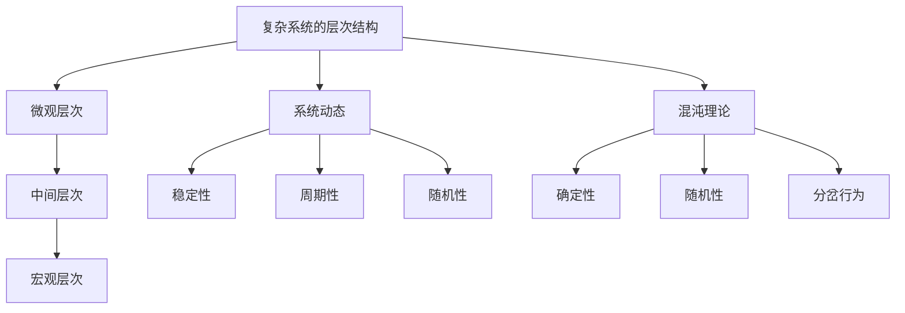
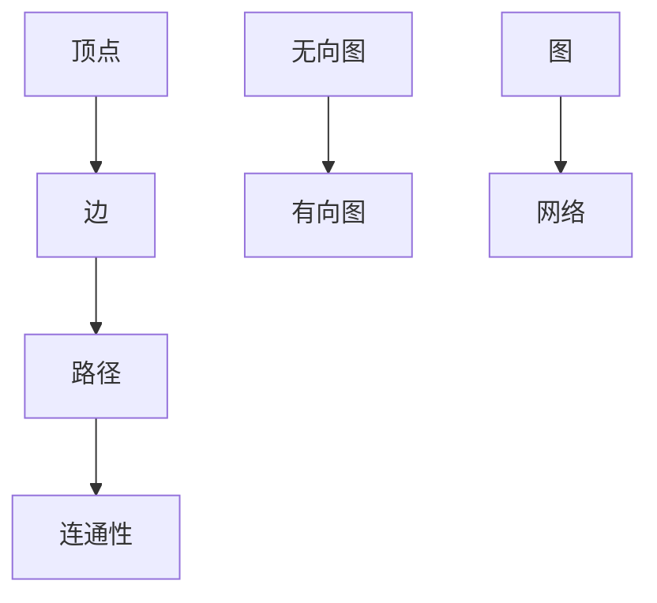
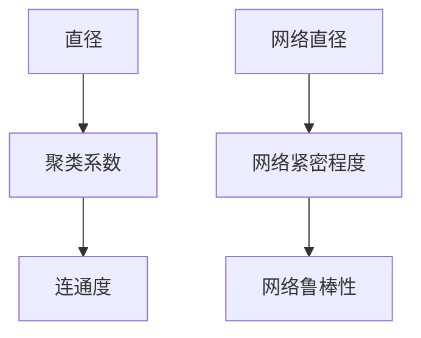

                 

### 第3章：复杂系统的基本原理

#### 3.1 复杂系统的层次结构

复杂系统的层次结构是理解系统行为的关键。层次结构使得我们可以将复杂的系统分解为更易于管理的部分，从而更好地理解系统的整体行为。以下是复杂系统层次结构的几个关键概念：

##### 3.1.1 多层次系统的组成

在复杂系统中，层次结构通常包括从微观到宏观的多个层次。每个层次都有其特定的组成和功能。以下是一个多层次系统的组成部分：

1. **微观层次**：包括个体、元素或基本单元，如细胞、分子、原子等。这个层次上的行为通常遵循物理和化学规律。例如，在生物系统中，细胞是微观层次的基本单元，其行为受生物学和化学规律支配。

2. **中间层次**：由多个微观层次单元组成的群体，如组织、群体等。这个层次上的行为可能受到生物学、社会学规律的影响。例如，在生态系统中，物种群体是中间层次的基本单元，其行为受生态学和社会学规律的影响。

3. **宏观层次**：整个系统的整体行为，如生态系统、城市交通网络等。这个层次上的行为涉及到系统之间的相互作用和整体演化。例如，全球气候系统是宏观层次的一个例子，其行为受到地球各部分气候系统之间的相互作用影响。

##### 3.1.2 层次结构的特点与挑战

- **层次结构的特征**：层次结构具有嵌套性、模块性和适应性。嵌套性意味着一个层次可以嵌套在另一个层次中，如个体可以嵌套在组织中；模块性意味着系统可以分解为相互独立但相互作用的模块；适应性意味着系统可以根据外部环境的变化调整其行为。

- **层次结构的挑战**：层次结构增加了系统的复杂性，使得系统行为难以预测和调控。同时，层次结构中的相互作用可能导致涌现现象，使得系统行为超越其组成部分行为的简单加和。

#### 3.2 系统动态与混沌理论

系统动态是指系统随时间变化的规律。在复杂系统中，系统动态可以表现为稳定性、周期性、随机性等不同特征。混沌理论是研究系统动态的非线性特性的一门学科，它揭示了复杂系统的内在复杂性。

##### 3.2.1 系统动态的描述

系统动态的描述通常依赖于数学模型，如差分方程、微分方程、图模型等。以下是一些常见的系统动态特征：

- **稳定性**：系统在平衡状态附近对扰动的响应能力。稳定的系统在受到微小扰动后能够回到平衡状态，而不稳定的系统则可能发生剧烈的变化。

- **周期性**：系统在一定时间间隔内重复出现相同的状态。周期性的系统通常具有稳定的周期解。

- **随机性**：系统的行为在一定概率分布下进行，难以预测具体的状态。

##### 3.2.2 混沌理论

混沌理论是研究系统动态的非线性特性的一门学科。混沌系统的特点包括：

- **确定性**：系统的行为遵循确定的规律，但微小扰动能导致巨大的长期差异。

- **随机性**：混沌系统在短时间尺度上表现出随机行为，但在长时间尺度上仍具有一定的规律性。

- **分岔行为**：随着参数的变化，系统可能经历从稳定到不稳定、从单周期到多周期的转变。

混沌理论揭示了复杂系统的内在复杂性，为理解复杂系统的行为提供了新的视角。

### 核心概念与联系：复杂系统的层次结构与系统动态、混沌理论之间的关系架构

为了更好地理解复杂系统的层次结构、系统动态和混沌理论之间的关系，我们可以使用Mermaid流程图来表示这些核心概念之间的关系。



通过这个流程图，我们可以看到：

- 复杂系统的层次结构是系统动态和混沌理论的基础。
- 系统动态（稳定性、周期性、随机性）是复杂系统层次结构的体现。
- 混沌理论揭示了系统动态的内在非线性特性。

### 核心算法原理讲解：复杂系统的层次结构与系统动态的数学模型

为了更深入地理解复杂系统的层次结构与系统动态，我们可以介绍一些相关的数学模型和算法原理。

#### 3.2.1 微观层次模型

在微观层次，我们可以使用分子动力学模型来描述系统的动态行为。以下是分子动力学模型的伪代码：

```python
# 初始化系统参数
N = 1000  # 分子数量
T = 300  # 温度
dt = 0.01  # 时间步长

# 初始化分子位置和速度
positions = np.random.rand(N, 3)  # 3D空间位置
velocities = np.random.rand(N, 3)  # 速度

# 动力学方程
for _ in range(num_steps):
    # 计算分子间的相互作用力
    forces = calculate_forces(positions)
    
    # 更新速度和位置
    velocities += forces / N * dt
    positions += velocities * dt
```

在这个模型中，我们首先初始化系统的参数，包括分子数量、温度和时间步长。然后，我们随机初始化分子的位置和速度。在每次时间步长中，我们计算分子间的相互作用力，并根据牛顿第二定律更新速度和位置。

#### 3.2.2 宏观层次模型

在宏观层次，我们可以使用图模型来描述系统的动态行为。以下是图模型的伪代码：

```python
# 初始化系统参数
num_nodes = 100  # 节点数量
num_edges = 300  # 边数量
time_step = 10  # 时间步长

# 初始化图结构
nodes = generate_nodes(num_nodes)
edges = generate_edges(num_edges, nodes)

# 动力学方程
for _ in range(num_steps):
    # 更新节点状态
    update_node_states(nodes)
    
    # 更新边状态
    update_edge_states(edges)
```

在这个模型中，我们首先初始化系统的图结构，包括节点和边。然后，我们在每个时间步长中更新节点状态和边状态。

#### 3.2.3 混沌模型

为了描述混沌系统的动态行为，我们可以使用洛伦兹系统（Lorenz system）的数学模型。以下是洛伦兹系统的数学模型和伪代码：

$$
\begin{align*}
\frac{dx}{dt} &= \sigma (y - x), \\
\frac{dy}{dt} &= x (\rho - z) - y, \\
\frac{dz}{dt} &= xy - \beta z.
\end{align*}
$$

```python
# 初始化系统参数
sigma = 10.0
rho = 28.0
beta = 8.0/3.0
x, y, z = 1.0, 1.0, 1.0
dt = 0.01

# 动力学方程
for _ in range(num_steps):
    dxdt = sigma * (y - x)
    dydt = x * (rho - z) - y
    dzdt = x * y - beta * z
    
    x += dxdt * dt
    y += dydt * dt
    z += dzdt * dt
```

在这个模型中，我们初始化系统的参数，包括洛伦兹系统的三个参数和初始状态。然后，我们使用欧拉方法更新状态。

### 数学模型和公式详解

为了更好地理解复杂系统的层次结构、系统动态和混沌理论，我们介绍一些相关的数学模型和公式。

#### 3.2.1 微观层次模型

在微观层次，我们可以使用分子动力学模型来描述系统的动态行为。以下是分子动力学模型的公式：

$$
\begin{align*}
\frac{d\mathbf{r}_i}{dt} &= \mathbf{v}_i, \\
\frac{d\mathbf{v}_i}{dt} &= \frac{1}{m} \sum_{j \neq i} \mathbf{F}_{ij},
\end{align*}
$$

其中，$\mathbf{r}_i$ 是分子 $i$ 的位置，$\mathbf{v}_i$ 是分子 $i$ 的速度，$m$ 是分子 $i$ 的质量，$\mathbf{F}_{ij}$ 是分子 $i$ 与分子 $j$ 之间的相互作用力。

#### 3.2.2 宏观层次模型

在宏观层次，我们可以使用图模型来描述系统的动态行为。以下是图模型的公式：

$$
\begin{align*}
\frac{d\mathbf{x}_i}{dt} &= \sum_{j} \omega_{ij} \mathbf{v}_j, \\
\frac{d\mathbf{v}_i}{dt} &= f_i,
\end{align*}
$$

其中，$\mathbf{x}_i$ 是节点 $i$ 的位置，$\mathbf{v}_i$ 是节点 $i$ 的速度，$\omega_{ij}$ 是节点 $i$ 与节点 $j$ 之间的权重，$f_i$ 是节点 $i$ 的力。

#### 3.2.3 混沌模型

为了描述混沌系统的动态行为，我们可以使用洛伦兹系统的数学模型。以下是洛伦兹系统的数学模型：

$$
\begin{align*}
\frac{dx}{dt} &= \sigma (y - x), \\
\frac{dy}{dt} &= x (\rho - z) - y, \\
\frac{dz}{dt} &= xy - \beta z.
\end{align*}
$$

通过这些数学模型和公式，我们可以更深入地理解复杂系统的层次结构、系统动态和混沌理论。

### 举例说明

为了更好地理解复杂系统的层次结构、系统动态和混沌理论，我们可以通过一个例子来说明这些概念。

假设我们研究一个由100个分子组成的微观系统。每个分子受到其他分子的相互作用力影响。我们可以使用分子动力学模型来模拟这个系统的动态行为。

1. **初始化系统参数**：初始化分子的位置和速度，以及相互作用力的参数。

2. **计算相互作用力**：在每个时间步长中，计算每个分子与其他分子的相互作用力。

3. **更新速度和位置**：根据牛顿第二定律，更新每个分子的速度和位置。

4. **分析系统动态**：通过模拟系统的行为，我们可以观察到系统在不同时间步长的状态。例如，我们可以观察到分子的速度和位置的分布，以及系统的稳定性。

5. **混沌现象**：在特定参数下，系统的行为可能会表现出混沌现象。例如，系统的状态可能会在长时间尺度上呈现出随机性，但仍然具有一定的规律性。

通过这个例子，我们可以更直观地理解复杂系统的层次结构、系统动态和混沌理论。

### 结论

复杂系统的层次结构、系统动态和混沌理论是理解复杂系统行为的关键。层次结构使得我们可以将复杂的系统分解为更易于管理的部分，系统动态描述了系统随时间的变化规律，而混沌理论揭示了系统行为的非线性特性。通过使用数学模型和算法，我们可以更深入地理解这些概念，并应用于实际问题的研究。

## 3.3 自组织与涌现现象

自组织与涌现现象是复杂系统理论中的重要概念，它们揭示了系统在无外部指导的情况下，如何通过内部相互作用和协同行为产生复杂结构和有序模式。以下是对这两个核心概念的定义、原理及其在复杂系统中的应用的详细解释。

### 3.3.1 自组织原理

自组织是指系统在无外部控制或预设目标的情况下，通过内部相互作用和反馈机制自发形成有序结构和复杂行为的过程。自组织现象广泛存在于自然界和人类社会中，如生物进化、经济市场、社交网络等。

#### 自组织的原理：

1. **非线性的相互作用**：系统中的个体或元素之间存在非线性相互作用，这些相互作用可能导致系统的行为超出简单叠加效应。
2. **正反馈**：系统中的某些局部相互作用会加强系统的当前状态，促进有序结构的形成。
3. **能量流和物质流**：系统的能量和物质流动有助于维持和加强自组织过程。
4. **适应性**：系统中的个体能够适应环境变化，调整其行为，从而促进系统的自组织。

#### 自组织的例子：

- **生物系统**：在生物体内，细胞通过自组织形成器官和组织，最终形成完整的生物体。
- **经济系统**：市场经济中的个体通过交易和信息交换，形成复杂的市场结构和价格机制。

### 3.3.2 涌现现象

涌现现象是指系统在较低层次上的简单规则和相互作用，通过复杂的非线性相互作用和协同行为，产生出不可预见的新特性或结构。涌现现象是复杂系统研究中的一个重要主题，它揭示了系统的整体行为往往难以从个体行为简单推导出来。

#### 涌现现象的原理：

1. **协同效应**：系统中的个体通过协同行为，产生出大于个体行为之和的效果。
2. **等级结构**：复杂系统往往具有层次结构，较低层次的结构和规则相互作用，产生出更高层次的结构和规则。
3. **适应性**：涌现现象的产生往往需要系统具有适应性的机制，使得系统能够根据环境变化调整其行为。

#### 涌现现象的例子：

- **社会系统**：社会规范和文化的形成，是由个体相互作用和行为习惯的累积结果。
- **技术系统**：互联网和人工智能的崛起，是大量简单计算和数据的积累和交互的结果。

### 自组织与涌现现象的关系

自组织与涌现现象密切相关，自组织是涌现现象的必要条件，而涌现现象则是自组织的结果。自组织过程往往会导致涌现现象，即系统的整体行为或特性无法从单个元素的行为直接推导出来。

#### 自组织与涌现现象的关系架构：

- **自组织** → **局部规则与相互作用** → **复杂结构和有序模式** → **涌现现象**
- **自组织** → **等级结构和协同效应** → **不可预见的新特性或结构** → **涌现现象**

通过这种关系架构，我们可以更好地理解复杂系统中自组织与涌现现象的相互作用和影响。

### 3.3.3 费马最后定理与复杂系统

费马最后定理是一个经典的数学问题，其解决过程展示了复杂系统中的自组织和涌现现象。费马最后定理指出，对于任何大于2的正整数n，方程 $a^n + b^n = c^n$ 没有正整数解。

#### 费马最后定理的解决过程：

1. **局部探索**：数学家们首先在较低层次上对n=3和n=4的情况进行了研究，发现这些情况下方程没有正整数解。
2. **非线性相互作用**：随着研究的深入，数学家们开始考虑更高层次的数学结构，如椭圆曲线和模形式，这些结构揭示了费马最后定理在不同数学领域之间的非线性相互作用。
3. **正反馈**：在解决过程中，每个新的发现都会引发更多的研究，形成正反馈循环，推动问题解决的进程。
4. **涌现现象**：最终，通过复杂的数学结构和非线性相互作用，数学家们找到了证明费马最后定理的方法，这个过程展示了数学系统中的自组织和涌现现象。

#### 费马最后定理与复杂系统的联系：

- **自组织**：数学家们通过自我调整和协同工作，形成了解决问题的团队结构和研究方法。
- **涌现现象**：费马最后定理的解决过程中，涌现出了新的数学概念和证明方法，这些概念和方法对整个数学领域产生了深远的影响。

通过费马最后定理的例子，我们可以看到复杂系统中的自组织和涌现现象如何影响问题的解决过程，以及它们在数学和科学中的重要性。

### 结论

自组织与涌现现象是复杂系统理论中的核心概念，它们揭示了系统在无外部指导的情况下，如何通过内部相互作用和协同行为产生复杂结构和有序模式。自组织是涌现现象的必要条件，而涌现现象则是自组织的结果。通过了解自组织和涌现现象的原理和应用，我们可以更好地理解复杂系统的行为，并为实际问题提供新的解决思路。

## 3.4 网络科学的数学工具

网络科学是研究复杂网络结构、动态行为和功能特性的跨学科领域。网络科学的数学工具在理解网络行为和应用网络理论方面起着关键作用。以下将介绍网络科学中的几个核心数学工具，包括图论基础、社会网络分析、网络拓扑特性和网络演化模型。

### 3.4.1 图论基础

图论是网络科学的基础，用于描述网络结构和分析网络特性。在图论中，网络被视为图（Graph），由顶点（Node）和边（Edge）组成。

#### 关键概念：

- **顶点**：图中的元素，表示网络中的个体或实体。
- **边**：连接两个顶点的线段，表示个体之间的联系或相互作用。
- **无向图**：边无方向性的图，表示个体之间的双向关系。
- **有向图**：边具有方向性的图，表示个体之间的单向关系。
- **路径**：顶点的序列，满足相邻顶点通过边相连。
- **连通性**：图中任意两个顶点之间存在路径，称为连通图。

#### 核心概念之间的关系架构：



通过图论，我们可以分析网络的连通性、路径长度、聚类系数等特性。

### 3.4.2 社会网络分析

社会网络分析是网络科学的一个重要分支，用于研究社会网络的结构、动态和行为。社会网络分析通常关注个体之间的关系、信息传播和影响力等。

#### 关键概念：

- **度**：顶点的邻居数量，分为入度（表示接收信息的数量）和出度（表示发送信息的数量）。
- **介数**：顶点在路径中的重要性，通过计算顶点参与的路径数量来衡量。
- **接近中心性**：顶点与其他顶点的直接连接程度，通过计算最小步长来衡量。
- **中间中心性**：顶点在路径中的作用，通过计算顶点参与的路径数量来衡量。

#### 社会网络分析的应用：

- **信息传播**：研究信息如何在网络中传播，如病毒传播模型。
- **影响力分析**：分析网络中个体的信息影响力，如微博网络中的意见领袖分析。
- **社区检测**：识别网络中的紧密群体，如社交网络中的朋友圈划分。

### 3.4.3 网络拓扑特性

网络拓扑特性描述了网络的几何结构和拓扑性质，包括网络直径、聚类系数、连通度等。

#### 关键概念：

- **直径**：网络中最长路径的长度，反映了网络的扩散能力。
- **聚类系数**：顶点邻居之间相互连接的概率，反映了网络的紧密程度。
- **连通度**：网络中任意两个顶点之间的路径数，反映了网络的鲁棒性。

#### 网络拓扑特性之间的关系架构：



通过分析网络拓扑特性，我们可以评估网络性能和稳定性。

### 3.4.4 网络演化模型

网络演化模型描述了网络随时间变化的动态行为，包括网络的增长、边和节点的生成规则、网络动态演化等。

#### 关键概念：

- **增长模型**：描述网络节点和边的增长过程，如BA模型、Erdős-Rényi模型。
- **动态演化模型**：描述网络在时间上的动态变化，如随机游走模型、异步更新模型。
- **社区演化模型**：描述社区在网络演化过程中的形成和演变，如基于模块的网络演化模型。

#### 网络演化模型的应用：

- **社交网络演化**：研究社交网络中用户加入、退出和关系建立的过程。
- **生物网络演化**：研究生物网络中基因和蛋白质相互作用网络的动态演化。
- **经济网络演化**：研究经济市场中网络结构的变化和演化。

### 总结

网络科学的数学工具，包括图论基础、社会网络分析、网络拓扑特性和网络演化模型，为理解和分析复杂网络提供了强有力的理论和方法。这些工具不仅帮助我们揭示了网络的内部结构和动态行为，还为实际应用提供了有力的支持，如社交网络分析、生物网络研究、经济系统分析等。

## 3.5 网络科学的应用领域

网络科学已经渗透到多个应用领域，极大地促进了这些领域的发展。以下将详细介绍网络科学在生物网络、社会网络、经济网络和信息网络中的应用，并通过具体案例进行分析和讨论。

### 3.5.1 生物网络

生物网络研究生物分子之间的相互作用，包括蛋白质-蛋白质相互作用网络、基因调控网络和代谢网络。网络科学的数学工具和方法帮助科学家更好地理解生物系统的复杂性和功能。

#### 应用案例：

- **蛋白质-蛋白质相互作用网络**：通过分析蛋白质-蛋白质相互作用网络，科学家可以揭示蛋白质的功能和路径。例如，使用网络拓扑分析方法，研究人员发现了一些关键蛋白质，这些蛋白质在细胞信号传导和疾病发生中起着核心作用。

  ```mermaid
  graph TD
  A[蛋白质A] --> B[蛋白质B]
  B --> C[蛋白质C]
  C --> D[蛋白质D]
  D --> A
  ```

- **基因调控网络**：基因调控网络描述了基因之间的调控关系。通过分析基因调控网络，科学家可以理解基因如何在生物体内协同工作，以及基因突变如何影响细胞功能和疾病发展。

  ```mermaid
  graph TD
  A[基因A] --> B[基因B]
  B --> C[基因C]
  C --> D[基因D]
  D --> A
  ```

- **代谢网络**：代谢网络描述了生物体内化学反应的路径和过程。网络分析方法可以帮助科学家识别关键的代谢途径和关键调控节点，从而了解代谢网络的稳定性和功能。

  ```mermaid
  graph TD
  A[反应A] --> B[反应B]
  B --> C[反应C]
  C --> D[反应D]
  D --> A
  ```

### 3.5.2 社会网络

社会网络研究人与人之间的互动关系，包括社交网络、协作网络和影响力网络。网络科学的方法帮助社会学家理解社会网络的动态行为和传播现象。

#### 应用案例：

- **社交网络**：例如，Facebook和Twitter等社交网络平台通过分析用户之间的关系，可以揭示社交网络的拓扑结构，如度分布、聚类系数和网络直径。这些分析有助于理解社交网络的传播机制和用户行为。

  ```mermaid
  graph TD
  A[用户A] --> B[用户B]
  B --> C[用户C]
  C --> D[用户D]
  D --> A
  ```

- **协作网络**：在团队合作中，协作网络描述了团队成员之间的互动和任务分配。通过分析协作网络，可以优化团队结构和任务分配，提高团队效率和创新能力。

  ```mermaid
  graph TD
  A[成员A] --> B[成员B]
  B --> C[成员C]
  C --> D[成员D]
  D --> A
  ```

- **影响力网络**：在社交网络中，影响力网络描述了信息、意见和行为的传播路径。通过分析影响力网络，可以识别社交网络中的关键节点，如意见领袖，这些节点在信息传播中起着关键作用。

  ```mermaid
  graph TD
  A[用户A] --> B[用户B]
  B --> C[用户C]
  C --> D[用户D]
  D --> A
  ```

### 3.5.3 经济网络

经济网络研究经济系统中的交互关系，包括金融市场网络、供应链网络和企业网络。网络科学的方法帮助经济学家理解经济系统的动态行为和市场机制。

#### 应用案例：

- **金融市场网络**：通过分析金融市场网络，可以揭示金融市场的稳定性、危机传播和风险传染机制。例如，网络分析发现，金融市场的连通性增加可能导致系统性风险的增加。

  ```mermaid
  graph TD
  A[金融机构A] --> B[金融机构B]
  B --> C[金融机构C]
  C --> D[金融机构D]
  D --> A
  ```

- **供应链网络**：供应链网络描述了产品从生产到消费的各个环节，包括供应商、制造商、分销商和零售商。通过分析供应链网络，可以优化供应链的效率和韧性，提高供应链的响应能力。

  ```mermaid
  graph TD
  A[供应商A] --> B[制造商B]
  B --> C[分销商C]
  C --> D[零售商D]
  D --> A
  ```

- **企业网络**：企业网络描述了企业之间的合作、竞争和互动关系。通过分析企业网络，可以揭示企业的竞争优势、合作模式和行业动态。

  ```mermaid
  graph TD
  A[企业A] --> B[企业B]
  B --> C[企业C]
  C --> D[企业D]
  D --> A
  ```

### 3.5.4 信息网络

信息网络研究信息的传输、处理和利用，包括互联网、通信网络和数据网络。网络科学的方法帮助信息技术专家优化网络结构、提高网络性能和安全性。

#### 应用案例：

- **互联网**：通过分析互联网的结构，如拓扑结构和流量分布，可以优化互联网的路由和负载均衡，提高网络的稳定性和可靠性。

  ```mermaid
  graph TD
  A[服务器A] --> B[服务器B]
  B --> C[服务器C]
  C --> D[服务器D]
  D --> A
  ```

- **通信网络**：通过分析通信网络，如无线通信网络和光纤网络，可以优化网络的覆盖范围、带宽分配和信号传输，提高通信质量和用户体验。

  ```mermaid
  graph TD
  A[基站A] --> B[基站B]
  B --> C[基站C]
  C --> D[基站D]
  D --> A
  ```

- **数据网络**：通过分析数据网络，如数据中心网络和云计算网络，可以优化数据存储、传输和处理，提高数据中心的效率和性能。

  ```mermaid
  graph TD
  A[数据中心A] --> B[数据中心B]
  B --> C[数据中心C]
  C --> D[数据中心D]
  D --> A
  ```

### 结论

网络科学在生物网络、社会网络、经济网络和信息网络等多个领域有着广泛的应用。通过网络科学的数学工具和方法，我们可以更好地理解这些复杂系统的结构和动态行为，为实际问题的解决提供有力的支持。未来，随着网络科学的发展，我们有理由相信，网络科学将在更多领域中发挥重要作用。

## 第6章：还原论向网络科学方法的过渡

随着复杂系统研究的深入，还原论方法的局限性逐渐显现，而网络科学方法因其强大的分析能力和对复杂系统动态的理解，逐渐成为研究复杂系统的有力工具。本章将探讨从还原论向网络科学方法的过渡，介绍过渡方法论、跨学科合作与数据整合，以及从微观到宏观的视角转变。此外，还将分析实证研究的挑战与机遇。

### 6.1 过渡方法论概述

过渡方法论是指从传统还原论方法向网络科学方法转变的过程中所采用的一系列理论、方法和实践策略。这一方法论的目的是为了更好地理解复杂系统的整体行为，通过综合多种学科的方法和工具，实现对复杂系统的系统性分析。

#### 过渡方法论的核心步骤：

1. **系统识别**：首先，识别复杂系统的组成部分和关键节点，明确研究的系统边界。
2. **数据收集**：收集系统的结构数据、动态数据和相关背景信息，为后续分析提供基础。
3. **网络构建**：利用图论和计算方法构建系统的网络模型，描述系统内部的结构和相互作用。
4. **分析模型**：应用网络科学的数学工具和方法，对网络模型进行定量分析，揭示系统的特性和行为。
5. **模型验证**：通过实验、模拟或实地调查验证模型的准确性和可靠性。
6. **决策支持**：将分析结果应用于实际问题，提供决策支持。

### 6.2 跨学科合作与数据整合

复杂系统的研究需要跨学科的合作与数据整合。还原论方法往往局限于单一学科的理论和方法，难以全面理解复杂系统的整体行为。而网络科学方法强调多学科的交叉与整合，通过不同学科的理论和工具，从不同角度对系统进行分析。

#### 跨学科合作与数据整合的关键：

1. **理论整合**：整合不同学科的理论和方法，构建综合性的理论框架，为复杂系统研究提供统一的视角。
2. **数据共享**：促进不同学科之间的数据共享和开放，提高数据利用效率，避免重复研究。
3. **工具融合**：整合多种计算工具和技术，如大数据分析、机器学习、仿真模拟等，提高分析能力和精度。
4. **协同研究**：建立跨学科研究团队，协同解决复杂系统问题，提高研究的系统性和全面性。

### 6.3 从微观到宏观的视角转变

还原论方法通常从微观层面分析系统，关注个体的行为和机制。而网络科学方法则更注重宏观层面的整体行为，通过分析系统内部的结构和相互作用，揭示系统的整体特性。这种视角的转变对于理解复杂系统的动态行为具有重要意义。

#### 视角转变的核心：

1. **从个体到整体**：网络科学方法强调系统内部的整体性和协同效应，关注系统整体行为的涌现特性。
2. **从静态到动态**：网络科学方法不仅关注系统的静态结构，还关注系统的动态演化过程，揭示系统在时间维度上的行为变化。
3. **从局部到全局**：网络科学方法通过分析系统的全局结构和相互作用，揭示系统整体的行为模式和规律。
4. **从线性到非线性**：网络科学方法强调非线性相互作用和复杂性，揭示系统行为的不确定性和混沌特性。

### 6.4 实证研究的挑战与机遇

实证研究是网络科学方法的重要环节，通过实际数据的收集和分析，验证理论模型的准确性和可靠性。然而，实证研究也面临着一系列挑战和机遇。

#### 挑战：

1. **数据复杂性**：复杂系统的数据通常包含大量的维度和变量，处理这些数据需要高效的数据分析和处理技术。
2. **模型适应性**：理论模型需要根据实际情况进行调整和优化，以提高模型的适用性和准确性。
3. **实验设计**：设计有效的实验方案，收集高质量的数据，是实证研究的关键。
4. **跨学科整合**：跨学科研究需要解决不同学科之间的术语、方法和文化的差异，提高跨学科合作的效率。

#### 机遇：

1. **数据共享**：随着大数据技术的发展，数据共享和开放为实证研究提供了丰富的数据资源。
2. **计算能力**：计算能力的提升为复杂系统的模拟和数据分析提供了强大的支持。
3. **跨学科合作**：跨学科合作可以整合多学科的理论和方法，提高实证研究的深度和广度。
4. **新兴领域**：网络科学方法在新兴领域（如生物网络、社会网络、经济网络等）中的应用，为实证研究提供了广阔的机遇。

### 结论

从还原论向网络科学方法的过渡，是复杂系统研究的重要方向。通过过渡方法论，跨学科合作与数据整合，以及从微观到宏观的视角转变，我们可以更好地理解复杂系统的整体行为和动态特性。实证研究在验证理论模型和解决实际问题中发挥着关键作用，为复杂系统的研究提供了丰富的机遇和挑战。

## 第7章：网络科学方法的应用案例

网络科学方法在现实世界的多个领域中已经得到广泛应用，通过分析复杂网络的结构和动态行为，解决了许多实际问题。以下将介绍几个典型的应用案例，包括复杂系统中的传染病模型、供应链网络风险管理、社会网络中的影响力分析以及大数据处理与智能决策。

### 7.1 复杂系统中的传染病模型

传染病模型是网络科学在生物网络领域中的重要应用。通过构建疾病传播的网络模型，可以预测疾病的传播速度和影响范围，为疫情防控提供科学依据。

#### 应用案例：

- **COVID-19疫情预测**：在COVID-19疫情期间，研究人员利用网络科学方法构建了疫情传播模型，通过分析社交网络和交通网络，预测了疫情在不同地区的发展和扩散趋势。这些预测为政府和卫生部门制定疫情防控策略提供了重要参考。

  ```mermaid
  graph TD
  A[社交网络] --> B[交通网络]
  B --> C[疫情传播模型]
  C --> D[预测结果]
  ```

#### 解决方案：

1. **网络结构分析**：通过分析社交网络和交通网络的结构，识别关键节点和关键路径，确定疾病的传播途径。
2. **传播模型构建**：构建基于网络科学的传染病模型，如SEIR模型，描述疾病在不同状态（易感者、感染者、康复者和免疫者）之间的动态变化。
3. **模拟与预测**：利用模型进行模拟和预测，评估不同防控措施的效果，为疫情应对提供数据支持。

### 7.2 供应链网络风险管理

供应链网络风险管理是网络科学在经济网络中的重要应用，通过分析供应链网络的鲁棒性和稳定性，可以降低供应链风险，提高供应链的效率和韧性。

#### 应用案例：

- **供应链中断管理**：在自然灾害、政治动荡等情况下，供应链容易遭受中断。通过分析供应链网络，可以识别关键节点和关键路径，制定应急预案，降低供应链中断的风险。

  ```mermaid
  graph TD
  A[供应商] --> B[制造商]
  B --> C[分销商]
  C --> D[零售商]
  D --> E[供应链中断管理]
  ```

#### 解决方案：

1. **网络拓扑分析**：通过分析供应链网络的拓扑结构，识别网络中的关键节点和关键路径，确定供应链的脆弱环节。
2. **风险评估**：利用网络模型进行风险评估，评估不同因素对供应链网络稳定性的影响，制定风险应对策略。
3. **供应链优化**：通过优化供应链网络结构，增加冗余路径和替代方案，提高供应链的韧性和鲁棒性。

### 7.3 社会网络中的影响力分析

社会网络中的影响力分析是网络科学在社会网络领域中的重要应用，通过分析网络中个体的影响力，可以揭示信息的传播路径和社交网络中的关键节点。

#### 应用案例：

- **社交媒体影响力分析**：在社交媒体平台上，通过分析用户的关注关系和网络结构，可以识别出具有高度影响力的用户，这些用户往往能够迅速传播信息和意见。

  ```mermaid
  graph TD
  A[用户A] --> B[用户B]
  B --> C[用户C]
  C --> D[用户D]
  D --> E[影响力分析]
  ```

#### 解决方案：

1. **影响力度量**：利用网络科学方法，如度中心性、介数中心性和接近中心性，度量用户的影响力。
2. **传播路径分析**：通过模拟信息的传播过程，分析信息在网络中的传播路径和速度，揭示信息传播的关键节点。
3. **舆情监控**：通过分析社交媒体上的讨论和传播，实时监控舆论动态，为舆情管理和决策提供支持。

### 7.4 大数据处理与智能决策

大数据处理与智能决策是网络科学在信息网络中的重要应用，通过分析海量数据，可以挖掘有价值的信息，为决策提供科学依据。

#### 应用案例：

- **个性化推荐系统**：在电子商务和社交媒体平台中，通过分析用户的购买行为和社交关系，构建个性化推荐系统，为用户提供个性化服务。

  ```mermaid
  graph TD
  A[用户A] --> B[商品B]
  B --> C[推荐系统]
  C --> D[决策]
  ```

#### 解决方案：

1. **数据预处理**：通过数据清洗、归一化和特征提取，处理海量数据，提取有用的信息。
2. **机器学习模型**：利用机器学习算法，如分类、聚类和回归模型，对数据进行分析和预测。
3. **智能决策支持**：结合网络分析结果和业务需求，为决策者提供智能化的决策支持。

### 结论

网络科学方法在复杂系统中的传染病模型、供应链网络风险管理、社会网络中的影响力分析和大数据处理与智能决策等领域有着广泛的应用。通过构建和分析网络模型，可以揭示复杂系统的动态行为和内在机制，为实际问题提供科学依据和解决方案。随着网络科学方法的不断发展，其在更多领域的应用前景将更加广阔。

## 第8章：未来展望

随着网络科学的不断发展，其对复杂系统的理解和应用正在不断深化。未来，网络科学将继续拓展其应用领域，推动技术革新，并对社会产生深远影响。以下将从网络科学的未来发展趋势、还原论与网络科学的融合、技术革新对社会的影响以及科学家与政策制定者的角色等角度进行探讨。

### 8.1 网络科学的未来发展趋势

网络科学将继续朝着以下几个方向发展：

1. **跨学科融合**：网络科学将与其他学科（如生物学、经济学、社会学等）进一步融合，形成新的交叉学科领域，推动科学知识的整合和应用。

2. **计算能力的提升**：随着计算能力的提升，网络科学将能够处理更大规模、更复杂的网络数据，提高分析的精度和效率。

3. **大数据与人工智能的结合**：网络科学与大数据分析、人工智能技术的结合，将使得复杂系统的建模和预测更加智能化，提高决策的准确性和效率。

4. **实时分析与动态调整**：未来的网络科学将更加注重实时数据分析和动态调整，实现对复杂系统的实时监控和动态管理。

5. **复杂网络仿真**：通过构建复杂网络的仿真模型，可以更好地理解网络行为和演化过程，为实际问题提供实验依据和解决方案。

### 8.2 还原论与网络科学的融合

还原论与网络科学的融合是未来研究的一个重要方向。还原论方法在分析复杂系统的微观机制方面具有优势，而网络科学方法在揭示系统整体行为和动态演化方面具有独特优势。两者的融合可以实现以下目标：

1. **综合优势**：通过结合还原论和网络的科学方法，可以更全面地理解复杂系统的行为，发挥各自的优势。

2. **多尺度分析**：还原论方法可以分析系统的微观层次，而网络科学方法可以分析系统的宏观层次，两者的结合可以实现多尺度分析，提高研究的系统性。

3. **多层次建模**：通过融合还原论和网络的科学方法，可以构建多层次、多尺度的复杂系统模型，提高模型的准确性和适用性。

### 8.3 技术革新对社会的影响

网络科学的发展将推动一系列技术革新，对社会产生深远影响：

1. **智能社会治理**：通过网络科学方法，可以更好地理解社会网络的动态行为，为智能社会治理提供科学依据。

2. **个性化服务**：网络科学在个性化推荐、智能决策等领域的应用，将提高个性化服务的质量和效率。

3. **公共卫生管理**：通过网络科学方法，可以更好地预测和控制传染病的传播，提高公共卫生管理水平。

4. **经济系统优化**：通过网络科学方法，可以优化供应链网络、金融市场等经济系统，提高经济运行的效率和稳定性。

5. **社会问题解决**：网络科学在解决社会问题（如网络犯罪、贫困治理、环境问题等）中具有巨大的潜力。

### 8.4 科学家与政策制定者的角色

科学家和政策制定者在网络科学的发展和应用中扮演着重要角色：

1. **科学研究**：科学家通过开展基础研究和应用研究，推动网络科学的理论和方法的发展，为实际问题提供解决方案。

2. **政策制定**：政策制定者需要了解网络科学的原理和应用，制定科学合理的政策和法规，促进网络科学的健康发展。

3. **合作与交流**：科学家和政策制定者之间的合作与交流，可以促进科学成果的转化和应用，提高科学决策的准确性。

4. **社会责任**：科学家和政策制定者需要承担社会责任，关注网络科学对社会的影响，确保技术的发展符合社会价值观和道德标准。

### 结论

未来，网络科学将继续拓展其应用领域，推动技术革新，并对社会产生深远影响。还原论与网络科学的融合、技术革新对社会的影响以及科学家与政策制定者的角色，是未来网络科学发展的关键方向。通过深化网络科学的研究和应用，我们可以更好地理解和应对复杂系统的挑战，为社会的发展贡献力量。

## 附录A：网络科学工具与应用资源

网络科学作为一门跨学科领域，依赖于多种工具和技术来分析和理解复杂网络。以下将介绍一些主流的网络分析工具、开源网络科学库、数据集与案例研究，以及教育和培训资源。

### 附录A.1 主流网络分析工具

1. **Gephi**：Gephi是一个开源的平台，用于图形可视化与网络分析。它支持多种网络分析算法，包括聚类、路径分析、社区检测等。

2. **Cytoscape**：Cytoscape是一个开源软件，用于生物信息学中的网络分析和可视化。它支持多种插件，用于功能注释、网络交互分析等。

3. **NetLogo**：NetLogo是一个基于Agent-Based Modeling（ABM）的可视化建模和仿真工具，适用于社会网络、生态网络等复杂系统的模拟。

4. **Pajek**：Pajek是一个强大的图形可视化工具，主要用于大规模网络的静态和动态分析。

### 附录A.2 开源网络科学库

1. **NetworkX**：NetworkX是一个Python库，用于创建、操作和分析网络。它支持多种图算法和数据分析工具，广泛应用于复杂网络研究。

2. **igraph**：igraph是一个高性能的C库，支持多种编程语言（如Python、R、Java等），适用于大规模网络分析。

3. **NodeXL**：NodeXL是一个Excel插件，用于社会网络分析。它提供了一个用户友好的界面，支持网络可视化、节点属性分析等。

### 附录A.3 数据集与案例研究

1. **Network Data Repository**：这是一个提供各种网络数据集的在线资源，包括社交网络、生物网络、交通网络等。

2. **UCI Machine Learning Repository**：UCI机器学习库包含多个网络数据集，适用于网络科学的研究和应用。

3. **Facebook Social Network**：Facebook公开了其社交网络的数据集，用于研究社交网络的拓扑结构和动态行为。

### 附录A.4 教育与培训资源

1. **Network Science Specialization**：由斯坦福大学提供的在线课程，涵盖网络科学的各个领域，包括理论基础、应用和实践。

2. **Introduction to Networks**：由康奈尔大学提供的免费在线课程，介绍网络的基本概念、模型和算法。

3. **Complex Networks: An Introduction**：由英国牛津大学提供的课程，详细介绍复杂网络的性质、分析和应用。

4. **Online Tutorials and Books**：许多在线教程和书籍提供关于网络科学的深入讲解，包括《网络科学：理论、方法与应用》等。

通过使用这些工具、资源和案例研究，研究人员和从业者可以更好地理解和应用网络科学，推动相关领域的发展。

