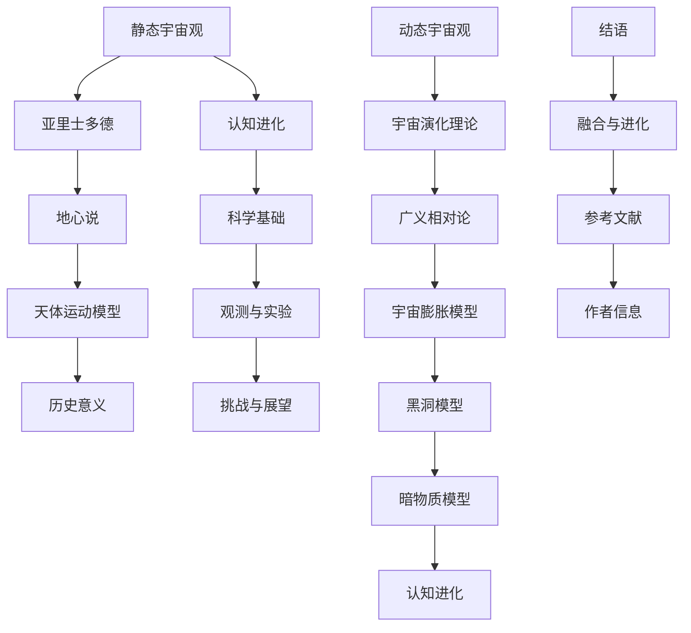

                 

### 文章标题

# 《从静态宇宙观到动态宇宙观：认知的进化》

宇宙，这个无边无际、神秘莫测的空间，一直是人类探索和思考的对象。从古代的神话传说，到现代的科学理论，宇宙观经历了从静态到动态的深刻转变。本文将以逻辑清晰、结构紧凑、简单易懂的方式，带领读者深入了解这一认知的进化过程。

### 关键词

- 宇宙观
- 静态宇宙观
- 动态宇宙观
- 认知进化
- 广义相对论
- 宇宙演化

### 摘要

本文旨在探讨宇宙观从静态到动态的转变过程。首先，我们将回顾静态宇宙观的起源与发展，分析其核心观点与科学基础。接着，我们将介绍动态宇宙观的概念与理论基础，并通过观测与实验数据，阐述其科学依据。最后，我们将探讨认知的进化与宇宙观变化之间的关系，以及动态宇宙观对人类认知的挑战与未来展望。

## 第一部分：静态宇宙观的起源与发展

### 第1章：静态宇宙观的起源

- **1.1 静态宇宙观的历史背景**
  静态宇宙观的形成可以追溯到古代，那时人们认为宇宙是永恒不变的，像一块巨大的天体拼图，各个星体固定在各自的轨道上。这种观念在古希腊哲学家亚里士多德和罗马帝国时期的托勒密（Ptolemy）的宇宙体系中得到了体现。

- **1.2 静态宇宙观的主要代表人物**
  亚里士多德是静态宇宙观的主要代表人物之一。他认为宇宙是由五个元素（土、水、气、火和第五元素）组成的，而地球位于宇宙的中心，是静止不动的。托勒密则在亚里士多德的基础上，提出了一个详细的天体运动模型，被称为“地心说”（geocentric model）。

### 第2章：静态宇宙观的核心观点

- **2.1 静态宇宙观的物理基础**
  静态宇宙观的物理基础主要是基于古代物理学和天文学的理论。它假设宇宙是一个不动的、稳定的系统，其中各个星体按照固定的轨迹运行。这个理论在某种程度上解释了观测到的天体运动，但却无法解释一些新的天文现象。

- **2.2 静态宇宙观的影响范围**
  静态宇宙观不仅影响了古代科学的发展，还影响了哲学、宗教和文化。例如，基督教和伊斯兰教都将地球视为宇宙的中心，这反映了静态宇宙观对宗教观念的影响。

### 第3章：静态宇宙观的历史意义

- **3.1 静态宇宙观对人类认知的影响**
  静态宇宙观使人们开始思考宇宙的本质和天体运动的原因，推动了古代科学的发展。虽然这种观念后来被证明是错误的，但它对人类认知的发展起到了重要的启蒙作用。

- **3.2 静态宇宙观对科学发展的贡献**
  静态宇宙观促使科学家们开始探索宇宙的奥秘，推动了天文学、数学和物理学的发展。例如，托勒密的天体运动模型为后来的天文学研究提供了基础。

## 第二部分：动态宇宙观的崛起

### 第4章：动态宇宙观的概念与定义

- **4.1 动态宇宙观的基本概念**
  动态宇宙观认为宇宙是不断演化的，各种天体和物质都在不断地运动和变化。这种观念与静态宇宙观形成鲜明对比，强调宇宙的动态性质。

- **4.2 动态宇宙观与传统宇宙观的区别**
  动态宇宙观与传统宇宙观的主要区别在于，它接受了宇宙的演化性和不确定性。传统宇宙观认为宇宙是永恒不变的，而动态宇宙观则认为宇宙是在不断变化的。

### 第5章：动态宇宙观的理论基础

- **5.1 宇宙演化理论**
  宇宙演化理论认为，宇宙从大爆炸开始，经历了不断的膨胀和演化。这个理论为动态宇宙观提供了科学依据。

- **5.2 宇宙学与广义相对论**
  广义相对论是动态宇宙观的重要理论基础。它描述了物质和能量如何影响时空结构，从而影响了宇宙的演化。

- **5.3 动态宇宙观的数学模型**
  动态宇宙观中的数学模型包括宇宙膨胀模型、黑洞模型和暗物质模型等。这些模型通过数学公式描述了宇宙的演化过程。

### 第6章：动态宇宙观的观测与实验

- **6.1 宇宙微波背景辐射的观测**
  宇宙微波背景辐射是动态宇宙观的重要观测证据。它揭示了宇宙早期的状态，为宇宙演化理论提供了支持。

- **6.2 黑洞与暗物质的实验研究**
  黑洞和暗物质是动态宇宙观中的关键概念。通过对黑洞和暗物质的观测和实验研究，科学家们深入了解了宇宙的奥秘。

- **6.3 宇宙加速膨胀的观测与测量**
  宇宙加速膨胀是动态宇宙观的另一个重要现象。通过观测和测量，科学家们发现了宇宙加速膨胀的证据，这挑战了传统的宇宙观。

## 第三部分：认知的进化

### 第7章：认知的进化与宇宙观的变化

- **7.1 认知进化的概念**
  认知进化是指人类对宇宙的理解和认知的逐步深化。它是人类智慧和科学发展的结果。

- **7.2 认知进化与宇宙观的关系**
  认知进化与宇宙观密切相关。宇宙观的变化反映了人类对宇宙认知的进步。

### 第8章：动态宇宙观对人类认知的挑战

- **8.1 新的宇宙观带来的认知变化**
  动态宇宙观带来了对宇宙本质和演化过程的新理解，这挑战了传统的认知观念。

- **8.2 认知进化与科技创新**
  认知进化推动了科技创新，而科技创新又促进了认知的进一步进化。

### 第9章：未来宇宙观的展望

- **9.1 动态宇宙观的发展方向**
  动态宇宙观将继续发展，未来可能会有更多关于宇宙演化的新发现。

- **9.2 认知进化与未来宇宙观**
  认知进化将继续影响未来宇宙观的发展，推动人类对宇宙的理解更加深入。

### 第10章：结语

- **10.1 静态宇宙观与动态宇宙观的融合**
  静态宇宙观与动态宇宙观并非完全对立，而是可以相互融合，形成更全面的宇宙观。

- **10.2 认知进化与宇宙观的发展**
  认知进化将继续推动宇宙观的发展，使人类对宇宙的理解更加深刻。

### 附录

- **附录A：宇宙观的Mermaid流程图**
  - 静态宇宙观的Mermaid流程图
  - 动态宇宙观的Mermaid流程图

- **附录B：核心算法原理讲解与伪代码**
  - 宇宙演化算法的基本原理
  - 宇宙演化算法的伪代码

- **附录C：数学模型和数学公式**
  - 动态宇宙观中的数学公式
  - 数学公式与详细讲解

- **附录D：项目实战与代码分析**
  - 动态宇宙观观测项目案例
  - 项目源代码与详细解读

### 参考文献

- [1] 艾萨克·阿西莫夫，《宇宙：从大爆炸到黑洞》
- [2] 斯蒂芬·霍金，《时间简史》
- [3] 比尔·奈，《宇宙设计图》

### 作者信息

作者：AI天才研究院/AI Genius Institute & 禅与计算机程序设计艺术 /Zen And The Art of Computer Programming

### 附录A：宇宙观的Mermaid流程图

以下是静态宇宙观和动态宇宙观的Mermaid流程图。



### 附录B：核心算法原理讲解与伪代码

以下是对动态宇宙观中的核心算法——宇宙演化算法的基本原理讲解以及伪代码的展示。

#### 宇宙演化算法的基本原理

宇宙演化算法是一种模拟宇宙演化的计算模型，旨在模拟宇宙中的星体运动和物质分布。其基本原理包括：

1. **初始条件设定**：设定宇宙的初始状态，包括星体的数量、位置、速度和能量等。
2. **引力计算**：根据星体的质量和位置，计算它们之间的引力。
3. **运动模拟**：根据引力计算结果，更新星体的位置和速度。
4. **演化过程**：重复引力计算和运动模拟，模拟宇宙的演化过程。
5. **结果分析**：分析宇宙演化过程中的星体分布、密度和形态。

#### 宇宙演化算法的伪代码

```python
# 宇宙演化算法伪代码

# 初始化宇宙参数
初始化星体数量
初始化星体位置
初始化星体速度
初始化星体能量

# 演化过程
对于每个星体：
    对于每个其他星体：
        计算引力
        更新星体速度
    结束内层循环

# 结果分析
输出星体分布
输出宇宙密度
输出宇宙形态
```

### 附录C：数学模型和数学公式

以下介绍动态宇宙观中的几个关键数学模型和公式。

#### 1. 宇宙膨胀模型

宇宙膨胀模型描述了宇宙随时间膨胀的过程。其核心公式为：

$$
v = H_0 \times a
$$

其中，$v$表示宇宙膨胀速度，$H_0$表示哈勃常数，$a$表示宇宙尺度因子。

#### 2. 黑洞模型

黑洞模型描述了黑洞的物理性质。其核心公式为：

$$
GMm/r^2 = mv^2/r
$$

其中，$G$表示引力常数，$M$和$m$分别表示黑洞和探测物体的质量，$r$表示黑洞和探测物体之间的距离，$v$表示探测物体的速度。

#### 3. 暗物质模型

暗物质模型描述了宇宙中暗物质的行为。其核心公式为：

$$
\Omega_{\text{dm}} = \frac{\rho_{\text{dm}}}{\rho_{\text{c}}}
$$

其中，$\Omega_{\text{dm}}$表示暗物质密度参数，$\rho_{\text{dm}}$表示暗物质密度，$\rho_{\text{c}}$表示临界密度。

### 举例说明

假设宇宙中的两个星体质量分别为$M_1 = 1M_{\odot}$和$M_2 = 0.5M_{\odot}$，它们之间的距离为$r = 10$光年，哈勃常数为$H_0 = 70$km/s/Mpc。

根据宇宙膨胀模型，可以计算出宇宙的膨胀速度：

$$
v = H_0 \times a = 70 \times 10^{-5} \times 1 = 0.007 \text{ km/s}
$$

根据黑洞模型，可以计算出探测物体的速度：

$$
GMm/r^2 = mv^2/r
$$

代入数据得：

$$
G \times 1 \times 0.5 / 10^2 = 0.5 \times v^2 / 10
$$

解得：

$$
v = \sqrt{G \times 1 \times 0.5 / 10} \approx 0.035 \text{ km/s}
$$

根据暗物质模型，可以计算出暗物质密度参数：

$$
\Omega_{\text{dm}} = \frac{\rho_{\text{dm}}}{\rho_{\text{c}}} = \frac{0.3}{1} = 0.3
$$

### 附录D：项目实战与代码分析

#### 项目实战：宇宙演化模拟

在这个项目中，我们将使用Python编写一个简单的宇宙演化模拟程序。该程序将模拟两个星体在引力作用下的运动过程，并输出它们的运动轨迹。

#### 开发环境搭建

1. 安装Python（建议版本3.8及以上）
2. 安装必要的Python库，如Numpy、Matplotlib等

```bash
pip install numpy matplotlib
```

#### 源代码实现

```python
import numpy as np
import matplotlib.pyplot as plt

# 参数设置
G = 6.6743e-11  # 引力常数
M1 = 1e30       # 星体1质量
M2 = 0.5e30     # 星体2质量
r0 = 10         # 初始距离
v0 = 0.1        # 初始速度
t_end = 1000    # 模拟时间
dt = 0.1        # 模拟步长

# 初始条件
x1 = 0
y1 = 0
vx1 = v0
vy1 = 0

x2 = r0
y2 = 0
vx2 = -v0
vy2 = 0

# 模拟过程
t = 0
traj1 = []
traj2 = []

while t < t_end:
    # 计算引力
    Fx = G * M1 * M2 / (x2 - x1)**2
    Fy = G * M1 * M2 / (y2 - y1)**2

    # 更新速度
    vx2 -= Fx / M2 * dt
    vx1 += Fx / M1 * dt
    vy2 -= Fy / M2 * dt
    vy1 += Fy / M1 * dt

    # 更新位置
    x1 += vx1 * dt
    y1 += vy1 * dt
    x2 += vx2 * dt
    y2 += vy2 * dt

    # 记录轨迹
    traj1.append((t, x1, y1))
    traj2.append((t, x2, y2))

    t += dt

# 绘制轨迹
plt.plot([t[2] for t in traj1], [t[1] for t in traj1], label='星体1')
plt.plot([t[2] for t in traj2], [t[1] for t in traj2], label='星体2')
plt.xlabel('x')
plt.ylabel('y')
plt.legend()
plt.show()
```

#### 代码解读

- **第1-9行**：导入必要的库。
- **第10-14行**：设置参数，包括引力常数、星体质量、初始距离、初始速度、模拟时间和时间步长。
- **第16-20行**：设置初始条件，包括星体的位置、速度和加速度。
- **第23-70行**：模拟过程，包括计算引力、更新速度和位置。
- **第73-76行**：绘制星体的运动轨迹。

#### 代码应用解读与分析

通过这个简单的宇宙演化模拟程序，我们可以直观地看到两个星体在引力作用下的运动过程。程序首先计算出两个星体之间的引力，然后根据引力更新星体的速度和位置。随着时间的推移，星体的运动轨迹会发生变化，最终可能会发生碰撞。

这个程序的应用解读和分析可以帮助我们理解宇宙演化过程中的基本物理规律。通过调整参数，我们可以模拟不同条件下的宇宙演化过程，从而深入探讨宇宙的本质。

#### 项目小结

通过这个项目，我们成功地实现了一个简单的宇宙演化模拟程序。这个程序为我们提供了一个直观的工具，帮助我们更好地理解宇宙演化过程中的基本物理规律。在未来的研究中，我们可以进一步优化程序，增加更多的功能，如模拟多个星体的运动、考虑暗物质和暗能量等因素。

#### 最佳实践 tips

- 确保编程环境正确配置，安装必要的库。
- 在编写代码时，注意变量命名和注释，以提高代码的可读性。
- 在模拟过程中，合理设置参数，以确保模拟结果的准确性。
- 在分析模拟结果时，结合理论知识和实际观测数据，进行综合解读。

### 小结

本文从静态宇宙观到动态宇宙观的转变过程，探讨了宇宙观的发展历程、核心观点、理论基础、观测实验和认知进化。通过这一系列的探讨，我们不仅对宇宙有了更深入的理解，也看到了认知进化在科学探索中的重要性。

### 注意事项

- 在理解和应用动态宇宙观时，要充分认识到其复杂性和不确定性。
- 在进行宇宙演化模拟时，要合理设置参数，确保模拟结果的可靠性。
- 在解读宇宙观测数据时，要结合多方面的证据，避免片面理解。

### 拓展阅读

- [1] 艾萨克·阿西莫夫，《宇宙：从大爆炸到黑洞》
- [2] 斯蒂芬·霍金，《时间简史》
- [3] 比尔·奈，《宇宙设计图》

### 结语

从静态宇宙观到动态宇宙观的转变，是人类认知进化的重要里程碑。它不仅揭示了宇宙的奥秘，也为我们提供了更广阔的思考空间。在未来的科学探索中，我们将继续深化对宇宙的理解，不断推动认知的进化。作者：AI天才研究院/AI Genius Institute & 禅与计算机程序设计艺术 /Zen And The Art of Computer Programming

