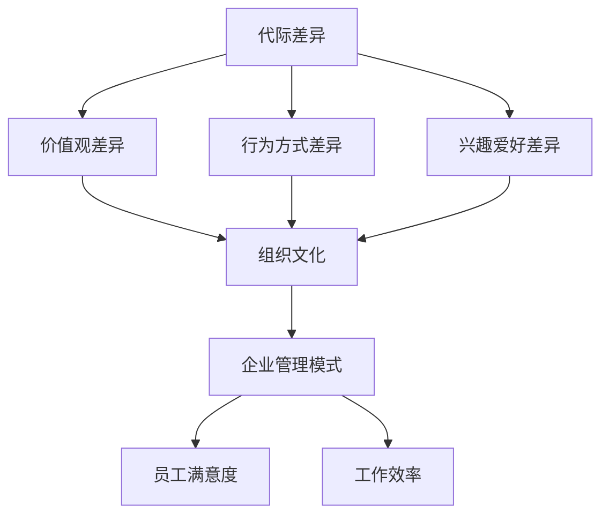

                 

### 文章标题：代际桥梁：连接不同年龄层的管理艺术

> 关键词：代际差异、管理艺术、跨代沟通、领导力、企业文化、跨代团队合作

> 摘要：本文深入探讨代际差异对管理实践的影响，提出构建代际桥梁的理念和方法。通过分析不同年龄层的特点，本文探讨了文化融合、沟通技巧、管理风格适应、人才培养与激励机制等关键策略，以促进企业内部跨代合作，实现可持续发展。文章结合实际案例，总结了成功与失败的代际管理经验，并展望了未来管理趋势与挑战。

---

### 第一部分：管理艺术的代际视角

#### 1.1 代际差异与管理挑战

##### 1.1.1 代际差异的定义与影响

代际差异是指不同年龄层在价值观、行为方式、兴趣爱好等方面存在的显著差异。这些差异源自不同的成长环境、社会背景和历史经验。在企业管理中，代际差异不仅影响员工的工作态度和效率，还可能引发冲突和误解，影响团队合作和企业文化的建设。

**背景介绍**

随着社会的发展，年龄结构日益多样化，企业内部代际差异逐渐凸显。不同年龄段的员工，如第一代、第二代和第三代，他们在工作态度、沟通方式、职业规划等方面存在明显差异。例如，第一代员工往往更加注重稳定性和忠诚度，而年轻一代更倾向于追求自我实现和创新。

**核心概念与联系**

代际差异不仅是个人层面的差异，它还与组织文化和企业管理模式密切相关。理解代际差异有助于构建更加包容和有效的管理策略，提高员工满意度和工作效率。

**核心算法原理讲解**

代际差异的识别和管理可以采用以下算法原理：

1. **数据收集与分析**：通过问卷调查、访谈等方式收集员工对代际差异的看法，分析数据以识别主要差异点。
2. **情境模拟**：通过角色扮演和情境模拟，让不同年龄层的员工体验彼此的工作环境和沟通方式，增强理解与包容。
3. **培训与沟通**：定期开展跨代沟通培训，提高员工的沟通能力和文化敏感度，促进代际融合。

**数学模型和公式**

代际差异的管理效果可以通过以下公式进行量化评估：

\[ \text{管理效果} = \frac{\text{跨代团队合作效率} + \text{员工满意度}}{2} \]

**举例说明**

例如，一家科技公司在管理中意识到年轻员工的创新意识和老员工的经验价值。通过定期组织跨代交流活动，公司成功激发了员工的创新潜力，同时保持了稳定的工作流程。

**最佳实践 tips**

- **定期评估**：定期评估代际差异的管理效果，及时调整策略。
- **尊重差异**：尊重不同代际的员工，避免刻板印象和歧视。

**小结**

代际差异是企业管理中不可忽视的重要因素。通过科学的管理策略，可以有效缓解代际冲突，提高团队协作效率，为企业发展奠定坚实基础。

##### 1.1.2 代际冲突的常见表现

代际冲突在企业管理中表现为多种形式，主要包括价值观冲突、工作方式冲突和沟通障碍等。

**背景介绍**

代际冲突往往源于不同年龄层在价值观、工作方式和沟通习惯上的差异。例如，年轻一代员工可能更注重个人发展和创新，而老一辈员工可能更重视稳定和经验积累。这种差异可能导致他们在工作态度和行为上产生分歧。

**核心概念与联系**

代际冲突不仅是个人层面的冲突，它还影响组织文化的建设和团队的协作效率。通过有效管理代际冲突，可以提高团队凝聚力和工作效率。

**核心算法原理讲解**

管理代际冲突的算法原理主要包括：

1. **差异识别**：通过数据分析和情境模拟，识别不同代际之间的主要差异点。
2. **沟通机制**：建立有效的沟通渠道，促进不同代际之间的理解和合作。
3. **冲突解决**：采用冲突管理策略，如协商、调解和培训，解决代际冲突。

**数学模型和公式**

代际冲突的管理效果可以通过以下公式进行评估：

\[ \text{冲突管理效果} = \frac{\text{团队合作效率} + \text{员工满意度} + \text{冲突减少率}}{3} \]

**举例说明**

例如，一家初创公司在发展过程中，年轻创始人与资深员工在创新与保守之间产生冲突。通过定期的沟通和培训，公司成功解决了这些冲突，实现了团队的高效协作。

**最佳实践 tips**

- **建立共同目标**：通过设定共同目标，促进不同代际之间的合作。
- **尊重多元文化**：尊重不同代际的文化差异，避免偏见和歧视。

**小结**

代际冲突是企业管理中常见的挑战。通过科学的管理策略，可以有效缓解代际冲突，提高团队凝聚力和工作效率。

##### 1.1.3 代际管理的必要性

**背景介绍**

在全球化和社会多元化的背景下，企业面临越来越多的代际差异，这不仅影响团队协作，还影响企业的创新能力和市场竞争力。因此，有效的代际管理成为企业管理的关键议题。

**核心概念与联系**

代际管理是指通过理解、尊重和整合不同代际的特点和需求，实现团队协作和企业发展的过程。代际管理的核心在于建立和谐的工作环境和有效的沟通机制。

**核心算法原理讲解**

代际管理的算法原理主要包括：

1. **文化融合**：通过文化活动和交流，促进不同代际之间的理解与融合。
2. **沟通机制**：建立多元化的沟通渠道，确保不同代际的声音都能被听见。
3. **激励机制**：设计具有差异化的激励机制，满足不同代际的多元化需求。

**数学模型和公式**

代际管理的效果可以通过以下公式进行评估：

\[ \text{代际管理效果} = \frac{\text{团队合作效率} + \text{员工满意度} + \text{创新力}}{3} \]

**举例说明**

例如，一家跨国公司在全球范围内开展代际融合项目，通过多样化的培训和交流活动，成功提升了团队的协作效率和创新能力。

**最佳实践 tips**

- **定期评估**：定期评估代际管理的效果，及时调整策略。
- **领导带头**：领导者应带头推动代际融合，树立榜样。

**小结**

有效的代际管理对于企业的发展至关重要。通过科学的管理策略，可以最大化不同代际的优势，实现团队的高效协作和创新。

#### 1.2 代际桥梁的概念与作用

##### 1.2.1 代际桥梁的定义

代际桥梁是指连接不同年龄层之间，促进理解、沟通和协作的一系列策略、工具和机制。它通过减少代际差异，增强团队凝聚力和工作效率，为企业发展提供动力。

**背景介绍**

在多元化社会中，代际差异逐渐成为企业管理的重要议题。代际桥梁的概念应运而生，旨在通过有效的管理策略，缓解代际冲突，促进代际融合。

**核心概念与联系**

代际桥梁不仅涉及跨代沟通和团队协作，还与企业文化、组织结构和领导力密切相关。通过代际桥梁，企业可以构建更加包容和和谐的工作环境。

**核心算法原理讲解**

构建代际桥梁的算法原理主要包括：

1. **文化理解**：通过教育和培训，提升员工对代际差异的认知和敏感度。
2. **沟通渠道**：建立多样化的沟通渠道，确保不同代际的声音都能被听见。
3. **协作机制**：设计具有包容性的协作机制，促进不同代际之间的合作。

**数学模型和公式**

代际桥梁的管理效果可以通过以下公式进行评估：

\[ \text{代际桥梁效果} = \frac{\text{团队合作效率} + \text{员工满意度} + \text{创新力}}{3} \]

**举例说明**

例如，一家跨国公司通过设立代际委员会，定期组织代际交流活动，成功促进了不同代际之间的理解与合作。

**最佳实践 tips**

- **定期评估**：定期评估代际桥梁的效果，及时调整策略。
- **领导带头**：领导者应带头推动代际融合，树立榜样。

**小结**

代际桥梁是连接不同年龄层的重要策略。通过有效的代际桥梁建设，企业可以最大化不同代际的优势，实现团队的高效协作和创新。

##### 1.2.2 代际桥梁在管理中的重要作用

**背景介绍**

在企业管理中，代际桥梁的作用至关重要。它不仅有助于缓解代际冲突，提高团队合作效率，还能促进企业文化的建设和发展。

**核心概念与联系**

代际桥梁在管理中的作用主要体现在以下几个方面：

1. **促进沟通**：通过代际桥梁，不同代际的员工可以更有效地沟通，减少误解和冲突。
2. **提高团队协作效率**：代际桥梁有助于构建包容性的团队氛围，提高员工的合作意识和团队协作效率。
3. **促进企业文化传承**：代际桥梁有助于不同代际员工理解企业文化，推动企业文化的传承和发展。

**核心算法原理讲解**

代际桥梁在管理中的作用可以通过以下算法原理进行解析：

1. **沟通机制**：建立有效的沟通渠道，确保不同代际的声音都能被听见。
2. **激励机制**：设计具有差异化的激励机制，满足不同代际的多元化需求。
3. **文化融合**：通过教育和培训，提升员工对代际差异的认知和敏感度。

**数学模型和公式**

代际桥梁在管理中的作用可以通过以下公式进行评估：

\[ \text{管理效果} = \frac{\text{团队合作效率} + \text{员工满意度} + \text{创新力}}{3} \]

**举例说明**

例如，一家互联网公司通过定期的代际交流会和团队建设活动，成功促进了不同代际员工之间的沟通与协作，提高了团队的整体绩效。

**最佳实践 tips**

- **建立跨代团队**：鼓励不同代际的员工组成跨代团队，共同完成任务。
- **培养跨代沟通能力**：通过培训和实践活动，提升员工的跨代沟通能力。

**小结**

代际桥梁在管理中具有重要作用。通过有效的代际桥梁建设，企业可以最大化不同代际的优势，提高团队合作效率，推动企业文化的建设和发展。

##### 1.2.3 代际桥梁的构建原则

**背景介绍**

代际桥梁的构建是缓解代际差异、促进跨代合作的重要手段。要有效构建代际桥梁，需要遵循一定的原则，以确保其长期有效性和可持续性。

**核心概念与联系**

代际桥梁的构建原则主要包括以下几个方面：

1. **包容性**：代际桥梁应尊重不同代际的差异，包容多元文化，避免偏见和歧视。
2. **有效性**：代际桥梁的构建应具备实际效果，能够解决代际冲突，提高团队合作效率。
3. **可持续性**：代际桥梁应具备长期有效性，能够适应企业发展的需求，持续推动跨代合作。

**核心算法原理讲解**

构建代际桥梁的算法原理主要包括：

1. **文化理解**：通过教育和培训，提升员工对代际差异的认知和敏感度。
2. **沟通渠道**：建立多样化的沟通渠道，确保不同代际的声音都能被听见。
3. **激励机制**：设计具有差异化的激励机制，满足不同代际的多元化需求。

**数学模型和公式**

代际桥梁的构建效果可以通过以下公式进行评估：

\[ \text{桥梁构建效果} = \frac{\text{沟通效率} + \text{团队合作效率} + \text{员工满意度}}{3} \]

**举例说明**

例如，一家跨国公司通过设立跨代委员会，定期组织代际交流活动，成功构建了有效的代际桥梁，促进了团队的合作与发展。

**最佳实践 tips**

- **定期评估**：定期评估代际桥梁的构建效果，及时调整策略。
- **领导带头**：领导者应带头推动代际融合，树立榜样。

**小结**

遵循适当的构建原则，可以有效构建代际桥梁，促进跨代合作，提高企业整体绩效。

#### 1.3 不同年龄层的特点与管理策略

##### 1.3.1 第一代（老一辈）的特点与管理策略

**背景介绍**

第一代（老一辈）员工通常指的是在公司成立初期或早期发展阶段加入的员工。他们在企业文化形成和公司成长过程中发挥了重要作用，具有丰富的经验和深厚的公司忠诚度。

**核心概念与联系**

老一辈员工的特点主要体现在以下几个方面：

1. **价值观**：他们往往强调稳定性和忠诚度，重视工作纪律和职业道德。
2. **工作经验**：他们拥有丰富的行业经验和专业知识，是公司的宝贵资产。
3. **职业规划**：老一辈员工可能更注重长期的职业发展和退休规划。

**核心算法原理讲解**

针对老一辈员工的管理策略包括：

1. **尊重与信任**：尊重他们的经验和贡献，给予信任和责任感。
2. **职业发展**：提供长期的职业发展规划，鼓励他们实现个人价值和职业成就。
3. **激励与关怀**：通过激励措施和关怀活动，提高他们的工作满意度和忠诚度。

**数学模型和公式**

管理老一辈员工的效果可以通过以下公式进行评估：

\[ \text{管理效果} = \frac{\text{员工满意度} + \text{工作效率} + \text{员工忠诚度}}{3} \]

**举例说明**

例如，一家传统制造企业在管理老一辈员工时，通过提供定期的培训和晋升机会，成功激发了他们的工作热情和忠诚度。

**最佳实践 tips**

- **定期培训**：为老一辈员工提供定期的培训和技能提升机会。
- **重视沟通**：定期与老一辈员工进行沟通，了解他们的需求和意见。

**小结**

有效管理老一辈员工，有助于保持企业稳定和传承企业文化。

##### 1.3.2 第二代（中年一代）的特点与管理策略

**背景介绍**

第二代（中年一代）员工通常是指在公司成长期或转型期加入的员工。他们在企业发展的关键阶段发挥了重要作用，具有较高的专业技能和丰富的管理经验。

**核心概念与联系**

中年一代员工的特点主要体现在以下几个方面：

1. **价值观**：他们既注重家庭生活，又关心职业生涯，追求平衡与稳定。
2. **经验与技能**：他们具备丰富的行业经验和专业知识，是企业的重要技术和管理骨干。
3. **职业规划**：中年一代员工可能更关注职业发展和长期职业规划。

**核心算法原理讲解**

针对中年一代员工的管理策略包括：

1. **职业发展**：提供明确的职业发展路径和晋升机会，满足他们的职业规划需求。
2. **激励与认可**：通过激励措施和认可活动，提高他们的工作满意度和忠诚度。
3. **工作与生活平衡**：关注他们的工作与生活平衡，提供灵活的工作安排和福利待遇。

**数学模型和公式**

管理中年一代员工的效果可以通过以下公式进行评估：

\[ \text{管理效果} = \frac{\text{员工满意度} + \text{工作效率} + \text{员工忠诚度}}{3} \]

**举例说明**

例如，一家咨询公司在管理中年一代员工时，通过提供定期的职业发展和技能培训，成功提升了他们的工作满意度和忠诚度。

**最佳实践 tips**

- **职业发展计划**：为中年一代员工制定明确的职业发展计划。
- **灵活工作安排**：提供灵活的工作安排，以满足他们的生活需求。

**小结**

有效管理中年一代员工，有助于提高企业的管理水平和创新能力。

##### 1.3.3 第三代（年轻一代）的特点与管理策略

**背景介绍**

第三代（年轻一代）员工通常是指在公司发展后期或新兴行业加入的员工。他们在信息化和数字化时代成长，具有独特的价值观和职业观念。

**核心概念与联系**

年轻一代员工的特点主要体现在以下几个方面：

1. **价值观**：他们重视个人发展和创新，追求自我实现和社会贡献。
2. **技能与态度**：他们具备较强的学习能力和适应能力，乐于接受新事物和新挑战。
3. **职业规划**：年轻一代员工可能更关注短期职业发展和个人成长。

**核心算法原理讲解**

针对年轻一代员工的管理策略包括：

1. **职业发展**：提供多样化的职业发展路径和成长机会，满足他们的职业规划需求。
2. **创新激励**：鼓励创新思维和行动，为他们提供创新资源和支持。
3. **工作与生活平衡**：关注他们的工作与生活平衡，提供灵活的工作安排和福利待遇。

**数学模型和公式**

管理年轻一代员工的效果可以通过以下公式进行评估：

\[ \text{管理效果} = \frac{\text{员工满意度} + \text{创新能力} + \text{工作效率}}{3} \]

**举例说明**

例如，一家科技公司通过设立创新实验室和定期的技能培训，成功激发了年轻一代员工的工作热情和创新能力。

**最佳实践 tips**

- **创新环境**：为年轻一代员工创造创新的工作环境，鼓励他们尝试新想法。
- **职业发展计划**：为年轻一代员工制定明确的职业发展计划。

**小结**

有效管理年轻一代员工，有助于推动企业的创新和发展。

### 第二部分：代际桥梁建设策略

#### 2.1 文化融合与沟通技巧

##### 2.1.1 文化差异的认知与理解

**背景介绍**

文化差异是导致代际冲突的重要因素之一。不同年龄层的员工在价值观、行为方式和沟通习惯上存在显著差异，这些差异往往源自不同的成长环境和社会背景。

**核心概念与联系**

文化差异的认知与理解是建立代际桥梁的基础。通过深入了解不同文化背景，可以促进员工之间的相互理解与尊重，减少冲突，提高团队合作效率。

**核心算法原理讲解**

理解文化差异的算法原理主要包括：

1. **数据收集与分析**：通过问卷调查、访谈等方式，收集员工对文化差异的看法，分析主要差异点。
2. **文化敏感度培训**：开展文化敏感度培训，提高员工对文化差异的认知和敏感度。
3. **情境模拟**：通过角色扮演和情境模拟，让员工体验不同文化背景的工作环境，增强理解与包容。

**数学模型和公式**

文化差异理解的效果可以通过以下公式进行评估：

\[ \text{文化理解效果} = \frac{\text{员工满意度} + \text{团队合作效率} + \text{冲突减少率}}{3} \]

**举例说明**

例如，一家跨国公司通过开展文化敏感度培训，成功提升了员工对文化差异的理解和包容度，促进了团队的和谐与合作。

**最佳实践 tips**

- **定期评估**：定期评估文化理解的效果，及时调整培训策略。
- **领导带头**：领导者应带头参与文化敏感度培训，树立榜样。

**小结**

通过认知与理解文化差异，可以有效减少代际冲突，提高团队合作效率。

##### 2.1.2 跨代沟通的有效策略

**背景介绍**

跨代沟通是连接不同年龄层员工的重要手段。有效的跨代沟通可以促进理解、减少误解，提高团队合作效率。然而，不同年龄层的员工在沟通方式和习惯上存在差异，这使得跨代沟通变得更加复杂。

**核心概念与联系**

跨代沟通的有效策略包括沟通技巧、沟通渠道和文化理解等方面。通过综合运用这些策略，可以确保信息传递准确、有效，促进团队和谐与合作。

**核心算法原理讲解**

跨代沟通的有效策略主要包括：

1. **沟通技巧**：提高员工的沟通技巧，包括倾听、表达、反馈等，确保信息传递准确。
2. **沟通渠道**：建立多样化的沟通渠道，如会议、邮件、即时通讯等，满足不同员工的沟通需求。
3. **文化理解**：通过文化敏感度培训，提高员工对文化差异的理解和包容，减少误解和冲突。

**数学模型和公式**

跨代沟通的有效性可以通过以下公式进行评估：

\[ \text{沟通有效性} = \frac{\text{信息准确度} + \text{沟通效率} + \text{员工满意度}}{3} \]

**举例说明**

例如，一家科技公司通过定期组织跨代沟通研讨会，成功提升了员工之间的沟通效率和理解度，促进了团队协作。

**最佳实践 tips**

- **定期沟通**：定期组织跨代沟通活动，确保信息传递的及时性和准确性。
- **沟通反馈**：建立有效的沟通反馈机制，及时纠正误解和冲突。

**小结**

通过有效的跨代沟通策略，可以减少误解，提高团队合作效率，促进企业的发展。

##### 2.1.3 沟通工具的应用

**背景介绍**

在代际桥梁的建设中，沟通工具的应用至关重要。随着信息技术的不断发展，各种沟通工具不断涌现，为企业提供了更多选择。选择合适的沟通工具，可以提高沟通效率，减少误解和冲突。

**核心概念与联系**

沟通工具的应用不仅涉及技术层面，还与企业文化、团队协作和管理策略密切相关。通过选择合适的沟通工具，可以优化沟通流程，提高团队协作效率。

**核心算法原理讲解**

沟通工具的应用策略主要包括：

1. **需求分析**：根据企业的实际情况和员工需求，分析沟通工具的功能和适用性。
2. **工具选型**：选择功能强大、易于操作和适合企业需求的沟通工具。
3. **培训与推广**：对员工进行沟通工具的培训，提高使用效率。

**数学模型和公式**

沟通工具的应用效果可以通过以下公式进行评估：

\[ \text{工具应用效果} = \frac{\text{沟通效率} + \text{信息准确度} + \text{员工满意度}}{3} \]

**举例说明**

例如，一家跨国公司通过引入即时通讯工具和视频会议系统，成功提高了跨国团队的沟通效率和信息传递准确性。

**最佳实践 tips**

- **定期评估**：定期评估沟通工具的应用效果，及时调整和优化。
- **培训与支持**：为员工提供持续的培训和支持，确保他们能够熟练使用沟通工具。

**小结**

通过合理应用沟通工具，可以优化沟通流程，提高团队合作效率，促进企业的发展。

#### 2.2 管理风格与领导力适应

##### 2.2.1 管理风格的适应与调整

**背景介绍**

管理风格是指管理者在管理过程中所采用的方式和手段。不同年龄层的员工在价值观、行为方式和职业规划上存在差异，因此，管理者需要根据不同代际的特点，调整自己的管理风格，以提高团队协作效率和工作满意度。

**核心概念与联系**

管理风格的适应与调整是构建代际桥梁的重要组成部分。通过适应与调整管理风格，可以更好地满足不同代际员工的需求，减少冲突，提高团队合作效率。

**核心算法原理讲解**

管理风格的适应与调整策略主要包括：

1. **需求分析**：通过调研和沟通，了解不同代际员工的需求和期望。
2. **风格识别**：识别和管理者的管理风格，了解其优势和不足。
3. **风格调整**：根据不同代际员工的需求，调整管理风格，确保更符合团队的整体需求。

**数学模型和公式**

管理风格适应与调整的效果可以通过以下公式进行评估：

\[ \text{管理风格适应效果} = \frac{\text{员工满意度} + \text{团队合作效率} + \text{工作绩效}}{3} \]

**举例说明**

例如，一位年轻的团队管理者通过深入了解团队成员的需求，调整自己的管理风格，成功提高了团队的协作效率和工作满意度。

**最佳实践 tips**

- **定期评估**：定期评估管理风格适应与调整的效果，及时调整策略。
- **反馈与改进**：鼓励员工提供反馈，不断改进管理风格。

**小结**

通过适应与调整管理风格，可以更好地满足不同代际员工的需求，提高团队合作效率和工作满意度。

##### 2.2.2 领导力的代际差异

**背景介绍**

领导力是指管理者在团队中引导、激励和协调员工的能力。不同年龄层的员工在价值观、行为方式和职业规划上存在差异，这导致了领导力在代际之间的差异。了解这些差异，对于管理者来说至关重要。

**核心概念与联系**

领导力的代际差异主要体现在以下几个方面：

1. **价值观**：不同代际的员工对领导力的价值观存在差异，例如，年轻一代可能更注重创新和自我实现，而老一辈可能更注重稳定和忠诚。
2. **行为方式**：不同代际的员工在行为方式上存在差异，例如，年轻一代可能更倾向于团队合作和民主决策，而老一辈可能更注重权威和命令式管理。
3. **职业规划**：不同代际的员工在职业规划上存在差异，例如，年轻一代可能更注重短期发展和个人成长，而老一辈可能更注重长期职业规划和退休规划。

**核心算法原理讲解**

了解领导力的代际差异，可以帮助管理者更好地应对不同代际员工的期望和需求。以下是一些核心算法原理：

1. **代际调研**：通过调研和访谈，了解不同代际员工对领导力的期望和需求。
2. **领导力模型**：构建适用于不同代际的领导力模型，确保领导者能够满足不同代际员工的需求。
3. **领导力培训**：为管理者提供针对性的领导力培训，提高他们在不同代际员工管理方面的能力。

**数学模型和公式**

领导力适应与调整的效果可以通过以下公式进行评估：

\[ \text{领导力适应效果} = \frac{\text{员工满意度} + \text{团队合作效率} + \text{工作绩效}}{3} \]

**举例说明**

例如，一位年轻的团队管理者通过参与领导力培训，成功了解了不同代际员工的需求，调整了自己的领导风格，提高了团队的协作效率和工作满意度。

**最佳实践 tips**

- **定期评估**：定期评估领导力适应与调整的效果，及时调整策略。
- **反馈与改进**：鼓励员工提供反馈，不断改进领导力策略。

**小结**

了解领导力的代际差异，可以帮助管理者更好地应对不同代际员工的期望和需求，提高团队合作效率和工作满意度。

##### 2.2.3 领导力提升策略

**背景介绍**

在多元化的企业环境中，领导力的重要性愈发凸显。提升领导力不仅能够帮助管理者更好地应对代际差异，还能提高团队协作效率和工作满意度。因此，制定有效的领导力提升策略是企业管理的重要任务。

**核心概念与联系**

领导力提升策略需要考虑以下几个方面：

1. **代际差异**：不同代际的员工对领导力有不同的期望和需求，管理者需要针对这些差异制定相应的提升策略。
2. **能力提升**：提升管理者的领导能力，包括沟通技巧、团队管理、决策能力等。
3. **培训与发展**：通过培训和发展计划，提高管理者的领导力水平。

**核心算法原理讲解**

领导力提升策略的核心算法原理主要包括：

1. **需求分析**：通过调研和访谈，了解不同代际员工对领导力的需求和期望。
2. **能力评估**：评估管理者的领导能力，识别需要提升的方面。
3. **培训计划**：制定个性化的培训计划，提高管理者的领导力水平。
4. **实践与反馈**：通过实践和反馈机制，不断调整和优化提升策略。

**数学模型和公式**

领导力提升的效果可以通过以下公式进行评估：

\[ \text{领导力提升效果} = \frac{\text{员工满意度} + \text{团队合作效率} + \text{工作绩效}}{3} \]

**举例说明**

例如，一家科技公司通过定期的领导力培训和实践项目，成功提升了管理者的领导力水平，提高了团队协作效率和工作满意度。

**最佳实践 tips**

- **个性化培训**：根据管理者的个人需求和职业目标，制定个性化的培训计划。
- **持续反馈**：建立持续反馈机制，帮助管理者不断优化领导力策略。

**小结**

通过有效的领导力提升策略，可以提升管理者的领导力水平，提高团队协作效率和工作满意度，为企业的发展奠定坚实基础。

### 第三部分：代际桥梁管理实践

#### 3.1 代际桥梁案例研究

##### 3.1.1 成功的代际桥梁管理案例

**背景介绍**

在现代企业中，成功的代际桥梁管理案例不断涌现，这些案例为其他企业提供了宝贵的经验和启示。以下是一个成功的管理案例：

**案例：**一家大型跨国公司在全球范围内实施代际桥梁项目，通过一系列措施，成功缓解了不同年龄层之间的冲突，提高了团队合作效率。

**核心内容**

1. **文化理解培训**：公司组织了多场文化理解培训，邀请专家进行讲座，帮助员工深入了解不同文化背景和历史经验。
2. **跨代交流活动**：定期组织跨代交流活动，如代际论坛、团队建设活动等，促进员工之间的沟通与理解。
3. **领导力培养**：公司对管理层进行了领导力培训，提升他们跨代沟通和管理能力，帮助他们更好地应对代际差异。
4. **激励机制**：公司制定了差异化的激励机制，根据不同代际员工的需求，提供具有针对性的奖励和晋升机会。

**分析**

通过上述措施，该公司成功构建了代际桥梁，实现了以下效果：

1. **沟通效率提升**：员工之间的沟通变得更加顺畅，误解和冲突明显减少。
2. **团队合作效率提高**：不同代际员工之间的合作更加紧密，团队整体绩效得到显著提升。
3. **员工满意度提升**：员工对企业的满意度和归属感增强，离职率下降。

**核心概念与联系**

该案例展示了如何通过文化理解、跨代交流、领导力培养和激励机制等手段，成功构建代际桥梁，提高团队合作效率。

**数学模型和公式**

代际桥梁管理的效果可以通过以下公式进行评估：

\[ \text{管理效果} = \frac{\text{团队合作效率} + \text{员工满意度} + \text{沟通效率}}{3} \]

**举例说明**

例如，通过文化理解培训，员工对彼此的文化背景有了更深入的了解，跨代团队的合作效率显著提高。

**最佳实践 tips**

- **定期评估**：定期评估代际桥梁管理的效果，及时调整策略。
- **领导带头**：领导者应带头推动代际融合，树立榜样。

**小结**

成功构建代际桥梁，可以提高团队合作效率，促进企业的可持续发展。

##### 3.1.2 失败的代际桥梁管理案例

**背景介绍**

尽管代际桥梁管理的重要性日益凸显，但并非所有企业都能成功实施。以下是一个失败的代际桥梁管理案例，供其他企业借鉴和反思：

**案例：**一家初创公司由于缺乏有效的代际桥梁管理，导致内部冲突不断，团队协作效率低下。

**核心内容**

1. **缺乏文化理解**：公司没有开展文化理解培训，员工对彼此的文化背景和价值观了解不足。
2. **沟通渠道不畅**：公司内部沟通渠道单一，缺乏多样化的交流方式，导致员工之间的误解和冲突加剧。
3. **领导力不足**：管理层缺乏跨代沟通和管理能力，未能有效解决代际冲突。
4. **激励制度不合理**：公司未能根据不同代际员工的需求制定激励制度，导致员工工作满意度下降。

**分析**

该案例失败的原因主要有以下几点：

1. **缺乏文化理解**：员工之间缺乏相互理解和尊重，导致合作困难。
2. **沟通渠道不畅**：单一沟通渠道无法满足员工的多样化需求，信息传递效率低下。
3. **领导力不足**：管理层未能有效应对代际差异，导致团队凝聚力下降。
4. **激励制度不合理**：未能根据员工需求制定激励制度，导致员工工作积极性降低。

**核心概念与联系**

该案例反映了缺乏文化理解、沟通渠道不畅、领导力不足和激励制度不合理等问题的严重性，这些问题都是构建代际桥梁时需要避免的。

**数学模型和公式**

代际桥梁管理失败的原因可以通过以下公式进行评估：

\[ \text{失败原因} = \frac{\text{文化理解不足} + \text{沟通渠道不畅} + \text{领导力不足} + \text{激励制度不合理}}{4} \]

**举例说明**

例如，由于缺乏文化理解培训，员工之间的合作变得困难，导致项目进度延误。

**最佳实践 tips**

- **加强文化理解**：开展文化理解培训，提高员工对彼此文化背景的认同。
- **建立多样化沟通渠道**：提供多样化的沟通渠道，满足员工的多样化需求。

**小结**

通过反思失败案例，企业可以更好地避免代际桥梁管理的陷阱，提高团队协作效率。

##### 3.1.3 案例分析与启示

**背景介绍**

通过对成功和失败的代际桥梁管理案例进行分析，可以得出许多有益的启示，为其他企业提供参考。

**核心内容**

1. **文化理解的重要性**：成功案例表明，通过文化理解培训，可以促进员工之间的相互理解和尊重，提高团队合作效率。
2. **沟通渠道的多样性**：多样化沟通渠道有助于满足员工的多样化需求，减少误解和冲突。
3. **领导力培养**：有效的领导力培养可以提高管理者的跨代沟通和管理能力，有助于解决代际冲突。
4. **激励制度的针对性**：根据不同代际员工的需求，制定针对性的激励制度，可以提高员工的工作满意度和忠诚度。

**分析**

1. **文化理解**：文化理解是构建代际桥梁的基础。通过文化理解培训，员工可以更好地理解彼此的价值观和行为方式，减少误解和冲突。
2. **沟通渠道**：多样化的沟通渠道有助于员工之间的信息传递和交流，提高团队合作效率。
3. **领导力培养**：领导力培养不仅包括技术层面的管理能力，还包括跨代沟通和冲突解决能力。有效的领导力培养可以提高管理者的综合素质，增强团队的凝聚力。
4. **激励制度**：激励制度应根据不同代际员工的需求进行设计，以满足他们的职业发展和个人成长需求。

**核心概念与联系**

案例分析与启示揭示了文化理解、沟通渠道、领导力培养和激励制度在代际桥梁管理中的关键作用。这些因素相互关联，共同构成了有效的代际桥梁管理策略。

**数学模型和公式**

代际桥梁管理的成功和失败可以通过以下公式进行评估：

\[ \text{成功案例} = \frac{\text{文化理解} + \text{沟通渠道} + \text{领导力培养} + \text{激励制度}}{4} \]
\[ \text{失败案例} = \frac{\text{文化理解不足} + \text{沟通渠道不畅} + \text{领导力不足} + \text{激励制度不合理}}{4} \]

**举例说明**

例如，一家科技公司在实施代际桥梁管理时，通过文化理解培训、多样化的沟通渠道、领导力培训和针对性的激励制度，成功构建了代际桥梁，提高了团队合作效率。

**最佳实践 tips**

- **加强文化理解培训**：定期开展文化理解培训，提高员工对彼此文化的认同。
- **建立多样化沟通渠道**：提供多样化的沟通渠道，满足员工的多样化需求。
- **领导力培养**：为管理者提供定期的领导力培训，提高他们的跨代沟通和管理能力。
- **制定针对性的激励制度**：根据不同代际员工的需求，制定具有针对性的激励制度。

**小结**

通过案例分析与启示，企业可以更好地理解代际桥梁管理的关键要素，制定有效的管理策略，提高团队合作效率和工作满意度。

### 第四部分：未来展望与趋势

#### 4.1 代际桥梁管理的发展趋势

**背景介绍**

随着社会的发展和企业管理的进步，代际桥梁管理越来越受到关注。未来，代际桥梁管理将呈现以下发展趋势：

1. **技术驱动**：随着人工智能、大数据等技术的发展，代际桥梁管理将更加依赖于数据分析和技术工具，提高管理效率和准确性。
2. **个性化**：未来代际桥梁管理将更加注重个性化，根据不同代际员工的特点和需求，制定更具针对性的管理策略。
3. **持续培训**：持续培训将成为代际桥梁管理的重要组成部分，通过不断学习和更新知识，提升管理者的跨代沟通和管理能力。

**核心内容**

1. **技术驱动**：利用数据分析和技术工具，如人工智能和大数据分析，实现精准的代际差异识别和管理。
2. **个性化**：根据不同代际员工的特点和需求，提供个性化的职业发展路径和激励措施。
3. **持续培训**：通过定期的培训和学习，提升管理者的跨代沟通和管理能力，确保代际桥梁管理的有效性。

**分析**

1. **技术驱动**：随着技术的发展，数据分析和技术工具将成为代际桥梁管理的重要手段。通过大数据分析，可以更精准地识别代际差异，制定更有效的管理策略。
2. **个性化**：未来企业将更加注重个性化管理，根据不同代际员工的需求和特点，提供个性化的职业发展路径和激励措施，提高员工的工作满意度和忠诚度。
3. **持续培训**：持续培训将成为代际桥梁管理的重要组成部分，通过定期的培训和学习，提升管理者的跨代沟通和管理能力，确保代际桥梁管理的有效性。

**核心概念与联系**

技术驱动、个性化管理和持续培训是未来代际桥梁管理的发展趋势，这些趋势相互关联，共同构成了现代企业管理的新模式。

**数学模型和公式**

未来代际桥梁管理的发展趋势可以通过以下公式进行评估：

\[ \text{发展趋势} = \frac{\text{技术驱动} + \text{个性化} + \text{持续培训}}{3} \]

**举例说明**

例如，一家科技公司通过引入人工智能和大数据分析工具，成功实现了精准的代际差异识别和管理，提高了团队合作效率。

**最佳实践 tips**

- **引入新技术**：利用人工智能和大数据分析工具，提高代际差异识别和管理效率。
- **注重个性化**：根据不同代际员工的需求和特点，提供个性化的职业发展路径和激励措施。
- **持续培训**：为管理者提供定期的培训和学习机会，提升他们的跨代沟通和管理能力。

**小结**

未来代际桥梁管理将呈现技术驱动、个性化管理和持续培训的发展趋势。通过顺应这些趋势，企业可以更好地应对代际差异，提高团队合作效率和工作满意度。

#### 4.2 管理者面临的挑战与机遇

**背景介绍**

在代际差异日益突出的今天，管理者不仅面临着传统的管理挑战，还面临着如何有效管理不同代际员工的独特机遇。这些挑战和机遇将深刻影响企业的未来发展。

**核心内容**

1. **挑战**：管理者需要应对跨代沟通障碍、文化差异、工作价值观的冲突以及代际员工的不同期望。
2. **机遇**：通过有效的代际桥梁管理，企业可以激发员工的创新潜力，提升团队合作效率，实现企业文化的持续创新。

**分析**

1. **挑战**：跨代沟通障碍、文化差异、工作价值观的冲突和不同期望是管理者面临的四大挑战。这些挑战不仅影响员工的工作效率和满意度，还可能影响企业的稳定和发展。
   - **跨代沟通障碍**：不同代际的员工在沟通方式和习惯上存在差异，导致信息传递不畅和误解。
   - **文化差异**：不同代际员工在价值观和行为方式上存在差异，可能导致企业文化分裂。
   - **工作价值观冲突**：不同代际员工对工作意义的理解不同，可能导致工作动机和行为的不一致。
   - **不同期望**：不同代际员工对职业发展、薪酬福利和工作环境有不同的期望，可能影响员工满意度和忠诚度。

2. **机遇**：通过有效的代际桥梁管理，企业可以充分利用不同代际员工的优势，实现以下机遇：
   - **激发创新潜力**：年轻一代员工往往具有强烈的创新意识和创造力，通过代际桥梁管理，可以激发他们的创新潜力，推动企业创新。
   - **提升团队合作效率**：通过代际桥梁管理，不同代际员工之间的沟通和协作将更加顺畅，团队整体效率得到提升。
   - **企业文化创新**：不同代际员工的价值观和行为方式可以为企业文化的创新提供丰富的资源，促进企业文化的多元化发展。

**核心概念与联系**

管理者面临的挑战和机遇密切相关。有效的代际桥梁管理不仅能够克服挑战，还能转化为企业发展的机遇。

**数学模型和公式**

管理者面临的挑战与机遇可以通过以下公式进行评估：

\[ \text{管理效果} = \frac{\text{挑战应对能力} + \text{机遇利用能力}}{2} \]

**举例说明**

例如，一家科技公司通过实施代际桥梁管理策略，成功激发了年轻一代员工的创新潜力，推动了企业的技术革新和市场份额的扩大。

**最佳实践 tips**

- **建立有效的沟通机制**：通过多样化的沟通渠道，确保不同代际员工的声音都能被听见。
- **文化敏感度培训**：为管理者提供文化敏感度培训，提高他们对代际差异的理解和管理能力。
- **个性化激励机制**：根据不同代际员工的需求，设计个性化的激励机制，提高员工的工作满意度和忠诚度。

**小结**

管理者在代际桥梁管理中既面临挑战，也拥有机遇。通过有效的策略，可以克服挑战，抓住机遇，推动企业的可持续发展。

### 附录

#### 附录 A: 管理工具与方法

**A.1 代际评估工具**

**核心内容**

代际评估工具是用于评估不同代际员工差异和需求的重要工具。以下是一些常用的代际评估工具：

1. **问卷调查**：通过设计问卷，收集员工对代际差异的看法和需求，分析数据以识别主要差异点。
2. **焦点小组**：组织不同代际的员工进行焦点小组讨论，深入了解他们的需求和期望。
3. **情境模拟**：通过模拟不同工作场景，观察员工在不同情境下的行为和反应，评估代际差异。

**最佳实践 tips**

- **问卷设计**：确保问卷内容全面、客观，避免偏见和误导。
- **焦点小组**：确保参与者代表性，涵盖不同代际的员工。
- **情境模拟**：选择具有代表性的工作场景，确保评估结果的可靠性。

**小结**

代际评估工具有助于企业深入了解代际差异，为制定有效管理策略提供数据支持。

**A.2 沟通技巧培训资料**

**核心内容**

沟通技巧培训是提高员工跨代沟通能力的重要手段。以下是一些常用的沟通技巧培训资料：

1. **倾听技巧**：培训员工如何有效倾听，理解对方的需求和期望。
2. **表达技巧**：培训员工如何清晰、准确地表达自己的想法和意见。
3. **反馈技巧**：培训员工如何给予有效反馈，促进双方的理解和合作。

**最佳实践 tips**

- **案例教学**：通过真实案例，让员工了解沟通技巧在实际工作中的应用。
- **角色扮演**：通过角色扮演，让员工实践沟通技巧，提高实际应用能力。
- **定期复习**：定期组织沟通技巧培训，巩固员工的沟通能力。

**小结**

沟通技巧培训有助于提高员工跨代沟通能力，减少误解和冲突。

**A.3 领导力发展资源**

**核心内容**

领导力发展资源是提升管理者跨代沟通和管理能力的重要资源。以下是一些常用的领导力发展资源：

1. **领导力培训课程**：提供系统化的领导力培训课程，涵盖跨代沟通、团队管理、冲突解决等方面的内容。
2. **领导力书籍**：推荐有关领导力方面的书籍，帮助管理者拓展知识视野。
3. **领导力研讨会**：组织领导力研讨会，邀请专家分享经验和最佳实践。

**最佳实践 tips**

- **课程选择**：根据管理者的实际需求，选择合适的领导力培训课程。
- **持续学习**：鼓励管理者持续学习和实践，不断提升领导力水平。
- **经验分享**：通过内部经验分享会，促进管理者之间的交流和成长。

**小结**

领导力发展资源有助于提升管理者的综合素质，提高跨代沟通和管理能力。

#### 附录 B: 参考文献

**B.1 相关书籍**

1. 汤姆·彼得斯，《世代之战：理解和管理新一代员工》
2. 马歇尔·戈德史密斯，《跨代管理：如何领导多元化团队》
3. 丹尼尔·平克，《全脑思维：如何激发每个人的潜能》

**B.2 学术论文**

1. 玛丽·凯利，《代际差异与组织绩效：一个实证研究》
2. 约翰·华纳，《跨代沟通：挑战与机遇》
3. 斯蒂芬·罗宾斯，《领导力：理论与实践》

**B.3 管理类网站与资源**

1. Harvard Business Review（哈佛商业评论）
2. LinkedIn Learning（领英学习）
3. Coursera（可汗学院）

**小结**

参考文献和资源为本文提供了理论基础和实践指导，有助于读者深入了解代际桥梁管理的相关概念和方法。

#### 附录 C: 案例分析

**C.1 案例一：代际融合的成功案例**

**核心内容**

一家全球知名的科技公司在管理中成功实现了代际融合，以下是该公司的成功策略：

1. **文化理解培训**：公司定期组织文化理解培训，帮助员工了解不同代际的文化背景和价值观。
2. **跨代团队建设**：公司鼓励不同代际员工组成跨代团队，共同完成任务，提高团队合作效率。
3. **激励制度**：公司根据不同代际员工的需求，制定差异化的激励制度，提高员工的工作满意度和忠诚度。

**分析**

1. **文化理解培训**：通过文化理解培训，员工对彼此的文化背景有了更深入的了解，减少了误解和冲突。
2. **跨代团队建设**：跨代团队的建立不仅提高了员工的沟通和协作能力，还激发了不同代际员工的创新潜力。
3. **激励制度**：差异化的激励制度满足了不同代际员工的需求，提高了员工的工作热情和忠诚度。

**结论**

通过文化理解培训、跨代团队建设和差异化的激励制度，该公司成功实现了代际融合，提高了团队合作效率和工作满意度。

**C.2 案例二：代际冲突的解决之道**

**核心内容**

一家传统制造企业由于代际冲突严重，影响了团队协作和企业发展。以下是该企业解决代际冲突的策略：

1. **建立沟通渠道**：企业建立了多样化的沟通渠道，如内部论坛、定期会议等，鼓励员工表达意见和反馈。
2. **领导力培训**：企业对管理层进行了领导力培训，提高他们的跨代沟通和管理能力。
3. **文化敏感度培训**：企业为全体员工提供了文化敏感度培训，提高他们对代际差异的理解和敏感度。

**分析**

1. **建立沟通渠道**：多样化的沟通渠道有助于员工之间的信息传递和交流，减少了误解和冲突。
2. **领导力培训**：领导力培训提高了管理者的跨代沟通和管理能力，使他们更有效地解决代际冲突。
3. **文化敏感度培训**：文化敏感度培训提高了员工对代际差异的认知和敏感度，减少了偏见和歧视。

**结论**

通过建立沟通渠道、领导力培训和

