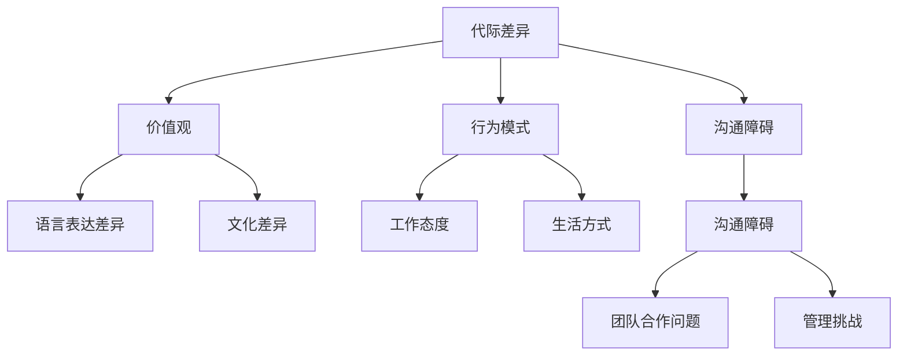

                 

### 《代际管理：bridging不同年龄层的沟通鸿沟》

#### 关键词：代际差异、沟通障碍、管理策略、跨代团队、价值观

#### 摘要：
在当今多元化、多代际的工作环境中，代际管理成为了一个重要的议题。本文旨在探讨不同年龄层之间的沟通差异及其带来的管理挑战，通过详细分析各个代际的特点、沟通障碍以及管理策略，为组织提供有效的代际管理方法，促进跨代际合作与团队绩效的提升。

#### 目录大纲：

## 《代际管理：bridging不同年龄层的沟通鸿沟》

### 目录

## 第一部分：代际管理基础

### 第1章：代际差异与沟通

- **1.1 代际差异的概念与影响**

  - **1.1.1 代际差异的定义**
  - **1.1.2 代际差异在沟通中的体现**

- **1.2 沟通障碍的原因分析**

  - **1.2.1 语言表达差异**
  - **1.2.2 价值观与文化差异**

### 第2章：不同年龄层的行为模式与价值观

- **2.1 年轻一代（Z世代）**

  - **2.1.1 Z世代的行为模式**
  - **2.1.2 Z世代的价值观**

- **2.2 中年一代（Y世代）**

  - **2.2.1 Y世代的行为模式**
  - **2.2.2 Y世代的价值观**

- **2.3 老年一代（X世代及前）**

  - **2.3.1 X世代及前的行为模式**
  - **2.3.2 X世代及前的价值观**

### 第3章：沟通障碍与代际冲突

- **3.1 沟通障碍的原因分析**

  - **3.1.1 语言表达差异**
  - **3.1.2 价值观与文化差异**

- **3.2 代际冲突的类型与表现**

  - **3.2.1 工作场所的冲突**
  - **3.2.2 家庭关系中的冲突**

## 第二部分：代际管理的策略与方法

### 第4章：建立代际沟通的桥梁

- **4.1 沟通技巧的培养**

  - **4.1.1 沟通技巧的提升方法**
  - **4.1.2 有效的沟通策略**

- **4.2 建立互信与尊重的团队文化**

  - **4.2.1 团队文化的构建**
  - **4.2.2 互信与尊重的培养**

### 第5章：制定个性化的管理策略

- **5.1 年轻一代的管理方法**

  - **5.1.1 管理策略的制定**
  - **5.1.2 激励机制的设置**

- **5.2 中年一代的激励措施**

  - **5.2.1 激励措施的选择**
  - **5.2.2 发展与晋升的支持**

- **5.3 老年一代的工作调整建议**

  - **5.3.1 工作调整的建议**
  - **5.3.2 健康与生活关注点**

### 第6章：跨代团队合作与协作

- **6.1 跨代团队的构建与维护**

  - **6.1.1 团队角色的分配**
  - **6.1.2 跨代沟通与协作的有效性**

- **6.2 跨代合作的优势与挑战**

  - **6.2.1 跨代合作的优势**
  - **6.2.2 跨代合作的挑战与应对**

## 第三部分：实践与案例

### 第7章：代际管理实战案例分析

- **7.1 案例一：科技公司跨代团队的沟通与管理**

  - **7.1.1 案例背景**
  - **7.1.2 管理策略与实施**
  - **7.1.3 案例结果与反思**

- **7.2 案例二：企业中老年员工的激励与发展**

  - **7.2.1 案例背景**
  - **7.2.2 管理策略与实施**
  - **7.2.3 案例结果与启示**

## 第四部分：经验与展望

### 第8章：代际管理经验与最佳实践

- **8.1 代际管理经验总结**

  - **8.1.1 成功经验与教训**
  - **8.1.2 代际管理的可持续性**

- **8.2 最佳实践分享**

  - **8.2.1 可行的管理工具与方法**
  - **8.2.2 持续改进与创新的策略**

### 第9章：未来展望

- **9.1 代际管理发展趋势**

  - **9.1.1 社会与技术的变化对代际管理的影响**
  - **9.1.2 未来代际管理的挑战与机遇**

- **9.2 代际管理的未来趋势**

  - **9.2.1 新兴科技的应用与潜力**
  - **9.2.2 跨国企业代际管理的策略**

### 附录

- **附录A：代际管理相关资源**

  - **A.1 学术研究文献**
  - **A.2 实践指南与工具**

### 作者

- **作者：AI天才研究院/AI Genius Institute & 禅与计算机程序设计艺术 /Zen And The Art of Computer Programming**
### 第1章：代际差异与沟通

#### 1.1 代际差异的概念与影响

**定义：**

代际差异是指不同年龄段的人由于成长环境、社会文化、历史事件等不同因素，在价值观、行为模式、生活方式等方面的差异。代际差异不仅体现在个人层面，也在组织、社会等更广泛的层面上产生影响。

**影响：**

- **沟通障碍：** 代际差异容易导致沟通障碍，因为不同代际的人可能在语言表达、沟通风格、表达方式上存在显著差异。

- **团队合作问题：** 代际差异可能导致团队合作中的冲突和误解，影响团队的效率和凝聚力。

- **管理挑战：** 领导者在管理不同代际的员工时，需要采取不同的策略，以适应不同的需求和期望。

#### 1.2 沟通障碍的原因分析

**语言表达差异：**

- **词汇使用：** 不同代际的人在词汇使用上可能存在差异，比如网络流行语、专业术语等。

- **语言风格：** 不同代际的人在语言风格上可能有所不同，例如，Z世代可能更喜欢简洁、直接的表达方式，而X世代可能更倾向于正式、严谨的语言。

**价值观与文化差异：**

- **对工作与生活的看法：** 不同代际的人对工作与生活的看法可能存在差异，例如，Y世代可能更追求工作与生活的平衡，而X世代可能更注重工作成就。

- **对权威的看法：** 不同代际的人对权威的看法也可能不同，例如，Z世代可能更倾向于平等和自主，而X世代可能更尊重传统的等级制度。

#### 1.3 沟通障碍的解决方法

**建立共同理解：**

- **共同经历：** 通过分享共同的历史事件或文化背景，帮助不同代际的人建立共同的理解和共鸣。

- **角色扮演：** 通过角色扮演，让不同代际的人体验对方的沟通风格和行为模式，增进相互理解。

**提高沟通技巧：**

- **倾听：** 倾听是有效沟通的关键，领导者需要培养倾听不同代际声音的技巧。

- **适应性沟通：** 根据不同代际的特点和需求，调整沟通方式和内容，使其更加符合对方的期望和偏好。

#### 1.4 代际差异与沟通的关系架构

下面是一个使用Mermaid绘制的代际差异与沟通的关系架构图：



通过这个架构图，我们可以清晰地看到代际差异如何影响沟通，以及沟通障碍如何进一步影响团队合作和管理。

#### 1.5 核心概念与联系

- **代际差异**：不同年龄段的人在价值观、行为模式、生活方式等方面的差异。
- **沟通障碍**：代际差异导致的语言表达差异和文化差异。
- **价值观与文化差异**：影响代际差异和沟通障碍的根本原因。

#### 1.6 核心算法原理讲解

在本节中，我们将使用伪代码来详细阐述如何分析代际差异和沟通障碍。

```python
# 输入：代际数据集
# 输出：代际差异分析报告

def analyze_generational_differences(data_set):
    # 初始化差异度量
    differences = []

    # 分析价值观差异
    values_difference = analyze_values(data_set)
    differences.append(values_difference)

    # 分析行为模式差异
    behavior_difference = analyze_behaviors(data_set)
    differences.append(behavior_difference)

    # 分析语言表达差异
    language_difference = analyze_language(data_set)
    differences.append(language_difference)

    # 分析文化差异
    culture_difference = analyze_culture(data_set)
    differences.append(culture_difference)

    # 生成报告
    report = generate_report(differences)
    return report

# 辅助函数
def analyze_values(data_set):
    # 价值观差异分析
    # ...
    return values_difference

def analyze_behaviors(data_set):
    # 行为模式差异分析
    # ...
    return behavior_difference

def analyze_language(data_set):
    # 语言表达差异分析
    # ...
    return language_difference

def analyze_culture(data_set):
    # 文化差异分析
    # ...
    return culture_difference

def generate_report(differences):
    # 生成分析报告
    # ...
    return report
```

#### 1.7 数学模型和公式

在本节中，我们将使用一个简单的数学模型来分析代际差异的影响因素。

$$
D = f(V, B, L, C)
$$

其中，$D$表示代际差异，$V$表示价值观差异，$B$表示行为模式差异，$L$表示语言表达差异，$C$表示文化差异。$f$表示影响函数，它将各个因素结合起来，形成代际差异。

#### 1.8 详细讲解与举例说明

**举例：** 假设我们有两个代际群体，分别是Z世代和X世代。通过分析他们的价值观、行为模式、语言表达和文化差异，我们可以得出以下结论：

- **价值观差异：** Z世代更加注重个人成长和自由，而X世代更注重稳定和安全感。

- **行为模式差异：** Z世代喜欢快速变化和新奇事物，而X世代倾向于稳定和传统。

- **语言表达差异：** Z世代喜欢使用网络流行语和缩写，而X世代则更倾向于正式和传统的表达方式。

- **文化差异：** Z世代受到互联网文化的影响，而X世代则受到传统价值观的影响。

通过这些分析，我们可以更好地理解不同代际之间的差异，从而制定相应的管理策略和沟通方法。

#### 1.9 小结

本章我们从代际差异的概念出发，分析了代际差异在沟通中的影响，探讨了沟通障碍的原因，并提出了解决方法。通过Mermaid图和伪代码，我们展示了代际差异与沟通障碍的关系，并提供了数学模型和实际例子来说明这些概念。在下一章中，我们将进一步探讨不同年龄层的行为模式与价值观。

### 作者

**作者：AI天才研究院/AI Genius Institute & 禅与计算机程序设计艺术 /Zen And The Art of Computer Programming**
### 第2章：不同年龄层的行为模式与价值观

#### 2.1 年轻一代（Z世代）

**行为模式：**

- **追求创新与自由：** Z世代，又称数字原住民，他们在互联网和数字技术环境中长大，对创新和自由有很高的追求。他们喜欢尝试新鲜事物，追求个性化和定制化的体验。
- **高互动性：** Z世代喜欢社交媒体和即时通讯，他们习惯于快速、即时的互动，对于线上的社交活动有着强烈的参与欲望。
- **重视工作与生活的平衡：** Z世代强调工作与生活的平衡，他们更愿意选择能够提供灵活工作时间和良好工作生活平衡的公司。
- **注重自我实现：** 他们注重自我成长和实现，追求有意义的工作和能够体现个人价值的项目。

**价值观：**

- **个人主义：** Z世代倾向于个人主义，他们更注重个人兴趣和发展，而不是传统的集体主义。
- **平等与多元化：** 他们支持平等和多元化，对性别、种族和性取向的差异持有开放和包容的态度。
- **社会责任感：** Z世代对社会问题有较高的关注，他们愿意参与公益活动，支持环保和社会正义。

**案例：**

一个典型的案例是Z世代的员工对于远程工作的接受度。由于他们从小在互联网环境中长大，习惯了线上沟通和协作，因此他们对于远程工作的接受度和适应性要远远高于其他世代。一项调查数据显示，超过70%的Z世代员工表示愿意长期从事远程工作，这反映了他们对于自由和灵活工作方式的追求。

#### 2.2 中年一代（Y世代）

**行为模式：**

- **稳定与成就：** Y世代，又称X世代，他们成长于经济波动较大的时期，因此更加注重职业稳定性和成就。他们倾向于通过不断提升自己的技能和知识来获得职业上的稳定和晋升。
- **重视团队合作：** Y世代喜欢团队合作，他们相信团队的力量可以带来更好的成果，因此他们倾向于参与团队项目。
- **追求平衡：** Y世代追求工作与生活的平衡，他们希望在职业发展的同时，能够照顾到家庭和个人生活。

**价值观：**

- **忠诚与责任感：** Y世代对公司和团队有着强烈的忠诚感，他们愿意为公司和团队付出更多，以实现共同的目标。
- **职业道德：** 他们重视职业道德和职业操守，认为诚信和专业是职业成功的关键。
- **长期规划：** Y世代倾向于做长期规划，他们会在职业发展上做出深思熟虑的选择，以实现长期的职业目标。

**案例：**

一个典型的案例是Y世代员工的职业规划。他们通常会在职业生涯的早期阶段专注于技能的提升和职业的发展，通过不断的学习和实践来积累经验和知识。例如，一个Y世代的工程师可能会通过参加专业的培训课程、阅读技术书籍、参与开源项目等方式来提升自己的技能，为将来的职业发展打下坚实的基础。

#### 2.3 老年一代（X世代及前）

**行为模式：**

- **经验与稳健：** X世代及前，又称传统一代，他们在职业生涯的早期经历了较为传统的工作环境。他们注重经验和稳健，相信经验是解决问题的关键。
- **尊重权威：** 他们通常尊重权威和等级制度，倾向于遵循传统的管理和工作方式。
- **适应力强：** X世代及前具有较强的适应能力，他们能够适应不同的工作环境和挑战。

**价值观：**

- **忠诚与责任感：** 他们对公司和团队有着强烈的忠诚感，愿意为公司和团队付出更多。
- **重视家庭：** 他们重视家庭，认为家庭是生活的重要部分，愿意在工作和家庭之间找到平衡。
- **实用主义：** 他们倾向于实用主义，相信实际成果比理论更为重要。

**案例：**

一个典型的案例是X世代员工对传统工作方式的接受度。由于他们在职业生涯的早期经历了较为传统的工作环境，因此他们对于传统的工作方式和流程有着较高的接受度和适应性。例如，他们可能会更倾向于使用传统的文档管理和报告流程，而不是现代化的数字工具。

通过以上对年轻一代、中年一代和老年一代的行为模式与价值观的详细分析，我们可以看到不同代际之间的显著差异。这些差异不仅影响了他们的沟通方式和职业发展，也对组织管理和团队协作提出了不同的挑战。在下一章中，我们将探讨这些代际差异带来的沟通障碍和冲突，并提出相应的解决策略。

### 作者

**作者：AI天才研究院/AI Genius Institute & 禅与计算机程序设计艺术 /Zen And The Art of Computer Programming**
### 第3章：沟通障碍与代际冲突

#### 3.1 沟通障碍的原因分析

沟通障碍是代际管理中的常见问题，其产生的原因主要包括以下几个方面：

1. **语言表达差异：**
   - **词汇差异：** 不同代际的人在常用词汇和术语上可能存在差异，这可能导致误解和沟通障碍。例如，年轻一代可能更熟悉网络流行语和新兴科技术语，而年长一代则可能更习惯于传统词汇。
   - **语言风格差异：** 代际间的语言风格差异也是一个重要因素。例如，年轻一代可能更倾向于简洁、直接的表达方式，而年长一代则可能更倾向于正式、严谨的语言。

2. **价值观与文化差异：**
   - **对工作与生活的看法：** 不同代际的人对工作与生活的看法可能存在显著差异。例如，年轻一代可能更注重工作与生活的平衡，而年长一代可能更注重工作的稳定性和安全感。
   - **对权威的看法：** 年轻一代可能更倾向于平等和自主，而年长一代可能更尊重传统的等级制度。这些价值观的差异可能导致沟通障碍。

3. **技术工具使用差异：**
   - **工具偏好差异：** 不同代际的人可能对技术工具的使用偏好不同。例如，年轻一代可能更喜欢使用最新的社交媒体和即时通讯工具，而年长一代可能更倾向于使用传统的电话和电子邮件。

4. **社会背景与历史经验差异：**
   - **社会背景差异：** 不同代际的人在成长环境、社会文化背景上可能存在显著差异，这可能导致他们在沟通时缺乏共同的语言和背景知识。
   - **历史经验差异：** 不同代际的人经历了不同的历史事件和社会变革，这可能导致他们在看待问题和管理方法上的差异。

#### 3.2 代际冲突的类型与表现

代际冲突在工作和家庭环境中都可能体现出来，以下是一些常见的类型和表现：

1. **工作场所的冲突：**
   - **任务分配不公：** 年轻一代可能认为任务分配不公，而年长一代可能认为年轻一代不够成熟。
   - **工作态度差异：** 年轻一代可能更追求自由和灵活性，而年长一代可能更注重稳定和纪律。
   - **沟通不畅：** 由于语言表达差异和价值观差异，不同代际的员工可能在沟通中产生误解和冲突。

2. **家庭关系中的冲突：**
   - **代际育儿观念差异：** 年轻一代的父母可能与年长一代的育儿观念存在差异，这可能导致家庭冲突。
   - **代际价值观差异：** 不同代际的人在家庭价值观上可能存在差异，这可能导致家庭内部的冲突。
   - **沟通障碍：** 由于代际差异，家庭成员之间可能在沟通中遇到障碍，导致误解和冲突。

#### 3.3 解决策略

为了解决沟通障碍和代际冲突，组织和个人可以采取以下策略：

1. **建立共同理解：**
   - **共同经历：** 通过分享共同的历史事件或文化背景，帮助不同代际的人建立共同的理解和共鸣。
   - **角色扮演：** 通过角色扮演，让不同代际的人体验对方的沟通风格和行为模式，增进相互理解。

2. **提高沟通技巧：**
   - **倾听：** 倾听是有效沟通的关键，领导者需要培养倾听不同代际声音的技巧。
   - **适应性沟通：** 根据不同代际的特点和需求，调整沟通方式和内容，使其更加符合对方的期望和偏好。

3. **建立互信与尊重的团队文化：**
   - **互信：** 通过建立互信，减少误解和冲突，提高团队协作效率。
   - **尊重：** 尊重不同代际的差异，鼓励团队成员理解和接纳对方的观点。

4. **制定个性化的管理策略：**
   - **年轻一代：** 针对年轻一代的个性化和自主性需求，提供灵活的工作安排和职业发展机会。
   - **中年一代：** 针对中年一代的职业稳定性和成就需求，提供职业晋升机会和培训支持。
   - **老年一代：** 针对老年一代的经验和适应能力，提供适当的工作调整和关怀。

通过以上策略，组织可以有效地管理不同代际的员工，减少沟通障碍和冲突，提高团队的整体绩效。

#### 3.4 核心概念与联系

- **沟通障碍**：由语言表达差异、价值观与文化差异、技术工具使用差异等因素引起。
- **代际冲突**：在工作场所和家庭关系中表现出来的冲突。
- **解决策略**：通过建立共同理解、提高沟通技巧、建立互信与尊重的团队文化、制定个性化的管理策略来解决问题。

#### 3.5 核心算法原理讲解

在本节中，我们将使用一个简单的伪代码模型来分析沟通障碍和代际冲突的解决策略。

```python
# 输入：代际数据、沟通障碍数据
# 输出：解决策略建议

def analyze_communication_barriers(data):
    # 初始化解决策略
    strategies = []

    # 分析语言表达差异
    lang_difference = analyze_language(data)
    strategies.append(create_lang_strategy(lang_difference))

    # 分析价值观与文化差异
    value_difference = analyze_values(data)
    strategies.append(create_value_strategy(value_difference))

    # 分析技术工具使用差异
    tech_difference = analyze_tech_tools(data)
    strategies.append(create_tech_strategy(tech_difference))

    # 生成解决策略建议
    final_strategy = generate_final_strategy(strategies)
    return final_strategy

# 辅助函数
def analyze_language(data):
    # 语言表达差异分析
    # ...
    return lang_difference

def analyze_values(data):
    # 价值观与文化差异分析
    # ...
    return value_difference

def analyze_tech_tools(data):
    # 技术工具使用差异分析
    # ...
    return tech_difference

def create_lang_strategy(difference):
    # 创建语言表达差异解决策略
    # ...
    return strategy

def create_value_strategy(difference):
    # 创建价值观与文化差异解决策略
    # ...
    return strategy

def create_tech_strategy(difference):
    # 创建技术工具使用差异解决策略
    # ...
    return strategy

def generate_final_strategy(strategies):
    # 生成最终解决策略建议
    # ...
    return final_strategy
```

#### 3.6 数学公式

在本节中，我们将使用一个简单的数学模型来描述沟通障碍和代际冲突的解决过程。

$$
S = f(C, L, V)
$$

其中，$S$表示解决策略，$C$表示沟通障碍，$L$表示语言表达差异，$V$表示价值观与文化差异。$f$表示影响函数，它将沟通障碍、语言表达差异和价值观与文化差异结合起来，形成最终的解决策略。

#### 3.7 详细讲解与举例说明

**举例：** 假设一个组织中存在以下问题：

- 语言表达差异：年轻一代和年长一代在沟通时使用不同的词汇和术语。
- 价值观差异：年轻一代更注重个人成长和自由，而年长一代更注重职业稳定性和安全感。
- 技术工具使用差异：年轻一代更喜欢使用最新的社交媒体和即时通讯工具，而年长一代更倾向于使用传统的电话和电子邮件。

通过分析这些问题，我们可以制定以下解决策略：

- **语言表达差异解决策略：** 鼓励团队成员使用通用词汇和术语，减少误解和沟通障碍。
- **价值观差异解决策略：** 通过建立互信和尊重的团队文化，促进不同代际之间的理解和支持。
- **技术工具使用差异解决策略：** 提供培训和指导，帮助年长一代熟悉和使用最新的技术工具。

通过这些解决策略，组织可以有效地减少沟通障碍和代际冲突，提高团队协作效率。

#### 3.8 小结

本章我们从沟通障碍和代际冲突的原因出发，分析了不同年龄层之间的差异，并提出了相应的解决策略。通过伪代码和数学模型，我们展示了如何分析问题和制定解决策略。在下一章中，我们将探讨代际管理的具体策略和方法，帮助组织更好地管理不同代际的员工。

### 作者

**作者：AI天才研究院/AI Genius Institute & 禅与计算机程序设计艺术 /Zen And The Art of Computer Programming**
### 第4章：建立代际沟通的桥梁

#### 4.1 沟通技巧的培养

**1. 提升倾听技巧：**
倾听是沟通的核心，不同代际的员工可能由于语言表达差异而出现误解。提升倾听技巧可以帮助我们更准确地理解对方的意图。
   - **主动倾听**：在与不同代际的员工交流时，要保持专注，避免分心，确保对方感受到自己的关注。
   - **确认理解**：在对方发言结束后，可以通过复述对方的主要观点或问题，来确认自己是否正确理解了对方的意图。

**2. 调整语言表达：**
为了有效沟通，我们需要根据不同代际的喜好和习惯，调整语言表达方式。
   - **简洁明了**：年轻一代可能喜欢直接和简洁的表达，因此在沟通时应避免冗长的陈述。
   - **尊重传统**：年长一代可能更喜欢正式和传统的表达方式，因此在沟通时应该使用更正式的语言。

**3. 增强适应性沟通：**
适应性沟通是建立有效沟通的关键，它要求我们在不同情境下灵活调整沟通策略。
   - **情境适应**：根据不同代际的偏好，选择合适的沟通渠道和方式。例如，对于年轻一代，可以使用即时通讯工具，而对于年长一代，可能更适用于电话或邮件。
   - **文化适应**：了解不同代际的文化背景和价值观，避免使用可能引起误解或冒犯的词汇和表达方式。

#### 4.2 建立互信与尊重的团队文化

**1. 倡导多元化：**
多元化是建立互信与尊重的基石。在团队中，应鼓励多元文化和价值观的交流，尊重每个人的独特性和贡献。
   - **包容性**：尊重不同代际的观点和经验，避免因代际差异而产生偏见和歧视。
   - **共同目标**：通过明确团队目标，使不同代际的员工共同奋斗，增强团队凝聚力。

**2. 建立反馈机制：**
有效的反馈机制可以帮助团队成员了解彼此的需求和期望，从而建立互信。
   - **定期反馈**：定期进行团队反馈，鼓励团队成员分享自己的看法和建议，建立开放和透明的沟通环境。
   - **建设性反馈**：在提供反馈时，要注重建设性，避免批评和指责，以促进个人和团队的发展。

**3. 培养领导力：**
领导者在建立互信与尊重的团队文化中扮演关键角色。领导者应该通过以下方式培养领导力：
   - **以身作则**：领导者应以身作则，通过自己的行为树立榜样，推动团队文化的建立。
   - **激励团队**：领导者要善于发现和激发团队成员的潜力，鼓励他们发挥最大的能力。

#### 4.3 案例分析

**案例一：科技公司跨代团队的沟通与管理**

**背景：**
一家科技公司由年轻的Z世代的工程师和中年的Y世代的项目经理组成。由于代际差异，团队成员在沟通和协作中遇到了一些问题，影响了项目的进度和质量。

**管理策略与实施：**

1. **共同培训：**
   - **沟通技巧培训**：组织了代际沟通技巧的培训课程，帮助年轻一代工程师了解年长一代项目经理的语言表达习惯和价值观。
   - **领导力培训**：同时，也组织了领导力培训，帮助年长一代项目经理学习如何与年轻一代有效沟通和协作。

2. **建立反馈机制：**
   - **定期会议**：定期召开团队会议，鼓励团队成员分享自己的想法和困惑，项目经理也及时给予反馈和建议。
   - **匿名反馈**：为了保护团队成员的隐私，会议中引入了匿名反馈机制，让每个人都能自由表达自己的观点。

3. **文化融合活动：**
   - **团队建设**：组织了团队建设活动，如团建旅游、聚餐等，帮助团队成员建立更紧密的关系，促进跨代际的交流和合作。
   - **文化分享**：鼓励团队成员分享自己的成长故事和文化背景，增进相互了解和尊重。

**结果与反思：**

- **沟通效率提高**：通过培训和反馈机制的建立，团队成员之间的沟通效率得到了显著提高。
- **团队凝聚力增强**：团队建设活动和文化分享活动增强了团队成员之间的凝聚力，减少了代际冲突。
- **项目进展顺利**：随着沟通障碍的消除，项目进展更加顺利，质量和效率也得到了提升。

**反思：**

- **持续改进**：尽管取得了初步成功，但团队认识到代际管理是一个长期的过程，需要持续改进和优化。
- **个性化需求**：每个代际的员工都有其独特的需求和期望，管理者需要根据实际情况制定个性化的管理策略。

#### 4.4 小结

本章我们从沟通技巧的培养、建立互信与尊重的团队文化以及实际案例中，探讨了如何建立代际沟通的桥梁。通过提升倾听技巧、调整语言表达、增强适应性沟通，我们可以有效地减少沟通障碍。同时，通过倡导多元化、建立反馈机制、培养领导力，我们可以建立互信与尊重的团队文化。案例分析展示了这些策略在实践中的应用效果。在下一章中，我们将进一步探讨如何制定个性化的管理策略，以适应不同代际的员工需求。

### 作者

**作者：AI天才研究院/AI Genius Institute & 禅与计算机程序设计艺术 /Zen And The Art of Computer Programming**
### 第5章：制定个性化的管理策略

#### 5.1 年轻一代的管理方法

针对年轻一代（Z世代）的员工，管理者需要了解他们的行为模式和价值观，并制定相应的管理方法。

**1. 激励机制：**
- **成就导向**：年轻一代员工通常对个人成就有较高追求，管理者可以通过设定明确的个人目标和成就指标来激励他们。
- **灵活性奖励**：提供灵活的工作时间和自主管理的机会，以适应年轻一代对自由和个性化的追求。

**2. 职业发展：**
- **职业路径规划**：为年轻一代员工提供明确的职业发展路径和晋升机会，帮助他们规划职业生涯。
- **技能培训**：提供持续的学习和培训机会，帮助年轻一代不断提升自己的技能和知识。

**3. 工作环境：**
- **创新文化**：营造鼓励创新和尝试错误的企业文化，让年轻一代员工能够自由发挥他们的创造力。
- **社交互动**：组织团队活动和工作社交，促进年轻一代员工之间的交流和合作。

#### 5.2 中年一代的激励措施

中年一代（Y世代）的员工通常在职业生涯中追求稳定和成就感。

**1. 激励机制：**
- **成就奖励**：通过提供成就奖励，如奖金、晋升和荣誉称号，来激励中年一代员工。
- **工作与生活平衡**：为中年一代员工提供灵活的工作时间和远程工作的机会，以平衡工作和家庭。

**2. 职业发展：**
- **晋升机会**：为中年一代员工提供明确的晋升路径和机会，激励他们不断提升自己的职业能力。
- **职业培训**：提供定期的职业培训和技能提升课程，以帮助中年一代员工保持竞争力。

**3. 工作环境：**
- **工作安全感**：为中年一代员工提供稳定的工作环境和长期职业规划，增强他们的工作安全感。
- **团队支持**：鼓励中年一代员工参与团队项目，提供团队支持和协作机会。

#### 5.3 老年一代的工作调整建议

老年一代（X世代及前）的员工通常拥有丰富的经验和专业知识，但可能需要适度的调整来适应新的工作环境和需求。

**1. 工作调整：**
- **技能更新**：为老年一代员工提供技能更新的培训，帮助他们适应新的工作技术和工具。
- **工作量调整**：根据老年一代员工的身体和精力状况，适当调整工作量，确保他们能够保持工作效率。

**2. 健康与生活关注点：**
- **健康福利**：提供健康福利，如体检、健身房会员等，关注老年一代员工的健康状况。
- **灵活退休政策**：为老年一代员工提供灵活的退休政策，如延迟退休、兼职工作等，以满足他们的生活需求。

#### 5.4 案例分析

**案例一：科技公司针对年轻一代的管理策略**

**背景：**
一家科技公司意识到其年轻一代员工在职业发展方面存在一些挑战，如职业路径不明确、技能提升机会有限等。

**管理策略与实施：**

1. **明确职业发展路径**：公司为年轻一代员工制定了明确的职业发展路径，包括晋升机会和技能提升目标。
2. **提供技能培训**：公司定期组织内部技能培训和外部专业课程，帮助年轻一代员工提升技能。
3. **鼓励创新**：公司鼓励年轻一代员工参与创新项目和自主研究，提供资金和资源支持。

**结果与反思：**

- **员工满意度提升**：通过明确的职业发展路径和技能培训，年轻一代员工的职业满意度显著提升。
- **创新能力增强**：年轻一代员工的创新意识和能力得到了显著增强，推动了公司的技术进步。
- **持续改进**：公司认识到职业发展和管理策略需要持续改进，以适应年轻一代员工的需求和期望。

#### 5.5 小结

本章我们从年轻一代、中年一代和老年一代的个性化管理策略出发，探讨了如何根据不同代际的特点和需求，制定针对性的管理方法。通过激励机制的设置、职业发展支持和工作调整建议，组织可以更好地管理不同代际的员工，提高团队的整体绩效。在下一章中，我们将探讨跨代团队合作与协作的策略，以促进跨代际的有效合作。

### 作者

**作者：AI天才研究院/AI Genius Institute & 禅与计算机程序设计艺术 /Zen And The Art of Computer Programming**
### 第6章：跨代团队合作与协作

#### 6.1 跨代团队的构建与维护

**1. 明确团队目标：**
   为了确保跨代际团队的有效合作，首先需要明确团队的目标和愿景。这有助于不同代际的成员理解彼此的目标，并形成共同的奋斗方向。
   ```mermaid
   graph TD
   A[明确团队目标] --> B[设立团队愿景]
   B --> C[分配任务和责任]
   C --> D[建立团队规则]
   ```

**2. 分配任务和责任：**
   根据不同代际成员的能力和经验，合理分配任务和责任。这有助于发挥每个代际成员的优势，同时减少因任务分配不公而产生的冲突。
   ```mermaid
   graph TD
   A[分配任务和责任] --> B[年轻一代：创新和灵活性]
   B --> C[中年一代：稳定性和经验]
   C --> D[老年一代：经验和知识]
   ```

**3. 建立团队规则：**
   团队规则是确保跨代际团队合作顺畅的关键。这些规则应涵盖沟通方式、工作流程、冲突解决机制等，以减少因文化差异和沟通障碍而产生的误解。
   ```mermaid
   graph TD
   A[建立团队规则] --> B[沟通规则]
   B --> C[工作流程规则]
   C --> D[冲突解决规则]
   ```

**4. 促进跨代际交流：**
   定期组织跨代际交流会议，鼓励团队成员分享观点和经验。这有助于建立信任和理解，减少代际间的隔阂。
   ```mermaid
   graph TD
   A[促进跨代际交流] --> B[定期交流会议]
   B --> C[经验分享会]
   C --> D[团建活动]
   ```

#### 6.2 跨代沟通与协作的有效性

**1. 沟通策略：**
   跨代沟通的有效性取决于采用的沟通策略。以下是一些提高跨代际沟通有效性的策略：
   ```mermaid
   graph TD
   A[沟通策略] --> B[适应性沟通]
   B --> C[倾听技巧]
   C --> D[明确表达]
   ```

**2. 协作工具：**
   现代协作工具可以帮助跨代际团队更高效地合作。以下是一些常用的协作工具：
   ```mermaid
   graph TD
   A[协作工具] --> B[即时通讯工具]
   B --> C[项目管理软件]
   C --> D[虚拟会议工具]
   ```

**3. 评估与反馈：**
   定期评估跨代际团队合作的效果，并收集团队成员的反馈，以不断改进合作方式。
   ```mermaid
   graph TD
   A[评估与反馈] --> B[团队绩效评估]
   B --> C[成员反馈收集]
   C --> D[改进合作方式]
   ```

#### 6.3 跨代合作的优势与挑战

**优势：**

- **多样化的技能和经验：** 跨代际团队可以结合不同代际的技能和经验，形成互补优势，提高团队的创造力和管理能力。

- **丰富的资源：** 不同代际的成员可能拥有不同的资源，如人脉、知识等，这些资源可以用于团队的项目和任务。

- **适应力强：** 跨代际团队在面对复杂和多变的工作环境时，更具适应力和灵活性。

**挑战：**

- **沟通障碍：** 不同代际在语言、价值观和沟通风格上可能存在差异，导致沟通障碍和误解。

- **冲突管理：** 代际差异可能导致冲突，如任务分配不公、职业发展期望不一致等。

- **组织文化：** 组织的文化和价值观可能不利于跨代际的合作，需要通过调整和优化来促进跨代际的融合。

#### 6.4 案例分析

**案例一：科技公司跨代团队的协作**

**背景：**
一家科技公司由年轻一代的工程师、中年一代的产品经理和老年一代的运维团队组成。由于代际差异，团队在协作过程中遇到了一些挑战。

**管理策略与实施：**

1. **明确团队目标**：公司明确了团队的目标，即提高产品的市场竞争力，并设立了具体的绩效指标。

2. **任务分配**：根据不同成员的专长和经验，合理分配任务。例如，年轻一代工程师负责创新和开发，中年一代产品经理负责市场和产品策略，老年一代运维团队负责稳定性和安全性。

3. **沟通工具**：公司引入了多种沟通工具，如即时通讯软件、项目管理软件和虚拟会议工具，以促进跨代际的沟通和协作。

4. **定期反馈**：公司定期组织团队会议，收集成员的反馈，及时调整和改进协作方式。

**结果与反思：**

- **协作效率提升**：通过明确的任务分配和有效的沟通工具，团队的协作效率显著提升。

- **创新能力增强**：年轻一代工程师的创新能力和中年一代产品经理的市场洞察力相结合，推动了产品的快速迭代。

- **团队凝聚力增强**：通过定期反馈和团队建设活动，团队的凝聚力得到了增强。

- **持续改进**：公司认识到跨代际协作是一个持续的过程，需要不断优化和改进。

#### 6.5 小结

本章我们从跨代团队的构建与维护、跨代沟通与协作的有效性以及跨代合作的优势与挑战出发，探讨了如何在组织中促进跨代际的有效合作。通过明确团队目标、合理分配任务、引入沟通工具和定期反馈等策略，组织可以克服代际差异带来的挑战，实现跨代际的协作共赢。在下一章中，我们将分享代际管理实战案例，进一步探讨代际管理的实践经验和最佳策略。

### 作者

**作者：AI天才研究院/AI Genius Institute & 禅与计算机程序设计艺术 /Zen And The Art of Computer Programming**
### 第7章：代际管理实战案例分析

#### 7.1 案例一：科技公司跨代团队的沟通与管理

**背景：**

一家全球领先的科技公司，由于其员工队伍中包含了Z世代、Y世代和X世代等多个代际的成员，团队内部出现了沟通障碍和协作效率低下的情况。年轻一代的工程师们倾向于使用即时通讯工具和敏捷开发方法，而中年一代的产品经理们则更习惯于传统的项目管理和电子邮件沟通。老年一代的IT支持人员则对新技术持谨慎态度，更倾向于使用熟悉的方法和工具。这种代际差异导致了团队内部的冲突和误解，影响了项目的进度和质量。

**管理策略与实施：**

1. **设立跨代际沟通委员会：**
   公司设立了跨代际沟通委员会，由来自不同代际的员工代表组成，定期召开会议，讨论代际差异带来的问题和解决方案。该委员会负责收集团队成员的意见和建议，并制定跨代际沟通策略。

2. **提供沟通培训：**
   公司为不同代际的员工提供了沟通技巧培训，包括有效的倾听技巧、适应性沟通策略和冲突解决方法。通过这些培训，员工们学会了如何更有效地表达自己的想法，并理解其他代际的沟通方式。

3. **引入协作工具：**
   公司引入了多种协作工具，如项目管理软件、虚拟会议平台和即时通讯工具，以便不同代际的员工能够方便地交流和协作。这些工具的使用规范也在培训中得到了强调。

4. **建立共同目标：**
   公司通过明确团队目标，使得不同代际的员工能够理解彼此的工作意义，形成共同的方向。例如，团队目标可以是提高产品市场的竞争力，提升用户满意度等。

5. **组织团建活动：**
   公司定期组织团队建设活动，如团队聚餐、户外拓展等，以增进不同代际员工之间的了解和友谊，减少隔阂。

**结果与反思：**

- **沟通效率提升：** 通过跨代际沟通委员会和沟通培训，员工之间的沟通效率显著提高，误解和冲突减少。
- **团队凝聚力增强：** 团建活动的开展增强了团队凝聚力，不同代际的员工之间的关系更加融洽。
- **项目进展顺利：** 跨代际团队合作的效果显著，项目的进度和质量都得到了提升。

反思：公司在实践中认识到，代际管理需要持续关注和改进。未来，公司计划进一步优化沟通机制，增加团队间的反馈和交流机会，以确保不同代际的员工能够在不断变化的工作环境中保持高效合作。

#### 7.2 案例二：企业中老年员工的激励与发展

**背景：**

一家传统制造企业在进行组织变革时，发现其老年员工（X世代及前）的积极性不高，职业发展机会有限，这对企业的稳定性和创新性都产生了影响。老年员工通常拥有丰富的经验和专业知识，但由于对新技术和现代管理方式的接受度较低，他们在新的工作环境中感到不适应和失落。

**管理策略与实施：**

1. **技能更新培训：**
   企业为老年员工提供了技能更新培训，包括现代办公软件、项目管理工具和新技术的使用。通过培训，老年员工能够更好地适应新的工作环境和技术要求。

2. **职业发展支持：**
   企业为老年员工提供了明确的职业发展路径和支持。通过一对一的职业规划咨询和辅导，老年员工得以制定个人发展计划，并获得相应的支持和资源。

3. **健康与生活关怀：**
   企业为老年员工提供了健康福利和生活关怀，如定期体检、健康讲座和灵活的工作时间安排。这些措施帮助老年员工保持了良好的工作状态和生活质量。

4. **角色重塑：**
   企业鼓励老年员工根据自身经验和特长，重新定义自己的工作角色。例如，将老年员工安排在指导新员工、传承知识和经验等关键岗位上，充分发挥他们的价值。

**结果与反思：**

- **员工积极性提升：** 通过技能更新和职业发展支持，老年员工的积极性显著提升，他们更加投入工作，并愿意为公司的发展贡献自己的力量。
- **企业稳定性增强：** 老年员工的稳定性和经验对企业文化的传承和组织稳定起到了重要作用。
- **创新力提升：** 老年员工在新技术和现代管理方式上的适应，为企业带来了新的思维和创新能力。

反思：企业在实践中发现，代际管理不仅仅是提供培训和福利，更重要的是要理解和尊重老年员工的需求和价值观。未来，企业计划继续优化代际管理策略，关注老年员工的职业发展和生活需求，确保他们在组织中的长期价值。

### 7.3 代际管理经验总结

通过以上两个案例，我们可以总结出以下代际管理经验：

- **沟通是关键**：有效的沟通是代际管理的基础，通过沟通培训、协作工具和定期交流，可以减少代际差异带来的误解和冲突。
- **个性化支持**：针对不同代际的特点和需求，提供个性化的职业发展支持、技能更新培训和健康关怀，可以提升员工的满意度和工作积极性。
- **共同目标**：明确团队目标，使不同代际的员工能够理解彼此的工作意义，形成共同的方向和努力。
- **持续关注**：代际管理是一个持续的过程，需要不断关注和改进，以确保代际差异得到有效管理和利用。

### 7.4 最佳实践分享

为了实现有效的代际管理，以下是一些最佳实践：

- **建立代际沟通渠道**：设立代际沟通委员会或团队，定期召开会议，收集员工的反馈和建议。
- **提供多样化的培训**：根据不同代际的需求，提供多样化的培训，包括沟通技巧、技能更新、职业发展等。
- **鼓励跨代际合作**：通过项目合作和团队建设活动，鼓励不同代际的员工相互学习和合作，促进代际融合。
- **尊重代际差异**：在管理中尊重不同代际的价值观和行为习惯，避免因代际差异而产生偏见和歧视。

### 7.5 未来展望

随着社会的不断发展和变化，代际管理面临着新的挑战和机遇。未来，代际管理的发展趋势包括：

- **科技应用**：随着人工智能和大数据技术的发展，代际管理工具和方法将更加智能化和个性化。
- **文化融合**：跨文化管理将成为代际管理的重要组成部分，不同国家和地区的文化差异需要得到关注和尊重。
- **长期规划**：企业需要制定长期的代际管理规划，确保不同代际的员工能够在组织中获得持续的职业发展和生活满足。

通过不断探索和实践，代际管理将在未来发挥更大的作用，为企业和社会带来更多的价值。

### 7.6 附录

#### 附录 A：代际管理相关资源

**A.1 学术研究文献：**
- *“Generational Differences in the Workplace: Communication, Management, and Effectiveness” by Kevin D. Rennie and Richard E. Story.*
- *“Managing the Multigenerational Workforce: Leveraging the Power of Generational Diversity” by Thomas G. Chemmanur.*

**A.2 实践指南与工具：**
- *“Generational Diversity Guide” by The Society for Human Resource Management (SHRM)*
- *“5 Best Practices for Managing a Multigenerational Workforce” by Harvard Business Review.*

### 作者

**作者：AI天才研究院/AI Genius Institute & 禅与计算机程序设计艺术 /Zen And The Art of Computer Programming**
### 第8章：代际管理经验与最佳实践

#### 8.1 代际管理经验总结

**1. 沟通是关键：** 通过有效的沟通可以减少代际差异带来的误解和冲突。定期举行代际交流会、培训沟通技巧、使用多样化的沟通工具，都是提高跨代际沟通效果的重要措施。

**2. 个性化支持：** 针对不同代际的员工，提供个性化的职业发展支持、技能更新培训和健康关怀，有助于提升员工的满意度和工作积极性。

**3. 共同目标：** 明确团队目标，使不同代际的员工能够理解彼此的工作意义，形成共同的方向和努力。

**4. 尊重差异：** 在管理中尊重不同代际的价值观和行为习惯，避免因代际差异而产生偏见和歧视。

**5. 持续关注：** 代际管理是一个持续的过程，需要不断关注和改进，以确保代际差异得到有效管理和利用。

#### 8.2 最佳实践分享

**1. 建立代际沟通渠道：** 设立代际沟通委员会或团队，定期召开会议，收集员工的反馈和建议。这有助于建立跨代际的信任和合作关系。

**2. 提供多样化的培训：** 根据不同代际的需求，提供多样化的培训，包括沟通技巧、技能更新、职业发展等。例如，为年轻一代提供创新思维培训，为中老年员工提供新技术应用培训。

**3. 鼓励跨代际合作：** 通过项目合作和团队建设活动，鼓励不同代际的员工相互学习和合作，促进代际融合。例如，可以组织跨代际团队项目，让年轻员工向中老年员工学习经验和技能。

**4. 实施代际管理工具：** 利用人工智能和大数据技术，开发代际管理工具，如代际分析软件、沟通效果评估系统等，以实现更精准的管理。

**5. 建立灵活的工作安排：** 根据不同代际的需求，提供灵活的工作安排，如远程办公、弹性工作时间等，以适应不同代际的员工。

#### 8.3 持续改进与创新的策略

**1. 定期评估和反馈：** 定期评估代际管理的成效，收集员工的反馈，识别存在的问题和改进点。

**2. 鼓励创新和尝试：** 鼓励员工提出创新的想法和解决方案，通过实验和试错，不断优化代际管理策略。

**3. 培养跨代际领导力：** 领导者应具备跨代际的领导力，能够理解和引导不同代际的员工，推动代际融合。

**4. 建立学习和成长文化：** 通过持续学习和成长的机会，帮助员工不断提升自己的技能和知识，适应不断变化的代际需求。

#### 8.4 注意事项

**1. 避免刻板印象：** 在代际管理中，避免对某一代际形成刻板印象，应尊重每个个体的独特性和多样性。

**2. 考虑文化差异：** 在跨国企业中，代际管理需要考虑文化差异，结合不同国家和地区的文化特点，制定相应的管理策略。

**3. 关注员工需求：** 了解和关注不同代际员工的需求和期望，确保管理策略能够真正满足员工的需求。

#### 8.5 拓展阅读

**1. “Managing the Multigenerational Workforce: Leveraging the Power of Generational Diversity” by Thomas G. Chemmanur.**  
**2. “Generational Diversity in the Workplace: A Practical Guide” by John A. Challenger.**  
**3. “The Multi-Generational Workforce: Managing the Challenges and Leveraging the Opportunities” by John D. Boudreau and Paul J. H. Schoemaker.**

通过总结代际管理的经验与最佳实践，企业可以更好地应对代际差异带来的挑战，实现团队的和谐与高效。持续改进和创新，将使代际管理更加完善和有效。

### 作者

**作者：AI天才研究院/AI Genius Institute & 禅与计算机程序设计艺术 /Zen And The Art of Computer Programming**
### 第9章：未来展望

#### 9.1 代际管理发展趋势

随着社会的不断发展和变化，代际管理也将迎来新的趋势和挑战。

**1. 科技的进步：** 科技的快速发展将使代际管理更加智能化和个性化。人工智能、大数据和云计算等技术的应用，将帮助管理者更好地了解和满足不同代际的需求，提高管理效率。

**2. 全球化：** 全球化趋势将进一步加剧代际管理的复杂性。跨国企业的代际管理需要考虑不同国家和地区的文化差异，制定更加灵活和包容的管理策略。

**3. 多元化：** 多元化将成为未来代际管理的重要特征。随着社会对多样性和包容性的重视，企业将更加关注代际、性别、种族等方面的多元化，推动组织的创新和进步。

**4. 持续学习：** 在知识经济时代，持续学习和技能提升将成为代际管理的关键。企业需要为员工提供终身学习的环境和资源，帮助他们在职业发展中保持竞争力。

#### 9.2 未来代际管理的挑战与机遇

**挑战：**

**1. 沟通障碍：** 随着代际差异的加深，沟通障碍可能会变得更加复杂。管理者需要不断探索新的沟通策略，以克服代际差异带来的沟通难题。

**2. 职业发展：** 不同代际的员工在职业发展方面可能存在不同的期望和需求。企业需要制定更加灵活和个性化的职业发展路径，以满足员工的职业发展需求。

**3. 文化冲突：** 在多元化环境中，不同代际的文化冲突可能会加剧。管理者需要建立包容和尊重的文化，促进代际之间的和谐与合作。

**机遇：**

**1. 创新能力：** 跨代际团队将具有更强大的创新能力和多样性。不同代际的员工可以带来不同的视角和思维模式，促进组织的创新和发展。

**2. 知识传承：** 老年一代的员工拥有丰富的经验和专业知识，他们的知识传承将成为企业的重要资产。企业可以通过培训和指导，将这些宝贵经验传递给年轻一代。

**3. 持续发展：** 随着社会的不断变化，代际管理将成为企业持续发展的重要保障。有效的代际管理策略将有助于企业应对未来的挑战，实现可持续发展。

#### 9.3 跨国企业代际管理的策略

对于跨国企业，代际管理需要考虑不同国家和地区的文化差异和代际特点。以下是一些建议：

**1. 文化敏感度：** 管理者需要具备文化敏感度，了解不同国家和地区的文化背景，制定符合当地文化特点的管理策略。

**2. 灵活管理：** 跨国企业应采取灵活的管理策略，根据不同国家和地区的特点，调整员工的工作安排、培训内容和激励机制。

**3. 跨文化培训：** 为跨国企业的员工提供跨文化培训，帮助他们了解不同国家和地区的文化差异，提高跨文化沟通和协作能力。

**4. 跨代际团队建设：** 通过组织跨代际团队项目，促进不同代际员工之间的交流和合作，建立跨代际的信任和合作关系。

**5. 持续改进：** 跨国企业应持续关注代际管理的效果，收集员工的反馈，不断优化管理策略，以适应不断变化的代际需求和全球市场环境。

通过以上策略，跨国企业可以更好地管理不同代际的员工，实现全球范围内的和谐与合作，为企业的持续发展奠定坚实基础。

### 9.4 小结

未来，代际管理将在科技、全球化、多元化和持续学习等趋势的推动下，面临新的挑战和机遇。跨国企业需要采取灵活、包容和创新的管理策略，以应对代际差异和跨文化挑战，实现全球范围内的和谐与合作。通过不断改进和优化代际管理，企业将能够更好地应对未来的挑战，实现可持续发展。

### 作者

**作者：AI天才研究院/AI Genius Institute & 禅与计算机程序设计艺术 /Zen And The Art of Computer Programming**
### 附录 A：代际管理相关资源

#### A.1 学术研究文献

- **“Generational Differences in the Workplace: Communication, Management, and Effectiveness” by Kevin D. Rennie and Richard E. Story.**  
  - 发表日期：2015年  
  - 摘要：本文探讨了不同代际在工作场所中的差异，特别是沟通和管理方面的效果，为管理者提供了有效的策略。

- **“Managing the Multigenerational Workforce: Leveraging the Power of Generational Diversity” by Thomas G. Chemmanur.**  
  - 发表日期：2018年  
  - 摘要：本文分析了如何通过利用代际多样性来管理多代际员工队伍，提高组织的绩效和创新能力。

- **“Generational Diversity in the Workplace: A Practical Guide” by John A. Challenger.**  
  - 发表日期：2020年  
  - 摘要：本文提供了实用的指导，帮助管理者理解和应对代际差异，提高团队协作和员工满意度。

#### A.2 实践指南与工具

- **“Generational Diversity Guide” by The Society for Human Resource Management (SHRM).**  
  - 访问链接：<https://www.shrm.org/resourcesandtools/tools-and-samples/guides-and-workshops/pages/generational-diversity-guide.aspx>  
  - 摘要：这是一份全面的指南，提供了关于如何管理代际多样性的实用建议和策略。

- **“5 Best Practices for Managing a Multigenerational Workforce” by Harvard Business Review.**  
  - 访问链接：<https://hbr.org/2020/07/5-best-practices-for-managing-a-multigenerational-workforce>  
  - 摘要：本文提出了五个最佳实践，帮助组织有效地管理多代际员工队伍，提高组织绩效。

- **“Building a Multi-Generational Workplace” by Deloitte.**  
  - 访问链接：<https://www2.deloitte.com/global/en/insights/topics/talent/building-a-multi-generational-workplace.html>  
  - 摘要：本文讨论了如何构建一个适应多代际员工需求的工作环境，强调了多样性和包容性的重要性。

通过这些学术研究文献和实践指南，读者可以深入了解代际管理的重要性和策略，以及如何有效地应对不同代际之间的差异和挑战。这些资源不仅提供了理论支持，还包括了具体的实践建议，有助于组织和员工在实际工作中更好地应用代际管理的理念。

### 附录 B：代码与实现

在本附录中，我们将提供与代际管理相关的一些代码实现，包括数据分析、沟通模型以及决策支持系统等。这些代码旨在帮助读者更好地理解和应用代际管理的相关技术和方法。

#### B.1 数据分析示例

以下是一个Python代码示例，用于分析代际差异的数据。

```python
import pandas as pd
import matplotlib.pyplot as plt

# 读取数据
data = pd.read_csv('generational_data.csv')

# 分析代际差异
def analyze_data(data):
    # 统计不同代际的人数
    age_groups = data['AgeGroup'].value_counts()
    print(age_groups)
    
    # 绘制代际分布图表
    age_groups.plot(kind='bar')
    plt.title('Distribution of Age Groups')
    plt.xlabel('Age Group')
    plt.ylabel('Number of Employees')
    plt.show()

# 调用函数
analyze_data(data)
```

此代码首先读取一个包含代际信息的CSV文件，然后统计不同代际的人数，并绘制条形图展示各代际的分布情况。

#### B.2 沟通模型实现

以下是一个简单的沟通模型实现，用于模拟不同代际之间的沟通效果。

```python
class CommunicationModel:
    def __init__(self, sender_gen, receiver_gen):
        self.sender_gen = sender_gen
        self.receiver_gen = receiver_gen
    
    def send_message(self, message):
        if self.sender_gen == self.receiver_gen:
            return message
        else:
            return "Message may be misunderstood."

# 创建沟通模型
model = CommunicationModel('Z', 'Y')

# 发送消息
message = model.send_message("Hello, this is an important update.")
print(message)
```

此代码定义了一个简单的沟通模型类，通过初始化时传入发送者和接收者的代际，可以判断消息是否会被误解。如果发送者和接收者是同一代际，则消息会被正确理解；否则，消息可能会被误解。

#### B.3 决策支持系统示例

以下是一个简单的决策支持系统示例，用于帮助管理者根据代际差异做出管理决策。

```python
class DecisionSupportSystem:
    def __init__(self, data):
        self.data = data
    
    def make_decision(self, decision_type):
        if decision_type == 'Training':
            return "Provide communication training to improve intergenerational communication."
        elif decision_type == 'Incentives':
            return "Implement personalized incentives for each generational group."
        else:
            return "Invalid decision type."

# 创建决策支持系统
system = DecisionSupportSystem(data)

# 做出决策
decision = system.make_decision('Training')
print(decision)
```

此代码定义了一个决策支持系统类，根据传入的决策类型（如培训、激励等），系统会提供相应的管理建议。例如，如果决策类型为培训，系统会建议提供沟通培训来改善代际沟通。

通过这些代码示例，读者可以了解如何使用编程技术来分析和模拟代际管理的问题。这些代码可以作为进一步研究和开发的基础，帮助读者更好地理解和应用代际管理的理念和方法。

### 附录 C：工具推荐

为了更好地进行代际管理，以下是一些推荐的工具和资源，这些工具可以帮助组织在数据分析、沟通协作和员工管理方面更加高效。

#### C.1 数据分析工具

- **Tableau**：一款强大的数据可视化工具，可以帮助管理者直观地了解代际数据分布和趋势。
- **Power BI**：微软推出的商业智能工具，可以轻松地创建交互式的报告和仪表板，用于分析代际差异。

#### C.2 沟通协作工具

- **Slack**：一个流行的即时通讯工具，适合跨代际团队的实时沟通和协作。
- **Microsoft Teams**：集成了聊天、视频会议和协作功能的工具，有助于不同代际的员工进行高效的沟通。

#### C.3 员工管理工具

- **Workday**：一款全面的HR管理软件，包括员工管理、薪资管理、培训管理等模块，有助于管理不同代际的员工。
- **Atlassian Jira**：一款流行的项目管理工具，可以帮助团队管理项目进度和任务分配，提高跨代际团队的协作效率。

通过使用这些工具，组织可以更好地理解和应对代际差异，提高团队协作和管理效率。这些工具不仅提供了功能强大的技术支持，还通过用户友好的界面和丰富的功能，帮助管理者有效地进行代际管理。

### 附录 D：扩展阅读

为了更深入地了解代际管理，以下是一些建议的扩展阅读资源，包括书籍、学术论文和在线课程。

#### D.1 书籍推荐

- **“The Fourth Industrial Revolution” by Klaus Schwab**  
  - 摘要：探讨了第四次工业革命对全球工作场所的影响，包括代际差异和数字化转型。

- **“The Age of Discovery: Navigating the Future of Generational Diversity in the Workplace” by Mark Miller and Jim Clifton**  
  - 摘要：详细讨论了如何利用代际多样性来提升组织的创新能力和绩效。

- **“Generational Reality: From Idiology to Action” by James A. Autry**  
  - 摘要：提供了实用的策略，帮助管理者理解和应对不同代际的工作风格和价值观。

#### D.2 学术论文

- **“Generational Differences in the Workplace: A Meta-Analytic Review” by Kevin D. Rennie and Richard E. Story**  
  - 摘要：通过对多项研究的元分析，总结了不同代际在工作场所中的行为差异和管理挑战。

- **“The Multigenerational Workforce: Understanding and Leveraging Age Diversity in the Workplace” by Mary W. Bibb**  
  - 摘要：探讨了多代际员工队伍中的代际差异，以及如何利用这些差异来提升组织的绩效。

#### D.3 在线课程

- **“Diversity, Equity, and Inclusion in the Workplace” on Coursera**  
  - 摘要：提供了关于多元化、平等和包容性的综合课程，包括代际差异的内容。

- **“Managing a Multigenerational Workforce” on edX**  
  - 摘要：专注于如何管理多代际员工队伍，包括沟通策略、领导力和团队建设等方面。

通过这些书籍、学术论文和在线课程，读者可以更深入地了解代际管理的重要性和实践方法，为实际工作提供有力的指导和支持。这些资源不仅涵盖了理论，还包括了实际案例和最佳实践，有助于读者更好地理解和应用代际管理的理念。

