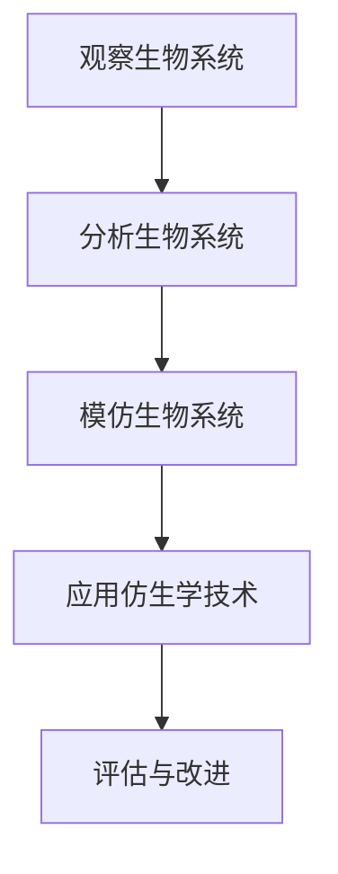
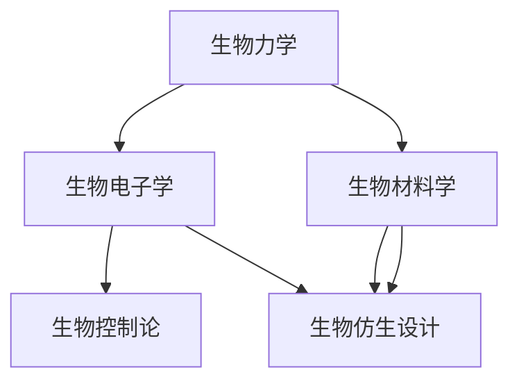
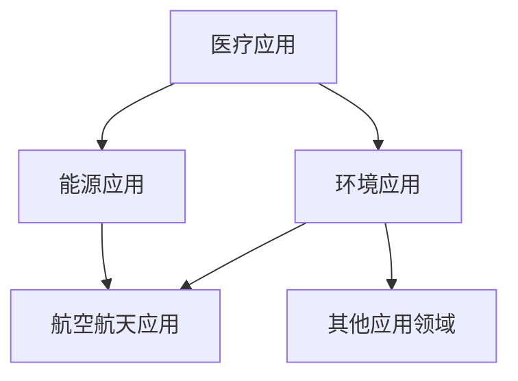
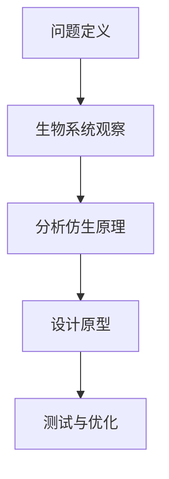
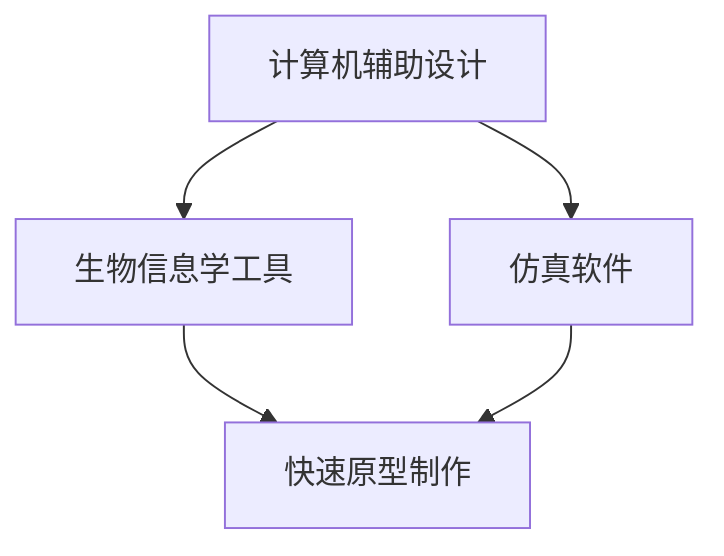
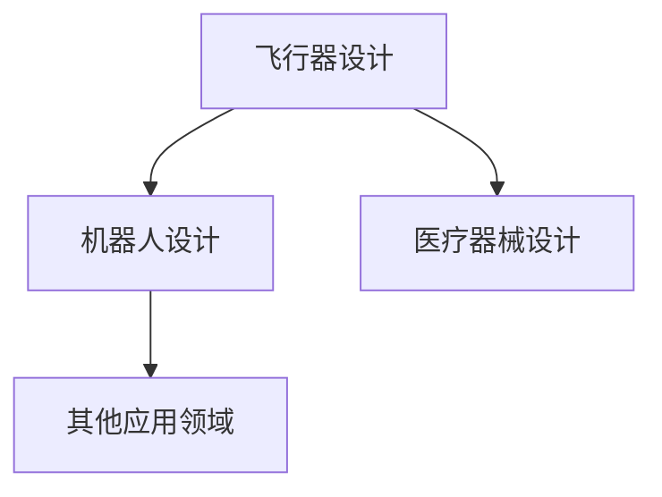
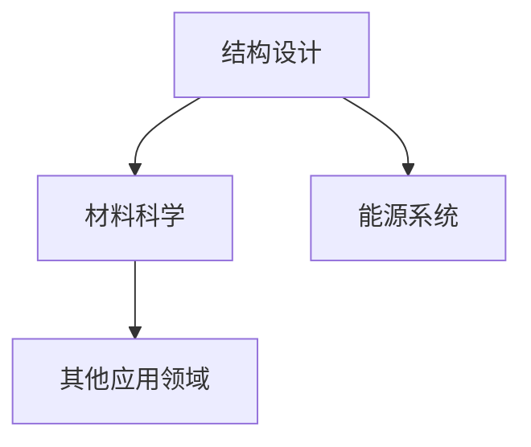

                 


### 文章标题：仿生学与仿生技术：向自然学习理解世界

#### 关键词：仿生学、仿生技术、自然、创新、应用

#### 摘要：
仿生学是一门跨学科的研究领域，通过模仿自然界中的生物结构和功能，开发出各种先进的技术和解决方案。本文旨在探讨仿生学与仿生技术的基本理论、应用领域及其未来发展，强调向自然学习对人类科技进步的重要性。

### 第一部分：仿生学与仿生技术基础理论

#### 第1章：仿生学的起源与发展

##### 1.1 仿生学的定义与历史
仿生学（Bionics）是20世纪中叶兴起的一门交叉学科，旨在研究生物系统的结构与功能，并将其应用于工程和设计领域。它结合了生物学、物理学、工程学、计算机科学等多学科知识，旨在模仿自然界中高效的生物系统，以解决现实世界中的复杂问题。

**核心概念与联系：**
仿生学的核心概念包括生物系统的观察、分析和模仿。以下是一个简化的 Mermaid 流程图，展示了仿生学的基本流程：



##### 1.2 仿生学的研究领域与分类
仿生学的研究领域非常广泛，主要包括以下几个方面：

1. **生物力学**：研究生物体的运动和力学特性。
2. **生物电子学**：研究生物信号处理和电子设备的设计。
3. **生物材料学**：研究生物材料的结构和功能。
4. **生物控制论**：研究生物系统的自动控制和反馈机制。
5. **生物仿生设计**：通过模仿生物体的设计原理来创新工程和产品。

**核心概念与联系：**
不同研究领域之间相互关联，共同构成了仿生学的基础。以下是一个简化的 Mermaid 流程图，展示了仿生学的研究领域之间的关系：



##### 1.3 仿生学的重要性与应用前景
仿生学的重要性在于它能够提供创新的解决方案，解决人类面临的许多挑战。例如，仿生学在医疗、能源、环境、航空航天等领域具有广泛的应用前景。

**核心概念与联系：**
仿生学的重要性和应用前景可以通过以下 Mermaid 流程图进行描述：



#### 第2章：生物结构与功能分析

##### 2.1 生物材料的力学特性
生物材料的力学特性是其功能实现的基础。例如，蜘蛛丝具有高强度、轻质和弹性，被广泛应用于工程和医疗领域。

**核心算法原理讲解：**
以下是一个简单的伪代码，用于描述生物材料的力学特性分析：

```python
def analyze_material_properties(material):
    if material == "spider silk":
        print("High strength, lightweight, and elastic")
    else:
        print("Unknown material")
```

**数学模型和公式：**
生物材料的力学特性可以通过以下公式进行描述：

$$
F = kx
$$

其中，\(F\) 是作用在材料上的力，\(k\) 是材料的弹性系数，\(x\) 是材料的形变量。

**举例说明：**
假设蜘蛛丝的弹性系数 \(k\) 为 \(10^8\) N/m，当拉伸长度增加 \(1\) mm 时，作用力为 \(1\) N。可以计算得到：

$$
F = 10^8 \times 1 \times 10^{-3} = 10^5 \text{ N}
$$

##### 2.2 生物系统的控制机制
生物系统的控制机制是维持生物体正常功能的关键。例如，心脏的节律控制和血管的调节机制对于维持生命的稳定至关重要。

**核心算法原理讲解：**
以下是一个简单的伪代码，用于描述生物系统的控制机制分析：

```python
def analyze_control_mechanism(system):
    if system == "heart":
        print("Rhythm control")
    elif system == "blood vessels":
        print("Regulation mechanism")
    else:
        print("Unknown system")
```

**数学模型和公式：**
生物系统的控制机制可以通过以下公式进行描述：

$$
\frac{dX}{dt} = f(X, Y)
$$

其中，\(X\) 和 \(Y\) 是系统状态变量，\(f\) 是系统动态方程。

**举例说明：**
假设心脏的节律控制可以用以下公式描述：

$$
\frac{dP}{dt} = -k_1 P + k_2
$$

其中，\(P\) 是心脏的节律，\(k_1\) 和 \(k_2\) 是常数。可以分析心脏节律的稳定性和调节机制。

##### 2.3 生物传感与响应机制
生物传感与响应机制是生物体与环境交互的关键。例如，生物传感器可以检测生物体内的化学和物理变化，从而调节生物体的行为。

**核心算法原理讲解：**
以下是一个简单的伪代码，用于描述生物传感与响应机制分析：

```python
def analyze_sensing_and_response(mechanism):
    if mechanism == "sensor":
        print("Detect chemical and physical changes")
    elif mechanism == "response":
        print("Regulate behavior based on sensing")
    else:
        print("Unknown mechanism")
```

**数学模型和公式：**
生物传感与响应机制可以通过以下公式进行描述：

$$
\text{Response} = g(\text{Sensing})
$$

其中，\(g\) 是响应函数，\(\text{Sensing}\) 是感知信号。

**举例说明：**
假设生物传感器检测到氧气浓度降低，可以触发以下响应：

$$
\text{Response} = \text{Increase breathing rate}
$$

#### 第3章：仿生设计方法

##### 3.1 仿生设计与创新过程
仿生设计是一个创新过程，通过模仿自然界中的生物结构和功能来开发新技术和产品。以下是一个简化的仿生设计流程：

**核心概念与联系：**
仿生设计过程可以分为以下几个步骤：

1. **问题定义**：明确设计目标和问题。
2. **生物系统观察**：观察和研究目标生物系统的结构和功能。
3. **分析仿生原理**：分析生物系统的仿生原理，提取关键设计灵感。
4. **设计原型**：根据仿生原理设计出原型。
5. **测试与优化**：测试原型，收集数据，并进行优化。

以下是一个简化的 Mermaid 流程图，展示了仿生设计过程：



##### 3.2 仿生设计的工具与技术
仿生设计需要多种工具和技术支持。以下是一些常见的仿生设计工具和技术：

1. **计算机辅助设计（CAD）**：用于创建和修改仿生设计模型。
2. **生物信息学工具**：用于分析和模拟生物系统的结构和功能。
3. **仿真软件**：用于模拟仿生系统的行为和性能。
4. **快速原型制作**：用于快速制作和测试仿生设计原型。

**核心概念与联系：**
不同工具和技术之间相互配合，共同支持仿生设计过程。以下是一个简化的 Mermaid 流程图，展示了仿生设计工具和技术之间的关系：



##### 3.3 仿生设计的案例分析
以下是一些典型的仿生设计案例：

1. **飞行器设计**：模仿鸟类的飞行机制，开发出更高效的飞行器。
2. **机器人设计**：模仿昆虫的行为和结构，开发出具有自主导航和感知能力的机器人。
3. **医疗器械设计**：模仿生物组织的结构和功能，开发出更先进的医疗器械。

**核心概念与联系：**
不同案例展示了仿生设计的多样性和创新性。以下是一个简化的 Mermaid 流程图，展示了仿生设计案例的分类：



#### 第4章：仿生技术在实际应用中的应用

##### 4.1 仿生技术在工程领域的应用
仿生技术在工程领域有广泛的应用，包括结构设计、材料科学和能源系统等方面。

**核心概念与联系：**
以下是一个简化的 Mermaid 流程图，展示了仿生技术在工程领域的应用：



**项目实战：**
以飞行器设计为例，介绍仿生技术在工程领域的应用：

1. **开发环境搭建**：搭建计算机辅助设计（CAD）软件和仿真软件的开发环境。
2. **源代码详细实现和代码解读**：使用CAD软件设计飞行器结构，使用仿真软件模拟飞行器的性能。
3. **代码应用解读与分析**：分析飞行器的结构优化方案，评估仿真结果，提出改进建议。
4. **实际案例分析和详细讲解剖析**：分析真实飞行器案例，展示仿生技术在工程领域的应用。
5. **项目小结**：总结仿生技术在工程领域应用的经验和教训，提出未来研究方向。

##### 4.2 仿生技术在医疗领域的应用
仿生技术在医疗领域有重要的应用，包括生物材料、生物传感器和生物机器

