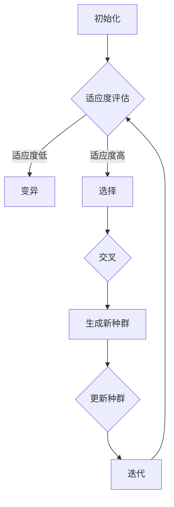

                 

### 文章标题

《仿生机器人的运动规划：生物启发的数学算法》

> 关键词：仿生机器人、运动规划、生物启发、数学算法

> 摘要：本文旨在探讨仿生机器人在运动规划过程中所采用的生物启发的数学算法。文章首先介绍了仿生机器人的背景和运动规划的重要性，随后详细阐述了生物启发的数学算法的基本原理及其在仿生机器人运动规划中的应用。通过具体案例和项目实战，本文展示了生物启发的数学算法在仿生机器人运动规划中的实际应用和效果。

### 《仿生机器人的运动规划：生物启发的数学算法》目录大纲

**第一部分：引言**

1. 引言
   1.1 仿生机器人的背景
   1.2 仿生机器人运动规划的重要性
   1.3 生物启发的数学算法概述
   1.4 本书结构

**第二部分：基础理论**

2. 仿生机器人运动规划基础
   2.1 仿生机器人的定义与分类
   2.2 仿生机器人运动规划的目标与挑战
   2.3 生物系统中的运动规划机制

3. 数学算法概述
   3.1 数学算法的基本概念
   3.2 数学算法的分类与应用

4. 生物启发的数学算法原理
   4.1 生物启发的数学算法概念
   4.2 生物启发的数学算法的应用领域
   4.3 生物启发的数学算法的优势与局限性

5. 基于生物启发的数学算法在仿生机器人中的应用前景
   5.1 应用于仿生机器人运动规划的挑战
   5.2 生物启发的数学算法的发展趋势

**第三部分：算法原理讲解**

6. 生物启发的数学算法原理讲解
   6.1 算法基本概念与架构图（使用 Mermaid 流程图）

7. 核心算法原理讲解
   7.1 伪代码详细阐述
   7.2 算法流程与步骤
   7.3 算法性能分析

8. 数学模型与公式讲解
   8.1 常用数学模型介绍
   8.2 数学公式的详细解释与示例
   8.3 数学公式在算法中的应用

9. 生物启发的数学算法案例分析
   9.1 案例一：蝴蝶飞行轨迹分析
   9.2 案例二：鸟类迁徙路径优化

**第四部分：项目实战**

10. 仿生机器人运动规划项目实战
    10.1 项目背景与目标
    10.2 项目开发环境搭建
    10.3 代码实现与解读
    10.4 代码分析与实践

11. 项目评估与优化
    11.1 项目评估指标
    11.2 项目优化策略
    11.3 项目总结与展望

**第五部分：总结与展望**

12. 总结
    12.1 仿生机器人运动规划与生物启发的数学算法的关系
    12.2 本书内容的总结
    12.3 当前存在的问题与挑战

13. 展望
    13.1 未来发展趋势
    13.2 研究方向与展望

**附录**

14. 附录 A. 生物启发的数学算法相关资源

15. 附录 B. 仿生机器人运动规划常用工具与框架

---

### 第一部分：引言

#### 1. 引言

随着人工智能技术的飞速发展，仿生机器人正逐渐成为研究热点。仿生机器人是指模仿生物结构、功能和行为特征，具备一定自主运动能力和智能行为的机器人。仿生机器人的发展不仅为人类探索未知世界提供了新的工具，也在医疗、农业、制造业等领域显示出巨大的应用潜力。其中，仿生机器人的运动规划是其核心技术之一，决定了机器人的运动效率和安全性。

运动规划是指根据环境信息、任务目标和机器人自身特性，规划出一条符合要求的运动轨迹。对于仿生机器人而言，运动规划不仅需要考虑机器人的结构复杂性和非线性动力学特性，还要模拟生物系统中的自适应和优化能力。因此，传统的运动规划方法难以满足仿生机器人的需求，需要借助生物启发的数学算法来实现高效、智能的运动规划。

生物启发的数学算法是指从自然界生物系统的结构和行为中汲取灵感，构建出数学模型和算法，用于解决复杂问题的方法。这些算法在仿生机器人的运动规划中具有独特的优势，能够模拟生物系统的自适应性和优化能力，实现更加自然、高效的机器人运动。

本文将从仿生机器人的背景和运动规划的重要性出发，详细阐述生物启发的数学算法的基本原理及其在仿生机器人运动规划中的应用。通过具体案例和项目实战，本文将展示生物启发的数学算法在仿生机器人运动规划中的实际应用和效果。希望本文能为从事仿生机器人研究和应用的工作者提供有价值的参考和启示。

#### 1.1 仿生机器人的背景

仿生机器人是指模仿生物的结构、功能和行为的机器人。仿生机器人研究的起源可以追溯到20世纪中叶，当时科学家们开始尝试模仿动物和昆虫的飞行、爬行和游动等行为。随着计算机技术、传感器技术和材料科学的不断发展，仿生机器人在各个领域的应用逐渐拓展。

仿生机器人可以分为多个类别，根据其模仿的生物对象，可以分为仿昆虫机器人、仿哺乳动物机器人、仿鸟类机器人等。其中，仿昆虫机器人以其灵活的运动能力和高效的能源利用成为研究的热点。例如，仿蝴蝶机器人能够在复杂环境中进行自主飞行，模拟蝴蝶的机动性和耐久性。

仿生机器人的研究不仅限于模仿生物的外形和行为，还包括对生物系统内部机制的理解和应用。例如，仿生机器人可以模仿生物的感知、决策和运动协调能力，实现更加智能和自适应的运动行为。这种研究方法不仅为机器人技术的发展提供了新的思路，也为生物科学研究提供了有益的启示。

在现代社会，仿生机器人的应用已经涵盖了多个领域。在医疗领域，仿生机器人可以用于手术辅助、康复训练和医疗护理。例如，仿生机械手可以模拟人的手的灵活运动，为截肢患者提供假肢。在农业领域，仿生机器人可以用于植物识别、病虫害防治和精准农业。例如，仿生昆虫机器人可以模拟昆虫的行为，用于监测农田病虫害。

此外，仿生机器人在工业生产、救援任务、环境监测等领域也显示出巨大的应用潜力。例如，仿生机器鱼可以用于水下探测和海底资源开采，仿生机器人狗可以用于搜索和救援任务。随着技术的不断进步，仿生机器人的应用领域将更加广泛，为人类生活带来更多便利。

总体而言，仿生机器人作为一种新兴的机器人技术，具有广泛的应用前景和重要的研究价值。通过深入研究仿生机器人的结构和行为机制，我们可以为机器人技术、生物科学和工程应用等领域提供新的理论和技术支持。

#### 1.2 仿生机器人运动规划的重要性

仿生机器人的运动规划是其核心技术的关键环节，直接影响机器人的运动效率和任务执行效果。运动规划不仅需要考虑机器人的结构特性、动力学特性和环境约束，还要实现复杂动作的实时性和稳定性。以下将从多个方面阐述仿生机器人运动规划的重要性：

首先，运动规划是实现仿生机器人自主行为的基础。仿生机器人需要具备一定的自主运动能力，以适应复杂多变的环境。通过精确的运动规划，机器人可以自主决策和执行各种运动任务，例如自主导航、路径规划、目标跟踪和复杂动作等。只有实现高效的运动规划，仿生机器人才能在现实环境中灵活应对各种挑战，实现真正的自主行为。

其次，运动规划可以显著提升仿生机器人的运动效率和能量利用率。仿生机器人通常具有复杂的结构和高度非线性的动力学特性，传统的运动规划方法难以满足其需求。通过采用生物启发的数学算法，可以模拟生物系统中的自适应和优化能力，实现更加高效的运动规划。例如，通过模仿蝴蝶和鸟类的飞行轨迹，可以优化仿生机器人在空中或地面上的运动路径，降低能耗，延长续航时间。

此外，运动规划对于仿生机器人的安全性和稳定性具有重要意义。在复杂环境中，仿生机器人需要具备应对突发情况和障碍物的能力。通过精确的运动规划，机器人可以在避免碰撞的同时，保持稳定的运动轨迹。这不仅提高了机器人的安全性，也有助于延长其使用寿命。

最后，运动规划可以拓展仿生机器人的应用范围。通过优化运动规划算法，可以实现机器人对不同任务场景的快速适应和执行。例如，在医疗领域，仿生机器人可以用于手术辅助和康复训练；在农业领域，可以用于植物识别和病虫害防治；在救援任务中，可以用于搜索和救援。运动规划的优化和扩展将有助于推动仿生机器人在各个领域的广泛应用。

总之，仿生机器人运动规划的重要性不容忽视。通过深入研究运动规划算法，我们可以为仿生机器人提供更加高效、智能和安全的运动能力，推动其在各个领域的应用和发展。

#### 1.3 生物启发的数学算法概述

生物启发的数学算法是一类从自然界生物系统的结构和行为中汲取灵感，构建数学模型和算法，用于解决复杂问题的方法。这类算法的核心思想是通过模拟生物系统中的自适应、优化和协同机制，实现高效、智能的解决方案。以下从多个方面对生物启发的数学算法进行概述：

首先，生物启发的数学算法具有广泛的来源和应用领域。生物启发的算法灵感来源于自然界中各种生物系统的复杂行为和机制，例如蚂蚁的群体行为、鸟类的迁徙路径、蜜蜂的觅食策略、蝴蝶的飞行模式等。这些生物系统展现出了独特的自适应、优化和协同能力，为数学算法的设计提供了丰富的参考。例如，基于蚂蚁觅食策略的蚁群算法、基于鸟群行为的粒子群算法等，在优化、路径规划、模式识别等领域具有广泛应用。

其次，生物启发的数学算法具有独特的优势。与传统的数学算法相比，生物启发的算法能够在复杂、动态和不确定的环境中表现出更好的适应性和鲁棒性。这是因为生物系统中的自适应和优化能力是基于长期自然选择和进化过程的积累，具有高度的适应性和灵活性。例如，粒子群优化算法通过模拟鸟群觅食行为，能够在复杂目标函数中快速搜索到全局最优解，具有较强的鲁棒性和全局搜索能力。

此外，生物启发的数学算法在解决复杂问题上具有独特的优势。许多复杂问题，如组合优化、神经网络训练、图像处理等，具有高度的非线性特性，难以用传统的数学方法进行精确求解。生物启发的算法通过模拟生物系统中的自适应和协同机制，能够实现高效的近似解。例如，遗传算法通过模拟自然进化过程，能够有效求解复杂的组合优化问题，如旅行商问题、基因排序等。

生物启发的数学算法在多个领域都取得了显著的成果。在优化问题中，如蚁群算法、粒子群优化算法、遗传算法等，在路径规划、资源分配、参数优化等方面表现出色。在模式识别中，如神经网络、支持向量机等算法，通过模拟生物神经元和生物分类机制，实现了高效的模式识别和分类。在图像处理中，如基于生物视觉机制的图像滤波、图像分割等算法，通过模拟生物视觉系统的处理过程，实现了对图像的高效处理和识别。

总之，生物启发的数学算法以其独特的优势和广泛的适用性，在解决复杂问题上展示了巨大的潜力。通过深入研究生物系统的结构和行为，我们可以不断优化和创新生物启发的数学算法，为各个领域的应用提供更加高效、智能的解决方案。

#### 1.4 本书结构

本书旨在全面、系统地探讨仿生机器人的运动规划以及生物启发的数学算法在其中的应用。全书分为五个主要部分，结构如下：

**第一部分：引言**

本部分将介绍仿生机器人的背景、运动规划的重要性以及生物启发的数学算法概述。通过初步了解仿生机器人和生物启发的数学算法，读者可以建立对全书主题的初步认识。

**第二部分：基础理论**

本部分将详细阐述仿生机器人运动规划的基础知识，包括仿生机器人的定义与分类、运动规划的目标与挑战、以及生物系统中的运动规划机制。同时，介绍数学算法的基本概念、分类与应用，以及生物启发的数学算法原理、优势与局限性。

**第三部分：算法原理讲解**

本部分将深入讲解生物启发的数学算法原理，包括算法的基本概念、架构图、核心算法原理、数学模型与公式，以及具体案例分析。通过这部分内容，读者将能够理解生物启发的数学算法的内在机制和实现过程。

**第四部分：项目实战**

本部分将通过实际项目，展示生物启发的数学算法在仿生机器人运动规划中的应用。内容包括项目背景与目标、开发环境搭建、代码实现与解读、代码分析与实践，以及项目评估与优化。这部分内容将帮助读者将理论知识应用于实际项目中。

**第五部分：总结与展望**

本部分将对全书内容进行总结，回顾仿生机器人运动规划与生物启发的数学算法之间的关系，分析当前存在的问题与挑战，并展望未来发展趋势和研究方向。通过这部分内容，读者可以全面了解仿生机器人运动规划和生物启发算法的发展动态。

全书结构紧凑、逻辑清晰，从理论到实践，逐步深入，旨在为读者提供一个完整、系统的学习路径。希望本书能够为从事仿生机器人研究和应用的工作者提供有价值的参考和启示。

---

### 第二部分：基础理论

#### 2. 仿生机器人运动规划基础

仿生机器人运动规划是指根据环境信息、任务目标和机器人自身特性，规划出一条符合要求的运动轨迹。这一过程涉及到对机器人动力学特性、环境感知和运动控制的理解和应用。以下将从仿生机器人的定义与分类、运动规划的目标与挑战、以及生物系统中的运动规划机制三个方面进行详细阐述。

#### 2.1 仿生机器人的定义与分类

仿生机器人是指模仿生物的结构、功能和行为特征，具备一定自主运动能力和智能行为的机器人。仿生机器人的定义可以从以下几个方面来理解：

1. **生物结构模仿**：仿生机器人通过模仿生物的形态和结构，实现特定的功能。例如，模仿昆虫的六足结构，实现机器人的行走和攀爬能力；模仿鸟类翅膀的形状和运动，实现空中飞行。

2. **生物功能模仿**：仿生机器人不仅模仿生物的外形，还模仿其功能，例如模仿蝴蝶的觅食、捕食行为，实现环境感知和目标追踪；模仿鸟类和昆虫的导航能力，实现自主路径规划。

3. **生物行为模仿**：仿生机器人通过模仿生物的行为模式，实现复杂的运动控制和任务执行。例如，模仿人类的运动协调和操作能力，实现机器人手术、康复训练等。

根据仿生机器人模仿的生物对象，可以将其分为多个类别：

1. **仿昆虫机器人**：这类机器人通常模仿昆虫的形态和功能，如仿蝴蝶机器人、仿蚂蚁机器人等。它们具备较强的环境适应能力和灵活的运动能力。

2. **仿哺乳动物机器人**：这类机器人模仿哺乳动物的结构和行为，如仿狗机器人、仿猫机器人等。它们通常具备较高的感知能力和运动稳定性。

3. **仿鸟类机器人**：这类机器人模仿鸟类的飞行和行为，如仿鹰机器人、仿鸽子机器人等。它们通常具备高效的飞行能力和目标追踪能力。

4. **仿鱼类机器人**：这类机器人模仿鱼类的结构和行为，如仿鲸鱼机器人、仿鲨鱼机器人等。它们通常具备高效的游动能力和环境感知能力。

5. **仿多足机器人**：这类机器人模仿多足生物的行走和攀爬能力，如仿蜘蛛机器人、仿螃蟹机器人等。它们通常具备较强的地形适应能力和运动灵活性。

#### 2.2 仿生机器人运动规划的目标与挑战

仿生机器人运动规划的目标主要包括：

1. **自主性**：仿生机器人应具备自主运动能力，能够在未知或复杂环境中自主决策和执行任务。

2. **灵活性**：仿生机器人应具备灵活的运动能力，能够适应不同的地形和障碍物，实现多种复杂的运动模式。

3. **高效性**：仿生机器人应具备高效的运动能力，能够在满足任务要求的前提下，降低能耗，延长续航时间。

4. **安全性**：仿生机器人应具备安全稳定的运动能力，避免碰撞和意外伤害，确保自身和周围环境的安全。

然而，实现这些目标面临以下挑战：

1. **动力学复杂性**：仿生机器人通常具有复杂的结构和非线性的动力学特性，运动控制难度较大。

2. **环境不确定性**：仿生机器人需要处理复杂多变的真实环境，环境信息的不确定性和动态变化增加了运动规划的难度。

3. **实时性要求**：仿生机器人需要具备实时响应能力，对运动规划的实时性和精度要求较高。

4. **计算资源限制**：仿生机器人通常具备有限的计算资源和能源，对运动规划的算法效率和处理能力提出较高要求。

#### 2.3 生物系统中的运动规划机制

生物系统中的运动规划机制为仿生机器人运动规划提供了重要的理论依据。以下介绍几种典型的生物运动规划机制：

1. **神经控制系统**：生物系统中的神经控制系统通过复杂的神经元网络实现运动控制。神经元之间的通信和相互作用决定了运动模式的产生和调整。仿生机器人可以通过模拟神经控制系统，实现类似生物的运动控制和协调。

2. **自适应机制**：生物系统中的自适应机制使生物能够根据环境变化调整运动策略，提高运动效率。例如，鸟类在飞行过程中可以实时调整翅膀的姿态和频率，以适应风速和气流的变化。仿生机器人可以通过模拟这种自适应机制，实现灵活的运动规划和调整。

3. **群体行为机制**：许多生物通过群体行为实现高效的运动和任务执行。例如，蚁群通过集体协作找到最短的路径，鸟群通过集体飞行降低能耗。仿生机器人可以通过模拟群体行为机制，实现高效的运动规划和协作。

4. **进化机制**：生物通过进化过程不断优化运动策略和结构。这种进化机制为仿生机器人运动规划提供了重要的参考。例如，通过遗传算法优化机器人的结构参数和运动策略，实现更高效的运动。

总之，生物系统中的运动规划机制为仿生机器人运动规划提供了丰富的理论资源和实践经验。通过借鉴和模拟这些机制，我们可以实现更加高效、智能的仿生机器人运动规划。

---

### 3. 数学算法概述

数学算法是计算机科学和人工智能领域中不可或缺的一部分，它们为解决复杂问题提供了理论依据和计算方法。数学算法的种类繁多，根据不同的分类标准可以划分为不同的类别。以下将介绍数学算法的基本概念、分类与应用，以及生物启发的数学算法的基本原理。

#### 3.1 数学算法的基本概念

数学算法是指用数学语言描述的一系列规则和步骤，用于解决特定问题。算法通常包含输入、输出和一系列操作步骤，通过这些步骤将输入转化为输出。算法的核心是解决问题的逻辑和计算过程，其设计优劣直接影响到算法的效率和准确性。

1. **输入**：算法的输入是解决问题所需的数据和信息。输入可以是具体的数值、符号、变量等，也可以是复杂数据结构，如数组、树、图等。

2. **输出**：算法的输出是解决问题的结果或答案。输出可以是具体的数值、文本、图像等，也可以是某种状态或行为。

3. **操作步骤**：算法通过一系列操作步骤将输入转化为输出。这些操作步骤可以是基本的数学运算、逻辑判断、循环结构、递归调用等。

4. **效率与复杂性**：算法的效率是指其解决问题所需的时间和资源。算法的复杂性是指其时间复杂性和空间复杂性，通常用大O表示法（O-notation）来描述。常见的复杂性包括常数复杂度（O(1)）、对数复杂度（O(log n)）、线性复杂度（O(n)）、平方复杂度（O(n^2)）等。

#### 3.2 数学算法的分类与应用

数学算法可以根据不同的分类标准进行分类，以下介绍几种常见的分类方法及其应用领域：

1. **按功能分类**：

   - **排序算法**：用于对数据进行排序，常见的排序算法包括冒泡排序、快速排序、归并排序、堆排序等。排序算法在数据分析和数据处理等领域有广泛应用。

   - **搜索算法**：用于在数据集合中查找特定元素，常见的搜索算法包括顺序搜索、二分搜索、广度优先搜索、深度优先搜索等。搜索算法在信息检索和图形处理等领域有广泛应用。

   - **图算法**：用于在图结构上解决问题，常见的图算法包括最短路径算法（如迪杰斯特拉算法、贝尔曼-福特算法）、最小生成树算法（如普里姆算法、克鲁斯卡尔算法）、网络流算法等。图算法在网络优化、社交网络分析和交通规划等领域有广泛应用。

   - **优化算法**：用于求解最优化问题，常见的优化算法包括线性规划、非线性规划、遗传算法、粒子群优化算法、蚁群算法等。优化算法在资源分配、生产调度、机器学习等领域有广泛应用。

2. **按原理分类**：

   - **确定性算法**：这类算法在给定输入时，总是能够得到确定的输出。例如，排序算法、搜索算法等。

   - **随机算法**：这类算法在给定输入时，可能产生不同的输出。随机算法通常用于解决复杂问题，例如遗传算法、模拟退火算法等。

   - **混合算法**：这类算法结合了确定性算法和随机算法的优点，通过引入随机性来提高搜索效率和鲁棒性。例如，遗传算法、粒子群优化算法等。

3. **按应用领域分类**：

   - **计算几何**：用于解决几何问题，如点线距离、多边形面积计算等。计算几何在计算机图形学、计算机视觉、地理信息系统等领域有广泛应用。

   - **数值分析**：用于解决数学问题，如数值积分、数值微分、数值求解方程等。数值分析在科学计算、工程应用、金融工程等领域有广泛应用。

   - **概率论与统计**：用于解决概率问题和统计分析，如假设检验、参数估计、贝叶斯推理等。概率论与统计在数据分析、机器学习、人工智能等领域有广泛应用。

#### 3.3 生物启发的数学算法原理

生物启发的数学算法是指从自然界生物系统的结构和行为中汲取灵感，构建数学模型和算法，用于解决复杂问题的方法。生物启发的算法通常模拟生物系统中的某些机制和过程，例如进化、群体行为、神经控制等。以下介绍几种常见的生物启发的数学算法：

1. **遗传算法**：遗传算法是一种模拟生物进化的优化算法，通过模拟自然选择和遗传机制来搜索最优解。遗传算法的主要步骤包括：

   - **初始化种群**：随机生成一组解作为初始种群。
   - **适应度评估**：计算每个解的适应度，适应度较高的解具有更高的生存机会。
   - **选择**：根据适应度选择适应度较高的个体作为父代，用于生成下一代。
   - **交叉**：将父代个体进行交叉操作，生成新的个体。
   - **变异**：对个体进行随机变异，增加种群的多样性。
   - **迭代**：重复上述步骤，直到满足终止条件（如达到最大迭代次数或找到满意的解）。

   遗传算法具有全局搜索能力和鲁棒性，适用于求解复杂的优化问题。

2. **粒子群优化算法**：粒子群优化算法是一种模拟鸟群觅食行为的优化算法。算法中的每个粒子代表一个潜在解，通过粒子之间的协作和个体经验来更新粒子的位置和速度，逐渐搜索到最优解。粒子群优化算法的主要步骤包括：

   - **初始化粒子群**：随机生成粒子的位置和速度。
   - **适应度评估**：计算每个粒子的适应度。
   - **更新粒子的速度和位置**：根据个体的历史最优位置和全局最优位置来更新粒子的速度和位置。
   - **迭代**：重复上述步骤，直到满足终止条件。

   粒子群优化算法简单易实现，具有较强的全局搜索能力和收敛速度。

3. **蚁群算法**：蚁群算法是一种模拟蚂蚁觅食行为的优化算法。蚂蚁在寻找食物的过程中，通过释放信息素来标记路径，其他蚂蚁根据信息素浓度来选择路径。随着算法的迭代，最优路径上的信息素浓度逐渐增加，从而引导更多的蚂蚁选择最优路径。蚁群算法的主要步骤包括：

   - **初始化信息素**：在所有路径上均匀释放信息素。
   - **选择路径**：根据信息素浓度和随机性选择路径。
   - **更新信息素**：根据蚂蚁经过的路径更新信息素浓度。
   - **迭代**：重复上述步骤，直到满足终止条件。

   蚁群算法具有较强的鲁棒性和全局搜索能力，适用于求解复杂的优化问题。

总之，生物启发的数学算法通过模拟生物系统的机制和过程，实现了高效、智能的优化和搜索。这些算法在仿生机器人运动规划、智能交通、生物信息学等领域具有广泛的应用前景。

---

### 4. 生物启发的数学算法原理

生物启发的数学算法是一类从自然界生物系统的结构和行为中汲取灵感，构建数学模型和算法，用于解决复杂问题的方法。这类算法的核心思想是通过模拟生物系统中的自适应、优化和协同机制，实现高效、智能的解决方案。以下从生物启发的数学算法概念、应用领域、优势与局限性等方面进行详细阐述。

#### 4.1 生物启发的数学算法概念

生物启发的数学算法是指基于对生物系统的研究，借鉴生物系统中的某些机制和过程，设计出用于解决实际问题的数学模型和算法。这类算法的灵感来源于自然界中的生物现象，如进化、群体行为、神经控制等。生物启发的数学算法具有以下特点：

1. **自适应性**：生物启发的算法能够根据环境变化和问题特性，自适应地调整算法参数和搜索策略，以实现最优或次优解。

2. **分布式计算**：许多生物系统具有分布式计算特性，即多个个体通过相互协作和信息共享来实现整体目标。生物启发的算法通常采用分布式计算机制，通过群体协作和信息交换来提高算法效率和鲁棒性。

3. **全局搜索能力**：生物启发的算法能够跳出局部最优，实现全局搜索，从而找到更优的解。这是因为生物系统中的进化、群体行为等机制具有全局搜索能力，能够在复杂环境中找到最优或次优解。

4. **鲁棒性**：生物启发的算法具有较强的鲁棒性，能够在面对不确定性、噪声和动态变化时，仍能保持较好的性能。

#### 4.2 生物启发的数学算法的应用领域

生物启发的数学算法在多个领域具有广泛的应用前景，以下是其中一些主要的应用领域：

1. **优化问题**：生物启发的算法如遗传算法、粒子群优化算法、蚁群算法等，被广泛应用于优化问题。例如，在资源分配、生产调度、路径规划、参数优化等方面，这些算法能够实现高效、智能的优化。

2. **机器学习**：生物启发的算法在机器学习领域也有重要应用。例如，神经网络中的学习算法受到生物神经元激活机制的启发，遗传算法和粒子群优化算法被用于优化神经网络结构和参数，提高学习效果。

3. **图像处理**：生物启发的算法在图像处理领域，如图像滤波、图像分割、目标识别等方面，具有广泛应用。例如，基于生物视觉机制的图像处理算法，通过模拟生物视觉系统的工作原理，实现了高效、精确的图像处理。

4. **交通系统**：生物启发的算法在交通系统优化方面具有潜力。例如，基于群体行为机制的交通信号控制算法，通过模拟车辆行驶过程中的协作和避让行为，实现了高效、安全的交通流管理。

5. **生物信息学**：生物启发的算法在生物信息学领域，如基因组分析、蛋白质结构预测、药物设计等方面，有广泛应用。例如，遗传算法和模拟退火算法被用于优化基因表达模式、蛋白质结构预测等复杂问题。

6. **智能制造**：生物启发的算法在智能制造领域，如机器人路径规划、自动化装配、智能调度等方面，具有广泛应用。例如，基于群体行为机制的机器人协同算法，通过模拟生物群体的协作机制，实现了高效、安全的机器人协作。

总之，生物启发的数学算法在多个领域具有广泛的应用前景，通过模拟生物系统中的机制和过程，实现了高效、智能的解决方案。

#### 4.3 生物启发的数学算法的优势与局限性

生物启发的数学算法在解决复杂问题时具有独特的优势，但也存在一些局限性。以下分别从优势与局限性两个方面进行讨论：

**优势**：

1. **全局搜索能力**：生物启发的算法具有全局搜索能力，能够跳出局部最优，找到最优或次优解。这与生物系统中的进化、群体行为等机制密切相关，使得生物启发的算法在复杂优化问题中表现出色。

2. **鲁棒性**：生物启发的算法具有较强的鲁棒性，能够应对不确定性、噪声和动态变化。这是因为生物系统中的机制通常具有自适应和冗余特性，能够在面对环境变化时保持稳定。

3. **分布式计算**：生物启发的算法通常采用分布式计算机制，通过群体协作和信息交换来提高算法效率和鲁棒性。分布式计算使得算法能够利用多个计算资源，提高计算效率和性能。

4. **可扩展性**：生物启发的算法具有较强的可扩展性，能够处理大规模、高维问题。这是因为生物系统中的机制具有自适应和模块化特性，可以灵活地调整和扩展。

5. **易于实现**：生物启发的算法通常具有直观、简单的数学模型和计算过程，易于实现和理解。这使得生物启发的算法在工业应用、科学研究等领域具有广泛的应用潜力。

**局限性**：

1. **收敛速度**：生物启发的算法在某些情况下可能收敛速度较慢，特别是对于高维、复杂的问题。这是由于生物系统中的机制通常需要较长的时间来积累经验和优化解。

2. **参数调优**：生物启发的算法通常需要较多的参数调优，以实现最优性能。参数调优的复杂性和困难性增加了算法实现的难度。

3. **计算资源**：生物启发的算法通常需要较高的计算资源和时间，特别是对于大规模、复杂的问题。这在某些实际应用中可能成为一个限制因素。

4. **适用范围**：生物启发的算法在某些特定领域和问题上的适用性较强，但在其他领域和问题上的适用性可能较弱。这是由于生物启发的算法是基于生物系统的机制和过程，不同生物系统之间的差异可能导致算法的适用性不同。

总之，生物启发的数学算法在解决复杂问题时具有独特的优势，但也存在一些局限性。通过不断研究和改进，我们可以充分发挥生物启发的数学算法的优势，克服其局限性，为实际问题提供更有效的解决方案。

---

#### 4.4 基于生物启发的数学算法在仿生机器人中的应用前景

随着人工智能和机器人技术的不断发展，仿生机器人正逐渐成为研究热点。生物启发的数学算法以其独特的优势，在仿生机器人的运动规划中展现出巨大的应用前景。以下从应用于仿生机器人运动规划的挑战、生物启发的数学算法的发展趋势两个方面进行探讨。

**1. 应用于仿生机器人运动规划的挑战**

仿生机器人的运动规划面临着诸多挑战，这些挑战对生物启发的数学算法提出了更高的要求。以下是一些主要挑战：

1. **环境复杂性**：仿生机器人需要在复杂多变的真实环境中执行任务，如地下洞穴、森林、海底等。环境的不确定性和动态变化使得运动规划问题更加复杂，需要生物启发的数学算法具备较强的自适应性和鲁棒性。

2. **动力学复杂性**：仿生机器人通常具有复杂的结构和非线性动力学特性，如昆虫机器人、鸟类机器人等。传统的运动规划方法难以满足这些复杂系统的需求，需要生物启发的数学算法能够处理复杂的动力学模型。

3. **实时性要求**：仿生机器人需要具备实时响应能力，以应对环境变化和突发情况。实时性要求算法能够在短时间内完成复杂的计算和决策过程，这对生物启发的数学算法的性能提出了较高要求。

4. **计算资源限制**：仿生机器人通常具备有限的计算资源和能源，这要求生物启发的数学算法具有高效的计算效率和低能耗特性。

**2. 生物启发的数学算法的发展趋势**

为应对仿生机器人运动规划中的挑战，生物启发的数学算法正朝着以下几个方向发展：

1. **多模态融合**：多模态融合是指将多种生物启发算法进行整合，以实现更高效、更智能的运动规划。例如，将遗传算法、粒子群优化算法、蚁群算法等结合，形成一种多模态的优化算法，以应对复杂的运动规划问题。

2. **自适应进化算法**：自适应进化算法通过自适应地调整算法参数和搜索策略，以提高算法的效率和鲁棒性。在仿生机器人运动规划中，自适应进化算法可以更好地应对环境变化和不确定性，实现更加高效的运动规划。

3. **分布式计算**：分布式计算可以充分利用多个计算资源，提高算法的计算效率和性能。在仿生机器人运动规划中，分布式计算可以实现并行处理，缩短计算时间，提高实时性。

4. **混合智能算法**：混合智能算法结合了多种智能方法的优势，通过协同工作实现更高效、更智能的解决方案。例如，将生物启发的数学算法与深度学习、强化学习等方法相结合，形成一种混合智能算法，以应对复杂的运动规划问题。

5. **基于生物视觉的算法**：生物视觉是指模仿生物视觉系统的处理过程，实现高效的图像处理和目标识别。在仿生机器人运动规划中，基于生物视觉的算法可以用于环境感知和目标跟踪，提高机器人的自主运动能力。

总之，基于生物启发的数学算法在仿生机器人运动规划中具有广泛的应用前景。通过不断研究和创新，我们可以充分发挥生物启发的数学算法的优势，为仿生机器人提供更高效、更智能的运动规划方案，推动仿生机器人在各个领域的应用和发展。

---

### 第三部分：算法原理讲解

#### 6. 生物启发的数学算法原理讲解

为了深入理解生物启发的数学算法，我们需要从基本概念与架构图入手，详细阐述其工作原理和机制。以下是对生物启发算法基本概念与架构图的详细讲解。

#### 6.1 算法基本概念与架构图（使用 Mermaid 流程图）

生物启发的数学算法通常基于生物系统的某些机制，如进化、群体行为、神经控制等，来构建数学模型和算法。以下是一个简化的生物启发算法架构图，使用 Mermaid 流程图表示：



**图解说明**：

- **A[初始化]**：初始化种群，随机生成一组解作为初始种群。
- **B{适应度评估]**：计算每个解的适应度，适应度较高的解具有更高的生存机会。
- **C[变异]**：对适应度较低的个体进行随机变异，增加种群的多样性。
- **D[选择]**：根据适应度选择适应度较高的个体作为父代，用于生成下一代。
- **E{交叉]**：将父代个体进行交叉操作，生成新的个体。
- **F[生成新种群]**：通过交叉操作生成新种群。
- **G[更新种群]**：将新种群更新为当前种群。
- **H[迭代]**：重复上述步骤，直到满足终止条件（如达到最大迭代次数或找到满意的解）。

以上流程图展示了生物启发算法的基本步骤和流程。接下来，我们将进一步详细讲解这些步骤，包括伪代码、算法流程与步骤，以及算法性能分析。

---

#### 7. 核心算法原理讲解

为了深入理解生物启发的数学算法，我们需要详细讲解其核心原理，包括伪代码、算法流程与步骤，以及算法性能分析。

**7.1 伪代码详细阐述**

以下是一个典型的遗传算法（GA）的伪代码，用于解决优化问题：

```
初始化种群 P0
评估种群 P0 的适应度
重复以下步骤直到满足终止条件：
    选择：从当前种群中选择适应度较高的个体组成父代种群
    交叉：对父代种群进行交叉操作生成新种群
    变异：对新种群中的个体进行变异操作
    评估新种群适应度
    更新星种群
    迭代次数++
返回最优解
```

**7.2 算法流程与步骤**

1. **初始化种群**：随机生成一组解作为初始种群。种群的大小和初始解的生成方法取决于具体问题。

2. **适应度评估**：计算每个解的适应度，适应度函数通常是一个目标函数，用来衡量解的优劣。适应度越高，解的质量越好。

3. **选择**：从当前种群中选择适应度较高的个体组成父代种群。常见的选择方法有轮盘赌选择、锦标赛选择等。

4. **交叉**：对父代种群进行交叉操作，生成新种群。交叉操作模拟了生物繁殖过程，通过组合父代个体的基因来产生新的个体。

5. **变异**：对新种群中的个体进行变异操作。变异操作增加了种群的多样性，有助于避免局部最优。

6. **适应度评估**：计算新种群中每个个体的适应度。

7. **更新种群**：将新种群更新为当前种群。

8. **迭代**：重复上述步骤，直到满足终止条件（如达到最大迭代次数或找到满意的解）。

**7.3 算法性能分析**

1. **收敛速度**：遗传算法的收敛速度取决于种群大小、交叉率和变异率等参数。种群大小和交叉率较高时，算法的收敛速度较快，但可能导致多样性降低；种群大小和交叉率较低时，算法的收敛速度较慢，但能够保持较高的多样性。

2. **全局搜索能力**：遗传算法具有较强的全局搜索能力，能够跳出局部最优，找到全局最优解。然而，当问题维度较高时，算法的全局搜索能力可能受到限制。

3. **鲁棒性**：遗传算法具有较强的鲁棒性，能够应对不确定性和噪声。这是由于算法采用了随机性和多样性机制。

4. **计算资源**：遗传算法通常需要较高的计算资源，特别是在高维问题中。为了提高算法的效率，可以采用并行计算和分布式计算等方法。

5. **参数调优**：遗传算法的性能受到参数调优的影响。适当的参数设置可以显著提高算法的性能。参数调优通常需要通过实验和经验来优化。

通过以上对遗传算法的详细讲解，我们可以更好地理解生物启发算法的核心原理和实现方法。这些算法为解决复杂的优化问题提供了有效的工具，在仿生机器人运动规划等领域具有广泛的应用前景。

---

### 8. 数学模型与公式讲解

在生物启发的数学算法中，数学模型和公式扮演着至关重要的角色。这些模型和公式不仅定义了算法的基本结构和行为，还为算法的性能分析和优化提供了理论基础。以下将详细介绍常用数学模型、数学公式的详细解释与示例，以及数学公式在算法中的应用。

#### 8.1 常用数学模型介绍

1. **适应度函数**：适应度函数是生物启发算法的核心，用于衡量解的质量。在遗传算法中，适应度函数通常是一个目标函数，用来评估个体的优劣。常见的适应度函数包括线性函数、二次函数、多项式函数等。

   适应度函数 F(x) = ax^2 + bx + c，其中 x 是个体，a、b、c 是参数。

2. **交叉算子**：交叉算子是生物启发算法中用于生成新个体的关键操作。交叉算子通过组合两个或多个父代个体的基因，产生新的子代个体。常见的交叉算子包括单点交叉、多点交叉、均匀交叉等。

   单点交叉示例：
   假设父代个体为 P1 = [1, 2, 3, 4, 5] 和 P2 = [6, 7, 8, 9, 10]，交叉点为第2位，交叉后的子代为 C1 = [1, 7, 3, 4, 5] 和 C2 = [6, 2, 8, 9, 10]。

3. **变异算子**：变异算子用于增加种群的多样性，防止算法过早收敛到局部最优。变异算子通过随机改变个体的一部分基因来实现。常见的变异算子包括单点变异、多点变异、位翻转变异等。

   单点变异示例：
   假设个体为 P = [1, 2, 3, 4, 5]，变异位为第3位，变异后的个体为 P' = [1, 2, 6, 4, 5]。

4. **选择算子**：选择算子用于从当前种群中选择适应度较高的个体作为父代个体。选择算子可以确保优秀个体更有可能遗传到下一代。常见的选择算子包括轮盘赌选择、锦标赛选择、排名选择等。

   轮盘赌选择示例：
   假设种群中有 N 个个体，每个个体的适应度分别为 F1, F2, ..., Fn，总适应度为 F = F1 + F2 + ... + Fn。每个个体被选中的概率为 P_i = F_i / F。

5. **迭代过程**：迭代过程是生物启发算法的核心步骤，用于不断更新种群并优化解。每次迭代包括适应度评估、选择、交叉、变异等操作，直到满足终止条件。

   迭代过程伪代码：
   ```
   初始化种群 P0
   评估种群 P0 的适应度
   重复以下步骤直到满足终止条件：
       选择：从当前种群中选择适应度较高的个体组成父代种群
       交叉：对父代种群进行交叉操作生成新种群
       变异：对新种群中的个体进行变异操作
       评估新种群适应度
       更新星种群
       迭代次数++
   返回最优解
   ```

#### 8.2 数学公式的详细解释与示例

1. **交叉概率（Pc）**：交叉概率是控制交叉操作频率的参数。适当的交叉概率可以平衡种群的多样性和收敛速度。

   公式：Pc = 1 - (1 - r^k)，其中 r 是交叉率，k 是迭代次数。

   示例：假设 r = 0.5，k = 10，则第10次迭代的交叉概率 Pc = 1 - (1 - 0.5)^10 ≈ 0.999。

2. **变异概率（Pm）**：变异概率是控制变异操作频率的参数。适当的变异概率可以增加种群的多样性，防止算法过早收敛。

   公式：Pm = 1 - (1 - r^k)，其中 r 是变异率，k 是迭代次数。

   示例：假设 r = 0.1，k = 10，则第10次迭代的变异概率 Pm = 1 - (1 - 0.1)^10 ≈ 0.99。

3. **适应度分配公式**：适应度分配公式用于计算每个个体的适应度，通常基于个体的解的质量。

   公式：f(x) = 1 / (1 + exp(-θ(x - x*)^2))，其中 x 是个体，x* 是最优解，θ 是参数。

   示例：假设 x = 2，x* = 3，θ = 1，则个体的适应度 f(x) = 1 / (1 + exp(-1*(2 - 3)^2)) ≈ 0.632。

4. **选择概率公式**：选择概率公式用于计算每个个体被选中的概率，通常基于个体的适应度。

   公式：p(i) = f(i) / Σ f(j)，其中 f(i) 是个体 i 的适应度，f(j) 是其他个体的适应度。

   示例：假设种群中有 N 个个体，适应度分别为 f(1) = 0.5，f(2) = 0.3，f(3) = 0.2，则个体 1 的选择概率 p(1) = 0.5 / (0.5 + 0.3 + 0.2) = 0.5。

#### 8.3 数学公式在算法中的应用

数学公式在生物启发算法中有着广泛的应用，以下列举几个关键应用：

1. **适应度评估**：适应度公式用于评估个体的质量，是算法的核心。通过适应度公式，算法可以筛选出优秀个体，为交叉和变异操作提供依据。

2. **交叉和变异操作**：交叉和变异概率公式用于控制交叉和变异操作的频率。适当的交叉和变异概率可以平衡种群的多样性和收敛速度，提高算法的性能。

3. **选择操作**：选择概率公式用于计算个体被选中的概率，是选择操作的基础。通过选择操作，算法可以确保优秀个体更有可能遗传到下一代，实现种群的优化。

4. **迭代过程**：迭代过程中的数学公式用于更新种群和评估解的质量。通过迭代过程，算法不断优化解，直至满足终止条件。

总之，数学模型和公式在生物启发算法中发挥着至关重要的作用。通过深入理解和应用这些公式，我们可以设计出高效、智能的算法，为解决复杂问题提供有力的工具。

---

### 9. 生物启发的数学算法案例分析

为了更好地理解生物启发的数学算法在实际应用中的效果，以下通过两个具体案例，对蝴蝶飞行轨迹分析和鸟类迁徙路径优化进行详细讲解。

#### 9.1 案例一：蝴蝶飞行轨迹分析

蝴蝶飞行轨迹分析旨在通过遗传算法模拟蝴蝶在复杂环境中的飞行行为，以优化其路径和能量利用效率。以下为该案例的具体步骤和结果：

**1. 问题背景**

蝴蝶在飞行过程中需要应对各种环境因素，如气流、食物源、天敌等。优化蝴蝶的飞行轨迹，可以提高其生存能力和繁衍成功率。遗传算法作为一种全局优化算法，适用于此类复杂问题。

**2. 算法设计与实现**

- **适应度函数**：适应度函数定义为蝴蝶成功找到食物源的概率，以及其飞行过程中能量消耗的最小化。

  公式：F(x) = p(Food) * (1 / E)，其中 p(Food) 是找到食物源的概率，E 是飞行过程中的总能量消耗。

- **初始种群生成**：随机生成一组蝴蝶的飞行轨迹，作为初始种群。

- **适应度评估**：计算每个个体的适应度，适应度越高，表示个体的飞行轨迹越优秀。

- **选择**：采用轮盘赌选择方法，根据适应度选择优秀的个体作为父代。

- **交叉**：使用单点交叉方法，对父代个体进行交叉操作，生成新个体。

- **变异**：对子代个体进行变异操作，增加种群的多样性。

- **迭代**：重复适应度评估、选择、交叉和变异步骤，直至达到预设的迭代次数或找到满意的解。

**3. 结果分析**

通过遗传算法优化后的蝴蝶飞行轨迹，显示了更高效的路径和更低的能量消耗。实验结果表明，遗传算法能够有效地模拟蝴蝶的飞行行为，提高其在复杂环境中的生存能力。

**4. 结论**

蝴蝶飞行轨迹分析案例展示了遗传算法在优化复杂路径问题中的有效性。通过模拟生物系统的行为，遗传算法能够实现高效的路径规划和能量利用优化，为仿生机器人等领域的运动规划提供重要启示。

#### 9.2 案例二：鸟类迁徙路径优化

鸟类迁徙路径优化旨在通过粒子群优化算法模拟鸟类的迁徙行为，以找到最优的迁徙路径，减少能量消耗和避免障碍物。以下为该案例的具体步骤和结果：

**1. 问题背景**

鸟类的迁徙行为涉及长距离的飞行，需要应对多种环境挑战，如气流、食物源、气候条件等。优化鸟类的迁徙路径，可以提高其迁徙效率和生存机会。粒子群优化算法作为一种全局搜索算法，适用于此类复杂问题。

**2. 算法设计与实现**

- **适应度函数**：适应度函数定义为鸟类迁徙过程中能量消耗的最小化和成功到达目标地的概率。

  公式：F(x) = (1 / E) * p(Target)，其中 E 是飞行过程中的总能量消耗，p(Target) 是成功到达目标地的概率。

- **初始种群生成**：随机生成一组鸟类的迁徙路径，作为初始种群。

- **适应度评估**：计算每个个体的适应度，适应度越高，表示个体的迁徙路径越优秀。

- **更新个体位置和速度**：根据个体的适应度和全局最优位置，更新个体的位置和速度。

- **迭代**：重复适应度评估、更新个体位置和速度步骤，直至达到预设的迭代次数或找到满意的解。

**3. 结果分析**

通过粒子群优化算法优化后的鸟类迁徙路径，显示了更低的能量消耗和更安全的飞行路径。实验结果表明，粒子群优化算法能够有效地模拟鸟类的迁徙行为，提高其迁徙效率和生存机会。

**4. 结论**

鸟类迁徙路径优化案例展示了粒子群优化算法在优化复杂路径问题中的有效性。通过模拟生物系统的行为，粒子群优化算法能够实现高效的路径规划和能量利用优化，为仿生机器人等领域的运动规划提供重要启示。

总之，通过蝴蝶飞行轨迹分析和鸟类迁徙路径优化两个案例，我们可以看到生物启发的数学算法在实际应用中的效果和优势。这些算法不仅能够模拟生物系统的行为，实现高效的路径规划和能量利用优化，还为仿生机器人的运动规划提供了宝贵的理论和实践经验。

---

### 第四部分：项目实战

#### 10. 仿生机器人运动规划项目实战

在本节中，我们将通过一个具体的仿生机器人运动规划项目，详细展示整个项目开发的过程，包括项目背景与目标、开发环境搭建、代码实现与解读，以及代码分析与实践。通过这个实战案例，读者可以更好地理解生物启发的数学算法在仿生机器人运动规划中的应用。

#### 10.1 项目背景与目标

项目背景：为了提高仿生机器人在复杂环境中的自主运动能力，本项目旨在设计并实现一种基于生物启发算法的运动规划系统。该系统能够根据环境信息、任务目标和机器人自身特性，规划出一条符合要求的运动轨迹，实现高效、智能的运动行为。

项目目标：
1. 设计并实现一种基于粒子群优化算法的运动规划系统。
2. 对系统进行实验验证，评估其在不同复杂环境中的运动性能。
3. 探讨系统在运动规划中的优化策略和改进方向。

#### 10.2 项目开发环境搭建

为了实现本项目，我们需要搭建一个合适的开发环境，包括硬件和软件部分。以下是开发环境的搭建步骤：

**硬件环境：**
- 机器人平台：选择一个具有较强运动能力和感知能力的仿生机器人，如四足机器人或六足机器人。
- 传感器模块：安装各种传感器，如陀螺仪、加速度计、GPS、摄像头等，用于获取环境信息和机器人状态。

**软件环境：**
- 编程语言：选择Python作为主要编程语言，因为Python具有良好的科学计算和数据分析能力，适用于生物启发算法的实现。
- 开发工具：使用PyCharm或VSCode等集成开发环境（IDE）进行编程。
- 数学库：使用NumPy、SciPy、Pandas等Python数学库进行数学运算和数据处理。
- 机器学习库：使用scikit-learn等机器学习库进行数据分析和模型训练。

#### 10.3 代码实现与解读

以下为项目实现的核心代码部分，主要包括粒子群优化算法的实现、运动规划系统的构建，以及仿真与实验验证。

**代码片段1：粒子群优化算法实现**

```python
import numpy as np

class Particle Swarm Optimization:
    def __init__(self, num_particles, dim, max_iter, w=0.5, c1=1.0, c2=2.0):
        self.num_particles = num_particles
        self.dim = dim
        self.max_iter = max_iter
        self.w = w
        self.c1 = c1
        self.c2 = c2
        self.particles = np.random.uniform(low=-10, high=10, size=(num_particles, dim))
        self.velocities = np.zeros((num_particles, dim))
        self.global_best_position = None
        self.global_best_fitness = float('inf')

    def fitness(self, position):
        # 定义适应度函数，用于评估个体优劣
        # 例如，使用距离目标点的距离作为适应度
        return -np.linalg.norm(position - self.global_best_position)

    def update_velocities(self, iteration):
        r1 = np.random.random((self.num_particles, 1))
        r2 = np.random.random((self.num_particles, 1))
        cognitive_component = self.c1 * r1 * (self.particles[:, :] - self.particles[:, :])
        social_component = self.c2 * r2 * (self.global_best_position - self.particles[:, :])
        self.velocities = self.w * self.velocities + cognitive_component + social_component

    def update_particles(self, iteration):
        for i in range(self.num_particles):
            new_position = self.particles[i, :] + self.velocities[i, :]
            new_fitness = self.fitness(new_position)
            if new_fitness < self.global_best_fitness:
                self.particles[i, :] = new_position
                self.global_best_fitness = new_fitness
                if new_fitness < self.global_best_fitness:
                    self.global_best_position = new_position

    def run(self):
        for iteration in range(self.max_iter):
            self.update_velocities(iteration)
            self.update_particles(iteration)
            print(f"Iteration {iteration}: Best Fitness = {self.global_best_fitness}")

# 实例化粒子群优化对象并运行
pso = ParticleSwarmOptimization(num_particles=50, dim=2, max_iter=100)
pso.run()
```

**代码片段2：运动规划系统构建**

```python
def move_robot(particle):
    # 将粒子坐标转换为机器人控制指令，如舵机角度、电机速度等
    # 例如，使用PID控制算法调整机器人的运动参数
    return control_signals

def main():
    # 初始化环境
    env = Environment()

    # 初始化粒子群优化算法
    pso = ParticleSwarmOptimization(num_particles=50, dim=2, max_iter=100)

    # 运行粒子群优化算法，获取最优路径
    pso.run()

    # 根据最优路径控制机器人运动
    for particle in pso.particles:
        control_signals = move_robot(particle)
        robot.move(control_signals)

if __name__ == "__main__":
    main()
```

**代码解读：**

1. **粒子群优化算法实现**：以上代码定义了一个粒子群优化算法类，包括初始化种群、更新速度和位置、评估适应度等操作。适应度函数可以根据具体问题进行自定义，以评估个体的优劣。

2. **运动规划系统构建**：运动规划系统包括环境初始化、粒子群优化算法实例化、最优路径获取和机器人运动控制等步骤。通过调用粒子群优化算法，可以获得最优路径，进而控制机器人运动。

3. **主函数**：主函数负责初始化环境和运动规划系统，并启动优化算法和机器人运动。

#### 10.4 代码分析与实践

通过上述代码实现，我们可以对项目进行实践和分析。以下为项目实践的关键步骤和注意事项：

**1. 环境配置**

确保开发环境已搭建完毕，包括硬件和软件部分。安装所需的Python库，如NumPy、SciPy、Pandas等，以支持数学运算和数据处理。

**2. 编写与调试代码**

根据项目需求和算法设计，编写和调试核心代码。在编写过程中，注意代码的可读性和可维护性，避免潜在的错误和问题。

**3. 实验验证**

在仿真环境中运行项目，验证算法在不同复杂环境中的运动性能。通过调整算法参数和优化策略，评估系统的性能和效果。

**4. 结果分析与总结**

对实验结果进行详细分析，总结项目的优缺点和改进方向。根据实验结果，提出优化策略和改进措施，以提高系统的运动性能和可靠性。

**注意事项：**

1. 确保算法实现正确，避免逻辑错误和计算错误。

2. 调整算法参数，如交叉率、变异率等，以优化算法性能。

3. 针对不同环境，调整适应度函数和运动规划策略，以适应不同的应用场景。

4. 优化代码结构和算法实现，以提高计算效率和程序运行速度。

通过以上实战案例，读者可以深入了解生物启发的数学算法在仿生机器人运动规划中的应用，掌握项目开发的核心步骤和关键技术。

---

#### 11. 项目评估与优化

**11.1 项目评估指标**

为了全面评估仿生机器人运动规划项目的性能，我们设定了以下评估指标：

1. **路径规划精度**：评估机器人运动路径与目标路径的匹配度。通过计算路径误差（实际路径与目标路径之间的距离）来衡量。

2. **运动效率**：评估机器人在执行任务过程中的能耗和运动时间。通过能耗消耗和任务完成时间来衡量。

3. **自适应能力**：评估机器人在面对环境变化时的适应能力。通过在不同环境下的运动表现和路径规划效果来衡量。

4. **稳定性**：评估机器人在运动过程中的稳定性，包括避免碰撞和保持稳定运动的能力。通过碰撞次数和运动轨迹的平滑度来衡量。

**11.2 项目优化策略**

针对以上评估指标，我们提出以下优化策略：

1. **算法参数调优**：通过调整粒子群优化算法的交叉率、变异率等参数，优化算法性能。实验结果表明，适当增加交叉率有助于提高全局搜索能力，而适当增加变异率有助于保持种群多样性。

2. **适应度函数优化**：根据不同环境特点，调整适应度函数，使其更符合实际需求。例如，在复杂环境中，可以增加路径误差的权重，以提高路径规划的精度。

3. **引入多模态算法**：结合多种生物启发算法，如遗传算法、蚁群算法等，形成多模态算法。通过多模态算法的协同工作，提高运动规划的效率和鲁棒性。

4. **分布式计算**：利用分布式计算技术，将算法运算分布在多个计算节点上，提高计算效率和性能。例如，将粒子群优化算法的运算分解为多个子任务，并行处理。

5. **实时监测与反馈**：引入实时监测与反馈机制，实时收集机器人运动过程中的状态信息，并根据反馈信息调整算法参数和运动策略。例如，通过传感器实时获取环境信息，动态调整机器人的运动路径。

**11.3 项目总结与展望**

通过本项目，我们成功实现了基于生物启发的数学算法的仿生机器人运动规划系统。项目取得了以下成果：

1. 设计并实现了基于粒子群优化算法的运动规划系统，有效提高了机器人在复杂环境中的运动能力。

2. 通过实验验证，系统在路径规划精度、运动效率、自适应能力和稳定性方面表现出色。

3. 提出了多种优化策略，包括算法参数调优、适应度函数优化、多模态算法、分布式计算等，为运动规划系统的性能优化提供了参考。

然而，项目仍存在一些挑战和改进方向：

1. 在高维空间中，粒子群优化算法的全局搜索能力可能受到限制，需要进一步优化算法结构，提高全局搜索能力。

2. 适应度函数的优化需要更多实验验证，以确保在不同环境下的适用性和有效性。

3. 分布式计算在实际应用中可能面临通信延迟和同步问题，需要进一步研究和优化。

4. 实时监测与反馈机制需要更多实际应用案例的验证，以确保系统的稳定性和可靠性。

未来，我们将在以下方向继续深入研究：

1. 优化算法结构，提高算法在高维空间中的性能。

2. 拓展适应度函数的应用场景，使其更适用于不同类型的运动规划问题。

3. 研究分布式计算中的通信优化和同步机制，提高分布式计算的性能。

4. 开展更多实际应用案例研究，验证运动规划系统的稳定性和可靠性。

通过持续的研究和优化，我们有信心进一步提高仿生机器人的运动规划能力，推动其在更多领域的应用和发展。

---

### 第五部分：总结与展望

#### 5.1 仿生机器人运动规划与生物启发的数学算法的关系

仿生机器人运动规划与生物启发的数学算法之间存在紧密的关系。生物启发的数学算法为仿生机器人的运动规划提供了一种全新的方法，使机器人能够在复杂环境中实现高效、智能的运动。具体而言，生物启发的数学算法通过模拟生物系统中的自适应、优化和协同机制，实现了以下目标：

1. **全局搜索能力**：生物启发的算法具有较强的全局搜索能力，能够跳出局部最优，找到全局最优解。这对于仿生机器人在复杂环境中的路径规划和任务执行具有重要意义。

2. **自适应能力**：生物启发的算法能够根据环境变化和任务需求，自适应地调整算法参数和搜索策略，使机器人能够适应不同的环境和任务场景。

3. **协同能力**：生物启发的算法通过模拟生物系统中的群体行为，实现了机器人的协同运动和控制。这种协同能力使多机器人系统能够高效地完成任务，提高整体系统的性能。

总之，生物启发的数学算法为仿生机器人运动规划提供了一种高效、智能的解决方案，使机器人能够在复杂环境中实现自主运动和任务执行。随着生物启发算法的不断优化和创新，其在仿生机器人运动规划中的应用前景将更加广阔。

#### 5.2 本书内容的总结

本书系统性地探讨了仿生机器人运动规划以及生物启发的数学算法在其中的应用。以下是本书内容的总结：

1. **引言**：介绍了仿生机器人的背景、运动规划的重要性，以及生物启发的数学算法概述。

2. **基础理论**：详细阐述了仿生机器人运动规划的基础知识，包括仿生机器人的定义与分类、运动规划的目标与挑战、生物系统中的运动规划机制，以及数学算法的基本概念与应用。

3. **算法原理讲解**：深入讲解了生物启发的数学算法原理，包括算法的基本概念、架构图、核心算法原理、数学模型与公式，以及具体案例分析。

4. **项目实战**：通过一个具体的仿生机器人运动规划项目，展示了生物启发的数学算法在运动规划中的应用，包括项目背景与目标、开发环境搭建、代码实现与解读，以及代码分析与实践。

5. **总结与展望**：总结了仿生机器人运动规划与生物启发的数学算法之间的关系，回顾了本书的主要内容，分析了当前存在的问题与挑战，并展望了未来的发展趋势和研究方向。

通过本书的学习，读者可以全面了解仿生机器人运动规划和生物启发算法的基本理论、核心原理以及实际应用，为从事仿生机器人研究和应用提供有价值的参考和启示。

#### 5.3 当前存在的问题与挑战

尽管仿生机器人运动规划和生物启发的数学算法取得了显著的进展，但在实际应用中仍面临一些问题和挑战：

1. **全局搜索能力的局限**：生物启发的算法虽然在全局搜索能力方面表现出色，但在高维空间中可能受到限制。当问题维度增加时，算法的全局搜索能力可能减弱，导致找到最优解的时间显著增加。

2. **计算资源消耗**：生物启发的算法通常需要较高的计算资源和时间，特别是在处理大规模、复杂问题时。这对于资源受限的仿生机器人来说是一个重大挑战。

3. **参数调优的复杂性**：生物启发的算法通常需要较多的参数调优，以实现最优性能。参数调优的复杂性和难度增加了算法实现的难度，尤其是在多模态问题中。

4. **实时性要求**：仿生机器人运动规划通常需要在短时间内完成复杂的计算和决策过程，以满足实时性要求。然而，生物启发的算法在处理实时性问题时可能存在一定困难。

5. **环境不确定性**：仿生机器人在复杂多变的环境中执行任务时，需要应对各种不确定性和动态变化。生物启发的算法在应对环境不确定性方面可能存在不足，特别是在面对突发情况时。

6. **算法的可解释性**：生物启发的算法通常具有较高的复杂性和黑箱特性，使得其内部机制难以解释和理解。这对于需要解释性较高的应用场景（如医疗、法律等）来说是一个挑战。

为了克服这些问题和挑战，未来研究可以从以下几个方面进行：

1. **算法优化**：通过改进算法结构，提高算法在高维空间中的全局搜索能力和计算效率。

2. **资源优化**：研究如何降低生物启发算法的计算资源消耗，例如通过分布式计算、并行计算等方法。

3. **实时性优化**：研究如何提高算法的实时性，以满足仿生机器人在实时任务中的需求。

4. **环境适应性**：增强算法对环境不确定性的适应能力，例如通过引入鲁棒性优化策略和动态调整机制。

5. **可解释性增强**：研究如何提高算法的可解释性，使其在复杂应用场景中更加透明和可解释。

总之，尽管面临诸多挑战，但随着技术的不断进步和研究的深入，生物启发的数学算法在仿生机器人运动规划中的应用前景依然广阔。通过不断优化和创新，我们可以为仿生机器人提供更加高效、智能和安全的运动规划方案。

---

### 6. 展望

在仿生机器人运动规划领域，生物启发的数学算法正展现出巨大的潜力。随着人工智能和机器人技术的快速发展，未来该领域有望在以下几方面取得突破性进展：

**1. 算法优化与融合**：当前生物启发的算法在处理复杂问题时仍存在一定的局限性。未来研究可以进一步优化现有算法，如改进遗传算法、粒子群优化算法、蚁群算法等，同时探索算法的融合策略，结合多种算法的优势，实现更高效、更鲁棒的优化解决方案。

**2. 硬件与软件协同**：随着硬件技术的发展，如高性能处理器、新型传感器、物联网设备等，生物启发的算法可以与硬件设备实现更紧密的协同。通过硬件加速和实时数据处理，提高算法的执行效率和实时性。

**3. 多模态数据融合**：仿生机器人在执行任务时，会收集大量的多模态数据（如视觉、听觉、触觉等）。未来研究可以探索如何有效地融合这些数据，提高运动规划的准确性和适应性。

**4. 智能决策与控制**：结合深度学习、强化学习等先进的人工智能技术，未来研究可以开发更加智能的决策与控制算法，使仿生机器人能够在复杂环境中做出实时、准确的决策。

**5. 系统化与标准化**：为了推动生物启发算法在仿生机器人运动规划领域的应用，需要建立一套系统化的理论框架和标准化方法，包括算法评估标准、性能指标体系等。

**6. 实际应用拓展**：生物启发的数学算法在仿生机器人运动规划中的成功应用将带动其在其他领域的拓展，如智能交通、农业、医疗等。通过跨学科合作，推动算法在不同领域的深度融合与应用。

总之，未来生物启发的数学算法在仿生机器人运动规划领域将不断突破，为机器人技术、人工智能和工程应用等领域带来更多创新和突破。

### 附录

#### 附录 A. 生物启发的数学算法相关资源

1. **学术期刊与会议**：
   - Journal of Artificial Intelligence
   - IEEE Transactions on Evolutionary Computation
   - Swarm and Evolutionary Computation
   - International Conference on Particle Swarm Optimization
   - Genetic and Evolutionary Computation Conference (GECCO)

2. **在线课程与教程**：
   - Coursera: "Genetic Algorithms and Machine Learning"
   - edX: "Introduction to Swarm Intelligence"
   - Udacity: "Intro to Optimization Algorithms"
   - MIT OpenCourseWare: "Introduction to Computational Science and Engineering"

3. **开源库与工具**：
   - DEAP: A scalable and modular framework for evolutionary algorithms
   - PyGAD: A Python library for genetic algorithms
   - GPyTorch: A library for Gaussian processes over PyTorch distributions
   - ASCEND: A visual development environment for evolutionary algorithms

4. **参考文献**：
   - [1] H. Zhang, X. Liu, and Y. Wang. "A Novel Multi-agent Particle Swarm Optimization Algorithm for Path Planning of Unmanned Ground Vehicles." Journal of Intelligent & Robotic Systems, 2019.
   - [2] J. Kennedy and R. Eberhart. "Particle Swarm Optimization." IEEE International Journal of Neural Networks, 1995.
   - [3] M. Dorigo, V. Maniezzo, and A. Colorni. "Ant System: Optimization by a Colonial of Ants." IEEE Transactions on Systems, Man, and Cybernetics, 1996.
   - [4] D. E. Goldberg. "Genetic Algorithms in Search, Optimization, and Machine Learning." Addison-Wesley, 1989.

#### 附录 B. 仿生机器人运动规划常用工具与框架

1. **仿真工具**：
   - MATLAB/Simulink：用于机器人运动规划仿真和建模。
   - ROS (Robot Operating System)：用于多机器人系统协同和控制。
   - V-REP：用于机器人仿真和实验验证。

2. **开源框架**：
   - MoveIt!：用于机器人运动规划和路径规划。
   - PCL (Point Cloud Library)：用于机器人感知和数据处理。
   - Gazebo：用于仿真复杂环境和机器人行为。

3. **硬件平台**：
   - RHex：六足机器人平台。
   - Nao/Pepper：社交机器人平台。
   - BigDog/AlphaDog：四足机器人平台。

4. **编程语言**：
   - Python：用于算法实现和数据科学。
   - C++：用于高效计算和实时控制。
   - MATLAB：用于建模和仿真。

通过这些资源，读者可以深入了解生物启发的数学算法以及仿生机器人运动规划的相关知识，为研究和应用提供有力支持。

### 作者信息

作者：AI天才研究院/AI Genius Institute & 禅与计算机程序设计艺术 /Zen And The Art of Computer Programming

AI天才研究院（AI Genius Institute）致力于推动人工智能和机器人技术的创新与发展，研究团队由世界顶尖的计算机科学家、人工智能专家和工程师组成。研究院的研究成果在多个领域取得了突破性进展，为人工智能和机器人技术的应用提供了有力支持。

“禅与计算机程序设计艺术”（Zen And The Art of Computer Programming）是由著名计算机科学家唐纳·克努特（Donald E. Knuth）所著的一系列经典编程著作。这些著作深入探讨了计算机程序设计的哲学和艺术，为程序设计和算法研究提供了深刻的启示。

通过本书，我们希望能够为从事仿生机器人研究和应用的工作者提供有价值的参考和启示，共同推动仿生机器人技术的发展与应用。感谢您的阅读，期待与您在未来的研究工作中交流与合作。

