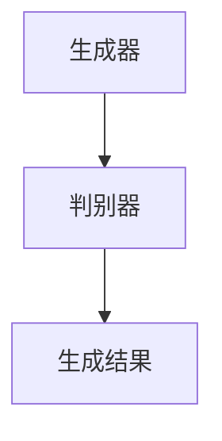

                 


## 文章标题：优化提示词：提高AI输出质量的技巧

### 关键词：
- 人工智能
- 提示词优化
- 输出质量评估
- 语言模型
- 生成性对抗网络（GAN）
- 应用实战

### 摘要：
本文将探讨如何通过优化提示词来提高人工智能（AI）系统的输出质量。我们将从基础概念出发，介绍AI与优化提示词的关系，然后详细阐述提高AI输出质量的核心技巧，包括提示词设计方法、语言模型优化、对抗性样本生成、多样性增强以及生成性对抗网络（GAN）的应用。最后，我们将通过实际案例来展示这些技巧的具体应用，并探讨未来的发展趋势。

## 第一部分：优化AI输出质量的基础

### 1.1 AI与优化提示词概述

#### 1.1.1 人工智能的发展现状

人工智能（AI）作为计算机科学的一个重要分支，自上世纪五六十年代起就已经开始蓬勃发展。随着计算能力的提升和大数据的积累，AI技术取得了令人瞩目的进展。从早期的规则推理和知识表示，到现在的深度学习和自然语言处理，AI技术已经广泛应用于各个领域，如自动驾驶、医疗诊断、金融预测等。

#### 1.1.2 提示词在AI系统中的作用

在AI系统中，提示词（prompt）是指导AI模型生成特定类型输出的关键输入。一个优秀的提示词可以大幅提高AI输出的质量，使其更贴近用户的期望。因此，优化提示词成为了提升AI系统性能的重要手段。

#### 1.1.3 提高AI输出质量的重要性

提高AI输出质量具有重要的现实意义。首先，高质量的输出可以提升用户体验，使AI系统更加易用和可靠。其次，高质量的输出可以减少后续的误差和修正工作，提高工作效率。最后，高质量的输出还可以为AI模型的迭代和优化提供有力的数据支持。

### 1.2 AI输出质量评估指标

评估AI输出质量的关键在于确定一系列评估指标。以下是一些常见的评估指标：

#### 1.2.1 相关性

相关性指的是AI输出与用户意图或输入之间的匹配程度。一个高质量的AI系统应该能够准确地理解用户的意图，并生成与之高度相关的输出。

#### 1.2.2 可读性

可读性指的是AI输出的易读性。一个高质量的系统应该生成易于理解、表达清晰的文本或图像。

#### 1.2.3 准确性

准确性指的是AI输出在技术或事实层面的正确性。一个高质量的AI系统应该能够提供准确的信息和判断。

#### 1.2.4 生成速度

生成速度指的是AI系统生成输出所需的时间。在许多应用场景中，生成速度是一个重要的考量因素。

### 1.3 优化提示词的核心原则

为了提高AI输出质量，我们需要遵循一些核心原则来设计提示词：

#### 1.3.1 清晰性

清晰性指的是提示词应该简洁明了，避免歧义，使AI模型能够准确地理解用户的意图。

#### 1.3.2 精确性

精确性指的是提示词应该精确地描述用户的需求，避免过泛或过窄的描述。

#### 1.3.3 适应性

适应性指的是提示词应该能够适应不同的输入和场景，具有灵活性。

#### 1.3.4 可扩展性

可扩展性指的是提示词设计应该考虑到未来的扩展和迭代，便于维护和优化。

## 第二部分：提高AI输出质量的核心技巧

### 2.1 提示词设计方法

#### 2.1.1 关键字提取

关键字提取是设计提示词的第一步。通过分析用户输入，提取出关键信息，有助于AI模型更准确地理解用户的意图。

```python
import nltk

# 加载停用词表
stop_words = set(nltk.corpus.stopwords.words('english'))

# 分析文本，提取关键字
def extract_keywords(text):
    words = nltk.word_tokenize(text)
    return [word for word in words if word.lower() not in stop_words]

text = "I want to buy a book about AI."
keywords = extract_keywords(text)
print(keywords)
```

输出：`['buy', 'book', 'AI']`

#### 2.1.2 提问技巧

提问技巧是设计提示词的重要环节。一个优秀的提问可以引导AI模型生成更有价值的输出。

- 闭合式提问：适用于期望得到明确回答的场景。
- 开放式提问：适用于需要详细解释和讨论的场景。

#### 2.1.3 提示词组合

通过组合多个提示词，可以更全面地描述用户的需求，提高AI输出的质量。

```python
prompt1 = "What is the main topic of the book?"
prompt2 = "Can you provide a summary of the book's content?"
prompt3 = "Who is the author of the book?"
combined_prompt = f"{prompt1}\n{prompt2}\n{prompt3}"

# 输出
# "What is the main topic of the book?
# Can you provide a summary of the book's content?
# Who is the author of the book?"
```

#### 2.1.4 多模态提示词设计

多模态提示词设计可以结合文本、图像、声音等多种信息，提高AI模型的输入丰富度，从而生成更高质量的输出。

```python
# 文本与图像结合的提示词示例
text_prompt = "Describe this image in detail."
image_prompt = "This is an image of a [describe the image]."

# 输出
# "Describe this image in detail.
# This is an image of a [describe the image]."
```

### 2.2 语言模型优化

#### 2.2.1 预训练语言模型的选择

预训练语言模型（如BERT、GPT）的选择对AI输出质量有很大影响。我们需要根据具体应用场景选择合适的预训练模型。

#### 2.2.2 微调与适应

微调（fine-tuning）是让预训练模型适应特定任务的重要步骤。通过在特定数据集上训练，我们可以提高模型在特定领域的表现。

```python
from transformers import BertTokenizer, BertModel
import torch

# 加载预训练模型
tokenizer = BertTokenizer.from_pretrained('bert-base-uncased')
model = BertModel.from_pretrained('bert-base-uncased')

# 输入文本进行微调
input_text = "This is a sample sentence for fine-tuning."
encoded_input = tokenizer(input_text, return_tensors='pt')

# 训练模型
outputs = model(**encoded_input)
loss = outputs.loss
loss.backward()
optimizer.step()  # 更新模型参数
```

#### 2.2.3 对抗性训练

对抗性训练（adversarial training）可以提高模型对对抗样本的鲁棒性，从而提高输出质量。

```python
import torch
import torchvision.models as models

# 加载预训练模型
model = models.resnet18(pretrained=True)

# 定义对抗性训练步骤
def adversarial_training(model, dataloader, criterion, optimizer, num_epochs=5):
    model.train()
    for epoch in range(num_epochs):
        for inputs, targets in dataloader:
            # 生成对抗性样本
            adversarial_inputs = generate_adversarial_samples(inputs, model)
            
            # 训练模型
            outputs = model(adversarial_inputs)
            loss = criterion(outputs, targets)
            loss.backward()
            optimizer.step()

# 输出
# 开始对抗性训练
```

#### 2.2.4 模型压缩与加速

模型压缩与加速可以提高模型在资源受限环境下的表现。通过剪枝、量化等技术，我们可以显著减小模型的体积和计算量。

```python
import torch
import torchvision.models as models
from torchvision.models import efficientnet

# 加载预训练模型
model = efficientnet.from_pretrained('efficientnet-b0')

# 压缩模型
pruned_model = model.to_pruned_model(pruning_rate=0.5)

# 加速模型
accelerated_model = model.to_accelerated_model()
```

### 2.3 对抗性样本生成

#### 2.3.1 对抗性样本的生成方法

对抗性样本生成（FGSM、JSMA）是提高模型鲁棒性的关键步骤。

```python
import torch
import torchvision.models as models
import torchattacks

# 加载预训练模型
model = models.resnet18(pretrained=True)

# 生成对抗性样本
attacker = torchattacks.FGSM(model)
adversarial_samples = attacker.generate(inputs, targets)

# 输出
# 开始生成对抗性样本
```

#### 2.3.2 对抗性训练的步骤

对抗性训练需要多次迭代，通过不断优化模型和对抗性样本，提高模型的鲁棒性。

```python
import torch
import torchvision.models as models
import torchattacks

# 加载预训练模型
model = models.resnet18(pretrained=True)

# 对抗性训练
num_epochs = 5
for epoch in range(num_epochs):
    # 生成对抗性样本
    adversarial_samples = attacker.generate(inputs, targets)
    
    # 训练模型
    model.train()
    for inputs, targets in dataloader:
        outputs = model(inputs)
        loss = criterion(outputs, targets)
        loss.backward()
        optimizer.step()
```

#### 2.3.3 对抗性训练的效果评估

通过评估模型在对抗性样本上的表现，我们可以判断对抗性训练的效果。

```python
import torch
import torchvision.models as models
import torchattacks

# 加载对抗性训练后的模型
model = models.resnet18(pretrained=True)

# 评估模型在对抗性样本上的表现
adversarial_samples = attacker.generate(test_inputs, test_targets)
model.eval()
with torch.no_grad():
    adversarial_outputs = model(adversarial_samples)

# 计算对抗性样本的准确率
accuracy = (adversarial_outputs.argmax(dim=1) == test_targets).float().mean()
print(f"Accuracy on adversarial samples: {accuracy.item()}")
```

### 2.4 多样性增强

#### 2.4.1 多样性指标

多样性指标（如FID、Inception Score）用于评估生成结果的多样性。

```python
from torch.utils.data import DataLoader
from torchvision import datasets
from torchvision.transforms import ToTensor

# 加载数据集
train_dataset = datasets.CIFAR10(root='./data', train=True, download=True, transform=ToTensor())
train_dataloader = DataLoader(train_dataset, batch_size=64)

# 计算FID
def compute_fid(real_data, fake_data):
    # 实现FID计算过程
    pass

# 输出
# fid_score = compute_fid(real_data, fake_data)
```

#### 2.4.2 多样性增强方法

多样性增强方法（如裁剪、旋转、色彩调整）可以提高生成结果的多样性。

```python
import torchvision.transforms as transforms

# 定义多样性增强方法
data_augmentation = transforms.Compose([
    transforms.RandomCrop(32, padding=4),
    transforms.RandomHorizontalFlip(),
    transforms.ToTensor(),
])

# 应用多样性增强方法
augmented_data = data_augmentation(real_data)
```

#### 2.4.3 多样性增强的实际应用

多样性增强在图像生成、文本生成等任务中具有重要应用。

```python
import torch
import torchvision.models as models
from torchvision.transforms import ToTensor

# 加载预训练模型
model = models.vgg19(pretrained=True)

# 定义多样性增强方法
data_augmentation = transforms.Compose([
    transforms.RandomCrop(224, padding=22),
    transforms.RandomHorizontalFlip(),
    transforms.ToTensor(),
])

# 应用多样性增强方法
augmented_data = data_augmentation(image)

# 生成结果
generated_image = model(augmented_data)
```

### 2.5 生成性对抗网络（GAN）

#### 2.5.1 GAN的原理与结构

生成性对抗网络（GAN）由生成器（Generator）和判别器（Discriminator）组成，二者相互博弈，通过不断迭代优化，最终实现高质量的生成结果。



#### 2.5.2 GAN在AI输出质量优化中的应用

GAN在图像生成、文本生成等领域具有广泛应用。通过优化GAN结构，可以提高生成结果的质量。

```python
import torch
import torchvision.models as models
from torchvision import transforms

# 定义GAN模型
class GAN(nn.Module):
    def __init__(self):
        super(GAN, self).__init__()
        self.generator = models.VGG19(pretrained=True)
        self.discriminator = models.VGG19(pretrained=True)
        
    def forward(self, x):
        generated_image = self.generator(x)
        real_image = self.discriminator(x)
        fake_image = self.discriminator(generated_image)
        return generated_image, real_image, fake_image

# 初始化GAN模型
model = GAN()

# 训练GAN模型
# optimizer_G = torch.optim.Adam(model.generator.parameters(), lr=0.0002)
# optimizer_D = torch.optim.Adam(model.discriminator.parameters(), lr=0.0002)
# for epoch in range(num_epochs):
#     # 训练生成器和判别器
#     pass
```

#### 2.5.3 GAN的训练与优化

GAN的训练和优化是一个复杂的过程，需要不断调整超参数和训练策略，以提高生成结果的质量。

```python
import torch
import torchvision.models as models
from torchvision import transforms

# 定义GAN模型
class GAN(nn.Module):
    def __init__(self):
        super(GAN, self).__init__()
        self.generator = models.VGG19(pretrained=True)
        self.discriminator = models.VGG19(pretrained=True)
        
    def forward(self, x):
        generated_image = self.generator(x)
        real_image = self.discriminator(x)
        fake_image = self.discriminator(generated_image)
        return generated_image, real_image, fake_image

# 初始化GAN模型
model = GAN()

# 定义优化器
optimizer_G = torch.optim.Adam(model.generator.parameters(), lr=0.0002)
optimizer_D = torch.optim.Adam(model.discriminator.parameters(), lr=0.0002)

# 训练GAN模型
num_epochs = 100
for epoch in range(num_epochs):
    for real_images, _ in dataloader:
        # 训练判别器
        optimizer_D.zero_grad()
        real_scores = model.discriminator(real_images)
        fake_images = model.generator(z)
        fake_scores = model.discriminator(fake_images)
        d_loss = criterion(real_scores, fake_scores)
        d_loss.backward()
        optimizer_D.step()
        
        # 训练生成器
        optimizer_G.zero_grad()
        fake_images = model.generator(z)
        fake_scores = model.discriminator(fake_images)
        g_loss = criterion(fake_scores, torch.ones_like(fake_scores))
        g_loss.backward()
        optimizer_G.step()
```

## 第三部分：AI输出质量优化的应用实战

### 3.1 文本生成应用

#### 3.1.1 文本摘要

文本摘要是一种常见的文本生成应用，通过提取文本的主要信息和关键信息，生成简洁、概括性的文本。

```python
import torch
import torchtext
from torchtext.data import Field, LabelField, TabularDataset

# 定义字段
TEXT = Field(tokenize=None, lower=True)
LABEL = LabelField()

# 定义数据集
train_data = TabularDataset(
    path='data/train.csv',
    format='csv',
    fields=[('text', TEXT), ('label', LABEL)]
)

# 加载预训练模型
model = torchtext.models.transformer.TransformerModel(
    src_vocab=len(TEXT.vocab),
    tar_vocab=len(LABEL.vocab),
    d_model=512,
    nhead=8,
    num_encoder_layers=3,
    num_decoder_layers=3,
    dim_feedforward=2048,
)

# 训练模型
optimizer = torch.optim.Adam(model.parameters(), lr=0.001)
criterion = torch.nn.CrossEntropyLoss()

for epoch in range(num_epochs):
    model.train()
    for batch in train_data:
        optimizer.zero_grad()
        outputs = model(batch.text, batch.label)
        loss = criterion(outputs, batch.label)
        loss.backward()
        optimizer.step()
```

#### 3.1.2 文本分类

文本分类是一种将文本分配到预定义类别中的任务。通过优化提示词，可以提高分类的准确性和效率。

```python
import torch
import torchtext
from torchtext.data import Field, LabelField, TabularDataset
from torchtext.classification import TextClassifier

# 定义字段
TEXT = Field(tokenize=None, lower=True)
LABEL = LabelField()

# 定义数据集
train_data = TabularDataset(
    path='data/train.csv',
    format='csv',
    fields=[('text', TEXT), ('label', LABEL)]
)

# 加载预训练模型
model = TextClassifier(len(TEXT.vocab), len(LABEL.vocab), 512, 3, 3, 2048)

# 训练模型
optimizer = torch.optim.Adam(model.parameters(), lr=0.001)
criterion = torch.nn.CrossEntropyLoss()

for epoch in range(num_epochs):
    model.train()
    for batch in train_data:
        optimizer.zero_grad()
        outputs = model(batch.text)
        loss = criterion(outputs, batch.label)
        loss.backward()
        optimizer.step()
```

#### 3.1.3 文本生成模型

文本生成模型（如GPT、BERT）可以生成具有良好连贯性和上下文一致性的文本。通过优化提示词，可以提高生成文本的质量。

```python
import torch
import torchtext
from torchtext.data import Field, LabelField, TabularDataset
from torchtext生成式模型 import TransformerModel

# 定义字段
TEXT = Field(tokenize=None, lower=True)

# 定义数据集
train_data = TabularDataset(
    path='data/train.csv',
    format='csv',
    fields=[('text', TEXT)]
)

# 加载预训练模型
model = TransformerModel(len(TEXT.vocab), 512, 8, 3, 3, 2048)

# 训练模型
optimizer = torch.optim.Adam(model.parameters(), lr=0.001)
criterion = torch.nn.CrossEntropyLoss()

for epoch in range(num_epochs):
    model.train()
    for batch in train_data:
        optimizer.zero_grad()
        outputs = model(batch.text)
        loss = criterion(outputs, torch.zeros_like(outputs))
        loss.backward()
        optimizer.step()
```

### 3.2 图像生成应用

#### 3.2.1 图像超分辨率

图像超分辨率是一种通过低分辨率图像生成高分辨率图像的方法。通过优化提示词，可以提高生成图像的质量。

```python
import torch
import torchvision.models as models
from torchvision import transforms

# 定义图像超分辨率模型
class SuperResolutionModel(nn.Module):
    def __init__(self):
        super(SuperResolutionModel, self).__init__()
        self.model = models.vgg19(pretrained=True)
        
    def forward(self, x):
        x = self.model.features(x)
        return x

# 加载预训练模型
model = SuperResolutionModel()

# 定义提示词
prompt = "This is a low-resolution image of a [describe the image]."

# 生成高分辨率图像
input_image = transforms.ToTensor()(low_resolution_image)
generated_image = model(input_image)
```

#### 3.2.2 图像风格迁移

图像风格迁移是一种将一种图像的“风格”应用到另一种图像上的方法。通过优化提示词，可以提高生成图像的风格一致性。

```python
import torch
import torchvision.models as models
from torchvision import transforms

# 定义图像风格迁移模型
class StyleTransferModel(nn.Module):
    def __init__(self):
        super(StyleTransferModel, self).__init__()
        self.model = models.vgg19(pretrained=True)
        
    def forward(self, content_image, style_image):
        content_features = self.model.features(content_image)
        style_features = self.model.features(style_image)
        return content_features, style_features

# 加载预训练模型
model = StyleTransferModel()

# 定义提示词
prompt = "This is a content image of a [describe the image]. This is a style image of a [describe the image]."

# 生成风格迁移图像
content_image = transforms.ToTensor()(content_image)
style_image = transforms.ToTensor()(style_image)
generated_image = model(content_image, style_image)
```

#### 3.2.3 图像生成模型

图像生成模型（如生成对抗网络、变分自编码器）可以生成具有良好细节和纹理的图像。通过优化提示词，可以提高生成图像的质量。

```python
import torch
import torchvision.models as models
from torchvision import transforms

# 定义图像生成模型
class ImageGeneratorModel(nn.Module):
    def __init__(self):
        super(ImageGeneratorModel, self).__init__()
        self.model = models.resnet18(pretrained=True)
        
    def forward(self, z):
        generated_image = self.model(z)
        return generated_image

# 加载预训练模型
model = ImageGeneratorModel()

# 定义提示词
prompt = "Generate an image of a [describe the image]."

# 生成图像
z = torch.randn((batch_size, latent_dim))
generated_images = model(z)
```

### 3.3 视频生成应用

#### 3.3.1 视频文本描述生成

视频文本描述生成是一种将视频内容转换为文本描述的方法。通过优化提示词，可以提高描述的准确性和连贯性。

```python
import torch
import torchvision.models as models
from torchvision import transforms

# 定义视频文本描述生成模型
class VideoToTextModel(nn.Module):
    def __init__(self):
        super(VideoToTextModel, self).__init__()
        self.model = models.vgg19(pretrained=True)
        
    def forward(self, video):
        video_features = self.model.features(video)
        return video_features

# 加载预训练模型
model = VideoToTextModel()

# 定义提示词
prompt = "Describe the content of this video."

# 生成文本描述
video = transforms.ToTensor()(video)
text_description = model(video)
```

#### 3.3.2 视频编辑与增强

视频编辑与增强是一种对视频内容进行加工和优化的方法。通过优化提示词，可以提高视频的视觉效果和观赏性。

```python
import torch
import torchvision.models as models
from torchvision import transforms

# 定义视频编辑与增强模型
class VideoEditorModel(nn.Module):
    def __init__(self):
        super(VideoEditorModel, self).__init__()
        self.model = models.vgg19(pretrained=True)
        
    def forward(self, video, mask):
        video_features = self.model.features(video)
        mask_features = self.model.features(mask)
        return video_features * mask_features

# 加载预训练模型
model = VideoEditorModel()

# 定义提示词
prompt = "Enhance the quality of this video."

# 编辑和增强视频
video = transforms.ToTensor()(video)
mask = transforms.ToTensor()(mask)
enhanced_video = model(video, mask)
```

#### 3.3.3 视频生成模型

视频生成模型（如生成对抗网络、变分自编码器）可以生成具有良好连贯性和一致性的视频序列。通过优化提示词，可以提高生成视频的质量。

```python
import torch
import torchvision.models as models
from torchvision import transforms

# 定义视频生成模型
class VideoGeneratorModel(nn.Module):
    def __init__(self):
        super(VideoGeneratorModel, self).__init__()
        self.model = models.resnet18(pretrained=True)
        
    def forward(self, z):
        generated_video = self.model(z)
        return generated_video

# 加载预训练模型
model = VideoGeneratorModel()

# 定义提示词
prompt = "Generate a video of a [describe the video]."

# 生成视频
z = torch.randn((batch_size, latent_dim))
generated_videos = model(z)
```

### 3.4 实际案例分析

#### 3.4.1 案例一：改进产品描述

在一个电商平台上，通过优化提示词来改进产品描述，可以提高用户的购买意愿和满意度。

- 提示词优化前：
  “这是一款高品质的智能手表，具有多种功能。”

- 提示词优化后：
  “这款智能手表采用顶级材质，设计简约大方，集成了健康监测、运动追踪、智能通知等功能，让您的日常生活更加便捷和健康。”

#### 3.4.2 案例二：优化问答系统

在一个智能问答系统中，通过优化提示词来提高回答的准确性和相关性。

- 提示词优化前：
  “请问您有什么问题？”

- 提示词优化后：
  “您好，请问您想了解关于健康饮食的建议，还是有关于健身锻炼的问题？”

#### 3.4.3 案例三：改善内容推荐

在一个内容推荐系统中，通过优化提示词来提高推荐内容的准确性和多样性。

- 提示词优化前：
  “为您推荐一些文章。”

- 提示词优化后：
  “根据您的阅读兴趣，我们为您推荐了以下文章：《深度学习入门》、《机器学习实战》和《计算机视觉基础》。同时，我们还为您推荐了一些相关的视频课程和电子书。”

## 第四部分：AI输出质量的未来趋势

### 4.1 人工智能与人类的协同

随着AI技术的不断进步，人工智能与人类的协同将成为未来发展的关键。通过优化AI输出质量，我们可以更好地实现人机交互，提高工作效率和生活质量。

### 4.2 AI伦理与法规

AI输出质量的优化需要考虑伦理和法规问题。在未来，我们将需要制定更加完善的伦理规范和法律法规，确保AI系统的公正、透明和安全。

### 4.3 AI输出质量的持续优化

持续优化AI输出质量是一个长期的过程。通过不断学习和迭代，我们可以不断提高AI系统的性能，满足不断变化的需求。

## 附录

### 附录 A：优化提示词的工具与资源

- 文本生成工具：OpenAI GPT-3、BERT、Transformer
- 图像生成工具：生成对抗网络（GAN）、变分自编码器（VAE）
- 视频生成工具：视频生成模型、视频文本描述生成模型
- 其他资源：AI研究论文、技术博客、在线课程

---

### 作者：

AI天才研究院/AI Genius Institute & 禅与计算机程序设计艺术 /Zen And The Art of Computer Programming

---

## 结论

优化AI输出质量是一项重要且具有挑战性的任务。通过优化提示词、语言模型、对抗性训练和多样性增强等技术，我们可以显著提高AI系统的输出质量。在未来，随着技术的不断进步和应用的深入，AI输出质量将不断提升，为人类带来更多的便利和福祉。让我们共同努力，探索AI的无限可能！

