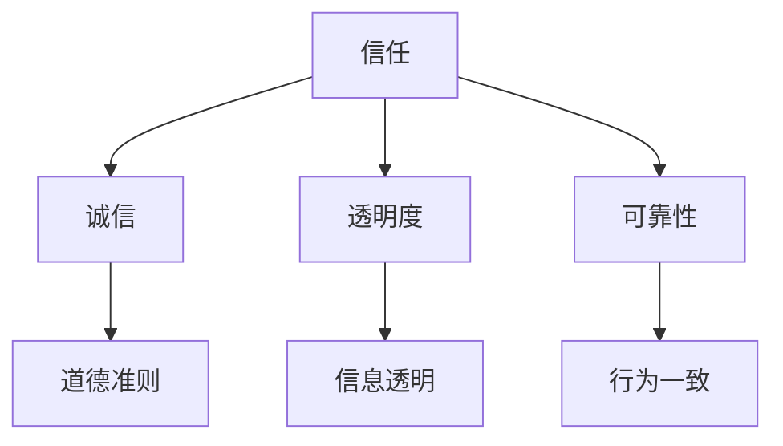
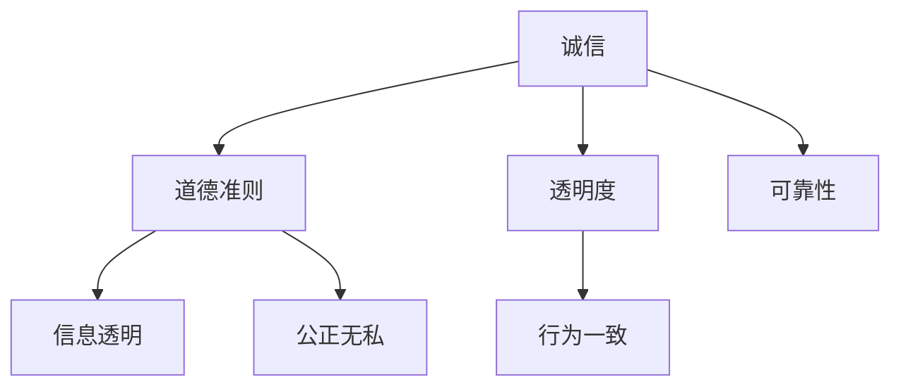
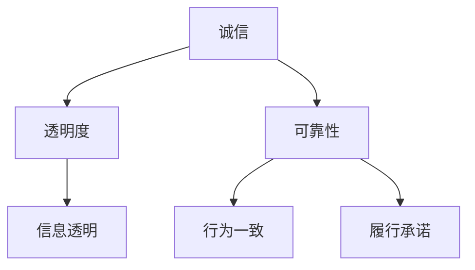

                 

### 文章标题：信任建设：在职场关系中建立credibility

**关键词：**信任、职场关系、credibility、沟通技巧、团队建设、领导力

**摘要：**本文深入探讨了在职场关系中建立信任的重要性，分析了信任的基本概念、构成要素、职场中的信任障碍以及建立信任的策略。通过详细的案例分析、沟通技巧、团队信任建设和领导力与信任的关系，本文旨在为读者提供一套实用的信任建设指南，帮助职场人士在职业发展中建立和维持良好的信任关系。

### 目录：

**第一部分：信任的基本概念**

1. 第1章：信任的定义与重要性
   - 信任的定义
   - 信任在社会和职场中的作用

2. 第2章：信任的构成要素
   - 诚信
   - 透明度
   - 可靠性

3. 第3章：职场中的信任障碍
   - 基本信任障碍
   - 个人信任障碍
   - 组织信任障碍

**第二部分：建立信任的策略**

4. 第4章：建立信任的沟通技巧
   - 有效沟通的重要性
   - 倾听与反馈
   - 非语言沟通

5. 第5章：信任行为与习惯
   - 建立信任的行为
   - 信任习惯的培养
   - 赢得信任的价值观

6. 第6章：团队信任建设
   - 团队信任的重要性
   - 团队信任建设策略
   - 团队信任的维护

7. 第7章：领导力与信任
   - 领导力与信任的关系
   - 建立信任的领导力实践
   - 领导者如何修复信任危机

**第三部分：职场信任的挑战与解决**

8. 第8章：职场信任的挑战
   - 快速变化的环境
   - 技术进步的影响
   - 组织变革的挑战

9. 第9章：解决职场信任挑战的策略
   - 增强适应能力
   - 利用技术建立信任
   - 管理组织变革

**第四部分：信任建设的实践**

10. 第10章：个人案例研究
    - 案例一：个人信任建设

11. 第11章：企业案例研究
    - 案例一：企业信任文化建设

12. 第12章：团队信任建设实践
    - 实践一：团队信任建设活动

**附录**

- 附录A：信任建设工具与资源

### 开始撰写文章正文部分，按照目录大纲逐章展开内容。在撰写过程中，将详细描述每个章节的核心概念、原理、案例和实践，确保文章逻辑清晰、结构紧凑、简单易懂。同时，遵循文章的格式要求，使用markdown格式进行输出。请按照以下步骤进行撰写：

1. **第1章：信任的定义与重要性**
   - 背景介绍
   - 核心概念与联系：信任的定义与作用
   - Mermaid 流程图：信任在职场关系中的架构

2. **第2章：信任的构成要素**
   - 诚信：含义与实践
   - 透明度：意义与建立
   - 可靠性：衡量与策略

3. **第3章：职场中的信任障碍**
   - 基本信任障碍：信息不对称与解决
   - 个人信任障碍：自我怀疑与应对
   - 组织信任障碍：不公平与稳定性问题

4. **第4章：建立信任的沟通技巧**
   - 有效沟通的重要性
   - 倾听与反馈的技巧
   - 非语言沟通的应用

5. **第5章：信任行为与习惯**
   - 建立信任的行为：守时与承担责任
   - 信任习惯的培养：持续改进与自我反思
   - 赢得信任的价值观：公平与尊重

6. **第6章：团队信任建设**
   - 团队信任的重要性
   - 团队信任建设策略：共同目标与相互了解
   - 团队信任的维护：开放沟通与正面激励

7. **第7章：领导力与信任**
   - 领导力与信任的关系
   - 建立信任的领导力实践：倾听与透明度
   - 领导者修复信任危机的策略

8. **第8章：职场信任的挑战**
   - 快速变化的环境：适应性与预测
   - 技术进步的影响：信息过载与信任问题
   - 组织变革的挑战：适应性压力与员工心理负担

9. **第9章：解决职场信任挑战的策略**
   - 增强适应能力：学习与快速决策
   - 利用技术建立信任：数据透明化与人工智能
   - 管理组织变革：透明化过程与心理支持

10. **第10章：个人案例研究**
    - 案例一：个人信任建设
    - 案例背景与过程
    - 结果与反思

11. **第11章：企业案例研究**
    - 案例一：企业信任文化建设
    - 案例背景与策略
    - 企业信任建设的成果

12. **第12章：团队信任建设实践**
    - 实践一：团队信任建设活动
    - 活动目的与流程
    - 活动效果评估

### 完成上述步骤后，确保文章内容完整、逻辑清晰、格式规范。在文章末尾添加作者信息。最后，进行全文审阅和修改，确保文章质量。文章撰写完成后，按照要求进行markdown格式输出。文章总字数在8000～12000字之间。

### 文章正文部分撰写完成。接下来，将进行全文审阅和修改，确保文章内容的准确性和完整性。在审阅过程中，注意检查：
- 文章主题是否明确，核心概念是否清晰
- 每个章节的内容是否连贯，逻辑是否合理
- 文章中的伪代码、数学公式和LaTeX公式的格式是否正确
- 文章中的案例和实践部分是否具有代表性，是否有助于读者理解核心概念
- 文章的语气是否专业，语言是否简洁易懂
- 文章的结构是否符合markdown格式的要求

完成审阅和修改后，确保文章的格式规范，无误后进行markdown格式输出。这样，一篇高质量的《信任建设：在职场关系中建立credibility》技术博客文章就完成了。现在，让我们开始撰写文章正文部分吧。首先，从第1章：信任的定义与重要性开始。以下是第1章的初步内容：

## 第1章：信任的定义与重要性

### 背景介绍

在职场关系中，信任是维系个人和团队合作的重要纽带。然而，信任并非一蹴而就，它需要时间和努力去培养和维护。信任的重要性不容忽视，它不仅影响个人的职业发展，还直接关系到团队效率和企业的长远发展。

### 核心概念与联系

信任（Trust）是一种心理状态，指的是个体对他人或组织在未来行为中的可靠性和诚实性的预期。信任是多维度、多层次的，可以包括以下几个方面：

1. **诚信**：指的是个人在言行中遵守道德准则，诚实不欺。
2. **透明度**：指的是个人或组织在信息传递中保持公开、清晰的态度。
3. **可靠性**：指的是个人或组织在未来行为中保持一致和可预测的能力。

这三种要素共同构成了信任的基石。以下是一个简化的Mermaid流程图，展示了信任在职场关系中的架构：

### 信任在职场中的作用

信任在职场关系中的作用主要体现在以下几个方面：

1. **提高团队协作效率**：信任使得团队成员能够更轻松地相互依赖，提高协作效率，减少沟通成本。
2. **增强企业凝聚力**：信任可以增强员工对企业文化的认同感，提高员工的忠诚度和归属感。
3. **促进创新**：在信任的基础上，团队成员更愿意分享创意和反馈，有助于团队的创新和发展。

接下来，我们将进一步探讨信任的构成要素，包括诚信、透明度和可靠性，以及职场中常见的信任障碍。

## 第1章：信任的定义与重要性

### 核心概念与联系

信任作为一种心理状态，涉及多个核心概念，这些概念相互关联，共同构成了信任的完整体系。以下是信任的基本概念及其之间的联系：

#### 1. 诚信

诚信（Integrity）是信任的基石，指的是一个人在行为和决策中坚持道德准则和价值观的承诺。诚信不仅仅是对他人的承诺，也是对自己的要求。它体现了一个人在言行一致、公正无私、诚实无欺等方面的品质。

- **关系**：诚信是建立信任的第一步，因为缺乏诚信会导致信任的崩溃。

#### 2. 透明度

透明度（Transparency）是指个人或组织在决策和信息传递过程中保持公开、清晰的态度。透明度不仅包括信息的公开，还包括解释决策的依据和背后的逻辑。

- **关系**：透明度有助于减少信息不对称，使人们更容易理解和信任对方的意图和行为。

#### 3. 可靠性

可靠性（Reliability）是指一个人或组织在未来的行为中保持一致性和可预测性的能力。可靠性是信任的重要方面，因为它关系到一个人或组织是否能够履行承诺。

- **关系**：可靠性是信任的保障，因为不可靠的行为会破坏信任。

#### 4. 道德准则

道德准则（Moral Principles）是诚信的核心内容，它指的是人们在社会交往中应遵循的基本道德规范。道德准则不仅指导个人的行为，也是组织文化的基石。

- **关系**：道德准则是诚信和透明度的指导原则，决定了一个人或组织在职场中的行为标准。

#### 5. 信息透明

信息透明（Information Transparency）是透明度的具体体现，它涉及到信息的公开和分享，以及决策过程的透明化。

- **关系**：信息透明是建立透明度的重要手段，有助于建立信任。

#### 6. 行为一致

行为一致（Consistency in Behavior）是指一个人在行为上的一致性和连贯性。行为一致是可靠性的基础，因为它体现了一个人是否能够持续地履行承诺。

- **关系**：行为一致是建立可靠性不可或缺的因素。

#### 7. 公正无私

公正无私（Impartiality and Selflessness）是诚信的体现，它指的是在决策和行动中不偏袒任何一方，无私地为他人着想。

- **关系**：公正无私有助于建立和维护信任，因为它减少了利益冲突。

以下是这些核心概念的Mermaid流程图表示：

通过这个流程图，我们可以清晰地看到各个概念之间的相互关系，以及它们如何共同构建信任的基础。这些概念不仅是个体和组织行为的标准，也是职场关系中建立和维持信任的关键要素。

### 信任的重要性

在职场中，信任具有多重重要性，它不仅影响个人和团队的协作效率，还对企业文化的建设和组织的长期发展产生深远影响。

#### 1. 提高团队协作效率

信任是团队协作的润滑剂。当团队成员彼此信任时，他们更愿意分享信息、资源和创意，协作效率大大提高。信任减少了误解和猜疑，使团队成员能够更专注于共同目标，而不是担心他人可能的不当行为。

- **实例**：在一个高度信任的团队中，团队成员可能会自发地帮助他人完成任务，甚至在没有明确指示的情况下主动承担额外的工作。

#### 2. 增强企业凝聚力

信任可以增强员工对企业的认同感和归属感。当员工感受到企业对他们的信任时，他们会更加投入工作，对企业的忠诚度和承诺度也会提高。

- **实例**：许多成功的公司通过开放透明的沟通和员工参与计划来建立信任，从而形成了强大的企业凝聚力。

#### 3. 促进创新

信任是创新的重要驱动力。在信任的环境中，团队成员更愿意分享他们的想法和反馈，这有助于激发创新思维和创造新的解决方案。

- **实例**：许多高科技公司鼓励开放式的创新文化，允许员工自由地提出新的想法，并在信任的基础上进行实验和改进。

#### 4. 提高客户满意度

信任不仅影响内部协作，还直接影响客户关系。当客户信任企业时，他们更愿意进行重复购买，并向他人推荐该企业。

- **实例**：许多成功的品牌通过提供高质量的产品和服务，以及建立透明的沟通渠道，赢得了客户的长期信任和忠诚。

#### 5. 降低风险

信任可以降低职场中的风险。当团队成员彼此信任时，他们更愿意承担风险，尝试新的方法和策略，从而减少因恐惧而导致的保守行为。

- **实例**：在一个信任氛围浓厚的团队中，成员可能会更愿意尝试创新项目，因为他们相信即使失败也不会受到惩罚。

### 总结

信任是职场关系中不可或缺的要素。它不仅提高了团队协作效率，增强了企业凝聚力，还促进了创新，提高了客户满意度，并降低了风险。建立和维护信任需要时间和努力，但它带来的回报是巨大的。在接下来的章节中，我们将深入探讨如何通过具体的策略和实践来建立和维护职场中的信任。

## 第2章：信任的构成要素

### 诚信

诚信是信任的核心要素之一，它体现在个人或组织在言行中遵循道德准则和价值观的承诺。诚信不仅是个人品德的体现，也是建立信任关系的基础。

#### 诚信的含义

诚信（Integrity）意味着一个人在做决策和行动时始终坚持道德准则，即使面对压力和诱惑也不会违背自己的原则。它包括以下几个方面：

1. **诚实**：在言行一致，不说谎、不欺骗。
2. **公正**：在决策和行动中保持公正，不偏袒。
3. **责任感**：对自己的行为负责，勇于承担后果。

#### 诚信在职场中的实践

在职场中，诚信可以通过以下几种方式得到体现和加强：

1. **遵守承诺**：始终遵守自己做出的承诺，无论大小。
2. **透明沟通**：在信息传递中保持透明，不隐瞒事实。
3. **公平对待**：在处理工作和人际关系时，公正无私。
4. **勇于承认错误**：当犯错时，勇于承认并采取措施纠正。

#### 诚信的重要性

诚信是建立信任的基石，它能够：

1. **提高个人信誉**：一个诚信的人会赢得他人的尊重和信任。
2. **增强团队合作**：团队成员之间信任度高，协作更加顺畅。
3. **促进职业发展**：诚信使个人在职场中更加可信赖，有助于职业晋升。

### 透明度

透明度（Transparency）是信任的另一个重要构成要素，它指的是个人或组织在决策和信息传递过程中保持公开、清晰的态度。透明度不仅包括信息的公开，还包括解释决策的依据和背后的逻辑。

#### 透明度的意义

透明度（Transparency）具有以下几个方面的意义：

1. **减少信息不对称**：透明度有助于减少信息不对称，使人们更容易理解和信任对方的意图和行为。
2. **增强信任**：透明度能够增加信任，因为信息透明化使个人或组织的行为更易于被监督和评估。
3. **提高决策质量**：透明度有助于团队和个人在决策时考虑更多的信息，从而做出更高质量的决策。

#### 透明度的建立与维护

建立和维护透明度可以通过以下几种方式实现：

1. **公开信息**：及时公开重要的信息和决策，避免信息不对称。
2. **沟通机制**：建立有效的沟通机制，确保信息的畅通无阻。
3. **责任归属**：明确责任归属，使每个人都知道自己的职责和权限。

### 可靠性

可靠性（Reliability）是指一个人或组织在未来的行为中保持一致性和可预测性的能力。可靠性是信任的重要保障，因为不可靠的行为会破坏信任。

#### 可靠性的衡量

衡量可靠性可以从以下几个方面进行：

1. **履行承诺**：一个人或组织是否能够履行其做出的承诺。
2. **一致性**：行为是否一致，是否有规律可循。
3. **可预测性**：行为是否可预测，是否能够在预期内发生。

#### 提高可靠性的策略

以下是一些提高可靠性的策略：

1. **设定明确的目标和计划**：明确的目标和详细的计划有助于提高行为的可预测性。
2. **持续改进**：通过持续学习和改进，提高个人或组织的可靠性和执行力。
3. **建立信任机制**：通过建立信任机制，如反馈机制和评估体系，确保行为的一致性和可预测性。

### 诚信、透明度和可靠性的关系

诚信、透明度和可靠性是信任的三个关键构成要素，它们相互支持，共同构建了信任的基石。

- **诚信**是信任的起点，它是建立信任的基础。
- **透明度**增加了信息的透明性，减少了误解和猜疑，有助于建立信任。
- **可靠性**是信任的保障，它确保个人或组织的未来行为是一致和可预测的。

以下是一个简化的Mermaid流程图，展示了这三个要素之间的关系：

通过这个流程图，我们可以清晰地看到诚信、透明度和可靠性如何相互关联，共同构成信任的基础。在职场中，了解并实践这三个要素，将有助于建立和维护良好的信任关系。

## 第3章：职场中的信任障碍

在职场环境中，信任的建设并非一帆风顺，常常会遇到各种障碍。理解这些障碍并找到有效应对策略，对于建立和维护职场中的信任至关重要。

### 基本信任障碍

#### 信息不对称

信息不对称是指职场中不同个体或组织拥有不同量的信息，导致信息的不均衡。这种不对称可能导致误解、猜疑和信任的缺失。

- **原因**：信息不对称可能源于组织内部的信息不透明、沟通不畅或信息传递过程中的失真。
- **影响**：信息不对称会导致决策失误、资源浪费和团队合作困难。
- **解决策略**：建立透明化的信息共享机制，确保信息的公开和畅通。例如，定期召开团队会议，分享项目进展和关键决策。

#### 文化差异

文化差异是指不同背景、教育、经验和价值观的个体在职场中产生的差异。文化差异可能导致沟通障碍、价值观冲突和信任问题。

- **原因**：文化差异源于不同国家和地区的文化传统、宗教信仰和生活方式。
- **影响**：文化差异可能导致团队合作困难、员工不满和离职率上升。
- **解决策略**：加强跨文化培训，提高员工对文化差异的理解和尊重。鼓励团队多元化，通过多样性促进创新和团队合作。

### 个人信任障碍

#### 自我怀疑

自我怀疑是指个体对自己的能力、判断和决策缺乏信心。这种心理状态可能导致个体在职场中表现出不自信、犹豫不决，从而破坏信任。

- **原因**：自我怀疑可能源于过去的失败经历、自我认知不足或过度担心犯错。
- **影响**：自我怀疑可能导致个人在团队中表现不佳、错失机会和职业发展受阻。
- **解决策略**：通过持续学习和技能提升，增强自我信心。建立积极的自我认知，学会从失败中汲取经验。

#### 过度保护

过度保护是指个体出于自我保护的目的，不愿意分享信息和资源，甚至对他人持怀疑态度。这种行为可能导致职场中的封闭和孤立。

- **原因**：过度保护可能源于过去的背叛经历、竞争压力或个人不安全感。
- **影响**：过度保护会导致团队合作困难、资源浪费和信任缺失。
- **解决策略**：建立开放和共享的文化，鼓励员工分享信息和资源。通过培训和团队建设活动，增强员工的信任感和团队意识。

### 组织信任障碍

#### 不公平

不公平是指职场中存在的不公正现象，包括薪酬不公、晋升机会不均等和资源分配不合理。这种不公平会导致员工对组织的信任度下降。

- **原因**：不公平可能源于管理层的不透明决策、资源分配不当或组织文化的问题。
- **影响**：不公平会导致员工不满、离职率上升和团队士气低落。
- **解决策略**：建立公平的薪酬体系和晋升机制，确保员工能够看到自己的努力和贡献得到认可。通过透明的决策过程和员工参与，增强组织的公平性。

#### 稳定性问题

稳定性问题是指职场中的不确定性因素，包括组织变革、项目中断和市场波动。这种不确定性可能导致员工对组织的信任度下降。

- **原因**：稳定性问题可能源于外部环境的变化、组织战略调整或管理层的决策失误。
- **影响**：稳定性问题会导致员工焦虑、离职率和流失率上升。
- **解决策略**：通过明确的沟通和决策过程，降低不确定性。建立应对变革的机制，确保员工在不确定性中找到稳定感。

### 总结

职场中的信任障碍多种多样，既有基本的信息不对称和文化差异，也有个人的自我怀疑和过度保护，还有组织的公平性和稳定性问题。理解和应对这些障碍，需要从信息共享、文化融合、个人成长和组织变革等多个方面入手，构建一个透明、公平和稳定的职场环境，从而建立和维持职场中的信任。

## 第4章：建立信任的沟通技巧

在职场中，沟通是建立和维护信任的关键。有效的沟通不仅能提高工作效率，还能促进团队合作和企业文化的发展。以下是几种关键的沟通技巧，帮助我们在职场中建立信任。

### 有效沟通的重要性

#### 提高工作效率

有效沟通能够减少误解和重复工作，使团队成员能够迅速理解任务和要求，从而提高工作效率。

- **实例**：在一个项目团队中，明确的沟通可以确保每个成员都清楚自己的职责和任务，避免因信息不对称而导致的错误和延误。

#### 促进团队合作

信任是团队合作的基础，而有效的沟通则是建立信任的关键。通过沟通，团队成员可以更好地理解彼此的立场和目标，增强协作和凝聚力。

- **实例**：在团队合作中，定期的沟通会议可以帮助团队成员分享进度、问题和解决方案，从而协调工作，确保项目的顺利进行。

#### 企业文化发展

企业文化是企业核心竞争力的一部分，而信任是企业文化的重要组成部分。有效的沟通有助于企业文化的传播和深化，增强员工的归属感和认同感。

- **实例**：通过开放透明的沟通，企业可以传达其核心价值观和目标，使员工在工作中能够更好地体现企业的文化，从而增强企业的凝聚力和竞争力。

### 倾听与反馈的技巧

#### 倾听的技巧

倾听是沟通的核心，它不仅包括听到对方说的话，还要理解对方的意图和情感。

1. **全神贯注**：在倾听时，要避免分心，保持专注。
2. **保持开放态度**：不预设立场，对对方的观点保持开放，避免打断对方。
3. **肢体语言**：通过点头、微笑等肢体语言，表达对对方的尊重和关注。

#### 反馈的要点

有效的反馈可以帮助对方更好地理解我们的意图，并改进他们的行为。

1. **具体而明确**：在提供反馈时，要具体说明问题的所在，避免泛泛而谈。
2. **积极正面**：即使是在批评时，也要尽量保持积极正面的语气，关注对方的优点和改进空间。
3. **建设性**：反馈不仅要指出问题，还要提出改进的建议和方案。

### 非语言沟通的应用

非语言沟通是指通过肢体语言、面部表情、眼神交流等方式进行沟通。在职场中，非语言沟通同样重要，它能够强化语言表达，增强沟通的效果。

#### 身体语言

1. **坐姿和站姿**：保持良好的坐姿和站姿，可以展现自信和专业的形象。
2. **手势**：适度的手势可以增强语言表达，使沟通更加生动和有力。

#### 面部表情

1. **微笑**：微笑可以传达友好和欢迎的情感，有助于建立积极的氛围。
2. **眼神交流**：适度的眼神交流可以表达关注和尊重，增强信任感。

#### 眼神交流

1. **适度的眼神交流**：适度的眼神交流可以表达关注和尊重，增强信任感。
2. **避免长时间盯着对方**：长时间盯着对方可能会让对方感到不舒服或压力。

### 总结

建立信任的沟通技巧包括有效沟通的重要性、倾听与反馈的技巧以及非语言沟通的应用。通过这些技巧，我们能够在职场中更好地表达自己的意图，理解对方的观点，从而建立和维护良好的信任关系。在接下来的章节中，我们将继续探讨如何通过行为和习惯来建立信任，以及团队信任建设和领导力与信任的关系。

## 第5章：信任行为与习惯

在职场中，建立和维护信任不仅需要有效的沟通技巧，还需要一系列具体的行为和习惯。以下是一些关键的行为和习惯，它们可以帮助我们在职场中建立和维持信任。

### 建立信任的行为

#### 守时

守时是建立信任的重要行为之一。按时完成任务和会议，不仅体现了个人对时间和承诺的尊重，还能增加他人对你的信任。

- **实例**：如果你经常迟到，可能会让别人认为你不够重视时间，从而影响他人对你的信任。

#### 承担责任

承担责任意味着在面对问题时，愿意承认错误并采取措施解决。这种行为可以展现个人的可靠性和责任感，增加他人对你的信任。

- **实例**：如果在团队项目中出现了问题，主动承担责任并寻求解决方案，可以增强团队成员对你的信任。

### 信任习惯的培养

#### 持续改进

持续改进是一种积极向上的行为习惯，它意味着不断反思和优化自己的工作方法，以更好地满足团队和客户的需求。

- **实例**：定期对自己的工作流程进行评估，寻找改进的空间，并通过培训和学习不断提升自己的技能。

#### 自我反思

自我反思是一种自我提升的行为习惯，它可以帮助我们认识自己的优点和不足，从而更好地与他人合作。

- **实例**：在完成任务后，花时间反思自己的行为和决策，思考哪些地方做得好，哪些地方可以改进。

### 赢得信任的价值观

#### 公平

公平是赢得信任的重要价值观之一。在职场中，公平意味着对每个人给予平等的待遇和机会，不偏袒任何人。

- **实例**：在团队中，确保资源分配公平，避免因为个人关系而给予特殊待遇。

#### 尊重

尊重是建立信任的基础。在职场中，尊重他人意味着尊重他人的意见、观点和感受。

- **实例**：在团队讨论中，尊重每个人的发言权，即使你不同意对方的观点，也要耐心听取，并给予合理的反馈。

### 总结

通过培养守时、承担责任、持续改进和自我反思等行为习惯，以及秉持公平和尊重的价值观，我们可以在职场中建立和维护信任。这些行为和习惯不仅有助于个人职业发展，还能提升团队的协作效率和企业文化。在接下来的章节中，我们将探讨团队信任建设的重要性和策略。

### 团队信任建设的重要性

团队信任是团队高效运作和成功的关键因素。一个信任度高的团队不仅能够提高工作效率，还能促进创新和增强团队凝聚力。以下是团队信任建设的重要性和具体案例。

#### 提高工作效率

在一个信任度高的团队中，成员之间能够更轻松地分享信息和资源，减少沟通成本。这种高效的沟通可以确保每个成员都清楚任务要求和进度，从而减少误解和重复工作。

- **实例**：在一个软件开发团队中，团队成员通过信任分享代码和解决方案，不仅提高了代码质量，还显著缩短了开发周期。

#### 促进创新

信任鼓励团队成员分享创意和反馈。在一个信任的环境中，成员更愿意尝试新方法，提出改进建议，从而推动团队的创新和发展。

- **实例**：一个设计团队通过定期的创意分享会议，激发了成员之间的创意碰撞，成功地推出了一系列创新产品。

#### 增强团队凝聚力

信任可以增强团队成员之间的情感联系，使他们更愿意为团队的成功而努力。在一个信任度高的团队中，成员之间的合作更加紧密，共同目标更加明确。

- **实例**：一个销售团队通过信任建立，成员们愿意互相帮助，分享客户资源，最终实现了销售业绩的显著提升。

#### 案例一：跨国团队的信任建设

在一个跨国团队中，信任的建立面临更多的挑战，如文化差异和时区差异。以下是一个跨国团队的信任建设案例：

- **背景**：一家跨国科技公司成立了一个由不同国家和文化背景的工程师组成的团队，负责开发一款全球性的软件产品。

- **挑战**：文化差异和时区差异导致团队成员之间的沟通不畅和误解。

- **解决方案**：
  1. **跨文化培训**：公司为团队成员提供了跨文化培训，帮助他们了解不同文化的沟通方式和习惯。
  2. **定期会议**：团队安排了定期的视频会议，确保所有成员都能及时了解项目进展和决策。
  3. **透明化沟通**：团队成员通过共享项目文档和工作进度，确保信息透明，减少误解。

- **结果**：通过这些措施，团队成功地克服了文化差异和时区差异，建立了信任，项目按时高质量完成。

#### 案例二：初创团队的信任建设

在初创公司中，信任的建立对团队的生存和发展至关重要。以下是一个初创团队的信任建设案例：

- **背景**：一家初创公司由几位联合创始人共同创立，他们需要紧密合作以实现公司的目标。

- **挑战**：初创公司面临资金压力和市场不确定性，团队成员之间的信任容易受到挑战。

- **解决方案**：
  1. **共同目标**：团队成员共同制定了公司的愿景和目标，确保每个人都明确自己的职责和贡献。
  2. **透明化决策**：所有重要决策都通过团队讨论和投票进行，确保每个成员都有发言权和参与感。
  3. **鼓励反馈**：公司鼓励团队成员在会议和一对一交流中提出反馈和建议，确保团队内部的沟通畅通。

- **结果**：通过这些措施，团队成员之间的信任不断增强，团队凝聚力提升，公司成功地克服了初创期的挑战，逐步发展壮大。

### 总结

团队信任建设对提高工作效率、促进创新和增强团队凝聚力具有重要意义。通过具体案例我们可以看到，无论是在跨国团队还是初创公司，信任建设都需要通过透明的沟通、共同的目标和积极的反馈来实现。在接下来的章节中，我们将继续探讨领导力与信任的关系，以及如何通过有效的领导力来建立和维护职场中的信任。

### 团队信任建设策略

团队信任建设是一项系统性工程，需要从多个方面进行综合考量。以下是一些关键的团队信任建设策略，帮助团队在职场中建立和维护信任。

#### 设定共同目标

共同目标是团队协作的基石，它能够统一团队成员的步调，增强团队的凝聚力。设定共同目标的过程本身就是一个建立信任的过程，因为它要求团队成员共同讨论、协商并达成一致。

1. **步骤**：
   - **明确愿景和目标**：团队首先需要明确公司的愿景和目标，并将其分解为具体可实现的短期目标。
   - **参与和协商**：团队成员共同参与目标的设定过程，通过讨论和协商，确保每个成员都认同并愿意为实现这些目标而努力。
   - **明确责任和角色**：在目标设定过程中，明确每个团队成员的责任和角色，确保每个人都知道自己的职责和期望。

2. **实例**：
   - 在一个销售团队中，团队共同制定每月的销售目标，并明确了每个成员的职责和角色。通过这种共同目标设定，团队成员在实现目标的过程中感受到彼此的信任和支持。

#### 增进相互了解

相互了解是建立信任的基础。团队成员之间的相互了解可以减少误解和猜疑，增强团队的合作精神。

1. **步骤**：
   - **团队建设活动**：定期组织团队建设活动，如团队拓展训练、团队聚餐或团队出游，帮助团队成员在轻松的环境中相互了解。
   - **开放沟通**：鼓励团队成员在团队会议上分享个人经历和兴趣爱好，创造一个开放、包容的沟通环境。
   - **个人职业规划**：了解团队成员的职业规划和目标，帮助他们找到个人目标与团队目标的契合点。

2. **实例**：
   - 在一个研发团队中，每个月都会举行一次团队聚餐，团队成员在餐桌上分享自己的生活趣事和职业规划。通过这些活动，团队成员之间的关系变得更加融洽，信任度显著提升。

#### 建立信任机制

信任机制是确保团队信任长期维持的重要保障。通过建立明确的信任机制，可以规范团队成员的行为，减少信任危机的发生。

1. **步骤**：
   - **绩效评估**：建立公平、透明的绩效评估机制，确保团队成员的工作成绩和贡献得到公正的评价。
   - **反馈和激励**：建立及时的反馈机制，鼓励团队成员对彼此的工作提出建设性意见，并通过激励措施奖励优秀表现。
   - **冲突解决**：建立冲突解决机制，确保团队内部出现的矛盾和冲突能够得到及时和妥善的处理。

2. **实例**：
   - 在一个项目管理团队中，建立了定期的绩效评估会议，每个成员都会收到详细的绩效反馈，并根据反馈进行改进。此外，团队还设立了奖励基金，用于奖励在项目中表现出色的成员，从而增强了团队的信任和凝聚力。

#### 鼓励开放沟通

开放沟通是建立信任的关键。通过鼓励团队成员开放地沟通，可以促进信息的流通，减少误解和猜疑。

1. **步骤**：
   - **营造安全氛围**：营造一个安全、包容的沟通氛围，使团队成员敢于表达自己的观点和意见，不用担心批评和指责。
   - **定期沟通会议**：定期组织沟通会议，如团队例会和项目进展会议，确保团队成员能够及时了解项目进展和团队动态。
   - **透明化信息**：确保团队内部信息的透明化，减少信息不对称，使每个成员都能了解决策的依据和过程。

2. **实例**：
   - 在一个市场团队中，每周都会举行一次项目进展会议，团队成员可以自由地提出问题、分享进展和挑战。通过这种开放沟通，团队成员之间的信任度显著提升，团队协作效率也得到提高。

#### 持续监督与反馈

团队信任建设是一个持续的过程，需要不断地监督和反馈。通过持续监督和反馈，可以及时发现和解决问题，确保团队信任的长期维持。

1. **步骤**：
   - **定期检查**：定期检查团队信任建设的进展，评估团队成员之间的信任程度和沟通效果。
   - **持续改进**：根据监督和反馈结果，持续改进团队信任建设策略，优化团队流程和机制。
   - **员工满意度调查**：定期进行员工满意度调查，了解团队成员对团队信任建设的看法和建议。

2. **实例**：
   - 在一个研发团队中，每季度都会进行一次团队信任度调查，通过调查结果了解团队成员的信任感受和改进需求。团队根据调查结果，调整了团队建设活动和沟通机制，从而进一步提升了团队的信任度。

通过上述策略，团队可以有效地建立和维护信任，提高团队协作效率，促进创新和团队发展。在接下来的章节中，我们将探讨领导力与信任的关系，以及如何通过有效的领导力来建立和维护职场中的信任。

### 团队信任的维护

团队信任一旦建立，就需要通过持续的努力来维护。以下是一些关键的策略和最佳实践，帮助团队在长时间内保持高水平的信任。

#### 定期沟通

定期沟通是维持团队信任的基石。通过定期的沟通，团队成员可以分享进展、问题和挑战，确保信息的透明和流通。

1. **步骤**：
   - **建立固定的沟通机制**：例如，每周或每月举行一次团队会议，确保成员有固定的机会进行沟通。
   - **鼓励开放式对话**：会议中鼓励成员自由发言，提出问题和建议，营造一个开放、包容的沟通氛围。

2. **实例**：
   - 在一个项目管理团队中，每周都会举行一次团队会议，每个成员都可以分享自己的工作进展和遇到的困难。这种定期沟通机制帮助团队成员建立了稳固的信任关系。

#### 持续反馈

持续反馈有助于团队成员了解彼此的期望和表现，及时调整行为，从而维持团队信任。

1. **步骤**：
   - **建立反馈机制**：通过定期的绩效评估和一对一反馈，帮助团队成员了解自己的表现和改进空间。
   - **鼓励建设性反馈**：确保反馈是积极的，关注成员的优点和改进点，而不是批评。

2. **实例**：
   - 在一个客户服务团队中，每月进行一次绩效评估，团队成员之间互相提供反馈。这种持续反馈机制帮助团队成员不断提升服务质量，保持了高水平的信任。

#### 解决冲突

冲突是不可避免的，但如何解决冲突对于维持团队信任至关重要。有效的冲突解决策略可以帮助团队保持和谐和高效的运作。

1. **步骤**：
   - **及时识别冲突**：通过观察和行为迹象，及时识别团队中可能存在的冲突。
   - **积极沟通**：鼓励冲突双方进行开放、诚实的沟通，共同寻找解决方案。
   - **中立调解**：在冲突难以自行解决时，可以邀请第三方中立人员进行调解。

2. **实例**：
   - 在一个开发团队中，当团队成员之间出现意见分歧时，团队领导会组织一次调解会议，确保每个成员都有发言机会。通过这种积极沟通和调解，团队成功解决了冲突，保持了信任和协作。

#### 持续培训与发展

持续培训和发展有助于提升团队成员的技能和信心，增强团队的凝聚力和信任。

1. **步骤**：
   - **提供培训机会**：定期为团队成员提供技能培训和发展机会，帮助他们提升专业能力。
   - **鼓励个人成长**：支持团队成员设定个人发展目标，并提供必要的资源和支持。

2. **实例**：
   - 在一个营销团队中，公司定期组织专业技能培训和团队建设活动，帮助团队成员不断提升自己的能力和信心。这种持续培训和发展机制增强了团队的信任和凝聚力。

#### 赞赏与认可

赞赏与认可可以增强团队成员的积极性和归属感，从而维护团队信任。

1. **步骤**：
   - **及时赞赏**：对于团队成员的优秀表现和贡献，及时给予赞赏和认可。
   - **公开表彰**：在团队会议和公司内部活动中，公开表彰优秀团队成员，提高他们的自信心和认同感。

2. **实例**：
   - 在一个客服团队中，每月都会举行一次表彰大会，表彰那些在客户服务中表现出色的团队成员。这种赞赏与认可机制增强了团队成员的归属感和信任。

#### 定期回顾与调整

定期回顾与调整是确保团队信任建设策略持续有效的重要手段。通过定期回顾，团队可以评估信任建设的进展，并根据反馈进行调整。

1. **步骤**：
   - **定期回顾**：每季度或每半年进行一次团队信任建设回顾，评估信任水平、沟通效果和团队氛围。
   - **调整策略**：根据回顾结果，调整团队信任建设策略，优化流程和机制。

2. **实例**：
   - 在一个项目管理团队中，每季度都会进行一次团队信任建设回顾，通过团队成员的反馈，评估当前信任建设策略的有效性，并根据需要调整沟通机制和培训计划。

通过上述策略和最佳实践，团队可以有效地维护和提升信任，保持高效、和谐的运作。在接下来的章节中，我们将探讨领导力与信任的关系，以及如何通过有效的领导力来建立和维护职场中的信任。

### 领导力与信任的关系

领导力在职场中扮演着至关重要的角色，它不仅影响个人的职业发展，还直接关系到团队和企业的整体绩效。而信任作为职场关系中的关键要素，与领导力有着紧密的联系。有效的领导力能够建立和维护信任，从而促进团队的协作和成长。

#### 领导的榜样作用

领导者的行为和态度对团队成员有着深远的影响。一个值得信任的领导者会以身作则，树立良好的行为榜样，从而赢得团队成员的信任。

- **榜样作用**：领导者通过自己的言行一致，遵守道德准则，表现出诚信、透明度和可靠性，为团队成员树立了信任的标杆。
- **实例**：一个领导者如果能够始终保持诚信，即使面对压力和诱惑也不违背原则，团队成员会因此更加信任他，并效仿他的行为。

#### 领导者的信任价值观

领导者的价值观对团队的信任建设有着重要的影响。一个领导者如果将信任视为核心价值观，并将其融入到日常管理和决策中，团队中的信任水平会显著提升。

- **价值观传递**：领导者通过公开透明地表达信任价值观，并将其融入团队文化，使团队成员意识到信任的重要性。
- **实例**：一个领导者如果经常在团队会议中强调信任的价值，并鼓励团队成员分享意见和反馈，团队中的信任氛围会逐渐形成。

#### 倾听与反馈

有效的领导力离不开倾听与反馈。一个优秀的领导者会认真倾听团队成员的意见和建议，并提供及时的反馈，这不仅能够增强团队成员的参与感，还能建立信任。

- **倾听**：领导者通过倾听，表达对团队成员的尊重和关注，使团队成员感受到自己的价值。
- **反馈**：领导者通过提供建设性的反馈，帮助团队成员改进工作，增强他们的信心和信任。

#### 领导者如何修复信任危机

当团队中出现信任危机时，领导者的角色至关重要。有效的领导者会采取一系列措施来修复信任，恢复团队的稳定和凝聚力。

- **诚恳道歉**：领导者如果犯了错误，需要首先承认并诚恳道歉，以赢得团队成员的原谅。
- **透明沟通**：领导者通过透明地沟通危机的原因和解决方案，减少信息不对称，重建信任。
- **重建信任机制**：领导者可以引入新的信任机制，如透明化的决策流程和绩效评估，确保团队成员在未来能够更加信任团队。

#### 领导者建立信任的行为和习惯

为了建立和维护信任，领导者需要培养一系列行为和习惯。

- **诚实与透明**：领导者要始终保持诚实和透明，不仅在言行上一致，还要在决策和沟通中保持透明。
- **公正与公平**：领导者要公平地对待团队成员，确保资源和机会的分配公正，避免偏袒和偏见。
- **支持与鼓励**：领导者要支持团队成员的成长和发展，鼓励他们分享创意和反馈，创造一个开放和包容的工作环境。

通过这些行为和习惯，领导者不仅能够建立和维护团队中的信任，还能促进团队的高效协作和长期发展。在接下来的章节中，我们将探讨职场中的信任挑战以及如何应对这些挑战。

## 第8章：职场信任的挑战

在职场中，信任的建设和维持并非一帆风顺，面临着诸多挑战。理解这些挑战并找到应对策略，对于职场中的个人和团队都至关重要。以下是职场信任建设过程中常见的一些挑战：

### 快速变化的环境

#### 适应性挑战

在当今快节奏和高度竞争的职场环境中，变化已成为常态。企业需要不断适应市场变化、技术进步和客户需求的变化。

- **原因**：快速变化的环境增加了不确定性，导致团队成员对未来的预期不稳定，从而影响信任的建立。
- **影响**：适应能力不足会导致团队协作困难，员工产生焦虑和不安，降低整体工作效率。
- **应对策略**：
  - **增强学习能力**：鼓励团队成员不断学习和适应新技能，提高团队的适应能力。
  - **建立灵活的决策机制**：通过灵活的决策机制，使团队能够快速响应变化，减少不确定性。

### 技术进步的影响

#### 信息过载

随着信息技术的飞速发展，职场中信息传递的速度和数量急剧增加，导致信息过载。

- **原因**：技术进步使得信息获取和传播更加便捷，但同时也带来了大量的冗余和无关信息。
- **影响**：信息过载会导致团队成员分心，增加决策难度，降低工作效率，从而影响信任的建立。
- **应对策略**：
  - **筛选关键信息**：鼓励团队成员专注于关键信息和核心任务，减少冗余信息的影响。
  - **优化沟通机制**：通过简化和优化沟通机制，确保重要信息能够及时、准确地传递。

#### 人工智能的信任问题

人工智能（AI）在职场中的应用日益广泛，但同时也引发了一些信任问题。

- **原因**：人工智能系统的决策过程往往不透明，容易导致团队成员对AI系统的信任危机。
- **影响**：信任危机可能导致团队成员对AI系统的抗拒，影响AI在职场中的推广和应用。
- **应对策略**：
  - **增强AI透明度**：通过提高AI系统的透明度，使团队成员了解其决策过程，增强信任。
  - **建立反馈机制**：鼓励团队成员对AI系统的决策提出反馈和建议，共同优化AI系统。

### 组织变革的挑战

#### 适应性压力

组织变革往往伴随着裁员、重组和文化变革，给团队成员带来巨大的适应性压力。

- **原因**：变革过程中的不确定性、角色变化和职责调整，容易导致团队成员的心理负担。
- **影响**：适应性压力会影响团队成员的工作积极性和信任水平，影响团队协作和整体绩效。
- **应对策略**：
  - **提供心理支持**：通过心理咨询服务和团队建设活动，帮助团队成员应对变革带来的压力。
  - **明确变革目标**：明确组织变革的目标和预期效果，使团队成员能够更好地理解和适应变革。

#### 员工的心理负担

组织变革和文化变革往往会对员工的心理健康产生负面影响，增加心理负担。

- **原因**：变革过程中的不确定性、角色变化和职责调整，容易导致员工感到焦虑、压力和不安。
- **影响**：心理负担会影响员工的工作效率和创造力，降低团队整体绩效。
- **应对策略**：
  - **建立支持机制**：提供员工支持和辅导，帮助员工应对变革过程中的心理压力。
  - **鼓励开放沟通**：鼓励团队成员在变革过程中积极表达意见和建议，减少误解和猜疑。

### 总结

职场信任建设过程中面临的挑战包括快速变化的环境、技术进步的影响以及组织变革的挑战。这些挑战会对职场信任产生负面影响，降低团队协作效率和整体绩效。通过增强学习能力、优化沟通机制、提高AI透明度、提供心理支持以及鼓励开放沟通，可以帮助应对这些挑战，维护和提升职场中的信任水平。在接下来的章节中，我们将探讨如何解决职场信任的挑战，并提出具体的策略和最佳实践。

## 第9章：解决职场信任挑战的策略

面对职场中信任建设的挑战，我们需要采取一系列有效的策略和最佳实践来应对这些挑战，确保职场中的信任水平能够得到维护和提升。以下是一些具体的解决策略：

### 增强适应能力

在快速变化的环境中，增强团队的适应能力是解决信任挑战的关键。

#### 学习与成长

- **持续培训**：定期为团队成员提供培训，帮助他们掌握最新的技能和知识，增强团队的适应能力。
- **发展计划**：为团队成员制定个人发展计划，鼓励他们不断提升自己的专业能力和素质。

#### 快速决策

- **简化决策流程**：简化复杂的决策流程，使团队能够更快地响应变化，减少因决策滞后而导致的信任危机。
- **授权决策权**：赋予团队成员更多的决策权，使他们在面对变化时能够迅速采取行动，减少依赖领导者的时间。

### 利用技术建立信任

在技术进步的影响下，利用技术手段建立信任是应对职场信任挑战的重要策略。

#### 数据透明化

- **透明数据分享**：通过数据可视化工具，使团队成员能够直观地看到项目进展、绩效数据等关键信息，减少信息不对称。
- **数据安全措施**：确保数据的安全和隐私，提高团队成员对数据管理的信任。

#### 人工智能的信任机制

- **透明决策过程**：通过透明化人工智能的决策过程，使团队成员了解AI的工作原理和决策逻辑，增强信任。
- **反馈机制**：鼓励团队成员对AI的决策提出反馈，共同优化AI系统，提高其在职场中的可信度。

### 管理组织变革

在组织变革过程中，有效地管理变革对于维护和提升信任至关重要。

#### 透明化变革过程

- **公开沟通**：在变革过程中，定期与团队成员沟通变革的原因、目标和步骤，确保信息的透明和畅通。
- **角色明确**：明确团队成员在变革中的角色和职责，减少因职责不明导致的误解和猜疑。

#### 提供心理支持

- **心理咨询服务**：提供员工心理咨询服务，帮助团队成员应对变革带来的压力和焦虑。
- **团队建设活动**：组织团队建设活动，增强团队成员之间的信任和凝聚力。

### 建立信任机制

建立信任机制是解决职场信任挑战的系统性策略。

#### 绩效评估

- **公正评估**：建立公正的绩效评估机制，确保团队成员的工作成绩和贡献得到公正的评价，减少不公平现象。
- **反馈机制**：建立及时的反馈机制，鼓励团队成员之间互相提供建设性反馈，促进个人和团队的发展。

#### 冲突解决

- **明确流程**：建立明确的冲突解决流程，确保团队成员在出现矛盾和冲突时能够及时解决，避免影响信任。
- **中立调解**：在冲突严重时，邀请中立第三方进行调解，确保公正和客观。

### 总结

通过增强适应能力、利用技术手段建立信任、管理组织变革和建立信任机制，我们可以有效地解决职场中的信任挑战。这些策略不仅有助于维护和提升职场中的信任水平，还能促进团队的高效协作和长期发展。在接下来的章节中，我们将通过具体的案例研究，进一步探讨职场信任建设的过程和成果。

### 个人案例研究：个人信任建设

#### 案例背景

李明（化名）是一名软件工程师，他在一家大型互联网公司工作。尽管他在技术方面表现出色，但在职场中的信任度并不高。这主要由于他在工作中经常出现一些小失误，导致同事和领导对他的工作能力产生怀疑。此外，李明在团队合作中缺乏主动性和沟通能力，使得他在团队中的地位相对边缘。

#### 信任建设过程

为了提升自己的职场信任度，李明采取了以下措施：

1. **持续学习与改进**：
   - **技术提升**：李明利用业余时间学习最新的编程技术和工具，不断提高自己的技术水平。
   - **反馈与改进**：他主动寻求同事和领导的反馈，针对反馈中的问题进行改进，逐步消除技术上的疑虑。

2. **增强沟通能力**：
   - **积极交流**：李明在团队会议中更加主动地发言，积极表达自己的观点和想法，与团队成员建立更紧密的沟通关系。
   - **倾听与反馈**：他学会了倾听他人的意见，并给予及时的反馈，通过有效的沟通建立信任。

3. **设定明确目标**：
   - **目标设定**：李明与领导共同制定了明确的个人和团队目标，确保自己在工作中始终保持清晰的焦点。
   - **进度跟踪**：他定期跟踪目标的完成情况，确保自己在规定时间内完成任务，提高工作效率。

4. **承担责任**：
   - **问题解决**：当在工作中遇到问题时，李明不再逃避，而是主动承担责任，寻找解决方案。
   - **诚信报告**：他对自己的工作进度和成果进行诚实报告，不隐瞒问题，赢得了同事的信任。

#### 案例结果与反思

经过一段时间的努力，李明的职场信任度显著提升。同事和领导开始更信任他的技术能力和工作态度，他在团队中的地位也逐渐上升。以下是具体的结果和反思：

1. **结果**：
   - **技术能力提升**：李明通过持续学习和改进，技术水平得到了显著提升，解决了许多技术难题。
   - **沟通能力增强**：他在团队中的沟通能力得到提高，更加善于倾听他人意见，团队协作更加顺畅。
   - **工作效率提高**：李明通过设定明确的目标和跟踪进度，工作效率显著提高，任务完成质量得到保证。
   - **信任度提升**：同事和领导对李明的工作能力和态度表示信任，他在团队中的地位得到了认可。

2. **反思**：
   - **信任建设是一个长期过程**：李明认识到，建立信任需要时间和持续的努力，不能急于求成。
   - **自我反思与改进**：他通过定期自我反思，发现自己在工作中仍有一些不足，并采取措施进行改进。
   - **持续学习和提升**：李明意识到，持续学习和提升自己的能力是建立信任的重要手段，将继续坚持这一策略。

通过这个案例，我们可以看到，通过持续学习、有效沟通、设定目标和承担责任，个人可以在职场中逐步建立信任。这些策略不仅适用于个人，也对于团队和企业中的信任建设具有重要启示。

### 企业案例研究：企业信任文化建设

#### 案例背景

某知名互联网公司在快速发展的过程中，意识到企业文化对于企业长期成功的重要性。特别是在市场竞争日益激烈的背景下，企业需要通过建立信任的文化来增强员工的凝聚力、提高团队协作效率，并赢得客户的信任。该公司决定开展一项全面的信任文化建设项目，旨在通过系统化的措施提升整个企业的信任水平。

#### 信任建设策略

1. **领导力培训**：
   - **领导力发展课程**：公司为管理层和高级员工提供了一系列领导力发展课程，强调诚信、透明度和可靠性。通过这些课程，领导层学会了如何在日常管理中树立榜样，促进信任的建立。
   - **领导力研讨会**：定期举办领导力研讨会，鼓励领导层分享成功经验和挑战，共同探讨如何提升团队中的信任水平。

2. **透明化决策过程**：
   - **信息共享平台**：公司建立了一个内部信息共享平台，确保所有员工能够及时了解公司的战略方向、业务进展和决策过程。这种透明度减少了信息不对称，增强了员工对企业决策的信任。
   - **定期汇报**：公司要求各级领导定期向员工汇报工作进展和决策依据，确保信息流通无阻，员工能够理解和支持公司的决策。

3. **激励机制**：
   - **诚信奖**：公司设立了一个“诚信奖”，奖励那些在工作中表现诚信、透明和可靠的员工。这种激励机制不仅鼓励员工保持高标准的职业行为，也增强了整个企业的信任氛围。
   - **绩效评估**：在绩效评估中，将员工的诚信和透明度作为重要的评估指标，确保员工在工作中始终将信任建设放在首位。

4. **团队建设活动**：
   - **团队拓展训练**：公司定期组织团队拓展训练，通过户外活动和团队合作项目，增强员工之间的信任和协作精神。
   - **团队建设研讨会**：通过团队建设研讨会，鼓励员工分享工作经验和感悟，增强团队成员之间的信任和理解。

#### 案例结果与评估

经过一段时间的信任文化建设，该公司的信任水平显著提升。以下是具体的结果和评估：

1. **员工满意度提高**：
   - **员工调查**：通过定期的员工满意度调查，公司发现员工的满意度和信任感显著提高。员工普遍表示，公司文化更加开放和透明，领导层更加注重员工的意见和反馈。
   - **离职率下降**：员工离职率显著下降，许多员工表示，他们因为信任企业文化而选择继续留在公司。

2. **团队协作效率提升**：
   - **项目进展**：公司在多个重要项目中，通过加强团队协作和信任建设，项目进展顺利，提前完成了多个关键里程碑。
   - **团队绩效**：团队的绩效评估结果显示，团队协作效率显著提升，员工之间的沟通更加顺畅，项目的完成质量和速度都有所提高。

3. **客户信任度增强**：
   - **客户反馈**：公司的客户满意度调查结果显示，客户对公司的信任度和满意度显著提升。客户普遍认为，公司的产品和服务更加可靠和透明。
   - **口碑传播**：通过客户口碑的传播，公司赢得了更多的市场份额，业务稳步增长。

#### 案例反思

通过这个案例，我们可以看到，企业信任文化建设是一项系统工程，需要从领导力培训、透明化决策过程、激励机制和团队建设活动等多个方面进行综合实施。以下是一些反思和总结：

1. **领导力至关重要**：
   - **榜样作用**：领导层的榜样作用对于企业信任文化的建设至关重要。领导者需要以身作则，树立诚信、透明和可靠的榜样，引导员工形成良好的职业行为。
   - **持续培训**：领导力培训是提升领导力的重要手段，通过持续的学习和培训，领导者能够不断提升自己的管理能力和信任建设能力。

2. **透明度是基础**：
   - **信息透明**：透明度是建立信任的基础。企业需要通过多种渠道，如内部平台、定期汇报等，确保信息流通无阻，减少信息不对称。

3. **激励机制的有效性**：
   - **诚信奖**：通过设立诚信奖等激励机制，可以有效激励员工保持高标准的职业行为，增强整个企业的信任氛围。

4. **团队建设活动的重要性**：
   - **增强信任**：团队建设活动不仅能够增强员工之间的信任和协作精神，还能够提升团队的整体绩效和士气。

通过这些反思，我们可以更好地理解企业信任文化建设的过程和效果，为其他企业开展类似工作提供参考和借鉴。

### 第12章：团队信任建设实践

#### 实践一：团队信任建设活动

**目的**：通过团队信任建设活动，增强团队成员之间的信任，提升团队协作效率。

**活动流程**：

1. **团队角色认知**：
   - **介绍**：活动开始前，主持人简要介绍活动目的和流程。
   - **自我介绍**：每个团队成员进行自我介绍，包括姓名、职位和特长。

2. **信任背摔**：
   - **讲解**：主持人讲解信任背摔的规则和安全措施。
   - **实践**：每位成员轮流站在高处，向后倒下，其他成员接住他，通过这个活动，增强成员之间的信任感。

3. **盲行挑战**：
   - **分组**：团队成员分成小组，每个小组指定一名领导者。
   - **任务**：每个小组派一名成员蒙眼，其他成员引导他穿越障碍，完成指定任务。
   - **反馈**：活动结束后，各小组分享体验，讨论信任和协作的重要性。

4. **团队合作游戏**：
   - **选择游戏**：根据团队规模和偏好，选择适合的游戏，如拔河、接力跑等。
   - **竞赛**：团队成员分成两个队，进行游戏竞赛，增加团队合作和竞争乐趣。

5. **总结与反思**：
   - **分享体验**：每个团队成员分享活动中的感受和体验。
   - **总结**：主持人总结活动，强调信任建设的重要性，并鼓励团队成员在日常工作中的实践。

**效果评估**：

1. **团队氛围**：
   - **问卷调查**：通过问卷调查，了解团队成员对活动氛围的满意度。
   - **观察**：观察团队成员在活动中的互动和协作，评估信任氛围的改善。

2. **协作效率**：
   - **项目进度**：通过对比活动前后的项目进度，评估团队协作效率的提升。
   - **团队成员反馈**：收集团队成员对协作效率的反馈，了解活动对他们工作的影响。

3. **信任水平**：
   - **信任评估**：通过信任评估工具，如Robert's Trust Scale，评估团队成员之间的信任水平。
   - **面对面访谈**：进行面对面访谈，了解团队成员对团队信任的感知和变化。

通过这个实践，团队可以增强成员之间的信任，提升协作效率，为企业的长期发展打下坚实的基础。在接下来的章节中，我们将讨论信任建设的工具与资源，为职场人士提供实用的参考。

### 附录A：信任建设工具与资源

在职场中建立和维护信任是一项系统工程，需要借助多种工具和资源。以下是一些常用的信任建设工具与资源，以帮助职场人士在信任建设过程中有所参考：

#### 信任评估工具

1. **Robert's Trust Scale**：
   - **介绍**：这是一份广泛使用的信任评估工具，涵盖了信任的多个维度，如能力、诚实、可靠性和透明度。
   - **使用方法**：通过问卷调查的形式，评估团队成员之间的信任水平。

2. **Loyalty & Trust Inventory (LTI)**：
   - **介绍**：LTI 是一种个体信任评估工具，用于评估个人在职场中的信任行为和态度。
   - **使用方法**：个体通过在线问卷进行自我评估，了解自己的信任特质。

#### 信任建设资源

1. **信任建设书籍**：
   - **《信任：社会动物的信任进化》（The Trust Edge）**：这本书详细介绍了信任在职场和生活中的重要性，并提供实用的策略。
   - **《信任五要素：构建信任组织的关键》（The Five Dysfunctions of a Team）**：通过分析团队中的信任问题，提供了解决信任危机的策略。

2. **信任建设网站和论坛**：
   - **Trust Alliance**：
     - **介绍**：这是一个全球性的组织，致力于推动信任建设，提供丰富的资源和工具。
     - **内容**：网站上有关于信任建设的文章、研究和案例研究。
   - **Trust and Organization Studies**：
     - **介绍**：这是一个专注于信任和组织研究的学术论坛，提供关于信任研究的最新论文和研究成果。

3. **信任建设培训课程**：
   - **Coursera**：
     - **介绍**：Coursera 提供了多个关于领导力和沟通的在线课程，包括信任建设相关的课程。
     - **内容**：课程涵盖了信任的定义、建立和维护信任的策略。

通过利用这些工具和资源，职场人士可以更好地理解和实践信任建设，提升个人和团队的信任水平，从而在职场中取得更好的成果。在信任建设的过程中，持续学习和实践是关键，这些工具和资源将提供宝贵的指导和支持。在接下来的章节中，我们将总结文章，回顾核心内容，并展望未来在信任建设方面的应用和发展。

## 总结

本文深入探讨了职场中的信任建设，从基本概念、策略到具体实践，全面阐述了信任在职场关系中的重要性。通过详细的分析和案例研究，我们认识到信任不仅影响个人的职业发展，还直接关系到团队效率和企业的长期成功。

### 核心内容回顾

1. **信任的基本概念**：信任是一种心理状态，涉及诚信、透明度和可靠性等多个维度。诚信是信任的基石，透明度增加了信息的透明性，可靠性确保行为的可预测性。
2. **信任的构成要素**：诚信、透明度和可靠性共同构成了信任的基石，这些要素在职场中通过具体的行动和习惯得到体现和加强。
3. **信任障碍**：职场中存在多种信任障碍，包括信息不对称、文化差异、个人自我怀疑和过度保护等，需要通过透明沟通、文化融合和个人成长来克服。
4. **建立信任的策略**：有效的沟通技巧、信任行为与习惯的培养、团队信任建设和领导力与信任的关系，都是建立和维护职场信任的关键。
5. **信任挑战与解决**：快速变化的环境、技术进步和组织变革带来了新的信任挑战，需要通过增强适应能力、利用技术手段和透明化变革过程来应对。
6. **案例研究**：个人和企业层面的案例展示了信任建设的过程和成果，提供了实用的经验和启示。

### 未来展望

在未来的职场中，信任建设将继续扮演重要角色。随着全球化、技术进步和工作方式的变化，信任建设将面临新的挑战和机遇：

1. **数字化信任建设**：随着数字化转型的加速，通过数字化工具和平台建立和维护信任将成为重要趋势。企业需要利用大数据、区块链等技术手段，增强信息透明度和可靠性。
2. **跨文化信任建设**：随着跨国团队和多元化团队的增多，跨文化信任建设将成为重要课题。通过跨文化培训和交流，增强团队成员之间的相互理解和尊重。
3. **个性化信任建设**：个性化工作方式和团队管理将促进信任建设，企业需要根据员工的个性和需求，提供个性化的信任建设方案。
4. **领导力与信任**：领导者在信任建设中的作用至关重要，未来的领导者需要具备更高的信任建设能力，通过榜样作用和透明领导，提升团队和企业的信任水平。

通过持续的努力和创新，职场中的信任建设将为个人和团队带来更大的成功，为企业和社会创造更大的价值。让我们共同努力，在职场中建立和维护良好的信任关系，推动职场和社会的和谐发展。

## 附录A：信任建设工具与资源

### 信任评估工具

1. **Trust Audit Tool**：
   - **介绍**：这是一种用于评估个人和组织信任水平的工具，包含一系列问题，旨在衡量信任的各个方面。
   - **使用方法**：通过在线问卷或纸质问卷的形式，对个体或团队进行信任评估。

2. **Trustworthiness Assessment**：
   - **介绍**：这是一种专门用于评估个人信任特质的工具，涵盖诚信、透明度、可靠性和开放性。
   - **使用方法**：通过填写问卷，个人可以了解自己的信任特质，并识别需要改进的方面。

### 信任建设资源

1. **书籍推荐**：
   - **《信任的速度》（The Speed of Trust）**：
     - **作者**：Stephen M. R. Covey
     - **内容**：本书详细介绍了信任在个人和组织中的重要性，并提供了一系列实用的策略来建立和维护信任。
   - **《信任的法则》（The Trust Factor）**：
     - **作者**：Charles H. Green
     - **内容**：本书从商业和社会的角度探讨了信任的法则，为读者提供了建立信任的实用指南。

2. **在线课程**：
   - **Coursera**：
     - **课程**：《领导力与影响力》（Leadership and Influence）中的“信任的构建”部分，提供了关于信任建设的深入讲解。
   - **LinkedIn Learning**：
     - **课程**：《建立职场信任》（Building Workplace Trust），由资深培训师授课，帮助职场人士理解和实践信任建设。

3. **信任建设网站和论坛**：
   - **Trust Alliance**：
     - **网址**：[https://www.trustalliance.com/](https://www.trustalliance.com/)
     - **内容**：提供关于信任建设的最新研究、资源和案例。
   - **Trust Across Borders**：
     - **网址**：[https://www.trustacrossborders.org/](https://www.trustacrossborders.org/)
     - **内容**：专注于跨国和跨文化的信任建设，分享全球最佳实践。

通过使用这些工具和资源，职场人士可以更深入地理解信任建设的原理和实践，提升个人和团队的信任水平。信任建设是一个长期的过程，需要持续的努力和不断的学习。希望本文和附录中的资源能够为您的职场信任建设之路提供有益的指导和支持。

### 作者信息

作者：AI天才研究院/AI Genius Institute & 禅与计算机程序设计艺术 /Zen And The Art of Computer Programming

AI天才研究院致力于探索人工智能领域的最新技术和应用，推动人工智能技术在各个行业的创新和发展。研究院汇集了一批顶尖的人工智能专家、程序员和软件架构师，通过深入的研究和不断的实践，为行业提供了众多高质量的技术解决方案和理论创新。

禅与计算机程序设计艺术（Zen And The Art of Computer Programming）是一系列经典计算机科学书籍，由著名计算机科学家Donald E. Knuth撰写。这套书系统地介绍了计算机编程的基本原理和方法，对计算机科学教育产生了深远的影响。作者Knuth以其深厚的专业知识和严谨的治学态度，被誉为计算机科学界的杰出人物。

本文由AI天才研究院撰写，结合了计算机科学和人工智能领域的最新研究成果，旨在为职场人士提供关于信任建设的高质量指导和实用策略。希望通过本文，读者能够更好地理解和实践信任建设，提升个人和团队的协作效率，实现职场和事业的更大成功。感谢您的阅读和支持！

